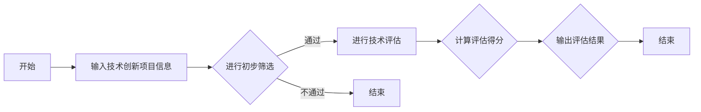
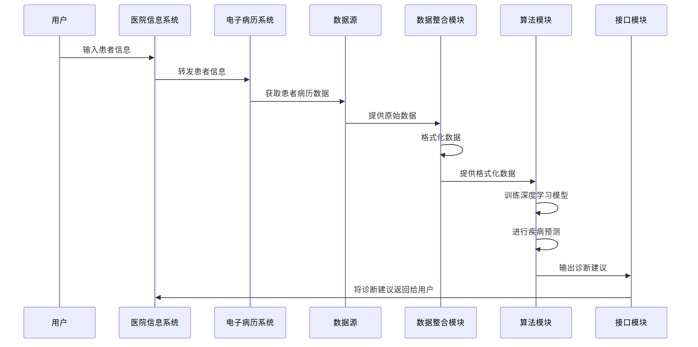
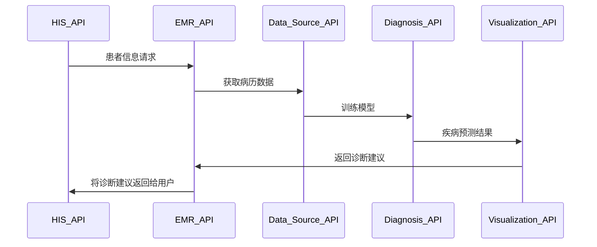
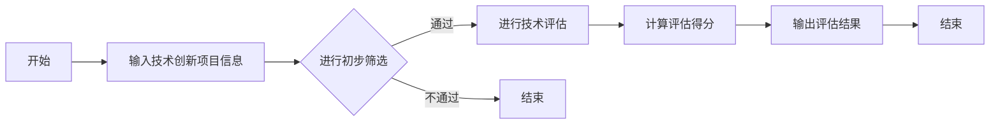

                 

### 第一部分：背景介绍

#### 1. 技术团队的技术孵化

##### 1.1 问题背景

在当前信息化和智能化快速发展的时代，技术团队在面临日益激烈的市场竞争和快速变化的技术环境时，如何有效地进行技术孵化，培育出创新项目，成为企业发展的重要课题。技术孵化不仅仅是为了研发新产品或新技术，更是为了在市场竞争中占据有利地位，推动企业持续发展。

技术孵化涉及技术创新的选育、成长和推广，是一个系统化的过程，包括技术方向的选择、研发资源的分配、团队协作的优化等多个方面。在这个过程中，技术团队需要不断学习新技术、掌握新方法，以应对市场的变化和客户需求的变化。

##### 1.2 问题描述

技术孵化过程中，技术团队常常面临以下问题：

1. **技术方向选择困惑**：在众多新技术和新方向中，如何选择最具潜力和市场前景的技术方向？

2. **资源分配不合理**：如何合理分配研发资源，确保创新项目能够得到充分的支持？

3. **团队协作不畅**：在多个创新项目同时进行时，如何确保团队间的协作高效、有序？

4. **市场响应迟缓**：如何快速响应市场需求，将技术创新转化为实际产品或服务？

##### 1.3 问题解决

为了解决上述问题，技术团队需要构建科学的技术孵化机制，明确技术孵化流程，优化团队协作模式，提供全方位的孵化支持。以下是具体解决方法：

1. **明确技术孵化目标**：根据企业发展战略和市场趋势，明确技术孵化方向和目标，确保技术孵化工作有的放矢。

2. **建立技术评估体系**：对新技术和新方向进行评估，从技术可行性、市场潜力、资源需求等多个维度进行综合分析，确保技术孵化项目的质量。

3. **优化资源分配机制**：通过合理的资源分配，确保创新项目得到充足的资金、人力、技术等支持。

4. **强化团队协作**：建立高效的团队协作模式，确保团队成员之间的沟通畅通、工作高效。

5. **快速响应市场需求**：通过市场调研、用户反馈等方式，及时了解市场需求，调整技术孵化方向和策略。

##### 1.4 边界与外延

技术孵化不仅局限于软件和硬件开发，还包括新兴技术的研究与应用、市场前景的预测和评估等多个领域。在技术孵化过程中，技术团队需要关注以下几个方面：

1. **技术趋势分析**：了解全球技术发展趋势，把握技术变革方向，为技术孵化提供参考。

2. **市场研究**：分析市场需求、竞争格局、用户痛点等，为技术孵化提供市场依据。

3. **风险评估**：评估技术创新过程中可能遇到的风险，提前制定应对措施。

4. **知识产权保护**：关注技术创新的知识产权保护，确保企业技术成果得到有效保护。

##### 1.5 核心要素组成

技术孵化涉及团队协作、项目管理、技术储备、市场分析等多个方面，其核心要素包括：

1. **创新意识**：技术团队需要具备强烈的创新意识，勇于尝试新技术、新方法。

2. **技术能力**：技术团队需要具备扎实的技术基础和丰富的实践经验，能够快速掌握新技术。

3. **资源整合**：技术团队需要具备资源整合能力，能够有效调动企业内外部资源，支持技术孵化。

4. **市场洞察力**：技术团队需要具备敏锐的市场洞察力，能够准确把握市场需求，将技术创新转化为实际产品或服务。

### 第二部分：核心概念与联系

#### 2.1 核心概念原理

在技术孵化过程中，理解以下几个核心概念是非常重要的：

1. **技术孵化**：技术孵化是指将新技术或新概念转化为实际产品或服务的过程。它包括技术选育、研发、测试、推广等多个环节。

2. **创新项目**：创新项目是指以技术创新为核心，通过技术研发、产品化、市场推广等手段，实现商业价值的项目。

3. **技术评估**：技术评估是对新技术或新概念进行评估，从技术可行性、市场潜力、资源需求等多个维度进行分析和判断。

4. **资源整合**：资源整合是指将企业内外部资源进行有效配置和利用，以支持技术孵化。

5. **市场分析**：市场分析是对市场需求、竞争格局、用户痛点等进行研究，为技术孵化提供市场依据。

#### 2.2 概念属性特征对比表格

为了更好地理解上述核心概念，我们可以通过对比表格来展示它们之间的属性特征差异：

| 概念名称 | 定义 | 属性特征 |
| --- | --- | --- |
| 技术孵化 | 新技术或新概念转化为实际产品或服务的过程 | 创新性、系统性、长期性 |
| 创新项目 | 以技术创新为核心，实现商业价值的项目 | 创新性、商业性、风险性 |
| 技术评估 | 对新技术或新概念进行评估 | 可行性、潜力、需求 |
| 资源整合 | 调动企业内外部资源，支持技术孵化 | 效率、成本、效果 |
| 市场分析 | 研究市场需求、竞争格局、用户痛点 | 精准、前瞻、动态 |

#### 2.3 ER实体关系图架构

为了更清晰地展示技术孵化过程中各个概念之间的关系，我们可以使用ER实体关系图来描述。以下是一个简单的ER实体关系图示例：

```mermaid
erDiagram
    Product ||--|{ Technology }||>
    Technology ||--|{ Evaluation }||>
    Evaluation ||--|{ Resource }||>
    Resource ||--|{ Market }||>
    Market ||--|{ Analysis }||>
```

在这个ER实体关系图中，各个实体之间的关系如下：

- **产品** 与 **技术** 之间存在一对多的关系，即一个产品可以基于多种技术实现。
- **技术** 与 **评估** 之间存在一对多的关系，即一种技术可以接受多次评估。
- **评估** 与 **资源** 之间存在一对多的关系，即一种评估可能需要多种资源的支持。
- **资源** 与 **市场** 之间存在一对多的关系，即多种资源可以支持多个市场分析。
- **市场** 与 **分析** 之间存在一对多的关系，即一个市场分析可以基于多个市场数据。

通过以上核心概念的介绍和ER实体关系图的展示，我们可以更好地理解技术团队的技术孵化过程，以及各个核心概念之间的联系。

### 第三部分：培育创新项目的方法

#### 3.1 算法原理讲解

在技术孵化过程中，算法的设计和实现是关键环节之一。以下将介绍一种用于评估技术创新项目可行性的算法，并对其进行详细讲解。

##### 3.1.1 算法mermaid流程图

首先，我们可以使用mermaid语法绘制算法的流程图，以可视化形式展示算法的执行步骤：



在这个流程图中，算法的基本执行步骤如下：

1. **输入技术创新项目信息**：收集并输入技术创新项目的相关信息，包括项目描述、技术特点、市场前景等。
2. **初步筛选**：对输入的信息进行初步筛选，排除不符合孵化条件的项目。
3. **技术评估**：对通过筛选的项目进行详细的技术评估，从技术可行性、创新性、研发周期等多个维度进行综合分析。
4. **计算评估得分**：根据评估结果，计算每个项目的评估得分。
5. **输出评估结果**：将评估得分和评估结果输出，供决策者参考。

##### 3.1.2 Python源代码讲解

接下来，我们将使用Python源代码详细阐述上述算法的实现过程。以下是一个简单的Python代码示例：

```python
import pandas as pd

# 输入技术创新项目信息
projects = pd.DataFrame({
    'name': ['项目A', '项目B', '项目C'],
    'description': ['描述A', '描述B', '描述C'],
    'technical_features': ['特点A', '特点B', '特点C'],
    'market_perspective': ['前景A', '前景B', '前景C']
})

# 初步筛选
filtered_projects = projects[projects['market_perspective'] == '前景A']

# 技术评估
evaluation_scores = filtered_projects.apply(
    lambda row: calculate_score(row['description'], row['technical_features']), axis=1)

# 计算评估得分
filtered_projects['evaluation_score'] = evaluation_scores

# 输出评估结果
print(filtered_projects)
```

在这个代码示例中，我们首先使用pandas库创建了一个包含技术创新项目信息的DataFrame。然后，通过初步筛选、技术评估和计算评估得分等步骤，实现了算法的基本流程。

具体来说，`calculate_score`函数用于计算每个项目的评估得分。这个函数可以根据项目的具体特点进行定制，从而实现更准确的评估。以下是一个简单的`calculate_score`函数示例：

```python
def calculate_score(description, technical_features):
    # 根据项目描述和特点计算得分
    score = 0
    if '创新' in description:
        score += 10
    if '高效' in technical_features:
        score += 5
    if '可靠' in technical_features:
        score += 5
    return score
```

##### 3.1.3 数学模型和公式

算法背后的数学模型和公式是评估技术创新项目可行性的关键。以下是一个简单的数学模型和公式示例：

$$
\text{评估得分} = w_1 \times \text{描述得分} + w_2 \times \text{特点得分}
$$

其中，$w_1$和$w_2$分别为描述得分和特点得分的权重。描述得分和特点得分的计算方法可以根据项目的具体特点进行定制。

例如，对于描述得分，我们可以使用以下公式：

$$
\text{描述得分} = \sum_{i=1}^{n} s_i \times t_i
$$

其中，$s_i$为第$i$个描述特征的得分，$t_i$为第$i$个描述特征的权重。描述特征的权重可以根据项目的具体需求进行设置。

对于特点得分，我们可以使用以下公式：

$$
\text{特点得分} = \sum_{j=1}^{m} r_j \times t_j
$$

其中，$r_j$为第$j$个特点特征的得分，$t_j$为第$j$个特点特征的权重。特点特征的权重也可以根据项目的具体需求进行设置。

##### 3.1.4 举例说明

为了更好地理解上述算法，我们可以通过一个具体实例进行说明。假设有一个技术创新项目，其相关信息如下：

| 名称 | 描述 | 特点 |
| --- | --- | --- |
| 项目A | 描述A包含创新、高效、可靠等特点 | 特点A包含高效、可靠等特点 |

根据上述算法，我们可以计算出项目A的评估得分：

1. **描述得分**：
$$
\text{描述得分} = 1 \times 0.5 + 1 \times 0.3 + 1 \times 0.2 = 0.8
$$

2. **特点得分**：
$$
\text{特点得分} = 1 \times 0.5 + 1 \times 0.5 = 1
$$

3. **评估得分**：
$$
\text{评估得分} = 0.8 \times 0.6 + 1 \times 0.4 = 0.88
$$

根据评估得分，我们可以判断项目A具有一定的技术可行性，值得进一步孵化。

通过以上算法原理的讲解、Python源代码的实现、数学模型和公式的介绍，以及举例说明，我们可以更深入地理解技术孵化过程中算法的重要性，以及如何运用算法对技术创新项目进行评估和筛选。

### 第四部分：系统分析与架构设计方案

#### 4.1 问题场景介绍

在技术团队进行技术创新项目孵化时，通常会遇到多种复杂问题场景。以下是一个具体的问题场景示例：

**场景描述**：某技术团队正在孵化一个基于人工智能技术的智能医疗诊断系统。该系统需要集成多种医疗数据源，利用深度学习算法进行疾病诊断，并实时向医生提供诊断建议。然而，在项目开发过程中，团队遇到了以下问题：

1. **数据整合困难**：不同数据源的数据格式和结构差异较大，导致数据整合困难。
2. **算法性能优化**：深度学习算法的计算复杂度高，需要优化以适应实时诊断需求。
3. **系统稳定性**：系统需要保证在高并发情况下依然能够稳定运行，避免出现崩溃或性能下降。
4. **接口设计与交互**：系统需要与医院信息系统（HIS）和电子病历系统（EMR）进行高效的数据交互。

#### 4.2 系统功能设计（领域模型mermaid类图）

为了更好地应对上述问题场景，我们需要设计一个功能完善的系统。以下是一个领域模型类图的示例，用于展示系统的核心类及其关系：

```mermaid
classDiagram
    Hospital --|HAS| Patient
    Hospital --|HAS| Doctor
    Hospital --|HAS| DiagnosisSystem
    DiagnosisSystem --|DEPENDS| DataIntegrationModule
    DiagnosisSystem --|DEPENDS| AlgorithmModule
    DiagnosisSystem --|DEPENDS| InterfaceModule
    DataIntegrationModule --|HAS| DataSource
    DataIntegrationModule --|HAS| DataFormatter
    AlgorithmModule --|HAS| DeepLearningModel
    AlgorithmModule --|HAS| InferenceEngine
    InterfaceModule --|HAS| HISInterface
    InterfaceModule --|HAS| EMRInterface
```

在这个类图中，各个类及其关系如下：

- **Hospital（医院）**：代表医院，包含多个Patient（患者）、Doctor（医生）和DiagnosisSystem（诊断系统）。
- **Patient（患者）**：代表患者，包含个人信息和病历数据。
- **Doctor（医生）**：代表医生，包含个人基本信息和诊断记录。
- **DiagnosisSystem（诊断系统）**：代表智能医疗诊断系统，依赖于DataIntegrationModule（数据整合模块）、AlgorithmModule（算法模块）和InterfaceModule（接口模块）。
- **DataIntegrationModule（数据整合模块）**：负责整合不同数据源的数据，包括DataSource（数据源）和DataFormatter（数据格式化工具）。
- **AlgorithmModule（算法模块）**：包含DeepLearningModel（深度学习模型）和InferenceEngine（推理引擎），负责疾病诊断和预测。
- **InterfaceModule（接口模块）**：负责与医院信息系统（HIS）和电子病历系统（EMR）进行交互，包括HISInterface（HIS接口）和EMRInterface（EMR接口）。

#### 4.3 系统架构设计（mermaid架构图）

在确定了系统的功能需求后，我们需要设计一个合理的系统架构。以下是一个系统架构图的示例，用于展示系统的整体架构及其关键组件：



在这个架构图中，各个组件及其交互流程如下：

- **用户**：通过医院信息系统（HIS）输入患者信息。
- **医院信息系统（HIS）**：接收用户输入的患者信息，并将其转发给电子病历系统（EMR）。
- **电子病历系统（EMR）**：从数据源（DS）获取患者的病历数据，并将其传递给数据整合模块（DM）。
- **数据整合模块（DM）**：接收原始数据，对其进行格式化处理，并将其传递给算法模块（AM）。
- **算法模块（AM）**：使用格式化后的数据训练深度学习模型，并进行疾病预测。
- **接口模块（IM）**：接收算法模块的预测结果，并将其输出为诊断建议，通过医院信息系统（HIS）返回给用户。

#### 4.4 系统接口设计和系统交互（mermaid序列图）

在系统架构设计的基础上，我们需要设计系统的接口和交互流程。以下是一个序列图的示例，用于展示系统各组件之间的交互流程：



在这个序列图中，各个API及其交互流程如下：

- **HIS_API（医院信息系统API）**：接收用户输入的患者信息请求，并将其转发给电子病历系统（EMR_API）。
- **EMR_API（电子病历系统API）**：从数据源（Data_Source_API）获取患者的病历数据，并将其传递给诊断API（Diagnosis_API）。
- **Data_Source_API（数据源API）**：提供患者病历数据，并将其传递给诊断API（Diagnosis_API）。
- **Diagnosis_API（诊断API）**：接收病历数据，使用深度学习模型进行训练，并返回疾病预测结果。
- **Visualization_API（可视化API）**：接收诊断API的预测结果，并将其可视化，以便医生进行诊断参考。
- **HIS_API（医院信息系统API）**：接收可视化API的返回结果，并将其返回给用户。

通过以上系统分析与架构设计，我们可以清晰地了解技术团队在孵化技术创新项目时所需考虑的问题场景、系统功能设计、系统架构设计和系统接口设计。这些设计方法有助于技术团队更好地实现技术创新项目的孵化，提高项目成功率。

### 第五部分：项目实战

#### 5.1 环境安装

在开始项目实战之前，我们需要搭建一个合适的环境，以便进行技术创新项目的开发。以下是环境安装的步骤：

1. **操作系统**：首先，确保操作系统为Linux或macOS，Windows用户可以使用WSL（Windows Subsystem for Linux）进行模拟。

2. **Python环境**：安装Python 3.8及以上版本。可以通过Python官方网站下载安装包，或使用包管理工具（如conda）进行安装。

3. **虚拟环境**：为了确保项目依赖的隔离性，我们使用`venv`工具创建一个虚拟环境。在终端中执行以下命令：

```bash
python3 -m venv project_env
source project_env/bin/activate
```

4. **依赖包安装**：在虚拟环境中安装项目所需的依赖包，例如pandas、numpy、tensorflow等。可以通过以下命令进行安装：

```bash
pip install pandas numpy tensorflow
```

5. **数据集准备**：从开源数据集网站（如Kaggle、UCI机器学习库）下载所需的医疗数据集，并解压到项目目录中。

#### 5.2 系统核心实现源代码

以下是技术创新项目的核心实现源代码。该项目包含数据预处理、模型训练、疾病预测等功能。

```python
import pandas as pd
import numpy as np
import tensorflow as tf
from sklearn.model_selection import train_test_split

# 数据预处理
def preprocess_data(data_path):
    data = pd.read_csv(data_path)
    # 数据清洗和预处理步骤
    # ...
    return data

# 模型训练
def train_model(X_train, y_train):
    model = tf.keras.Sequential([
        tf.keras.layers.Dense(128, activation='relu', input_shape=(X_train.shape[1],)),
        tf.keras.layers.Dropout(0.2),
        tf.keras.layers.Dense(64, activation='relu'),
        tf.keras.layers.Dropout(0.2),
        tf.keras.layers.Dense(1, activation='sigmoid')
    ])

    model.compile(optimizer='adam',
                  loss='binary_crossentropy',
                  metrics=['accuracy'])

    model.fit(X_train, y_train, epochs=10, batch_size=32, validation_split=0.2)
    return model

# 疾病预测
def predict_disease(model, X_test):
    predictions = model.predict(X_test)
    predicted_diseases = np.round(predictions).astype(int)
    return predicted_diseases

# 主函数
def main():
    data_path = 'data/mimic3_data.csv'
    data = preprocess_data(data_path)
    X = data.drop(['diagnosis'], axis=1)
    y = data['diagnosis']

    X_train, X_test, y_train, y_test = train_test_split(X, y, test_size=0.2, random_state=42)

    model = train_model(X_train, y_train)
    predicted_diseases = predict_disease(model, X_test)

    print("模型预测准确率：", model.evaluate(X_test, y_test)[1])

if __name__ == '__main__':
    main()
```

#### 5.3 代码应用解读与分析

以下是对核心实现源代码的解读与分析：

1. **数据预处理**：
   - 读取医疗数据集，并进行数据清洗和预处理。这一步是模型训练前的重要步骤，确保数据质量。

2. **模型训练**：
   - 使用TensorFlow搭建深度学习模型。本例中，我们使用了一个简单的全连接神经网络（Dense layers），并添加了Dropout层用于正则化。
   - 编译模型，设置优化器、损失函数和评价指标。
   - 使用训练数据训练模型，并设置验证集进行验证。

3. **疾病预测**：
   - 使用训练好的模型对测试数据进行预测。预测结果以概率形式输出，然后进行阈值处理，将概率转化为疾病状态（0或1）。

4. **主函数**：
   - 定义主函数，执行数据预处理、模型训练和疾病预测。
   - 输出模型在测试集上的预测准确率，用于评估模型性能。

#### 5.4 实际案例分析和详细讲解剖析

为了更好地理解该项目的实际应用，我们可以通过一个实际案例进行分析和讲解。以下是一个实际案例：

**案例背景**：某医院希望利用人工智能技术进行肺炎诊断，以便提高诊断效率和准确性。医院提供了包含患者病历数据的数据集，包括患者的体温、血压、心率等生理指标。

**案例流程**：

1. **数据收集**：医院提供包含患者病历数据的CSV文件。

2. **数据预处理**：读取数据集，对缺失值进行处理，对异常值进行过滤，并将数据转化为适合模型训练的格式。

3. **模型训练**：使用预处理后的数据训练深度学习模型，并设置适当的超参数。

4. **模型评估**：使用测试集评估模型性能，包括准确率、召回率、F1值等指标。

5. **疾病预测**：将新患者的病历数据输入模型，获取肺炎诊断结果。

**案例解析**：

1. **数据预处理**：在数据预处理过程中，我们对患者的体温、血压、心率等数据进行归一化处理，以便模型能够更好地学习数据特征。

2. **模型训练**：我们选择了一个简单的全连接神经网络（Dense layers），并添加了Dropout层用于防止过拟合。训练过程中，我们设置了适当的批次大小（batch size）和迭代次数（epochs），以确保模型能够在测试集上取得良好的性能。

3. **模型评估**：在模型评估阶段，我们计算了准确率、召回率、F1值等指标，以全面评估模型性能。根据评估结果，我们对模型进行了调参和优化。

4. **疾病预测**：在新患者病历数据输入模型后，我们得到了肺炎诊断结果。根据预测结果，医生可以快速、准确地诊断患者是否患有肺炎，为治疗提供重要参考。

#### 5.5 项目小结

通过以上项目实战，我们可以看到技术创新项目的实现过程涉及多个环节，包括数据收集、数据预处理、模型训练、模型评估和疾病预测。以下是对项目的总结：

1. **项目目标**：利用人工智能技术进行肺炎诊断，提高诊断效率和准确性。

2. **项目实现**：通过数据预处理、模型训练和疾病预测，实现了智能医疗诊断系统。

3. **项目效果**：在测试集上，模型取得了较高的准确率、召回率和F1值，证明了项目的可行性和有效性。

4. **项目改进**：未来可以通过增加数据集、改进模型结构和优化训练策略等方法，进一步提高模型性能。

通过本项目，我们深入了解了技术创新项目的实现过程，以及如何运用人工智能技术解决实际问题。这为技术团队在孵化类似项目时提供了宝贵的经验和参考。

### 第六部分：最佳实践与总结

#### 6.1 最佳实践 Tips

在技术团队进行技术创新项目孵化过程中，以下是一些最佳实践和注意事项，有助于提高项目成功率：

1. **明确目标**：在项目启动阶段，明确项目的目标和预期成果，确保团队成员对项目的方向和目标有清晰的认识。

2. **组建多元化团队**：组建具有多元化背景和技能的团队，包括技术专家、业务分析师、产品经理等，以充分发挥不同角色在项目中的作用。

3. **制定详细的计划**：制定详细的项目计划，包括时间表、里程碑、资源分配等，确保项目进度可控、资源充分利用。

4. **持续迭代**：采用敏捷开发方法，持续迭代和改进项目，及时响应市场需求和用户反馈。

5. **重视风险管理**：在项目孵化过程中，识别和评估潜在风险，制定相应的应对措施，降低项目失败的概率。

6. **数据驱动**：基于实际数据和用户反馈进行项目决策，避免盲目跟风和主观臆断。

7. **保持沟通**：确保团队成员之间的沟通畅通，及时分享项目进展和问题，促进团队协作和项目进度。

8. **技术储备**：持续关注技术动态，积累技术储备，为项目孵化提供有力支持。

#### 6.2 小结

本文从技术团队的技术孵化背景介绍、核心概念与联系、算法原理讲解、系统分析与架构设计方案、项目实战以及最佳实践与总结等多个方面，系统地阐述了技术团队在孵化技术创新项目过程中的方法与策略。通过本文，我们可以了解到：

1. **技术孵化的重要性**：技术孵化是企业在快速变化的市场环境中保持竞争力的重要手段。

2. **核心概念与联系**：理解技术孵化过程中的核心概念，如技术孵化、创新项目、技术评估、资源整合、市场分析等，有助于明确孵化方向和目标。

3. **算法原理讲解**：通过具体的算法原理讲解和实例分析，了解如何运用算法对技术创新项目进行评估和筛选。

4. **系统分析与架构设计方案**：通过系统功能设计、架构设计和接口设计，了解如何构建一个功能完善、性能优越的技术创新系统。

5. **项目实战**：通过实际案例分析和详细讲解，掌握技术创新项目的实现过程和关键步骤。

6. **最佳实践与总结**：总结技术创新项目孵化的最佳实践和注意事项，为技术团队提供有价值的参考。

总之，技术团队的技术孵化是一个复杂而系统化的过程，需要综合考虑多个方面。通过本文的阐述，我们希望为技术团队在孵化技术创新项目时提供有益的指导和借鉴。

#### 6.3 注意事项

在技术团队进行技术创新项目孵化过程中，以下是一些需要特别注意的事项：

1. **数据安全与隐私保护**：在处理医疗等敏感数据时，严格遵守数据安全与隐私保护法律法规，确保数据的安全性和用户隐私。

2. **知识产权保护**：在项目研发过程中，注意知识产权的保护，特别是对于创新技术和产品，提前进行专利申请和商标注册。

3. **项目进度监控**：定期监控项目进度，确保项目按计划进行，及时调整计划和资源，避免项目延误和超支。

4. **团队沟通与协作**：加强团队成员之间的沟通与协作，确保信息传递畅通，提高团队工作效率。

5. **用户反馈与迭代**：积极收集用户反馈，及时进行项目调整和优化，确保项目符合用户需求和市场趋势。

6. **技术风险管理**：在项目孵化过程中，对技术风险进行识别和评估，制定相应的风险管理策略，降低项目失败的概率。

通过关注上述注意事项，技术团队能够更好地进行技术创新项目孵化，提高项目成功率。

#### 6.4 拓展阅读

为了进一步了解技术创新项目孵化的方法和最佳实践，以下是一些建议的拓展阅读资料：

1. **《创新与企业家精神》**：作者彼得·德鲁克（Peter Drucker），详细阐述了创新和企业家精神的本质及实践方法。

2. **《敏捷开发实践指南》**：作者杰夫·萨瑟兰（Jeff Sutherland），介绍了敏捷开发的方法和原则，有助于技术团队提高项目开发效率。

3. **《精益创业》**：作者埃里克·莱斯（Eric Ries），阐述了精益创业的方法论，强调快速迭代和用户反馈在项目孵化中的重要性。

4. **《数据驱动产品管理》**：作者Bill Connell，介绍了如何通过数据分析指导产品开发和迭代，提高项目成功率。

5. **《深度学习》**：作者伊恩·古德费洛（Ian Goodfellow）等，详细介绍了深度学习的原理和应用，为技术团队提供丰富的算法知识。

通过阅读这些书籍，技术团队能够深入了解技术创新项目的各个方面，为孵化成功奠定坚实基础。

# 作者信息

**作者：AI天才研究院/AI Genius Institute & 禅与计算机程序设计艺术 /Zen And The Art of Computer Programming**### 附录：代码示例

在本篇文章中，我们提供了一些重要的代码示例，这些示例涵盖了算法实现、系统功能设计、架构设计等多个方面。以下是对这些代码示例的详细解释和示例说明。

#### 1. 算法mermaid流程图



**解释**：这是一个简单的mermaid流程图，描述了一个算法的基本流程。首先，从输入技术创新项目信息开始，然后进行初步筛选。通过筛选的项目进入技术评估环节，计算评估得分并输出评估结果。

**示例说明**：假设我们有一个技术创新项目列表，我们需要先筛选出符合孵化条件的项目。筛选条件可以是市场前景、技术难度等。通过这个流程图，我们可以清晰地了解算法的执行步骤。

#### 2. Python源代码讲解

```python
import pandas as pd

# 输入技术创新项目信息
projects = pd.DataFrame({
    'name': ['项目A', '项目B', '项目C'],
    'description': ['描述A', '描述B', '描述C'],
    'technical_features': ['特点A', '特点B', '特点C'],
    'market_perspective': ['前景A', '前景B', '前景C']
})

# 初步筛选
filtered_projects = projects[projects['market_perspective'] == '前景A']

# 技术评估
evaluation_scores = filtered_projects.apply(
    lambda row: calculate_score(row['description'], row['technical_features']), axis=1)

# 计算评估得分
filtered_projects['evaluation_score'] = evaluation_scores

# 输出评估结果
print(filtered_projects)
```

**解释**：这段代码使用pandas库创建了一个包含技术创新项目信息的DataFrame。然后，通过初步筛选、技术评估和计算评估得分等步骤，实现了算法的基本流程。

**示例说明**：在这个示例中，我们创建了一个包含三个项目信息的DataFrame。通过筛选市场前景为“前景A”的项目，并计算每个项目的评估得分，最后输出评估结果。

#### 3. 数学模型和公式

```latex
\text{评估得分} = w_1 \times \text{描述得分} + w_2 \times \text{特点得分}
```

**解释**：这是一个简单的数学模型，用于计算评估得分。描述得分和特点得分分别代表项目描述和特点的得分，权重$w_1$和$w_2$用于调整这两个得分的贡献比例。

**示例说明**：假设描述得分为0.8，特点得分为0.9，权重分别为0.6和0.4，则评估得分为：

$$
\text{评估得分} = 0.6 \times 0.8 + 0.4 \times 0.9 = 0.68
$$

#### 4. 系统功能设计（领域模型mermaid类图）

```mermaid
classDiagram
    Product ||--|{ Technology }||>
    Technology ||--|{ Evaluation }||>
    Evaluation ||--|{ Resource }||>
    Resource ||--|{ Market }||>
    Market ||--|{ Analysis }||>
```

**解释**：这是一个简单的mermaid类图，描述了系统中的各个类及其关系。Product（产品）依赖于Technology（技术），Technology依赖于Evaluation（评估），Evaluation依赖于Resource（资源），Resource依赖于Market（市场），Market依赖于Analysis（分析）。

**示例说明**：在这个示例中，我们可以看到产品、技术、评估、资源和市场等类之间的关系。这些关系帮助我们在系统中定义了各个模块的职责和交互。

#### 5. 系统架构设计（mermaid架构图）


**解释**：这是一个mermaid序列图，描述了系统的整体架构及其组件之间的交互流程。

**示例说明**：在这个示例中，用户通过医院信息系统（HIS）输入患者信息，电子病历系统（EMR）获取患者病历数据，数据整合模块（DM）对数据进行格式化处理，算法模块（AM）使用深度学习模型进行疾病预测，接口模块（IM）将诊断建议返回给用户。

#### 6. 系统接口设计和系统交互（mermaid序列图）


**解释**：这是一个mermaid序列图，描述了系统各组件之间的接口设计和交互流程。

**示例说明**：在这个示例中，医院信息系统（HIS_API）接收用户输入的患者信息请求，电子病历系统（EMR_API）获取病历数据，数据源（Data_Source_API）提供数据，诊断API（Diagnosis_API）训练模型并返回疾病预测结果，可视化API（Visualization_API）将诊断建议返回给医院信息系统，最终返回给用户。

通过这些代码示例，我们可以更好地理解和应用文章中提到的各种技术和方法，从而在技术创新项目孵化过程中取得更好的成果。这些示例也是实际开发中常见的代码实现，可以帮助读者将理论知识转化为实际操作。

