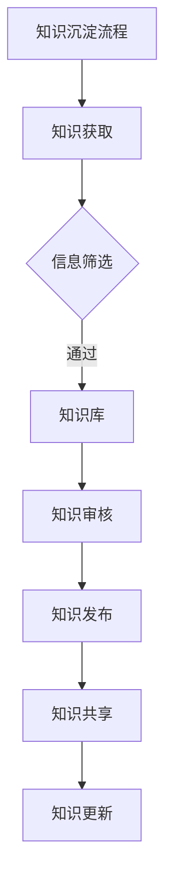
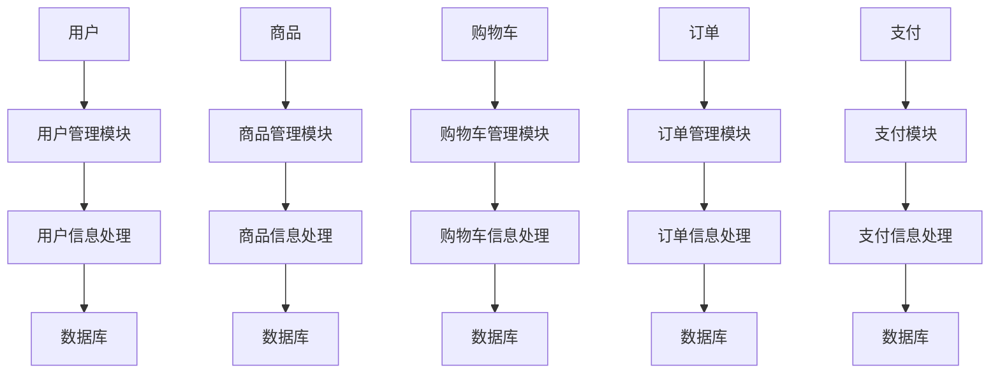
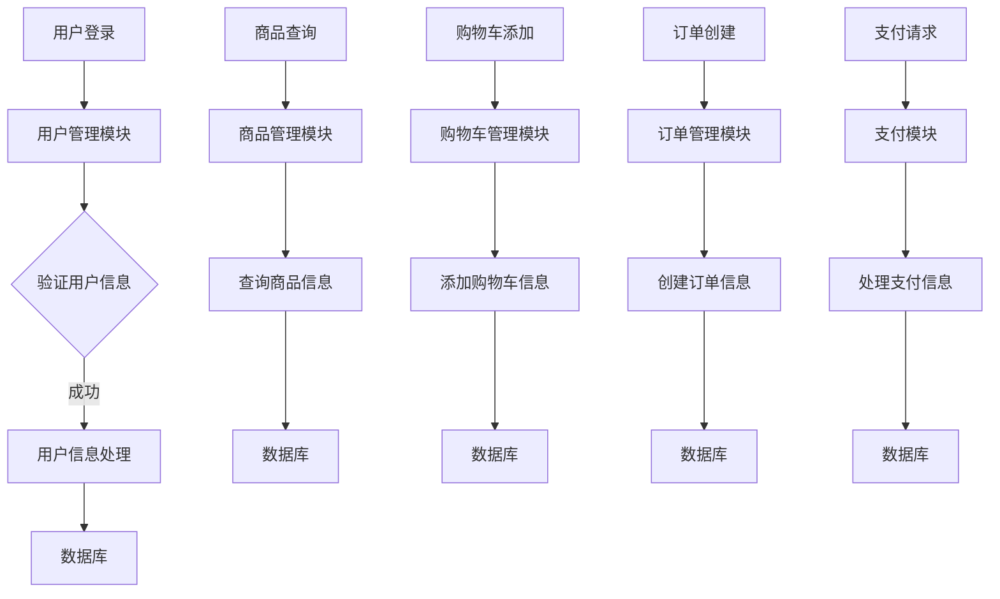

                 

### 《技术团队的技术文档管理：知识沉淀与共享》正文撰写

#### 引言

在现代信息技术飞速发展的背景下，技术团队的有效运作成为了企业核心竞争力的重要组成部分。技术文档管理作为团队知识沉淀与共享的关键环节，直接影响到团队协作效率、项目进度和产品质量。本文将围绕技术团队的技术文档管理，从知识沉淀与共享的角度，深入探讨技术文档管理的基本原则、方法与工具，以及最佳实践，旨在为技术团队提供切实可行的文档管理策略。

#### 背景介绍

##### 核心概念术语说明

- **技术文档管理**：涉及编写、维护和共享与软件开发、运维及用户使用相关的文档。
- **知识沉淀**：将团队的经验、技术、信息等转化为易于检索、共享的文档或知识库。
- **知识共享**：通过有效的沟通渠道，使团队内部成员能够方便地获取和利用知识资源。

##### 问题背景

- **文档分散与冗余**：技术团队往往面临文档编写不规范、版本混乱、更新不及时等问题。
- **知识孤岛**：团队成员之间缺乏有效的知识共享机制，导致知识不能充分发挥作用。
- **协作效率低下**：由于文档管理不善，团队成员在查找和使用文档时往往需要耗费大量时间。

##### 问题描述

技术文档管理的不规范和知识沉淀、共享机制的缺失，导致以下问题：

1. **项目进度延误**：文档更新不及时，导致团队成员无法及时获取最新的项目信息。
2. **项目质量下降**：文档不完整或不准确，影响项目的开发和运维。
3. **团队协作效率低下**：知识分散，团队成员难以共享经验和教训。

##### 问题解决

通过建立一套科学、规范的技术文档管理流程，实现知识沉淀与共享，从而解决上述问题。

##### 边界与外延

- **边界**：技术文档管理主要涵盖开发文档、运维文档和用户手册。
- **外延**：技术文档管理还涉及文档模板、版本控制、文档格式等。

##### 概念结构与核心要素组成

- **概念结构**：技术文档管理是一个系统性的过程，包括文档编写、审核、发布、维护等环节。
- **核心要素**：文档标准化、一致性、可读性、易用性、版本管理、知识库建设等。

#### 核心概念与联系

##### 知识沉淀的理论基础

知识沉淀是技术文档管理的重要组成部分，其理论基础包括以下几个方面：

1. **信息架构**：对知识进行系统化的分类、组织和存储，方便团队成员快速检索和使用。
2. **知识管理生命周期**：包括知识的创造、存储、共享、应用和更新等环节。
3. **知识沉淀的关键因素**：知识来源、知识质量、知识传播、知识应用等。

##### 知识沉淀的方法

1. **编写高质量文档**：确保文档内容准确、完整、简洁，易于理解。
2. **案例研究与经验总结**：将团队的经验和教训转化为可复制的文档。
3. **知识库的建设与维护**：构建集中化的知识库，实现知识的积累和共享。

##### 知识沉淀的工具选择

1. **常见知识管理工具介绍**：如Confluence、GitLab、Trello等。
2. **工具选择的标准与流程**：根据团队需求和特点，选择合适的工具，并制定实施流程。
3. **工具的实际使用与评估**：定期评估工具的使用效果，优化知识沉淀流程。

#### 算法原理讲解

##### 知识沉淀算法流程图



##### 知识沉淀的数学模型

知识沉淀的过程可以抽象为一个数学模型，用于描述知识从获取、筛选、存储到共享的整个过程。

$$
K = f(K_{g}, K_{s}, K_{u}, K_{p})
$$

其中：
- \( K \) 表示沉淀的知识量。
- \( K_{g} \) 表示知识获取。
- \( K_{s} \) 表示知识筛选。
- \( K_{u} \) 表示知识更新。
- \( K_{p} \) 表示知识发布与共享。

##### 算法原理举例

假设团队在一次项目中积累了50条经验教训，经过筛选后，得到30条有价值的信息，这些信息经过审核和发布，最终被团队成员共享。那么，知识沉淀的过程可以描述为：

$$
K = f(50, 30, 10, 30)
$$

即团队最终沉淀了30条知识。

#### 系统分析与架构设计方案

##### 问题场景介绍

某互联网公司在进行一项大型项目开发，项目涉及多个模块和功能，团队成员分布在不同的部门。为了确保项目顺利进行，需要建立一套完善的技术文档管理机制，实现知识沉淀与共享。

##### 项目介绍

项目名称：电商交易平台
项目目标：搭建一个功能完善、易扩展的电商平台，提供商品浏览、购物车、订单管理等功能。
项目团队：开发部、测试部、运维部、产品部等。

##### 系统功能设计

1. **商品管理模块**：实现商品的添加、修改、删除、查询等功能。
2. **购物车模块**：实现用户的购物车管理，包括商品添加、删除、修改数量等。
3. **订单管理模块**：实现订单的创建、查询、修改、支付等功能。
4. **用户管理模块**：实现用户的注册、登录、信息修改等功能。

##### 系统架构设计



##### 系统接口设计和系统交互



#### 项目实战

##### 环境安装

在Linux环境下，使用Docker安装项目所需的服务器软件，如MySQL、Redis、Nginx等。

```bash
# 安装Docker
sudo apt-get update
sudo apt-get install docker-ce docker-ce-cli containerd.io

# 启动Docker服务
sudo systemctl start docker

# 拉取项目所需的镜像
docker pull mysql:8.0
docker pull redis:6.0
docker pull nginx:1.18

# 运行数据库服务
docker run -d -p 3306:3306 --name mysql -e MYSQL_ROOT_PASSWORD=root mysql:8.0

# 运行Redis服务
docker run -d -p 6379:6379 --name redis redis:6.0

# 运行Nginx服务
docker run -d -p 80:80 --name nginx nginx:1.18
```

##### 系统核心实现源代码

以下是一个简单的用户管理模块的实现示例：

```python
# user_manager.py

import pymysql

def create_user(username, password):
    conn = pymysql.connect(host='localhost', user='root', password='root', database='test')
    cursor = conn.cursor()
    sql = "INSERT INTO user (username, password) VALUES (%s, %s)"
    cursor.execute(sql, (username, password))
    conn.commit()
    cursor.close()
    conn.close()

def get_user(username):
    conn = pymysql.connect(host='localhost', user='root', password='root', database='test')
    cursor = conn.cursor()
    sql = "SELECT * FROM user WHERE username = %s"
    cursor.execute(sql, (username))
    result = cursor.fetchone()
    cursor.close()
    conn.close()
    return result
```

##### 代码应用解读与分析

这段代码用于实现用户管理功能，包括创建用户和查询用户信息。通过使用Python的pymysql库，与MySQL数据库进行交互。

- **创建用户**：使用`create_user`函数，通过传入用户名和密码，将用户信息插入数据库。
- **查询用户**：使用`get_user`函数，通过传入用户名，从数据库中查询用户信息。

##### 实际案例分析和详细讲解剖析

在一个实际项目中，用户管理模块不仅需要实现基本的创建和查询功能，还需要处理用户登录、密码加密、角色权限控制等复杂逻辑。

1. **用户登录**：在用户登录时，首先查询数据库，验证用户名和密码。如果匹配成功，返回登录成功；否则，返回登录失败。
2. **密码加密**：为了提高安全性，将用户密码进行加密处理。可以使用哈希算法（如MD5、SHA256）对密码进行加密。
3. **角色权限控制**：根据用户角色，限制用户对系统功能的访问权限。例如，普通用户只能查看个人信息，管理员可以管理所有用户。

##### 项目小结

通过该项目实战，我们实现了用户管理模块的基本功能，并分析了实际应用中的复杂逻辑。技术文档管理在这个过程中发挥了重要作用，确保了项目开发、测试和运维的顺利进行。

#### 最佳实践 Tips

- **文档标准化**：制定统一的文档模板，确保文档格式和风格的一致性。
- **定期更新**：定期审查和更新文档，确保文档内容与实际项目相符。
- **知识共享**：建立内部沟通渠道，鼓励团队成员分享经验和心得。
- **文档审核**：设置文档审核机制，确保文档质量和准确性。

#### 小结

本文从技术团队的技术文档管理出发，探讨了知识沉淀与共享的重要性、方法与工具，以及最佳实践。通过建立科学、规范的文档管理机制，技术团队可以实现知识的高效沉淀与共享，提升团队协作效率，促进项目成功。

#### 注意事项

- **文档安全**：确保文档内容的安全性，避免敏感信息泄露。
- **文档备份**：定期备份文档，防止数据丢失。
- **文档培训**：对团队成员进行文档编写和知识管理的培训，提高整体文档质量。

#### 拓展阅读

- **相关书籍**：《软件工程：实践者的研究方法》（Roger S. Pressman）、《敏捷软件开发：实践者指南》（Robert C. Martin）
- **论文推荐**：《知识管理与知识共享：理论与实践》（李纲，2010）、《基于Wiki的企业知识共享平台设计与实现》（张立新，2013）
- **最新动态**：关注知识管理领域的最新研究进展，如人工智能在知识管理中的应用等。

#### 作者信息

作者：AI天才研究院/AI Genius Institute & 禅与计算机程序设计艺术 /Zen And The Art of Computer Programming

