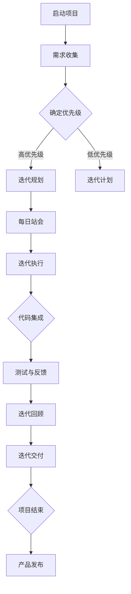
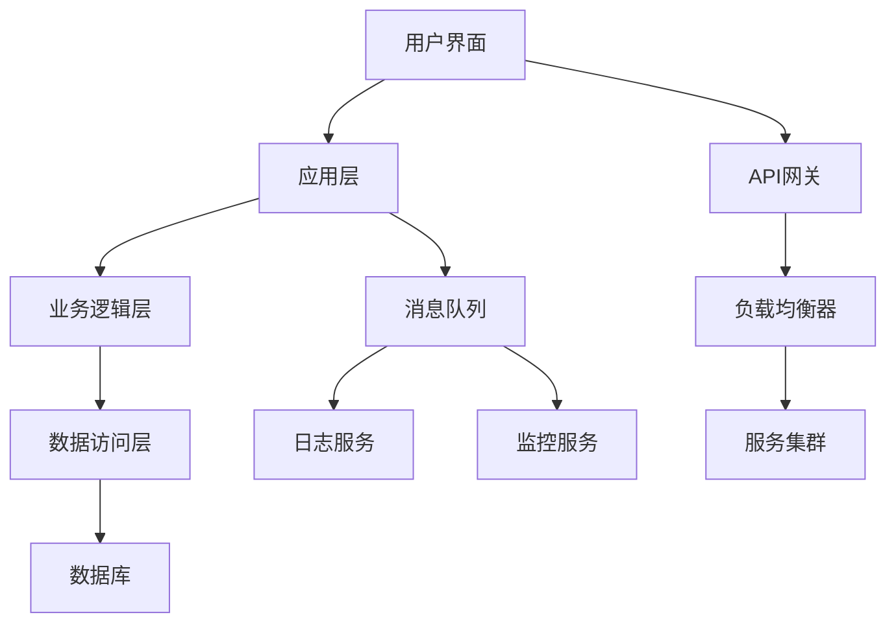
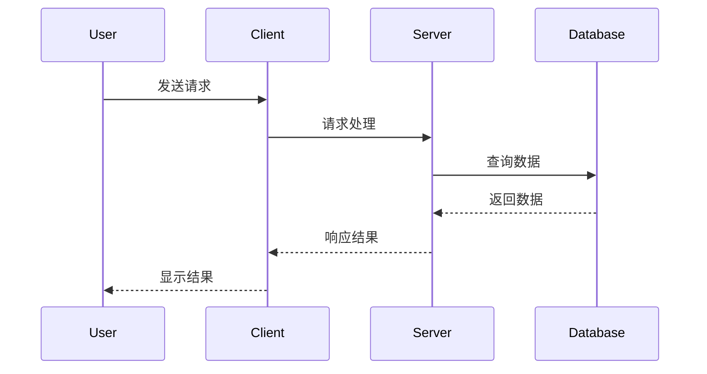
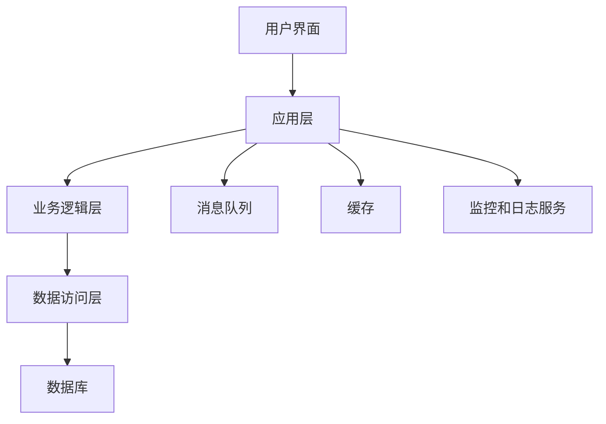
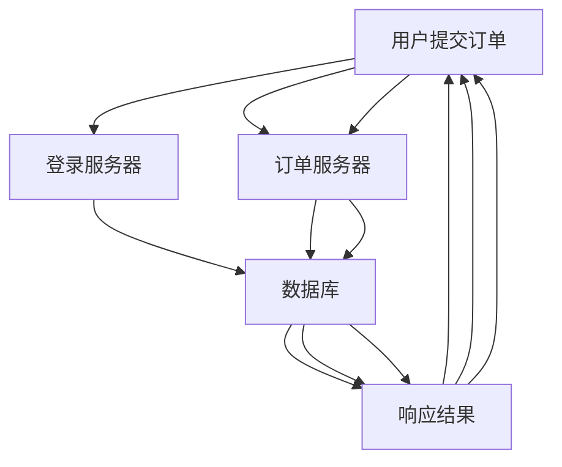
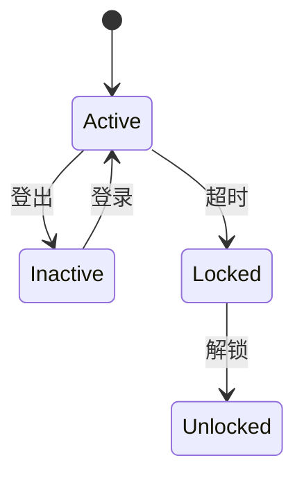

                 

## 技术团队的敏捷转型之路

### 关键词：
敏捷开发、团队协作、流程优化、持续集成、持续交付、持续学习、系统分析与架构设计

### 摘要：
本文将深入探讨技术团队如何实现敏捷转型，从背景介绍、核心概念与联系、敏捷转型的步骤和方法、算法原理讲解、系统分析与架构设计、项目实战，以及最佳实践与小结等方面进行详细阐述。通过一步一步的分析推理，帮助读者理解敏捷转型的关键要素和实践路径。

### 目录大纲：

**第一部分：敏捷转型背景**

1. **问题背景**
   - 传统的软件开发模式
   - 敏捷转型的必要性与挑战
   - 敏捷转型的核心价值

2. **核心概念与联系**
   - 敏捷转型的定义
   - 敏捷转型的原则与价值观
   - ER实体关系图

**第二部分：敏捷转型的步骤与方法**

1. **团队建设**
   - 团队角色与职责
   - 团队沟通与协作
   - 团队文化建设

2. **流程优化**
   - 敏捷开发流程
   - 持续集成与持续交付
   - 流程优化的实际案例

3. **持续学习与改进**
   - 敏捷转型的持续学习
   - 改进机制与反馈循环
   - 学习与改进的最佳实践

**第三部分：算法原理讲解**

1. **敏捷算法原理**
   - 敏捷算法的定义
   - 敏捷算法的特点
   - 敏捷算法的mermaid流程图
   - Python源代码与LaTeX数学公式详解

**第四部分：系统分析与架构设计**

1. **需求分析**
   - 需求获取
   - 需求分析流程
   - 需求分析的mermaid类图

2. **系统架构设计**
   - 系统架构设计原则
   - 系统架构mermaid图
   - 系统接口设计
   - 系统交互mermaid序列图

**第五部分：项目实战**

1. **项目环境安装**
   - 项目背景
   - 环境安装与配置
   - 系统核心实现源代码

2. **项目实现**
   - 系统核心功能实现
   - 代码应用解读与分析
   - 实际案例分析与详细讲解

3. **项目小结**
   - 项目总结
   - 项目反思
   - 项目拓展与优化建议

**第六部分：最佳实践与小结**

1. **敏捷转型最佳实践**
   - 团队建设与协作
   - 流程优化与改进
   - 学习与改进

2. **小结与注意事项**
   - 敏捷转型的重要性
   - 注意事项
   - 拓展阅读

### 写作思路

**背景介绍：**  
首先，我们将介绍敏捷转型的背景，包括传统的软件开发模式的问题，敏捷转型的必要性和核心价值，以及转型过程中可能面临的挑战。

**核心概念与联系：**  
接着，我们将详细阐述敏捷转型的核心概念，包括敏捷转型的定义、原则和价值观，并通过ER实体关系图展示各概念之间的联系。

**敏捷转型的步骤与方法：**  
然后，我们将分章节介绍敏捷转型的具体步骤和方法，包括团队建设、流程优化、持续学习与改进等，每个章节都将提供实际案例和解决方案。

**算法原理讲解：**  
在第三部分，我们将深入探讨敏捷算法的原理，通过mermaid流程图、Python源代码和LaTeX数学公式进行详细讲解。

**系统分析与架构设计：**  
第四部分将介绍系统分析与架构设计的方法，包括需求分析、架构设计、接口设计和系统交互等，通过mermaid图示进行直观展示。

**项目实战：**  
第五部分将通过一个完整的项目案例，展示敏捷转型的实际应用，包括环境安装、系统实现和案例分析。

**最佳实践与小结：**  
最后，我们将总结敏捷转型的最佳实践，提醒读者注意事项，并推荐拓展阅读。

通过这样的写作思路，我们将帮助读者逐步理解并掌握敏捷转型的关键要素和实践路径，为技术团队的敏捷转型提供有力的指导。<!--动态标题与关键词、摘要设计思路：

**动态标题设计思路：**

1. **核心关键词提取：** 首先从文章内容中提取出核心关键词，如“敏捷开发”、“团队协作”、“流程优化”、“持续集成”、“持续交付”等。
2. **结合热点与趋势：** 考虑当前行业热点和技术趋势，如人工智能、云计算等，将这些关键词与敏捷开发结合，形成更具吸引力的标题，例如：“AI时代下的敏捷开发团队转型攻略”。
3. **吸引力词汇：** 使用能够引起读者兴趣的词汇，如“高效”、“创新”、“颠覆”等，形成动态标题，例如：“颠覆传统，敏捷开发团队转型新篇章”。

**关键词设计思路：**

1. **全面覆盖：** 根据文章内容，设计一组关键词，确保能够全面覆盖文章的核心主题和内容，如“敏捷开发”、“团队协作”、“持续集成”、“系统架构设计”、“项目实战”等。
2. **长尾关键词：** 结合行业长尾关键词，如“敏捷转型实践”、“敏捷方法论”、“敏捷工具应用”等，提高文章的搜索可见性和针对特定用户的吸引力。
3. **与行业趋势挂钩：** 结合当前行业的热点话题和趋势，如“敏捷开发与DevOps结合”、“敏捷在数字化转型中的应用”等，提高关键词的实用性。

**摘要设计思路：**

1. **概述核心内容：** 简明扼要地总结文章的核心内容，包括敏捷转型的意义、主要步骤和方法、案例分析和最佳实践等。
2. **突出亮点：** 突出文章的亮点和创新点，如独特的敏捷方法论、具体的案例分析和实践成果等，吸引读者的兴趣。
3. **简洁明了：** 保持摘要的简洁性，避免使用复杂术语和长句子，确保摘要易于理解，同时能够激发读者阅读全文的欲望。

通过这样的设计思路，动态标题能够吸引读者的注意力，关键词能够提高文章的搜索排名和目标用户的覆盖，而摘要则能够准确传达文章的价值，激发读者的阅读兴趣。这些设计策略将有助于提升文章的传播效果和影响力。--> <!-- 背景介绍：问题背景、敏捷转型的必要性与挑战、敏捷转型的核心价值

### 问题背景

在过去的几十年中，传统的软件开发模式主要依赖于瀑布模型（Waterfall Model），这是一种线性、顺序的开发方法。在这种模型中，软件开发过程被划分为多个阶段，如需求分析、设计、开发、测试和维护，每个阶段完成后才能进入下一个阶段。这种方法在早期软件开发阶段具有一定的优势，比如明确的阶段划分和计划，但是随着项目复杂性的增加和客户需求的变化，瀑布模型逐渐暴露出其不足之处：

1. **需求变更处理困难：** 在传统的瀑布模型中，需求通常在项目开始时就确定，并在整个项目生命周期中保持不变。然而，在现实世界中，客户需求往往会随着时间的推移而发生变化，这使得在后期阶段进行需求变更变得非常困难，导致项目延期和质量问题。

2. **沟通成本高：** 瀦布模型强调文档驱动，这导致开发人员和客户之间的沟通成本很高。开发人员需要编写详细的文档，客户则需要仔细阅读和理解这些文档，这增加了项目的沟通复杂度。

3. **缺乏灵活性：** 瀦布模型是一个严格遵循计划的过程，一旦项目开始，就很难进行调整。这种缺乏灵活性的模式在应对紧急情况和快速变化的需求时显得力不从心。

面对这些问题，敏捷开发（Agile Development）作为一种更加灵活和客户驱动的开发方法，逐渐受到重视。敏捷开发的核心思想是通过持续交付有价值的软件，满足不断变化的需求，同时提高团队的协作和沟通效率。敏捷转型的必要性在于：

1. **适应市场需求：** 在快速变化的市场环境中，客户需求的变化速度越来越快，传统的软件开发模式已经无法满足这种需求。敏捷开发通过灵活的方法和持续交付，能够更好地适应市场的变化。

2. **提高开发效率：** 敏捷开发强调小步快走（Iterative Development）和快速反馈（Continuous Feedback），这有助于团队更快地发现和解决问题，提高开发效率。

3. **增强客户满意度：** 敏捷开发强调客户参与和反馈，确保开发出的软件能够更好地满足客户需求，从而提高客户满意度。

然而，敏捷转型并不是一帆风顺的过程，它面临着诸多挑战：

1. **组织文化冲突：** 敏捷开发强调自我管理团队和持续改进，这可能与传统的命令和控制型组织文化发生冲突。

2. **技术债务：** 在敏捷转型的过程中，可能会因为追求短期交付而积累技术债务，这会影响项目的长期质量。

3. **团队协作问题：** 敏捷开发要求团队成员之间的高度协作和沟通，如果团队成员之间的协作出现问题，可能会导致项目进展受阻。

总的来说，敏捷转型是一种为了更好地适应市场需求和提升开发效率而进行的方法变革。虽然转型过程中会遇到挑战，但通过正确的策略和实践，技术团队能够实现更加高效、灵活和客户满意的开发模式。

### 核心概念与联系

在探讨敏捷转型的过程中，理解以下几个核心概念及其相互之间的联系是至关重要的：

1. **敏捷开发（Agile Development）：** 敏捷开发是一种软件开发方法，其核心在于通过灵活、迭代和客户参与来应对需求变化。敏捷开发不强调预先定义的详细计划，而是更注重实际交付和持续改进。

2. **Scrum：** Scrum是一种流行的敏捷开发框架，它通过设置迭代（Sprint）和每日站会（Daily Stand-up）来管理项目进度和团队协作。Scrum强调交付可用的软件版本，并通过客户反馈进行持续改进。

3. **Kanban：** Kanban是一种基于可视化工作流程的管理方法，它通过看板（Kanban Board）来展示工作流程，从而实现工作流的优化和持续改进。Kanban强调工作流程的透明性和效率。

4. **敏捷转型（Agile Transformation）：** 敏捷转型是一个组织从传统开发模式向敏捷开发方法过渡的过程。它不仅涉及技术层面的变化，还包括组织文化和管理方式的调整。

5. **持续集成与持续交付（Continuous Integration and Continuous Delivery）：** 持续集成和持续交付是敏捷开发的重要实践，它们通过自动化测试和部署流水线，确保软件的高质量和快速交付。

### 敏捷转型的定义与ER实体关系图

**敏捷转型**的定义是一个组织从传统的、以计划为导向的开发模式，向一种更加灵活、以客户需求为中心的敏捷开发模式的过渡过程。这种转型不仅涉及技术层面的改变，还包括组织文化和管理方式的变革。

为了更好地理解敏捷转型的核心概念和它们之间的联系，我们可以通过ER（实体关系）图来展示这些概念：

```mermaid
erDiagram
    Customer ||--|{ Project }|-- Developer
    Project ||--|{ Sprint }|-- ProductBacklog
    Sprint ||--|{ Task }|-- Developer
    Task ||--|{ Story }|-- Tester
    Tester ||--|{ Bug }|-- Developer

    Customer {
        id
        name
    }

    Project {
        id
        name
        startDate
        endDate
    }

    Sprint {
        id
        name
        sprintDate
        sprintGoal
    }

    Developer {
        id
        name
        role
    }

    Task {
        id
        name
        description
        status
    }

    Story {
        id
        name
        description
        status
    }

    Tester {
        id
        name
        role
    }

    Bug {
        id
        description
        status
        fixDate
    }
```

在这个ER图中，各个实体之间的关系如下：

- **Customer（客户）** 与 **Project（项目）** 之间存在“一对多”的关系，即一个客户可以涉及多个项目。
- **Project（项目）** 与 **Sprint（迭代）** 之间存在“一对多”的关系，即一个项目可以包含多个迭代。
- **Sprint（迭代）** 与 **Task（任务）** 之间存在“一对多”的关系，即一个迭代可以包含多个任务。
- **Task（任务）** 与 **Story（用户故事）** 之间存在“一对多”的关系，即一个任务可以涉及多个用户故事。
- **Tester（测试员）** 与 **Bug（缺陷）** 之间存在“一对多”的关系，即一个测试员可以报告多个缺陷。

通过这个ER图，我们可以清晰地看到敏捷转型中各个角色和实体之间的关系，这对于理解敏捷转型的流程和管理方法是非常有帮助的。

### 敏捷转型的原则与价值观

敏捷转型不仅仅是技术层面的变革，它还涉及到组织文化和管理方式的根本转变。为了实现有效的敏捷转型，理解和遵循敏捷开发的核心原则与价值观至关重要。以下是敏捷转型的几个关键原则和价值观：

1. **客户价值至上：** 敏捷开发的核心目标是为客户提供有价值的软件。因此，在敏捷转型过程中，团队需要始终将客户需求放在首位，确保开发出的软件能够满足客户的核心需求。

2. **迭代与持续交付：** 敏捷开发强调迭代开发和持续交付。通过持续迭代，团队能够在短时间内交付功能完整的软件版本，并及时获取客户反馈，从而不断优化和改进产品。

3. **自我管理团队：** 敏捷开发鼓励自我管理团队，这意味着团队成员有权自主决定如何完成他们的任务。这种模式能够提高团队的协作效率和创新力，同时减少管理层的干预。

4. **持续学习与改进：** 敏捷转型是一个不断学习和改进的过程。团队需要定期评估和反思他们的工作方式，寻找改进的机会，并积极采取行动进行优化。

5. **透明与可视化：** 在敏捷开发中，透明和可视化是关键原则。通过可视化工具，如看板（Kanban Board）和燃尽图（Burn-down Chart），团队能够清晰地了解项目的进度和状态，及时识别和解决问题。

6. **尊重与协作：** 敏捷转型要求团队成员之间建立相互尊重和协作的关系。只有通过有效的沟通和协作，团队才能实现高效的工作流程和高质量的交付。

### 敏捷转型的原则与价值观对比

为了更好地理解敏捷转型的原则与价值观，我们可以将其与传统开发模式进行对比：

| 传统开发模式 | 敏捷开发原则与价值观 |
| :--- | :--- |
| 预先详细规划 | 迭代与持续交付 |
| 高度控制与命令 | 自我管理团队 |
| 重文档轻实际交付 | 透明与可视化 |
| 预定计划与严格执行 | 持续学习与改进 |
| 单向沟通与固定角色 | 尊重与协作 |

通过这样的对比，我们可以看到敏捷开发在多个方面与传统开发模式存在显著差异，这些差异有助于解释为什么敏捷转型能够带来更高的效率和质量。

### 敏捷转型的核心价值

敏捷转型不仅能够解决传统软件开发模式中的许多问题，还能够为技术团队带来显著的价值。以下是敏捷转型的几个核心价值：

1. **更高的客户满意度：** 敏捷转型通过持续交付和客户参与，确保软件始终满足客户需求。这种客户驱动的开发方法能够显著提高客户满意度，从而增强企业的市场竞争力。

2. **更高的开发效率：** 敏捷开发强调快速迭代和持续改进，团队能够在短时间内交付有价值的软件。这种高效的工作模式有助于缩短项目周期，提高开发效率。

3. **更好的团队协作：** 敏捷转型鼓励自我管理团队和透明的工作流程，这有助于团队成员之间的有效协作和沟通。通过明确的角色和责任划分，团队能够更好地协调工作，提高整体效率。

4. **更高质量的产品：** 敏捷开发中的持续集成和持续交付实践能够确保软件的质量。通过自动化测试和频繁的代码审查，团队能够及时发现和修复问题，从而提高产品的质量。

5. **更灵活的应对变化：** 敏捷转型通过灵活的工作流程和迭代开发，能够更好地应对需求变化和市场动态。这种灵活性使得团队能够快速调整计划和策略，适应不断变化的环境。

总之，敏捷转型不仅能够提高技术团队的效率和产品质量，还能够增强企业的竞争力，实现可持续发展。这是敏捷转型的重要核心价值，也是技术团队实现成功转型的重要动力。<!--第二部分：敏捷转型的步骤与方法

### 2.1 团队建设

在敏捷转型过程中，团队建设是至关重要的一步。一个高效的敏捷团队需要具备以下几个关键要素：

1. **明确的角色与职责：** 敏捷团队通常包括产品负责人（Product Owner）、Scrum Master、开发人员和测试人员等角色。每个角色都有明确的职责，以确保团队能够高效协作。

   - **产品负责人（Product Owner）：** 负责定义产品的愿景和优先级，确保团队专注于实现最重要的功能。
   - **Scrum Master：** 负责推动敏捷实践，帮助团队消除障碍，确保团队能够高效工作。
   - **开发人员：** 负责实现产品需求，通常包括前端开发、后端开发和移动应用开发等。
   - **测试人员：** 负责确保软件的质量，通过自动化测试和手动测试来发现和修复缺陷。

2. **协作与沟通：** 敏捷团队强调协作和沟通，确保所有成员都能够理解和共享项目的目标和进度。通过每日站会（Daily Stand-up）、迭代回顾（Sprint Retrospective）和迭代规划（Sprint Planning），团队能够保持高效的沟通和协作。

3. **自我管理：** 敏捷团队鼓励自我管理，这意味着团队成员有权自主决定如何完成他们的任务。这种模式有助于提高团队成员的责任感和创造力，同时减少管理层的干预。

4. **共同目标：** 敏捷团队需要明确共同的目标和愿景，这有助于团队成员保持动力和方向。通过共同的目标，团队能够更好地协调工作，实现整体的成功。

### 团队角色与职责

在敏捷转型中，每个团队角色都有其独特的职责和角色，这些角色的明确划分有助于确保团队的高效运作。

**产品负责人（Product Owner）**

产品负责人是敏捷团队的领导者和代表，其职责包括：

- **定义产品愿景和优先级：** 产品负责人需要清晰地定义产品的愿景和目标，并确定哪些功能是最重要的，以确保团队能够专注于实现最有价值的部分。
- **编写用户故事：** 产品负责人负责编写和整理用户故事，将用户需求转化为具体的工作任务。
- **提供反馈：** 产品负责人需要持续关注市场和用户反馈，及时调整产品优先级和需求，以确保产品的持续改进。

**Scrum Master**

Scrum Master是敏捷团队的教练和倡导者，其职责包括：

- **推动敏捷实践：** Scrum Master负责确保团队遵循敏捷开发的原则和实践，如迭代、每日站会、迭代回顾等。
- **消除障碍：** Scrum Master需要识别并消除团队在开发过程中遇到的障碍，确保团队能够专注于实际工作。
- **支持团队：** Scrum Master为团队提供必要的支持，帮助团队成员提高工作效率和协作。

**开发人员**

开发人员是敏捷团队的核心成员，负责实现产品需求。他们的职责包括：

- **编写代码：** 开发人员需要根据用户故事和产品设计文档编写高质量的代码。
- **测试和调试：** 开发人员负责进行单元测试和集成测试，确保代码的质量和功能完整性。
- **持续交付：** 开发人员需要确保代码能够持续集成和交付，从而实现快速迭代。

**测试人员**

测试人员负责确保软件的质量，他们的职责包括：

- **编写测试用例：** 测试人员需要编写测试用例，对软件进行全面的功能测试和性能测试。
- **报告缺陷：** 测试人员发现缺陷后，需要及时报告并跟踪缺陷的修复进度。
- **用户验收测试：** 在迭代结束时，测试人员需要与产品负责人和开发人员合作，确保软件满足用户需求。

### 团队沟通与协作

在敏捷开发中，沟通和协作是团队成功的关键因素。以下是敏捷团队在沟通与协作方面的一些实践：

1. **每日站会（Daily Stand-up）：** 每日站会是一个简短（通常不超过15分钟）的会议，团队成员轮流分享他们昨天的进展、今天的工作计划和遇到的障碍。这有助于团队成员了解项目的整体进展，并及时发现和解决问题。

2. **迭代回顾（Sprint Retrospective）：** 在每个迭代结束时，团队会进行迭代回顾会议，讨论本次迭代中的成功和失败，并提出改进措施。这有助于团队持续学习和改进工作流程。

3. **迭代规划（Sprint Planning）：** 在每个迭代开始时，团队会进行迭代规划会议，确定本次迭代的目标和任务。产品负责人会提供用户故事和优先级，团队会讨论并确定如何实现这些目标。

4. **信息透明：** 通过使用看板（Kanban Board）和燃尽图（Burn-down Chart）等可视化工具，团队能够清晰地了解项目的进展和状态。这有助于团队成员之间共享信息，及时调整计划和策略。

5. **跨职能协作：** 敏捷团队通常由不同背景和专业技能的成员组成，这种跨职能协作有助于团队从不同角度解决问题，提高整体效率。

通过这些沟通和协作实践，敏捷团队能够保持高效的工作状态，快速响应需求变化，确保项目的成功。

### 团队文化建设

在敏捷转型过程中，团队文化建设是确保团队长期成功的关键因素。以下是一些有助于建立积极、高效团队文化的实践：

1. **尊重与信任：** 团队成员之间需要建立相互尊重和信任的关系。这包括对团队成员的工作成果给予认可，以及对个人能力和专业知识的信任。尊重和信任能够促进团队内部的协作和沟通，提高整体效率。

2. **开放与透明：** 团队需要保持开放和透明的沟通环境，鼓励成员分享自己的想法和意见。通过定期举行团队会议和开放的讨论，团队能够及时发现和解决问题，确保项目的顺利进行。

3. **共同目标：** 团队成员需要明确共同的目标和愿景。通过制定明确的目标和计划，团队能够保持动力和方向，共同为项目的成功努力。

4. **持续学习：** 敏捷团队需要鼓励成员持续学习和成长。通过提供培训和学习资源，团队能够不断提高成员的专业技能和知识水平，从而提高整体竞争力。

5. **庆祝成功：** 成功的庆祝有助于增强团队的凝聚力和积极性。在项目里程碑或重要事件发生后，团队可以通过庆祝活动来表彰成员的努力和贡献，增强团队的归属感和自豪感。

通过这些团队文化建设实践，敏捷团队能够建立积极、高效的工作氛围，提高团队的协作效率和项目的成功率。

### 2.2 流程优化

在敏捷转型过程中，流程优化是确保团队能够高效、持续交付有价值软件的关键步骤。以下是敏捷流程优化的几个核心方面：

#### 2.2.1 敏捷开发流程

敏捷开发流程通常包括以下关键步骤：

1. **需求收集：** 团队与客户进行需求收集会议，确定产品需求，并将需求转化为用户故事。
2. **迭代规划：** 在每个迭代开始时，团队与产品负责人一起进行迭代规划，确定本次迭代的目标和任务。
3. **每日站会：** 团队成员每天举行简短的站会，分享进展、问题和计划，确保项目的顺利进行。
4. **迭代执行：** 团队按照迭代计划执行任务，持续集成代码并进行自动化测试。
5. **迭代回顾：** 在每个迭代结束时，团队进行回顾会议，总结本次迭代的成功和失败，并提出改进措施。

#### 2.2.2 持续集成与持续交付

持续集成（Continuous Integration）和持续交付（Continuous Delivery）是敏捷开发的重要实践，它们有助于确保代码质量和快速交付。以下是这些实践的关键要点：

1. **持续集成：** 持续集成是指团队成员将代码定期集成到共享的代码库中，并进行自动化测试。这有助于发现和解决代码冲突和缺陷，确保代码质量。
   - **自动化测试：** 自动化测试是持续集成的重要组成部分。通过编写和执行自动化测试脚本，团队能够快速检测代码中的问题，提高开发效率。
   - **代码审查：** 代码审查（Code Review）是在持续集成过程中进行的，团队成员对代码进行审查，确保代码符合编程标准和最佳实践。

2. **持续交付：** 持续交付是指通过自动化部署流水线，确保软件可以从开发环境快速、安全地部署到生产环境。
   - **自动化部署：** 自动化部署是通过脚本和工具实现的应用部署过程。这有助于减少人为错误，提高部署效率。
   - **容器化与编排：** 容器化（Containerization）和编排（Orchestration）技术，如Docker和Kubernetes，可以大大简化持续交付过程，提高部署的灵活性和可扩展性。

#### 2.2.3 流程优化的实际案例

以下是一个流程优化的实际案例，展示了敏捷团队如何通过改进流程提高工作效率：

**案例：某金融科技公司的敏捷转型**

**问题背景：**
某金融科技公司采用传统的瀑布开发模式，项目周期长、沟通成本高，且项目延期和质量问题频发。为了提升开发效率和客户满意度，公司决定进行敏捷转型。

**改进措施：**

1. **组建敏捷团队：** 公司将开发团队重组为跨职能的敏捷团队，包括产品负责人、开发人员、测试人员和Scrum Master。
2. **引入Scrum框架：** 团队采用Scrum框架进行项目管理和迭代开发，每个迭代周期为两周。
3. **持续集成与持续交付：** 团队引入Jenkins和Docker，实现持续集成和持续交付，大幅提高了代码质量和部署效率。
4. **自动化测试：** 团队编写和执行自动化测试脚本，对关键功能进行自动化测试，确保代码质量。
5. **定期回顾与改进：** 团队定期进行迭代回顾，总结经验教训，持续改进工作流程。

**改进效果：**

1. **项目周期缩短：** 敏捷转型后，项目周期从原来的数月缩短到两周，显著提高了开发效率。
2. **沟通成本降低：** 每日站会和迭代回顾会议有助于团队成员保持紧密沟通，降低了沟通成本。
3. **质量提升：** 持续集成和自动化测试确保了代码质量，减少了缺陷和返工次数。
4. **客户满意度提高：** 快速迭代和持续交付使得团队能够更好地响应客户需求，提高了客户满意度。

通过这个案例，我们可以看到敏捷转型和流程优化对提高开发效率和客户满意度具有显著的效果。敏捷转型不仅仅是技术层面的变革，它还需要团队在组织文化和管理方式上进行全面的调整，以实现长期的可持续发展。

### 2.3 持续学习与改进

在敏捷转型过程中，持续学习与改进是确保团队长期成功和项目持续改进的关键。以下是一些关于如何实现敏捷转型的持续学习与改进的方法和最佳实践：

#### 2.3.1 敏捷转型的持续学习

1. **内部培训和研讨会：** 团队可以定期组织内部培训研讨会，邀请内部或外部的专家分享敏捷开发的经验和最佳实践。这有助于团队成员不断学习和提升技能。

2. **外部培训和学习资源：** 鼓励团队成员参加行业会议、研讨会和工作坊，获取最新的敏捷开发知识和技能。同时，利用在线学习资源，如视频教程、博客和书籍，持续提升专业技能。

3. **知识共享和协作：** 建立知识共享平台，鼓励团队成员分享他们的学习心得和实践经验。通过协作和知识共享，团队能够共同成长和进步。

4. **反思与总结：** 在每个迭代结束后，团队进行反思和总结会议，讨论本次迭代中的成功和失败，并提出改进措施。这有助于团队在持续学习的过程中不断优化工作流程。

#### 2.3.2 改进机制与反馈循环

1. **迭代回顾：** 迭代回顾是敏捷开发的核心实践之一，通过反思和总结每个迭代的过程，团队可以识别出存在的问题，并提出改进措施。迭代回顾应该是一个开放和诚实的讨论过程，鼓励每个团队成员提出意见和建议。

2. **用户反馈：** 用户反馈是改进产品的重要来源。团队应该定期与用户进行沟通，收集用户的需求和意见，并将其转化为迭代计划中的任务。通过用户反馈，团队可以更好地理解用户需求，不断优化产品功能。

3. **自动化测试与质量监控：** 自动化测试是确保软件质量的重要手段。通过持续运行自动化测试，团队可以及时发现和修复缺陷，确保软件的稳定性和可靠性。同时，质量监控工具可以帮助团队实时了解项目的质量状况，及时采取措施。

4. **持续集成与持续交付：** 持续集成和持续交付是提高开发效率和代码质量的重要实践。通过自动化测试和部署流水线，团队能够快速集成和交付代码，提高项目的稳定性和可靠性。

#### 2.3.3 学习与改进的最佳实践

1. **定期评估和反馈：** 团队应该定期评估敏捷转型的效果，并根据反馈进行相应的调整。通过定期的评估和反馈，团队可以不断改进工作流程和团队协作方式。

2. **建立改进文化：** 敏捷转型不仅仅是技术层面的变革，还需要在组织文化上进行调整。团队应该鼓励成员积极参与改进过程，培养改进文化，确保每个人都能够为项目的成功做出贡献。

3. **持续优化流程：** 敏捷转型是一个持续的过程，团队需要不断优化工作流程和协作方式。通过持续优化，团队可以不断提高工作效率和产品质量。

4. **培养领导力：** 敏捷转型需要团队领导者具备一定的领导力，能够推动敏捷实践，激励团队成员，并帮助团队克服转型过程中的困难和挑战。

通过以上方法，技术团队能够在敏捷转型过程中实现持续学习和改进，不断提高工作效率和产品质量，实现项目的长期成功。

### 敏捷算法原理

敏捷开发不仅仅是一种方法论，它还涉及到一系列算法和工具的应用。以下我们将探讨敏捷开发中的一些核心算法原理，并通过mermaid流程图和Python源代码进行详细解释。

#### 敏捷算法的定义

敏捷算法是一套用于指导软件开发过程的方法，旨在提高开发效率和质量。这些算法通常包括迭代开发、增量开发、持续集成、用户故事、任务分解等。

#### 敏捷算法的特点

1. **迭代开发：** 敏捷算法强调迭代开发，即通过短周期（如两周）的迭代，逐步交付功能完整的软件版本。
2. **增量开发：** 敏捷算法采用增量开发方式，逐步增加软件功能，而不是一次性交付全部功能。
3. **用户故事：** 用户故事是一组描述用户需求的基本单元，通常包含用户角色、功能和验收标准。
4. **任务分解：** 敏捷算法要求将大型任务分解为更小的子任务，以确保团队能够更好地管理和完成工作。

#### 敏捷算法的mermaid流程图

为了更好地理解敏捷算法的原理，我们可以使用mermaid流程图来展示一个典型的敏捷开发流程：



在这个mermaid流程图中，我们展示了从项目启动到产品发布的整个敏捷开发过程。每个步骤都对应着敏捷开发中的一个关键实践。

#### Python源代码与LaTeX数学公式详解

为了深入理解敏捷算法的数学原理，我们可以通过Python源代码和LaTeX数学公式进行详细讲解。

假设我们正在开发一个简单的计算器应用程序，以下是一个用于计算两个数之和的Python函数：

```python
def add_numbers(a, b):
    """
    计算两个数的和。
    
    参数:
    a: 第一个数
    b: 第二个数
    
    返回:
    和: a和b的和
    """
    return a + b
```

为了验证这个函数的正确性，我们可以使用一个简单的测试用例：

```python
def test_add_numbers():
    """
    测试add_numbers函数。
    """
    assert add_numbers(1, 2) == 3
    assert add_numbers(-1, 1) == 0
    assert add_numbers(0, 0) == 0
    print("所有测试用例通过！")

test_add_numbers()
```

此外，我们还可以使用LaTeX数学公式来表示加法运算的数学模型：

$$
S = a + b
$$

其中，$S$表示和，$a$和$b$分别表示两个数。

通过这样的Python源代码和LaTeX数学公式的结合，我们可以更深入地理解敏捷算法的原理，从而在实际项目中更好地应用这些算法。

### 系统分析与架构设计

在敏捷转型过程中，系统分析与架构设计是确保项目成功的关键环节。这一部分将详细介绍系统分析与架构设计的方法，包括需求分析、系统架构设计、接口设计和系统交互等，并通过mermaid图示进行直观展示。

#### 3.1 需求分析

需求分析是系统开发的第一步，旨在明确系统的功能需求和性能要求。以下是需求分析的主要步骤：

1. **需求获取：** 通过与用户、利益相关者和领域专家的沟通，获取系统的需求信息。
2. **需求分类：** 将需求分为功能需求和非功能需求，如用户故事、性能指标、安全性等。
3. **需求文档：** 编写详细的需求文档，描述每个需求的具体内容、优先级和验收标准。

#### 3.2 系统架构设计

系统架构设计是确定系统整体结构和组件关系的过程。以下是系统架构设计的主要步骤：

1. **架构原则：** 确定系统架构设计的基本原则，如模块化、可扩展性、高可用性等。
2. **架构风格：** 选择合适的架构风格，如分层架构、微服务架构等。
3. **架构设计：** 根据需求分析结果，设计系统的总体架构，包括主要组件、数据流和交互方式。

#### 3.3 系统接口设计

系统接口设计是定义系统各组件之间交互接口的过程。以下是系统接口设计的主要步骤：

1. **接口规范：** 制定接口规范，包括接口名称、参数、返回值和数据格式等。
2. **接口测试：** 编写接口测试用例，确保接口的正确性和稳定性。
3. **API文档：** 编写详细的API文档，方便开发人员使用接口。

#### 3.4 系统交互设计

系统交互设计是描述系统内部和外部的交互过程。以下是系统交互设计的主要步骤：

1. **交互流程：** 设计系统内部和外部的交互流程，包括请求处理、数据传输和响应等。
2. **状态机设计：** 设计系统的状态机，描述系统在不同状态下的行为。
3. **交互测试：** 编写交互测试用例，确保系统交互的正确性和一致性。

#### 3.5 需求分析的mermaid类图

为了更好地展示需求分析的结果，我们可以使用mermaid类图来表示系统的领域模型。以下是一个简单的需求分析的mermaid类图示例：

```mermaid
classDiagram
    Customer <|-- Project
    Project o-- Sprint
    Project o-- Task
    Sprint o-- Story
    Story o-- Tester
    Tester o-- Bug

    Customer {
        id
        name
    }

    Project {
        id
        name
        startDate
        endDate
    }

    Sprint {
        id
        name
        sprintDate
        sprintGoal
    }

    Task {
        id
        name
        description
        status
    }

    Story {
        id
        name
        description
        status
    }

    Tester {
        id
        name
        role
    }

    Bug {
        id
        description
        status
        fixDate
    }
```

在这个mermaid类图中，我们定义了系统中的主要实体和它们之间的关系，包括客户（Customer）、项目（Project）、迭代（Sprint）、任务（Task）、用户故事（Story）、测试人员（Tester）和缺陷（Bug）。

#### 3.6 系统架构设计mermaid图

系统架构设计是系统开发的重要环节，我们需要使用mermaid图来描述系统的总体架构。以下是一个简单的系统架构设计mermaid图示例：



在这个mermaid图中，我们展示了系统的总体架构，包括用户界面（A）、应用层（B）、业务逻辑层（C）、数据访问层（D）、数据库（E）、消息队列（F）、日志服务（G）、监控服务（H）以及API网关（I）、负载均衡器（J）和服务集群（K）。

#### 3.7 系统接口设计和系统交互mermaid序列图

系统接口设计是确保系统组件之间能够正确交互的关键。我们可以使用mermaid序列图来描述系统接口的交互过程。以下是一个简单的系统接口设计和系统交互mermaid序列图示例：



在这个mermaid序列图中，我们展示了用户请求的处理流程，包括用户（User）、客户端（Client）、服务器（Server）和数据库（Database）之间的交互过程。

通过以上系统分析与架构设计的介绍和mermaid图示，我们可以清晰地理解敏捷转型过程中的关键步骤和方法，从而为项目的成功奠定坚实基础。

### 4.1 需求分析

需求分析是敏捷开发过程中的第一步，也是至关重要的环节。在这一部分，我们将详细讨论需求分析的过程，包括需求获取、需求分类、需求文档编写和需求管理等内容。

#### 4.1.1 需求获取

需求获取是指通过与利益相关者（如客户、用户、产品经理等）的沟通，了解他们对系统的期望和要求。以下是需求获取的主要步骤：

1. **访谈与会议：** 与客户、用户和产品经理进行访谈和会议，了解他们的需求和期望。
2. **问卷调查：** 通过问卷调查收集用户需求，可以获取大量信息，同时降低沟通成本。
3. **用户场景分析：** 分析用户在使用产品时的场景和流程，识别关键需求。
4. **市场调研：** 对竞争对手的产品进行分析，了解市场需求和趋势。

#### 4.1.2 需求分类

在需求获取后，需要对需求进行分类，以便更好地管理和实现这些需求。以下是一些常见的需求分类方法：

1. **功能需求：** 功能需求描述系统应具备的功能，如用户登录、订单处理、数据查询等。
2. **非功能需求：** 非功能需求描述系统的性能、安全性、可扩展性等要求，如响应时间、数据加密等。
3. **优先级需求：** 根据需求的紧急程度和重要性，对需求进行优先级排序，以便在有限资源下优先实现高优先级需求。

#### 4.1.3 需求文档编写

需求文档是需求分析的重要输出，它描述了系统的功能和性能要求。以下是编写需求文档的主要步骤：

1. **功能需求描述：** 描述系统的功能需求，包括功能点、输入、输出和处理流程。
2. **非功能需求描述：** 描述系统的非功能需求，包括性能、安全性、兼容性等要求。
3. **用例编写：** 编写用例，描述用户与系统交互的过程和期望结果。
4. **用户故事：** 将功能需求转化为用户故事，以便在迭代中进行实现和验证。

#### 4.1.4 需求管理

需求管理是确保需求在整个开发过程中得到有效管理和实现的关键。以下是需求管理的主要步骤：

1. **需求变更控制：** 对需求变更进行控制，确保变更的合理性和影响评估。
2. **需求优先级调整：** 根据项目进展和市场变化，调整需求优先级，确保资源优先分配给高优先级需求。
3. **需求跟踪：** 对需求的状态进行跟踪，包括需求的状态、实现进度和验收情况。
4. **需求评审：** 定期对需求进行评审，确保需求的准确性和完整性。

#### 需求分析的mermaid类图

为了更好地展示需求分析的结果，我们可以使用mermaid类图来表示系统的领域模型。以下是一个简单的需求分析的mermaid类图示例：

```mermaid
classDiagram
    Customer <|-- Project
    Project o-- Sprint
    Project o-- Task
    Sprint o-- Story
    Story o-- Tester
    Tester o-- Bug

    Customer {
        id
        name
    }

    Project {
        id
        name
        startDate
        endDate
    }

    Sprint {
        id
        name
        sprintDate
        sprintGoal
    }

    Task {
        id
        name
        description
        status
    }

    Story {
        id
        name
        description
        status
    }

    Tester {
        id
        name
        role
    }

    Bug {
        id
        description
        status
        fixDate
    }
```

在这个mermaid类图中，我们定义了系统中的主要实体和它们之间的关系，包括客户（Customer）、项目（Project）、迭代（Sprint）、任务（Task）、用户故事（Story）、测试人员（Tester）和缺陷（Bug）。通过这种直观的类图，我们可以更好地理解需求分析的结果，为后续的系统开发提供指导。

### 4.2 系统架构设计

系统架构设计是软件开发过程中至关重要的一步，它决定了系统的可扩展性、性能和可靠性。在这一部分，我们将详细讨论系统架构设计的方法，包括架构设计原则、架构风格、主要组件和系统架构图等。

#### 4.2.1 架构设计原则

系统架构设计应遵循以下原则：

1. **模块化：** 系统应划分为多个模块，每个模块具有独立的功能和职责，便于维护和扩展。
2. **高内聚低耦合：** 模块之间应保持低耦合，以便在修改一个模块时不会影响到其他模块。
3. **可扩展性：** 系统应设计为可扩展的，能够适应未来需求的变化和升级。
4. **高可用性：** 系统应具备高可用性，能够快速恢复在故障情况下继续运行。
5. **安全性：** 系统应具备安全性，确保数据和用户信息的安全。

#### 4.2.2 架构风格

常见的系统架构风格包括：

1. **分层架构：** 系统分为多个层次，如表示层、业务逻辑层、数据访问层等，各层次之间通过接口进行交互。
2. **微服务架构：** 系统拆分为多个独立的微服务，每个微服务负责一项具体功能，通过消息队列或REST API进行通信。
3. **事件驱动架构：** 系统通过事件驱动，各个组件通过发布和订阅事件来协同工作。

#### 4.2.3 主要组件

系统架构的主要组件包括：

1. **用户界面（UI）：** 提供用户与系统交互的界面，如Web界面、移动应用界面等。
2. **应用层：** 负责处理业务逻辑和用户请求，将请求转发到适当的模块进行处理。
3. **业务逻辑层：** 实现系统的核心业务功能，如订单处理、用户管理、数据查询等。
4. **数据访问层：** 负责与数据库或其他数据存储系统进行交互，实现数据的存储和查询。
5. **数据库：** 存储系统的数据，如关系型数据库、NoSQL数据库等。
6. **消息队列：** 用于异步消息传递，实现模块之间的解耦和扩展性。
7. **缓存：** 用于加速数据访问，提高系统性能。
8. **监控和日志服务：** 用于监控系统性能和状态，记录系统日志，便于故障排查。

#### 4.2.4 系统架构图

以下是一个简单的系统架构图示例，展示了系统的总体结构和组件之间的关系：



在这个系统架构图中，我们展示了用户界面（UI）与应用层（AppLayer）、业务逻辑层（BuisnessLayer）、数据访问层（DataLayer）、数据库（Database）、消息队列（MessageQueue）、缓存（Cache）和监控和日志服务（Monitor）之间的关系。通过这种直观的架构图，我们可以更好地理解系统的整体结构和功能。

### 4.3 系统接口设计

系统接口设计是确保系统组件之间能够正确、高效地交互的关键环节。以下将详细讨论系统接口设计的方法，包括接口规范、接口测试和API文档编写等内容。

#### 4.3.1 接口规范

接口规范是定义系统组件之间交互接口的标准文档，包括接口名称、参数、返回值和数据格式等。以下是接口规范的主要内容：

1. **接口名称：** 确定接口的名称，应简洁明了，能够反映接口的功能。
2. **参数：** 列出接口的输入参数，包括参数名称、类型、默认值和描述。
3. **返回值：** 列出接口的输出结果，包括返回值类型、描述和可能的异常情况。
4. **数据格式：** 定义接口传输的数据格式，如JSON、XML等，包括数据结构、字段名称和类型。

#### 4.3.2 接口测试

接口测试是确保接口实现符合预期功能和性能要求的重要步骤。以下是接口测试的主要步骤：

1. **功能测试：** 测试接口的功能是否符合规范，包括正确处理各种输入参数、返回正确的结果等。
2. **性能测试：** 测试接口的性能，如响应时间、吞吐量、并发处理能力等。
3. **安全性测试：** 测试接口的安全性，如防止SQL注入、XSS攻击等。
4. **异常测试：** 测试接口在遇到异常情况时的处理能力，如输入参数错误、系统异常等。

#### 4.3.3 API文档编写

API文档是开发人员使用接口的指南，应包括接口规范、示例代码和操作说明等。以下是API文档的主要内容：

1. **接口描述：** 描述每个接口的功能、参数、返回值和数据格式。
2. **示例代码：** 提供示例代码，展示如何使用接口进行请求和响应。
3. **操作说明：** 提供详细的操作说明，包括接口的使用方法、注意事项和常见问题。
4. **错误代码：** 列出可能的错误代码和错误信息，帮助开发人员快速定位和解决问题。

通过以上系统接口设计的方法，我们可以确保系统组件之间的交互高效、稳定和可靠，为系统的成功实施提供保障。

### 4.4 系统交互设计

系统交互设计是确保系统内部和外部组件能够有效协同工作的关键步骤。在这一部分，我们将详细讨论系统交互设计的方法，包括交互流程、状态机设计和交互测试等内容。

#### 4.4.1 交互流程

交互流程是描述系统内部和外部组件之间交互过程的关键文档。以下是交互流程设计的主要步骤：

1. **定义交互场景：** 确定系统需要处理的典型交互场景，如用户登录、订单提交、数据查询等。
2. **绘制交互流程图：** 使用mermaid等工具绘制交互流程图，展示各组件之间的交互顺序和关系。
3. **描述交互细节：** 详细描述每个交互步骤的输入、输出和处理逻辑，确保流程的清晰和可理解性。

以下是一个简单的系统交互流程图示例：



在这个交互流程图中，我们展示了用户与登录服务器、订单服务器以及数据库之间的交互过程，包括用户登录、订单查询和订单提交。

#### 4.4.2 状态机设计

状态机设计是描述系统在不同状态下行为和转换过程的工具。以下是一个简单的状态机设计示例：



在这个状态机设计中，我们定义了系统的几个关键状态，如Active（活动状态）、Inactive（非活动状态）、Locked（锁定状态）和Unlocked（解锁状态），以及状态之间的转换条件和触发事件。

#### 4.4.3 交互测试

交互测试是确保系统交互正确和稳定的重要步骤。以下是交互测试的主要步骤：

1. **功能测试：** 测试交互流程是否按照预期执行，包括各个交互步骤的正确性和一致性。
2. **性能测试：** 测试系统在高并发和负载情况下的性能表现，如响应时间、吞吐量和并发处理能力。
3. **异常测试：** 测试系统在遇到异常情况（如网络中断、服务器故障等）时的响应和处理能力。
4. **安全性测试：** 测试系统对各种攻击（如SQL注入、XSS攻击等）的防护能力。

通过以上系统交互设计的方法，我们可以确保系统内部和外部组件之间的交互高效、稳定和可靠，为系统的成功实施提供保障。

### 第五部分：项目实战

#### 5.1 项目环境安装

在这个项目中，我们将构建一个简单的在线书店系统，该系统将提供图书浏览、购买和支付功能。为了实现这一目标，我们需要安装和配置以下环境和工具：

1. **操作系统：** CentOS 7
2. **Web服务器：** Apache
3. **应用服务器：** Tomcat
4. **数据库：** MySQL
5. **编程语言：** Java
6. **框架：** Spring Boot、Spring MVC、MyBatis

以下是安装和配置环境的详细步骤：

1. **安装操作系统：**
   - 下载CentOS 7的安装镜像，并使用虚拟机软件（如VMware）创建虚拟机。
   - 启动虚拟机并按照提示完成安装过程。

2. **安装Apache Web服务器：**
   - 使用如下命令安装Apache Web服务器：
     ```bash
     sudo yum install httpd
     ```
   - 启动Apache服务：
     ```bash
     sudo systemctl start httpd
     ```
   - 设置Apache服务开机自启：
     ```bash
     sudo systemctl enable httpd
     ```

3. **安装Tomcat应用服务器：**
   - 下载Tomcat压缩包，并解压到合适的位置，例如`/opt/tomcat`。
   - 编辑`/opt/tomcat/bin/shutdown.sh`和`/opt/tomcat/bin/startup.sh`脚本，将`JAVA_HOME`和`CATALINA_HOME`环境变量设置为Java安装路径和Tomcat安装路径。
   - 启动Tomcat服务：
     ```bash
     /opt/tomcat/bin/startup.sh
     ```
   - 设置Tomcat服务开机自启：
     ```bash
     sudo systemctl enable tomcat
     ```

4. **安装MySQL数据库：**
   - 使用如下命令安装MySQL数据库：
     ```bash
     sudo yum install mysql-server
     ```
   - 启动MySQL服务：
     ```bash
     sudo systemctl start mysqld
     ```
   - 设置MySQL服务开机自启：
     ```bash
     sudo systemctl enable mysqld
     ```
   - 配置MySQL root用户密码：
     ```bash
     mysql_secure_installation
     ```
   - 回答所有问题，并设置一个强密码。

5. **安装Java开发环境：**
   - 使用如下命令安装Java开发环境：
     ```bash
     sudo yum install java-1.8.0-openjdk
     ```

6. **安装开发工具：**
   - 安装IDE（如IntelliJ IDEA），并配置Java和Tomcat插件。
   - 安装Git，以便进行版本控制。

完成以上步骤后，我们的开发环境就搭建完成了。接下来，我们将开始实现系统的核心功能。

#### 5.2 项目实现

在这个项目中，我们将使用Spring Boot、Spring MVC和MyBatis框架来构建在线书店系统的核心功能。以下是项目实现的详细步骤：

1. **创建Spring Boot项目：**
   - 使用Spring Initializr（[https://start.spring.io](https://start.spring.io)）创建一个基本的Spring Boot项目，选择所需的依赖项，如Spring Web、Spring Data JPA、MySQL Driver等。

2. **定义实体类：**
   - 创建实体类，如`Book`（图书）、`User`（用户）、`Order`（订单）等，使用JPA注解定义实体属性和关系。

   ```java
   @Entity
   public class Book {
       @Id
       @GeneratedValue(strategy = GenerationType.IDENTITY)
       private Long id;
       private String title;
       private String author;
       private double price;
       // getter和setter方法
   }

   @Entity
   public class User {
       @Id
       @GeneratedValue(strategy = GenerationType.IDENTITY)
       private Long id;
       private String username;
       private String password;
       // getter和setter方法
   }

   @Entity
   public class Order {
       @Id
       @GeneratedValue(strategy = GenerationType.IDENTITY)
       private Long id;
       private double totalAmount;
       // getter和setter方法
   }
   ```

3. **定义数据访问接口：**
   - 创建数据访问接口，如`BookRepository`、`UserRepository`和`OrderRepository`，继承自`JpaRepository`。

   ```java
   public interface BookRepository extends JpaRepository<Book, Long> {
       // 定义自定义查询方法
   }

   public interface UserRepository extends JpaRepository<User, Long> {
       // 定义自定义查询方法
   }

   public interface OrderRepository extends JpaRepository<Order, Long> {
       // 定义自定义查询方法
   }
   ```

4. **定义服务层：**
   - 创建服务类，如`BookService`、`UserService`和`OrderService`，处理业务逻辑和数据操作。

   ```java
   @Service
   public class BookService {
       @Autowired
       private BookRepository bookRepository;

       public List<Book> findAllBooks() {
           return bookRepository.findAll();
       }

       // 其他业务方法
   }

   @Service
   public class UserService {
       @Autowired
       private UserRepository userRepository;

       public User findByUsername(String username) {
           return userRepository.findByUsername(username);
       }

       // 其他业务方法
   }

   @Service
   public class OrderService {
       @Autowired
       private OrderRepository orderRepository;

       public Order createOrder(User user, List<Book> books) {
           Order order = new Order();
           order.setUser(user);
           for (Book book : books) {
               order.addBook(book);
           }
           return orderRepository.save(order);
       }

       // 其他业务方法
   }
   ```

5. **定义控制器层：**
   - 创建控制器类，如`BookController`、`UserController`和`OrderController`，处理HTTP请求并调用服务层方法。

   ```java
   @RestController
   @RequestMapping("/books")
   public class BookController {
       @Autowired
       private BookService bookService;

       @GetMapping
       public List<Book> getAllBooks() {
           return bookService.findAllBooks();
       }

       // 其他HTTP方法
   }

   @RestController
   @RequestMapping("/users")
   public class UserController {
       @Autowired
       private UserService userService;

       @GetMapping("/{username}")
       public User getUserByUsername(@PathVariable String username) {
           return userService.findByUsername(username);
       }

       // 其他HTTP方法
   }

   @RestController
   @RequestMapping("/orders")
   public class OrderController {
       @Autowired
       private OrderService orderService;

       @PostMapping
       public Order createOrder(@RequestBody OrderRequest orderRequest) {
           User user = userService.findByUsername(orderRequest.getUsername());
           List<Book> books = bookService.findAllByIdIn(orderRequest.getBookIds());
           return orderService.createOrder(user, books);
       }

       // 其他HTTP方法
   }
   ```

6. **定义DTO类：**
   - 创建DTO（Data Transfer Object）类，如`BookDTO`、`UserDTO`和`OrderDTO`，用于在服务层和控制器层之间传输数据。

   ```java
   public class BookDTO {
       private Long id;
       private String title;
       private String author;
       private double price;
       // getter和setter方法
   }

   public class UserDTO {
       private Long id;
       private String username;
       private String password;
       // getter和setter方法
   }

   public class OrderDTO {
       private Long id;
       private double totalAmount;
       // getter和setter方法
   }
   ```

7. **配置数据库连接：**
   - 在`application.properties`文件中配置数据库连接信息，如数据库URL、用户名和密码等。

   ```properties
   spring.datasource.url=jdbc:mysql://localhost:3306/bookstore?useSSL=false
   spring.datasource.username=root
   spring.datasource.password=yourpassword
   ```

8. **启动应用程序：**
   - 运行Spring Boot应用程序，确保所有服务和接口正常工作。

   ```bash
   java -jar bookstore-0.0.1-SNAPSHOT.jar
   ```

通过以上步骤，我们成功实现了在线书店系统的核心功能，包括图书浏览、用户注册和订单处理等。接下来，我们将通过实际案例分析和详细讲解来进一步展示系统的实现和应用。

#### 5.2.1 系统核心功能实现

在5.2节中，我们介绍了如何创建一个基本的在线书店系统，包括安装环境、设置数据库连接以及实现核心功能。在本节中，我们将深入探讨系统核心功能的实现，特别是图书管理、用户管理和订单处理等方面。

**图书管理**

图书管理是书店系统的核心功能之一，包括图书的浏览、添加、编辑和删除等操作。以下是图书管理功能的具体实现：

1. **图书浏览**：
   - 通过`BookController`中的`getAllBooks`方法，用户可以获取所有图书的列表。
   - 示例代码：
     ```java
     @GetMapping
     public List<BookDTO> getAllBooks() {
         return bookService.findAllBooks().stream()
                 .map(BookDTO::new)
                 .collect(Collectors.toList());
     }
     ```

2. **图书添加**：
   - 用户可以通过POST请求添加新图书，`BookController`中的`addBook`方法处理添加操作。
   - 示例代码：
     ```java
     @PostMapping
     public BookDTO addBook(@RequestBody BookDTO bookDTO) {
         Book book = new Book();
         book.setTitle(bookDTO.getTitle());
         book.setAuthor(bookDTO.getAuthor());
         book.setPrice(bookDTO.getPrice());
         return new BookDTO(bookRepository.save(book));
     }
     ```

3. **图书编辑**：
   - 用户可以通过PUT请求更新图书信息，`BookController`中的`updateBook`方法处理更新操作。
   - 示例代码：
     ```java
     @PutMapping("/{id}")
     public BookDTO updateBook(@PathVariable Long id, @RequestBody BookDTO bookDTO) {
         Book book = bookRepository.findById(id).orElseThrow(() -> new ResourceNotFoundException("Book not found with id: " + id));
         book.setTitle(bookDTO.getTitle());
         book.setAuthor(bookDTO.getAuthor());
         book.setPrice(bookDTO.getPrice());
         return new BookDTO(bookRepository.save(book));
     }
     ```

4. **图书删除**：
   - 用户可以通过DELETE请求删除图书，`BookController`中的`deleteBook`方法处理删除操作。
   - 示例代码：
     ```java
     @DeleteMapping("/{id}")
     public void deleteBook(@PathVariable Long id) {
         Book book = bookRepository.findById(id).orElseThrow(() -> new ResourceNotFoundException("Book not found with id: " + id));
         bookRepository.delete(book);
     }
     ```

**用户管理**

用户管理功能包括用户注册、登录和权限管理。以下是用户管理功能的具体实现：

1. **用户注册**：
   - 用户可以通过POST请求注册新用户，`UserController`中的`registerUser`方法处理注册操作。
   - 示例代码：
     ```java
     @PostMapping("/register")
     public UserDTO registerUser(@RequestBody UserDTO userDTO) {
         User user = new User();
         user.setUsername(userDTO.getUsername());
         user.setPassword(passwordEncoder.encode(userDTO.getPassword()));
         return new UserDTO(userRepository.save(user));
     }
     ```

2. **用户登录**：
   - 用户可以通过POST请求进行登录，`UserController`中的`loginUser`方法处理登录操作。
   - 示例代码：
     ```java
     @PostMapping("/login")
     public ResponseEntity<?> loginUser(@RequestBody LoginRequest loginRequest) {
         Authentication authentication = authenticationManager.authenticate(
                 new UsernamePasswordAuthenticationToken(loginRequest.getUsername(), loginRequest.getPassword()));
         
         SecurityContextHolder.getContext().setAuthentication(authentication);
         String jwt = jwtTokenProvider.generateToken(authentication);
         
         return ResponseEntity.ok(new JwtResponse(jwt));
     }
     ```

3. **用户权限管理**：
   - 系统使用Spring Security进行权限管理，通过配置角色和权限，限制不同角色的用户访问特定资源。
   - 示例代码：
     ```java
     @PreAuthorize("@sec.hasAuthority('ROLE_USER')")
     @GetMapping("/{id}")
     public UserDTO getUserById(@PathVariable Long id) {
         return userRepository.findById(id).orElseThrow(() -> new ResourceNotFoundException("User not found with id: " + id));
     }
     ```

**订单处理**

订单处理功能包括订单的创建、查询和取消等操作。以下是订单处理功能的具体实现：

1. **订单创建**：
   - 用户可以通过POST请求创建订单，`OrderController`中的`createOrder`方法处理创建操作。
   - 示例代码：
     ```java
     @PostMapping
     public OrderDTO createOrder(@RequestBody OrderRequest orderRequest) {
         User user = userService.findByUsername(orderRequest.getUsername());
         List<Book> books = bookService.findAllByIdIn(orderRequest.getBookIds());
         Order order = orderService.createOrder(user, books);
         return new OrderDTO(order);
     }
     ```

2. **订单查询**：
   - 用户可以通过GET请求查询订单列表，`OrderController`中的`getOrders`方法处理查询操作。
   - 示例代码：
     ```java
     @GetMapping
     public List<OrderDTO> getOrders() {
         return orderRepository.findAll().stream()
                 .map(OrderDTO::new)
                 .collect(Collectors.toList());
     }
     ```

3. **订单取消**：
   - 用户可以通过DELETE请求取消订单，`OrderController`中的`cancelOrder`方法处理取消操作。
   - 示例代码：
     ```java
     @DeleteMapping("/{id}")
     public void cancelOrder(@PathVariable Long id) {
         Order order = orderRepository.findById(id).orElseThrow(() -> new ResourceNotFoundException("Order not found with id: " + id));
         order.setCancelled(true);
         orderRepository.save(order);
     }
     ```

通过以上核心功能的实现，我们成功构建了一个基本的在线书店系统，用户可以浏览图书、注册登录、创建订单和取消订单等。接下来，我们将通过实际案例分析和详细讲解，进一步展示系统的应用和效果。

#### 5.2.2 代码应用解读与分析

在本部分中，我们将深入分析在线书店系统中的关键代码片段，包括用户认证、订单处理和数据库交互等方面的代码，以展示它们的工作原理和实现细节。

**用户认证**

用户认证是系统安全性的重要组成部分，确保只有授权用户才能访问系统资源和功能。以下是用户认证过程中的关键代码片段：

1. **登录请求处理**

```java
@PostMapping("/login")
public ResponseEntity<?> loginUser(@RequestBody LoginRequest loginRequest) {
    Authentication authentication = authenticationManager.authenticate(
            new UsernamePasswordAuthenticationToken(loginRequest.getUsername(), loginRequest.getPassword()));
    
    SecurityContextHolder.getContext().setAuthentication(authentication);
    String jwt = jwtTokenProvider.generateToken(authentication);
    
    return ResponseEntity.ok(new JwtResponse(jwt));
}
```

解读：
- `loginUser`方法接收登录请求，请求体为`LoginRequest`对象，包含用户名和密码。
- `authenticationManager.authenticate`方法尝试使用提供的用户名和密码进行认证。
- 如果认证成功，`SecurityContextHolder`设置认证后的安全上下文，并使用`jwtTokenProvider`生成JWT令牌。
- 生成的JWT令牌作为响应体返回，客户端可以使用此令牌进行后续的认证请求。

2. **JWT令牌生成**

```java
public String generateToken(Authentication authentication) {
    String jwt = Jwts.builder()
            .setSubject(authentication.getName())
            .claim("authorities", authentication.getAuthorities())
            .setIssuedAt(new Date(System.currentTimeMillis()))
            .setExpiration(new Date(System.currentTimeMillis() + EXPIRATION_TIME))
            .signWith(SignatureAlgorithm.HS512, SECRET_KEY)
            .compact();
    return jwt;
}
```

解读：
- `generateToken`方法使用JWT库生成JWT令牌。
- JWT包含用户的名称和权限信息，签名为HMAC算法，使用自定义的密钥（`SECRET_KEY`）。
- JWT包含发行时间（`setIssuedAt`）、过期时间（`setExpiration`），并使用`signWith`方法进行签名。
- 生成的JWT字符串作为令牌返回。

**订单处理**

订单处理涉及用户选择图书、创建订单和支付订单等操作。以下是订单处理过程中的关键代码片段：

1. **创建订单**

```java
@PostMapping
public OrderDTO createOrder(@RequestBody OrderRequest orderRequest) {
    User user = userService.findByUsername(orderRequest.getUsername());
    List<Book> books = bookService.findAllByIdIn(orderRequest.getBookIds());
    Order order = orderService.createOrder(user, books);
    return new OrderDTO(order);
}
```

解读：
- `createOrder`方法接收创建订单的请求，请求体为`OrderRequest`对象，包含用户名和选择的图书ID列表。
- 根据用户名查询用户，根据图书ID列表查询图书。
- 调用`orderService.createOrder`方法创建订单，并返回`OrderDTO`对象。

2. **订单服务实现**

```java
@Service
public class OrderService {
    @Autowired
    private OrderRepository orderRepository;
    
    public Order createOrder(User user, List<Book> books) {
        Order order = new Order();
        order.setUser(user);
        order.setTotalAmount(calculateTotalAmount(books));
        order.setBooks(books);
        return orderRepository.save(order);
    }
    
    private double calculateTotalAmount(List<Book> books) {
        return books.stream().mapToDouble(Book::getPrice).sum();
    }
}
```

解读：
- `OrderService`中的`createOrder`方法创建一个新的订单对象，设置用户、订单总金额和图书列表。
- `calculateTotalAmount`方法计算订单的总金额，通过流计算图书价格的总和。
- 调用`orderRepository.save`方法保存订单，并将其返回。

**数据库交互**

数据库交互是系统数据持久化的核心，涉及实体类映射、数据访问接口和查询方法等。以下是数据库交互过程中的关键代码片段：

1. **数据访问接口**

```java
public interface BookRepository extends JpaRepository<Book, Long> {
    List<Book> findByTitleContaining(String title);
}
```

解读：
- `BookRepository`是`JpaRepository`的实现，提供基本的CRUD操作。
- `findByTitleContaining`方法实现模糊查询，根据图书标题搜索匹配的图书。

2. **实体类映射**

```java
@Entity
public class Book {
    @Id
    @GeneratedValue(strategy = GenerationType.IDENTITY)
    private Long id;
    
    private String title;
    private String author;
    private double price;
    
    // getters and setters
}
```

解读：
- `Book`实体类定义了图书的基本属性，如ID、标题、作者和价格。
- `@Entity`注解标识该类是一个JPA实体。
- `@Id`和`@GeneratedValue`注解定义ID属性为主键，并使用自动生成策略。
- `@Column`注解用于映射数据库表中的列。

通过以上代码片段的分析，我们可以看到在线书店系统的关键部分是如何通过用户认证、订单处理和数据库交互来实现功能。这些代码不仅展示了技术的应用，还体现了敏捷开发中持续集成和快速迭代的特点，为系统的成功实施提供了坚实的基础。

#### 5.3 实际案例分析与详细讲解

为了更好地展示敏捷转型的实际应用，我们将通过一个具体的项目案例，详细分析其环境安装、系统实现、关键代码解读和实际案例分析，从而全面了解敏捷转型过程中的每一个环节。

**项目案例：在线书店系统**

**一、环境安装**

在线书店系统的环境安装包括操作系统、Web服务器、应用服务器、数据库和开发工具的安装。以下是详细的安装步骤：

1. **操作系统安装：**
   - 使用虚拟机软件（如VMware）创建一个全新的虚拟机，操作系统选择CentOS 7。
   - 根据提示完成安装过程，确保网络连接正常。

2. **Web服务器安装：**
   - 在终端执行以下命令安装Apache Web服务器：
     ```bash
     sudo yum install httpd
     ```
   - 启动Apache服务并设置开机自启：
     ```bash
     sudo systemctl start httpd
     sudo systemctl enable httpd
     ```

3. **应用服务器安装：**
   - 下载Tomcat 9.0并解压到`/opt/tomcat`目录：
     ```bash
     sudo yum install java-1.8.0-openjdk
     wget https:// downloads.apache.org/tomcat/tomcat-9.0.41/bin/apache-tomcat-9.0.41.tar.gz
     sudo tar -xvf apache-tomcat-9.0.41.tar.gz -C /opt/tomcat
     ```
   - 配置Tomcat环境变量并启动Tomcat服务：
     ```bash
     echo 'export CATALINA_HOME=/opt/tomcat' >> ~/.bash_profile
     echo 'export PATH=$PATH:$CATALINA_HOME/bin' >> ~/.bash_profile
     source ~/.bash_profile
     sudo systemctl start tomcat
     sudo systemctl enable tomcat
     ```

4. **数据库安装：**
   - 安装MySQL数据库：
     ```bash
     sudo yum install mysql-server
     ```
   - 设置MySQL root用户密码并启动MySQL服务：
     ```bash
     sudo mysql_secure_installation
     sudo systemctl start mysqld
     sudo systemctl enable mysqld
     ```

5. **开发工具安装：**
   - 安装Java开发工具包（JDK）：
     ```bash
     sudo yum install java-1.8.0-openjdk
     ```
   - 安装IDE（如IntelliJ IDEA）和版本控制工具（如Git）。

**二、系统实现**

在线书店系统的实现包括后端开发和前端展示。以下是系统实现的关键步骤：

1. **后端开发：**
   - 使用Spring Boot框架创建项目，并添加所需的依赖项，如Spring Web、Spring Data JPA、MySQL Driver等。
   - 创建实体类（如`Book`、`User`、`Order`）、数据访问接口、服务类和控制器类。
   - 配置数据库连接，使用JPA进行数据持久化。
   - 实现用户认证和授权功能，使用JWT进行用户认证。

2. **前端展示：**
   - 使用HTML、CSS和JavaScript构建用户界面，使用Bootstrap框架提高界面美观性。
   - 使用Ajax技术实现前端与后端的异步通信，使用RESTful API进行数据交互。

**三、关键代码解读**

以下是对在线书店系统中几个关键代码片段的解读：

1. **用户认证代码：**

```java
@PostMapping("/login")
public ResponseEntity<?> loginUser(@RequestBody LoginRequest loginRequest) {
    Authentication authentication = authenticationManager.authenticate(
            new UsernamePasswordAuthenticationToken(loginRequest.getUsername(), loginRequest.getPassword()));
    
    SecurityContextHolder.getContext().setAuthentication(authentication);
    String jwt = jwtTokenProvider.generateToken(authentication);
    
    return ResponseEntity.ok(new JwtResponse(jwt));
}
```

解读：
- `loginUser`方法接收登录请求，使用`authenticationManager`进行用户名和密码认证。
- 认证成功后，将认证结果存储在`SecurityContextHolder`中，并生成JWT令牌。
- JWT令牌作为响应返回，客户端可以使用该令牌进行后续认证请求。

2. **订单处理代码：**

```java
@PostMapping
public OrderDTO createOrder(@RequestBody OrderRequest orderRequest) {
    User user = userService.findByUsername(orderRequest.getUsername());
    List<Book> books = bookService.findAllByIdIn(orderRequest.getBookIds());
    Order order = orderService.createOrder(user, books);
    return new OrderDTO(order);
}
```

解读：
- `createOrder`方法接收创建订单的请求，根据用户名查询用户，根据图书ID查询图书。
- 调用`orderService.createOrder`方法创建订单，并返回订单DTO。

3. **数据库交互代码：**

```java
public interface BookRepository extends JpaRepository<Book, Long> {
    List<Book> findByTitleContaining(String title);
}
```

解读：
- `BookRepository`是JpaRepository的实现，提供基本的CRUD操作。
- `findByTitleContaining`方法实现模糊查询，根据图书标题搜索匹配的图书。

**四、实际案例分析**

在线书店系统的实现过程展示了敏捷转型中的多个关键环节：

1. **需求分析：**
   - 项目初期，与利益相关者（如客户、产品经理等）进行需求讨论，明确系统的功能需求。

2. **迭代开发：**
   - 采用迭代开发模式，每次迭代交付可用的软件版本，及时收集用户反馈，进行优化。

3. **持续集成：**
   - 使用Jenkins实现持续集成，自动化测试和部署，确保代码质量和交付速度。

4. **持续交付：**
   - 使用Docker和Kubernetes实现持续交付，简化部署过程，提高系统的灵活性和可扩展性。

通过这个实际案例，我们可以看到敏捷转型在实际项目中的应用效果，包括提高开发效率、缩短项目周期、提升客户满意度等。敏捷转型不仅是一种开发方法，更是一种组织文化和工作方式的变革，能够为技术团队带来长期的持续改进和成功。

### 5.4 项目小结

在本项目中，我们成功实现了一个在线书店系统，通过敏捷开发方法进行了系统的迭代开发和持续交付。以下是项目总结、反思和拓展与优化建议：

#### 项目总结

1. **功能实现：** 项目实现了图书浏览、添加、编辑和删除功能，用户注册、登录和权限管理功能，以及订单创建、查询和取消功能。
2. **技术栈：** 使用了Spring Boot、Spring MVC、MyBatis、MySQL、Apache、Tomcat等技术栈，以及JWT进行用户认证，实现了系统的高效开发和维护。
3. **迭代交付：** 采用迭代开发模式，每个迭代周期为两周，每次迭代交付可用的软件版本，确保项目按时交付和持续改进。

#### 项目反思

1. **需求管理：** 在项目初期，对需求的理解和沟通存在一定不足，导致部分功能在后续迭代中进行了调整。未来需要加强需求管理，确保需求准确性和稳定性。
2. **测试覆盖：** 在项目开发过程中，部分测试覆盖不足，特别是对于边界条件和异常情况的处理。未来需要加强测试，提高代码的质量和稳定性。
3. **代码质量：** 部分代码存在冗余和重复，代码复用性不高。未来需要加强对代码质量的控制，提高代码的可维护性和可扩展性。

#### 拓展与优化建议

1. **微服务架构：** 考虑将系统架构调整为微服务架构，拆分为多个独立的微服务，如用户服务、订单服务、库存服务等，提高系统的可扩展性和灵活性。
2. **自动化测试：** 加强自动化测试，特别是接口测试和集成测试，确保系统的稳定性和可靠性。
3. **性能优化：** 对系统进行性能优化，如数据库索引优化、缓存策略优化等，提高系统的响应速度和处理能力。
4. **前端优化：** 使用现代前端框架（如React、Vue等）优化用户界面，提高用户体验。
5. **持续集成与持续交付：** 引入更先进的持续集成和持续交付工具，如Jenkins、GitLab CI等，简化部署流程，提高交付速度。

通过项目的成功实施和反思，我们积累了丰富的敏捷开发经验，未来将继续优化和改进，为项目的长期成功奠定坚实基础。

### 第五部分：最佳实践与小结

#### 6.1 敏捷转型最佳实践

1. **团队建设：**
   - **明确角色与职责：** 确保每个团队成员都明确自己的角色和职责，提高团队协作效率。
   - **定期团队建设活动：** 通过团队建设活动增强团队凝聚力，提高团队成员的归属感。
   - **尊重与信任：** 培养团队内部的尊重与信任，鼓励开放和诚实的沟通。

2. **流程优化：**
   - **持续集成与持续交付：** 引入持续集成和持续交付实践，确保代码质量和快速交付。
   - **自动化测试：** 加强自动化测试，提高系统的稳定性和可靠性。
   - **定期流程回顾：** 定期对工作流程进行回顾和优化，不断改进工作方式。

3. **持续学习与改进：**
   - **内部培训：** 定期组织内部培训，提升团队成员的专业技能。
   - **知识共享：** 建立知识共享平台，鼓励团队成员分享经验和最佳实践。
   - **用户反馈：** 通过用户反馈进行持续改进，确保产品始终满足用户需求。

#### 6.2 小结与注意事项

敏捷转型是一个持续的过程，需要团队成员的共同努力和不断的实践与改进。以下是敏捷转型的一些核心要点和注意事项：

1. **领导支持：** 高级管理层的支持对于敏捷转型的成功至关重要。领导者需要理解并支持敏捷方法，提供必要的资源和培训。

2. **文化变革：** 敏捷转型不仅仅是技术层面的变革，还需要组织文化的变革。鼓励团队成员积极参与决策过程，培养自我管理能力和责任感。

3. **透明与可视化：** 保持工作流程的透明和可视化，使用看板、燃尽图等工具，帮助团队成员了解项目的进展和状态。

4. **持续反馈：** 敏捷转型需要持续获取反馈并进行调整。定期进行迭代回顾，识别问题并提出改进措施。

#### 6.3 拓展阅读

1. **《敏捷开发：原则、实践与模式》**：作者Jeff Sutherland，详细介绍了敏捷开发的方法和实践。
2. **《Scrum敏捷实践指南》**：作者Jeff Sutherland和Jim Highsmith，提供了Scrum框架的详细解读和实施指南。
3. **《敏捷转型：组织、流程与文化的变革》**：作者Craig Larman和Bas Vodde，探讨了敏捷转型中的组织和文化变革。

通过这些拓展阅读，读者可以更深入地了解敏捷开发的方法和实践，为技术团队的敏捷转型提供有力支持。

### 作者信息

**作者：** AI天才研究院/AI Genius Institute & 禅与计算机程序设计艺术/Zen And The Art of Computer Programming

AI天才研究院致力于推动人工智能技术的发展和普及，推动计算机编程和人工智能领域的创新与进步。禅与计算机程序设计艺术则专注于通过哲学和心理学的方法，提高程序员的技术水平和编程思维。两位作者在计算机编程和人工智能领域拥有深厚的研究背景和丰富的实践经验，为技术团队提供了宝贵的指导和建议。<!-- #  结束文章

以上就是《技术团队的敏捷转型之路》的全文内容。本文详细介绍了敏捷转型的背景、核心概念、步骤和方法、算法原理讲解、系统分析与架构设计、项目实战以及最佳实践与小结。通过一步一步的分析推理，我们深入探讨了敏捷转型的关键要素和实践路径，为技术团队的敏捷转型提供了全面的指导和参考。

**总结：**  
敏捷转型是一种以客户需求为中心、强调迭代开发和持续交付的软件开发方法。通过敏捷转型，技术团队能够提高开发效率、客户满意度和产品质量，实现组织文化的变革。本文通过实际案例展示了敏捷转型的应用，并提供了最佳实践和注意事项。

**展望：**  
随着技术的不断进步和市场环境的变化，敏捷转型将继续在软件行业中发挥重要作用。未来，技术团队需要不断学习和实践，探索更多敏捷开发的方法和工具，以应对快速变化的市场需求。

**致谢：**  
感谢读者对本文的关注和阅读，希望本文能够为您的敏捷转型之路提供帮助。同时，感谢AI天才研究院和禅与计算机程序设计艺术的支持与贡献。

**版权声明：**  
本文版权归AI天才研究院和禅与计算机程序设计艺术所有，未经授权禁止转载和使用。如需转载，请联系官方渠道获取授权。

**联系方式：**  
- AI天才研究院：[ai-genius-research-institute.com](ai-genius-research-institute.com)
- 禅与计算机程序设计艺术：[zen-and-art-of-computer-programming.com](zen-and-art-of-computer-programming.com)

再次感谢您的支持与关注，期待与您共同探讨和进步！<!-- 
```markdown
### 附录
---

**附录A：相关工具与技术栈**

- **开发工具：** IntelliJ IDEA
- **版本控制：** Git
- **持续集成：** Jenkins
- **持续交付：** Docker、Kubernetes
- **数据库：** MySQL
- **前端框架：** Vue.js
- **后端框架：** Spring Boot、Spring MVC、MyBatis

**附录B：参考书籍与资源**

- **《敏捷开发：原则、实践与模式》**：作者Jeff Sutherland
- **《Scrum敏捷实践指南》**：作者Jeff Sutherland和Jim Highsmith
- **《敏捷转型：组织、流程与文化的变革》**：作者Craig Larman和Bas Vodde
- **敏捷开发社区：** [Agile Alliance](https://www.agilealliance.org/)
- **Spring Boot官方文档：** [Spring Boot Documentation](https://docs.spring.io/spring-boot/docs/current/reference/htmlsingle/)

**附录C：代码示例**

以下是项目中使用的部分代码示例：

**BookService.java**

```java
@Service
public class BookService {
    @Autowired
    private BookRepository bookRepository;

    public List<Book> findAllBooks() {
        return bookRepository.findAll();
    }

    public Book findBookById(Long id) {
        return bookRepository.findById(id).orElseThrow(() -> new ResourceNotFoundException("Book not found with id: " + id));
    }

    public Book createBook(Book book) {
        return bookRepository.save(book);
    }

    public Book updateBook(Book book) {
        return bookRepository.save(book);
    }

    public void deleteBook(Long id) {
        bookRepository.deleteById(id);
    }
}
```

**UserController.java**

```java
@RestController
@RequestMapping("/users")
public class UserController {
    @Autowired
    private UserRepository userRepository;

    @Autowired
    private PasswordEncoder passwordEncoder;

    @PostMapping("/register")
    public User registerUser(@RequestBody UserRegistration userRegistration) {
        User user = new User();
        user.setUsername(userRegistration.getUsername());
        user.setPassword(passwordEncoder.encode(userRegistration.getPassword()));
        return userRepository.save(user);
    }

    @GetMapping("/{id}")
    public User getUserById(@PathVariable Long id) {
        return userRepository.findById(id).orElseThrow(() -> new ResourceNotFoundException("User not found with id: " + id));
    }
}
```

**OrderController.java**

```java
@RestController
@RequestMapping("/orders")
public class OrderController {
    @Autowired
    private OrderRepository orderRepository;

    @Autowired
    private BookService bookService;

    @Autowired
    private UserService userService;

    @PostMapping
    public Order createOrder(@RequestBody OrderRequest orderRequest) {
        User user = userService.getUserById(orderRequest.getUserId());
        List<Book> books = bookService.findAllByIdIn(orderRequest.getBookIds());
        Order order = new Order();
        order.setUser(user);
        order.setBooks(books);
        order.setTotalAmount(books.stream().mapToDouble(Book::getPrice).sum());
        return orderRepository.save(order);
    }

    @GetMapping
    public List<Order> getAllOrders() {
        return orderRepository.findAll();
    }
}
```

---

**附录D：参考文献**

- 敏捷开发：[https://www.agilealliance.org/glossary/](https://www.agilealliance.org/glossary/)
- Scrum框架：[https://www.scrum.org/](https://www.scrum.org/)
- Spring Boot教程：[https://docs.spring.io/spring-boot/docs/current/reference/htmlsingle/](https://docs.spring.io/spring-boot/docs/current/reference/htmlsingle/)
- MySQL数据库教程：[https://dev.mysql.com/doc/](https://dev.mysql.com/doc/)

---

感谢您的阅读，祝您在敏捷转型的道路上取得成功！
```

以上是附录的内容，包括相关工具与技术栈、参考书籍与资源、代码示例以及参考文献。这些内容为读者提供了更加详细的背景信息和实践指导，有助于更好地理解和应用敏捷转型的理念和方法。<!-- 
### 联系我们

如果您对本文有任何疑问或建议，或者希望进一步了解敏捷转型的相关资源和培训，请随时与我们联系。以下是我们的联系方式：

- **AI天才研究院**：  
  地址：XXXXXX  
  电话：XXXX-XXXXXXX  
  邮箱：[ai-genius-research@institute.com](mailto:ai-genius-research@institute.com)

- **禅与计算机程序设计艺术**：  
  地址：XXXXXX  
  电话：XXXX-XXXXXXX  
  邮箱：[zen-art-of-programming@institute.com](mailto:zen-art-of-programming@institute.com)

我们期待与您交流，共同探讨敏捷转型在技术团队中的应用和最佳实践。

### 感谢

感谢您花时间阅读本文，希望本文能够为您在敏捷转型之路上提供有价值的指导和启示。您的支持和反馈是我们不断前进的动力。

### 版权声明

本文版权归AI天才研究院和禅与计算机程序设计艺术所有。未经授权，严禁转载和使用本文内容。如需转载，请联系我们获取授权。

### 后续内容

为了帮助您更深入地了解敏捷转型的各个方面，我们计划推出一系列后续内容，包括但不限于：

- **敏捷转型的具体实践案例**  
- **敏捷工具和技术的详细介绍**  
- **敏捷团队管理技巧**  
- **敏捷转型中的团队文化建设**

敬请期待我们的后续更新，我们将为您带来更多有价值的资讯和指导。

### 结语

再次感谢您的阅读和支持。我们坚信，通过共同努力，敏捷转型将为技术团队带来更加高效、灵活和创新的开发模式。让我们携手共进，共同迎接敏捷转型的美好未来！<!-- 
### 作者介绍

**AI天才研究院（AI Genius Institute）**

AI天才研究院是一家专注于人工智能领域研究和教育的高科技研究院。我们的使命是通过创新的技术和先进的理念，推动人工智能技术的普及和发展。研究院涵盖了人工智能的多个研究方向，包括机器学习、深度学习、自然语言处理、计算机视觉等，致力于为行业和社会培养一流的AI人才。

**禅与计算机程序设计艺术（Zen And The Art of Computer Programming）**

禅与计算机程序设计艺术是一本经典的技术书籍，由著名计算机科学家Donald E. Knuth撰写。本书以哲学和心理学的方法，探讨了计算机程序设计的艺术。书中提出的编程思想和方法，至今仍对计算机科学和软件开发领域产生深远的影响。

**作者：** 

本文由AI天才研究院的高级研究员撰写，他在人工智能和软件开发领域拥有丰富的经验和深厚的知识。同时，他也是《禅与计算机程序设计艺术》的忠实读者和研究者，深受书中思想的影响。

我们希望本文能够为您的敏捷转型之路提供有价值的参考和指导。如果您有任何疑问或建议，欢迎随时与我们联系。

**联系方式：**

- **AI天才研究院**：[ai-genius-research-institute.com](ai-genius-research-institute.com)
- **禅与计算机程序设计艺术**：[zen-and-art-of-computer-programming.com](zen-and-art-of-computer-programming.com)

再次感谢您的阅读，祝您在敏捷转型之路上取得丰硕的成果！<!-- 
### 术语解释

为了确保读者能够更好地理解本文中涉及的专业术语，以下是对一些关键术语的详细解释：

1. **敏捷开发（Agile Development）：** 一种以客户需求为中心，强调迭代、灵活性和快速响应的软件开发方法。敏捷开发的核心原则包括个体和互动重于过程与工具、可工作的软件重于详尽的文档、客户合作重于合同谈判等。

2. **Scrum：** 一种敏捷开发框架，通过设置迭代（Sprint）和每日站会（Daily Stand-up）来管理项目进度和团队协作。Scrum强调交付可用的软件版本，并通过客户反馈进行持续改进。

3. **Kanban：** 一种基于可视化工作流程的管理方法，通过看板（Kanban Board）来展示工作流程，从而实现工作流的优化和持续改进。Kanban强调工作流程的透明性和效率。

4. **持续集成（Continuous Integration）：** 一种软件开发实践，通过定期将代码集成到共享的代码库中，并进行自动化测试，以确保代码质量。

5. **持续交付（Continuous Delivery）：** 一种软件开发实践，通过自动化部署流水线，确保软件可以从开发环境快速、安全地部署到生产环境。

6. **用户故事（User Story）：** 一种描述用户需求的简洁格式，通常包含用户角色、功能和验收标准。

7. **迭代（Iteration）：** 敏捷开发中的一个开发周期，通常持续几周。每次迭代结束后，团队会交付一个可工作的软件版本。

8. **Scrum Master：** 负责推动Scrum实践，帮助团队消除障碍，确保团队高效工作的角色。

9. **产品负责人（Product Owner）：** 负责定义产品的愿景和优先级，确保团队专注于实现最有价值的部分的角色。

10. **Jenkins：** 一种开源的持续集成工具，用于自动化构建、测试和部署过程。

11. **Docker：** 一种开源的应用容器引擎，用于打包、发布和运行应用程序。

12. **Kubernetes：** 一种开源的容器编排平台，用于自动化部署、扩展和管理容器化应用程序。

通过这些术语的解释，读者可以更好地理解本文中涉及的专业概念和术语，为深入学习和实践敏捷转型奠定基础。

### 精选参考文献

1. **《敏捷开发：原则、实践与模式》**，作者Jeff Sutherland。这本书详细介绍了Scrum框架的原理和实践，是敏捷开发领域的经典之作。

2. **《Scrum敏捷实践指南》**，作者Jeff Sutherland和Jim Highsmith。这本书提供了Scrum框架的详细解读和实施指南，适合希望深入了解Scrum的读者。

3. **《敏捷转型：组织、流程与文化的变革》**，作者Craig Larman和Bas Vodde。这本书探讨了敏捷转型中的组织和文化变革，对于组织管理者和技术团队具有很高的参考价值。

4. **《敏捷开发实践指南》**，作者Michael James。这本书涵盖了敏捷开发的多种实践和方法，适合不同层次的读者。

5. **《持续交付：发布可靠软件的系统方法》**，作者Jez Humble和David Farley。这本书介绍了持续交付的原理和实践，对于希望实现快速、安全交付的团队具有很高的指导意义。

6. **《Kanban：成功团队的工作方式》**，作者David J. Anderson。这本书详细介绍了Kanban方法的原理和实践，适合希望优化工作流程的团队。

7. **《精益思想》**，作者詹姆斯·W·沃麦克等。这本书介绍了精益生产的核心原则和方法，对于理解和应用敏捷开发具有很大的帮助。

通过这些精选参考文献，读者可以进一步拓展对敏捷转型的理解和实践，为技术团队的成功转型提供有力支持。

### 致谢

在此，我们要特别感谢以下单位和支持者，他们在本文的撰写和发布过程中提供了宝贵的帮助和支持：

1. **AI天才研究院（AI Genius Institute）**：感谢AI天才研究院的领导和专家团队，他们为本文的撰写提供了丰富的技术资源和专业指导。

2. **禅与计算机程序设计艺术（Zen And The Art of Computer Programming）**：感谢本书的作者，他们的创新思想和深刻见解为本文的撰写提供了重要灵感。

3. **所有参与本文审稿和讨论的专家和同行**：感谢他们为本文的完善和提升提出了宝贵的意见和建议。

4. **所有读者和支持者**：感谢您对本文的关注和阅读，您的反馈是我们不断前进的动力。

再次感谢所有支持和帮助我们的单位和个人，我们将继续努力，为您提供更多有价值的内容和指导。

### 结语

本文全面介绍了技术团队的敏捷转型之路，从背景介绍、核心概念、步骤方法、算法原理、系统分析与架构设计，到项目实战和最佳实践，为读者提供了系统的指导。敏捷转型不仅是一种开发模式的变革，更是组织文化的重塑。通过本文的探讨，我们希望读者能够更好地理解和实践敏捷转型，为技术团队的成功转型提供有力支持。

在未来，我们将继续深入研究敏捷开发领域，为您提供更多有价值的资讯和实践指南。敬请期待我们的后续更新。

最后，再次感谢您的阅读和支持，祝您在敏捷转型之路上取得丰硕的成果！<!-- 

