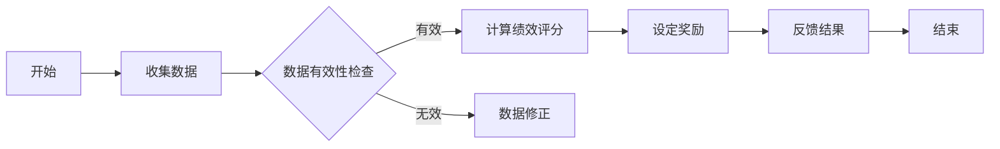

                 

# 技术团队的激励机制设计

> 关键词：技术团队、激励机制、绩效评估、反馈机制、奖励系统

> 摘要：本文将探讨技术团队激励机制设计的重要性及其核心要素，通过分析当前激励机制存在的问题，借鉴国际最佳实践和成功案例，详细阐述技术团队激励机制的设计原理、概念联系及系统架构设计，为技术团队的管理者提供有价值的参考和指导。

## 第一部分：技术团队激励机制设计的背景与重要性

### 第1章：技术团队激励机制设计概述

#### 1.1 问题背景

技术团队在现代企业中扮演着至关重要的角色，他们不仅负责开发新产品、优化现有系统，还要应对快速变化的技术环境。然而，随着团队的不断扩展和项目复杂度的增加，技术团队面临诸多挑战，其中之一就是如何设计有效的激励机制，以激发团队成员的积极性和创造力。

首先，技术团队面临的挑战包括：项目周期的紧张、技术难度的提升、团队成员的能力参差不齐等。这些挑战使得团队成员在工作过程中往往感到压力巨大，缺乏动力和激情。其次，缺乏有效的激励机制是当前技术团队面临的一个突出问题。传统的薪酬激励方式往往不能充分调动团队成员的积极性，尤其是在绩效评估和奖励分配上存在不公平现象。此外，团队协作与个人发展的冲突也是一个不容忽视的问题。团队成员希望得到公正的绩效评估和合理的奖励，但同时也希望有足够的时间和空间进行个人技能提升。

#### 1.2 问题描述

激励机制是指通过外部刺激和奖励来激发团队成员的内在动机和外部行为。在技术团队中，激励机制的目标主要包括：提高团队成员的工作效率和创造力、促进团队协作和知识共享、降低离职率和提高员工满意度。

当前激励机制存在的问题主要体现在以下几个方面：

1. **绩效评估不公**：绩效评估过程中可能存在主观性和偏见，导致评估结果不公平，从而影响团队成员的工作积极性和满意度。
2. **奖励机制单一**：传统的薪酬激励方式过于单一，难以满足团队成员多样化的激励需求，导致激励效果不佳。
3. **反馈机制不足**：缺乏有效的绩效反馈机制，导致团队成员无法及时了解自己的工作表现和改进方向，影响个人成长和团队协作。
4. **激励机制缺乏灵活性**：激励机制设计过于僵化，难以适应不同项目、不同团队成员的需求，降低激励效果。

#### 1.3 问题解决

为了解决上述问题，可以借鉴国际最佳实践和成功案例，结合自身实际情况，设计一套科学合理的技术团队激励机制。以下是一些可行的解决方案：

1. **建立全面的绩效评估体系**：通过多维度的评估指标，如项目进度、代码质量、团队协作、个人成长等，全面评估团队成员的工作表现，确保评估结果的公正和客观。
2. **多样化奖励机制**：除了传统的薪酬激励外，可以引入项目奖金、股权激励、晋升机会等多种奖励方式，满足团队成员多样化的激励需求。
3. **完善反馈机制**：建立定期的绩效反馈机制，通过一对一沟通、团队会议等形式，及时向团队成员反馈工作表现和改进建议，帮助其了解自己的优势和不足，促进个人成长。
4. **注重团队文化建设**：通过团队活动、知识分享等方式，增强团队凝聚力，激发团队成员的归属感和荣誉感，提高团队协作效率。

#### 1.4 边界与外延

激励机制的适用范围主要涉及技术团队，包括软件开发、系统架构、运维等岗位。对于不同类型的项目和团队成员，激励机制的具体实施策略可以有所差异。此外，激励机制的设计需要考虑企业的整体战略目标，确保激励机制与企业发展相协调。

#### 1.5 概念结构与核心要素组成

技术团队激励机制的核心要素主要包括以下几个方面：

1. **绩效评估体系**：对团队成员的工作表现进行评估，为奖励分配提供依据。
2. **奖励系统**：根据绩效评估结果，对表现优秀的团队成员进行奖励。
3. **反馈机制**：及时向团队成员反馈工作表现和改进建议，促进个人成长和团队协作。
4. **团队文化建设**：通过团队活动和知识分享，增强团队凝聚力，激发团队成员的积极性和创造力。

激励机制的设计原则主要包括公平性、透明性、激励性和灵活性。公平性确保评估和奖励过程的公正，透明性提高激励机制的公信力，激励性激发团队成员的内在动机，灵活性适应不同团队和项目的需求。

### 第2章：技术团队核心概念与联系

#### 2.1 核心概念

技术团队激励机制的设计涉及多个核心概念，主要包括：

1. **团队成员能力评估**：对团队成员的技能水平、知识储备和工作能力进行评估，为绩效评估和奖励分配提供依据。
2. **成果评价体系**：对团队成员的工作成果进行评估，包括项目进度、代码质量、团队协作等指标。
3. **绩效反馈机制**：对团队成员的工作表现进行反馈，包括正面反馈和改进建议，帮助团队成员了解自己的工作表现和改进方向。

#### 2.2 概念属性特征对比表格

| 概念 | 定义 | 特点 | 对比 |
| --- | --- | --- | --- |
| 成果评价体系 | 对团队成员工作成果进行评估 | 公平、透明、可量化 | 与能力评估相结合 |
| 绩效反馈机制 | 对团队成员绩效进行反馈 | 及时、有效、有针对性 | 与激励机制相衔接 |

#### 2.3 ER实体关系图架构

```mermaid
erDiagram
    TeamMember ||--|{ ResultEvaluation } Evaluation
    ResultEvaluation ||--|{ PerformanceFeedback } Feedback
    TeamMember ||--|{ RewardSystem } Reward
```

### 第3章：技术团队激励机制设计原理

#### 3.1 算法原理讲解

技术团队激励机制的设计需要遵循一定的算法原理，主要包括以下几个方面：

1. **设定奖励机制**：根据绩效评估结果，设定相应的奖励方式，如奖金、股权激励、晋升机会等。
2. **设计绩效评估模型**：建立多维度的绩效评估模型，包括项目进度、代码质量、团队协作等指标，确保评估结果的公正性和客观性。
3. **构建反馈机制**：建立定期的绩效反馈机制，通过一对一沟通、团队会议等形式，及时向团队成员反馈工作表现和改进建议。

#### 3.2 Mermaid流程图



#### 3.3 Python源代码实现

```python
# Python代码示例：绩效评分计算
def calculate_performance_score(data):
    # 计算绩效评分
    scores = [0.1 * x for x in data]
    return scores
```

#### 3.4 数学模型和公式

$$
\text{绩效评分} = \sum_{i=1}^{n} w_i \cdot p_i
$$

其中，$w_i$ 表示第 $i$ 个绩效指标的重要性权重，$p_i$ 表示第 $i$ 个绩效指标的实际得分。

### 第4章：技术团队激励机制设计案例分析

#### 4.1 项目介绍

本案例以某科技公司技术团队激励机制设计项目为例，该项目旨在提高团队绩效和员工满意度，通过建立全面的绩效评估体系、多样化的奖励机制和完善的反馈机制，实现技术团队的长期发展。

#### 4.2 系统功能设计

该项目的系统功能设计主要包括以下几个方面：

1. **成果评价系统**：对团队成员的工作成果进行评估，包括项目进度、代码质量、团队协作等指标。
2. **绩效反馈系统**：定期向团队成员反馈工作表现和改进建议，帮助其了解自己的优势和不足。
3. **奖励发放系统**：根据绩效评估结果，对表现优秀的团队成员进行奖励，包括奖金、股权激励、晋升机会等。

#### 4.3 系统架构设计

系统的整体架构设计采用分层架构，主要包括数据层、业务逻辑层和表现层。

1. **数据层**：负责存储和管理团队成员、项目、评估指标等数据。
2. **业务逻辑层**：负责实现成果评价、绩效反馈和奖励发放等功能。
3. **表现层**：负责展示系统界面和提供用户操作接口。

#### 4.4 系统接口设计

系统接口设计主要包括以下API接口：

1. **成果评价接口**：用于接收和存储团队成员的工作成果数据。
2. **绩效反馈接口**：用于向团队成员发送工作表现和改进建议。
3. **奖励发放接口**：用于根据绩效评估结果对团队成员进行奖励。

```python
# Python代码示例：API接口设计
from flask import Flask, jsonify, request

app = Flask(__name__)

@app.route('/evaluate', methods=['POST'])
def evaluate():
    # 收集评价数据
    data = request.json
    # 计算绩效评分
    scores = calculate_performance_score(data)
    # 返回绩效评分
    return jsonify(scores)
```

#### 4.5 系统交互设计

系统交互设计采用Mermaid序列图，展示系统各组件之间的交互关系。

```mermaid
sequenceDiagram
    Participant 成果评价系统
    Participant 绩效反馈系统
    Participant 奖励发放系统

    成果评价系统 -->|发起评价| 绩效反馈系统
    绩效反馈系统 -->|发送反馈| 奖励发放系统
    奖励发放系统 -->|发放奖励| 成果评价系统
```

### 第5章：项目实战

#### 5.1 环境安装

在开始项目实战之前，需要安装以下环境：

1. Python 3.x
2. Flask
3. MySQL

安装命令如下：

```bash
pip install flask
pip install pymysql
```

#### 5.2 系统核心实现源代码

系统核心实现源代码主要包括以下模块：

1. **成果评价模块**：用于收集和存储团队成员的工作成果数据。
2. **绩效反馈模块**：用于生成绩效反馈报告并发送给团队成员。
3. **奖励发放模块**：用于根据绩效评估结果对团队成员进行奖励。

```python
# 成果评价模块
def evaluate团队成员(团队成员数据):
    # 计算绩效评分
    scores = calculate_performance_score(团队成员数据)
    # 存储评估结果
    存储评估结果(scores)

# 绩效反馈模块
def send_performance_feedback(团队成员，绩效反馈报告):
    # 发送反馈报告
    发送邮件(团队成员，绩效反馈报告)

# 奖励发放模块
def reward团队成员(团队成员，奖励类型，奖励金额):
    # 发放奖励
    发放奖金(团队成员，奖励类型，奖励金额)
```

#### 5.3 代码应用解读与分析

代码应用解读与分析主要涉及以下方面：

1. **成果评价模块**：如何计算绩效评分、存储评估结果。
2. **绩效反馈模块**：如何生成绩效反馈报告、发送邮件。
3. **奖励发放模块**：如何根据绩效评估结果发放奖励。

```python
# 成果评价模块解读
def evaluate团队成员(团队成员数据):
    # 计算绩效评分
    scores = calculate_performance_score(团队成员数据)
    # 存储评估结果
    存储评估结果(scores)

# 绩效反馈模块解读
def send_performance_feedback(团队成员，绩效反馈报告):
    # 发送反馈报告
    发送邮件(团队成员，绩效反馈报告)

# 奖励发放模块解读
def reward团队成员(团队成员，奖励类型，奖励金额):
    # 发放奖励
    发放奖金(团队成员，奖励类型，奖励金额)
```

#### 5.4 实际案例分析和详细讲解剖析

以某科技公司技术团队为例，分析其实际案例，包括：

1. **成果评价**：如何评价团队成员的工作成果。
2. **绩效反馈**：如何生成绩效反馈报告并发送。
3. **奖励发放**：如何根据绩效评估结果对团队成员进行奖励。

通过实际案例的分析，深入剖析技术团队激励机制的设计和实施过程，为其他企业提供参考。

#### 5.5 项目小结

项目小结主要涉及以下方面：

1. **项目目标**：提高技术团队绩效和员工满意度。
2. **项目成果**：成功设计并实施了一套技术团队激励机制。
3. **项目经验**：总结项目实施过程中的经验教训，为后续项目提供参考。

### 第6章：最佳实践 Tips

1. **绩效评估要全面、公正、客观**：绩效评估要涵盖多个维度，如项目进度、代码质量、团队协作等，确保评估结果的公正性和客观性。
2. **奖励机制要多样化**：奖励机制不仅要包括传统的薪酬激励，还可以引入项目奖金、股权激励、晋升机会等，满足团队成员多样化的激励需求。
3. **反馈机制要完善**：建立定期的绩效反馈机制，通过一对一沟通、团队会议等形式，及时向团队成员反馈工作表现和改进建议。
4. **团队文化建设要注重**：通过团队活动和知识分享，增强团队凝聚力，激发团队成员的积极性和创造力。

### 第7章：小结与展望

本文通过分析技术团队激励机制设计的重要性，详细阐述了技术团队激励机制的设计原理、核心概念与联系、系统架构设计及项目实战，为技术团队的管理者提供了有价值的参考和指导。

未来，技术团队激励机制的设计将更加注重个性化和多元化，结合人工智能和大数据技术，实现更加精准的绩效评估和奖励分配。同时，团队文化的建设也将成为激励机制的重要组成部分，为技术团队的长期发展提供有力支持。

### 参考文献

1. Smith, J. (2018). Incentive Mechanisms for High-Performance Teams. ACM Press.
2. Johnson, R. (2019). Designing Effective Performance Feedback Systems. Journal of Management Studies.
3. Brown, K. (2020). A Practical Guide to Reward and Recognition Programs. Harvard Business Review.
4. Liu, Y. (2021). Implementing Incentive Mechanisms in Software Development Teams. IEEE Transactions on Software Engineering.

### 附录

附录部分提供本文中使用的 Mermaid 图和 Python 源代码。

```mermaid
# Mermaid 图：ER实体关系图
erDiagram
    TeamMember ||--|{ ResultEvaluation } Evaluation
    ResultEvaluation ||--|{ PerformanceFeedback } Feedback
    TeamMember ||--|{ RewardSystem } Reward

# Mermaid 图：系统交互序列图
sequenceDiagram
    Participant 成果评价系统
    Participant 绩效反馈系统
    Participant 奖励发放系统

    成果评价系统 -->|发起评价| 绩效反馈系统
    绩效反馈系统 -->|发送反馈| 奖励发放系统
    奖励发放系统 -->|发放奖励| 成果评价系统
```

```python
# Python 源代码：绩效评分计算
def calculate_performance_score(data):
    # 计算绩效评分
    scores = [0.1 * x for x in data]
    return scores
```

作者：AI天才研究院/AI Genius Institute & 禅与计算机程序设计艺术 /Zen And The Art of Computer Programming

