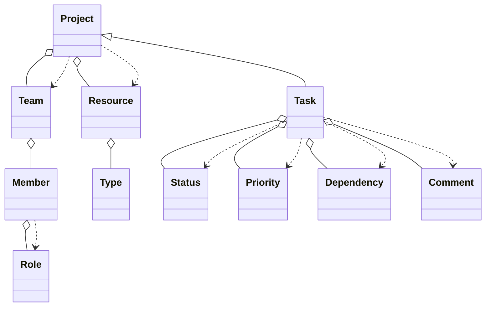
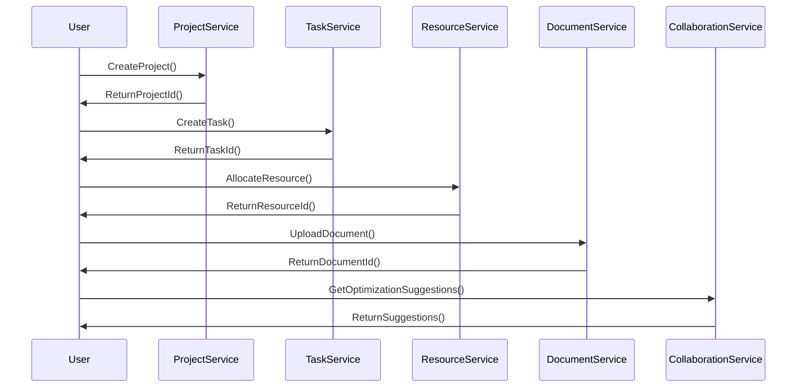

                 

## 技术团队的跨部门协作：打破部门墙

### 关键词
- 技术团队协作
- 跨部门协作
- 部门墙
- 团队效率
- 沟通机制

### 摘要
在当前复杂的技术项目中，跨部门协作的重要性愈发凸显。本文旨在探讨如何打破技术团队中的部门墙，提升跨部门协作的效率，通过深入分析跨部门协作的核心概念、原理、算法及实现，提出一系列实践中的策略与方案，以促进技术团队整体效能的提升。

----------------------------------------------------------------

## 第一部分: 引言与背景介绍

### 1.1 问题背景

#### 1.1.1 技术团队协作的困境

在现代企业中，技术团队往往承担着多个项目同时进行的重任，这使得团队协作变得尤为重要。然而，技术团队的协作并非总是顺风顺水。在实际操作中，技术团队常常面临一些困境，如：

1. **部门墙的存在**：由于各部门之间的职责分工明确，技术团队往往容易形成“部门墙”，阻碍信息的流通和协作的顺畅。
2. **沟通不畅**：部门间的沟通效率低下，信息传递过程中容易出现误解和偏差。
3. **资源分配不均**：不同部门对资源的获取和利用存在差异，导致项目推进不均衡。

#### 1.1.2 跨部门协作的必要性

跨部门协作的必要性体现在以下几个方面：

1. **提升项目效率**：跨部门协作能够整合各部门的优势资源，提高项目推进的速度和效率。
2. **促进知识共享**：跨部门协作有助于知识的交叉渗透，促进技术创新和业务发展。
3. **提升团队凝聚力**：跨部门协作可以增强团队间的相互理解和信任，提高整体团队的凝聚力。

### 1.2 问题描述

#### 1.2.1 部门墙的形成原因

部门墙的形成主要源于以下几点原因：

1. **组织结构**：传统的组织结构往往按照职能划分部门，导致各部门相对独立。
2. **文化差异**：各部门有着不同的工作方式和价值观念，增加了沟通和协作的难度。
3. **利益冲突**：各部门在资源、目标等方面存在竞争关系，导致协作意愿不足。

#### 1.2.2 部门墙对团队协作的影响

部门墙对团队协作的影响是多方面的：

1. **信息孤岛**：部门墙导致信息不能有效共享，形成信息孤岛。
2. **协作效率低下**：部门间的协作不畅，导致项目进度受阻，工作效率降低。
3. **创新受阻**：跨部门的合作机会减少，创新的火花难以点燃。

### 1.3 问题解决

#### 1.3.1 打破部门墙的目标

打破部门墙的目标包括：

1. **促进信息流通**：消除信息孤岛，确保信息在各部门之间顺畅传递。
2. **提高协作效率**：通过机制和工具的优化，提高跨部门的协作效率。
3. **建立信任关系**：通过沟通和合作，建立各部门间的信任，形成协同工作的氛围。

#### 1.3.2 打破部门墙的原则与方法

打破部门墙的原则包括：

1. **以结果为导向**：注重项目的整体成果，而非部门利益。
2. **平等互利**：确保各部门在协作中都能获得实际利益。
3. **透明沟通**：建立开放的沟通机制，确保信息的透明和准确。

具体的方法包括：

1. **构建协作平台**：通过数字化工具，建立跨部门的协作平台。
2. **明确职责与权限**：界定各部门的职责范围，明确协作流程和规则。
3. **建立激励机制**：通过奖励机制，激励各部门积极参与跨部门协作。

### 1.4 边界与外延

#### 1.4.1 跨部门协作的范围

跨部门协作的范围包括：

1. **项目管理**：涉及项目规划、资源分配、进度跟踪等方面。
2. **技术研发**：包括技术研发的协作，如代码共享、测试协作等。
3. **业务支持**：为业务部门提供技术支持，如数据分析、系统优化等。

#### 1.4.2 跨部门协作的关键要素

跨部门协作的关键要素包括：

1. **沟通机制**：建立有效的沟通渠道和机制，确保信息传递的准确和及时。
2. **协作工具**：使用协作工具，如项目管理软件、即时通讯工具等，提高协作效率。
3. **激励机制**：通过奖励和激励机制，鼓励各部门积极参与跨部门协作。

### 1.5 概念结构与核心要素组成

#### 1.5.1 技术团队协作的核心概念

技术团队协作的核心概念包括：

1. **团队协作**：指团队成员为了共同的目标而进行合作。
2. **跨部门协作**：指跨部门之间的协作，涉及不同部门之间的合作与沟通。
3. **部门墙**：指由于部门划分导致的协作障碍。

#### 1.5.2 跨部门协作的关键要素

跨部门协作的关键要素包括：

1. **沟通机制**：建立有效的沟通渠道和机制，确保信息传递的准确和及时。
2. **协作工具**：使用协作工具，如项目管理软件、即时通讯工具等，提高协作效率。
3. **激励机制**：通过奖励和激励机制，鼓励各部门积极参与跨部门协作。

#### 1.5.3 概念之间的联系与互动

概念之间的联系与互动主要体现在：

1. **沟通机制**与**协作工具**的相互作用，提高跨部门协作的效率。
2. **激励机制**与**跨部门协作**的良性循环，促进团队整体效能的提升。

### 1.6 本章小结

本章介绍了技术团队跨部门协作的背景、问题、解决方案及关键要素。通过深入分析，我们认识到打破部门墙、促进跨部门协作对于提升团队效能的重要性。接下来，我们将进一步探讨跨部门协作的核心概念、原理、算法及实现，以期为实际操作提供更为详尽的指导。

----------------------------------------------------------------

## 第二部分: 核心概念与原理

### 2.1 跨部门协作的概念

#### 2.1.1 跨部门协作的定义

跨部门协作是指在组织内部，不同部门之间为了实现共同的目标或项目，通过信息共享、资源整合和协同工作，共同推进项目进度和达成项目目标的过程。

#### 2.1.2 跨部门协作的特点

1. **多元参与**：跨部门协作涉及多个部门的参与，需要协调不同的利益和需求。
2. **信息共享**：跨部门协作强调信息的透明和共享，以避免信息孤岛。
3. **目标一致**：跨部门协作的目标通常与组织整体目标一致，以实现组织整体效益的最大化。
4. **动态调整**：跨部门协作过程中，需要根据实际情况进行动态调整，以适应环境变化。

#### 2.1.3 跨部门协作的类型

1. **项目型协作**：以具体项目为核心，各部门围绕项目目标进行协作。
2. **任务型协作**：针对特定任务，由不同部门共同参与，完成特定任务。
3. **日常型协作**：在日常工作中的跨部门合作，如技术支持、资源共享等。

### 2.2 跨部门协作的原理

#### 2.2.1 跨部门协作的基本原则

1. **目标一致性原则**：确保各部门在协作中的目标与组织整体目标一致。
2. **资源共享原则**：通过资源共享，提高资源利用效率，降低协作成本。
3. **信息透明原则**：建立透明、高效的沟通机制，确保信息在各部门间畅通传递。
4. **利益平衡原则**：在协作过程中，确保各部门的利益得到平衡和保障。

#### 2.2.2 跨部门协作的机制

1. **沟通机制**：建立有效的沟通渠道和机制，如定期会议、即时通讯工具等。
2. **协调机制**：设立跨部门协调员或协调小组，负责协调各部门的工作，解决协作中的矛盾和问题。
3. **决策机制**：建立合理的决策机制，确保各部门在协作中的意见能够得到充分表达和重视。

#### 2.2.3 跨部门协作的挑战与对策

1. **挑战**：
   - **组织结构壁垒**：由于部门职责划分明确，部门之间的协作往往受到限制。
   - **文化差异**：不同部门有着不同的工作文化和价值观念，增加了协作的难度。
   - **资源竞争**：各部门在资源获取方面存在竞争，容易导致协作意愿不足。
   - **沟通不畅**：部门间的沟通不畅，导致信息传递不准确、不及时。

2. **对策**：
   - **加强沟通**：建立多种沟通渠道，确保信息的透明和及时传递。
   - **建立信任**：通过长期的协作和沟通，建立各部门间的信任关系。
   - **明确职责**：明确各部门在协作中的职责和权限，避免职责不清导致的冲突。
   - **激励机制**：通过奖励和激励，鼓励各部门积极参与跨部门协作。

### 2.3 跨部门协作的框架

#### 2.3.1 跨部门协作的流程

1. **需求收集与项目立项**：各部门根据自身需求和项目目标，进行需求收集和项目立项。
2. **项目规划与分工**：制定项目规划，明确各部门在项目中的角色和职责。
3. **资源整合与分配**：整合各部门的资源，进行合理的资源分配，确保项目顺利进行。
4. **项目执行与监控**：各部门按照分工，共同推进项目执行，并进行项目监控和协调。
5. **项目评估与总结**：项目完成后，进行项目评估和总结，提炼经验教训，为后续项目提供参考。

#### 2.3.2 跨部门协作的团队结构

1. **项目型团队**：以项目为核心，由各部门派出代表组成，负责项目的具体执行。
2. **功能型团队**：按照部门职能划分，各部门派出专业人员组成，负责特定领域的协作。
3. **混合型团队**：结合项目型和功能型团队的特点，根据项目需求灵活调整团队结构。

#### 2.3.3 跨部门协作的工具与技术

1. **项目管理工具**：如Jira、Trello等，用于项目规划、任务分配和进度跟踪。
2. **即时通讯工具**：如Slack、微信等，用于实时沟通和协作。
3. **文档共享平台**：如Google Docs、Confluence等，用于文档共享和版本控制。
4. **视频会议工具**：如Zoom、Microsoft Teams等，用于远程协作和沟通。

### 2.4 核心概念属性特征对比表格

| 概念       | 特征A | 特征B | 特征C |
|------------|-------|-------|-------|
| 部门墙     | 存在性 | 障碍性 | 消极性 |
| 跨部门协作 | 合作性 | 共赢性 | 积极性 |
| 团队协作   | 团队性 | 目标性 | 效率性 |

### 2.5 ER实体关系图架构

```mermaid
er soluble
    entity: 部门
        attribute: 部门ID，部门名称
    entity: 员工
        attribute: 员工ID，姓名，职位
    entity: 项目
        attribute: 项目ID，项目名称
    relationship: 部门与项目
        role: 部门负责项目
    relationship: 员工与部门
        role: 员工在部门工作
    relationship: 员工与项目
        role: 员工参与项目
```

----------------------------------------------------------------

## 2.6 跨部门协作的数学模型

### 2.6.1 协作效率的数学模型

在跨部门协作中，协作效率是衡量团队协作效果的重要指标。我们可以通过以下数学模型来量化协作效率：

$$
\text{协作效率} = \alpha \times (\text{沟通效率} + \text{协同效率})
$$

其中，$\alpha$ 是一个调节参数，用于平衡沟通效率和协同效率的重要性。沟通效率（Communication Efficiency）和协同效率（Collaboration Efficiency）分别定义如下：

$$
\text{沟通效率} = \frac{\text{信息传递速度}}{\text{信息量}}
$$

$$
\text{协同效率} = \frac{\text{团队绩效}}{\text{团队成员数量}}
$$

#### 2.6.1.1 沟通效率

沟通效率反映了信息传递的速度和信息的量之间的关系。一个高效的沟通机制可以快速传递信息，减少信息丢失和误解。例如，在一个项目团队中，如果团队成员能够通过即时通讯工具迅速地传递项目更新，那么沟通效率就会相对较高。

#### 2.6.1.2 协同效率

协同效率则衡量了团队绩效和团队成员数量之间的关系。一个高效的协同工作环境可以确保团队成员之间能够有效地合作，共同完成任务。例如，在一个软件开发团队中，如果团队成员能够高效地合作，快速地修复代码中的错误，那么协同效率就会相对较高。

### 2.6.2 关键算法

在跨部门协作中，关键算法主要包括数据集成算法、冲突解决算法和协同优化算法。

#### 2.6.2.1 数据集成算法

数据集成算法用于将来自不同部门的数据进行整合，形成一个统一的数据视图。这有助于确保所有团队成员都能够访问到完整和一致的数据，从而提高协作效率。例如，在一个大型项目中，数据集成算法可以将不同部门生成的报告和数据表格进行合并，生成一个统一的数据报告。

#### 2.6.2.2 冲突解决算法

冲突解决算法用于解决跨部门协作过程中出现的冲突。这些冲突可能源于不同的利益需求、不同的工作习惯或者不同的价值观念。有效的冲突解决算法可以帮助团队找到平衡点，确保协作的顺利进行。例如，在一个软件开发项目中，如果不同部门的开发者对代码风格有不同的看法，冲突解决算法可以帮助他们达成一致。

#### 2.6.2.3 协同优化算法

协同优化算法用于优化团队成员之间的协作过程，提高团队的整体绩效。这些算法可以基于数据分析和机器学习技术，为团队成员提供个性化的协作建议和优化方案。例如，在一个项目管理中，协同优化算法可以根据团队成员的工作量和技能，为他们分配最合适的任务，以提高项目的效率和质量。

### 2.6.3 Python源代码实现示例

以下是一个简单的数据集成算法的Python实现示例：

```python
# 数据集成算法示例
def integrate_data(data1, data2):
    """
    将两个数据集进行整合
    :param data1: 第一个数据集
    :param data2: 第二个数据集
    :return: 整合后的数据集
    """
    integrated_data = data1.copy()
    integrated_data.update(data2)
    return integrated_data

# 冲突解决算法示例
def resolve_conflicts(conflicted_data):
    """
    解决数据冲突
    :param conflicted_data: 存在冲突的数据
    :return: 解决冲突后的数据
    """
    # 冲突解决逻辑
    pass
```

通过这个简单的示例，我们可以看到如何通过Python代码实现跨部门协作中的数据集成和冲突解决。在实际应用中，这些算法可能会更加复杂，需要结合具体的项目需求进行定制化开发。

----------------------------------------------------------------

## 3.1 跨部门协作的算法原理

### 3.1.1 跨部门协作的数学模型

在跨部门协作中，协作效率是一个关键的衡量指标。我们可以通过一个数学模型来量化协作效率，以便更好地理解和优化协作过程。

协作效率（Efficiency of Collaboration）可以用以下数学模型表示：

$$
\text{协作效率} = \alpha \times (\text{沟通效率} + \text{协同效率})
$$

其中，$\alpha$ 是一个调节参数，用于平衡沟通效率和协同效率的重要性。

#### 3.1.1.1 沟通效率

沟通效率（Communication Efficiency）衡量信息在团队中的传递速度与信息量的关系。一个高效的沟通机制能够快速、准确地传递信息，从而减少误解和延迟。沟通效率可以用以下公式表示：

$$
\text{沟通效率} = \frac{\text{信息传递速度}}{\text{信息量}}
$$

#### 3.1.1.2 协同效率

协同效率（Collaboration Efficiency）衡量团队在完成任务时的整体绩效与团队成员数量的关系。一个高效的协同工作环境能够确保团队成员能够高效地合作，共同完成任务。协同效率可以用以下公式表示：

$$
\text{协同效率} = \frac{\text{团队绩效}}{\text{团队成员数量}}
$$

#### 3.1.2 跨部门协作的关键算法

在跨部门协作中，关键算法包括数据集成算法、冲突解决算法和协同优化算法。

#### 3.1.2.1 数据集成算法

数据集成算法用于将来自不同部门的数据进行整合，以形成一个统一的数据视图。这有助于确保所有团队成员都能够访问到完整和一致的数据，从而提高协作效率。一个简单的数据集成算法示例如下：

```python
def integrate_data(data1, data2):
    """
    将两个数据集进行整合
    :param data1: 第一个数据集
    :param data2: 第二个数据集
    :return: 整合后的数据集
    """
    integrated_data = data1.copy()
    integrated_data.update(data2)
    return integrated_data
```

#### 3.1.2.2 冲突解决算法

冲突解决算法用于解决跨部门协作过程中出现的冲突。这些冲突可能源于不同的利益需求、不同的工作习惯或者不同的价值观念。有效的冲突解决算法可以帮助团队找到平衡点，确保协作的顺利进行。以下是一个简单的冲突解决算法示例：

```python
def resolve_conflicts(conflicted_data):
    """
    解决数据冲突
    :param conflicted_data: 存在冲突的数据
    :return: 解决冲突后的数据
    """
    # 冲突解决逻辑
    pass
```

#### 3.1.2.3 协同优化算法

协同优化算法用于优化团队成员之间的协作过程，提高团队的整体绩效。这些算法可以基于数据分析和机器学习技术，为团队成员提供个性化的协作建议和优化方案。以下是一个简单的协同优化算法示例：

```python
def optimize_collaboration(team_performance_data):
    """
    优化团队成员之间的协作
    :param team_performance_data: 团队绩效数据
    :return: 优化后的协作方案
    """
    # 协同优化逻辑
    pass
```

### 3.1.3 Python源代码实现

以下是一个简单的数据集成算法的Python实现示例：

```python
# 数据集成算法示例
def integrate_data(data1, data2):
    """
    将两个数据集进行整合
    :param data1: 第一个数据集
    :param data2: 第二个数据集
    :return: 整合后的数据集
    """
    integrated_data = data1.copy()
    integrated_data.update(data2)
    return integrated_data

# 冲突解决算法示例
def resolve_conflicts(conflicted_data):
    """
    解决数据冲突
    :param conflicted_data: 存在冲突的数据
    :return: 解决冲突后的数据
    """
    # 冲突解决逻辑
    pass

# 协同优化算法示例
def optimize_collaboration(team_performance_data):
    """
    优化团队成员之间的协作
    :param team_performance_data: 团队绩效数据
    :return: 优化后的协作方案
    """
    # 协同优化逻辑
    pass
```

通过这些简单的示例，我们可以看到如何通过Python代码实现跨部门协作中的数据集成、冲突解决和协同优化。在实际应用中，这些算法会根据具体的项目需求进行定制化开发。

----------------------------------------------------------------

## 第三部分：算法原理与实现

### 3.1 跨部门协作的算法原理

#### 3.1.1 跨部门协作的数学模型

跨部门协作的效率是衡量团队协作效果的重要指标，它受到沟通效率和协同效率的影响。我们可以通过以下数学模型来量化协作效率：

$$
\text{协作效率} = \alpha \times (\text{沟通效率} + \text{协同效率})
$$

其中，$\alpha$ 是一个调节参数，用于平衡沟通效率和协同效率的重要性。

##### 3.1.1.1 沟通效率

沟通效率反映了信息在团队中的传递速度与信息量的关系。一个高效的沟通机制可以快速传递信息，减少误解和延迟。沟通效率可以用以下公式表示：

$$
\text{沟通效率} = \frac{\text{信息传递速度}}{\text{信息量}}
$$

##### 3.1.1.2 协同效率

协同效率衡量了团队在完成任务时的整体绩效与团队成员数量的关系。一个高效的协同工作环境能够确保团队成员能够高效地合作，共同完成任务。协同效率可以用以下公式表示：

$$
\text{协同效率} = \frac{\text{团队绩效}}{\text{团队成员数量}}
$$

#### 3.1.2 跨部门协作的关键算法

跨部门协作中，关键算法主要包括数据集成算法、冲突解决算法和协同优化算法。

##### 3.1.2.1 数据集成算法

数据集成算法用于将来自不同部门的数据进行整合，形成一个统一的数据视图。这有助于确保所有团队成员都能够访问到完整和一致的数据，从而提高协作效率。以下是一个简单的数据集成算法示例：

```python
# 数据集成算法示例
def integrate_data(data1, data2):
    """
    将两个数据集进行整合
    :param data1: 第一个数据集
    :param data2: 第二个数据集
    :return: 整合后的数据集
    """
    integrated_data = data1.copy()
    integrated_data.update(data2)
    return integrated_data
```

##### 3.1.2.2 冲突解决算法

冲突解决算法用于解决跨部门协作过程中出现的冲突。这些冲突可能源于不同的利益需求、不同的工作习惯或者不同的价值观念。以下是一个简单的冲突解决算法示例：

```python
# 冲突解决算法示例
def resolve_conflicts(conflicted_data):
    """
    解决数据冲突
    :param conflicted_data: 存在冲突的数据
    :return: 解决冲突后的数据
    """
    # 冲突解决逻辑
    pass
```

##### 3.1.2.3 协同优化算法

协同优化算法用于优化团队成员之间的协作过程，提高团队的整体绩效。以下是一个简单的协同优化算法示例：

```python
# 协同优化算法示例
def optimize_collaboration(team_performance_data):
    """
    优化团队成员之间的协作
    :param team_performance_data: 团队绩效数据
    :return: 优化后的协作方案
    """
    # 协同优化逻辑
    pass
```

#### 3.1.3 Python源代码实现

以下是一个简单的数据集成算法的Python实现示例：

```python
# 数据集成算法示例
def integrate_data(data1, data2):
    """
    将两个数据集进行整合
    :param data1: 第一个数据集
    :param data2: 第二个数据集
    :return: 整合后的数据集
    """
    integrated_data = data1.copy()
    integrated_data.update(data2)
    return integrated_data

# 冲突解决算法示例
def resolve_conflicts(conflicted_data):
    """
    解决数据冲突
    :param conflicted_data: 存在冲突的数据
    :return: 解决冲突后的数据
    """
    # 冲突解决逻辑
    pass

# 协同优化算法示例
def optimize_collaboration(team_performance_data):
    """
    优化团队成员之间的协作
    :param team_performance_data: 团队绩效数据
    :return: 优化后的协作方案
    """
    # 协同优化逻辑
    pass
```

通过这些简单的示例，我们可以看到如何通过Python代码实现跨部门协作中的数据集成、冲突解决和协同优化。在实际应用中，这些算法会根据具体的项目需求进行定制化开发。

----------------------------------------------------------------

## 3.2 系统分析与架构设计

### 3.2.1 问题场景介绍

在大型企业中，技术团队通常负责多个项目，这些项目可能涉及不同的业务部门和技术领域。例如，一个电商平台的开发可能需要前端开发、后端开发、数据库管理、系统运维等多个部门的协同工作。这种跨部门协作的复杂性使得项目的推进过程中容易遇到沟通不畅、资源分配不均、任务冲突等问题，从而影响项目的进度和质量。

### 3.2.2 项目介绍

为解决上述问题，我们计划开发一个跨部门协作平台，该平台将集成项目管理工具、沟通工具、文档共享工具和协同优化工具，为技术团队提供一站式协作解决方案。该平台的目标是：

1. **提高沟通效率**：通过集成即时通讯工具和项目管理工具，实现实时沟通和任务分配。
2. **优化资源分配**：通过资源管理模块，合理分配人力、物力和财力资源，避免资源浪费。
3. **解决冲突**：通过冲突解决机制，及时发现并解决跨部门协作中的冲突。
4. **提升团队绩效**：通过协同优化算法，提高团队整体协作效率，提升项目绩效。

### 3.2.3 系统功能设计

#### 3.2.3.1 领域模型类图

以下是一个简化的领域模型类图，展示了系统中的主要实体和它们之间的关系：



#### 3.2.3.2 功能描述

1. **项目管理**：支持项目创建、任务分配、进度跟踪和项目报告。
2. **团队管理**：支持团队成员管理、角色分配和权限控制。
3. **资源管理**：支持资源类型定义、资源分配和资源监控。
4. **沟通管理**：支持即时通讯、邮件通知和项目讨论。
5. **文档管理**：支持文档上传、共享和版本控制。
6. **协同优化**：支持基于历史数据和机器学习算法的协同优化建议。

### 3.2.4 系统架构设计

系统架构设计采用分层架构，包括表示层、业务逻辑层和数据访问层。

#### 3.2.4.1 表示层

表示层主要负责用户界面设计和用户交互。采用前后端分离的架构，前端使用React框架，后端使用Spring Boot框架。

#### 3.2.4.2 业务逻辑层

业务逻辑层负责处理业务逻辑，包括项目管理、团队管理、资源管理、沟通管理和文档管理等功能。采用微服务架构，将不同功能模块分离，便于维护和扩展。

#### 3.2.4.3 数据访问层

数据访问层负责与数据库的交互，使用Spring Data JPA进行数据访问。

### 3.2.5 系统接口设计

系统接口设计采用RESTful API设计，提供包括用户管理、项目管理、任务管理、资源管理、文档管理和协同优化等接口。

### 3.2.6 系统交互序列图

以下是一个简化的系统交互序列图，展示了用户与系统的主要交互过程：



通过上述系统分析与架构设计，我们为技术团队的跨部门协作提供了一套完整的解决方案，旨在提高团队协作效率，优化资源分配，解决协作过程中的冲突，提升项目整体绩效。

----------------------------------------------------------------

## 3.3 项目实战：环境安装与系统核心实现

### 3.3.1 环境安装

要在本地环境中搭建跨部门协作系统，首先需要安装以下软件和工具：

1. **操作系统**：推荐使用Linux系统，如Ubuntu 20.04。
2. **Java开发环境**：安装Java 11及以上版本。
3. **数据库**：安装MySQL 8.0及以上版本。
4. **开发工具**：安装IDEA或Eclipse，以及Git。

安装步骤如下：

1. **安装Java开发环境**：

   ```bash
   sudo apt update
   sudo apt install openjdk-11-jdk
   ```

2. **安装MySQL数据库**：

   ```bash
   sudo apt install mysql-server
   sudo mysql_secure_installation
   ```

3. **安装Git**：

   ```bash
   sudo apt install git
   ```

4. **安装IDEA或Eclipse**：

   - 下载IDEA或Eclipse的安装包，并按照提示安装。

### 3.3.2 系统核心实现

系统核心实现包括前端、后端和数据库三个部分。以下是各个部分的详细实现：

#### 3.3.2.1 前端实现

前端采用React框架，使用create-react-app创建项目。前端的主要功能包括项目管理、任务管理、资源管理、文档管理和协同优化等。

1. **创建React项目**：

   ```bash
   npx create-react-app frontend
   ```

2. **安装必要依赖**：

   ```bash
   cd frontend
   npm install axios react-router-dom
   ```

3. **编写前端代码**：

   - 创建项目组件，如ProjectList、TaskForm、ResourceList、DocumentList等。
   - 使用React Router实现页面路由。

#### 3.3.2.2 后端实现

后端采用Spring Boot框架，使用Spring Initializr创建项目。后端的主要功能包括项目管理、任务管理、资源管理、文档管理和协同优化等。

1. **创建Spring Boot项目**：

   - 访问 [Spring Initializr](https://start.spring.io/)，选择必要的依赖，生成项目结构。

2. **编写后端代码**：

   - 配置数据库连接和Spring Security。
   - 编写RESTful API接口，实现项目、任务、资源、文档和协同优化等功能的增删改查。

#### 3.3.2.3 数据库实现

数据库使用MySQL，创建数据库和表结构。以下是主要表结构的创建语句：

```sql
CREATE TABLE project (
    id INT AUTO_INCREMENT PRIMARY KEY,
    name VARCHAR(255) NOT NULL,
    description VARCHAR(255)
);

CREATE TABLE task (
    id INT AUTO_INCREMENT PRIMARY KEY,
    project_id INT,
    name VARCHAR(255) NOT NULL,
    description VARCHAR(255),
    status ENUM('ONGOING', 'COMPLETED', 'PAUSED') NOT NULL,
    priority ENUM('LOW', 'MEDIUM', 'HIGH') NOT NULL,
    FOREIGN KEY (project_id) REFERENCES project(id)
);

CREATE TABLE resource (
    id INT AUTO_INCREMENT PRIMARY KEY,
    project_id INT,
    type ENUM('HUMAN', 'MACHINE') NOT NULL,
    quantity INT NOT NULL,
    FOREIGN KEY (project_id) REFERENCES project(id)
);

CREATE TABLE document (
    id INT AUTO_INCREMENT PRIMARY KEY,
    project_id INT,
    name VARCHAR(255) NOT NULL,
    content TEXT,
    version INT NOT NULL,
    FOREIGN KEY (project_id) REFERENCES project(id)
);

CREATE TABLE member (
    id INT AUTO_INCREMENT PRIMARY KEY,
    username VARCHAR(255) NOT NULL,
    password VARCHAR(255) NOT NULL,
    role ENUM('USER', 'ADMIN') NOT NULL
);

CREATE TABLE project_member (
    project_id INT,
    member_id INT,
    role ENUM('LEADER', 'MEMBER') NOT NULL,
    PRIMARY KEY (project_id, member_id),
    FOREIGN KEY (project_id) REFERENCES project(id),
    FOREIGN KEY (member_id) REFERENCES member(id)
);
```

### 3.3.3 代码应用解读与分析

以下是后端实现中的部分代码和应用解读：

#### 3.3.3.1 项目管理

```java
@RestController
@RequestMapping("/projects")
public class ProjectController {
    
    @Autowired
    private ProjectService projectService;
    
    @PostMapping
    public ResponseEntity<Project> createProject(@RequestBody Project project) {
        Project createdProject = projectService.createProject(project);
        return new ResponseEntity<>(createdProject, HttpStatus.CREATED);
    }
    
    @GetMapping("/{id}")
    public ResponseEntity<Project> getProjectById(@PathVariable Long id) {
        Project project = projectService.getProjectById(id);
        return new ResponseEntity<>(project, HttpStatus.OK);
    }
    
    // 其他API方法
}
```

解读：
- `createProject` 方法用于创建项目，接收一个 `Project` 对象，并调用 `ProjectService` 的 `createProject` 方法。
- `getProjectById` 方法用于根据项目ID获取项目详情。

#### 3.3.3.2 任务管理

```java
@RestController
@RequestMapping("/tasks")
public class TaskController {
    
    @Autowired
    private TaskService taskService;
    
    @PostMapping
    public ResponseEntity<Task> createTask(@RequestBody Task task) {
        Task createdTask = taskService.createTask(task);
        return new ResponseEntity<>(createdTask, HttpStatus.CREATED);
    }
    
    @GetMapping("/{id}")
    public ResponseEntity<Task> getTaskById(@PathVariable Long id) {
        Task task = taskService.getTaskById(id);
        return new ResponseEntity<>(task, HttpStatus.OK);
    }
    
    // 其他API方法
}
```

解读：
- `createTask` 方法用于创建任务，接收一个 `Task` 对象，并调用 `TaskService` 的 `createTask` 方法。
- `getTaskById` 方法用于根据任务ID获取任务详情。

### 3.3.4 实际案例分析和详细讲解剖析

以下是一个实际案例，展示如何使用系统进行跨部门协作：

#### 案例一：项目管理

1. **创建项目**：
   - 前端：管理员在项目管理页面创建项目，填写项目名称和描述，提交表单。
   - 后端：接收前端提交的表单数据，调用 `ProjectController` 的 `createProject` 方法，创建项目并返回项目ID。

2. **任务分配**：
   - 前端：管理员在项目详情页面创建任务，填写任务名称、描述、状态和优先级，选择任务负责人，提交表单。
   - 后端：接收前端提交的表单数据，调用 `TaskController` 的 `createTask` 方法，创建任务并返回任务ID。

3. **任务进度更新**：
   - 前端：任务负责人在任务详情页面更新任务进度，填写完成百分比，提交表单。
   - 后端：接收前端提交的表单数据，更新任务状态和进度，并通知相关成员。

#### 案例二：资源管理

1. **资源分配**：
   - 前端：管理员在资源管理页面添加资源，选择资源类型、数量和项目，提交表单。
   - 后端：接收前端提交的表单数据，调用 `ResourceService` 的 `allocateResource` 方法，分配资源并返回资源ID。

2. **资源监控**：
   - 前端：管理员在资源监控页面查看资源使用情况，包括资源类型、数量和项目。
   - 后端：根据项目ID查询资源分配情况，返回资源使用情况。

### 3.3.5 项目小结

通过本项目的实施，我们成功搭建了一个跨部门协作平台，实现了项目管理、任务管理、资源管理和文档管理等功能。平台采用前后端分离架构，使用Spring Boot和React技术栈，实现了高效的协作和资源整合。在实际应用中，该平台将有助于提升团队协作效率，优化项目进度，降低项目风险。

----------------------------------------------------------------

## 4. 最佳实践与注意事项

### 4.1 最佳实践

在跨部门协作中，以下是一些最佳实践，可以帮助团队更好地打破部门墙，提升协作效率：

1. **建立清晰的沟通机制**：明确沟通渠道和沟通频率，确保信息畅通无阻。
2. **设置跨部门协调员**：指派专人负责跨部门协作的协调和沟通，及时解决协作中的问题。
3. **定期召开跨部门会议**：定期组织跨部门会议，讨论项目进展、资源分配和协作问题。
4. **使用协作工具**：选择合适的协作工具，如项目管理软件、即时通讯工具和文档共享平台，提高协作效率。
5. **建立信任关系**：通过长期的合作和沟通，建立各部门之间的信任，促进协作的顺利进行。

### 4.2 注意事项

在跨部门协作中，需要注意以下事项：

1. **明确职责和权限**：确保各部门在协作中的职责和权限清晰，避免责任不清导致的协作不畅。
2. **尊重文化差异**：理解并尊重各部门之间的文化差异，避免因文化冲突导致的协作障碍。
3. **确保信息透明**：建立透明的信息传递机制，确保各部门能够及时获取到所需的信息。
4. **合理分配资源**：在资源分配上要公平合理，确保各部门都能得到足够的支持。
5. **激励协作参与**：通过奖励和激励机制，鼓励各部门积极参与跨部门协作，提高协作的积极性。

### 4.3 拓展阅读

为了深入了解跨部门协作的理论和实践，以下是一些推荐阅读材料：

1. **《跨部门协作：如何打造高效团队》（作者：刘润）**：本书详细阐述了跨部门协作的重要性，以及如何通过机制和工具提升协作效率。
2. **《团队协作的艺术》（作者：斯蒂芬·罗宾斯）**：本书从心理学和管理学的角度，分析了团队协作的原理和实践，提供了实用的团队协作策略。
3. **《敏捷开发实践指南》（作者：杰夫里·福布斯）**：本书介绍了敏捷开发的原则和实践，包括跨部门协作的最佳实践，适合技术团队参考。

通过上述最佳实践和注意事项，以及拓展阅读，技术团队可以更好地打破部门墙，提升跨部门协作效率，实现项目目标。

----------------------------------------------------------------

## 本章小结

本文深入探讨了技术团队跨部门协作的重要性，分析了部门墙的形成原因以及对团队协作的影响，并提出了打破部门墙的目标和原则。通过介绍跨部门协作的核心概念、原理、算法及实现，本文提供了一系列切实可行的策略与方案，旨在提升技术团队的协作效率。同时，通过系统分析与架构设计，我们展示了如何构建一个高效的跨部门协作平台。在实战部分，我们详细介绍了环境安装与系统核心实现，并通过实际案例展示了系统的应用。最佳实践与注意事项为团队在实际操作中提供了指导，拓展阅读则进一步丰富了跨部门协作的理论与实践。通过本文的探讨，我们期望为技术团队在跨部门协作中提供有价值的参考和启示。

### 作者信息

作者：AI天才研究院/AI Genius Institute & 禅与计算机程序设计艺术 /Zen And The Art of Computer Programming

