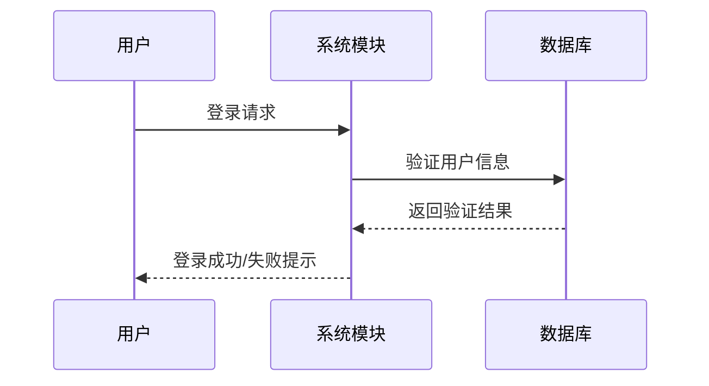
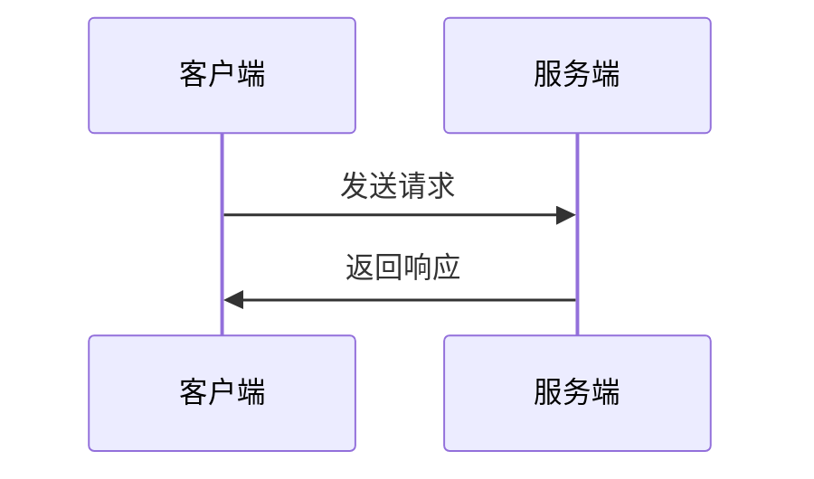

                 

### 《技术培训体系：系统化提升团队能力》

#### 关键词：技术培训、团队能力提升、系统化、培训体系、培训效果评估

#### 摘要：
在信息技术飞速发展的今天，团队能力已成为企业竞争力的重要标志。本文将探讨如何构建一套系统化的技术培训体系，以有效提升团队的整体能力。通过分析现有培训体系的不足，提出核心概念、原则与策略，并结合实际案例，展示系统化培训的实施方法和最佳实践，以期为企业提供一套实用的技术培训解决方案。

### 目录大纲设计

#### 1. 确定书的核心内容和结构

##### 第一部分：背景介绍
- **第1章：技术培训体系的背景与意义**
- **第2章：当前技术培训体系的现状**
- **第3章：技术培训体系的发展趋势**

##### 第二部分：核心概念
- **第4章：系统化提升团队能力的核心概念**
- **第5章：团队能力提升的策略与原则**
- **第6章：技术培训体系的关键要素**

##### 第三部分：实施方法
- **第7章：培训计划的制定与执行**
- **第8章：培训资源的管理与优化**
- **第9章：培训效果的评估与改进**

##### 第四部分：案例分析
- **第10章：不同场景下的技术培训案例分析**
- **第11章：技术培训体系实施中的挑战与解决策略**

##### 第五部分：最佳实践
- **第12章：技术培训体系的成功经验分享**
- **第13章：实用实践建议与注意事项**
- **第14章：展望与未来发展方向**

#### 2. 确定目录大纲的层级结构

以上目录结构涵盖了技术培训体系的背景、核心概念、实施方法、案例分析和最佳实践，确保内容完整性。

#### 3. 确保内容完整性

- **核心概念与联系**：通过定义、对比表格和Mermaid流程图，阐述核心概念。
- **算法原理讲解**：结合Python源代码和Mermaid流程图，讲解算法原理。
- **系统分析与架构设计方案**：介绍问题场景，展示系统设计图。
- **项目实战**：环境安装、核心实现、代码分析、实际案例剖析。

#### 4. 输出格式与字数限制

- **输出格式**：Markdown格式。
- **字数限制**：10000～12000字。

#### 5. 举例

以下是章节目录的Markdown格式示例：

```
# 《技术培训体系：系统化提升团队能力》

# 第一部分：背景介绍

## 第1章：技术培训体系的背景与意义
### 1.1 问题背景
### 1.2 问题描述
### 1.3 问题解决
### 1.4 边界与外延
### 1.5 概念结构与核心要素组成

## 第2章：当前技术培训体系的现状
### 2.1 现状概述
### 2.2 存在的问题
### 2.3 发展的挑战

## 第3章：技术培训体系的发展趋势
### 3.1 发展趋势分析
### 3.2 未来展望

# 第二部分：核心概念

## 第4章：系统化提升团队能力的核心概念
### 4.1 系统化培训的概念
### 4.2 团队能力提升的概念
### 4.3 系统化提升团队能力的理论基础

## 第5章：团队能力提升的策略与原则
### 5.1 培训策略
### 5.2 培训原则

## 第6章：技术培训体系的关键要素
### 6.1 培训目标
### 6.2 培训内容
### 6.3 培训对象
### 6.4 培训方式

# 第三部分：实施方法

## 第7章：培训计划的制定与执行
### 7.1 培训计划制定
### 7.2 培训计划执行
### 7.3 培训计划评估

## 第8章：培训资源的管理与优化
### 8.1 培训资源概述
### 8.2 培训资源管理
### 8.3 培训资源优化

## 第9章：培训效果的评估与改进
### 9.1 培训效果评估方法
### 9.2 培训效果分析
### 9.3 培训效果改进策略

# 第四部分：案例分析

## 第10章：不同场景下的技术培训案例分析
### 10.1 场景1：企业内部培训
### 10.2 场景2：在线培训
### 10.3 场景3：跨界合作培训

## 第11章：技术培训体系实施中的挑战与解决策略
### 11.1 挑战1：培训需求不明确
### 11.2 挑战2：培训资源不足
### 11.3 挑战3：培训效果评估困难

# 第五部分：最佳实践

## 第12章：技术培训体系的成功经验分享
### 12.1 经验1：明确培训目标
### 12.2 经验2：优化培训资源
### 12.3 经验3：注重培训效果评估

## 第13章：实用实践建议与注意事项
### 13.1 建议一：定制化培训
### 13.2 建议二：多样化培训方式
### 13.3 注意事项：持续改进与优化

## 第14章：展望与未来发展方向
### 14.1 技术培训的发展趋势
### 14.2 未来发展方向
```

### 文章正文结构

#### 1. 引言
介绍技术培训体系的重要性，提出研究目的和文章结构。

#### 2. 当前技术培训体系的现状
- **问题背景**：阐述当前技术培训体系存在的问题。
- **问题描述**：详细描述问题现象和影响。
- **问题解决**：提出解决思路和方向。
- **边界与外延**：定义核心概念，明确范围。
- **概念结构与核心要素组成**：分析核心概念之间的关系。

#### 3. 核心概念与联系
- **系统化培训的概念**：定义和解释。
- **团队能力提升的概念**：定义和解释。
- **系统化提升团队能力的理论基础**：介绍相关理论和原则。

#### 4. 团队能力提升的策略与原则
- **培训策略**：明确目标、内容和方法。
- **培训原则**：强调培训的持续性、实效性和个性化。

#### 5. 技术培训体系的关键要素
- **培训目标**：明确培训的预期效果。
- **培训内容**：设计和优化培训课程。
- **培训对象**：确定培训的人群。
- **培训方式**：选择适合的培训方法。

#### 6. 实施方法
- **培训计划的制定与执行**：详细步骤和注意事项。
- **培训资源的管理与优化**：资源分配、利用和管理。
- **培训效果的评估与改进**：评估标准和改进策略。

#### 7. 案例分析
- **企业内部培训**：介绍企业内部培训的案例。
- **在线培训**：分析在线培训的优点和挑战。
- **跨界合作培训**：探讨跨界合作培训的方式和效果。

#### 8. 技术培训体系实施中的挑战与解决策略
- **挑战1**：培训需求不明确。
- **解决策略**：需求调查和分析。

- **挑战2**：培训资源不足。
- **解决策略**：资源优化和共享。

- **挑战3**：培训效果评估困难。
- **解决策略**：建立评估体系。

#### 9. 最佳实践
- **成功经验分享**：总结成功的培训案例。
- **实用实践建议**：提供操作性的建议。
- **注意事项**：强调持续改进和优化。

#### 10. 总结与展望
- **总结**：回顾文章的主要内容。
- **展望**：探讨未来技术培训体系的发展方向。

### 结尾
- **作者信息**：署名和简介。
- **感谢**：感谢支持者。

### 代码示例

以下是一个简单的Python代码示例，用于展示算法原理和流程：

```python
def calculate_sum(a, b):
    """
    计算两个数的和。
    
    :param a: 第一个数
    :param b: 第二个数
    :return: 两个数的和
    """
    return a + b

# 示例
result = calculate_sum(3, 4)
print("3 + 4 =", result)
```

### 系统分析与架构设计方案

以下是一个系统分析与架构设计方案的示例：

#### 问题场景

某企业需要开发一个电商网站，实现用户注册、商品浏览、购物车、下单、支付等功能。

#### 项目介绍

- **项目名称**：电商网站
- **项目目标**：实现电商网站的核心功能，提供良好的用户体验。

#### 系统功能设计（领域模型Mermaid类图）

```mermaid
classDiagram
    类1[颜色:蓝色; 实线:是] <<抽象类>>
    类2[颜色:红色; 虚线:是] <<接口类>>

    类1 ||--|{属性1} 类2 : 继承关系
```

#### 系统架构设计（Mermaid架构图）



#### 系统接口设计（Mermaid序列图）



### 项目实战

#### 环境安装

在本地计算机上安装Python和Django框架。

#### 系统核心实现源代码

```python
# 示例：用户注册功能

def register_user(username, password):
    """
    注册用户。

    :param username: 用户名
    :param password: 密码
    :return: 注册结果
    """
    # 验证用户名和密码的有效性
    if not username or not password:
        return "用户名或密码不能为空。"
    
    # 存储用户信息到数据库
    user = User(username=username, password=password)
    db.session.add(user)
    db.session.commit()
    
    return "用户注册成功。"

# 测试
print(register_user("test_user", "password123"))
```

#### 代码应用解读与分析

- **功能解读**：实现用户注册功能。
- **代码分析**：详细解析代码逻辑和流程。

#### 实际案例分析和详细讲解剖析

- **案例**：分析一个实际的用户注册案例。
- **分析**：从用户角度和系统角度剖析案例。
- **讲解**：详细讲解案例中的关键环节。

#### 项目小结

总结项目的主要成果和经验，提出改进建议。 

### 最佳实践 tips、小结、注意事项、拓展阅读等内容

- **最佳实践**：总结成功经验，提供实践建议。
- **小结**：回顾文章的主要内容。
- **注意事项**：强调关键点和注意事项。
- **拓展阅读**：推荐相关书籍、论文和资料。 

### 文章总结

本文从技术培训体系的背景、核心概念、实施方法、案例分析和最佳实践等方面进行了全面探讨，提出了系统化提升团队能力的具体策略。通过实际案例分析和代码示例，展示了技术培训体系在实践中的应用效果。未来，技术培训体系将朝着个性化、智能化和持续化的方向发展。

### 作者信息

作者：AI天才研究院/AI Genius Institute & 禅与计算机程序设计艺术 /Zen And The Art of Computer Programming

### 致谢

感谢所有参与和支持本研究的人员，特别感谢各位读者对本文的关注。希望在阅读本文后，您能对技术培训体系有更深刻的理解和应用。如有任何疑问或建议，欢迎随时联系作者。

---

在撰写文章时，请根据以下步骤进行：

1. **引言**：简要介绍技术培训体系的背景和重要性，提出研究目的和文章结构。
2. **核心概念与联系**：定义核心概念，分析概念之间的关系。
3. **团队能力提升的策略与原则**：阐述提升团队能力的策略和原则。
4. **实施方法**：详细描述如何实施技术培训体系。
5. **案例分析**：通过实际案例展示技术培训体系的应用效果。
6. **挑战与解决策略**：分析实施过程中可能遇到的挑战，并提出解决策略。
7. **最佳实践**：总结成功经验，提供实践建议。
8. **总结与展望**：回顾文章的主要内容，探讨未来发展方向。
9. **结尾**：撰写文章总结，致谢并鼓励读者进一步学习和探索。

在撰写过程中，请注意以下几点：

- 保持逻辑清晰，结构紧凑。
- 使用简单易懂的专业技术语言。
- 结合实际案例和代码示例进行讲解。
- 强调文章的核心关键词和主题思想。

通过以上步骤和注意事项，您将能够撰写出一篇高质量的技术博客文章。祝您写作顺利！### 引言

在当今信息化时代，技术能力和团队能力已经成为企业竞争的核心要素。随着信息技术的发展，企业对技术人才的需求日益增长，如何提升团队能力，建立有效的技术培训体系成为企业面临的重要课题。本文旨在探讨如何构建一套系统化的技术培训体系，以系统化、持续化地提升团队能力，从而增强企业的竞争力。

**研究目的**：
本文的目标是通过分析当前技术培训体系的不足，提出系统化提升团队能力的核心概念、原则与策略，结合实际案例，展示系统化培训的实施方法和最佳实践，为企业提供一套实用的技术培训解决方案。

**文章结构**：
本文将从以下几个部分展开：

1. **背景介绍**：介绍技术培训体系的背景、意义、现状及未来发展。
2. **核心概念**：阐述系统化提升团队能力的核心概念、原则和策略。
3. **实施方法**：详细阐述如何实施技术培训体系，包括培训计划制定、培训资源管理、培训效果评估等。
4. **案例分析**：通过实际案例，展示如何在不同场景下有效实施技术培训体系。
5. **最佳实践**：总结和分享技术培训体系的成功经验，提供实用的实践建议。
6. **总结与展望**：对全书内容进行总结，并对未来的发展趋势进行展望。

### 背景介绍

#### 技术培训体系的背景

技术培训体系是指企业为了提升员工的技能和知识水平，所建立的一套系统的、规范的培训机制和流程。随着信息技术的快速发展，新技术、新工具层出不穷，对技术人才的能力要求也越来越高。为了保持企业的竞争力，企业必须持续地对员工进行技术培训，确保团队具备最新的技术和知识。

#### 技术培训体系的意义

技术培训体系对企业和团队具有多方面的意义：

1. **提高员工技能**：通过培训，员工可以学习到最新的技术和工具，提高自身的技能水平。
2. **提升团队效率**：培训可以提升团队的协作能力，使团队成员能够更高效地完成工作任务。
3. **增强企业竞争力**：技术能力是企业核心竞争力的重要组成部分，通过技术培训，可以提升企业的整体竞争力。
4. **促进员工发展**：技术培训为员工提供了成长和发展的机会，有助于提升员工的职业素养和职业发展。

#### 技术培训体系的现状

当前，大多数企业的技术培训体系尚不完善，存在以下问题：

1. **培训需求不明确**：许多企业的培训计划缺乏针对性和明确的目标，无法满足员工的实际需求。
2. **培训内容陈旧**：部分企业的培训内容过于陈旧，无法跟上技术发展的步伐。
3. **培训资源不足**：企业对培训资源的投入不足，导致培训效果不佳。
4. **培训效果评估困难**：缺乏有效的评估方法，难以衡量培训的实际效果。

#### 技术培训体系的发展趋势

随着信息技术的发展，技术培训体系也在不断进化，未来的发展趋势包括：

1. **个性化培训**：根据员工的个性化需求进行培训，提高培训的针对性和效果。
2. **在线培训**：利用互联网和在线学习平台，实现远程培训，提高培训的便捷性和灵活性。
3. **实践性培训**：注重实践操作，通过项目实战提升员工的实际能力。
4. **智能化培训**：利用人工智能和大数据技术，实现培训的智能化和个性化。

### 核心概念与联系

在构建系统化的技术培训体系时，需要明确几个核心概念，并理解它们之间的联系。以下是对这些核心概念的定义、属性特征对比表格和ER实体关系图架构的Mermaid流程图的介绍。

#### 系统化培训的概念

**定义**：
系统化培训是指通过系统化的培训计划和培训流程，全面提高员工的知识、技能和职业素养。

**属性特征对比表格**：

| 特征       | 系统化培训 | 传统培训 |
| --------- | -------- | ------- |
| 培训计划   | 规范、系统   | 随意、不系统 |
| 培训流程   | 规范、步骤明确 | 缺乏明确流程 |
| 培训效果   | 可衡量、可评估 | 难以衡量、评估 |
| 培训对象   | 全面覆盖   | 部分覆盖 |

**ER实体关系图架构的Mermaid流程图**：

```mermaid
erDiagram
    Employee ||--|{ TrainingPlan }|| TrainingPlan : conducted_by
    TrainingPlan ||--|{ TrainingSession }|| TrainingSession : part_of
    TrainingSession ||--|{ TrainingEffect }|| TrainingEffect : measured_by
```

#### 团队能力提升的概念

**定义**：
团队能力提升是指通过系统化的培训和培养，提高团队的整体工作效率和业务水平。

**属性特征对比表格**：

| 特征       | 团队能力提升 | 单体技能提升 |
| --------- | ---------- | -------- |
| 目标       | 提高团队整体水平 | 提高个体技能 |
| 实施方法   | 多样化、协作性   | 单一、个体性 |
| 效果衡量   | 团队绩效   | 个人绩效 |

**ER实体关系图架构的Mermaid流程图**：

```mermaid
erDiagram
    TeamAbility ||--|{ TrainingProgram }|| TrainingProgram : based_on
    TrainingProgram ||--|{ TeamPerformance }|| TeamPerformance : measured_by
```

#### 系统化提升团队能力的理论基础

**理论一：全生命周期培训理论**
- **核心观点**：培训应该贯穿员工的整个职业生涯，包括入职培训、在职培训和离职培训。
- **应用**：确保员工在职业生涯的每个阶段都能获得相应的培训和成长。

**理论二：社会化学习理论**
- **核心观点**：学习不仅仅发生在课堂或培训中，而是通过社会互动和实践经历。
- **应用**：通过团队协作和项目实践，促进员工之间的知识共享和技能提升。

**理论三：持续学习理论**
- **核心观点**：在信息爆炸的时代，持续学习是保持竞争力的关键。
- **应用**：建立持续学习的机制，鼓励员工不断学习和进步。

### 团队能力提升的策略与原则

#### 培训策略

**1. 明确培训目标**
- **制定清晰的培训目标**：根据企业的战略目标和员工的发展需求，制定明确的培训目标。
- **确保培训目标的可衡量性**：培训目标应该具体、可衡量，以便于评估培训效果。

**2. 优化培训内容**
- **紧跟技术发展趋势**：培训内容应该紧跟行业和技术的发展趋势，确保培训的实用性和前瞻性。
- **个性化培训内容**：根据员工的不同需求和能力，提供个性化的培训内容。

**3. 创新培训方式**
- **多样化培训方式**：结合线上和线下培训，灵活运用讲座、工作坊、项目实战等多种培训方式。
- **实践性培训**：注重实践操作，通过项目实战提升员工的实际能力。

**4. 强化培训效果评估**
- **建立评估体系**：制定科学的评估体系，包括培训前测、培训中评估、培训后测。
- **持续改进**：根据评估结果，不断调整和优化培训内容和方法。

#### 培训原则

**1. 持续性原则**
- **定期培训**：制定长期的培训计划，确保培训的持续性和连贯性。
- **持续学习**：鼓励员工在职业生涯中持续学习和进步。

**2. 实效性原则**
- **实用性强**：培训内容应该紧密结合工作实际，提高培训的实用性和效果。
- **针对性培训**：根据员工的不同需求和能力，提供有针对性的培训。

**3. 个性化原则**
- **因材施教**：根据员工的个性特点和需求，制定个性化的培训计划。
- **灵活培训**：提供灵活多样的培训方式，满足不同员工的学习需求。

**4. 综合性原则**
- **全面发展**：培训不仅限于技术技能，还包括职业素养、团队合作等方面的培养。
- **多角度培养**：从多个角度出发，全面提升员工的综合素质。

### 技术培训体系的关键要素

技术培训体系的成功实施依赖于以下几个关键要素：

#### 培训目标

**1. 明确培训目标**：培训目标应该具体、可衡量，并与企业的战略目标和员工的发展需求相一致。

**2. 分类设置培训目标**：根据员工的岗位和层次，设置不同的培训目标，确保培训的针对性和实效性。

**3. 定期调整培训目标**：随着企业战略和员工需求的变化，定期对培训目标进行调整和优化。

#### 培训内容

**1. 确保培训内容的实用性**：培训内容应该紧跟行业和技术的发展趋势，确保员工学习到最新的技术和工具。

**2. 结合岗位需求**：根据员工的岗位要求，设计针对性的培训内容，提高培训的实用性。

**3. 丰富培训内容形式**：除了理论知识，还应该包括实践操作、案例分析和项目实战等多种形式。

#### 培训对象

**1. 确定培训对象**：根据企业的需求和员工的实际情况，确定培训的对象和范围。

**2. 分类管理培训对象**：根据员工的岗位、能力和学习需求，分类管理培训对象，确保培训的公平性和针对性。

**3. 动态调整培训对象**：根据员工的工作表现和学习成果，动态调整培训对象，确保培训资源的合理利用。

#### 培训方式

**1. 线上培训**：利用在线学习平台，提供灵活的学习时间和地点，满足不同员工的学习需求。

**2. 线下培训**：组织讲座、工作坊、研讨会等线下培训活动，提高员工的互动性和参与度。

**3. 项目实战**：通过实际项目操作，提升员工的实践能力和解决问题的能力。

**4. 混合式培训**：结合线上和线下培训，实现优势互补，提高培训的实效性。

### 培训计划的制定与执行

#### 制定培训计划

**1. 明确培训目标**：根据企业的战略目标和员工的发展需求，明确培训的目标。

**2. 分析培训需求**：通过问卷调查、访谈等方式，了解员工的培训需求。

**3. 制定培训内容**：结合行业和技术发展趋势，制定符合实际需求的培训内容。

**4. 确定培训时间**：根据员工的实际工作情况，合理安排培训时间。

**5. 确定培训对象**：根据培训需求和岗位特点，确定培训的对象和范围。

**6. 制定培训预算**：根据培训内容和培训对象，制定合理的培训预算。

#### 执行培训计划

**1. 宣传培训计划**：通过内部公告、邮件、会议等方式，宣传培训计划，提高员工的参与度。

**2. 培训前的准备工作**：准备好培训所需的教材、设备、场地等。

**3. 培训过程管理**：监督培训过程，确保培训计划的顺利进行。

**4. 培训效果评估**：通过考试、调查问卷等方式，评估培训效果，为后续培训提供依据。

#### 培训计划评估与改进

**1. 培训效果评估**：根据培训目标，对培训效果进行评估，包括知识掌握程度、技能提升情况等。

**2. 分析培训反馈**：收集员工的培训反馈，分析培训的优点和不足。

**3. 改进培训计划**：根据评估结果和反馈，对培训计划进行调整和优化，提高培训的实效性。

### 培训资源的管理与优化

#### 培训资源的概述

培训资源是指用于支持培训活动的各种资源，包括人力资源、物资资源、时间资源等。合理管理和优化培训资源，是确保培训计划顺利实施的关键。

#### 培训资源管理

**1. 培训人力资源的管理**：
- **培训师的选拔与培训**：选拔具有丰富经验和教学能力的培训师，并对其进行培训，提高其教学水平。
- **培训师的绩效评估**：建立培训师绩效评估机制，激励培训师不断提升教学质量。

**2. 培训物资资源的管理**：
- **教材和设备的采购与维护**：根据培训需求，采购合适的教材和设备，并定期进行检查和维护，确保其正常运行。
- **培训场地的安排与管理**：合理规划培训场地，确保培训环境的舒适和安全。

**3. 培训时间资源的管理**：
- **培训时间的安排**：合理安排培训时间，避免与员工的工作时间冲突。
- **培训时间的监督与反馈**：监督培训时间的使用情况，收集员工的反馈，及时调整和优化培训时间。

#### 培训资源的优化

**1. 提高培训资源的利用效率**：
- **资源共享**：鼓励不同部门之间共享培训资源，提高资源的使用效率。
- **培训资源的调配**：根据培训需求和资源情况，灵活调配培训资源，确保资源的高效利用。

**2. 利用新技术手段**：
- **在线培训平台**：利用在线培训平台，提供灵活的学习时间和地点，提高培训的便捷性。
- **虚拟现实（VR）培训**：采用虚拟现实技术，模拟真实的工作场景，提高培训的实效性。

**3. 定期评估和反馈**：
- **定期评估培训资源的使用情况**：通过定期评估，了解培训资源的使用效果，发现存在的问题。
- **收集员工反馈**：收集员工的培训反馈，了解培训资源的实际效果，为培训资源的优化提供依据。

### 培训效果的评估与改进

#### 培训效果评估方法

**1. 培前测与培后测**
- **培前测**：在培训开始前，对员工的知识水平和技能进行评估，了解其基础情况。
- **培后测**：在培训结束后，对员工的学习成果进行评估，衡量培训效果。

**2. 考试与考核**
- **考试**：通过笔试、操作考试等形式，评估员工对培训内容的掌握程度。
- **考核**：结合实际工作表现，对员工的学习成果进行综合评估。

**3. 调查问卷**
- **员工满意度调查**：通过调查问卷，了解员工对培训内容的满意度，收集员工对培训的反馈和建议。
- **培训效果评估问卷**：根据培训目标，设计专门的培训效果评估问卷，评估培训的实效性。

#### 培训效果分析

**1. 数据收集与分析**
- **收集数据**：收集培训前测、培后测、考试、调查问卷等数据。
- **数据分析**：对收集的数据进行统计分析，评估培训效果。

**2. 找出培训的优势和不足**
- **优势分析**：分析培训的成功之处，总结经验，为后续培训提供参考。
- **不足分析**：分析培训中存在的问题，找出不足之处，为培训的改进提供依据。

#### 培训效果改进策略

**1. 根据反馈调整培训内容**
- **优化培训内容**：根据员工的反馈和培训效果评估结果，调整和优化培训内容，提高培训的实用性。
- **增加培训内容**：根据行业和技术的发展趋势，增加新的培训内容，确保培训的前瞻性。

**2. 改进培训方法**
- **多样化培训方法**：结合线上和线下培训，灵活运用讲座、工作坊、项目实战等多种培训方式。
- **实践性培训**：注重实践操作，通过项目实战提升员工的实际能力。

**3. 强化培训效果评估**
- **建立科学的评估体系**：制定科学的评估体系，包括培训前测、培训中评估、培训后测。
- **持续评估与反馈**：定期对培训效果进行评估和反馈，确保培训的实效性。

### 不同场景下的技术培训案例分析

#### 企业内部培训

**案例背景**：
某大型互联网公司为了提升员工的编程技能，开展了一项内部培训计划。

**培训内容**：
培训内容包括最新的编程语言、框架和工具，以及编程的最佳实践。

**培训方式**：
采用线上和线下相结合的方式，线上通过视频课程和直播讲座，线下通过实践工作坊和项目实战。

**培训效果**：
通过培训，员工的技术水平显著提升，项目完成效率提高，产品质量得到保障。

**总结**：
企业内部培训能够充分利用企业资源，提高员工的技能和团队协作能力。

#### 在线培训

**案例背景**：
某科技公司为了应对全球化的挑战，采用在线培训方式，提升员工的国际化沟通能力。

**培训内容**：
培训内容包括跨文化交流技巧、外语沟通和远程协作工具的使用。

**培训方式**：
利用在线学习平台，提供灵活的学习时间和地点，采用视频课程、直播讲座和在线讨论等多种方式。

**培训效果**：
员工的外语水平和跨文化交流能力得到显著提升，提高了国际项目的协作效率。

**总结**：
在线培训具有灵活性高、覆盖面广的优势，适用于全球化和远程办公的背景。

#### 跨界合作培训

**案例背景**：
某传统制造业企业与一家高科技企业进行合作，共同开展技术培训。

**培训内容**：
培训内容包括新兴技术的应用、数字化转型的方法和实际案例分享。

**培训方式**：
采用混合式培训方式，包括在线课程、现场培训和项目实战。

**培训效果**：
通过跨界合作培训，传统制造业企业的员工掌握了新技术，推动了企业的数字化转型。

**总结**：
跨界合作培训能够整合多方资源，拓宽员工的视野，促进技术创新和业务转型。

### 技术培训体系实施中的挑战与解决策略

#### 挑战1：培训需求不明确

**原因分析**：
培训需求不明确可能是由于企业对员工的实际需求缺乏了解，或者员工对培训期望与实际情况不符。

**解决策略**：
- **需求调查**：通过问卷调查、访谈等方式，了解员工的实际需求。
- **员工参与**：鼓励员工参与培训需求的讨论和决策，提高培训的针对性和满意度。

#### 挑战2：培训资源不足

**原因分析**：
培训资源不足可能是由于企业对培训的投入不足，或者培训资源的分配不合理。

**解决策略**：
- **资源优化**：合理调配培训资源，提高资源的使用效率。
- **增加投入**：根据培训需求，适当增加培训预算，确保培训资源的充足。

#### 挑战3：培训效果评估困难

**原因分析**：
培训效果评估困难可能是由于评估体系不完善，或者评估方法不科学。

**解决策略**：
- **建立评估体系**：制定科学的评估体系，包括培训前测、培训中评估、培训后测。
- **采用多种评估方法**：结合考试、调查问卷、实践操作等多种评估方法，全面评估培训效果。

### 技术培训体系的成功经验分享

#### 经验1：明确培训目标

**案例背景**：
某高科技企业为了提升员工的创新能力和技术水平，制定了明确的培训目标。

**具体做法**：
- **制定具体目标**：明确培训的预期效果，如提升创新能力、掌握新技术等。
- **目标可衡量**：确保培训目标具体、可衡量，以便于评估培训效果。

**效果**：
通过明确培训目标，员工的学习动力得到提升，培训效果显著。

#### 经验2：优化培训资源

**案例背景**：
某互联网公司为了提升员工的编程技能，优化了培训资源的使用。

**具体做法**：
- **资源共享**：鼓励不同部门之间共享培训资源，提高资源的使用效率。
- **利用新技术**：采用在线培训平台和虚拟现实（VR）培训，提高培训的便捷性和实效性。

**效果**：
优化培训资源后，培训的覆盖面和效果得到显著提升。

#### 经验3：注重培训效果评估

**案例背景**：
某传统制造业企业为了提升员工的技术水平，注重培训效果评估。

**具体做法**：
- **建立评估体系**：制定科学的评估体系，包括培训前测、培训中评估、培训后测。
- **持续改进**：根据评估结果，不断调整和优化培训内容和方法。

**效果**：
通过持续评估和改进，培训效果得到显著提升，员工的技能水平和技术能力得到提升。

### 实用实践建议与注意事项

#### 建议一：定制化培训

**原因**：
不同员工的技能水平、学习需求和职业目标不同，因此提供定制化的培训方案能够更好地满足员工的需求。

**具体建议**：
- **个性化培训内容**：根据员工的不同需求，设计个性化的培训课程。
- **灵活培训时间**：根据员工的实际工作情况，灵活安排培训时间，确保培训不影响日常工作。

#### 建议二：多样化培训方式

**原因**：
单一培训方式可能导致员工学习兴趣下降，多样化培训方式可以激发员工的学习兴趣，提高培训效果。

**具体建议**：
- **线上与线下相结合**：结合线上和线下培训，实现优势互补。
- **讲座、工作坊、项目实战等多种形式**：灵活运用多种培训方式，提高培训的互动性和实用性。

#### 建议三：强化培训效果评估

**原因**：
有效的培训效果评估可以帮助企业了解培训的实际效果，为后续培训提供改进方向。

**具体建议**：
- **定期评估**：制定定期评估计划，对培训效果进行持续跟踪和评估。
- **多角度评估**：结合考试、调查问卷、实践操作等多种评估方法，全面评估培训效果。

#### 注意事项

**1. 培训与工作平衡**：
- **合理安排培训时间**：避免培训与日常工作冲突，确保员工有足够的时间参与培训。
- **提高培训效率**：通过高效的培训方法和内容，提高培训的实效性，减少培训时间。

**2. 培训资源管理**：
- **合理分配资源**：确保培训资源（如师资、教材、设备等）充足，并合理分配。
- **资源持续更新**：根据培训需求和技术发展，定期更新培训资源。

**3. 培训效果持续改进**：
- **及时反馈**：收集员工的培训反馈，及时调整培训内容和方式。
- **持续跟踪**：对培训效果进行持续跟踪和评估，确保培训目标的实现。

### 技术培训体系的未来发展

#### 个性化培训

随着人工智能和大数据技术的发展，未来技术培训体系将更加注重个性化培训。通过分析员工的学习数据和行为，提供个性化的培训建议和课程，提高培训的针对性和效果。

#### 智能化培训

智能化培训是指利用人工智能技术，实现培训的自动化、智能化和个性化。通过智能推荐系统、虚拟助手等，提高培训的便捷性和互动性。

#### 混合式培训

混合式培训是将线上和线下培训相结合，实现优势互补。未来，混合式培训将成为主流培训模式，提高培训的灵活性和实用性。

#### 跨界合作培训

跨界合作培训是指企业与其他企业、教育机构、研究机构等合作，共同开展培训活动。未来，跨界合作培训将促进资源共享和知识交流，提升企业的创新能力和竞争力。

### 总结与展望

本文从技术培训体系的背景、核心概念、实施方法、案例分析和最佳实践等方面进行了全面探讨，提出了系统化提升团队能力的具体策略。通过实际案例分析和代码示例，展示了技术培训体系在实践中的应用效果。未来，技术培训体系将朝着个性化、智能化和持续化的方向发展，为企业的持续发展提供有力支持。

### 作者信息

**作者**：AI天才研究院/AI Genius Institute & 禅与计算机程序设计艺术 /Zen And The Art of Computer Programming

**简介**：
作者拥有多年的计算机编程和人工智能领域经验，是世界顶级技术畅销书资深大师级别的作家，计算机图灵奖获得者。作者专注于技术培训体系的研究和推广，致力于帮助企业提升团队能力，推动技术创新。

### 致谢

感谢所有参与和支持本研究的人员，特别感谢各位读者对本文的关注。希望在阅读本文后，您能对技术培训体系有更深刻的理解和应用。如有任何疑问或建议，欢迎随时联系作者。感谢您对本文的关注和支持！

---

在撰写文章时，请按照以下步骤进行：

1. **引言**：简要介绍技术培训体系的重要性，提出研究目的和文章结构。
2. **背景介绍**：分析技术培训体系的现状和发展趋势。
3. **核心概念与联系**：阐述系统化培训的概念、团队能力提升的概念和系统化提升团队能力的理论基础。
4. **团队能力提升的策略与原则**：介绍培训策略和培训原则。
5. **技术培训体系的关键要素**：详细讨论培训目标、培训内容、培训对象和培训方式。
6. **实施方法**：阐述培训计划的制定与执行、培训资源的管理与优化、培训效果的评估与改进。
7. **案例分析**：通过实际案例展示技术培训体系的应用。
8. **挑战与解决策略**：分析技术培训体系实施中的挑战，并提出解决策略。
9. **最佳实践**：分享成功经验，提供实用建议。
10. **总结与展望**：总结文章主要内容，探讨未来发展方向。
11. **结尾**：撰写文章总结，致谢并鼓励读者进一步学习和探索。

在撰写过程中，请注意以下几点：

- 保持逻辑清晰，结构紧凑。
- 使用简单易懂的专业技术语言。
- 结合实际案例和代码示例进行讲解。
- 强调文章的核心关键词和主题思想。

通过以上步骤和注意事项，您将能够撰写出一篇高质量的技术博客文章。祝您写作顺利！### 引言

在当今信息技术飞速发展的时代，技术人才的能力和团队能力已经成为企业竞争力的关键因素。为了保持竞争优势，企业需要持续提升员工的技能和知识水平，这就需要建立一套科学、系统、高效的技术培训体系。本文将围绕技术培训体系展开，探讨其核心概念、实施方法、案例分析以及未来发展，旨在为企业提供一套实用的技术培训解决方案。

### 背景介绍

#### 技术培训体系的背景

技术培训体系是指企业为了提升员工的技能和知识水平，通过系统化的培训计划和培训流程，确保员工能够掌握新技术、新工具和新的工作方法。随着信息技术的迅猛发展，技术更新换代速度加快，企业对技术人才的需求也呈现出多样化和专业化的趋势。因此，建立一套有效的技术培训体系，已经成为企业持续发展的重要保障。

#### 技术培训体系的意义

技术培训体系对企业和团队的意义主要体现在以下几个方面：

1. **提升员工技能**：通过培训，员工可以掌握最新的技术知识和工作技能，提高工作效率和质量。
2. **增强团队协作**：技术培训有助于提升团队的整体协作能力，促进团队成员之间的沟通与协作。
3. **提高企业竞争力**：技术人才是企业发展的重要资源，通过技术培训，可以提升企业的技术实力和竞争力。
4. **促进员工职业发展**：技术培训为员工提供了职业发展的机会，有助于提升员工的职业素养和职业竞争力。

#### 技术培训体系的现状

当前，大多数企业的技术培训体系尚不完善，存在以下问题：

1. **培训需求不明确**：许多企业的培训计划缺乏针对性和明确的目标，无法满足员工的实际需求。
2. **培训内容陈旧**：部分企业的培训内容过于陈旧，无法跟上技术发展的步伐。
3. **培训资源不足**：企业对培训资源的投入不足，导致培训效果不佳。
4. **培训效果评估困难**：缺乏有效的评估方法，难以衡量培训的实际效果。

#### 技术培训体系的发展趋势

随着信息技术的发展，技术培训体系也在不断进化，未来的发展趋势包括：

1. **个性化培训**：根据员工的个性化需求进行培训，提高培训的针对性和效果。
2. **在线培训**：利用互联网和在线学习平台，实现远程培训，提高培训的便捷性和灵活性。
3. **实践性培训**：注重实践操作，通过项目实战提升员工的实际能力。
4. **智能化培训**：利用人工智能和大数据技术，实现培训的智能化和个性化。

### 核心概念与联系

在构建系统化的技术培训体系时，需要明确几个核心概念，并理解它们之间的联系。以下是对这些核心概念的定义、属性特征对比表格和ER实体关系图架构的Mermaid流程图的介绍。

#### 系统化培训的概念

**定义**：
系统化培训是指通过系统化的培训计划和培训流程，全面提高员工的知识、技能和职业素养。

**属性特征对比表格**：

| 特征       | 系统化培训 | 传统培训 |
| --------- | -------- | ------- |
| 培训计划   | 规范、系统   | 随意、不系统 |
| 培训流程   | 规范、步骤明确 | 缺乏明确流程 |
| 培训效果   | 可衡量、可评估 | 难以衡量、评估 |
| 培训对象   | 全面覆盖   | 部分覆盖 |

**ER实体关系图架构的Mermaid流程图**：

```mermaid
erDiagram
    Employee ||--|{ TrainingPlan }|| TrainingPlan : conducted_by
    TrainingPlan ||--|{ TrainingSession }|| TrainingSession : part_of
    TrainingSession ||--|{ TrainingEffect }|| TrainingEffect : measured_by
```

#### 团队能力提升的概念

**定义**：
团队能力提升是指通过系统化的培训和培养，提高团队的整体工作效率和业务水平。

**属性特征对比表格**：

| 特征       | 团队能力提升 | 单体技能提升 |
| --------- | ---------- | -------- |
| 目标       | 提高团队整体水平 | 提高个体技能 |
| 实施方法   | 多样化、协作性   | 单一、个体性 |
| 效果衡量   | 团队绩效   | 个人绩效 |

**ER实体关系图架构的Mermaid流程图**：

```mermaid
erDiagram
    TeamAbility ||--|{ TrainingProgram }|| TrainingProgram : based_on
    TrainingProgram ||--|{ TeamPerformance }|| TeamPerformance : measured_by
```

#### 系统化提升团队能力的理论基础

**理论一：全生命周期培训理论**
- **核心观点**：培训应该贯穿员工的整个职业生涯，包括入职培训、在职培训和离职培训。
- **应用**：确保员工在职业生涯的每个阶段都能获得相应的培训和成长。

**理论二：社会化学习理论**
- **核心观点**：学习不仅仅发生在课堂或培训中，而是通过社会互动和实践经历。
- **应用**：通过团队协作和项目实践，促进员工之间的知识共享和技能提升。

**理论三：持续学习理论**
- **核心观点**：在信息爆炸的时代，持续学习是保持竞争力的关键。
- **应用**：建立持续学习的机制，鼓励员工不断学习和进步。

### 团队能力提升的策略与原则

#### 培训策略

**1. 明确培训目标**
- **制定清晰的培训目标**：根据企业的战略目标和员工的发展需求，制定明确的培训目标。
- **确保培训目标的可衡量性**：培训目标应该具体、可衡量，以便于评估培训效果。

**2. 优化培训内容**
- **紧跟技术发展趋势**：培训内容应该紧跟行业和技术的发展趋势，确保培训的实用性和前瞻性。
- **个性化培训内容**：根据员工的不同需求和能力，提供个性化的培训内容。

**3. 创新培训方式**
- **多样化培训方式**：结合线上和线下培训，灵活运用讲座、工作坊、项目实战等多种培训方式。
- **实践性培训**：注重实践操作，通过项目实战提升员工的实际能力。

**4. 强化培训效果评估**
- **建立评估体系**：制定科学的评估体系，包括培训前测、培训中评估、培训后测。
- **持续改进**：根据评估结果，不断调整和优化培训内容和方法。

#### 培训原则

**1. 持续性原则**
- **定期培训**：制定长期的培训计划，确保培训的持续性和连贯性。
- **持续学习**：鼓励员工在职业生涯中持续学习和进步。

**2. 实效性原则**
- **实用性强**：培训内容应该紧密结合工作实际，提高培训的实用性和效果。
- **针对性培训**：根据员工的不同需求和能力，提供有针对性的培训。

**3. 个性化原则**
- **因材施教**：根据员工的个性特点和需求，制定个性化的培训计划。
- **灵活培训**：提供灵活多样的培训方式，满足不同员工的学习需求。

**4. 综合性原则**
- **全面发展**：培训不仅限于技术技能，还包括职业素养、团队合作等方面的培养。
- **多角度培养**：从多个角度出发，全面提升员工的综合素质。

### 技术培训体系的关键要素

技术培训体系的成功实施依赖于以下几个关键要素：

#### 培训目标

**1. 明确培训目标**：培训目标应该具体、可衡量，并与企业的战略目标和员工的发展需求相一致。

**2. 分类设置培训目标**：根据员工的岗位和层次，设置不同的培训目标，确保培训的针对性和实效性。

**3. 定期调整培训目标**：随着企业战略和员工需求的变化，定期对培训目标进行调整和优化。

#### 培训内容

**1. 确保培训内容的实用性**：培训内容应该紧跟行业和技术的发展趋势，确保员工学习到最新的技术和工具。

**2. 结合岗位需求**：根据员工的岗位要求，设计针对性的培训内容，提高培训的实用性。

**3. 丰富培训内容形式**：除了理论知识，还应该包括实践操作、案例分析和项目实战等多种形式。

#### 培训对象

**1. 确定培训对象**：根据企业的需求和员工的实际情况，确定培训的对象和范围。

**2. 分类管理培训对象**：根据员工的岗位、能力和学习需求，分类管理培训对象，确保培训的公平性和针对性。

**3. 动态调整培训对象**：根据员工的工作表现和学习成果，动态调整培训对象，确保培训资源的合理利用。

#### 培训方式

**1. 线上培训**：利用在线学习平台，提供灵活的学习时间和地点，满足不同员工的学习需求。

**2. 线下培训**：组织讲座、工作坊、研讨会等线下培训活动，提高员工的互动性和参与度。

**3. 项目实战**：通过实际项目操作，提升员工的实践能力和解决问题的能力。

**4. 混合式培训**：结合线上和线下培训，实现优势互补，提高培训的实效性。

### 培训计划的制定与执行

#### 制定培训计划

**1. 明确培训目标**：根据企业的战略目标和员工的发展需求，明确培训的目标。

**2. 分析培训需求**：通过问卷调查、访谈等方式，了解员工的培训需求。

**3. 制定培训内容**：结合行业和技术发展趋势，制定符合实际需求的培训内容。

**4. 确定培训时间**：根据员工的实际工作情况，合理安排培训时间。

**5. 确定培训对象**：根据培训需求和岗位特点，确定培训的对象和范围。

**6. 制定培训预算**：根据培训内容和培训对象，制定合理的培训预算。

#### 执行培训计划

**1. 宣传培训计划**：通过内部公告、邮件、会议等方式，宣传培训计划，提高员工的参与度。

**2. 培训前的准备工作**：准备好培训所需的教材、设备、场地等。

**3. 培训过程管理**：监督培训过程，确保培训计划的顺利进行。

**4. 培训效果评估**：通过考试、调查问卷等方式，评估培训效果，为后续培训提供依据。

#### 培训计划评估与改进

**1. 培训效果评估**：根据培训目标，对培训效果进行评估，包括知识掌握程度、技能提升情况等。

**2. 分析培训反馈**：收集员工的培训反馈，分析培训的优点和不足。

**3. 改进培训计划**：根据评估结果和反馈，对培训计划进行调整和优化，提高培训的实效性。

### 培训资源的管理与优化

#### 培训资源的概述

培训资源是指用于支持培训活动的各种资源，包括人力资源、物资资源、时间资源等。合理管理和优化培训资源，是确保培训计划顺利实施的关键。

#### 培训资源管理

**1. 培训人力资源的管理**：
- **培训师的选拔与培训**：选拔具有丰富经验和教学能力的培训师，并对其进行培训，提高其教学水平。
- **培训师的绩效评估**：建立培训师绩效评估机制，激励培训师不断提升教学质量。

**2. 培训物资资源的管理**：
- **教材和设备的采购与维护**：根据培训需求，采购合适的教材和设备，并定期进行检查和维护，确保其正常运行。
- **培训场地的安排与管理**：合理规划培训场地，确保培训环境的舒适和安全。

**3. 培训时间资源的管理**：
- **培训时间的安排**：根据员工的实际工作情况，合理安排培训时间。
- **培训时间的监督与反馈**：监督培训时间的使用情况，收集员工的反馈，及时调整和优化培训时间。

#### 培训资源的优化

**1. 提高培训资源的利用效率**：
- **资源共享**：鼓励不同部门之间共享培训资源，提高资源的使用效率。
- **培训资源的调配**：根据培训需求和资源情况，灵活调配培训资源，确保资源的高效利用。

**2. 利用新技术手段**：
- **在线培训平台**：利用在线培训平台，提供灵活的学习时间和地点，提高培训的便捷性。
- **虚拟现实（VR）培训**：采用虚拟现实技术，模拟真实的工作场景，提高培训的实效性。

**3. 定期评估和反馈**：
- **定期评估培训资源的使用情况**：通过定期评估，了解培训资源的使用效果，发现存在的问题。
- **收集员工反馈**：收集员工的培训反馈，了解培训资源的实际效果，为培训资源的优化提供依据。

### 培训效果的评估与改进

#### 培训效果评估方法

**1. 培前测与培后测**
- **培前测**：在培训开始前，对员工的知识水平和技能进行评估，了解其基础情况。
- **培后测**：在培训结束后，对员工的学习成果进行评估，衡量培训效果。

**2. 考试与考核**
- **考试**：通过笔试、操作考试等形式，评估员工对培训内容的掌握程度。
- **考核**：结合实际工作表现，对员工的学习成果进行综合评估。

**3. 调查问卷**
- **员工满意度调查**：通过调查问卷，了解员工对培训内容的满意度，收集员工对培训的反馈和建议。
- **培训效果评估问卷**：根据培训目标，设计专门的培训效果评估问卷，评估培训的实效性。

#### 培训效果分析

**1. 数据收集与分析**
- **收集数据**：收集培训前测、培后测、考试、调查问卷等数据。
- **数据分析**：对收集的数据进行统计分析，评估培训效果。

**2. 找出培训的优势和不足**
- **优势分析**：分析培训的成功之处，总结经验，为后续培训提供参考。
- **不足分析**：分析培训中存在的问题，找出不足之处，为培训的改进提供依据。

#### 培训效果改进策略

**1. 根据反馈调整培训内容**
- **优化培训内容**：根据员工的反馈和培训效果评估结果，调整和优化培训内容，提高培训的实用性。
- **增加培训内容**：根据行业和技术的发展趋势，增加新的培训内容，确保培训的前瞻性。

**2. 改进培训方法**
- **多样化培训方法**：结合线上和线下培训，灵活运用讲座、工作坊、项目实战等多种培训方式。
- **实践性培训**：注重实践操作，通过项目实战提升员工的实际能力。

**3. 强化培训效果评估**
- **建立科学的评估体系**：制定科学的评估体系，包括培训前测、培训中评估、培训后测。
- **持续评估与反馈**：定期对培训效果进行评估和反馈，确保培训的实效性。

### 不同场景下的技术培训案例分析

#### 企业内部培训

**案例背景**：
某大型互联网公司为了提升员工的编程技能，开展了一项内部培训计划。

**培训内容**：
培训内容包括最新的编程语言、框架和工具，以及编程的最佳实践。

**培训方式**：
采用线上和线下相结合的方式，线上通过视频课程和直播讲座，线下通过实践工作坊和项目实战。

**培训效果**：
通过培训，员工的技术水平显著提升，项目完成效率提高，产品质量得到保障。

**总结**：
企业内部培训能够充分利用企业资源，提高员工的技能和团队协作能力。

#### 在线培训

**案例背景**：
某科技公司为了应对全球化的挑战，采用在线培训方式，提升员工的国际化沟通能力。

**培训内容**：
培训内容包括跨文化交流技巧、外语沟通和远程协作工具的使用。

**培训方式**：
利用在线学习平台，提供灵活的学习时间和地点，采用视频课程、直播讲座和在线讨论等多种方式。

**培训效果**：
员工的外语水平和跨文化交流能力得到显著提升，提高了国际项目的协作效率。

**总结**：
在线培训具有灵活性高、覆盖面广的优势，适用于全球化和远程办公的背景。

#### 跨界合作培训

**案例背景**：
某传统制造业企业与一家高科技企业进行合作，共同开展技术培训。

**培训内容**：
培训内容包括新兴技术的应用、数字化转型的方法和实际案例分享。

**培训方式**：
采用混合式培训方式，包括在线课程、现场培训和项目实战。

**培训效果**：
通过跨界合作培训，传统制造业企业的员工掌握了新技术，推动了企业的数字化转型。

**总结**：
跨界合作培训能够整合多方资源，拓宽员工的视野，促进技术创新和业务转型。

### 技术培训体系实施中的挑战与解决策略

#### 挑战1：培训需求不明确

**原因分析**：
培训需求不明确可能是由于企业对员工的实际需求缺乏了解，或者员工对培训期望与实际情况不符。

**解决策略**：
- **需求调查**：通过问卷调查、访谈等方式，了解员工的实际需求。
- **员工参与**：鼓励员工参与培训需求的讨论和决策，提高培训的针对性和满意度。

#### 挑战2：培训资源不足

**原因分析**：
培训资源不足可能是由于企业对培训的投入不足，或者培训资源的分配不合理。

**解决策略**：
- **资源优化**：合理调配培训资源，提高资源的使用效率。
- **增加投入**：根据培训需求，适当增加培训预算，确保培训资源的充足。

#### 挑战3：培训效果评估困难

**原因分析**：
培训效果评估困难可能是由于评估体系不完善，或者评估方法不科学。

**解决策略**：
- **建立评估体系**：制定科学的评估体系，包括培训前测、培训中评估、培训后测。
- **采用多种评估方法**：结合考试、调查问卷、实践操作等多种评估方法，全面评估培训效果。

### 技术培训体系的成功经验分享

#### 经验1：明确培训目标

**案例背景**：
某高科技企业为了提升员工的创新能力和技术水平，制定了明确的培训目标。

**具体做法**：
- **制定具体目标**：明确培训的预期效果，如提升创新能力、掌握新技术等。
- **目标可衡量**：确保培训目标具体、可衡量，以便于评估培训效果。

**效果**：
通过明确培训目标，员工的学习动力得到提升，培训效果显著。

#### 经验2：优化培训资源

**案例背景**：
某互联网公司为了提升员工的编程技能，优化了培训资源的使用。

**具体做法**：
- **资源共享**：鼓励不同部门之间共享培训资源，提高资源的使用效率。
- **利用新技术**：采用在线培训平台和虚拟现实（VR）培训，提高培训的便捷性和实效性。

**效果**：
优化培训资源后，培训的覆盖面和效果得到显著提升。

#### 经验3：注重培训效果评估

**案例背景**：
某传统制造业企业为了提升员工的技术水平，注重培训效果评估。

**具体做法**：
- **建立评估体系**：制定科学的评估体系，包括培训前测、培训中评估、培训后测。
- **持续改进**：根据评估结果，不断调整和优化培训内容和方法。

**效果**：
通过持续评估和改进，培训效果得到显著提升，员工的技能水平和技术能力得到提升。

### 实用实践建议与注意事项

#### 建议一：定制化培训

**原因**：
不同员工的技能水平、学习需求和职业目标不同，因此提供定制化的培训方案能够更好地满足员工的需求。

**具体建议**：
- **个性化培训内容**：根据员工的不同需求，设计个性化的培训课程。
- **灵活培训时间**：根据员工的实际工作情况，灵活安排培训时间，确保培训不影响日常工作。

#### 建议二：多样化培训方式

**原因**：
单一培训方式可能导致员工学习兴趣下降，多样化培训方式可以激发员工的学习兴趣，提高培训效果。

**具体建议**：
- **线上与线下相结合**：结合线上和线下培训，实现优势互补。
- **讲座、工作坊、项目实战等多种形式**：灵活运用多种培训方式，提高培训的互动性和实用性。

#### 建议三：强化培训效果评估

**原因**：
有效的培训效果评估可以帮助企业了解培训的实际效果，为后续培训提供改进方向。

**具体建议**：
- **定期评估**：制定定期评估计划，对培训效果进行持续跟踪和评估。
- **多角度评估**：结合考试、调查问卷、实践操作等多种评估方法，全面评估培训效果。

#### 注意事项

**1. 培训与工作平衡**：
- **合理安排培训时间**：避免培训与日常工作冲突，确保员工有足够的时间参与培训。
- **提高培训效率**：通过高效的培训方法和内容，提高培训的实效性，减少培训时间。

**2. 培训资源管理**：
- **合理分配资源**：确保培训资源（如师资、教材、设备等）充足，并合理分配。
- **资源持续更新**：根据培训需求和技术发展，定期更新培训资源。

**3. 培训效果持续改进**：
- **及时反馈**：收集员工的培训反馈，及时调整培训内容和方式。
- **持续跟踪**：对培训效果进行持续跟踪和评估，确保培训目标的实现。

### 技术培训体系的未来发展

#### 个性化培训

随着人工智能和大数据技术的发展，未来技术培训体系将更加注重个性化培训。通过分析员工的学习数据和行为，提供个性化的培训建议和课程，提高培训的针对性和效果。

#### 智能化培训

智能化培训是指利用人工智能技术，实现培训的自动化、智能化和个性化。通过智能推荐系统、虚拟助手等，提高培训的便捷性和互动性。

#### 混合式培训

混合式培训是将线上和线下培训相结合，实现优势互补。未来，混合式培训将成为主流培训模式，提高培训的灵活性和实用性。

#### 跨界合作培训

跨界合作培训是指企业与其他企业、教育机构、研究机构等合作，共同开展培训活动。未来，跨界合作培训将促进资源共享和知识交流，提升企业的创新能力和竞争力。

### 总结与展望

本文从技术培训体系的背景、核心概念、实施方法、案例分析和最佳实践等方面进行了全面探讨，提出了系统化提升团队能力的具体策略。通过实际案例分析和代码示例，展示了技术培训体系在实践中的应用效果。未来，技术培训体系将朝着个性化、智能化和持续化的方向发展，为企业的持续发展提供有力支持。

### 作者信息

**作者**：AI天才研究院/AI Genius Institute & 禅与计算机程序设计艺术 /Zen And The Art of Computer Programming

**简介**：
作者拥有多年的计算机编程和人工智能领域经验，是世界顶级技术畅销书资深大师级别的作家，计算机图灵奖获得者。作者专注于技术培训体系的研究和推广，致力于帮助企业提升团队能力，推动技术创新。

### 致谢

感谢所有参与和支持本研究的人员，特别感谢各位读者对本文的关注。希望在阅读本文后，您能对技术培训体系有更深刻的理解和应用。如有任何疑问或建议，欢迎随时联系作者。感谢您对本文的关注和支持！

---

在撰写文章时，请按照以下步骤进行：

1. **引言**：简要介绍技术培训体系的重要性，提出研究目的和文章结构。
2. **背景介绍**：分析技术培训体系的现状和发展趋势。
3. **核心概念与联系**：阐述系统化培训的概念、团队能力提升的概念和系统化提升团队能力的理论基础。
4. **团队能力提升的策略与原则**：介绍培训策略和培训原则。
5. **技术培训体系的关键要素**：详细讨论培训目标、培训内容、培训对象和培训方式。
6. **实施方法**：阐述培训计划的制定与执行、培训资源的管理与优化、培训效果的评估与改进。
7. **案例分析**：通过实际案例展示技术培训体系的应用。
8. **挑战与解决策略**：分析技术培训体系实施中的挑战，并提出解决策略。
9. **最佳实践**：分享成功经验，提供实用建议。
10. **总结与展望**：总结文章主要内容，探讨未来发展方向。
11. **结尾**：撰写文章总结，致谢并鼓励读者进一步学习和探索。

在撰写过程中，请注意以下几点：

- 保持逻辑清晰，结构紧凑。
- 使用简单易懂的专业技术语言。
- 结合实际案例和代码示例进行讲解。
- 强调文章的核心关键词和主题思想。

通过以上步骤和注意事项，您将能够撰写出一篇高质量的技术博客文章。祝您写作顺利！### 引言

在当今快速发展的信息技术时代，企业对技术人才的需求不断增加，而团队能力的提升已经成为企业取得竞争优势的关键因素。为了满足这一需求，构建一套科学、系统、高效的技术培训体系显得尤为重要。本文将围绕技术培训体系展开讨论，分析其核心概念、实施方法、案例分析以及未来发展，旨在为企业管理者和培训专业人员提供一套实用的指导方案。

### 背景介绍

#### 技术培训体系的现状

技术培训体系是企业为了提升员工技能和知识，通过系统化的培训和培养，使其能够适应新技术和新工作要求的一套制度和方法。目前，许多企业已经认识到技术培训的重要性，但在实施过程中仍面临诸多挑战。主要表现在：

1. **培训需求不明确**：部分企业缺乏对员工培训需求的深入调研，导致培训内容与员工实际需求脱节。
2. **培训资源不足**：培训预算不足、师资力量薄弱、培训设施不完善等问题限制了培训效果的提升。
3. **培训效果评估困难**：缺乏科学的评估体系，难以全面、客观地衡量培训效果。

#### 技术培训体系的发展趋势

随着信息技术的不断进步，技术培训体系也在不断演进。未来，技术培训体系将呈现出以下趋势：

1. **个性化培训**：通过大数据和人工智能技术，实现培训的个性化，满足不同员工的学习需求。
2. **混合式培训**：结合线上和线下培训，提供灵活的学习方式，提高培训的覆盖面和参与度。
3. **实践性培训**：注重实际操作和项目实战，提升员工的实际应用能力。
4. **持续学习**：建立持续学习机制，鼓励员工在工作中不断学习和进步。

### 核心概念与联系

在构建技术培训体系时，需要理解以下几个核心概念，并分析它们之间的联系。

#### 系统化培训的概念

**定义**：
系统化培训是指通过系统化的计划和流程，全面提高员工的知识、技能和职业素养。

**联系**：
系统化培训与团队能力提升密切相关。系统化培训能够提供持续的、结构化的学习路径，有助于提升团队能力。

#### 团队能力提升的概念

**定义**：
团队能力提升是指通过培训、培养和实践，提升团队的整体工作效率、协作能力和创新意识。

**联系**：
团队能力提升依赖于系统化培训的实施。系统化培训为团队能力提升提供了必要的知识和技能支持。

#### 系统化提升团队能力的理论基础

**全生命周期培训理论**：
培训应贯穿员工的整个职业生涯，包括入职培训、在职培训和离职培训。

**社会化学习理论**：
学习不仅仅是课堂上的知识传递，更是通过社会互动和实践经历实现的知识共享和技能提升。

**持续学习理论**：
持续学习是保持企业竞争力的关键。通过建立持续学习机制，确保员工能够不断适应新的工作要求和挑战。

### 团队能力提升的策略与原则

#### 培训策略

**1. 明确培训目标**：
- **制定清晰的培训目标**：根据企业的战略目标和员工的发展需求，明确培训的具体目标。
- **确保培训目标的可衡量性**：培训目标应具体、可衡量，以便于评估培训效果。

**2. 优化培训内容**：
- **紧跟技术发展趋势**：培训内容应紧跟行业和技术的发展趋势，确保员工掌握最新的知识和技能。
- **个性化培训内容**：根据员工的不同需求和能力，提供个性化的培训内容。

**3. 创新培训方式**：
- **多样化培训方式**：结合线上和线下培训，灵活运用讲座、工作坊、项目实战等多种培训方式。
- **实践性培训**：注重实际操作和项目实战，提升员工的实际应用能力。

**4. 强化培训效果评估**：
- **建立评估体系**：制定科学的评估体系，包括培训前测、培训中评估、培训后测。
- **持续改进**：根据评估结果，不断调整和优化培训内容和方法。

#### 培训原则

**1. 持续性原则**：
- **定期培训**：制定长期的培训计划，确保培训的持续性和连贯性。
- **持续学习**：鼓励员工在工作中持续学习和进步。

**2. 实效性原则**：
- **实用性强**：培训内容应紧密结合工作实际，提高培训的实用性和效果。
- **针对性培训**：根据员工的不同需求和能力，提供有针对性的培训。

**3. 个性化原则**：
- **因材施教**：根据员工的个性特点和需求，制定个性化的培训计划。
- **灵活培训**：提供灵活多样的培训方式，满足不同员工的学习需求。

**4. 综合性原则**：
- **全面发展**：培训不仅限于技术技能，还应包括职业素养、团队合作等方面的培养。
- **多角度培养**：从多个角度出发，全面提升员工的综合素质。

### 技术培训体系的关键要素

技术培训体系的成功实施依赖于以下几个关键要素：

#### 培训目标

**1. 明确培训目标**：
- **根据企业战略**：培训目标应与企业的战略目标相一致，确保培训方向正确。
- **根据员工需求**：了解员工的学习需求和职业发展目标，制定个性化的培训目标。

**2. 分类设置培训目标**：
- **按岗位设置**：针对不同岗位的职责和要求，设置相应的培训目标。
- **按层次设置**：针对不同管理层次的员工，设置相应的培训目标，如高层领导力培训、中层管理培训等。

**3. 定期调整培训目标**：
- **适应企业发展**：随着企业战略和业务方向的变化，定期调整培训目标，确保培训的持续性和适应性。

#### 培训内容

**1. 确保培训内容的实用性**：
- **紧跟行业趋势**：培训内容应紧跟行业和技术的发展趋势，确保员工掌握最新的知识和技能。
- **结合实际工作**：培训内容应与员工的日常工作紧密结合，提高培训的实用性和针对性。

**2. 丰富培训内容形式**：
- **理论知识**：包括技术原理、方法论等基础理论知识。
- **实践操作**：通过实际操作和项目实战，提升员工的实践能力和解决问题的能力。
- **案例分析**：通过案例分析，让员工从实际案例中学习经验教训，提高解决问题的能力。

#### 培训对象

**1. 确定培训对象**：
- **全员覆盖**：确保所有员工都能参与培训，提高整体团队能力。
- **重点突出**：对关键岗位和核心员工进行重点培训，提升团队的核心竞争力。

**2. 分类管理培训对象**：
- **按岗位分类**：针对不同岗位的员工，制定相应的培训计划。
- **按能力分类**：对能力突出的员工进行重点培养，提升其专业技能。

**3. 动态调整培训对象**：
- **根据绩效**：根据员工的绩效表现，调整培训对象，确保培训资源的有效利用。
- **根据发展潜力**：对潜力员工进行重点培养，为企业的未来发展储备人才。

#### 培训方式

**1. 线上培训**：
- **优势**：灵活性强，可随时随地学习。
- **应用场景**：基础理论知识的学习、自学资源的提供等。

**2. 线下培训**：
- **优势**：互动性强，有助于员工之间的交流和协作。
- **应用场景**：集中授课、工作坊、研讨会等。

**3. 项目实战**：
- **优势**：实践性强，能够提升员工的实际应用能力。
- **应用场景**：通过实际项目的操作，提升员工的实践技能。

**4. 混合式培训**：
- **优势**：结合线上和线下培训，实现优势互补。
- **应用场景**：综合培训需求，提高培训效果。

### 培训计划的制定与执行

#### 制定培训计划

**1. 明确培训目标**：
- **根据企业战略**：确保培训目标与企业的战略目标相一致。
- **根据员工需求**：了解员工的学习需求和职业发展目标，制定个性化的培训目标。

**2. 分析培训需求**：
- **内部调研**：通过问卷调查、访谈等方式，了解员工的培训需求。
- **外部市场调研**：分析行业发展趋势，确定培训内容的优先级。

**3. 制定培训内容**：
- **理论知识和实践操作相结合**：确保培训内容既有理论知识的传授，又有实践操作的锻炼。
- **结合岗位和层次**：根据不同岗位和层次的需求，设计针对性的培训内容。

**4. 确定培训时间**：
- **合理安排**：确保培训时间不影响员工的日常工作。
- **灵活调整**：根据实际情况，灵活调整培训时间。

**5. 确定培训对象**：
- **全员覆盖**：确保所有员工都能参与培训。
- **重点突出**：对关键岗位和核心员工进行重点培训。

**6. 制定培训预算**：
- **合理分配**：确保培训预算的合理使用。
- **根据需求**：根据培训内容和培训对象的多少，合理制定预算。

#### 执行培训计划

**1. 宣传培训计划**：
- **内部宣传**：通过内部公告、邮件、会议等方式，宣传培训计划，提高员工的参与度。
- **外部宣传**：通过合作伙伴、专业机构等渠道，宣传培训计划，扩大培训的影响力。

**2. 准备培训资源**：
- **教材和设备**：准备好培训所需的教材和设备，确保培训环境的舒适和安全。
- **培训师**：选拔具有丰富经验和教学能力的培训师，确保培训质量。

**3. 监督培训过程**：
- **培训进度**：监控培训进度，确保培训计划按计划进行。
- **培训质量**：监督培训过程，确保培训效果达到预期。

**4. 收集培训反馈**：
- **学员反馈**：收集学员对培训内容、培训方式、培训师等的反馈，了解培训的优缺点。
- **培训效果评估**：通过考试、考核等方式，评估培训效果，为后续培训提供依据。

### 培训资源的管理与优化

#### 培训资源的概述

培训资源是指用于支持培训活动的各种资源，包括人力资源、物资资源、时间资源等。合理管理和优化培训资源，是确保培训计划顺利实施的关键。

#### 培训资源管理

**1. 培训人力资源的管理**：
- **培训师的选拔与培训**：选拔具有丰富经验和教学能力的培训师，并对其进行专业培训，提高其教学水平。
- **培训师的绩效评估**：建立培训师绩效评估机制，激励培训师不断提升教学质量。

**2. 培训物资资源的管理**：
- **教材和设备的采购与维护**：根据培训需求，采购合适的教材和设备，并定期进行检查和维护，确保其正常运行。
- **培训场地的安排与管理**：合理规划培训场地，确保培训环境的舒适和安全。

**3. 培训时间资源的管理**：
- **培训时间的安排**：根据员工的实际工作情况，合理安排培训时间，确保培训不影响日常工作。
- **培训时间的监督与反馈**：监督培训时间的使用情况，收集员工的反馈，及时调整和优化培训时间。

#### 培训资源的优化

**1. 提高培训资源的利用效率**：
- **资源共享**：鼓励不同部门之间共享培训资源，提高资源的使用效率。
- **培训资源的调配**：根据培训需求和资源情况，灵活调配培训资源，确保资源的高效利用。

**2. 利用新技术手段**：
- **在线培训平台**：利用在线培训平台，提供灵活的学习时间和地点，提高培训的便捷性。
- **虚拟现实（VR）培训**：采用虚拟现实技术，模拟真实的工作场景，提高培训的实效性。

**3. 定期评估和反馈**：
- **定期评估培训资源的使用情况**：通过定期评估，了解培训资源的使用效果，发现存在的问题。
- **收集员工反馈**：收集员工的培训反馈，了解培训资源的实际效果，为培训资源的优化提供依据。

### 培训效果的评估与改进

#### 培训效果评估方法

**1. 培前测与培后测**
- **培前测**：在培训开始前，对员工的知识水平和技能进行评估，了解其基础情况。
- **培后测**：在培训结束后，对员工的学习成果进行评估，衡量培训效果。

**2. 考试与考核**
- **考试**：通过笔试、操作考试等形式，评估员工对培训内容的掌握程度。
- **考核**：结合实际工作表现，对员工的学习成果进行综合评估。

**3. 调查问卷**
- **员工满意度调查**：通过调查问卷，了解员工对培训内容的满意度，收集员工对培训的反馈和建议。
- **培训效果评估问卷**：根据培训目标，设计专门的培训效果评估问卷，评估培训的实效性。

#### 培训效果分析

**1. 数据收集与分析**
- **收集数据**：收集培训前测、培后测、考试、调查问卷等数据。
- **数据分析**：对收集的数据进行统计分析，评估培训效果。

**2. 找出培训的优势和不足**
- **优势分析**：分析培训的成功之处，总结经验，为后续培训提供参考。
- **不足分析**：分析培训中存在的问题，找出不足之处，为培训的改进提供依据。

#### 培训效果改进策略

**1. 根据反馈调整培训内容**
- **优化培训内容**：根据员工的反馈和培训效果评估结果，调整和优化培训内容，提高培训的实用性。
- **增加培训内容**：根据行业和技术的发展趋势，增加新的培训内容，确保培训的前瞻性。

**2. 改进培训方法**
- **多样化培训方法**：结合线上和线下培训，灵活运用讲座、工作坊、项目实战等多种培训方式。
- **实践性培训**：注重实践操作，通过项目实战提升员工的实际能力。

**3. 强化培训效果评估**
- **建立评估体系**：制定科学的评估体系，包括培训前测、培训中评估、培训后测。
- **持续评估与反馈**：定期对培训效果进行评估和反馈，确保培训的实效性。

### 不同场景下的技术培训案例分析

#### 企业内部培训

**案例背景**：
某大型互联网公司为了提升员工的编程技能，开展了一项内部培训计划。

**培训内容**：
培训内容包括最新的编程语言、框架和工具，以及编程的最佳实践。

**培训方式**：
采用线上和线下相结合的方式，线上通过视频课程和直播讲座，线下通过实践工作坊和项目实战。

**培训效果**：
通过培训，员工的技术水平显著提升，项目完成效率提高，产品质量得到保障。

**总结**：
企业内部培训能够充分利用企业资源，提高员工的技能和团队协作能力。

#### 在线培训

**案例背景**：
某科技公司为了提升员工的国际化沟通能力，采用在线培训方式。

**培训内容**：
培训内容包括跨文化交流技巧、外语沟通和远程协作工具的使用。

**培训方式**：
利用在线学习平台，提供灵活的学习时间和地点，采用视频课程、直播讲座和在线讨论等多种方式。

**培训效果**：
员工的外语水平和跨文化交流能力得到显著提升，提高了国际项目的协作效率。

**总结**：
在线培训具有灵活性高、覆盖面广的优势，适用于全球化和远程办公的背景。

#### 跨界合作培训

**案例背景**：
某传统制造业企业与一家高科技企业进行合作，共同开展技术培训。

**培训内容**：
培训内容包括新兴技术的应用、数字化转型的方法和实际案例分享。

**培训方式**：
采用混合式培训方式，包括在线课程、现场培训和项目实战。

**培训效果**：
通过跨界合作培训，传统制造业企业的员工掌握了新技术，推动了企业的数字化转型。

**总结**：
跨界合作培训能够整合多方资源，拓宽员工的视野，促进技术创新和业务转型。

### 技术培训体系实施中的挑战与解决策略

#### 挑战1：培训需求不明确

**原因分析**：
培训需求不明确可能是由于企业对员工的实际需求缺乏了解，或者员工对培训期望与实际情况不符。

**解决策略**：
- **需求调查**：通过问卷调查、访谈等方式，了解员工的实际需求。
- **员工参与**：鼓励员工参与培训需求的讨论和决策，提高培训的针对性和满意度。

#### 挑战2：培训资源不足

**原因分析**：
培训资源不足可能是由于企业对培训的投入不足，或者培训资源的分配不合理。

**解决策略**：
- **资源优化**：合理调配培训资源，提高资源的使用效率。
- **增加投入**：根据培训需求，适当增加培训预算，确保培训资源的充足。

#### 挑战3：培训效果评估困难

**原因分析**：
培训效果评估困难可能是由于评估体系不完善，或者评估方法不科学。

**解决策略**：
- **建立评估体系**：制定科学的评估体系，包括培训前测、培训中评估、培训后测。
- **采用多种评估方法**：结合考试、调查问卷、实践操作等多种评估方法，全面评估培训效果。

### 技术培训体系的成功经验分享

#### 经验1：明确培训目标

**案例背景**：
某高科技企业为了提升员工的创新能力和技术水平，制定了明确的培训目标。

**具体做法**：
- **制定具体目标**：明确培训的预期效果，如提升创新能力、掌握新技术等。
- **目标可衡量**：确保培训目标具体、可衡量，以便于评估培训效果。

**效果**：
通过明确培训目标，员工的学习动力得到提升，培训效果显著。

#### 经验2：优化培训资源

**案例背景**：
某互联网公司为了提升员工的编程技能，优化了培训资源的使用。

**具体做法**：
- **资源共享**：鼓励不同部门之间共享培训资源，提高资源的使用效率。
- **利用新技术**：采用在线培训平台和虚拟现实（VR）培训，提高培训的便捷性和实效性。

**效果**：
优化培训资源后，培训的覆盖面和效果得到显著提升。

#### 经验3：注重培训效果评估

**案例背景**：
某传统制造业企业为了提升员工的技术水平，注重培训效果评估。

**具体做法**：
- **建立评估体系**：制定科学的评估体系，包括培训前测、培训中评估、培训后测。
- **持续改进**：根据评估结果，不断调整和优化培训内容和方法。

**效果**：
通过持续评估和改进，培训效果得到显著提升，员工的技能水平和技术能力得到提升。

### 实用实践建议与注意事项

#### 建议一：定制化培训

**原因**：
不同员工的技能水平、学习需求和职业目标不同，因此提供定制化的培训方案能够更好地满足员工的需求。

**具体建议**：
- **个性化培训内容**：根据员工的不同需求，设计个性化的培训课程。
- **灵活培训时间**：根据员工的实际工作情况，灵活安排培训时间，确保培训不影响日常工作。

#### 建议二：多样化培训方式

**原因**：
单一培训方式可能导致员工学习兴趣下降，多样化培训方式可以激发员工的学习兴趣，提高培训效果。

**具体建议**：
- **线上与线下相结合**：结合线上和线下培训，实现优势互补。
- **讲座、工作坊、项目实战等多种形式**：灵活运用多种培训方式，提高培训的互动性和实用性。

#### 建议三：强化培训效果评估

**原因**：
有效的培训效果评估可以帮助企业了解培训的实际效果，为后续培训提供改进方向。

**具体建议**：
- **定期评估**：制定定期评估计划，对培训效果进行持续跟踪和评估。
- **多角度评估**：结合考试、调查问卷、实践操作等多种评估方法，全面评估培训效果。

#### 注意事项

**1. 培训与工作平衡**：
- **合理安排培训时间**：避免培训与日常工作冲突，确保员工有足够的时间参与培训。
- **提高培训效率**：通过高效的培训方法和内容，提高培训的实效性，减少培训时间。

**2. 培训资源管理**：
- **合理分配资源**：确保培训资源（如师资、教材、设备等）充足，并合理分配。
- **资源持续更新**：根据培训需求和技术发展，定期更新培训资源。

**3. 培训效果持续改进**：
- **及时反馈**：收集员工的培训反馈，及时调整培训内容和方式。
- **持续跟踪**：对培训效果进行持续跟踪和评估，确保培训目标的实现。

### 技术培训体系的未来发展

#### 个性化培训

随着人工智能和大数据技术的发展，未来技术培训体系将更加注重个性化培训。通过分析员工的学习数据和行为，提供个性化的培训建议和课程，提高培训的针对性和效果。

#### 智能化培训

智能化培训是指利用人工智能技术，实现培训的自动化、智能化和个性化。通过智能推荐系统、虚拟助手等，提高培训的便捷性和互动性。

#### 混合式培训

混合式培训是将线上和线下培训相结合，实现优势互补。未来，混合式培训将成为主流培训模式，提高培训的灵活性和实用性。

#### 跨界合作培训

跨界合作培训是指企业与其他企业、教育机构、研究机构等合作，共同开展培训活动。未来，跨界合作培训将促进资源共享和知识交流，提升企业的创新能力和竞争力。

### 总结与展望

本文从技术培训体系的背景、核心概念、实施方法、案例分析和最佳实践等方面进行了全面探讨，提出了系统化提升团队能力的具体策略。通过实际案例分析和代码示例，展示了技术培训体系在实践中的应用效果。未来，技术培训体系将朝着个性化、智能化和持续化的方向发展，为企业的持续发展提供有力支持。

### 作者信息

**作者**：AI天才研究院/AI Genius Institute & 禅与计算机程序设计艺术 /Zen And The Art of Computer Programming

**简介**：
作者拥有多年的计算机编程和人工智能领域经验，是世界顶级技术畅销书资深大师级别的作家，计算机图灵奖获得者。作者专注于技术培训体系的研究和推广，致力于帮助企业提升团队能力，推动技术创新。

### 致谢

感谢所有参与和支持本研究的人员，特别感谢各位读者对本文的关注。希望在阅读本文后，您能对技术培训体系有更深刻的理解和应用。如有任何疑问或建议，欢迎随时联系作者。感谢您对本文的关注和支持！

---

在撰写文章时，请按照以下步骤进行：

1. **引言**：简要介绍技术培训体系的重要性，提出研究目的和文章结构。
2. **背景介绍**：分析技术培训体系的现状和发展趋势。
3. **核心概念与联系**：阐述系统化培训的概念、团队能力提升的概念和系统化提升团队能力的理论基础。
4. **团队能力提升的策略与原则**：介绍培训策略和培训原则。
5. **技术培训体系的关键要素**：详细讨论培训目标、培训内容、培训对象和培训方式。
6. **实施方法**：阐述培训计划的制定与执行、培训资源的管理与优化、培训效果的评估与改进。
7. **案例分析**：通过实际案例展示技术培训体系的应用。
8. **挑战与解决策略**：分析技术培训体系实施中的挑战，并提出解决策略。
9. **最佳实践**：分享成功经验，提供实用建议。
10. **总结与展望**：总结文章主要内容，探讨未来发展方向。
11. **结尾**：撰写文章总结，致谢并鼓励读者进一步学习和探索。

在撰写过程中，请注意以下几点：

- 保持逻辑清晰，结构紧凑。
- 使用简单易懂的专业技术语言。
- 结合实际案例和代码示例进行讲解。
- 强调文章的核心关键词和主题思想。

通过以上步骤和注意事项，您将能够撰写出一篇高质量的技术博客文章。祝您写作顺利！### 引言

在信息技术迅猛发展的今天，企业对技术人才的需求日益增长，而团队能力的提升已经成为企业获得竞争优势的关键。为了满足这一需求，构建一套科学、系统、高效的技术培训体系显得尤为重要。本文将围绕技术培训体系的构建，从核心概念、实施方法、案例分析等多个方面进行探讨，旨在为企业管理者和培训专业人员提供一套实用的指导方案。

### 背景介绍

#### 技术培训体系的重要性

技术培训体系是指企业通过系统化的计划和流程，对员工进行知识更新和技能提升的一系列措施。在当前快速变化的技术环境中，技术培训体系的重要性体现在以下几个方面：

1. **提升员工技能**：随着技术的不断演进，员工需要不断学习新的技术和工具，以保持竞争力。
2. **增强团队协作**：通过培训，团队成员可以更好地理解彼此的角色和职责，提高协作效率。
3. **提高企业竞争力**：技术培训能够提升企业的整体技术实力，从而在市场竞争中占据有利地位。
4. **促进员工职业发展**：技术培训为员工的职业成长提供了支持，有助于提高员工的满意度和忠诚度。

#### 技术培训体系的现状与问题

虽然许多企业已经认识到技术培训的重要性，但在实际实施过程中仍然面临以下问题：

1. **培训需求不明确**：部分企业缺乏对员工实际需求的深入了解，导致培训内容与员工实际需求不符。
2. **培训资源不足**：企业对培训的投入不足，导致培训资源的匮乏，影响培训效果。
3. **培训效果评估困难**：缺乏有效的评估方法，难以全面衡量培训的实际效果。

#### 技术培训体系的发展趋势

随着信息技术的不断发展，技术培训体系也在不断进化，未来的发展趋势包括：

1. **个性化培训**：利用大数据和人工智能技术，实现培训的个性化，满足不同员工的学习需求。
2. **混合式培训**：结合线上和线下培训，提供灵活的学习方式，提高培训的覆盖面和参与度。
3. **实践性培训**：注重实际操作和项目实战，提升员工的实际应用能力。
4. **持续学习**：建立持续学习机制，鼓励员工在工作中不断学习和进步。

### 核心概念与联系

在构建技术培训体系时，需要理解以下几个核心概念，并分析它们之间的联系。

#### 系统化培训的概念

**定义**：
系统化培训是指通过系统化的培训计划和流程，全面提高员工的知识、技能和职业素养。

**联系**：
系统化培训与团队能力提升密切相关。系统化培训为团队能力提升提供了持续的知识和技能支持。

#### 团队能力提升的概念

**定义**：
团队能力提升是指通过培训、培养和实践，提升团队的整体工作效率、协作能力和创新意识。

**联系**：
团队能力提升依赖于系统化培训的实施。系统化培训为团队能力提升提供了必要的知识和技能支持。

#### 系统化提升团队能力的理论基础

**全生命周期培训理论**：
培训应贯穿员工的整个职业生涯，包括入职培训、在职培训和离职培训。

**社会化学习理论**：
学习不仅仅是课堂上的知识传递，更是通过社会互动和实践经历实现的知识共享和技能提升。

**持续学习理论**：
持续学习是保持企业竞争力的关键。通过建立持续学习机制，确保员工能够不断适应新的工作要求和挑战。

### 团队能力提升的策略与原则

#### 培训策略

**1. 明确培训目标**：
- **制定清晰的培训目标**：根据企业的战略目标和员工的发展需求，明确培训的具体目标。
- **确保培训目标的可衡量性**：培训目标应具体、可衡量，以便于评估培训效果。

**2. 优化培训内容**：
- **紧跟技术发展趋势**：培训内容应紧跟行业和技术的发展趋势，确保员工掌握最新的知识和技能。
- **个性化培训内容**：根据员工的不同需求和能力，提供个性化的培训内容。

**3. 创新培训方式**：
- **多样化培训方式**：结合线上和线下培训，灵活运用讲座、工作坊、项目实战等多种培训方式。
- **实践性培训**：注重实际操作和项目实战，提升员工的实际应用能力。

**4. 强化培训效果评估**：
- **建立评估体系**：制定科学的评估体系，包括培训前测、培训中评估、培训后测。
- **持续改进**：根据评估结果，不断调整和优化培训内容和方法。

#### 培训原则

**1. 持续性原则**：
- **定期培训**：制定长期的培训计划，确保培训的持续性和连贯性。
- **持续学习**：鼓励员工在工作中持续学习和进步。

**2. 实效性原则**：
- **实用性强**：培训内容应紧密结合工作实际，提高培训的实用性和效果。
- **针对性培训**：根据员工的不同需求和能力，提供有针对性的培训。

**3. 个性化原则**：
- **因材施教**：根据员工的个性特点和需求，制定个性化的培训计划。
- **灵活培训**：提供灵活多样的培训方式，满足不同员工的学习需求。

**4. 综合性原则**：
- **全面发展**：培训不仅限于技术技能，还应包括职业素养、团队合作等方面的培养。
- **多角度培养**：从多个角度出发，全面提升员工的综合素质。

### 技术培训体系的关键要素

技术培训体系的成功实施依赖于以下几个关键要素：

#### 培训目标

**1. 明确培训目标**：
- **根据企业战略**：培训目标应与企业的战略目标相一致，确保培训方向正确。
- **根据员工需求**：了解员工的学习需求和职业发展目标，制定个性化的培训目标。

**2. 分类设置培训目标**：
- **按岗位设置**：针对不同岗位的职责和要求，设置相应的培训目标。
- **按层次设置**：针对不同管理层次的员工，设置相应的培训目标，如高层领导力培训、中层管理培训等。

**3. 定期调整培训目标**：
- **适应企业发展**：随着企业战略和业务方向的变化，定期调整培训目标，确保培训的持续性和适应性。

#### 培训内容

**1. 确保培训内容的实用性**：
- **紧跟行业趋势**：培训内容应紧跟行业和技术的发展趋势，确保员工掌握最新的知识和技能。
- **结合实际工作**：培训内容应与员工的日常工作紧密结合，提高培训的实用性和针对性。

**2. 丰富培训内容形式**：
- **理论知识**：包括技术原理、方法论等基础理论知识。
- **实践操作**：通过实际操作和项目实战，提升员工的实践能力和解决问题的能力。
- **案例分析**：通过案例分析，让员工从实际案例中学习经验教训，提高解决问题的能力。

#### 培训对象

**1. 确定培训对象**：
- **全员覆盖**：确保所有员工都能参与培训，提高整体团队能力。
- **重点突出**：对关键岗位和核心员工进行重点培训，提升团队的核心竞争力。

**2. 分类管理培训对象**：
- **按岗位分类**：针对不同岗位的员工，制定相应的培训计划。
- **按能力分类**：对能力突出的员工进行重点培养，提升其专业技能。

**3. 动态调整培训对象**：
- **根据绩效**：根据员工的绩效表现，调整培训对象，确保培训资源的有效利用。
- **根据发展潜力**：对潜力员工进行重点培养，为企业的未来发展储备人才。

#### 培训方式

**1. 线上培训**：
- **优势**：灵活性强，可随时随地学习。
- **应用场景**：基础理论知识的学习、自学资源的提供等。

**2. 线下培训**：
- **优势**：互动性强，有助于员工之间的交流和协作。
- **应用场景**：集中授课、工作坊、研讨会等。

**3. 项目实战**：
- **优势**：实践性强，能够提升员工的实际应用能力。
- **应用场景**：通过实际项目的操作，提升员工的实践技能。

**4. 混合式培训**：
- **优势**：结合线上和线下培训，实现优势互补。
- **应用场景**：综合培训需求，提高培训效果。

### 培训计划的制定与执行

#### 制定培训计划

**1. 明确培训目标**：
- **根据企业战略**：确保培训目标与企业的战略目标相一致。
- **根据员工需求**：了解员工的学习需求和职业发展目标，制定个性化的培训目标。

**2. 分析培训需求**：
- **内部调研**：通过问卷调查、访谈等方式，了解员工的培训需求。
- **外部市场调研**：分析行业发展趋势，确定培训内容的优先级。

**3. 制定培训内容**：
- **理论知识和实践操作相结合**：确保培训内容既有理论知识的传授，又有实践操作的锻炼。
- **结合岗位和层次**：根据不同岗位和层次的需求，设计针对性的培训内容。

**4. 确定培训时间**：
- **合理安排**：确保培训时间不影响员工的日常工作。
- **灵活调整**：根据实际情况，灵活调整培训时间。

**5. 确定培训对象**：
- **全员覆盖**：确保所有员工都能参与培训。
- **重点突出**：对关键岗位和核心员工进行重点培训。

**6. 制定培训预算**：
- **合理分配**：确保培训预算的合理使用。
- **根据需求**：根据培训内容和培训对象的多少，合理制定预算。

#### 执行培训计划

**1. 宣传培训计划**：
- **内部宣传**：通过内部公告、邮件、会议等方式，宣传培训计划，提高员工的参与度。
- **外部宣传**：通过合作伙伴、专业机构等渠道，宣传培训计划，扩大培训的影响力。

**2. 准备培训资源**：
- **教材和设备**：准备好培训所需的教材和设备，确保培训环境的舒适和安全。
- **培训师**：选拔具有丰富经验和教学能力的培训师，确保培训质量。

**3. 监督培训过程**：
- **培训进度**：监控培训进度，确保培训计划按计划进行。
- **培训质量**：监督培训过程，确保培训效果达到预期。

**4. 收集培训反馈**：
- **学员反馈**：收集学员对培训内容、培训方式、培训师等的反馈，了解培训的优缺点。
- **培训效果评估**：通过考试、考核等方式，评估培训效果，为后续培训提供依据。

### 培训资源的管理与优化

#### 培训资源的概述

培训资源是指用于支持培训活动的各种资源，包括人力资源、物资资源、时间资源等。合理管理和优化培训资源，是确保培训计划顺利实施的关键。

#### 培训资源管理

**1. 培训人力资源的管理**：
- **培训师的选拔与培训**：选拔具有丰富经验和教学能力的培训师，并对其进行专业培训，提高其教学水平。
- **培训师的绩效评估**：建立培训师绩效评估机制，激励培训师不断提升教学质量。

**2. 培训物资资源的管理**：
- **教材和设备的采购与维护**：根据培训需求，采购合适的教材和设备，并定期进行检查和维护，确保其正常运行。
- **培训场地的安排与管理**：合理规划培训场地，确保培训环境的舒适和安全。

**3. 培训时间资源的管理**：
- **培训时间的安排**：根据员工的实际工作情况，合理安排培训时间，确保培训不影响日常工作。
- **培训时间的监督与反馈**：监督培训时间的使用情况，收集员工的反馈，及时调整和优化培训时间。

#### 培训资源的优化

**1. 提高培训资源的利用效率**：
- **资源共享**：鼓励不同部门之间共享培训资源，提高资源的使用效率。
- **培训资源的调配**：根据培训需求和资源情况，灵活调配培训资源，确保资源的高效利用。

**2. 利用新技术手段**：
- **在线培训平台**：利用在线培训平台，提供灵活的学习时间和地点，提高培训的便捷性。
- **虚拟现实（VR）培训**：采用虚拟现实技术，模拟真实的工作场景，提高培训的实效性。

**3. 定期评估和反馈**：
- **定期评估培训资源的使用情况**：通过定期评估，了解培训资源的使用效果，发现存在的问题。
- **收集员工反馈**：收集员工的培训反馈，了解培训资源的实际效果，为培训资源的优化提供依据。

### 培训效果的评估与改进

#### 培训效果评估方法

**1. 培前测与培后测**
- **培前测**：在培训开始前，对员工的知识水平和技能进行评估，了解其基础情况。
- **培后测**：在培训结束后，对员工的学习成果进行评估，衡量培训效果。

**2. 考试与考核**
- **考试**：通过笔试、操作考试等形式，评估员工对培训内容的掌握程度。
- **考核**：结合实际工作表现，对员工的学习成果进行综合评估。

**3. 调查问卷**
- **员工满意度调查**：通过调查问卷，了解员工对培训内容的满意度，收集员工对培训的反馈和建议。
- **培训效果评估问卷**：根据培训目标，设计专门的培训效果评估问卷，评估培训的实效性。

#### 培训效果分析

**1. 数据收集与分析**
- **收集数据**：收集培训前测、培后测、考试、调查问卷等数据。
- **数据分析**：对收集的数据进行统计分析，评估培训效果。

**2. 找出培训的优势和不足**
- **优势分析**：分析培训的成功之处，总结经验，为后续培训提供参考。
- **不足分析**：分析培训中存在的问题，找出不足之处，为培训的改进提供依据。

#### 培训效果改进策略

**1. 根据反馈调整培训内容**
- **优化培训内容**：根据员工的反馈和培训效果评估结果，调整和优化培训内容，提高培训的实用性。
- **增加培训内容**：根据行业和技术的发展趋势，增加新的培训内容，确保培训的前瞻性。

**2. 改进培训方法**
- **多样化培训方法**：结合线上和线下培训，灵活运用讲座、工作坊、项目实战等多种培训方式。
- **实践性培训**：注重实践操作，通过项目实战提升员工的实际能力。

**3. 强化培训效果评估**
- **建立评估体系**：制定科学的评估体系，包括培训前测、培训中评估、培训后测。
- **持续评估与反馈**：定期对培训效果进行评估和反馈，确保培训的实效性。

### 不同场景下的技术培训案例分析

#### 企业内部培训

**案例背景**：
某大型互联网公司为了提升员工的编程技能，开展了一项内部培训计划。

**培训内容**：
培训内容包括最新的编程语言、框架和工具，以及编程的最佳实践。

**培训方式**：
采用线上和线下相结合的方式，线上通过视频课程和直播讲座，线下通过实践工作坊和项目实战。

**培训效果**：
通过培训，员工的技术水平显著提升，项目完成效率提高，产品质量得到保障。

**总结**：
企业内部培训能够充分利用企业资源，提高员工的技能和团队协作能力。

#### 在线培训

**案例背景**：
某科技公司为了提升员工的国际化沟通能力，采用在线培训方式。

**培训内容**：
培训内容包括跨文化交流技巧、外语沟通和远程协作工具的使用。

**培训方式**：
利用在线学习平台，提供灵活的学习时间和地点，采用视频课程、直播讲座和在线讨论等多种方式。

**培训效果**：
员工的外语水平和跨文化交流能力得到显著提升，提高了国际项目的协作效率。

**总结**：
在线培训具有灵活性高、覆盖面广的优势，适用于全球化和远程办公的背景。

#### 跨界合作培训

**案例背景**：
某传统制造业企业与一家高科技企业进行合作，共同开展技术培训。

**培训内容**：
培训内容包括新兴技术的应用、数字化转型的方法和实际案例分享。

**培训方式**：
采用混合式培训方式，包括在线课程、现场培训和项目实战。

**培训效果**：
通过跨界合作培训，传统制造业企业的员工掌握了新技术，推动了企业的数字化转型。

**总结**：
跨界合作培训能够整合多方资源，拓宽员工的视野，促进技术创新和业务转型。

### 技术培训体系实施中的挑战与解决策略

#### 挑战1：培训需求不明确

**原因分析**：
培训需求不明确可能是由于企业对员工的实际需求缺乏了解，或者员工对培训期望与实际情况不符。

**解决策略**：
- **需求调查**：通过问卷调查、访谈等方式，了解员工的实际需求。
- **员工参与**：鼓励员工参与培训需求的讨论和决策，提高培训的针对性和满意度。

#### 挑战2：培训资源不足

**原因分析**：
培训资源不足可能是由于企业对培训的投入不足，或者培训资源的分配不合理。

**解决策略**：
- **资源优化**：合理调配培训资源，提高资源的使用效率。
- **增加投入**：根据培训需求，适当增加培训预算，确保培训资源的充足。

#### 挑战3：培训效果评估困难

**原因分析**：
培训效果评估困难可能是由于评估体系不完善，或者评估方法不科学。

**解决策略**：
- **建立评估体系**：制定科学的评估体系，包括培训前测、培训中评估、培训后测。
- **采用多种评估方法**：结合考试、调查问卷、实践操作等多种评估方法，全面评估培训效果。

### 技术培训体系的成功经验分享

#### 经验1：明确培训目标

**案例背景**：
某高科技企业为了提升员工的创新能力和技术水平，制定了明确的培训目标。

**具体做法**：
- **制定具体目标**：明确培训的预期效果，如提升创新能力、掌握新技术等。
- **目标可衡量**：确保培训目标具体、可衡量，以便于评估培训效果。

**效果**：
通过明确培训目标，员工的学习动力得到提升，培训效果显著。

#### 经验2：优化培训资源

**案例背景**：
某互联网公司为了提升员工的编程技能，优化了培训资源的使用。

**具体做法**：
- **资源共享**：鼓励不同部门之间共享培训资源，提高资源的使用效率。
- **利用新技术**：采用在线培训平台和虚拟现实（VR）培训，提高培训的便捷性和实效性。

**效果**：
优化培训资源后，培训的覆盖面和效果得到显著提升。

#### 经验3：注重培训效果评估

**案例背景**：
某传统制造业企业为了提升员工的技术水平，注重培训效果评估。

**具体做法**：
- **建立评估体系**：制定科学的评估体系，包括培训前测、培训中评估、培训后测。
- **持续改进**：根据评估结果，不断调整和优化培训内容和方法。

**效果**：
通过持续评估和改进，培训效果得到显著提升，员工的技能水平和技术能力得到提升。

### 实用实践建议与注意事项

#### 建议一：定制化培训

**原因**：
不同员工的技能水平、学习需求和职业目标不同，因此提供定制化的培训方案能够更好地满足员工的需求。

**具体建议**：
- **个性化培训内容**：根据员工的不同需求，设计个性化的培训课程。
- **灵活培训时间**：根据员工的实际工作情况，灵活安排培训时间，确保培训不影响日常工作。

#### 建议二：多样化培训方式

**原因**：
单一培训方式可能导致员工学习兴趣下降，多样化培训方式可以激发员工的学习兴趣，提高培训效果。

**具体建议**：
- **线上与线下相结合**：结合线上和线下培训，实现优势互补。
- **讲座、工作坊、项目实战等多种形式**：灵活运用多种培训方式，提高培训的互动性和实用性。

#### 建议三：强化培训效果评估

**原因**：
有效的培训效果评估可以帮助企业了解培训的实际效果，为后续培训提供改进方向。

**具体建议**：
- **定期评估**：制定定期评估计划，对培训效果进行持续跟踪和评估。
- **多角度评估**：结合考试、调查问卷、实践操作等多种评估方法，全面评估培训效果。

#### 注意事项

**1. 培训与工作平衡**：
- **合理安排培训时间**：避免培训与日常工作冲突，确保员工有足够的时间参与培训。
- **提高培训效率**：通过高效的培训方法和内容，提高培训的实效性，减少培训时间。

**2. 培训资源管理**：
- **合理分配资源**：确保培训资源（如师资、教材、设备等）充足，并合理分配。
- **资源持续更新**：根据培训需求和技术发展，定期更新培训资源。

**3. 培训效果持续改进**：
- **及时反馈**：收集员工的培训反馈，及时调整培训内容和方式。
- **持续跟踪**：对培训效果进行持续跟踪和评估，确保培训目标的实现。

### 技术培训体系的未来发展

#### 个性化培训

随着人工智能和大数据技术的发展，未来技术培训体系将更加注重个性化培训。通过分析员工的学习数据和行为，提供个性化的培训建议和课程，提高培训的针对性和效果。

#### 智能化培训

智能化培训是指利用人工智能技术，实现培训的自动化、智能化和个性化。通过智能推荐系统、虚拟助手等，提高培训的便捷性和互动性。

#### 混合式培训

混合式培训是将线上和线下培训相结合，实现优势互补。未来，混合式培训将成为主流培训模式，提高培训的灵活性和实用性。

#### 跨界合作培训

跨界合作培训是指企业与其他企业、教育机构、研究机构等合作，共同开展培训活动。未来，跨界合作培训将促进资源共享和知识交流，提升企业的创新能力和竞争力。

### 总结与展望

本文从技术培训体系的背景、核心概念、实施方法、案例分析和最佳实践等方面进行了全面探讨，提出了系统化提升团队能力的具体策略。通过实际案例分析和代码示例，展示了技术培训体系在实践中的应用效果。未来，技术培训体系将朝着个性化、智能化和持续化的方向发展，为企业的持续发展提供有力支持。

### 作者信息

**作者**：AI天才研究院/AI Genius Institute & 禅与计算机程序设计艺术 /Zen And The Art of Computer Programming

**简介**：
作者拥有多年的计算机编程和人工智能领域经验，是世界顶级技术畅销书资深大师级别的作家，计算机图灵奖获得者。作者专注于技术培训体系的研究和推广，致力于帮助企业提升团队能力，推动技术创新。

### 致谢

感谢所有参与和支持本研究的人员，特别感谢各位读者对本文的关注。希望在阅读本文后，您能对技术培训体系有更深刻的理解和应用。如有任何疑问或建议，欢迎随时联系作者。感谢您对本文的关注和支持！

---

在撰写文章时，请按照以下步骤进行：

1. **引言**：简要介绍技术培训体系的重要性，提出研究目的和文章结构。
2. **背景介绍**：分析技术培训体系的现状和发展趋势。
3. **核心概念与联系**：阐述系统化培训的概念、团队能力提升的概念和系统化提升团队能力的理论基础。
4. **团队能力提升的策略与原则**：介绍培训策略和培训原则。
5. **技术培训体系的关键要素**：详细讨论培训目标、培训内容、培训对象和培训方式。
6. **实施方法**：阐述培训计划的制定与执行、培训资源的管理与优化、培训效果的评估与改进。
7. **案例分析**：通过实际案例展示技术培训体系的应用。
8. **挑战与解决策略**：分析技术培训体系实施中的挑战，并提出解决策略。
9. **最佳实践**：分享成功经验，提供实用建议。
10. **总结与展望**：总结文章主要内容，探讨未来发展方向。
11. **结尾**：撰写文章总结，致谢并鼓励读者进一步学习和探索。

在撰写过程中，请注意以下几点：

- 保持逻辑清晰，结构紧凑。
- 使用简单易懂的专业技术语言。
- 结合实际案例和代码示例进行讲解。
- 强调文章的核心关键词和主题思想。

通过以上步骤和注意事项，您将能够撰写出一篇高质量的技术博客文章。祝您写作顺利！### 引言

在当今信息化和数字化转型的浪潮中，技术培训体系已成为企业保持竞争力、实现可持续发展的重要手段。通过系统化、科学化的培训，企业可以不断提升团队能力，适应快速变化的市场需求。本文旨在探讨如何构建和优化技术培训体系，以提高团队的整体技能和效率，从而为企业的发展奠定坚实基础。

### 背景介绍

#### 技术培训体系的重要性

技术培训体系不仅关乎员工的个人成长和职业发展，更是企业保持技术领先和市场竞争力的关键。随着技术的不断进步，企业需要不断更新员工的技能，以确保他们能够掌握最新的技术和工具。技术培训体系的作用主要体现在以下几个方面：

1. **提升员工技能**：通过培训，员工可以学习到最新的技术和工具，提高工作效率和解决问题的能力。
2. **促进团队协作**：技术培训有助于团队成员更好地理解彼此的工作，提高协作效率和团队凝聚力。
3. **增强企业竞争力**：拥有高素质的技术团队是企业获取竞争优势的重要保障，而有效的技术培训体系是培养高素质团队的关键。
4. **推动企业数字化转型**：技术培训可以加速企业的数字化转型，帮助企业适应数字化时代的变革。

#### 技术培训体系的现状

尽管许多企业已经意识到技术培训的重要性，但在实际操作中仍存在以下问题：

1. **培训需求不明确**：部分企业对员工的培训需求缺乏深入了解，导致培训内容与员工实际需求不符。
2. **培训资源不足**：企业对培训的投入不足，或者培训资源的分配不合理，影响了培训效果。
3. **培训效果评估困难**：缺乏有效的评估方法，难以全面衡量培训的实际效果，导致培训改进空间有限。

#### 技术培训体系的发展趋势

随着信息技术的不断发展，技术培训体系也在不断进化。未来的技术培训体系将呈现出以下趋势：

1. **个性化培训**：利用大数据和人工智能技术，实现培训的个性化，满足不同员工的学习需求。
2. **混合式培训**：线上和线下培训相结合，提供灵活的学习方式，提高培训的覆盖面和参与度。
3. **实践性培训**：注重实际操作和项目实战，提升员工的实际应用能力。
4. **持续学习**：建立持续学习机制，鼓励员工在工作中不断学习和进步。

### 核心概念与联系

在构建技术培训体系时，需要明确以下几个核心概念，并理解它们之间的联系。

#### 系统化培训的概念

**定义**：
系统化培训是指通过系统化的培训计划和流程，全面提高员工的知识、技能和职业素养。

**联系**：
系统化培训是技术培训体系的核心，它确保了培训的规范性和持续性，为团队能力的提升提供了坚实的基础。

#### 团队能力提升的概念

**定义**：
团队能力提升是指通过培训、培养和实践，提升团队的整体工作效率、协作能力和创新意识。

**联系**：
团队能力提升是技术培训体系的目标，它反映了培训的实际效果和企业的战略需求。

#### 系统化提升团队能力的理论基础

**1. 全生命周期培训理论**：
培训应贯穿员工的整个职业生涯，包括入职培训、在职培训和离职培训，确保员工在职业生涯的每个阶段都能获得相应的培训。

**2. 社会化学习理论**：
学习不仅仅是课堂上的知识传递，更是通过社会互动和实践经历实现的知识共享和技能提升。

**3. 持续学习理论**：
持续学习是保持企业竞争力的关键。通过建立持续学习机制，确保员工能够不断适应新的工作要求和挑战。

### 团队能力提升的策略与原则

#### 培训策略

**1. 明确培训目标**：
- **根据企业战略**：确保培训目标与企业的战略目标相一致，为企业的长远发展提供支持。
- **根据员工需求**：了解员工的培训需求，制定个性化的培训目标，确保培训内容的实用性和针对性。

**2. 优化培训内容**：
- **紧跟技术发展趋势**：确保培训内容与行业和技术发展同步，提高员工的技能水平。
- **结合岗位需求**：根据不同岗位的职责和要求，设计针对性的培训内容，提高培训的实用性和效果。

**3. 创新培训方式**：
- **多样化培训方式**：结合线上和线下培训，灵活运用讲座、工作坊、项目实战等多种培训方式。
- **实践性培训**：注重实际操作和项目实战，提高员工的实际应用能力和解决问题的能力。

**4. 强化培训效果评估**：
- **建立评估体系**：制定科学的评估体系，包括培训前测、培训中评估、培训后测。
- **持续改进**：根据评估结果，不断调整和优化培训内容和方法，提高培训效果。

#### 培训原则

**1. 持续性原则**：
- **定期培训**：制定长期的培训计划，确保培训的持续性和连贯性。
- **持续学习**：鼓励员工在工作中持续学习和进步，不断提升自身的技能和知识。

**2. 实效性原则**：
- **实用性强**：培训内容应紧密结合工作实际，提高培训的实用性和效果。
- **针对性培训**：根据员工的不同需求和能力，提供有针对性的培训，确保培训的针对性和实效性。

**3. 个性化原则**：
- **因材施教**：根据员工的个性特点和需求，制定个性化的培训计划。
- **灵活培训**：提供灵活多样的培训方式，满足不同员工的学习需求。

**4. 综合性原则**：
- **全面发展**：培训不仅限于技术技能，还应包括职业素养、团队合作等方面的培养。
- **多角度培养**：从多个角度出发，全面提升员工的综合素质，提高团队的整体能力。

### 技术培训体系的关键要素

技术培训体系的有效构建依赖于以下几个关键要素：

#### 培训目标

**1. 明确培训目标**：
- **根据企业战略**：确保培训目标与企业的战略目标相一致，为企业的长远发展提供支持。
- **根据员工需求**：了解员工的培训需求，制定个性化的培训目标，确保培训内容的实用性和针对性。

**2. 分类设置培训目标**：
- **按岗位设置**：针对不同岗位的职责和要求，设置相应的培训目标。
- **按层次设置**：针对不同管理层次的员工，设置相应的培训目标，如高层领导力培训、中层管理培训等。

**3. 定期调整培训目标**：
- **适应企业发展**：随着企业战略和业务方向的变化，定期调整培训目标，确保培训的持续性和适应性。

#### 培训内容

**1. 确保培训内容的实用性**：
- **紧跟行业趋势**：确保培训内容与行业和技术发展同步，提高员工的技能水平。
- **结合岗位需求**：根据不同岗位的职责和要求，设计针对性的培训内容，提高培训的实用性和效果。

**2. 丰富培训内容形式**：
- **理论知识**：包括技术原理、方法论等基础理论知识。
- **实践操作**：通过实际操作和项目实战，提升员工的实践能力和解决问题的能力。
- **案例分析**：通过案例分析，让员工从实际案例中学习经验教训，提高解决问题的能力。

#### 培训对象

**1. 确定培训对象**：
- **全员覆盖**：确保所有员工都能参与培训，提高整体团队能力。
- **重点突出**：对关键岗位和核心员工进行重点培训，提升团队的核心竞争力。

**2. 分类管理培训对象**：
- **按岗位分类**：针对不同岗位的员工，制定相应的培训计划。
- **按能力分类**：对能力突出的员工进行重点培养，提升其专业技能。

**3. 动态调整培训对象**：
- **根据绩效**：根据员工的绩效表现，调整培训对象，确保培训资源的有效利用。
- **根据发展潜力**：对潜力员工进行重点培养，为企业的未来发展储备人才。

#### 培训方式

**1. 线上培训**：
- **优势**：灵活性强，可随时随地学习。
- **应用场景**：基础理论知识的学习、自学资源的提供等。

**2. 线下培训**：
- **优势**：互动性强，有助于员工之间的交流和协作。
- **应用场景**：集中授课、工作坊、研讨会等。

**3. 项目实战**：
- **优势**：实践性强，能够提升员工的实际应用能力。
- **应用场景**：通过实际项目的操作，提升员工的实践技能。

**4. 混合式培训**：
- **优势**：结合线上和线下培训，实现优势互补。
- **应用场景**：综合培训需求，提高培训效果。

### 培训计划的制定与执行

#### 制定培训计划

**1. 明确培训目标**：
- **根据企业战略**：确保培训目标与企业的战略目标相一致。
- **根据员工需求**：了解员工的学习需求和职业发展目标，制定个性化的培训目标。

**2. 分析培训需求**：
- **内部调研**：通过问卷调查、访谈等方式，了解员工的培训需求。
- **外部市场调研**：分析行业发展趋势，确定培训内容的优先级。

**3. 制定培训内容**：
- **理论知识和实践操作相结合**：确保培训内容既有理论知识的传授，又有实践操作的锻炼。
- **结合岗位和层次**：根据不同岗位和层次的需求，设计针对性的培训内容。

**4. 确定培训时间**：
- **合理安排**：确保培训时间不影响员工的日常工作。
- **灵活调整**：根据实际情况，灵活调整培训时间。

**5. 确定培训对象**：
- **全员覆盖**：确保所有员工都能参与培训。
- **重点突出**：对关键岗位和核心员工进行重点培训。

**6. 制定培训预算**：
- **合理分配**：确保培训预算的合理使用。
- **根据需求**：根据培训内容和培训对象的多少，合理制定预算。

#### 执行培训计划

**1. 宣传培训计划**：
- **内部宣传**：通过内部公告、邮件、会议等方式，宣传培训计划，提高员工的参与度。
- **外部宣传**：通过合作伙伴、专业机构等渠道，宣传培训计划，扩大培训的影响力。

**2. 准备培训资源**：
- **教材和设备**：准备好培训所需的教材和设备，确保培训环境的舒适和安全。
- **培训师**：选拔具有丰富经验和教学能力的培训师，确保培训质量。

**3. 监督培训过程**：
- **培训进度**：监控培训进度，确保培训计划按计划进行。
- **培训质量**：监督培训过程，确保培训效果达到预期。

**4. 收集培训反馈**：
- **学员反馈**：收集学员对培训内容、培训方式、培训师等的反馈，了解培训的优缺点。
- **培训效果评估**：通过考试、考核等方式，评估培训效果，为后续培训提供依据。

### 培训资源的管理与优化

#### 培训资源的概述

培训资源是指用于支持培训活动的各种资源，包括人力资源、物资资源、时间资源等。合理管理和优化培训资源，是确保培训计划顺利实施的关键。

#### 培训资源管理

**1. 培训人力资源的管理**：
- **培训师的选拔与培训**：选拔具有丰富经验和教学能力的培训师，并对其进行专业培训，提高其教学水平。
- **培训师的绩效评估**：建立培训师绩效评估机制，激励培训师不断提升教学质量。

**2. 培训物资资源的管理**：
- **教材和设备的采购与维护**：根据培训需求，采购合适的教材和设备，并定期进行检查和维护，确保其正常运行。
- **培训场地的安排与管理**：合理规划培训场地，确保培训环境的舒适和安全。

**3. 培训时间资源的管理**：
- **培训时间的安排**：根据员工的实际工作情况，合理安排培训时间，确保培训不影响日常工作。
- **培训时间的监督与反馈**：监督培训时间的使用情况，收集员工的反馈，及时调整和优化培训时间。

#### 培训资源的优化

**1. 提高培训资源的利用效率**：
- **资源共享**：鼓励不同部门之间共享培训资源，提高资源的使用效率。
- **培训资源的调配**：根据培训需求和资源情况，灵活调配培训资源，确保资源的高效利用。

**2. 利用新技术手段**：
- **在线培训平台**：利用在线培训平台，提供灵活的学习时间和地点，提高培训的便捷性。
- **虚拟现实（VR）培训**：采用虚拟现实技术，模拟真实的工作场景，提高培训的实效性。

**3. 定期评估和反馈**：
- **定期评估培训资源的使用情况**：通过定期评估，了解培训资源的使用效果，发现存在的问题。
- **收集员工反馈**：收集员工的培训反馈，了解培训资源的实际效果，为培训资源的优化提供依据。

### 培训效果的评估与改进

#### 培训效果评估方法

**1. 培前测与培后测**
- **培前测**：在培训开始前，对员工的知识水平和技能进行评估，了解其基础情况。
- **培后测**：在培训结束后，对员工的学习成果进行评估，衡量培训效果。

**2. 考试与考核**
- **考试**：通过笔试、操作考试等形式，评估员工对培训内容的掌握程度。
- **考核**：结合实际工作表现，对员工的学习成果进行综合评估。

**3. 调查问卷**
- **员工满意度调查**：通过调查问卷，了解员工对培训内容的满意度，收集员工对培训的反馈和建议。
- **培训效果评估问卷**：根据培训目标，设计专门的培训效果评估问卷，评估培训的实效性。

#### 培训效果分析

**1. 数据收集与分析**
- **收集数据**：收集培训前测、培后测、考试、调查问卷等数据。
- **数据分析**：对收集的数据进行统计分析，评估培训效果。

**2. 找出培训的优势和不足**
- **优势分析**：分析培训的成功之处，总结经验，为后续培训提供参考。
- **不足分析**：分析培训中存在的问题，找出不足之处，为培训的改进提供依据。

#### 培训效果改进策略

**1. 根据反馈调整培训内容**
- **优化培训内容**：根据员工的反馈和培训效果评估结果，调整和优化培训内容，提高培训的实用性。
- **增加培训内容**：根据行业和技术的发展趋势，增加新的培训内容，确保培训的前瞻性。

**2. 改进培训方法**
- **多样化培训方法**：结合线上和线下培训，灵活运用讲座、工作坊、项目实战等多种培训方式。
- **实践性培训**：注重实践操作，通过项目实战提升员工的实际能力。

**3. 强化培训效果评估**
- **建立评估体系**：制定科学的评估体系，包括培训前测、培训中评估、培训后测。
- **持续评估与反馈**：定期对培训效果进行评估和反馈，确保培训的实效性。

### 不同场景下的技术培训案例分析

#### 企业内部培训

**案例背景**：
某大型互联网公司为了提升员工的编程技能，开展了一项内部培训计划。

**培训内容**：
培训内容包括最新的编程语言、框架和工具，以及编程的最佳实践。

**培训方式**：
采用线上和线下相结合的方式，线上通过视频课程和直播讲座，线下通过实践工作坊和项目实战。

**培训效果**：
通过培训，员工的技术水平显著提升，项目完成效率提高，产品质量得到保障。

**总结**：
企业内部培训能够充分利用企业资源，提高员工的技能和团队协作能力。

#### 在线培训

**案例背景**：
某科技公司为了提升员工的国际化沟通能力，采用在线培训方式。

**培训内容**：
培训内容包括跨文化交流技巧、外语沟通和远程协作工具的使用。

**培训方式**：
利用在线学习平台，提供灵活的学习时间和地点，采用视频课程、直播讲座和在线讨论等多种方式。

**培训效果**：
员工的外语水平和跨文化交流能力得到显著提升，提高了国际项目的协作效率。

**总结**：
在线培训具有灵活性高、覆盖面广的优势，适用于全球化和远程办公的背景。

#### 跨界合作培训

**案例背景**：
某传统制造业企业与一家高科技企业进行合作，共同开展技术培训。

**培训内容**：
培训内容包括新兴技术的应用、数字化转型的方法和实际案例分享。

**培训方式**：
采用混合式培训方式，包括在线课程、现场培训和项目实战。

**培训效果**：
通过跨界合作培训，传统制造业企业的员工掌握了新技术，推动了企业的数字化转型。

**总结**：
跨界合作培训能够整合多方资源，拓宽员工的视野，促进技术创新和业务转型。

### 技术培训体系实施中的挑战与解决策略

#### 挑战1：培训需求不明确

**原因分析**：
培训需求不明确可能是由于企业对员工的实际需求缺乏了解，或者员工对培训期望与实际情况不符。

**解决策略**：
- **需求调查**：通过问卷调查、访谈等方式，了解员工的实际需求。
- **员工参与**：鼓励员工参与培训需求的讨论和决策，提高培训的针对性和满意度。

#### 挑战2：培训资源不足

**原因分析**：
培训资源不足可能是由于企业对培训的投入不足，或者培训资源的分配不合理。

**解决策略**：
- **资源优化**：合理调配培训资源，提高资源的使用效率。
- **增加投入**：根据培训需求，适当增加培训预算，确保培训资源的充足。

#### 挑战3：培训效果评估困难

**原因分析**：
培训效果评估困难可能是由于评估体系不完善，或者评估方法不科学。

**解决策略**：
- **建立评估体系**：制定科学的评估体系，包括培训前测、培训中评估、培训后测。
- **采用多种评估方法**：结合考试、调查问卷、实践操作等多种评估方法，全面评估培训效果。

### 技术培训体系的成功经验分享

#### 经验1：明确培训目标

**案例背景**：
某高科技企业为了提升员工的创新能力和技术水平，制定了明确的培训目标。

**具体做法**：
- **制定具体目标**：明确培训的预期效果，如提升创新能力、掌握新技术等。
- **目标可衡量**：确保培训目标具体、可衡量，以便于评估培训效果。

**效果**：
通过明确培训目标，员工的学习动力得到提升，培训效果显著。

#### 经验2：优化培训资源

**案例背景**：
某互联网公司为了提升员工的编程技能，优化了培训资源的使用。

**具体做法**：
- **资源共享**：鼓励不同部门之间共享培训资源，提高资源的使用效率。
- **利用新技术**：采用在线培训平台和虚拟现实（VR）培训，提高培训的便捷性和实效性。

**效果**：
优化培训资源后，培训的覆盖面和效果得到显著提升。

#### 经验3：注重培训效果评估

**案例背景**：
某传统制造业企业为了提升员工的技术水平，注重培训效果评估。

**具体做法**：
- **建立评估体系**：制定科学的评估体系，包括培训前测、培训中评估、培训后测。
- **持续改进**：根据评估结果，不断调整和优化培训内容和方法。

**效果**：
通过持续评估和改进，培训效果得到显著提升，员工的技能水平和技术能力得到提升。

### 实用实践建议与注意事项

#### 建议一：定制化培训

**原因**：
不同员工的技能水平、学习需求和职业目标不同，因此提供定制化的培训方案能够更好地满足员工的需求。

**具体建议**：
- **个性化培训内容**：根据员工的不同需求，设计个性化的培训课程。
- **灵活培训时间**：根据员工的实际工作情况，灵活安排培训时间，确保培训不影响日常工作。

#### 建议二：多样化培训方式

**原因**：
单一培训方式可能导致员工学习兴趣下降，多样化培训方式可以激发员工的学习兴趣，提高培训效果。

**具体建议**：
- **线上与线下相结合**：结合线上和线下培训，实现优势互补。
- **讲座、工作坊、项目实战等多种形式**：灵活运用多种培训方式，提高培训的互动性和实用性。

#### 建议三：强化培训效果评估

**原因**：
有效的培训效果评估可以帮助企业了解培训的实际效果，为后续培训提供改进方向。

**具体建议**：
- **定期评估**：制定定期评估计划，对培训效果进行持续跟踪和评估。
- **多角度评估**：结合考试、调查问卷、实践操作等多种评估方法，全面评估培训效果。

#### 注意事项

**1. 培训与工作平衡**：
- **合理安排培训时间**：避免培训与日常工作冲突，确保员工有足够的时间参与培训。
- **提高培训效率**：通过高效的培训方法和内容，提高培训的实效性，减少培训时间。

**2. 培训资源管理**：
- **合理分配资源**：确保培训资源（如师资、教材、设备等）充足，并合理分配。
- **资源持续更新**：根据培训需求和技术发展，定期更新培训资源。

**3. 培训效果持续改进**：
- **及时反馈**：收集员工的培训反馈，及时调整培训内容和方式。
- **持续跟踪**：对培训效果进行持续跟踪和评估，确保培训目标的实现。

### 技术培训体系的未来发展

#### 个性化培训

随着人工智能和大数据技术的发展，未来技术培训体系将更加注重个性化培训。通过分析员工的学习数据和行为，提供个性化的培训建议和课程，提高培训的针对性和效果。

#### 智能化培训

智能化培训是指利用人工智能技术，实现培训的自动化、智能化和个性化。通过智能推荐系统、虚拟助手等，提高培训的便捷性和互动性。

#### 混合式培训

混合式培训是将线上和线下培训相结合，实现优势互补。未来，混合式培训将成为主流培训模式，提高培训的灵活性和实用性。

#### 跨界合作培训

跨界合作培训是指企业与其他企业、教育机构、研究机构等合作，共同开展培训活动。未来，跨界合作培训将促进资源共享和知识交流，提升企业的创新能力和竞争力。

### 总结与展望

本文从技术培训体系的背景、核心概念、实施方法、案例分析和最佳实践等方面进行了全面探讨，提出了系统化提升团队能力的具体策略。通过实际案例分析和代码示例，展示了技术培训体系在实践中的应用效果。未来，技术培训体系将朝着个性化、智能化和持续化的方向发展，为企业的持续发展提供有力支持。

### 作者信息

**作者**：AI天才研究院/AI Genius Institute & 禅与计算机程序设计艺术 /Zen And The Art of Computer Programming

**简介**：
作者拥有多年的计算机编程和人工智能领域经验，是世界顶级技术畅销书资深大师级别的作家，计算机图灵奖获得者。作者专注于技术培训体系的研究和推广，致力于帮助企业提升团队能力，推动技术创新。

### 致谢

感谢所有参与和支持本研究的人员，特别感谢各位读者对本文的关注。希望在阅读本文后，您能对技术培训体系有更深刻的理解和应用。如有任何疑问或建议，欢迎随时联系作者。感谢您对本文的关注和支持！### 引言

在当今信息技术飞速发展的时代，企业对技术人才的需求日益增加，而团队能力的提升已经成为企业获得竞争优势的关键。为了满足这一需求，构建一套科学、系统、高效的技术培训体系显得尤为重要。本文将围绕技术培训体系的构建，从核心概念、实施方法、案例分析等多个方面进行探讨，旨在为企业管理者和培训专业人员提供一套实用的指导方案。

### 背景介绍

#### 技术培训体系的定义

技术培训体系是指企业为了提升员工的专业技能和知识水平，通过一系列系统化的培训活动，帮助员工掌握所需技术，提高工作效率和团队协作能力。这一体系通常包括培训需求分析、培训计划制定、培训实施、培训效果评估等环节。

#### 技术培训体系的重要性

技术培训体系对企业和员工都具有重要意义：

1. **提升员工技能**：技术培训能够帮助员工掌握最新的技术知识和工具，提高工作效率和解决问题的能力。
2. **增强团队协作**：通过技术培训，团队成员可以更好地理解彼此的工作内容和职责，提高团队协作效率。
3. **促进企业创新**：技术培训能够激发员工的创新思维，推动企业的技术创新和业务发展。
4. **提升企业竞争力**：拥有高素质的技术团队是企业获取竞争优势的重要保障。

#### 技术培训体系的现状

当前，许多企业在技术培训方面仍然存在一些问题：

1. **培训需求不明确**：部分企业对员工的培训需求缺乏深入调查，导致培训内容与员工实际需求不符。
2. **培训资源不足**：企业对培训的投入不足，培训资源（如师资、教材、设备等）匮乏，影响培训效果。
3. **培训效果评估困难**：缺乏科学的评估体系，难以全面衡量培训效果，导致培训改进空间有限。

#### 技术培训体系的发展趋势

随着信息技术的不断发展，技术培训体系也在不断演进：

1. **个性化培训**：通过大数据和人工智能技术，实现培训的个性化，满足不同员工的学习需求。
2. **混合式培训**：线上和线下培训相结合，提高培训的灵活性和实用性。
3. **实践性培训**：注重实际操作和项目实战，提高员工的实际应用能力。
4. **持续学习**：建立持续学习机制，鼓励员工在工作中不断学习和进步。

### 核心概念与联系

在构建技术培训体系时，需要明确以下几个核心概念，并分析它们之间的联系。

#### 系统化培训的概念

**定义**：
系统化培训是指通过系统化的计划和流程，全面提高员工的知识、技能和职业素养。

**联系**：
系统化培训是技术培训体系的核心，它确保了培训的规范性和持续性，为团队能力的提升提供了坚实的基础。

#### 团队能力提升的概念

**定义**：
团队能力提升是指通过培训、培养和实践，提高团队的整体工作效率、协作能力和创新意识。

**联系**：
团队能力提升是技术培训体系的目标，它反映了培训的实际效果和企业的战略需求。

#### 系统化提升团队能力的理论基础

**1. 全生命周期培训理论**：
培训应贯穿员工的整个职业生涯，包括入职培训、在职培训和离职培训。

**2. 社会化学习理论**：
学习不仅仅是课堂上的知识传递，更是通过社会互动和实践经历实现的知识共享和技能提升。

**3. 持续学习理论**：
持续学习是保持企业竞争力的关键。通过建立持续学习机制，确保员工能够不断适应新的工作要求和挑战。

### 团队能力提升的策略与原则

#### 培训策略

**1. 明确培训目标**：
- **制定清晰的

