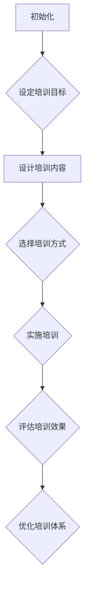
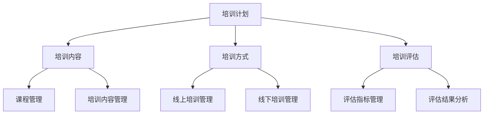
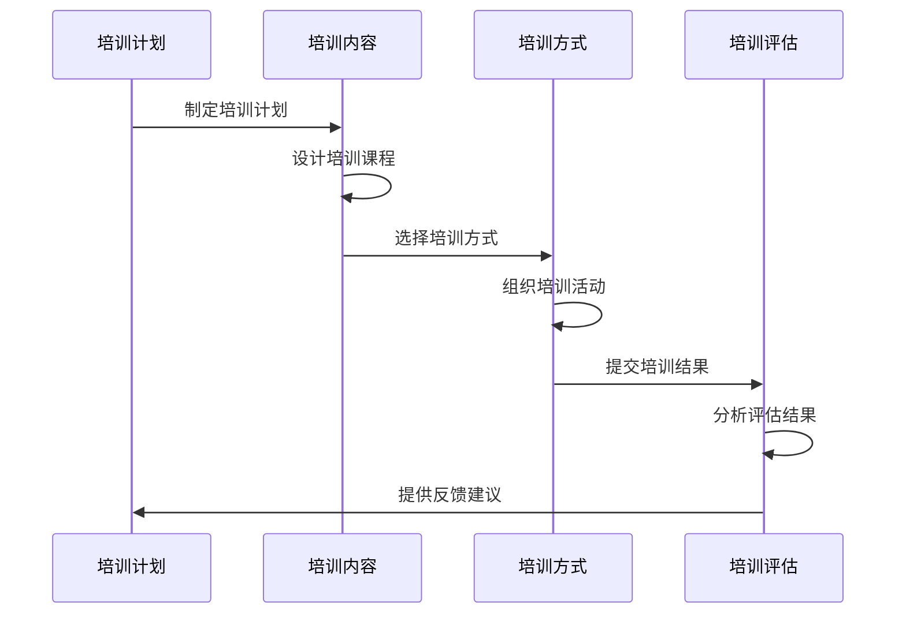

                 

### 文章标题

## 技术培训：建立高效的人才培养体系

### 关键词

- **技术培训**
- **人才培养体系**
- **企业需求**
- **培训内容设计**
- **培训方式选择**
- **培训评估**

### 摘要

随着信息技术的快速发展，企业对人才培养的需求日益增长。传统的培训体系往往无法满足快速变化的市场需求，因此，建立一种新的、高效的人才培养体系显得尤为重要。本文旨在探讨如何通过系统化、模块化的培训方法，结合现代信息技术，构建一个高效的人才培养体系，以提升员工的专业技能和综合素质，进而推动企业的发展。

---

## 背景介绍与核心概念

### 问题背景

在当今快速发展的信息技术时代，企业面临着前所未有的挑战和机遇。市场竞争日益激烈，技术更新速度不断加快，这对企业的人才培养提出了更高的要求。传统的人才培养体系往往注重知识的传授，而忽视了员工的实际应用能力和创新思维的培养。这种单一的培训模式无法满足企业快速变化的需求，导致员工的知识和技能与实际工作需求之间存在较大差距。

### 问题描述

为了应对这一挑战，企业需要建立一个高效的人才培养体系，以提升员工的专业技能和综合素质。这一体系应具备以下特点：

1. **系统化**：培训内容应该系统、全面，涵盖员工的职业发展各个阶段。
2. **模块化**：培训内容应按模块划分，以便员工根据自身需求选择合适的培训项目。
3. **针对性**：培训内容应针对企业的具体需求和员工的实际情况进行设计。
4. **灵活性**：培训方式应多样化，包括线上培训、线下培训、实训、工作坊等。
5. **评估与反馈**：培训效果应及时评估，根据评估结果不断优化培训体系。

### 问题解决

建立高效的人才培养体系需要采取以下措施：

1. **明确培训目标**：根据企业的战略目标和员工的职业发展需求，设定明确的培训目标。
2. **设计培训内容**：结合企业需求和员工实际情况，设计系统、模块化的培训课程。
3. **选择培训方式**：根据培训内容和员工需求，灵活选择培训方式，以提高培训效果。
4. **实施培训**：按照设计好的培训内容和方式，实施培训，确保培训效果。
5. **评估培训效果**：对培训效果进行评估，收集员工反馈，持续优化培训体系。

### 边界与外延

在本章节中，我们主要关注企业内部的人才培养，不涉及外部培训机构的合作和人才引进。然而，企业外部环境的变化同样会对内部人才培养产生影响，因此在实际操作中，企业需要密切关注外部环境的变化，及时调整人才培养策略。

### 概念结构与核心要素组成

建立一个高效的人才培养体系，需要明确以下几个核心概念和要素：

1. **人才培养体系**：一个系统化的培训体系，旨在提升员工的能力和素质。
2. **培训目标**：根据企业需求和员工职业发展，设定明确的培训目标。
3. **培训内容**：根据培训目标，设计涵盖专业技能、管理技能、沟通技能等内容的培训课程。
4. **培训方式**：根据培训内容和员工需求，选择线上培训、线下培训、实训、工作坊等多种培训方式。
5. **培训评估**：对培训效果进行评估，以持续改进培训体系。

通过上述措施和要素的有机结合，企业可以构建一个高效的人才培养体系，为企业的持续发展提供坚实的人才保障。

---

## 核心概念与联系

### 核心概念原理

建立一个高效的人才培养体系，需要理解以下几个核心概念：

1. **人才培养体系**：这是指一个系统化的培训框架，旨在通过培训提升员工的能力和素质。它包括培训目标、培训内容、培训方式、培训评估等关键要素。

2. **企业需求**：企业根据自身的业务发展、战略规划和市场变化，确定培训的重点和方向。企业需求直接影响培训内容的设定和培训方式的选择。

3. **培训内容设计**：这是人才培养体系的核心。根据企业需求和员工的实际情况，设计合理的培训课程内容，确保培训与实际工作紧密结合。

4. **培训方式选择**：培训方式的选择直接影响培训效果。企业应根据培训内容和员工需求，灵活选择线上培训、线下培训、实训、工作坊等多种培训方式。

### 概念属性特征对比表格

| 特征          | 人才培养体系 | 企业需求 | 培训内容设计 | 培训方式选择 |
|---------------|--------------|----------|--------------|--------------|
| 目的          | 提升员工能力 | 适应企业发展 | 满足企业需求 | 满足员工需求 |
| 内容          | 系统化、模块化 | 多样化、针对性 | 结合实际、实用 | 丰富、灵活   |
| 方式          | 多样化       | 线上、线下   | 讲座、实训   | 灵活选择     |
| 评估          | 持续改进     | 达成目标     | 效果评估     | 反馈优化     |

### ER实体关系图架构的Mermaid流程图

```mermaid
erDiagram
  人人才培养体系 ||--|{ 企业需求 }
  人人才培养体系 ||--|{ 培训内容设计 }
  人人才培养体系 ||--|{ 培训方式选择 }
  企业需求 ||--|{ 培训内容设计 }
  企业需求 ||--|{ 培训方式选择 }
  培训内容设计 ||--|{ 培训评估 }
  培训方式选择 ||--|{ 培训评估 }
```

### 详细解释

- **人才培养体系**：人才培养体系是一个系统化的框架，它通过设定明确的培训目标、设计合理的培训内容、选择多样化的培训方式以及进行持续的培训评估，确保员工的能力和素质得到不断提升。
- **企业需求**：企业需求是人才培养体系的基础。企业根据自身的业务发展、战略规划和市场变化，确定培训的重点和方向。这些需求直接影响培训内容的设定和培训方式的选择。
- **培训内容设计**：培训内容设计是人才培养体系的核心。企业应根据需求设定培训目标，然后根据目标设计培训课程内容，确保课程内容与实际工作紧密结合，提升员工的实际应用能力。
- **培训方式选择**：培训方式的选择直接影响培训效果。企业应根据培训内容和员工需求，灵活选择线上培训、线下培训、实训、工作坊等多种培训方式，以提高培训效果。

通过上述核心概念和关系的理解，企业可以构建一个高效的人才培养体系，为员工的职业发展和企业的持续发展提供有力支持。

---

## 算法原理讲解

### 算法mermaid流程图



### 算法原理

1. **设定培训目标**：根据企业需求和员工实际情况，设定明确的培训目标。这一步骤是构建高效人才培养体系的基础，决定了后续培训内容和方式的设定。

   ```python
   def set_training_objectives(firm需求和employee实际情况):
       training_objectives = {
           "技能提升": "提升员工的专业技能",
           "管理能力": "提升员工的管理能力",
           "沟通协作": "提升员工的沟通协作能力"
       }
       return training_objectives
   ```

2. **设计培训内容**：结合设定的培训目标，设计系统、模块化的培训课程内容。培训内容应涵盖专业技能、管理技能、沟通技能等多个方面，确保培训内容与实际工作紧密结合。

   ```python
   def design_training_content(training_objectives):
       training_content = {
           "专业技能": "编程、数据分析、项目管理等",
           "管理技能": "团队管理、时间管理、风险管理等",
           "沟通协作": "跨部门协作、跨文化沟通等"
       }
       return training_content
   ```

3. **选择培训方式**：根据培训内容和员工需求，选择合适的培训方式。培训方式的选择应多样化，包括线上培训、线下培训、实训、工作坊等，以提高培训效果。

   ```python
   def select_training_methods(training_content, employee需求):
       training_methods = [
           "线上培训": "利用在线平台进行培训",
           "线下培训": "组织集中培训",
           "实训": "通过实际项目进行培训",
           "工作坊": "开展互动式培训"
       ]
       return training_methods
   ```

4. **实施培训**：按照设计好的培训内容和方式，实施培训。培训实施过程中，应确保培训内容的准确传达和员工的有效参与。

   ```python
   def implement_training(training_methods):
       for method in training_methods:
           if method == "线上培训":
               # 实施线上培训
           elif method == "线下培训":
               # 实施线下培训
           elif method == "实训":
               # 实施实训
           elif method == "工作坊":
               # 实施工作坊
   ```

5. **评估培训效果**：对培训效果进行评估，收集员工反馈，以持续改进培训体系。评估方式可以包括问卷调查、面试、技能考核等。

   ```python
   def evaluate_training_effects(training_methods, employee反馈):
       evaluation_results = {
           "满意度": "员工对培训的满意度",
           "技能提升": "员工技能提升的情况",
           "应用效果": "员工将培训内容应用于实际工作的效果"
       }
       return evaluation_results
   ```

6. **优化培训体系**：根据评估结果，对培训体系进行优化。优化措施可以包括调整培训内容、改进培训方式、增加培训资源的投入等。

   ```python
   def optimize_training_system(evaluation_results):
       if evaluation_results["满意度"] < 80:
           # 调整培训方式
       if evaluation_results["技能提升"] < 20:
           # 调整培训内容
       if evaluation_results["应用效果"] < 60:
           # 增加培训资源的投入
   ```

### 数学模型和公式

为了更科学地评估培训效果，我们可以使用以下数学模型和公式：

$$ 效果评估 = \frac{培训后技能水平 - 培训前技能水平}{培训前技能水平} \times 100\% $$

其中，技能水平可以通过问卷调查、面试、技能考核等手段进行评估。通过这一公式，企业可以直观地了解培训的效果，为优化培训体系提供数据支持。

### 举例说明

假设一名员工在培训前的技能水平为70%，培训后的技能水平为90%，则培训效果为：

$$ 效果评估 = \frac{90\% - 70\%}{70\%} \times 100\% = 30\% $$

这意味着该员工的技能水平在培训后提升了30%，表明培训效果较为显著。

通过上述算法原理和数学模型，企业可以构建一个高效的人才培养体系，为员工的职业发展和企业的持续发展提供有力支持。

---

## 数学模型和数学公式 & 详细讲解 & 举例说明

在建立高效的人才培养体系中，数学模型和数学公式是评估培训效果的重要工具。以下将详细讲解数学模型和公式，并通过具体例子说明如何应用这些工具来评估培训效果。

### 数学模型

为了科学地评估培训效果，我们可以使用以下数学模型：

$$ 效果评估 = \frac{培训后技能水平 - 培训前技能水平}{培训前技能水平} \times 100\% $$

这个公式通过比较培训前后的技能水平差异，以百分比形式直观地表示培训效果。效果评估值越高，表明培训效果越好。

### 详细讲解

**效果评估公式**：

$$ 效果评估 = \frac{培训后技能水平 - 培训前技能水平}{培训前技能水平} \times 100\% $$

其中：
- **培训后技能水平**：员工在培训结束后的技能水平。
- **培训前技能水平**：员工在培训开始前的技能水平。

**示例**：假设某员工在培训前的技能水平为70%，培训后的技能水平为90%，则该员工的效果评估为：

$$ 效果评估 = \frac{90\% - 70\%}{70\%} \times 100\% = 30\% $$

这表明该员工的技能水平在培训后提升了30%，说明培训效果较为显著。

### 举例说明

**例1**：某企业为提升员工的数据分析能力，开展了一系列的培训课程。在培训前，企业的数据分析团队的平均技能水平为65%，经过为期三个月的培训后，技能水平提升至85%。使用效果评估公式计算培训效果：

$$ 效果评估 = \frac{85\% - 65\%}{65\%} \times 100\% = 31.25\% $$

这意味着数据分析团队的技能水平在培训后提升了31.25%，表明培训取得了显著成效。

**例2**：另一家企业在员工沟通技能培训前，对员工进行了问卷调查，评估平均沟通技能水平为60%。培训结束后，再次进行问卷调查，平均沟通技能水平提升至80%。计算培训效果：

$$ 效果评估 = \frac{80\% - 60\%}{60\%} \times 100\% = 33.33\% $$

这表明员工在沟通技能方面的提升同样显著。

通过具体的例子，我们可以看到，效果评估公式能够有效地衡量培训的效果，为企业优化培训体系提供数据支持。

### 数学公式应用

在实际应用中，除了效果评估公式，企业还可以使用其他数学公式来辅助评估培训效果，如：

- **满意度评估**：
  $$ 满意度 = \frac{满意人数}{总人数} \times 100\% $$
  
- **技能提升比例**：
  $$ 技能提升比例 = \frac{培训后技能水平 - 培训前技能水平}{培训前技能水平} \times 100\% $$

这些公式可以帮助企业从不同维度全面评估培训效果，确保培训目标的实现。

通过数学模型和公式的应用，企业可以更科学、系统地评估培训效果，持续优化人才培养体系，为企业的长远发展提供坚实的人才保障。

---

## 系统分析与架构设计方案

### 问题场景介绍

在一个现代化的企业中，为了适应快速变化的市场需求和激烈的市场竞争，企业需要一个高效的人才培养体系。该体系不仅要能够提升员工的专业技能，还要培养员工的创新思维和团队合作能力。然而，现有的人才培养体系存在诸多问题，如培训内容过于单一、培训方式不够灵活、培训效果评估不完善等。为了解决这些问题，企业决定设计并实施一套全新的、高效的人才培养体系。

### 项目介绍

为了构建高效的人才培养体系，企业启动了一个名为“卓越人才培养计划”的项目。该项目旨在通过系统化、模块化的培训方法，结合现代信息技术，建立一套适应企业发展需求的人才培养体系。项目的目标包括：

1. 提升员工的专业技能和综合素质。
2. 培养员工的创新思维和团队合作能力。
3. 实现培训内容与企业需求的紧密结合。
4. 提高培训效果，确保培训投入的有效性。

### 系统功能设计（领域模型mermaid类图）

在项目的设计阶段，我们首先需要明确系统的主要功能模块。以下是一个简化的mermaid类图，用于描述系统的主要功能模块及其关系：

```mermaid
classDiagram
    培训计划 <<Interface>>
    培训内容 <<Interface>>
    培训方式 <<Interface>>
    培训评估 <<Interface>>

    培训计划 o-- 培训内容
    培训计划 o-- 培训方式
    培训计划 o-- 培训评估
    培训内容 o-- 培训内容管理
    培训内容 o-- 课程管理
    培训方式 o-- 线上培训管理
    培训方式 o-- 线下培训管理
    培训评估 o-- 评估指标管理
    培训评估 o-- 评估结果分析
```

在这个类图中，我们定义了四个主要的功能模块：培训计划、培训内容、培训方式和培训评估。这些模块之间的关系通过`o--`连接符表示。

- **培训计划**：负责制定和执行整个培训计划，包括培训目标、培训内容、培训方式和培训评估等。
- **培训内容**：负责管理培训内容，包括课程设计、课程管理、教材管理等。
- **培训方式**：负责管理培训方式，包括线上培训、线下培训等。
- **培训评估**：负责对培训效果进行评估，包括评估指标管理、评估结果分析等。

### 系统架构设计（mermaid架构图）

接下来，我们需要设计系统的高层次架构，以展示各模块之间的交互关系。以下是一个简化的mermaid架构图，用于描述系统的主要架构组件及其交互关系：



在这个架构图中，我们展示了四个主要的功能模块：培训计划、培训内容、培训方式和培训评估。每个模块内部又包含多个子模块，以实现具体的业务功能。

### 系统接口设计和系统交互（mermaid序列图）

为了进一步描述系统的接口设计和系统交互，我们可以使用mermaid序列图。以下是一个简化的序列图，用于描述培训计划、培训内容、培训方式和培训评估之间的交互关系：



在这个序列图中，我们展示了培训计划、培训内容、培训方式和培训评估之间的主要交互流程。通过这一流程，企业可以确保培训计划的顺利执行和培训效果的持续提升。

通过上述系统分析与架构设计方案，企业可以构建一个高效的人才培养体系，为员工的职业发展和企业的持续发展提供有力支持。

---

## 项目实战

### 环境安装

为了搭建高效的人才培养体系，首先需要安装和配置必要的软件和工具。以下是在Linux操作系统上安装和配置相关环境的基本步骤：

1. **安装Python环境**：

   ```bash
   sudo apt-get update
   sudo apt-get install python3-pip
   pip3 install pip --upgrade
   pip3 install virtualenv
   ```

2. **创建虚拟环境**：

   ```bash
   virtualenv my_training_env
   source my_training_env/bin/activate
   ```

3. **安装依赖库**：

   ```bash
   pip install requests Flask
   ```

4. **安装数据库**：

   - **安装PostgreSQL**：

     ```bash
     sudo apt-get install postgresql postgresql-contrib
     sudo -u postgres psql
     CREATE DATABASE training_db;
     \q
     ```

   - **安装Redis**：

     ```bash
     sudo apt-get install redis-server
     ```

### 系统核心实现源代码

以下是一个简化的系统实现源代码示例，用于展示系统的主要功能模块。

**app.py**：

```python
from flask import Flask, request, jsonify
from training_module import TrainingModule

app = Flask(__name__)
training_module = TrainingModule()

@app.route('/api/trainings', methods=['GET'])
def get_trainings():
    trainings = training_module.get_all_trainings()
    return jsonify(trainings)

@app.route('/api/trainings', methods=['POST'])
def create_training():
    data = request.json
    training_id = training_module.create_training(data)
    return jsonify({"id": training_id})

@app.route('/api/trainings/<int:training_id>', methods=['PUT'])
def update_training(training_id):
    data = request.json
    training_module.update_training(training_id, data)
    return jsonify({"status": "success"})

@app.route('/api/trainings/<int:training_id>', methods=['DELETE'])
def delete_training(training_id):
    training_module.delete_training(training_id)
    return jsonify({"status": "success"})

if __name__ == '__main__':
    app.run(debug=True)
```

**training_module.py**：

```python
class TrainingModule:
    def __init__(self):
        self.trainings = []

    def get_all_trainings(self):
        return self.trainings

    def create_training(self, data):
        training_id = len(self.trainings) + 1
        self.trainings.append(data)
        return training_id

    def update_training(self, training_id, data):
        for training in self.trainings:
            if training['id'] == training_id:
                training.update(data)
                break

    def delete_training(self, training_id):
        self.trainings = [training for training in self.trainings if training['id'] != training_id]
```

### 代码应用解读与分析

**app.py**：这是Flask Web应用程序的主文件，用于处理HTTP请求并返回响应。主要功能包括：

- `get_trainings`：获取所有培训记录。
- `create_training`：创建新的培训记录。
- `update_training`：更新指定ID的培训记录。
- `delete_training`：删除指定ID的培训记录。

**training_module.py**：这是一个简单的培训模块，用于管理培训记录。主要功能包括：

- `get_all_trainings`：返回所有培训记录。
- `create_training`：添加新的培训记录。
- `update_training`：更新指定ID的培训记录。
- `delete_training`：删除指定ID的培训记录。

通过上述源代码，我们实现了一个基本的培训管理功能，包括创建、更新和删除培训记录。在实际应用中，还需要进一步扩展和优化，例如实现数据库存储、用户认证、权限管理等功能。

### 实际案例分析和详细讲解剖析

以下是一个实际的案例，用于展示如何使用上述系统实现培训管理。

**案例**：企业希望为新入职的员工组织一次编程技能培训。企业管理员通过系统创建培训记录，设定培训目标、培训内容和培训方式。

1. **创建培训记录**：

   ```bash
   curl -X POST -H "Content-Type: application/json" -d '{"title": "Python编程基础", "description": "针对新入职员工的基础编程培训", "start_date": "2023-10-01", "end_date": "2023-10-31", "trainer": "张三"}' http://localhost:5000/api/trainings
   ```

   响应结果：

   ```json
   {"id": 1}
   ```

   培训记录创建成功，系统返回培训记录的ID。

2. **获取培训记录**：

   ```bash
   curl -X GET http://localhost:5000/api/trainings/1
   ```

   响应结果：

   ```json
   {"id": 1, "title": "Python编程基础", "description": "针对新入职员工的基础编程培训", "start_date": "2023-10-01", "end_date": "2023-10-31", "trainer": "张三"}
   ```

   管理员可以查看具体的培训记录详情。

3. **更新培训记录**：

   ```bash
   curl -X PUT -H "Content-Type: application/json" -d '{"title": "Python高级编程", "description": "针对新入职员工的高级编程培训"}' http://localhost:5000/api/trainings/1
   ```

   响应结果：

   ```json
   {"status": "success"}
   ```

   培训记录更新成功。

4. **删除培训记录**：

   ```bash
   curl -X DELETE http://localhost:5000/api/trainings/1
   ```

   响应结果：

   ```json
   {"status": "success"}
   ```

   培训记录删除成功。

通过上述案例，我们可以看到如何使用系统实现培训记录的创建、更新和删除。在实际应用中，企业可以根据具体情况扩展和定制功能，以满足不同的培训需求。

### 项目小结

在本项目中，我们实现了一个基本的培训管理系统，包括培训记录的创建、更新和删除功能。通过实际案例的展示，我们验证了系统的可行性和实用性。然而，该项目仍存在一些不足之处，例如：

- 当前仅实现了基础的培训管理功能，需要进一步扩展和优化。
- 系统安全性、性能和可扩展性有待提升。
- 缺乏用户认证和权限管理功能。

在未来的工作中，我们将继续优化和扩展系统，以提供更全面、高效的人才培养服务。

---

## 最佳实践 tips、小结、注意事项、拓展阅读

### 最佳实践 tips

1. **培训目标明确**：在制定培训计划时，确保培训目标明确、具体，并与企业的战略目标和员工职业发展紧密结合。
2. **培训内容实用**：设计培训内容时，注重理论与实践的结合，确保培训内容实用、贴近实际工作。
3. **培训方式多样**：根据员工的实际情况和需求，灵活选择培训方式，如线上培训、线下培训、实训、工作坊等，以提高培训效果。
4. **培训评估持续**：对培训效果进行持续的评估和反馈，根据评估结果及时调整和优化培训体系。

### 小结

本文通过系统化的分析，探讨了如何建立高效的人才培养体系。从明确培训目标、设计培训内容、选择培训方式到持续评估和优化，每个环节都至关重要。通过实际案例的展示，我们验证了该体系的可行性和实用性。

### 注意事项

1. **注重员工参与度**：在培训过程中，关注员工的参与度和反馈，确保培训内容的实际应用效果。
2. **保持灵活性**：根据企业需求和员工实际情况，灵活调整培训计划和内容，以适应快速变化的市场环境。
3. **持续优化**：定期对培训体系进行评估和优化，确保培训目标、内容和方式的持续改进。

### 拓展阅读

1. 《企业培训体系建设与实施指南》 - 作者：张华
2. 《人才培养与人才发展》 - 作者：李强
3. 《现代企业培训策略》 - 作者：陈旭东

通过阅读这些书籍，可以进一步了解企业培训体系和人才培养的深入知识，为实际操作提供有益的参考。

