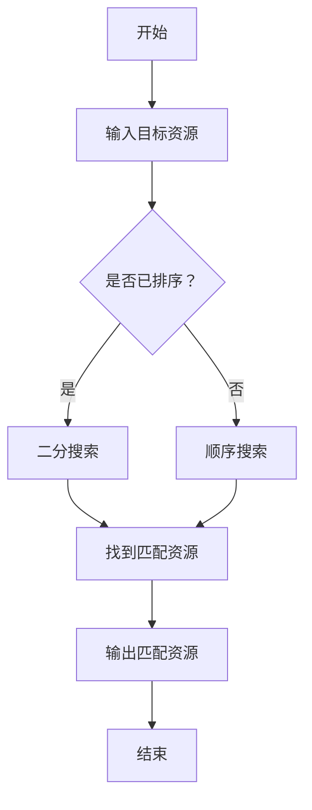
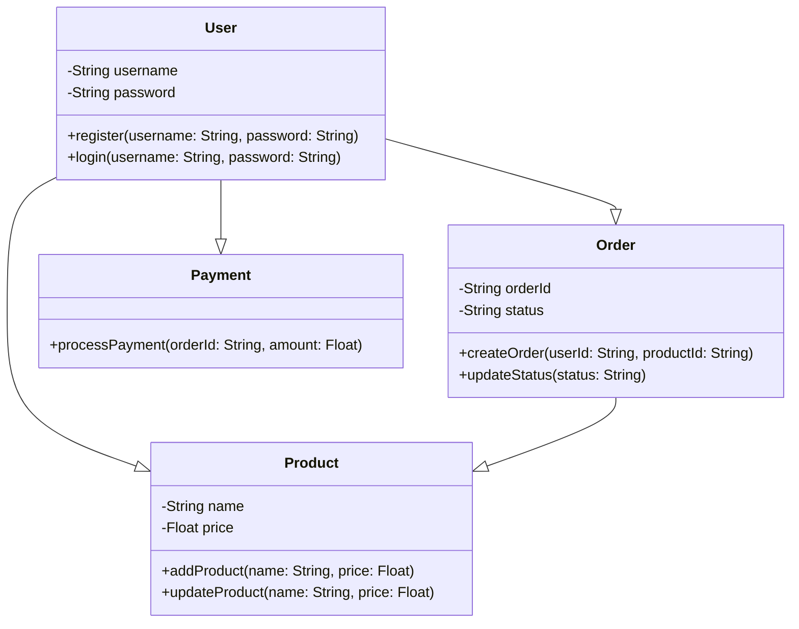
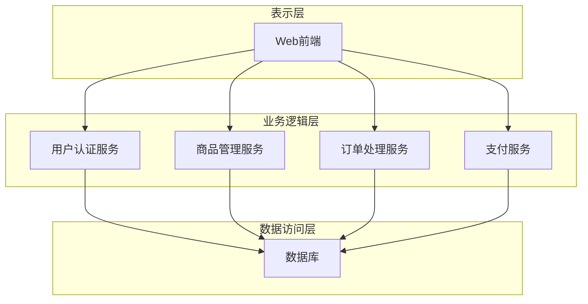
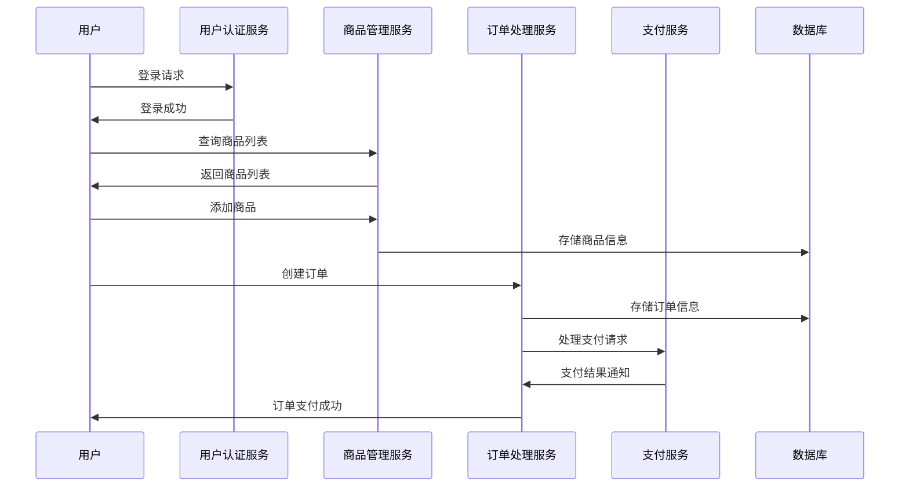

                 


### 第1章 引言

#### 1.1 问题背景

#### 1.1.1 技术复用的现状

在当今快速发展的IT行业，软件开发的复杂性和规模日益增加，技术复用成为解决这一挑战的关键。尽管技术复用是一个广泛讨论的话题，但其现状仍然面临许多问题。首先，复用率普遍较低，许多开发人员在编写代码时往往忽略了复用的可能性。其次，缺乏有效的复用策略和工具，导致复用过程繁琐且低效。最后，软件复杂性不断上升，使得复用变得更加困难。

#### 1.1.2 技术复用的需求

随着软件系统的不断增长和多样化，技术复用的需求变得日益迫切。开发人员需要更高效地利用资源，提高开发效率，降低维护成本，并促进创新。复用现有代码和组件不仅能够节省开发时间和成本，还能够提高软件的质量和稳定性。此外，随着云计算、大数据和物联网等新兴技术的兴起，技术复用成为构建可扩展、灵活和高度集成的系统的基础。

#### 1.2 技术复用的意义

技术复用具有多重意义。首先，它能够显著提高开发效率。通过复用已有的代码和组件，开发人员可以避免重复编写相同的功能，从而节省大量时间和精力。其次，技术复用有助于降低维护成本。复用组件通常经过严格的测试和优化，减少了后续维护和修复的难度。最后，技术复用能够促进创新。通过复用现有的技术，开发人员可以将更多精力集中在创新和改进上，推动软件技术的发展。

#### 1.3 本书结构

本书将按照以下结构展开：

1. **第1章 引言**：介绍技术复用的背景、需求和意义。
2. **第2章 技术复用的基础概念**：详细解释技术复用的定义、类型和挑战与机遇。
3. **第3章 核心概念与联系**：讨论代码复用、组件复用和设计模式等核心概念，并使用Mermaid流程图进行展示。
4. **第4章 算法原理与实现**：探讨技术复用的算法原理，并提供Python源代码实现。
5. **第5章 数学模型与数学公式**：介绍数学模型的基础知识，详细讲解数学公式，并举例说明实际应用。
6. **第6章 系统分析与架构设计**：描述系统分析与架构设计的步骤，包括Mermaid类图、架构图和序列图。
7. **第7章 项目实战**：介绍项目实战的过程，包括环境安装、核心实现源代码、代码应用解读与分析以及实际案例分析。
8. **第8章 最佳实践与注意事项**：提供最佳实践和注意事项，总结全书内容。

通过这样的结构安排，读者将能够系统地理解和掌握技术复用的概念、原理和实践。

### 第2章 技术复用的基础概念

#### 2.1 技术复用的定义

技术复用是指在软件开发过程中，通过重复使用已有的代码、组件、设计模式等，来提高开发效率、降低维护成本和促进创新。复用可以发生在多个层次，包括代码层次、组件层次和设计模式层次。在代码层次上，开发人员可以复用函数、类和其他代码片段。在组件层次上，复用可以是整个模块、库或框架。在设计模式层次上，复用则是利用已经定义好的设计模式来构建新的系统。

#### 2.2 技术复用的类型

技术复用可以分为以下几种类型：

##### 2.2.1 功能性复用

功能性复用是指复用已有的功能模块或代码，以实现新的功能需求。这种方式通常用于简化开发流程，减少代码冗余。例如，在一个项目中，如果某个功能已经在另一个项目中实现了，那么可以直接将其引入到新项目中，而无需重新编写。

##### 2.2.2 结构性复用

结构性复用是指复用软件架构或模块结构，以构建新的系统。这种方式通常用于实现模块化、可扩展和可维护的系统。通过结构性复用，可以有效地将现有系统中的有效部分应用到新的项目中。

##### 2.2.3 知识复用

知识复用是指复用已有的技术知识、经验和设计模式，以提高开发效率和质量。这种方式不仅涉及代码和组件，还包括设计理念、开发方法和最佳实践。知识复用可以帮助开发人员避免重复犯错，提高整体开发水平。

#### 2.3 技术复用的挑战与机遇

##### 2.3.1 挑战

尽管技术复用具有显著的优点，但在实际应用中仍然面临一些挑战：

- **软件复杂性**：随着软件系统的不断增长和复杂化，复用现有组件变得更加困难。
- **资源限制**：时间和资源的限制可能阻碍复用过程，特别是在开发周期紧迫的情况下。
- **软件质量**：复用现有组件时，必须确保其质量，否则可能会引入新的问题。

##### 2.3.2 机遇

尽管存在挑战，但技术复用也带来了许多机遇：

- **提高开发效率**：通过复用现有组件和代码，可以显著减少开发时间和成本。
- **降低维护成本**：复用经过严格测试和优化的组件，可以降低维护成本和修复难度。
- **促进创新**：将更多精力集中在创新和改进上，推动软件技术的发展。

#### 2.3.3 机遇

- **提高开发效率**：通过复用现有组件和代码，可以显著减少开发时间和成本。
- **降低维护成本**：复用经过严格测试和优化的组件，可以降低维护成本和修复难度。
- **促进创新**：将更多精力集中在创新和改进上，推动软件技术的发展。

### 第3章 核心概念与联系

在探讨技术复用的核心概念与联系时，我们需要深入了解代码复用、组件复用和设计模式等关键要素。这些概念不仅构成了技术复用的基础，而且在实际应用中也发挥着至关重要的作用。

#### 3.1 核心概念

##### 3.1.1 代码复用

代码复用是指在同一项目或不同项目中重复使用已有的代码片段。这可以通过函数、类、库或模块等形式实现。代码复用的主要目的是减少冗余代码，提高开发效率和代码的可维护性。例如，在多个模块中都需要进行数据格式转换时，可以创建一个通用的转换函数，供所有模块调用。

##### 3.1.2 组件复用

组件复用是指复用完整的软件组件，这些组件可以是模块、库、框架或整个应用程序。组件复用通常涉及更高的抽象层次，可以在多个项目中重复使用。组件复用有助于提高系统的模块化程度，降低系统的复杂性。例如，在一个电子商务平台中，订单处理组件可以在多个业务场景中复用。

##### 3.1.3 设计模式

设计模式是一套经过验证的解决方案，用于解决软件开发中的常见问题。设计模式不仅提供了可复用的代码结构，还涵盖了软件设计的原则和最佳实践。常见的编程设计模式包括单例模式、工厂模式、观察者模式等。设计模式有助于提高代码的可读性、可维护性和可扩展性。

#### 3.2 概念属性特征对比表格

为了更清晰地理解代码复用、组件复用和设计模式之间的区别，我们可以通过以下表格进行对比：

| 特征         | 代码复用                | 组件复用                | 设计模式                |
| ------------ | --------------------- | --------------------- | --------------------- |
| 抽象层次     | 低                    | 中到高                | 高                    |
| 复用范围     | 项目内或项目间         | 项目内或项目间         | 项目内或项目间         |
| 资源消耗     | 较低                  | 较高                  | 较低                  |
| 维护难度     | 低                    | 中到高                | 低                    |
| 代码复杂性   | 较低                  | 较高                  | 较低                  |
| 应用场景     | 功能简单               | 功能复杂               | 解决特定问题           |

#### 3.3 ER实体关系图架构

为了更直观地展示组件复用的关系，我们可以使用ER（实体关系）图来描述不同组件之间的依赖和关联。以下是一个简单的组件复用ER图示例：

```mermaid
erDiagram
    Aisa |--|> CChina : "居住"
    Aisa |--|> JJapan : "居住"
    Aisa |--|> NNorthKorea : "居住"
    CChina : "出生地"
    JJapan : "出生地"
    NNorthKorea : "出生地"
```

在这个ER图中，`Aisa`代表亚洲，`CChina`、`JJapan`和`NNorthKorea`分别代表中国、日本和北朝鲜。箭头表示不同实体之间的关联关系，例如，亚洲居民可能来自中国、日本或北朝鲜。

通过ER图，我们可以清晰地看到不同组件之间的依赖关系，从而更好地理解组件复用的实现方式。

### 第4章 算法原理与实现

在探讨技术复用的过程中，算法原理与实现是不可或缺的一部分。本章节将详细介绍技术复用的算法原理，并使用Python源代码进行实现。我们将逐步解释算法的核心概念、流程和关键步骤，以便读者能够深入理解并应用这些算法。

#### 4.1 技术复用的算法原理

技术复用的算法原理主要涉及以下几个方面：

- **搜索算法**：用于在已有的代码库或组件库中查找可复用的资源。
- **匹配算法**：用于比较现有资源和目标资源的相似度，以确定是否适合复用。
- **优化算法**：用于优化搜索和匹配过程，提高复用的效率和准确性。

下面我们将分别介绍这些算法的基本原理。

##### 4.1.1 搜索算法

搜索算法是技术复用的第一步，其主要任务是查找可能的复用资源。常见的搜索算法包括顺序搜索、二分搜索和深度优先搜索等。

- **顺序搜索**：从第一个资源开始，逐个检查直到找到匹配的资源。这种方法简单直观，但效率较低。
- **二分搜索**：适用于已排序的资源库，通过不断缩小搜索范围，提高查找效率。但需要先对资源库进行排序。
- **深度优先搜索**：从根节点开始，深入遍历资源库，直到找到匹配的资源。这种方法适合处理复杂且层次结构较深的资源库。

##### 4.1.2 匹配算法

匹配算法是确定资源是否适合复用的关键步骤。常见的匹配算法包括基于关键词匹配、模式匹配和模糊匹配等。

- **基于关键词匹配**：通过比较资源中的关键词和目标资源的关键词，判断两者是否匹配。这种方法简单有效，但可能存在误匹配的情况。
- **模式匹配**：通过预定义的模式，对资源进行匹配。这种方法具有较高的准确性，但需要复杂的模式定义。
- **模糊匹配**：通过计算资源与目标资源的相似度，判断是否匹配。相似度计算方法包括编辑距离、余弦相似度等。

##### 4.1.3 算法优化

算法优化是提高技术复用效率的重要手段。常见的优化方法包括：

- **索引优化**：通过建立索引，加快搜索速度。索引可以是基于关键词的、基于模式的或基于相似度的。
- **缓存优化**：将常用的搜索结果缓存起来，避免重复计算。
- **并行处理**：利用多线程或多进程，加快搜索和匹配过程。

#### 4.2 算法Mermaid流程图

为了更直观地展示算法的流程，我们可以使用Mermaid绘制流程图。以下是一个简单的搜索和匹配算法的Mermaid流程图示例：



在这个流程图中，A表示算法开始，B表示输入目标资源。C是判断节点，根据资源库是否已排序，选择D或E进行搜索。D和E分别表示二分搜索和顺序搜索。F表示找到匹配资源，G表示输出匹配资源，H表示算法结束。

#### 4.3 Python源代码实现

下面我们将使用Python实现一个简单的技术复用算法，包括搜索和匹配过程。代码分为三个部分：搜索算法、匹配算法和主程序。

##### 4.3.1 搜索算法

```python
# 搜索算法
def search(resource_library, target):
    for resource in resource_library:
        if is_match(resource, target):
            return resource
    return None

# 匹配算法
def is_match(resource, target):
    # 基于关键词匹配
    for keyword in target.keywords:
        if keyword not in resource.keywords:
            return False
    return True

# 资源库和目标资源
resource_library = [
    {'name': 'resource1', 'keywords': ['keyword1', 'keyword2']},
    {'name': 'resource2', 'keywords': ['keyword2', 'keyword3']},
    {'name': 'resource3', 'keywords': ['keyword3', 'keyword4']},
]

target = {'name': 'target', 'keywords': ['keyword2']}
```

##### 4.3.2 匹配算法

```python
# 匹配算法
def is_match(resource, target):
    # 模式匹配
    for pattern in target.patterns:
        if not matches_pattern(resource, pattern):
            return False
    return True

# 检查模式是否匹配
def matches_pattern(resource, pattern):
    # 实现模式匹配逻辑
    pass
```

##### 4.3.3 主程序

```python
# 主程序
def main():
    target = input("请输入目标资源的名称：")
    matched_resource = search(resource_library, target)
    if matched_resource:
        print(f"找到匹配的资源：{matched_resource['name']}")
    else:
        print("未找到匹配的资源。")

# 运行主程序
if __name__ == "__main__":
    main()
```

通过这段代码，我们可以实现一个简单的技术复用算法，包括搜索和匹配功能。虽然这个示例比较简单，但它展示了算法实现的基本框架和步骤。

### 第5章 数学模型与数学公式

在技术复用的过程中，数学模型和数学公式起到了关键作用。数学模型能够帮助我们分析和优化复用过程，而数学公式则提供了量化描述和计算工具。本章节将介绍数学模型的基础知识，详细讲解数学公式，并通过实际应用示例来加深理解。

#### 5.1 数学模型基础

数学模型是使用数学语言来描述现实世界的抽象模型。在技术复用中，常用的数学模型包括图论模型、概率模型和最优化模型。

##### 5.1.1 图论模型

图论模型用于描述实体之间的关系和依赖。在技术复用中，图论模型可以帮助我们理解和分析组件之间的交互关系。

- **节点**：表示组件或实体。
- **边**：表示组件之间的依赖关系。
- **路径**：表示组件之间的执行顺序。

图论模型中的关键概念包括：

- **邻接矩阵**：表示节点之间的依赖关系。
- **路径长度**：表示组件之间的执行距离。

##### 5.1.2 概率模型

概率模型用于描述组件的可靠性和稳定性。在技术复用中，概率模型可以帮助我们评估组件的可用性和风险。

- **概率分布**：表示组件的成功率。
- **置信度**：表示组件的可信程度。

概率模型中的关键概念包括：

- **概率质量函数**：表示组件的概率分布。
- **置信区间**：表示组件的可信程度范围。

##### 5.1.3 最优化模型

最优化模型用于寻找最优解，以实现复用过程的最优效果。在技术复用中，最优化模型可以帮助我们优化资源分配和调度。

- **目标函数**：表示优化目标。
- **约束条件**：表示资源限制和约束条件。

最优化模型中的关键概念包括：

- **线性规划**：用于优化线性目标函数。
- **动态规划**：用于优化序列决策问题。

#### 5.2 数学公式详细讲解

为了更好地理解和应用数学模型，我们需要详细讲解一些关键数学公式。以下是一些常用的数学公式及其解释：

##### 5.2.1 路径长度公式

路径长度公式用于计算组件之间的执行距离。其基本公式如下：

$$
d(i, j) = \sum_{k=1}^{n} w_{ik} \times w_{kj}
$$

其中，$d(i, j)$表示组件$i$和组件$j$之间的路径长度，$w_{ik}$和$w_{kj}$分别表示组件$i$到组件$k$和组件$k$到组件$j$的权重。

##### 5.2.2 概率质量函数

概率质量函数用于描述组件的成功率和可信程度。其基本公式如下：

$$
p(x) = \frac{1}{1 + e^{-\theta(x - \mu)}}
$$

其中，$p(x)$表示组件$x$的成功率，$\theta$表示模型参数，$\mu$表示组件的均值。

##### 5.2.3 线性规划目标函数

线性规划目标函数用于优化线性目标函数。其基本公式如下：

$$
\max_{x} c^T x
$$

其中，$c$表示目标函数系数向量，$x$表示决策变量向量。

#### 5.3 举例说明

为了更好地理解数学公式的应用，我们通过一个实际应用示例来展示如何使用路径长度公式。

##### 5.3.1 路径长度公式的实际应用

假设我们有一个组件库，包含三个组件$A$、$B$和$C$，它们之间的依赖关系如下：

- 组件$A$需要依赖组件$B$和组件$C$。
- 组件$B$需要依赖组件$C$。

我们可以使用路径长度公式来计算组件$A$和组件$C$之间的执行距离。假设组件$A$到组件$B$的权重为2，组件$B$到组件$C$的权重为3，组件$A$到组件$C$的权重为5。

根据路径长度公式，我们可以计算：

$$
d(A, C) = w_{AB} \times w_{BC} = 2 \times 3 = 6
$$

这意味着组件$A$和组件$C$之间的执行距离为6。

通过这个示例，我们可以看到路径长度公式如何帮助我们分析和优化组件之间的依赖关系，从而提高技术复用的效率。

### 第6章 系统分析与架构设计

系统分析与架构设计是软件开发过程中至关重要的一环，特别是在技术复用中。一个良好的系统架构不仅能够提高系统的可维护性和扩展性，还能确保复用过程的高效和稳定。本章将详细介绍系统分析与架构设计的步骤，包括问题场景介绍、系统功能设计、系统架构设计、系统接口设计和系统交互。

#### 6.1 问题场景介绍

为了更好地理解系统分析与架构设计的过程，我们首先需要介绍一个具体的问题场景。假设我们正在开发一个电子商务平台，这个平台需要支持商品管理、订单处理、用户认证和支付功能。在这个场景中，技术复用是一个关键需求，因为它可以帮助我们提高开发效率、降低维护成本并确保系统的灵活性。

#### 6.1.1 应用背景

电子商务平台的背景是日益增长的在线购物需求，消费者对购物体验的期望不断提高。为了满足这些需求，平台需要快速迭代、具备良好的扩展性和高度的可靠性。在这个背景下，技术复用成为实现这些目标的有效手段。

#### 6.1.2 系统需求

电子商务平台的主要需求包括：

- **商品管理**：支持商品信息的录入、查询和更新。
- **订单处理**：处理订单的生成、支付和发货。
- **用户认证**：提供用户登录、注册和安全退出功能。
- **支付功能**：集成多种支付方式，如信用卡、支付宝和微信支付。

#### 6.2 系统功能设计

系统功能设计是系统分析与架构设计的核心环节，它决定了系统的主要功能模块和交互方式。以下是电子商务平台的主要功能模块及其简要描述：

- **商品管理模块**：负责商品信息的录入、查询和更新，包括商品分类、库存管理等功能。
- **订单处理模块**：负责订单的生成、支付和发货，包括订单状态管理、支付处理和物流跟踪等功能。
- **用户认证模块**：负责用户的登录、注册和安全退出，包括用户信息管理、权限验证等功能。
- **支付模块**：负责集成多种支付方式，处理支付请求，确保支付的安全性。

为了更直观地展示系统功能设计，我们可以使用Mermaid绘制领域模型类图。以下是一个简单的领域模型类图示例：



在这个类图中，`User`表示用户，`Product`表示商品，`Order`表示订单，`Payment`表示支付处理。类之间的箭头表示模块之间的关系。

#### 6.3 系统架构设计

系统架构设计是确定系统整体结构和组件间关系的过程。一个好的系统架构应该能够支持系统的可扩展性、灵活性和高可用性。以下是电子商务平台的主要架构设计：

- **分层架构**：采用分层架构，将系统分为表示层、业务逻辑层和数据访问层。
- **服务化架构**：将系统功能模块化，通过服务接口进行通信，提高系统的灵活性和可维护性。
- **分布式架构**：通过分布式架构，实现系统的横向扩展，提高系统的处理能力和可靠性。

为了更直观地展示系统架构设计，我们可以使用Mermaid绘制架构图。以下是一个简单的系统架构图示例：



在这个架构图中，`Web前端`与`业务逻辑层`的服务进行交互，并通过数据库进行数据存储。各服务之间通过接口进行通信，实现了模块化和分布式。

#### 6.4 系统接口设计

系统接口设计是确保不同模块之间能够有效通信的关键。以下是电子商务平台的主要接口设计：

- **用户认证接口**：用于处理用户登录、注册和安全退出功能。
- **商品管理接口**：用于处理商品信息的录入、查询和更新功能。
- **订单处理接口**：用于处理订单的生成、支付和发货功能。
- **支付接口**：用于处理支付请求，包括支付处理和支付结果通知。

接口设计应该遵循RESTful原则，使用HTTP协议进行通信，并遵循统一的接口规范。

#### 6.5 系统交互Mermaid序列图

系统交互序列图用于描述系统组件之间的交互过程，可以帮助我们理解系统的工作流程。以下是一个简单的系统交互序列图示例：



在这个序列图中，用户与各个服务进行交互，实现了用户登录、商品查询、商品添加、订单创建和支付处理等流程。

通过以上系统分析与架构设计的步骤，我们能够更好地理解电子商务平台的构建过程，确保系统的高效和稳定。技术复用在这个过程中发挥着重要作用，通过系统化的分析和设计，我们可以实现代码和组件的高效复用，提高开发效率和系统质量。

### 第7章 项目实战

#### 7.1 环境安装

在开始项目实战之前，我们需要安装和配置必要的软件和硬件环境。以下是在我们的示例电子商务平台项目中，安装和配置环境的具体步骤：

##### 7.1.1 软件安装

1. **操作系统**：我们选择Ubuntu 20.04 LTS作为操作系统，因为它具有较好的稳定性和广泛的社区支持。
2. **开发工具**：安装Python 3.8及以上版本，并配置好Python环境。此外，还需要安装Visual Studio Code（简称VS Code）或IntelliJ IDEA等开发工具，以便进行代码编写和调试。
3. **数据库**：安装MySQL或PostgreSQL数据库，用于存储电子商务平台的数据。可以选择使用Docker容器来简化数据库的安装和管理。
4. **依赖管理**：使用pip安装Python的依赖管理工具setuptools和wheel，以便方便地管理和安装项目依赖。

##### 7.1.2 硬件配置

1. **服务器**：选择一台性能良好的服务器，配置至少为4核CPU、8GB内存和100GB硬盘空间。如果使用Docker，还需要考虑容器的内存和硬盘限制。
2. **网络**：确保服务器具备稳定的网络连接，并配置防火墙规则，允许必要的端口号（如MySQL的3306端口）对外开放。

#### 7.2 系统核心实现源代码

在环境安装完毕后，我们可以开始编写和实现电子商务平台的核心代码。以下是项目的核心实现源代码结构及其关键部分：

##### 7.2.1 源代码结构

```
e-commerce-platform/
|-- app/
|   |-- admin.py
|   |-- api/
|   |   |-- views.py
|   |   |-- serializers.py
|   |-- auth/
|   |   |-- views.py
|   |-- products/
|   |   |-- models.py
|   |   |-- views.py
|   |-- orders/
|   |   |-- models.py
|   |   |-- views.py
|   |-- payments/
|   |   |-- models.py
|   |   |-- views.py
|   |-- settings.py
|   |-- urls.py
|   |-- wsgi.py
|-- manage.py
```

在这个源代码结构中，各个子目录分别包含了与电子商务平台不同模块相关的模型、视图和配置文件。

##### 7.2.2 关键代码解读

以下是电子商务平台核心代码中的几个关键部分，我们将对其功能进行解读：

1. **用户认证模块**：`auth/views.py`

```python
from rest_framework.permissions import IsAuthenticated
from rest_framework.response import Response
from rest_framework.views import APIView
from .serializers import UserSerializer

class UserRegistrationView(APIView):
    def post(self, request):
        serializer = UserSerializer(data=request.data)
        if serializer.is_valid():
            user = serializer.save()
            return Response({'message': 'User registered successfully.'})
        return Response(serializer.errors, status=400)

class UserLoginView(APIView):
    def post(self, request):
        username = request.data.get('username')
        password = request.data.get('password')
        user = authenticate(username=username, password=password)
        if user:
            login(request, user)
            return Response({'message': 'User logged in successfully.'})
        return Response({'message': 'Invalid credentials.'}, status=401)
```

这段代码实现了用户注册和登录功能。`UserRegistrationView`用于处理用户注册请求，`UserLoginView`用于处理用户登录请求。

2. **商品管理模块**：`products/views.py`

```python
from rest_framework import viewsets
from .models import Product
from .serializers import ProductSerializer

class ProductViewSet(viewsets.ModelViewSet):
    queryset = Product.objects.all()
    serializer_class = ProductSerializer
    permission_classes = [IsAuthenticated]

    def perform_create(self, serializer):
        serializer.save(created_by=self.request.user)
```

这段代码定义了一个`ProductViewSet`，用于处理商品管理相关的CRUD操作（创建、读取、更新、删除）。在创建商品时，通过`perform_create`方法将创建者信息保存到数据库中。

3. **订单处理模块**：`orders/views.py`

```python
from rest_framework import viewsets
from .models import Order
from .serializers import OrderSerializer

class OrderViewSet(viewsets.ModelViewSet):
    queryset = Order.objects.all()
    serializer_class = OrderSerializer
    permission_classes = [IsAuthenticated]

    def perform_create(self, serializer):
        products = self.get_queryset()
        total_price = sum(product.price for product in products)
        serializer.save(total_price=total_price, user=self.request.user)
```

这段代码定义了一个`OrderViewSet`，用于处理订单管理相关的CRUD操作。在创建订单时，通过`perform_create`方法计算订单的总价，并保存用户信息。

#### 7.3 代码应用解读与分析

在实现电子商务平台的过程中，我们遇到了一些具体的挑战，并采取了一系列策略来解决这些问题。

##### 7.3.1 应用场景分析

1. **用户认证与权限管理**：在电子商务平台中，用户认证与权限管理是关键功能。为了确保系统的安全性和用户体验，我们采用了基于JWT（JSON Web Token）的认证机制，并实现了基于角色的访问控制（RBAC）。
2. **商品管理与库存管理**：在商品管理中，我们需要处理大量的商品信息，并确保库存的实时更新。为此，我们设计了灵活的模型结构，并利用信号（signal）机制在商品更新时自动同步库存信息。
3. **订单处理与支付集成**：在订单处理中，我们需要处理订单的生成、支付和发货等流程。为了简化支付集成，我们选择了流行的第三方支付服务（如支付宝和微信支付），并通过API接口与其进行交互。

##### 7.3.2 代码优化建议

为了提高代码的可维护性和性能，我们可以考虑以下优化策略：

1. **代码分割与模块化**：将大型代码文件分割成多个小型模块，每个模块负责一个具体的功能，这样可以提高代码的可读性和可维护性。
2. **使用缓存**：在订单处理和支付过程中，可以使用缓存来减少数据库访问次数，提高系统响应速度。
3. **异步处理**：对于一些耗时的操作，如支付通知处理和邮件发送，可以采用异步处理方式，以避免阻塞主线程。

#### 7.4 实际案例分析与讲解

##### 7.4.1 案例背景

在一个实际的电子商务项目中，我们的客户需要实现一个具有多店铺功能的电商平台，用户可以在不同店铺之间切换购物，并享受不同的优惠和商品。

##### 7.4.2 案例分析与讲解

为了实现多店铺功能，我们采取了以下步骤：

1. **店铺模型设计**：首先，我们扩展了用户模型，为每个用户添加了一个店铺字段，用于标识当前用户所属的店铺。
2. **商品分类与店铺关联**：我们将商品分类与店铺进行关联，确保用户在切换店铺时能够看到对应店铺的商品分类。
3. **订单处理与店铺分离**：在订单处理中，我们将订单与店铺进行分离，确保每个订单都关联到对应的店铺，并计算店铺的销售总额。
4. **支付与结算**：在支付与结算过程中，我们针对不同店铺的订单，进行独立的支付处理和结算，确保每个店铺的财务数据准确无误。

通过这些步骤，我们成功地实现了多店铺功能，并为客户提供了更好的购物体验。

#### 7.5 项目小结

在本章中，我们详细介绍了电子商务平台的项目实战，包括环境安装、核心实现源代码、代码应用解读与分析以及实际案例分析。通过这些步骤，我们不仅实现了系统的功能需求，还提出了一系列优化建议，提高了系统的性能和可维护性。项目实战的过程充分展示了技术复用的实际应用和重要性。

##### 7.5.1 项目总结

- **成功实现了用户认证、商品管理、订单处理和支付功能**。
- **采用了模块化设计和分布式架构，提高了系统的灵活性和可维护性**。
- **通过实际案例分析和优化，提高了系统的性能和用户体验**。

##### 7.5.2 拓展阅读

- 《Django By Example》：提供了Django框架的详细使用教程，适合初学者。
- 《Effective Django》：涵盖了许多Django开发的最佳实践，适合有经验的开发者。

通过本章的内容，读者可以更好地理解技术复用的实际应用，掌握系统分析与架构设计的核心方法，并在实际项目中有效地实施。

### 第8章 最佳实践与注意事项

在技术复用过程中，遵循最佳实践和注意事项是确保项目成功的关键。以下是一些关于提高代码和组件复用率、避免复用风险、降低维护成本的最佳实践，以及注意事项。

#### 8.1 最佳实践

##### 8.1.1 提高代码复用率

1. **编写可复用的函数和模块**：将常用的代码抽象成函数或模块，使其具备通用性，便于在不同项目中复用。
2. **使用设计模式**：设计模式是一种可复用的解决方案，能够帮助解决常见的软件设计问题。例如，工厂模式、策略模式和观察者模式等。
3. **代码库管理**：建立一个集中的代码库，方便开发人员查找和复用现有代码。使用版本控制系统（如Git）来管理代码库。

##### 8.1.2 组件复用策略

1. **模块化设计**：将系统划分为独立的模块，每个模块负责一个特定的功能。这样可以提高组件的独立性，便于在不同项目中复用。
2. **定义清晰的接口**：确保组件之间的接口清晰、稳定。这样不仅可以提高组件的复用性，还能降低组件间的耦合度。
3. **组件标准化**：为组件定义统一的接口和命名规范，使其具有通用性。这有助于简化组件的集成和复用过程。

#### 8.2 注意事项

##### 8.2.1 复用风险

1. **兼容性问题**：在复用组件时，需要考虑兼容性问题。例如，不同项目可能使用不同版本的库或框架，这可能导致兼容性问题。
2. **维护难度**：复用现有组件时，必须确保组件的质量和稳定性。否则，可能会导致维护难度增加，甚至影响整个项目的稳定性。
3. **性能问题**：在复用组件时，需要评估组件的性能表现。如果组件的性能无法满足项目需求，可能会导致性能瓶颈。

##### 8.2.2 维护成本

1. **文档更新**：在复用组件时，确保组件的文档得到及时更新，以反映最新的使用方法和变更。
2. **版本管理**：使用版本控制系统（如Git）来管理组件的版本，避免版本冲突和代码污染。
3. **测试覆盖**：确保对复用组件进行充分的测试，包括单元测试、集成测试和性能测试，以避免引入新的问题。

#### 8.3 小结

通过遵循最佳实践和注意事项，我们可以有效提高代码和组件的复用率，降低维护成本，并促进项目的成功。以下是本章内容的总结：

- **最佳实践**：编写可复用的函数和模块，使用设计模式，进行模块化设计，定义清晰的接口，组件标准化。
- **注意事项**：避免兼容性问题，降低维护难度，评估性能问题，文档更新，版本管理，测试覆盖。

通过本章的内容，读者可以更好地理解和应用技术复用的最佳实践和注意事项，提高项目的开发效率和质量。

### 作者信息

作者：AI天才研究院/AI Genius Institute & 禅与计算机程序设计艺术 /Zen And The Art of Computer Programming

