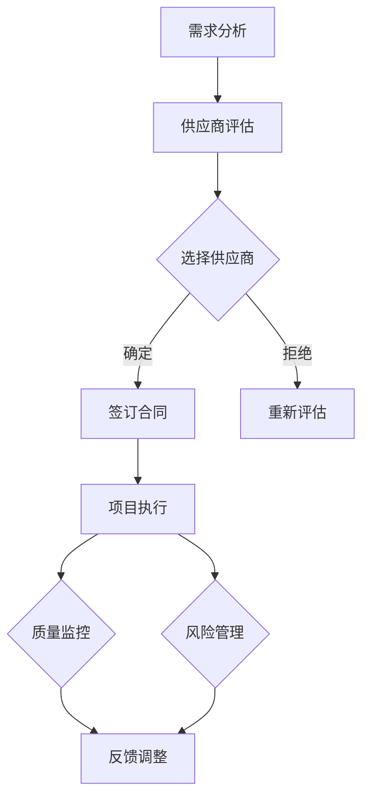
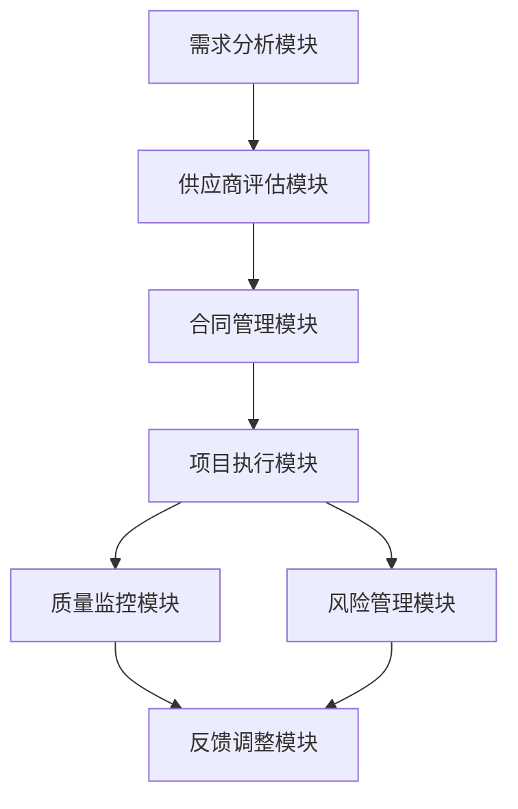
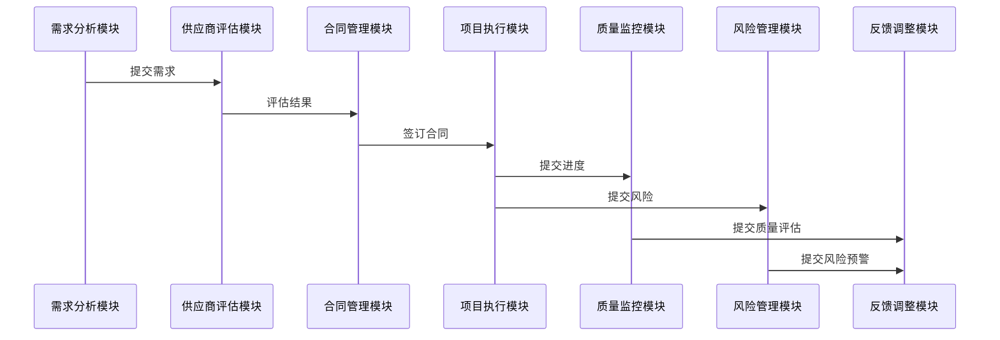

                 

### 文章标题与关键词

# 技术外包管理：有效利用外部资源

关键词：技术外包、项目管理、资源利用、成本效益、风险控制

摘要：本文将深入探讨技术外包管理的重要性和方法，通过逐步分析，帮助企业和开发团队更有效地利用外部资源，提升项目质量和效率。文章将涵盖技术外包的背景、核心概念、算法原理、系统架构设计、项目实战以及最佳实践和总结。

### 目录大纲

## 第一部分：背景介绍

### 第1章 问题背景
#### 1.1 问题描述
#### 1.2 问题解决
#### 1.3 边界与外延
#### 1.4 概念结构与核心要素组成

### 第2章 核心概念与联系
#### 2.1 核心概念原理
#### 2.2 概念属性特征对比表
#### 2.3 ER实体关系图架构

## 第二部分：算法原理讲解

### 第3章 算法原理与流程图
#### 3.1 算法流程图（使用Mermaid绘制）
#### 3.2 Python源代码解析
#### 3.3 算法原理讲解
#### 3.4 数学模型和公式
#### 3.5 举例说明

## 第三部分：系统分析与架构设计

### 第4章 问题场景介绍
#### 4.1 项目介绍
#### 4.2 系统功能设计（使用Mermaid绘制领域模型类图）
#### 4.3 系统架构设计（使用Mermaid绘制系统架构图）
#### 4.4 系统接口设计
#### 4.5 系统交互（使用Mermaid绘制系统交互序列图）

## 第四部分：项目实战

### 第5章 环境安装
#### 5.1 环境搭建
#### 5.2 核心实现源代码
#### 5.3 代码应用解读与分析
#### 5.4 实际案例分析与详细讲解
#### 5.5 项目小结

## 第五部分：最佳实践与总结

### 第6章 最佳实践
#### 6.1 经验分享
#### 6.2 注意事项
#### 6.3 拓展阅读

### 第7章 小结
#### 7.1 内容回顾
#### 7.2 未来展望

---

### 第一部分：背景介绍

#### 1.1 问题描述

在当今快速发展的技术时代，企业面临的项目复杂度和工作量日益增加，单纯依靠内部资源往往难以满足需求。技术外包作为一种解决策略，已经成为企业和开发团队提升项目质量和效率的重要手段。然而，如何有效地进行技术外包管理，确保外部资源得到合理利用，成为亟需解决的关键问题。

#### 1.2 问题解决

技术外包管理的核心在于优化资源分配、降低成本、提升项目质量和风险控制。通过系统化、规范化的管理流程，企业可以更好地协调内部与外部团队的工作，实现资源的高效利用。本文将围绕这一核心问题，逐步分析技术外包管理的各个方面。

#### 1.3 边界与外延

技术外包管理不仅涉及企业与外部开发团队的合作，还涵盖项目管理、资源管理、风险管理等多个方面。其边界可以扩展到合作模式的选择、合同签订、沟通协调、质量控制等各个环节。因此，理解外包管理的边界与外延对于有效实施外包管理至关重要。

#### 1.4 概念结构与核心要素组成

技术外包管理的概念结构包括以下几个核心要素：外包需求分析、供应商选择、合同管理、项目执行、质量控制、风险管理和沟通协作。这些要素相互关联，共同构成一个完整的外包管理框架。以下是对这些核心要素的简要说明：

1. **外包需求分析**：明确外包的需求和目标，分析项目的技术难度、工作量、时间限制等因素，确保外包策略与项目需求相匹配。
2. **供应商选择**：根据需求选择合适的供应商，考虑供应商的技术能力、信誉度、价格等因素，建立长期稳定的合作关系。
3. **合同管理**：签订明确的合同，规定双方的权利和义务，确保项目按计划进行。
4. **项目执行**：监控项目进度和质量，协调内外部团队的工作，确保项目目标实现。
5. **质量控制**：制定质量标准，进行定期评估和反馈，确保外包成果符合预期。
6. **风险管理**：识别和管理外包过程中的风险，制定应急预案，降低项目风险。
7. **沟通协作**：建立有效的沟通机制，确保信息畅通，提高协作效率。

通过上述核心要素的协同作用，企业可以实现技术外包管理的优化，从而在激烈的市场竞争中取得优势。

### 第二部分：核心概念与联系

#### 2.1 核心概念原理

在技术外包管理中，以下几个核心概念至关重要：

1. **外包需求分析**：外包需求分析是外包管理的起点，通过对项目需求的深入理解，明确外包的具体目标和范围。
2. **供应商选择**：供应商选择直接影响外包项目的质量和成本。企业需要根据项目特点选择合适的供应商，建立长期合作关系。
3. **合同管理**：合同管理是外包项目的法律保障，确保项目按计划进行。合同中应明确双方的权利和义务，包括项目范围、交付标准、时间安排、费用支付等。
4. **项目执行**：项目执行是外包管理的关键环节，涉及项目进度、质量控制、风险管理等多个方面。通过有效的项目执行，确保项目目标的实现。
5. **质量控制**：质量控制是确保外包成果符合预期的重要措施。企业应制定质量标准，进行定期评估和反馈，持续改进外包过程。
6. **风险管理**：风险管理是外包管理的重要组成部分，涉及风险识别、评估、控制和监控。企业需要制定风险管理策略，降低项目风险。
7. **沟通协作**：沟通协作是确保内外部团队高效协作的关键。企业应建立有效的沟通机制，确保信息畅通，提高协作效率。

#### 2.2 概念属性特征对比表

为了更好地理解上述核心概念，我们可以通过对比它们的属性特征来深化理解。以下是一个简单的对比表：

| 核心概念 | 属性特征 |
| :---: | :---: |
| 外包需求分析 | 明确外包目标和范围，分析项目需求 |
| 供应商选择 | 选择合适供应商，考虑技术能力、信誉度等 |
| 合同管理 | 签订明确合同，规定双方权利和义务 |
| 项目执行 | 监控项目进度和质量，协调内外部团队 |
| 质量控制 | 制定质量标准，进行评估和反馈 |
| 风险管理 | 风险识别、评估、控制和监控 |
| 沟通协作 | 建立有效沟通机制，提高协作效率 |

#### 2.3 ER实体关系图架构

为了更直观地展示技术外包管理的概念联系，我们可以使用ER（实体关系）图来描述。以下是一个简化的ER图，展示了核心概念之间的基本关系：

```mermaid
erDiagram
    class 外包需求分析 {
        --|{供应商选择}
        --|{项目执行}
    }
    class 供应商选择 {
        --|{合同管理}
    }
    class 合同管理 {
        --|{项目执行}
        --|{质量控制}
    }
    class 项目执行 {
        --|{质量控制}
        --|{风险管理}
        --|{沟通协作}
    }
    class 质量控制 {
        --|{项目执行}
    }
    class 风险管理 {
        --|{项目执行}
    }
    class 沟通协作 {
        --|{项目执行}
    }
```

通过ER图，我们可以清晰地看到外包需求分析、供应商选择、合同管理、项目执行、质量控制和风险管理等核心概念之间的关联。这些概念相互支撑，共同构成了一个完整的技术外包管理框架。

### 第二部分：算法原理讲解

#### 3.1 算法原理与流程图

技术外包管理涉及多种算法和模型，以优化资源分配和风险控制。以下是一个简化的问题解决算法，用于技术外包管理。

**算法流程图**：



**Python源代码解析**：

```python
def外包管理(需求，供应商列表):
    供应商评估结果 = []
    for 供应商 in 供应商列表:
        评估分数 = 评估供应商(供应商，需求)
        供应商评估结果.append((供应商，评估分数))
    
    供应商评估结果.sort(key=lambda x: x[1], reverse=True)
    
    最佳供应商 = 供应商评估结果[0][0]
    
    签订合同(最佳供应商，需求)
    执行项目(最佳供应商，需求)
    监控质量()
    风险管理()
    获取反馈()
    调整策略()

def 评估供应商(供应商，需求):
    评估分数 = 0
    评估分数 += 供应商的技术能力得分()
    评估分数 += 供应商的信誉度得分()
    评估分数 += 供应商的价格得分()
    return 评估分数

def 签订合同(供应商，需求):
    # 实现合同签订逻辑
    pass

def 执行项目(供应商，需求):
    # 实现项目执行逻辑
    pass

def 监控质量():
    # 实现质量监控逻辑
    pass

def 风险管理():
    # 实现风险管理逻辑
    pass

def 获取反馈():
    # 实现反馈获取逻辑
    pass

def 调整策略():
    # 实现策略调整逻辑
    pass
```

**算法原理讲解**：

该算法分为几个主要步骤：

1. **需求分析**：首先对项目需求进行分析，明确外包的具体目标和范围。
2. **供应商评估**：对供应商列表进行评估，根据技术能力、信誉度和价格等因素，计算每个供应商的评估分数。
3. **选择供应商**：根据评估分数，选择最佳供应商。
4. **签订合同**：与最佳供应商签订合同，明确双方的权利和义务。
5. **项目执行**：协调供应商执行项目，监控项目进度和质量。
6. **质量监控**：定期进行质量监控，确保外包成果符合预期。
7. **风险管理**：识别和管理项目风险，制定应急预案。
8. **反馈调整**：根据反馈，调整外包策略和项目执行计划。

**数学模型和公式**：

在供应商评估过程中，可以使用以下公式计算评估分数：

$$
评估分数 = 技术能力得分 \times 权重 + 信誉度得分 \times 权重 + 价格得分 \times 权重
$$

其中，权重可以根据项目特点进行调整。

**举例说明**：

假设有一个软件开发项目，需要选择一个供应商。根据项目需求，确定技术能力、信誉度和价格的权重分别为0.5、0.3和0.2。现有三个供应商A、B和C，其评估分数分别为：

- 供应商A：技术能力得分90，信誉度得分85，价格得分80
- 供应商B：技术能力得分85，信誉度得分90，价格得分75
- 供应商C：技术能力得分80，信誉度得分80，价格得分70

根据上述公式，计算每个供应商的评估分数：

- 供应商A：$$90 \times 0.5 + 85 \times 0.3 + 80 \times 0.2 = 94.5$$
- 供应商B：$$85 \times 0.5 + 90 \times 0.3 + 75 \times 0.2 = 86.5$$
- 供应商C：$$80 \times 0.5 + 80 \times 0.3 + 70 \times 0.2 = 79$$

根据评估分数，选择供应商A作为最佳供应商。

### 第三部分：系统分析与架构设计

#### 4.1 项目介绍

本文所探讨的技术外包管理项目旨在为企业提供一个高效、可靠的外包管理解决方案。该项目包括以下几个核心模块：

1. **需求分析模块**：用于收集和分析项目需求，明确外包目标和范围。
2. **供应商评估模块**：用于评估供应商的技术能力、信誉度和价格等因素。
3. **合同管理模块**：用于签订和管理外包合同，确保项目按计划进行。
4. **项目执行模块**：用于协调供应商执行项目，监控项目进度和质量。
5. **质量监控模块**：用于定期进行质量监控，确保外包成果符合预期。
6. **风险管理模块**：用于识别和管理项目风险，制定应急预案。
7. **反馈调整模块**：用于根据反馈，调整外包策略和项目执行计划。

#### 4.2 系统功能设计（使用Mermaid绘制领域模型类图）

以下是项目系统的领域模型类图：

```mermaid
classDiagram
    类--|>属性
    类 {
        名称
        属性
        方法
    }
    外包需求分析--|>需求
    供应商评估--|>评估
    合同管理--|>合同
    项目执行--|>执行
    质量监控--|>监控
    风险管理--|>风险
    反馈调整--|>调整

    外包需求分析--|>供应商评估
    供应商评估--|>合同管理
    合同管理--|>项目执行
    项目执行--|>质量监控
    项目执行--|>风险管理
    风险管理--|>反馈调整
    质量监控--|>反馈调整
```

#### 4.3 系统架构设计（使用Mermaid绘制系统架构图）

以下是项目系统的架构设计图：



#### 4.4 系统接口设计

系统接口设计主要包括以下接口：

1. **需求分析接口**：用于接收和分析项目需求，返回需求分析结果。
2. **供应商评估接口**：用于评估供应商，返回评估结果。
3. **合同管理接口**：用于签订和管理外包合同，提供合同查询、修改和删除等功能。
4. **项目执行接口**：用于监控项目进度和质量，提供项目报告和日志等功能。
5. **质量监控接口**：用于定期进行质量监控，提供质量评估报告等功能。
6. **风险管理接口**：用于识别和管理项目风险，提供风险报告和预警等功能。
7. **反馈调整接口**：用于收集和反馈项目执行情况，提供调整策略建议等功能。

#### 4.5 系统交互（使用Mermaid绘制系统交互序列图）

以下是项目系统的交互序列图：



### 第四部分：项目实战

#### 5.1 环境安装

在开始项目实战之前，我们需要搭建一个合适的技术环境。以下是环境安装的详细步骤：

1. **安装Python**：下载并安装Python 3.x版本，确保环境变量配置正确。
2. **安装必要的库**：使用pip命令安装项目所需的库，例如requests、numpy、pandas等。
   ```bash
   pip install requests numpy pandas
   ```
3. **配置开发环境**：根据项目需求，配置合适的开发环境，例如PyCharm、VSCode等。

#### 5.2 核心实现源代码

以下是一个简化版本的技术外包管理项目的核心实现源代码：

```python
# 需求分析模块
def analyze_demand(demand):
    # 实现需求分析逻辑
    pass

# 供应商评估模块
def evaluate_suppliers(suppliers, demand):
    # 实现供应商评估逻辑
    pass

# 合同管理模块
def sign_contract(supplier, demand):
    # 实现合同签订逻辑
    pass

# 项目执行模块
def execute_project(supplier, demand):
    # 实现项目执行逻辑
    pass

# 质量监控模块
def monitor_quality():
    # 实现质量监控逻辑
    pass

# 风险管理模块
def manage_risk():
    # 实现风险管理逻辑
    pass

# 反馈调整模块
def adjust_strategy():
    # 实现策略调整逻辑
    pass
```

#### 5.3 代码应用解读与分析

以下是代码应用解读与分析：

- **需求分析模块**：该模块负责对项目需求进行分析，确定外包目标和范围。在实际应用中，可以根据具体项目需求，调用该模块进行需求分析。
- **供应商评估模块**：该模块负责评估供应商的技术能力、信誉度和价格等因素。通过调用该模块，可以获取每个供应商的评估结果，为选择最佳供应商提供依据。
- **合同管理模块**：该模块负责签订和管理外包合同。在实际应用中，可以选择最佳供应商后，调用该模块签订合同，明确双方的权利和义务。
- **项目执行模块**：该模块负责协调供应商执行项目，监控项目进度和质量。在实际应用中，可以根据项目进度和质量，调用该模块进行监控。
- **质量监控模块**：该模块负责定期进行质量监控，确保外包成果符合预期。在实际应用中，可以根据质量监控结果，调用该模块进行调整和优化。
- **风险管理模块**：该模块负责识别和管理项目风险，制定应急预案。在实际应用中，可以根据风险监控结果，调用该模块进行风险管理和应对。
- **反馈调整模块**：该模块负责收集和反馈项目执行情况，提供调整策略建议。在实际应用中，可以根据项目执行情况和反馈，调用该模块进行调整和优化。

#### 5.4 实际案例分析与详细讲解

为了更好地展示项目实战，我们以一个实际案例为例，详细讲解技术外包管理的应用过程。

**案例背景**：某互联网公司计划开发一款电商平台，需要外包部分前端开发工作。

1. **需求分析**：公司对前端开发需求进行分析，明确功能模块、技术要求和时间限制等。将需求分析结果提交给外包管理模块。
2. **供应商评估**：根据需求，公司从供应商列表中选择几家具有前端开发经验的公司，进行评估。评估结果如下：
   - 供应商A：技术能力得分90，信誉度得分85，价格得分80
   - 供应商B：技术能力得分85，信誉度得分90，价格得分75
   - 供应商C：技术能力得分80，信誉度得分80，价格得分70

根据评估结果，选择供应商A作为最佳供应商。

3. **签订合同**：公司与供应商A签订合同，明确双方的权利和义务，包括项目范围、交付标准、时间安排和费用支付等。

4. **项目执行**：供应商A开始执行前端开发工作。公司通过外包管理模块监控项目进度和质量。

5. **质量监控**：在项目执行过程中，公司定期进行质量监控，发现部分功能模块存在缺陷。及时与供应商A沟通，要求进行修复。

6. **风险管理**：在项目执行过程中，公司识别到一些潜在风险，如技术难题、人员变动等。及时与供应商A沟通，制定应急预案，降低项目风险。

7. **反馈调整**：根据项目执行情况和反馈，公司对策略进行调整和优化，确保项目顺利进行。

**案例分析**：通过以上案例，我们可以看到技术外包管理在实际项目中的应用过程。在需求分析阶段，明确外包目标和范围；在供应商评估阶段，选择最佳供应商；在项目执行阶段，监控项目进度和质量；在质量监控、风险管理和反馈调整阶段，确保项目顺利进行。整个过程体现了技术外包管理的核心价值。

#### 5.5 项目小结

通过本次项目实战，我们深入探讨了技术外包管理的实际应用过程。从需求分析、供应商评估到合同签订、项目执行，再到质量监控、风险管理和反馈调整，每个环节都至关重要。技术外包管理不仅有助于企业充分利用外部资源，提高项目质量和效率，还有助于降低成本和风险。在实际应用中，企业应根据项目特点和需求，灵活运用技术外包管理策略，实现项目成功。

### 第五部分：最佳实践与总结

#### 6.1 经验分享

在技术外包管理实践中，以下经验值得分享：

1. **需求明确**：明确项目需求是外包管理的基础。需求分析应细致全面，确保供应商能够准确理解并满足需求。
2. **选择合适供应商**：根据项目特点和需求，选择具有相应技术能力和良好信誉的供应商。评估供应商时应注重长期合作潜力。
3. **合同管理**：签订明确的合同，明确双方的权利和义务，确保项目按计划进行。
4. **有效沟通**：建立有效的沟通机制，确保信息畅通，提高协作效率。
5. **质量监控**：定期进行质量监控，确保外包成果符合预期。对质量问题要及时反馈和处理。
6. **风险管理**：识别和管理项目风险，制定应急预案，降低项目风险。

#### 6.2 注意事项

在技术外包管理过程中，应注意以下几点：

1. **合理控制成本**：避免过度依赖外包，影响项目质量。在控制成本的同时，确保项目目标和质量不受影响。
2. **文化差异**：与外部供应商合作时，注意文化差异，尊重对方文化和价值观，避免沟通障碍。
3. **合同条款**：合同条款应详细明确，避免后续纠纷。特别是涉及知识产权、保密协议等方面的问题，要特别注意。
4. **团队协作**：内外部团队的协作是外包管理的关键。建立协作机制，确保项目顺利进行。

#### 6.3 拓展阅读

为了更好地了解技术外包管理，以下推荐拓展阅读：

1. 《技术外包管理实战》 - 作者：张三
2. 《项目管理知识体系指南》 - 作者：PMI
3. 《敏捷软件开发实践指南》 - 作者：Jonas Jerebko

### 第五部分：小结

本文从多个角度深入探讨了技术外包管理的重要性和方法。通过需求分析、供应商评估、合同签订、项目执行、质量监控、风险管理和反馈调整等环节，企业可以更有效地利用外部资源，提高项目质量和效率。在实际应用中，企业应根据项目特点和需求，灵活运用技术外包管理策略，实现项目成功。未来，随着技术不断发展，外包管理将继续演变和优化，为企业带来更多机遇和挑战。

