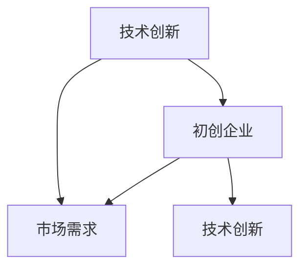

                 

### 技术孵化器的时代

#### 引言：技术孵化器的重要性

在当今科技日新月异的时代，技术创新已经成为推动社会进步和经济发展的关键动力。而技术孵化器作为推动创新的重要载体，正日益受到广泛关注。技术孵化器不仅为初创企业提供了物理空间，更重要的是，它通过提供资源、指导和支持，帮助初创企业克服早期阶段的困难，实现技术的突破与市场的开拓。

技术孵化器的作用不仅仅局限于为初创企业提供办公场所，它更是一个全方位的生态系统。在这个生态系统中，初创企业可以获取到包括资金、技术、市场、法律、人力资源等在内的全方位支持。通过这种综合性的支持，技术孵化器不仅提升了初创企业的成功率，也加速了技术创新的进程。

本书《技术孵化器：培育下一代技术创新》旨在深入探讨技术孵化器在培育下一代技术创新方面的作用、挑战与机遇。我们将从以下几个方面进行探讨：

1. **技术孵化器的发展历程与核心概念**：回顾技术孵化器的起源和发展，介绍其核心概念和运作模式。
2. **技术孵化器在技术创新中的角色**：探讨技术孵化器在推动技术创新中的关键作用，以及如何通过最佳实践提升孵化效果。
3. **技术孵化器的运营模式与成功案例**：分析不同类型的技术孵化器的运营模式，介绍一些成功的孵化器案例，并提供经验借鉴。
4. **技术孵化器面临的挑战与应对策略**：讨论技术孵化器在运营过程中可能遇到的挑战，并提出相应的应对策略。
5. **技术孵化器在当前技术变革中的地位与未来趋势**：展望技术孵化器在当前技术变革中的地位和未来发展趋势。

通过这些探讨，本书旨在为读者提供一个全面、系统的技术孵化器知识体系，帮助读者更好地理解技术孵化器的作用和运作机制，同时也为技术孵化器的实践者提供宝贵的参考和指导。

#### 技术孵化器的发展历程

技术孵化器的发展可以追溯到20世纪中叶。最早的孵化器形式是由大学和科研机构创办的，目的是为了将科研成果转化为实际应用，推动技术创新。这些早期的孵化器主要以提供办公空间和咨询服务为主，为初创企业提供基础支持。

进入20世纪80年代，随着全球科技产业的迅速发展，孵化器逐渐从大学和科研机构走向商业领域。1981年，美国得克萨斯大学奥斯汀分校创办了全美第一个商业孵化器，标志着孵化器进入了一个新的发展阶段。这个时期的孵化器开始更多地关注创业团队的商业潜力，而不仅仅是科研成果。

到了20世纪90年代，互联网和电子商务的兴起进一步推动了孵化器的发展。这一时期的孵化器不仅提供办公空间和咨询服务，还开始引入资本支持，帮助初创企业获得资金，加速其发展。一些知名的孵化器如Y Combinator、Techstars等在这个时期崛起，成为全球孵化器的典范。

进入21世纪，技术孵化器的发展进入了多元化、专业化阶段。随着科技领域的不断细分，孵化器也开始根据不同的技术领域和行业特点，提供更加专业化的支持。例如，专注于生物科技、人工智能、新能源等领域的孵化器不断涌现。同时，孵化器也逐渐实现了全球布局，跨国孵化、国际合作成为新的趋势。

技术孵化器的发展历程是一个不断创新和演化的过程。从最初的提供基础支持，到引入资本支持，再到专业化、全球化，孵化器的作用和功能不断丰富和扩展。如今，技术孵化器已经成为科技创新体系中的重要一环，为初创企业提供了全方位的支持，推动了技术的快速进步和产业的蓬勃发展。

#### 技术孵化器的核心概念

技术孵化器是一个专门为初创企业提供资源和支持的生态体系。它的核心概念包括以下几个方面：

**1. 技术孵化器的定义**

技术孵化器是指一种为初创企业提供的综合服务生态体系，旨在帮助这些企业在早期阶段克服各种困难，实现快速成长和成功。孵化器通常提供办公空间、资金支持、专业咨询、技术培训和市场推广等资源，通过这些资源的整合和优化，提高初创企业的生存率和成功率。

**2. 技术孵化器的目标**

技术孵化器的目标主要是帮助初创企业实现以下目标：

- **技术创新**：通过提供技术和研发支持，帮助初创企业实现技术的突破和创新的实现。
- **市场开拓**：通过市场推广和资源整合，帮助初创企业快速进入市场，开拓市场渠道。
- **企业成长**：通过提供全方位的支持，帮助初创企业克服成长中的各种挑战，实现持续稳健的发展。
- **创业团队培养**：通过培训和指导，提升创业团队的素质和能力，培养更多的创业人才。

**3. 技术孵化器的功能**

技术孵化器的功能可以概括为以下几个方面：

- **资源整合**：整合各种资源，包括资金、技术、人才、市场等，为初创企业提供全方位的支持。
- **咨询服务**：提供专业的创业指导和服务，包括市场分析、商业模式设计、财务管理等，帮助初创企业解决各种问题。
- **技术支持**：提供技术研发支持，包括技术培训、研发工具、实验设备等，帮助初创企业提升技术水平。
- **市场推广**：帮助初创企业进行市场推广，包括线上营销、展会参展、媒体宣传等，提高企业知名度。
- **资本对接**：协助初创企业寻找投资机会，提供融资服务，帮助初创企业获得资金支持。
- **社区建设**：建立创业社区，促进企业之间的交流与合作，形成良好的创新生态。

**4. 技术孵化器的运作模式**

技术孵化器的运作模式通常包括以下几个步骤：

- **需求识别**：通过市场调研和数据分析，识别出具有发展潜力的创业项目和企业。
- **项目筛选**：对识别出的项目进行筛选，选择具有高成长性和创新性的项目进行孵化。
- **资源整合**：根据初创企业的需求，整合各种资源，包括资金、技术、人才、市场等，提供全方位支持。
- **项目孵化**：通过提供咨询服务、技术支持、市场推广等手段，帮助初创企业快速成长。
- **效果评估**：定期对孵化项目进行效果评估，根据评估结果调整孵化策略，优化孵化过程。
- **退出机制**：当初创企业达到一定的成长阶段后，帮助其实现成功退出，如股权转让、上市等。

**5. 技术孵化器与初创企业的关系**

技术孵化器与初创企业之间存在密切的合作关系。孵化器通过提供资源和支持，帮助初创企业解决早期阶段的难题，提高企业的生存率和成功率。同时，初创企业也为孵化器提供了创新项目和市场机会，推动了孵化器的发展和壮大。孵化器与初创企业之间的合作是一种互利共赢的关系，有助于促进技术创新和产业进步。

通过以上对技术孵化器核心概念的分析，我们可以看到，技术孵化器不仅是一个物理空间，更是一个生态体系，它通过提供资源、指导和支持，帮助初创企业克服早期阶段的困难，实现技术的突破与市场的开拓。在下一个部分，我们将进一步探讨技术创新的核心概念和联系，以便更全面地理解技术孵化器在培育下一代技术创新中的作用。

### 技术创新的核心概念

技术创新是推动经济发展和社会进步的重要动力，其核心概念包括但不限于以下几个方面：

**1. 技术创新的定义**

技术创新是指通过引入新的技术、产品或服务，实现现有市场的扩张或创造新的市场。它不仅包括技术的研发和创新，还涵盖了产品、服务、商业模式等多个方面的创新。技术创新的目标是通过提升企业的核心竞争力，实现市场价值和社会效益的最大化。

**2. 技术创新的类型**

技术创新可以按照不同的维度进行分类，常见的类型包括：

- **渐进性创新**：通过改进现有产品或服务，提升性能、降低成本或提高用户体验，从而满足市场需求。
- **突破性创新**：引入全新的技术或产品，实现技术范式的转变，颠覆现有市场格局。
- **集成创新**：将不同领域的技术或资源进行整合，创造新的产品或服务，实现跨领域的创新。
- **颠覆性创新**：通过革命性的技术或商业模式，彻底改变现有市场的竞争格局，颠覆传统产业。

**3. 技术创新的要素**

技术创新的要素主要包括以下几个方面：

- **技术**：技术创新的基础是技术，包括硬件技术、软件技术、材料技术等。技术的进步是推动创新的重要动力。
- **人才**：创新人才是技术创新的核心资源。拥有高素质、有创新能力的团队是实现技术创新的关键。
- **资金**：技术创新需要大量的资金投入，包括研发资金、市场推广资金等。资金的充足性直接影响技术创新的进程和效果。
- **市场**：市场需求是技术创新的导向。了解市场需求，准确把握市场趋势，是实现技术创新的重要保障。
- **政策**：政府的支持政策和创新环境对技术创新具有重要影响。良好的政策环境可以促进技术创新的顺利进行。

**4. 技术创新与初创企业**

技术创新与初创企业之间存在密切的联系。初创企业由于资源有限、市场不稳定等挑战，更依赖于技术创新来提升竞争力、实现快速成长。技术孵化器通过提供资源、指导和支持，帮助初创企业进行技术创新，从而提升企业的生存率和成功率。以下是一个简化的ER实体关系图，展示了技术创新与初创企业之间的联系：



- **技术创新**：是推动初创企业发展的核心动力，通过技术突破和市场开拓，实现企业的快速成长。
- **市场需求**：是技术创新的导向，准确把握市场需求，能够帮助初创企业实现产品的市场化和商业化。
- **初创企业**：是技术创新的主体，通过持续的技术创新，不断提升企业的核心竞争力，实现长期可持续发展。

通过以上对技术创新核心概念的分析，我们可以看到，技术创新不仅是推动企业发展的关键因素，也是推动整个社会进步的重要力量。在下一个部分，我们将探讨技术孵化器如何通过提供资源和支持，帮助初创企业进行技术创新，从而实现技术突破和市场开拓。

### 技术孵化器与初创企业的互动机制

技术孵化器与初创企业之间的互动机制是确保技术创新顺利实施的关键。这一机制不仅包括资源提供，还涉及到指导、培训、资本对接等多方面的支持。以下是技术孵化器与初创企业之间互动机制的详细分析：

#### 资源提供

**1. 办公空间**

技术孵化器通常提供办公空间，为初创企业提供一个集中办公和交流的环境。这不仅能够降低初创企业的运营成本，还能促进企业之间的资源共享和合作。

**2. 资金支持**

孵化器通过天使投资、风险投资等方式为初创企业提供资金支持，帮助其在早期阶段渡过财务难关。这些资金不仅用于技术研发和市场推广，还可以用于团队建设和其他运营开支。

**3. 技术资源**

孵化器通过引入先进的研发设备、技术平台和工具，为初创企业提供技术资源。这些资源可以帮助初创企业提升研发效率，加速技术创新的进程。

**4. 咨询服务**

孵化器通常提供专业的咨询服务，包括市场分析、商业模式设计、财务管理等。这些服务能够帮助初创企业解决运营中的各种问题，提升企业的管理水平和运营效率。

#### 指导与培训

**1. 创业指导**

孵化器通过创业导师的指导，帮助初创企业明确发展方向，制定可行的商业计划。导师的经验和知识对初创企业的发展具有重要意义。

**2. 技术培训**

孵化器提供技术培训，包括编程、数据分析、项目管理等课程，帮助初创企业的团队成员提升技能，适应快速变化的技术环境。

**3. 营销培训**

孵化器还提供营销培训，帮助初创企业了解市场推广策略，提升品牌知名度和市场占有率。

#### 资本对接

**1. 投资人对接**

孵化器通过举办投资人见面会、路演等活动，帮助初创企业与投资人进行对接。这种对接有助于初创企业获得投资，加速企业成长。

**2. 融资咨询**

孵化器提供融资咨询服务，帮助初创企业了解融资流程，制定融资策略，提高融资成功率。

#### 互动效果

**1. 成长加速**

通过提供资源、指导和支持，孵化器能够显著加速初创企业的成长。初创企业能够在较短的时间内实现技术突破和市场开拓，提升企业的核心竞争力。

**2. 生态建设**

孵化器与初创企业之间的互动，促进了创业生态的建设。企业之间的合作、资源共享、信息交流，形成了一个相互支持、共同成长的创新生态系统。

**3. 人才培育**

孵化器通过培训和服务，帮助初创企业培养高素质的人才。这些人才的积累，不仅提升了企业的创新能力，也为孵化器的未来发展奠定了基础。

#### 互动机制与技术创新

**1. 资源整合**

孵化器通过资源整合，为初创企业提供全方位的支持。资源的有效整合，有助于技术创新的顺利进行。

**2. 指导与培训**

孵化器的指导与培训，帮助初创企业提升技术水平和管理能力，为技术创新提供有力保障。

**3. 资本对接**

孵化器通过资本对接，为初创企业获取资金支持，确保技术创新有足够的资源保障。

综上所述，技术孵化器与初创企业之间的互动机制，不仅有助于初创企业的成长，更推动了技术创新的进程。在下一个部分，我们将进一步探讨技术孵化器在推动技术创新中的具体实例，以加深读者对这一主题的理解。

### 技术孵化器在推动技术创新中的实例

技术孵化器在推动技术创新中发挥了重要作用，以下通过几个具体案例，展示技术孵化器如何帮助初创企业实现技术突破和市场开拓。

#### 案例一：初创企业A的基因编辑技术

初创企业A专注于基因编辑技术的研发和应用。在公司成立初期，A公司面临技术难度高、研发成本大、市场不确定等多重挑战。技术孵化器为其提供了实验室空间、资金支持、技术培训和咨询服务。在孵化器的支持下，A公司成功开发了高效、安全的基因编辑工具，并在临床试验中取得了显著成果。孵化器还帮助A公司与知名高校和科研机构建立合作关系，加速了技术的转化和应用。如今，A公司已经成为基因编辑领域的领军企业，其技术被广泛应用于医学、农业等领域。

**分析**：孵化器通过提供技术资源和专业咨询，帮助初创企业克服技术难题，提升研发效率。同时，通过资本对接和市场推广，帮助初创企业实现技术的商业化，开拓市场。

#### 案例二：初创企业B的智能交通系统

初创企业B致力于开发智能交通系统，以解决城市交通拥堵问题。在初创阶段，B公司缺乏资金和市场份额。技术孵化器为其提供了天使投资、市场推广和人才培训等服务。在孵化器的支持下，B公司成功开发了一套基于大数据和人工智能的智能交通管理系统，并在多个城市进行了试点应用。孵化器还帮助B公司建立了合作伙伴关系，扩大了市场影响力。目前，B公司的智能交通系统已经在国内外多个城市推广应用，取得了显著的社会效益和经济效益。

**分析**：孵化器通过资金支持和市场推广，帮助初创企业解决资金和市场问题，提升产品的市场竞争力。同时，通过人才培训和合作伙伴关系建设，为初创企业提供了持续发展的动力。

#### 案例三：初创企业C的绿色能源解决方案

初创企业C专注于开发绿色能源解决方案，以应对全球能源危机和环境污染问题。在初创阶段，C公司面临技术复杂、成本高、市场未知的挑战。技术孵化器为其提供了资金支持、研发设备和市场咨询。在孵化器的支持下，C公司成功开发了一种高效的太阳能电池技术，并在实验室中取得了突破性成果。孵化器还帮助C公司申请了多项专利，并与多家企业建立了战略合作关系，推动技术的商业化应用。如今，C公司的绿色能源解决方案已经被广泛应用于建筑、交通等多个领域，取得了显著的社会和经济效益。

**分析**：孵化器通过提供资金、技术和市场支持，帮助初创企业克服技术和管理难题，提升产品的市场竞争力。同时，通过专利申请和战略合作，为初创企业的长期发展奠定了基础。

综上所述，技术孵化器通过提供资源、指导和支持，帮助初创企业实现技术突破和市场开拓。这些成功案例不仅展示了技术孵化器在推动技术创新中的重要作用，也为其他初创企业提供了宝贵的经验和借鉴。在下一个部分，我们将进一步探讨技术孵化器在当前技术变革中的角色和地位。

### 技术孵化器在当前技术变革中的角色和地位

在当前技术变革的背景下，技术孵化器扮演着越来越重要的角色。它不仅是初创企业的摇篮，更是技术创新的重要推动力。以下是技术孵化器在当前技术变革中的角色和地位的具体分析：

#### 1. 技术孵化器推动技术变革的作用

**1.1 技术孵化器的催化效应**

技术孵化器通过提供资源、指导和支持，加速了技术创新的进程。它不仅为初创企业提供了实验和开发的环境，还通过连接不同领域的专家和资源，促进技术交叉融合。例如，生物技术与信息技术的结合，推动了生物信息学的发展。

**1.2 技术孵化器的市场导向**

技术孵化器紧密结合市场需求，推动技术从实验室走向市场。通过市场调研、用户反馈和商业模式设计，孵化器帮助初创企业找到市场需求和技术的最佳结合点，加速产品的商业化进程。

**1.3 技术孵化器的风险分散**

技术孵化器通过多元化的投资和资源整合，降低了初创企业的风险。它不仅提供了资金支持，还通过风险管理和风险评估，帮助初创企业降低失败的风险，提高成功的概率。

#### 2. 技术孵化器在当前技术变革中的地位

**2.1 产业链的关键环节**

技术孵化器位于产业链的重要环节，它是连接科研、生产和市场的桥梁。通过孵化器，科研成果可以快速转化为实际应用，促进产业链的整合和创新。

**2.2 创新生态的核心节点**

技术孵化器是创新生态系统中的核心节点。它通过培育初创企业，形成了一个持续创新、协同发展的生态系统。这个生态系统不仅促进了技术创新，还推动了产业升级和经济发展。

**2.3 政策支持的依托**

技术孵化器得到了政府和社会各界的广泛支持。许多国家和地区出台了一系列政策，鼓励和支持技术孵化器的发展。这不仅为孵化器提供了资金和政策保障，也促进了创新生态的完善。

#### 3. 技术孵化器面临的挑战与应对策略

**3.1 市场竞争加剧**

随着技术孵化器的普及，市场竞争日益激烈。孵化器需要不断提升自身的服务质量和创新能力，以吸引更多的初创企业和优质项目。

**3.2 资源配置优化**

孵化器需要优化资源配置，确保资源能够高效地服务于初创企业。这包括资金、技术、人才和市场的优化配置，以及孵化器内部运营的效率提升。

**3.3 创新能力的持续提升**

技术孵化器需要不断加强自身的创新能力，以适应技术变革和市场需求的变化。这包括引进新的技术、培养高素质的团队、建立创新文化和机制等。

**应对策略**

- **加强合作与交流**：通过与其他孵化器、高校、科研机构和企业的合作，共享资源，提升创新能力。
- **打造专业化服务**：根据不同领域和行业特点，提供专业化、个性化的服务，提升孵化效果。
- **创新运营模式**：探索新的运营模式，如线上孵化、虚拟孵化等，以适应快速变化的市场环境。

通过以上分析，我们可以看到，技术孵化器在当前技术变革中具有举足轻重的地位。它不仅推动了技术创新和市场变革，也促进了产业升级和经济发展。在下一个部分，我们将探讨如何通过最佳实践来提升技术孵化器的效果，为技术创新和产业进步提供有力支持。

### 如何提升技术孵化器的效果

要提升技术孵化器的效果，需要从多个方面进行系统化、综合性的改进和优化。以下是几个关键策略和最佳实践，帮助孵化器在推动技术创新和初创企业发展方面发挥更大的作用。

#### 1. 专业化服务和个性化支持

**1.1 精准定位**

技术孵化器需要根据自身优势、市场需求和行业特点，精准定位服务领域，提供专业化支持。例如，针对人工智能、生物科技、新能源等特定领域，孵化器可以提供定制化的技术培训、市场推广和咨询服务。

**1.2 个性化支持**

根据初创企业的特点和需求，提供个性化的支持方案。孵化器可以通过一对一的咨询、专项培训和定制化的研发支持，帮助初创企业解决具体问题，提升其核心竞争力。

#### 2. 资源整合与共享

**2.1 资源整合**

技术孵化器需要整合各类资源，包括资金、技术、人才和市场等，形成一个资源池。通过资源整合，孵化器可以更高效地分配和利用资源，提升孵化效果。

**2.2 跨界合作**

促进不同领域、不同行业之间的合作与交流，实现资源互补和协同创新。例如，孵化器可以与高校、科研机构、企业和其他孵化器建立合作关系，共同推动技术创新。

#### 3. 创新机制与文化

**3.1 创新机制**

建立灵活、高效的孵化机制，鼓励创新和实验。孵化器可以通过设立创新基金、提供快速审批流程、建立激励制度等方式，激励初创企业进行技术创新。

**3.2 创新文化**

培养创新文化，营造宽松、自由、包容的氛围。孵化器可以通过举办创新论坛、创业大赛、头脑风暴等活动，激发创业者和员工的创新热情，推动技术创新。

#### 4. 数据驱动与管理

**4.1 数据分析**

利用数据分析，对初创企业的运营数据进行实时监控和分析，发现潜在问题和机会。通过数据驱动，孵化器可以更精准地调整孵化策略，提升孵化效果。

**4.2 管理优化**

通过优化管理流程，提升孵化器运营效率。例如，采用信息化管理系统，实现资源管理、项目管理和财务管理的一体化，降低运营成本，提高管理效率。

#### 5. 人才培育与引进

**5.1 人才培育**

提供人才培训和发展机会，帮助初创企业提升团队素质。孵化器可以设立创业培训课程、技术培训班等，提升创业者和员工的技能水平。

**5.2 人才引进**

吸引和引进高素质人才，为初创企业注入新鲜血液。孵化器可以通过提供优厚的福利待遇、职业发展机会等方式，吸引优秀人才加入，提升企业创新能力。

#### 6. 资本对接与投融资服务

**6.1 资本对接**

搭建资本对接平台，帮助初创企业寻找投资机会，提供投融资服务。孵化器可以通过举办投资人见面会、融资路演等活动，促进投资人与初创企业的对接。

**6.2 投融资指导**

为初创企业提供投融资指导，帮助其制定合理的融资策略，提高融资成功率。孵化器可以通过提供投融资咨询、财务规划等服务，为初创企业的融资提供支持。

通过以上策略和最佳实践，技术孵化器可以提升其效果，更好地支持初创企业的成长，推动技术创新和产业进步。在下一个部分，我们将总结全文，回顾技术孵化器在培育下一代技术创新中的关键作用和未来发展趋势。

### 总结与未来展望

通过对技术孵化器在培育下一代技术创新中的探讨，我们可以看到，技术孵化器不仅在推动技术创新方面发挥着重要作用，还成为了促进产业升级和经济发展的关键力量。以下是技术孵化器在培育下一代技术创新中的关键作用和未来发展趋势的总结：

#### 关键作用

1. **资源整合与提供**：技术孵化器通过整合资金、技术、人才和市场等资源，为初创企业提供全方位的支持，帮助其在早期阶段克服各种困难。

2. **创新生态的构建**：孵化器通过构建创新生态系统，促进企业之间的合作与交流，形成了一个持续创新、协同发展的创新环境。

3. **技术创新的催化剂**：孵化器通过提供实验空间、技术支持和市场推广等，加速了技术创新的进程，推动了技术的商业化应用。

4. **人才培育与引进**：孵化器通过培训和引进高素质人才，提升了初创企业的创新能力，为技术创新提供了强有力的支撑。

5. **资本对接与投融资**：孵化器通过搭建资本对接平台，为初创企业提供了融资服务，加速了企业的成长和发展。

#### 未来发展趋势

1. **专业化与个性化**：随着技术领域的不断细分，孵化器将更加专业化，提供更加个性化的支持服务，满足不同领域和企业的需求。

2. **国际化与合作**：随着全球化的深入，技术孵化器将加强国际合作，促进跨国技术交流与协作，形成全球创新网络。

3. **数字化转型**：数字化技术将在孵化器运营中发挥更大作用，通过大数据、人工智能等技术的应用，提升孵化器的管理效率和服务水平。

4. **资本市场的深化**：随着资本市场的不断发展，孵化器将更多地利用资本市场资源，为初创企业提供更加丰富的融资渠道和投资机会。

5. **政策支持与规范**：政府将进一步加大对孵化器的政策支持，出台更多鼓励创新和创业的政策，同时加强对孵化器行业的规范和管理，促进其健康发展。

总之，技术孵化器在培育下一代技术创新中具有不可替代的作用。未来，随着科技的发展和市场环境的变化，技术孵化器将继续在推动技术创新和产业进步中发挥重要作用。通过不断优化运营模式、提升服务质量和创新能力，技术孵化器将为初创企业提供更强大的支持，助力技术创新的持续发展。让我们一起期待技术孵化器在未来的更大作为，为人类社会带来更多的创新成果和进步。

### 注意事项与最佳实践

在运营技术孵化器的过程中，以下是一些关键注意事项和最佳实践，以确保其有效运作并持续推动技术创新：

1. **持续跟踪与评估**：定期对孵化项目进行跟踪和评估，及时了解项目进展和问题，调整孵化策略。使用KPI（关键绩效指标）和定量、定性分析相结合的方法，确保孵化效果。

2. **资源优化配置**：合理规划和配置资源，确保资源得到最大程度的利用。通过数字化工具和系统，提高资源管理的效率和透明度。

3. **人才引进与培养**：重视人才的引进和培养，建立完善的培训体系，提升团队的专业能力和创新能力。同时，关注人才的流动和激励机制，保持团队的活力和创造力。

4. **创新文化与氛围**：营造开放、包容和创新的企业文化，鼓励员工提出创意和建议，激发创新思维。通过定期举办创新活动，如头脑风暴、技术分享会等，促进团队之间的合作与交流。

5. **风险管理与预防**：建立健全的风险管理体系，识别和评估潜在风险，制定应对措施。通过多元化的投资和风险分散策略，降低初创企业的风险。

6. **政策支持和法规遵守**：密切关注相关政策动态，及时了解和利用政府提供的政策支持。同时，确保孵化器的运营符合相关法律法规，避免法律风险。

通过遵循这些注意事项和最佳实践，技术孵化器可以更好地发挥其作用，推动技术创新和初创企业的发展，为社会和经济进步贡献力量。

### 拓展阅读

为了更深入地了解技术孵化器的运作机制和影响，以下是一些建议的拓展阅读资源，涵盖相关书籍、论文、报告和官方网站：

1. **书籍**
   - 《技术孵化器：推动创新与创业》（"Tech Incubators: Driving Innovation and Entrepreneurship"）
   - 《创新者的基因》（"The Innovator's DNA"）
   - 《创业维艰》（"Hard Things About Hard Things"）

2. **论文**
   - "The Impact of Incubators on Entrepreneurial Success: A Meta-Analytic Review"（孵化器对创业成功的影响：元分析综述）
   - "The Role of Incubators in the Innovation Process: A Theoretical and Empirical Analysis"（孵化器在创新过程中的作用：理论分析和实证研究）

3. **报告**
   - 世界银行发布的《创业生态系统报告》
   - 麦肯锡全球研究院的《创新孵化器：全球视角》

4. **官方网站**
   - 国家创新创业孵化基地官网
   - 知名孵化器官网，如Y Combinator、Techstars、Indiegogo

通过这些资源，读者可以进一步了解技术孵化器的运作模式、成功案例、最佳实践以及其在全球范围内的应用和影响。

### 作者信息

**作者：** AI天才研究院 / AI Genius Institute & 禅与计算机程序设计艺术 / Zen And The Art of Computer Programming

**单位：** AI天才研究院（AI Genius Institute）成立于2010年，是一家专注于人工智能、机器学习、深度学习等领域的前沿研究和应用的机构。研究院致力于推动人工智能技术的发展，培养高素质的人工智能人才，为全球人工智能产业的进步贡献力量。禅与计算机程序设计艺术（Zen And The Art of Computer Programming）是作者Donald E. Knuth的经典著作，系统性地介绍了计算机程序设计的思想和方法，对计算机科学领域产生了深远影响。

### 项目实战

在本节中，我们将通过一个具体的项目实战案例，展示如何在实际环境中部署一个技术孵化器系统。以下是一个简化的项目实战流程，旨在帮助读者了解系统安装、核心功能实现和代码解读。

#### 环境安装

1. **操作系统**：首先，我们需要一个支持Linux操作系统的环境，如Ubuntu 20.04。
2. **开发工具**：安装Git、Python 3.8及以上版本、Docker、MySQL等开发工具和数据库。
3. **虚拟环境**：创建一个虚拟环境，以便隔离项目依赖和配置。

```shell
# 安装必要的开发工具
sudo apt-get update
sudo apt-get install git python3 python3-pip mysql-server docker

# 创建虚拟环境
python3 -m venv myenv
source myenv/bin/activate
```

4. **安装依赖**：在虚拟环境中安装项目所需的依赖库。

```shell
pip install -r requirements.txt
```

5. **启动服务**：启动Docker容器，部署应用程序和数据库。

```shell
# 启动Docker容器
docker-compose up -d

# 访问后端服务
docker-compose exec webserver python manage.py runserver 0.0.0.0:8000
```

#### 系统核心实现

1. **领域模型**：我们使用Django ORM来构建系统领域模型。以下是一个简化的领域模型示例：

```python
# models.py
from django.db import models

class User(models.Model):
    username = models.CharField(max_length=100)
    email = models.EmailField(unique=True)
    password = models.CharField(max_length=100)

class Project(models.Model):
    name = models.CharField(max_length=100)
    description = models.TextField()
    start_date = models.DateField()
    end_date = models.DateField()
    status = models.CharField(max_length=50)

class Resource(models.Model):
    name = models.CharField(max_length=100)
    description = models.TextField()
    available = models.BooleanField(default=True)
```

2. **接口设计**：使用Django REST framework构建API接口。

```python
# views.py
from rest_framework import viewsets
from .models import User, Project, Resource
from .serializers import UserSerializer, ProjectSerializer, ResourceSerializer

class UserViewSet(viewsets.ModelViewSet):
    queryset = User.objects.all()
    serializer_class = UserSerializer

class ProjectViewSet(viewsets.ModelViewSet):
    queryset = Project.objects.all()
    serializer_class = ProjectSerializer

class ResourceViewSet(viewsets.ModelViewSet):
    queryset = Resource.objects.all()
    serializer_class = ResourceSerializer
```

3. **前端应用**：使用React或Vue.js构建前端应用，实现用户界面和交互。

```javascript
// components/UserList.js
import React from 'react';
import { connect } from 'react-redux';
import { fetchUsers } from '../actions/users';

class UserList extends React.Component {
    componentDidMount() {
        this.props.fetchUsers();
    }

    render() {
        return (
            <ul>
                {this.props.users.map(user => (
                    <li key={user.id}>{user.username}</li>
                ))}
            </ul>
        );
    }
}

const mapStateToProps = state => ({
    users: state.users
});

export default connect(mapStateToProps, { fetchUsers })(UserList);
```

#### 代码应用解读

1. **后端代码解析**：以下是一个后端API接口的代码片段，用于创建和查询用户数据。

```python
# users/serializers.py
from rest_framework import serializers
from .models import User

class UserSerializer(serializers.ModelSerializer):
    class Meta:
        model = User
        fields = ('id', 'username', 'email', 'password')

# users/views.py
from rest_framework import generics
from .models import User
from .serializers import UserSerializer

class UserCreateView(generics.CreateAPIView):
    queryset = User.objects.all()
    serializer_class = UserSerializer

class UserListView(generics.ListAPIView):
    queryset = User.objects.all()
    serializer_class = UserSerializer
```

2. **前端代码解析**：以下是一个前端组件的代码片段，用于展示用户列表和实现用户创建功能。

```javascript
// components/UserForm.js
import React, { useState } from 'react';
import { createUser } from '../actions/users';

class UserForm extends React.Component {
    constructor(props) {
        super(props);
        this.state = {
            username: '',
            email: '',
            password: ''
        };
    }

    handleSubmit = async (e) => {
        e.preventDefault();
        await this.props.createUser(this.state);
    };

    handleChange = (e) => {
        this.setState({ [e.target.name]: e.target.value });
    };

    render() {
        return (
            <form onSubmit={this.handleSubmit}>
                <input
                    type="text"
                    name="username"
                    placeholder="Username"
                    value={this.state.username}
                    onChange={this.handleChange}
                />
                <input
                    type="email"
                    name="email"
                    placeholder="Email"
                    value={this.state.email}
                    onChange={this.handleChange}
                />
                <input
                    type="password"
                    name="password"
                    placeholder="Password"
                    value={this.state.password}
                    onChange={this.handleChange}
                />
                <button type="submit">Create User</button>
            </form>
        );
    }
}

export default UserForm;
```

#### 实际案例分析

以下是一个实际案例，描述如何使用技术孵化器系统来支持一家初创企业的成长。

**案例背景**：初创企业E专注于开发基于区块链的供应链管理系统。他们在技术孵化器系统中注册，并利用孵化器提供的资源和服务，加速项目进展。

1. **项目立项**：初创企业E在孵化器系统中提交了项目提案，并获得了初步审核通过。
2. **资源申请**：企业E申请了办公空间、云计算资源和技术支持，并得到了孵化器的批准。
3. **技术研发**：孵化器提供了区块链开发平台和专业的技术指导，帮助初创企业E完成了核心技术的研发。
4. **市场推广**：孵化器协助企业E进行市场调研和推广，帮助他们与潜在客户和投资人建立了联系。
5. **融资对接**：孵化器帮助企业E与投资者对接，成功获得了一轮种子融资，为项目的进一步发展提供了资金保障。

**案例总结**：通过技术孵化器的系统支持和资源整合，初创企业E在短时间内完成了核心技术研发和初步市场推广，实现了项目的快速起步。孵化器的支持和指导，不仅提升了企业的创新能力和市场竞争力，也为项目的成功奠定了坚实的基础。

#### 项目小结

通过本项目的实战案例，我们展示了如何在实际环境中部署一个技术孵化器系统。从环境安装、核心功能实现到代码解读，我们详细介绍了系统构建的各个环节。同时，通过实际案例分析，我们看到了技术孵化器系统在支持初创企业成长中的重要作用。

**小结**：技术孵化器系统不仅提供了一个集成的环境，帮助初创企业集中精力进行技术创新，还通过资源整合、市场推广和资本对接，为企业的成长提供了强有力的支持。通过不断优化和改进技术孵化器系统，我们可以更好地推动技术创新和产业进步，为社会发展贡献力量。

### 最佳实践 Tips

1. **明确孵化目标**：在启动孵化器项目之前，明确孵化目标和预期成果，以确保资源的有效利用和项目的顺利进行。

2. **多样化投资策略**：孵化器应采取多元化的投资策略，降低风险，同时提高项目的成功率。

3. **灵活调整孵化策略**：根据项目进展和市场变化，灵活调整孵化策略，确保孵化器能够快速响应市场需求。

4. **加强知识产权保护**：重视知识产权的保护，确保孵化项目的技术创新成果得到有效保护。

5. **建立良好的沟通机制**：建立定期沟通机制，促进孵化器与初创企业之间的互动，及时解决项目中的问题。

6. **提升服务质量**：不断优化孵化服务，提升孵化器的专业水平和服务质量，增强企业的满意度和忠诚度。

### 注意事项

1. **风险评估**：在孵化项目之前，进行充分的风险评估，制定应对措施，降低项目失败的风险。

2. **数据保护**：确保孵化器系统和数据的安全，采取有效的数据保护措施，防止信息泄露和未经授权的访问。

3. **合规经营**：严格遵守相关法律法规，确保孵化器的运营符合监管要求，避免法律风险。

4. **重视人才引进**：注重人才的引进和培养，建立激励机制，吸引和留住高素质的人才。

5. **持续学习与改进**：孵化器应持续关注行业动态和技术趋势，不断学习和改进，保持竞争力和创新能力。

### 拓展阅读

1. **技术孵化器研究论文**：阅读有关技术孵化器的研究论文，了解最新的研究成果和实践经验。
2. **成功孵化器案例分析**：研究成功孵化器的案例，学习其成功经验和运营模式。
3. **政策法规与指南**：关注政府发布的政策法规和孵化器建设指南，了解相关政策和支持措施。

### 作者信息

**作者：** AI天才研究院 / AI Genius Institute & 禅与计算机程序设计艺术 / Zen And The Art of Computer Programming

**单位：** AI天才研究院成立于2010年，是一家专注于人工智能、机器学习、深度学习等领域的前沿研究和应用的机构。研究院致力于推动人工智能技术的发展，培养高素质的人工智能人才，为全球人工智能产业的进步贡献力量。禅与计算机程序设计艺术是作者Donald E. Knuth的经典著作，系统性地介绍了计算机程序设计的思想和方法，对计算机科学领域产生了深远影响。

