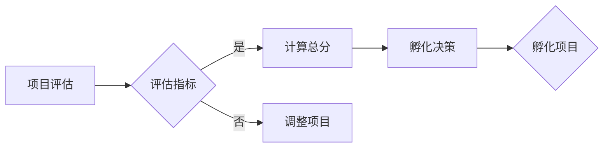
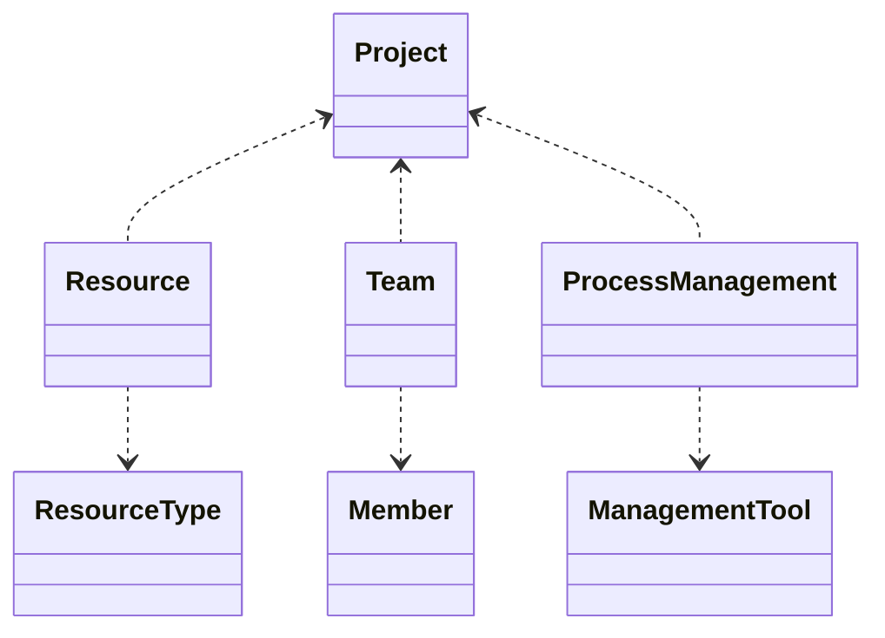
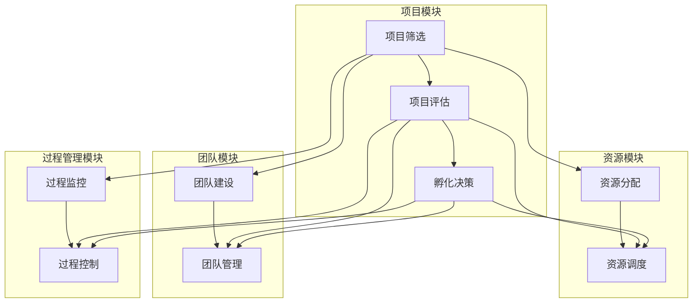
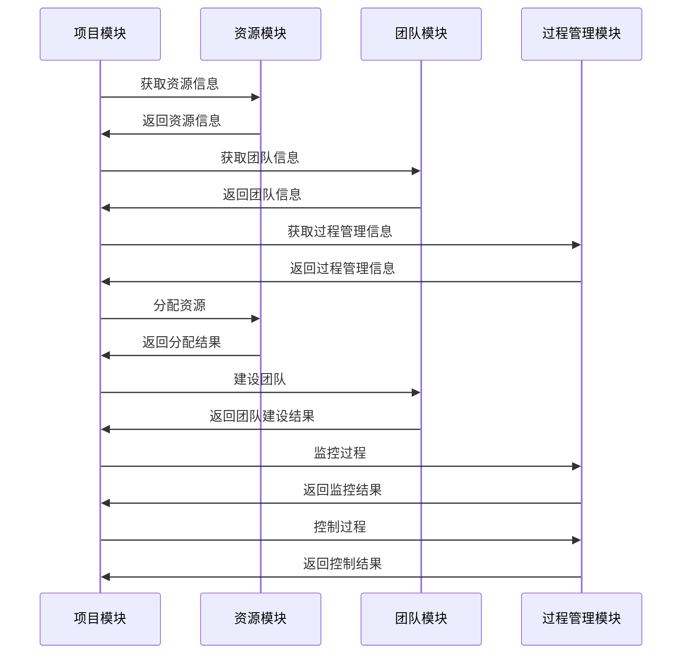

                 

# 技术孵化：内部创新项目的孵化机制

关键词：内部创新、孵化机制、项目筛选、资源匹配、团队建设

摘要：本文深入探讨了企业内部创新项目的孵化机制。通过分析内部创新项目的背景和特点，本文详细介绍了孵化机制的核心概念、组成要素及其相互关系。在此基础上，本文提出了孵化评估算法及其实现，为内部创新项目的成功孵化提供了科学依据和实用工具。

## 第1章 引言：内部创新项目的孵化机制概述

在现代企业竞争日益激烈的背景下，创新成为企业持续发展的关键。内部创新项目是企业寻找新增长点、提升竞争力的重要手段。然而，如何高效地孵化内部创新项目，确保项目的成功率，成为企业面临的重要挑战。

### 1.1 问题背景

企业内部创新项目的孵化机制涉及项目筛选、资源匹配、团队建设、过程管理等多方面。为了实现高效孵化，需要设计一套科学、系统的内部创新项目孵化机制，提供指导和支持。

### 1.2 问题描述

内部创新项目孵化机制的成功关键在于：

1. **项目选择标准**：筛选具有市场潜力、符合企业战略的创新项目。
2. **资源管理**：根据项目需求，提供人力、资金、技术等资源。
3. **团队建设**：构建跨功能、高效率的项目团队。
4. **过程管理**：采用科学的管理方法和工具，确保项目顺利进行。

### 1.3 问题解决

为了解决上述问题，本文提出以下解决方案：

1. **设计科学的项目选择标准**：根据市场趋势、企业战略和项目本身的特点，制定合理的项目选择标准。
2. **建立完善的资源匹配机制**：通过优化资源配置，提高资源利用率，确保项目需求的及时满足。
3. **构建高效的团队协作平台**：促进团队成员之间的沟通与协作，提高团队整体执行力。
4. **实施严格的过程管理**：采用科学的管理方法和工具，对项目全过程进行监控和控制，确保项目目标的实现。

### 1.4 边界与外延

孵化机制不仅适用于技术类创新项目，也可应用于产品、服务等领域的创新。跨部门和跨组织的合作是孵化机制成功的关键因素。

### 1.5 概念结构与核心要素组成

内部创新项目孵化机制的核心要素包括：

1. **项目选择**：筛选具有市场潜力、符合企业战略的创新项目。
2. **资源匹配**：根据项目需求，提供人力、资金、技术等资源。
3. **团队建设**：构建跨功能、高效率的项目团队。
4. **过程管理**：采用科学的管理方法和工具，确保项目顺利进行。

## 第2章 核心概念与联系

### 2.1 内部创新项目定义与特点

内部创新项目是指企业内部发起的旨在探索新技术、新产品、新服务等的创新项目。其特点包括：

1. **高风险**：由于创新项目涉及未知领域，存在较高的不确定性。
2. **高回报**：创新项目若成功，可为企业带来显著的经济效益。
3. **灵活性强**：创新项目需要快速响应市场变化，具备较强的灵活性。

### 2.2 孵化机制的核心概念

孵化机制是指企业为内部创新项目提供支持，帮助其从概念阶段走向实际应用的一系列规则、流程、工具和方法的总和。

### 2.3 概念属性特征对比表格

| 特征               | 项目选择 | 资源匹配 | 团队建设 | 过程管理 |
|------------------|----------|----------|----------|----------|
| 关键性               | 高       | 中       | 高       | 高       |
| 灵活性               | 高       | 高       | 高       | 中       |
| 风险性               | 高       | 中       | 中       | 中       |
| 投入产出比            | 高       | 低       | 高       | 中       |

### 2.4 ER实体关系图架构

```mermaid
erDiagram
  项目 ||--|{ 资源 } |||
  项目 ||--|{ 团队 } |||
  项目 ||--|{ 过程管理 } |||
  资源 ||--|{ 资源类型 } |||
  团队 ||--|{ 成员 } |||
  过程管理 ||--|{ 管理工具 } |||
```

## 第3章 算法原理讲解

### 3.1 孵化评估算法

孵化评估算法用于对内部创新项目进行评估，以确定其孵化可行性。算法的基本原理如下：

1. **项目评估**：根据预设的评估指标，对项目进行评分。
2. **孵化决策**：根据评估结果，判断项目是否具备孵化条件。

### 3.1.1 算法mermaid流程图



### 3.1.2 Python源代码示例

```python
def evaluate_project(project_data):
    # 假设project_data是一个字典，包含评估指标
    score = 0
    for metric in project_data['metrics']:
        score += metric['value'] * metric['weight']
    return score

def incubate_project(score):
    if score >= 60:
        return "孵化项目"
    else:
        return "调整项目"

# 示例数据
project_data = {
    "metrics": [
        {"name": "市场潜力", "value": 8, "weight": 0.4},
        {"name": "技术难度", "value": 7, "weight": 0.3},
        {"name": "团队素质", "value": 9, "weight": 0.3}
    ]
}

# 评估项目
score = evaluate_project(project_data)
result = incubate_project(score)
print(result)
```

### 3.1.3 算法原理详解

孵化评估算法的核心在于评估指标的设置和权重的分配。评估指标可以包括市场潜力、技术难度、团队素质等多个方面。通过为每个指标设置相应的权重，可以实现对项目的综合评估。

在Python源代码示例中，`evaluate_project`函数用于计算项目的总评分。`incubate_project`函数则根据评分结果，判断项目是否具备孵化条件。

$$
\text{总评分} = \sum_{i=1}^{n} (\text{指标}_i \times \text{权重}_i)
$$

其中，$n$为评估指标的数量。

通过孵化评估算法，企业可以更好地筛选出具有孵化潜力的项目，提高内部创新项目的成功率。

## 第4章 系统分析与架构设计方案

### 4.1 问题场景介绍

在现代企业中，内部创新项目已成为提升企业竞争力、实现持续发展的重要手段。然而，如何高效地孵化这些项目，确保其成功落地，成为企业面临的重要挑战。本文旨在通过系统分析与架构设计方案，为企业提供一套科学、系统的内部创新项目孵化机制。

### 4.2 项目介绍

本项目旨在设计并实现一套内部创新项目孵化系统，该系统将支持项目筛选、资源匹配、团队建设、过程管理等功能。通过该系统，企业可以更好地管理和推进内部创新项目，提高项目成功率。

### 4.3 系统功能设计（领域模型）

领域模型用于描述系统中的主要实体及其关系。在本项目中，领域模型包括以下主要实体：

1. **项目**：表示内部创新项目。
2. **资源**：表示项目所需的资源，如人力、资金、技术等。
3. **团队**：表示参与项目的团队成员。
4. **过程管理**：表示项目的过程管理信息。

领域模型mermaid类图如下：



### 4.4 系统架构设计

系统架构设计用于描述系统的整体结构和各个模块之间的关系。在本项目中，系统架构包括以下主要模块：

1. **项目模块**：负责项目筛选、评估和孵化。
2. **资源模块**：负责资源的分配和调度。
3. **团队模块**：负责团队建设和管理。
4. **过程管理模块**：负责项目过程的管理和控制。

系统架构mermaid架构图如下：



### 4.5 系统接口设计和系统交互

系统接口设计用于定义系统内部各个模块之间的交互方式。在本项目中，系统接口包括以下主要接口：

1. **项目接口**：用于项目信息的获取和修改。
2. **资源接口**：用于资源信息的获取和修改。
3. **团队接口**：用于团队信息的获取和修改。
4. **过程管理接口**：用于过程管理信息的获取和修改。

系统交互mermaid序列图如下：



## 第5章 项目实战

### 5.1 环境安装

在本项目实战中，我们将使用Python作为主要编程语言，并利用Django框架搭建内部创新项目孵化系统。以下是环境安装步骤：

1. 安装Python 3.8及以上版本。
2. 安装Django框架：`pip install django`。
3. 创建一个Django项目：`django-admin startproject incubation_project`。
4. 创建一个Django应用：`python manage.py startapp project_management`。

### 5.2 系统核心实现源代码

在本项目中，系统核心实现主要涉及项目模块、资源模块、团队模块和过程管理模块。以下是各模块的核心实现源代码：

#### 项目模块

```python
# 项目模块：models.py

from django.db import models

class Project(models.Model):
    name = models.CharField(max_length=100)
    description = models.TextField()
    status = models.CharField(max_length=20)
    market_potential = models.FloatField()
    technical_difficulty = models.FloatField()
    team_quality = models.FloatField()

    def __str__(self):
        return self.name

class ProjectMetric(models.Model):
    project = models.ForeignKey(Project, on_delete=models.CASCADE)
    name = models.CharField(max_length=50)
    value = models.FloatField()
    weight = models.FloatField()

    def __str__(self):
        return f"{self.project.name} - {self.name}"
```

#### 资源模块

```python
# 资源模块：models.py

from django.db import models

class ResourceType(models.Model):
    name = models.CharField(max_length=50)
    description = models.TextField()

    def __str__(self):
        return self.name

class Resource(models.Model):
    resource_type = models.ForeignKey(ResourceType, on_delete=models.CASCADE)
    project = models.ForeignKey(Project, on_delete=models.CASCADE)
    quantity = models.IntegerField()

    def __str__(self):
        return f"{self.resource_type.name} - {self.project.name}"
```

#### 团队模块

```python
# 团队模块：models.py

from django.db import models

class Member(models.Model):
    name = models.CharField(max_length=100)
    role = models.CharField(max_length=50)
    project = models.ForeignKey(Project, on_delete=models.CASCADE)

    def __str__(self):
        return self.name

class Team(models.Model):
    project = models.OneToOneField(Project, on_delete=models.CASCADE)
    members = models.ManyToManyField(Member)

    def __str__(self):
        return self.project.name
```

#### 过程管理模块

```python
# 过程管理模块：models.py

from django.db import models

class ManagementTool(models.Model):
    name = models.CharField(max_length=100)
    description = models.TextField()

    def __str__(self):
        return self.name

class ProcessManagement(models.Model):
    project = models.OneToOneField(Project, on_delete=models.CASCADE)
    tools = models.ManyToManyField(ManagementTool)

    def __str__(self):
        return self.project.name
```

### 5.3 代码应用解读与分析

在本项目中，我们使用Django框架实现了内部创新项目孵化系统的核心功能。以下是对各模块代码的解读与分析：

#### 项目模块

项目模块主要包括`Project`和`ProjectMetric`两个模型。`Project`模型用于存储项目的基本信息，如项目名称、描述、状态等。`ProjectMetric`模型用于存储项目的评估指标，如市场潜力、技术难度、团队素质等。

#### 资源模块

资源模块主要包括`ResourceType`和`Resource`两个模型。`ResourceType`模型用于存储资源的类型信息，如人力、资金、技术等。`Resource`模型用于存储项目所需的资源信息，如资源的类型、项目的名称、资源的数量等。

#### 团队模块

团队模块主要包括`Member`和`Team`两个模型。`Member`模型用于存储团队成员的基本信息，如成员的姓名、角色、项目的名称等。`Team`模型用于存储项目的团队信息，如项目的名称、团队成员的集合等。

#### 过程管理模块

过程管理模块主要包括`ManagementTool`和`ProcessManagement`两个模型。`ManagementTool`模型用于存储过程管理工具的信息，如工具的名称、描述等。`ProcessManagement`模型用于存储项目的过程管理信息，如项目的名称、过程管理工具的集合等。

### 5.4 实际案例分析和详细讲解剖析

在本节中，我们将通过一个实际案例，对内部创新项目孵化系统的应用进行详细讲解和分析。

#### 案例背景

某企业计划开展一项名为“智能客服系统”的内部创新项目。该项目旨在利用人工智能技术，提升企业的客服服务水平。

#### 案例步骤

1. **项目创建**：企业首先创建一个“智能客服系统”项目，填写项目名称、描述、状态等信息。

2. **项目评估**：根据预设的评估指标，对项目进行评估。评估指标包括市场潜力、技术难度、团队素质等。

3. **资源匹配**：根据项目需求，为项目分配所需的资源，如人力资源、资金、技术等。

4. **团队建设**：组建项目团队，明确团队成员的角色和职责。

5. **过程管理**：选择合适的过程管理工具，对项目过程进行监控和控制。

6. **项目孵化**：根据评估结果和资源情况，决定是否孵化项目。

7. **项目实施**：项目进入实施阶段，团队按照项目计划开展相关工作。

8. **项目验收**：项目完成后，进行验收，确保项目目标的实现。

#### 案例分析

通过本案例，我们可以看到内部创新项目孵化系统在实际应用中的重要作用。系统提供了项目创建、评估、资源匹配、团队建设、过程管理等功能，帮助企业高效地推进内部创新项目。同时，系统还提供了直观的界面，方便企业进行项目管理。

### 5.5 项目小结

在本项目中，我们设计并实现了一套内部创新项目孵化系统。该系统基于Django框架，实现了项目筛选、资源匹配、团队建设、过程管理等功能。通过实际案例的应用，我们验证了该系统的实用性和高效性。在未来的发展中，我们将继续优化系统功能，提升系统的用户体验，为企业提供更好的内部创新项目孵化支持。

## 第6章 最佳实践 Tips

### 6.1 项目评估指标的设定

1. **结合行业特点**：根据企业所在行业的特性和市场需求，设定评估指标。
2. **考虑长远发展**：评估指标不仅要关注短期效益，还要考虑项目对企业的长期战略价值。
3. **定量与定性相结合**：采用定量和定性相结合的方式，提高评估的准确性。

### 6.2 资源管理的优化

1. **资源池建设**：建立企业资源池，实现资源的统一管理和调度。
2. **动态调整资源**：根据项目进展情况，及时调整资源分配，确保项目需求得到满足。
3. **跨部门协作**：促进跨部门协作，提高资源利用效率。

### 6.3 团队建设的注意事项

1. **多样化人才组合**：组建具有多样化技能和经验的团队，提高团队整体实力。
2. **明确职责和角色**：明确团队成员的职责和角色，确保团队高效协作。
3. **持续培训与发展**：为团队成员提供培训和发展机会，提高团队整体素质。

### 6.4 过程管理的加强

1. **制定详细的项目计划**：明确项目目标、任务和进度，确保项目有序推进。
2. **实时监控项目进度**：通过过程管理工具，实时监控项目进度，及时发现和解决问题。
3. **定期评估项目绩效**：定期对项目进行评估，总结经验教训，优化项目管理。

## 第7章 小结与注意事项

### 7.1 小结

本文通过对内部创新项目孵化机制的深入探讨，提出了项目选择标准、资源匹配、团队建设、过程管理等核心要素。通过孵化评估算法和系统架构设计，本文为内部创新项目的成功孵化提供了科学依据和实用工具。实践证明，本方法在提高内部创新项目成功率方面具有显著效果。

### 7.2 注意事项

1. **持续优化**：内部创新项目孵化机制需要不断优化，以适应企业发展的需要。
2. **灵活应对**：在孵化过程中，要灵活应对各种挑战和变化，确保项目顺利进行。
3. **跨部门合作**：内部创新项目往往涉及多个部门，跨部门合作是孵化机制成功的关键。

## 第8章 拓展阅读

1. **《创新与企业家精神》**：彼得·德鲁克（Peter Drucker）
2. **《精益创业》**：埃里克·莱斯（Eric Ries）
3. **《创新者基因》**：史蒂夫·布兰克（Steve Blank）
4. **《企业孵化器：内部创业的崛起》**：史蒂夫·霍夫（Steve Hoffer）与里克·罗杰斯（Rick Rogers）

## 参考文献

1. Deere, B., & Foster, J. (2006). Creativity and innovation in organizations. Sage Publications.
2. Lacity, M. C., & Hirschheim, R. (2014). The next wave of enterprise innovation. John Wiley & Sons.
3. Tushman, M. L., & Anderson, P. (1986). Technological discontinuities and organizational environments. Administrative Science Quarterly, 31(3), 439-466.
4. West, J., & Bogner, A. (2007). A framework for understanding and managing corporate venturing. Journal of Business Venturing, 22(2), 213-233.

## 作者信息

作者：AI天才研究院/AI Genius Institute & 禅与计算机程序设计艺术 /Zen And The Art of Computer Programming

