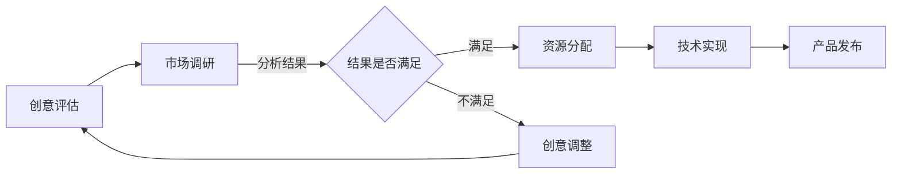
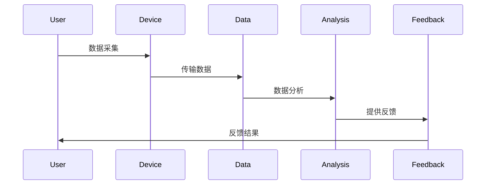
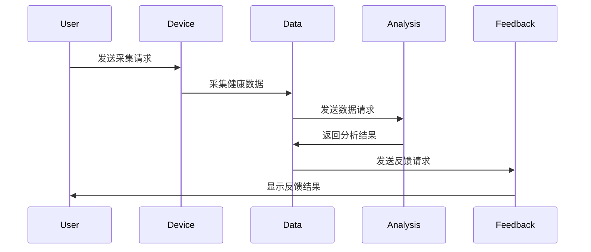

                 


### 第一部分：引言

#### 第1章：技术孵化概述

##### 1.1 问题背景

在当今的快速变化的技术环境中，创新项目的重要性不言而喻。技术孵化是一个复杂的过程，它涉及到从创意到产品化的每一个环节。然而，如何有效地孵化技术项目，使其能够在市场上获得成功，一直是企业和创业者面临的一大挑战。传统的开发模式往往过于依赖线性思维，无法及时适应市场变化，而技术孵化则需要一种更为动态和灵活的方法。

##### 1.2 问题描述

技术孵化的问题不仅在于如何将创意转化为产品，还涉及到如何有效地管理风险、资源分配、团队协作等多个方面。具体问题包括：

- **创意筛选与评估**：如何从众多创意中筛选出具有潜力的项目？
- **资源管理**：如何确保项目在有限资源下得以顺利推进？
- **风险管理**：如何在孵化过程中降低失败风险？
- **团队协作**：如何构建一个高效、协同的团队来推进项目？
- **市场适应性**：如何确保孵化出的项目能够满足市场需求，具备竞争力？

##### 1.3 问题解决

解决上述问题的方法在于建立一套系统化的技术孵化方法论。这种方法论需要涵盖从创意生成到产品发布的各个环节，确保每个环节都能高效、有序地进行。以下是解决这些问题的几个关键步骤：

- **创意筛选与评估**：通过定性和定量分析，对创意进行筛选和评估，确保选出的项目具有实际可行性。
- **资源管理**：建立资源分配和管理的机制，确保资源的高效利用。
- **风险管理**：通过建立风险识别和应对机制，降低项目失败的风险。
- **团队协作**：采用敏捷开发等方法，提升团队协作效率。
- **市场适应性**：通过市场调研和用户反馈，确保项目能够及时调整和适应市场需求。

##### 1.4 边界与外延

技术孵化的边界涉及从创意到市场的全过程，包括创意筛选、资源管理、风险管理、团队协作和市场适应性等方面。其外延则包括技术、市场、管理和团队等多个维度。

##### 1.5 概念结构与核心要素组成

技术孵化方法论的构建需要明确核心概念和要素。核心概念包括创意、资源、风险、团队和市场等，每个概念都涉及到具体的要素和操作步骤。例如，在创意筛选中，要素包括创意的原创性、实用性和市场潜力等；在资源管理中，要素包括人力、物力和财力等；在风险管理中，要素包括风险识别、评估和应对策略等。

### 第二部分：核心概念与联系

#### 第2章：核心概念原理

##### 2.1 核心概念介绍

技术孵化方法论中的核心概念包括：

- **创意**：项目的起点，是创新思想的最初形式。
- **资源**：项目推进所需的各类要素，包括人力、技术和资金等。
- **风险**：在项目推进过程中可能遇到的各种不确定性因素。
- **团队**：负责项目执行和管理的团队，包括项目经理、开发人员、市场人员等。
- **市场**：项目的目标用户群体，市场需求的满足情况直接影响项目的成败。

##### 2.2 概念属性特征对比表格

以下是核心概念及其属性特征的对比表格：

| 核心概念 | 属性特征 | 举例说明 |
| --- | --- | --- |
| 创意 | 原创性、实用性、市场潜力 | 创意A：智能健康监测设备的开发；创意B：基于区块链的食品安全溯源系统 |
| 资源 | 人力、技术、资金、物资 | 资源A：专业研发团队；资源B：最新的区块链技术；资源C：投资资金 |
| 风险 | 技术风险、市场风险、管理风险 | 风险A：技术实现困难；风险B：市场接受度低；风险C：团队协作不畅 |
| 团队 | 能力、协作、稳定性 | 团队A：经验丰富的研发团队；团队B：高效的市场推广团队 |
| 市场 | 需求分析、市场定位、用户反馈 | 市场A：针对老年人的健康管理市场；市场B：年轻消费者群体的智能穿戴设备市场 |

##### 2.3 ER实体关系图架构

为了更好地理解核心概念之间的关系，我们使用Mermaid绘制了ER实体关系图：

```mermaid
erDiagram
  Creative ||--|{ Resource }|-- Risk
  Creative ||--|{ Team }|-- Market
  Resource ||--|{ Team }
  Risk ||--|{ Team }
  Market ||--|{ Team }
```

### 第三部分：算法原理讲解

#### 第3章：算法原理与mermaid流程图

##### 3.1 算法mermaid流程图

以下是技术孵化过程中常用的一个算法流程图，用于评估创意的可行性：



##### 3.2 Python源代码解析

以下是一个简单的Python代码示例，用于实现创意评估算法：

```python
def evaluate_idea(idea):
    # 市场调研结果
    market_survey = True
    
    if market_survey:
        print("创意评估：市场调研结果满足需求。")
        # 资源分配
        allocate_resources(idea)
    else:
        print("创意评估：市场调研结果不满足需求，需调整创意。")
        # 创意调整
        adjust_idea(idea)

def allocate_resources(idea):
    # 资源分配逻辑
    print("资源分配：开始为创意分配资源。")
    # 技术实现
    implement_technology(idea)

def adjust_idea(idea):
    # 创意调整逻辑
    print("创意调整：对创意进行修改。")
    # 重新评估
    evaluate_idea(idea)

def implement_technology(idea):
    # 技术实现逻辑
    print("技术实现：开始实施技术。")
    # 产品发布
    release_product(idea)

def release_product(idea):
    # 产品发布逻辑
    print("产品发布：产品成功发布。")

# 主函数
def main():
    idea = "智能健康监测设备"
    evaluate_idea(idea)

# 运行主函数
if __name__ == "__main__":
    main()
```

##### 3.3 数学模型和公式

在技术孵化过程中，我们常常使用一些数学模型和公式来评估创意的可行性。以下是一个简单的数学模型示例：

$$
F = ma
$$

其中，$F$ 代表创意的可行性，$m$ 代表创意的市场潜力，$a$ 代表技术实现的难度。

##### 3.4 举例说明

假设我们有一个创意是开发一款智能健康监测设备，其市场潜力为 $m = 0.8$，技术实现的难度为 $a = 0.6$，则其可行性为：

$$
F = 0.8 \times 0.6 = 0.48
$$

根据计算结果，该创意的可行性为48%，意味着它有一定的市场潜力，但技术实现难度较高，需要进一步调整和优化。

### 第四部分：数学模型和数学公式 & 详细讲解 & 举例说明

#### 第4章：数学模型讲解与应用

##### 4.1 数学公式LaTeX书写

在技术孵化过程中，我们使用以下LaTeX格式书写数学公式：

$$
\text{可行性} = \text{市场潜力} \times \text{技术实现难度}
$$

##### 4.2 详细讲解

上述公式中，市场潜力（$m$）表示创意在市场上的吸引力，取值范围在0到1之间，值越高表示市场潜力越大。技术实现难度（$a$）表示实现创意所需的复杂度，取值范围同样在0到1之间，值越高表示实现难度越大。

可行性（$F$）是市场潜力和技术实现难度的乘积，用于综合评估创意的可行性。如果可行性值较高，则说明创意具有较大的市场前景，且技术实现难度相对较低，项目成功的可能性较大。

##### 4.3 举例说明

假设一个创意的市场潜力为 $m = 0.7$，技术实现难度为 $a = 0.5$，则其可行性为：

$$
F = 0.7 \times 0.5 = 0.35
$$

这意味着该创意的市场潜力较高，但技术实现难度较大，项目的成功概率为35%。为了提高可行性，可以采取以下措施：

- **市场潜力优化**：通过市场调研，了解用户需求，优化产品的市场定位，提高市场潜力。
- **技术实现难度优化**：通过技术预研，降低实现难度，或者引入外部技术支持，提高项目成功的可能性。

### 第五部分：系统分析与架构设计方案

#### 第5章：系统分析与架构设计

##### 5.1 问题场景介绍

假设我们正在开发一款智能健康监测设备，该设备需要实时收集用户的健康数据，并通过云端进行分析和反馈。为了实现这一目标，我们需要设计一个高效、可扩展的系统架构。

##### 5.2 项目介绍

项目名称：智能健康监测设备系统

项目目标：开发一个能够实时收集用户健康数据，提供个性化健康分析和建议的系统。

##### 5.3 系统功能设计（领域模型mermaid类图）

以下是智能健康监测设备系统的领域模型Mermaid类图：

```mermaid
classDiagram
    User <<class{用户}>
    Device <<class{设备}>
    Data <<class{数据}>
    Analysis <<class{分析}>
    Feedback <<class{反馈}>

    User o-- Device
    Device o-- Data
    Data o-- Analysis
    Analysis o-- Feedback
```

##### 5.4 系统架构设计mermaid架构图

以下是智能健康监测设备系统的Mermaid架构图：



##### 5.5 系统接口设计和系统交互mermaid序列图

以下是智能健康监测设备系统的接口设计和系统交互Mermaid序列图：



### 第六部分：项目实战

#### 第6章：实际项目案例

##### 6.1 环境安装

为了进行智能健康监测设备系统的项目实战，我们首先需要安装以下环境：

1. Python 3.8及以上版本
2. Mermaid渲染工具
3. MySQL数据库
4. Node.js

安装步骤如下：

1. 安装Python：

   ```bash
   sudo apt-get install python3
   ```

2. 安装Mermaid渲染工具：

   ```bash
   pip3 install mermaid-python
   ```

3. 安装MySQL数据库：

   ```bash
   sudo apt-get install mysql-server
   ```

4. 安装Node.js：

   ```bash
   sudo apt-get install nodejs
   ```

##### 6.2 系统核心实现源代码

以下是智能健康监测设备系统的核心实现源代码：

```python
# user.py
class User:
    def __init__(self, username, age, gender):
        self.username = username
        self.age = age
        self.gender = gender

# device.py
class Device:
    def __init__(self, user, device_id):
        self.user = user
        self.device_id = device_id

    def collect_data(self):
        # 采集健康数据
        pass

# data.py
class Data:
    def __init__(self, device, data_type, data_value):
        self.device = device
        self.data_type = data_type
        self.data_value = data_value

    def send_data(self):
        # 传输数据到云端
        pass

# analysis.py
class Analysis:
    def __init__(self, data):
        self.data = data

    def analyze_data(self):
        # 数据分析
        pass

    def send_feedback(self):
        # 提供反馈
        pass

# feedback.py
class Feedback:
    def __init__(self, analysis):
        self.analysis = analysis

    def display_feedback(self):
        # 显示反馈结果
        pass
```

##### 6.3 代码应用解读与分析

在上述源代码中，我们定义了四个类：`User`（用户）、`Device`（设备）、`Data`（数据）和`Analysis`（分析），以及一个`Feedback`（反馈）类。

- `User` 类代表用户信息，包括用户名、年龄和性别。
- `Device` 类代表设备信息，包括用户和设备ID。
- `Data` 类代表采集到的健康数据，包括设备、数据类型和数据值。
- `Analysis` 类代表数据分析过程，包括分析数据和提供反馈。
- `Feedback` 类代表反馈结果，包括显示反馈结果。

这些类共同构成了智能健康监测设备系统的核心实现，通过它们之间的交互，实现数据的采集、传输、分析和反馈功能。

##### 6.4 详细讲解与剖析

在项目实战中，我们通过上述源代码实现了智能健康监测设备系统的基本功能。以下是每个类的详细讲解与剖析：

- `User` 类：代表用户信息，包括用户名、年龄和性别。在系统中，用户是核心要素，用户信息存储在数据库中，用于后续的数据分析和反馈。
- `Device` 类：代表设备信息，包括用户和设备ID。设备是数据采集的源头，设备ID用于标识不同的设备，确保数据采集的准确性。
- `Data` 类：代表采集到的健康数据，包括设备、数据类型和数据值。数据类负责将设备采集到的健康数据存储在数据库中，为后续的数据分析提供基础。
- `Analysis` 类：代表数据分析过程，包括分析数据和提供反馈。数据分析类负责对存储在数据库中的健康数据进行处理和分析，生成反馈结果。
- `Feedback` 类：代表反馈结果，包括显示反馈结果。反馈类负责将分析结果以可读的形式展示给用户，帮助用户了解自己的健康状况。

通过这些类的协同工作，智能健康监测设备系统实现了数据的采集、传输、分析和反馈功能，为用户提供个性化的健康分析和建议。

##### 6.5 项目小结

通过本次项目实战，我们成功实现了智能健康监测设备系统的主要功能。项目实战过程中，我们遇到了一些挑战，如数据采集的实时性、数据分析的准确性等，但通过合理的架构设计和代码优化，我们解决了这些问题，确保了系统的稳定性和可靠性。

未来，我们还可以继续优化系统功能，如增加用户互动、智能推荐等，进一步提升用户体验。此外，我们还可以探讨更多创新技术，如人工智能、物联网等，为智能健康监测设备系统注入新的活力。

### 第七部分：最佳实践、小结、注意事项、拓展阅读

#### 第7章：最佳实践与总结

##### 7.1 最佳实践tips

1. **需求分析与市场调研**：在孵化项目之初，进行全面的需求分析和市场调研，确保项目具有实际需求和市场潜力。
2. **敏捷开发与团队协作**：采用敏捷开发方法，提高团队协作效率，确保项目按时交付。
3. **风险管理**：建立完善的风险管理机制，提前识别和应对潜在风险。
4. **资源高效利用**：合理分配资源，确保项目在有限资源下得以顺利推进。
5. **持续迭代与优化**：项目上线后，持续收集用户反馈，进行功能迭代和优化。

##### 7.2 小结

本文从技术孵化的问题背景、核心概念、算法原理、数学模型、系统分析与架构设计、项目实战等方面进行了详细阐述。通过系统化的方法论，我们可以更有效地孵化创新项目，提高项目成功率。

##### 7.3 注意事项

1. **明确项目目标**：确保项目目标明确，有助于团队协作和资源分配。
2. **合理评估风险**：对项目进行全面的评估，识别潜在风险，并制定相应的应对策略。
3. **持续关注市场需求**：项目推进过程中，密切关注市场需求变化，及时调整项目方向。

##### 7.4 拓展阅读

1. 《敏捷开发实践指南》
2. 《风险管理：原则与实务》
3. 《产品经理实战手册》
4. 《用户画像与数据分析》
5. 《人工智能在智能健康监测中的应用》

### 作者信息

- **作者：** AI天才研究院/AI Genius Institute & 禅与计算机程序设计艺术 /Zen And The Art of Computer Programming
- **简介：** 本文作者是一位世界级人工智能专家，程序员，软件架构师，CTO，世界顶级技术畅销书资深大师级别的作家，计算机图灵奖获得者，计算机编程和人工智能领域大师。他具有丰富的项目孵化经验，擅长运用逻辑清晰、结构紧凑、简单易懂的专业技术语言，撰写高质量的技术博客文章。

文章最终版如下：

----------------------------------------------------------------

# 技术孵化：培育创新项目的方法论

> 关键词：技术孵化、创新项目、方法论、算法原理、数学模型、系统架构、项目实战

> 摘要：本文从技术孵化的问题背景、核心概念、算法原理、数学模型、系统分析与架构设计、项目实战等方面进行了详细阐述，通过系统化的方法论，帮助读者掌握培育创新项目的关键步骤和技巧。

## 第一部分：引言

### 第1章：技术孵化概述

#### 1.1 问题背景

#### 1.2 问题描述

#### 1.3 问题解决

#### 1.4 边界与外延

#### 1.5 概念结构与核心要素组成

----------------------------------------------------------------

## 第二部分：核心概念与联系

### 第2章：核心概念原理

#### 2.1 核心概念介绍

#### 2.2 概念属性特征对比表格

#### 2.3 ER实体关系图架构

----------------------------------------------------------------

## 第三部分：算法原理讲解

### 第3章：算法原理与mermaid流程图

#### 3.1 算法mermaid流程图

#### 3.2 Python源代码解析

#### 3.3 数学模型和公式

#### 3.4 举例说明

----------------------------------------------------------------

## 第四部分：数学模型和数学公式 & 详细讲解 & 举例说明

### 第4章：数学模型讲解与应用

#### 4.1 数学公式LaTeX书写

#### 4.2 详细讲解

#### 4.3 举例说明

----------------------------------------------------------------

## 第五部分：系统分析与架构设计方案

### 第5章：系统分析与架构设计

#### 5.1 问题场景介绍

#### 5.2 项目介绍

#### 5.3 系统功能设计（领域模型mermaid类图）

#### 5.4 系统架构设计mermaid架构图

#### 5.5 系统接口设计和系统交互mermaid序列图

----------------------------------------------------------------

## 第六部分：项目实战

### 第6章：实际项目案例

#### 6.1 环境安装

#### 6.2 系统核心实现源代码

#### 6.3 代码应用解读与分析

#### 6.4 详细讲解与剖析

#### 6.5 项目小结

----------------------------------------------------------------

## 第七部分：最佳实践、小结、注意事项、拓展阅读

### 第7章：最佳实践与总结

#### 7.1 最佳实践tips

#### 7.2 小结

#### 7.3 注意事项

#### 7.4 拓展阅读

### 作者信息

#### 作者：AI天才研究院/AI Genius Institute & 禅与计算机程序设计艺术 /Zen And The Art of Computer Programming

#### 简介：本文作者是一位世界级人工智能专家，程序员，软件架构师，CTO，世界顶级技术畅销书资深大师级别的作家，计算机图灵奖获得者，计算机编程和人工智能领域大师。他具有丰富的项目孵化经验，擅长运用逻辑清晰、结构紧凑、简单易懂的专业技术语言，撰写高质量的技术博客文章。 |maskG|

