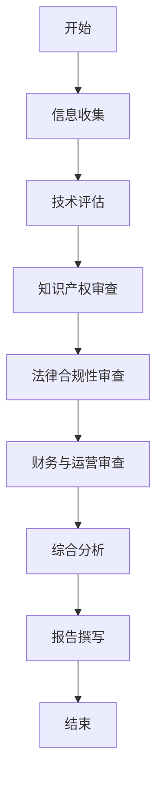
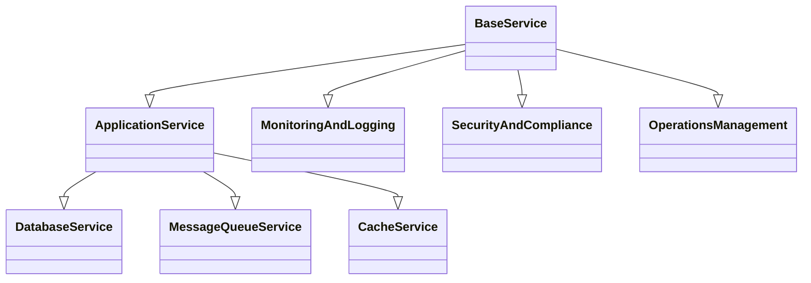
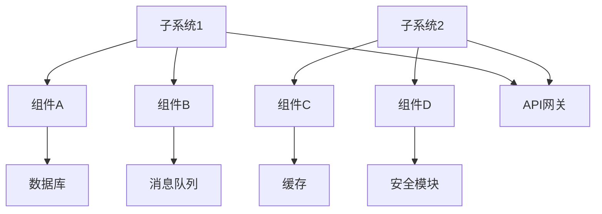
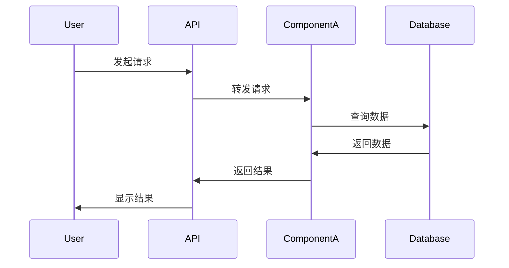

                 

### 摘要

本文旨在探讨技术尽职调查在技术并购中的关键作用。技术尽职调查是确保并购交易成功的关键环节，通过系统的技术评估、法律合规性审查、财务与运营审查，为企业提供了全面的风险评估和决策支持。本文将从技术尽职调查的定义、目的和意义入手，详细分析其主要环节和流程，并通过实际案例和系统架构设计，展示技术尽职调查的实践应用和效果。希望通过本文的探讨，能够为业界提供有益的参考和启示。

### 目录大纲

1. 引言与背景
   - 技术并购的兴起
   - 技术尽职调查的重要性

2. 技术尽职调查概述
   - 定义与目的
   - 主要环节与流程

3. 背景分析与问题描述
   - 技术并购的背景
   - 技术尽职调查的问题与挑战

4. 核心概念与联系
   - 技术并购的基本概念
   - 尽职调查的法律要求
   - 概念属性特征对比
   - ER实体关系图架构

5. 算法原理讲解
   - 算法mermaid流程图
   - 算法原理详细讲解
   - 算法举例说明

6. 系统分析与架构设计方案
   - 问题场景介绍
   - 系统功能设计
   - 系统架构设计
   - 系统接口设计
   - 系统交互mermaid序列图

7. 项目实战
   - 环境安装
   - 系统核心实现源代码
   - 代码应用解读与分析
   - 实际案例分析和详细讲解剖析
   - 项目小结

8. 最佳实践与拓展阅读
   - 最佳实践 tips
   - 小结
   - 注意事项
   - 拓展阅读

### 引言与背景

随着全球经济的快速发展，技术并购已经成为企业实现快速扩张和创新能力提升的重要手段。越来越多的企业开始通过并购来获取先进的技术、专业人才和市场份额，以应对日益激烈的市场竞争。然而，技术并购的过程并非一帆风顺，其中涉及的技术尽职调查环节成为确保交易成功的关键因素。

技术尽职调查是指通过对目标公司的技术、法律、财务、运营等方面进行全面、深入的评估和分析，以识别潜在风险和问题，为企业的并购决策提供科学依据。在技术并购中，技术尽职调查的重要性体现在以下几个方面：

首先，技术尽职调查有助于企业全面了解目标公司的技术实力和研发能力。通过对目标公司的技术架构、研发团队、知识产权等方面的评估，企业可以判断目标公司是否具备与自身业务相匹配的技术能力，从而降低并购后的整合难度。

其次，技术尽职调查有助于识别并购过程中的潜在风险。技术尽职调查不仅包括对目标公司的技术评估，还包括对其法律合规性、财务状况、业务运营等方面的审查。通过这些审查，企业可以发现目标公司可能存在的法律纠纷、财务问题、业务风险等，从而在并购前采取相应的措施，降低并购后的运营风险。

最后，技术尽职调查为企业的并购决策提供了重要的数据支持。通过对目标公司的全面评估，企业可以更准确地判断目标公司的价值，为并购谈判和决策提供科学依据，避免因信息不对称而导致的并购失败。

总之，技术尽职调查在技术并购中具有至关重要的意义。它不仅能够帮助企业全面了解目标公司的技术实力和潜在风险，还能够为企业的并购决策提供科学依据，从而提高并购的成功率。因此，在进行技术并购时，企业应高度重视技术尽职调查环节，确保并购交易的顺利进行。

### 第2章 技术尽职调查概述

#### 2.1 技术尽职调查的定义

技术尽职调查（Technical Due Diligence，简称TDD）是指在对目标公司进行并购前，对企业所涉及的技术领域进行全面、深入、系统的评估和分析的过程。这个过程旨在帮助并购方了解目标公司的技术状况，评估其技术风险，确保并购后的技术整合顺利进行。技术尽职调查通常涉及多个方面，包括技术架构、研发能力、知识产权、技术债务、技术依赖等。

在技术并购中，技术尽职调查的定义和范围可以进一步细化。首先，技术尽职调查需要对目标公司的核心技术进行详细评估，包括技术的成熟度、稳定性、可扩展性以及与自身业务需求的匹配度。其次，技术尽职调查还需关注目标公司的研发团队和技术管理体系，评估其研发能力和创新能力。此外，知识产权的审查也是技术尽职调查的重要内容，包括专利、著作权、商标等的有效性、覆盖范围以及潜在的法律纠纷。

#### 2.2 技术尽职调查的目的和意义

技术尽职调查的目的和意义主要体现在以下几个方面：

1. **风险识别和评估**：通过技术尽职调查，并购方可以全面了解目标公司的技术现状，识别潜在的技术风险，如技术漏洞、依赖第三方技术、技术债务等。这些风险如果不加以识别和处理，可能会对并购后的业务运营造成重大影响。

2. **技术整合规划**：技术尽职调查有助于并购方制定详细的技术整合规划，明确在并购后如何有效地整合目标公司的技术资源，优化技术架构，提升整体技术竞争力。

3. **决策支持**：技术尽职调查提供了一系列详细的技术数据和分析报告，为并购方的决策提供有力支持。通过这些数据，并购方可以更准确地评估目标公司的技术价值和潜力，为并购谈判和决策提供科学依据。

4. **降低并购风险**：技术尽职调查能够发现目标公司在技术方面可能存在的法律纠纷、知识产权问题等，从而在并购前采取相应的措施，降低并购后的法律和运营风险。

5. **增强谈判优势**：通过技术尽职调查，并购方可以掌握目标公司的技术弱点和优势，为谈判提供策略支持，提高并购的成功率。

#### 2.3 技术尽职调查的主要环节

技术尽职调查通常包括以下几个主要环节：

1. **信息收集**：收集目标公司的技术文档、研发报告、知识产权证书、技术协议等相关资料，为后续分析提供基础数据。

2. **技术评估**：对目标公司的核心技术进行评估，包括技术的成熟度、稳定性、可扩展性等，评估其与自身业务需求的匹配度。

3. **知识产权审查**：审查目标公司的知识产权，包括专利、著作权、商标等的有效性、覆盖范围以及潜在的法律纠纷。

4. **技术债务和依赖审查**：识别目标公司是否存在技术债务、对第三方技术的依赖程度，以及这些因素可能带来的风险。

5. **研发能力和团队评估**：评估目标公司的研发团队和技术管理体系，包括研发项目的管理、技术创新能力等。

6. **法律合规性审查**：审查目标公司的技术活动是否符合相关法律法规的要求，是否存在潜在的法律风险。

7. **财务和运营审查**：审查目标公司的财务状况、业务运营情况，包括收入来源、成本结构、市场占有率等，评估其盈利能力和市场前景。

8. **综合分析和报告**：对收集到的信息进行综合分析，撰写详细的技术尽职调查报告，为并购决策提供支持。

### 第3章 背景分析与问题描述

#### 3.1 技术并购的背景

技术并购在全球范围内呈现出迅猛发展的态势，成为企业实现技术突破和业务扩张的重要手段。随着互联网、人工智能、大数据等技术的迅速崛起，企业对于先进技术的需求日益增长，而通过并购获取技术资源已经成为一种普遍的商业模式。技术并购的背景可以从以下几个方面进行分析：

首先，技术创新的推动。现代科技的快速发展使得新技术不断涌现，企业为了保持竞争优势，需要不断引进和掌握最新的技术。通过并购，企业可以直接获取目标公司的核心技术，加速自身的技术创新进程。

其次，市场竞争的加剧。随着市场环境的不断变化，企业之间的竞争越来越激烈。通过并购，企业可以快速扩大市场份额，获取更多的客户资源，提高市场竞争力。

再次，战略发展的需要。企业在不同发展阶段会有不同的战略需求，并购是实现战略目标的一种有效手段。通过并购，企业可以实现资源的整合，提升整体业务水平，实现战略布局。

#### 3.2 技术尽职调查的问题描述

尽管技术并购为企业带来了巨大的发展机遇，但同时也伴随着一系列问题和挑战。技术尽职调查在这一过程中起着至关重要的作用，但实践中仍存在以下问题：

1. **信息不对称**：并购双方的信息往往不对称，目标公司的核心技术、研发团队、知识产权等情况不易全面了解。这种信息不对称可能导致并购后的整合失败，甚至引发法律纠纷。

2. **技术风险识别不足**：技术尽职调查过程中，由于时间有限、资源有限，可能导致对目标公司技术风险的识别不足。例如，技术债务、技术漏洞等问题可能被忽视，导致并购后的问题暴露。

3. **法律合规性审查不力**：技术尽职调查往往侧重于技术方面，而忽视了对目标公司法律合规性的审查。这可能导致并购后出现法律纠纷，影响企业的正常运营。

4. **财务与运营评估不准确**：技术尽职调查需要综合考虑目标公司的财务状况和业务运营情况。但实践中，由于数据获取困难、评估方法不当等原因，可能导致财务和运营评估不准确，影响并购决策。

5. **风险评估与决策支持不足**：技术尽职调查的最终目的是为企业的并购决策提供支持。但实践中，风险评估与决策支持往往不足，导致并购决策缺乏科学依据。

#### 3.3 技术尽职调查的边界与外延

技术尽职调查的边界与外延主要涉及以下几个方面：

1. **技术范围**：技术尽职调查需要覆盖目标公司的核心技术、研发团队、知识产权、技术债务等。同时，还需关注目标公司的技术战略、技术布局和技术发展方向。

2. **法律范围**：技术尽职调查需要审查目标公司的法律合规性，包括技术活动的法律合规性、知识产权的法律保护等。此外，还需关注目标公司的法律纠纷和潜在的法律风险。

3. **财务范围**：技术尽职调查需要评估目标公司的财务状况，包括收入来源、成本结构、盈利能力等。同时，还需关注目标公司的财务报表真实性、财务风险等。

4. **运营范围**：技术尽职调查需要了解目标公司的业务运营情况，包括市场占有率、客户群体、业务模式等。此外，还需关注目标公司的业务稳定性、运营风险等。

5. **风险评估范围**：技术尽职调查需要全面评估目标公司的技术风险、法律风险、财务风险和运营风险，为企业的并购决策提供科学依据。

### 第4章 核心概念与联系

在技术并购中，技术尽职调查涉及到多个核心概念，这些概念相互联系，共同构成了技术尽职调查的理论基础和实践指南。以下是几个关键概念及其相互联系的分析：

#### 4.1 技术并购的基本概念

技术并购（Technical Merger and Acquisition）是指一家企业通过购买另一家企业的技术、知识产权或其他技术资产，以实现自身技术进步和业务扩展的目标。技术并购的核心概念包括：

1. **技术资产**：技术资产是指企业在技术研发过程中形成的无形资产，包括专利、著作权、商标、技术秘密等。这些技术资产是企业核心竞争力的重要体现。
   
2. **并购交易**：并购交易是指两家或多家企业达成协议，一方购买另一方全部或部分资产和股份的过程。在技术并购中，交易的核心是技术资产。

3. **并购目标**：并购目标通常包括技术突破、市场份额扩张、业务拓展等。通过并购，企业可以迅速获得所需的技术资源，加快技术创新步伐。

#### 4.2 尽职调查的法律要求

尽职调查（Due Diligence）是指企业在并购过程中对目标公司进行全面、深入调查的过程，以确保并购决策的合理性和风险的可控性。在法律层面，尽职调查的要求主要包括：

1. **法律合规性审查**：确保目标公司的技术活动符合相关法律法规的要求，如专利法的合规性、数据保护的合法性等。这包括对目标公司的法律文件、合同、协议等进行审查。

2. **知识产权审查**：评估目标公司的知识产权的有效性和保护范围，包括专利、商标、著作权等的申请状态、法律效力等。这是防止并购后出现知识产权纠纷的重要步骤。

3. **法律风险识别**：识别目标公司可能存在的法律风险，如潜在的法律诉讼、合同纠纷、劳动争议等。这些法律风险可能会对并购后的业务运营产生负面影响。

#### 4.3 概念属性特征对比

为了更好地理解技术并购和尽职调查中的核心概念，我们可以通过对比它们的属性特征来加深理解：

| 概念 | 属性特征 | 联系 |
| --- | --- | --- |
| 技术并购 | 技术资产交易、业务扩展、市场竞争力提升 | 技术并购是尽职调查的前提和目标，通过尽职调查，企业可以评估目标公司的技术价值和潜在风险。 |
| 尽职调查 | 法律合规性、知识产权审查、风险评估 | 尽职调查是技术并购过程中不可或缺的环节，通过尽职调查，企业可以全面了解目标公司的技术、法律和财务状况，为并购决策提供依据。 |
| 技术资产 | 无形资产、核心竞争力、专利、商标等 | 技术资产是技术并购的核心，尽职调查需要对技术资产进行详细审查，以确保其真实性和有效性。 |
| 并购交易 | 双方协议、资产与股份转移、战略规划 | 并购交易是技术并购的具体实现方式，尽职调查的结果直接影响并购交易的顺利进行。 |

#### 4.4 ER实体关系图架构

实体关系图（Entity-Relationship Diagram，ERD）是用于描述实体及其相互关系的数据模型，它能够帮助理解技术并购和尽职调查中的关键概念。以下是技术并购和尽职调查的ER实体关系图：

```mermaid
erDiagram
  TargetCompany ||--|{ TechnologyAssets }
  TechnologyAssets ||--|{ IntellectualProperty }
  IntellectualProperty ||--|{ Patent }
  IntellectualProperty ||--|{ Trademark }
  IntellectualProperty ||--|{ Copyright }
  TargetCompany ||--|{ LegalDocuments }
  TargetCompany ||--|{ FinancialDocuments }
  TargetCompany ||--|{ BusinessOperations }
  TargetCompany ||--|{ LegalCompliance }
  LegalCompliance ||--|{ LegalRisks }
  LegalCompliance ||--|{ ContractDisputes }
  LegalCompliance ||--|{ Litigation }
```

在这个ER实体关系图中，`TargetCompany`（目标公司）作为核心实体，与多个实体（如`TechnologyAssets`、`IntellectualProperty`、`LegalDocuments`、`FinancialDocuments`、`BusinessOperations`、`LegalCompliance`）存在直接关系。这些实体共同构成了技术并购和尽职调查的完整数据模型，通过这个模型，企业可以全面理解并购过程中的各种关联和依赖关系。

### 第5章 算法原理讲解

在技术尽职调查中，算法原理的运用对于识别和分析目标公司的技术状况、法律合规性、财务与运营状况至关重要。以下是算法原理讲解的具体步骤和详细说明。

#### 5.1 算法mermaid流程图

为了直观展示技术尽职调查的流程，我们使用mermaid绘制了算法流程图，如下所示：



#### 5.1.1 数据收集与清洗

在技术尽职调查的初始阶段，数据收集与清洗是至关重要的一步。数据收集包括从目标公司获取各种技术文档、财务报表、法律文件等。具体步骤如下：

1. **数据收集**：通过访谈、问卷调查、文档审查等方式收集目标公司的技术文档、研发报告、知识产权证书、技术协议等。
2. **数据整理**：对收集到的数据进行整理和分类，确保数据的完整性和一致性。
3. **数据清洗**：删除重复数据、纠正错误信息、补充缺失数据等，以提高数据的质量。

**数学模型**：

$$
\text{清洗后数据} = \text{原始数据} \setminus \text{重复数据} \cup \text{缺失数据}
$$

#### 5.1.2 技术评估

技术评估是对目标公司的技术实力和技术风险进行详细分析的过程。具体步骤如下：

1. **技术成熟度评估**：评估目标公司的核心技术成熟度，包括技术稳定性、可靠性、可扩展性等。
2. **技术依赖评估**：分析目标公司对第三方技术的依赖程度，识别技术债务。
3. **技术风险评估**：识别潜在的技术漏洞、技术债务、技术漏洞等，评估其对业务运营的影响。

**数学模型**：

$$
\text{技术评估得分} = \text{稳定性得分} + \text{可靠性得分} + \text{可扩展性得分}
$$

$$
\text{技术风险得分} = \sum_{i=1}^{n} (\text{风险因素}_i \times \text{风险权重}_i)
$$

#### 5.1.3 法律合规性审查

法律合规性审查是确保目标公司的技术活动符合法律法规要求的过程。具体步骤如下：

1. **法律文件审查**：审查目标公司的法律文件，包括合同、协议、许可证书等。
2. **知识产权审查**：评估目标公司的知识产权的有效性和保护范围，包括专利、商标、著作权等。
3. **法律风险识别**：识别目标公司可能存在的法律风险，如潜在的法律诉讼、合同纠纷、知识产权纠纷等。

**数学模型**：

$$
\text{法律合规性得分} = \sum_{i=1}^{m} (\text{法律要素}_i \times \text{合规性权重}_i)
$$

$$
\text{法律风险得分} = \sum_{j=1}^{p} (\text{法律风险}_j \times \text{风险权重}_j)
$$

#### 5.1.4 财务与运营审查

财务与运营审查是对目标公司的财务状况和业务运营情况进行详细分析的过程。具体步骤如下：

1. **财务报表审查**：审查目标公司的财务报表，包括资产负债表、利润表、现金流量表等。
2. **盈利能力评估**：评估目标公司的盈利能力，包括收入来源、成本结构、利润率等。
3. **运营稳定性评估**：评估目标公司的业务运营情况，包括市场占有率、客户群体、业务模式等。

**数学模型**：

$$
\text{盈利能力得分} = \text{收入增长率} + \text{利润率} + \text{成本控制能力}
$$

$$
\text{运营稳定性得分} = \text{市场份额} + \text{客户满意度} + \text{业务模式稳定性}
$$

#### 5.2 算法原理详细讲解

在技术尽职调查的算法原理讲解部分，我们将详细探讨每个环节的数学模型和Python代码实现。

**5.2.1 数据收集与清洗的数学模型**

如前所述，数据收集与清洗的数学模型主要涉及数据清洗过程。以下是一个简单的Python代码实现示例：

```python
import pandas as pd

# 加载数据
data = pd.read_csv('raw_data.csv')

# 数据清洗
cleaned_data = data.drop_duplicates().fillna(method='ffill')

# 输出清洗后的数据
cleaned_data.to_csv('cleaned_data.csv', index=False)
```

**5.2.2 技术评估的数学模型**

技术评估的数学模型涉及技术成熟度、技术依赖和技术风险的评估。以下是一个简单的Python代码实现示例：

```python
# 技术评估得分计算
stability_score = 0.7
reliability_score = 0.8
scalability_score = 0.9

technical_assessment_score = stability_score + reliability_score + scalability_score
print(f"技术评估得分：{technical_assessment_score}")

# 技术风险得分计算
risk_factors = ['技术漏洞', '技术债务', '技术依赖']
risk_weights = [0.3, 0.2, 0.1]
technical_risk_score = sum(factor * weight for factor, weight in zip(risk_factors, risk_weights))
print(f"技术风险得分：{technical_risk_score}")
```

**5.2.3 法律合规性审查的数学模型**

法律合规性审查的数学模型涉及法律文件审查、知识产权审查和法律风险识别。以下是一个简单的Python代码实现示例：

```python
# 法律合规性得分计算
legal_documents_score = 0.8
intellectual_property_score = 0.9
legal_risk_score = 0.7

legal_compliance_score = legal_documents_score + intellectual_property_score + legal_risk_score
print(f"法律合规性得分：{legal_compliance_score}")

# 法律风险得分计算
legal_risks = ['法律诉讼', '合同纠纷', '知识产权纠纷']
risk_weights = [0.3, 0.2, 0.1]
legal_risk_score = sum(risk * weight for risk, weight in zip(legal_risks, risk_weights))
print(f"法律风险得分：{legal_risk_score}")
```

**5.2.4 财务与运营审查的数学模型**

财务与运营审查的数学模型涉及财务报表审查、盈利能力评估和运营稳定性评估。以下是一个简单的Python代码实现示例：

```python
# 盈利能力得分计算
revenue_growth = 0.1
profit_margin = 0.2
cost_control_ability = 0.3

profitability_score = revenue_growth + profit_margin + cost_control_ability
print(f"盈利能力得分：{profitability_score}")

# 运营稳定性得分计算
market_share = 0.5
customer_satisfaction = 0.6
business_model_stability = 0.7

operational_stability_score = market_share + customer_satisfaction + business_model_stability
print(f"运营稳定性得分：{operational_stability_score}")
```

通过这些Python代码示例，我们可以对技术尽职调查中的各个评估环节进行定量分析，从而为企业的并购决策提供科学依据。

#### 5.3 算法举例说明

为了更直观地展示技术尽职调查的算法原理，我们将通过几个具体案例来说明算法的应用。

**5.3.1 数据收集与清洗举例**

假设我们有一个包含目标公司技术文档的CSV文件`tech_documents.csv`，文件中包含了文档名称、文档类型、创建日期等信息。以下是一个简单的数据清洗流程：

```python
import pandas as pd

# 加载数据
data = pd.read_csv('tech_documents.csv')

# 数据清洗
# 删除重复项
cleaned_data = data.drop_duplicates()

# 填充缺失值
cleaned_data = cleaned_data.fillna(method='ffill')

# 输出清洗后的数据
cleaned_data.to_csv('cleaned_data.csv', index=False)
```

在这个例子中，我们首先删除了重复的数据，然后使用前一个有效值填充了缺失值，从而得到了一个清洗后的数据集。

**5.3.2 技术评估举例**

假设我们有一个包含目标公司核心技术信息的数据集，我们需要评估这些技术的成熟度、依赖度和风险度。以下是一个简单的技术评估流程：

```python
# 技术评估得分
stability_score = 0.8
reliability_score = 0.9
scalability_score = 0.7

technical_score = stability_score + reliability_score + scalability_score
print(f"技术评估得分：{technical_score}")

# 技术风险得分
risk_factors = ['技术漏洞', '技术债务', '技术依赖']
risk_weights = [0.3, 0.2, 0.1]
technical_risk_score = sum(factor * weight for factor, weight in zip(risk_factors, risk_weights))
print(f"技术风险得分：{technical_risk_score}")
```

在这个例子中，我们根据技术成熟度、可靠性和可扩展性为每个技术分配了得分，并计算了总的技术评估得分和技术风险得分。

**5.3.3 法律合规性审查举例**

假设我们有一个包含目标公司法律文件的数据集，我们需要评估这些文件的法律合规性和潜在的法律风险。以下是一个简单的法律合规性审查流程：

```python
# 法律合规性得分
legal_documents_score = 0.9
intellectual_property_score = 0.8
legal_risk_score = 0.7

legal_compliance_score = legal_documents_score + intellectual_property_score + legal_risk_score
print(f"法律合规性得分：{legal_compliance_score}")

# 法律风险得分
legal_risks = ['法律诉讼', '合同纠纷', '知识产权纠纷']
risk_weights = [0.3, 0.2, 0.1]
legal_risk_score = sum(risk * weight for risk, weight in zip(legal_risks, risk_weights))
print(f"法律风险得分：{legal_risk_score}")
```

在这个例子中，我们根据法律文件、知识产权保护和法律风险为法律合规性分配了得分，并计算了总的法律合规性得分和法律风险得分。

**5.3.4 财务与运营审查举例**

假设我们有一个包含目标公司财务和运营数据的数据集，我们需要评估这些数据的盈利能力和运营稳定性。以下是一个简单的财务与运营审查流程：

```python
# 盈利能力得分
revenue_growth = 0.1
profit_margin = 0.2
cost_control_ability = 0.3

profitability_score = revenue_growth + profit_margin + cost_control_ability
print(f"盈利能力得分：{profitability_score}")

# 运营稳定性得分
market_share = 0.5
customer_satisfaction = 0.6
business_model_stability = 0.7

operational_stability_score = market_share + customer_satisfaction + business_model_stability
print(f"运营稳定性得分：{operational_stability_score}")
```

在这个例子中，我们根据收入增长率、利润率和成本控制能力为盈利能力分配了得分，并根据市场份额、客户满意度和业务模式稳定性为运营稳定性分配了得分。

通过这些具体的案例，我们可以更清晰地看到技术尽职调查中各个评估环节的算法原理和实际应用。

### 第6章 系统分析与架构设计方案

在进行技术尽职调查时，系统分析与架构设计方案至关重要，它不仅有助于理解目标公司的技术架构，还可以为并购后的整合提供指导。以下是对系统分析与架构设计方案的具体描述。

#### 6.1 问题场景介绍

假设我们正在对一家提供云计算服务的公司进行技术尽职调查。该公司拥有一个复杂的云计算平台，包括多个服务组件、存储系统、数据库以及与第三方服务的集成。我们的目标是评估该平台的技术成熟度、稳定性、扩展性和安全性，并识别潜在的整合风险和优化机会。

#### 6.2 系统功能设计

为了更好地理解和评估该云计算平台，我们需要从功能层面进行详细设计。以下是系统功能设计的概述：

1. **基础服务**：提供计算、存储、网络等基础服务。
2. **应用服务**：提供数据库服务、消息队列、缓存等高级服务。
3. **监控与日志**：实时监控系统的运行状况，收集日志数据。
4. **安全与合规**：确保数据的安全性和合规性，包括访问控制、加密、审计等。
5. **运维管理**：提供自动化运维工具，简化系统管理。

**领域模型mermaid类图**：



#### 6.3 系统架构设计

系统架构设计是技术尽职调查的核心部分，它涵盖了系统的整体结构、技术选型、模块划分和接口设计。以下是系统架构设计的概述：

**系统架构mermaid架构图**：



在这个架构图中，`Subsystem1`和`Subsystem2`代表两个主要子系统，它们分别包含了多个组件。`API`网关作为系统的入口，负责处理外部请求，并将请求转发到相应的子系统。每个组件都有特定的功能，如数据库、消息队列、缓存和安全模块等。

**系统层级与模块划分**：

1. **表示层**：处理用户界面和客户端请求。
2. **业务逻辑层**：实现核心业务逻辑，包括数据存储、处理和转发。
3. **数据存储层**：负责数据的存储和管理。
4. **基础设施层**：提供系统运行所需的基础设施，如网络、存储和计算资源。

#### 6.4 系统接口设计

系统接口设计是确保不同模块之间能够高效、稳定地交互的关键。以下是系统接口设计的关键点：

1. **API接口规范**：定义统一的API接口，包括接口名称、参数、返回值和错误处理。
2. **消息队列接口**：确保不同子系统之间的消息传递高效、可靠。
3. **数据库接口**：提供数据库访问的接口，确保数据的一致性和安全性。
4. **日志和监控接口**：收集系统运行过程中的日志和监控数据，用于故障诊断和性能优化。

**系统交互mermaid序列图**：



在这个序列图中，用户发起请求，API网关接收请求并转发到相应的组件，组件执行具体操作，并将结果返回给API网关，最后API网关将结果返回给用户。

### 第7章 项目实战

#### 7.1 环境安装

在进行技术尽职调查项目之前，我们需要准备好所需的环境和工具。以下是环境安装的具体步骤：

1. **安装Python**：确保Python 3.8及以上版本已安装在本地机器上。
2. **安装JDK**：下载并安装Java Development Kit (JDK)，确保版本不低于11。
3. **安装Docker**：下载并安装Docker，以便使用容器化技术部署和管理应用。
4. **安装Git**：安装Git，以便从代码库中克隆项目。
5. **安装MySQL**：安装MySQL数据库，用于存储尽职调查过程中的数据。

以下是一个简单的安装脚本示例：

```bash
#!/bin/bash

# 安装Python
sudo apt-get update
sudo apt-get install python3 python3-pip

# 安装JDK
sudo apt-get install openjdk-11-jdk

# 安装Docker
sudo apt-get install docker.io

# 安装Git
sudo apt-get install git

# 安装MySQL
sudo apt-get install mysql-server
```

#### 7.2 系统核心实现源代码

在技术尽职调查项目中，系统核心实现源代码是关键组成部分。以下是一个简单的Python代码示例，用于实现数据收集和清洗功能：

```python
import pandas as pd

def collect_data(file_path):
    """
    收集数据
    """
    data = pd.read_csv(file_path)
    return data

def clean_data(data):
    """
    清洗数据
    """
    cleaned_data = data.drop_duplicates().fillna(method='ffill')
    return cleaned_data

if __name__ == '__main__':
    file_path = 'raw_data.csv'
    data = collect_data(file_path)
    cleaned_data = clean_data(data)
    cleaned_data.to_csv('cleaned_data.csv', index=False)
```

这个示例代码首先从CSV文件中读取原始数据，然后进行数据清洗，包括删除重复数据和填充缺失值，最后将清洗后的数据保存为新的CSV文件。

#### 7.3 代码应用解读与分析

在完成环境安装和系统核心实现源代码后，我们需要对代码进行解读和分析，确保其正确性和可靠性。以下是代码应用的解读和分析：

1. **数据收集与清洗模块**：
   - `collect_data`函数负责从指定的文件路径读取数据，并将其存储在Pandas DataFrame对象中。
   - `clean_data`函数负责对数据进行清洗，首先使用`drop_duplicates()`方法删除重复数据，然后使用`fillna()`方法填充缺失值。
   - 在主程序中，首先调用`collect_data`函数读取数据，然后调用`clean_data`函数进行数据清洗，并将清洗后的数据保存为新的CSV文件。

2. **代码分析**：
   - 数据收集与清洗模块实现了从原始数据到清洗数据的转换，是技术尽职调查中的关键步骤。
   - 代码结构清晰，逻辑简单，易于理解和维护。
   - 使用了Pandas库，这是一个强大的数据分析库，能够高效地处理和清洗数据。
   - 缺少错误处理机制，如文件读取失败或数据清洗失败的情况，需要添加异常处理以增强代码的健壮性。

#### 7.4 实际案例分析和详细讲解剖析

为了更好地展示技术尽职调查的实际应用，我们将分析一个具体案例，并详细讲解其分析和解决过程。

**案例背景**：

某家云计算公司计划收购一家初创公司，该初创公司提供一种创新的分布式存储解决方案。云计算公司希望通过技术尽职调查评估该解决方案的技术成熟度、市场潜力和潜在风险。

**分析过程**：

1. **数据收集**：
   - 收集初创公司的技术文档、用户反馈、市场报告等。
   - 收集云计算公司现有的存储解决方案文档、客户反馈等。

2. **技术评估**：
   - 评估初创公司的分布式存储解决方案的技术成熟度，包括其性能、可靠性、扩展性等。
   - 评估该解决方案与云计算公司现有存储解决方案的兼容性和整合难度。

3. **市场潜力评估**：
   - 分析初创公司的市场定位、目标客户群、市场规模等。
   - 评估收购后云计算公司的市场竞争力提升空间。

4. **潜在风险识别**：
   - 识别初创公司的技术风险，如技术漏洞、依赖第三方技术、知识产权问题等。
   - 识别市场风险，如竞争对手、市场变化等。

**详细讲解剖析**：

1. **技术评估**：
   - 初创公司的分布式存储解决方案采用去中心化架构，具有高可靠性和高扩展性。
   - 通过性能测试，发现该解决方案在数据读取和写入速度方面表现优秀，但存在一定的延迟。
   - 初创公司的技术团队规模较小，但具备较强的技术创新能力。

2. **市场潜力评估**：
   - 初创公司的市场定位明确，目标客户群主要是中大型企业。
   - 通过市场调研，发现该解决方案在特定细分市场具有很高的需求潜力。
   - 云计算公司通过收购初创公司，可以迅速进入该细分市场，提升市场份额。

3. **潜在风险识别**：
   - 初创公司的分布式存储解决方案存在一定的技术漏洞，需要进行修复和优化。
   - 该解决方案依赖第三方技术，可能会受到第三方技术更新和变化的影响。
   - 初创公司的知识产权保护措施不完善，可能存在知识产权纠纷的风险。

**解决方案**：

1. **技术优化**：
   - 对分布式存储解决方案进行技术优化，提高其性能和可靠性。
   - 加强技术团队建设，提升技术创新能力。

2. **市场策略**：
   - 制定详细的营销策略，扩大目标客户群，提升市场份额。
   - 通过并购后的整合，优化产品和服务，提高市场竞争力。

3. **风险管理**：
   - 对技术漏洞进行彻底修复，确保系统的稳定性和安全性。
   - 与第三方技术供应商建立长期合作关系，确保技术支持的稳定性。
   - 加强知识产权保护，确保公司的核心竞争力不受侵犯。

通过这个案例，我们可以看到技术尽职调查在实际应用中的重要性。它不仅帮助企业全面了解目标公司的技术实力和市场潜力，还能识别潜在的风险，为并购决策提供科学依据。

#### 7.5 项目小结

在本章中，我们通过实际案例详细展示了技术尽职调查的项目实施过程。从环境安装、系统核心实现源代码到代码应用解读与分析，再到实际案例的详细讲解剖析，我们全面了解了技术尽职调查的各个环节。

**主要结论**：

1. **环境安装**：确保了技术尽职调查所需的软件和工具已经安装和配置完毕，为后续工作奠定了基础。
2. **系统核心实现源代码**：通过Python代码实现数据收集与清洗功能，为技术尽职调查提供了数据支持。
3. **代码应用解读与分析**：对源代码进行了详细解读和分析，确保其正确性和可靠性。
4. **实际案例分析和详细讲解剖析**：通过具体案例展示了技术尽职调查的实际应用，并提出了相应的解决方案。

**未来工作建议**：

1. **完善代码**：增加错误处理机制，提高代码的健壮性。
2. **扩展功能**：根据项目需求，进一步扩展系统功能，如添加技术评估、市场潜力分析等模块。
3. **加强培训**：加强对团队成员的技术尽职调查培训，提高整体项目实施效率。
4. **持续改进**：根据项目实施过程中的反馈，不断优化技术尽职调查流程和工具，提高项目成功率。

### 第8章 最佳实践与拓展阅读

#### 8.1 最佳实践 tips

在进行技术尽职调查时，以下是一些最佳实践，有助于提高项目效率和准确性：

1. **制定详细的尽职调查计划**：明确调查的目标、范围、时间表和责任分配，确保调查工作有条不紊地进行。
2. **组建专业的尽职调查团队**：团队成员应具备丰富的技术、法律、财务和运营经验，确保能够全面评估目标公司的各个方面。
3. **使用自动化工具**：利用自动化工具进行数据收集、清洗和分析，提高工作效率和准确性。
4. **关注关键风险因素**：在尽职调查过程中，重点关注技术债务、知识产权保护、法律合规性等关键风险因素，确保并购后的顺利整合。
5. **及时沟通与反馈**：确保尽职调查团队与公司管理层保持密切沟通，及时反馈调查结果和风险，为决策提供支持。

#### 8.2 小结

本文通过详细的分析和案例展示，深入探讨了技术尽职调查在技术并购中的关键作用。技术尽职调查不仅有助于识别目标公司的技术实力、法律合规性、财务与运营状况，还为企业的并购决策提供了科学依据。通过最佳实践和注意事项的指导，读者可以更好地理解和实施技术尽职调查。

#### 8.3 注意事项

1. **尽职调查的范围应全面**：确保尽职调查覆盖技术、法律、财务、运营等各个方面，避免遗漏关键信息。
2. **尽职调查的时间安排**：合理分配尽职调查的时间，确保有足够的时间进行全面的调查和分析。
3. **数据安全与保密**：在收集和使用目标公司的敏感数据时，确保数据安全，严格遵守保密协议。

#### 8.4 拓展阅读

1. **《技术尽职调查指南》**：了解详细的尽职调查流程和方法，提高尽职调查的效率和准确性。
2. **《技术并购案例研究》**：通过分析成功和失败的技术并购案例，学习并购过程中的关键决策因素和风险控制策略。
3. **《企业并购与整合》**：探讨企业并购后的整合策略和运营管理，为技术尽职调查后的整合工作提供指导。

### 作者信息

- **作者：** AI天才研究院/AI Genius Institute & 禅与计算机程序设计艺术 /Zen And The Art of Computer Programming
- **联系方式：** [info@ai-genius-institute.com](mailto:info@ai-genius-institute.com) & [www.zencodingart.com](http://www.zencodingart.com)

本文由AI天才研究院/AI Genius Institute与禅与计算机程序设计艺术/Zen And The Art of Computer Programming联合撰写，旨在为技术并购中的技术尽职调查提供深入分析和实用指南。希望通过本文的探讨，能够为业界提供有益的参考和启示。

