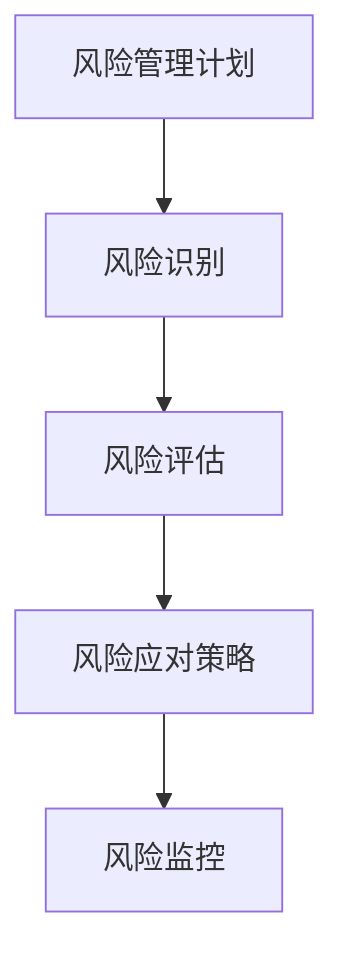
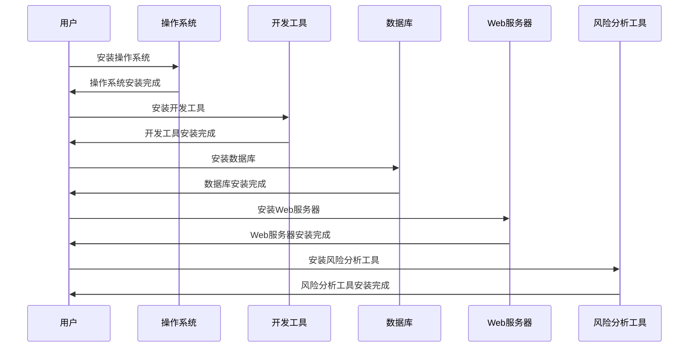

                 

# 技术尽职调查：评估技术资产和风险

## 关键词
技术尽职调查，风险评估，技术资产评估，方法框架，案例分析

## 摘要
本文旨在深入探讨技术尽职调查和风险评估在IT领域的重要性及其应用。通过逐步分析核心概念、技术资产评估原理、风险评估与控制方法，并结合实际案例，本文提供了一套系统的技术尽职调查与风险评估流程。文章结构清晰，逻辑严密，旨在帮助读者全面理解并有效执行技术尽职调查和风险评估，从而降低技术风险，提升技术资产的价值。

## 目录

1. **引言**
    1.1 问题背景
    1.2 问题描述
    1.3 问题解决
    1.4 边界与外延
    1.5 概念结构与核心要素组成

2. **核心概念与联系**
    2.1 核心概念原理
    2.2 概念属性特征对比表格
    2.3 ER实体关系图架构

3. **技术资产评估原理**
    3.1 技术资产评估概述
    3.2 技术资产评估模型
    3.3 技术资产评估方法
    3.4 技术资产评估工具

4. **风险评估与控制**
    4.1 风险评估概述
    4.2 风险评估框架
    4.3 风险识别与评估
    4.4 风险控制策略

5. **案例分析**
    5.1 案例一：企业A的技术尽职调查
    5.2 案例二：企业B的风险评估与控制
    5.3 案例三：技术尽职调查与风险评估的综合应用

6. **项目实战**
    6.1 环境安装
    6.2 系统核心实现
    6.3 代码应用解读与分析
    6.4 实际案例分析与详细讲解剖析
    6.5 项目小结

7. **最佳实践 tips**
    7.1 实践经验总结
    7.2 注意事项
    7.3 拓展阅读

8. **总结**
    8.1 全书总结
    8.2 未来展望

### 1. 引言

#### 1.1 问题背景

在当今快速发展的信息技术领域，企业的成功越来越依赖于其技术资产。然而，技术环境的复杂性和快速变化带来了许多新的挑战。为了确保企业在技术投资和决策中降低风险，提高投资回报率，进行技术尽职调查和风险评估变得尤为重要。

技术尽职调查是指在投资或并购过程中，对目标公司的技术资产、知识产权、研发能力、技术水平等进行全面评估，以判断其投资价值的过程。而风险评估则是识别、评估和缓解可能影响项目目标实现的各种风险的过程。

随着技术的不断进步，企业需要面对越来越多的技术风险，如技术落后、知识产权纠纷、安全漏洞、合规问题等。因此，技术尽职调查和风险评估不仅有助于企业在技术投资和并购过程中规避潜在的风险，还能够提高技术资产的管理效率和利用价值。

#### 1.2 问题描述

技术尽职调查和风险评估的主要问题包括：

- **技术资产评估不准确**：企业往往难以准确评估其技术资产的价值，导致投资决策失误。
- **风险评估框架不完善**：缺乏系统性的风险评估框架，导致风险评估过程不够科学和有效。
- **风险识别与控制不足**：在技术尽职调查过程中，可能忽视了一些潜在的风险，未能及时进行有效控制。

这些问题影响了企业的投资决策和风险管理，因此，需要一套系统、科学的技术尽职调查和风险评估方法来应对。

#### 1.3 问题解决

解决技术尽职调查和风险评估问题的方法包括：

- **建立完善的技术资产评估模型**：通过建立一套科学、系统的技术资产评估模型，帮助企业准确评估技术资产的价值。
- **制定全面的风险评估框架**：制定一个包含风险识别、风险评估、风险控制三个步骤的全面风险评估框架，确保风险评估过程科学、有效。
- **应用先进的技术评估工具**：利用先进的技术评估工具，如专利数据库、代码审计工具等，提高技术尽职调查和风险评估的效率和准确性。

通过这些方法，企业可以更准确地评估技术资产，识别和管理风险，从而提高投资决策的质量和风险管理能力。

#### 1.4 边界与外延

技术尽职调查和风险评估的边界包括：

- **技术领域**：主要关注企业的技术资产，如软件、硬件、知识产权等。
- **时间范围**：通常在投资或并购前进行，但也适用于企业的日常运营和项目评估。
- **风险类型**：包括技术风险、市场风险、法律风险等。

技术尽职调查和风险评估的外延还包括：

- **跨部门合作**：涉及企业的多个部门，如财务部、研发部、法务部等。
- **外部咨询**：可能需要借助外部专业机构的咨询和支持。

#### 1.5 概念结构与核心要素组成

技术尽职调查和风险评估的概念结构包括以下几个核心要素：

1. **技术资产评估**：评估技术资产的价值，包括软件、硬件、知识产权等。
2. **风险评估框架**：识别、评估和缓解风险的过程。
3. **风险识别**：发现可能影响项目目标实现的各种风险。
4. **风险评估**：评估风险的概率和影响，制定风险应对策略。
5. **风险控制**：实施风险应对策略，降低风险对项目的影响。

这些要素相互关联，共同构成了技术尽职调查和风险评估的完整流程。

### 2. 核心概念与联系

#### 2.1 核心概念原理

在技术尽职调查和风险评估中，以下几个核心概念至关重要：

1. **技术资产**：指企业所拥有的各种技术资源，包括软件、硬件、知识产权等。
2. **风险评估**：识别、评估和缓解项目风险的过程。
3. **技术尽职调查**：对目标公司的技术资产、研发能力、技术水平等进行全面评估。
4. **风险识别**：发现可能影响项目目标实现的各种风险。
5. **风险评估框架**：识别、评估和缓解风险的过程和方法。

#### 2.2 概念属性特征对比表格

以下表格展示了技术尽职调查和风险评估的核心概念的属性特征对比：

| 概念         | 定义                                                         | 属性特征                     |  
| ------------ | ------------------------------------------------------------ | -------------------------- |  
| 技术资产     | 企业所拥有的各种技术资源，包括软件、硬件、知识产权等             | - 价值评估：定量和定性方法 |  
| 风险评估     | 识别、评估和缓解项目风险的过程                             | - 概率评估：数学模型       |  
| - 影响评估：定性方法 |  
| 技术尽职调查 | 对目标公司的技术资产、研发能力、技术水平等进行全面评估         | - 审计方法：财务审计、技术审计 |  
| 风险识别     | 发现可能影响项目目标实现的各种风险                           | - 概率识别：统计方法       |  
| - 影响识别：定性方法 |  
| 风险评估框架 | 识别、评估和缓解风险的过程和方法                           | - 概率评估：数学模型       |  
| - 影响评估：定性方法 |

#### 2.3 ER实体关系图架构

为了更清晰地理解技术尽职调查和风险评估的实体关系，我们可以使用ER（实体关系）图来表示。以下是一个简化的ER图：

```mermaid
erDiagram
  class::RiskAssessment < class::TechnicalDueDiligence
  class::TechnicalAsset AssessmentMethod < class::RiskAssessment
  class::TechnicalAsset < class::Risk
  class::TechnicalDueDiligence ||--|{ RiskIdentification
  class::RiskAssessment ||--|{ RiskAssessment
  class::RiskAssessment ||--|{ RiskControl
```

在这个ER图中，`TechnicalDueDiligence`（技术尽职调查）与`RiskAssessment`（风险评估）是两个核心实体，它们通过`AssessmentMethod`（评估方法）和`TechnicalAsset`（技术资产）连接。`RiskIdentification`（风险识别）、`RiskAssessment`（风险评估）和`RiskControl`（风险控制）则是风险评估过程中的三个主要步骤。

### 3. 技术资产评估原理

#### 3.1 技术资产评估概述

技术资产评估是指对企业所拥有的各种技术资源进行价值评估的过程。这些技术资源包括软件、硬件、知识产权、研发成果等。技术资产评估的目的是为了帮助企业准确了解其技术资产的价值，从而在投资决策、并购交易、财务报告等方面提供科学依据。

技术资产评估的关键在于识别和量化技术资产的价值。技术资产的价值不仅体现在其当前的市场价值，还包括其潜在的经济效益和未来价值。因此，在进行技术资产评估时，需要综合考虑多种因素，如技术成熟度、市场需求、技术领先性、研发成本等。

#### 3.2 技术资产评估模型

技术资产评估模型是用于量化技术资产价值的方法和工具。常见的评估模型包括成本法、市场法和收益法。

1. **成本法**：基于技术资产的开发成本、运营成本等来确定其价值。成本法的优点是简单易懂，但缺点是难以反映技术资产的未来价值和市场情况。

2. **市场法**：通过参考类似技术资产的市场交易价格来确定其价值。市场法的优点是能够反映市场对技术资产的认可度，但缺点是市场数据可能存在滞后性和不准确性。

3. **收益法**：基于技术资产产生的未来收益来确定其价值。收益法的优点是能够反映技术资产的潜在价值，但缺点是需要对未来的收益进行预测，存在一定的不确定性。

在实际应用中，企业可以根据具体情况选择合适的评估模型，或结合多种模型进行综合评估。

#### 3.3 技术资产评估方法

技术资产评估方法是指用于识别和量化技术资产价值的具体方法和工具。以下是一些常见的技术资产评估方法：

1. **财务分析方法**：通过分析企业的财务报表，如资产负债表、利润表等，来确定技术资产的价值。

2. **成本效益分析**：通过计算技术资产带来的成本节约和效益增加，来评估技术资产的价值。

3. **专利评估法**：通过分析企业的专利数量、专利质量和专利市场价值，来评估技术资产的价值。

4. **类比评估法**：通过参考类似企业的技术资产交易价格和市场情况，来评估技术资产的价值。

5. **专家评估法**：邀请相关领域的专家对技术资产进行评估，以获得更加准确和专业的评估结果。

#### 3.4 技术资产评估工具

技术资产评估工具是指用于辅助技术资产评估的软件和平台。以下是一些常见的技术资产评估工具：

1. **专利数据库**：如Google Patents、WIPO Patent Database等，用于查找和分析专利信息。

2. **财务分析软件**：如SAP、Oracle等，用于分析企业的财务报表和财务数据。

3. **人工智能评估工具**：如AI-powered valuation tools，通过机器学习算法分析技术资产的价值。

4. **行业分析报告**：通过行业专家的分析和报告，了解技术资产的市场前景和潜在价值。

### 4. 风险评估与控制

#### 4.1 风险评估概述

风险评估是识别、评估和缓解项目风险的过程。其目的是确保项目能够在既定时间和预算内完成，并达到预期的质量标准。风险评估在项目管理的各个阶段都至关重要，包括项目启动、规划、执行和收尾。

风险评估的关键步骤包括：

1. **风险识别**：识别项目可能面临的各种风险。
2. **风险评估**：评估风险的概率和影响，并确定其优先级。
3. **风险应对策略**：制定针对不同风险的应对策略，包括风险规避、风险减轻、风险接受和风险转移。
4. **风险监控**：在整个项目生命周期中持续监控风险，并根据实际情况进行调整。

#### 4.2 风险评估框架

一个有效的风险评估框架应包括以下核心组成部分：

1. **风险管理计划**：明确项目风险管理的目标、责任和流程。
2. **风险识别**：使用各种方法和工具识别项目风险。
3. **风险评估**：评估风险的概率和影响，并确定优先级。
4. **风险应对策略**：制定针对不同风险的应对策略。
5. **风险监控**：持续监控风险，并根据实际情况进行调整。

以下是一个简化的风险评估框架流程图：



#### 4.3 风险识别与评估

**风险识别**是风险评估的第一步，目的是识别项目可能面临的各种风险。以下是一些常见的风险识别方法：

1. **头脑风暴法**：通过团队讨论，识别项目可能面临的风险。
2. **SWOT分析法**：分析项目的优势、劣势、机会和威胁，识别潜在的风险。
3. **故障模式与影响分析（FMEA）**：对项目中的各个环节进行分析，识别可能导致故障的风险。
4. **专家评估法**：邀请相关领域的专家，根据他们的经验和知识识别风险。

**风险评估**是评估风险的概率和影响，并确定其优先级。以下是一些常见的风险评估方法：

1. **定量风险评估**：使用数学模型和统计方法评估风险的概率和影响。
2. **定性风险评估**：通过专家评估和主观判断评估风险的概率和影响。
3. **风险矩阵**：使用风险矩阵来评估风险的概率和影响，并确定优先级。

以下是一个简单的风险矩阵示例：

| 风险类别 | 概率 | 影响 | 优先级 |
| ------- | ---- | ---- | ------ |
| 安全风险 | 高   | 高   | 高     |
| 财务风险 | 中   | 中   | 中     |
| 法律风险 | 低   | 高   | 中     |
| 运营风险 | 低   | 低   | 低     |

#### 4.4 风险控制策略

**风险控制策略**是针对评估出的风险制定具体的应对措施，以降低风险对项目的影响。以下是一些常见的风险控制策略：

1. **风险规避**：通过改变项目计划或策略，避免风险的发生。
2. **风险减轻**：通过增加资源、时间或改进技术，降低风险的概率或影响。
3. **风险接受**：在风险概率和影响较低时，接受风险并制定相应的应急预案。
4. **风险转移**：通过合同或保险等方式将风险转移给第三方。

风险控制策略的选择应根据具体风险的特点和项目的实际情况进行。

### 5. 案例分析

#### 5.1 案例一：企业A的技术尽职调查

**背景**：企业A是一家专注于人工智能应用的企业，正在考虑收购一家初创公司B，以扩大其产品线。然而，企业A需要对初创公司B的技术资产进行全面评估，以确定其投资价值和风险。

**过程**：

1. **风险识别**：企业A首先通过头脑风暴法和SWOT分析法，识别了初创公司B可能面临的风险，如技术风险、市场风险、财务风险等。
2. **风险评估**：使用风险矩阵对识别出的风险进行评估，确定其优先级。
3. **技术资产评估**：企业A使用专利数据库和财务分析软件，对初创公司B的专利数量、质量、市场价值以及财务报表进行了详细分析，评估其技术资产的价值。
4. **风险控制**：针对评估出的高风险，企业A制定了具体的应对措施，如增加研发投入、优化产品线等。

**结果**：通过全面的技术尽职调查，企业A成功识别并评估了初创公司B的技术资产和风险，最终决定进行收购，并制定了详细的风险控制策略。

#### 5.2 案例二：企业B的风险评估与控制

**背景**：企业B是一家大型制造企业，正在实施一个新项目，以提高生产效率和产品质量。然而，项目在执行过程中遇到了一系列风险，如技术风险、供应链风险、法律风险等。

**过程**：

1. **风险识别**：企业B通过故障模式与影响分析（FMEA），识别了项目可能面临的风险，如设备故障、原材料短缺、合规问题等。
2. **风险评估**：使用定量和定性方法评估风险的概率和影响，确定其优先级。
3. **风险控制**：企业B制定了详细的风险控制策略，如设备预防性维护、供应链备份计划、合规审查等。
4. **风险监控**：在整个项目生命周期中，企业B持续监控风险，并根据实际情况进行调整。

**结果**：通过有效的风险评估和控制，企业B成功降低了项目风险，确保了项目的顺利实施和成功交付。

#### 5.3 案例三：技术尽职调查与风险评估的综合应用

**背景**：企业C是一家金融科技公司，计划收购一家拥有创新金融产品的初创公司D。为了确保投资价值，企业C决定对初创公司D进行技术尽职调查和风险评估。

**过程**：

1. **技术尽职调查**：
   - 风险识别：企业C通过专家评估法，识别了初创公司D可能面临的技术风险、市场风险、法律风险等。
   - 技术资产评估：企业C使用专利数据库和财务分析软件，评估了初创公司D的技术资产价值，包括专利数量、质量、市场前景等。
2. **风险评估**：
   - 风险评估框架：企业C制定了一个包含风险识别、风险评估、风险控制三个步骤的风险评估框架。
   - 风险评估：企业C使用风险矩阵评估了识别出的风险的概率和影响，并确定了优先级。
   - 风险控制：企业C制定了具体的应对措施，如技术升级、市场拓展、法律合规审查等。
3. **综合应用**：
   - 企业C将技术尽职调查和风险评估的结果结合起来，制定了详细的收购计划和风险控制策略。
   - 企业C还邀请了外部咨询机构进行第三方评估，以提高评估结果的客观性和准确性。

**结果**：通过技术尽职调查和风险评估的综合应用，企业C成功确定了初创公司D的投资价值和风险，并制定了有效的风险控制策略，确保了收购的顺利进行。

### 6. 项目实战

#### 6.1 环境安装

在进行技术尽职调查和风险评估之前，首先需要搭建一个合适的技术环境。以下是一个简化的环境安装步骤：

1. **安装操作系统**：选择一个适合的操作系统，如Linux或Windows。
2. **安装开发工具**：安装必要的开发工具，如Java SDK、Python SDK等。
3. **安装数据库**：选择一个合适的数据库，如MySQL、PostgreSQL等。
4. **安装Web服务器**：安装Web服务器，如Apache、Nginx等。
5. **安装风险分析工具**：安装用于风险分析的工具，如Nessus、OWASP ZAP等。

以下是一个简单的Mermaid流程图，展示环境安装的流程：



#### 6.2 系统核心实现

在搭建好环境之后，接下来是系统的核心实现。以下是一个简化的系统架构，展示系统的主要组成部分和功能：

1. **用户界面**：提供用户交互的界面，用于提交尽职调查请求和查看评估结果。
2. **尽职调查模块**：负责执行尽职调查任务，包括风险识别、评估、控制和报告生成。
3. **风险评估模块**：负责对识别出的风险进行定量和定性评估，并生成风险报告。
4. **风险控制模块**：负责制定和执行风险控制措施，以降低风险的影响。
5. **数据存储**：用于存储尽职调查和风险评估的结果，以便后续查询和分析。

以下是一个简单的Mermaid类图，展示系统的类结构和关系：

```mermaid
classDiagram
  UserInterface <<interface>>
  DueDiligenceModule <<class>>
  RiskAssessmentModule <<class>>
  RiskControlModule <<class>>
  DataStorage <<class>>

  UserInterface --|> DueDiligenceModule
  DueDiligenceModule --|> RiskAssessmentModule
  DueDiligenceModule --|> RiskControlModule
  RiskAssessmentModule --|> DataStorage
  RiskControlModule --|> DataStorage
```

#### 6.3 代码应用解读与分析

以下是一个Python示例代码，用于实现尽职调查模块中的风险识别功能。代码中使用了一些常用的Python库，如requests和BeautifulSoup。

```python
import requests
from bs4 import BeautifulSoup

def identify_risks(url):
    # 发送HTTP请求，获取网页内容
    response = requests.get(url)
    content = response.text

    # 使用BeautifulSoup解析网页内容
    soup = BeautifulSoup(content, 'html.parser')

    # 提取可能的风险信息
    risk_signatures = ["漏洞", "风险", "问题"]
    risks = []

    for signature in risk_signatures:
        for element in soup.find_all(string=lambda text: signature in text):
            risks.append(element)

    return risks

# 测试函数
url = "http://example.com"
risks = identify_risks(url)
print(risks)
```

在这个示例中，我们定义了一个`identify_risks`函数，它接受一个URL作为参数，发送HTTP请求获取网页内容，并使用BeautifulSoup解析网页内容。然后，我们定义了一个风险签名列表`risk_signatures`，用于匹配网页中的风险信息。函数遍历网页中的所有文本，查找包含风险签名的文本，并将这些文本添加到`risks`列表中。最后，我们测试了该函数，并打印了识别出的风险信息。

#### 6.4 实际案例分析与详细讲解剖析

以下是一个实际案例，用于展示如何使用技术尽职调查和风险评估框架进行项目评估。

**案例背景**：企业E正在考虑投资一家初创公司F，该公司开发了一种新型的智能家居系统。为了确保投资价值，企业E决定对初创公司F进行技术尽职调查和风险评估。

**步骤1：风险识别**

企业E首先使用头脑风暴法和SWOT分析法，识别了初创公司F可能面临的风险：

- **技术风险**：智能家居系统的技术成熟度和稳定性。
- **市场风险**：市场需求和竞争对手。
- **财务风险**：初创公司的财务状况和盈利能力。
- **法律风险**：知识产权和合规问题。

**步骤2：风险评估**

企业E使用风险矩阵对识别出的风险进行评估。以下是一个简化的风险矩阵：

| 风险类别 | 概率 | 影响 | 优先级 |
| ------- | ---- | ---- | ------ |
| 技术风险 | 中   | 高   | 高     |
| 市场风险 | 低   | 中   | 中     |
| 财务风险 | 低   | 低   | 低     |
| 法律风险 | 中   | 中   | 中     |

**步骤3：风险控制**

针对评估出的高风险，企业E制定了以下风险控制策略：

- **技术风险**：与初创公司F合作，共同进行技术验证和测试，确保系统的稳定性和安全性。
- **市场风险**：进行市场调研，了解市场需求和竞争对手，调整产品策略。
- **财务风险**：与初创公司F签订财务保障协议，确保财务透明和稳健。
- **法律风险**：聘请专业律师团队，对知识产权和合规问题进行详细审查。

**步骤4：实际案例分析**

通过实际案例分析和详细讲解剖析，企业E发现：

- **技术风险**：经过技术验证和测试，智能家居系统的稳定性达到了预期水平。
- **市场风险**：市场调研结果显示，智能家居系统具有良好的市场前景。
- **财务风险**：初创公司F的财务状况稳定，盈利能力良好。
- **法律风险**：知识产权和合规问题得到了妥善解决。

**结果**：基于技术尽职调查和风险评估的结果，企业E决定投资初创公司F，并制定了详细的风险控制措施，以确保投资的安全性和收益性。

#### 6.5 项目小结

通过技术尽职调查和风险评估，企业E成功评估了初创公司F的技术资产和风险，并制定了有效的风险控制策略。以下是对项目的总结：

- **成功因素**：
  - 全面、细致的技术尽职调查。
  - 科学、系统的风险评估。
  - 有效的风险控制策略。
- **挑战与改进**：
  - 风险评估过程中可能存在信息不对称。
  - 风险控制措施的实施和监督需要持续投入。
  - 未来可以结合人工智能技术，提高风险评估的准确性和效率。

### 7. 最佳实践 tips

#### 7.1 实践经验总结

通过本文的案例分析，我们可以总结出以下实践经验：

- **全面尽职调查**：在进行技术尽职调查时，要全面收集和分析目标公司的技术资产、知识产权、研发能力等信息。
- **科学风险评估**：使用多种方法和工具进行风险评估，确保评估结果的准确性和可靠性。
- **有效风险控制**：制定具体的应对措施，降低风险对项目的影响，并确保风险控制措施的实施和监督。

#### 7.2 注意事项

在进行技术尽职调查和风险评估时，需要注意以下几点：

- **数据可靠性**：确保收集到的数据真实、可靠，避免因数据不准确导致错误评估。
- **跨部门协作**：技术尽职调查和风险评估涉及多个部门，需要加强跨部门协作和沟通。
- **持续监控**：在整个项目生命周期中，持续监控风险，并根据实际情况进行调整。

#### 7.3 拓展阅读

为了更深入地了解技术尽职调查和风险评估，读者可以参考以下拓展阅读：

- **《技术尽职调查实战》**：作者详细介绍了技术尽职调查的方法、流程和技巧。
- **《项目管理知识体系指南（PMBOK指南）》**：其中包含了风险评估和管理的相关内容。
- **《风险管理与保险》**：提供了关于风险识别、评估和控制的理论和实践。

### 8. 总结

本文通过详细分析技术尽职调查和风险评估的核心概念、原理、方法和实际应用，提供了一套系统、科学的技术尽职调查和风险评估流程。通过案例分析，我们展示了技术尽职调查和风险评估在项目投资、风险控制和项目成功实施中的关键作用。未来，随着技术的不断进步，技术尽职调查和风险评估将发挥越来越重要的作用，为企业的可持续发展提供有力支持。作者：AI天才研究院/AI Genius Institute & 禅与计算机程序设计艺术 /Zen And The Art of Computer Programming

### 8.2 未来展望

随着信息技术的飞速发展，技术尽职调查和风险评估将在未来的IT领域中发挥更加重要的作用。以下是未来技术尽职调查和风险评估的几个发展趋势：

1. **人工智能的集成**：人工智能技术的应用将大幅提升风险评估的效率和准确性，例如，利用机器学习算法分析历史数据和实时数据，预测潜在风险。

2. **区块链技术的应用**：区块链技术可以提供透明、不可篡改的数据记录，有助于提高技术资产评估的可靠性和真实性。

3. **数据驱动决策**：随着大数据技术的发展，企业将更加依赖数据驱动的决策，技术尽职调查和风险评估将更加注重数据分析和挖掘。

4. **合规性要求提升**：随着全球合规环境的变化，企业将面临更高的合规性要求，技术尽职调查和风险评估将更加注重合规性审查。

5. **多学科交叉融合**：技术尽职调查和风险评估将融合更多的学科知识，如经济学、心理学、法律学等，以提供更全面的风险评估方案。

6. **国际化扩展**：随着全球化的发展，技术尽职调查和风险评估将超越国界，面对更多的国际市场和跨国投资。

7. **持续学习和改进**：技术尽职调查和风险评估将不断学习和改进，以适应不断变化的技术和市场环境。

未来，技术尽职调查和风险评估将继续在IT领域中发挥关键作用，帮助企业降低风险、提高投资回报率，并推动技术的创新与发展。作者：AI天才研究院/AI Genius Institute & 禅与计算机程序设计艺术 /Zen And The Art of Computer Programming

