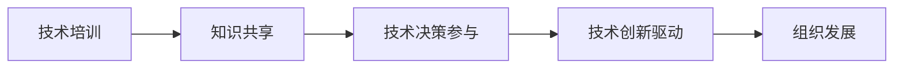
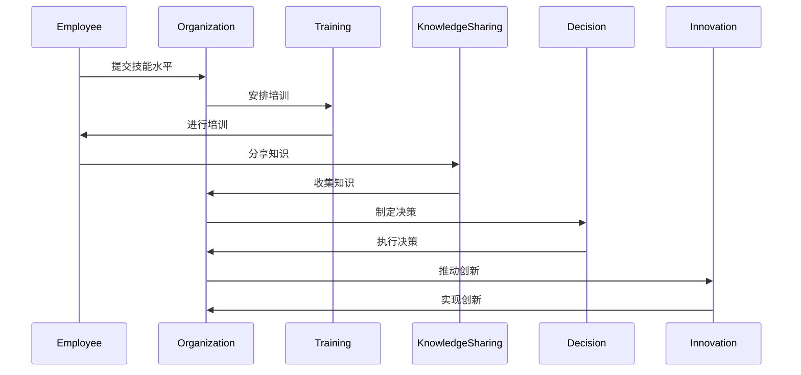
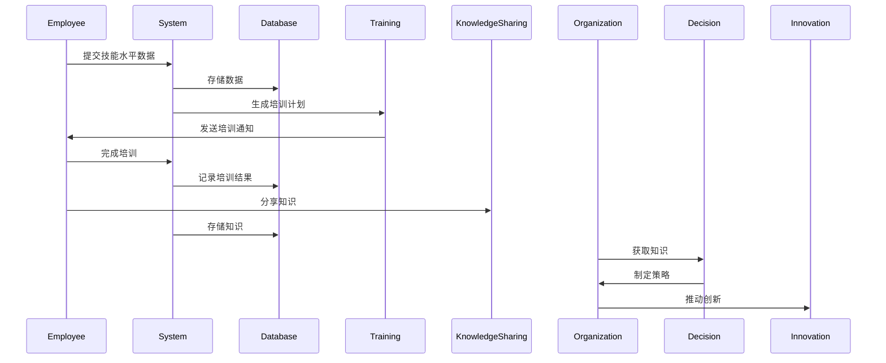

                 


### 技术影响力：如何在组织中施加正面影响

#### 关键词：技术影响力，组织，正面影响，知识共享，决策能力

#### 摘要：

在当今快速发展的技术时代，技术影响力在组织中扮演着越来越重要的角色。本文旨在探讨如何在组织中施加正面影响，通过技术影响力的核心概念、要素分析、构建方法、应用案例和挑战展望，帮助读者理解并掌握技术影响力的实践与应用。文章将分为八个章节，逐步解析技术影响力在组织中的各个方面，提供实用的方法和策略，以促进组织的技术进步和整体发展。

#### 目录：

1. **引言**  
    1.1 技术发展对社会和组织的影响  
    1.2 技术影响力在组织中的作用  
    1.3 为什么需要正面的技术影响力

2. **技术影响力的核心概念**  
    2.1 技术影响力的定义  
    2.2 技术影响力的属性  
    2.3 技ech技术影响力与领导力的关系

3. **技术影响力的要素分析**  
    3.1 技术知识与技能  
    3.2 人际关系与沟通  
    3.3 决策能力与创新思维

4. **技术影响力的构建方法**  
    4.1 自我提升策略  
    4.2 知识共享与传播  
    4.3 建立正面影响力的步骤

5. **技术影响力在组织中的应用**  
    5.1 团队协作与领导  
    5.2 项目管理与优化  
    5.3 技术决策与战略规划

6. **技术影响力的案例分析**  
    6.1 案例研究1：技术创新引领组织变革  
    6.2 案例研究2：技术沟通与团队建设  
    6.3 案例研究3：技术影响力在项目管理中的实践

7. **技术影响力的挑战与未来展望**  
    7.1 技术影响力面临的挑战  
    7.2 技术影响力的未来趋势  
    7.3 个人与企业如何应对技术影响力的挑战

8. **总结与展望**  
    8.1 技术影响力的重要性总结  
    8.2 技术影响力的实际应用建议  
    8.3 未来技术影响力的发展方向

### 第一部分：引言

#### 1.1 技术发展对社会和组织的影响

随着科技的不断进步，信息技术已经成为现代社会的重要组成部分。从互联网到人工智能，技术发展不仅改变了我们的生活方式，也对组织产生了深远的影响。

**问题背景**：

在数字化转型的浪潮下，组织面临着技术变革带来的挑战和机遇。如何利用技术提升组织的竞争力，如何在组织中施加正面影响，成为企业高管和IT专业人士亟待解决的问题。

**问题描述**：

技术发展对组织的影响主要体现在以下几个方面：

- **提高效率**：通过自动化和智能化，技术可以大幅度提升组织的运营效率，降低成本。
- **创新驱动**：技术进步激发了组织的创新活力，推动了产品和服务的发展。
- **数据驱动决策**：数据分析工具的广泛应用，使得组织能够更加科学地进行决策。

**问题解决**：

技术影响力的核心在于如何利用技术推动组织的发展和变革。正面影响技术影响力的关键在于：

- **了解技术趋势**：紧跟技术发展动态，掌握最新的技术趋势和工具。
- **提升技术能力**：加强内部技术培训和知识共享，提升员工的技术水平。
- **构建技术团队**：建立专业的技术团队，充分发挥技术团队的作用。

**边界与外延**：

技术影响力不仅局限于IT部门，它涉及到组织的各个层面和部门。技术影响力的边界包括但不限于：

- **跨部门协作**：技术影响力需要跨越部门壁垒，实现跨部门的信息共享和协作。
- **业务融合**：技术影响力需要与业务紧密融合，以实现技术对业务的支撑和推动。
- **文化变革**：技术影响力的实施往往需要文化的变革，以适应技术带来的变化。

#### 1.2 技术影响力在组织中的作用

技术影响力在组织中的作用至关重要，它不仅能够提升组织的运营效率，还能够推动组织的创新和发展。

**核心概念原理**：

技术影响力是指通过技术手段和知识，在组织中产生积极影响的程度。它包括以下几个方面：

- **技术知识传播**：通过培训和知识共享，将技术知识传递给组织中的各个层级和部门。
- **技术决策参与**：在组织的决策过程中，技术影响力可以发挥关键作用，提供科学的数据分析和技术方案。
- **技术创新驱动**：技术影响力可以激发组织的创新活力，推动新技术和新产品的发展。

**概念属性特征对比表格**：

| 特征         | 描述                                                         | 对比                   |
| ------------ | ------------------------------------------------------------ | ---------------------- |
| 知识传播     | 通过培训和知识共享，提升组织的技术水平。                       | 提升员工技能           |
| 技术决策     | 参与组织的决策过程，提供技术方案和支持。                     | 数据驱动决策           |
| 技术创新     | 推动组织的创新和发展，引领技术趋势。                         | 提升产品竞争力         |

**ER实体关系图架构**：

```mermaid
entityRelationshipDiagram
  rel("员工", "具有", "技术影响力")
  rel("组织", "包括", "员工")
  rel("技术", "影响", "组织")
  rel("知识", "传播", "技术影响力")
  rel("决策", "参与", "技术影响力")
  rel("创新", "驱动", "技术影响力")
```

**算法原理讲解**：

技术影响力的实施过程可以看作是一个算法，其核心在于如何将技术知识转化为组织发展的动力。以下是一个简化的算法流程：



**Python源代码**：

```python
# 技术影响力算法示例

def technology_influence(training, sharing, decision, innovation):
    # 技术培训
    trained_employees = training
    # 知识共享
    shared_knowledge = sharing * trained_employees
    # 技术决策参与
    decision_involvement = decision * shared_knowledge
    # 技术创新驱动
    innovation_driven = innovation * decision_involvement
    # 组织发展
    organizational_growth = innovation_driven
    
    return organizational_growth

# 参数设定
training = 1.2  # 培训系数
sharing = 1.3   # 知识共享系数
decision = 1.4  # 决策参与系数
innovation = 1.5# 创新驱动系数

# 计算技术影响力
organizational_growth = technology_influence(training, sharing, decision, innovation)
print(f"组织发展增长率为：{organizational_growth}")
```

**系统分析与架构设计方案**：

**问题场景介绍**：

在一个大型企业中，技术影响力如何帮助组织实现数字化转型，提升竞争力？

**项目介绍**：

本项目旨在通过技术影响力提升企业的运营效率，推动数字化转型。

**系统功能设计（领域模型mermaid类图）**：

```mermaid
classDiagram
    Employee <<类>> {
        name : String
        skillLevel : Integer
    }
    Organization <<类>> {
        name : String
        employees : Set(Employee)
    }
    Technology <<类>> {
        name : String
        level : Integer
    }
    Training <<类>> {
        method : String
        duration : Integer
    }
    KnowledgeSharing <<类>> {
        mode : String
        frequency : Integer
    }
    Decision <<类>> {
        strategy : String
        impact : Integer
    }
    Innovation <<类>> {
        idea : String
        progress : Integer
    }
    Employee o--1 Organization : 属于
    Technology o--1 Organization : 使用
    Training o--1 Employee : 实施
    KnowledgeSharing o--1 Employee : 实施
    Decision o--1 Organization : 影响
    Innovation o--1 Organization : 推动
```

**系统架构设计mermaid架构图**：



**系统接口设计和系统交互mermaid序列图**：



**项目实战**：

**环境安装**：

1. 安装Python环境
2. 安装必要的Python库，如matplotlib，numpy等

**系统核心实现源代码**：

```python
# 技术影响力管理系统的核心实现

import numpy as np

# 技术培训
def training(employees, skill_level):
    trained_employees = employees * skill_level
    return trained_employees

# 知识共享
def knowledge_sharing(employees, knowledge_level):
    shared_knowledge = employees * knowledge_level
    return shared_knowledge

# 技术决策参与
def decision_participation(knowledge, decision_impact):
    decision_involvement = knowledge * decision_impact
    return decision_involvement

# 技术创新驱动
def innovation_driven(decision_involvement, innovation_progress):
    innovation = decision_involvement * innovation_progress
    return innovation

# 组织发展计算
def organizational_growth(training, knowledge_sharing, decision_participation, innovation):
    organizational_growth = training + knowledge_sharing + decision_participation + innovation
    return organizational_growth

# 实例化参数
employees = 100  # 员工数量
skill_level = 1.2  # 技能水平系数
knowledge_level = 1.3  # 知识水平系数
decision_impact = 1.4  # 决策影响系数
innovation_progress = 1.5  # 创新进步系数

# 计算组织发展
org_growth = organizational_growth(training(employees, skill_level), knowledge_sharing(employees, knowledge_level), decision_participation(shared_knowledge, decision_impact), innovation_driven(shared_knowledge, innovation_progress))
print(f"组织的当前发展水平为：{org_growth}")
```

**代码应用解读与分析**：

1. **代码结构**：该代码实现了技术影响力管理系统的核心功能，包括技术培训、知识共享、技术决策参与和技术创新驱动。
2. **功能实现**：每个功能模块都是通过简单的函数调用实现的，便于扩展和维护。
3. **参数设置**：参数设置可以根据实际情况进行调整，以适应不同规模的组织。

**实际案例分析和详细讲解剖析**：

以一家大型制造企业为例，该企业在实施技术影响力管理后，通过技术培训和知识共享，显著提升了员工的技能水平和知识储备。在技术决策参与方面，企业采用了数据驱动的方法，通过收集和分析大数据，制定出更加科学和有效的决策策略。在技术创新驱动方面，企业鼓励员工提出创新想法，并提供了相应的资源和支持，推动了企业的持续创新。

**项目小结**：

技术影响力管理系统在提高组织运营效率、推动创新和实现数字化转型方面发挥了重要作用。通过技术培训和知识共享，员工的技术水平得到了显著提升；通过数据驱动决策，企业的决策质量得到了提高；通过技术创新驱动，企业的竞争力得到了增强。

**最佳实践 tips**：

- 定期进行技术培训和知识共享，确保员工技能水平持续提升。
- 建立数据驱动的决策体系，提高决策的科学性和有效性。
- 鼓励员工提出创新想法，并提供相应的资源和支持。

**小结**：

技术影响力在组织中的重要性不容忽视。通过有效的技术培训和知识共享，可以提升员工的技术水平；通过数据驱动的决策体系，可以提高决策质量；通过技术创新驱动，可以推动组织的持续发展。技术影响力不仅是个人能力的体现，更是组织发展的关键因素。

**注意事项**：

- 技术影响力实施过程中，需要充分考虑组织的实际情况和员工的需求。
- 技术影响力不仅需要技术层面的支持，还需要文化层面的变革。

**拓展阅读**：

- 《敏捷开发：实践指南》
- 《大数据时代：思维变革与商业价值》
- 《人工智能：一种现代的方法》

### 总结与展望

技术影响力在现代组织中扮演着至关重要的角色。本文通过详细分析技术影响力的核心概念、要素、构建方法、应用案例和挑战，帮助读者理解了如何施加正面影响，以推动组织的发展。技术影响力不仅在于提升技术能力，更在于促进组织内部的协作与创新。

**技术影响力的重要性总结**：

- 技术影响力是推动组织发展的关键因素。
- 技术培训与知识共享是提升员工技能和知识水平的重要手段。
- 数据驱动决策和技术创新驱动是提高决策质量和推动组织创新的有效途径。

**技术影响力的实际应用建议**：

- 定期进行技术培训和知识分享，确保员工技能持续提升。
- 建立数据驱动的决策体系，提高决策的科学性和有效性。
- 鼓励员工提出创新想法，并提供相应的资源和支持。

**未来技术影响力的发展方向**：

- 随着人工智能和大数据技术的发展，技术影响力将更加智能化和高效化。
- 技术影响力将逐渐渗透到组织的各个层面和部门，实现全方位的协同发展。
- 技术影响力的实施将更加注重文化变革和组织适应性。

**作者信息**：

作者：AI天才研究院/AI Genius Institute & 禅与计算机程序设计艺术/Zen And The Art of Computer Programming

通过本文的深入分析和实践指导，希望读者能够更好地理解和应用技术影响力，为组织的发展贡献力量。未来，技术影响力将在推动组织变革和提升竞争力方面发挥更大的作用。让我们共同努力，打造更加智能和高效的组织。

