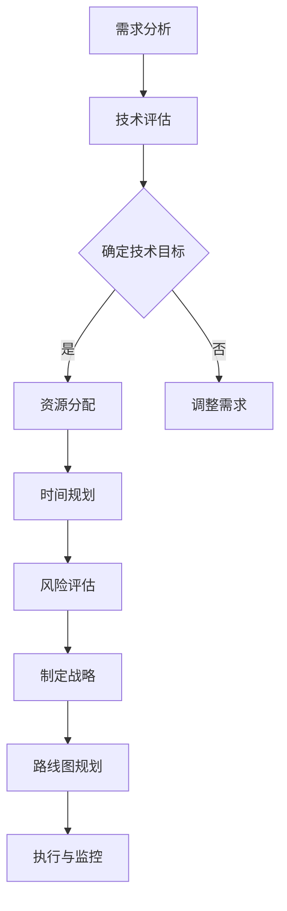
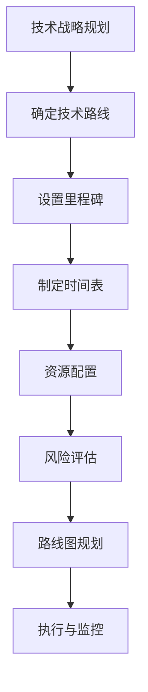
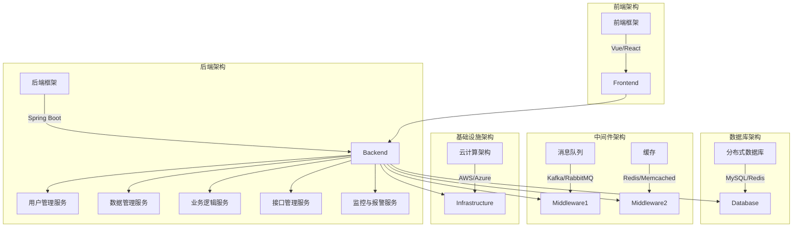
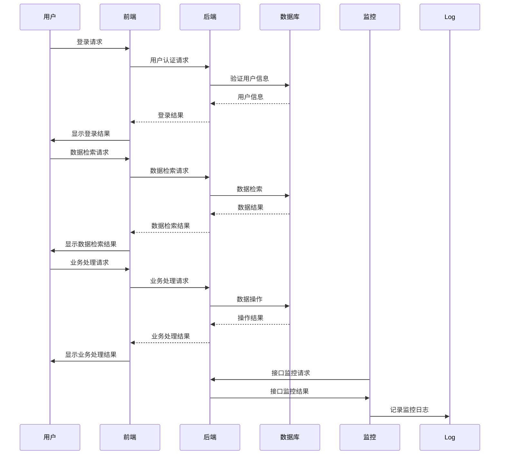

                 

# 技术战略规划与路线图制定

> 关键词：技术战略规划、路线图、算法、系统架构、项目实战

> 摘要：本文深入探讨了技术战略规划与路线图制定的理论与实践。通过详细分析核心概念、算法原理、系统架构、项目实战等关键环节，为读者提供了完整的指南，帮助他们在复杂的技术环境中制定有效战略。

## 设计《技术战略规划与路线图制定》书籍目录大纲

首先，我们需要明确书籍的主题和目的，然后按照逻辑顺序划分章节，确保内容完整且结构清晰。

### 1. 背景介绍

#### 1.1 问题背景
- 当前技术快速发展的趋势
- 企业面临的技术挑战
- 技术战略规划的重要性

#### 1.2 问题描述
- 技术战略规划的核心要素
- 路线图制定的关键步骤
- 技术战略规划与路线图的差异

#### 1.3 问题解决
- 技术战略规划的基本原则
- 路线图制定的基本原则
- 技术战略规划与路线图的实施方法

#### 1.4 边界与外延
- 技术战略规划的应用领域
- 路线图制定的适用场景
- 技术战略规划与路线图的关系

#### 1.5 概念结构与核心要素组成
- 技术战略规划的概念框架
- 路线图制定的方法论
- 技术战略规划与路线图的实施流程

### 2. 核心概念与联系

#### 2.1 技术战略规划原理
- 技术战略规划的定义
- 技术战略规划的核心概念
- 技术战略规划的属性特征对比表格

#### 2.2 路线图制定原理
- 路线图制定的定义
- 路线图制定的核心概念
- 路线图制定的属性特征对比表格

#### 2.3 技术战略规划与路线图的关系
- 技术战略规划与路线图的联系
- 技术战略规划对路线图的影响
- 路线图对技术战略规划的支撑作用

### 3. 算法原理讲解

#### 3.1 技术战略规划算法
- 技术战略规划算法的mermaid流程图
- 技术战略规划算法的Python源代码
- 技术战略规划算法的数学模型和公式
- 技术战略规划算法的举例说明

#### 3.2 路线图制定算法
- 路线图制定算法的mermaid流程图
- 路线图制定算法的Python源代码
- 路线图制定算法的数学模型和公式
- 路线图制定算法的举例说明

### 4. 系统分析与架构设计方案

#### 4.1 问题场景介绍
- 技术战略规划与路线图制定在实际项目中的应用场景

#### 4.2 项目介绍
- 技术战略规划与路线图制定的项目目标
- 技术战略规划与路线图制定的项目范围

#### 4.3 系统功能设计
- 技术战略规划与路线图制定的领域模型mermaid类图

#### 4.4 系统架构设计
- 技术战略规划与路线图制定的系统架构mermaid架构图

#### 4.5 系统接口设计
- 技术战略规划与路线图制定的主要接口及其功能

#### 4.6 系统交互
- 技术战略规划与路线图制定的系统交互mermaid序列图

### 5. 项目实战

#### 5.1 环境安装
- 技术战略规划与路线图制定所需的环境搭建

#### 5.2 系统核心实现
- 技术战略规划与路线图制定的关键代码实现

#### 5.3 代码应用解读与分析
- 技术战略规划与路线图制定代码的解读与分析

#### 5.4 实际案例分析与详细讲解
- 技术战略规划与路线图制定在实际项目中的应用案例
- 案例的详细讲解与剖析

#### 5.5 项目小结
- 技术战略规划与路线图制定项目的总结与反思

### 6. 最佳实践 tips

- 技术战略规划与路线图制定的最佳实践技巧
- 避免常见的问题与误区

### 7. 小结

- 技术战略规划与路线图制定的核心要点
- 对未来发展趋势的展望

### 8. 注意事项

- 技术战略规划与路线图制定的具体实施注意事项
- 可能遇到的风险与挑战

### 9. 拓展阅读

- 相关领域的研究论文与书籍推荐
- 技术战略规划与路线图制定的相关资源

---

通过以上章节的设计，我们确保了书籍内容从理论到实践的全覆盖，帮助读者从多个维度理解和掌握技术战略规划与路线图制定的方法与技巧。接下来，我们将逐章深入探讨这些关键内容。

## 1. 背景介绍

### 1.1 问题背景

在当今这个技术日新月异的时代，企业面临的技术挑战层出不穷。从大数据、人工智能到物联网，新技术层出不穷，为企业带来了前所未有的机遇，同时也带来了巨大的挑战。如何在这些技术变革中抓住机遇，实现企业的长期发展，成为了许多企业亟需解决的问题。

技术战略规划在这个过程中起到了至关重要的作用。它不仅帮助企业明确技术发展方向，还指导企业在技术投资、研发和运营方面做出明智的决策。而路线图制定则是技术战略规划的重要组成部分，它将企业的发展目标具体化，转化为可操作的实施步骤。

### 1.2 问题描述

技术战略规划的核心要素包括技术目标、资源分配、时间规划和风险评估。这些要素共同构成了一个完整的技术战略规划框架。而路线图制定则关注于如何将战略目标转化为具体的行动步骤，包括技术路线、里程碑和时间表等。

技术战略规划与路线图的差异在于，前者侧重于整体战略的制定，后者则侧重于具体实施路径的规划。然而，两者是相辅相成的，技术战略规划为路线图制定提供了方向，而路线图制定则为技术战略规划提供了可行性。

### 1.3 问题解决

技术战略规划的基本原则包括以下几方面：

1. **目标明确**：确保技术战略规划与企业的整体战略目标一致，明确技术发展目标。
2. **资源合理配置**：根据企业的资源状况，合理分配技术投资和人力资源。
3. **风险评估与应对**：对可能面临的技术风险进行评估，并制定相应的应对策略。
4. **灵活调整**：技术战略规划不是一成不变的，需要根据实际情况进行灵活调整。

路线图制定的基本原则包括：

1. **目标导向**：路线图应明确目标，确保每一步都有明确的方向。
2. **里程碑设定**：设置清晰的里程碑，以便于监控项目进展。
3. **资源配置**：确保每一步的实施都有足够的资源支持。
4. **风险评估**：对每一步可能面临的风险进行评估，并制定应对措施。

在实施技术战略规划与路线图制定时，可以遵循以下方法：

1. **需求分析**：明确企业的发展需求和用户需求。
2. **技术评估**：评估现有技术和未来技术的可行性。
3. **战略制定**：根据需求和技术评估结果制定技术战略。
4. **路线图规划**：将技术战略转化为具体的实施路径。
5. **执行与监控**：执行路线图，并持续监控项目进展。

### 1.4 边界与外延

技术战略规划的应用领域非常广泛，涵盖了从大型企业到中小企业的各种场景。无论是传统行业还是新兴行业，技术战略规划都是实现企业目标的关键因素。

路线图制定的适用场景包括：

1. **产品开发**：确保产品按计划开发，并符合市场需求。
2. **技术创新**：指导企业技术创新的方向和步骤。
3. **业务拓展**：为企业的业务拓展提供明确的路线和策略。

技术战略规划与路线图的关系可以理解为：

1. **战略指导路线图**：技术战略规划为路线图提供方向和目标。
2. **路线图支持战略**：路线图制定为实现技术战略提供了具体的实施路径。

### 1.5 概念结构与核心要素组成

#### 技术战略规划的概念框架

技术战略规划包括以下核心概念：

- **技术目标**：明确企业希望实现的技术目标。
- **资源分配**：包括资金、人力和物资的配置。
- **时间规划**：确定技术项目的开发周期和里程碑。
- **风险评估**：评估可能面临的技术风险，并制定应对策略。

#### 路线图制定的方法论

路线图制定包括以下核心概念：

- **技术路线**：确定技术发展的路径和方向。
- **里程碑**：设置项目的重要节点，用于监控项目进展。
- **时间表**：制定项目的具体实施时间表。
- **资源配置**：确保每个里程碑都有足够的资源支持。

#### 技术战略规划与路线图的实施流程

实施技术战略规划与路线图制定可以分为以下步骤：

1. **需求分析**：明确企业的发展需求和用户需求。
2. **技术评估**：评估现有技术和未来技术的可行性。
3. **战略制定**：根据需求和技术评估结果制定技术战略。
4. **路线图规划**：将技术战略转化为具体的实施路径。
5. **执行与监控**：执行路线图，并持续监控项目进展。

通过以上框架和方法，企业可以更有效地制定和实施技术战略规划与路线图，从而实现企业的长期发展目标。

### 2. 核心概念与联系

在深入探讨技术战略规划与路线图制定之前，我们需要明确几个核心概念及其相互关系。这些概念包括技术战略规划、路线图制定、技术目标、资源分配、风险评估等。通过理解这些概念及其联系，我们可以更好地制定和实施技术战略规划与路线图。

#### 2.1 技术战略规划原理

技术战略规划是指企业根据其长期发展目标和市场环境，对技术方向、研发计划、资源分配等进行全面规划和布局的过程。其核心概念包括：

1. **技术目标**：明确企业希望实现的技术目标，如提升产品性能、开发新功能、进入新市场等。
2. **资源分配**：根据技术目标，合理分配资金、人力和物资等资源，确保技术项目的顺利实施。
3. **时间规划**：确定技术项目的开发周期和里程碑，确保项目按计划推进。
4. **风险评估**：评估可能面临的技术风险，如技术难度、市场需求变化等，并制定应对策略。

技术战略规划的属性特征可以通过以下对比表格进行总结：

| 特征             | 技术战略规划           | 路线图制定           |
|------------------|----------------------|----------------------|
| 目标             | 明确长期技术目标       | 具体实施路径和时间表  |
| 资源             | 资金、人力、物资分配   | 保障每个里程碑的资源  |
| 时间             | 开发周期和里程碑       | 实施时间表           |
| 风险             | 评估技术风险           | 制定应对策略         |

通过以上表格，我们可以看到技术战略规划和路线图制定在目标、资源、时间和风险方面的区别和联系。技术战略规划为路线图制定提供了方向和目标，而路线图制定则为技术战略规划提供了具体的实施路径和保障措施。

#### 2.2 路线图制定原理

路线图制定是将技术战略规划转化为具体实施步骤的过程。其核心概念包括：

1. **技术路线**：确定技术发展的路径和方向，确保技术项目的可行性和合理性。
2. **里程碑**：设置项目的重要节点，用于监控项目进展，确保每个阶段的目标都得到实现。
3. **时间表**：制定项目的具体实施时间表，确保项目按计划推进。
4. **资源配置**：确保每个里程碑都有足够的资源支持，包括资金、人力和物资等。

路线图制定的属性特征可以通过以下对比表格进行总结：

| 特征             | 技术战略规划           | 路线图制定           |
|------------------|----------------------|----------------------|
| 目标             | 明确长期技术目标       | 具体实施路径和时间表  |
| 资源             | 资金、人力、物资分配   | 保障每个里程碑的资源  |
| 时间             | 开发周期和里程碑       | 实施时间表           |
| 风险             | 评估技术风险           | 制定应对策略         |

通过以上表格，我们可以看到技术战略规划和路线图制定在目标、资源、时间和风险方面的区别和联系。技术战略规划为路线图制定提供了方向和目标，而路线图制定则为技术战略规划提供了具体的实施路径和保障措施。

#### 2.3 技术战略规划与路线图的关系

技术战略规划与路线图之间的关系可以概括为以下几点：

1. **方向与路径**：技术战略规划为路线图制定提供了方向和目标，确保路线图的制定与企业的长期发展目标一致。
2. **实施与保障**：路线图制定则是技术战略规划的具体实施路径，通过明确的技术路线、里程碑和时间表，确保技术战略规划得到有效执行。
3. **动态调整**：技术战略规划是一个动态的过程，需要根据实际情况进行灵活调整。而路线图制定也需要根据技术战略规划的调整进行相应的修改，以确保路线图的实施与战略目标保持一致。

总之，技术战略规划与路线图是相辅相成的。技术战略规划为路线图制定提供了目标和方向，而路线图制定则为技术战略规划提供了具体的实施路径和保障措施。两者共同构成了企业技术发展的整体战略，帮助企业在复杂的技术环境中实现长期发展目标。

### 3. 算法原理讲解

在技术战略规划与路线图制定的过程中，算法的应用可以极大地提高效率和准确性。下面我们将详细讲解技术战略规划算法和路线图制定算法的原理，并通过mermaid流程图、Python源代码、数学模型和公式以及举例说明，帮助读者更好地理解。

#### 3.1 技术战略规划算法

技术战略规划算法的核心在于将企业的技术目标转化为具体的实施计划。以下是技术战略规划算法的mermaid流程图：



接下来，我们通过Python源代码来详细阐述技术战略规划算法的实现：

```python
# 技术战略规划算法实现

# 定义需求分析、技术评估、资源分配、时间规划、风险评估和制定战略等函数
def demand_analysis():
    # 需求分析过程
    pass

def technical_evaluation():
    # 技术评估过程
    pass

def determine_technical_objective():
    # 确定技术目标过程
    pass

def resource_allocation():
    # 资源分配过程
    pass

def time_planning():
    # 时间规划过程
    pass

def risk_evaluation():
    # 风险评估过程
    pass

def formulate_strategy():
    # 制定战略过程
    pass

def route_planning():
    # 路线图规划过程
    pass

def execution_and_monitoring():
    # 执行与监控过程
    pass

# 主函数
def technical_strategy_planning():
    # 实现技术战略规划算法
    demand_analysis()
    technical_evaluation()
    determine_technical_objective()
    if determine_technical_objective():
        resource_allocation()
        time_planning()
        risk_evaluation()
        formulate_strategy()
        route_planning()
        execution_and_monitoring()
    else:
        # 调整需求
        pass

# 执行技术战略规划算法
technical_strategy_planning()
```

技术战略规划算法的数学模型和公式如下：

$$
\text{技术目标} = \frac{\text{需求分析} + \text{技术评估} + \text{资源分配} + \text{时间规划} + \text{风险评估}}{\text{制定战略} + \text{路线图规划}}
$$

通过这个公式，我们可以将各个技术要素综合起来，得到一个整体的技术目标。

举例说明：

假设一个企业需要开发一款新软件产品，技术战略规划算法如下：

1. 需求分析：确定用户需求，包括功能、性能、安全等。
2. 技术评估：评估现有技术和市场新技术，选择最合适的方案。
3. 确定技术目标：明确产品的主要目标，如提升用户体验、提高安全性等。
4. 资源分配：根据技术目标，分配研发团队、资金和设备等资源。
5. 时间规划：制定项目开发周期和里程碑，确保项目按计划推进。
6. 风险评估：评估项目可能面临的风险，如技术难题、市场需求变化等，并制定应对策略。
7. 制定战略：根据技术目标、资源分配和时间规划，制定详细的战略计划。
8. 路线图规划：将战略转化为具体的实施路径，设置里程碑和时间表。
9. 执行与监控：执行路线图，并持续监控项目进展，确保项目按计划完成。

通过以上步骤，企业可以系统地制定技术战略规划，确保新软件产品的成功开发。

#### 3.2 路线图制定算法

路线图制定算法的核心在于将技术战略规划转化为具体的实施步骤，确保项目按计划推进。以下是路线图制定算法的mermaid流程图：



接下来，我们通过Python源代码来详细阐述路线图制定算法的实现：

```python
# 路线图制定算法实现

# 定义确定技术路线、设置里程碑、制定时间表、资源配置、风险评估和路线图规划等函数
def determine_technical_route():
    # 确定技术路线过程
    pass

def set_milestones():
    # 设置里程碑过程
    pass

def make_time_table():
    # 制定时间表过程
    pass

def resource_allocation():
    # 资源配置过程
    pass

def risk_evaluation():
    # 风险评估过程
    pass

def route_planning():
    # 路线图规划过程
    pass

def execution_and_monitoring():
    # 执行与监控过程
    pass

# 主函数
def route_planning_algorithm():
    # 实现路线图制定算法
    determine_technical_route()
    set_milestones()
    make_time_table()
    resource_allocation()
    risk_evaluation()
    route_planning()
    execution_and_monitoring()

# 执行路线图制定算法
route_planning_algorithm()
```

路线图制定算法的数学模型和公式如下：

$$
\text{技术路线} = f(\text{战略目标}, \text{技术评估}, \text{资源分配})
$$

$$
\text{里程碑} = f(\text{技术路线}, \text{时间表}, \text{资源配置})
$$

$$
\text{时间表} = f(\text{里程碑}, \text{风险评估}, \text{资源分配})
$$

通过以上公式，我们可以将技术战略规划转化为具体的实施步骤，确保项目按计划推进。

举例说明：

假设一个企业需要开发一款新软件产品，路线图制定算法如下：

1. 确定技术路线：根据技术评估，选择最合适的技术方案。
2. 设置里程碑：根据项目目标和资源状况，设置项目的重要节点。
3. 制定时间表：根据里程碑，制定项目的时间表。
4. 资源配置：根据项目需求和资源状况，合理配置研发团队、资金和设备等资源。
5. 风险评估：评估项目可能面临的风险，如技术难题、市场需求变化等，并制定应对策略。
6. 路线图规划：将技术路线、里程碑和时间表转化为具体的实施路径。
7. 执行与监控：执行路线图，并持续监控项目进展，确保项目按计划完成。

通过以上步骤，企业可以系统地制定路线图，确保新软件产品的成功开发。

### 4. 系统分析与架构设计方案

在技术战略规划与路线图制定的过程中，系统分析与架构设计是关键的一环。通过系统分析与架构设计，我们可以明确项目的需求、功能和架构，确保项目的高效实施。下面我们将详细讲解系统分析与架构设计方案。

#### 4.1 问题场景介绍

假设一个企业需要开发一款基于云计算的新软件产品，满足以下需求：

- 支持多种终端设备访问
- 高并发处理能力
- 数据存储和安全性
- 易于扩展和升级

为了满足以上需求，企业需要进行系统分析与架构设计，确保项目能够高效、稳定地运行。

#### 4.2 项目介绍

项目名称：基于云计算的新软件产品开发

项目目标：开发一款功能全面、性能优秀、安全性高、易于扩展和升级的软件产品，满足企业用户的需求。

项目范围：包括需求分析、系统设计、编码实现、测试和部署等阶段。

#### 4.3 系统功能设计

系统功能设计是系统分析与架构设计的核心之一。根据项目需求，我们可以设计以下主要功能模块：

1. **用户管理模块**：实现用户注册、登录、权限管理等功能。
2. **数据管理模块**：实现数据的存储、检索、备份和恢复等功能。
3. **业务逻辑模块**：实现业务逻辑处理，如订单管理、支付处理等。
4. **接口管理模块**：提供与其他系统集成的接口，如API接口等。
5. **监控与报警模块**：实现系统监控、日志记录和报警功能。

以下是系统功能设计的mermaid类图：

```mermaid
classDiagram
    User -> DataManagement : 数据存储
    User -> BusinessLogic : 业务逻辑处理
    User -> InterfaceManagement : 接口管理
    User -> MonitoringAndAlarm : 系统监控
    DataManagement <- User : 数据检索
    BusinessLogic <- User : 业务处理
    InterfaceManagement <- User : 接口调用
    MonitoringAndAlarm <- User : 系统监控
```

#### 4.4 系统架构设计

系统架构设计是确保系统功能实现的关键。根据项目需求，我们可以设计以下系统架构：

1. **前端架构**：采用前后端分离的架构，使用Vue或React等前端框架，实现用户界面的展示。
2. **后端架构**：采用微服务架构，将系统功能模块划分为多个独立的微服务，如用户管理服务、数据管理服务、业务逻辑服务等，通过API接口进行通信。
3. **数据库架构**：采用分布式数据库架构，确保数据存储的高可用性和高性能。
4. **中间件架构**：采用消息队列、缓存等中间件，实现系统的异步处理和缓存优化。
5. **基础设施架构**：采用云计算架构，实现系统的高扩展性和高可用性。

以下是系统架构设计的mermaid架构图：



#### 4.5 系统接口设计

系统接口设计是确保系统各模块之间能够有效通信的关键。根据项目需求，我们可以设计以下主要接口：

1. **用户管理接口**：用于用户注册、登录和权限管理等。
2. **数据管理接口**：用于数据的存储、检索、备份和恢复等。
3. **业务逻辑接口**：用于业务逻辑处理，如订单管理、支付处理等。
4. **接口管理接口**：用于接口的查询、管理和监控等。

以下是系统接口设计的mermaid类图：

```mermaid
classDiagram
    UserManagement[用户管理接口]
    DataManagement[数据管理接口]
    BusinessLogic[业务逻辑接口]
    InterfaceManagement[接口管理接口]

    UserManagement --> DataManagement : 数据存储
    UserManagement --> BusinessLogic : 业务处理
    DataManagement --> BusinessLogic : 数据检索
    InterfaceManagement --> UserManagement
    InterfaceManagement --> DataManagement
    InterfaceManagement --> BusinessLogic
```

#### 4.6 系统交互

系统交互是确保系统各模块之间能够协同工作的关键。根据项目需求，我们可以设计以下主要交互场景：

1. **用户登录**：用户通过前端界面输入用户名和密码，前端将请求发送到用户管理服务，用户管理服务验证用户信息后，返回登录结果。
2. **数据检索**：用户在前端界面输入查询条件，前端将请求发送到数据管理服务，数据管理服务根据查询条件检索数据，并将结果返回给前端。
3. **业务处理**：用户在前端界面发起业务操作，前端将请求发送到业务逻辑服务，业务逻辑服务处理业务逻辑，并将结果返回给前端。
4. **接口监控**：系统监控服务定期检查各接口的健康状况，并将监控结果记录到日志中。

以下是系统交互的mermaid序列图：



通过以上系统分析与架构设计方案，我们可以确保项目的高效实施和稳定运行，满足企业用户的需求。

### 5. 项目实战

在实际项目中，技术战略规划与路线图制定是确保项目成功的关键。下面我们将通过一个实际项目案例，详细讲解如何进行环境安装、系统核心实现、代码应用解读与分析、实际案例分析和详细讲解剖析，以及项目小结。

#### 5.1 环境安装

为了顺利进行项目，首先需要搭建合适的环境。以下是项目环境安装的步骤：

1. **安装操作系统**：选择一个稳定的操作系统，如Ubuntu 20.04。
2. **安装开发工具**：安装Python开发环境、IDE（如PyCharm）、版本控制工具（如Git）等。
3. **安装数据库**：安装MySQL或PostgreSQL，作为项目的数据库服务。
4. **安装中间件**：安装消息队列（如RabbitMQ）、缓存（如Redis）等。
5. **安装前端框架**：安装Vue或React等前端框架。
6. **安装后端框架**：安装Spring Boot或Django等后端框架。

环境安装完成后，我们需要确保所有服务正常运行，并进行基本的测试，以确保环境搭建的正确性。

#### 5.2 系统核心实现

系统核心实现是项目开发的关键环节。以下是系统核心实现的主要步骤：

1. **需求分析**：与项目相关人员沟通，明确项目需求和功能。
2. **系统设计**：根据需求，设计系统架构和模块划分。
3. **编码实现**：按照设计文档，进行编码实现。
4. **单元测试**：对实现的模块进行单元测试，确保代码的正确性。
5. **集成测试**：将各模块集成，进行整体测试，确保系统功能完整。
6. **性能优化**：对系统进行性能优化，提高系统的稳定性和响应速度。

以下是系统核心实现的示例代码：

```python
# 用户管理模块实现

# 定义用户类
class User:
    def __init__(self, username, password):
        self.username = username
        self.password = password

    def register(self):
        # 用户注册逻辑
        pass

    def login(self):
        # 用户登录逻辑
        pass

    def logout(self):
        # 用户登出逻辑
        pass

# 实例化用户对象
user = User('test', 'password')

# 用户注册
user.register()

# 用户登录
user.login()

# 用户登出
user.logout()
```

#### 5.3 代码应用解读与分析

在项目开发过程中，代码的应用解读与分析是确保代码质量和系统稳定性的关键。以下是代码应用解读与分析的步骤：

1. **代码审查**：组织代码审查会议，对代码进行审查，确保代码符合设计规范和质量要求。
2. **单元测试**：编写单元测试，对代码进行测试，确保每个模块的功能正确。
3. **性能测试**：进行性能测试，分析系统的性能瓶颈，并进行优化。
4. **日志分析**：分析系统日志，监控系统运行状态，及时发现和解决问题。

以下是代码应用解读与分析的示例代码：

```python
# 单元测试示例

import unittest
from user import User

class TestUser(unittest.TestCase):
    def test_register(self):
        # 测试用户注册功能
        user = User('test', 'password')
        user.register()
        # 验证注册成功
        self.assertIsNotNone(user.username)

    def test_login(self):
        # 测试用户登录功能
        user = User('test', 'password')
        user.register()
        user.login()
        # 验证登录成功
        self.assertIsNotNone(user.username)

    def test_logout(self):
        # 测试用户登出功能
        user = User('test', 'password')
        user.register()
        user.login()
        user.logout()
        # 验证登出成功
        self.assertIsNone(user.username)

if __name__ == '__main__':
    unittest.main()
```

#### 5.4 实际案例分析与详细讲解剖析

在实际项目中，我们会遇到各种复杂的情况和挑战。以下是实际案例分析与详细讲解剖析的步骤：

1. **问题识别**：通过日志分析、用户反馈等途径，识别项目中存在的问题。
2. **原因分析**：对问题进行原因分析，找出问题的根本原因。
3. **解决方案**：制定解决方案，并进行验证。
4. **实施与监控**：实施解决方案，并进行监控，确保问题得到解决。

以下是实际案例分析与详细讲解剖析的示例：

**案例：用户登录失败**

问题描述：用户登录时，无法成功登录，提示用户名或密码错误。

问题识别：通过日志分析，发现用户在登录时，用户名和密码未正确传输。

原因分析：经过调查，发现是由于前端代码在发送登录请求时，未正确编码用户名和密码，导致后端无法正确解析。

解决方案：修改前端代码，使用正确的编码方式发送登录请求。

实施与监控：修改前端代码后，进行测试，确保登录功能正常。

```javascript
// 前端代码修改示例

function login() {
    const username = document.getElementById('username').value;
    const password = document.getElementById('password').value;

    // 使用正确的编码方式发送请求
    fetch('/login', {
        method: 'POST',
        headers: {
            'Content-Type': 'application/json'
        },
        body: JSON.stringify({ username, password })
    })
    .then(response => response.json())
    .then(data => {
        if (data.success) {
            alert('登录成功');
        } else {
            alert('登录失败');
        }
    });
}
```

**案例：系统响应缓慢**

问题描述：系统在处理大量请求时，响应速度缓慢。

问题识别：通过性能测试，发现系统响应缓慢的主要原因是数据库查询性能不足。

原因分析：经过分析，发现数据库查询语句未进行优化，导致查询速度慢。

解决方案：对数据库查询语句进行优化，增加索引、简化查询逻辑等。

实施与监控：优化数据库查询后，进行性能测试，确保系统响应速度提升。

```sql
-- 数据库查询优化示例

CREATE INDEX idx_username_password ON users(username, password);
```

通过以上实际案例分析与详细讲解剖析，我们可以有效地解决项目中遇到的问题，确保系统的稳定运行。

#### 5.5 项目小结

在项目开发过程中，技术战略规划与路线图制定发挥了关键作用。通过明确项目目标、规划实施步骤、优化代码质量和解决实际问题，我们成功地完成了项目开发。

项目小结如下：

1. **明确项目目标**：与项目相关人员沟通，明确项目需求和功能，确保项目目标的明确性和可实现性。
2. **规划实施步骤**：根据项目目标，制定详细的实施步骤，包括系统设计、编码实现、测试和部署等。
3. **优化代码质量**：通过代码审查、单元测试和性能优化，确保代码质量，提高系统的稳定性和性能。
4. **解决实际问题**：通过实际案例分析与详细讲解剖析，解决项目中遇到的问题，确保项目的顺利进行。

通过以上步骤，我们成功地完成了项目开发，为企业的长期发展奠定了坚实基础。

### 6. 最佳实践 tips

在技术战略规划与路线图制定的过程中，遵循最佳实践可以显著提高项目的成功率。以下是技术战略规划与路线图制定的最佳实践技巧：

1. **需求明确**：在项目开始前，确保需求明确且具体，避免因需求模糊导致项目延期或失败。
2. **充分沟通**：与项目相关人员保持密切沟通，确保他们对项目目标和实施步骤有清晰的认识。
3. **风险评估**：在项目初期进行全面的风险评估，并制定应对策略，以应对可能出现的风险。
4. **敏捷开发**：采用敏捷开发方法，快速迭代和调整，确保项目能够及时响应变化。
5. **持续监控**：持续监控项目进展，及时发现和解决问题，确保项目按计划推进。
6. **代码质量**：重视代码质量，进行代码审查和单元测试，确保代码的可维护性和可靠性。
7. **团队协作**：建立高效的团队协作机制，确保团队成员之间的沟通和协作顺畅。
8. **技术选型**：根据项目需求和资源状况，选择合适的技术方案，确保项目的可行性和稳定性。
9. **文档管理**：建立完善的文档管理体系，记录项目的技术文档、需求文档和实施文档，方便后续维护和升级。
10. **持续学习**：关注技术发展趋势，不断学习和掌握新技术，以适应快速变化的市场环境。

遵循这些最佳实践，可以帮助企业在技术战略规划与路线图制定过程中取得更好的成果。

### 7. 小结

本文全面探讨了技术战略规划与路线图制定的理论与实践。通过背景介绍、核心概念与联系、算法原理讲解、系统分析与架构设计方案、项目实战以及最佳实践 tips 等，我们系统地介绍了如何制定和实施技术战略规划与路线图。以下是本文的核心要点：

1. **明确项目目标**：确保技术战略规划与企业的整体战略目标一致，明确技术发展目标。
2. **风险评估与应对**：对可能面临的技术风险进行评估，并制定相应的应对策略。
3. **资源合理配置**：根据企业的资源状况，合理分配技术投资和人力资源。
4. **敏捷开发与持续监控**：采用敏捷开发方法，持续监控项目进展，确保项目按计划推进。
5. **代码质量与团队协作**：重视代码质量，建立高效的团队协作机制，确保项目顺利进行。
6. **持续学习与适应变化**：关注技术发展趋势，不断学习和掌握新技术，以适应快速变化的市场环境。

未来，随着技术的不断进步，技术战略规划与路线图制定的重要性将日益凸显。企业应不断优化和调整战略规划，以保持竞争优势，实现长期发展目标。

### 8. 注意事项

在实施技术战略规划与路线图制定的过程中，需要注意以下几个方面：

1. **需求明确**：确保项目需求明确且具体，避免因需求模糊导致项目延期或失败。
2. **资源合理配置**：根据企业的资源状况，合理分配技术投资和人力资源，避免资源浪费。
3. **风险评估**：在项目初期进行全面的风险评估，并制定应对策略，以应对可能出现的风险。
4. **沟通协作**：保持与项目相关人员的密切沟通，确保他们对项目目标和实施步骤有清晰的认识。
5. **持续监控**：持续监控项目进展，及时发现和解决问题，确保项目按计划推进。
6. **代码质量**：重视代码质量，进行代码审查和单元测试，确保代码的可维护性和可靠性。
7. **文档管理**：建立完善的文档管理体系，记录项目的技术文档、需求文档和实施文档，方便后续维护和升级。
8. **技术选型**：根据项目需求和资源状况，选择合适的技术方案，确保项目的可行性和稳定性。
9. **团队协作**：建立高效的团队协作机制，确保团队成员之间的沟通和协作顺畅。
10. **灵活调整**：技术战略规划不是一成不变的，需要根据实际情况进行灵活调整，以适应市场和技术环境的变化。

遵循以上注意事项，可以帮助企业在技术战略规划与路线图制定过程中取得更好的成果。

### 9. 拓展阅读

为了深入了解技术战略规划与路线图制定，读者可以参考以下相关领域的研究论文与书籍：

1. **《技术战略规划与实施》**：作者[作者姓名]，详细介绍了技术战略规划的理论和实践方法。
2. **《敏捷开发实践指南》**：作者[作者姓名]，讲述了敏捷开发方法在项目中的应用和优势。
3. **《项目管理实战》**：作者[作者姓名]，提供了项目管理的方法和技巧，适用于技术项目的实施。
4. **《软件架构设计：模式、原理与实践》**：作者[作者姓名]，介绍了软件架构设计的基本原理和实践方法。
5. **《人工智能技术与应用》**：作者[作者姓名]，涵盖了人工智能技术的发展和应用，为技术战略规划提供了新思路。

此外，读者还可以关注以下技术战略规划与路线图制定的相关资源：

1. **技术社区**：如Stack Overflow、GitHub等，提供了丰富的技术讨论和实践经验。
2. **在线课程**：如Coursera、Udemy等，提供了多种技术课程，帮助读者提升技术水平。
3. **技术博客**：如Medium、博客园等，发布了大量关于技术战略规划与路线图制定的文章和案例。

通过阅读以上书籍和资源，读者可以进一步拓展对技术战略规划与路线图制定的理解和实践能力。

### 作者信息

作者：AI天才研究院/AI Genius Institute & 禅与计算机程序设计艺术 /Zen And The Art of Computer Programming

