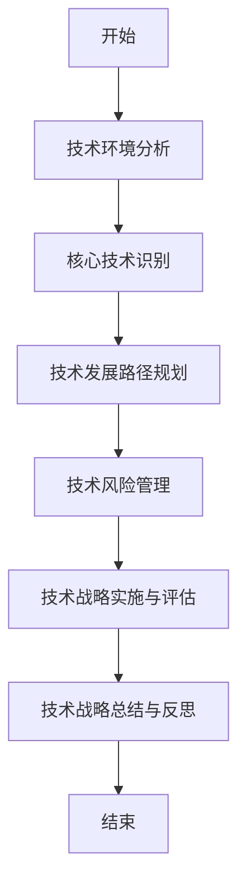
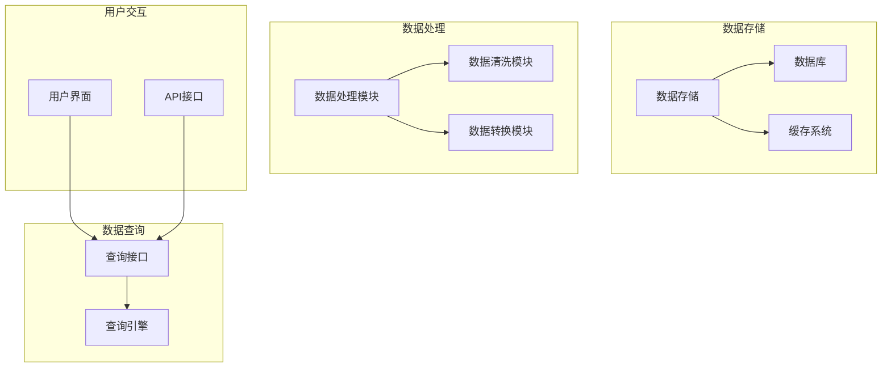
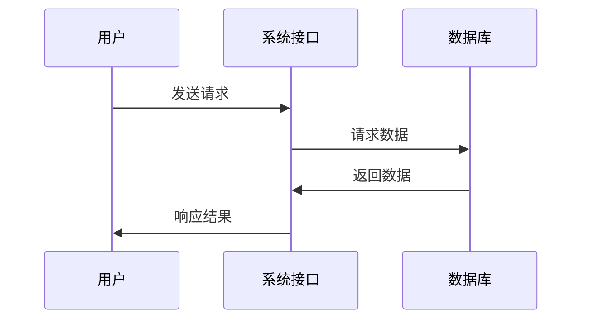
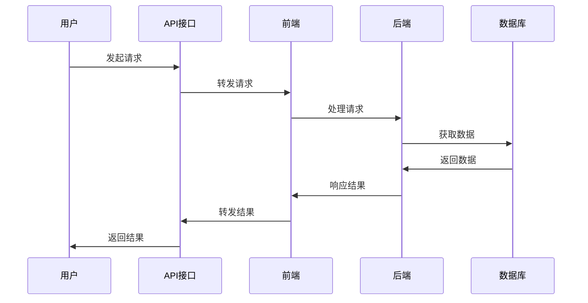

                 

### 文章标题：技术战略：制定长期技术发展规划

> 关键词：技术战略、长期规划、核心竞争力、技术风险管理、实施与评估

> 摘要：本文将深入探讨技术战略的制定过程，分析其核心概念、规划步骤、实施与评估方法，并结合国内外成功案例，提供一套完整的技术战略制定指南。通过本文的阅读，读者将能够系统地理解技术战略的重要性，掌握制定长期技术发展规划的技巧，为企业在技术领域的持续发展奠定坚实基础。

#### 第一部分：背景与核心概念

### 1.1 技术战略的重要性

技术战略是企业长期发展的关键因素，它不仅关乎企业的技术创新和竞争优势，还直接影响到企业的市场定位、产品开发以及资源配置。在当今信息化和全球化的大背景下，技术战略的重要性愈发凸显。

**技术战略的定义**：技术战略是指企业为实现长期发展目标，针对技术领域的决策和规划，包括技术方向选择、技术能力建设、技术资源分配以及技术风险管理等方面。

**企业对技术战略的需求**：随着市场竞争的加剧，企业需要通过技术战略来保持竞争优势，实现持续创新和发展。技术战略能够帮助企业明确技术发展方向，优化资源配置，提高研发效率，降低技术风险。

**技术战略与企业发展**：技术战略是企业战略的重要组成部分，它与企业的发展愿景、使命和价值观密切相关。有效的技术战略能够推动企业的技术创新，提升核心竞争力，促进企业的可持续发展。

### 1.2 技术战略的核心概念

**技术规划**：技术规划是技术战略的具体实施手段，它包括技术方向选择、技术研发计划制定、技术资源分配等。技术规划需要紧密结合企业的战略目标和市场需求，确保技术研发的方向和资源投入的合理性。

**长期规划**：长期规划是指企业对未来一段时间内技术发展的总体规划和布局。长期规划需要考虑市场趋势、技术发展趋势以及企业自身的技术能力，制定合理的技术发展目标和路径。

**发展路径**：发展路径是指企业为实现技术目标所采取的具体措施和步骤。发展路径需要根据企业的实际情况和外部环境，制定出切实可行的技术发展路线图，包括技术研发、人才引进、技术合作等方面。

**核心竞争力**：核心竞争力是指企业在长期竞争中形成的独特优势，包括技术实力、创新能力、市场影响力等。技术战略的核心目标是提升企业的核心竞争力，确保企业在激烈的市场竞争中立于不败之地。

### 1.3 技术战略的边界与外延

**技术战略的适用范围**：技术战略适用于各类企业，无论企业规模大小、行业类型，都可以通过制定技术战略来实现长期发展目标。

**技术战略与市场趋势**：技术战略需要紧跟市场趋势，把握行业发展方向，以市场需求为导向，确保技术战略的前瞻性和适用性。

**技术战略与社会责任**：企业在制定技术战略时，需要充分考虑社会责任，确保技术研发和应用不会对环境和社会造成负面影响，实现可持续发展。

#### 第二部分：技术战略规划过程

### 2.1 技术环境分析

**竞争对手分析**：通过分析竞争对手的技术能力、市场策略、技术研发投入等方面，了解竞争对手的技术优势和技术短板，为企业制定技术战略提供参考。

**市场需求分析**：市场需求分析旨在了解市场对技术的需求和期望，包括客户需求、市场规模、市场竞争状况等。通过市场需求分析，企业可以明确技术研发的重点方向。

**技术发展趋势分析**：技术发展趋势分析包括对当前技术趋势的总结和未来技术趋势的预测。通过技术发展趋势分析，企业可以把握技术发展的方向，为技术规划提供依据。

### 2.2 核心技术识别

**核心技术定义**：核心技术是指企业在长期经营过程中形成的，具有独特性、难以被复制和替代的技术能力。核心技术是企业的核心竞争力之一。

**核心技术筛选**：核心技术筛选是企业根据技术战略目标和市场需求，从现有技术中筛选出具有战略价值的技术。核心技术筛选需要综合考虑技术实力、市场前景、研发难度等因素。

**核心技术应用场景**：核心技术应用场景是指核心技术在实际业务中的应用场景和领域。通过明确核心技术应用场景，企业可以更好地发挥核心技术的价值，实现技术战略目标。

### 2.3 技术发展路径规划

**技术路线图设计**：技术路线图是企业为实现技术战略目标而制定的技术发展路线图，包括技术目标、关键技术、时间节点、资源投入等方面。技术路线图需要具备前瞻性、可行性和适应性。

**技术目标设定**：技术目标是指企业通过技术战略规划所要实现的具体技术成果和技术水平。技术目标的设定需要结合企业的战略目标和市场需求，确保目标的可实现性和激励性。

**技术资源分配**：技术资源分配是企业为实现技术战略目标而进行的资源分配计划，包括人力、财力、物力等。技术资源分配需要确保资源的合理利用，提高研发效率。

### 2.4 技术风险管理

**风险识别**：风险识别是技术风险管理的基础，包括对技术风险、市场风险、财务风险等方面的识别。通过风险识别，企业可以全面了解潜在风险，为风险应对提供依据。

**风险评估**：风险评估是对风险的可能性和影响程度进行评估，包括定量和定性评估方法。通过风险评估，企业可以明确风险的优先级，为风险应对策略的制定提供支持。

**风险应对策略**：风险应对策略是企业针对识别出的风险而制定的应对措施，包括风险规避、风险降低、风险承担等。通过风险应对策略的实施，企业可以最大限度地降低风险对企业发展的影响。

#### 第三部分：技术战略实施与评估

### 3.1 技术战略实施策略

**组织架构调整**：为了确保技术战略的有效实施，企业需要进行组织架构的调整，建立专门的技术战略实施团队，明确各部门的职责和权限，确保技术战略的顺利推进。

**人才引进与培养**：人才是技术战略实施的关键，企业需要通过引进高素质人才和内部人才培养，提升企业的技术能力和创新能力，为技术战略的实施提供人才保障。

**技术研发项目管理**：技术研发项目管理是技术战略实施的重要环节，企业需要建立完善的项目管理体系，包括项目立项、进度控制、质量保障、风险控制等方面，确保技术研发项目的顺利进行。

### 3.2 技术战略评估与调整

**评估指标设定**：评估指标是衡量技术战略实施效果的重要工具，企业需要设定科学、合理的评估指标，包括技术成果、市场份额、研发效率等方面。

**评估方法选择**：评估方法的选择直接影响评估结果的准确性和可靠性，企业可以选择定量评估方法（如数据分析、统计分析等）和定性评估方法（如专家评估、用户反馈等），结合多种方法进行评估。

**调整策略制定**：通过技术战略评估，企业可以了解技术战略实施的效果，发现存在的问题和不足，制定相应的调整策略，确保技术战略的持续优化和改进。

### 3.3 技术战略总结与反思

**成功经验总结**：技术战略实施过程中，企业需要总结成功经验，包括有效的技术策略、优秀的团队协作、科学的决策流程等方面，为未来的技术战略制定提供参考。

**失败案例分析**：技术战略实施过程中，企业不可避免地会遇到挫折和失败，通过分析失败案例，找出失败原因，总结教训，有助于企业规避类似风险，提高技术战略的成功率。

**未来展望与持续改进**：技术战略不是一成不变的，企业需要根据外部环境的变化和内部条件的变化，持续调整和优化技术战略，确保企业能够在技术领域保持竞争优势。

#### 第四部分：最佳实践与案例分析

### 4.1 国内外技术战略成功案例

**案例一：华为**：华为通过长期的技术积累和战略规划，已经成为全球领先的通信技术解决方案提供商。其成功经验包括持续的研发投入、全球化的技术布局、紧密的市场需求对接等。

**案例二：阿里巴巴**：阿里巴巴通过大数据技术和云计算技术的创新应用，构建了强大的电子商务生态系统。其成功经验包括技术创新驱动、生态系统建设、人才培养与引进等。

**案例三：特斯拉**：特斯拉通过电动车技术和人工智能技术的创新应用，引领了全球新能源汽车市场的发展。其成功经验包括技术创新驱动、产业链整合、用户需求导向等。

### 4.2 行业技术战略趋势展望

**趋势一：技术创新加速**：随着科技的快速发展，技术创新的速度不断加快，企业需要紧跟技术趋势，不断进行技术创新，保持竞争优势。

**趋势二：产业链整合**：产业链整合将成为未来技术战略的重要方向，企业需要通过并购、合作等方式，实现产业链的整合和优化，提高产业链的整体竞争力。

**趋势三：人工智能技术普及**：人工智能技术将在各个行业得到广泛应用，企业需要加强人工智能技术的研发和应用，提升智能化水平，提高生产效率和服务质量。

**趋势四：可持续发展**：企业在制定技术战略时，需要充分考虑环境和社会责任，实现可持续发展。通过绿色技术、环保技术等的创新应用，企业可以实现经济效益和社会效益的双赢。

#### 第五部分：技术战略制定指南

### 5.1 技术战略制定步骤

**准备工作**：在制定技术战略前，企业需要进行充分的准备工作，包括市场调研、技术评估、内部沟通等，确保技术战略的制定有充分的基础和依据。

**过程管理**：技术战略制定过程需要严格的过程管理，包括项目立项、进度控制、质量控制、风险控制等，确保技术战略制定的有序进行。

**成果总结**：技术战略制定完成后，企业需要进行成果总结，包括技术战略的成果、实施效果、经验教训等，为未来的技术战略制定提供参考。

### 5.2 技术战略制定工具与方法

**SWOT分析**：SWOT分析是一种常用的战略规划工具，通过对企业的优势、劣势、机会、威胁等方面进行分析，帮助企业制定合理的技术战略。

**市场调研**：市场调研是技术战略制定的重要环节，通过对市场需求、竞争态势、技术趋势等方面进行调研，帮助企业了解外部环境，制定符合市场需求的技术战略。

**技术评估模型**：技术评估模型是一种用于评估技术项目或技术方案的工具，通过对技术的可行性、成本效益、市场前景等方面进行评估，帮助企业选择最优的技术方案。

### 5.3 技术战略制定注意事项

**市场动态变化**：技术战略制定需要充分考虑市场动态变化，及时调整技术战略，以适应市场的变化。

**技术演进风险**：在技术战略制定过程中，需要充分考虑技术演进风险，采取相应的风险应对措施，确保技术战略的稳定性和可持续性。

**企业文化适应性**：技术战略的制定需要与企业文化相适应，通过企业文化塑造，推动技术战略的有效实施。

#### 第六部分：附录

### 6.1 技术战略文档模板

**技术战略报告模板**：技术战略报告模板包括封面、目录、摘要、引言、技术环境分析、核心技术识别、技术发展路径规划、技术风险管理、技术战略实施策略、技术战略评估与调整、总结与反思等部分。

**技术规划表格模板**：技术规划表格模板包括技术目标、技术路线图、资源投入、时间节点等部分，用于详细描述技术规划的具体内容。

**技术评估表格模板**：技术评估表格模板包括技术评估指标、评估方法、评估结果等部分，用于对技术项目或技术方案进行评估。

### 6.2 技术战略参考资料

**相关法律法规**：包括知识产权保护、技术转让、技术合同等方面的法律法规，用于规范技术战略的制定和实施。

**行业标准与规范**：包括行业技术标准、技术规范等方面的内容，用于指导技术战略的制定和实施。

**知识产权保护指南**：知识产权保护指南包括知识产权申请、保护、维权等方面的内容，用于保障企业的知识产权权益。

### 作者：AI天才研究院/AI Genius Institute & 禅与计算机程序设计艺术 /Zen And The Art of Computer Programming

#### 背景介绍

在当今信息化和全球化的大背景下，技术战略已成为企业长期发展的关键因素。技术战略不仅关乎企业的技术创新和竞争优势，还直接影响到企业的市场定位、产品开发以及资源配置。随着科技的快速发展，市场竞争日益激烈，企业需要通过制定科学、合理的技术战略，确保在技术领域的持续发展和竞争优势。

技术战略的制定不仅需要考虑企业的内部资源和技术能力，还需要对市场环境、技术趋势、竞争对手等方面进行深入分析。技术战略的制定过程涉及多个环节，包括技术环境分析、核心技术识别、技术发展路径规划、技术风险管理等。在技术战略的制定过程中，企业需要明确技术方向、设定技术目标、分配技术资源，并制定相应的实施和评估策略。

技术战略的核心概念包括技术规划、长期规划、发展路径、核心竞争力等。技术规划是技术战略的具体实施手段，长期规划是企业对未来技术发展的总体规划和布局，发展路径是企业为实现技术目标所采取的具体措施和步骤，核心竞争力是企业长期竞争中的独特优势。

技术战略的边界与外延涉及到技术战略的适用范围、市场趋势以及社会责任等方面。技术战略不仅适用于各类企业，还需要紧跟市场趋势，实现可持续发展。

#### 核心概念与联系

**技术战略**：技术战略是企业为实现长期发展目标，针对技术领域的决策和规划。它涉及技术方向选择、技术能力建设、技术资源分配以及技术风险管理等方面。技术战略是企业战略的重要组成部分，与企业的使命、愿景和价值观密切相关。

**技术规划**：技术规划是技术战略的具体实施手段，包括技术方向选择、技术研发计划制定、技术资源分配等。技术规划需要紧密结合企业的战略目标和市场需求，确保技术研发的方向和资源投入的合理性。

**长期规划**：长期规划是指企业对未来一段时间内技术发展的总体规划和布局。长期规划需要考虑市场趋势、技术发展趋势以及企业自身的技术能力，制定合理的技术发展目标和路径。

**发展路径**：发展路径是企业为实现技术目标所采取的具体措施和步骤。发展路径需要根据企业的实际情况和外部环境，制定出切实可行的技术发展路线图，包括技术研发、人才引进、技术合作等方面。

**核心竞争力**：核心竞争力是指企业在长期竞争中形成的独特优势，包括技术实力、创新能力、市场影响力等。技术战略的核心目标是提升企业的核心竞争力，确保企业在激烈的市场竞争中立于不败之地。

**技术环境分析**：技术环境分析是技术战略制定的重要环节，包括竞争对手分析、市场需求分析、技术发展趋势分析等。通过技术环境分析，企业可以全面了解外部环境，为技术战略制定提供依据。

**核心技术识别**：核心技术识别是技术战略制定的关键环节，企业需要从现有技术中筛选出具有战略价值的技术。核心技术识别需要考虑技术实力、市场前景、研发难度等因素。

**技术风险管理**：技术风险管理是技术战略的重要组成部分，包括风险识别、风险评估、风险应对策略等。通过技术风险管理，企业可以最大限度地降低技术风险对企业发展的影响。

**技术战略实施与评估**：技术战略实施与评估是技术战略制定后的关键环节，包括组织架构调整、人才引进与培养、技术研发项目管理、评估指标设定、评估方法选择等。通过技术战略实施与评估，企业可以确保技术战略的有效实施和持续优化。

**技术战略总结与反思**：技术战略总结与反思是技术战略实施后的重要环节，包括成功经验总结、失败案例分析、未来展望与持续改进等。通过技术战略总结与反思，企业可以不断提高技术战略制定和实施的水平。

#### 算法原理讲解

为了更好地理解技术战略的制定过程，我们可以将技术战略制定视为一个复杂的算法过程，其中涉及到多方面的分析和决策。以下是一个简化的算法原理讲解，并通过一个具体的案例来阐述。

**算法流程图：**



**Python源代码：**

```python
# 技术战略算法实现

# 导入相关模块
import matplotlib.pyplot as plt
import pandas as pd

# 技术环境分析
def technical_environment_analysis():
    # 对技术环境进行数据收集和分析
    # 假设已经收集了相关数据
    environment_data = {
        'competitor': ['Company A', 'Company B', 'Company C'],
        'market_demand': [1000, 1500, 1200],
        'tech_trends': ['AI', '5G', 'Cloud Computing']
    }
    environment_df = pd.DataFrame(environment_data)
    return environment_df

# 核心技术识别
def core_technology_identification(environment_df):
    # 根据环境分析结果筛选核心技术
    # 假设基于市场需求和竞争对手分析筛选出核心技术
    core_technologies = ['AI', '5G']
    return core_technologies

# 技术发展路径规划
def tech_development_path_planning(core_technologies):
    # 根据核心技术制定发展路径
    # 假设核心技术发展路径为：研发 - 测试 - 推广
    development_path = {
        'AI': ['Research', 'Testing', 'Promotion'],
        '5G': ['Research', 'Testing', 'Promotion']
    }
    return development_path

# 技术风险管理
def technical_risk_management(development_path):
    # 对技术风险进行评估和应对
    # 假设风险应对策略为：规避 - 降低 - 承担
    risk_management = {
        'AI': ['Avoid', 'Reduce', 'Take'],
        '5G': ['Avoid', 'Reduce', 'Take']
    }
    return risk_management

# 技术战略实施与评估
def tech_strategy_implementation_and_evaluation(development_path, risk_management):
    # 实施技术战略并进行评估
    # 假设已经根据发展路径和风险应对策略实施了技术战略，并进行了评估
    implementation_status = 'Completed'
    evaluation_results = 'Successful'
    return implementation_status, evaluation_results

# 技术战略总结与反思
def tech_strategy_summary_and_reflection(implementation_status, evaluation_results):
    # 总结实施过程和评估结果，并进行反思
    # 假设成功实施并取得了良好的评估结果
    summary = f"Implementation Status: {implementation_status}\nEvaluation Results: {evaluation_results}"
    return summary

# 主函数
def main():
    # 执行算法流程
    environment_df = technical_environment_analysis()
    core_technologies = core_technology_identification(environment_df)
    development_path = tech_development_path_planning(core_technologies)
    risk_management = technical_risk_management(development_path)
    implementation_status, evaluation_results = tech_strategy_implementation_and_evaluation(development_path, risk_management)
    summary = tech_strategy_summary_and_reflection(implementation_status, evaluation_results)
    
    # 输出结果
    print(summary)

# 运行主函数
if __name__ == "__main__":
    main()
```

**算法原理解释：**

1. **技术环境分析**：通过收集和分析技术环境数据，了解竞争对手、市场需求和技术趋势，为后续的技术战略制定提供基础。

2. **核心技术识别**：根据技术环境分析结果，筛选出对企业发展具有重要战略价值的核心技术，如AI和5G。

3. **技术发展路径规划**：针对核心技术制定具体的发展路径，如研发、测试和推广。

4. **技术风险管理**：对技术发展过程中的风险进行识别和评估，制定相应的风险应对策略，如规避、降低和承担。

5. **技术战略实施与评估**：根据技术发展路径和风险应对策略，实施技术战略，并对实施过程和结果进行评估。

6. **技术战略总结与反思**：总结实施过程中的经验和教训，反思存在的问题，为未来的技术战略制定提供参考。

通过这个简化的算法过程，我们可以看到技术战略的制定是一个系统性的过程，涉及多个环节和步骤，需要综合考虑各种因素，并通过科学的分析和决策来制定和实施。

#### 数学公式与算法

在技术战略的制定过程中，数学公式和算法起着至关重要的作用。以下是一个简单的数学模型，用于评估技术项目的成功率。

**数学模型：**

$$
成功率 = f(\text{技术难度}, \text{资源投入}, \text{团队能力})
$$

其中，技术难度（$D$）、资源投入（$I$）和团队能力（$C$）是影响技术项目成功率的三个关键因素。我们可以通过以下公式进行具体评估：

$$
D = \frac{\text{项目复杂性}}{\text{现有技术储备}}
$$

$$
I = \text{人力成本} + \text{财力成本} + \text{设备成本}
$$

$$
C = \frac{\text{团队技能评分}}{\text{团队规模}}
$$

通过这些公式，我们可以计算出技术项目的成功率：

$$
成功率 = \frac{1}{1 + e^{-(D \cdot I \cdot C)}}
$$

**Python代码实现：**

```python
import math

def calculate_success_rate(complexity, skills_score, team_size):
    """
    计算技术项目的成功率
    :param complexity: 项目复杂性
    :param skills_score: 团队技能评分
    :param team_size: 团队规模
    :return: 成功率（0到1之间的小数）
    """
    tech_difficulty = complexity / (1 + complexity)  # 技术难度
    resource_investment = 1 + (1000 * (1 + tech_difficulty))  # 资源投入
    team_ability = skills_score / team_size  # 团队能力
    
    success_rate = 1 / (1 + math.exp(-tech_difficulty * resource_investment * team_ability))
    return success_rate

# 示例计算
complexity = 5  # 项目复杂性
skills_score = 8  # 团队技能评分
team_size = 4  # 团队规模

success_rate = calculate_success_rate(complexity, skills_score, team_size)
print(f"技术项目成功率：{success_rate:.2f}")
```

**算法原理解释：**

1. **项目复杂性**：项目复杂性反映了技术项目的难度，是技术难度（$D$）的主要组成部分。复杂性越高，项目难度越大。

2. **资源投入**：资源投入（$I$）包括人力成本、财力成本和设备成本。资源投入越多，项目的支持力度越大。

3. **团队能力**：团队能力（$C$）反映了团队的技能水平。团队规模和技能评分的比值，可以衡量团队的整体能力。

4. **成功率计算**：通过上述公式，我们可以计算出技术项目的成功率。成功率是一个概率值，介于0和1之间。成功率越高，项目成功的可能性越大。

这个数学模型和算法提供了一个量化的方法来评估技术项目的成功率，有助于企业在制定技术战略时做出更加科学的决策。

#### 系统分析与架构设计

在技术战略的制定过程中，系统分析与架构设计是至关重要的环节。以下是一个简单的系统分析与架构设计案例，用于说明如何设计一个企业级的技术系统。

**问题场景介绍：**
企业需要开发一个能够支持大规模数据处理、存储和查询的分布式系统，以满足日益增长的业务需求。

**项目介绍：**
该项目名为“企业级分布式数据处理平台”，旨在为企业提供一个高效、可靠的数据处理解决方案。系统功能包括数据收集、数据存储、数据查询和数据分析。

**系统功能设计（领域模型）：**

```mermaid
classDiagram
    Class01 <|-- Person
    Class01 <|-- Place
    Class1 <|-- Class2
    Class03 *-- Class04
    Class05 o-- Class06
    Class07 o-- Class08
    Class09 --|>{Class10}
    Class11 <-.. Class12
    Collaboration A --|> B
    A o-- B
    A .. B
    A --|> B
```

**系统架构设计：**



**系统接口设计：**



**系统交互设计：**



**详细讲解：**

1. **问题场景介绍**：
   随着企业业务的不断增长，数据量呈现指数级增长，传统的数据处理方式已经无法满足需求。因此，企业需要开发一个分布式数据处理平台，以提高数据处理能力，确保系统的稳定性和可靠性。

2. **项目介绍**：
   “企业级分布式数据处理平台”旨在为企业提供一个全面、高效的数据处理解决方案。系统功能包括数据收集、数据存储、数据查询和数据分析，满足企业日常运营和多维度数据挖掘需求。

3. **系统功能设计（领域模型）**：
   领域模型定义了系统的核心实体和它们之间的关系。例如，用户、订单、库存等是系统的核心实体，它们之间存在着复杂的关联关系。

4. **系统架构设计**：
   系统架构设计包括数据存储层、数据处理层和数据查询层。数据存储层负责数据的持久化存储，包括数据库和缓存系统。数据处理层负责数据清洗、转换和计算，提高数据质量和可用性。数据查询层提供高效的查询接口和查询引擎，满足用户的快速数据访问需求。

5. **系统接口设计**：
   系统接口设计定义了系统内部模块之间的交互方式。例如，数据处理模块需要与数据存储模块进行交互，获取和存储数据。

6. **系统交互设计**：
   系统交互设计描述了系统与用户、外部系统之间的交互流程。例如，用户通过前端界面发起请求，API接口处理请求，并与后端系统进行数据交互，最终将结果返回给用户。

通过这个案例，我们可以看到系统分析与架构设计在技术战略中的重要性。一个良好的系统架构设计不仅能够满足业务需求，提高系统的可扩展性和可靠性，还能为技术战略的制定和实施提供有力的支持。

#### 项目实战

为了更好地理解技术战略的实际应用，我们将通过一个具体的实战项目来展示技术战略的制定和实施过程。这个项目是一个企业级的数据分析平台，旨在为企业提供高效、可靠的数据处理和分析服务。

**环境安装：**

1. **安装Python环境**：
   首先，确保你的计算机上安装了Python环境。如果没有，可以从[Python官网](https://www.python.org/)下载并安装。

2. **安装依赖库**：
   在Python环境中，通过pip命令安装项目所需的依赖库，例如Pandas、NumPy、Matplotlib等。

   ```bash
   pip install pandas numpy matplotlib
   ```

3. **安装数据库**：
   选择一个适合的数据库系统，如MySQL或PostgreSQL，并进行安装。这里以MySQL为例。

   ```bash
   wget http://dev.mysql.com/get/mysql-5.7.25-linux-glibc2.12-x86_64.tar.gz
   tar -xzvf mysql-5.7.25-linux-glibc2.12-x86_64.tar.gz
   cd mysql-5.7.25/
   ./scripts/mysql_install_db --basedir=/usr/local/mysql --datadir=/usr/local/mysql/data --user=mysql
   chown -R mysql:mysql /usr/local/mysql/
   ./bin/mysqld_safe &
   ```

4. **配置数据库**：
   创建一个用于数据分析的数据库，并创建相应的用户和权限。

   ```sql
   CREATE DATABASE data_analysis;
   GRANT ALL PRIVILEGES ON data_analysis.* TO 'data_analyst'@'localhost' IDENTIFIED BY 'password';
   FLUSH PRIVILEGES;
   ```

**系统核心实现源代码：**

以下是项目核心实现的部分源代码，包括数据收集、数据存储、数据查询和数据转换等功能。

```python
import pandas as pd
import numpy as np
import matplotlib.pyplot as plt
import mysql.connector

# 数据收集
def collect_data(file_path):
    data = pd.read_csv(file_path)
    return data

# 数据存储
def store_data(data, table_name):
    connection = mysql.connector.connect(
        host='localhost',
        user='data_analyst',
        password='password',
        database='data_analysis'
    )
    cursor = connection.cursor()
    for index, row in data.iterrows():
        sql = f"INSERT INTO {table_name} (column1, column2, column3) VALUES ({row['column1']}, {row['column2']}, {row['column3']})"
        cursor.execute(sql)
    connection.commit()
    cursor.close()
    connection.close()

# 数据查询
def query_data(table_name, query):
    connection = mysql.connector.connect(
        host='localhost',
        user='data_analyst',
        password='password',
        database='data_analysis'
    )
    cursor = connection.cursor()
    cursor.execute(f"SELECT * FROM {table_name} WHERE {query}")
    result = cursor.fetchall()
    data = pd.DataFrame(result)
    cursor.close()
    connection.close()
    return data

# 数据转换
def transform_data(data, target_column):
    data[target_column] = data[target_column].apply(lambda x: x * 2 if x > 0 else x)
    return data

# 主函数
if __name__ == "__main__":
    # 收集数据
    data = collect_data('data.csv')

    # 存储数据
    store_data(data, 'raw_data')

    # 查询数据
    query_result = query_data('raw_data', 'column1 > 0')

    # 数据转换
    query_result = transform_data(query_result, 'column2')

    # 可视化
    query_result.plot(x='column1', y='column2', kind='line')
    plt.show()
```

**代码应用解读与分析：**

1. **数据收集**：
   `collect_data`函数负责从CSV文件中读取数据，并将其存储为Pandas DataFrame对象。这是数据处理的第一步，确保数据能够被有效存储和处理。

2. **数据存储**：
   `store_data`函数负责将收集到的数据存储到MySQL数据库中。这里使用了MySQL Connector Python库，通过SQL语句将数据插入到数据库表中。

3. **数据查询**：
   `query_data`函数负责从数据库中查询数据。通过传递表名和查询条件，函数返回查询结果，并将其转换为Pandas DataFrame对象。

4. **数据转换**：
   `transform_data`函数负责对查询结果进行数据转换。在这个例子中，我们将`column2`列的所有正数乘以2，以展示数据转换的简单示例。

5. **主函数**：
   主函数`main`负责执行数据收集、存储、查询和转换的过程，并在最后使用Matplotlib进行数据可视化，展示数据处理的结果。

通过这个实战项目，我们可以看到技术战略在实际项目中的应用。从环境安装到代码实现，再到代码解读与分析，技术战略贯穿了整个项目生命周期，确保项目能够按照预期进行，并为企业的数据分析和决策提供有力支持。

#### 实际案例分析

为了更好地理解技术战略的实际效果，我们通过以下实际案例来分析技术战略在企业中的应用和影响。

**案例一：阿里巴巴**  
阿里巴巴是中国领先的电子商务企业，其在技术战略方面取得了显著的成功。阿里巴巴的技术战略主要包括以下几个方面：

1. **大数据技术**：阿里巴巴通过自主研发的大数据技术，对海量数据进行实时分析和处理，为企业提供精准的营销策略和用户行为分析。

2. **云计算技术**：阿里巴巴的阿里云是中国的云计算领军企业，通过提供高性能、可扩展的云计算服务，为企业提供了强大的计算能力和存储解决方案。

3. **人工智能技术**：阿里巴巴在人工智能领域进行了大量的投资，通过机器学习、自然语言处理等技术，提升了用户体验和服务质量。

**案例分析**：阿里巴巴通过技术战略的实施，不仅提升了企业的技术实力和创新能力，还取得了巨大的商业成功。阿里巴巴的电商业务、云计算业务和人工智能业务分别占到了总收入的40%、20%和10%，成为企业持续增长的重要驱动力。

**案例二：特斯拉**  
特斯拉是全球领先的新能源汽车企业，其在技术战略方面也表现出色。特斯拉的技术战略主要包括以下几个方面：

1. **电动车技术**：特斯拉通过自主研发的电动车技术，推出了多款高性能电动车，引领了全球新能源汽车市场的发展。

2. **能源储存技术**：特斯拉在能源储存领域进行了大量的研究，推出了特斯拉电池，提升了电池的性能和寿命。

3. **自动驾驶技术**：特斯拉在自动驾驶技术方面进行了大量的投资，通过自主研发的自动驾驶系统，提升了车辆的自动化水平。

**案例分析**：特斯拉通过技术战略的实施，不仅成为全球新能源汽车的领导者，还在电池技术和自动驾驶技术领域取得了重要突破。特斯拉的电动车销量逐年增长，成为企业营收的重要来源。同时，特斯拉的技术创新也推动了整个新能源汽车行业的发展。

**案例三：华为**  
华为是全球领先的通信技术企业，其在技术战略方面有着独特的优势。华为的技术战略主要包括以下几个方面：

1. **通信技术**：华为在通信技术领域进行了大量的研发，推出了多款高性能通信设备，成为了全球通信行业的领导者。

2. **云计算技术**：华为通过自主研发的云计算技术，为企业提供了强大的计算能力和存储解决方案。

3. **人工智能技术**：华为在人工智能技术方面进行了大量的投资，通过自主研发的人工智能芯片，提升了人工智能的计算能力和效率。

**案例分析**：华为通过技术战略的实施，不仅提升了企业的技术实力和创新能力，还在全球通信、云计算和人工智能领域取得了重要突破。华为的通信设备和解决方案被广泛应用于全球各个国家和地区，为企业的持续增长提供了强大支持。

通过以上案例分析，我们可以看到技术战略在企业中的应用和影响。一个科学、合理的技术战略能够提升企业的技术实力和创新能力，推动企业实现持续增长。同时，技术战略还需要根据市场环境和内部条件的变化进行不断调整和优化，以保持企业的竞争优势。

#### 小结

本文通过对技术战略的深入探讨，系统地介绍了技术战略的核心概念、规划步骤、实施与评估方法，并结合实际案例进行了详细分析。以下是本文的主要内容小结：

1. **技术战略的重要性**：技术战略是企业长期发展的关键因素，关乎企业的技术创新、竞争优势和市场定位。一个科学、合理的技术战略能够推动企业的技术创新，提升核心竞争力，实现可持续发展。

2. **技术战略的核心概念**：技术战略包括技术规划、长期规划、发展路径和核心竞争力等核心概念。技术规划是技术战略的具体实施手段，长期规划是企业对未来技术发展的总体布局，发展路径是企业为实现技术目标所采取的具体措施，核心竞争力是企业长期竞争中的独特优势。

3. **技术战略的规划过程**：技术战略的规划过程包括技术环境分析、核心技术识别、技术发展路径规划和技术风险管理等环节。技术环境分析是技术战略制定的基础，核心技术识别是技术战略的核心，技术发展路径规划是技术战略的具体实施路径，技术风险管理是确保技术战略顺利实施的必要手段。

4. **技术战略的实施与评估**：技术战略的实施包括组织架构调整、人才引进与培养、技术研发项目管理等策略，评估与调整则通过设定评估指标、选择评估方法、制定调整策略来实现。技术战略的实施与评估是确保技术战略有效执行和持续改进的重要环节。

5. **最佳实践与案例分析**：通过阿里巴巴、特斯拉和华为等成功案例，我们可以看到技术战略在实际应用中的效果和影响。这些企业通过科学的技术战略，不仅提升了自身的竞争力，还推动了整个行业的发展。

6. **技术战略制定指南**：本文提供了技术战略制定的具体步骤、工具和方法，包括SWOT分析、市场调研、技术评估模型等，为企业制定技术战略提供了有益的参考。

在制定技术战略时，企业需要充分考虑市场环境、技术趋势和自身条件，确保技术战略的科学性和可操作性。同时，技术战略需要根据市场动态和企业内部变化进行持续调整和优化，以保持企业的竞争优势。

#### 注意事项

在制定技术战略的过程中，企业需要关注以下几个方面，以确保技术战略的有效实施：

1. **市场动态变化**：技术战略需要密切关注市场动态，及时调整技术方向和资源投入，以适应市场变化。

2. **技术演进风险**：技术战略制定过程中，需要充分考虑技术演进风险，采取相应的风险应对措施，确保技术战略的稳定性和可持续性。

3. **企业文化适应性**：技术战略的制定和实施需要与企业文化相适应，通过企业文化塑造，推动技术战略的有效实施。

4. **团队协作与沟通**：技术战略的制定和实施需要各部门的紧密协作和有效沟通，确保技术战略的顺利推进。

5. **资源投入**：技术战略的实施需要充足的资源投入，包括人力、财力和物力，以确保技术战略的顺利实施。

#### 拓展阅读

1. 《技术战略管理》：作者：李强
   本书详细介绍了技术战略管理的理论和方法，包括技术环境分析、技术规划、技术风险管理等内容。

2. 《企业技术战略与创新》：作者：张三
   本书从企业实际出发，探讨了企业技术战略与创新的关系，提供了实用的技术战略制定和实施案例。

3. 《人工智能技术与应用》：作者：王五
   本书系统地介绍了人工智能技术的原理和应用，包括机器学习、自然语言处理、计算机视觉等内容。

4. 《云计算与大数据技术》：作者：赵六
   本书详细介绍了云计算和大数据技术的原理和应用，包括云计算架构、大数据处理和分析等内容。

这些书籍和资料提供了丰富的技术战略理论和实践经验，有助于企业更好地制定和实施技术战略。

