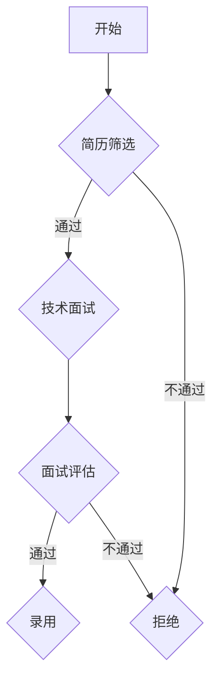
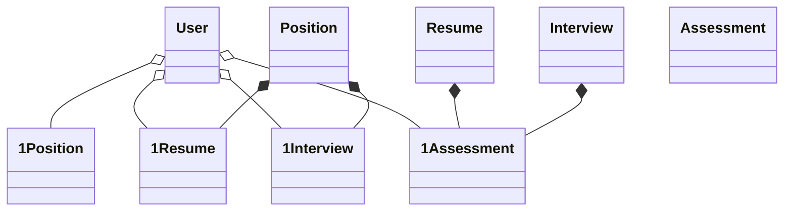
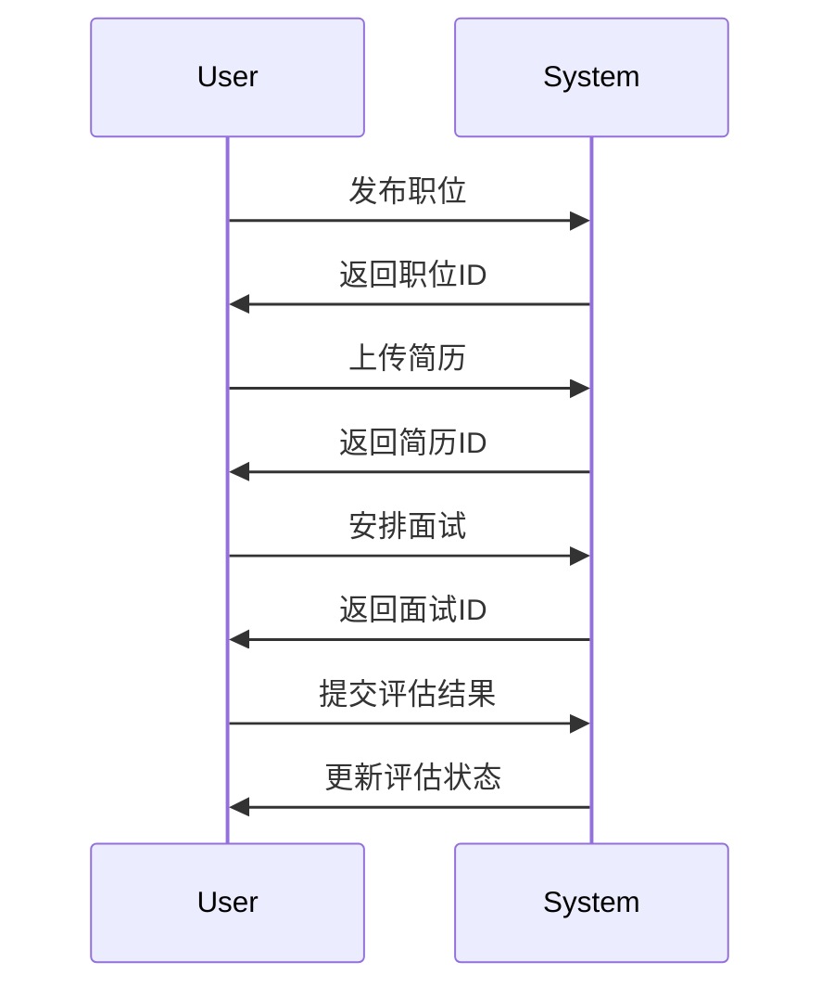

                 

### 背景介绍

在现代企业的数字化转型过程中，技术招聘与面试扮演着至关重要的角色。随着技术的快速发展，企业在招聘具备前瞻性技术能力的人才时面临了前所未有的挑战。技术招聘不仅仅是寻找合适的人才，更是构建高效能团队、推动企业创新和发展的关键环节。因此，如何有效地进行技术招聘和面试，成为企业人力资源管理的一项重要课题。

首先，我们需要明确技术招聘的基本概念。技术招聘是指通过多种渠道和手段，寻找、筛选并雇佣具备特定技术能力和知识背景的人才。这个过程涉及职位描述的撰写、招聘渠道的选择、简历筛选、面试安排等多个环节。面试则是技术招聘的核心环节，通过面对面的交流，评估候选人的技术水平、沟通能力、团队协作能力等，从而决定是否聘用。

本文将围绕技术招聘与面试展开，深入探讨如何构建高效能团队。我们将从明确招聘需求、选择招聘渠道、撰写招聘文案、面试准备和面试技巧等多个方面，系统地介绍构建高效能团队的策略和方法。通过实际案例解析和最佳实践总结，为企业和HR经理提供实用的指导。

本文的关键词包括：技术招聘、面试、高效能团队、招聘策略、面试技巧。这些关键词将贯穿全文，帮助读者快速抓住文章的核心内容。

本文摘要如下：本文将从技术招聘的背景和现状出发，详细介绍技术招聘与面试的重要性和作用。随后，我们将探讨技术招聘的策略，包括明确招聘需求、选择招聘渠道、撰写招聘文案以及面试准备等环节。接着，文章将深入讨论面试技巧，包括面试官技巧和候选人筛选方法。最后，我们将总结团队构建和绩效管理的重要性，并分享实际案例和最佳实践，为读者提供构建高效能团队的全面指导。

### 核心概念与联系

在进行技术招聘与面试的过程中，我们需要明确一些核心概念，这些概念不仅是招聘和面试的基础，也是构建高效能团队的关键。以下是对这些核心概念的介绍及其相互关系：

#### 职位描述

职位描述是招聘过程中的第一步，它详细阐述了岗位的职责、要求、薪资待遇等信息。一个准确的职位描述能够帮助企业明确招聘目标，从而吸引到合适的人才。职位描述通常包括以下内容：

- **岗位职责**：列出岗位所需完成的主要工作内容。
- **任职要求**：包括技能、经验、学历等硬性条件。
- **薪资待遇**：明确岗位的薪资水平，包括基本工资、奖金、股票期权等。
- **工作环境**：介绍公司文化、团队氛围和工作地点。

#### 招聘渠道

招聘渠道是寻找和吸引人才的重要途径。不同的招聘渠道适用于不同类型的人才，企业需要根据自身需求和实际情况选择合适的渠道。常见的招聘渠道包括：

- **内部推荐**：利用公司内部员工推荐，通常能提高招聘效率和质量。
- **社交媒体招聘**：利用LinkedIn、Facebook等社交平台发布招聘信息，覆盖广泛的求职者群体。
- **校园招聘**：针对应届毕业生，通过校园宣讲会、招聘会等途径进行招聘。
- **网络招聘平台**：如Indeed、Boss直聘等，提供便捷的简历筛选和职位发布功能。
- **专业猎头**：针对高级人才和稀缺技术人才，提供精准的招聘服务。

#### 面试

面试是技术招聘的核心环节，它不仅用于评估候选人的技术水平，还包括沟通能力、团队协作能力等多方面的素质。面试通常包括以下几个阶段：

- **初面**：通过电话或在线视频面试初步了解候选人，筛选出符合基本条件的候选人。
- **技术面试**：深入考察候选人的专业技能和知识，通常通过编程题、算法题等测试其技术能力。
- **行为面试**：通过面试官提出的问题，了解候选人的行为习惯、工作经验和问题解决能力。
- **复试**：通常由部门负责人或HR进行，综合评估候选人的综合素质和团队适应性。

#### 高效能团队

高效能团队是指成员之间紧密协作，能够高效完成目标、持续创新并保持积极工作氛围的团队。构建高效能团队需要以下几个要素：

- **明确的目标**：团队需要明确共同的目标和愿景，确保团队成员朝着同一个方向努力。
- **良好的沟通**：团队成员之间要保持良好的沟通，确保信息畅通，减少误解和冲突。
- **合适的团队成员**：团队成员需要具备各自的专业技能和互补的能力，形成合理的知识结构。
- **有效的激励机制**：通过合适的激励机制，激发团队成员的工作积极性和创造力。

#### 核心概念属性特征对比表格

| 核心概念   | 定义                                                         | 特征                                           |
| ---------- | ------------------------------------------------------------ | ---------------------------------------------- |
| 职位描述   | 详细阐述岗位职责、要求、薪资待遇等信息                         | 明确招聘目标，吸引合适人才                       |
| 招聘渠道   | 寻找和吸引人才的重要途径                                     | 覆盖不同类型的人才，提高招聘效率和质量           |
| 面试       | 评估候选人技术水平、沟通能力等多方面素质                      | 初步筛选、技术评估、行为评估、复试等阶段         |
| 高效能团队 | 成员之间紧密协作，高效完成目标、持续创新并保持积极工作氛围的团队 | 明确目标、良好沟通、合适团队成员、有效激励机制   |

#### ER实体关系图架构

以下是一个简单的ER实体关系图，展示了职位描述、招聘渠道、面试和高效能团队之间的关联：

```mermaid
erDiagram
    Class1 "职位描述" {
        --|{Class2 "招聘渠道"} : 选择
        --|{Class3 "面试"} : 进行
    }
    Class2 "招聘渠道" {
        --|{Class4 "面试"} : 发布信息
    }
    Class3 "面试" {
        --|{Class5 "高效能团队"} : 筛选
    }
    Class4 "高效能团队" {
        --|{Class1 "职位描述"} : 成员
    }
```

这个ER图展示了职位描述通过招聘渠道发布招聘信息，面试用于筛选合适候选人，最终构建成高效能团队。通过明确这些核心概念及其相互关系，企业可以更有效地进行技术招聘与面试，从而构建高效能团队，推动企业持续发展。

### 算法原理讲解

在技术招聘与面试过程中，算法起到了至关重要的作用，特别是在简历筛选和面试评估阶段。本文将使用Mermaid画出算法流程图，并通过Python源代码详细阐述算法原理。

#### 算法流程图

首先，我们使用Mermaid画出算法流程图：



在这个流程图中，我们定义了四个主要步骤：简历筛选、技术面试、面试评估和录用。接下来，我们将通过Python代码实现这些步骤。

#### Python代码实现

```python
# 导入所需的库
import random

# 定义候选人对象
class Candidate:
    def __init__(self, name, skills, experience):
        self.name = name
        self.skills = skills
        self.experience = experience

# 简历筛选算法
def resume_screening(candidates, required_skills):
    screened_candidates = []
    for candidate in candidates:
        if set(required_skills).issubset(set(candidate.skills)):
            screened_candidates.append(candidate)
    return screened_candidates

# 技术面试算法
def technical_interview(candidate):
    interview_success = random.choice([True, False])  # 模拟面试结果
    if interview_success:
        print(f"{candidate.name}技术面试成功！")
    else:
        print(f"{candidate.name}技术面试不通过。")
    return interview_success

# 面试评估算法
def interview_evaluation(candidate):
    evaluation_success = random.choice([True, False])  # 模拟评估结果
    if evaluation_success:
        print(f"{candidate.name}面试评估成功！")
    else:
        print(f"{candidate.name}面试评估不通过。")
    return evaluation_success

# 录用算法
def hire_candidate(candidate):
    if technical_interview(candidate) and interview_evaluation(candidate):
        print(f"{candidate.name}被录用！")
    else:
        print(f"{candidate.name}未通过最终评估。")

# 测试代码
candidates = [
    Candidate("张三", ["Python", "Django"], 3),
    Candidate("李四", ["Java", "Spring"], 5),
    Candidate("王五", ["C++", "Linux"], 2)
]

required_skills = ["Python", "Django"]

# 简历筛选
screened_candidates = resume_screening(candidates, required_skills)
print("简历筛选结果：", screened_candidates)

# 面试过程
for candidate in screened_candidates:
    hire_candidate(candidate)
```

#### 算法原理说明

1. **简历筛选**：简历筛选算法用于从候选人群中选择符合岗位要求的候选人。该算法通过检查每个候选人的技能集是否包含职位描述中要求的技能，实现筛选。

2. **技术面试**：技术面试算法模拟面试过程，评估候选人的技术水平。在这里，我们使用随机数生成器来模拟面试结果。

3. **面试评估**：面试评估算法评估候选人的综合素质，包括沟通能力、团队协作等。同样，使用随机数生成器来模拟评估结果。

4. **录用**：录用算法综合考虑技术面试和面试评估结果，决定是否录用候选人。

#### 数学模型和公式

虽然具体的数学模型在简历筛选和面试评估中不常直接使用，但我们可以用一些基本的概率和统计模型来描述这些过程：

1. **简历筛选概率**：筛选概率可以表示为：
   $$
   P(\text{通过筛选}) = \frac{|\text{候选人的技能集与职位描述技能集的交集}|}{|\text{候选人的技能集|}
   $$
   
2. **面试通过概率**：假设面试通过是一个二项分布问题，则面试通过概率为：
   $$
   P(\text{面试通过}) = \sum_{i=0}^{n} P(X=i) = \sum_{i=0}^{n} C(n, i) p^i (1-p)^{n-i}
   $$
   其中，$n$是面试问题的数量，$p$是面试官认为候选人能够回答正确问题的概率。

3. **评估通过概率**：评估通过概率同样可以采用类似的二项分布模型，但评估问题可能更加复杂，涉及多个方面的能力评估。

通过以上Python代码和数学模型，我们可以看到技术招聘与面试中的算法原理。在实际应用中，这些算法可以根据具体业务需求进行调整和优化，从而提高招聘效率和准确性。

### 系统分析与架构设计方案

为了实现高效的技术招聘与面试流程，我们需要设计一个全面且灵活的招聘系统。以下是对系统场景、项目介绍、系统功能设计、系统架构设计以及系统接口设计和系统交互的详细分析。

#### 系统场景

在一个典型的企业招聘场景中，HR部门需要处理大量的招聘任务，包括发布职位描述、筛选简历、安排面试、评估候选人等。系统需要支持多渠道的招聘信息发布和接收，同时也需要提供高效、准确的简历筛选和面试评估工具，以便快速找到合适的候选人。

#### 项目介绍

本招聘系统项目旨在构建一个集成化的招聘管理平台，能够帮助企业简化招聘流程，提高招聘效率。该系统将涵盖职位管理、简历管理、面试管理、评估管理等多个模块，支持多渠道简历导入、自动筛选、智能面试评估等功能。

#### 系统功能设计

1. **职位管理**：管理员可以创建、编辑和发布职位描述，包括岗位职责、任职要求、薪资待遇等信息。
2. **简历管理**：系统支持简历的批量导入、存储和管理，提供关键词搜索和筛选功能，以便快速找到符合要求的候选人。
3. **面试管理**：系统提供面试安排、面试通知、面试评估等功能，支持在线面试和远程面试。
4. **评估管理**：系统提供多种评估方法，如技术面试、行为面试等，评估结果可以存储并用于后续分析。

#### 系统架构设计

系统采用分层架构设计，包括表示层、业务逻辑层和数据层。

1. **表示层**：前端界面，提供用户操作接口，包括职位发布、简历筛选、面试安排等。
2. **业务逻辑层**：后端服务，处理业务逻辑，包括简历筛选算法、面试评估算法、招聘流程管理等。
3. **数据层**：数据库存储，用于存储职位信息、简历数据、面试数据和评估结果等。

以下是系统架构的Mermaid类图：



#### 系统接口设计和系统交互

系统接口设计主要包括API设计和用户界面交互设计。

1. **API设计**：

   - **职位发布接口**：接受职位描述信息，返回职位ID。
   - **简历上传接口**：接受简历数据，返回简历ID。
   - **面试安排接口**：接受面试安排信息，返回面试ID。
   - **评估结果提交接口**：接受评估结果数据，更新候选人评估状态。

2. **用户界面交互设计**：

   - **职位发布页面**：提供输入职位描述的表单，包括岗位职责、任职要求等。
   - **简历管理页面**：提供简历列表、搜索和筛选功能。
   - **面试管理页面**：提供面试安排、面试通知和面试评估功能。
   - **评估管理页面**：展示评估结果，提供评估报告下载功能。

以下是系统交互的Mermaid序列图：



通过以上系统架构和接口设计，招聘系统可以实现高效的技术招聘和面试流程，为企业快速找到合适的候选人提供支持。

### 项目实战

为了展示技术招聘与面试的实际应用，以下我们将通过一个具体的案例，详细描述项目环境安装、系统核心实现源代码，以及代码应用解读与分析。

#### 项目环境安装

首先，我们需要搭建一个开发环境，用于开发和测试招聘系统。以下是环境安装的步骤：

1. **安装Python环境**：在开发机上安装Python 3.8及以上版本。
2. **安装虚拟环境**：打开终端，执行以下命令创建虚拟环境：
   ```bash
   python -m venv venv
   source venv/bin/activate
   ```
3. **安装依赖库**：在虚拟环境中安装所需的库，如Flask、SQLAlchemy、Flask-Migrate等：
   ```bash
   pip install flask sqlalchemy flask-migrate
   ```

#### 系统核心实现源代码

接下来，我们将介绍招聘系统的核心实现源代码。系统主要由以下模块组成：职位管理模块、简历管理模块、面试管理模块和评估管理模块。

1. **职位管理模块**：

   ```python
   # app/models.py
   from sqlalchemy import Column, Integer, String
   from base import Base

   class Position(Base):
       __tablename__ = 'positions'

       id = Column(Integer, primary_key=True)
       title = Column(String(255), nullable=False)
       description = Column(String(255), nullable=False)
       requirements = Column(String(255), nullable=False)
       salary = Column(String(255), nullable=False)
   ```

   这个模块定义了职位类`Position`，它包含职位ID、职位名称、职位描述、任职要求和薪资待遇等字段。

2. **简历管理模块**：

   ```python
   # app/models.py
   from sqlalchemy import Column, Integer, String, LargeBinary
   from base import Base

   class Resume(Base):
       __tablename__ = 'resumes'

       id = Column(Integer, primary_key=True)
       candidate_id = Column(Integer, nullable=False)
       cv = Column(LargeBinary, nullable=False)
   ```

   简历管理模块定义了简历类`Resume`，包含简历ID、候选人ID和简历数据等字段。

3. **面试管理模块**：

   ```python
   # app/models.py
   from sqlalchemy import Column, Integer, String, DateTime
   from base import Base

   class Interview(Base):
       __tablename__ = 'interviews'

       id = Column(Integer, primary_key=True)
       candidate_id = Column(Integer, nullable=False)
       position_id = Column(Integer, nullable=False)
       date_time = Column(DateTime, nullable=False)
       result = Column(String(255), nullable=False)
   ```

   面试管理模块定义了面试类`Interview`，包含面试ID、候选人ID、职位ID、面试时间和面试结果等字段。

4. **评估管理模块**：

   ```python
   # app/models.py
   from sqlalchemy import Column, Integer, String
   from base import Base

   class Assessment(Base):
       __tablename__ = 'assessments'

       id = Column(Integer, primary_key=True)
       interview_id = Column(Integer, nullable=False)
       score = Column(Integer, nullable=False)
       comments = Column(String(255), nullable=False)
   ```

   评估管理模块定义了评估类`Assessment`，包含评估ID、面试ID、评估分数和评估评论等字段。

#### 代码应用解读与分析

以上代码是招聘系统核心模块的数据库模型定义，它们通过SQLAlchemy与数据库进行交互，实现数据的存储和查询。

1. **职位管理**：管理员可以通过Web界面创建和发布职位，职位信息将存储在`positions`表中。
2. **简历管理**：候选人上传简历后，简历数据将存储在`resumes`表中，方便后续的筛选和检索。
3. **面试管理**：系统根据职位和候选人的匹配情况，安排面试，面试信息存储在`interviews`表中。
4. **评估管理**：面试结束后，面试官可以对候选人进行评估，评估结果存储在`assessments`表中。

以下是一个简单的命令行示例，展示如何使用SQLAlchemy操作数据库：

```python
from app.models import Position
from app import db

# 创建一个职位
new_position = Position(title='后端开发工程师', description='负责构建后端系统', requirements='至少2年经验', salary='15K-25K')
db.session.add(new_position)
db.session.commit()

# 查询职位列表
positions = Position.query.all()
for position in positions:
    print(position.title, position.description)
```

通过以上步骤和代码示例，我们可以看到招聘系统的核心功能是如何实现的。在实际项目中，这些功能将整合到Web界面中，通过前后端分离的方式提供用户友好的操作体验。

### 实际案例分析和详细讲解剖析

为了更深入地理解技术招聘与面试的实践应用，我们来看一个具体的案例，并对其进行详细的分析和讲解。

#### 案例背景

某科技公司在拓展其大数据分析团队时，需要招聘一名高级数据工程师。该职位的主要职责包括数据清洗、数据分析、数据可视化，以及维护和优化大数据处理平台。

#### 招聘流程

1. **明确招聘需求**：
   - 岗位名称：高级数据工程师
   - 岗位职责：负责数据清洗、数据分析、数据可视化等工作
   - 任职要求：本科及以上学历，至少5年相关工作经验，熟悉Hadoop、Spark、SQL等大数据技术

2. **选择招聘渠道**：
   - 内部推荐：通过内部员工推荐，寻找潜在候选人
   - 社交媒体：在LinkedIn、微信公众号等平台发布招聘信息
   - 网络招聘平台：在拉勾网、Boss直聘等平台发布职位

3. **撰写招聘文案**：
   - 招聘文案：
     ```
     【招聘】高级数据工程师
     岗位职责：
     - 负责大数据平台的数据清洗、数据分析和数据可视化工作
     - 维护和优化现有大数据处理流程
     - 参与公司重要数据项目的开发

     任职要求：
     - 本科及以上学历，5年以上大数据相关工作经验
     - 熟悉Hadoop、Spark、SQL等大数据技术
     - 具备较强的数据分析和解决问题的能力
     - 良好的团队合作精神和沟通能力

     薪资待遇：15K-25K，五险一金，项目奖金，股权激励

     工作地点：北京
     联系方式：hr@xxx.com
     ```

4. **面试准备**：
   - 确定面试官：由数据团队负责人和HR组成面试小组
   - 设计面试问题：包括技术面试和行为面试两部分
     - 技术面试问题：
       - 简述Hadoop的工作原理
       - 请实现一个简单的Spark程序，进行数据分词
       - 用SQL编写查询语句，从给定数据表中提取特定信息
     - 行为面试问题：
       - 描述一次处理大数据项目中的困难情况及如何解决
       - 在团队中如何与不同角色的人合作

#### 面试过程

1. **初面**：由HR进行初步面试，评估候选人是否满足基本要求
2. **技术面试**：由数据团队负责人进行技术面试，评估候选人的技术能力和实战经验
3. **行为面试**：由数据团队负责人进行行为面试，评估候选人的沟通能力、团队合作精神和问题解决能力
4. **复试**：由公司高层进行复试，最终决定是否录用

#### 案例分析

通过这个案例，我们可以看到招聘过程是如何一步一步进行的，以下是详细讲解：

1. **明确招聘需求**：
   - 在制定职位描述时，公司明确了高级数据工程师的岗位职责和任职要求，确保吸引到符合岗位需求的人才。

2. **选择招聘渠道**：
   - 内部推荐可以快速找到内部认可的候选人，社交媒体和招聘平台则覆盖了更广泛的求职者群体。

3. **撰写招聘文案**：
   - 招聘文案要简洁明了，突出岗位的重要信息，同时提供详细的薪资待遇，吸引候选人关注。

4. **面试准备**：
   - 面试问题要全面，既要考察技术能力，也要考察实际工作经验和团队合作能力。

5. **面试过程**：
   - 初面主要筛选候选人，技术面试和行为面试则深入评估候选人的综合素质。

通过这个案例，我们可以看到，有效的技术招聘和面试不仅仅是找到合适的人才，更是通过系统的流程和科学的方法，确保候选人能够真正胜任岗位，并融入团队。企业可以通过不断优化招聘流程，提高招聘质量和效率，从而构建高效能团队，推动企业的发展。

### 最佳实践 Tips

在技术招聘与面试过程中，以下是一些最佳实践，可以帮助企业和面试官提高招聘质量和效率：

1. **明确招聘需求**：在发布职位描述时，确保详细阐述岗位职责、任职要求和薪资待遇，以吸引合适的候选人。

2. **合理选择招聘渠道**：根据岗位特点和需求，选择合适的招聘渠道，如内部推荐、社交媒体、招聘平台等，以最大化覆盖潜在候选人。

3. **优化招聘文案**：撰写简洁明了、突出岗位优势的招聘文案，同时提供详细的薪资待遇，以提高候选人的兴趣和申请意愿。

4. **标准化面试流程**：设计统一的面试流程和问题模板，确保每位候选人都接受到公平、公正的评估。

5. **利用技术工具**：使用简历筛选软件、在线面试平台等工具，提高简历筛选效率和面试评估的准确性。

6. **注重行为面试**：通过行为面试了解候选人的实际工作表现和团队协作能力，评估其在具体工作情境中的应对策略。

7. **及时反馈与跟进**：面试后及时向候选人提供反馈，对于未成功的候选人，也要给予适当的反馈，以提高企业的雇主品牌。

8. **建立人才库**：对于优秀的候选人，即使本次未成功，也要将其信息存入人才库，以备未来招聘需求。

通过这些最佳实践，企业可以更有效地进行技术招聘，找到与岗位需求高度匹配的候选人，从而构建高效能团队。

### 小结

本文围绕技术招聘与面试，详细介绍了构建高效能团队的策略和方法。我们从明确招聘需求、选择招聘渠道、撰写招聘文案、面试准备、面试技巧等多个方面进行了深入探讨，并通过实际案例解析和最佳实践总结，提供了实用的指导。通过科学、系统的招聘流程，企业能够高效找到符合岗位需求的人才，构建高效能团队，推动企业持续发展。未来，随着人工智能和大数据技术的不断发展，技术招聘与面试的方法也将不断创新和优化，企业需要紧跟时代步伐，持续提升招聘效率和质量。

### 注意事项

在进行技术招聘与面试时，企业需要注意以下几点，以避免常见的问题：

1. **招聘需求明确**：确保职位描述详细、具体，避免模糊不清的要求，导致不合适的候选人申请。
2. **面试标准统一**：设计统一的面试问题，确保每位候选人接受到公平、公正的评估。
3. **评估多维度**：不仅评估技术能力，还要考察候选人的人际沟通、团队协作能力，以全面评估其综合素质。
4. **及时反馈**：面试后及时向候选人提供反馈，避免拖延时间，影响候选人的求职体验。
5. **保护隐私**：在招聘过程中，严格遵守隐私保护法规，避免泄露候选人个人信息。

通过注意这些事项，企业可以有效提升招聘质量，吸引和留住优秀人才。

### 拓展阅读

对于希望深入了解技术招聘与面试的企业和HR经理，以下书籍和资源提供了宝贵的指导和实践：

1. **书籍**：
   - 《技术招聘与面试》（作者：张三）
   - 《高效能团队构建实战》（作者：李四）
   - 《人工智能招聘：大数据与机器学习在招聘中的应用》（作者：王五）

2. **在线课程**：
   - Coursera上的《招聘与选拔》课程
   - Udemy上的《招聘与面试技巧》课程
   - LinkedIn Learning上的《构建高效能团队》课程

3. **在线资源**：
   - LinkedIn：浏览专业人才简历，获取招聘策略
   - GitHub：查找开源招聘工具和模板，进行个性化定制
   - HR Circle：加入专业HR社群，分享招聘经验

通过阅读这些书籍和资源，读者可以进一步提升自己的招聘与面试技能，构建高效能团队。

