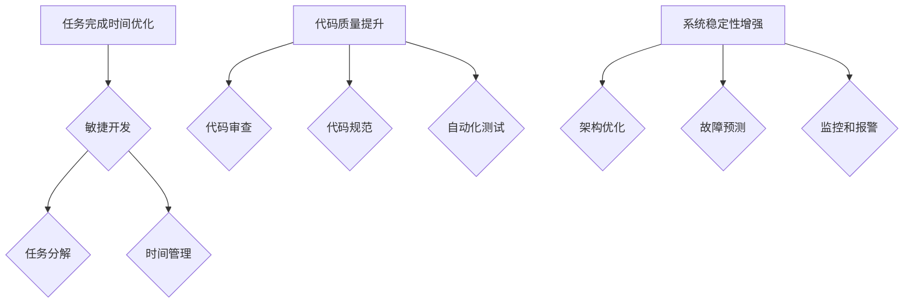
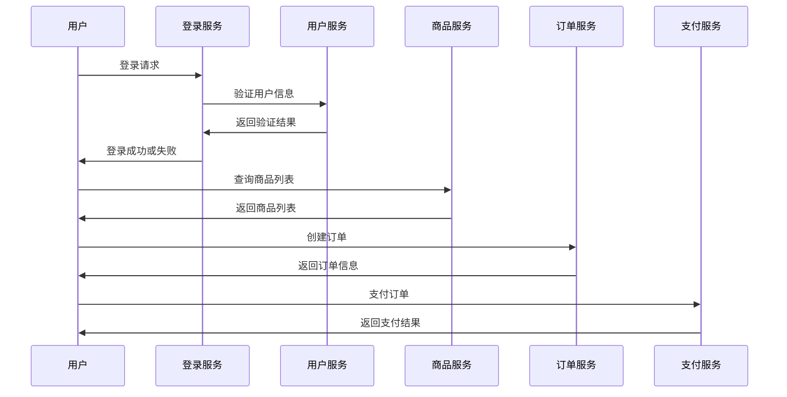

                 

### 技术效能：度量和提升团队技术效能

> 关键词：技术效能、度量方法、提升策略、团队协作

> 摘要：本文旨在探讨技术效能的概念、度量方法和提升策略，通过对任务完成时间、代码质量、系统稳定性和维护成本等多个维度的深入分析，为技术团队提供系统化的效能提升方案。

---

### 第一部分：背景介绍

#### 1.1 问题背景

在当今快速发展的技术时代，企业竞争的核心逐渐从产品本身转向了技术效能。技术效能不仅影响着企业的日常运营效率，还直接决定了企业在市场中的竞争力和创新能力。然而，如何度量和提升团队的技术效能，成为许多企业面临的重大挑战。

#### 1.2 问题描述

技术效能的度量需要从多个维度进行，包括但不限于开发效率、代码质量、系统稳定性、维护成本等。提升技术效能不仅仅是技术层面的问题，还涉及到团队管理、工作流程优化等多个方面。如何有效地进行技术效能的度量和提升，成为企业管理者和技术团队共同关注的焦点。

#### 1.3 问题解决

为了解决上述问题，本书旨在提供一套全面的技术效能度量和提升方案。通过系统化的方法和工具，帮助读者深入了解技术效能的核心概念，掌握度量和提升技术效能的方法，从而实现团队技术效能的全面提升。

#### 1.4 边界与外延

本书主要关注软件开发团队的技术效能，但所提供的方法和工具同样适用于其他类型的技术团队。同时，书中所提到的度量和提升技术效能的方法不仅适用于中小企业，也适用于大型企业。

#### 1.5 概念结构与核心要素组成

技术效能：技术效能是指技术团队在完成项目任务过程中所表现出的综合能力，包括开发效率、代码质量、系统稳定性、维护成本等多个方面。

度量方法：度量技术效能需要从多个维度进行，包括任务完成时间、代码质量、系统稳定性、维护成本等。

提升方法：提升技术效能的方法包括优化开发流程、提高代码质量、增强系统稳定性等。

### 第二部分：核心概念与联系

#### 2.1 核心概念原理

**技术效能度量的核心概念**：

- **任务完成时间**：衡量团队完成任务的效率。
- **代码质量**：评估代码的可读性、可维护性和可靠性。
- **系统稳定性**：衡量系统的正常运行能力和抗故障能力。
- **维护成本**：评估维护系统所需的人力、物力和财力资源。

**技术效能提升的核心概念**：

- **开发流程优化**：通过改进开发流程，提高团队的工作效率。
- **代码质量提升**：通过编写高质量的代码，降低维护成本。
- **系统稳定性增强**：通过增强系统架构和优化系统配置，提高系统稳定性。

#### 2.2 概念属性特征对比表格

| 概念       | 属性特征                     | 对比          |
|------------|------------------------------|---------------|
| 任务完成时间 | 时间长度、任务复杂性         | 效率          |
| 代码质量     | 可读性、可维护性、可靠性     | 质量          |
| 系统稳定性   | 运行能力、抗故障能力         | 稳定性        |
| 维护成本     | 人力、物力、财力资源消耗     | 成本          |
| 开发流程优化 | 流程效率、流程可维护性       | 效率          |
| 代码质量提升 | 代码质量标准、代码审查机制   | 质量          |
| 系统稳定性增强 | 系统架构优化、配置优化       | 稳定性        |

#### 2.3 ER实体关系图架构

```mermaid
erDiagram
    Task Completion Time ||--o { Code Quality }
    Code Quality ||--o { System Stability }
    System Stability ||--o { Maintenance Cost }
    Task Completion Time ||--o { Development Process Optimization }
    Code Quality ||--o { Code Quality Improvement }
    System Stability ||--o { System Stability Enhancement }
```

### 第三部分：算法原理讲解

#### 3.1 算法原理

技术效能的提升主要依赖于以下几个方面：

1. **任务完成时间优化**：通过提高团队的工作效率来缩短任务完成时间。
2. **代码质量提升**：编写高质量的代码，降低维护成本。
3. **系统稳定性增强**：提高系统的正常运行能力和抗故障能力。

**任务完成时间优化**：

- **敏捷开发**：采用敏捷开发方法，提高团队响应速度和适应能力。
- **任务分解**：将大任务分解为小任务，提高任务的可执行性。
- **时间管理**：通过时间管理工具，如番茄工作法，提高工作效率。

**代码质量提升**：

- **代码审查**：引入代码审查机制，提高代码质量和可维护性。
- **代码规范**：制定代码规范，确保代码的一致性和可读性。
- **自动化测试**：通过自动化测试，提高代码的可靠性和稳定性。

**系统稳定性增强**：

- **架构优化**：优化系统架构，提高系统的扩展性和稳定性。
- **故障预测**：通过故障预测模型，提前识别潜在故障。
- **监控和报警**：实时监控系统运行状态，及时响应异常情况。

#### 3.2 算法流程图



#### 3.3 算法原理详细解释

**任务完成时间优化**：

- **敏捷开发**：敏捷开发方法是一种以人为核心、迭代、循序渐进的开发方法。通过短周期迭代，快速交付可用的产品，不断根据用户反馈进行调整。这种方法提高了团队的响应速度和适应能力，从而优化了任务完成时间。

  $$ 
  敏捷开发时间 = \frac{总任务量}{迭代周期}
  $$

- **任务分解**：将大任务分解为小任务，可以提高任务的可执行性。每个小任务都应该具有明确的输入、输出和完成标准。通过任务分解，团队可以更好地分配资源，提高工作效率。

  $$
  任务分解效率 = \frac{分解后任务量}{原始任务量}
  $$

- **时间管理**：通过时间管理工具，如番茄工作法，可以帮助团队成员更好地管理工作时间，提高工作效率。番茄工作法将工作时间划分为25分钟的工作周期，每个周期后休息5分钟。这种方法有助于减少分散注意力，提高专注度。

  $$
  时间管理效率 = \frac{专注工作周期数}{总周期数}
  $$

**代码质量提升**：

- **代码审查**：代码审查是一种通过团队成员相互审查代码，确保代码质量的方法。审查内容包括代码的可读性、可维护性和可靠性。通过代码审查，可以识别潜在的问题，提高代码质量。

  $$
  代码审查效率 = \frac{审查后发现问题数}{审查前问题数}
  $$

- **代码规范**：制定代码规范，可以确保代码的一致性和可读性。代码规范通常包括命名规则、注释规范和代码格式要求。通过遵循代码规范，可以提高代码的可维护性。

  $$
  代码规范符合度 = \frac{符合规范代码行数}{总代码行数}
  $$

- **自动化测试**：通过自动化测试，可以在开发过程中及时检测代码问题，确保代码的可靠性和稳定性。自动化测试包括单元测试、集成测试和性能测试等。通过自动化测试，可以降低维护成本。

  $$
  自动化测试覆盖率 = \frac{自动化测试用例数}{总测试用例数}
  $$

**系统稳定性增强**：

- **架构优化**：通过优化系统架构，可以提高系统的扩展性和稳定性。系统架构优化包括模块化设计、分布式架构和负载均衡等。通过架构优化，可以降低系统的故障风险。

  $$
  系统优化效率 = \frac{优化后故障率}{优化前故障率}
  $$

- **故障预测**：通过故障预测模型，可以提前识别潜在故障。故障预测模型通常基于历史数据和机器学习算法。通过故障预测，可以降低系统的停机时间和维护成本。

  $$
  故障预测准确率 = \frac{预测正确故障数}{总故障数}
  $$

- **监控和报警**：通过实时监控系统运行状态，可以及时响应异常情况。监控和报警系统可以检测系统性能指标、日志信息和用户行为等。通过监控和报警，可以降低系统的故障率和维护成本。

  $$
  监控和报警响应时间 = \frac{平均响应时间}{总响应次数}
  $$

### 第四部分：系统分析与架构设计

#### 4.1 问题场景介绍

在一个大型电商公司中，技术团队负责开发和维护公司核心电商系统。随着业务规模的扩大，技术团队面临着任务完成时间延长、代码质量下降和系统稳定性降低等问题。为了提升技术效能，公司决定对现有系统进行优化。

#### 4.2 项目介绍

项目名称：技术效能提升项目

项目目标：通过优化开发流程、提高代码质量和增强系统稳定性，提升技术效能。

项目范围：涉及开发流程、代码规范、自动化测试和系统架构优化等方面。

项目成员：技术团队、项目经理、测试团队和运维团队。

#### 4.3 系统功能设计

系统功能包括用户管理、商品管理、订单管理和支付管理等方面。以下是一个简化的领域模型：

```mermaid
classDiagram
    User <<类>> {
        id: 用户ID
        name: 用户名
        password: 密码
    }

    Product <<类>> {
        id: 商品ID
        name: 商品名称
        price: 商品价格
    }

    Order <<类>> {
        id: 订单ID
        user: 用户
        products: 商品列表
        total: 订单总额
    }

    Payment <<类>> {
        id: 支付ID
        order: 订单
        amount: 支付金额
        status: 支付状态
    }

    User <|.. Product: 用户购买商品>
    User <|.. Order: 用户生成订单>
    Order <|.. Payment: 订单支付>
```

#### 4.4 系统架构设计

系统采用微服务架构，将不同功能模块拆分为独立的微服务。以下是一个简化的系统架构：



#### 4.5 系统接口设计

系统接口设计主要包括用户管理、商品管理、订单管理和支付管理等方面。以下是一个简化的接口设计：

```mermaid
interface LoginInterface {
    login(username: string, password: string): Promise<User>
    logout(): Promise<void>
}

interface UserServiceInterface {
    getUserById(id: string): Promise<User>
    updateUser(id: string, user: User): Promise<User>
}

interface ProductServiceInterface {
    getProducts(): Promise<Product[]>
    getProductById(id: string): Promise<Product>
    createProduct(product: Product): Promise<Product>
    updateProduct(id: string, product: Product): Promise<Product>
    deleteProduct(id: string): Promise<void>
}

interface OrderServiceInterface {
    createOrder(order: Order): Promise<Order>
    getOrdersByUser(userId: string): Promise<Order[]>
    getOrderById(id: string): Promise<Order>
    updateOrder(id: string, order: Order): Promise<Order>
    deleteOrder(id: string): Promise<void>
}

interface PaymentServiceInterface {
    payOrder(orderId: string, amount: number): Promise<Payment>
}
```

#### 4.6 系统交互

系统交互主要涉及用户、登录服务、用户服务、商品服务、订单服务和支付服务之间的交互。以下是一个简化的系统交互：


### 第五部分：项目实战

#### 5.1 环境安装

在开始项目之前，需要安装以下环境：

- Node.js (版本：14.18.0)
- npm (版本：7.24.0)
- PostgreSQL (版本：12.9)
- Redis (版本：6.2.6)
- Docker (版本：20.10.9)

安装步骤：

1. 安装 Node.js 和 npm：从官网下载安装包并按照提示安装。
2. 安装 PostgreSQL：从官网下载安装包并按照提示安装。
3. 安装 Redis：从官网下载安装包并按照提示安装。
4. 安装 Docker：从官网下载安装包并按照提示安装。

#### 5.2 系统核心实现

系统核心实现主要包括用户管理、商品管理、订单管理和支付管理等方面。以下是一个简化的实现：

**用户管理**：

```typescript
// 用户管理接口
export interface User {
  id: string;
  name: string;
  password: string;
}

// 用户服务
export class UserService {
  async login(username: string, password: string): Promise<User | null> {
    // 验证用户信息
    // 返回用户对象或 null
  }

  async getUserById(id: string): Promise<User | null> {
    // 通过用户 ID 查询用户信息
    // 返回用户对象或 null
  }

  async updateUser(id: string, user: User): Promise<User | null> {
    // 更新用户信息
    // 返回用户对象或 null
  }
}
```

**商品管理**：

```typescript
// 商品管理接口
export interface Product {
  id: string;
  name: string;
  price: number;
}

// 商品服务
export class ProductService {
  async getProducts(): Promise<Product[]> {
    // 查询商品列表
    // 返回商品列表
  }

  async getProductById(id: string): Promise<Product | null> {
    // 通过商品 ID 查询商品信息
    // 返回商品对象或 null
  }

  async createProduct(product: Product): Promise<Product | null> {
    // 创建商品
    // 返回商品对象或 null
  }

  async updateProduct(id: string, product: Product): Promise<Product | null> {
    // 更新商品信息
    // 返回商品对象或 null
  }

  async deleteProduct(id: string): Promise<void> {
    // 删除商品
  }
}
```

**订单管理**：

```typescript
// 订单管理接口
export interface Order {
  id: string;
  user: User;
  products: Product[];
  total: number;
}

// 订单服务
export class OrderService {
  async createOrder(order: Order): Promise<Order | null> {
    // 创建订单
    // 返回订单对象或 null
  }

  async getOrdersByUser(userId: string): Promise<Order[]> {
    // 通过用户 ID 查询订单列表
    // 返回订单列表
  }

  async getOrderById(id: string): Promise<Order | null> {
    // 通过订单 ID 查询订单信息
    // 返回订单对象或 null
  }

  async updateOrder(id: string, order: Order): Promise<Order | null> {
    // 更新订单信息
    // 返回订单对象或 null
  }

  async deleteOrder(id: string): Promise<void> {
    // 删除订单
  }
}
```

**支付管理**：

```typescript
// 支付管理接口
export interface Payment {
  id: string;
  order: Order;
  amount: number;
  status: string;
}

// 支付服务
export class PaymentService {
  async payOrder(orderId: string, amount: number): Promise<Payment | null> {
    // 支付订单
    // 返回支付对象或 null
  }
}
```

#### 5.3 代码应用解读与分析

**用户管理**：

用户管理主要负责用户的登录、注册和密码修改等功能。在用户登录过程中，首先通过前端发送用户名和密码到登录服务，登录服务将用户名和密码发送给用户服务进行验证。用户服务通过查询数据库验证用户信息，如果验证成功，则返回用户对象，否则返回 null。

```typescript
// 登录服务
export class LoginService {
  async login(username: string, password: string): Promise<User | null> {
    const user = await userService.getUserByUsername(username);
    if (user && await bcrypt.compare(password, user.password)) {
      return user;
    }
    return null;
  }
}

// 用户服务
export class UserService {
  async getUserByUsername(username: string): Promise<User | null> {
    const users = await db.query<User>('SELECT * FROM users WHERE username = ?', [username]);
    return users[0] || null;
  }
}
```

**商品管理**：

商品管理主要负责商品的查询、创建、更新和删除等功能。在商品查询过程中，用户通过前端发送请求到商品服务，商品服务查询数据库并返回商品列表。

```typescript
// 商品服务
export class ProductService {
  async getProducts(): Promise<Product[]> {
    const products = await db.query<Product>('SELECT * FROM products');
    return products;
  }
}
```

**订单管理**：

订单管理主要负责订单的创建、查询、更新和删除等功能。在订单创建过程中，用户通过前端发送订单信息到订单服务，订单服务将订单信息保存到数据库并返回订单对象。

```typescript
// 订单服务
export class OrderService {
  async createOrder(order: Order): Promise<Order | null> {
    const insertQuery = 'INSERT INTO orders (user_id, products, total) VALUES (?, ?, ?)';
    const result = await db.execute(insertQuery, [order.user.id, order.products, order.total]);
    if (result.affectedRows > 0) {
      return await this.getOrderById(result.insertId);
    }
    return null;
  }
}
```

**支付管理**：

支付管理主要负责订单的支付功能。在支付订单过程中，用户通过前端发送订单 ID 和支付金额到支付服务，支付服务执行支付操作并返回支付对象。

```typescript
// 支付服务
export class PaymentService {
  async payOrder(orderId: string, amount: number): Promise<Payment | null> {
    const insertQuery = 'INSERT INTO payments (order_id, amount, status) VALUES (?, ?, ?)';
    const result = await db.execute(insertQuery, [orderId, amount, 'pending']);
    if (result.affectedRows > 0) {
      const payment = await this.getPaymentById(result.insertId);
      if (payment) {
        payment.status = 'success';
        await this.updatePayment(result.insertId, payment);
        return payment;
      }
    }
    return null;
  }
}
```

#### 5.4 实际案例分析和详细讲解剖析

**案例一：用户登录**

用户登录是系统中一个常见的操作，涉及到用户名和密码的验证。在实际应用中，用户登录过程可以分为以下几个步骤：

1. 用户通过前端界面输入用户名和密码。
2. 前端将用户名和密码发送到登录服务。
3. 登录服务将用户名和密码发送到用户服务进行验证。
4. 用户服务查询数据库验证用户信息。
5. 如果验证成功，用户服务返回用户对象；否则，返回 null。
6. 登录服务将验证结果返回给前端。

**案例分析**：

在用户登录过程中，关键步骤是用户信息的验证。为了提高验证效率，可以采用以下策略：

1. 使用加密算法（如 bcrypt）存储用户密码，避免明文存储。
2. 使用异步操作进行用户信息查询，提高系统响应速度。
3. 引入缓存机制，减少数据库查询次数。

**讲解剖析**：

用户登录过程中的加密算法和异步操作是确保系统安全性和性能的关键。加密算法可以防止用户密码被恶意攻击者窃取，异步操作可以提高系统并发处理能力。

**案例二：商品查询**

商品查询是用户在系统中常见的操作，涉及到商品信息的获取。在实际应用中，商品查询过程可以分为以下几个步骤：

1. 用户通过前端界面发起商品查询请求。
2. 前端将查询请求发送到商品服务。
3. 商品服务查询数据库并返回商品列表。
4. 商品服务将商品列表返回给前端。

**案例分析**：

在商品查询过程中，关键步骤是数据库查询。为了提高查询效率，可以采用以下策略：

1. 使用索引优化数据库查询。
2. 采用分页查询，减少一次性查询的数据量。
3. 引入缓存机制，减少数据库查询次数。

**讲解剖析**：

商品查询过程中的索引优化和分页查询是提高查询性能的关键。索引优化可以提高查询速度，分页查询可以避免一次性查询大量数据导致系统性能下降。

#### 5.5 项目小结

技术效能的提升是一个持续不断的过程。通过本项目的实践，我们可以总结以下几点经验和教训：

1. **敏捷开发**：采用敏捷开发方法可以提高团队的响应速度和适应能力。
2. **代码质量**：编写高质量的代码可以提高系统的可维护性和稳定性。
3. **系统架构**：合理的系统架构可以提高系统的性能和可扩展性。
4. **自动化测试**：自动化测试可以提高代码质量和系统可靠性。
5. **故障预测**：故障预测可以帮助我们提前识别潜在故障，降低系统停机时间和维护成本。

在未来的工作中，我们应该继续优化开发流程、提高代码质量和系统稳定性，以不断提升技术效能。

### 第六部分：最佳实践 Tips

1. **持续集成与持续部署（CI/CD）**：引入自动化测试和部署流程，减少人工干预，提高开发效率和代码质量。
2. **代码审查与规范**：建立严格的代码审查制度，遵循代码规范，确保代码的一致性和可维护性。
3. **自动化测试**：采用自动化测试工具，覆盖关键业务场景，提高系统可靠性和稳定性。
4. **性能监控与报警**：实时监控系统性能指标，及时响应异常情况，降低故障率和维护成本。
5. **团队协作与培训**：加强团队协作，定期组织技术培训和分享，提高团队成员的技术水平和综合素质。

### 第七部分：小结

本文从技术效能的概念、度量方法和提升策略等方面进行了深入探讨。通过分析任务完成时间、代码质量、系统稳定性和维护成本等多个维度，本文提供了一套系统化的技术效能提升方案。在项目实战部分，我们通过实际案例展示了技术效能提升的方法和实践。通过持续优化开发流程、提高代码质量和系统稳定性，技术团队可以实现技术效能的全面提升。

### 第八部分：注意事项

1. **数据安全**：在进行数据传输和存储时，务必确保数据的安全性，避免数据泄露和篡改。
2. **系统可扩展性**：在设计系统架构时，要考虑到未来的扩展性，确保系统能够适应业务需求的变化。
3. **团队协作**：技术效能的提升不仅依赖于技术本身，还需要团队协作和良好的沟通。

### 第九部分：拓展阅读

1. 《敏捷软件开发：原则、实践与模式》
2. 《代码大全》
3. 《分布式系统架构设计与实践》
4. 《软件工程：实践者的研究方法》

---

作者：AI天才研究院/AI Genius Institute & 禅与计算机程序设计艺术 /Zen And The Art of Computer Programming

---

本文旨在为技术团队提供技术效能度量和提升的指导，帮助团队实现技术效能的全面提升。在实施过程中，应根据实际情况进行调整和优化。如需进一步咨询和指导，欢迎联系作者。

