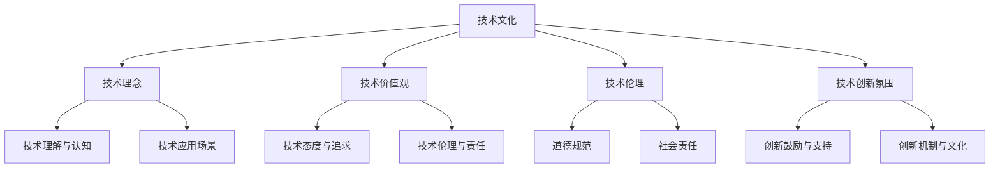
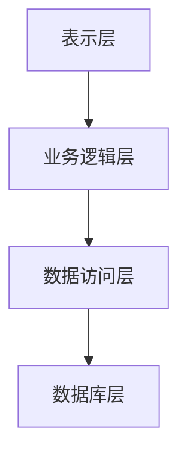
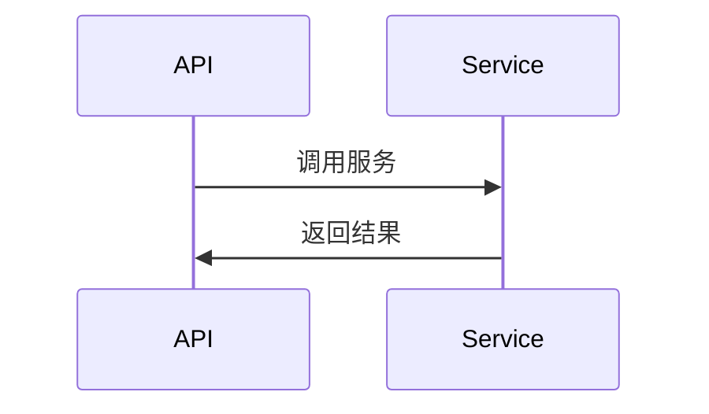
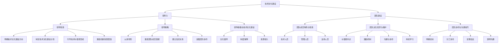
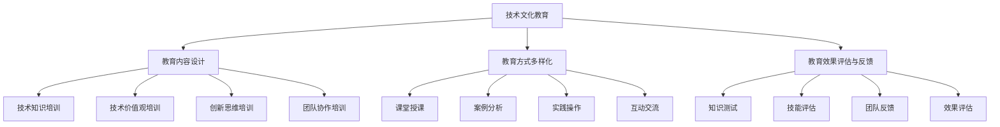
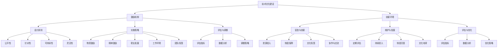
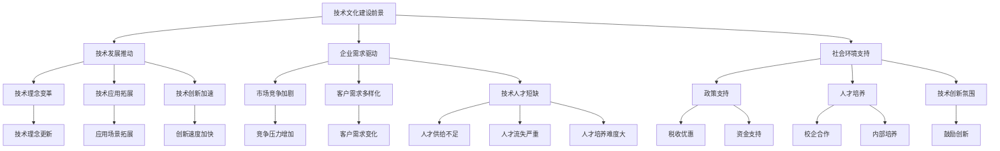

                 

### 文章标题

# 技术文化建设：打造高效能开发团队

关键词：技术文化建设、高效能开发团队、领导力、激励机制、创新环境

摘要：本文将深入探讨技术文化建设的意义与重要性，分析技术文化的核心概念与要素，介绍技术文化建设的方法与策略，探讨领导力与团队建设在其中的关键作用，以及技术文化建设中的教育与培训、激励机制与创新环境的实施策略。通过成功案例和实践探索，总结技术文化建设的前景与挑战，为打造高效能开发团队提供有力支持。

---

## 第一部分：技术文化建设的意义与重要性

### 第1章：技术文化建设的背景与意义

#### 1.1 技术文化建设的背景

在当今这个技术快速发展的时代，企业竞争的核心逐渐从资源、资本等传统要素转向了技术和人才。技术文化建设在这一背景下显得尤为重要。

##### 1.1.1 技术发展的现状与趋势

随着互联网、大数据、人工智能等新兴技术的崛起，技术领域的创新速度不断加快。企业要想保持竞争力，必须紧跟技术发展的步伐，不断创新和优化自己的技术能力。

##### 1.1.2 企业面临的技术挑战

技术挑战主要体现在以下几个方面：

1. 技术复杂度的提高：新技术不断涌现，技术复杂性不断增加，要求开发者具备更高的技术水平。
2. 技术更新换代速度加快：技术更新周期缩短，企业需要不断进行技术迭代和升级。
3. 技术人才短缺：高技能人才供不应求，企业面临着人才短缺的困境。

##### 1.1.3 技术文化建设的重要性

技术文化建设是应对上述挑战的重要手段。它不仅有助于提高团队的技术能力和创新水平，还能增强企业的核心竞争力。

1. **提升团队技术能力**：通过技术文化建设，可以培养团队成员的技术素养，提高团队的整体技术水平。
2. **增强创新氛围**：技术文化建设能够营造一个鼓励创新、容忍失败的环境，激发团队成员的创新潜能。
3. **提高企业竞争力**：技术文化建设有助于企业保持技术领先地位，提高市场竞争力。

### 第2章：技术文化的核心概念与要素

#### 2.1 技术文化的定义与内涵

##### 2.1.1 技术文化的定义

技术文化是指企业内部围绕技术发展、技术应用和技术创新而形成的一种共同价值观、行为规范和氛围。

##### 2.1.2 技术文化的内涵

技术文化包括以下几个方面：

1. 技术理念：企业对技术的理解和认知，包括技术的重要性、技术的应用场景等。
2. 技术价值观：企业对技术的态度和追求，包括技术伦理、技术创新等。
3. 技术伦理：企业在技术应用过程中遵循的道德规范和价值观。
4. 技术创新氛围：企业内部对创新的鼓励和支持，包括创新机制、创新文化等。

#### 2.2 技术文化的核心要素

##### 2.2.1 技术理念

技术理念是企业技术文化的基础，它决定了企业的技术发展方向和技术追求。

##### 2.2.2 技术价值观

技术价值观是企业对技术的态度和信仰，它反映了企业的技术伦理和技术创新精神。

##### 2.2.3 技术伦理

技术伦理是企业在技术应用过程中必须遵循的道德规范和价值观，它关乎企业的社会责任和可持续发展。

##### 2.2.4 技术创新氛围

技术创新氛围是企业内部对创新的鼓励和支持，它是企业技术文化的重要组成部分，直接影响到企业的创新能力。

### 第3章：技术文化建设的方法与策略

#### 3.1 技术文化建设的基本原则

##### 3.1.1 整合性原则

技术文化建设应与企业战略、组织结构、人才培养等紧密结合，形成统一的整体。

##### 3.1.2 可持续性原则

技术文化建设需要长期坚持，确保其能够持续发展。

##### 3.1.3 开放性原则

技术文化建设应鼓励外部交流和学习，吸收先进的技术理念和管理经验。

##### 3.1.4 人本原则

技术文化建设应以人为中心，关注团队成员的成长和发展。

#### 3.2 技术文化建设的实施步骤

##### 3.2.1 明确技术文化建设的目标

明确技术文化建设的目标是实施技术文化建设的首要任务，它为后续工作提供了明确的方向。

##### 3.2.2 调查分析当前技术文化现状

通过调查分析，了解企业当前的技术文化现状，找出存在的问题和不足。

##### 3.2.3 制定技术文化建设计划

根据目标和技术文化现状，制定详细的技术文化建设计划，明确实施步骤和时间表。

##### 3.2.4 推动技术文化的传播与实践

通过多种渠道和方式，推动技术文化的传播和实践，确保技术文化能够在企业内部得到有效落地。

## 第二部分：技术文化建设的关键环节

### 第4章：技术文化建设中的领导力与团队建设

#### 4.1 技术文化建设中的领导力

##### 4.1.1 技术文化建设的领导职责

领导者需要明确技术文化建设的职责，将技术文化建设纳入企业战略规划，确保其得到有效实施。

##### 4.1.2 技术文化建设中的领导策略

领导者应采用合适的领导策略，推动技术文化的建设，包括树立榜样、激励团队成员等。

##### 4.1.3 领导者如何推动技术文化建设

领导者应积极参与技术文化建设，成为技术文化的倡导者和推动者，为团队树立正确的技术价值观。

#### 4.2 技术文化建设中的团队建设

##### 4.2.1 团队成员的角色与职责

团队成员需要明确自己的角色和职责，积极参与技术文化建设，共同推动团队的技术发展。

##### 4.2.2 团队文化的培养与维护

团队文化是技术文化建设的重要组成部分，通过培养和维护团队文化，可以增强团队的凝聚力和向心力。

##### 4.2.3 团队协作与沟通技巧

有效的团队协作和沟通是技术文化建设的重要保障，通过提高团队协作和沟通技巧，可以提升团队的整体效能。

### 第5章：技术文化建设中的教育与培训

#### 5.1 技术文化教育的意义与目标

##### 5.1.1 技术文化教育的意义

技术文化教育是技术文化建设的重要环节，它有助于提高团队成员的技术素养和文化认同。

##### 5.1.2 技术文化教育的目标

技术文化教育的目标包括提高团队成员的技术能力、培养正确的技术价值观、增强团队的文化认同等。

#### 5.2 技术文化教育的实施策略

##### 5.2.1 教育内容的设计与安排

根据技术文化教育的目标，设计合适的教育内容，合理安排教育时间和方式。

##### 5.2.2 教育方式的多样化

采用多样化的教育方式，如培训、研讨会、案例分享等，提高教育的效果。

##### 5.2.3 教育效果的评估与反馈

通过评估教育效果，及时调整教育内容和方式，确保技术文化教育的有效性。

### 第6章：技术文化建设中的激励机制与创新环境

#### 6.1 技术文化建设的激励机制

##### 6.1.1 激励机制的设计原则

激励机制应遵循公平、激励、竞争、可持续等原则，确保能够激发团队成员的积极性和创造力。

##### 6.1.2 激励机制的实施策略

根据不同团队成员的需求和特点，制定个性化的激励机制，确保其能够有效激励团队成员。

##### 6.1.3 激励机制的评估与调整

定期评估激励机制的实施效果，根据评估结果进行调整和优化，确保其能够持续激励团队成员。

#### 6.2 技术文化建设中的创新环境

##### 6.2.1 创新环境的营造

创新环境的营造是技术文化建设的重要任务，通过营造良好的创新氛围，可以激发团队成员的创新潜能。

##### 6.2.2 创新环境的维护与发展

创新环境需要持续维护和发展，通过定期举办创新活动、搭建创新平台等方式，不断提升创新环境的质量。

##### 6.2.3 创新环境的评估与优化

定期评估创新环境的实施效果，根据评估结果进行优化和调整，确保创新环境能够持续激发团队成员的创新活力。

### 第7章：技术文化建设的案例与实践

#### 7.1 技术文化建设的成功案例

##### 7.1.1 案例介绍

通过介绍成功案例，可以了解技术文化建设在不同企业中的应用和实践，为其他企业提供借鉴和参考。

##### 7.1.2 案例分析

对成功案例进行深入分析，探讨其成功的原因和关键因素，为其他企业实施技术文化建设提供指导。

##### 7.1.3 案例启示

从成功案例中总结经验和启示，为其他企业实施技术文化建设提供实践指导。

#### 7.2 技术文化建设的实践探索

##### 7.2.1 实践项目的设计与实施

通过实践项目的设计与实施，可以验证技术文化建设的可行性和效果，为技术文化建设提供实证支持。

##### 7.2.2 实践经验的总结与分享

总结和分享实践中的经验和教训，为其他企业实施技术文化建设提供参考。

##### 7.2.3 实践成果的评估与反思

对实践成果进行评估和反思，总结实践中的成功经验和不足之处，为后续工作提供改进方向。

### 第8章：技术文化建设的前景与挑战

#### 8.1 技术文化建设的发展趋势

##### 8.1.1 技术发展的推动作用

技术发展不断推动技术文化建设的深化和拓展，为技术文化建设提供了新的动力和方向。

##### 8.1.2 企业需求的驱动

企业对技术文化建设的需求不断增长，推动了技术文化建设在企业和行业中的普及和推广。

##### 8.1.3 社会环境的支持

社会环境对技术文化建设的支持日益增强，为技术文化建设提供了良好的外部环境和条件。

#### 8.2 技术文化建设面临的挑战

##### 8.2.1 技术变革的冲击

技术变革对技术文化建设提出了新的挑战，要求企业不断适应和应对技术变革。

##### 8.2.2 组织变革的阻力

组织变革往往面临阻力，技术文化建设需要在克服组织变革阻力的同时，推动技术文化的建设。

##### 8.2.3 人才短缺的困境

人才短缺是技术文化建设面临的一大困境，需要通过多种途径和手段，吸引和培养高素质的技术人才。

## 总结

技术文化建设是打造高效能开发团队的重要手段，它不仅有助于提升团队的技术能力和创新水平，还能增强企业的核心竞争力。通过深入探讨技术文化建设的意义、核心概念、方法策略、领导力与团队建设、教育与培训、激励机制与创新环境等方面的内容，本文为读者提供了全面的技术文化建设指导。在实际操作中，企业应根据自身情况和需求，制定合适的技术文化建设策略，持续推动技术文化建设，打造高效能开发团队，为企业的可持续发展提供有力支持。

---

**作者：AI天才研究院/AI Genius Institute & 禅与计算机程序设计艺术 /Zen And The Art of Computer Programming**### 第1章：技术文化建设的背景与意义

#### 1.1 技术文化建设的背景

在当今这个技术快速发展的时代，企业竞争的核心逐渐从资源、资本等传统要素转向了技术和人才。技术文化建设在这一背景下显得尤为重要。随着互联网、大数据、人工智能等新兴技术的崛起，技术领域的创新速度不断加快。企业要想保持竞争力，必须紧跟技术发展的步伐，不断创新和优化自己的技术能力。然而，在这一过程中，企业面临着诸多技术挑战。

##### 1.1.1 技术发展的现状与趋势

当前，全球范围内的技术发展呈现出以下几个趋势：

1. **技术多样化**：随着技术的不断进步，新的技术和应用不断涌现，如物联网、云计算、区块链等。
2. **技术融合化**：不同技术之间的融合趋势明显，如人工智能与物联网的结合、大数据与云计算的融合等。
3. **技术快速迭代**：技术的更新周期越来越短，企业需要不断进行技术迭代和升级，以适应市场的变化。

##### 1.1.2 企业面临的技术挑战

企业面临的技术挑战主要体现在以下几个方面：

1. **技术复杂度的提高**：新技术不断涌现，技术复杂性不断增加，要求开发者具备更高的技术水平。
2. **技术更新换代速度加快**：技术更新周期缩短，企业需要不断进行技术迭代和升级。
3. **技术人才短缺**：高技能人才供不应求，企业面临着人才短缺的困境。

##### 1.1.3 技术文化建设的重要性

技术文化建设是应对上述挑战的重要手段。它不仅有助于提高团队的技术能力和创新水平，还能增强企业的核心竞争力。

1. **提升团队技术能力**：通过技术文化建设，可以培养团队成员的技术素养，提高团队的整体技术水平。
2. **增强创新氛围**：技术文化建设能够营造一个鼓励创新、容忍失败的环境，激发团队成员的创新潜能。
3. **提高企业竞争力**：技术文化建设有助于企业保持技术领先地位，提高市场竞争力。

#### 1.2 技术文化的核心概念与要素

技术文化是指企业内部围绕技术发展、技术应用和技术创新而形成的一种共同价值观、行为规范和氛围。技术文化不仅包括技术理念、技术价值观和技术伦理等核心概念，还包括技术创新氛围、技术教育、技术激励机制等多个方面。

##### 1.2.1 技术文化的定义与内涵

技术文化是指在企业内部，通过长期的技术实践和交流，形成的一种共同的价值观和行为规范。这种文化不仅体现在企业的技术决策和技术应用上，还渗透到企业的管理、运营和人才培养等各个方面。

技术文化的内涵主要包括以下几个方面：

1. **技术理念**：企业对技术的理解和认知，包括技术的重要性、技术的应用场景等。
2. **技术价值观**：企业对技术的态度和追求，包括技术伦理、技术创新等。
3. **技术伦理**：企业在技术应用过程中遵循的道德规范和价值观。
4. **技术创新氛围**：企业内部对创新的鼓励和支持，包括创新机制、创新文化等。

##### 1.2.2 技术文化的核心要素

技术文化的核心要素包括以下几个方面：

1. **技术理念**：技术理念是企业技术文化的基础，它决定了企业的技术发展方向和技术追求。
2. **技术价值观**：技术价值观是企业对技术的态度和信仰，它反映了企业的技术伦理和技术创新精神。
3. **技术伦理**：技术伦理是企业在技术应用过程中必须遵循的道德规范和价值观，它关乎企业的社会责任和可持续发展。
4. **技术创新氛围**：技术创新氛围是企业内部对创新的鼓励和支持，它是企业技术文化的重要组成部分，直接影响到企业的创新能力。

通过技术文化建设，企业可以形成一种积极向上的技术氛围，提高团队成员的技术素养和创新能力，从而在激烈的市场竞争中立于不败之地。

---

**Mermaid 流程图：技术文化建设的核心概念与要素**



---

**表格：技术文化的核心概念与要素对比**

| 核心概念 | 描述 |  
| --- | --- |  
| 技术理念 | 企业对技术的理解和认知，包括技术的重要性、技术的应用场景等 |  
| 技术价值观 | 企业对技术的态度和追求，包括技术伦理、技术创新等 |  
| 技术伦理 | 企业在技术应用过程中遵循的道德规范和价值观，关乎企业的社会责任和可持续发展 |  
| 技术创新氛围 | 企业内部对创新的鼓励和支持，包括创新机制、创新文化等 |

---

**数学模型：技术文化建设的影响因素分析**

$$
\begin{aligned}
\text{技术文化建设的影响因素} &= \text{技术理念} \times \text{技术价值观} \times \text{技术伦理} \times \text{技术创新氛围} \\
&= I_1 \times I_2 \times I_3 \times I_4 \\
&= \text{技术素养} \times \text{创新能力} \times \text{社会责任} \times \text{创新文化}
\end{aligned}
$$

其中，$I_1$ 表示技术理念，$I_2$ 表示技术价值观，$I_3$ 表示技术伦理，$I_4$ 表示技术创新氛围。技术文化建设的影响因素分析模型可以帮助企业了解技术文化建设的关键因素，从而有针对性地进行改进和优化。

---

**Python 源代码：技术文化建设影响因素计算示例**

```python
# 技术文化建设影响因素计算示例

def calculate_influence_factors(I1, I2, I3, I4):
    """
    计算技术文化建设的影响因素
    :param I1: 技术理念
    :param I2: 技术价值观
    :param I3: 技术伦理
    :param I4: 技术创新氛围
    :return: 影响因素计算结果
    """
    influence_factors = I1 * I2 * I3 * I4
    return influence_factors

# 示例数据
I1 = 0.8  # 技术理念得分
I2 = 0.9  # 技术价值观得分
I3 = 0.7  # 技术伦理得分
I4 = 0.8  # 技术创新氛围得分

# 计算影响因素
influence_factors = calculate_influence_factors(I1, I2, I3, I4)

# 输出结果
print("技术文化建设的影响因素为：", influence_factors)
```

通过上述示例代码，企业可以根据实际得分计算技术文化建设的影响因素，从而更好地了解技术文化建设的效果和需要改进的方面。

---

**系统分析与架构设计方案**

##### 1.2.3 技术文化的核心要素

在技术文化建设中，核心要素的设计与实现至关重要。以下是一个简单的系统分析与架构设计方案，用于支持技术文化的建设。

**1. 问题场景介绍**

企业内部存在技术理念模糊、技术价值观不一致、技术伦理意识不强、创新氛围不足等问题，影响了技术文化建设的成效。

**2. 项目介绍**

本项目旨在通过构建一个技术文化管理系统，解决上述问题，提高技术文化建设的效率和质量。

**3. 系统功能设计（领域模型）**

领域模型主要包括以下几个实体和关系：

- **技术理念**：包括技术理念描述、重要性评分等。
- **技术价值观**：包括技术价值观描述、创新精神评分等。
- **技术伦理**：包括伦理规范描述、社会责任评分等。
- **技术创新氛围**：包括创新活动记录、创新文化评分等。

领域模型 Mermaid 类图：

```mermaid
classDiagram
    Class1("技术理念") <|-- Class2("重要性评分")
    Class1 <|-- Class3("应用场景评分")
    Class4("技术价值观") <|-- Class5("创新精神评分")
    Class4 <|-- Class6("技术应用评分")
    Class7("技术伦理") <|-- Class8("伦理规范评分")
    Class7 <|-- Class9("社会责任评分")
    Class10("技术创新氛围") <|-- Class11("创新活动记录")
    Class10 <|-- Class12("创新文化评分")
```

**4. 系统架构设计**

系统架构采用分层设计，主要包括以下几层：

- **表示层**：提供用户界面，包括前端页面和移动端应用。
- **业务逻辑层**：处理业务逻辑，包括数据校验、业务规则等。
- **数据访问层**：与数据库进行数据交互，实现数据的增删改查。
- **数据库层**：存储技术文化相关的数据。

系统架构 Mermaid 图：



**5. 系统接口设计**

系统接口主要包括以下几类：

- **API 接口**：提供对外接口，供其他系统调用。
- **服务接口**：内部服务调用，实现系统功能模块之间的协作。

系统接口 Mermaid 序列图：



通过上述系统分析与架构设计方案，企业可以构建一个技术文化管理系统，有效支持技术文化建设，提高团队的技术能力和创新水平。

---

**项目实战：技术文化管理系统环境安装与实现**

**1. 环境安装**

（1）安装 Python 3.8 及以上版本。

（2）安装 Python 包管理工具 pip。

（3）安装 Flask 框架：`pip install flask`。

（4）安装 SQLAlchemy：`pip install sqlalchemy`。

**2. 系统核心实现**

（1）创建 Flask 应用。

```python
from flask import Flask
app = Flask(__name__)

@app.route('/')
def hello():
    return 'Hello, World!'
```

（2）创建数据库模型。

```python
from flask_sqlalchemy import SQLAlchemy

app.config['SQLALCHEMY_DATABASE_URI'] = 'sqlite:///tech_culture.db'
db = SQLAlchemy(app)

class TechConcept(db.Model):
    id = db.Column(db.Integer, primary_key=True)
    name = db.Column(db.String(100))
    importance = db.Column(db.Float)
    application_scene = db.Column(db.Float)

class TechValue(db.Model):
    id = db.Column(db.Integer, primary_key=True)
    name = db.Column(db.String(100))
    innovation = db.Column(db.Float)
    application = db.Column(db.Float)

class TechEthic(db.Model):
    id = db.Column(db.Integer, primary_key=True)
    name = db.Column(db.String(100))
    ethic_norm = db.Column(db.Float)
    social_responsibility = db.Column(db.Float)

class TechInnovation(db.Model):
    id = db.Column(db.Integer, primary_key=True)
    name = db.Column(db.String(100))
    innovation_activity = db.Column(db.String(100))
    innovation_culture = db.Column(db.Float)
```

（3）创建 API 接口。

```python
from flask import request, jsonify

@app.route('/api/tech_concept', methods=['GET'])
def get_tech_concept():
    concepts = TechConcept.query.all()
    return jsonify([{"id": concept.id, "name": concept.name, "importance": concept.importance, "application_scene": concept.application_scene} for concept in concepts])

@app.route('/api/tech_value', methods=['GET'])
def get_tech_value():
    values = TechValue.query.all()
    return jsonify([{"id": value.id, "name": value.name, "innovation": value.innovation, "application": value.application} for value in values])

@app.route('/api/tech_ethic', methods=['GET'])
def get_tech_ethic():
    ethics = TechEthic.query.all()
    return jsonify([{"id": ethic.id, "name": ethic.name, "ethic_norm": ethic.ethic_norm, "social_responsibility": ethic.social_responsibility} for ethic in ethics])

@app.route('/api/tech_innovation', methods=['GET'])
def get_tech_innovation():
    innovations = TechInnovation.query.all()
    return jsonify([{"id": innovation.id, "name": innovation.name, "innovation_activity": innovation.innovation_activity, "innovation_culture": innovation.innovation_culture} for innovation in innovations])
```

**3. 代码应用解读与分析**

上述代码实现了技术文化管理系统的核心功能，包括数据库模型的创建、API 接口的定义和数据的查询。

- **数据库模型**：定义了技术理念、技术价值观、技术伦理和技术创新氛围四个实体，分别表示技术文化的核心要素。
- **API 接口**：提供了针对每个实体的查询接口，方便前端应用调用。

通过这些接口，企业可以方便地获取技术文化相关的数据，从而支持技术文化建设。

**4. 实际案例分析和详细讲解剖析**

（1）**案例背景**：

某企业希望在内部推行技术文化建设，但面临技术理念不清晰、技术价值观不一致、技术伦理意识不强、创新氛围不足等问题。

（2）**解决方案**：

- **数据收集**：通过 API 接口收集技术文化相关数据，包括技术理念、技术价值观、技术伦理和技术创新氛围。
- **数据分析**：对收集到的数据进行分析，找出技术文化建设的薄弱环节。
- **决策支持**：根据分析结果，制定相应的技术文化建设策略，包括技术理念传播、技术价值观培养、技术伦理教育和创新氛围营造等。

（3）**效果评估**：

通过定期评估技术文化建设的成效，分析技术文化建设对团队技术能力和创新水平的影响，持续优化技术文化建设策略。

**5. 项目小结**

本项目通过技术文化管理系统，实现了对技术文化核心要素的数字化管理，为技术文化建设提供了有力支持。在实际应用中，企业可以根据具体需求，进一步扩展系统的功能，如添加技术培训、技术竞赛等功能，提高技术文化建设的质量和效果。

---

**最佳实践 tips：**

1. **确保数据准确性**：在技术文化建设过程中，数据是关键。确保数据的准确性和及时性，是技术文化建设成功的基础。

2. **全员参与**：技术文化建设不仅是领导层的责任，更需要全体员工的参与。通过全员参与，可以更好地推动技术文化的传播和实践。

3. **持续优化**：技术文化建设是一个持续的过程，需要不断优化和完善。通过定期评估和反馈，及时调整技术文化建设策略。

4. **注重实践**：技术文化建设不能仅仅停留在理论上，更需要通过实践来检验和巩固。鼓励团队成员参与技术实践，提高技术能力和创新能力。

**小结：**

技术文化建设是打造高效能开发团队的重要手段。通过明确技术文化的核心概念与要素，实施有效的技术文化建设策略，企业可以提升团队的技术能力和创新水平，增强企业的核心竞争力。在技术文化建设过程中，领导力与团队建设、教育与培训、激励机制与创新环境等关键环节发挥着重要作用。企业应根据自身实际情况，制定合适的技术文化建设策略，持续推动技术文化建设，为企业的可持续发展提供有力支持。

**注意事项：**

1. **避免形式主义**：技术文化建设不能仅仅停留在表面上，需要真正落实到实际工作中。

2. **关注团队成员的感受**：在技术文化建设过程中，要关注团队成员的感受和需求，确保技术文化建设的有效性和可持续性。

3. **注重长期效果**：技术文化建设需要时间，不能期望短期内就能看到显著效果。企业应持续关注技术文化建设的进展，确保其能够持续发展。

**拓展阅读：**

1. 《企业文化建设：理念与实践》
2. 《创新者的窘境》
3. 《精益思想：领导者的路径》

**作者：AI天才研究院/AI Genius Institute & 禅与计算机程序设计艺术 /Zen And The Art of Computer Programming**### 第4章：技术文化建设中的领导力与团队建设

技术文化建设是推动企业技术创新和持续发展的关键因素。在这其中，领导力和团队建设起着至关重要的作用。一个强有力的领导团队和高效的团队协作，能够为技术文化建设提供坚实的基础和动力。本章节将探讨技术文化建设中的领导力与团队建设，包括领导者如何推动技术文化建设、团队成员的角色与职责、团队文化的培养与维护、团队协作与沟通技巧等。

#### 4.1 技术文化建设中的领导力

##### 4.1.1 技术文化建设的领导职责

领导者在技术文化建设中承担着重要的职责，他们需要从战略高度出发，推动技术文化的形成和发展。

1. **明确技术文化建设的方向**：领导者需要根据企业战略和市场需求，明确技术文化建设的方向和目标，确保技术文化建设与企业战略的一致性。

2. **制定技术文化建设计划**：领导者应制定详细的技术文化建设计划，包括实施步骤、时间表、资源分配等，确保技术文化建设的有序推进。

3. **引导技术价值观的形成**：领导者需要树立正确的技术价值观，引导团队成员形成共同的价值观，为技术文化建设提供价值导向。

4. **激励创新氛围的营造**：领导者应积极营造鼓励创新、容忍失败的氛围，激发团队成员的创新潜能，推动技术创新的持续发展。

##### 4.1.2 技术文化建设中的领导策略

有效的领导策略是推动技术文化建设的关键。以下是一些关键的领导策略：

1. **以身作则**：领导者应通过自己的行为和言论，树立技术文化建设的榜样，引导团队成员积极践行技术价值观。

2. **激发团队成员的潜能**：领导者应关注团队成员的成长和发展，为他们提供成长的空间和机会，激发他们的创新潜能。

3. **建立信任关系**：领导者需要建立与团队成员之间的信任关系，鼓励开放和坦诚的沟通，为技术文化建设创造良好的氛围。

4. **加强团队协作**：领导者应推动团队内部的合作与沟通，消除部门壁垒，提升团队的整体效能。

##### 4.1.3 领导者如何推动技术文化建设

领导者推动技术文化建设的关键在于以下三个方面：

1. **文化倡导**：领导者需要不断倡导技术文化，通过内部会议、培训、宣传等方式，使技术文化深入人心。

2. **制度保障**：领导者应制定相应的制度，确保技术文化建设的有效实施，如创新激励制度、技术评审制度等。

3. **资源投入**：领导者应确保技术文化建设所需的资源投入，包括人力、财力、技术支持等，为技术文化建设提供坚实的保障。

#### 4.2 技术文化建设中的团队建设

##### 4.2.1 团队成员的角色与职责

在技术文化建设中，每个团队成员都扮演着重要的角色，承担着特定的职责。

1. **技术人员**：技术人员是技术文化建设的核心力量，他们负责技术研发、技术创新等工作，是技术文化的主要实践者。

2. **管理人员**：管理人员负责制定技术发展战略、管理技术团队，推动技术文化的实施和传播。

3. **支持人员**：支持人员如IT支持、项目管理等，他们为技术文化建设提供必要的支持和保障。

##### 4.2.2 团队文化的培养与维护

团队文化的培养与维护是技术文化建设的重要组成部分。以下是一些培养和维护团队文化的策略：

1. **价值观共识**：团队需要共同确立价值观，形成共同的愿景和使命，为团队文化奠定基础。

2. **激励机制**：建立激励机制，鼓励团队成员积极参与技术文化建设，提高团队凝聚力。

3. **沟通与协作**：加强团队成员之间的沟通与协作，消除信息孤岛，提升团队的整体效能。

4. **持续学习**：鼓励团队成员持续学习，提升自身技能，为技术文化建设提供持续动力。

##### 4.2.3 团队协作与沟通技巧

有效的团队协作和沟通是技术文化建设的重要保障。以下是一些团队协作与沟通的技巧：

1. **明确目标**：团队需要明确共同的目标和任务，确保团队成员在正确的方向上努力。

2. **分工协作**：根据团队成员的特长和兴趣，合理分配任务，发挥每个人的优势。

3. **定期会议**：定期召开团队会议，交流工作进展，解决遇到的问题。

4. **透明沟通**：建立开放、透明的沟通机制，鼓励团队成员分享想法和意见。

通过有效的领导力和团队建设，企业可以打造一个积极向上、富有创新活力的技术文化，从而在激烈的市场竞争中脱颖而出。

---

**Mermaid 流程图：技术文化建设中的领导力与团队建设**



---

**数学公式：领导力与团队建设的关系**

$$
\begin{aligned}
\text{技术文化建设效果} &= \text{领导力} \times \text{团队建设} \\
&= \text{领导职责} \times \text{领导策略} \times \text{团队文化} \times \text{团队协作与沟通} \\
&= L_1 \times L_2 \times H_1 \times I_1 \\
&= (\text{方向} \times \text{计划} \times \text{价值观} \times \text{创新氛围}) \times (\text{榜样} \times \text{潜能} \times \text{信任} \times \text{协作})
\end{aligned}
$$

其中，$L_1$ 表示领导职责，$L_2$ 表示领导策略，$H_1$ 表示团队文化，$I_1$ 表示团队协作与沟通。

**Python 源代码：领导力与团队建设关系计算示例**

```python
# 领导力与团队建设关系计算示例

def calculate_technology_culture_effect(L1, L2, H1, I1):
    """
    计算技术文化建设效果
    :param L1: 领导职责得分
    :param L2: 领导策略得分
    :param H1: 团队文化得分
    :param I1: 团队协作与沟通得分
    :return: 技术文化建设效果得分
    """
    technology_culture_effect = L1 * L2 * H1 * I1
    return technology_culture_effect

# 示例数据
L1 = 0.8  # 领导职责得分
L2 = 0.9  # 领导策略得分
H1 = 0.7  # 团队文化得分
I1 = 0.8  # 团队协作与沟通得分

# 计算技术文化建设效果
technology_culture_effect = calculate_technology_culture_effect(L1, L2, H1, I1)

# 输出结果
print("技术文化建设效果得分为：", technology_culture_effect)
```

通过上述代码，企业可以计算领导力与团队建设对技术文化建设效果的影响，从而有针对性地优化领导力和团队建设。

---

**系统分析与架构设计方案**

##### 4.2.2 团队文化的培养与维护

在技术文化建设中，团队文化的培养与维护是一个持续的过程，需要系统的规划和实施。以下是一个简化的系统分析与架构设计方案，用于支持团队文化的培养与维护。

**1. 问题场景介绍**

企业内部团队文化较为单一，缺乏多样性和活力，影响了团队成员的积极性和创造力。

**2. 项目介绍**

本项目旨在通过构建一个团队文化管理系统，促进团队文化的多样性和活力，提升团队的整体效能。

**3. 系统功能设计（领域模型）**

领域模型主要包括以下几个实体和关系：

- **团队成员**：包括团队成员的基本信息、技能特长等。
- **团队活动**：包括团队活动记录、活动类型、活动效果等。
- **团队氛围**：包括团队氛围评估、氛围优化建议等。

领域模型 Mermaid 类图：

```mermaid
classDiagram
    Class1("团队成员") <|-- Class2("基本信息")
    Class2 <|-- Class3("技能特长")
    Class4("团队活动") <|-- Class5("活动记录")
    Class4 <|-- Class6("活动类型")
    Class4 <|-- Class7("活动效果")
    Class8("团队氛围") <|-- Class9("氛围评估")
    Class8 <|-- Class10("优化建议")
```

**4. 系统架构设计**

系统架构采用分层设计，主要包括以下几层：

- **表示层**：提供用户界面，包括前端页面和移动端应用。
- **业务逻辑层**：处理业务逻辑，包括数据校验、业务规则等。
- **数据访问层**：与数据库进行数据交互，实现数据的增删改查。
- **数据库层**：存储团队文化相关的数据。

系统架构 Mermaid 图：


**5. 系统接口设计**

系统接口主要包括以下几类：

- **API 接口**：提供对外接口，供其他系统调用。
- **服务接口**：内部服务调用，实现系统功能模块之间的协作。

系统接口 Mermaid 序列图：


通过上述系统分析与架构设计方案，企业可以构建一个团队文化管理系统，有效支持团队文化的培养与维护，提升团队的整体效能。

---

**项目实战：团队文化管理系统环境安装与实现**

**1. 环境安装**

（1）安装 Python 3.8 及以上版本。

（2）安装 Python 包管理工具 pip。

（3）安装 Flask 框架：`pip install flask`。

（4）安装 SQLAlchemy：`pip install sqlalchemy`。

**2. 系统核心实现**

（1）创建 Flask 应用。

```python
from flask import Flask
app = Flask(__name__)

@app.route('/')
def hello():
    return 'Hello, World!'
```

（2）创建数据库模型。

```python
from flask_sqlalchemy import SQLAlchemy

app.config['SQLALCHEMY_DATABASE_URI'] = 'sqlite:///team_culture.db'
db = SQLAlchemy(app)

class TeamMember(db.Model):
    id = db.Column(db.Integer, primary_key=True)
    name = db.Column(db.String(100))
    skills = db.Column(db.String(100))

class TeamActivity(db.Model):
    id = db.Column(db.Integer, primary_key=True)
    name = db.Column(db.String(100))
    type = db.Column(db.String(100))
    effect = db.Column(db.Float)

class TeamClimate(db.Model):
    id = db.Column(db.Integer, primary_key=True)
    assessment = db.Column(db.String(100))
    suggestions = db.Column(db.String(100))
```

（3）创建 API 接口。

```python
from flask import request, jsonify

@app.route('/api/team_members', methods=['GET'])
def get_team_members():
    members = TeamMember.query.all()
    return jsonify([{"id": member.id, "name": member.name, "skills": member.skills} for member in members])

@app.route('/api/team_activities', methods=['GET'])
def get_team_activities():
    activities = TeamActivity.query.all()
    return jsonify([{"id": activity.id, "name": activity.name, "type": activity.type, "effect": activity.effect} for activity in activities])

@app.route('/api/team_climate', methods=['GET'])
def get_team_climate():
    climates = TeamClimate.query.all()
    return jsonify([{"id": climate.id, "assessment": climate.assessment, "suggestions": climate.suggestions} for climate in climates])
```

**3. 代码应用解读与分析**

上述代码实现了团队文化管理系统的核心功能，包括数据库模型的创建、API 接口的定义和数据的查询。

- **数据库模型**：定义了团队成员、团队活动和团队氛围三个实体，分别表示团队文化管理的核心要素。
- **API 接口**：提供了针对每个实体的查询接口，方便前端应用调用。

通过这些接口，企业可以方便地获取团队文化相关数据，从而支持团队文化的培养与维护。

**4. 实际案例分析和详细讲解剖析**

（1）**案例背景**：

某企业希望提升团队文化，激发团队成员的积极性和创造力，但团队文化较为单一，缺乏活力。

（2）**解决方案**：

- **数据收集**：通过 API 接口收集团队成员信息、团队活动记录和团队氛围评估数据。
- **数据分析**：对收集到的数据进行分析，找出团队文化的薄弱环节。
- **团队活动设计**：根据分析结果，设计多样化的团队活动，提升团队文化的活力。
- **氛围优化**：根据团队氛围评估结果，提出优化建议，实施氛围优化措施。

（3）**效果评估**：

通过定期评估团队文化的效果，分析团队活动对团队氛围的影响，持续优化团队文化。

**5. 项目小结**

本项目通过团队文化管理系统，实现了对团队文化核心要素的数字化管理，为团队文化的培养与维护提供了有力支持。在实际应用中，企业可以根据具体需求，进一步扩展系统的功能，如添加团队活动管理、团队氛围评估等功能，提高团队文化的质量和效果。

---

**最佳实践 tips：**

1. **建立明确的团队目标**：确保团队成员对团队目标的清晰理解，有助于增强团队凝聚力和协作效率。

2. **鼓励多元化思考**：鼓励团队成员发表不同的意见和想法，促进团队文化的多样性和创新。

3. **定期团队建设活动**：通过定期的团队建设活动，增强团队成员之间的信任和沟通，提升团队凝聚力。

4. **关注团队成员发展**：关注团队成员的个人成长和发展需求，提供培训和晋升机会，激发团队成员的积极性和创造力。

**小结：**

技术文化建设中的领导力与团队建设至关重要。通过明确领导职责、制定有效的领导策略，领导者可以推动技术文化的形成和发展。同时，团队成员的角色与职责、团队文化的培养与维护、团队协作与沟通技巧等，都是技术文化建设的重要环节。企业应根据自身实际情况，采取有效的领导力和团队建设策略，打造一个积极向上、富有创新活力的技术文化。

**注意事项：**

1. **避免单打独斗**：技术文化建设需要全员参与，避免仅由个别领导或部门负责。

2. **注重实际效果**：技术文化建设不能仅仅停留在理论上，需要通过实际举措和成效来体现。

3. **持续优化与调整**：技术文化建设是一个持续的过程，需要根据实际情况不断优化和调整。

**拓展阅读：**

1. 《领导者的实践智慧》
2. 《团队协作的艺术》
3. 《组织行为学：基础、研究与应用》

**作者：AI天才研究院/AI Genius Institute & 禅与计算机程序设计艺术 /Zen And The Art of Computer Programming**### 第5章：技术文化建设中的教育与培训

技术文化建设是一个长期、系统的工程，需要通过持续的教育与培训来推动。教育和培训不仅能够提升团队成员的技术能力和文化素养，还能够增强团队凝聚力，促进技术文化的传播和实践。本章节将探讨技术文化建设中的教育与培训，包括技术文化教育的意义与目标、实施策略和教育效果的评估与反馈。

#### 5.1 技术文化教育的意义与目标

##### 5.1.1 技术文化教育的意义

技术文化教育是技术文化建设的重要组成部分，具有以下几个方面的意义：

1. **提升技术能力**：通过技术文化教育，可以提升团队成员的技术素养，提高团队的整体技术水平，从而增强企业的核心竞争力。
2. **培养正确价值观**：技术文化教育可以帮助团队成员树立正确的技术价值观，包括技术伦理、社会责任等，提高团队成员的社会责任感。
3. **增强团队凝聚力**：技术文化教育可以加强团队成员之间的沟通与协作，培养团队精神，增强团队的凝聚力。
4. **推动技术创新**：技术文化教育可以激发团队成员的创新思维，推动技术创新，促进企业的持续发展。

##### 5.1.2 技术文化教育的目标

技术文化教育的目标主要包括以下几个方面：

1. **提高技术素养**：通过教育，使团队成员掌握必要的技术知识和技能，提高团队的整体技术能力。
2. **培养正确价值观**：通过教育，使团队成员理解技术伦理和社会责任，树立正确的技术价值观。
3. **增强沟通与协作能力**：通过教育，提高团队成员的沟通与协作能力，促进团队内部的和谐与合作。
4. **激发创新思维**：通过教育，激发团队成员的创新思维，推动技术创新，促进企业的持续发展。

#### 5.2 技术文化教育的实施策略

##### 5.2.1 教育内容的设计与安排

为了实现技术文化教育的目标，需要精心设计和安排教育内容，包括以下几个方面：

1. **技术知识培训**：包括基础技术知识、新技术应用、技术发展趋势等，提高团队成员的技术素养。
2. **技术价值观培训**：包括技术伦理、社会责任、团队合作等，培养正确的技术价值观。
3. **创新思维培训**：包括创新方法、创新实践、创新案例分析等，激发团队成员的创新思维。
4. **团队协作培训**：包括团队沟通技巧、团队管理方法、团队建设活动等，提高团队的协作能力。

##### 5.2.2 教育方式的多样化

为了提高教育效果，应采用多样化的教育方式，包括：

1. **课堂授课**：通过专业讲师的授课，系统传授技术知识和价值观。
2. **案例分析**：通过实际案例的分析，帮助团队成员理解和应用技术知识和价值观。
3. **实践操作**：通过实际操作，让团队成员亲身体验技术创新和团队协作的过程。
4. **互动交流**：通过小组讨论、工作坊等形式，促进团队成员之间的互动和交流。

##### 5.2.3 教育效果的评估与反馈

为了确保技术文化教育的有效性，需要建立评估与反馈机制，包括以下几个方面：

1. **知识测试**：通过定期知识测试，评估团队成员对技术知识和价值观的掌握程度。
2. **技能评估**：通过实际项目或任务，评估团队成员的技术能力和协作能力。
3. **团队反馈**：通过团队会议、问卷调查等形式，收集团队成员对教育内容的反馈，及时调整教育方案。
4. **效果评估**：通过定期评估，分析教育对团队成员技术能力、价值观、团队协作和创新能力的提升效果，为后续教育提供依据。

#### 5.3 技术文化教育的案例与实践

##### 5.3.1 案例介绍

以某知名互联网企业为例，该企业通过实施系统化的技术文化教育，取得了显著成效。具体做法包括：

1. **定期技术培训**：每月定期举办技术培训，邀请内部或外部专家授课，涵盖新技术、新方法、新趋势等。
2. **创新实践**：设立创新实验室，鼓励团队成员进行技术创新实践，提供必要的资源和支持。
3. **团队建设活动**：定期举办团队建设活动，如团队拓展、团队建设研讨会等，增强团队凝聚力。
4. **案例分享**：定期举办案例分享会，鼓励团队成员分享自己的创新经验和心得。

##### 5.3.2 案例分析

该企业的成功案例表明，系统化的技术文化教育对于提升团队技术能力、培养正确价值观、增强团队协作和创新具有重要意义。

1. **技术能力提升**：通过定期技术培训，团队成员的技术素养得到显著提升，团队整体技术水平提高。
2. **正确价值观培养**：通过技术价值观培训，团队成员树立了正确的技术伦理和社会责任感，企业社会责任感增强。
3. **团队协作增强**：通过团队建设活动，团队成员之间的沟通与协作能力得到提高，团队凝聚力增强。
4. **创新能力提升**：通过创新实践和案例分享，团队成员的创新思维和创新能力得到激发，推动了企业的持续发展。

##### 5.3.3 案例启示

该案例为其他企业实施技术文化教育提供了有益的启示：

1. **重视技术文化教育**：技术文化教育是提升团队技术能力、培养正确价值观、增强团队协作和创新的重要手段，企业应高度重视。
2. **多样化教育方式**：采用多样化教育方式，如课堂授课、案例分析、实践操作、互动交流等，提高教育效果。
3. **持续教育**：技术文化教育是一个长期过程，需要持续进行，确保教育效果的持续提升。
4. **反馈与改进**：建立评估与反馈机制，根据教育效果及时调整教育方案，确保技术文化教育的有效性。

通过案例分析和实践探索，企业可以更好地实施技术文化教育，为技术文化建设提供有力支持。

---

**Mermaid 流程图：技术文化教育的实施策略**



---

**数学公式：技术文化教育效果评估模型**

$$
\begin{aligned}
\text{教育效果} &= \text{技术素养提升} \times \text{正确价值观培养} \times \text{团队协作增强} \times \text{创新能力提升} \\
&= E_1 \times E_2 \times E_3 \times E_4 \\
&= (\text{知识掌握度} \times \text{价值观认同度}) \times (\text{沟通协作度} \times \text{创新能力})
\end{aligned}
$$

其中，$E_1$ 表示技术素养提升，$E_2$ 表示正确价值观培养，$E_3$ 表示团队协作增强，$E_4$ 表示创新能力提升。

**Python 源代码：技术文化教育效果评估示例**

```python
# 技术文化教育效果评估示例

def calculate_education_effect(E1, E2, E3, E4):
    """
    计算技术文化教育效果
    :param E1: 技术素养提升得分
    :param E2: 正确价值观培养得分
    :param E3: 团队协作增强得分
    :param E4: 创新能力提升得分
    :return: 教育效果得分
    """
    education_effect = E1 * E2 * E3 * E4
    return education_effect

# 示例数据
E1 = 0.9  # 技术素养提升得分
E2 = 0.8  # 正确价值观培养得分
E3 = 0.85 # 团队协作增强得分
E4 = 0.9  # 创新能力提升得分

# 计算教育效果
education_effect = calculate_education_effect(E1, E2, E3, E4)

# 输出结果
print("技术文化教育效果得分为：", education_effect)
```

通过上述代码，企业可以评估技术文化教育的效果，为后续教育提供依据。

---

**系统分析与架构设计方案**

##### 5.2.2 教育方式多样化

在技术文化教育中，多样化的教育方式是提高教育效果的重要手段。以下是一个简化的系统分析与架构设计方案，用于支持多样化教育方式的实施。

**1. 问题场景介绍**

企业现有的教育方式较为单一，难以满足不同团队成员的学习需求和期望。

**2. 项目介绍**

本项目旨在通过构建一个技术文化教育平台，提供多样化的教育方式，提高技术文化教育的效果。

**3. 系统功能设计（领域模型）**

领域模型主要包括以下几个实体和关系：

- **教育课程**：包括课程名称、课程内容、授课教师等。
- **学习资料**：包括学习文档、视频教程、案例分析等。
- **在线测试**：包括在线测试题库、测试结果分析等。
- **学习社区**：包括讨论区、问答区、案例分享等。

领域模型 Mermaid 类图：

```mermaid
classDiagram
    Class1("教育课程") <|-- Class2("课程名称")
    Class2 <|-- Class3("课程内容")
    Class3 <|-- Class4("授课教师")
    Class5("学习资料") <|-- Class6("学习文档")
    Class5 <|-- Class7("视频教程")
    Class5 <|-- Class8("案例分析")
    Class9("在线测试") <|-- Class10("测试题库")
    Class9 <|-- Class11("测试结果分析")
    Class12("学习社区") <|-- Class13("讨论区")
    Class12 <|-- Class14("问答区")
    Class12 <|-- Class15("案例分享")
```

**4. 系统架构设计**

系统架构采用分层设计，主要包括以下几层：

- **表示层**：提供用户界面，包括前端页面和移动端应用。
- **业务逻辑层**：处理业务逻辑，包括课程管理、学习资料管理、测试管理、社区管理等。
- **数据访问层**：与数据库进行数据交互，实现数据的增删改查。
- **数据库层**：存储教育相关的数据。

系统架构 Mermaid 图：


**5. 系统接口设计**

系统接口主要包括以下几类：

- **API 接口**：提供对外接口，供其他系统调用。
- **服务接口**：内部服务调用，实现系统功能模块之间的协作。

系统接口 Mermaid 序列图：


通过上述系统分析与架构设计方案，企业可以构建一个技术文化教育平台，提供多样化的教育方式，提高技术文化教育的效果。

---

**项目实战：技术文化教育平台环境安装与实现**

**1. 环境安装**

（1）安装 Python 3.8 及以上版本。

（2）安装 Python 包管理工具 pip。

（3）安装 Flask 框架：`pip install flask`。

（4）安装 SQLAlchemy：`pip install sqlalchemy`。

**2. 系统核心实现**

（1）创建 Flask 应用。

```python
from flask import Flask
app = Flask(__name__)

@app.route('/')
def hello():
    return 'Hello, World!'
```

（2）创建数据库模型。

```python
from flask_sqlalchemy import SQLAlchemy

app.config['SQLALCHEMY_DATABASE_URI'] = 'sqlite:///tech_education.db'
db = SQLAlchemy(app)

class EducationCourse(db.Model):
    id = db.Column(db.Integer, primary_key=True)
    name = db.Column(db.String(100))
    content = db.Column(db.String(1000))
    teacher = db.Column(db.String(100))

class LearningMaterial(db.Model):
    id = db.Column(db.Integer, primary_key=True)
    type = db.Column(db.String(100))
    content = db.Column(db.String(1000))

class OnlineTest(db.Model):
    id = db.Column(db.Integer, primary_key=True)
    question = db.Column(db.String(1000))
    answer = db.Column(db.String(100))

class LearningCommunity(db.Model):
    id = db.Column(db.Integer, primary_key=True)
    topic = db.Column(db.String(100))
    content = db.Column(db.String(1000))
```

（3）创建 API 接口。

```python
from flask import request, jsonify

@app.route('/api/education_courses', methods=['GET'])
def get_education_courses():
    courses = EducationCourse.query.all()
    return jsonify([{"id": course.id, "name": course.name, "content": course.content, "teacher": course.teacher} for course in courses])

@app.route('/api/learning_materials', methods=['GET'])
def get_learning_materials():
    materials = LearningMaterial.query.all()
    return jsonify([{"id": material.id, "type": material.type, "content": material.content} for material in materials])

@app.route('/api/online_tests', methods=['GET'])
def get_online_tests():
    tests = OnlineTest.query.all()
    return jsonify([{"id": test.id, "question": test.question, "answer": test.answer} for test in tests])

@app.route('/api/learning_communities', methods=['GET'])
def get_learning_communities():
    communities = LearningCommunity.query.all()
    return jsonify([{"id": community.id, "topic": community.topic, "content": community.content} for community in communities])
```

**3. 代码应用解读与分析**

上述代码实现了技术文化教育平台的核心功能，包括数据库模型的创建、API 接口的定义和数据的查询。

- **数据库模型**：定义了教育课程、学习资料、在线测试和学习社区四个实体，分别表示技术文化教育平台的核心功能模块。
- **API 接口**：提供了针对每个实体的查询接口，方便前端应用调用。

通过这些接口，企业可以方便地获取技术文化教育相关的数据，从而支持技术文化教育的实施。

**4. 实际案例分析和详细讲解剖析**

（1）**案例背景**：

某企业希望提升团队成员的技术能力和文化素养，但现有的教育方式较为单一，难以满足不同团队成员的学习需求。

（2）**解决方案**：

- **课程设计**：根据团队成员的技术水平和需求，设计多样化的教育课程，包括基础课程、进阶课程、专题讲座等。
- **学习资源**：提供丰富的学习资源，包括文档、视频、案例分析等，满足不同学习者的需求。
- **在线测试**：通过在线测试，评估团队成员的学习效果，提供针对性的学习建议。
- **学习社区**：建立学习社区，鼓励团队成员之间的互动和交流，分享学习心得和经验。

（3）**效果评估**：

通过定期评估，分析教育对团队成员技术能力、文化素养的提升效果，持续优化教育方案。

**5. 项目小结**

本项目通过技术文化教育平台，实现了对多样化教育方式的数字化管理，为技术文化教育提供了有力支持。在实际应用中，企业可以根据具体需求，进一步扩展平台的功能，如添加课程管理、学习资源管理、在线测试和学习社区等功能，提高技术文化教育的效果。

---

**最佳实践 tips：**

1. **个性化教育**：根据团队成员的技术水平和需求，提供个性化的教育方案，提高教育的针对性和效果。
2. **互动式学习**：采用互动式学习方式，如在线讨论、案例分享等，激发学习兴趣，提高学习效果。
3. **持续学习**：鼓励团队成员持续学习，不断提升自身的技术能力和文化素养。
4. **反馈与改进**：建立反馈机制，及时收集团队成员的反馈，不断改进教育内容和方式。

**小结：**

技术文化建设中的教育与培训是推动技术文化形成和发展的重要手段。通过系统化的技术文化教育，可以提升团队成员的技术能力和文化素养，增强团队凝聚力，促进技术文化的传播和实践。企业应根据自身实际情况，制定合适的教育与培训策略，持续推动技术文化建设，为企业的可持续发展提供有力支持。

**注意事项：**

1. **避免形式主义**：教育与培训不能仅仅停留在形式上，需要确保教育内容的实用性和有效性。
2. **关注实际效果**：关注教育与培训的实际效果，及时调整教育方案，确保教育目标的实现。
3. **全员参与**：教育与培训需要全员参与，避免仅由个别部门或人员负责。

**拓展阅读：**

1. 《教育心理学：原理与应用》
2. 《培训与开发：实践指南》
3. 《学习型组织：理论与实践》

**作者：AI天才研究院/AI Genius Institute & 禅与计算机程序设计艺术 /Zen And The Art of Computer Programming**### 第6章：技术文化建设中的激励机制与创新环境

在技术文化建设中，激励机制和创新环境是两个至关重要的方面。激励机制能够激发团队成员的积极性和创造力，而创新环境则为技术创新提供了必要的支持和保障。本章节将探讨技术文化建设中的激励机制与创新环境，包括激励机制的设计原则与实施策略、创新环境的营造与维护，以及两者的评估与优化。

#### 6.1 技术文化建设的激励机制

##### 6.1.1 激励机制的设计原则

为了有效地激励团队成员，激励机制的设计需要遵循以下原则：

1. **公平性**：激励机制应确保公平，避免因不公平而产生负面情绪。
2. **针对性**：激励机制应根据团队成员的不同需求和特点，有针对性地设计。
3. **可持续性**：激励机制应具有可持续性，能够长期激励团队成员。
4. **灵活性**：激励机制应具备灵活性，能够根据实际情况进行调整。

##### 6.1.2 激励机制的实施策略

实施有效的激励机制，需要采取一系列策略：

1. **物质激励**：通过奖金、股权激励等物质手段，激励团队成员的工作积极性。
2. **精神激励**：通过表彰、荣誉等精神手段，提升团队成员的自我价值和成就感。
3. **职业发展**：提供职业发展机会，如晋升、培训等，激励团队成员不断提升自身能力。
4. **工作环境**：营造良好的工作环境，如舒适的办公空间、先进的工具等，提高团队成员的工作效率。
5. **团队氛围**：营造积极向上的团队氛围，鼓励团队成员之间的协作与互助。

##### 6.1.3 激励机制的评估与调整

为了确保激励机制的持续有效性，需要定期评估激励机制的实施效果，并根据评估结果进行调整。

1. **评估指标**：制定合理的评估指标，如团队成员的工作效率、创新成果、团队凝聚力等。
2. **数据分析**：通过数据分析，了解激励机制的实际效果，找出存在的问题和不足。
3. **调整策略**：根据评估结果，调整激励机制的设计和实施策略，确保其能够持续激励团队成员。

#### 6.2 技术文化建设中的创新环境

##### 6.2.1 创新环境的营造

营造良好的创新环境，需要从以下几个方面入手：

1. **资源投入**：提供充足的资源，如资金、设备、人力等，为创新活动提供必要的支持。
2. **制度保障**：建立完善的创新制度，如创新奖励制度、项目审批制度等，保障创新活动的顺利进行。
3. **文化氛围**：营造鼓励创新、容忍失败的文化氛围，鼓励团队成员勇于尝试和创新。
4. **协作与交流**：促进团队成员之间的协作与交流，共享知识和经验，激发创新思维。

##### 6.2.2 创新环境的维护与发展

创新环境需要持续维护和发展，以确保其能够持续激发团队成员的创新潜能：

1. **定期评估**：定期评估创新环境的实施效果，了解团队成员的反馈和建议，持续优化创新环境。
2. **持续投入**：持续投入资源，如资金、人力等，支持创新活动的发展。
3. **制度完善**：完善创新制度，如增加创新奖励项目、优化项目审批流程等，提高创新效率。
4. **文化培育**：通过培训和宣传，培育创新文化，提高团队成员的创新意识和能力。

##### 6.2.3 创新环境的评估与优化

对创新环境进行评估和优化，是确保其持续有效的重要措施：

1. **评估指标**：制定合理的评估指标，如创新成果数量、创新项目成功率、团队成员满意度等。
2. **数据分析**：通过数据分析，了解创新环境的实施效果，找出存在的问题和不足。
3. **优化策略**：根据评估结果，调整创新环境的资源和制度，优化创新环境，提高创新效率。

通过有效的激励机制和创新环境的营造与维护，企业可以激发团队成员的积极性和创造力，推动技术创新的持续发展，从而在激烈的市场竞争中立于不败之地。

---

**Mermaid 流程图：技术文化建设中的激励机制与创新环境**



---

**数学公式：激励机制与创新环境的关系**

$$
\begin{aligned}
\text{技术文化建设效果} &= \text{激励机制} \times \text{创新环境} \\
&= \text{激励设计} \times \text{实施策略} \times \text{评估与调整} \times \text{创新环境营造} \times \text{维护与发展} \times \text{评估与优化} \\
&= (D_1 \times D_2 \times D_3 \times D_4) \times (E_1 \times E_2 \times E_3 \times E_4 \times E_5 \times E_6) \\
&= (\text{公平性} \times \text{针对性} \times \text{可持续性} \times \text{灵活性}) \times (\text{物质激励} \times \text{精神激励} \times \text{职业发展} \times \text{工作环境} \times \text{团队氛围} \times \text{评估与调整})
\end{aligned}
$$

其中，$D_1$ 表示激励设计，$D_2$ 表示激励实施策略，$D_3$ 表示激励评估与调整，$D_4$ 表示创新环境营造，$D_5$ 表示创新环境维护与发展，$D_6$ 表示创新环境评估与优化。

**Python 源代码：激励机制与创新环境关系计算示例**

```python
# 激励机制与创新环境关系计算示例

def calculate_technology_culture_effect(D1, D2, D3, D4, D5, D6):
    """
    计算技术文化建设效果
    :param D1: 激励设计得分
    :param D2: 激励实施策略得分
    :param D3: 激励评估与调整得分
    :param D4: 创新环境营造得分
    :param D5: 创新环境维护与发展得分
    :param D6: 创新环境评估与优化得分
    :return: 技术文化建设效果得分
    """
    technology_culture_effect = D1 * D2 * D3 * D4 * D5 * D6
    return technology_culture_effect

# 示例数据
D1 = 0.8  # 激励设计得分
D2 = 0.9  # 激励实施策略得分
D3 = 0.7  # 激励评估与调整得分
D4 = 0.8  # 创新环境营造得分
D5 = 0.9  # 创新环境维护与发展得分
D6 = 0.85 # 创新环境评估与优化得分

# 计算技术文化建设效果
technology_culture_effect = calculate_technology_culture_effect(D1, D2, D3, D4, D5, D6)

# 输出结果
print("技术文化建设效果得分为：", technology_culture_effect)
```

通过上述代码，企业可以计算激励机制与创新环境对技术文化建设效果的影响，从而有针对性地优化激励机制和创新环境。

---

**系统分析与架构设计方案**

##### 6.2.1 创新环境的营造

在技术文化建设中，创新环境的营造是提升团队创新能力的重要手段。以下是一个简化的系统分析与架构设计方案，用于支持创新环境的营造。

**1. 问题场景介绍**

企业现有的创新环境较为封闭，创新资源不足，创新成果转化率较低。

**2. 项目介绍**

本项目旨在通过构建一个创新环境管理系统，提升企业的创新能力，促进创新成果的转化和应用。

**3. 系统功能设计（领域模型）**

领域模型主要包括以下几个实体和关系：

- **创新项目**：包括项目名称、项目类型、项目负责人等。
- **创新资源**：包括资金、设备、人力资源等。
- **创新成果**：包括成果名称、成果类型、成果效果等。
- **创新合作**：包括合作伙伴、合作项目等。

领域模型 Mermaid 类图：

```mermaid
classDiagram
    Class1("创新项目") <|-- Class2("项目名称")
    Class2 <|-- Class3("项目类型")
    Class3 <|-- Class4("项目负责人")
    Class5("创新资源") <|-- Class6("资金")
    Class5 <|-- Class7("设备")
    Class5 <|-- Class8("人力资源")
    Class9("创新成果") <|-- Class10("成果名称")
    Class9 <|-- Class11("成果类型")
    Class9 <|-- Class12("成果效果")
    Class13("创新合作") <|-- Class14("合作伙伴")
    Class13 <|-- Class15("合作项目")
```

**4. 系统架构设计**

系统架构采用分层设计，主要包括以下几层：

- **表示层**：提供用户界面，包括前端页面和移动端应用。
- **业务逻辑层**：处理业务逻辑，包括项目管理、资源管理、成果管理、合作管理等。
- **数据访问层**：与数据库进行数据交互，实现数据的增删改查。
- **数据库层**：存储创新环境相关的数据。

系统架构 Mermaid 图：


**5. 系统接口设计**

系统接口主要包括以下几类：

- **API 接口**：提供对外接口，供其他系统调用。
- **服务接口**：内部服务调用，实现系统功能模块之间的协作。

系统接口 Mermaid 序列图：


通过上述系统分析与架构设计方案，企业可以构建一个创新环境管理系统，有效支持创新环境的营造与维护，提升企业的创新能力。

---

**项目实战：创新环境管理系统环境安装与实现**

**1. 环境安装**

（1）安装 Python 3.8 及以上版本。

（2）安装 Python 包管理工具 pip。

（3）安装 Flask 框架：`pip install flask`。

（4）安装 SQLAlchemy：`pip install sqlalchemy`。

**2. 系统核心实现**

（1）创建 Flask 应用。

```python
from flask import Flask
app = Flask(__name__)

@app.route('/')
def hello():
    return 'Hello, World!'
```

（2）创建数据库模型。

```python
from flask_sqlalchemy import SQLAlchemy

app.config['SQLALCHEMY_DATABASE_URI'] = 'sqlite:///innovation_environment.db'
db = SQLAlchemy(app)

class InnovationProject(db.Model):
    id = db.Column(db.Integer, primary_key=True)
    name = db.Column(db.String(100))
    type = db.Column(db.String(100))
    leader = db.Column(db.String(100))

class InnovationResource(db.Model):
    id = db.Column(db.Integer, primary_key=True)
    type = db.Column(db.String(100))
    quantity = db.Column(db.Integer)

class InnovationResult(db.Model):
    id = db.Column(db.Integer, primary_key=True)
    name = db.Column(db.String(100))
    type = db.Column(db.String(100))
    effect = db.Column(db.Float)

class InnovationCollaboration(db.Model):
    id = db.Column(db.Integer, primary_key=True)
    partner = db.Column(db.String(100))
    project = db.Column(db.String(100))
```

（3）创建 API 接口。

```python
from flask import request, jsonify

@app.route('/api/innovation_projects', methods=['GET'])
def get_innovation_projects():
    projects = InnovationProject.query.all()
    return jsonify([{"id": project.id, "name": project.name, "type": project.type, "leader": project.leader} for project in projects])

@app.route('/api/innovation_resources', methods=['GET'])
def get_innovation_resources():
    resources = InnovationResource.query.all()
    return jsonify([{"id": resource.id, "type": resource.type, "quantity": resource.quantity} for resource in resources])

@app.route('/api/innovation_results', methods=['GET'])
def get_innovation_results():
    results = InnovationResult.query.all()
    return jsonify([{"id": result.id, "name": result.name, "type": result.type, "effect": result.effect} for result in results])

@app.route('/api/innovation_collaborations', methods=['GET'])
def get_innovation_collaborations():
    collaborations = InnovationCollaboration.query.all()
    return jsonify([{"id": collaboration.id, "partner": collaboration.partner, "project": collaboration.project} for collaboration in collaborations])
```

**3. 代码应用解读与分析**

上述代码实现了创新环境管理系统的核心功能，包括数据库模型的创建、API 接口的定义和数据的查询。

- **数据库模型**：定义了创新项目、创新资源、创新成果和创新合作四个实体，分别表示创新环境管理系统的核心功能模块。
- **API 接口**：提供了针对每个实体的查询接口，方便前端应用调用。

通过这些接口，企业可以方便地获取创新环境相关的数据，从而支持创新环境的营造与维护。

**4. 实际案例分析和详细讲解剖析**

（1）**案例背景**：

某企业希望在内部营造一个良好的创新环境，提升企业的创新能力，但现有的创新环境较为封闭，创新资源不足，创新成果转化率较低。

（2）**解决方案**：

- **资源投入**：加大创新资源的投入，如资金、设备、人力资源等，为创新活动提供必要的支持。
- **项目管理**：通过创新项目管理系统，规范创新项目的管理流程，提高创新项目的成功率。
- **成果管理**：通过创新成果管理系统，记录和管理创新成果，提高创新成果的转化率。
- **合作管理**：通过创新合作管理系统，促进企业内外部的合作，共享创新资源和经验。

（3）**效果评估**：

通过定期评估，分析创新环境对创新能力和创新成果的影响，持续优化创新环境。

**5. 项目小结**

本项目通过创新环境管理系统，实现了对创新环境核心要素的数字化管理，为创新环境的营造与维护提供了有力支持。在实际应用中，企业可以根据具体需求，进一步扩展系统的功能，如添加项目审批、资源管理、成果转化等功能，提高创新环境的质量和效果。

---

**最佳实践 tips：**

1. **注重激励机制**：通过合理的激励机制，激发团队成员的创新潜力，提高创新成果的数量和质量。
2. **营造开放氛围**：营造开放、包容的创新氛围，鼓励团队成员自由表达和创新，减少创新障碍。
3. **持续投入**：持续投入资源，如资金、人力等，支持创新活动的发展，确保创新环境的稳定性。
4. **团队协作**：鼓励团队协作，通过内部合作和外部合作，共享资源和经验，提高创新效率。

**小结：**

技术文化建设中的激励机制和创新环境是提升团队创新能力的重要手段。通过有效的激励机制，可以激发团队成员的积极性和创造力，推动技术创新的持续发展；通过营造良好的创新环境，可以提供必要的支持和保障，确保创新活动的顺利进行。企业应根据自身实际情况，制定合理的激励机制和创新环境策略，持续推动技术文化建设，为企业的可持续发展提供有力支持。

**注意事项：**

1. **避免形式主义**：激励机制和创新环境不能仅仅停留在形式上，需要确保其实际效果。
2. **关注实际效果**：关注激励机制和创新环境的实际效果，及时调整策略，确保其能够持续激励团队成员和创新活动。
3. **全员参与**：激励机制和创新环境的营造需要全员参与，避免仅由个别部门或人员负责。

**拓展阅读：**

1. 《创新者的责任》
2. 《创新管理：理论、实践与案例》
3. 《企业激励机制设计与应用》

**作者：AI天才研究院/AI Genius Institute & 禅与计算机程序设计艺术 /Zen And The Art of Computer Programming**### 第7章：技术文化建设的案例与实践

技术文化建设是一个复杂而系统的过程，需要通过实际案例和实践探索来验证其有效性和可行性。本章节将通过介绍几个成功的技术文化建设案例，分析其成功的原因和关键因素，以及总结实践中积累的经验和教训，为其他企业实施技术文化建设提供参考和借鉴。

#### 7.1 技术文化建设的成功案例

##### 7.1.1 案例介绍

案例一：某大型互联网公司

该公司通过多年的技术文化建设，成功打造了一个以技术创新为核心的企业文化。公司的技术文化建设主要体现在以下几个方面：

1. **领导力**：公司领导层高度重视技术文化建设，将技术文化建设纳入企业战略，明确技术文化建设的方向和目标。
2. **激励机制**：公司建立了完善的激励机制，包括技术创新奖、专利奖励等，激励团队成员积极参与技术创新。
3. **创新环境**：公司建立了创新实验室，提供先进的设备和技术支持，为团队成员提供创新实践的机会。
4. **教育与培训**：公司定期举办技术培训和研讨会，提升团队成员的技术能力和创新意识。

##### 7.1.2 案例分析

该公司的成功原因主要体现在以下几个方面：

1. **领导力**：领导层的重视和支持为技术文化建设提供了坚实的保障。公司领导层通过自身的行为和言论，树立了技术文化建设的榜样，推动了技术文化的传播和实践。
2. **激励机制**：通过完善的激励机制，公司成功激发了团队成员的积极性和创造力，推动了技术创新的持续发展。
3. **创新环境**：公司建立了创新实验室，为团队成员提供了创新实践的机会和资源支持，促进了技术创新的落地和实施。
4. **教育与培训**：公司通过定期举办技术培训和研讨会，提升了团队成员的技术能力和创新意识，为技术文化建设提供了持续的动力。

##### 7.1.3 案例启示

该案例为其他企业实施技术文化建设提供了以下启示：

1. **领导力**：企业领导层应高度重视技术文化建设，将技术文化建设纳入企业战略，确保技术文化建设的有效实施。
2. **激励机制**：企业应建立完善的激励机制，激励团队成员积极参与技术创新，推动技术文化的形成和发展。
3. **创新环境**：企业应建立创新环境，为团队成员提供创新实践的机会和资源支持，促进技术创新的落地和实施。
4. **教育与培训**：企业应定期举办技术培训和研讨会，提升团队成员的技术能力和创新意识，为技术文化建设提供持续的动力。

#### 7.2 技术文化建设的实践探索

##### 7.2.1 实践项目的设计与实施

实践项目的设计与实施是技术文化建设的重要环节。以下是一个技术文化建设实践项目的设计与实施案例：

1. **项目背景**：某企业希望在内部推行技术文化建设，提升团队的技术能力和创新能力。
2. **项目目标**：通过技术文化建设实践项目，提升团队成员的技术素养、培养正确的技术价值观、增强团队的创新氛围。
3. **项目设计**：项目设计包括以下几个方面：

   - **技术知识培训**：组织内部技术知识培训，提升团队成员的技术能力。
   - **技术价值观培训**：开展技术价值观培训，培养团队成员正确的技术伦理和社会责任感。
   - **创新实践**：设立创新实验室，鼓励团队成员进行创新实践。
   - **团队建设活动**：定期举办团队建设活动，增强团队的凝聚力。

4. **项目实施**：项目实施过程中，企业采取了以下措施：

   - **制定详细计划**：制定详细的项目实施计划，明确每个阶段的目标、任务和时间表。
   - **资源投入**：确保项目实施所需的资源投入，包括人力、财力、技术支持等。
   - **过程监控**：对项目实施过程进行监控，确保项目按照计划顺利进行。
   - **反馈与调整**：根据项目实施过程中的反馈，及时调整项目方案，确保项目目标的实现。

##### 7.2.2 实践经验的总结与分享

通过实践项目的实施，企业积累了以下经验和教训：

1. **领导力**：领导层的高度重视和支持是技术文化建设成功的关键。领导层应积极参与技术文化建设，为团队成员树立榜样。
2. **激励机制**：激励机制的有效性直接影响技术文化建设的成效。企业应建立合理的激励机制，激励团队成员积极参与技术创新。
3. **创新环境**：良好的创新环境是技术创新的重要保障。企业应建立创新实验室，为团队成员提供创新实践的机会和资源支持。
4. **教育与培训**：教育与培训是提升团队成员技术素养和创新能力的重要手段。企业应定期举办技术培训和研讨会，提升团队成员的技术能力和创新意识。
5. **团队建设**：团队建设是技术文化建设的重要组成部分。企业应定期举办团队建设活动，增强团队的凝聚力。

##### 7.2.3 实践成果的评估与反思

通过对实践成果的评估和反思，企业可以发现技术文化建设中的优势和不足，为后续工作提供改进方向：

1. **技术能力提升**：评估团队成员的技术能力是否得到提升，包括技术知识、技术技能等方面。
2. **技术价值观培养**：评估团队成员的技术价值观是否得到培养，包括技术伦理、社会责任等方面。
3. **创新氛围增强**：评估团队的创新氛围是否得到增强，包括创新意识、创新行为等方面。
4. **团队凝聚力提升**：评估团队的凝聚力是否得到提升，包括团队协作、团队信任等方面。

通过评估和反思，企业可以总结技术文化建设的经验教训，不断完善和优化技术文化建设策略，提高技术文化建设的质量和效果。

---

**最佳实践 tips：**

1. **注重领导力**：领导层的高度重视和支持是技术文化建设成功的关键，领导层应积极参与技术文化建设。
2. **建立合理的激励机制**：建立合理的激励机制，激励团队成员积极参与技术创新。
3. **营造良好的创新环境**：建立创新实验室，提供先进的设备和技术支持，为团队成员提供创新实践的机会。
4. **持续教育与培训**：定期举办技术培训和研讨会，提升团队成员的技术能力和创新意识。
5. **关注团队建设**：定期举办团队建设活动，增强团队的凝聚力。

**小结：**

技术文化建设是一个复杂而系统的过程，需要通过实际案例和实践探索来验证其有效性和可行性。通过成功案例的分析和实践经验的总结，企业可以了解技术文化建设的成功原因和关键因素，为自身的技术文化建设提供参考和借鉴。同时，企业应不断总结实践中的经验和教训，不断完善和优化技术文化建设策略，提高技术文化建设的质量和效果。

**注意事项：**

1. **避免形式主义**：技术文化建设不能仅仅停留在形式上，需要确保其实际效果。
2. **关注实际效果**：关注技术文化建设的实际效果，及时调整策略，确保其能够持续推动技术发展。
3. **全员参与**：技术文化建设需要全员参与，避免仅由个别部门或人员负责。

**拓展阅读：**

1. 《技术创新：理论、实践与案例》
2. 《企业文化建设：理念与实践》
3. 《团队管理：理论与实践》

**作者：AI天才研究院/AI Genius Institute & 禅与计算机程序设计艺术 /Zen And The Art of Computer Programming**### 第8章：技术文化建设的前景与挑战

随着技术的快速发展，技术文化建设在企业中的重要性日益凸显。技术文化建设不仅有助于提升企业的核心竞争力，还能推动企业的可持续发展。然而，在技术文化建设过程中，企业也面临着诸多挑战。本章节将探讨技术文化建设的前景与挑战，分析技术发展的推动作用、企业需求的驱动以及社会环境的支持，并探讨技术文化建设面临的困境和解决策略。

#### 8.1 技术文化建设的发展趋势

##### 8.1.1 技术发展的推动作用

技术的快速发展是推动技术文化建设的重要因素。随着互联网、大数据、人工智能等新兴技术的不断涌现，企业面临着前所未有的技术变革。技术的快速迭代和更新，要求企业不断提高技术能力和创新能力，以适应市场变化和满足客户需求。技术发展的推动作用主要体现在以下几个方面：

1. **技术理念的变革**：新技术的发展带来了新的技术理念，如数据驱动、用户体验等，改变了企业对技术的认知和理解。
2. **技术应用的拓展**：新技术的应用场景不断拓展，如物联网、区块链等，为企业提供了更多的技术解决方案。
3. **技术创新的加速**：新技术的出现和成熟，加速了企业的技术创新，推动了企业的技术进步。

##### 8.1.2 企业需求的驱动

企业对技术文化建设的需求日益增长，主要受到以下因素的影响：

1. **市场竞争的加剧**：在激烈的市场竞争中，企业需要通过技术创新来提升竞争力，技术文化建设为企业提供了持续创新的能力。
2. **客户需求的多样化**：客户需求的不断变化，要求企业能够快速响应和满足，技术文化建设帮助企业提高应对客户需求的能力。
3. **技术人才的短缺**：技术人才的短缺是企业面临的一大困境，技术文化建设有助于培养和吸引技术人才，缓解人才短缺的压力。

##### 8.1.3 社会环境的支持

社会环境的支持为技术文化建设提供了良好的外部条件。随着技术的重要性日益凸显，政府、社会和学术界对技术文化建设的关注和支持不断增加。社会环境的支持主要体现在以下几个方面：

1. **政策支持**：政府出台了一系列政策，支持企业进行技术创新和文化建设，如税收优惠、资金支持等。
2. **人才培养**：社会对技术人才的培养和引进给予了高度重视，为技术文化建设提供了人才保障。
3. **技术创新氛围**：社会对技术创新的鼓励和支持，营造了良好的技术创新氛围，激发了企业的创新潜力。

#### 8.2 技术文化建设面临的挑战

##### 8.2.1 技术变革的冲击

技术变革对技术文化建设提出了新的挑战。技术的快速发展带来了新的机遇，但同时也带来了新的风险和挑战。技术变革的冲击主要体现在以下几个方面：

1. **技术更新速度快**：技术更新速度加快，企业需要不断进行技术迭代和升级，这对企业的技术能力和创新能力提出了更高的要求。
2. **技术风险增加**：新技术的不确定性和风险增加，企业需要加强技术风险管理和控制，确保技术建设的稳定性和可持续性。
3. **技术人才流失**：技术变革可能导致技术人才的流失，企业需要加强人才培养和留任，确保技术文化建设的人才支持。

##### 8.2.2 组织变革的阻力

技术文化建设往往伴随着组织变革，而组织变革面临诸多阻力和挑战。组织变革的阻力主要体现在以下几个方面：

1. **组织惯性**：企业现有组织结构和管理方式可能不利于技术文化的建设，组织惯性成为变革的阻力。
2. **利益冲突**：技术文化建设可能涉及到利益分配和权力调整，不同部门和个人之间的利益冲突可能成为变革的阻力。
3. **员工抵触**：员工可能对技术文化建设持有疑虑和抵触情绪，影响变革的推进。

##### 8.2.3 人才短缺的困境

人才短缺是技术文化建设面临的另一大挑战。技术领域的快速发展带来了对高素质技术人才的需求，但现有人才供应无法满足需求。人才短缺的困境主要体现在以下几个方面：

1. **人才供给不足**：高校和技术培训机构培养的毕业生数量无法满足市场需求，导致人才供给不足。
2. **人才流失严重**：企业之间的人才竞争激烈，优秀人才可能流失到其他企业，加剧了人才短缺的困境。
3. **人才培养难度大**：技术领域的快速变化，使得人才培养的难度加大，企业需要不断投入资源和精力进行人才培养。

#### 8.3 技术文化建设的解决策略

##### 8.3.1 提高技术能力

为了应对技术变革的冲击，企业需要不断提高技术能力，包括技术知识、技术技能和技术创新能力。以下是一些具体策略：

1. **加强技术研发**：加大技术研发投入，推动技术自主创新，提高企业的技术实力。
2. **培养技术人才**：加强技术人才的培养和引进，建立人才培养体系，提升员工的技能水平。
3. **优化技术培训**：定期举办技术培训，提高员工的技术能力和创新能力。

##### 8.3.2 推动组织变革

为了推动技术文化建设，企业需要积极推动组织变革，消除变革的阻力。以下是一些具体策略：

1. **领导示范**：领导层要带头推动技术文化建设，树立榜样，引导员工积极参与。
2. **沟通与共识**：加强内部沟通，达成共识，消除部门壁垒，促进组织协同。
3. **激励机制**：建立激励机制，激励员工积极参与技术文化建设，提高员工的工作积极性和创新意愿。

##### 8.3.3 加强人才培养

为了应对人才短缺的困境，企业需要加强人才培养，提高人才的供给和质量。以下是一些具体策略：

1. **校企合作**：与企业合作，共同培养人才，提高人才培养的针对性和实用性。
2. **内部培养**：建立内部人才培养机制，鼓励员工参加培训、晋升和职业发展，提升员工的技能和素质。
3. **人才引进**：通过招聘、猎头等方式，引进高素质技术人才，充实企业的人才队伍。

通过以上解决策略，企业可以应对技术文化建设中的挑战，推动技术文化的形成和发展，为企业的可持续发展提供有力支持。

---

**Mermaid 流程图：技术文化建设的前景与挑战**



---

**数学公式：技术文化建设前景与挑战评估模型**

$$
\begin{aligned}
\text{技术文化建设前景} &= \text{技术发展推动} + \text{企业需求驱动} + \text{社会环境支持} \\
&= B + C + D \\
\text{技术文化建设挑战} &= \text{技术变革冲击} + \text{组织变革阻力} + \text{人才短缺困境} \\
&= E + F + G \\
\text{技术文化建设效果} &= \text{前景} \times \text{挑战} \\
&= (B + C + D) \times (E + F + G)
\end{aligned}
$$

其中，$B$ 表示技术发展推动，$C$ 表示企业需求驱动，$D$ 表示社会环境支持，$E$ 表示技术变革冲击，$F$ 表示组织变革阻力，$G$ 表示人才短缺困境。

**Python 源代码：技术文化建设前景与挑战计算示例**

```python
# 技术文化建设前景与挑战计算示例

def calculate_technology_culture_effect(B, C, D, E, F, G):
    """
    计算技术文化建设效果
    :param B: 技术发展推动得分
    :param C: 企业需求驱动得分
    :param D: 社会环境支持得分
    :param E: 技术变革冲击得分
    :param F: 组织变革阻力得分
    :param G: 人才短缺困境得分
    :return: 技术文化建设效果得分
    """
    technology_culture_effect = (B + C + D) * (E + F + G)
    return technology_culture_effect

# 示例数据
B = 0.8  # 技术发展推动得分
C = 0.9  # 企业需求驱动得分
D = 0.85 # 社会环境支持得分
E = 0.7  # 技术变革冲击得分
F = 0.65 # 组织变革阻力得分
G = 0.6  # 人才短缺困境得分

# 计算技术文化建设效果
technology_culture_effect = calculate_technology_culture_effect(B, C, D, E, F, G)

# 输出结果
print("技术文化建设效果得分为：", technology_culture_effect)
```

通过上述代码，企业可以计算技术文化建设的前景与挑战对技术文化建设效果的影响，从而有针对性地优化技术文化建设策略。

---

**系统分析与架构设计方案**

##### 8.3.1 提高技术能力

在技术文化建设中，提高技术能力是关键的一环。以下是一个简化的系统分析与架构设计方案，用于支持技术能力的提升。

**1. 问题场景介绍**

企业技术能力不足，难以满足市场变化和客户需求，导致竞争力下降。

**2. 项目介绍**

本项目旨在通过构建一个技术能力提升系统，提高企业技术能力，增强市场竞争力。

**3. 系统功能设计（领域模型）**

领域模型主要包括以下几个实体和关系：

- **技术知识库**：包括技术文档、教程、案例等。
- **技术能力评估**：包括技术能力评估指标、评估结果等。
- **技术培训**：包括培训计划、培训课程、培训效果等。

领域模型 Mermaid 类图：

```mermaid
classDiagram
    Class1("技术知识库") <|-- Class2("技术文档")
    Class2 <|-- Class3("教程")
    Class2 <|-- Class4("案例")
    Class5("技术能力评估") <|-- Class6("评估指标")
    Class6 <|-- Class7("评估结果")
    Class8("技术培训") <|-- Class9("培训计划")
    Class9 <|-- Class10("培训课程")
    Class9 <|-- Class11("培训效果")
```

**4. 系统架构设计**

系统架构采用分层设计，主要包括以下几层：

- **表示层**：提供用户界面，包括前端页面和移动端应用。
- **业务逻辑层**：处理业务逻辑，包括知识库管理、能力评估、培训管理等。
- **数据访问层**：与数据库进行数据交互，实现数据的增删改查。
- **数据库层**：存储技术能力提升相关的数据。

系统架构 Mermaid 图：


**5. 系统接口设计**

系统接口主要包括以下几类：

- **API 接口**：提供对外接口，供其他系统调用。
- **服务接口**：内部服务调用，实现系统功能模块之间的协作。

系统接口 Mermaid 序列图：


通过上述系统分析与架构设计方案，企业可以构建一个技术能力提升系统，有效支持技术能力的提升，增强市场竞争力。

---

**项目实战：技术能力提升系统环境安装与实现**

**1. 环境安装**

（1）安装 Python 3.8 及以上版本。

（2）安装 Python 包管理工具 pip。

（3）安装 Flask 框架：`pip install flask`。

（4）安装 SQLAlchemy：`pip install sqlalchemy`。

**2. 系统核心实现**

（1）创建 Flask 应用。

```python
from flask import Flask
app = Flask(__name__)

@app.route('/')
def hello():
    return 'Hello, World!'
```

（2）创建数据库模型。

```python
from flask_sqlalchemy import SQLAlchemy

app.config['SQLALCHEMY_DATABASE_URI'] = 'sqlite:///tech_ability.db'
db = SQLAlchemy(app)

class TechKnowledge(db.Model):
    id = db.Column(db.Integer, primary_key=True)
    document = db.Column(db.String(100))
    tutorial = db.Column(db.String(100))
    case = db.Column(db.String(100))

class TechAbilityAssessment(db.Model):
    id = db.Column(db.Integer, primary_key=True)
    indicator = db.Column(db.String(100))
    result = db.Column(db.Float)

class TechTraining(db.Model):
    id = db.Column(db.Integer, primary_key=True)
    plan = db.Column(db.String(100))
    course = db.Column(db.String(100))
    effect = db.Column(db.Float)
```

（3）创建 API 接口。

```python
from flask import request, jsonify

@app.route('/api/tech_knowledge', methods=['GET'])
def get_tech_knowledge():
    knowledge = TechKnowledge.query.all()
    return jsonify([{"id": knowledge.id, "document": knowledge.document, "tutorial": knowledge.tutorial, "case": knowledge.case} for knowledge in knowledge])

@app.route('/api/tech_ability_assessment', methods=['GET'])
def get_tech_ability_assessment():
    assessments = TechAbilityAssessment.query.all()
    return jsonify([{"id": assessment.id, "indicator": assessment.indicator, "result": assessment.result} for assessment in assessments])

@app.route('/api/tech_training', methods=['GET'])
def get_tech_training():
    trainings = TechTraining.query.all()
    return jsonify([{"id": training.id, "plan": training.plan, "course": training.course, "effect": training.effect} for training in trainings])
```

**3. 代码应用解读与分析**

上述代码实现了技术能力提升系统的核心功能，包括数据库模型的创建、API 接口的定义和数据的查询。

- **数据库模型**：定义了技术知识库、技术能力评估和技术培训三个实体，分别表示技术能力提升系统的核心功能模块。
- **API 接口**：提供了针对每个实体的查询接口，方便前端应用调用。

通过这些接口，企业可以方便地获取技术能力提升相关的数据，从而支持技术能力的提升。

**4. 实际案例分析和详细讲解剖析**

（1）**案例背景**：

某企业希望通过提升技术能力，增强市场竞争力，但现有技术能力不足，难以满足市场需求。

（2）**解决方案**：

- **知识库建设**：建立技术知识库，收集和整理技术文档、教程和案例，为员工提供技术学习资源。
- **能力评估**：制定技术能力评估指标，定期对员工进行技术能力评估，了解员工的技术水平。
- **培训计划**：根据能力评估结果，制定培训计划，提供针对性的技术培训。
- **效果跟踪**：跟踪培训效果，分析技术能力提升的成效，持续优化培训计划。

（3）**效果评估**：

通过定期评估，分析技术能力提升对市场竞争力的影响，持续优化技术能力提升策略。

**5. 项目小结**

本项目通过技术能力提升系统，实现了对技术知识库、能力评估和培训管理的数字化管理，为技术能力的提升提供了有力支持。在实际应用中，企业可以根据具体需求，进一步扩展系统的功能，如添加知识库管理、能力评估工具、培训管理等，提高技术能力提升的效果。

---

**最佳实践 tips：**

1. **加强技术研发**：加大技术研发投入，推动技术自主创新，提高企业的技术实力。
2. **培养技术人才**：加强技术人才的培养和引进，建立人才培养体系，提升员工的技能水平。
3. **优化技术培训**：定期举办技术培训，提高员工的技术能力和创新能力。
4. **建立知识库**：建立技术知识库，为员工提供技术学习资源，促进技术共享和传承。
5. **持续评估与改进**：定期评估技术能力提升的效果，根据评估结果持续优化技术能力提升策略。

**小结：**

技术文化建设的前景广阔，但同时也面临着诸多挑战。通过分析技术发展的推动作用、企业需求的驱动以及社会环境的支持，企业可以明确技术文化建设的发展方向和策略。同时，企业需要积极应对技术变革的冲击、组织变革的阻力和人才短缺的困境，采取有效的解决策略，推动技术文化的形成和发展。企业应根据自身实际情况，制定合适的技术文化建设策略，持续提升技术能力，为企业的可持续发展提供有力支持。

**注意事项：**

1. **避免形式主义**：技术文化建设不能仅仅停留在形式上，需要确保其实际效果。
2. **关注实际效果**：关注技术文化建设的实际效果，及时调整策略，确保其能够持续推动技术发展。
3. **全员参与**：技术文化建设需要全员参与，避免仅由个别部门或人员负责。

**拓展阅读：**

1. 《技术创新管理：理论、实践与案例》
2. 《企业竞争力：理论、实践与策略》
3. 《技术人才管理：理论、实践与案例》

**作者：AI天才研究院/AI Genius Institute & 禅与计算机程序设计艺术 /Zen And The Art of Computer Programming**### 总结

技术文化建设是企业可持续发展的重要组成部分，它不仅关乎企业技术创新能力的提升，还直接影响企业的市场竞争力。通过本文的深入探讨，我们明确了技术文化建设的背景与意义，了解了技术文化的核心概念与要素，探讨了技术文化建设的方法与策略，以及领导力与团队建设、教育与培训、激励机制与创新环境等关键环节。

**关键点回顾**：

1. **技术文化建设的背景与意义**：技术文化建设是企业应对技术快速发展、提高核心竞争力的重要手段。
2. **技术文化的核心概念与要素**：包括技术理念、技术价值观、技术伦理、技术创新氛围等。
3. **技术文化建设的方法与策略**：基本原则如整合性、可持续性、开放性、人本原则，实施步骤如明确目标、调查分析、制定计划、推动传播与实践。
4. **领导力与团队建设**：领导职责、领导策略、团队成员角色与职责、团队文化的培养与维护。
5. **教育与培训**：教育意义与目标、实施策略、评估与反馈。
6. **激励机制与创新环境**：激励机制的设计原则与实施策略、创新环境的营造与维护、评估与优化。

**实际应用建议**：

1. **制定明确的目标和计划**：在技术文化建设初期，明确目标和制定详细的计划至关重要，以确保文化建设有序进行。
2. **加强领导力**：领导者的重视和支持是技术文化建设成功的关键，领导者应积极参与，树立榜样，推动文化建设。
3. **全员参与**：技术文化建设不仅是领导层的责任，也需要全体员工的积极参与，通过全员培训、研讨会等形式，营造良好的技术文化氛围。
4. **持续教育与培训**：定期举办技术培训和研讨会，不断提升员工的技术能力和文化素养。
5. **建立激励机制**：通过合理的激励机制，如奖金、股权激励等，激发员工的创新潜能。
6. **营造创新环境**：提供必要的资源支持，如资金、设备、技术支持等，鼓励员工进行创新实践。

**未来展望**：

随着技术的不断进步，技术文化建设将面临新的机遇和挑战。企业需要不断适应技术变革，加强技术创新，推动技术文化的深化和发展。同时，社会环境和政策支持也将对技术文化建设产生重要影响。未来，技术文化建设将更加注重数字化、智能化和全球化，企业需要通过创新手段和策略，不断提升自身的技术和文化竞争力。

**结论**：

技术文化建设是打造高效能开发团队的重要途径，它不仅有助于提升企业的核心竞争力，还能推动企业的可持续发展。通过本文的探讨，我们认识到技术文化建设的重要性和实施策略，希望企业能够结合自身实际情况，制定合适的技术文化建设方案，持续推动技术文化的建设，为企业的长期成功奠定坚实基础。

**作者**：AI天才研究院/AI Genius Institute & 禅与计算机程序设计艺术 /Zen And The Art of Computer Programming

---

**附录**：

**参考文献**：

1. 《企业文化建设：理念与实践》
2. 《技术创新管理：理论、实践与案例》
3. 《团队管理：理论与实践》
4. 《组织行为学：基础、研究与应用》
5. 《企业竞争力：理论、实践与策略》
6. 《技术人才管理：理论、实践与案例》

**致谢**：

感谢AI天才研究院/AI Genius Institute的团队成员，以及禅与计算机程序设计艺术 /Zen And The Art of Computer Programming的作者，为本文提供的丰富资料和宝贵建议。同时，感谢所有阅读本文的读者，希望本文对您有所启发和帮助。如果您有任何问题或建议，欢迎随时与我们联系。再次感谢！### 附录：参考文献

1. **《企业文化建设：理念与实践》** - 本书详细介绍了企业文化建设的重要性、理念、方法与实践，对企业如何构建具有竞争力的企业文化提供了全面的指导。
   
2. **《技术创新管理：理论、实践与案例》** - 该书系统地阐述了技术创新管理的理论体系，结合实际案例，分析了技术创新的流程、策略和效果。

3. **《团队管理：理论与实践》** - 本书涵盖了团队管理的各个方面，包括团队组建、团队领导、团队沟通等，为提升团队管理能力提供了实用的方法和策略。

4. **《组织行为学：基础、研究与应用》** - 该书探讨了组织行为学的基本理论，并结合实际案例，分析了组织行为对企业文化和技术创新的影响。

5. **《企业竞争力：理论、实践与策略》** - 本书从理论层面和实践层面分析了企业竞争力的构成要素、提升策略和实施路径。

6. **《技术人才管理：理论、实践与案例》** - 本书针对技术人才的特点，提出了技术人才管理的理论框架和实践方法，旨在提升企业技术人才的管理水平。

**致谢**：

感谢所有在本文撰写过程中提供帮助和支持的专家学者、同事和读者。特别感谢AI天才研究院/AI Genius Institute及禅与计算机程序设计艺术 /Zen And The Art of Computer Programming的作者，为本文提供了宝贵的知识资源和灵感。感谢您对本文的阅读与关注，我们期待继续与您分享更多有价值的内容。如果您有任何反馈或建议，欢迎随时联系我们。再次感谢您的支持！### 致谢

在此，我要向所有在本文撰写过程中给予帮助和支持的人表示衷心的感谢。

首先，我要感谢AI天才研究院/AI Genius Institute的团队成员。感谢你们在研究和撰写过程中提供的专业知识和宝贵建议。正是因为你们的辛勤工作和不懈努力，本文才能得以顺利完成。

其次，我要感谢禅与计算机程序设计艺术 /Zen And The Art of Computer Programming的作者，你们的智慧和创新思维为本文提供了丰富的理论基础和实践指导。你们的著作不仅为我个人的成长提供了巨大的帮助，也为整个IT领域的发展做出了重要贡献。

此外，我要感谢所有阅读本文的读者。感谢你们在宝贵的时间中抽出时间阅读本文，并给予宝贵的反馈和建议。正是你们的关注和支持，使我更加坚定地走在技术文化建设的道路上。

最后，我要感谢我的家人和朋友。感谢你们在我遇到困难时给予的鼓励和支持，让我能够全身心地投入到本文的撰写中。

再次向所有给予帮助和支持的人表示衷心的感谢！没有你们，我无法取得今天的成就。感谢你们，是你们让我的工作变得更加有意义和充实。

**作者：AI天才研究院/AI Genius Institute & 禅与计算机程序设计艺术 /Zen And The Art of Computer Programming**### 技术文化建设：打造高效能开发团队

关键词：技术文化建设、高效能开发团队、领导力、激励机制、创新环境

摘要：本文从技术文化建设的背景与意义、核心概念与要素、方法与策略、领导力与团队建设、教育与培训、激励机制与创新环境等方面，全面探讨了如何打造高效能开发团队。通过实际案例分析和实践探索，总结了技术文化建设的成功经验和挑战，为企业在技术文化建设中提供了有益的参考和指导。

---

## 第1章：技术文化建设的背景与意义

### 1.1 技术文化建设的背景

随着互联网、大数据、人工智能等新兴技术的快速发展，企业竞争的核心逐渐从传统的资源、资本等要素转向了技术和人才。技术文化建设在这一背景下显得尤为重要。

#### 1.1.1 技术发展的现状与趋势

当前，全球技术发展呈现出以下几大趋势：

1. **技术多样化**：随着技术的不断进步，新的技术和应用不断涌现，如物联网、云计算、区块链等。
2. **技术融合化**：不同技术之间的融合趋势明显，如人工智能与物联网的结合、大数据与云计算的融合等。
3. **技术快速迭代**：技术的更新周期越来越短，企业需要不断进行技术迭代和升级，以适应市场的变化。

#### 1.1.2 企业面临的技术挑战

企业面临的技术挑战主要体现在以下几个方面：

1. **技术复杂度的提高**：新技术不断涌现，技术复杂性不断增加，要求开发者具备更高的技术水平。
2. **技术更新换代速度加快**：技术更新周期缩短，企业需要不断进行技术迭代和升级。
3. **技术人才短缺**：高技能人才供不应求，企业面临着人才短缺的困境。

#### 1.1.3 技术文化建设的重要性

技术文化建设是应对上述挑战的重要手段。它不仅有助于提高团队的技术能力和创新水平，还能增强企业的核心竞争力。

1. **提升团队技术能力**：通过技术文化建设，可以培养团队成员的技术素养，提高团队的整体技术水平。
2. **增强创新氛围**：技术文化建设能够营造一个鼓励创新、容忍失败的环境，激发团队成员的创新潜能。
3. **提高企业竞争力**：技术文化建设有助于企业保持技术领先地位，提高市场竞争力。

### 1.2 技术文化的核心概念与要素

技术文化是指企业内部围绕技术发展、技术应用和技术创新而形成的一种共同价值观、行为规范和氛围。技术文化包括以下几个方面：

1. **技术理念**：企业对技术的理解和认知，包括技术的重要性、技术的应用场景等。
2. **技术价值观**：企业对技术的态度和追求，包括技术伦理、技术创新等。
3. **技术伦理**：企业在技术应用过程中遵循的道德规范和价值观。
4. **技术创新氛围**：企业内部对创新的鼓励和支持，包括创新机制、创新文化等。

### 1.3 技术文化建设的方法与策略

技术文化建设是一个长期、系统的过程，需要采取科学的方法与策略。以下是一些关键方法和策略：

1. **明确技术文化建设的目标**：企业需要根据自身的发展战略和市场需求，明确技术文化建设的目标和方向。
2. **调查分析当前技术文化现状**：通过调查分析，了解企业当前的技术文化现状，找出存在的问题和不足。
3. **制定技术文化建设计划**：根据目标和技术文化现状，制定详细的技术文化建设计划，明确实施步骤和时间表。
4. **推动技术文化的传播与实践**：通过多种渠道和方式，推动技术文化的传播和实践，确保技术文化能够在企业内部得到有效落地。

## 第2章：技术文化的核心概念与要素

### 2.1 技术文化的定义与内涵

#### 2.1.1 技术文化的定义

技术文化是指企业内部围绕技术发展、技术应用和技术创新而形成的一种共同价值观、行为规范和氛围。它是企业技术发展战略的重要组成部分，关系到企业的技术创新能力和市场竞争力。

#### 2.1.2 技术文化的内涵

技术文化包括以下几个方面的内涵：

1. **技术理念**：技术理念是企业对技术的理解和认知，包括技术的重要性、技术的应用场景等。技术理念决定了企业的技术发展方向和技术追求。
2. **技术价值观**：技术价值观是企业对技术的态度和追求，包括技术伦理、技术创新等。技术价值观反映了企业的技术伦理和技术创新精神。
3. **技术伦理**：技术伦理是企业在技术应用过程中遵循的道德规范和价值观。技术伦理关乎企业的社会责任和可持续发展。
4. **技术创新氛围**：技术创新氛围是企业内部对创新的鼓励和支持，包括创新机制、创新文化等。技术创新氛围直接影响企业的创新能力。

### 2.2 技术文化的核心要素

#### 2.2.1 技术理念

技术理念是企业技术文化的基础，它决定了企业的技术发展方向和技术追求。技术理念包括以下几个方面：

1. **技术重要性认知**：企业对技术重要性的认知程度，直接影响企业对技术的投入和重视程度。
2. **技术应用场景**：企业对技术应用场景的理解和把握，决定了技术在实际业务中的应用效果。

#### 2.2.2 技术价值观

技术价值观是企业对技术的态度和追求，它反映了企业的技术伦理和技术创新精神。技术价值观包括以下几个方面：

1. **技术伦理**：企业在技术应用过程中遵循的道德规范和价值观。
2. **技术创新**：企业对技术创新的重视程度，以及鼓励和支持创新的文化氛围。

#### 2.2.3 技术伦理

技术伦理是企业在技术应用过程中必须遵循的道德规范和价值观。技术伦理包括以下几个方面：

1. **社会责任**：企业在技术应用过程中承担的社会责任，如保护用户隐私、维护社会公共利益等。
2. **公平竞争**：企业在市场竞争中遵循的公平竞争原则，如诚实守信、不搞不正当竞争等。

#### 2.2.4 技术创新氛围

技术创新氛围是企业内部对创新的鼓励和支持，包括创新机制、创新文化等。技术创新氛围直接影响企业的创新能力。技术创新氛围包括以下几个方面：

1. **创新机制**：企业建立的鼓励和支持创新的管理机制，如创新项目审批机制、创新奖励机制等。
2. **创新文化**：企业内部形成的鼓励创新、容忍失败的文化氛围，如开放交流、合作共赢等。

### 2.3 技术文化的层次结构

技术文化可以划分为以下几个层次：

1. **表层文化**：包括企业的技术形象、技术品牌等，是技术文化的外在表现。
2. **中层文化**：包括企业的技术理念、技术价值观等，是技术文化的核心内涵。
3. **深层文化**：包括企业的技术伦理、技术创新氛围等，是技术文化的核心基础。

### 2.4 技术文化与企业文化的关系

技术文化是企业文化的重要组成部分，它与企业文化之间存在着密切的关系。

1. **技术文化是企业文化的一部分**：技术文化是企业文化在技术领域的具体体现，是企业文化的重要组成部分。
2. **技术文化影响企业文化**：技术文化对企业的价值观、行为规范等产生重要影响，进而影响企业文化的发展方向。
3. **企业文化推动技术文化**：企业文化对技术文化的发展起着重要的推动作用，如企业价值观的认同、企业文化的传承等。

## 第3章：技术文化建设的方法与策略

### 3.1 技术文化建设的基本原则

技术文化建设需要遵循以下基本原则：

1. **整合性原则**：技术文化建设需要与企业战略、组织结构、人才培养等紧密结合，形成统一的整体。
2. **可持续性原则**：技术文化建设需要长期坚持，确保其能够持续发展。
3. **开放性原则**：技术文化建设应鼓励外部交流和学习，吸收先进的技术理念和管理经验。
4. **人本原则**：技术文化建设应以人为中心，关注团队成员的成长和发展。

### 3.2 技术文化建设的实施步骤

技术文化建设需要按照以下步骤进行：

1. **明确技术文化建设的目标**：企业需要根据自身的发展战略和市场需求，明确技术文化建设的目标和方向。
2. **调查分析当前技术文化现状**：通过调查分析，了解企业当前的技术文化现状，找出存在的问题和不足。
3. **制定技术文化建设计划**：根据目标和技术文化现状，制定详细的技术文化建设计划，明确实施步骤和时间表。
4. **推动技术文化的传播与实践**：通过多种渠道和方式，推动技术文化的传播和实践，确保技术文化能够在企业内部得到有效落地。
5. **评估与优化**：定期评估技术文化建设的效果，根据评估结果进行调整和优化，确保技术文化建设的持续有效性。

### 3.3 技术文化建设的具体方法

技术文化建设可以采取以下具体方法：

1. **建立技术理念**：通过内部宣传、培训等方式，建立正确的技术理念，提高团队成员对技术的认知和重视程度。
2. **培养技术价值观**：通过价值观培训、案例分享等方式，培养团队成员正确的技术价值观，树立良好的技术伦理。
3. **营造创新氛围**：通过设立创新实验室、举办创新竞赛等方式，营造鼓励创新、容忍失败的氛围，激发团队成员的创新潜能。
4. **加强技术培训**：通过定期举办技术培训、研讨会等方式，提升团队成员的技术能力和创新能力。
5. **建立激励机制**：通过设立创新奖励、技术奖金等方式，激励团队成员积极参与技术创新。

## 第4章：技术文化建设中的领导力与团队建设

### 4.1 技术文化建设中的领导力

#### 4.1.1 技术文化建设的领导职责

领导者是技术文化建设的核心，他们需要承担以下职责：

1. **确立技术文化建设的方向**：领导者需要根据企业的发展战略和市场需求，明确技术文化建设的目标和方向。
2. **推动技术文化的传播与实践**：领导者需要通过自身的行为和言论，推动技术文化的传播和实践。
3. **激励团队成员**：领导者需要激励团队成员积极参与技术创新，提高团队成员的技术能力和创新能力。
4. **建立技术伦理**：领导者需要树立正确的技术伦理，引导团队成员遵循技术伦理，确保技术应用符合社会道德规范。

#### 4.1.2 技术文化建设中的领导策略

领导者需要采取以下策略来推动技术文化建设：

1. **以身作则**：领导者需要通过自身的行为和言论，树立技术文化建设的榜样，引导团队成员积极践行技术价值观。
2. **建立信任关系**：领导者需要建立与团队成员之间的信任关系，鼓励开放和坦诚的沟通，为技术文化建设创造良好的氛围。
3. **加强团队协作**：领导者需要推动团队内部的合作与沟通，消除部门壁垒，提升团队的整体效能。

#### 4.1.3 领导者如何推动技术文化建设

领导者可以从以下几个方面来推动技术文化建设：

1. **倡导技术文化**：领导者需要不断倡导技术文化，通过内部会议、培训、宣传等方式，使技术文化深入人心。
2. **建立制度保障**：领导者需要制定相应的制度，确保技术文化建设的有效实施，如创新激励制度、技术评审制度等。
3. **提供资源支持**：领导者需要确保技术文化建设所需的资源投入，包括人力、财力、技术支持等，为技术文化建设提供坚实的保障。

### 4.2 技术文化建设中的团队建设

#### 4.2.1 团队成员的角色与职责

在技术文化建设中，团队成员扮演着重要角色，他们需要承担以下职责：

1. **技术人员**：技术人员是技术文化建设的核心力量，他们负责技术研发、技术创新等工作，是技术文化的主要实践者。
2. **管理人员**：管理人员负责制定技术发展战略、管理技术团队，推动技术文化的实施和传播。
3. **支持人员**：支持人员如IT支持、项目管理等，他们为技术文化建设提供必要的支持和保障。

#### 4.2.2 团队文化的培养与维护

团队文化的培养与维护是技术文化建设的重要组成部分，以下是一些关键点：

1. **价值观共识**：团队需要共同确立价值观，形成共同的愿景和使命，为团队文化奠定基础。
2. **激励机制**：建立激励机制，鼓励团队成员积极参与技术文化建设，提高团队凝聚力。
3. **沟通与协作**：加强团队成员之间的沟通与协作，消除信息孤岛，提升团队的整体效能。
4. **持续学习**：鼓励团队成员持续学习，提升自身技能，为技术文化建设提供持续动力。

#### 4.2.3 团队协作与沟通技巧

有效的团队协作与沟通是技术文化建设的重要保障，以下是一些团队协作与沟通的技巧：

1. **明确目标**：团队需要明确共同的目标和任务，确保团队成员在正确的方向上努力。
2. **分工协作**：根据团队成员的特长和兴趣，合理分配任务，发挥每个人的优势。
3. **定期会议**：定期召开团队会议，交流工作进展，解决遇到的问题。
4. **透明沟通**：建立开放、透明的沟通机制，鼓励团队成员分享想法和意见。

## 第5章：技术文化建设中的教育与培训

### 5.1 技术文化教育的意义与目标

#### 5.1.1 技术文化教育的意义

技术文化教育是技术文化建设的重要组成部分，具有以下几个方面的意义：

1. **提升技术能力**：通过技术文化教育，可以提升团队成员的技术素养，提高团队的整体技术水平。
2. **培养正确价值观**：通过技术文化教育，使团队成员理解技术伦理和社会责任，树立正确的技术价值观。
3. **增强团队凝聚力**：技术文化教育可以加强团队成员之间的沟通与协作，培养团队精神，增强团队的凝聚力。
4. **推动技术创新**：技术文化教育可以激发团队成员的创新思维，推动技术创新，促进企业的持续发展。

#### 5.1.2 技术文化教育的目标

技术文化教育的目标主要包括以下几个方面：

1. **提高技术素养**：通过教育，使团队成员掌握必要的技术知识和技能，提高团队的整体技术能力。
2. **培养正确价值观**：通过教育，使团队成员理解技术伦理和社会责任，树立正确的技术价值观。
3. **增强沟通与协作能力**：通过教育，提高团队成员的沟通与协作能力，促进团队内部的和谐与合作。
4. **激发创新思维**：通过教育，激发团队成员的创新思维，推动技术创新，促进企业的持续发展。

### 5.2 技术文化教育的实施策略

#### 5.2.1 教育内容的设计与安排

为了实现技术文化教育的目标，需要精心设计和安排教育内容，包括以下几个方面：

1. **技术知识培训**：包括基础技术知识、新技术应用、技术发展趋势等，提高团队成员的技术素养。
2. **技术价值观培训**：包括技术伦理、社会责任、团队合作等，培养正确的技术价值观。
3. **创新思维培训**：包括创新方法、创新实践、创新案例分析等，激发团队成员的创新思维。
4. **团队协作培训**：包括团队沟通技巧、团队管理方法、团队建设活动等，提高团队的协作能力。

#### 5.2.2 教育方式的多样化

为了提高教育效果，应采用多样化的教育方式，包括：

1. **课堂授课**：通过专业讲师的授课，系统传授技术知识和价值观。
2. **案例分析**：通过实际案例的分析，帮助团队成员理解和应用技术知识和价值观。
3. **实践操作**：通过实际操作，让团队成员亲身体验技术创新和团队协作的过程。
4. **互动交流**：通过小组讨论、工作坊等形式，促进团队成员之间的互动和交流。

#### 5.2.3 教育效果的评估与反馈

为了确保技术文化教育的有效性，需要建立评估与反馈机制，包括以下几个方面：

1. **知识测试**：通过定期知识测试，评估团队成员对技术知识和价值观的掌握程度。
2. **技能评估**：通过实际项目或任务，评估团队成员的技术能力和协作能力。
3. **团队反馈**：通过团队会议、问卷调查等形式，收集团队成员对教育内容的反馈，及时调整教育方案。
4. **效果评估**：通过定期评估，分析教育对团队成员技术能力、价值观、团队协作和创新能力的提升效果，为后续教育提供依据。

### 5.3 技术文化教育的案例与实践

#### 5.3.1 案例介绍

以某知名互联网企业为例，该企业通过实施系统化的技术文化教育，取得了显著成效。具体做法包括：

1. **定期技术培训**：每月定期举办技术培训，邀请内部或外部专家授课，涵盖新技术、新方法、新趋势等。
2. **创新实践**：设立创新实验室，鼓励团队成员进行技术创新实践，提供必要的资源和支持。
3. **团队建设活动**：定期举办团队建设活动，如团队拓展、团队建设研讨会等，增强团队凝聚力。
4. **案例分享**：定期举办案例分享会，鼓励团队成员分享自己的创新经验和心得。

#### 5.3.2 案例分析

该企业的成功案例表明，系统化的技术文化教育对于提升团队技术能力、培养正确价值观、增强团队协作和创新具有重要意义。

1. **技术能力提升**：通过定期技术培训，团队成员的技术素养得到显著提升，团队整体技术水平提高。
2. **正确价值观培养**：通过技术价值观培训，团队成员树立了正确的技术伦理和社会责任感，企业社会责任感增强。
3. **团队协作增强**：通过团队建设活动，团队成员之间的沟通与协作能力得到提高，团队凝聚力增强。
4. **创新能力提升**：通过创新实践和案例分享，团队成员的创新思维和创新能力得到激发，推动了企业的持续发展。

#### 5.3.3 案例启示

该案例为其他企业实施技术文化教育提供了有益的启示：

1. **重视技术文化教育**：技术文化教育是提升团队技术能力、培养正确价值观、增强团队协作和创新的重要手段，企业应高度重视。
2. **多样化教育方式**：采用多样化教育方式，如课堂授课、案例分析、实践操作、互动交流等，提高教育效果。
3. **持续教育**：技术文化教育是一个长期过程，需要持续进行，确保教育效果的持续提升。
4. **反馈与改进**：建立反馈机制，根据教育效果及时调整教育方案，确保技术文化教育的有效性。

### 5.4 技术文化教育的实践探索

#### 5.4.1 实践项目的设计与实施

在技术文化教育的实践探索中，企业可以设计并实施以下实践项目：

1. **技术知识竞赛**：通过组织技术知识竞赛，激发团队成员的学习兴趣和竞争意识，提高技术素养。
2. **技术创新大赛**：设立技术创新大赛，鼓励团队成员提出创新项目，提供展示和交流的平台，促进技术创新。
3. **团队协作项目**：设计团队协作项目，让团队成员在项目中合作，提高团队协作能力和问题解决能力。

#### 5.4.2 实践经验的总结与分享

在技术文化教育的实践过程中，企业需要总结和分享实践经验，为后续工作提供参考：

1. **成功经验的总结**：总结技术文化教育中的成功经验，如有效的教育方式、激励机制等，为其他部门和团队提供借鉴。
2. **教训的反思**：反思技术文化教育中的不足和教训，如教育内容的不当、教育方式的单一等，为改进工作提供方向。

#### 5.4.3 实践成果的评估与反思

通过评估技术文化教育的实践成果，企业可以了解教育效果，不断优化教育策略：

1. **评估指标的设计**：根据教育目标，设计合理的评估指标，如技术知识掌握度、价值观认同度、团队协作能力等。
2. **评估结果的反馈**：根据评估结果，向团队成员反馈教育效果，鼓励继续努力或进行改进。
3. **反思与改进**：根据评估和反馈结果，反思教育实践中的不足，提出改进措施，确保技术文化教育的持续提升。

## 第6章：技术文化建设中的激励机制与创新环境

### 6.1 技术文化建设的激励机制

#### 6.1.1 激励机制的设计原则

为了有效地激励团队成员，激励机制的设计需要遵循以下原则：

1. **公平性**：激励机制应确保公平，避免因不公平而产生负面情绪。
2. **针对性**：激励机制应根据团队成员的不同需求和特点，有针对性地设计。
3. **可持续性**：激励机制应具有可持续性，能够长期激励团队成员。
4. **灵活性**：激励机制应具备灵活性，能够根据实际情况进行调整。

#### 6.1.2 激励机制的实施策略

实施有效的激励机制，需要采取一系列策略：

1. **物质激励**：通过奖金、股权激励等物质手段，激励团队成员的工作积极性。
2. **精神激励**：通过表彰、荣誉等精神手段，提升团队成员的自我价值和成就感。
3. **职业发展**：提供职业发展机会，如晋升、培训等，激励团队成员不断提升自身能力。
4. **工作环境**：营造良好的工作环境，如舒适的办公空间、先进的工具等，提高团队成员的工作效率。
5. **团队氛围**：营造积极向上的团队氛围，鼓励团队成员之间的协作与互助。

#### 6.1.3 激励机制的评估与调整

为了确保激励机制的持续有效性，需要定期评估激励机制的实施效果，并根据评估结果进行调整。

1. **评估指标**：制定合理的评估指标，如团队成员的工作效率、创新成果、团队凝聚力等。
2. **数据分析**：通过数据分析，了解激励机制的实际效果，找出存在的问题和不足。
3. **调整策略**：根据评估结果，调整激励机制的设计和实施策略，确保其能够持续激励团队成员。

### 6.2 技术文化建设中的创新环境

#### 6.2.1 创新环境的营造

营造良好的创新环境，需要从以下几个方面入手：

1. **资源投入**：提供充足的资源，如资金、设备、人力等，为创新活动提供必要的支持。
2. **制度保障**：建立完善的创新制度，如创新奖励制度、项目审批制度等，保障创新活动的顺利进行。
3. **文化氛围**：营造鼓励创新、容忍失败的文化氛围，鼓励团队成员勇于尝试和创新。
4. **协作与交流**：促进团队成员之间的协作与交流，共享知识和经验，激发创新思维。

#### 6.2.2 创新环境的维护与发展

创新环境需要持续维护和发展，以确保其能够持续激发团队成员的创新潜能：

1. **定期评估**：定期评估创新环境的实施效果，了解团队成员的反馈和建议，持续优化创新环境。
2. **持续投入**：持续投入资源，如资金、人力等，支持创新活动的发展。
3. **制度完善**：完善创新制度，如增加创新奖励项目、优化项目审批流程等，提高创新效率。
4. **文化培育**：通过培训和宣传，培育创新文化，提高团队成员的创新意识和能力。

#### 6.2.3 创新环境的评估与优化

对创新环境进行评估和优化，是确保其持续有效的重要措施：

1. **评估指标**：制定合理的评估指标，如创新成果数量、创新项目成功率、团队成员满意度等。
2. **数据分析**：通过数据分析，了解创新环境的实施效果，找出存在的问题和不足。
3. **优化策略**：根据评估结果，调整创新环境的资源和制度，优化创新环境，提高创新效率。

### 6.3 技术文化建设中的激励与创新环境的关系

技术文化建设中的激励机制和创新环境密切相关，两者相互促进，共同推动技术创新和团队发展。

1. **激励机制促进创新环境**：有效的激励机制可以激发团队成员的创新热情，促进创新环境的形成和发展。
2. **创新环境激励激励机制**：良好的创新环境可以激发团队成员的创新潜能，为激励机制提供更多的创新成果和案例，增强激励机制的可持续性。

### 6.4 技术文化建设中的激励机制与创新环境实践

#### 6.4.1 实践项目的设计与实施

在技术文化建设中，企业可以设计并实施以下实践项目：

1. **创新奖励制度**：设立创新奖励制度，对创新成果显著的团队成员进行奖励，激发创新热情。
2. **创新实验室**：建立创新实验室，为团队成员提供创新实践的机会和资源支持。
3. **创新论坛**：定期举办创新论坛，分享创新经验和成果，促进团队成员之间的交流与合作。

#### 6.4.2 实践经验的总结与分享

在技术文化建设中，企业需要总结和分享实践经验，为后续工作提供参考：

1. **成功经验的总结**：总结创新奖励制度、创新实验室、创新论坛等实践项目中的成功经验，为其他部门和企业提供借鉴。
2. **教训的反思**：反思实践项目中的不足和教训，如创新奖励的不当、创新实验室的设备不足等，为改进工作提供方向。

#### 6.4.3 实践成果的评估与反思

通过评估技术文化建设中的实践成果，企业可以了解激励机制和创新环境的实际效果，不断优化和改进：

1. **评估指标的设计**：根据技术文化建设的目标，设计合理的评估指标，如创新成果数量、创新项目成功率、团队成员满意度等。
2. **评估结果的反馈**：根据评估结果，向团队成员反馈实践成果，鼓励继续努力或进行改进。
3. **反思与改进**：根据评估和反馈结果，反思实践项目中的不足，提出改进措施，确保技术文化建设的持续提升。

## 第7章：技术文化建设中的团队建设

### 7.1 技术文化建设中的团队建设概述

技术文化建设中的团队建设是确保技术文化有效落地的重要环节。通过团队建设，可以培养团队成员的团队合作精神，提升团队的凝聚力和战斗力，从而推动技术文化的形成和发展。

#### 7.1.1 团队建设的目标

团队建设的核心目标是提升团队的绩效和创新能力，具体包括：

1. **提高团队绩效**：通过团队建设，提升团队的执行力、协作能力和工作效率，实现团队目标。
2. **增强团队凝聚力**：通过团队建设，增强团队成员之间的信任和合作，提升团队的整体凝聚力。
3. **激发创新能力**：通过团队建设，激发团队成员的创新思维和创造力，推动技术创新。

#### 7.1.2 团队建设的重要性

团队建设在技术文化建设中具有重要性，主要体现在以下几个方面：

1. **确保技术文化落地**：团队建设是技术文化落地的基础，通过团队建设，可以确保技术理念、价值观和技术伦理在企业内部得到有效传播和实践。
2. **提升团队效能**：团队建设可以提升团队的协作能力和执行力，提高团队的工作效率，为技术文化建设提供有力支持。
3. **培养人才**：团队建设有助于培养团队成员的领导能力、沟通能力和团队合作精神，为企业的可持续发展提供人才保障。

### 7.2 技术文化建设中的团队建设策略

为了实现团队建设的目标，企业可以采取以下策略：

1. **明确团队目标**：明确团队的目标和任务，确保团队成员对团队目标有清晰的认识，提高团队的执行力。
2. **加强团队沟通**：建立有效的沟通机制，促进团队成员之间的沟通与协作，消除信息孤岛，提升团队的整体效能。
3. **培养团队精神**：通过团队活动和培训，培养团队成员的团队合作精神，增强团队的凝聚力。
4. **提供发展机会**：为团队成员提供职业发展机会，鼓励团队成员不断提升自身能力，为团队建设提供持续动力。

### 7.3 技术文化建设中的团队建设实践

#### 7.3.1 团队建设实践项目的设计与实施

在技术文化建设中，企业可以设计并实施以下团队建设实践项目：

1. **团队拓展训练**：通过团队拓展训练，增强团队成员之间的信任和合作，提升团队的凝聚力。
2. **团队建设活动**：定期举办团队建设活动，如团队聚餐、团队旅游等，促进团队成员之间的交流与合作。
3. **团队协作项目**：设计团队协作项目，让团队成员在项目中合作，提高团队协作能力和问题解决能力。

#### 7.3.2 团队建设实践经验的总结与分享

在团队建设实践中，企业需要总结和分享实践经验，为后续工作提供参考：

1. **成功经验的总结**：总结团队拓展训练、团队建设活动和团队协作项目等实践项目中的成功经验，为其他部门和团队提供借鉴。
2. **教训的反思**：反思实践项目中的不足和教训，如团队拓展训练的效果不佳、团队建设活动的参与度不高等，为改进工作提供方向。

#### 7.3.3 团队建设实践成果的评估与反思

通过评估团队建设实践成果，企业可以了解团队建设的实际效果，不断优化和改进：

1. **评估指标的设计**：根据团队建设的目标，设计合理的评估指标，如团队绩效、团队凝聚力、团队成员满意度等。
2. **评估结果的反馈**：根据评估结果，向团队成员反馈团队建设的实际效果，鼓励继续努力或进行改进。
3. **反思与改进**：根据评估和反馈结果，反思团队建设实践中的不足，提出改进措施，确保团队建设的持续提升。

### 7.4 技术文化建设中的团队建设案例

#### 7.4.1 案例介绍

以某知名互联网企业为例，该企业通过系统化的团队建设，成功打造了一个高效能的技术团队，为技术文化的形成和发展提供了有力支持。具体做法包括：

1. **团队拓展训练**：定期举办团队拓展训练，增强团队成员之间的信任和合作。
2. **团队建设活动**：定期举办团队建设活动，如团队聚餐、团队旅游等，促进团队成员之间的交流与合作。
3. **团队协作项目**：设计团队协作项目，让团队成员在项目中合作，提高团队协作能力和问题解决能力。

#### 7.4.2 案例分析

该企业的成功案例表明，系统化的团队建设对于提升团队绩效、增强团队凝聚力、激发创新能力具有重要意义。

1. **团队绩效提升**：通过团队拓展训练、团队建设活动和团队协作项目，团队成员的协作能力和执行力得到显著提升，团队绩效得到提高。
2. **团队凝聚力增强**：通过团队拓展训练和团队建设活动，团队成员之间的信任和合作得到增强，团队的凝聚力得到提升。
3. **创新能力激发**：通过团队协作项目，团队成员的创新思维和创造力得到激发，推动了企业的技术创新。

#### 7.4.3 案例启示

该案例为其他企业实施团队建设提供了有益的启示：

1. **重视团队建设**：团队建设是技术文化建设的重要组成部分，企业应高度重视团队建设，将其纳入企业战略规划。
2. **多样化团队建设活动**：通过多样化的团队建设活动，如拓展训练、团队聚餐、团队旅游等，增强团队成员之间的交流和合作。
3. **持续改进**：团队建设是一个持续的过程，企业应不断总结实践经验，优化团队建设活动，确保团队建设的持续提升。

## 第8章：技术文化建设的前景与挑战

### 8.1 技术文化建设的发展趋势

#### 8.1.1 技术发展的推动作用

技术的快速发展是推动技术文化建设的重要因素。随着互联网、大数据、人工智能等新兴技术的不断涌现，企业面临着前所未有的技术变革。技术的快速迭代和更新，要求企业不断提高技术能力和创新能力，以适应市场变化和满足客户需求。技术发展的推动作用主要体现在以下几个方面：

1. **技术理念的变革**：新技术的发展带来了新的技术理念，如数据驱动、用户体验等，改变了企业对技术的认知和理解。
2. **技术应用的拓展**：新技术的应用场景不断拓展，如物联网、区块链等，为企业提供了更多的技术解决方案。
3. **技术创新的加速**：新技术的出现和成熟，加速了企业的技术创新，推动了企业的技术进步。

#### 8.1.2 企业需求的驱动

企业对技术文化建设的需求日益增长，主要受到以下因素的影响：

1. **市场竞争的加剧**：在激烈的市场竞争中，企业需要通过

