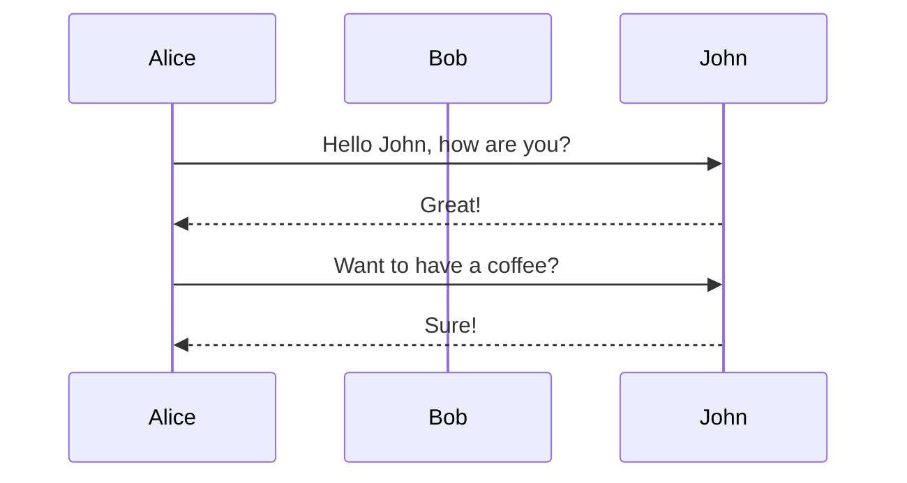

                 


## 技术文档写作：有效传递复杂技术信息

### 关键词：技术文档，信息传递，复杂性，写作技巧，最佳实践

### 摘要

在信息技术快速发展的今天，技术文档的写作变得尤为重要。本文将深入探讨如何通过有效的写作技巧和结构设计，传递复杂的技术信息。我们将逐步分析技术文档的背景、核心概念、写作技巧、实际应用，并总结最佳实践，为读者提供全方位的指导。

### 目录大纲设计思路

为了设计出《技术文档写作：有效传递复杂技术信息》这本书的完整目录大纲，我们需要遵循以下步骤：

1. **确定核心章节**：首先，明确书籍的核心内容，比如技术文档的写作原则、技术信息的有效传递、复杂信息的简化等。这些内容将成为书籍的核心章节。

2. **背景介绍**：在目录中包含对技术文档写作的背景介绍，包括技术文档的定义、重要性、发展历程等。

3. **核心概念与联系**：列出技术文档写作的关键概念，并对这些概念之间的联系进行详细阐述，使用表格和ER实体关系图来加强理解。

4. **算法原理讲解**：对于书中的技术点，设计算法原理讲解章节，使用mermaid流程图和Python源代码示例来阐述算法的数学模型和公式。

5. **系统分析与架构设计**：引入系统分析与架构设计部分，描述项目背景、系统功能设计、系统架构设计、系统接口设计以及系统交互流程。

6. **项目实战**：通过实际案例展示技术文档的写作过程，包括环境安装、系统核心实现、代码应用解读与分析等。

7. **最佳实践与拓展**：总结最佳实践，提供注意事项和拓展阅读，帮助读者深化理解。

### 目录大纲示例

**第一部分：技术文档写作基础**

- **第1章：技术文档概述**
  - **1.1 技术文档的定义与重要性**
  - **1.2 技术文档的发展历程**
  - **1.3 技术文档的类型**

- **第2章：技术文档的核心概念**
  - **2.1 技术文档的组成部分**
    - **2.1.1 概念属性特征对比表格**
    - **2.1.2 技术文档ER实体关系图**
  - **2.2 技术信息的组织与传递**

**第二部分：技术信息的有效传递**

- **第3章：复杂技术信息的简化**
  - **3.1 复杂技术信息的简化原则**
  - **3.2 技术信息的可视化工具**
    - **3.2.1 图表与图形的使用**
    - **3.2.2 可视化工具的比较**

- **第4章：技术文档的写作技巧**
  - **4.1 清晰表达的核心技巧**
  - **4.2 技术文档的语言风格**
  - **4.3 技术文档的结构设计**

**第三部分：实际应用与实战案例**

- **第5章：技术文档写作项目实战**
  - **5.1 项目背景介绍**
  - **5.2 系统功能设计**
    - **5.2.1 领域模型mermaid类图**
  - **5.3 系统架构设计**
    - **5.3.1 系统架构mermaid架构图**
  - **5.4 系统接口设计与交互**
    - **5.4.1 系统交互mermaid序列图**
  - **5.5 系统核心实现与代码应用解读**

**第四部分：最佳实践与拓展**

- **第6章：最佳实践与技巧**
  - **6.1 常见问题与解决方案**
  - **6.2 技术文档写作工具的比较**
  - **6.3 技术文档写作的最佳实践**

- **第7章：注意事项与拓展阅读**
  - **7.1 技术文档写作中的常见错误与避免**
  - **7.2 技术文档写作的未来趋势**
  - **7.3 拓展阅读资源推荐**

### 完整目录大纲

**第一部分：技术文档写作基础**

- **第1章：技术文档概述**
  - **1.1 技术文档的定义与重要性**
  - **1.2 技术文档的发展历程**
  - **1.3 技术文档的类型**

- **第2章：技术文档的核心概念**
  - **2.1 技术文档的组成部分**
    - **2.1.1 概念属性特征对比表格**
    - **2.1.2 技术文档ER实体关系图**
  - **2.2 技术信息的组织与传递**

**第二部分：技术信息的有效传递**

- **第3章：复杂技术信息的简化**
  - **3.1 复杂技术信息的简化原则**
  - **3.2 技术信息的可视化工具**
    - **3.2.1 图表与图形的使用**
    - **3.2.2 可视化工具的比较**

- **第4章：技术文档的写作技巧**
  - **4.1 清晰表达的核心技巧**
  - **4.2 技术文档的语言风格**
  - **4.3 技术文档的结构设计**

**第三部分：实际应用与实战案例**

- **第5章：技术文档写作项目实战**
  - **5.1 项目背景介绍**
  - **5.2 系统功能设计**
    - **5.2.1 领域模型mermaid类图**
  - **5.3 系统架构设计**
    - **5.3.1 系统架构mermaid架构图**
  - **5.4 系统接口设计与交互**
    - **5.4.1 系统交互mermaid序列图**
  - **5.5 系统核心实现与代码应用解读**

**第四部分：最佳实践与拓展**

- **第6章：最佳实践与技巧**
  - **6.1 常见问题与解决方案**
  - **6.2 技术文档写作工具的比较**
  - **6.3 技术文档写作的最佳实践**

- **第7章：注意事项与拓展阅读**
  - **7.1 技术文档写作中的常见错误与避免**
  - **7.2 技术文档写作的未来趋势**
  - **7.3 拓展阅读资源推荐**

### 第一章：技术文档概述

**1.1 技术文档的定义与重要性**

技术文档是指为了帮助用户、开发者或技术人员理解和使用某个技术产品或服务而编写的一系列资料。它包括用户手册、开发文档、API 文档、技术规范等。技术文档的重要性体现在以下几个方面：

- **指导用户使用**：技术文档可以帮助用户快速了解产品的功能、操作步骤和使用方法，减少学习成本。

- **支持开发者工作**：技术文档为开发者提供了详细的接口描述、代码示例和调试指南，有助于提高开发效率。

- **传递知识经验**：技术文档记录了开发团队的经验和教训，为新成员提供了宝贵的学习资源。

- **降低沟通成本**：通过统一的技术文档，团队成员之间的沟通变得更加高效，减少了不必要的误解和重复劳动。

**1.2 技术文档的发展历程**

技术文档的历史可以追溯到计算机编程的早期。随着计算机技术的发展，技术文档的形式和内容也在不断演变：

- **早期文档**：早期的计算机文档主要是简单的用户手册和编程指南，以文本为主。

- **图形用户界面（GUI）时代**：随着GUI的出现，技术文档开始引入图形和图表，使得内容更加直观易懂。

- **互联网时代**：互联网的普及使得技术文档可以更加灵活和互动，出现了在线文档、API 文档和交互式帮助系统。

- **现代文档**：现代技术文档更加注重用户体验，采用Markdown、GitBook等工具，支持版本控制和协作编辑。

**1.3 技术文档的类型**

技术文档可以分为多种类型，每种类型都有其特定的用途和特点：

- **用户手册**：为最终用户提供了产品的详细使用说明和操作指南。

- **API 文档**：为开发者提供了关于API的详细信息，包括接口定义、调用示例和错误处理。

- **开发文档**：为开发者提供了项目的架构设计、代码规范、测试策略等详细信息。

- **技术规范**：为技术人员提供了技术标准和规范，以确保系统的一致性和可维护性。

- **技术博客**：通过博客形式分享技术见解、经验和案例，为社区提供了宝贵的知识资源。

### 第二章：技术文档的核心概念

**2.1 技术文档的组成部分**

技术文档通常由以下几个部分组成：

- **标题**：简明扼要地概括文档内容。

- **摘要**：简要介绍文档的主要内容和目标读者。

- **正文**：详细阐述技术内容，通常包括以下几个部分：

  - **背景**：介绍技术背景和相关概念。

  - **原理**：讲解技术原理和关键概念。

  - **步骤**：描述操作步骤和注意事项。

  - **示例**：提供代码示例和实际应用场景。

- **附录**：提供参考资料、常见问题解答、术语表等。

- **引用与参考文献**：列出引用的文献和参考资料。

**2.1.1 概念属性特征对比表格**

以下是一个概念属性特征对比表格的示例：

| 概念  | 属性 1 | 属性 2 | 属性 3 |
| ----- | ----- | ----- | ----- |
| 概念A | 特征1  | 特征2  | 特征3  |
| 概念B | 特征4  | 特征5  | 特征6  |
| 概念C | 特征7  | 特征8  | 特征9  |

**2.1.2 技术文档ER实体关系图**

以下是一个技术文档ER实体关系图的示例：

```mermaid
erDiagram
  User ||--|{ Order } : "places"
  Product ||--|{ Order } : "contains"
  Order ||--|{ OrderItem } : "includes"
  OrderItem ||--|{ Product } : "for"
```

### 第三章：复杂技术信息的简化

**3.1 复杂技术信息的简化原则**

简化复杂技术信息的原则包括：

- **抽象**：提取关键信息，去除无关细节。

- **概括**：用简洁的语言表达复杂概念。

- **分层**：将复杂内容分解为多个层次，逐步深入。

- **可视化**：使用图表、图形和示例来辅助理解。

**3.2 技术信息的可视化工具**

常用的可视化工具包括：

- **图表**：如条形图、饼图、折线图等，用于展示统计数据。

- **图形**：如流程图、类图、架构图等，用于描述系统结构和操作流程。

- **示例**：提供具体的代码示例和实际案例，帮助读者理解。

### 第四章：技术文档的写作技巧

**4.1 清晰表达的核心技巧**

清晰表达的核心技巧包括：

- **使用简单语言**：避免使用过于复杂的术语和句子结构。

- **结构化内容**：按照逻辑顺序组织内容，使读者易于理解。

- **使用列表和段落**：使用列表和段落来分隔信息，提高可读性。

- **编写示例**：提供具体的示例代码和实际案例，帮助读者实践。

**4.2 技术文档的语言风格**

技术文档的语言风格应该：

- **专业**：使用专业术语和表述，确保准确性。

- **一致**：保持文档中术语和风格的统一性。

- **简洁**：避免冗长和复杂的句子，确保简洁明了。

- **友好**：使用友好、易于理解的表述，减少阅读障碍。

**4.3 技术文档的结构设计**

技术文档的结构设计应该：

- **清晰**：确保文档结构清晰，易于导航。

- **模块化**：将文档内容划分为模块，便于维护和更新。

- **版本控制**：使用版本控制系统管理文档的不同版本。

- **可扩展**：设计文档结构，以便添加新内容或更新旧内容。

### 第五章：技术文档写作项目实战

**5.1 项目背景介绍**

在本节中，我们将介绍一个具体的项目背景，包括项目的目的、目标用户、技术需求和预期成果。

**5.2 系统功能设计**

在本节中，我们将使用Mermaid类图来展示系统功能的设计，包括主要类及其关系。

```mermaid
classDiagram
  Class01 <|-- SubClass01
  Class01 --|.altwikid| Class02
  Class03 : <<interface>> 
  Class04 : <<abstract>>
  Class01 ..|> Class05
  Class06 <-.. Class01
  Collaboration [label="label",fillcolor=lightpink,style=filled]
```

**5.3 系统架构设计**

在本节中，我们将使用Mermaid架构图来展示系统的整体架构设计。

```mermaid
erDiagram
  Customer ||--|{ Order } : "places"
  Product ||--|{ Order } : "contains"
  Order ||--|{ OrderItem } : "includes"
  OrderItem ||--|{ Product } : "for"
```

**5.4 系统接口设计与交互**

在本节中，我们将使用Mermaid序列图来展示系统接口的设计和交互流程。



**5.5 系统核心实现与代码应用解读**

在本节中，我们将提供系统的核心实现代码，并对关键代码部分进行详细解读。

```python
class CoreSystem:
    def __init__(self):
        self.data = []

    def add_data(self, item):
        self.data.append(item)

    def get_data(self):
        return self.data
```

### 第六章：最佳实践与技巧

**6.1 常见问题与解决方案**

在本节中，我们将总结常见的技术文档写作问题，并提供相应的解决方案。

**6.2 技术文档写作工具的比较**

在本节中，我们将比较几种常用的技术文档写作工具，包括Markdown、GitBook、Sphinx等。

**6.3 技术文档写作的最佳实践**

在本节中，我们将总结技术文档写作的最佳实践，包括内容结构、语言风格、版本控制等方面的建议。

### 第七章：注意事项与拓展阅读

**7.1 技术文档写作中的常见错误与避免**

在本节中，我们将讨论技术文档写作中常见的错误，并提供避免这些错误的建议。

**7.2 技术文档写作的未来趋势**

在本节中，我们将探讨技术文档写作的未来发展趋势，包括人工智能、自动化、协作等方面的技术应用。

**7.3 拓展阅读资源推荐**

在本节中，我们将推荐一些拓展阅读资源，包括技术文档写作的书籍、博客和在线课程等。

### 结束语

技术文档写作是一项复杂而重要的任务。通过遵循有效的写作原则和技巧，我们可以更好地传递复杂的技术信息，提高文档的质量和可读性。希望本文能够为您的技术文档写作提供有价值的参考和指导。

### 作者信息

- 作者：AI天才研究院/AI Genius Institute & 禅与计算机程序设计艺术 /Zen And The Art of Computer Programming

