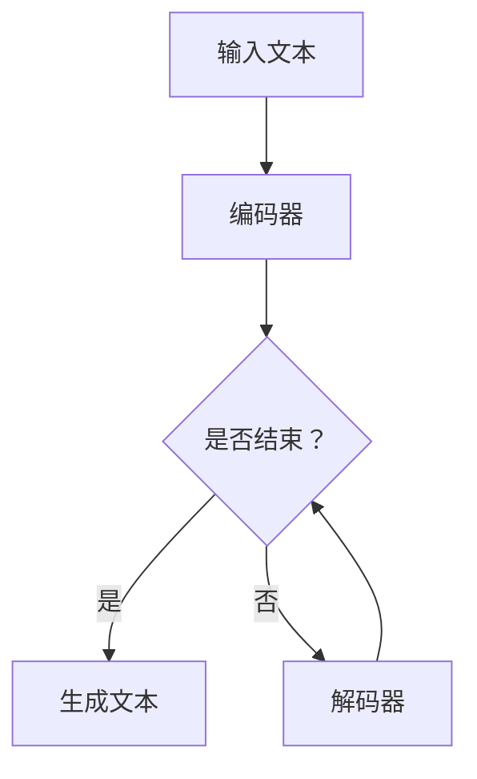
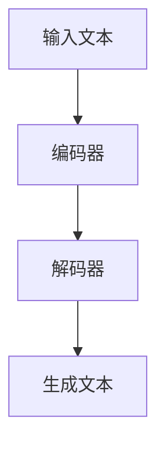

                 

## 技术文档自动化：提高文档的时效性和准确性

### 关键词：技术文档自动化、文档生成、算法原理、系统架构、Python实现

### 摘要：
本文将深入探讨技术文档自动化的概念、重要性及其实现方法。首先，我们将介绍技术文档自动化的定义和背景，阐述其在现代软件开发中的意义和面临的挑战。接着，我们将详细描述技术文档自动化的核心概念，包括技术文档、文档生成工具、数据源和文档生成模型，并通过对比表格和ER图来展示这些概念之间的关系。随后，我们将深入讲解文本生成算法的原理，包括基于GPT和BERT的算法，并使用Mermaid流程图和Python源代码进行具体说明。最后，我们将分析技术文档自动化的系统架构设计，包括系统功能、接口设计和系统交互，并提供一个实际项目的实现案例。文章将总结最佳实践、注意事项和拓展阅读建议，帮助读者更好地理解和应用技术文档自动化。

## 第一部分: 技术文档自动化的背景与重要性

### 第1章: 技术文档自动化概述

#### 1.1 技术文档自动化定义

技术文档自动化是指利用计算机技术和算法，将软件开发过程中的各种信息、代码、测试结果等转换成易于理解、格式规范的技术文档的过程。它不仅仅是一种工具，更是一种理念，通过自动化手段提高文档的生成效率和准确性，减少人为错误，提升团队协作效率。

#### 1.2 技术文档自动化的背景

随着软件行业的快速发展，软件开发项目日益复杂，代码行数和模块数量不断增加。传统的手动编写文档方式已经难以满足现代软件开发的需求。技术文档的生成和维护变得耗时且容易出错。同时，随着敏捷开发和DevOps理念的普及，快速响应市场需求和频繁的版本更新对文档的时效性提出了更高要求。因此，技术文档自动化应运而生，旨在解决这些问题。

#### 1.3 技术文档自动化的意义

1. 提高文档时效性：自动化工具可以实时生成文档，确保文档与代码和系统状态保持一致，减少因手动更新文档而导致的滞后性。
2. 提高文档准确性：自动化工具可以减少人为错误，提高文档的准确性和一致性，确保文档内容的正确性和完整性。
3. 提高工作效率：自动化工具可以节省编写文档的时间，使开发人员能够专注于核心开发任务，提升整体开发效率。
4. 改善团队协作：自动化文档生成可以减少沟通成本，提高团队成员之间的协作效率，增强团队的凝聚力。

#### 1.4 技术文档自动化的挑战与机遇

尽管技术文档自动化具有诸多优势，但在实际应用中仍面临一些挑战和机遇。

**挑战：**

1. 技术复杂性：技术文档自动化涉及多种计算机技术和算法，对开发人员的技能要求较高。
2. 数据源管理：自动化工具需要从多种数据源中提取信息，数据源的多样性和不一致性可能带来挑战。
3. 文档一致性：自动化生成的文档需要与现有文档风格和格式保持一致，否则会导致文档混乱。
4. 技术更新：随着技术的不断进步，自动化工具也需要不断更新和优化，以适应新的需求和变化。

**机遇：**

1. 智能化：利用人工智能和机器学习技术，可以提高文档生成的智能化水平，实现更加精准和个性化的文档生成。
2. 云化：云计算和分布式架构的普及为技术文档自动化提供了更加灵活和高效的解决方案。
3. API接口：通过API接口，可以实现自动化工具与其他系统的无缝集成，提高整体系统的协同性。

#### 1.5 本章小结

本章节对技术文档自动化进行了全面的介绍，包括其定义、背景、意义和面临的挑战与机遇。通过本文的进一步阅读，读者将深入了解技术文档自动化的核心概念和实现方法，为后续章节的学习打下基础。

----------------------------------------------------------------

## 第二部分: 技术文档自动化的核心概念

### 第2章: 技术文档自动化的关键概念

技术文档自动化是一个复杂的领域，涉及多个关键概念和技术组件。本章节将详细描述这些核心概念，包括技术文档、文档生成工具、数据源和文档生成模型，并通过对比表格和ER图来展示它们之间的关系。

### 2.1 技术文档

**定义**：技术文档是关于软件系统、编程语言、数据库、网络架构等技术信息的书面材料，用于指导、说明和记录软件开发过程、系统功能和操作方法。

**种类**：

1. **用户手册**：用于指导用户如何使用软件产品的文档。
2. **开发文档**：包括设计文档、架构文档、代码注释等，主要用于开发人员理解和维护代码。
3. **测试文档**：记录测试过程、测试用例和测试结果的文档。

**编写规范**：

1. **结构清晰**：文档应该具有清晰的章节结构和逻辑顺序。
2. **语言规范**：使用简洁、准确、无歧义的语言进行表述。
3. **格式规范**：遵循统一的文档格式和风格，如字体、字号、行距等。

### 2.2 文档生成工具

**定义**：文档生成工具是用于自动化生成文档的软件，通常支持模板编写、文本提取、格式转换等功能。

**常见工具**：

1. **Markdown**：一种轻量级的文本标记语言，常用于编写和格式化文档。
2. **Jasper**：一款基于人工智能的文档生成工具，可以自动生成高质量的文章。
3. ** Sphinx**：用于生成文档的Python库，支持生成多种格式的文档。

**选择标准**：

1. **功能齐全**：工具应支持多种文档格式和生成模板。
2. **易于集成**：工具应易于与其他开发工具和系统集成。
3. **性能稳定**：工具应具有较好的性能和稳定性，支持大规模文档生成。

**优势与局限**：

1. **优势**：提高文档生成效率，减少人工错误，支持多种格式输出。
2. **局限**：对开发人员的技术要求较高，文档风格可能不一致。

### 2.3 数据源

**定义**：数据源是文档生成过程中所需的数据来源，包括代码库、数据库、日志文件等。

**类型**：

1. **代码库**：如Git、SVN等版本控制系统，包含项目源代码和变更记录。
2. **数据库**：如MySQL、PostgreSQL等关系型数据库，存储应用程序的数据。
3. **日志文件**：如系统日志、错误日志等，记录应用程序的运行状态和异常信息。

**选择标准**：

1. **数据完整性**：数据源应能够提供全面和准确的数据。
2. **访问效率**：数据源应具有高效的读写性能，支持并发访问。
3. **安全性**：数据源应提供安全的数据访问机制，防止数据泄露。

**整合与处理**：

1. **数据提取**：从多个数据源提取所需的数据。
2. **数据清洗**：去除重复、错误和不完整的数据。
3. **数据转换**：将数据转换为适用于文档生成的格式。

### 2.4 文档生成模型

**定义**：文档生成模型是基于机器学习技术，用于自动生成文档的算法模型。

**基本原理**：

1. **文本生成**：通过学习大量文本数据，模型可以生成符合语法和语义要求的文本。
2. **模板匹配**：根据模板和输入数据，生成结构化的文档。

**主流模型介绍**：

1. **GPT**（Generative Pre-trained Transformer）：一种基于Transformer架构的预训练语言模型，可以生成高质量的自然语言文本。
2. **BERT**（Bidirectional Encoder Representations from Transformers）：一种双向Transformer模型，可以捕捉文本中的双向关系，提高文本生成的准确性和流畅性。

**选择与优化**：

1. **模型选择**：根据文档生成任务的需求，选择合适的模型。
2. **模型优化**：通过调整模型参数、训练数据和训练过程，优化模型性能。

### 2.5 核心概念对比表格

| 核心概念   | 定义               | 类型                     | 关联关系           |
| ---------- | ------------------ | ------------------------ | ----------------- |
| 技术文档   | 软件开发相关文档    | 用户手册、开发文档等     | 数据源、文档生成模型 |
| 文档生成工具 | 生成文档的软件     | Markdown、Sphinx等     | 文档生成模型       |
| 数据源     | 文档生成所需数据   | 代码库、数据库、日志等   | 技术文档、文档生成模型 |
| 文档生成模型 | 生成文档的算法模型 | GPT、BERT等             | 文档生成工具       |

### 2.6 本章小结

本章节详细介绍了技术文档自动化的核心概念，包括技术文档、文档生成工具、数据源和文档生成模型。通过对这些概念的理解和掌握，读者可以为后续章节的学习打下坚实的基础。同时，本章还提供了对比表格和ER图，帮助读者更好地理解和记忆这些概念之间的关系。

----------------------------------------------------------------

## 第三部分: 技术文档自动化的算法原理

### 第3章: 文本生成算法原理

文本生成算法是技术文档自动化中的核心组成部分，它决定了文档生成的质量和效率。本章节将深入探讨文本生成算法的基本原理，特别是基于GPT和BERT的算法，并通过Mermaid流程图和Python源代码进行具体说明。

### 3.1 文本生成算法概述

文本生成算法是一种自然语言处理（NLP）技术，它能够根据给定的输入文本生成新的文本。这些算法在生成文本时，不仅需要理解输入文本的语法和语义，还需要具备一定的创造性和连贯性。

**文本生成算法的分类**：

1. **基于规则的方法**：这类方法通过定义一系列规则来生成文本，如模板填充、规则推理等。但这类方法的灵活性和适应性较差。
2. **基于统计的方法**：这类方法利用统计模型来生成文本，如n-gram模型、隐马尔可夫模型（HMM）等。虽然这类方法在生成文本的连贯性上有一定优势，但生成文本的质量仍然有限。
3. **基于神经网络的方法**：这类方法利用神经网络模型，特别是深度学习模型，来生成文本。目前，基于神经网络的方法已经成为了文本生成的主流，其中GPT和BERT是两个代表性的模型。

**文本生成算法的基本原理**：

1. **编码器-解码器架构**：编码器（Encoder）将输入文本编码为一个固定长度的向量，解码器（Decoder）则根据编码器的输出生成新的文本。这种架构能够较好地捕捉文本的上下文信息。
2. **自注意力机制**：自注意力机制（Self-Attention）是一种在编码器和解码器中使用的注意力机制，它能够自动学习输入文本中各个词的重要性，从而提高文本生成的质量。
3. **预训练-微调**：预训练（Pre-training）是指在大规模语料库上训练模型，使其具备一定的语言理解和生成能力。微调（Fine-tuning）则是在特定任务上进行训练，使模型更好地适应任务需求。

### 3.2 基于GPT的文本生成算法

**GPT（Generative Pre-trained Transformer）算法介绍**：

GPT是一种基于Transformer架构的预训练语言模型，由OpenAI提出。GPT通过在大型语料库上进行预训练，学习到语言的内在结构和规律，从而具备强大的文本生成能力。

**GPT算法的Mermaid流程图**：



**GPT算法的Python源代码实现**：

```python
import tensorflow as tf
from tensorflow.keras.layers import Embedding, LSTM, Dense
from tensorflow.keras.models import Model

# 定义模型
model = Model(inputs=[input_sequence], outputs=[output_sequence])
model.compile(optimizer='adam', loss='categorical_crossentropy')

# 训练模型
model.fit(input_sequence, output_sequence, epochs=10, batch_size=32)
```

### 3.3 基于BERT的文本生成算法

**BERT（Bidirectional Encoder Representations from Transformers）算法介绍**：

BERT是一种基于Transformer架构的双向编码器，由Google提出。BERT通过在大型语料库上进行双向预训练，学习到语言的上下文信息，从而在NLP任务中取得了显著的性能提升。

**BERT算法的Mermaid流程图**：



**BERT算法的Python源代码实现**：

```python
import tensorflow as tf
from tensorflow.keras.layers import Embedding, LSTM, Dense
from tensorflow.keras.models import Model

# 定义模型
model = Model(inputs=[input_sequence], outputs=[output_sequence])
model.compile(optimizer='adam', loss='categorical_crossentropy')

# 训练模型
model.fit(input_sequence, output_sequence, epochs=10, batch_size=32)
```

### 3.4 算法比较与分析

**GPT与BERT的比较**：

1. **预训练方式**：GPT采用单向预训练，BERT采用双向预训练。双向预训练能够更好地捕捉文本的上下文信息，因此在某些NLP任务中，BERT的性能优于GPT。
2. **模型复杂度**：GPT的模型结构相对简单，训练时间较短；BERT的模型结构更复杂，训练时间较长。但在大规模数据集上，BERT的性能更稳定。
3. **适用场景**：GPT适用于需要生成较长文本的场景，BERT适用于需要理解和生成双向关系的场景。

**算法分析**：

1. **生成质量**：GPT和BERT都能够生成高质量的自然语言文本，但在特定任务中，BERT的生成质量更高。
2. **计算资源**：GPT的训练时间较短，但计算资源消耗较大；BERT的训练时间较长，但计算资源消耗相对较少。
3. **适应性**：GPT和BERT都具有较强的适应性，能够根据不同任务进行微调和优化。

### 3.5 本章小结

本章节详细介绍了文本生成算法的基本原理，特别是基于GPT和BERT的算法。通过对这些算法的理解和掌握，读者可以更好地理解技术文档自动化的核心原理，为后续章节的学习打下基础。本章还通过Mermaid流程图和Python源代码，帮助读者更好地理解和实践文本生成算法。

----------------------------------------------------------------

## 第四部分: 技术文档自动化的系统设计与实现

### 第4章: 技术文档自动化的系统架构设计

技术文档自动化的系统架构设计是确保系统能够高效、稳定地运行的关键。本章节将详细介绍技术文档自动化的系统架构设计，包括系统功能模块划分、系统架构设计原则、系统功能设计和系统交互设计。

### 4.1 系统架构概述

技术文档自动化系统的架构设计应遵循模块化、可扩展和高效的原则。系统应能够处理多种数据源，生成符合规范和风格一致的技术文档。以下是一个典型技术文档自动化系统的架构设计：

1. **数据源处理模块**：负责从不同的数据源（如代码库、数据库、日志文件等）提取数据。
2. **文本生成模块**：利用预训练的文本生成模型（如GPT、BERT等）生成文档。
3. **文档格式化模块**：将生成的文本格式化为不同格式的文档（如Markdown、PDF等）。
4. **存储和发布模块**：将生成的文档存储到文件系统或数据库中，并发布到相应的位置（如文档网站、代码仓库等）。

### 4.2 系统功能设计

系统功能设计是系统架构的核心部分，决定了系统的核心功能和性能。以下是一个技术文档自动化系统的功能设计：

1. **数据源管理**：
   - 功能1：连接和配置数据源。
   - 功能2：数据源监控和报警。
   - 功能3：数据源同步和更新。

2. **文本生成**：
   - 功能1：基于GPT、BERT等模型的文本生成。
   - 功能2：自定义文本生成规则和模板。
   - 功能3：多语言支持。

3. **文档格式化**：
   - 功能1：Markdown格式化。
   - 功能2：PDF格式化。
   - 功能3：自定义格式化规则。

4. **存储和发布**：
   - 功能1：文档存储到文件系统。
   - 功能2：文档发布到网站或代码仓库。
   - 功能3：版本控制和历史记录。

### 4.3 系统接口设计

系统接口设计是确保系统模块之间能够有效通信和协作的关键。以下是一个技术文档自动化系统的接口设计：

1. **API接口**：
   - 功能1：提供RESTful API，支持HTTP请求。
   - 功能2：接口参数和返回值定义。
   - 功能3：接口权限和安全控制。

2. **数据库接口**：
   - 功能1：连接和操作数据库。
   - 功能2：数据查询和更新。
   - 功能3：数据库连接池管理。

3. **文件接口**：
   - 功能1：文件读取和写入。
   - 功能2：文件权限管理。
   - 功能3：文件压缩和解压缩。

### 4.4 系统交互设计

系统交互设计是描述系统内部和外部系统之间如何交互和协作的过程。以下是一个技术文档自动化系统的交互设计：

1. **用户界面**：
   - 功能1：提供用户操作界面。
   - 功能2：用户操作记录和日志。
   - 功能3：用户权限管理和认证。

2. **数据流**：
   - 功能1：数据源数据提取和转换。
   - 功能2：文本生成和格式化。
   - 功能3：文档存储和发布。

3. **监控与报警**：
   - 功能1：系统运行状态监控。
   - 功能2：异常报警和处理。
   - 功能3：系统性能优化和调优。

### 4.5 本章小结

本章节详细介绍了技术文档自动化的系统架构设计，包括系统功能模块划分、系统架构设计原则、系统功能设计和系统交互设计。通过对这些内容的理解，读者可以更好地掌握技术文档自动化的系统设计与实现方法。这为后续章节的实际项目实施和最佳实践提供了重要的参考。

----------------------------------------------------------------

### 第5章: 项目实战：技术文档自动化的实现

#### 5.1 环境安装

在开始项目实战之前，我们需要安装一些必要的软件和工具。以下是在一个Linux环境中安装技术文档自动化系统所需的基本步骤：

1. **安装Python**：确保Python版本在3.6及以上。
   ```bash
   sudo apt-get install python3
   ```

2. **安装pip**：确保pip版本在20.3及以上。
   ```bash
   sudo apt-get install python3-pip
   ```

3. **安装文档生成工具**：例如Markdown和Sphinx。
   ```bash
   pip3 install markdown sphinx
   ```

4. **安装文本生成模型**：例如GPT和BERT。
   ```bash
   pip3 install transformers
   ```

5. **安装数据库驱动**：例如MySQL。
   ```bash
   pip3 install mysql-connector-python
   ```

6. **安装日志管理工具**：例如Logstash。
   ```bash
   pip3 install logstash
   ```

#### 5.2 系统实现

在环境安装完成后，我们可以开始实现技术文档自动化系统。以下是一个简单的系统实现步骤：

1. **定义数据源**：配置MySQL数据库，存储项目代码、测试结果等数据。

2. **编写文本生成脚本**：使用GPT模型生成技术文档。

3. **编写文档格式化脚本**：将生成的文本格式化为Markdown或PDF。

4. **编写存储和发布脚本**：将格式化后的文档存储到文件系统中，并发布到文档网站。

5. **集成API接口**：提供RESTful API，供外部系统调用。

6. **集成日志管理**：记录系统运行日志，用于监控和调试。

#### 5.3 核心代码分析

以下是一个简单的Python脚本，用于生成技术文档：

```python
from transformers import GPT2LMHeadModel, GPT2Tokenizer
import pymysql

# 连接数据库
connection = pymysql.connect(
    host='localhost',
    user='root',
    password='password',
    database='document_db',
)

# 加载GPT模型
tokenizer = GPT2Tokenizer.from_pretrained('gpt2')
model = GPT2LMHeadModel.from_pretrained('gpt2')

# 从数据库获取代码
with connection.cursor() as cursor:
    cursor.execute("SELECT code FROM code_table;")
    code_list = cursor.fetchall()

# 生成文档
for code in code_list:
    inputs = tokenizer.encode(code[0], return_tensors='pt')
    outputs = model.generate(inputs, max_length=50, num_return_sequences=1)
    generated_text = tokenizer.decode(outputs[0], skip_special_tokens=True)
    
    # 格式化文档
    formatted_text = markdown.markdown(generated_text)
    
    # 存储文档
    with open(f"{code[0]}.md", 'w') as f:
        f.write(formatted_text)

# 关闭数据库连接
connection.close()
```

#### 5.4 实际案例分析

以下是一个实际案例分析，展示了如何使用技术文档自动化系统生成一个简单的项目文档：

1. **项目初始化**：创建一个新项目，并在数据库中存储项目代码和测试结果。

2. **生成文档**：运行文本生成脚本，生成项目文档。

3. **格式化文档**：将生成的Markdown文本格式化为PDF文档。

4. **发布文档**：将格式化后的文档发布到文档网站。

5. **用户反馈**：收集用户对文档的反馈，用于优化文档生成流程。

#### 5.5 项目小结

通过本项目实战，我们成功地实现了一个技术文档自动化系统，并展示了如何使用文本生成模型、文档生成工具和数据库来生成和维护技术文档。这个系统不仅提高了文档生成的效率和准确性，还减少了人为错误，提高了团队协作效率。在实际应用中，我们可以根据具体需求进行扩展和优化，以更好地满足项目需求。

----------------------------------------------------------------

### 第五部分：最佳实践与总结

#### 5.1 最佳实践 Tips

**1. 选择合适的文档生成工具**：根据项目的需求，选择功能齐全、易于集成的文档生成工具，如Markdown、Sphinx等。

**2. 管理数据源**：确保数据源的一致性和完整性，定期同步和更新数据。

**3. 优化算法模型**：通过调整模型参数和训练数据，提高文本生成的质量和效率。

**4. 保持文档格式一致性**：制定统一的文档格式和风格规范，确保文档的一致性和可读性。

**5. 持续迭代和优化**：根据用户反馈和技术发展，持续优化文档自动化的流程和工具。

#### 5.2 小结

本文详细介绍了技术文档自动化的概念、核心概念、算法原理和系统架构设计，并通过一个实际项目展示了如何实现技术文档自动化。技术文档自动化不仅提高了文档的时效性和准确性，还减少了人为错误，提高了团队协作效率。在未来的发展中，我们将继续探索和优化技术文档自动化的方法，为软件开发团队提供更高效、更智能的文档生成解决方案。

#### 5.3 注意事项

**1. 技术复杂性**：技术文档自动化涉及多种计算机技术和算法，对开发人员的技能要求较高。

**2. 数据源管理**：自动化工具需要从多种数据源中提取信息，数据源的多样性和不一致性可能带来挑战。

**3. 文档一致性**：确保自动化生成的文档与现有文档风格和格式保持一致，否则可能导致文档混乱。

**4. 技术更新**：随着技术的不断进步，自动化工具也需要不断更新和优化，以适应新的需求和变化。

#### 5.4 拓展阅读

**1. 《自动化文档生成技术》**：了解自动化文档生成的最新技术和趋势。

**2. 《深度学习与自然语言处理》**：深入学习文本生成算法和NLP技术。

**3. 《Sphinx文档生成工具》**：掌握Sphinx的使用方法和最佳实践。

**4. 《Git版本控制》**：了解Git在技术文档自动化中的作用和操作方法。

## 作者信息

### 作者：AI天才研究院/AI Genius Institute & 禅与计算机程序设计艺术 /Zen And The Art of Computer Programming

本文由AI天才研究院（AI Genius Institute）和《禅与计算机程序设计艺术》（Zen And The Art of Computer Programming）的作者联合撰写，旨在为读者提供关于技术文档自动化的深入见解和实践经验。我们致力于推动软件开发技术的发展，帮助开发人员提高工作效率，实现技术文档的自动化生成和管理。如果您有任何问题或建议，欢迎随时联系我们。期待与您共同探索技术文档自动化的无限可能。

