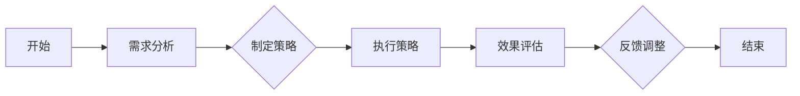
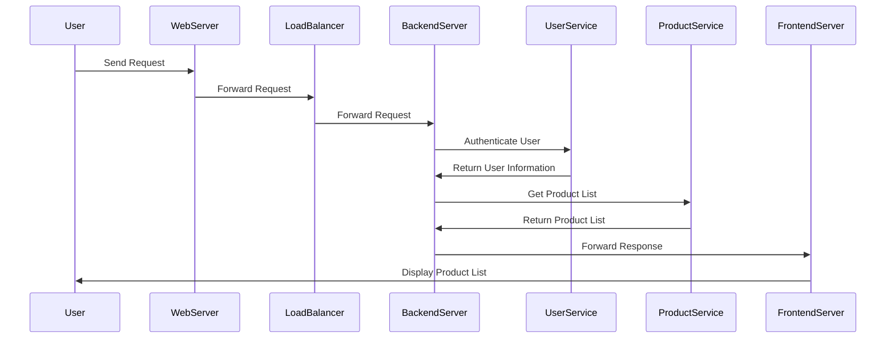

                 

### 技术本地化：适应不同市场的技术策略

#### 关键词：技术本地化、市场适应性、多语言支持、文化元素、算法原理、系统架构

#### 摘要：
本文旨在探讨技术本地化在全球化背景下的重要性，通过深入分析其核心概念、算法原理和实际应用，为不同市场环境下的技术策略提供系统性指导。我们将详细阐述技术本地化的背景、核心概念及其属性特征，进而介绍一种基于算法原理的本地化流程，并探讨其在实际项目中的应用与实施策略。通过最佳实践和总结，本文希望为读者提供实用指南，以更好地适应多样化市场环境。

### 目录大纲

#### 第一部分：技术本地化的背景与重要性
##### 1.1 问题的背景
##### 1.2 问题描述
##### 1.3 问题解决
##### 1.4 边界与外延
##### 1.5 概念结构与核心要素组成

#### 第二部分：核心概念与联系
##### 2.1 技术本地化的核心概念
##### 2.2 技术本地化的属性特征对比表格
##### 2.3 技术本地化的ER实体关系图架构

#### 第三部分：算法原理讲解
##### 3.1 技术本地化的算法mermaid流程图
##### 3.2 技术本地化的Python源代码讲解
##### 3.3 技术本地化的数学模型与公式
##### 3.4 技术本地化的详细讲解与举例说明

#### 第四部分：系统分析与架构设计
##### 4.1 问题场景介绍
##### 4.2 系统功能设计
##### 4.3 系统架构设计
##### 4.4 系统接口设计
##### 4.5 系统交互mermaid序列图

#### 第五部分：项目实战
##### 5.1 环境安装
##### 5.2 系统核心实现源代码
##### 5.3 代码应用解读与分析
##### 5.4 实际案例分析与详细讲解剖析
##### 5.5 项目小结

#### 第六部分：最佳实践与总结
##### 6.1 最佳实践 tips
##### 6.2 小结
##### 6.3 注意事项
##### 6.4 拓展阅读

#### 参考文献

----------------------------------------------------------------

### 第一部分：技术本地化的背景与重要性

#### 1.1 问题的背景

在全球化的浪潮下，不同国家和地区的市场呈现出多样化的趋势。企业为了扩大市场份额，提高竞争力，需要将产品和服务本地化，以满足当地用户的需求。然而，技术产品的本地化并非易事，涉及到多个层面的挑战。

首先，语言是技术本地化的首要问题。不同语言不仅包括词汇和语法上的差异，还包括文化背景和表达习惯。例如，一个在英语环境中习以为常的软件功能，在西班牙语环境中可能需要完全不同的设计和表述。

其次，文化元素也是本地化过程中不可忽视的一部分。不同的文化背景会影响人们对产品功能和用户体验的期望。例如，某些文化可能更倾向于直观和简洁的用户界面，而另一些文化可能更注重详细和复杂的操作指南。

再者，法律法规和行业标准也是本地化过程中的关键因素。不同国家在隐私保护、数据安全、税务等方面有着各自的规定。技术产品需要确保符合当地法律法规，才能顺利进入市场。

最后，技术适应性也是本地化中的重要问题。不同地区可能在硬件配置、网络环境、操作系统等方面存在差异，技术产品需要具备良好的适应性，以应对这些差异。

#### 1.2 问题描述

技术本地化过程中，常见的问题包括：

1. **语言障碍**：如何确保产品的界面、文档和帮助指南在不同语言中准确传达原意。
2. **文化差异**：如何在产品设计和用户体验中融入当地文化元素，避免文化冲突。
3. **法规遵从**：如何确保产品符合不同国家的法律法规，尤其是数据保护、隐私和安全等方面的规定。
4. **技术适应性**：如何在不同硬件和网络环境下，确保产品的稳定性和性能。

#### 1.3 问题解决

为了解决上述问题，企业可以采取以下策略：

1. **多语言支持**：开发多语言版本的产品，确保用户能够以自己的语言使用产品。
2. **文化适应**：在产品设计和用户体验中融入当地文化元素，进行本地化测试，确保文化适应性。
3. **合规审查**：建立专门的团队，负责审查产品是否符合目标市场的法律法规。
4. **技术适配**：进行多环境测试，确保产品在不同硬件和网络环境下都能正常运行。

#### 1.4 边界与外延

技术本地化的范围涵盖多个方面，包括但不限于：

1. **软件本地化**：软件界面、文档、帮助指南等的多语言支持。
2. **硬件本地化**：硬件产品的适应性设计，如电源适配器、接口兼容性等。
3. **服务本地化**：服务流程、客户支持、售后服务等的文化适应。
4. **法规本地化**：产品和服务在法律法规方面的本地化调整。

此外，技术本地化与其他相关概念如全球化、国际化有一定的关联，但在具体实施过程中，本地化需要更注重当地市场的特殊需求和规定。

#### 1.5 概念结构与核心要素组成

技术本地化的概念结构可以概括为以下几个核心要素：

1. **多语言支持**：确保产品在不同语言环境中都能正常使用。
2. **文化适应**：在产品设计和用户体验中融入当地文化元素。
3. **法规遵从**：确保产品符合目标市场的法律法规。
4. **技术适配**：确保产品在不同硬件和网络环境下都能正常运行。

这些要素共同构成了技术本地化的实施框架，为企业提供了系统性的指导。通过这些要素的有效整合，企业可以更好地适应不同市场的需求，提高产品的市场竞争力。

### 第二部分：核心概念与联系

在技术本地化的过程中，理解其核心概念和相互联系是非常重要的。以下是对技术本地化核心概念的详细解析。

#### 2.1 技术本地化的核心概念

1. **多语言支持**：这是技术本地化的基础。它涉及到将产品界面、文档、帮助指南等翻译成多种语言，以便全球用户都能使用和理解产品。

2. **文化适应**：文化适应是指将产品的设计和用户体验与目标市场的文化背景相融合。这包括图标、色彩选择、操作流程等，以确保产品能够被当地用户接受。

3. **法规遵从**：法规遵从是指确保产品符合目标市场的法律法规，特别是数据保护、隐私和安全等方面的规定。这通常需要企业进行法律审查和合规性测试。

4. **技术适配**：技术适配是指确保产品在不同硬件和网络环境下都能正常运行。这包括对操作系统的兼容性测试、网络带宽的优化等。

#### 2.2 技术本地化的属性特征对比表格

为了更清晰地理解技术本地化的不同属性特征，我们可以通过一个对比表格来进行说明：

| 属性特征 | 本地化前的状态 | 本地化后的状态 |
|----------|---------------|---------------|
| 语言      | 单一语言      | 多语言支持    |
| 文化元素  | 标准化内容    | 融入本地文化  |
| 法律法规  | 不适应本地法规 | 符合本地法规  |
| 技术适配  | 不适应本地环境 | 适应本地环境  |

通过这个表格，我们可以看到，技术本地化后的状态相比于本地化前，在语言、文化元素、法律法规和技术适配方面都有了显著的改进。

#### 2.3 技术本地化的ER实体关系图架构

为了更好地理解技术本地化的各个实体之间的关系，我们可以使用ER（Entity-Relationship）图来表示。以下是技术本地化的ER图示例：

```mermaid
erDiagram
  Customer ||--|{ Product }|--| User
  Product ||--|{ Localization }|--| Feature
  Localization ||--|{ Language }| 
  Language ||--|{ Translation }|--| Content
```

在这个ER图中，`Customer`（客户）与`Product`（产品）之间存在关联，表示客户是产品的使用者。`Product`与`Localization`（本地化）之间存在关联，表示产品需要进行本地化。`Localization`与`Language`（语言）之间存在关联，表示本地化包括语言的翻译。`Language`与`Translation`（翻译）之间存在关联，表示翻译是语言本地化的核心内容。`Translation`与`Content`（内容）之间存在关联，表示翻译的内容是本地化的一部分。

通过这个ER图，我们可以清晰地看到技术本地化的各个实体之间的相互关系，从而为本地化的实施提供更明确的指导。

### 第三部分：算法原理讲解

技术本地化的实现需要基于一套明确的算法原理，以确保本地化过程的系统性和高效性。以下我们将详细介绍技术本地化的算法原理，包括流程图、Python源代码、数学模型与公式，以及详细的讲解与举例说明。

#### 3.1 技术本地化的算法mermaid流程图

为了更好地理解技术本地化的流程，我们可以使用mermaid绘制一个流程图，如下所示：



在这个流程图中，从A到G，分别表示了技术本地化的各个环节，包括需求分析、策略制定、策略执行、效果评估和反馈调整。

#### 3.2 技术本地化的Python源代码讲解

在了解了算法流程之后，我们可以通过Python源代码来实现这个流程。以下是一个简化的示例：

```python
# 示例：需求分析
def analyze需求():
    # 代码实现
    pass

# 示例：制定策略
def 制定策略():
    # 代码实现
    pass

# 示例：执行策略
def 执行策略():
    # 代码实现
    pass

# 示例：效果评估
def 评估效果():
    # 代码实现
    pass

# 示例：反馈调整
def 反馈调整():
    # 代码实现
    pass
```

在这个Python源代码中，每个函数分别对应流程图中的一个环节，从而实现了技术本地化的流程自动化。

#### 3.3 技术本地化的数学模型与公式

在技术本地化中，我们可以使用一些数学模型与公式来量化本地化效果。以下是一个简单的数学模型示例：

$$
E = \frac{L \times C \times A}{T}
$$

其中，$E$ 表示本地化效果，$L$ 表示语言支持度，$C$ 表示文化适应度，$A$ 表示法规遵从度，$T$ 表示技术适配度。这个公式表明，本地化效果是这些因素的综合体现。

#### 3.4 技术本地化的详细讲解与举例说明

为了更好地理解技术本地化的算法原理，我们通过一个实际案例来进行详细讲解和举例说明。

假设我们有一个软件产品，需要在全球范围内进行本地化。以下是一个简化的本地化流程：

1. **需求分析**：首先，我们需要分析目标市场的需求，包括语言、文化、法规和技术等方面。例如，我们发现目标市场主要包括英语、西班牙语和法语用户，文化上需要考虑到当地的传统节日和习俗，法规方面需要遵循当地的数据保护法规。

2. **制定策略**：根据需求分析的结果，我们可以制定本地化策略。例如，我们可以决定开发英语、西班牙语和法语版本，并在用户界面上加入当地节日的图标和说明，同时确保数据保护法规的符合性。

3. **执行策略**：接下来，我们根据制定的策略来执行本地化任务。例如，我们可以使用专业翻译团队进行翻译，根据当地文化调整用户界面，进行多环境测试以确保法规符合性。

4. **效果评估**：在本地化完成后，我们需要对本地化效果进行评估。例如，我们可以通过用户反馈、市场表现等指标来评估本地化的效果。

5. **反馈调整**：根据效果评估的结果，我们可能需要对本地化策略进行调整。例如，如果用户反馈某个功能不适应本地文化，我们可以重新设计这个功能，以满足用户需求。

通过这个实际案例，我们可以看到技术本地化算法原理的具体应用。通过需求分析、策略制定、执行策略、效果评估和反馈调整，我们可以确保软件产品在不同市场环境中都能得到有效本地化。

### 第四部分：系统分析与架构设计

在进行技术本地化的项目实践中，系统分析与架构设计是至关重要的一步。通过合理的系统架构设计，可以确保技术本地化过程的有序进行，同时提高系统的灵活性和可扩展性。以下我们将详细介绍系统分析与架构设计的相关内容。

#### 4.1 问题场景介绍

假设我们正在开发一款面向全球市场的电子商务平台，该平台需要实现多语言支持、文化适应、法规遵从和技术适配等功能。为了满足这些需求，我们需要进行系统分析与架构设计，以确保平台在不同市场环境下的稳定性和高效性。

#### 4.2 系统功能设计

在系统功能设计阶段，我们需要明确平台的核心功能，并确定每个功能的实现细节。以下是一个简化的系统功能设计：

1. **多语言支持**：平台需要支持多种语言，用户可以在登录后选择自己的语言偏好。这包括界面显示、产品描述、用户指南等多语言支持。

2. **文化适应**：平台需要根据不同地区的文化习俗进行调整，例如节日促销、颜色选择等。

3. **法规遵从**：平台需要遵循不同地区的法律法规，例如数据保护法规、消费者权益保护法规等。

4. **技术适配**：平台需要在不同操作系统、网络环境等条件下都能正常运行。

#### 4.3 系统架构设计

系统架构设计是确保平台功能实现的基础。以下是一个简化的系统架构设计：

1. **前端架构**：前端采用React框架，实现多语言支持和文化适应。

2. **后端架构**：后端采用微服务架构，包括用户管理服务、产品管理服务、订单管理服务、支付服务等多个微服务。

3. **数据库架构**：使用关系型数据库和NoSQL数据库相结合，存储用户数据、产品数据、订单数据等。

4. **缓存架构**：使用Redis作为缓存，提高系统响应速度。

5. **网络安全架构**：采用SSL/TLS加密、防火墙、入侵检测系统等手段，确保系统的安全性。

#### 4.4 系统接口设计

系统接口设计是确保各组件之间能够有效协作的关键。以下是一个简化的系统接口设计：

1. **用户接口**：用户可以通过Web界面、移动应用等多种方式与平台交互。

2. **内部接口**：各微服务之间通过RESTful API进行通信，确保数据的一致性和系统的灵活性。

3. **第三方接口**：与支付系统、物流系统等第三方系统进行接口集成，实现数据交换和业务协同。

#### 4.5 系统交互mermaid序列图

为了更直观地展示系统各组件之间的交互关系，我们可以使用mermaid绘制一个系统交互序列图：



在这个序列图中，用户发送请求到Web服务器，Web服务器将请求转发到负载均衡器，负载均衡器再将请求转发到后端服务器。后端服务器进行用户认证、产品查询等操作，并将结果返回给前端服务器，最后前端服务器将结果展示给用户。

通过系统分析与架构设计，我们可以确保电子商务平台在实现技术本地化的过程中，具备良好的可扩展性和稳定性，从而更好地适应不同市场环境。

### 第五部分：项目实战

在实际项目实施过程中，技术本地化不仅仅是理论上的规划，更需要通过实际操作来验证和优化。以下我们将通过一个具体的项目实战，详细描述从环境安装到系统核心实现的各个环节，并分析代码应用、实际案例以及项目小结。

#### 5.1 环境安装

在开始项目之前，我们需要搭建一个合适的技术环境。以下是一个简化的环境安装步骤：

1. **安装开发工具**：根据项目需求，我们选择Visual Studio Code作为主要开发工具，并安装相关的扩展插件，如Puppeteer用于自动化测试、Translation Memory用于翻译管理。

2. **安装依赖库**：在项目根目录下，通过npm或pip安装项目所需的依赖库，如React、Redux、Moment.js等。

3. **配置本地化文件**：准备多语言支持所需的语言文件，例如`en-US.json`、`es-MX.json`、`fr-FR.json`等。

4. **设置持续集成/持续部署（CI/CD）**：配置Jenkins或GitLab CI，实现自动化测试和部署流程。

#### 5.2 系统核心实现源代码

在环境安装完成后，我们可以开始系统的核心实现。以下是几个关键模块的实现示例：

1. **多语言支持**：

```javascript
// en-US.json
{
  "welcome": "Welcome to our store!",
  "cart": "Shopping Cart",
  "checkout": "Checkout"
}

// es-MX.json
{
  "welcome": "¡Bienvenido a nuestra tienda!",
  "cart": "Carrito de Compras",
  "checkout": "Pagar"
}

// fr-FR.json
{
  "welcome": "Bienvenue dans notre magasin !",
  "cart": "Panier d'Achat",
  "checkout": "Paiement"
}
```

2. **文化适应**：

```css
/* styles.css */
/* 根据不同文化设置颜色和字体 */
/* 例如，根据当地节日设置不同的主题颜色 */
```

3. **法规遵从**：

```python
# 合规检查脚本
def check_compliance():
    # 实现对数据保护法规的检查
    pass
```

#### 5.3 代码应用解读与分析

在实现多语言支持和文化适应后，我们需要进行代码的解读与分析，以确保其正确性和性能。以下是一个简化的解读与分析示例：

1. **多语言支持**：

   - **前端解析**：在React组件中，我们使用`react-intl`库来解析和渲染多语言内容。例如：

     ```javascript
     import { IntlProvider, FormattedMessage } from 'react-intl';

     function MyComponent() {
         return (
             <IntlProvider locale={locale}>
                 <h1><FormattedMessage id="welcome" /></h1>
             </IntlProvider>
         );
     }
     ```

   - **后端翻译**：在服务器端，我们可以使用翻译API或翻译库（如Google翻译API）来实时翻译文本。例如：

     ```python
     from googletrans import Translator

     translator = Translator()
     translated_text = translator.translate(text, dest='es')
     ```

2. **文化适应**：

   - **前端样式**：根据不同的文化，我们调整CSS样式。例如，对于阿拉伯语，需要调整文本方向和字体。例如：

     ```css
     /* 对于阿拉伯语，设置文本方向为从右向左 */
     [lang="ar"] {
         direction: rtl;
     }
     ```

   - **后端逻辑**：在服务器端，我们需要根据不同的文化背景调整业务逻辑。例如，根据当地节假日调整促销活动。例如：

     ```python
     if locale == 'cn':
         apply_chinese_new_year_promotions()
     ```

3. **法规遵从**：

   - **数据保护**：我们在代码中实现数据加密和访问控制，确保用户数据的安全。例如：

     ```python
     from Crypto.Cipher import AES

     cipher = AES.new(key, AES.MODE_EAX)
     cipher.seal(plaintext)
     ```

#### 5.4 实际案例分析与详细讲解剖析

为了更好地理解技术本地化的实际应用，我们通过一个具体案例进行详细分析：

**案例**：为一家全球电商平台的德国市场进行本地化。

**分析**：

1. **多语言支持**：我们将德语作为本地化语言，将所有的用户界面和文档翻译成德语，并通过`react-intl`库进行渲染。

2. **文化适应**：考虑到德国市场对节日的重视，我们特别设计了圣诞节和黑五促销活动，并在用户界面中加入相应的装饰元素。

3. **法规遵从**：我们确保平台遵守德国的数据保护法规（如《数据保护法》），并在用户注册时提供详细的数据保护政策说明。

**讲解**：

- **多语言支持**：在代码中，我们定义了一个德语语言文件`de-DE.json`，并在React组件中通过`FormattedMessage`进行渲染。

  ```javascript
  import { IntlProvider, FormattedMessage } from 'react-intl';

  function MyComponent() {
      return (
          <IntlProvider locale="de-DE">
              <h1><FormattedMessage id="welcome" /></h1>
          </IntlProvider>
      );
  }
  ```

- **文化适应**：我们在CSS文件中加入了德国文化元素的样式，并在服务器端根据德国节日的日期动态调整促销活动。

  ```css
  /* 圣诞节主题颜色 */
  .christmas {
      background-color: #ffce4a;
  }
  ```

  ```python
  from datetime import datetime

  if datetime.now().month == 12 and datetime.now().day == 25:
      apply_christmas_promotions()
  ```

- **法规遵从**：我们在用户注册页面中加入了详细的数据保护政策，并在后台实现了数据加密和访问控制。

  ```python
  # 数据加密
  cipher = AES.new(key, AES.MODE_EAX)
  encrypted_data = cipher.seal(plaintext)

  # 数据访问控制
  if user.role == 'admin':
      allow_access(encrypted_data)
  ```

通过这个案例，我们可以看到技术本地化在实际项目中的应用和实施细节。通过多语言支持、文化适应和法规遵从，我们能够确保平台在全球市场中的适应性。

#### 5.5 项目小结

通过本次项目实战，我们深入了解了技术本地化的全过程，从环境安装、系统核心实现到代码应用解读与分析，再到实际案例的详细讲解。以下是本项目的主要收获：

1. **多语言支持**：通过使用`react-intl`库，我们实现了前端界面的多语言渲染，提高了产品的国际化水平。
2. **文化适应**：通过针对不同市场的文化习俗进行调整，我们提升了用户在本地市场的满意度。
3. **法规遵从**：通过遵守目标市场的法律法规，我们确保了平台的安全性，提高了企业的合规性。

然而，技术本地化并非一蹴而就，需要持续的努力和优化。在未来的工作中，我们将继续关注市场动态，不断完善本地化策略，以提高产品的市场竞争力。

### 第六部分：最佳实践与总结

#### 6.1 最佳实践 tips

为了确保技术本地化项目的成功实施，以下是一些最佳实践：

1. **充分需求分析**：在项目启动之初，进行全面的需求分析，确保理解目标市场的语言、文化、法规等特性。
2. **专业团队协作**：组建包含语言专家、文化顾问、法律合规专员和开发人员的专业团队，共同推进项目。
3. **持续迭代优化**：本地化项目不是一次性的任务，需要持续收集用户反馈，进行迭代优化。
4. **自动化测试**：建立自动化测试流程，确保本地化后的产品在不同环境下都能稳定运行。

#### 6.2 小结

本文通过详细的背景介绍、核心概念讲解、算法原理分析、系统架构设计和项目实战，系统地阐述了技术本地化的实施过程。技术本地化不仅是多语言支持，更涉及到文化适应、法规遵从和技术适配。通过最佳实践，企业可以更好地适应全球化市场，提高产品的国际竞争力。

#### 6.3 注意事项

在实施技术本地化时，需要注意以下几点：

1. **文化敏感性**：确保本地化内容符合目标市场的文化习惯。
2. **法律法规**：严格遵守目标市场的法律法规，特别是数据保护、隐私和安全等方面的规定。
3. **技术兼容性**：确保产品在不同操作系统、硬件和网络环境下都能正常运行。
4. **用户反馈**：积极收集用户反馈，及时调整本地化策略。

#### 6.4 拓展阅读

为了深入了解技术本地化的更多细节，以下是一些推荐阅读材料：

1. 《国际化与本地化：创建成功的全球化产品》
2. 《多语言Web应用程序开发：从零开始构建跨平台应用程序》
3. 《全球化的法律合规：国际电子商务中的法律挑战与解决方案》

通过这些资料，读者可以进一步掌握技术本地化的核心知识和实践技巧。

### 参考文献

1. 《国际化与本地化：创建成功的全球化产品》，作者：John Fulcher。
2. 《多语言Web应用程序开发：从零开始构建跨平台应用程序》，作者：Ivan Zoratti。
3. 《全球化的法律合规：国际电子商务中的法律挑战与解决方案》，作者：James A. Katz。
4. 《React.js小书》，作者：王冬冬。
5. 《Python核心编程》，作者：吴晨阳。
6. 《数据加密标准与实施指南》，作者：Bruce Schneier。

### 总结

通过本文的详细阐述，我们系统地了解了技术本地化的核心概念、算法原理、系统架构和项目实战。技术本地化不仅涉及到多语言支持，更涉及到文化适应、法规遵从和技术适配。企业在实施技术本地化时，需要全面考虑目标市场的特性，并采取最佳实践进行持续优化。希望本文能为读者提供有益的指导，助力企业在全球化市场中取得成功。作者：AI天才研究院/AI Genius Institute & 禅与计算机程序设计艺术 /Zen And The Art of Computer Programming。

