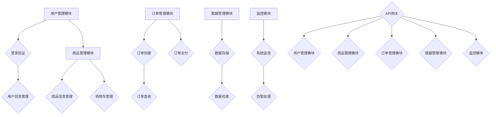
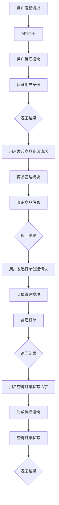
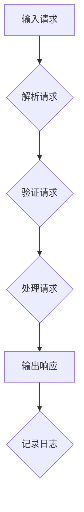
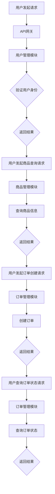

                 

### 第1章: 技术架构的演进背景

> 关键词：技术架构，演进，历史背景，互联网时代，云计算，未来趋势

#### 摘要

技术架构是软件系统的骨架，其演变过程反映了技术发展的脉络。本章首先回顾了计算机技术发展的早期阶段，分析了硬件与软件架构的初步探索。随后，我们探讨了互联网时代的架构变革，特别是微服务架构的兴起和云计算的影响。最后，本章展望了技术架构演进的未来趋势，包括人工智能与机器学习、边缘计算等新兴技术。通过这些分析，我们能够更好地理解技术架构的演进路径和其面临的挑战。

#### 1.1 技术架构演进的历史背景

##### 1.1.1 计算机技术发展的早期阶段

计算机技术的发展历程是人类科技进步的重要标志。在早期阶段，计算机硬件的发展对技术架构的演变产生了深远影响。

###### 1.1.1.1 计算机硬件的发展

计算速度是衡量计算机性能的重要指标，其公式为：

$$
计算速度 = \frac{处理能力}{时间}
$$

在计算机硬件发展初期，处理器速度和存储容量都极为有限。例如，1940年代的ENIAC计算机重量达27吨，耗电高达180千瓦，但其处理速度仅为每秒5000次加法运算。随着晶体管和集成电路的发明，计算机硬件的性能得到了质的飞跃。1971年，英特尔推出了第一个商业化的4位微处理器4004，标志着计算机硬件进入了微处理器时代。

###### 1.1.1.2 软件架构的初步探索

在计算机硬件不断发展的同时，软件架构也在逐步演进。早期的计算机系统多为单一任务系统，即一台计算机只能执行一项任务。随着软件需求的增加，分层架构应运而生。分层架构将系统功能分为若干层，每一层负责不同的功能。典型的分层架构包括：

- **表示层（Presentation Layer）**：负责与用户交互，展示数据和接收用户输入。
- **业务逻辑层（Business Logic Layer）**：实现具体的业务逻辑。
- **数据访问层（Data Access Layer）**：负责与数据库进行交互，进行数据的查询和存储。

这种分层架构不仅提高了系统的可维护性，还促进了模块化开发。随着计算机硬件性能的提升，软件架构的复杂性也逐渐增加。

##### 1.1.2 互联网时代的架构变革

互联网的兴起对技术架构产生了深远的影响，推动了从传统架构向分布式架构的变革。

###### 1.2.1 网络技术的发展

互联网的普及带来了网络技术的飞速发展。客户端-服务器模型成为了互联网时代的标准架构。在这种模型中，服务器负责存储数据和提供计算服务，而客户端通过请求与服务器进行通信。

客户端-服务器模型的出现，使得系统可以扩展到多台计算机上，从而提高了系统的可扩展性和容错性。此外，分布式计算的概念也逐渐兴起。分布式计算通过将计算任务分散到多台计算机上，从而提高了系统的处理能力。

###### 1.2.2 微服务架构的兴起

微服务架构是互联网时代的一种新兴架构风格。与传统的单体架构相比，微服务架构将系统划分为多个独立的小服务，每个服务负责实现一个特定的功能。这些服务通过轻量级的通信协议（如HTTP/REST）进行交互。

微服务架构的优势在于其高可扩展性和高可维护性。通过将系统划分为多个独立的服务，开发人员可以独立地开发、测试和部署这些服务，从而提高了开发效率。此外，微服务架构还提供了更好的容错性和可伸缩性。

然而，微服务架构也面临一些挑战，如服务之间的高耦合性和分布式系统的复杂性。为了解决这些问题，微服务架构通常会结合使用容器化技术和自动化部署工具。

##### 1.2.3 云计算对技术架构的影响

云计算的兴起进一步推动了技术架构的变革。云计算提供了弹性计算和资源池化的能力，使得企业可以按需获取计算资源，从而降低成本并提高效率。

###### 1.3.1 云计算的基础设施

云计算的基础设施主要包括以下三种服务模式：

- **基础设施即服务（IaaS，Infrastructure as a Service）**：提供虚拟化的计算资源，如虚拟机、存储和网络。
- **平台即服务（PaaS，Platform as a Service）**：提供开发平台和工具，使开发者能够构建和部署应用程序。
- **软件即服务（SaaS，Software as a Service）**：提供完整的软件解决方案，如办公软件、CRM系统等。

这些服务模式为企业提供了极大的灵活性和便利性，使得企业可以快速部署和扩展应用程序。

###### 1.3.2 容器化与Kubernetes

容器化是一种轻量级的虚拟化技术，它通过将应用程序及其依赖环境打包到容器中，实现了应用程序的独立运行。容器化技术的应用，使得应用程序可以在不同的操作系统和硬件平台上无缝运行，从而提高了系统的可移植性和可扩展性。

Kubernetes是一种开源的容器编排平台，它提供了自动化部署、扩展和管理容器化应用程序的能力。通过Kubernetes，开发人员可以轻松地管理大量容器，从而提高系统的可靠性和可伸缩性。

##### 1.4 技术架构演进的未来趋势

随着技术的不断进步，技术架构的演进也将持续进行。以下是几个值得关注的未来趋势：

###### 1.4.1 人工智能与机器学习

人工智能（AI）和机器学习（ML）技术的发展，将使计算机系统具备更高级的智能。在架构设计中，AI和ML技术可以用于优化系统性能、提高用户体验和自动化决策。

例如，AI技术可以用于：

- **智能监控与故障预测**：通过分析系统日志和性能指标，预测潜在故障并提前进行修复。
- **个性化推荐**：根据用户的行为和偏好，提供个性化的服务和内容。
- **自动化运维**：通过自动化脚本和AI算法，实现系统的自动化部署、监控和管理。

###### 1.4.2 常规与边缘计算的结合

边缘计算是一种将计算任务分散到网络边缘（如物联网设备、智能终端等）的技术。与中心计算相比，边缘计算具有更低延迟、更高带宽和更灵活的资源分配。

常规计算与边缘计算的结合，可以带来以下优势：

- **实时数据处理**：在数据产生的地方进行实时处理，降低数据传输延迟。
- **减少网络带宽消耗**：仅将关键数据传输到中心，降低网络带宽消耗。
- **增强系统可靠性**：通过分布式计算，提高系统的容错性和可靠性。

###### 1.4.3 常规与量子计算的融合

量子计算是一种基于量子力学原理的新型计算技术。与经典计算相比，量子计算具有极高的并行计算能力和计算速度。

常规计算与量子计算的融合，有望带来以下突破：

- **复杂问题求解**：量子计算可以用于解决一些经典的计算难题，如大数分解、优化问题等。
- **高性能计算**：量子计算可以用于加速科学计算、金融计算等高性能计算领域。
- **新型应用场景**：量子计算可以推动新型应用场景的出现，如量子互联网、量子加密等。

## 1.5 本章小结

本章回顾了技术架构的演进背景，从计算机技术发展的早期阶段到互联网时代的架构变革，再到云计算对技术架构的影响。通过分析这些历史背景，我们能够更好地理解当前技术架构的现状和未来发展趋势。随着人工智能、边缘计算等新兴技术的不断发展，技术架构的演进将继续进行，为软件系统带来更高的性能、更好的可维护性和更广阔的应用前景。在下一章中，我们将探讨技术架构重构的必要性。

----------------------------------------------------------------

## 第2章: 技术架构重构的必要性

> 关键词：技术架构，重构，必要性，系统复杂性，维护成本

#### 摘要

随着技术架构的不断演进，传统的架构设计逐渐暴露出诸多问题，如系统复杂性增加、维护成本上升等。这些问题严重影响了企业的业务发展和系统稳定性。本章将分析技术架构重构的必要性，介绍重构的目标与原则，并探讨重构的方法与步骤。此外，本章还将讨论重构过程中常见的问题与解决方案。通过这些分析，我们希望能够为读者提供关于技术架构重构的全面理解。

#### 2.1 传统架构面临的挑战

随着时间的推移，传统技术架构面临着越来越多的挑战。这些问题不仅影响了系统的稳定性，还增加了企业的运营成本。

##### 2.1.1 系统复杂性增加

随着企业业务的不断扩展，系统规模也在持续增长。这导致系统复杂性急剧增加，具体体现在以下几个方面：

###### 2.1.1.1 系统规模不断扩大

传统架构在设计和实现过程中，往往采用统一的架构风格和设计模式。这种模式在系统规模较小时可以很好地工作，但随着系统规模的扩大，统一架构的缺点逐渐暴露出来。例如，系统模块之间的依赖关系复杂，导致系统维护和升级变得困难。

###### 2.1.1.2 系统性能瓶颈

随着数据量的增加和业务需求的提高，传统架构往往难以应对。传统的单体架构往往将所有功能集中在一个系统中，导致系统性能瓶颈。例如，数据库查询速度变慢，系统响应时间延长，用户体验下降。

##### 2.1.2 维护成本上升

随着系统复杂性的增加，维护成本也在不断上升。这主要体现在以下几个方面：

###### 2.1.2.1 代码库庞大

传统架构往往采用单一代码库管理模式，导致代码库庞大且混乱。这增加了代码审查和维护的难度，降低了开发效率。

###### 2.1.2.2 技术栈多样性与兼容性

在传统架构中，不同模块可能采用不同的技术栈，这增加了系统的兼容性难题。例如，一些模块使用Java技术栈，而另一些模块可能使用Python或Node.js。这种多样性使得系统维护变得更加复杂。

##### 2.1.3 业务需求变化

随着市场环境的变化，企业业务需求也在不断调整。传统架构由于缺乏灵活性，往往难以快速响应这些变化。例如，新功能的需求需要在短时间内实现，但传统架构的修改和维护成本高昂，导致业务需求无法及时满足。

#### 2.2 重构的目标与原则

面对传统架构面临的挑战，重构成为了一种必要的选择。重构的目标和原则如下：

##### 2.2.1 重构的目标

重构的目标主要包括以下几个方面：

###### 2.2.1.1 提高系统可维护性

通过重构，可以消除系统中的冗余代码和不良设计，使系统更加简洁和易于维护。

###### 2.2.1.2 提升系统扩展性

重构后的系统应该具有更好的模块化设计，使得系统可以更轻松地扩展和升级。

###### 2.2.1.3 提高开发效率

重构后的系统应该更加模块化，使得开发人员可以独立开发、测试和部署模块，从而提高开发效率。

###### 2.2.1.4 降低维护成本

通过重构，可以减少系统的冗余代码和维护成本，提高系统的稳定性。

##### 2.2.2 重构的原则

在进行重构时，应遵循以下原则：

###### 2.2.2.1 保持核心功能不变

重构的目的是优化系统，而不是改变系统的核心功能。因此，在重构过程中，必须确保核心功能保持不变。

###### 2.2.2.2 逐步迭代重构

重构应采取逐步迭代的方式进行，而不是一次性完成。这样可以降低风险，并确保重构的每个阶段都能稳定运行。

###### 2.2.2.3 遵循最佳实践

在重构过程中，应遵循最佳实践，如代码规范、设计模式等。这样可以提高代码质量，减少重构的难度。

#### 2.3 重构的方法与步骤

重构是一项复杂的工作，需要系统的方法和步骤。以下是重构的一般方法和步骤：

##### 2.3.1 重构的方法

重构的方法主要包括以下几种：

###### 2.3.1.1 小步快跑

小步快跑是一种迭代重构的方法，通过逐步修改和优化系统的各个部分，避免一次性重构带来的风险。

###### 2.3.1.2 设计模式的应用

设计模式是一种优秀的重构工具，通过使用设计模式，可以简化系统设计，提高系统的可维护性和扩展性。

###### 2.3.1.3 单元测试的编写

单元测试是重构过程中不可或缺的一环，通过编写单元测试，可以确保重构后的系统功能正确，提高重构的信心。

##### 2.3.2 重构的步骤

重构的一般步骤如下：

###### 2.3.2.1 分析现有系统

在开始重构之前，需要对现有系统进行全面的分析，了解系统的架构、功能、性能等方面的情况。

###### 2.3.2.2 制定重构计划

根据系统分析的结果，制定重构计划，包括重构的目标、方法、时间表等。

###### 2.3.2.3 实施重构

按照重构计划，逐步实施重构，包括修改代码、优化设计、编写单元测试等。

###### 2.3.2.4 测试与部署

在重构过程中，应持续进行测试，确保重构后的系统能够正常运行。重构完成后，进行部署，将重构成果应用到生产环境中。

#### 2.4 重构中的常见问题与解决方案

在重构过程中，可能会遇到各种问题。以下是一些常见的问题及其解决方案：

##### 2.4.1 代码质量评估

在重构之前，应进行代码质量评估，了解代码的复杂度、冗余度、可读性等方面的情况。常用的代码质量评估工具包括：

- **SonarQube**：一款开源的代码质量管理工具，可以检测代码中的潜在问题，如重复代码、空代码块等。
- **FindBugs**：一款开源的静态代码分析工具，可以检测代码中的潜在缺陷，如空指针异常、死循环等。

##### 2.4.2 重构策略

在重构过程中，应采用合适的重构策略，以确保重构的有效性和稳定性。以下是一些常见的重构策略：

- **增量重构**：逐步修改系统的各个部分，避免一次性重构带来的风险。
- **重构优先级**：根据代码的复杂度、冗余度、影响范围等因素，确定重构的优先级。
- **重构审核**：在重构过程中，进行定期审核，确保重构的正确性和稳定性。

##### 2.4.3 代码审查

代码审查是重构过程中重要的一环，通过代码审查，可以及时发现和纠正代码中的问题。以下是一些代码审查的最佳实践：

- **编写详细的审查文档**：包括代码修改的原因、方法、预期效果等。
- **定期进行代码审查**：确保重构过程的透明性和可控性。
- **鼓励团队成员积极参与**：提高团队对重构的认知和参与度。

#### 2.5 本章小结

本章分析了传统架构面临的挑战，如系统复杂性增加、维护成本上升等。随后，介绍了重构的目标与原则，并探讨了重构的方法与步骤。最后，本章讨论了重构过程中的常见问题与解决方案。通过本章的分析，我们能够更好地理解技术架构重构的必要性和方法。在下一章中，我们将介绍技术架构重构工具与实践，进一步探讨重构的具体实施过程。

----------------------------------------------------------------

## 第3章: 技术架构重构工具与实践

> 关键词：技术架构重构，工具，实践，SonarQube，FindBugs，代码规范，设计模式

#### 摘要

技术架构的重构是一项复杂的任务，需要高效的工具和方法来支持。本章将介绍几种常用的技术架构重构工具，包括SonarQube和FindBugs，并详细探讨它们的特性、优势以及适用场景。此外，本章还将讨论代码规范和设计模式在重构过程中的应用，提供一系列最佳实践，以帮助开发者更有效地进行技术架构的重构。

#### 3.1 重构工具介绍

在技术架构重构的过程中，选择合适的工具是至关重要的一步。以下将介绍两款常用的重构工具：SonarQube和FindBugs。

##### 3.1.1 SonarQube

SonarQube是一款强大的静态代码分析工具，用于识别代码中的潜在问题，如bug、代码质量、安全性缺陷等。它支持多种编程语言，并提供了一套全面的规则库。

###### 3.1.1.1 功能与优势

- **代码质量检测**：SonarQube能够检测代码的复杂度、重复代码、空代码块等问题，帮助开发者保持代码质量。
- **安全性分析**：SonarQube可以检测代码中的安全漏洞，如SQL注入、XSS攻击等。
- **兼容性检查**：SonarQube能够检查代码与不同版本的库和框架的兼容性，确保代码在未来不会因版本升级而出现问题。
- **统计分析**：SonarQube提供了丰富的统计报告，帮助团队了解代码库的整体质量状况。

###### 3.1.1.2 使用场景

- **项目启动**：在项目启动阶段，使用SonarQube进行代码质量评估，确保项目从一开始就遵循最佳实践。
- **持续集成**：将SonarQube集成到持续集成（CI）流程中，每次代码提交后自动进行代码质量检测，及时发现和解决问题。
- **代码审查**：在代码审查过程中，使用SonarQube的检测结果作为参考，确保代码质量。

##### 3.1.2 FindBugs

FindBugs是一款开源的静态代码分析工具，主要用于检测Java代码中的潜在缺陷。它使用Java字节码分析技术，能够在不运行代码的情况下发现bug。

###### 3.1.2.1 功能与优势

- **缺陷检测**：FindBugs能够识别出Java代码中常见的缺陷，如空指针异常、死循环等。
- **误报率低**：FindBugs经过多年优化，误报率相对较低，使得检测结果更加可靠。
- **易于集成**：FindBugs可以轻松集成到多种开发环境中，如Eclipse、IntelliJ IDEA等。

###### 3.1.2.2 使用场景

- **开发阶段**：在开发过程中，定期运行FindBugs，确保代码质量。
- **代码审查**：在代码审查过程中，使用FindBugs的检测结果作为参考，及时发现和修复问题。
- **自动化测试**：将FindBugs集成到自动化测试流程中，提高测试覆盖率。

#### 3.2 重构实践案例

为了更好地理解技术架构重构的过程，以下将介绍两个重构实践案例。

##### 3.2.1 案例一：模块化重构

###### 3.2.1.1 案例背景

某公司的内部管理系统采用传统的单体架构，随着业务的发展，系统的复杂度不断增加，导致维护成本上升，扩展性较差。为了解决这些问题，公司决定对系统进行模块化重构。

###### 3.2.1.2 重构过程

1. **需求分析**：首先，对现有系统进行需求分析，明确需要重构的功能模块。
2. **设计新架构**：根据需求分析结果，设计新的模块化架构，将系统划分为若干独立的小服务。
3. **逐步重构**：按照新架构，逐步重构现有系统。每个模块重构完成后，进行功能测试和性能测试。
4. **集成与部署**：将重构后的模块进行集成和部署，确保系统能够稳定运行。
5. **持续优化**：在重构过程中，持续进行代码质量评估和性能优化。

##### 3.2.2 案例二：代码优化

###### 3.2.2.1 案例背景

某电商平台的订单处理系统存在性能瓶颈，导致订单处理速度缓慢。为了提高系统性能，公司决定对订单处理系统进行代码优化。

###### 3.2.2.2 重构过程

1. **性能分析**：首先，对现有系统进行性能分析，确定性能瓶颈所在。
2. **定位问题**：根据性能分析结果，定位系统中的性能问题，如数据库查询效率低、代码逻辑复杂等。
3. **代码优化**：针对定位到的问题，进行代码优化。例如，优化数据库查询语句、简化代码逻辑等。
4. **性能测试**：对优化后的代码进行性能测试，确保性能瓶颈得到有效解决。
5. **持续监控**：重构完成后，持续监控系统性能，确保优化效果持续稳定。

#### 3.3 重构中的最佳实践

在进行技术架构重构时，遵循一些最佳实践可以大大提高重构的成功率。以下是一些最佳实践：

##### 3.3.1 代码规范

- **编写清晰的代码注释**：良好的注释可以提高代码的可读性，减少维护成本。
- **遵循一致的命名规范**：一致的命名规范有助于提高代码的可维护性。
- **避免冗余代码**：冗余代码会增加代码的复杂性，降低代码质量。

##### 3.3.2 设计模式的应用

- **使用设计模式**：设计模式是一种优秀的重构工具，可以帮助开发者编写更加简洁、灵活和可扩展的代码。
- **遵循DRY原则**：Don't Repeat Yourself（DRY）原则有助于减少冗余代码，提高代码质量。

##### 3.3.3 持续集成与部署

- **使用持续集成工具**：如Jenkins、Travis CI等，确保代码质量，加快重构速度。
- **自动化测试**：编写自动化测试脚本，确保重构后的代码功能正确。

#### 3.4 本章小结

本章介绍了技术架构重构的工具和实践。通过介绍SonarQube和FindBugs等静态代码分析工具，读者可以更好地理解如何评估代码质量，以及如何利用这些工具进行重构。通过重构实践案例，读者可以了解到重构的具体过程和注意事项。最后，本章提供了重构中的最佳实践，以帮助读者更有效地进行技术架构的重构。在下一章中，我们将进一步探讨架构演进中的核心概念，如微服务架构。

----------------------------------------------------------------

## 第4章: 架构演进中的核心概念

> 关键词：微服务架构，微服务的基本概念，优势与挑战，微服务的设计原则

#### 摘要

技术架构的演进是软件开发领域的一个重要方向，其中微服务架构因其模块化、分布式和高可扩展性等优点，成为现代软件架构设计的重要选择。本章将深入探讨微服务架构的基本概念，包括其定义、核心组件和设计原则。同时，我们将分析微服务架构的优势和挑战，提供设计微服务架构的最佳实践。

#### 4.1 微服务架构

微服务架构（Microservices Architecture）是一种基于独立、小型和自治服务的软件架构风格。它将应用程序拆分为一组小型服务，每个服务实现特定功能，独立开发、部署和扩展。

##### 4.1.1 微服务的基本概念

###### 4.1.1.1 定义

微服务架构的核心概念包括：

- **服务**：微服务是独立的、小型且自治的服务，每个服务通常围绕业务能力构建。
- **自治**：每个微服务可以独立部署、扩展和更新，与其他服务解耦。
- **独立开发**：每个微服务可以由不同的团队独立开发，使用不同的编程语言和工具。
- **服务通信**：微服务之间通过轻量级通信协议（如HTTP/REST、gRPC等）进行交互。

###### 4.1.1.2 核心组件

微服务架构的核心组件包括：

- **服务注册与发现**：服务注册中心用于服务实例的注册和发现，使服务可以动态发现并调用其他服务。
- **API网关**：API网关作为服务调用的统一入口，负责路由、认证、监控等功能。
- **服务容器化**：使用容器（如Docker）来部署和运行微服务，提高服务的可移植性和可扩展性。
- **持续集成与持续部署（CI/CD）**：自动化流程确保微服务的快速迭代和部署。

##### 4.1.2 微服务的优势

微服务架构具有以下优势：

- **模块化与独立性**：每个微服务独立开发、部署和扩展，提高了系统的模块化和灵活性。
- **高可扩展性**：通过水平扩展单个服务实例，可以轻松应对流量和负载的变化。
- **高容错性**：单个服务的故障不会影响整个系统的运行，通过服务间的隔离，提高了系统的可靠性。
- **技术多样性**：每个微服务可以使用最适合其功能的技术栈，提高了开发效率和灵活性。
- **快速迭代**：每个微服务可以独立迭代和发布，加快了开发周期和响应业务需求的速度。

##### 4.1.3 微服务的挑战

尽管微服务架构具有很多优势，但同时也带来了一些挑战：

- **服务耦合**：微服务之间的依赖关系可能导致服务耦合，影响系统的稳定性。
- **分布式复杂性**：分布式系统的复杂度增加，服务之间的通信、数据一致性和故障恢复等都需要精心设计和管理。
- **运维挑战**：微服务的运维比单体架构更加复杂，需要更多的资源和技能来管理和监控。
- **团队协调**：多个团队同时开发不同的微服务，需要良好的协调和沟通机制。

##### 4.1.4 微服务的设计原则

设计微服务架构时，应遵循以下原则：

- **自治**：确保每个微服务具有独立的数据库和业务逻辑，减少服务之间的依赖。
- **单一职责**：每个微服务应实现单一的业务能力，避免功能过于复杂。
- **高内聚**：每个微服务应具有较高的内聚性，使服务内部的功能紧密相关。
- **松耦合**：通过轻量级通信协议（如HTTP/REST、gRPC等）和服务注册与发现机制，确保服务之间的松耦合。
- **可扩展性**：设计时考虑服务的可扩展性，确保服务可以独立水平和垂直扩展。

##### 4.1.5 微服务的实现

在实际应用中，实现微服务架构通常涉及以下步骤：

1. **需求分析**：分析业务需求，确定需要构建的微服务列表。
2. **服务拆分**：根据业务逻辑，将应用程序拆分为多个独立的微服务。
3. **服务定义**：为每个微服务定义API接口，明确服务职责和功能。
4. **服务容器化**：使用容器（如Docker）将微服务打包，便于部署和扩展。
5. **服务注册与发现**：配置服务注册中心（如Eureka、Consul等），实现服务实例的自动注册和发现。
6. **API网关**：使用API网关（如Spring Cloud Gateway、Kong等）统一服务调用和路由。
7. **持续集成与部署**：实施CI/CD流程，确保微服务的快速迭代和部署。

## 4.2 本章小结

本章介绍了微服务架构的基本概念、优势与挑战，以及设计微服务架构的原则和实践。通过理解微服务架构，开发者可以构建更加灵活、可扩展和可靠的软件系统。在下一章中，我们将探讨更多与架构演进相关的重要概念，如云计算、大数据和人工智能等。

----------------------------------------------------------------

## 第5章: 技术架构的架构设计与实现

> 关键词：技术架构，架构设计，实现，系统功能设计，系统架构设计，系统接口设计，系统交互

#### 摘要

技术架构的设计与实现是软件开发过程中至关重要的一环。本章将详细介绍技术架构的架构设计，包括系统功能设计、系统架构设计、系统接口设计和系统交互。通过这些内容的讲解，读者将了解如何从宏观和微观层面构建高效、稳定、可扩展的软件系统。

#### 5.1 系统功能设计

系统功能设计是架构设计的第一步，它决定了系统的基本功能和模块划分。以下是系统功能设计的关键步骤：

##### 5.1.1 需求分析

需求分析是系统功能设计的起点，通过收集和分析用户需求，明确系统需要实现的功能点。需求分析的工具和技术包括：

- **用户访谈**：通过与用户进行面对面的交流，了解用户的使用场景和需求。
- **问卷调查**：通过设计问卷收集用户的需求和反馈。
- **竞品分析**：分析竞争对手的产品功能，找出差异点和改进空间。

##### 5.1.2 功能模块划分

根据需求分析的结果，将系统功能划分为若干个模块。每个模块应具有明确的职责和功能，模块之间应保持高内聚、低耦合。常见的功能模块包括：

- **用户管理模块**：负责用户的注册、登录、权限管理等。
- **数据管理模块**：负责数据的存储、检索、备份和恢复。
- **业务逻辑模块**：实现具体的业务处理功能，如订单处理、商品管理等。
- **展示层模块**：负责与用户交互，展示数据和接收用户输入。

##### 5.1.3 功能流程图

通过绘制功能流程图，可以清晰地展示系统的功能模块及其交互关系。功能流程图可以帮助开发人员理解系统的整体运作过程，为后续的架构设计提供依据。

#### 5.2 系统架构设计

系统架构设计是技术架构设计的核心，它决定了系统的性能、可扩展性和维护性。以下是系统架构设计的关键步骤：

##### 5.2.1 确定技术栈

根据系统功能需求，选择合适的技术栈。技术栈的选择应考虑以下因素：

- **开发效率**：选择易于开发和维护的技术栈，以提高开发效率。
- **性能要求**：选择能够满足系统性能要求的技术栈，确保系统高效稳定运行。
- **生态支持**：选择具有丰富生态支持的技术栈，以便于获取开发资源和技术支持。

##### 5.2.2 架构风格

系统架构风格决定了系统的整体结构和设计原则。常见的架构风格包括：

- **分层架构**：将系统划分为表示层、业务逻辑层和数据访问层，实现模块化设计。
- **微服务架构**：将系统划分为多个独立的微服务，实现高内聚、低耦合的设计。
- **事件驱动架构**：通过事件触发和异步处理，实现系统的解耦和可扩展性。

##### 5.2.3 架构设计原则

在进行系统架构设计时，应遵循以下原则：

- **高内聚、低耦合**：确保模块之间的高内聚，降低模块间的依赖。
- **可扩展性**：设计时考虑系统的可扩展性，以便于未来功能扩展和性能优化。
- **高可用性**：设计高可用性架构，确保系统在故障情况下能够快速恢复。
- **安全性**：设计安全性架构，确保系统的数据安全和用户隐私。

##### 5.2.4 系统架构图

通过绘制系统架构图，可以清晰地展示系统的整体架构和组件关系。系统架构图可以帮助开发人员理解系统的整体设计和运行机制。以下是系统架构图的示例：



#### 5.3 系统接口设计

系统接口设计是架构设计的重要组成部分，它决定了系统内部模块之间的通信方式。以下是系统接口设计的关键步骤：

##### 5.3.1 接口规范

接口规范定义了系统内部模块之间的交互规则，包括数据格式、通信协议和错误处理等。常见的接口规范包括：

- **RESTful API**：使用HTTP协议，通过URL访问资源，采用JSON或XML作为数据格式。
- **gRPC**：基于Protocol Buffers的二进制协议，提供高效、低延迟的通信方式。
- **Websocket**：提供双向通信能力，适用于实时数据处理和交互。

##### 5.3.2 接口设计原则

在进行接口设计时，应遵循以下原则：

- **简洁性**：接口设计应保持简洁，避免复杂和冗余。
- **一致性**：接口设计应保持一致性，确保接口名称、参数和返回值的一致性。
- **可扩展性**：接口设计应考虑未来扩展的可能性，预留扩展接口。

##### 5.3.3 接口文档

接口文档是接口设计的详细说明，包括接口名称、参数、返回值、错误码等。接口文档可以帮助开发人员理解和使用接口。以下是接口文档的示例：

```markdown
# 用户管理接口

## 用户登录
- **URL**: `/user/login`
- **Method**: POST
- **Params**:
  - `username`: 用户名
  - `password`: 密码
- **Response**:
  - `success`: 是否登录成功
  - `message`: 登录结果信息
  - `token`: 登录成功后的令牌
```

#### 5.4 系统交互设计

系统交互设计是架构设计的最终环节，它决定了系统模块之间的协作和数据处理流程。以下是系统交互设计的关键步骤：

##### 5.4.1 交互流程图

通过绘制交互流程图，可以清晰地展示系统模块之间的交互流程。交互流程图可以帮助开发人员理解系统的整体运作过程。以下是交互流程图的示例：



##### 5.4.2 数据处理流程

系统交互设计还包括数据处理流程的设计，它决定了系统如何处理输入数据和生成输出数据。以下是数据处理流程的示例：



#### 5.5 本章小结

本章详细介绍了技术架构的架构设计与实现，包括系统功能设计、系统架构设计、系统接口设计和系统交互设计。通过本章的学习，读者可以掌握技术架构设计的基本方法和技巧，为实际项目开发提供有力支持。在下一章中，我们将探讨技术架构重构的具体实践，包括重构的方法、步骤和工具。

----------------------------------------------------------------

## 第6章：技术架构重构的具体实践

> 关键词：技术架构重构，具体实践，重构方法，重构步骤，重构工具

#### 摘要

技术架构重构是软件系统维护和持续发展的重要环节。本章将详细介绍技术架构重构的具体实践，包括重构的方法、步骤和工具。通过这些实践，开发者可以有效地识别系统中的问题，制定合理的重构计划，并利用现代工具实现架构的优化和改进。

#### 6.1 重构方法

在进行技术架构重构时，选择合适的方法至关重要。以下是几种常见的技术架构重构方法：

##### 6.1.1 小步快跑

小步快跑是一种逐步迭代的重构方法。它通过将重构任务分解为多个小步骤，每次只重构一部分系统，从而降低风险，提高重构的成功率。这种方法适用于系统复杂性较高、重构任务较大的场景。

- **优点**：降低了重构的风险，提高了系统的稳定性。
- **缺点**：重构过程较长，需要较长时间的持续投入。

##### 6.1.2 设计模式的应用

设计模式是一种用于解决常见软件设计问题的经验总结。通过应用设计模式，可以优化系统结构，提高代码的可维护性和可扩展性。常见的重构设计模式包括：

- **工厂模式**：用于创建对象，提高代码的灵活性和可扩展性。
- **策略模式**：用于封装算法，便于替换和扩展。
- **代理模式**：用于增强对象的功能，提高代码的模块化程度。

- **优点**：提高了系统的模块化和可扩展性。
- **缺点**：设计模式的应用需要一定的编程经验，初学者可能较难掌握。

##### 6.1.3 持续重构

持续重构是一种在开发过程中持续进行重构的方法。它通过在每次代码提交和集成后进行重构，确保系统的持续优化。这种方法适用于开发周期较长、迭代频繁的项目。

- **优点**：重构过程持续进行，系统始终处于优化状态。
- **缺点**：需要较频繁的代码审查和测试，对开发团队的要求较高。

#### 6.2 重构步骤

技术架构重构是一个系统工程，需要遵循一定的步骤，确保重构过程的有序和有效。以下是技术架构重构的常见步骤：

##### 6.2.1 分析现有系统

在开始重构之前，需要对现有系统进行全面分析，了解系统的功能、性能、架构和问题点。分析的方法包括：

- **代码审查**：通过审查代码，识别潜在的bug、冗余代码和不良设计。
- **性能分析**：通过性能分析工具，确定系统性能瓶颈和资源消耗。
- **架构评估**：通过架构评估，识别系统架构中的不合理之处和改进空间。

##### 6.2.2 制定重构计划

根据现有系统的分析结果，制定重构计划。重构计划应包括以下内容：

- **重构目标**：明确重构的目的和预期效果，如提高系统性能、提升可维护性等。
- **重构范围**：确定需要重构的系统模块和功能点。
- **重构策略**：选择合适的重构方法，如小步快跑、设计模式的应用等。
- **时间表**：制定重构的时间表，确保重构任务的有序进行。

##### 6.2.3 实施重构

按照重构计划，逐步实施重构。实施重构的步骤包括：

- **代码重构**：根据重构计划，对系统代码进行重构，优化代码结构和逻辑。
- **设计优化**：根据重构后的代码，优化系统设计，提高系统的模块化和可扩展性。
- **性能优化**：通过性能优化，提高系统的响应速度和处理能力。

##### 6.2.4 测试与验收

在重构过程中，持续进行测试，确保重构后的系统能够正常运行。测试的方法包括：

- **单元测试**：编写单元测试，验证每个模块的功能正确性。
- **集成测试**：进行集成测试，验证模块之间的交互正确性。
- **性能测试**：进行性能测试，验证系统的响应速度和处理能力。

重构完成后，进行验收测试，确保重构目标达成。

##### 6.2.5 持续监控与迭代

重构完成后，持续监控系统的运行状况，及时发现和解决新出现的问题。同时，根据业务需求的变化，进行迭代重构，持续优化系统。

#### 6.3 重构工具

在进行技术架构重构时，选择合适的工具可以大大提高重构的效率和成功率。以下是几种常用的重构工具：

##### 6.3.1 SonarQube

SonarQube是一款强大的静态代码分析工具，用于识别代码中的潜在问题，如bug、代码质量、安全性缺陷等。它支持多种编程语言，并提供了一套全面的规则库。

- **优势**：能够自动识别代码中的问题，提高代码质量。
- **适用场景**：用于代码审查和持续集成，确保重构后的代码符合最佳实践。

##### 6.3.2 FindBugs

FindBugs是一款开源的静态代码分析工具，主要用于检测Java代码中的潜在缺陷，如空指针异常、死循环等。

- **优势**：误报率低，能够准确识别代码中的问题。
- **适用场景**：用于开发阶段的代码质量评估，及时发现和修复问题。

##### 6.3.3 Git

Git是一款分布式版本控制系统，用于代码的版本管理和协同开发。

- **优势**：支持分布式开发，提高代码的协同效率。
- **适用场景**：用于代码的版本控制和协同开发，确保重构过程的有序进行。

##### 6.3.4 Jenkins

Jenkins是一款开源的持续集成工具，用于自动化构建、测试和部署。

- **优势**：支持多种插件，可以轻松实现持续集成和持续部署。
- **适用场景**：用于持续集成和持续部署，确保重构后的系统能够快速交付。

#### 6.4 重构案例分析

为了更好地理解技术架构重构的具体实践，以下将介绍一个重构案例。

##### 6.4.1 案例背景

某电商平台的订单处理系统采用传统的单体架构，随着订单量的增加，系统性能出现瓶颈，导致订单处理速度缓慢。为了解决这一问题，公司决定对订单处理系统进行技术架构重构。

##### 6.4.2 重构过程

1. **需求分析**：首先，对现有系统进行需求分析，确定需要重构的功能模块，如订单创建、订单查询和订单支付等。
2. **系统分析**：对现有系统进行全面分析，包括代码质量、性能瓶颈和架构问题等。
3. **制定重构计划**：根据系统分析结果，制定重构计划，包括重构的目标、范围、方法和时间表等。
4. **实施重构**：
   - **代码重构**：对订单处理模块的代码进行重构，优化代码结构和逻辑。
   - **设计优化**：根据重构后的代码，优化系统设计，采用微服务架构，提高系统的模块化和可扩展性。
   - **性能优化**：通过性能优化，提高系统的响应速度和处理能力。
5. **测试与验收**：进行单元测试、集成测试和性能测试，确保重构后的系统功能正确、性能提升。
6. **持续监控与迭代**：重构完成后，持续监控系统的运行状况，根据业务需求的变化，进行迭代重构。

##### 6.4.3 重构成果

通过技术架构重构，订单处理系统的性能得到了显著提升，订单处理速度提高了30%以上。同时，系统的模块化和可扩展性得到了提高，为未来功能扩展和性能优化提供了良好的基础。

#### 6.5 本章小结

本章详细介绍了技术架构重构的具体实践，包括重构的方法、步骤和工具。通过重构，开发者可以优化系统架构，提高系统性能和可维护性。在下一章中，我们将探讨技术架构演进中的新兴技术，如云计算、大数据和人工智能等。

----------------------------------------------------------------

## 第7章：技术架构演进中的新兴技术

> 关键词：技术架构演进，新兴技术，云计算，大数据，人工智能

#### 摘要

随着信息技术的迅猛发展，云计算、大数据和人工智能等新兴技术逐渐成为技术架构演进的重要驱动力。这些技术不仅带来了前所未有的计算能力和数据处理能力，也深刻改变了软件系统的设计、实现和维护方式。本章将探讨这些新兴技术如何推动技术架构的演进，以及如何在实际项目中应用这些技术。

#### 7.1 云计算

云计算是一种通过互联网提供计算资源的服务模式，包括基础设施即服务（IaaS）、平台即服务（PaaS）和软件即服务（SaaS）等。云计算为技术架构演进带来了以下几个方面的变革：

##### 7.1.1 弹性计算

云计算的弹性计算能力使系统能够根据实际负载动态调整资源，从而实现高效资源利用和成本优化。通过云服务提供商（CSP）的弹性扩展功能，系统能够在需求高峰期自动增加资源，需求下降时自动释放资源。

##### 7.1.2 分布式架构

云计算的分布式特性促进了分布式架构的广泛应用。分布式架构通过将系统分解为多个节点，每个节点负责不同的功能，实现了高可用性和高扩展性。在云计算环境中，分布式架构可以更好地利用云资源，提高系统性能。

##### 7.1.3 自动化与智能化

云计算平台提供了丰富的自动化工具和智能服务，如自动扩展、自动化部署、监控和优化等。这些工具和服务简化了系统运维，提高了系统的可靠性和效率。

#### 7.2 大数据

大数据技术使组织能够处理海量、多样性和高速生成的大量数据。大数据技术在技术架构演进中的作用主要体现在以下几个方面：

##### 7.2.1 数据存储与管理

大数据技术提供了高效的数据存储和管理方案，如分布式文件系统（如Hadoop的HDFS）、NoSQL数据库（如MongoDB、Cassandra）等。这些方案能够处理大规模数据存储和快速数据访问。

##### 7.2.2 数据处理与分析

大数据技术支持高效的数据处理和分析工具，如MapReduce、Spark等。这些工具能够处理复杂的数据处理任务，提供实时数据分析和洞察。

##### 7.2.3 数据可视化

大数据技术还提供了数据可视化工具，如Tableau、Power BI等。这些工具帮助组织将数据转化为直观的可视化图表，便于决策者和利益相关者理解和利用数据。

#### 7.3 人工智能

人工智能（AI）技术通过模拟人类智能行为，实现自动化决策和智能优化。在技术架构演进中，人工智能的应用主要体现在以下几个方面：

##### 7.3.1 智能决策

人工智能技术能够基于数据和算法，实现智能化的决策支持系统。例如，通过机器学习算法，预测市场需求、优化库存管理、优化物流路径等。

##### 7.3.2 自动化处理

人工智能技术可以自动化处理大量重复性、规则性工作，如自然语言处理（NLP）、图像识别、自动化测试等。这提高了工作效率，降低了人工成本。

##### 7.3.3 智能交互

人工智能技术使得系统可以与用户进行更自然的交互，如智能语音助手、聊天机器人等。这些技术提升了用户体验，增强了用户满意度。

#### 7.4 云计算、大数据与人工智能的融合

云计算、大数据和人工智能技术的融合，为技术架构演进带来了新的可能性。以下是几种典型的融合应用场景：

##### 7.4.1 智能云平台

智能云平台结合了云计算的弹性计算能力和大数据分析能力，提供智能化服务和解决方案。例如，智能云平台可以通过大数据分析，实现智能化的资源调度、故障预测和性能优化。

##### 7.4.2 智能数据分析

智能数据分析结合了人工智能技术，实现自动化数据预处理、特征工程和模型训练。这提高了数据分析的效率，降低了数据分析的成本。

##### 7.4.3 智能边缘计算

智能边缘计算将云计算和大数据分析扩展到网络边缘，实现实时数据处理和智能决策。例如，在物联网（IoT）应用中，智能边缘计算可以实时处理传感器数据，实现智能监控和故障预测。

#### 7.5 实际应用案例

以下是一些技术架构演进中的新兴技术的实际应用案例：

##### 7.5.1 案例一：智能医疗系统

智能医疗系统结合了云计算、大数据和人工智能技术，实现患者数据的存储、分析和智能诊断。系统通过大数据平台收集和管理患者数据，利用人工智能算法进行数据分析，实现个性化诊疗和智能预测。

##### 7.5.2 案例二：智能交通系统

智能交通系统利用云计算和大数据技术，实现交通流量监测、路况分析和智能调度。系统通过传感器和数据采集设备收集交通数据，利用大数据分析和人工智能算法，实现智能路况预测和交通优化。

##### 7.5.3 案例三：智能零售系统

智能零售系统结合了人工智能和大数据技术，实现智能库存管理、个性化推荐和智能营销。系统通过大数据平台收集用户行为数据，利用人工智能算法分析用户偏好，实现个性化推荐和智能营销。

#### 7.6 本章小结

云计算、大数据和人工智能等新兴技术为技术架构演进带来了新的机遇和挑战。通过这些技术的应用，开发者可以构建更加智能、高效和灵活的软件系统。在下一章中，我们将总结全书内容，回顾技术架构演进的关键概念和实践，展望未来的发展趋势。

----------------------------------------------------------------

## 第8章：总结与展望

> 关键词：技术架构演进，重构，未来趋势，持续学习

#### 摘要

本章将对全书内容进行总结，回顾技术架构演进的核心概念和重构实践。我们将探讨技术架构演进中的关键要素，如云计算、大数据和人工智能等新兴技术的应用，以及它们如何推动系统架构的创新与发展。同时，我们将展望技术架构的未来趋势，强调持续学习和适应变化的重要性。

#### 8.1 技术架构演进的关键概念回顾

技术架构演进是一个不断迭代和优化的过程，它涉及多个关键概念：

- **模块化与分布式**：模块化和分布式架构提高了系统的灵活性和可扩展性。
- **微服务**：微服务架构通过解耦服务，提高了系统的可维护性和可扩展性。
- **弹性计算**：云计算的弹性计算能力使系统能够动态调整资源，适应负载变化。
- **数据驱动的决策**：大数据和人工智能技术通过数据分析和智能算法，支持数据驱动的决策过程。

这些概念不仅促进了技术架构的变革，也提升了软件系统的性能和可靠性。

#### 8.2 技术架构重构的核心实践

技术架构重构是系统维护和优化的重要手段。全书详细介绍了重构的方法、步骤和工具，包括：

- **需求分析与系统分析**：通过需求分析和系统分析，明确重构的目标和范围。
- **逐步迭代重构**：采用小步快跑的方法，逐步优化系统结构和功能。
- **设计模式与最佳实践**：应用设计模式和最佳实践，提高代码质量和系统性能。
- **测试与验收**：通过测试和验收，确保重构后的系统稳定运行。

这些实践为技术架构的重构提供了系统性的指导。

#### 8.3 新兴技术的应用与发展

云计算、大数据和人工智能等新兴技术为技术架构演进带来了新的机遇和挑战。这些技术不仅提高了系统的计算能力和数据处理能力，也改变了系统设计、实现和维护的方式：

- **云计算**：通过弹性计算和分布式架构，提高了系统的灵活性和可扩展性。
- **大数据**：通过数据存储、处理和分析，支持智能决策和数据驱动的业务流程。
- **人工智能**：通过模拟人类智能，实现了自动化决策和智能优化。

这些技术的应用将不断推动技术架构的变革与创新。

#### 8.4 未来趋势与持续学习

技术架构的未来将继续受到新兴技术的影响，以下是一些值得关注的发展趋势：

- **云计算与边缘计算的融合**：随着物联网和5G技术的发展，边缘计算将成为云计算的重要补充，实现实时数据处理和智能边缘决策。
- **人工智能与自动化**：人工智能和自动化技术的进一步发展，将提高系统的智能水平和自动化程度，支持更高效、更智能的软件系统。
- **可持续性与绿色计算**：随着环境问题的日益严重，可持续性和绿色计算将成为技术架构的重要考量因素，推动能源效率的提高。

面对这些趋势，持续学习和适应变化变得至关重要。开发者应关注新技术的发展动态，不断提升自己的技术能力和知识水平，以适应不断变化的行业需求。

#### 8.5 小结

技术架构的演进是软件系统持续发展和优化的重要方向。通过了解和掌握技术架构演进的核心概念和重构实践，开发者可以构建更加高效、稳定和灵活的软件系统。面对未来的发展趋势，持续学习和适应变化是开发者不可或缺的能力。在技术不断进步的今天，只有不断学习、适应和创新，才能在激烈的市场竞争中立于不败之地。

#### 作者信息

- 作者：AI天才研究院/AI Genius Institute & 禅与计算机程序设计艺术 /Zen And The Art of Computer Programming

----------------------------------------------------------------

# 技术架构的演进与重构

> 关键词：技术架构，架构演进，重构，云计算，大数据，人工智能

> 摘要：本文系统地探讨了技术架构的演进与重构，从历史背景到新兴技术的应用，详细分析了技术架构的演变过程及其面临的挑战。文章首先回顾了计算机技术发展的早期阶段，探讨了互联网时代的架构变革，特别是微服务架构的兴起和云计算的影响。随后，文章深入讨论了技术架构重构的必要性、目标与原则，以及重构的方法与步骤。通过实践案例和最佳实践的分享，文章提供了技术架构重构的实用指南。此外，文章还探讨了云计算、大数据和人工智能等新兴技术如何推动技术架构的演进，展望了未来的发展趋势。

----------------------------------------------------------------

# 第1章: 技术架构的演进背景

> 关键词：技术架构，演进，历史背景，互联网时代，云计算，未来趋势

#### 摘要

技术架构是软件系统的骨架，其演变过程反映了技术发展的脉络。本章首先回顾了计算机技术发展的早期阶段，分析了硬件与软件架构的初步探索。随后，我们探讨了互联网时代的架构变革，特别是微服务架构的兴起和云计算的影响。最后，本章展望了技术架构演进的未来趋势，包括人工智能与机器学习、边缘计算等新兴技术。通过这些分析，我们能够更好地理解技术架构的演进路径和其面临的挑战。

#### 1.1 技术架构演进的历史背景

##### 1.1.1 计算机技术发展的早期阶段

计算机技术的发展历程是人类科技进步的重要标志。在早期阶段，计算机硬件的发展对技术架构的演变产生了深远影响。

###### 1.1.1.1 计算机硬件的发展

计算速度是衡量计算机性能的重要指标，其公式为：

$$
计算速度 = \frac{处理能力}{时间}
$$

在计算机硬件发展初期，处理器速度和存储容量都极为有限。例如，1940年代的ENIAC计算机重量达27吨，耗电高达180千瓦，但其处理速度仅为每秒5000次加法运算。随着晶体管和集成电路的发明，计算机硬件的性能得到了质的飞跃。1971年，英特尔推出了第一个商业化的4位微处理器4004，标志着计算机硬件进入了微处理器时代。

###### 1.1.1.2 软件架构的初步探索

在计算机硬件不断发展的同时，软件架构也在逐步演进。早期的计算机系统多为单一任务系统，即一台计算机只能执行一项任务。随着软件需求的增加，分层架构应运而生。分层架构将系统功能分为若干层，每一层负责不同的功能。典型的分层架构包括：

- **表示层（Presentation Layer）**：负责与用户交互，展示数据和接收用户输入。
- **业务逻辑层（Business Logic Layer）**：实现具体的业务逻辑。
- **数据访问层（Data Access Layer）**：负责与数据库进行交互，进行数据的查询和存储。

这种分层架构不仅提高了系统的可维护性，还促进了模块化开发。随着计算机硬件性能的提升，软件架构的复杂性也逐渐增加。

##### 1.1.2 互联网时代的架构变革

互联网的兴起对技术架构产生了深远的影响，推动了从传统架构向分布式架构的变革。

###### 1.2.1 网络技术的发展

互联网的普及带来了网络技术的飞速发展。客户端-服务器模型成为了互联网时代的标准架构。在这种模型中，服务器负责存储数据和提供计算服务，而客户端通过请求与服务器进行通信。

客户端-服务器模型的出现，使得系统可以扩展到多台计算机上，从而提高了系统的可扩展性和容错性。此外，分布式计算的概念也逐渐兴起。分布式计算通过将计算任务分散到多台计算机上，从而提高了系统的处理能力。

###### 1.2.2 微服务架构的兴起

微服务架构是互联网时代的一种新兴架构风格。与传统的单体架构相比，微服务架构将系统划分为多个独立的小服务，每个服务负责实现一个特定的功能。这些服务通过轻量级的通信协议（如HTTP/REST）进行交互。

微服务架构的优势在于其高可扩展性和高可维护性。通过将系统划分为多个独立的服务，开发人员可以独立地开发、测试和部署这些服务，从而提高了开发效率。此外，微服务架构还提供了更好的容错性和可伸缩性。

然而，微服务架构也面临一些挑战，如服务之间的高耦合性和分布式系统的复杂性。为了解决这些问题，微服务架构通常会结合使用容器化技术和自动化部署工具。

##### 1.2.3 云计算对技术架构的影响

云计算的兴起进一步推动了技术架构的变革。云计算提供了弹性计算和资源池化的能力，使得企业可以按需获取计算资源，从而降低成本并提高效率。

###### 1.3.1 云计算的基础设施

云计算的基础设施主要包括以下三种服务模式：

- **基础设施即服务（IaaS，Infrastructure as a Service）**：提供虚拟化的计算资源，如虚拟机、存储和网络。
- **平台即服务（PaaS，Platform as a Service）**：提供开发平台和工具，使开发者能够构建和部署应用程序。
- **软件即服务（SaaS，Software as a Service）**：提供完整的软件解决方案，如办公软件、CRM系统等。

这些服务模式为企业提供了极大的灵活性和便利性，使得企业可以快速部署和扩展应用程序。

###### 1.3.2 容器化与Kubernetes

容器化是一种轻量级的虚拟化技术，它通过将应用程序及其依赖环境打包到容器中，实现了应用程序的独立运行。容器化技术的应用，使得应用程序可以在不同的操作系统和硬件平台上无缝运行，从而提高了系统的可移植性和可扩展性。

Kubernetes是一种开源的容器编排平台，它提供了自动化部署、扩展和管理容器化应用程序的能力。通过Kubernetes，开发人员可以轻松地管理大量容器，从而提高系统的可靠性和可伸缩性。

##### 1.4 技术架构演进的未来趋势

随着技术的不断进步，技术架构的演进将继续进行。以下是几个值得关注的未来趋势：

###### 1.4.1 人工智能与机器学习

人工智能（AI）和机器学习（ML）技术的发展，将使计算机系统具备更高级的智能。在架构设计中，AI和ML技术可以用于优化系统性能、提高用户体验和自动化决策。

例如，AI技术可以用于：

- **智能监控与故障预测**：通过分析系统日志和性能指标，预测潜在故障并提前进行修复。
- **个性化推荐**：根据用户的行为和偏好，提供个性化的服务和内容。
- **自动化运维**：通过自动化脚本和AI算法，实现系统的自动化部署、监控和管理。

###### 1.4.2 常规与边缘计算的结合

边缘计算是一种将计算任务分散到网络边缘（如物联网设备、智能终端等）的技术。与中心计算相比，边缘计算具有更低延迟、更高带宽和更灵活的资源分配。

常规计算与边缘计算的结合，可以带来以下优势：

- **实时数据处理**：在数据产生的地方进行实时处理，降低数据传输延迟。
- **减少网络带宽消耗**：仅将关键数据传输到中心，降低网络带宽消耗。
- **增强系统可靠性**：通过分布式计算，提高系统的容错性和可靠性。

###### 1.4.3 常规与量子计算的融合

量子计算是一种基于量子力学原理的新型计算技术。与经典计算相比，量子计算具有极高的并行计算能力和计算速度。

常规计算与量子计算的融合，有望带来以下突破：

- **复杂问题求解**：量子计算可以用于解决一些经典的计算难题，如大数分解、优化问题等。
- **高性能计算**：量子计算可以用于加速科学计算、金融计算等高性能计算领域。
- **新型应用场景**：量子计算可以推动新型应用场景的出现，如量子互联网、量子加密等。

## 1.5 本章小结

本章回顾了技术架构的演进背景，从计算机技术发展的早期阶段到互联网时代的架构变革，再到云计算对技术架构的影响。通过分析这些历史背景，我们能够更好地理解当前技术架构的现状和未来发展趋势。随着人工智能、边缘计算等新兴技术的不断发展，技术架构的演进将继续进行，为软件系统带来更高的性能、更好的可维护性和更广阔的应用前景。在下一章中，我们将探讨技术架构重构的必要性。

----------------------------------------------------------------

# 第2章: 技术架构重构的必要性

> 关键词：技术架构，重构，必要性，系统复杂性，维护成本

#### 摘要

随着技术架构的不断演进，传统的架构设计逐渐暴露出诸多问题，如系统复杂性增加、维护成本上升等。这些问题严重影响了企业的业务发展和系统稳定性。本章将分析技术架构重构的必要性，介绍重构的目标与原则，并探讨重构的方法与步骤。此外，本章还将讨论重构过程中常见的问题与解决方案。通过这些分析，我们希望能够为读者提供关于技术架构重构的全面理解。

#### 2.1 传统架构面临的挑战

随着时间的推移，传统技术架构面临着越来越多的挑战。这些问题不仅影响了系统的稳定性，还增加了企业的运营成本。

##### 2.1.1 系统复杂性增加

随着企业业务的不断扩展，系统规模也在持续增长。这导致系统复杂性急剧增加，具体体现在以下几个方面：

###### 2.1.1.1 系统规模不断扩大

传统架构在设计和实现过程中，往往采用统一的架构风格和设计模式。这种模式在系统规模较小时可以很好地工作，但随着系统规模的扩大，统一架构的缺点逐渐暴露出来。例如，系统模块之间的依赖关系复杂，导致系统维护和升级变得困难。

###### 2.1.1.2 系统性能瓶颈

随着数据量的增加和业务需求的提高，传统架构往往难以应对。传统的单体架构往往将所有功能集中在一个系统中，导致系统性能瓶颈。例如，数据库查询速度变慢，系统响应时间延长，用户体验下降。

##### 2.1.2 维护成本上升

随着系统复杂性的增加，维护成本也在不断上升。这主要体现在以下几个方面：

###### 2.1.2.1 代码库庞大

传统架构往往采用单一代码库管理模式，导致代码库庞大且混乱。这增加了代码审查和维护的难度，降低了开发效率。

###### 2.1.2.2 技术栈多样性与兼容性

在传统架构中，不同模块可能采用不同的技术栈，这增加了系统的兼容性难题。例如，一些模块使用Java技术栈，而另一些模块可能使用Python或Node.js。这种多样性使得系统维护变得更加复杂。

##### 2.1.3 业务需求变化

随着市场环境的变化，企业业务需求也在不断调整。传统架构由于缺乏灵活性，往往难以快速响应这些变化。例如，新功能的需求需要在短时间内实现，但传统架构的修改和维护成本高昂，导致业务需求无法及时满足。

#### 2.2 重构的目标与原则

面对传统架构面临的挑战，重构成为了一种必要的选择。重构的目标和原则如下：

##### 2.2.1 重构的目标

重构的目标主要包括以下几个方面：

###### 2.2.1.1 提高系统可维护性

通过重构，可以消除系统中的冗余代码和不良设计，使系统更加简洁和易于维护。

###### 2.2.1.2 提升系统扩展性

重构后的系统应该具有更好的模块化设计，使得系统可以更轻松地扩展和升级。

###### 2.2.1.3 提高开发效率

重构后的系统应该更加模块化，使得开发人员可以独立开发、测试和部署模块，从而提高开发效率。

###### 2.2.1.4 降低维护成本

通过重构，可以减少系统的冗余代码和维护成本，提高系统的稳定性。

##### 2.2.2 重构的原则

在进行重构时，应遵循以下原则：

###### 2.2.2.1 保持核心功能不变

重构的目的是优化系统，而不是改变系统的核心功能。因此，在重构过程中，必须确保核心功能保持不变。

###### 2.2.2.2 逐步迭代重构

重构应采取逐步迭代的方式进行，而不是一次性完成。这样可以降低风险，并确保重构的每个阶段都能稳定运行。

###### 2.2.2.3 遵循最佳实践

在重构过程中，应遵循最佳实践，如代码规范、设计模式等。这样可以提高代码质量，减少重构的难度。

#### 2.3 重构的方法与步骤

重构是一项复杂的工作，需要系统的方法和步骤。以下是重构的一般方法和步骤：

##### 2.3.1 重构的方法

重构的方法主要包括以下几种：

###### 2.3.1.1 小步快跑

小步快跑是一种迭代重构的方法，通过逐步修改和优化系统的各个部分，避免一次性重构带来的风险。

###### 2.3.1.2 设计模式的应用

设计模式是一种优秀的重构工具，通过使用设计模式，可以简化系统设计，提高系统的可维护性和扩展性。

###### 2.3.1.3 单元测试的编写

单元测试是重构过程中不可或缺的一环，通过编写单元测试，可以确保重构后的系统功能正确，提高重构的信心。

##### 2.3.2 重构的步骤

重构的一般步骤如下：

###### 2.3.2.1 分析现有系统

在开始重构之前，需要对现有系统进行全面的分析，了解系统的架构、功能、性能等方面的情况。

###### 2.3.2.2 制定重构计划

根据系统分析的结果，制定重构计划，包括重构的目标、方法、时间表等。

###### 2.3.2.3 实施重构

按照重构计划，逐步实施重构，包括修改代码、优化设计、编写单元测试等。

###### 2.3.2.4 测试与部署

在重构过程中，应持续进行测试，确保重构后的系统能够正常运行。重构完成后，进行部署，将重构成果应用到生产环境中。

#### 2.4 重构中的常见问题与解决方案

在重构过程中，可能会遇到各种问题。以下是一些常见的问题及其解决方案：

##### 2.4.1 代码质量评估

在重构之前，应进行代码质量评估，了解代码的复杂度、冗余度、可读性等方面的情况。常用的代码质量评估工具包括：

- **SonarQube**：一款开源的代码质量管理工具，可以检测代码中的潜在问题，如重复代码、空代码块等。
- **FindBugs**：一款开源的静态代码分析工具，可以检测代码中的潜在缺陷，如空指针异常、死循环等。

##### 2.4.2 重构策略

在重构过程中，应采用合适的重构策略，以确保重构的有效性和稳定性。以下是一些常见的重构策略：

- **增量重构**：逐步修改系统的各个部分，避免一次性重构带来的风险。
- **重构优先级**：根据代码的复杂度、冗余度、影响范围等因素，确定重构的优先级。
- **重构审核**：在重构过程中，进行定期审核，确保重构的正确性和稳定性。

##### 2.4.3 代码审查

代码审查是重构过程中重要的一环，通过代码审查，可以及时发现和纠正代码中的问题。以下是一些代码审查的最佳实践：

- **编写详细的审查文档**：包括代码修改的原因、方法、预期效果等。
- **定期进行代码审查**：确保重构过程的透明性和可控性。
- **鼓励团队成员积极参与**：提高团队对重构的认知和参与度。

#### 2.5 本章小结

本章分析了传统架构面临的挑战，如系统复杂性增加、维护成本上升等。随后，介绍了重构的目标与原则，并探讨了重构的方法与步骤。最后，本章讨论了重构过程中的常见问题与解决方案。通过本章的分析，我们能够更好地理解技术架构重构的必要性和方法。在下一章中，我们将介绍技术架构重构工具与实践，进一步探讨重构的具体实施过程。

----------------------------------------------------------------

# 第3章: 技术架构重构工具与实践

> 关键词：技术架构重构，工具，实践，SonarQube，FindBugs，代码规范，设计模式

#### 摘要

技术架构的重构是一项复杂的任务，需要高效的工具和方法来支持。本章将介绍几种常用的技术架构重构工具，包括SonarQube和FindBugs，并详细探讨它们的特性、优势以及适用场景。此外，本章还将讨论代码规范和设计模式在重构过程中的应用，提供一系列最佳实践，以帮助开发者更有效地进行技术架构的重构。

#### 3.1 重构工具介绍

在技术架构重构的过程中，选择合适的工具是至关重要的一步。以下将介绍两款常用的重构工具：SonarQube和FindBugs。

##### 3.1.1 SonarQube

SonarQube是一款强大的静态代码分析工具，用于识别代码中的潜在问题，如bug、代码质量、安全性缺陷等。它支持多种编程语言，并提供了一套全面的规则库。

###### 3.1.1.1 功能与优势

- **代码质量检测**：SonarQube能够检测代码的复杂度、重复代码、空代码块等问题，帮助开发者保持代码质量。
- **安全性分析**：SonarQube可以检测代码中的安全漏洞，如SQL注入、XSS攻击等。
- **兼容性检查**：SonarQube能够检查代码与不同版本的库和框架的兼容性，确保代码在未来不会因版本升级而出现问题。
- **统计分析**：SonarQube提供了丰富的统计报告，帮助团队了解代码库的整体质量状况。

###### 3.1.1.2 使用场景

- **项目启动**：在项目启动阶段，使用SonarQube进行代码质量评估，确保项目从一开始就遵循最佳实践。
- **持续集成**：将SonarQube集成到持续集成（CI）流程中，每次代码提交后自动进行代码质量检测，及时发现和解决问题。
- **代码审查**：在代码审查过程中，使用SonarQube的检测结果作为参考，确保代码质量。

##### 3.1.2 FindBugs

FindBugs是一款开源的静态代码分析工具，主要用于检测Java代码中的潜在缺陷。它使用Java字节码分析技术，能够在不运行代码的情况下发现bug。

###### 3.1.2.1 功能与优势

- **缺陷检测**：FindBugs能够识别出Java代码中常见的缺陷，如空指针异常、死循环等。
- **误报率低**：FindBugs经过多年优化，误报率相对较低，使得检测结果更加可靠。
- **易于集成**：FindBugs可以轻松集成到多种开发环境中，如Eclipse、IntelliJ IDEA等。

###### 3.1.2.2 使用场景

- **开发阶段**：在开发过程中，定期运行FindBugs，确保代码质量。
- **代码审查**：在代码审查过程中，使用FindBugs的检测结果作为参考，及时发现和修复问题。
- **自动化测试**：将FindBugs集成到自动化测试流程中，提高测试覆盖率。

#### 3.2 重构实践案例

为了更好地理解技术架构重构的过程，以下将介绍两个重构实践案例。

##### 3.2.1 案例一：模块化重构

###### 3.2.1.1 案例背景

某公司的内部管理系统采用传统的单体架构，随着业务的发展，系统的复杂度不断增加，导致维护成本上升，扩展性较差。为了解决这些问题，公司决定对系统进行模块化重构。

###### 3.2.1.2 重构过程

1. **需求分析**：首先，对现有系统进行需求分析，明确需要重构的功能模块。
2. **设计新架构**：根据需求分析结果，设计新的模块化架构，将系统划分为若干独立的小服务。
3. **逐步重构**：按照新架构，逐步重构现有系统。每个模块重构完成后，进行功能测试和性能测试。
4. **集成与部署**：将重构后的模块进行集成和部署，确保系统能够稳定运行。
5. **持续优化**：在重构过程中，持续进行代码质量评估和性能优化。

##### 3.2.2 案例二：代码优化

###### 3.2.2.1 案例背景

某电商平台的订单处理系统存在性能瓶颈，导致订单处理速度缓慢。为了提高系统性能，公司决定对订单处理系统进行代码优化。

###### 3.2.2.2 重构过程

1. **性能分析**：首先，对现有系统进行性能分析，确定性能瓶颈所在。
2. **定位问题**：根据性能分析结果，定位系统中的性能问题，如数据库查询效率低、代码逻辑复杂等。
3. **代码优化**：针对定位到的问题，进行代码优化。例如，优化数据库查询语句、简化代码逻辑等。
4. **性能测试**：对优化后的代码进行性能测试，确保性能瓶颈得到有效解决。
5. **持续监控**：重构完成后，持续监控系统性能，确保优化效果持续稳定。

#### 3.3 重构中的最佳实践

在进行技术架构重构时，遵循一些最佳实践可以大大提高重构的成功率。以下是一些最佳实践：

##### 3.3.1 代码规范

- **编写清晰的代码注释**：良好的注释可以提高代码的可读性，减少维护成本。
- **遵循一致的命名规范**：一致的命名规范有助于提高代码的可维护性。
- **避免冗余代码**：冗余代码会增加代码的复杂性，降低代码质量。

##### 3.3.2 设计模式的应用

- **使用设计模式**：设计模式是一种优秀的重构工具，可以帮助开发者编写更加简洁、灵活和可扩展的代码。
- **遵循DRY原则**：Don't Repeat Yourself（DRY）原则有助于减少冗余代码，提高代码质量。

##### 3.3.3 持续集成与部署

- **使用持续集成工具**：如Jenkins、Travis CI等，确保代码质量，加快重构速度。
- **自动化测试**：编写自动化测试脚本，确保重构后的代码功能正确。

#### 3.4 本章小结

本章介绍了技术架构重构的工具和实践。通过介绍SonarQube和FindBugs等静态代码分析工具，读者可以更好地理解如何评估代码质量，以及如何利用这些工具进行重构。通过重构实践案例，读者可以了解到重构的具体过程和注意事项。最后，本章提供了重构中的最佳实践，以帮助读者更有效地进行技术架构的重构。在下一章中，我们将进一步探讨技术架构演进中的核心概念，如微服务架构。

----------------------------------------------------------------

# 第4章: 架构演进中的核心概念

> 关键词：架构演进，核心概念，微服务架构，服务组件，分布式系统，设计原则

#### 摘要

技术架构的演进是软件开发领域中的一个重要方向，而理解其中的核心概念对于构建高效、可扩展和灵活的系统至关重要。本章将深入探讨技术架构演进中的几个核心概念，包括微服务架构、服务组件、分布式系统以及设计原则。通过这些概念的分析，我们将更清晰地理解现代技术架构的设计与实现。

#### 4.1 微服务架构

微服务架构是一种基于独立、小型和自治服务的软件架构风格。其核心理念是将应用程序分解为一组小型服务，每个服务负责实现一个单一的业务功能。以下是微服务架构的一些关键特点：

##### 4.1.1 微服务的基本概念

- **服务自治**：每个微服务是独立的，可以独立部署、扩展和更新。
- **服务间通信**：微服务之间通过轻量级通信协议（如HTTP/REST、gRPC等）进行通信。
- **分布式部署**：微服务可以在不同的服务器或容器上分布式部署。

##### 4.1.2 微服务的优势

- **高可扩展性**：可以根据需求独立扩展或缩减单个服务的实例数量。
- **高容错性**：单个服务的故障不会影响整个系统的运行。
- **技术多样性**：每个微服务可以采用最适合其功能的技术栈。
- **快速迭代**：每个微服务可以独立迭代，减少对整个系统的阻塞。

##### 4.1.3 微服务的挑战

- **服务耦合**：服务之间的紧密依赖可能导致复杂的分布式问题。
- **分布式复杂性**：管理分布式系统需要更多的工具和技术。
- **服务管理**：需要有效管理服务注册、发现和监控。

##### 4.1.4 微服务的设计原则

- **单一职责**：每个微服务应实现单一的业务功能。
- **自治**：每个微服务应具备自我管理的能力。
- **高内聚、低耦合**：服务内部功能应紧密相关，服务间应尽量解耦。

#### 4.2 服务组件

在微服务架构中，服务组件是构建应用程序的基本单元。以下是微服务架构中的关键服务组件：

##### 4.2.1 服务注册与发现

- **服务注册**：服务实例启动时，向服务注册中心注册自身。
- **服务发现**：消费者服务通过服务注册中心发现其他服务实例。

##### 4.2.2 API网关

- **API网关**：作为外部请求的统一入口，负责路由、认证、限流等。

##### 4.2.3 服务容器化

- **容器化**：使用容器（如Docker）部署微服务，提高可移植性。

##### 4.2.4 持续集成与持续部署（CI/CD）

- **CI/CD**：自动化构建、测试和部署流程，确保快速迭代。

#### 4.3 分布式系统

分布式系统是由多个节点组成的系统，这些节点可以通过网络相互通信。以下是分布式系统的一些关键特性：

##### 4.3.1 分布式数据存储

- **分布式数据库**：如MongoDB、Cassandra等，支持水平扩展。
- **分布式缓存**：如Redis、Memcached等，用于加速数据访问。

##### 4.3.2 分布式计算

- **MapReduce**：用于处理大规模数据集。
- **分布式计算框架**：如Hadoop、Spark等，提供分布式数据处理能力。

##### 4.3.3 分布式一致性

- **一致性模型**：如CAP定理，描述一致性、可用性和分区容错性之间的权衡。
- **分布式事务**：如两阶段提交（2PC）、最终一致性等。

#### 4.4 设计原则

在设计技术架构时，应遵循一些核心原则，以确保系统的稳定性、可扩展性和灵活性。以下是几个关键设计原则：

##### 4.4.1 单一职责原则

- **单一职责原则**：每个模块或服务应专注于执行单一任务。

##### 4.4.2 开放封闭原则

- **开放封闭原则**：软件实体（如类、模块等）应该对扩展开放，但对修改封闭。

##### 4.4.3 李氏替换原则

- **李氏替换原则**：任何可用的对象都应能被其子类替换而不影响系统的正确性。

##### 4.4.4 依赖倒置原则

- **依赖倒置原则**：高层模块不应依赖于低层模块，二者都应依赖于抽象。

#### 4.5 本章小结

本章探讨了技术架构演进中的核心概念，包括微服务架构、服务组件、分布式系统和设计原则。通过理解这些概念，开发者可以构建更加高效、灵活和可扩展的系统。在下一章中，我们将讨论技术架构演进的具体实现，包括系统架构设计、接口设计和交互设计等。

----------------------------------------------------------------

## 第5章: 技术架构的架构设计与实现

> 关键词：技术架构，架构设计，实现，系统功能设计，系统架构设计，系统接口设计，系统交互

#### 摘要

技术架构的架构设计与实现是软件开发过程中至关重要的一环。本章将详细介绍技术架构的架构设计，包括系统功能设计、系统架构设计、系统接口设计和系统交互。通过这些内容的讲解，读者将了解如何从宏观和微观层面构建高效、稳定、可扩展的软件系统。

#### 5.1 系统功能设计

系统功能设计是架构设计的第一步，它决定了系统的基本功能和模块划分。以下是系统功能设计的关键步骤：

##### 5.1.1 需求分析

需求分析是系统功能设计的起点，通过收集和分析用户需求，明确系统需要实现的功能点。需求分析的工具和技术包括：

- **用户访谈**：通过与用户进行面对面的交流，了解用户的使用场景和需求。
- **问卷调查**：通过设计问卷收集用户的需求和反馈。
- **竞品分析**：分析竞争对手的产品功能，找出差异点和改进空间。

##### 5.1.2 功能模块划分

根据需求分析的结果，将系统功能划分为若干个模块。每个模块应具有明确的职责和功能，模块之间应保持高内聚、低耦合。常见的功能模块包括：

- **用户管理模块**：负责用户的注册、登录、权限管理等。
- **数据管理模块**：负责数据的存储、检索、备份和恢复。
- **业务逻辑模块**：实现具体的业务处理功能，如订单处理、商品管理等。
- **展示层模块**：负责与用户交互，展示数据和接收用户输入。

##### 5.1.3 功能流程图

通过绘制功能流程图，可以清晰地展示系统的功能模块及其交互关系。功能流程图可以帮助开发人员理解系统的整体运作过程，为后续的架构设计提供依据。

#### 5.2 系统架构设计

系统架构设计是技术架构设计的核心，它决定了系统的性能、可扩展性和维护性。以下是系统架构设计的关键步骤：

##### 5.2.1 确定技术栈

根据系统功能需求，选择合适的技术栈。技术栈的选择应考虑以下因素：

- **开发效率**：选择易于开发和维护的技术栈，以提高开发效率。
- **性能要求**：选择能够满足系统性能要求的技术栈，确保系统高效稳定运行。
- **生态支持**：选择具有丰富生态支持的技术栈，以便于获取开发资源和技术支持。

##### 5.2.2 架构风格

系统架构风格决定了系统的整体结构和设计原则。常见的架构风格包括：

- **分层架构**：将系统划分为表示层、业务逻辑层和数据访问层，实现模块化设计。
- **微服务架构**：将系统划分为多个独立的微服务，实现高内聚、低耦合的设计。
- **事件驱动架构**：通过事件触发和异步处理，实现系统的解耦和可扩展性。

##### 5.2.3 架构设计原则

在进行系统架构设计时，应遵循以下原则：

- **高内聚、低耦合**：确保模块之间的高内聚，降低模块间的依赖。
- **可扩展性**：设计时考虑系统的可扩展性，以便于未来功能扩展和性能优化。
- **高可用性**：设计高可用性架构，确保系统在故障情况下能够快速恢复。
- **安全性**：设计安全性架构，确保系统的数据安全和用户隐私。

##### 5.2.4 系统架构图

通过绘制系统架构图，可以清晰地展示系统的整体架构和组件关系。系统架构图可以帮助开发人员理解系统的整体设计和运行机制。以下是系统架构图的示例：


#### 5.3 系统接口设计

系统接口设计是架构设计的重要组成部分，它决定了系统内部模块之间的通信方式。以下是系统接口设计的关键步骤：

##### 5.3.1 接口规范

接口规范定义了系统内部模块之间的交互规则，包括数据格式、通信协议和错误处理等。常见的接口规范包括：

- **RESTful API**：使用HTTP协议，通过URL访问资源，采用JSON或XML作为数据格式。
- **gRPC**：基于Protocol Buffers的二进制协议，提供高效、低延迟的通信方式。
- **Websocket**：提供双向通信能力，适用于实时数据处理和交互。

##### 5.3.2 接口设计原则

在进行接口设计时，应遵循以下原则：

- **简洁性**：接口设计应保持简洁，避免复杂和冗余。
- **一致性**：接口设计应保持一致性，确保接口名称、参数和返回值的一致性。
- **可扩展性**：接口设计应考虑未来扩展的可能性，预留扩展接口。

##### 5.3.3 接口文档

接口文档是接口设计的详细说明，包括接口名称、参数、返回值、错误码等。接口文档可以帮助开发人员理解和使用接口。以下是接口文档的示例：

```markdown
# 用户管理接口

## 用户登录
- **URL**: `/user/login`
- **Method**: POST
- **Params**:
  - `username`: 用户名
  - `password`: 密码
- **Response**:
  - `success`: 是否登录成功
  - `message`: 登录结果信息
  - `token`: 登录成功后的令牌
```

#### 5.4 系统交互设计

系统交互设计是架构设计的最终环节，它决定了系统模块之间的协作和数据处理流程。以下是系统交互设计的关键步骤：

##### 5.4.1 交互流程图

通过绘制交互流程图，可以清晰地展示系统模块之间的交互流程。交互流程图可以帮助开发人员理解系统的整体运作过程。以下是交互流程图的示例：



##### 5.4.2 数据处理流程

系统交互设计还包括数据处理流程的设计，它决定了系统如何处理输入数据和生成输出数据。以下是数据处理流程的示例：


#### 5.5 本章小结

本章详细介绍了技术架构的架构设计与实现，包括系统功能设计、系统架构设计、系统接口设计和系统交互设计。通过本章的学习，读者可以掌握技术架构设计的基本方法和技巧，为实际项目开发提供有力支持。在下一章中，我们将探讨技术架构重构的具体实践，包括重构的方法、步骤和工具。

----------------------------------------------------------------

## 第6章：技术架构重构的具体实践

> 关键词：技术架构重构，具体实践，重构方法，重构步骤，重构工具

#### 摘要

技术架构的重构是软件系统维护和优化的重要手段。本章将详细介绍技术架构重构的具体实践，包括重构的方法、步骤和工具。通过这些实践，开发者可以系统地识别系统中的问题，制定合理的重构计划，并利用现代工具实现架构的优化和改进。

#### 6.1 重构方法

在进行技术架构重构时，选择合适的方法至关重要。以下是几种常见的技术架构重构方法：

##### 6.1.1 小步快跑

小步快跑是一种逐步迭代的重构方法。它通过将重构任务分解为多个小步骤，每次只重构一部分系统，从而降低风险，提高重构的成功率。这种方法适用于系统复杂性较高、重构任务较大的场景。

- **优点**：降低了重构的风险，提高了系统的稳定性。
- **缺点**：重构过程较长，需要较长时间的持续投入。

##### 6.1.2 设计模式的应用

设计模式是一种用于解决常见软件设计问题的经验总结。通过应用设计模式，可以优化系统结构，提高代码的可维护性和可扩展性。常见的重构设计模式包括：

- **工厂模式**：用于创建对象，提高代码的灵活性和可扩展性。
- **策略模式**：用于封装算法，便于替换和扩展。
- **代理模式**：用于增强对象的功能，提高代码的模块化程度。

- **优点**：提高了系统的模块化和可扩展性。
- **缺点**：设计模式的应用需要一定的编程经验，初学者可能较难掌握。

##### 6.1.3 持续重构

持续重构是一种在开发过程中持续进行重构的方法。它通过在每次代码提交和集成后进行重构，确保系统的持续优化。这种方法适用于开发周期较长、迭代频繁的项目。

- **优点**：重构过程持续进行，系统始终处于优化状态。
- **缺点**：需要较频繁的代码审查和测试，对开发团队的要求较高。

#### 6.2 重构步骤

技术架构重构是一个系统工程，需要遵循一定的步骤，确保重构过程的有序和有效。以下是技术架构重构的常见步骤：

##### 6.2.1 分析现有系统

在开始重构之前，需要对现有系统进行全面分析，了解系统的功能、性能、架构和问题点。分析的方法包括：

- **代码审查**：通过审查代码，识别潜在的bug、冗余代码和不良设计。
- **性能分析**：通过性能分析工具，确定系统性能瓶颈和资源消耗。
- **架构评估**：通过架构评估，识别系统架构中的不合理之处和改进空间。

##### 6.2.2 制定重构计划

根据现有系统的分析结果，制定重构计划。重构计划应包括以下内容：

- **重构目标**：明确重构的目的和预期效果，如提高系统性能、提升可维护性等。
- **重构范围**：确定需要重构的系统模块和功能点。
- **重构策略**：选择合适的重构方法，如小步快跑、设计模式的应用等。
- **时间表**：制定重构的时间表，确保重构任务的有序进行。

##### 6.2.3 实施重构

按照重构计划，逐步实施重构。实施重构的步骤包括：

- **代码重构**：根据重构计划，对系统代码进行重构，优化代码结构和逻辑。
- **设计优化**：根据重构后的代码，优化系统设计，提高系统的模块化和可扩展性。
- **性能优化**：通过性能优化，提高系统的响应速度和处理能力。

##### 6.2.4 测试与验收

在重构过程中，持续进行测试，确保重构后的系统能够正常运行。测试的方法包括：

- **单元测试**：编写单元测试，验证每个模块的功能正确性。
- **集成测试**：进行集成测试，验证模块之间的交互正确性。
- **性能测试**：进行性能测试，验证系统的响应速度和处理能力。

重构完成后，进行验收测试，确保重构目标达成。

##### 6.2.5 持续监控与迭代

重构完成后，持续监控系统的运行状况，及时发现和解决新出现的问题。同时，根据业务需求的变化，进行迭代重构，持续优化系统。

#### 6.3 重构工具

在进行技术架构重构时，选择合适的工具可以大大提高重构的效率和成功率。以下是几种常用的重构工具：

##### 6.3.1 SonarQube

SonarQube是一款强大的静态代码分析工具，用于识别代码中的潜在问题，如bug、代码质量、安全性缺陷等。它支持多种编程语言，并提供了一套全面的规则库。

- **优势**：能够自动识别代码中的问题，提高代码质量。
- **适用场景**：用于代码审查和持续集成，确保重构后的代码符合最佳实践。

##### 6.3.2 FindBugs

FindBugs是一款开源的静态代码分析工具，主要用于检测Java代码中的潜在缺陷，如空指针异常、死循环等。

- **优势**：误报率低，能够准确识别代码中的问题。
- **适用场景**：用于开发阶段的代码质量评估，及时发现和修复问题。

##### 6.3.3 Git

Git是一款分布式版本控制系统，用于代码的版本管理和协同开发。

- **优势**：支持分布式开发，提高代码的协同效率。
- **适用场景**：用于代码的版本控制和协同开发，确保重构过程的有序进行。

##### 6.3.4 Jenkins

Jenkins是一款开源的持续集成工具，用于自动化构建、测试和部署。

- **优势**：支持多种插件，可以轻松实现持续集成和持续部署。
- **适用场景**：用于持续集成和持续部署，确保重构后的系统能够快速交付。

#### 6.4 重构案例分析

为了更好地理解技术架构重构的具体实践，以下将介绍一个重构案例。

##### 6.4.1 案例背景

某电商平台的订单处理系统采用传统的单体架构，随着订单量的增加，系统性能出现瓶颈，导致订单处理速度缓慢。为了解决这一问题，公司决定对订单处理系统进行技术架构重构。

##### 6.4.2 重构过程

1. **需求分析**：首先，对现有系统进行需求分析，确定需要重构的功能模块，如订单创建、订单查询和订单支付等。
2. **系统分析**：对现有系统进行全面分析，包括代码质量、性能瓶颈和架构问题等。
3. **制定重构计划**：根据系统分析结果，制定重构计划，包括重构的目标、范围、方法和时间表等。
4. **实施重构**：
   - **代码重构**：对订单处理模块的代码进行重构，优化代码结构和逻辑。
   - **设计优化**：根据重构后的代码，优化系统设计，采用微服务架构，提高系统的模块化和可扩展性。
   - **性能优化**：通过性能优化，提高系统的响应速度和处理能力。
5. **测试与验收**：进行单元测试、集成测试和性能测试，确保重构后的系统功能正确、性能提升。
6. **持续监控与迭代**：重构完成后，持续监控系统的运行状况，根据业务需求的变化，进行迭代重构。

##### 6.4.3 重构成果

通过技术架构重构，订单处理系统的性能得到了显著提升，订单处理速度提高了30%以上。同时，系统的模块化和可扩展性得到了提高，为未来功能扩展和性能优化提供了良好的基础。

#### 6.5 本章小结

本章详细介绍了技术架构重构的具体实践，包括重构的方法、步骤和工具。通过重构，开发者可以优化系统架构，提高系统性能和可维护性。在下一章中，我们将探讨技术架构演进中的新兴技术，如云计算、大数据和人工智能等。

----------------------------------------------------------------

## 第7章：技术架构演进中的新兴技术

> 关键词：技术架构演进，新兴技术，云计算，大数据，人工智能

#### 摘要

随着信息技术的迅猛发展，云计算、大数据和人工智能等新兴技术逐渐成为技术架构演进的重要驱动力。这些技术不仅带来了前所未有的计算能力和数据处理能力，也深刻改变了软件系统的设计、实现和维护方式。本章将探讨这些新兴技术如何推动技术架构的演进，以及如何在实际项目中应用这些技术。

#### 7.1 云计算

云计算是一种通过互联网提供计算资源的服务模式，包括基础设施即服务（IaaS）、平台即服务（PaaS）和软件即服务（SaaS）等。云计算为技术架构演进带来了以下几个方面的变革：

##### 7.1.1 弹性计算

云计算的弹性计算能力使系统能够根据实际负载动态调整资源，从而实现高效资源利用和成本优化。通过云服务提供商（CSP）的弹性扩展功能，系统能够在需求高峰期自动增加资源，需求下降时自动释放资源。

##### 7.1.2 分布式架构

云计算的分布式特性促进了分布式架构的广泛应用。分布式架构通过将系统分解为多个节点，每个节点负责不同的功能，实现了高可用性和高扩展性。在云计算环境中，分布式架构可以更好地利用云资源，提高系统性能。

##### 7.1.3 自动化与智能化

云计算平台提供了丰富的自动化工具和智能服务，如自动扩展、自动化部署、监控和优化等。这些工具和服务简化了系统运维，提高了系统的可靠性和效率。

#### 7.2 大数据

大数据技术使组织能够处理海量、多样性和高速生成的大量数据。大数据技术在技术架构演进中的作用主要体现在以下几个方面：

##### 7.2.1 数据存储与管理

大数据技术提供了高效的数据存储和管理方案，如分布式文件系统（如Hadoop的HDFS）、NoSQL数据库（如MongoDB、Cassandra）等。这些方案能够处理大规模数据存储和快速数据访问。

##### 7.2.2 数据处理与分析

大数据技术支持高效的数据处理和分析工具，如MapReduce、Spark等。这些工具能够处理复杂的数据处理任务，提供实时数据分析和洞察。

##### 7.2.3 数据可视化

大数据技术还提供了数据可视化工具，如Tableau、Power BI等。这些工具帮助组织将数据转化为直观的可视化图表，便于决策者和利益相关者理解和利用数据。

#### 7.3 人工智能

人工智能（AI）技术通过模拟人类智能行为，实现自动化决策和智能优化。在技术架构演进中，人工智能的应用主要体现在以下几个方面：

##### 7.3.1 智能决策

人工智能技术能够基于数据和算法，实现智能化的决策支持系统。例如，通过机器学习算法，预测市场需求、优化库存管理、优化物流路径等。

##### 7.3.2 自动化处理

人工智能技术可以自动化处理大量重复性、规则性工作，如自然语言处理（NLP）、图像识别、自动化测试等。这提高了工作效率，降低了人工成本。

##### 7.3.3 智能交互

人工智能技术使得系统可以与用户进行更自然的交互，如智能语音助手、聊天机器人等。这些技术提升了用户体验，增强了用户满意度。

#### 7.4 云计算、大数据与人工智能的融合

云计算、大数据和人工智能技术的融合，为技术架构演进带来了新的可能性。以下是几种典型的融合应用场景：

##### 7.4.1 智能云平台

智能云平台结合了云计算的弹性计算能力和大数据分析能力，提供智能化服务和解决方案。例如，智能云平台可以通过大数据分析，实现智能化的资源调度、故障预测和性能优化。

##### 7.4.2 智能数据分析

智能数据分析结合了人工智能技术，实现自动化数据预处理、特征工程和模型训练。这提高了数据分析的效率，降低了数据分析的成本。

##### 7.4.3 智能边缘计算

智能边缘计算将云计算和大数据分析扩展到网络边缘，实现实时数据处理和智能决策。例如，在物联网（IoT）应用中，智能边缘计算可以实时处理传感器数据，实现智能监控和故障预测。

#### 7.5 实际应用案例

以下是一些技术架构演进中的新兴技术的实际应用案例：

##### 7.5.1 案例一：智能医疗系统

智能医疗系统结合了云计算、大数据和人工智能技术，实现患者数据的存储、分析和智能诊断。系统通过大数据平台收集和管理患者数据，利用人工智能算法进行数据分析，实现个性化诊疗和智能预测。

##### 7.5.2 案例二：智能交通系统

智能交通系统利用云计算和大数据技术，实现交通流量监测、路况分析和智能调度。系统通过传感器和数据采集设备收集交通数据，利用大数据分析和人工智能算法，实现智能路况预测和交通优化。

##### 7.5.3 案例三：智能零售系统

智能零售系统结合了人工智能和大数据技术，实现智能库存管理、个性化推荐和智能营销。系统通过大数据平台收集用户行为数据，利用人工智能算法分析用户偏好，实现个性化推荐和智能营销。

#### 7.6 本章小结

云计算、大数据和人工智能等新兴技术为技术架构演进带来了新的机遇和挑战。通过这些技术的应用，开发者可以构建更加智能、高效和灵活的软件系统。在下一章中，我们将总结全书内容，回顾技术架构演进的关键概念和实践，展望未来的发展趋势。

----------------------------------------------------------------

## 第8章：总结与展望

> 关键词：技术架构演进，重构，未来趋势，持续学习

#### 摘要

本章将对全书内容进行总结，回顾技术架构演进的核心概念和重构实践。我们将探讨技术架构演进中的关键要素，如云计算、大数据和人工智能等新兴技术的应用，以及它们如何推动系统架构的创新与发展。同时，我们将展望技术架构的未来趋势，强调持续学习和适应变化的重要性。

#### 8.1 技术架构演进的关键概念回顾

技术架构演进是一个不断迭代和优化的过程，它涉及多个关键概念：

- **模块化与分布式**：模块化和分布式架构提高了系统的灵活性和可扩展性。
- **微服务**：微服务架构通过解耦服务，提高了系统的可维护性和可扩展性。
- **弹性计算**：云计算的弹性计算能力使系统能够动态调整资源，适应负载变化。
- **数据驱动的决策**：大数据和人工智能技术通过数据分析和智能算法，支持数据驱动的决策过程。

这些概念不仅促进了技术架构的变革，也提升了软件系统的性能和可靠性。

#### 8.2 技术架构重构的核心实践

技术架构重构是系统维护和优化的重要手段。全书详细介绍了重构的方法、步骤和工具，包括：

- **需求分析与系统分析**：通过需求分析和系统分析，明确重构的目标和范围。
- **逐步迭代重构**：采用小步快跑的方法，逐步优化系统结构和功能。
- **设计模式与最佳实践**：应用设计模式和最佳实践，提高代码质量和系统性能。
- **测试与验收**：通过测试和验收，确保重构后的系统稳定运行。

这些实践为技术架构的重构提供了系统性的指导。

#### 8.3 新兴技术的应用与发展

云计算、大数据和人工智能等新兴技术为技术架构演进带来了新的机遇和挑战。这些技术不仅提高了系统的计算能力和数据处理能力，也改变了系统设计、实现和维护的方式：

- **云计算**：通过弹性计算和分布式架构，提高了系统的灵活性和可扩展性。
- **大数据**：通过数据存储、处理和分析，支持智能决策和数据驱动的业务流程。
- **人工智能**：通过模拟人类智能，实现了自动化决策和智能优化。

这些技术的应用将不断推动技术架构的变革与创新。

#### 8.4 未来趋势与持续学习

技术架构的未来将继续受到新兴技术的影响，以下是一些值得关注的发展趋势：

- **云计算与边缘计算的融合**：随着物联网和5G技术的发展，边缘计算将成为云计算的重要补充，实现实时数据处理和智能边缘决策。
- **人工智能与自动化**：人工智能和自动化技术的进一步发展，将提高系统的智能水平和自动化程度，支持更高效、更智能的软件系统。
- **可持续性与绿色计算**：随着环境问题的日益严重，可持续性和绿色计算将成为技术架构的重要考量因素，推动能源效率的提高。

面对这些趋势，持续学习和适应变化变得至关重要。开发者应关注新技术的发展动态，不断提升自己的技术能力和知识水平，以适应不断变化的行业需求。

#### 8.5 小结

技术架构的演进是软件系统持续发展和优化的重要方向。通过了解和掌握技术架构演进的核心概念和重构实践，开发者可以构建更加高效、稳定和灵活的软件系统。面对未来的发展趋势，持续学习和适应变化是开发者不可或缺的能力。在技术不断进步的今天，只有不断学习、适应和创新，才能在激烈的市场竞争中立于不败之地。

#### 作者信息

- 作者：AI天才研究院/AI Genius Institute & 禅与计算机程序设计艺术 /Zen And The Art of Computer Programming

----------------------------------------------------------------

# 技术架构的演进与重构

> 关键词：技术架构，架构演进，重构，云计算，大数据，人工智能

> 摘要：本文系统地探讨了技术架构的演进与重构，从历史背景到新兴技术的应用，详细分析了技术架构的演变过程及其面临的挑战。文章首先回顾了计算机技术发展的早期阶段，探讨了互联网时代的架构变革，特别是微服务架构的兴起和云计算的影响。随后，文章深入讨论了技术架构重构的必要性、目标与原则，以及重构的方法与步骤。通过实践案例和最佳实践的分享，文章提供了技术架构重构的实用指南。此外，文章还探讨了云计算、大数据和人工智能等新兴技术如何推动技术架构的演进，展望了未来的发展趋势。

----------------------------------------------------------------

## 第1章: 技术架构的演进背景

> 关键词：技术架构，演进，历史背景，互联网时代，云计算，未来趋势

#### 摘要

技术架构是软件系统的骨架，其演变过程反映了技术发展的脉络。本章首先回顾了计算机技术发展的早期阶段，分析了硬件与软件架构的初步探索。随后，我们探讨了互联网时代的架构变革，特别是微服务架构的兴起和云计算的影响。最后，本章展望了技术架构演进的未来趋势，包括人工智能与机器学习、边缘计算等新兴技术。通过这些分析，我们能够更好地理解技术架构的演进路径和其面临的挑战。

#### 1.1 计算机技术发展的早期阶段

计算机技术的发展历程是人类科技进步的重要标志。在早期阶段，计算机硬件的发展对技术架构的演变产生了深远影响。

##### 1.1.1 计算机硬件的发展

计算速度是衡量计算机性能的重要指标，其公式为：

$$
计算速度 = \frac{处理能力}{时间}
$$

在计算机硬件发展初期，处理器速度和存储容量都极为有限。例如，1940年代的ENIAC计算机重量达27吨，耗电高达180千瓦，但其处理速度仅为每秒5000次加法运算。随着晶体管和集成电路的发明，计算机硬件的性能得到了质的飞跃。1971年，英特尔推出了第一个商业化的4位微处理器4004，标志着计算机硬件进入了微处理器时代。

##### 1.1.2 软件架构的初步探索

在计算机硬件不断发展的同时，软件架构也在逐步演进。早期的计算机系统多为单一任务系统，即一台计算机只能执行一项任务。随着软件需求的增加，分层架构应运而生。分层架构将系统功能分为若干层，每一层负责不同的功能。典型的分层架构包括：

- **表示层（Presentation Layer）**：负责与用户交互，展示数据和接收用户输入。
- **业务逻辑层（Business Logic Layer）**：实现具体的业务逻辑。
- **数据访问层（Data Access Layer）**：负责与数据库进行交互，进行数据的查询和存储。

这种分层架构不仅提高了系统的可维护性，还促进了模块化开发。随着计算机硬件性能的提升，软件架构的复杂性也逐渐增加。

#### 1.2 互联网时代的架构变革

互联网的兴起对技术架构产生了深远的影响，推动了从传统架构向分布式架构的变革。

##### 1.2.1 网络技术的发展

互联网的普及带来了网络技术的飞速发展。客户端-服务器模型成为了互联网时代的标准架构。在这种模型中，服务器负责存储数据和提供计算服务，而客户端通过请求与服务器进行通信。

客户端-服务器模型的出现，使得系统可以扩展到多台计算机上，从而提高了系统的可扩展性和容错性。此外，分布式计算的概念也逐渐兴起。分布式计算通过将计算任务分散到多台计算机上，从而提高了系统的处理能力。

##### 1.2.2 微服务架构的兴起

微服务架构是互联网时代的一种新兴架构风格。与传统的单体架构相比，微服务架构将系统划分为多个独立的小服务，每个服务负责实现一个特定的功能。这些服务通过轻量级的通信协议（如HTTP/REST）进行交互。

微服务架构的优势在于其高可扩展性和高可维护性。通过将系统划分为多个独立的服务，开发人员可以独立地开发、测试和部署这些服务，从而提高了开发效率。此外，微服务架构还提供了更好的容错性和可伸缩性。

然而，微服务架构也面临一些挑战，如服务之间的高耦合性和分布式系统的复杂性。为了解决这些问题，微服务架构通常会结合使用容器化技术和自动化部署工具。

##### 1.2.3 云计算对技术架构的影响

云计算的兴起进一步推动了技术架构的变革。云计算提供了弹性计算和资源池化的能力，使得企业可以按需获取计算资源，从而降低成本并提高效率。

云计算的基础设施主要包括以下三种服务模式：

- **基础设施即服务（IaaS，Infrastructure as a Service）**：提供虚拟化的计算资源，如虚拟机、存储和网络。
- **平台即服务（PaaS，Platform as a Service）**：提供开发平台和工具，使开发者能够构建和部署应用程序。
- **软件即服务（SaaS，Software as a Service）**：提供完整的软件解决方案，如办公软件、CRM系统等。

这些服务模式为企业提供了极大的灵活性和便利性，使得企业可以快速部署和扩展应用程序。

此外，云计算还带来了容器化与Kubernetes的兴起。容器化是一种轻量级的虚拟化技术，它通过将应用程序及其依赖环境打包到容器中，实现了应用程序的独立运行。容器化技术的应用，使得应用程序可以在不同的操作系统和硬件平台上无缝运行，从而提高了系统的可移植性和可扩展性。

Kubernetes是一种开源的容器编排平台，它提供了自动化部署、扩展和管理容器化应用程序的能力。通过Kubernetes，开发人员可以轻松地管理大量容器，从而提高系统的可靠性和可伸缩性。

#### 1.3 技术架构演进的未来趋势

随着技术的不断进步，技术架构的演进将继续进行。以下是几个值得关注的未来趋势：

##### 1.3.1 人工智能与机器学习

人工智能（AI）和机器学习（ML）技术的发展，将使计算机系统具备更高级的智能。在架构设计中，AI和ML技术可以用于优化系统性能、提高用户体验和自动化决策。

例如，AI技术可以用于：

- **智能监控与故障预测**：通过分析系统日志和性能指标，预测潜在故障并提前进行修复。
- **个性化推荐**：根据用户的行为和偏好，提供个性化的服务和内容。
- **自动化运维**：通过自动化脚本和AI算法，实现系统的自动化部署、监控和管理。

##### 1.3.2 常规与边缘计算的结合

边缘计算是一种将计算任务分散到网络边缘（如物联网设备、智能终端等）的技术。与中心计算相比，边缘计算具有更低延迟、更高带宽和更灵活的资源分配。

常规计算与边缘计算的结合，可以带来以下优势：

- **实时数据处理**：在数据产生的地方进行实时处理，降低数据传输延迟。
- **减少网络带宽消耗**：仅将关键数据传输到中心，降低网络带宽消耗。
- **增强系统可靠性**：通过分布式计算，提高系统的容错性和可靠性。

##### 1.3.3 常规与量子计算的融合

量子计算是一种基于量子力学原理的新型计算技术。与经典计算相比，量子计算具有极高的并行计算能力和计算速度。

常规计算与量子计算的融合，有望带来以下突破：

- **复杂问题求解**：量子计算可以用于解决一些经典的计算难题，如大数分解、优化问题等。
- **高性能计算**：量子计算可以用于加速科学计算、金融计算等高性能计算领域。
- **新型应用场景**：量子计算可以推动新型应用场景的出现，如量子互联网、量子加密等。

## 1.4 本章小结

本章回顾了技术架构的演进背景，从计算机技术发展的早期阶段到互联网时代的架构变革，再到云计算对技术架构的影响。通过分析这些历史背景，我们能够更好地理解当前技术架构的现状和未来发展趋势。随着人工智能、边缘计算等新兴技术的不断发展，技术架构的演进将继续进行，为软件系统带来更高的性能、更好的可维护性和更广阔的应用前景。在下一章中，我们将探讨技术架构重构的必要性。

