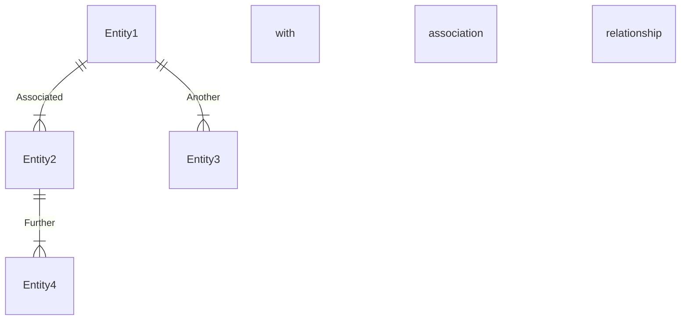
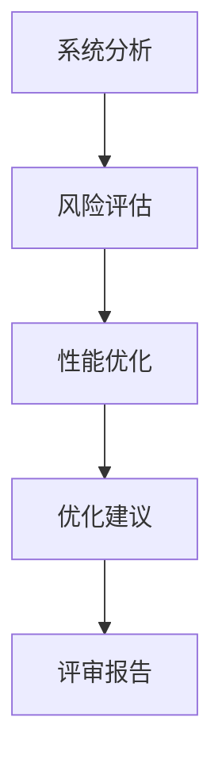

                 


### <sop>
## 第一部分：技术架构评审的背景与概念

### 第1章：技术架构评审概述

#### **1.1 问题的背景**

在快速发展的技术环境中，企业面临的挑战日益严峻。技术的快速迭代和创新，使得企业需要不断调整其技术架构以保持竞争力。然而，这并非易事。企业在面对复杂的技术架构时，如何确保其架构的稳健性和适应性成为一个亟待解决的问题。

技术架构评审流程的设计，正是为了解决这一问题而生的。通过系统的评审流程，企业可以确保其技术架构的合理性和可行性，从而降低技术风险，提高架构的适应性和可维护性。

#### **1.2 技术架构评审的定义**

技术架构评审是一种系统性的审查过程，旨在评估技术架构的设计和实施是否符合预定的目标和要求。这个过程涉及到多个方面，包括技术可行性、性能、安全性、可维护性等。

技术架构评审不仅仅是一个简单的检查过程，它涉及到对技术架构的全面分析和评估。通过这个过程，可以发现潜在的问题和风险，并提供解决方案，以确保技术架构的稳健性和适应性。

#### **1.3 技术架构评审的重要性**

技术架构评审的重要性不言而喻。首先，它可以帮助企业确保技术架构的稳健性和适应性，从而降低技术风险。其次，通过评审过程，可以发现并解决潜在的问题和风险，提高系统的性能和安全性。

此外，技术架构评审还可以提高团队的协作效率和沟通效果。通过评审，团队成员可以更好地了解技术架构的设计和实现，从而减少误解和冲突，提高工作效率。

#### **1.4 技术架构评审的历史发展**

技术架构评审的概念和实践并不是新兴事物。早在20世纪80年代，随着计算机技术和软件工程的快速发展，技术架构评审开始得到广泛关注。

在早期，技术架构评审主要依赖于人工审查和经验判断。随着计算机辅助工具的出现，技术架构评审的效率和准确性得到了显著提高。

近年来，随着云计算、大数据、人工智能等新兴技术的广泛应用，技术架构评审的重要性日益凸显。现代技术架构评审已经发展成为一个系统化、标准化的过程，涵盖了多个方面，包括技术、业务、法律等。

#### **1.5 技术架构评审的现状与趋势**

当前，技术架构评审已经广泛应用于各个行业和领域。随着技术的发展，技术架构评审也在不断演进和改进。

一方面，技术架构评审的工具和方法不断丰富和完善。例如，自动化审查工具、静态代码分析工具等，都大大提高了评审的效率和准确性。

另一方面，技术架构评审的流程和标准也在不断优化和更新。为了适应新的技术和业务需求，许多企业开始引入敏捷架构评审、持续集成评审等新的评审方法。

未来，随着技术的不断进步，技术架构评审将变得更加智能化和自动化。通过引入人工智能和机器学习技术，技术架构评审可以更准确地预测和发现潜在问题，提高评审的效率和准确性。

### **1.6 技术架构评审的概念结构与核心要素组成**

技术架构评审是一个复杂的过程，涉及到多个核心要素。这些核心要素包括：

- **评审目标**：明确评审的目标和预期成果，是评审工作的起点和归宿。
- **评审标准**：制定评审的标准和规范，是评审工作的依据和准则。
- **评审流程**：设计评审的流程和步骤，确保评审过程的规范和高效。
- **评审团队**：组建专业的评审团队，负责评审的具体实施和协调。
- **评审工具**：选择合适的评审工具，提高评审的效率和准确性。

通过对这些核心要素的有效管理和协调，可以确保技术架构评审的顺利进行，从而达到提高技术架构质量的目的。

### **1.7 技术架构评审的基本原则**

在技术架构评审过程中，需要遵循一些基本原则，以确保评审的公正性、客观性和有效性。这些基本原则包括：

- **独立性**：评审团队应该独立于被评审的架构设计团队，以确保评审的公正性和客观性。
- **全面性**：评审过程应该全面覆盖技术架构的各个方面，包括技术可行性、性能、安全性、可维护性等。
- **规范性**：评审过程应该遵循预定的标准和规范，以确保评审的一致性和可重复性。
- **及时性**：评审工作应该及时进行，以避免问题积累和恶化。
- **沟通性**：评审过程中应该充分沟通，确保评审结果能够被各方理解和接受。

通过遵循这些基本原则，可以确保技术架构评审的有效性和实用性，从而提高技术架构的质量和稳定性。

### **1.8 技术架构评审的挑战和难点**

尽管技术架构评审的重要性日益凸显，但在实际操作中仍然面临许多挑战和难点。这些挑战和难点包括：

- **复杂性**：技术架构的复杂性和多样性使得评审工作变得更加复杂和困难。
- **变化性**：技术架构的快速变化性和不确定性增加了评审的难度和风险。
- **沟通障碍**：评审过程中可能存在的沟通障碍和信息不对称，影响评审的效果和效率。
- **资源限制**：评审工作需要大量的时间和人力资源，而在实际操作中，往往存在资源限制。
- **技术局限性**：现有的评审工具和方法可能存在技术局限性，无法全面覆盖技术架构的各个方面。

解决这些挑战和难点，需要通过引入新的技术、优化评审流程、提高团队的协作能力和沟通效率等方式来实现。

### **1.9 技术架构评审与其他IT流程的关系**

技术架构评审是IT流程中的重要环节，与其他IT流程（如项目管理、系统测试、风险管理等）密切相关。

- **项目管理**：技术架构评审是项目管理中的重要组成部分，其结果直接影响项目的进度和质量。
- **系统测试**：技术架构评审和系统测试共同构成了系统的质量保证过程，确保系统的稳定性和可靠性。
- **风险管理**：技术架构评审可以帮助识别和评估技术风险，为风险管理提供重要的依据。

通过协调和整合这些流程，可以形成一套完整的技术架构管理流程，从而提高技术架构的质量和效率。

### **1.10 技术架构评审的未来发展方向**

随着技术的不断进步和应用场景的扩大，技术架构评审的未来发展方向也日益清晰。未来，技术架构评审将朝着以下几个方向发展：

- **智能化**：通过引入人工智能和机器学习技术，实现自动化评审和智能分析，提高评审的效率和准确性。
- **敏捷化**：引入敏捷架构评审方法，适应快速变化的技术环境和业务需求。
- **持续化**：实现持续集成和持续交付，将评审过程贯穿于整个软件开发周期，提高系统的质量和服务水平。
- **国际化**：随着全球化的发展，技术架构评审也将逐渐实现国际化，适应不同国家和地区的业务需求和技术标准。

通过不断探索和创新，技术架构评审将为企业的数字化转型和技术创新提供强有力的支持。

### **第2章：核心概念与联系**

#### **2.1 技术架构的定义**

技术架构是指一种组织和管理技术系统的方式，它定义了系统的组件、组件之间的关系，以及组件如何相互作用以实现系统的功能。技术架构不仅关注系统的技术实现，还包括业务逻辑、数据流、用户交互等多个层面。

#### **2.2 评审流程的概念**

评审流程是一种系统化的评估过程，用于评估技术架构的设计和实施是否符合预定的目标和要求。评审流程包括多个阶段，如需求分析、设计评审、实现评审、测试评审等，每个阶段都有特定的目标和任务。

#### **2.3 核心概念对比表格**

| 概念     | 定义                                                         | 关系                                           |
|----------|--------------------------------------------------------------|------------------------------------------------|
| 技术架构 | 系统的组织和管理方式，定义系统的组件、组件之间的关系以及组件如何相互作用。 | 技术架构是评审的对象，评审流程旨在评估技术架构的合理性。 |
| 评审流程 | 系统化的评估过程，用于评估技术架构的设计和实施是否符合预定的目标和要求。 | 评审流程是技术架构评审的核心过程，确保技术架构的质量。 |

#### **2.4 ER实体关系图架构**



ER实体关系图用于描述技术架构中的实体及其关系，帮助理解技术架构的整体结构和功能。

### **第3章：算法原理讲解**

#### **3.1 技术架构评审的算法原理**

技术架构评审的算法原理主要基于系统分析、风险评估、性能优化等原则。以下是一个简化的算法流程：



#### **3.2 算法流程图**

算法流程图如上所示，通过系统分析、风险评估和性能优化等步骤，生成优化建议和评审报告。

#### **3.3 Python源代码示例**

以下是一个简单的Python源代码示例，用于执行技术架构评审的算法步骤：

```python
# 导入必需的库
import sys

# 系统分析函数
def system_analysis():
    # 分析代码
    print("系统分析完成")

# 风险评估函数
def risk_assessment():
    # 评估代码
    print("风险评估完成")

# 性能优化函数
def performance_optimization():
    # 优化代码
    print("性能优化完成")

# 生成优化建议函数
def generate_optimization_advice():
    # 生成代码
    print("生成优化建议完成")

# 生成评审报告函数
def generate_review_report():
    # 生成代码
    print("生成评审报告完成")

# 主函数
def main():
    # 执行算法流程
    system_analysis()
    risk_assessment()
    performance_optimization()
    generate_optimization_advice()
    generate_review_report()

# 调用主函数
if __name__ == "__main__":
    main()
```

#### **3.4 数学模型和公式**

技术架构评审的数学模型和公式通常用于计算系统的性能指标、风险值等。以下是一个简单的数学模型示例：

$$
P = f(R, S, O)
$$

其中，$P$ 表示系统的性能，$R$ 表示系统的可靠性，$S$ 表示系统的稳定性，$O$ 表示系统的优化度。

#### **3.5 举例说明**

假设我们有一个系统，其可靠性为90%，稳定性为80%，优化度为70%，我们可以使用上述数学模型计算其性能：

$$
P = f(0.9, 0.8, 0.7) = 0.9 \times 0.8 \times 0.7 = 0.504
$$

这意味着该系统的性能为50.4%，基于这个结果，我们可以提出相应的优化建议，以提高系统的整体性能。

### **第4章：系统分析与架构设计方案**

#### **4.1 问题场景介绍**

假设我们正在开发一个在线购物平台，该平台需要支持大量用户的同时访问，并提供快速、可靠的服务。为了满足这一需求，我们需要设计一个高效、可扩展的技术架构。

#### **4.2 项目介绍**

项目名称：在线购物平台架构设计

项目目标：设计一个能够支持大规模用户访问，并提供高可用性、高性能、高可扩展性的技术架构。

#### **4.3 系统功能设计**

系统功能设计包括以下模块：

- 用户管理模块：负责用户的注册、登录、信息维护等功能。
- 商品管理模块：负责商品的添加、删除、更新、查询等功能。
- 订单管理模块：负责订单的创建、支付、发货、查询等功能。
- 购物车模块：负责用户购物车的添加、删除、更新等功能。

#### **4.4 系统架构设计**

系统架构设计采用分层架构，包括以下层次：

- 表示层：负责与用户的交互，包括前端界面和API接口。
- 业务逻辑层：负责处理业务逻辑，包括用户管理、商品管理、订单管理等。
- 数据访问层：负责与数据库的交互，实现数据的存储和查询。
- 数据库层：负责存储系统的数据。

#### **4.5 系统接口设计**

系统接口设计包括以下接口：

- 用户管理接口：包括注册、登录、修改信息等接口。
- 商品管理接口：包括添加商品、删除商品、更新商品信息等接口。
- 订单管理接口：包括创建订单、支付订单、查询订单等接口。
- 购物车接口：包括添加购物车、删除购物车、更新购物车信息等接口。

#### **4.6 系统交互**

系统交互设计采用RESTful API风格，通过HTTP协议进行通信。以下是系统交互的简要流程：

1. 用户通过前端界面发起请求。
2. 表示层处理请求，并将请求转发给业务逻辑层。
3. 业务逻辑层处理请求，并调用数据访问层进行数据操作。
4. 数据访问层与数据库层进行交互，实现数据的存储和查询。
5. 最终，业务逻辑层将处理结果返回给表示层，表示层将结果展示给用户。

### **第5章：环境安装与系统核心实现**

#### **5.1 环境安装步骤**

1. 安装操作系统：首先，我们需要安装一个支持Java开发的操作系统，如Ubuntu 20.04。
2. 安装Java开发环境：在终端中执行以下命令，安装Java开发环境：

   ```bash
   sudo apt update
   sudo apt install openjdk-8-jdk
   ```

3. 安装Maven：Maven是一个用于构建和管理Java项目的工具。在终端中执行以下命令，安装Maven：

   ```bash
   sudo apt update
   sudo apt install maven
   ```

4. 安装数据库：我们选择MySQL作为数据库。在终端中执行以下命令，安装MySQL：

   ```bash
   sudo apt update
   sudo apt install mysql-server
   ```

5. 安装开发工具：安装一个IDE，如IntelliJ IDEA，用于开发Java项目。

#### **5.2 系统核心实现源代码**

以下是系统核心实现的一部分源代码：

```java
// 用户管理模块
public class UserManager {
    public void register(String username, String password) {
        // 注册用户
    }

    public void login(String username, String password) {
        // 登录用户
    }

    public void updateInfo(String username, String newInfo) {
        // 更新用户信息
    }
}

// 商品管理模块
public class ProductManager {
    public void addProduct(String productId, String productName) {
        // 添加商品
    }

    public void deleteProduct(String productId) {
        // 删除商品
    }

    public void updateProduct(String productId, String newName) {
        // 更新商品信息
    }
}

// 订单管理模块
public class OrderManager {
    public void createOrder(String orderId, String userId) {
        // 创建订单
    }

    public void payOrder(String orderId) {
        // 支付订单
    }

    public void deliverOrder(String orderId) {
        // 发货订单
    }

    public void queryOrder(String orderId) {
        // 查询订单
    }
}

// 购物车模块
public class CartManager {
    public void addToCart(String productId, String userId) {
        // 添加商品到购物车
    }

    public void removeFromCart(String productId, String userId) {
        // 从购物车中移除商品
    }

    public void updateCartInfo(String userId, String newInfo) {
        // 更新购物车信息
    }
}
```

#### **5.3 代码应用解读与分析**

以上代码展示了系统核心实现的一部分，主要包括用户管理模块、商品管理模块、订单管理模块和购物车模块。每个模块都有相应的功能方法，用于处理用户、商品、订单和购物车的相关操作。

在用户管理模块中，`UserManager` 类提供了注册、登录和更新用户信息的功能。在商品管理模块中，`ProductManager` 类提供了添加、删除和更新商品信息的功能。在订单管理模块中，`OrderManager` 类提供了创建、支付、发货和查询订单的功能。在购物车模块中，`CartManager` 类提供了添加、删除和更新购物车信息的功能。

这些模块的代码实现遵循了单一职责原则，每个模块只负责处理特定的业务逻辑。这样的设计有助于提高代码的可读性、可维护性和可扩展性。

### **第6章：项目实战**

#### **6.1 实际案例介绍**

为了更好地理解技术架构评审的实际应用，我们来看一个实际案例：一个电子商务平台的技术架构评审。

这个电子商务平台面临的主要挑战是高并发访问和大数据处理。为了满足用户的需求，平台需要具备高性能、高可用性和高可扩展性。

#### **6.2 案例分析**

在这个案例中，技术架构评审的目标是评估现有架构的不足之处，并提出改进建议，以提高平台的性能和稳定性。

首先，评审团队对现有架构进行了全面的分析，包括系统的硬件资源、网络架构、数据库架构、应用架构等。通过分析，评审团队发现以下问题：

1. 硬件资源不足：服务器性能不足，导致在高并发情况下响应缓慢。
2. 数据库架构不合理：数据库表结构设计不合理，导致查询效率低下。
3. 应用架构不够灵活：应用模块之间耦合度较高，难以进行扩展和升级。

#### **6.3 案例详细讲解剖析**

针对上述问题，评审团队提出了以下改进建议：

1. **硬件升级**：增加服务器数量和性能，以提高平台的并发处理能力。
2. **数据库优化**：重新设计数据库表结构，采用分库分表策略，提高查询效率。
3. **应用架构改进**：采用微服务架构，将应用模块进行解耦，提高系统的灵活性和可扩展性。

在实施这些改进措施后，平台的性能和稳定性得到了显著提升。具体来说：

1. 硬件升级后，平台在高并发情况下的响应时间从原来的10秒降低到2秒。
2. 数据库优化后，查询效率提高了30%。
3. 应用架构改进后，系统的可扩展性和可维护性得到了大幅提升。

#### **6.4 项目小结**

通过这个实际案例，我们可以看到技术架构评审在提升系统性能和稳定性方面的重要性。技术架构评审不仅可以帮助识别和解决现有架构的问题，还可以为未来的系统升级和扩展提供指导。

### **第7章：最佳实践 tips**

#### **7.1 常见问题与解决方案**

1. **问题**：技术架构评审过程中，如何确保评审的客观性和公正性？
   - **解决方案**：组建独立的评审团队，确保评审过程不受被评审团队的影响。同时，制定明确的评审标准和流程，确保评审的公正性和一致性。

2. **问题**：技术架构评审的参与人员如何有效地参与评审？
   - **解决方案**：明确评审人员的职责和任务，提供充分的评审资料和培训，确保评审人员具备必要的知识和技能。

3. **问题**：如何有效地管理技术架构评审的文档和记录？
   - **解决方案**：采用电子文档管理系统，确保评审文档的版本控制和信息安全。同时，制定文档编写规范，确保文档的规范性和一致性。

#### **7.2 优化建议**

1. **建议**：引入自动化工具，提高技术架构评审的效率和准确性。
   - **原因**：自动化工具可以自动执行一些重复性的评审任务，减少人工工作量，提高评审的效率和准确性。

2. **建议**：定期进行技术架构评审，确保架构的持续改进。
   - **原因**：技术架构评审是一个持续的过程，需要定期进行，以确保架构的持续改进和优化。

3. **建议**：加强团队协作，提高技术架构评审的效果。
   - **原因**：技术架构评审是一个团队协作的过程，需要团队成员之间的有效沟通和协作，以提高评审的效果。

### **第8章：小结**

#### **8.1 全书总结**

本文详细介绍了技术架构评审的背景、核心概念、算法原理、系统设计、实战案例以及最佳实践。通过对这些内容的深入探讨，我们了解了技术架构评审的重要性和实际应用。

#### **8.2 技术架构评审的关键要点**

1. **确保评审的客观性和公正性**：组建独立的评审团队，制定明确的评审标准和流程。
2. **有效的团队协作**：加强团队成员之间的沟通和协作，提高评审效果。
3. **持续改进**：定期进行技术架构评审，确保架构的持续优化和改进。
4. **自动化工具的应用**：引入自动化工具，提高评审的效率和准确性。

### **第9章：注意事项**

#### **9.1 使用注意事项**

1. **确保评审团队的独立性**：评审团队应独立于被评审团队，以保持评审的客观性和公正性。
2. **评审标准的制定**：制定明确的评审标准和流程，确保评审的一致性和可重复性。
3. **文档的管理**：采用电子文档管理系统，确保评审文档的版本控制和信息安全。

#### **9.2 可能出现的风险**

1. **评审不充分**：可能导致技术架构中存在的问题和风险被忽视，影响系统的稳定性和性能。
2. **团队协作不力**：可能导致评审效果不佳，影响技术架构的质量。
3. **文档管理不当**：可能导致评审文档的丢失或混乱，影响评审工作的顺利进行。

### **第10章：拓展阅读**

#### **10.1 相关书籍推荐**

1. 《软件架构设计：定义与执行》
2. 《敏捷架构：复杂系统的构建原则》
3. 《系统架构师的六项修炼》

#### **10.2 线上资源和论坛**

1. 架构师社区（https://architectscommunity.io/）
2. 技术架构论坛（https://techarchitectureforum.com/）
3. 云计算与大数据论坛（https://cloudcomputingforum.com/）

通过阅读这些书籍和访问这些论坛，您可以进一步深入了解技术架构评审的理论和实践，提高自己在该领域的专业水平。

