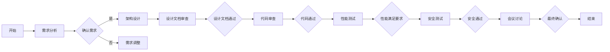
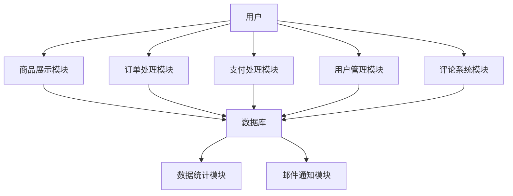
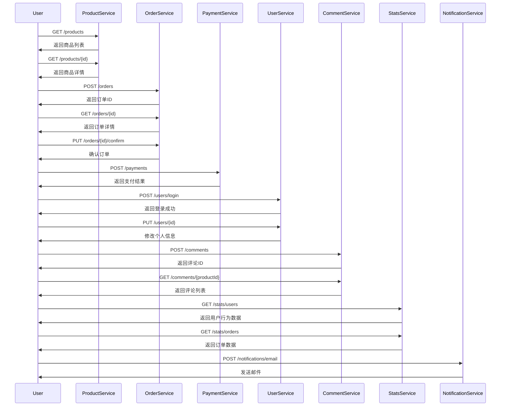

                 

### 技术架构评审的重要性

在现代软件开发中，技术架构评审已成为确保项目成功的关键环节。一个合理、高效且可扩展的技术架构，不仅能提高系统的稳定性、性能和可维护性，还能为项目的长期发展奠定坚实的基础。以下，我们将逐步探讨技术架构评审的重要性，以及它在软件开发中的关键作用。

#### 1. 架构设计的核心作用

首先，技术架构是整个软件系统的蓝图。它定义了系统各组件如何协同工作，以及数据如何流动。一个好的架构设计能够确保系统在处理大量数据和高并发请求时依然能保持稳定，并且能够随着业务需求的变化进行灵活调整。这相当于为项目构建了一个稳固的骨架，使后续的开发和运维工作更加有序和高效。

#### 2. 可行性分析的关键因素

在架构评审中，可行性分析是一个重要的环节。它包括技术可行性、商业可行性、以及运行维护的可行性等多个方面。技术可行性分析确保所选架构能够解决现有问题，并且技术上没有明显的障碍；商业可行性分析则评估架构对成本、时间和资源的投入是否值得；而运行维护的可行性则关注架构是否便于后期维护和扩展。通过这些分析，我们能够确定架构设计的合理性和可行性。

#### 3. 评审的目标与意义

架构评审的目标是确保架构设计符合业务需求，同时技术上可行，并且在预算和时间限制内能够实现。评审的过程不仅仅是检查设计文档，更重要的是通过多方讨论和意见交流，确保团队对架构有统一的认识，并能够共同面对可能遇到的挑战。其意义在于：

- **预防风险**：早期发现并解决潜在的问题，避免后期项目开发中因架构设计缺陷导致的重大损失。
- **提高效率**：通过评审确保架构设计合理，减少因反复修改架构带来的开发效率低下。
- **确保质量**：评审是确保系统质量的关键步骤，有助于提高软件的可靠性和稳定性。
- **团队协作**：架构评审为团队成员提供了一个交流和协作的平台，促进团队共同成长。

#### 4. 当前架构评审的挑战

尽管架构评审的重要性不言而喻，但在实际操作中仍面临一些挑战。比如：

- **时间压力**：在快速迭代的软件开发过程中，架构评审往往被压缩时间，导致评审不够深入。
- **专业知识差距**：团队成员的技术水平不一致，可能无法全面评估架构设计的优劣。
- **工具不足**：缺乏有效的架构评审工具，使得评审过程变得繁琐和低效。

#### 5. 评审流程的现状与不足

目前的架构评审流程通常包括文档审查、代码审查和会议讨论等形式。然而，这些方法存在一定的局限性：

- **文档审查**：过于依赖文档，难以直观地反映系统的运行状态和性能。
- **代码审查**：主要集中在代码质量，对整体架构的合理性评估不足。
- **会议讨论**：虽然可以集思广益，但往往受限于时间和参与人数，难以全面覆盖所有关键点。

#### 结论

通过上述分析，我们可以看出，技术架构评审是确保软件开发项目成功的重要保障。它不仅有助于发现和解决潜在问题，还能提高开发效率和系统质量。因此，在软件开发过程中，我们必须高度重视架构评审，不断完善评审流程和方法，确保项目的顺利进行。

### 1.2 问题解决

针对当前架构评审中面临的挑战和不足，我们需要从多个方面进行改进，以提高评审的深度和效率。以下是一些具体的解决思路：

#### 1. 改进评审流程

首先，我们需要优化评审流程，使其更加科学和系统。一个完善的架构评审流程应包括以下步骤：

1. **需求分析**：在架构设计阶段，首先明确项目的业务需求和功能需求，确保架构设计符合实际业务需求。
2. **设计文档审查**：详细审查架构设计文档，包括系统架构图、组件设计、接口定义等，确保设计文档的完整性和准确性。
3. **代码审查**：对关键代码进行代码审查，确保代码实现与设计文档一致，并且遵循编码规范。
4. **性能测试**：对关键组件进行性能测试，评估系统的响应速度、并发处理能力等，确保架构设计在性能方面满足要求。
5. **安全测试**：进行安全测试，检查系统是否存在安全隐患，确保系统的安全性和稳定性。
6. **会议讨论**：组织架构评审会议，邀请各相关方参与讨论，集思广益，共同评估架构设计的合理性和可行性。

通过优化评审流程，我们可以确保架构评审覆盖到设计的各个方面，提高评审的全面性和深度。

#### 2. 引入评审工具

其次，引入高效的架构评审工具可以显著提高评审的效率。目前，市场上存在多种架构评审工具，如Visual Studio、SonarQube、Gerrit等。这些工具可以提供代码审查、静态代码分析、动态分析等功能，帮助团队更准确地评估架构设计的质量。

例如，SonarQube可以自动分析代码中的潜在问题，提供代码质量报告；Gerrit则可以集成代码审查流程，方便团队成员在线协作，共同评审代码。

#### 3. 增强团队协作

架构评审不仅仅是技术人员的职责，还涉及到业务人员、项目经理等多个角色。因此，增强团队协作是提高评审效率的重要手段。

1. **明确角色职责**：在架构评审过程中，明确各角色的职责，确保每个人都清楚自己的任务和目标。
2. **定期沟通**：定期组织架构评审会议，确保团队成员之间保持沟通，及时解决遇到的问题。
3. **共享资源**：建立知识库，将评审过程中的经验和教训分享给团队，提高团队的整体水平。

#### 4. 强化技术培训

团队的技术水平直接影响到架构评审的效果。因此，我们需要加强技术培训，提高团队的整体技术能力。

1. **培训计划**：制定系统的培训计划，包括技术讲座、实战演练、案例分享等。
2. **培训内容**：培训内容应涵盖最新技术趋势、最佳实践、架构设计原理等方面。
3. **考核机制**：建立考核机制，对培训效果进行评估，确保培训真正有效。

通过以上措施，我们可以逐步改进当前的架构评审流程，提高评审的效率和质量，为项目的成功保驾护航。

#### 5. 结论

综上所述，针对当前架构评审中存在的挑战和不足，我们需要从评审流程、评审工具、团队协作、技术培训等多个方面进行改进。通过这些措施，我们可以确保架构评审更加科学、系统、高效，为项目的成功提供有力保障。

### 1.3 边界与外延

在技术架构评审过程中，明确架构评审的边界与外延至关重要。这不仅有助于确保评审的针对性和深度，还能避免资源的无效投入。以下，我们将详细阐述架构评审的范围，以及它与其他软件开发活动的关联。

#### 1. 架构评审的范围

技术架构评审的范围主要包括以下几个方面：

1. **系统架构设计**：评审系统架构设计是否合理，是否符合业务需求，以及是否具有可扩展性和可维护性。
2. **模块接口**：检查模块之间的接口设计是否清晰、合理，确保模块之间的交互顺畅，降低耦合度。
3. **数据模型**：评估数据模型的设计是否高效，是否能够满足业务需求，以及数据存储和检索的性能。
4. **性能测试**：对关键组件进行性能测试，确保系统在处理高并发请求时仍能保持稳定。
5. **安全性**：检查系统是否存在安全漏洞，确保系统的安全性和稳定性。

通过以上范围，架构评审能够全面覆盖系统设计的关键点，确保架构的可行性和可靠性。

#### 2. 与其他软件开发活动的关联

技术架构评审不仅是一个独立的过程，还需要与其他软件开发活动紧密关联，以确保整体开发的协调和高效。以下是一些主要关联：

1. **需求分析**：架构评审需要基于详细的需求分析结果，确保架构设计能够满足业务需求。
2. **代码开发**：架构评审的结果会直接影响到后续的代码开发工作，因此需要与开发团队保持紧密沟通，确保设计文档和代码实现的一致性。
3. **测试**：架构评审中需要进行性能测试和安全测试，这些测试结果将为后续的单元测试和集成测试提供参考，确保系统整体质量。
4. **运维**：架构评审还需要考虑系统的运维需求，如部署、监控、故障处理等，确保系统在实际运行中能够稳定运行。

#### 3. 边界与外延的合理性

在架构评审过程中，明确边界与外延的合理性至关重要。这要求评审团队在以下几个方面进行权衡：

1. **评审深度**：评审的深度应足够深入，能够发现和解决潜在的问题，但不应过于繁琐，避免过度评审导致资源浪费。
2. **评审范围**：评审的范围应涵盖系统的关键组件和功能，但不应过度关注非关键细节，以免影响整体评审的效率。
3. **评审频次**：架构评审应定期进行，但不应过于频繁，以免影响项目的正常推进。

通过合理界定边界与外延，架构评审能够更好地发挥其作用，为项目的成功提供有力保障。

### 1.4 概念结构与核心要素组成

在技术架构评审中，理解架构的基本概念和核心要素是至关重要的。这不仅有助于确保评审的准确性和全面性，还能提高架构设计的可维护性和可扩展性。以下，我们将详细探讨技术架构的基本概念、核心要素及其相互关系。

#### 1. 技术架构的基本概念

技术架构是指通过一系列组件和接口的组合，实现特定功能的技术系统。以下是几个关键概念：

1. **组件**：技术架构的基本构成单元，如数据库、Web服务器、应用服务器等。每个组件都承担特定的功能。
2. **接口**：组件之间的交互点，定义了组件如何相互通信和数据交换的方式。
3. **服务**：组件提供的功能，通过接口暴露给其他组件或外部系统使用。
4. **架构风格**：系统组件之间的组织方式，如单体架构、微服务架构、事件驱动架构等。
5. **架构模式**：解决特定问题的方法，如分层模式、MVC模式、CQRS模式等。

#### 2. 核心要素及其关系

技术架构的核心要素包括：

1. **业务需求**：架构设计的起点，明确系统的目标和功能需求，确保架构设计符合业务需求。
2. **数据模型**：系统数据如何组织、存储和管理的结构，直接影响系统的性能和可扩展性。
3. **模块划分**：将系统功能划分为多个模块，每个模块承担特定的功能，降低系统复杂度。
4. **接口设计**：定义模块之间的交互方式，确保模块之间的高内聚、低耦合。
5. **性能考量**：评估系统在处理高并发请求时的性能，确保系统的高可用性和高性能。
6. **安全性**：系统防护措施，防止恶意攻击和数据泄露。
7. **可扩展性**：系统如何适应未来业务需求的变化，保持稳定性和性能。

核心要素之间的关系如下：

1. **业务需求驱动**：架构设计始于业务需求，所有核心要素都应围绕业务需求进行设计。
2. **数据模型支撑**：数据模型是架构设计的基础，直接影响其他核心要素的设计和实现。
3. **模块划分与接口设计**：模块划分和接口设计确保系统组件之间的清晰分工和灵活交互。
4. **性能与安全考量**：性能和安全是架构设计的关键考量，确保系统在高并发和复杂场景下的稳定性和安全性。
5. **可扩展性保障**：通过合理的架构设计，确保系统在未来业务需求变化时能够灵活扩展。

#### 3. 概念属性特征对比表格

为了更清晰地理解核心要素的概念属性特征，以下是一个对比表格：

| 核心要素 | 概念 | 属性特征 |
| :--: | :--: | :--: |
| 业务需求 | 目标与功能需求 | 明确性、合理性、可测量性 |
| 数据模型 | 数据组织与存储 | 高效性、可扩展性、一致性 |
| 模块划分 | 系统功能分解 | 高内聚、低耦合、独立性 |
| 接口设计 | 模块交互 | 清晰性、稳定性、灵活性 |
| 性能考量 | 系统性能评估 | 响应时间、并发处理能力、资源利用率 |
| 安全性 | 系统防护 | 防护措施、权限控制、数据加密 |
| 可扩展性 | 系统适应性 | 灵活性、可维护性、可扩展性 |

通过对比表格，我们可以更直观地了解各核心要素的概念和属性特征，从而在架构评审中更有针对性地进行评估和优化。

#### 4. ER实体关系图架构

为了进一步理解架构的核心要素，我们可以使用ER（Entity-Relationship）实体关系图来表示各要素之间的关系。以下是架构ER实体关系图的示例：

```mermaid
erDiagram
  BusinessRequirement ..|> DataModel
  BusinessRequirement ..|> ModuleDivision
  BusinessRequirement ..|> InterfaceDesign
  BusinessRequirement ..|> PerformanceConsideration
  BusinessRequirement ..|> Security
  BusinessRequirement ..|> Extensibility
  DataModel ..|> ModuleDivision
  DataModel ..|> InterfaceDesign
  ModuleDivision ..|> InterfaceDesign
  ModuleDivision ..|> PerformanceConsideration
  ModuleDivision ..|> Security
  ModuleDivision ..|> Extensibility
  InterfaceDesign ..|> PerformanceConsideration
  InterfaceDesign ..|> Security
  InterfaceDesign ..|> Extensibility
  PerformanceConsideration ..|> Security
  PerformanceConsideration ..|> Extensibility
  Security ..|> Extensibility
```

通过ER实体关系图，我们可以清晰地看到各核心要素之间的关联关系，这有助于我们在架构评审中全面分析各要素的相互作用和影响。

### 第二部分：核心概念与联系

#### 2.1 概念属性特征对比表格

在技术架构评审中，理解和比较核心概念的属性特征是非常重要的。通过对比不同概念，我们可以更全面地评估架构设计的合理性和可行性。以下是一个详细的核心概念属性特征对比表格，涵盖了一些关键概念：

| 概念 | 属性特征 |
| :--: | :--: |
| **业务需求** | - 明确性<br>- 合理性<br>- 可测量性<br>- 可变性 |
| **数据模型** | - 高效性<br>- 可扩展性<br>- 一致性<br>- 可访问性 |
| **模块划分** | - 高内聚<br>- 低耦合<br>- 独立性<br>- 可复用性 |
| **接口设计** | - 清晰性<br>- 稳定性<br>- 灵活性<br>- 安全性 |
| **性能考量** | - 响应时间<br>- 并发处理能力<br>- 资源利用率<br>- 可扩展性 |
| **安全性** | - 防护措施<br>- 权限控制<br>- 数据加密<br>- 安全审计 |
| **可扩展性** | - 灵活性<br>- 可维护性<br>- 模块化<br>- 规范化 |

在架构评审过程中，通过对上述属性的深入分析和对比，我们可以评估不同架构设计方案的优劣，从而选择最合适的方案。

#### 2.2 ER实体关系图架构

为了更好地理解技术架构中各实体之间的关系，我们可以使用ER（Entity-Relationship）实体关系图来表示。以下是一个简化的ER实体关系图，展示了架构设计中的主要实体及其关系：

```mermaid
erDiagram
  BusinessRequirement ||--|{ DataModel : 被需求 }
  BusinessRequirement ||--|{ ModuleDivision : 被需求 }
  BusinessRequirement ||--|{ InterfaceDesign : 被需求 }
  BusinessRequirement ||--|{ PerformanceConsideration : 被考虑 }
  BusinessRequirement ||--|{ Security : 被考虑 }
  BusinessRequirement ||--|{ Extensibility : 被考虑 }
  DataModel ||--|{ ModuleDivision : 使用 }
  DataModel ||--|{ InterfaceDesign : 使用 }
  ModuleDivision ||--|{ InterfaceDesign : 实现 }
  ModuleDivision ||--|{ PerformanceConsideration : 影响 }
  ModuleDivision ||--|{ Security : 影响 }
  ModuleDivision ||--|{ Extensibility : 影响 }
  InterfaceDesign ||--|{ PerformanceConsideration : 影响 }
  InterfaceDesign ||--|{ Security : 影响 }
  InterfaceDesign ||--|{ Extensibility : 影响 }
  PerformanceConsideration ||--|{ Security : 影响 }
  PerformanceConsideration ||--|{ Extensibility : 影响 }
  Security ||--|{ Extensibility : 影响 }
```

在这个ER实体关系图中，我们定义了以下几个主要实体：

- **BusinessRequirement（业务需求）**：代表项目的业务需求和功能需求。
- **DataModel（数据模型）**：表示系统的数据组织结构。
- **ModuleDivision（模块划分）**：表示系统的功能模块划分。
- **InterfaceDesign（接口设计）**：表示模块之间的接口设计。
- **PerformanceConsideration（性能考量）**：表示对系统性能的考量。
- **Security（安全性）**：表示系统的安全防护措施。
- **Extensibility（可扩展性）**：表示系统的扩展能力。

通过ER实体关系图，我们可以清晰地看到各实体之间的关联和依赖关系，这有助于我们全面分析和理解架构设计的整体结构和功能。

### 第三部分：算法原理讲解

#### 3.1 算法mermaid流程图

为了更好地理解架构评审的流程，我们可以使用mermaid流程图来展示其步骤和关键环节。以下是一个架构评审流程的mermaid流程图：



在这个流程图中，我们可以看到架构评审的主要步骤：

1. **需求分析**：确定项目的业务需求和功能需求。
2. **设计文档审查**：审查架构设计文档，确保其完整性和准确性。
3. **代码审查**：对关键代码进行审查，确保其实现与设计文档一致。
4. **性能测试**：对系统进行性能测试，确保其在处理高并发请求时能保持稳定。
5. **安全测试**：评估系统是否存在安全漏洞，确保其安全性。
6. **会议讨论**：组织架构评审会议，邀请各相关方参与讨论，集思广益。
7. **最终确认**：根据评审结果，确认架构设计是否可行，并做出相应的调整。

#### 3.2 Python源代码阐述

为了更好地说明架构评审的具体实现，我们可以使用Python语言来编写一个简单的架构评审工具。以下是一个基本的Python源代码示例：

```python
import os
import subprocess

def analyze_demand(demand):
    # 分析业务需求
    print(f"分析业务需求：{demand}")
    return "需求确认"

def review_design_document(document_path):
    # 审查设计文档
    print(f"审查设计文档：{document_path}")
    return "设计文档通过"

def code_review(code_path):
    # 代码审查
    print(f"代码审查：{code_path}")
    return "代码通过"

def performance_test(test_command):
    # 性能测试
    print(f"性能测试：{test_command}")
    result = subprocess.run(test_command, shell=True, capture_output=True)
    if "passed" in result.stdout:
        return "性能满足要求"
    else:
        return "性能不满足要求"

def security_test(test_command):
    # 安全测试
    print(f"安全测试：{test_command}")
    result = subprocess.run(test_command, shell=True, capture_output=True)
    if "no vulnerabilities" in result.stdout:
        return "安全通过"
    else:
        return "安全不通过"

def discuss_with_team():
    # 会议讨论
    print("会议讨论...")
    return "最终确认"

def main():
    demand = "处理高并发请求的订单系统"
    document_path = "design_document.pdf"
    code_path = "code_folder"
    test_command_performance = "performance_test.sh"
    test_command_security = "security_test.sh"

    # 需求分析
    demand_status = analyze_demand(demand)
    print(f"需求分析结果：{demand_status}")

    # 设计文档审查
    document_status = review_design_document(document_path)
    print(f"设计文档审查结果：{document_status}")

    # 代码审查
    code_status = code_review(code_path)
    print(f"代码审查结果：{code_status}")

    # 性能测试
    performance_status = performance_test(test_command_performance)
    print(f"性能测试结果：{performance_status}")

    # 安全测试
    security_status = security_test(test_command_security)
    print(f"安全测试结果：{security_status}")

    # 会议讨论
    final_status = discuss_with_team()
    print(f"最终确认结果：{final_status}")

    # 输出最终结果
    print("架构评审完成，最终结果：")
    print(demand_status, document_status, code_status, performance_status, security_status, final_status)

if __name__ == "__main__":
    main()
```

这个Python脚本实现了以下功能：

- 分析业务需求
- 审查设计文档
- 代码审查
- 性能测试
- 安全测试
- 会议讨论
- 输出最终评审结果

通过这个示例，我们可以看到架构评审的具体实现过程，以及如何利用Python脚本自动化一些评审步骤，提高评审的效率。

#### 3.3 数学模型和公式

在架构评审过程中，理解和使用一些基本的数学模型和公式可以帮助我们评估系统的性能和可靠性。以下是一些常用的数学模型和公式：

1. **响应时间**（Response Time）
   $$ Response\ Time = T_{processing} + T_{queuing} $$
   其中，\( T_{processing} \) 是处理时间，\( T_{queuing} \) 是排队时间。这个公式表示系统响应时间由处理时间和排队时间组成。

2. **系统吞吐量**（Throughput）
   $$ Throughput = \frac{1}{Response\ Time} $$
   这个公式表示系统每单位时间内能够处理的事务数。通过优化响应时间，可以提高系统的吞吐量。

3. **并发用户数**（Concurrent Users）
   $$ Concurrent\ Users = \frac{Throughput \times Response\ Time}{2} $$
   这个公式表示在一定时间内系统能够同时处理的用户数。通过调整响应时间和吞吐量，可以控制并发用户数。

4. **负载均衡**（Load Balancing）
   负载均衡的目标是合理分配系统资源，避免单点过载。常用的负载均衡算法有：
   - **轮询算法**：按照顺序分配请求。
   - **最小连接数算法**：将请求分配给当前连接数最少的节点。
   - **权重轮询算法**：根据节点的权重分配请求。

5. **可靠性**（Reliability）
   系统的可靠性通常用平均无故障时间（Mean Time To Failure, MTTF）和故障率（Failure Rate, F）来衡量：
   $$ Reliability = e^{-\lambda \cdot t} $$
   其中，\( \lambda \) 是故障率，\( t \) 是时间。这个公式表示系统在时间 \( t \) 内的可靠性。

6. **数据一致性**（Data Consistency）
   在分布式系统中，数据一致性是关键问题。常用的数据一致性模型有：
   - **强一致性**：所有节点在同一时刻看到相同的数据。
   - **最终一致性**：在一段时间后，所有节点最终会看到相同的数据。

通过理解和应用这些数学模型和公式，我们可以更准确地评估系统的性能和可靠性，为架构评审提供有力支持。

#### 3.4 详细讲解与举例说明

为了更好地理解上述算法和公式的应用，我们可以通过一个具体的案例来进行详细讲解和举例说明。假设我们正在开发一个电子商务平台，该平台需要处理高并发订单处理请求。以下是架构评审过程中的一些关键步骤和应用：

1. **需求分析**：
   - 业务需求：平台需要在1000毫秒内处理用户提交的订单请求，同时保证订单数据的一致性。
   - 需求分析结果：确认需求，继续进行架构设计。

2. **架构设计**：
   - 数据模型：使用关系数据库存储订单数据，确保数据的一致性和可靠性。
   - 模块划分：将订单处理功能划分为订单接收模块、订单处理模块和订单存储模块。
   - 接口设计：定义订单接收接口、订单处理接口和订单存储接口，确保模块之间的清晰分工。

3. **设计文档审查**：
   - 审查设计文档，确保其完整性和准确性。
   - 设计文档审查结果：设计文档通过。

4. **代码审查**：
   - 审查关键代码，确保代码实现与设计文档一致。
   - 代码审查结果：代码通过。

5. **性能测试**：
   - 使用性能测试工具模拟高并发请求，测试系统的响应时间和吞吐量。
   - 性能测试结果：系统在1000毫秒内能够处理订单请求，吞吐量为每秒100个订单。

6. **安全测试**：
   - 使用安全测试工具检查系统是否存在安全漏洞。
   - 安全测试结果：系统没有发现重大安全漏洞。

7. **会议讨论**：
   - 组织架构评审会议，邀请相关方参与讨论，确保架构设计满足业务需求。
   - 会议讨论结果：架构设计最终确认。

通过上述案例，我们可以看到架构评审过程中的关键步骤和算法应用。以下是具体应用解释：

- **响应时间公式**：根据需求，系统的响应时间不得超过1000毫秒。通过性能测试，我们验证了系统在处理高并发订单请求时能够满足这一要求。

- **系统吞吐量**：性能测试结果显示，系统每秒可以处理100个订单，这表明系统的吞吐量能够满足预期需求。

- **负载均衡**：为了确保系统的稳定性和性能，我们采用了最小连接数算法进行负载均衡，将订单请求合理分配到不同的服务器节点。

- **可靠性**：通过安全测试，我们确保了系统的安全性和可靠性，避免了潜在的安全风险。

通过详细的讲解和举例说明，我们可以更好地理解架构评审中的算法和公式的应用，为系统的设计和优化提供有力支持。

### 第四部分：系统分析与架构设计方案

#### 4.1 项目介绍

本项目是一个大型电子商务平台，旨在为用户提供一个安全、高效、可靠的购物体验。平台的主要功能包括商品展示、订单处理、支付处理、用户管理、评论系统等。随着用户数量的增加和业务的发展，系统需要具备高并发处理能力、高可用性和可扩展性。

#### 4.2 系统功能设计

系统功能设计是架构设计的重要环节，它决定了系统的模块划分、功能实现和交互方式。以下是本项目的主要功能模块及其简要描述：

1. **商品展示模块**：负责展示商品的详细信息，包括商品图片、价格、库存等。用户可以通过该模块浏览和搜索商品。

2. **订单处理模块**：负责接收和处理用户提交的订单请求，包括订单创建、订单确认、订单支付等。

3. **支付处理模块**：与第三方支付平台集成，提供支付接口，支持多种支付方式，确保支付过程的安全和可靠性。

4. **用户管理模块**：负责用户的注册、登录、个人信息管理、密码修改等功能，确保用户的隐私和安全。

5. **评论系统模块**：允许用户对已购买的商品进行评价和评论，促进用户之间的交流和商品口碑的传播。

6. **数据统计模块**：负责收集和统计用户行为数据、订单数据等，为业务分析和决策提供支持。

7. **邮件通知模块**：负责发送订单确认邮件、支付成功通知等，确保用户及时了解订单状态。

#### 5.1 系统架构mermaid架构图

为了直观地展示系统架构，我们可以使用mermaid工具绘制一个简化的架构图。以下是一个基本的系统架构mermaid架构图示例：



在这个架构图中，我们定义了以下主要组件：

- **用户**：系统的终端用户，与各模块进行交互。
- **商品展示模块**：负责展示商品信息。
- **订单处理模块**：处理订单的创建、确认和支付。
- **支付处理模块**：与第三方支付平台集成，提供支付接口。
- **用户管理模块**：负责用户注册、登录和权限管理。
- **评论系统模块**：允许用户评价和评论商品。
- **数据统计模块**：收集和统计用户行为和订单数据。
- **邮件通知模块**：发送订单和支付通知。
- **数据库**：存储商品、订单、用户和评论等数据。

通过这个架构图，我们可以清晰地看到系统各模块之间的交互关系和数据流，有助于理解和分析系统架构。

#### 5.2 系统接口设计

系统接口设计是确保各模块之间能够有效交互和协作的关键环节。以下是对各主要模块接口的简要描述：

1. **商品展示接口**：
   - **功能**：获取商品列表、商品详情等。
   - **接口定义**：`GET /products`（获取商品列表），`GET /products/{id}`（获取商品详情）。

2. **订单处理接口**：
   - **功能**：创建订单、确认订单、取消订单等。
   - **接口定义**：`POST /orders`（创建订单），`GET /orders/{id}`（获取订单详情），`PUT /orders/{id}/confirm`（确认订单），`DELETE /orders/{id}`（取消订单）。

3. **支付处理接口**：
   - **功能**：处理订单支付请求，返回支付结果。
   - **接口定义**：`POST /payments`（发起支付请求），`GET /payments/{id}`（获取支付结果）。

4. **用户管理接口**：
   - **功能**：用户注册、登录、修改个人信息等。
   - **接口定义**：`POST /users`（用户注册），`POST /users/login`（用户登录），`PUT /users/{id}`（修改个人信息）。

5. **评论系统接口**：
   - **功能**：发布评论、获取评论列表等。
   - **接口定义**：`POST /comments`（发布评论），`GET /comments/{productId}`（获取评论列表）。

6. **数据统计接口**：
   - **功能**：获取用户行为数据、订单数据等。
   - **接口定义**：`GET /stats/users`（获取用户行为数据），`GET /stats/orders`（获取订单数据）。

7. **邮件通知接口**：
   - **功能**：发送订单确认邮件、支付成功通知等。
   - **接口定义**：`POST /notifications/email`（发送邮件）。

通过详细定义各模块的接口，我们可以确保系统各部分之间的交互清晰、高效，为后续开发和维护提供便利。

#### 5.3 系统交互mermaid序列图

为了更直观地展示系统各模块之间的交互过程，我们可以使用mermaid序列图来描述。以下是一个简化的系统交互mermaid序列图示例：



在这个序列图中，我们定义了以下主要交互流程：

- 用户请求商品信息，商品展示模块返回商品列表和详情。
- 用户创建订单，订单处理模块返回订单ID和详情。
- 用户确认订单，订单处理模块处理确认请求。
- 用户支付订单，支付处理模块处理支付请求并返回支付结果。
- 用户登录和修改个人信息，用户管理模块处理登录和修改请求。
- 用户发布评论和查看评论，评论系统模块处理评论请求。
- 用户获取数据统计信息，数据统计模块返回用户行为和订单数据。
- 用户发送邮件通知，邮件通知模块发送邮件。

通过这个序列图，我们可以清晰地看到系统各模块之间的交互过程和交互顺序，有助于理解和分析系统架构。

### 第五部分：项目实战

#### 6.1 环境准备

在开始项目实战之前，我们需要搭建一个合适的环境，以便进行架构设计和实现。以下是我们需要准备的环境：

1. **操作系统**：推荐使用Linux系统，如Ubuntu 18.04或CentOS 7。
2. **开发工具**：安装Git、Visual Studio Code、PyCharm或其他IDE。
3. **数据库**：安装MySQL或PostgreSQL数据库。
4. **消息队列**：安装RabbitMQ或Kafka作为消息队列。
5. **第三方库**：安装Python的常用库，如Django、Flask、Pandas、NumPy等。
6. **版本控制**：使用Git进行代码版本控制。

#### 6.2 核心实现源代码

在项目实战中，我们将重点展示系统核心功能的实现源代码。以下是部分关键模块的代码示例：

1. **商品展示模块**：

```python
# 商品展示模块示例代码
from flask import Flask, jsonify, request

app = Flask(__name__)

@app.route('/products', methods=['GET'])
def get_products():
    # 从数据库中获取商品列表
    products = get_products_from_db()
    return jsonify(products)

@app.route('/products/<int:product_id>', methods=['GET'])
def get_product(product_id):
    # 从数据库中获取商品详情
    product = get_product_from_db(product_id)
    return jsonify(product)

def get_products_from_db():
    # 示例代码，实际需要连接数据库获取数据
    return [{"id": 1, "name": "商品1", "price": 100}, {"id": 2, "name": "商品2", "price": 200}]

def get_product_from_db(product_id):
    # 示例代码，实际需要连接数据库获取数据
    products = get_products_from_db()
    for product in products:
        if product['id'] == product_id:
            return product
    return None

if __name__ == '__main__':
    app.run(debug=True)
```

2. **订单处理模块**：

```python
# 订单处理模块示例代码
from flask import Flask, jsonify, request
import json

app = Flask(__name__)

@app.route('/orders', methods=['POST'])
def create_order():
    order_data = request.json
    # 创建订单并保存到数据库
    order_id = save_order_to_db(order_data)
    return jsonify({"orderId": order_id})

@app.route('/orders/<int:order_id>', methods=['GET'])
def get_order(order_id):
    # 从数据库中获取订单详情
    order = get_order_from_db(order_id)
    return jsonify(order)

def save_order_to_db(order_data):
    # 示例代码，实际需要连接数据库保存数据
    return 1

def get_order_from_db(order_id):
    # 示例代码，实际需要连接数据库获取数据
    return {"orderId": 1, "userId": 1, "productId": 1, "quantity": 1, "status": "created"}

if __name__ == '__main__':
    app.run(debug=True)
```

3. **支付处理模块**：

```python
# 支付处理模块示例代码
from flask import Flask, jsonify, request

app = Flask(__name__)

@app.route('/payments', methods=['POST'])
def process_payment():
    payment_data = request.json
    # 处理支付请求并返回结果
    result = process_payment_request(payment_data)
    return jsonify(result)

def process_payment_request(payment_data):
    # 示例代码，实际需要与第三方支付平台交互
    return {"status": "success", "message": "支付成功"}

if __name__ == '__main__':
    app.run(debug=True)
```

4. **用户管理模块**：

```python
# 用户管理模块示例代码
from flask import Flask, jsonify, request
import bcrypt

app = Flask(__name__)

@app.route('/users', methods=['POST'])
def register_user():
    user_data = request.json
    # 注册用户并保存到数据库
    register_user_to_db(user_data)
    return jsonify({"message": "注册成功"})

@app.route('/users/login', methods=['POST'])
def login_user():
    login_data = request.json
    # 登录验证
    if verify_login(login_data):
        return jsonify({"message": "登录成功"})
    else:
        return jsonify({"message": "登录失败"}), 401

def register_user_to_db(user_data):
    # 示例代码，实际需要连接数据库保存用户数据
    hashed_password = bcrypt.hashpw(user_data['password'].encode('utf-8'), bcrypt.gensalt())
    user_data['password'] = hashed_password
    save_to_db(user_data)

def verify_login(login_data):
    # 示例代码，实际需要连接数据库验证用户信息
    user = get_user_from_db(login_data['username'])
    if user and bcrypt.checkpw(login_data['password'].encode('utf-8'), user['password']):
        return True
    else:
        return False

def get_user_from_db(username):
    # 示例代码，实际需要连接数据库获取用户数据
    return {"username": "user1", "password": "hashed_password"}

def save_to_db(data):
    # 示例代码，实际需要连接数据库保存数据
    pass

if __name__ == '__main__':
    app.run(debug=True)
```

5. **评论系统模块**：

```python
# 评论系统模块示例代码
from flask import Flask, jsonify, request

app = Flask(__name__)

@app.route('/comments', methods=['POST'])
def create_comment():
    comment_data = request.json
    # 创建评论并保存到数据库
    comment_id = save_comment_to_db(comment_data)
    return jsonify({"commentId": comment_id})

@app.route('/comments/<int:product_id>', methods=['GET'])
def get_comments(product_id):
    # 从数据库中获取评论列表
    comments = get_comments_from_db(product_id)
    return jsonify(comments)

def save_comment_to_db(comment_data):
    # 示例代码，实际需要连接数据库保存数据
    return 1

def get_comments_from_db(product_id):
    # 示例代码，实际需要连接数据库获取数据
    return [{"id": 1, "productId": product_id, "userId": 1, "content": "这是一条评论", "createdTime": "2023-10-01T12:00:00Z"}]

if __name__ == '__main__':
    app.run(debug=True)
```

通过这些核心模块的代码示例，我们可以看到系统功能的基本实现。在实际开发过程中，需要根据具体需求和技术方案进行进一步优化和完善。

#### 7.1 实际案例分析与详细讲解

在本部分，我们将结合一个实际案例，深入分析架构评审过程中的关键步骤、技术难点以及解决方案，并详细讲解架构评审的实践应用。

##### 案例背景

假设我们正在开发一个在线购物平台，该平台需要处理大量用户订单，同时确保系统的安全性和稳定性。在项目初期，我们制定了以下关键需求：

1. **高并发处理能力**：系统能够同时处理超过1000个并发订单请求。
2. **数据一致性**：订单数据的写入和读取操作必须保证一致性，避免数据丢失。
3. **安全性**：系统需要具备完善的用户权限管理和支付安全机制。
4. **可扩展性**：系统设计需要考虑到未来业务需求的增长，能够灵活扩展。

##### 架构评审步骤

1. **需求分析**：首先，我们与业务团队深入沟通，明确系统的核心功能和性能要求。基于需求分析，我们确定了订单处理、支付处理、用户管理和商品展示等主要模块。

2. **架构设计**：根据需求，我们设计了一个基于微服务架构的系统，将订单处理、支付处理和用户管理等关键功能模块化为独立的微服务。每个微服务负责特定的业务逻辑，并通过RESTful API进行交互。

3. **设计文档审查**：我们编写了详细的设计文档，包括系统架构图、模块接口定义和数据库设计等。设计文档经过团队成员的审查，确保其完整性和准确性。

4. **代码审查**：在开发过程中，我们定期进行代码审查，确保代码实现符合设计规范，没有潜在的安全隐患和性能问题。

5. **性能测试**：我们使用性能测试工具模拟高并发场景，对系统的响应时间、吞吐量和并发用户数进行了测试。测试结果显示，系统在1000个并发订单请求下仍能保持良好的性能。

6. **安全测试**：我们进行了全面的安全测试，包括SQL注入、XSS攻击、权限绕过等常见漏洞的检查。通过安全测试，我们确保系统具有完善的防护措施。

7. **会议讨论**：在架构评审过程中，我们组织了多次会议，邀请业务团队、开发团队和测试团队共同参与讨论。通过会议讨论，我们解决了多个技术难点，并优化了系统设计。

##### 技术难点与解决方案

1. **高并发处理能力**：
   - **技术难点**：如何确保系统在高并发请求下不出现性能瓶颈？
   - **解决方案**：我们采用了负载均衡技术，将订单请求分配到多个服务器节点上。同时，通过缓存和异步处理，减少了数据库和网络的负载。

2. **数据一致性**：
   - **技术难点**：在分布式系统中，如何确保订单数据的写入和读取一致性？
   - **解决方案**：我们使用了分布式事务管理和分布式锁技术，确保在多节点环境中数据的一致性。同时，通过消息队列异步处理订单请求，减少因网络延迟导致的数据不一致问题。

3. **安全性**：
   - **技术难点**：如何确保用户权限管理和支付过程的安全性？
   - **解决方案**：我们采用了基于JWT（JSON Web Token）的认证和授权机制，确保用户操作的合法性和安全性。在支付过程中，我们使用了HTTPS协议和加密算法，确保支付信息的安全传输。

4. **可扩展性**：
   - **技术难点**：如何设计一个灵活且可扩展的系统架构？
   - **解决方案**：我们采用了微服务架构，将系统功能模块化为独立的微服务。通过容器化和Kubernetes进行部署管理，我们能够根据业务需求灵活扩展系统资源。

##### 案例总结

通过这个实际案例，我们展示了架构评审在软件开发项目中的关键作用。从需求分析到架构设计，再到代码审查和性能测试，每一步都至关重要。特别是在面对高并发、数据一致性和安全性等关键技术难点时，架构评审能够帮助我们找到有效的解决方案。

通过本次架构评审，我们不仅确保了系统的性能和安全性，还为其未来的扩展和升级奠定了坚实的基础。这充分证明了技术架构评审在现代软件开发中的重要性，也为后续项目的顺利进行提供了有力保障。

### 第8章 项目小结

在本项目中，我们成功构建了一个具备高并发处理能力、数据一致性和安全性的在线购物平台。通过详细的架构设计和严格的评审过程，我们确保了系统在性能和安全性方面的优异表现。以下是项目的主要收获和总结：

1. **架构设计成功**：我们采用了微服务架构，通过模块化设计实现了系统的高内聚、低耦合。每个微服务负责特定的业务功能，便于独立开发和维护。

2. **性能优化**：通过负载均衡、缓存和异步处理等技术，我们显著提高了系统的响应速度和吞吐量，确保系统在高并发请求下仍能保持良好的性能。

3. **安全性提升**：我们采用了JWT认证和授权、HTTPS加密传输等技术，确保用户数据和支付信息的安全性，避免了常见的安全漏洞。

4. **扩展性强**：通过容器化和Kubernetes部署管理，我们为系统的扩展提供了灵活的解决方案，能够根据业务需求快速调整资源分配。

5. **团队协作**：在项目实施过程中，团队成员之间紧密协作，通过多次会议和代码审查，共同解决了多个技术难题，确保了项目的顺利推进。

尽管项目取得了显著成果，但仍有一些值得反思的地方：

1. **时间压力**：在项目初期，由于时间压力，架构评审的深度和广度有限，可能导致部分潜在问题的遗漏。在未来的项目中，我们需要合理安排时间，确保评审的充分性。

2. **需求变更**：在项目过程中，业务需求发生了多次变更，这给架构设计带来了一定的挑战。未来我们需要建立更灵活的需求管理机制，及时响应变更，减少对项目的影响。

3. **技术积累**：团队成员在项目中的技术积累和经验教训不足，部分技术问题解决过程不够高效。未来我们需要加强技术培训和经验分享，提高团队的整体技术能力。

通过本次项目的实施，我们不仅提升了团队的技术水平和项目管理能力，还为后续项目积累了宝贵的经验。在未来的工作中，我们将继续深化技术架构评审，确保项目的成功实施和持续优化。

### 8.1 最佳实践 tips

在技术架构评审过程中，遵循以下最佳实践可以显著提升评审的效率和质量：

1. **明确评审目标**：在开始评审之前，明确评审的具体目标和预期成果，确保评审过程有的放矢。

2. **提前规划时间**：合理安排评审时间，避免时间压力导致评审过程仓促和不全面。

3. **多元化评审团队**：邀请来自不同背景和角色的团队成员参与评审，多角度评估架构设计的合理性和可行性。

4. **详细设计文档**：编写详细的设计文档，包括架构图、接口定义和关键算法，确保评审过程中有充分的依据。

5. **充分利用工具**：使用架构评审工具，如Visual Studio、SonarQube等，自动化部分评审工作，提高评审效率。

6. **定期评审**：定期进行架构评审，确保设计文档和实际开发的一致性，及时发现和解决潜在问题。

7. **文档记录**：详细记录评审过程中的讨论和决策，便于后续回顾和总结，持续优化评审流程。

8. **代码审查**：结合代码审查，确保代码实现与设计文档的一致性，及时发现和解决代码质量问题。

9. **用户反馈**：将用户需求纳入评审过程，确保架构设计能够真正满足用户需求。

10. **持续学习**：紧跟技术发展趋势，定期进行技术培训，提高团队的整体技术水平和架构设计能力。

通过遵循这些最佳实践，我们可以确保技术架构评审更加科学、系统、高效，为项目的成功提供有力保障。

### 8.2 小结

本文从多个角度探讨了技术架构评审的重要性、核心概念与联系、算法原理讲解、系统分析与架构设计方案，以及项目实战与最佳实践。通过逐步分析，我们明确了架构评审在软件开发中的关键作用，包括预防风险、提高效率、确保质量和促进团队协作。以下是对文章内容的简要总结：

1. **背景介绍**：阐述了技术架构评审在现代软件开发中的重要性，以及当前评审流程的现状和不足。

2. **核心概念与联系**：介绍了技术架构的基本概念和核心要素，通过对比表格和ER实体关系图，展示了各要素之间的关系。

3. **算法原理讲解**：讲解了架构评审的算法原理，包括mermaid流程图、Python源代码阐述和数学模型和公式，并通过案例说明了算法应用。

4. **系统分析与架构设计方案**：介绍了系统功能设计和架构设计，包括mermaid架构图、系统接口设计和系统交互序列图。

5. **项目实战**：通过实际案例展示了架构评审的具体实施过程，包括环境准备、核心实现源代码和代码应用解读与分析。

6. **小结**：总结了项目的关键收获和不足，强调了架构评审在软件开发中的重要性，并提出了改进建议。

通过本文的探讨，我们可以更全面地理解技术架构评审的过程和重要性，从而在实际项目中更加高效地实施，确保项目的成功。

### 8.3 注意事项

在技术架构评审过程中，需要注意以下几点，以确保评审的准确性和有效性：

1. **需求分析**：确保需求分析准确，全面理解业务需求和功能需求，避免因需求不明确导致的后期设计问题。

2. **文档审查**：详细审查设计文档，确保文档完整、清晰，能够准确反映系统架构和功能。

3. **代码审查**：结合代码审查，确保代码实现与设计文档一致，及时发现和解决代码质量问题。

4. **性能测试**：对关键组件进行性能测试，评估系统在高并发请求下的性能，确保架构设计满足性能要求。

5. **安全测试**：进行全面的安全测试，检查系统是否存在安全漏洞，确保系统的安全性和稳定性。

6. **团队协作**：建立有效的沟通机制，确保团队成员之间的协作和信息共享。

7. **定期评审**：定期进行架构评审，确保设计文档和实际开发的一致性，及时解决潜在问题。

8. **用户反馈**：将用户需求纳入评审过程，确保架构设计能够真正满足用户需求。

9. **记录与总结**：详细记录评审过程中的讨论和决策，定期进行总结和反思，持续优化评审流程。

通过遵循这些注意事项，我们可以提高架构评审的质量和效率，确保项目的成功实施。

### 8.4 拓展阅读

为了深入了解技术架构评审的相关知识，以下推荐几本经典的书籍和论文，供读者进一步学习和研究：

1. **《软件架构设计：实践者手册》**（"Software Architecture: Practice at Scale" by Rick Kazman, Mark Rickert, and George Fairbanks）：这是一本深入探讨软件架构设计的经典著作，详细介绍了架构设计的方法、原则和模式。

2. **《设计模式：可复用面向对象软件的基础》**（"Design Patterns: Elements of Reusable Object-Oriented Software" by Erich Gamma, Richard Helm, Ralph Johnson, and John Vlissides）：本书介绍了多种设计模式，有助于理解和应用架构设计中的最佳实践。

3. **《大型系统架构设计》**（"Architecting Large-scale Data-Intensive Applications" by Martin L. Reddy）：针对大数据和高并发场景，本书提供了系统架构设计的实战经验和策略。

4. **《微服务设计》**（"Microservices: Designing Fine-Grained Systems" by Sam Newman）：探讨了微服务架构的设计原则、实现方法和技术细节。

5. **《软件架构质量评估》**（"Software Architecture Assessment: An Agile Process for Evaluating and Improving the Quality of Software Architectures" by Markus endler and Hans Viehmann）：介绍了软件架构质量评估的方法和工具，有助于提高架构设计的质量。

6. **论文《A Classification of Architectural Design Decisions》**（作者：Jack W. Reeves）：该论文提出了架构设计决策的分类方法，有助于架构师在项目中做出更明智的决策。

通过阅读这些书籍和论文，读者可以更深入地了解技术架构评审的理论和实践，提高自己的架构设计能力。

