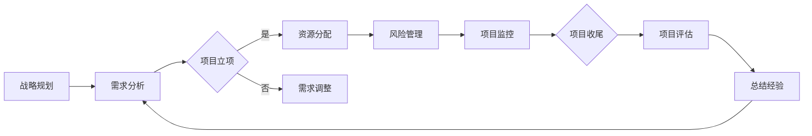
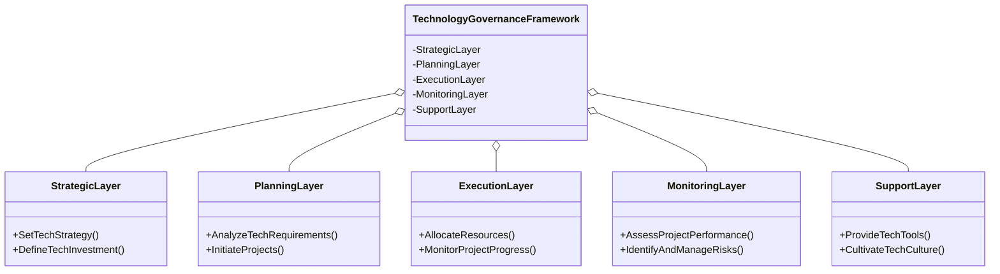

                 

# 技术治理框架设计：建立长效的技术管理机制

## 关键词：技术治理、技术管理机制、框架设计、长效机制、管理优化

## 摘要：

在快速发展的信息技术时代，技术治理作为企业成功的关键因素，正日益受到重视。本文将围绕技术治理框架设计，系统地阐述其基础理论、设计方法、实施策略和实践案例。通过对技术治理的背景、核心概念、原理与流程的深入探讨，本文旨在为读者提供一个全面、系统的技术治理框架设计指南，帮助企业建立长效的技术管理机制。

## 《技术治理框架设计：建立长效的技术管理机制》目录大纲

## 第一部分：技术治理框架基础

### 第1章：技术治理的背景与意义

#### 1.1.1 时代背景

#### 1.1.2 技术治理的重要性

#### 1.1.3 技术治理的目标与挑战

#### 1.1.4 技术治理的边界与外延

### 第2章：技术治理的核心概念与联系

#### 2.1.1 技术治理的概念解析

#### 2.1.2 技术治理的属性特征对比表格

#### 2.1.3 技术治理与相关概念的联系

#### 2.1.4 技术治理的ER实体关系图

### 第3章：技术治理的原理与流程

#### 3.1.1 技术治理的原理

#### 3.1.2 技术治理的基本流程

#### 3.1.3 技术治理的关键要素

#### 3.1.4 技术治理的Mermaid流程图

## 第二部分：技术治理框架设计

### 第4章：技术治理框架的构建原则与模型

#### 4.1.1 技术治理框架的构建原则

#### 4.1.2 技术治理框架的模型设计

#### 4.1.3 技术治理框架的设计流程

#### 4.1.4 技术治理框架的Mermaid类图

### 第5章：技术治理体系的设计与实施

#### 5.1.1 技术治理体系的设计原则

#### 5.1.2 技术治理体系的组织结构设计

#### 5.1.3 技术治理体系的职责与权限划分

#### 5.1.4 技术治理体系的实施步骤

### 第6章：技术治理机制的建立与优化

#### 6.1.1 技术治理机制的内涵

#### 6.1.2 技术治理机制的设计原则

#### 6.1.3 技术治理机制的建立方法

#### 6.1.4 技术治理机制的优化策略

### 第7章：技术治理的文化与团队建设

#### 7.1.1 技术治理文化的内涵与特征

#### 7.1.2 技术治理团队的建设策略

#### 7.1.3 技术治理团队的激励机制

#### 7.1.4 技术治理团队的发展与成长

## 第三部分：技术治理案例与实践

### 第8章：国内外技术治理实践案例

#### 8.1.1 国内企业技术治理实践

#### 8.1.2 国外企业技术治理实践

#### 8.1.3 技术治理实践的比较与启示

### 第9章：技术治理项目实战

#### 9.1.1 技术治理项目的启动

#### 9.1.2 技术治理项目的规划

#### 9.1.3 技术治理项目的实施

#### 9.1.4 技术治理项目的评估与优化

### 第10章：技术治理最佳实践与启示

#### 10.1.1 技术治理最佳实践

#### 10.1.2 技术治理注意事项

#### 10.1.3 技术治理的挑战与应对策略

#### 10.1.4 技术治理的未来发展趋势

### 总结：

技术治理框架的设计是建立长效技术管理机制的关键。通过本篇文章的深入探讨，我们了解了技术治理的背景、核心概念、原理与流程，并掌握了技术治理框架的设计原则、实施步骤和优化策略。同时，通过国内外实践案例和技术治理项目实战，我们更清晰地看到了技术治理的最佳实践和未来发展趋势。希望本文能为企业提供有价值的参考，助力其在技术治理的道路上走得更加稳健和长远。## 技术治理的背景与意义

### 1.1.1 时代背景

随着信息技术的迅猛发展，企业所依赖的技术环境变得日益复杂。大数据、云计算、物联网、人工智能等新兴技术不断涌现，不仅改变了企业运营的各个方面，也对传统的管理模式提出了新的挑战。在这种背景下，如何有效地管理和利用技术资源，确保技术的可持续发展和创新，成为企业面临的重大课题。

技术的快速发展使得企业的技术基础设施不断扩展和升级，与此同时，技术风险、合规性要求以及技术债务等问题也逐渐凸显。为了应对这些挑战，企业需要建立一套系统化的技术治理框架，以确保技术的有效管理、风险控制以及合规性的落实。

### 1.1.2 技术治理的重要性

技术治理在企业中的作用至关重要。首先，技术治理有助于确保企业的技术战略与业务目标相一致。通过技术治理，企业能够明确技术投资的方向，优化资源配置，避免重复投资和资源浪费。

其次，技术治理能够有效降低技术风险。随着技术复杂性的增加，技术故障、数据泄露等风险也随之增大。通过建立完善的技术治理机制，企业可以提前识别和应对潜在风险，确保技术运营的稳定和安全。

第三，技术治理有助于提升企业的创新能力。在技术治理框架下，企业可以建立创新激励机制，鼓励技术团队进行技术研发和创新，从而推动企业技术水平的不断提升。

### 1.1.3 技术治理的目标与挑战

技术治理的目标主要包括以下几个方面：

1. **确保技术战略与业务目标一致**：通过技术治理，企业能够确保技术投资和战略规划与业务发展目标相匹配，避免盲目跟风和资源浪费。
   
2. **优化技术资源配置**：技术治理可以帮助企业合理分配技术资源，确保技术项目的优先级和资源投入的科学性。

3. **降低技术风险**：通过建立完善的风险管理机制，企业能够识别、评估和应对技术风险，保障技术运营的安全性和稳定性。

4. **提高创新能力**：技术治理框架下，企业可以建立创新激励机制，促进技术研发和创新，提升企业的核心竞争力。

然而，在实现技术治理目标的过程中，企业面临诸多挑战：

1. **技术复杂性**：随着技术环境的不断变化，企业的技术系统变得越来越复杂，这增加了技术治理的难度。

2. **组织协调**：技术治理涉及到多个部门之间的协作，如何有效协调各部门的工作，确保技术治理措施得到有效执行，是一个重要的挑战。

3. **文化适应**：技术治理需要全员参与，而企业的文化传统、员工素质等都会对技术治理的推行产生影响，如何适应和改变企业文化，也是一个需要关注的问题。

4. **合规性要求**：随着法律法规的不断完善，企业需要确保其技术治理措施符合相关法规要求，避免法律风险。

通过深入分析技术治理的背景和意义，我们可以看到，技术治理不仅是应对技术复杂性、降低风险、优化资源配置的重要手段，更是提升企业创新能力、实现可持续发展的关键。接下来，我们将进一步探讨技术治理的核心概念、原理与流程，为建立科学、长效的技术治理框架奠定基础。

## 技术治理的核心概念与联系

### 2.1.1 技术治理的概念解析

技术治理（Technology Governance）是指通过制定和执行相关政策和程序，对企业的技术资源进行有效管理和控制，以确保技术投资、风险管理和创新目标的实现。技术治理不仅关注技术本身，还包括技术决策过程、组织架构和文化等方面。

技术治理的核心目标是确保技术战略与业务目标的契合，通过优化技术资源配置、降低技术风险、提升创新能力，从而实现企业的长期发展。技术治理的概念具有以下关键点：

1. **战略匹配**：技术治理强调技术投资和战略规划的匹配，确保技术发展符合企业整体战略方向。
2. **风险管理**：技术治理包含了对技术风险的管理，通过识别、评估和应对风险，确保技术系统的稳定和安全。
3. **资源配置**：技术治理涉及资源分配和优化，确保技术项目优先级和资源投入的科学性。
4. **创新激励**：技术治理旨在建立创新激励机制，鼓励技术研发和突破。

### 2.1.2 技术治理的属性特征对比表格

为了更清晰地理解技术治理的属性特征，我们可以将其与传统的IT治理、项目管理等进行对比。以下是一个简单的对比表格：

| 特征       | 技术治理         | IT治理         | 项目管理         |
| ---------- | ---------------- | -------------- | ---------------- |
| 目标       | 战略匹配、风险管理、资源配置、创新激励 | 确保技术系统的可用性、可靠性和合规性 | 完成项目任务，实现项目目标   |
| 关注点     | 技术决策、组织架构、文化适应 | 技术基础设施、IT服务管理 | 项目计划、进度、成本、质量 |
| 方法       | 持续改进、风险识别与评估、战略规划 | 服务台管理、变更管理、配置管理 | 项目规划、执行、监控、收尾 |
| 成果       | 技术资产、创新成果、合规记录 | 技术服务、合规性报告 | 项目交付物、项目管理文件 |
| 作用范围   | 整个技术生命周期 | 技术运营阶段   | 项目生命周期      |
| 影响力     | 全员参与、跨部门协调 | IT部门内部     | 项目团队内部     |

### 2.1.3 技术治理与相关概念的联系

技术治理与其他相关概念如IT治理、项目管理等有着紧密的联系，但它们在范围、目标和执行方式上有所不同。

1. **IT治理**：IT治理主要关注技术基础设施的管理，确保技术服务的可用性、可靠性和合规性。而技术治理则更加宏观，涵盖战略匹配、资源配置和风险管理等方面。

2. **项目管理**：项目管理侧重于具体项目的规划、执行和监控，确保项目目标的实现。技术治理则涵盖了项目管理的多个层面，不仅关注项目本身，还关注技术战略和风险控制。

3. **风险管理**：风险管理是技术治理的重要组成部分，通过识别、评估和应对技术风险，确保技术系统的稳定性和安全性。

4. **合规性管理**：合规性管理是技术治理的另一重要方面，通过确保技术治理措施符合相关法律法规，降低法律风险。

### 2.1.4 技术治理的ER实体关系图

为了更直观地展示技术治理的核心概念及其相互关系，我们可以使用Mermaid工具绘制一个ER实体关系图。以下是一个简单的ER图示例：

```mermaid
erDiagram
  TechnologyGovernance ||--|{ DecisionMaking }|> DecisionMaking : 包含
  TechnologyGovernance ||--|{ RiskManagement }|> RiskManagement : 包含
  TechnologyGovernance ||--|{ ResourceAllocation }|> ResourceAllocation : 包含
  TechnologyGovernance ||--|{ InnovationIncentive }|> InnovationIncentive : 包含
  TechnologyGovernance ||--|{ ITGovernance }|> ITGovernance : 相关
  TechnologyGovernance ||--|{ ProjectManagement }|> ProjectManagement : 相关
  TechnologyGovernance ||--|{ ComplianceManagement }|> ComplianceManagement : 相关
```

在这个ER图中，`TechnologyGovernance`（技术治理）是核心实体，它包含`DecisionMaking`（决策制定）、`RiskManagement`（风险管理）、`ResourceAllocation`（资源分配）和`InnovationIncentive`（创新激励）等子实体。同时，技术治理与`ITGovernance`（IT治理）、`ProjectManagement`（项目管理）和`ComplianceManagement`（合规性管理）等实体具有相关性。

通过上述分析，我们不仅了解了技术治理的核心概念和特征，还明确了其与相关概念的联系。这些基础知识的掌握，将为后续的技术治理框架设计提供重要支撑。

### 技术治理的原理与流程

#### 3.1.1 技术治理的原理

技术治理的原理可以从多个角度进行分析，其中核心包括战略匹配、风险管理、资源配置和创新能力提升。

首先，**战略匹配**是技术治理的基础。技术治理通过确保技术投资与企业的长期战略目标相一致，帮助企业实现业务目标。具体而言，技术治理框架会评估企业的战略方向，并根据这些方向制定技术发展计划，确保每个技术项目都服务于企业的核心战略。

其次，**风险管理**是技术治理的重要一环。技术风险包括技术故障、数据泄露、技术过时等，这些风险可能对企业造成重大影响。技术治理通过建立风险管理机制，识别和评估潜在风险，并制定相应的应对策略，从而降低风险发生的概率和影响。

第三，**资源配置**是技术治理的关键。通过合理的资源分配，企业可以确保技术项目的优先级和资源投入的科学性，避免资源浪费和重复投资。技术治理框架会根据企业的战略目标和项目优先级，合理分配人力、资金和技术资源，确保每个项目都能得到必要的支持。

最后，**创新能力提升**是技术治理的长期目标。技术治理通过建立创新激励机制，鼓励技术团队进行技术研发和创新，推动企业技术水平的不断提升。这不仅有助于企业保持竞争力，还能够为企业的未来发展奠定坚实基础。

#### 3.1.2 技术治理的基本流程

技术治理的基本流程可以分为以下几个步骤：

1. **战略规划**：首先，企业需要明确其长期战略目标和方向，并制定相应的技术发展战略。这一步是技术治理的起点，也是后续工作的基础。

2. **需求分析**：在明确战略目标后，企业需要对市场和技术需求进行深入分析，识别出关键的技术需求和发展方向。这一步有助于确保技术投资与市场需求相匹配。

3. **项目立项**：根据需求分析结果，企业可以开始立项。立项过程包括项目目标、范围、资源需求等关键要素的确定，确保每个项目都有明确的实施路径。

4. **资源分配**：在项目立项后，企业需要根据项目优先级和资源情况，进行资源分配。这一步涉及到人力、资金和技术资源的合理配置，确保项目能够顺利推进。

5. **风险管理**：在项目实施过程中，企业需要持续监控风险，并制定相应的风险应对策略。这一步有助于提前识别和应对潜在风险，保障项目顺利进行。

6. **项目监控与调整**：项目实施过程中，企业需要定期监控项目进展情况，并根据实际情况进行必要的调整。这一步确保项目能够按计划完成，并达到预期目标。

7. **项目收尾与评估**：项目完成后，企业需要进行收尾工作，并评估项目成果。这一步有助于总结经验教训，为未来项目提供参考。

#### 3.1.3 技术治理的关键要素

技术治理的关键要素包括以下几个方面：

1. **组织架构**：技术治理需要明确组织架构，确保各部门职责清晰、协作顺畅。通常，企业会设立专门的技术治理委员会或技术部门，负责技术治理的规划和实施。

2. **政策与流程**：技术治理需要制定一系列政策与流程，包括技术战略规划、项目立项、资源分配、风险管理、项目监控等，确保技术治理工作有章可循。

3. **人才团队**：技术治理的成功离不开高素质的人才团队。企业需要培养和引进具备专业技能和领导能力的技术人才，确保技术治理工作的高效执行。

4. **技术工具**：技术治理需要借助一系列技术工具，如项目管理软件、风险管理系统等，提升工作效率和管理水平。

5. **文化氛围**：技术治理还需要在企业内部营造积极的文化氛围，鼓励员工积极参与技术治理，共同推动企业的技术进步。

#### 3.1.4 技术治理的Mermaid流程图

为了更直观地展示技术治理的流程，我们可以使用Mermaid工具绘制一个流程图。以下是一个简单的Mermaid流程图示例：



在这个流程图中，从“战略规划”到“项目评估”的每一步都是技术治理流程的关键环节。通过这个流程图，企业可以清晰地了解技术治理的全过程，确保每个环节都得到有效执行。

通过上述分析，我们深入了解了技术治理的原理和基本流程，以及其关键要素。这些知识将为企业建立科学、高效的技术治理框架提供有力支持。在接下来的章节中，我们将继续探讨技术治理框架的设计原则与模型，为企业的技术治理提供更加具体和可操作的指南。

### 技术治理框架的构建原则与模型

#### 4.1.1 技术治理框架的构建原则

在构建技术治理框架时，需要遵循一系列原则，以确保框架的合理性和有效性。以下是几个关键构建原则：

1. **系统性**：技术治理框架应具有系统性，覆盖企业技术的各个层面和环节，包括战略规划、需求分析、项目立项、资源分配、风险管理、项目监控和评估等。只有系统性的框架才能全面覆盖技术治理的各个方面。

2. **适应性**：技术治理框架需要具备适应性，能够根据企业的战略调整、市场需求变化和技术发展动态进行调整。适应性强的框架可以更好地应对外部环境的变化，保持技术治理的持续性和有效性。

3. **科学性**：技术治理框架的设计应基于科学的方法和原则，通过数据分析和理论指导，确保技术治理决策的合理性和科学性。科学性的框架能够提高决策的准确性和效率。

4. **灵活性**：技术治理框架应具有灵活性，能够根据不同项目和部门的实际情况进行定制化调整。灵活性能够确保框架在不同场景下的适用性，同时也能够适应企业的快速发展。

5. **规范性**：技术治理框架需要制定一系列规范和标准，包括技术战略规划、项目立项、资源分配、风险管理等，确保技术治理工作有章可循。规范性能够提升技术治理的一致性和规范性。

6. **协同性**：技术治理框架应强调跨部门协作，确保各部门在技术治理中的角色和职责清晰，协作顺畅。协同性能够提升技术治理的整体效率，减少信息孤岛和资源浪费。

#### 4.1.2 技术治理框架的模型设计

技术治理框架的模型设计是构建技术治理体系的核心环节。以下是一个典型的技术治理框架模型，包括主要组成部分及其相互关系：

1. **战略层**：包括企业整体技术战略的制定和执行，涉及技术发展方向、技术投资规划和战略目标的设定。战略层是技术治理框架的顶层设计，为技术治理提供方向和目标。

2. **规划层**：负责具体技术项目的规划和管理，包括需求分析、项目立项、项目规划和资源分配。规划层将战略层的战略目标细化为具体的技术项目，确保项目的实施与战略目标相一致。

3. **执行层**：涉及技术项目的具体实施和执行，包括项目监控、风险管理、资源管理和技术支持。执行层是技术治理框架的核心执行环节，确保技术项目的顺利推进和目标实现。

4. **监控层**：负责对技术项目的进展和效果进行监控和评估，包括项目进度监控、风险管理、绩效评估和技术审查。监控层通过数据分析和反馈机制，及时发现和解决项目中存在的问题。

5. **支持层**：提供技术治理所需的技术工具、人力资源和文化支持。支持层包括项目管理工具、风险管理系统、技术培训和文化建设等，确保技术治理框架的顺利运行。

#### 4.1.3 技术治理框架的设计流程

技术治理框架的设计流程可以分为以下几个步骤：

1. **需求分析**：首先，企业需要对内部和外部环境进行深入分析，明确技术治理的需求和目标。需求分析包括战略分析、市场分析、技术趋势分析和内部资源分析等。

2. **框架设计**：基于需求分析结果，设计技术治理框架的基本结构和组成部分。框架设计应考虑系统性、适应性、科学性、灵活性和规范性原则，确保框架的合理性和有效性。

3. **模型构建**：在框架设计的基础上，构建具体的技术治理模型，包括战略层、规划层、执行层、监控层和支持层等。模型构建应结合企业的实际情况，制定具体的实施步骤和操作流程。

4. **试点运行**：在模型构建完成后，选择部分部门和项目进行试点运行，验证技术治理框架的可行性和效果。试点运行有助于发现和解决潜在问题，为全面推广提供参考。

5. **全面推广**：在试点运行取得成功后，将技术治理框架全面推广到整个企业，确保技术治理工作的全面覆盖和有效执行。全面推广过程中，应持续优化框架，根据实际情况进行调整和完善。

6. **评估与改进**：技术治理框架的运行需要定期评估和改进，通过数据分析和反馈机制，评估框架的效果和适应性，并提出改进措施。评估与改进是技术治理框架持续优化的重要环节。

通过上述设计流程，企业可以构建一个科学、合理和高效的技术治理框架，确保技术资源的合理利用和风险的有效控制，推动企业的长期可持续发展。

#### 技术治理框架的Mermaid类图

为了直观地展示技术治理框架的组成部分及其相互关系，我们可以使用Mermaid工具绘制一个类图。以下是一个简单的Mermaid类图示例：



在这个类图中，`TechnologyGovernanceFramework`（技术治理框架）是核心类，它包含四个主要层次：`StrategicLayer`（战略层）、`PlanningLayer`（规划层）、`ExecutionLayer`（执行层）和`MonitoringLayer`（监控层），以及一个支持层`SupportLayer`。每个层次都有具体的方法和功能，相互之间通过继承和关联关系进行组织。

通过这个Mermaid类图，企业可以清晰地理解技术治理框架的组成部分及其相互关系，为实际操作提供直观的参考。

### 技术治理体系的设计与实施

#### 5.1.1 技术治理体系的设计原则

设计一个高效、完善的技术治理体系，需要遵循一系列科学原则。以下是几个关键设计原则：

1. **目标导向**：技术治理体系的设计应明确目标，确保技术治理与企业的战略目标一致。目标导向的设计能够帮助企业在技术治理过程中始终围绕核心目标进行，避免迷失方向。

2. **模块化**：技术治理体系应采用模块化设计，将不同的治理功能模块化，如战略规划、项目立项、资源分配、风险管理等。模块化设计有助于提高体系的灵活性和可扩展性，便于后续的调整和优化。

3. **规范性**：技术治理体系需要制定一系列规范和标准，包括治理流程、操作指南、职责权限等。规范性设计能够确保技术治理的一致性和规范性，提高执行效率。

4. **协同性**：技术治理体系强调跨部门协作，确保各部门在技术治理中的角色和职责清晰，协同顺畅。协同性设计有助于提高技术治理的整体效率，减少信息孤岛和资源浪费。

5. **适应性**：技术治理体系应具备良好的适应性，能够根据企业的战略调整、市场需求变化和技术发展动态进行灵活调整。适应性设计能够确保技术治理体系能够持续适应外部环境的变化。

6. **信息化**：技术治理体系需要充分利用信息技术手段，如项目管理工具、风险管理系统等，提高治理的自动化和智能化水平。信息化设计能够提升技术治理的效率和质量。

#### 5.1.2 技术治理体系的组织结构设计

技术治理体系的组织结构设计是确保技术治理体系有效运行的基础。一个合理的组织结构能够明确各部门的职责和权限，确保协同工作，提高治理效率。以下是几个关键组织结构设计要点：

1. **委员会制**：可以设立技术治理委员会（TG Committee），作为技术治理的最高决策机构。委员会由企业高层领导、技术部门负责人和相关利益方组成，负责制定技术治理战略、审批重要技术项目等。

2. **部门分工**：技术治理体系应明确各部门的职责和权限，如技术部门负责技术规划、项目立项和资源管理，风险管理部门负责风险识别和评估，项目管理办公室（PMO）负责项目监控和协调等。

3. **项目经理制**：每个技术项目应指定项目经理，负责项目规划、执行和监控。项目经理需要与技术治理委员会、风险管理部门和项目管理办公室等保持紧密沟通，确保项目按计划推进。

4. **跨部门协作团队**：对于复杂项目，可以建立跨部门协作团队，包括技术、市场、运营等部门的成员，共同推进项目的实施。跨部门协作团队能够提高项目执行效率，确保项目目标的实现。

5. **专业支持团队**：技术治理体系还应设立专业支持团队，如IT支持团队、培训团队等，提供技术工具、人力资源和文化支持，确保技术治理工作的顺利推进。

#### 5.1.3 技术治理体系的职责与权限划分

在技术治理体系的设计中，明确各部门和角色的职责与权限是非常重要的。以下是几个关键职责与权限划分要点：

1. **技术治理委员会**：
   - 职责：制定技术治理战略、审批重要技术项目、监督技术治理体系运行。
   - 权限：决策权、审批权、监督权。

2. **技术部门**：
   - 职责：技术规划、项目立项、资源管理、技术支持。
   - 权限：项目发起权、资源分配权、技术方案审批权。

3. **风险管理部门**：
   - 职责：风险识别、风险评估、风险应对。
   - 权限：风险报告审批权、风险应对方案审批权。

4. **项目管理办公室（PMO）**：
   - 职责：项目监控、协调、绩效评估。
   - 权限：项目进度审批权、资源调配权、项目评估权。

5. **项目经理**：
   - 职责：项目规划、执行、监控、收尾。
   - 权限：项目团队管理权、项目资源调配权、项目决策权。

6. **跨部门协作团队**：
   - 职责：跨部门协作、共同推进项目。
   - 权限：项目参与权、信息共享权。

7. **专业支持团队**：
   - 职责：技术工具支持、人力资源支持、文化支持。
   - 权限：工具使用权、人员调配权、文化推广权。

#### 5.1.4 技术治理体系的实施步骤

技术治理体系的实施是一个系统的过程，需要遵循科学的步骤和方法。以下是技术治理体系实施的几个关键步骤：

1. **筹备阶段**：
   - 成立技术治理委员会和相关部门。
   - 明确各部门职责与权限。
   - 制定技术治理政策和流程。
   - 招聘和培训技术治理相关人员。

2. **设计阶段**：
   - 分析企业技术现状和需求。
   - 设计技术治理体系结构。
   - 制定技术治理框架和模型。
   - 确定技术治理工具和平台。

3. **试点阶段**：
   - 选择部分项目和部门进行试点。
   - 验证技术治理框架的可行性和效果。
   - 收集反馈和改进建议。
   - 优化技术治理体系和流程。

4. **推广阶段**：
   - 将技术治理框架全面推广到整个企业。
   - 对所有部门和项目进行培训和指导。
   - 持续监控和评估技术治理体系的运行效果。
   - 根据实际情况进行调整和优化。

5. **评估与改进阶段**：
   - 定期对技术治理体系进行评估。
   - 分析技术治理体系的运行效果和存在的问题。
   - 制定改进措施和优化方案。
   - 实施改进措施，提升技术治理体系的整体效能。

通过上述步骤，企业可以逐步建立和完善技术治理体系，确保技术资源的合理利用和风险的有效控制，推动企业的长期可持续发展。

### 技术治理机制的建立与优化

#### 6.1.1 技术治理机制的内涵

技术治理机制是指为实现技术治理目标，所制定的一系列制度、流程和措施。这些机制通过规范技术决策、资源分配、风险管理等过程，确保技术战略与业务目标的契合，以及技术的持续创新和发展。技术治理机制的核心内涵包括以下几个方面：

1. **决策机制**：技术决策机制是指企业在技术治理过程中，如何制定、审核和执行技术决策的流程和规范。一个健全的决策机制能够确保技术投资的科学性、合理性和有效性。

2. **资源分配机制**：资源分配机制是指如何合理配置企业的技术资源，包括人力、资金和技术设备等。通过优化资源分配，企业可以确保技术项目的优先级和资源投入的科学性。

3. **风险管理机制**：风险管理机制是指如何识别、评估和应对技术风险，确保技术系统的稳定性和安全性。通过建立完善的风险管理机制，企业可以提前识别和应对潜在风险，降低风险发生的概率和影响。

4. **创新激励机制**：创新激励机制是指如何激发和鼓励技术团队进行技术研发和创新。通过建立创新激励机制，企业可以推动技术的持续创新，提升企业的核心竞争力。

5. **合规性管理机制**：合规性管理机制是指如何确保企业的技术治理措施符合相关法律法规和行业标准。通过建立合规性管理机制，企业可以降低法律风险，确保技术的合规运营。

#### 6.1.2 技术治理机制的设计原则

在设计技术治理机制时，需要遵循一系列科学原则，以确保机制的合理性和有效性。以下是几个关键设计原则：

1. **目标导向**：技术治理机制的设计应以企业的战略目标为导向，确保机制能够支持企业实现技术战略和业务目标。

2. **系统性**：技术治理机制应具有系统性，覆盖技术治理的各个层面和环节，包括决策、资源分配、风险管理、创新激励和合规性管理等。

3. **适应性**：技术治理机制应具备良好的适应性，能够根据企业的战略调整、市场需求变化和技术发展动态进行灵活调整。

4. **规范性**：技术治理机制需要制定一系列规范和标准，确保技术治理过程的规范性和一致性。

5. **灵活性**：技术治理机制应具有灵活性，能够根据不同项目和部门的实际情况进行定制化调整。

6. **协同性**：技术治理机制应强调跨部门协作，确保各部门在技术治理中的角色和职责清晰，协作顺畅。

7. **信息化**：技术治理机制需要充分利用信息技术手段，如项目管理工具、风险管理系统等，提高治理的自动化和智能化水平。

#### 6.1.3 技术治理机制的建立方法

建立技术治理机制是一个系统的过程，需要遵循科学的步骤和方法。以下是建立技术治理机制的几个关键步骤：

1. **需求分析**：首先，企业需要对内部和外部环境进行深入分析，明确技术治理的需求和目标。需求分析包括战略分析、市场分析、技术趋势分析和内部资源分析等。

2. **机制设计**：基于需求分析结果，设计技术治理机制的具体内容和流程。机制设计应考虑目标导向、系统性、适应性、规范性、灵活性、协同性和信息化等原则。

3. **政策制定**：制定技术治理相关的政策和流程，明确各部门和角色的职责和权限。政策制定应结合企业的实际情况，确保政策的可行性和操作性。

4. **制度实施**：将技术治理机制落实到具体的操作过程中，确保政策得到有效执行。制度实施过程中，需要加强对相关部门和角色的培训，提高其技术治理意识和能力。

5. **试点运行**：在机制实施初期，选择部分项目和部门进行试点运行，验证技术治理机制的可行性和效果。试点运行过程中，应收集反馈和改进建议，为全面推广提供参考。

6. **全面推广**：在试点运行成功后，将技术治理机制全面推广到整个企业，确保技术治理工作的全面覆盖和有效执行。全面推广过程中，应持续优化机制，根据实际情况进行调整和完善。

7. **评估与改进**：技术治理机制的运行需要定期评估和改进，通过数据分析和反馈机制，评估机制的效果和适应性，并提出改进措施。评估与改进是技术治理机制持续优化的重要环节。

#### 6.1.4 技术治理机制的优化策略

技术治理机制的有效运行需要不断优化和改进。以下是一些常见的优化策略：

1. **定期评估**：定期对技术治理机制进行评估，分析其运行效果和存在的问题。通过数据分析和反馈机制，识别需要改进的方面。

2. **持续改进**：根据评估结果，制定具体的改进措施，对技术治理机制进行持续优化。改进措施应包括流程优化、制度完善、工具升级等。

3. **培训与沟通**：加强技术治理相关人员的培训，提高其技术治理意识和能力。同时，建立有效的沟通机制，确保各部门和角色之间的信息畅通和协作。

4. **信息化支持**：充分利用信息技术手段，如项目管理工具、风险管理系统等，提高技术治理的自动化和智能化水平。

5. **机制创新**：鼓励技术创新和管理创新，探索新的技术治理模式和方法，提升技术治理的效能。

6. **跨部门协作**：强化跨部门协作，建立跨部门协作团队，提高技术治理的整体效率。

通过上述优化策略，企业可以不断提升技术治理机制的效能，确保技术资源的合理利用和风险的有效控制，推动企业的长期可持续发展。

### 技术治理的文化与团队建设

#### 7.1.1 技术治理文化的内涵与特征

技术治理文化是指企业内部对于技术治理理念、价值观和行为的共识和认同。它不仅是技术治理体系的基础，也是技术治理能够有效实施的保障。技术治理文化的内涵主要包括以下几个方面：

1. **透明性**：技术治理文化倡导信息的透明和公开，确保各部门和员工能够及时获取相关信息，共同参与技术治理的决策过程。

2. **协作性**：技术治理文化强调跨部门协作和团队合作，通过建立有效的沟通和协作机制，提高技术治理的效率和质量。

3. **创新性**：技术治理文化鼓励创新思维和技术创新，为技术团队提供充分的创新空间和资源支持，推动企业技术水平的不断提升。

4. **责任感**：技术治理文化强调责任感和使命感，要求员工对技术治理工作充满热情，积极参与技术治理，为企业的长期发展贡献力量。

5. **规范性**：技术治理文化要求员工遵守相关的法律法规和行业标准，确保技术治理工作的合规性和规范性。

技术治理文化的特征主要包括：

- **开放性**：技术治理文化鼓励开放思维，欢迎不同的意见和观点，通过讨论和辩论，达成共识。
- **包容性**：技术治理文化强调多样性和包容性，尊重不同的技术观点和文化背景，促进团队内部的和谐与团结。
- **共享性**：技术治理文化倡导知识和经验的共享，通过建立知识库和经验分享机制，提升整个团队的技术能力和治理水平。
- **创新性**：技术治理文化鼓励创新，支持员工进行技术研究和创新实践，通过创新推动企业的发展。

#### 7.1.2 技术治理团队的建设策略

技术治理团队是企业实施技术治理的核心力量，其建设策略对技术治理的成败至关重要。以下是几个关键的建设策略：

1. **人才引进与培养**：技术治理团队需要具备高素质的人才，企业应通过招聘、培训和内部晋升等方式，引进和培养技术治理所需的各类人才。同时，应注重员工的职业发展和个人成长，提供培训和学习机会，提升其专业能力和治理水平。

2. **激励机制**：建立有效的激励机制，激发技术团队的工作热情和创新能力。激励机制可以包括奖金、晋升机会、荣誉称号等，通过多方面的激励手段，提升员工的工作积极性和责任感。

3. **团队合作**：技术治理团队需要具备良好的团队合作精神，通过建立团队文化和协作机制，促进团队成员之间的沟通与协作。团队合作不仅能够提高工作效率，还能够提升团队的凝聚力和战斗力。

4. **技能提升**：定期组织技能培训和技术交流，提升团队成员的专业技能和治理能力。通过培训和学习，团队成员可以掌握最新的技术和管理知识，不断提升自身素质。

5. **文化建设**：营造积极向上的团队文化，通过团队活动、团队建设等，增强团队成员的归属感和团队凝聚力。良好的企业文化能够促进团队成员的团结合作，为技术治理提供坚实的文化支撑。

#### 7.1.3 技术治理团队的激励机制

激励机制是技术治理团队建设的重要组成部分，有效的激励机制能够激发团队成员的工作热情和创新潜力。以下是几个关键激励机制：

1. **绩效奖金**：根据团队成员的工作表现和业绩贡献，设置绩效奖金，奖励表现突出的员工。绩效奖金可以与公司的业绩指标、项目目标和个人绩效等挂钩，激励员工为实现团队和公司的目标而努力。

2. **晋升机会**：为技术团队成员提供晋升机会，通过定期评估和选拔，选拔优秀员工晋升到更高的职位，激励员工不断提升自身能力和素质。

3. **荣誉称号**：设立荣誉称号，如“技术明星”、“优秀团队”等，对在工作中表现突出的个人和团队进行表彰和奖励，提升其荣誉感和自豪感。

4. **学习机会**：提供丰富的学习机会，包括内部培训、外部进修、技术交流等，帮助团队成员不断学习和成长，提升其专业水平和治理能力。

5. **工作环境**：创造良好的工作环境，包括办公条件、工作氛围等，确保团队成员能够在一个舒适、轻松的环境中工作，提高工作效率和质量。

通过上述激励机制，企业可以激发技术团队的工作热情和创新潜力，提升团队的整体绩效和企业的竞争力。

#### 7.1.4 技术治理团队的发展与成长

技术治理团队的发展与成长是企业实现长期可持续发展的重要保障。以下是技术治理团队发展与成长的关键方面：

1. **战略规划**：企业应制定明确的技术治理团队发展战略，包括团队目标、发展方向和实施路径。战略规划有助于明确团队的发展方向和重点，确保团队发展的有序性和持续性。

2. **人才培养**：注重人才培养和团队建设，通过引进高素质人才、内部培训和职业发展通道等，不断提升团队的专业能力和治理水平。

3. **能力提升**：通过技术培训、项目实践和经验分享等，不断提升团队的技术能力和治理能力，确保团队能够适应外部环境的变化和内部需求的发展。

4. **文化建设**：营造积极向上的团队文化，通过团队活动、文化建设等，增强团队的凝聚力、归属感和战斗力。

5. **持续改进**：建立持续改进机制，通过定期评估、反馈和改进，不断提升团队的工作效率和治理效能。

6. **激励机制**：建立有效的激励机制，激发团队成员的工作热情和创新潜力，提升团队的整体绩效和企业的竞争力。

通过上述措施，技术治理团队可以实现持续发展和成长，为企业的技术治理和可持续发展提供有力支持。

### 国内外技术治理实践案例

#### 8.1.1 国内企业技术治理实践

在国内，技术治理实践在企业中逐渐受到重视，一些领先企业已经成功建立了技术治理体系，取得了显著成效。以下是几个典型的国内企业技术治理实践案例：

1. **华为技术有限公司**：
   华为通过建立“技术委员会”来负责公司技术治理。技术委员会由公司高层领导和技术专家组成，负责制定公司技术战略、审批重要技术项目和技术标准。华为的技术治理体系强调跨部门协作，通过统一的技术平台和流程，确保技术资源的合理利用和风险的有效控制。

2. **阿里巴巴集团**：
   阿里巴巴通过建立“技术委员会”和“创新基金”来推动技术治理。技术委员会负责制定公司技术战略和研发方向，创新基金则用于支持技术创新和研发项目。阿里巴巴的技术治理体系注重开放性和创新性，鼓励员工进行技术创新，并通过大数据分析和人工智能技术，提升技术治理的效率和精准度。

3. **腾讯控股有限公司**：
   腾讯通过设立“技术管理委员会”来负责公司技术治理。技术管理委员会由公司高层领导和技术专家组成，负责制定公司技术战略、审批重要技术项目和技术标准。腾讯的技术治理体系强调规范化管理，通过制定详细的流程和规范，确保技术治理工作的一致性和规范性。

#### 8.1.2 国外企业技术治理实践

在国外，技术治理实践已有多年积累，一些领先企业建立了成熟的技术治理体系，提供了宝贵的经验和启示。以下是几个典型的国外企业技术治理实践案例：

1. **谷歌公司**：
   谷歌通过建立“技术领导委员会”和“技术风险委员会”来负责公司技术治理。技术领导委员会负责制定公司技术战略和研发方向，技术风险委员会则负责识别、评估和应对技术风险。谷歌的技术治理体系注重技术创新和风险控制，通过开放的技术生态系统和灵活的治理机制，推动技术发展和创新。

2. **微软公司**：
   微软通过建立“技术治理委员会”和“创新办公室”来负责公司技术治理。技术治理委员会负责制定公司技术战略和审批重要技术项目，创新办公室则负责推动公司技术创新和研发项目。微软的技术治理体系强调规范化管理和创新驱动，通过完善的流程和机制，确保技术资源的高效利用和技术创新。

3. **苹果公司**：
   苹果通过设立“技术治理办公室”和“创新实验室”来负责公司技术治理。技术治理办公室负责制定公司技术战略和审批重要技术项目，创新实验室则负责推动公司技术创新和研发项目。苹果的技术治理体系注重创新性和用户体验，通过严格的流程和机制，确保技术产品的质量和创新性。

#### 8.1.3 技术治理实践的比较与启示

通过对比国内外企业的技术治理实践，可以发现一些共同点和差异，这些实践为其他企业提供了宝贵的经验和启示：

1. **共同点**：
   - **重视技术创新**：无论是国内还是国外企业，技术治理实践都强调技术创新，通过建立创新激励机制，推动技术研发和突破。
   - **跨部门协作**：技术治理实践强调跨部门协作，通过建立跨部门团队和协作机制，确保技术资源的合理利用和风险的有效控制。
   - **规范化管理**：技术治理实践注重规范化管理，通过制定详细的流程和规范，确保技术治理工作的一致性和规范性。

2. **差异**：
   - **治理模式**：国内企业更倾向于建立集中式治理模式，通过设立技术委员会或技术办公室来负责技术治理；国外企业则更倾向于分布式治理模式，通过设立多个技术领导委员会和风险控制委员会等，实现分散化管理。
   - **创新驱动**：国外企业更强调创新驱动，通过开放的技术生态系统和灵活的治理机制，推动技术发展和创新；国内企业则更注重创新与业务需求的紧密结合，通过严格的流程和机制，确保技术产品的质量和创新性。
   - **文化适应**：国内企业在技术治理实践中更注重文化适应，通过建立积极向上的团队文化，增强团队的凝聚力和战斗力；国外企业则更强调开放性和创新性，通过开放的技术生态系统和灵活的治理机制，激发员工的创新潜力。

通过对比分析国内外技术治理实践，企业可以结合自身实际情况，借鉴成功经验，优化技术治理体系，提升技术治理效能，推动企业的持续发展。

### 技术治理项目实战

#### 9.1.1 技术治理项目的启动

技术治理项目的启动是项目成功的基石，这一阶段的关键在于明确项目的目标和范围，组建项目团队，并制定详细的规划。以下是技术治理项目启动的具体步骤：

1. **项目立项**：首先，企业需要确定技术治理项目的立项需求。立项需求通常来自于业务部门的技术需求、市场机遇或技术风险等方面。立项过程中，需要明确项目的目标、范围和预期成果。

2. **组建项目团队**：在项目立项后，需要组建一个专业的项目团队，包括项目经理、技术专家、业务分析师、风险管理专家等。团队成员应具备相关的技术背景和项目管理经验，能够高效协作，共同推进项目。

3. **制定项目计划**：项目团队需要制定详细的项目计划，包括项目进度、资源需求、风险管理和预算等。项目计划应明确项目的里程碑和关键交付物，确保项目按照既定的时间节点和质量要求推进。

4. **风险识别与评估**：在项目启动阶段，项目团队应进行初步的风险识别和评估，识别项目可能面临的技术风险、业务风险和管理风险，并制定相应的应对策略。

5. **项目沟通**：项目启动阶段还应建立有效的沟通机制，确保项目团队、相关利益方和高层管理者之间的信息畅通。通过定期的会议和报告，确保各方对项目进展和风险有清晰的了解。

#### 9.1.2 技术治理项目的规划

技术治理项目的规划是项目实施的重要环节，涉及到项目的详细设计和资源配置。以下是技术治理项目规划的关键步骤：

1. **需求分析**：项目团队需要对项目的需求进行深入分析，明确项目的技术需求、业务需求和用户需求。需求分析应结合企业的战略目标，确保项目能够有效支持企业的发展。

2. **项目设计**：在需求分析的基础上，项目团队应进行项目设计，包括技术架构设计、系统设计、接口设计等。项目设计应确保系统的可扩展性、稳定性和安全性，满足项目的需求。

3. **资源配置**：项目团队需要根据项目设计，进行资源分配，包括人力、资金和技术资源等。资源分配应考虑项目的优先级和资源需求，确保每个项目都能得到必要的支持。

4. **风险评估**：项目团队应进行详细的风险评估，识别项目可能面临的风险，并制定相应的风险应对措施。风险评估应贯穿项目的整个生命周期，确保风险得到有效控制。

5. **制定项目计划**：在资源分配和风险评估的基础上，项目团队应制定详细的项目计划，包括项目进度、里程碑、关键交付物和预算等。项目计划应具有可执行性，确保项目能够按计划推进。

#### 9.1.3 技术治理项目的实施

技术治理项目的实施是项目计划的具体执行过程，涉及到项目团队的协作、任务的执行和项目的监控。以下是技术治理项目实施的关键步骤：

1. **任务分解**：项目团队应将项目计划分解为具体的任务，明确每个任务的责任人和完成时间。任务分解应确保任务的明确性和可执行性。

2. **任务执行**：项目团队成员根据任务分配，开展具体的任务执行。在任务执行过程中，项目团队应保持高效的沟通和协作，确保任务能够按时、高质量完成。

3. **项目监控**：项目团队应定期监控项目的进度、质量和风险。通过定期的项目会议和报告，项目团队可以及时了解项目的执行情况，识别和解决项目中的问题。

4. **风险管理**：项目团队应持续监控项目风险，根据风险评估结果，制定和实施相应的风险应对措施。风险管理应贯穿项目的整个生命周期，确保项目风险得到有效控制。

5. **质量保证**：项目团队应确保项目的质量符合预定标准，通过代码审查、测试和质量评估等手段，确保项目的质量。

#### 9.1.4 技术治理项目的评估与优化

技术治理项目的评估与优化是项目收尾阶段的重要工作，通过评估和优化，可以总结项目经验，提升项目管理的效能。以下是技术治理项目评估与优化的关键步骤：

1. **项目评估**：项目团队应根据项目计划和预期成果，对项目的实施情况进行全面评估。评估应包括项目进度、质量、成本和风险等方面，确保项目达到预期目标。

2. **经验总结**：项目团队应总结项目实施中的经验教训，识别成功因素和不足之处。经验总结有助于提升项目管理的水平，为未来项目提供参考。

3. **优化措施**：根据项目评估结果，项目团队应制定具体的优化措施，改进项目管理流程和方法，提升项目的执行效率和效果。

4. **持续改进**：项目团队应建立持续改进机制，通过定期评估和反馈，不断优化项目管理流程和方法。持续改进是提升项目管理水平的重要手段。

通过上述技术治理项目实战的详细步骤，企业可以系统地实施技术治理项目，确保项目的成功交付，实现技术治理的目标。技术治理项目的实战经验和优化措施，也为企业未来技术治理工作的持续改进提供了宝贵的参考。

### 技术治理最佳实践与启示

#### 10.1.1 技术治理最佳实践

在技术治理领域，国内外许多企业已经通过实施最佳实践，取得了显著的成果。以下是一些技术治理最佳实践：

1. **建立清晰的战略规划**：企业应首先明确技术治理的战略目标，并将其与业务战略紧密结合。通过制定详细的技术战略规划，确保技术投资和技术发展与企业整体战略保持一致。

2. **构建模块化治理框架**：技术治理框架应具备模块化特点，以便根据不同项目和部门的需求进行灵活调整。模块化设计可以提高治理的灵活性和适应性，确保治理措施能够有效应对各种场景。

3. **引入先进的技术工具**：利用先进的项目管理工具和风险管理系统，可以提高技术治理的效率和精度。这些工具可以帮助企业实现自动化管理和数据分析，提升治理效能。

4. **强化跨部门协作**：技术治理不仅仅是技术部门的责任，需要各业务部门共同参与。通过建立跨部门协作机制，确保各部门在技术治理中的角色和职责清晰，提高协作效率。

5. **注重人才培养和文化建设**：技术治理的成功离不开高素质的人才和积极的企业文化。企业应注重人才培养，提供专业培训和职业发展机会，同时营造积极向上的团队文化，激发员工的创新潜力。

#### 10.1.2 技术治理注意事项

在实施技术治理过程中，企业需要注意以下几点：

1. **明确责任和权限**：在技术治理体系中，应明确各部门和角色的职责和权限，确保责任到人，避免权责不明导致的管理混乱。

2. **持续优化流程**：技术治理流程应定期评估和优化，根据实际情况调整和改进。流程优化可以提升治理效率，降低运营成本。

3. **加强风险控制**：技术治理应重视风险控制，建立完善的风险识别、评估和应对机制。通过定期风险评审和监控，确保技术系统的稳定性和安全性。

4. **注重合规性管理**：企业应确保技术治理措施符合相关法律法规和行业标准，避免法律风险。合规性管理是技术治理的重要组成部分。

5. **保持灵活性**：在技术治理过程中，应保持灵活性，能够根据市场和技术环境的变化，快速调整治理策略和方法。

#### 10.1.3 技术治理的挑战与应对策略

尽管技术治理在理论上和实践上都具有重要意义，但在实际操作中仍面临诸多挑战。以下是技术治理的几个主要挑战及其应对策略：

1. **技术复杂性**：技术环境的复杂性和多样性增加了技术治理的难度。应对策略是采用模块化设计和标准化流程，提高治理的灵活性和适应性。

2. **组织协调**：跨部门协作和技术治理的统一管理是技术治理的重要挑战。应对策略是建立高效的跨部门协作机制，明确各部门的职责和权限，确保协同工作的顺畅。

3. **文化适应**：技术治理需要全员参与，而企业文化的差异可能会影响治理效果的实现。应对策略是通过文化建设，营造积极向上的团队氛围，提高员工的参与度和积极性。

4. **合规性要求**：随着法律法规的不断完善，企业需要确保技术治理措施符合相关法规要求。应对策略是建立健全的合规性管理体系，定期进行合规性审查和培训。

5. **数据安全与隐私**：数据安全和隐私保护是技术治理的重要挑战。应对策略是建立完善的数据安全策略和隐私保护机制，确保数据的安全和合规性。

#### 10.1.4 技术治理的未来发展趋势

展望未来，技术治理将继续在企业的信息化和数字化转型中扮演关键角色。以下是一些技术治理的未来发展趋势：

1. **智能化与自动化**：随着人工智能和自动化技术的发展，技术治理将更加智能化和自动化。通过引入人工智能算法和自动化工具，可以提高治理的效率和精度。

2. **数据驱动**：数据将成为技术治理的重要驱动力。企业将利用大数据分析和人工智能技术，对技术治理过程进行数据驱动的决策和优化。

3. **生态系统化**：技术治理将更加注重构建生态系统，通过建立开放的技术生态系统和协作网络，提高技术的共享和创新能力。

4. **可持续性**：随着环境问题和社会责任的日益重视，技术治理将更加注重可持续性，通过绿色技术和可持续发展的治理策略，实现企业社会责任。

5. **合规性与标准化**：技术治理将继续强化合规性和标准化，确保技术治理措施符合法律法规和行业标准，提升企业的合规性和竞争力。

通过不断探索和实践，技术治理将在企业的发展中发挥越来越重要的作用，助力企业实现长期可持续的发展。

### 总结

技术治理作为现代企业不可或缺的一部分，其重要性在信息技术迅猛发展的时代愈发凸显。本文通过对技术治理背景、核心概念、原理与流程、框架设计、文化团队建设以及实践案例的深入探讨，为企业提供了全面、系统的技术治理框架设计指南。

首先，技术治理的背景和意义在于其能够帮助企业优化技术资源配置、降低技术风险、提升创新能力，从而实现长期可持续发展。接着，我们详细解析了技术治理的核心概念和联系，明确了其与IT治理、项目管理等概念的区别和联系。

在技术治理的原理与流程部分，我们探讨了技术治理的原理和基本流程，强调了战略匹配、风险管理、资源配置和创新能力提升的重要性。随后，通过构建原则与模型，我们详细介绍了技术治理框架的设计原则和具体模型，提供了直观的Mermaid类图。

接着，我们深入讨论了技术治理体系的设计与实施，包括设计原则、组织结构设计、职责与权限划分以及实施步骤。随后，我们探讨了技术治理机制的建立与优化，强调了决策机制、资源分配机制、风险管理机制、创新激励机制和合规性管理机制的内涵和设计原则。

在文化与团队建设部分，我们分析了技术治理文化的内涵与特征，提出了技术治理团队的建设策略和激励机制，强调了团队发展的重要性。随后，通过国内外技术治理实践案例的比较，我们总结了技术治理的最佳实践和挑战应对策略。

最后，在技术治理项目实战中，我们详细介绍了技术治理项目的启动、规划、实施和评估与优化步骤。通过技术治理最佳实践与启示的总结，我们展望了技术治理的未来发展趋势。

通过本文的全面探讨，我们希望企业能够更好地理解技术治理的内涵和重要性，掌握技术治理框架的设计原则和方法，从而建立科学、长效的技术管理机制，推动企业的持续发展和创新。作者：AI天才研究院/AI Genius Institute & 禅与计算机程序设计艺术 /Zen And The Art of Computer Programming。

