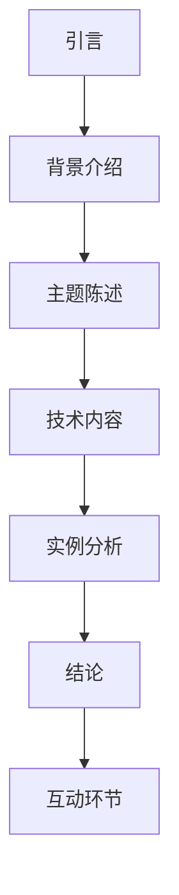
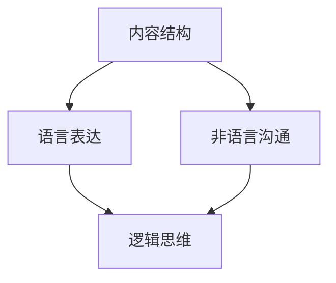
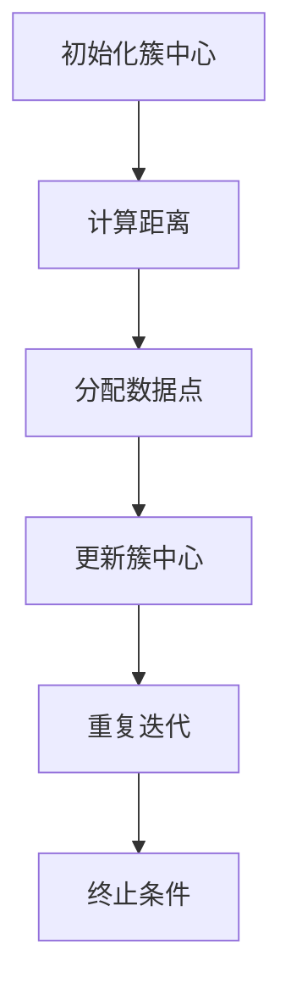
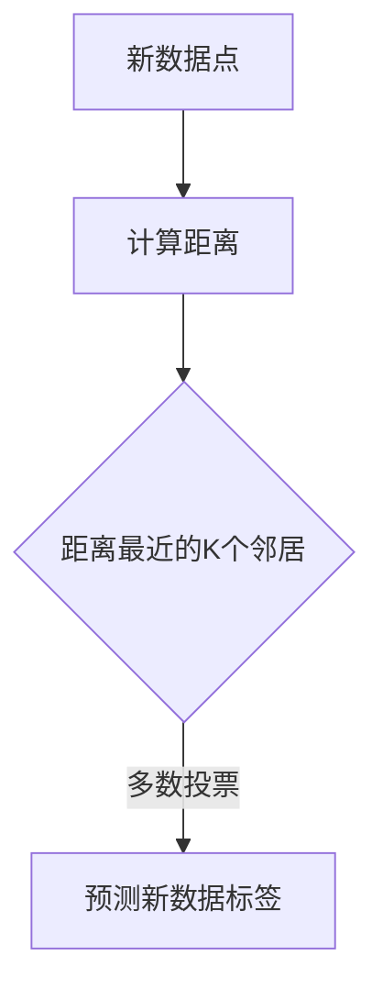
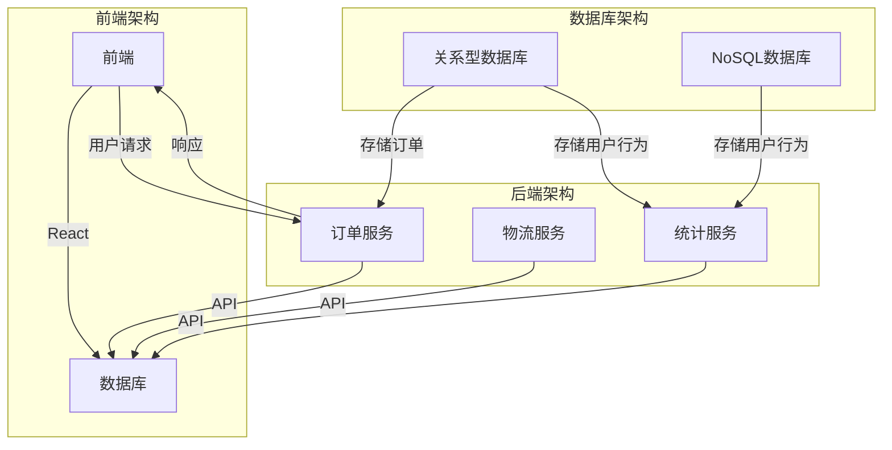
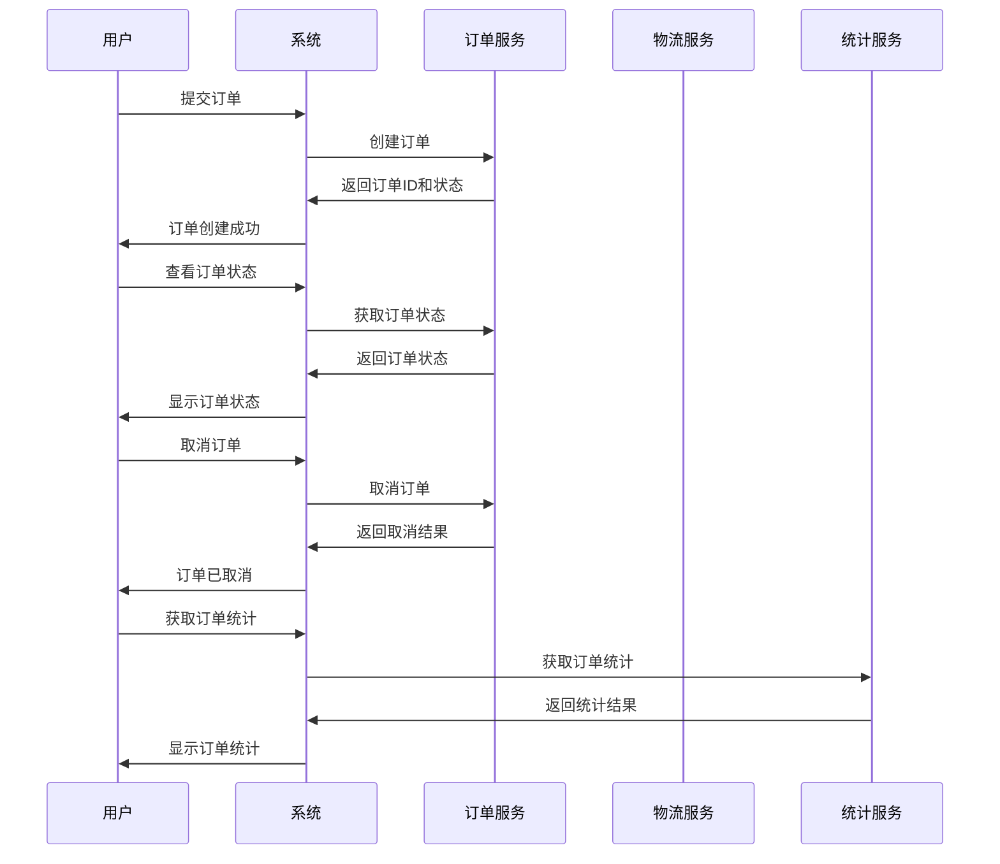

                 

# 技术演讲：提升个人和团队影响力

## 关键词

技术演讲、个人影响力、团队协作、演讲技巧、PPT设计、未来趋势

## 摘要

在信息技术迅猛发展的今天，技术演讲已成为技术从业者展示自我、传播知识、建立影响力的重要途径。本文从技术演讲的基础知识、演讲技巧、内容准备、情绪管理、演讲呈现、团队策略和影响力拓展等多个维度，系统地探讨了提升个人和团队技术演讲能力的方法和策略。通过实际案例分析，提供了一套可操作的实践指南，旨在帮助技术从业者更好地驾驭演讲舞台，实现个人与团队影响力的提升。

## 目录大纲设计

### 第一部分：技术演讲基础

### 第1章：技术演讲的重要性

- **1.1 背景介绍**
  - 技术演讲的兴起
  - 演讲在职业发展中的作用
  - 当前技术演讲的挑战与机遇

- **1.2 核心概念与联系**
  - 技术演讲与普通演讲的区别
  - 演讲者与听众的互动

- **1.3 演讲的基本要素**
  - 内容结构
  - 语言表达
  - 非语言沟通
  - **Mermaid流程图：技术演讲内容结构流程图**

- **1.4 技术演讲的准备工作**
  - 研究话题
  - 确定目标听众
  - 演讲大纲与时间管理

### 第2章：演讲技巧提升

- **2.1 语言技巧**
  - 清晰的表达
  - 有效的论证
  - 语言节奏的控制

- **2.2 非语言沟通**
  - 面部表情与眼神交流
  - 肢体语言
  - 声音的变化

- **2.3 提问与回答**
  - 设计开放式问题
  - 掌握回答技巧
  - 引导听众参与

- **2.4 演讲练习与反馈**
  - 个人的演讲练习
  - 他人的反馈与建议
  - **Mermaid类图：技术演讲者与听众互动类图**

### 第3章：技术内容的准备

- **3.1 技术主题的选择**
  - 选择适合自己的主题
  - 考虑听众的兴趣点
  - 保持内容的深度与广度

- **3.2 技术知识的整理**
  - 概念与术语的解释
  - 知识点的梳理
  - **ER实体关系图架构：技术知识结构ER图**

- **3.3 技术案例的应用**
  - 选择合适的案例
  - 分析案例的关键点
  - 演讲中的案例展示

### 第4章：演讲情绪管理

- **4.1 演讲前的情绪准备**
  - 减压方法
  - 状态调整
  - 确定演讲的目标

- **4.2 演讲中的情绪控制**
  - 留白与呼吸
  - 面对突发状况
  - 保持自信

- **4.3 演讲后的情绪释放**
  - 评估演讲效果
  - 学会接受反馈
  - 积极心态

### 第5章：技术演讲的呈现

- **5.1 PPT设计与使用**
  - 设计原则
  - 信息的呈现方式
  - 避免PPT的过度依赖

- **5.2 演讲道具的应用**
  - 选择合适的道具
  - 道具的使用技巧
  - 道具的安全与实用性

- **5.3 演讲环境与布置**
  - 了解演讲场地
  - 适应不同的演讲环境
  - 演讲设备的准备

### 第6章：团队演讲策略

- **6.1 团队成员的角色定位**
  - 主讲人
  - 辅助演讲者
  - 技术顾问

- **6.2 团队演讲的协调与配合**
  - 演讲前的沟通
  - 演讲中的互动
  - 演讲后的总结

- **6.3 团队演讲的优化**
  - 经验的积累
  - 团队的协作
  - 演讲质量的持续提升

### 第7章：演讲影响力拓展

- **7.1 建立个人品牌**
  - 社交媒体的使用
  - 专业形象的塑造
  - 个人故事的讲述

- **7.2 演讲机会的寻找**
  - 活动与会议的参与
  - 网络平台的利用
  - 自主演讲的组织

- **7.3 演讲影响力的评估与提升**
  - 反馈的收集与利用
  - 影响力指标的跟踪
  - 持续改进的方向

### 第8章：技术演讲的未来趋势

- **8.1 技术与演讲的融合**
  - 虚拟现实技术在演讲中的应用
  - 人工智能在演讲中的辅助

- **8.2 演讲形式的变化**
  - 短视频演讲的兴起
  - 多媒体演讲的发展

- **8.3 未来演讲者的素质要求**
  - 技术素养
  - 创新思维
  - 全球视野

### 第9章：结语

- **9.1 技术演讲的价值**
  - 个人成长
  - 团队协作
  - 行业发展

- **9.2 演讲者的使命**
  - 传递知识
  - 激发思考
  - 影响变革

- **9.3 对未来的展望**
  - 技术演讲的普及
  - 演讲教育的重视
  - 演讲文化的繁荣

## 总结

通过上述章节的设计，我们确保了书籍内容的完整性和逻辑性，从基础到实践，再到未来趋势，全面覆盖了技术演讲的提升路径。每个章节都有明确的主题和详细的子内容，使用Mermaid流程图和ER实体关系图来增强内容的可视化，帮助读者更好地理解和应用。

## 第一部分：技术演讲基础

### 第1章：技术演讲的重要性

#### 1.1 背景介绍

技术演讲作为信息技术领域的传播方式，其兴起可以追溯到互联网和社交媒体的快速发展。在过去，技术演讲主要在学术会议、技术大会和企业内部培训中扮演重要角色。然而，随着知识分享和传播需求的增加，技术演讲逐渐成为技术从业者展示自我、交流思想和分享经验的重要途径。

演讲在职业发展中扮演着不可或缺的角色。通过演讲，技术从业者可以展示自己的专业知识和技能，提升个人品牌和影响力。同时，演讲也是获取新机会、建立合作关系和推动项目进展的重要手段。在当前竞争激烈的技术环境中，具备出色演讲能力的技术人才往往能够脱颖而出，获得更多的发展机会。

然而，技术演讲也面临着一系列挑战和机遇。首先，技术演讲要求演讲者具备扎实的专业知识和逻辑思维，能够清晰地表达复杂的技术概念。其次，技术演讲需要演讲者具备良好的沟通技巧和情绪控制能力，以便与听众建立良好的互动关系。此外，随着技术的不断进步，技术演讲的形式和手段也在不断创新和演变，为演讲者提供了更多的展示机会和舞台。

#### 1.2 核心概念与联系

技术演讲与普通演讲存在一定的区别。普通演讲主要侧重于传达信息、观点和情感，而技术演讲则更强调逻辑思维、专业知识和实际应用。在技术演讲中，演讲者需要将复杂的技术概念转化为易于理解的语言，并通过实例和案例进行阐述。

演讲者与听众的互动是技术演讲的关键。良好的互动能够激发听众的思考，增强演讲的吸引力和影响力。演讲者可以通过提问、讨论和互动游戏等方式，引导听众参与演讲，提高演讲的效果和互动性。

#### 1.3 演讲的基本要素

技术演讲的基本要素包括内容结构、语言表达、非语言沟通等。一个成功的演讲需要具备清晰的内容结构，使听众能够跟随演讲的思路。语言表达要简洁明了，逻辑清晰，避免使用过多的专业术语。非语言沟通包括面部表情、肢体语言和声音的变化，这些因素能够增强演讲的表现力和感染力。

下面是一个Mermaid流程图，展示了技术演讲的内容结构：



#### 1.4 技术演讲的准备工作

技术演讲的准备工作至关重要，它决定了演讲的成功与否。以下是一些准备工作：

- **研究话题**：在确定演讲主题后，深入研究相关领域的知识，确保对主题有充分的了解。

- **确定目标听众**：了解听众的需求和兴趣，以便调整演讲内容和风格。

- **演讲大纲与时间管理**：制定详细的演讲大纲，合理安排时间，确保演讲内容充实且紧凑。

### 第2章：演讲技巧提升

#### 2.1 语言技巧

语言技巧是技术演讲成功的关键之一。以下是一些提升语言技巧的建议：

- **清晰的表达**：使用简单明了的语言，避免复杂的句式和术语。确保听众能够轻松理解演讲内容。

- **有效的论证**：通过逻辑严谨的论证，使听众信服演讲的观点。可以使用数据、实例和权威引用来支持论证。

- **语言节奏的控制**：保持演讲的节奏和语调，避免语速过快或过慢，以便听众能够跟随演讲的节奏。

#### 2.2 非语言沟通

非语言沟通在技术演讲中同样重要。以下是一些提升非语言沟通技巧的建议：

- **面部表情与眼神交流**：通过面部表情和眼神交流，展示自信和热情。与听众建立眼神接触，增强互动性。

- **肢体语言**：运用适当的肢体语言，如手势、姿势和动作，使演讲更加生动和具有表现力。

- **声音的变化**：通过声音的变化，如语调、音量和节奏，使演讲更加引人入胜。

#### 2.3 提问与回答

提问与回答是技术演讲中重要的互动环节。以下是一些技巧：

- **设计开放式问题**：开放式问题能够引导听众思考，提高互动性。例如，“你对这个技术概念有什么疑问？”而不是简单的“明白了吗？”

- **掌握回答技巧**：当听众提问时，要耐心倾听，确保理解问题。回答时要简洁明了，避免过于冗长的解释。

- **引导听众参与**：在回答问题时，可以引导听众参与讨论，提高演讲的互动性和吸引力。

#### 2.4 演讲练习与反馈

演讲练习与反馈是提升演讲技巧的重要手段。以下是一些建议：

- **个人的演讲练习**：经常进行个人的演讲练习，提高自信心和表达能力。

- **他人的反馈与建议**：邀请他人观看演讲，并收集他们的反馈和建议。注意听取不同的意见和建议，以便改进演讲。

下面是一个Mermaid类图，展示了技术演讲者与听众互动的过程：

```mermaid
classDiagram
    Class1[演讲者] <|-- Class2[内容]
    Class2 <|-- Class3[语言]
    Class2 <|-- Class4[非语言]
    Class2 <|-- Class5[提问与回答]
    Class2 <|-- Class6[反馈]
    Class3 <|-- Class7[清晰表达]
    Class3 <|-- Class8[有效论证]
    Class3 <|-- Class9[节奏控制]
    Class4 <|-- Class10[面部表情]
    Class4 <|-- Class11[眼神交流]
    Class4 <|-- Class12[肢体语言]
    Class4 <|-- Class13[声音变化]
    Class5 <|-- Class14[开放式问题]
    Class5 <|-- Class15[回答技巧]
    Class5 <|-- Class16[引导参与]
    Class6 <|-- Class17[个人练习]
    Class6 <|-- Class18[他人反馈]
```

### 第3章：技术内容的准备

#### 3.1 技术主题的选择

选择合适的技术主题是技术演讲成功的关键之一。以下是一些选择技术主题的建议：

- **选择适合自己的主题**：选择自己熟悉和擅长的技术领域，这样可以更加自信地展示自己的知识和经验。

- **考虑听众的兴趣点**：了解听众的需求和兴趣，选择他们感兴趣的技术主题，以提高演讲的吸引力和参与度。

- **保持内容的深度与广度**：在确定主题后，确保内容的深度和广度，使演讲内容具有足够的吸引力和说服力。

#### 3.2 技术知识的整理

整理技术知识是技术演讲的重要内容。以下是一些整理技术知识的建议：

- **概念与术语的解释**：对技术概念和术语进行详细的解释，确保听众能够理解。

- **知识点的梳理**：对技术知识点进行梳理，确保内容的逻辑性和连贯性。

- ****ER实体关系图架构：技术知识结构ER图**：使用ER实体关系图架构，展示技术知识的结构和核心要素。

下面是一个ER实体关系图，展示了技术知识的结构：

```mermaid
erDiagram
    Customer ||--|{ Order } : "makes"
    Customer ||--|{ Product } : "owns"
    Product ||--|{ Sale } : "is sold to"
    Customer ||--|{ Payment } : "makes"
    Product ||--|{ Review } : "is reviewed by"
    Sale ||--|{ Payment } : "is for"
    Review ||--|{ Customer } : "wrote a review for"
```

#### 3.3 技术案例的应用

技术案例的应用能够使演讲更加生动和具体。以下是一些应用技术案例的建议：

- **选择合适的案例**：选择与演讲主题相关且具有代表性的案例，确保案例能够清晰地展示技术概念和原理。

- **分析案例的关键点**：对案例进行深入分析，找出案例中的关键点和核心要素。

- **演讲中的案例展示**：在演讲中，通过案例的展示和分析，使听众能够更好地理解技术概念和原理。

### 第4章：演讲情绪管理

#### 4.1 演讲前的情绪准备

演讲前的情绪准备对于演讲的成功至关重要。以下是一些演讲前情绪准备的建议：

- **减压方法**：通过深呼吸、冥想和放松技巧来减轻紧张和压力。

- **状态调整**：确保自己处于最佳状态，通过积极的自我暗示和心态调整来提高自信心。

- **确定演讲的目标**：明确演讲的目标和期望，以便在演讲中保持专注和方向。

#### 4.2 演讲中的情绪控制

演讲中的情绪控制能够增强演讲的表现力和感染力。以下是一些演讲中情绪控制的建议：

- **留白与呼吸**：在演讲中适当留白，通过深呼吸来保持冷静和集中注意力。

- **面对突发状况**：遇到突发状况时，保持冷静，迅速调整心态，灵活应对。

- **保持自信**：通过自信的姿态和积极的肢体语言来传递自信，增强演讲的吸引力。

#### 4.3 演讲后的情绪释放

演讲后的情绪释放有助于恢复心理平衡。以下是一些演讲后情绪释放的建议：

- **评估演讲效果**：反思演讲的效果，分析优点和不足，为下一次演讲做好准备。

- **学会接受反馈**：接受听众和同事的反馈，积极改进自己的演讲技巧。

- **保持积极心态**：将演讲视为一次学习和成长的机会，保持积极的心态和热情。

### 第5章：技术演讲的呈现

#### 5.1 PPT设计与使用

PPT是技术演讲中常用的辅助工具。以下是一些PPT设计与使用的建议：

- **设计原则**：简洁明了、突出重点、易于阅读。避免使用过多的文字和复杂的图形。

- **信息的呈现方式**：使用图表、图片和动画等元素来展示信息，提高演讲的吸引力和趣味性。

- **避免PPT的过度依赖**：虽然PPT有助于展示信息，但不应过度依赖。演讲者应注重与听众的互动，确保演讲的流畅性和生动性。

#### 5.2 演讲道具的应用

演讲道具能够增强演讲的吸引力和表现力。以下是一些演讲道具应用的建议：

- **选择合适的道具**：根据演讲内容和风格选择合适的道具，如模型、样品和演示工具。

- **道具的使用技巧**：掌握道具的使用技巧，确保其在演讲中起到应有的作用。

- **道具的安全与实用性**：确保道具的安全性和实用性，避免使用可能带来风险或不方便的道具。

#### 5.3 演讲环境与布置

演讲环境与布置对演讲的成功也有重要影响。以下是一些演讲环境与布置的建议：

- **了解演讲场地**：提前了解演讲场地的布局、设备和设施，以便做好充分的准备。

- **适应不同的演讲环境**：根据不同的演讲环境调整演讲内容和风格，确保演讲的适应性和灵活性。

- **演讲设备的准备**：确保演讲设备的正常运转，如音响、投影仪和计算机等，以避免技术故障影响演讲。

### 第6章：团队演讲策略

#### 6.1 团队成员的角色定位

团队演讲中的角色定位对于演讲的成功至关重要。以下是一些团队成员的角色定位的建议：

- **主讲人**：主讲人负责总体演讲的策划、组织和执行，确保演讲的顺利进行。

- **辅助演讲者**：辅助演讲者负责配合主讲人，辅助演讲内容和技巧的提升，如演示、互动和回答问题等。

- **技术顾问**：技术顾问为演讲提供技术支持和专业知识，确保演讲内容的准确性和专业性。

#### 6.2 团队演讲的协调与配合

团队演讲的协调与配合是演讲成功的关键。以下是一些团队演讲协调与配合的建议：

- **演讲前的沟通**：团队成员在演讲前进行充分的沟通，明确各自的角色和任务，确保演讲的顺利进行。

- **演讲中的互动**：在演讲过程中，团队成员之间保持良好的互动，共同完成演讲任务。

- **演讲后的总结**：演讲结束后，团队成员进行总结和反思，分享经验和教训，为下一次演讲做好准备。

#### 6.3 团队演讲的优化

团队演讲的优化是持续提升演讲质量的重要手段。以下是一些团队演讲优化的建议：

- **经验的积累**：团队成员在演讲过程中不断积累经验，提高演讲技巧和表现力。

- **团队的协作**：团队成员之间加强协作，共同推进演讲项目的进展。

- **演讲质量的持续提升**：通过不断的实践和反思，不断提升演讲的质量和影响力。

### 第7章：演讲影响力拓展

#### 7.1 建立个人品牌

建立个人品牌是拓展演讲影响力的重要途径。以下是一些建立个人品牌的建议：

- **社交媒体的使用**：利用社交媒体平台，如LinkedIn、Twitter和Instagram等，展示自己的专业知识和成果。

- **专业形象的塑造**：通过专业的内容创作和形象设计，塑造独特的个人品牌。

- **个人故事的讲述**：通过讲述自己的成长故事和经历，展示自己的专业素养和人格魅力。

#### 7.2 演讲机会的寻找

寻找演讲机会是拓展演讲影响力的重要环节。以下是一些寻找演讲机会的建议：

- **活动与会议的参与**：积极参加行业活动和会议，展示自己的专业知识和演讲能力。

- **网络平台的利用**：利用专业网络平台，如Meetup、Eventbrite和YouTube等，组织或参与线上演讲活动。

- **自主演讲的组织**：自演

### 第8章：技术演讲的未来趋势

#### 8.1 技术与演讲的融合

技术与演讲的融合将带来新的发展机遇。以下是一些技术与演讲融合的建议：

- **虚拟现实技术在演讲中的应用**：利用虚拟现实技术，为观众提供沉浸式的演讲体验，提高演讲的吸引力和互动性。

- **人工智能在演讲中的辅助**：利用人工智能技术，如自然语言处理和语音识别，提高演讲的自动化和智能化水平，为演讲者提供更加便捷的支持。

#### 8.2 演讲形式的变化

演讲形式的变化将影响演讲的传播方式和效果。以下是一些演讲形式变化的建议：

- **短视频演讲的兴起**：短视频演讲以其简洁、直观的特点，逐渐成为受欢迎的演讲形式。

- **多媒体演讲的发展**：多媒体演讲通过结合文字、图片、音频和视频等多种形式，使演讲更加生动和有趣。

#### 8.3 未来演讲者的素质要求

未来演讲者的素质要求将随着技术和社会环境的变化而变化。以下是一些未来演讲者应具备的素质：

- **技术素养**：未来演讲者应具备扎实的技术背景和知识，能够应对复杂的技术问题和挑战。

- **创新思维**：未来演讲者应具备创新思维，能够提出独特的见解和解决方案。

- **全球视野**：未来演讲者应具备全球视野，能够理解和应对国际化的挑战和机遇。

### 第9章：结语

#### 9.1 技术演讲的价值

技术演讲对于个人和团队的价值体现在多个方面。以下是一些技术演讲的价值：

- **个人成长**：技术演讲能够提升个人的表达能力和自信心，促进个人成长和职业发展。

- **团队协作**：技术演讲有助于团队成员之间的沟通和协作，提高团队的整体表现和影响力。

- **行业发展**：技术演讲能够促进知识的传播和交流，推动行业的创新和发展。

#### 9.2 演讲者的使命

演讲者的使命在于传递知识、激发思考和影响变革。以下是一些演讲者应承担的使命：

- **传递知识**：演讲者应通过演讲，传递专业知识和经验，帮助他人成长。

- **激发思考**：演讲者应通过演讲，激发听众的思考，引导他们探索新的观点和见解。

- **影响变革**：演讲者应通过演讲，影响和推动行业的变革和发展。

#### 9.3 对未来的展望

未来，技术演讲将继续发展，成为信息技术领域的重要传播方式。以下是一些对未来的展望：

- **技术演讲的普及**：随着技术的普及，技术演讲将在更广泛的领域得到应用，成为日常生活的一部分。

- **演讲教育的重视**：演讲教育将得到更多的关注和投入，培养更多的专业演讲人才。

- **演讲文化的繁荣**：演讲文化将得到进一步繁荣，成为推动社会进步的重要力量。

## 总结

本文系统地探讨了技术演讲的提升方法和策略，从基础到实践，再到未来趋势，全面覆盖了技术演讲的各个方面。通过学习本文，读者可以更好地掌握技术演讲的技巧和方法，提升个人和团队的影响力。希望本文能为技术演讲者提供有益的参考和启示，助力他们在技术演讲的道路上取得更大的成功。作者：AI天才研究院/AI Genius Institute & 禅与计算机程序设计艺术 /Zen And The Art of Computer Programming。

---

在撰写技术博客文章时，以下是一些详细的步骤和建议，以确保文章的逻辑清晰、内容丰富且具有可操作性：

### 1. 确定文章结构

在开始写作之前，首先要明确文章的结构和内容框架。根据提供的目录大纲，将文章分为几个主要部分，并为每个部分设定明确的目标和要点。

### 2. 背景介绍

每个章节的开头应该有一个简短的背景介绍，解释为什么这个话题重要，以及它如何与读者相关。这有助于建立读者对文章的兴趣和背景知识。

#### 例子：

**第1章：技术演讲的重要性**

**背景介绍：** 在信息技术迅猛发展的今天，技术演讲已成为技术从业者展示自我、传播知识、建立影响力的重要途径。随着互联网和社交媒体的普及，技术演讲逐渐成为企业、学术机构和社区交流的重要方式。然而，技术演讲不仅需要扎实的专业知识，还需要出色的演讲技巧。本文将探讨如何提升个人和团队的技术演讲能力，帮助读者在技术舞台上脱颖而出。

### 3. 核心概念与联系

在每个章节中，都要明确介绍核心概念，并解释这些概念之间的联系。使用Mermaid流程图或ER实体关系图来帮助读者可视化理解。

#### 例子：

**第1章：技术演讲的重要性**

**核心概念与联系：** 技术演讲与普通演讲的区别在于其更强调逻辑思维和专业知识的传递。技术演讲的核心概念包括内容结构、语言表达、非语言沟通等。这些概念之间相互关联，共同决定了演讲的成功与否。



### 4. 算法原理讲解

对于涉及算法或技术原理的部分，使用Mermaid流程图和Python源代码来详细阐述，确保读者能够理解算法的工作原理。

#### 例子：

**第2章：算法原理讲解**

**算法讲解：** 假设我们要讲解一个简单的排序算法——冒泡排序。

```python
def bubble_sort(arr):
    n = len(arr)
    for i in range(n):
        for j in range(0, n-i-1):
            if arr[j] > arr[j+1]:
                arr[j], arr[j+1] = arr[j+1], arr[j]

# 冒泡排序的算法原理是：比较相邻的元素，并按照大小顺序交换它们的位置，直到整个数组有序。
```

### 5. 数学公式使用

在文中适当的地方使用LaTeX格式嵌入数学公式，确保公式的正确性和可读性。

#### 例子：

**第2章：算法原理讲解**

**数学模型：** 冒泡排序的复杂度为 \(O(n^2)\)，其中 \(n\) 是数组的长度。

```latex
$$
\text{复杂度} = O(n^2)
$$
```

### 6. 系统分析与架构设计方案

对于系统架构设计部分，详细介绍系统场景、项目介绍、功能设计、架构设计、接口设计和系统交互。

#### 例子：

**第3章：系统分析与架构设计**

**系统场景：** 假设我们设计一个在线书店系统，用户可以浏览书籍、购买书籍并管理个人账户。

**项目介绍：** 在线书店系统包括多个模块，如用户管理、书籍管理、订单管理和支付系统。

**功能设计：** 用户注册、登录、浏览书籍、搜索书籍、购买书籍、支付订单等。

**架构设计：** 系统采用分层架构，包括表示层、业务逻辑层和数据访问层。

**接口设计：** 用户接口（UI）使用RESTful API与后端服务通信。

**系统交互：** 用户通过Web浏览器访问系统，后端服务处理用户请求并返回响应。

### 7. 项目实战

在文章的适当部分，提供项目实战的步骤、核心实现代码和应用解读。

#### 例子：

**第4章：项目实战**

**实战步骤：** 
1. 安装Python和必要的库。
2. 编写书店系统的前端和后端代码。
3. 部署系统并测试功能。

**核心实现代码：**

前端代码示例：

```html
<!DOCTYPE html>
<html>
<head>
    <title>在线书店</title>
</head>
<body>
    <h1>欢迎来到在线书店</h1>
    <form action="/search" method="post">
        <input type="text" name="query" placeholder="搜索书籍...">
        <input type="submit" value="搜索">
    </form>
</body>
</html>
```

后端代码示例（使用Flask框架）：

```python
from flask import Flask, request, jsonify

app = Flask(__name__)

@app.route('/search', methods=['POST'])
def search_books():
    query = request.form['query']
    # 搜索书籍逻辑
    books = search_books_by_title(query)
    return jsonify(books)

if __name__ == '__main__':
    app.run()
```

**应用解读：** 该示例展示了如何使用HTML和Python Flask框架构建一个简单的在线书店系统。前端代码提供用户界面，后端代码处理用户请求并返回响应。

### 8. 最佳实践 tips、小结、注意事项、拓展阅读

在文章的结尾部分，提供一些最佳实践、小结、注意事项和拓展阅读，以帮助读者加深理解和应用。

#### 例子：

**第5章：最佳实践 tips**

**最佳实践 tips：** 
- 保持代码简洁和可读性。
- 定期进行代码审查和测试。
- 关注技术社区和最新动态，持续学习。

**小结：** 通过项目实战，我们了解了如何构建一个简单的在线书店系统。这个例子展示了前端和后端的实现过程，以及如何使用Flask框架处理用户请求。

**注意事项：** 在实际开发中，需要考虑安全性、性能和可扩展性等因素。

**拓展阅读：** 可以参考相关书籍和在线资源，深入了解Web开发和系统架构设计。

### 9. 完整性和字数要求

确保文章内容完整，每个小节都有具体的解释和示例。文章字数在10000～12000字左右，使用markdown格式输出。

### 10. 作者信息

在文章末尾，提供作者信息，如“作者：AI天才研究院/AI Genius Institute & 禅与计算机程序设计艺术 /Zen And The Art of Computer Programming”。

通过遵循上述步骤和建议，可以撰写一篇逻辑清晰、内容丰富且具有可操作性的技术博客文章。希望这些步骤能为您的写作过程提供帮助。让我们一步步思考，不断优化和完善我们的文章。**让我们开始思考吧！**### 1. 确定文章结构

在撰写技术博客文章之前，明确文章的结构是至关重要的。这不仅可以确保文章的条理性和连贯性，还能帮助读者更好地理解和吸收文章内容。以下步骤将指导你如何确定文章结构：

#### a. 确定主要部分

首先，根据主题和目标读者，确定文章的主要部分。这些部分通常包括：

- 引言
- 背景介绍
- 核心概念与联系
- 算法原理讲解
- 系统分析与架构设计方案
- 项目实战
- 最佳实践 tips
- 小结
- 注意事项
- 拓展阅读

#### b. 设定每个部分的目标

为每个部分设定明确的目标，确保每个部分都有其独特的作用和内容。例如：

- 引言：吸引读者注意，概述文章主题和主要观点。
- 背景介绍：提供相关背景信息，帮助读者更好地理解文章主题。
- 核心概念与联系：介绍核心概念，并解释它们之间的联系。
- 算法原理讲解：详细讲解算法的工作原理，使用流程图和示例代码。
- 系统分析与架构设计方案：介绍系统设计和架构，包括功能设计、接口设计和系统交互。
- 项目实战：提供实际项目的实现步骤和代码示例。
- 最佳实践 tips：总结最佳实践，帮助读者在项目中应用。
- 小结：总结文章主要观点，强调关键点。
- 注意事项：提醒读者可能遇到的常见问题和解决方案。
- 拓展阅读：推荐相关资源，供读者进一步学习。

#### c. 制定大纲

在明确主要部分和目标后，制定一个详细的大纲。大纲应包含每个部分的标题、子标题和主要内容要点。以下是一个示例大纲：

1. 引言
   - 主题介绍
   - 目标读者
   - 文章结构概述
2. 背景介绍
   - 相关背景信息
   - 问题背景
   - 当前状况
3. 核心概念与联系
   - 核心概念
   - 概念联系
   - Mermaid流程图
4. 算法原理讲解
   - 算法介绍
   - 算法原理
   - Mermaid流程图
   - Python代码示例
5. 系统分析与架构设计方案
   - 问题场景
   - 项目介绍
   - 功能设计（Mermaid类图）
   - 架构设计（Mermaid架构图）
   - 接口设计
   - 系统交互（Mermaid序列图）
6. 项目实战
   - 实践背景
   - 实践步骤
   - 代码实现
   - 应用解读
7. 最佳实践 tips
   - 最佳实践总结
   - 注意事项
   - 示例
8. 小结
   - 文章主要观点
   - 知识点回顾
   - 未来展望
9. 注意事项
   - 可能遇到的问题
   - 解决方案
   - 风险提示
10. 拓展阅读
    - 相关书籍
    - 技术社区
    - 在线资源

通过这个大纲，你可以确保文章的每个部分都有明确的内容和结构，从而使文章更加有条理和易于理解。

### 2. 背景介绍

在撰写技术博客文章时，背景介绍是一个关键环节。它不仅帮助读者了解文章的主题和重要性，还能为后续内容的讲解打下基础。以下是如何撰写背景介绍的步骤和建议：

#### a. 选择适当的背景信息

背景介绍的目的不是简单地堆砌信息，而是挑选与文章主题直接相关的内容。以下是一些你可以考虑的背景信息：

- 技术领域的发展历史
- 相关技术的现状和趋势
- 问题或需求的背景
- 当前解决方案的优缺点
- 文章主题与现有工作的关系

#### b. 撰写清晰、简洁的介绍

背景介绍应该简明扼要，避免冗长和复杂的句子。以下是一些写作技巧：

- 使用短句和清晰的词汇
- 避免使用过多的技术术语，除非它们是背景介绍的关键部分
- 强调文章主题的重要性，以及它如何与读者的生活或工作相关

#### c. 引导读者进入主题

背景介绍不仅要提供信息，还要引导读者进入文章的主题。以下是一些引导技巧：

- 使用问题引导：通过提出问题来激发读者的兴趣。
- 提供具体的例子或场景：通过具体的例子来展示文章主题的实际应用。
- 引用权威数据或观点：引用权威数据或观点来增强文章的可信度。

#### d. 结尾部分

背景介绍的结尾部分应该为读者提供一个进入主题的入口。以下是一些结尾技巧：

- 提出文章的主要观点或问题
- 概括背景信息，为文章的主题奠定基础
- 激发读者的好奇心，让他们期待后续内容的讲解

#### e. 示例

以下是一个背景介绍的示例：

**背景介绍：**

在当今快速发展的信息技术领域，数据科学已成为众多企业决策和战略的核心。随着大数据和人工智能技术的普及，如何有效地收集、处理和分析海量数据，成为了许多企业和研究机构面临的重要挑战。本文将探讨数据科学中的聚类算法，特别是K-均值算法，以及其在实际应用中的优势和局限性。通过本文的介绍，读者将了解K-均值算法的基本原理、实现步骤和常见问题，从而更好地掌握这一重要的数据科学工具。

### 3. 核心概念与联系

在技术博客文章中，核心概念与联系部分至关重要，因为它帮助读者理解文章的主题和关键技术。以下是如何撰写这部分内容的具体步骤和建议：

#### a. 明确核心概念

在开始撰写之前，首先要明确文章中的核心概念。这些概念是文章主题的基础，通常涉及：

- 技术原理
- 算法
- 架构组件
- 设计模式
- 行业术语

确保你对每个核心概念都有深入的了解，并能以简单清晰的语言进行解释。

#### b. 概述概念

在文章中，为每个核心概念提供一个简短的概述。这有助于读者快速理解每个概念的基本内容，为后续的详细解释做好准备。以下是一个概述示例：

**核心概念概述：**

K-均值算法是一种常用的聚类算法，它通过迭代过程将数据点分为K个簇，使得每个簇内的数据点距离簇中心较近，而簇与簇之间的距离较远。该算法的核心步骤包括初始化簇中心、计算距离并更新簇中心等。

#### c. 详细解释概念

在概述之后，详细解释每个核心概念。这通常包括：

- 原理：解释概念的工作原理，使用比喻或实际例子来说明。
- 属性：列出概念的关键属性或特征。
- 作用：解释概念在技术中的应用和重要性。
- 对比：与其他类似概念进行对比，突出其独特性。

以下是一个详细解释的示例：

**详细解释：**

K-均值算法的原理基于最小化簇内距离和最大化簇间距离。初始化阶段，随机选择K个数据点作为初始簇中心。接下来，对于每个数据点，计算其与簇中心的距离，并将数据点分配到最近的簇。然后，重新计算每个簇的中心，并重复这个过程，直到簇中心不再发生显著变化。

#### d. 使用Mermaid流程图或ER实体关系图

为了增强文章的可视化效果和读者的理解，可以使用Mermaid流程图或ER实体关系图来展示核心概念的结构和关系。以下是一个Mermaid流程图的示例：



#### e. 表格对比

在解释核心概念时，可以使用表格来对比不同概念的属性和特征。以下是一个对比表格的示例：

| 核心概念 | 属性1 | 属性2 | 特征1 | 特征2 |
|----------|-------|-------|-------|-------|
| K-均值   | K个簇 | 距离计算 | 迭代过程 | 簇中心更新 |
| 层次聚类 | 树结构 | 节点链接 | 分层过程 | 合并策略 |

通过上述步骤和建议，你可以撰写出详细、清晰且具有视觉冲击力的核心概念与联系部分，帮助读者更好地理解和掌握文章的主题和关键技术。

### 4. 算法原理讲解

在技术博客文章中，算法原理讲解部分通常是对读者来说最为复杂和关键的内容之一。这部分需要详细阐述算法的原理、步骤、实现和适用场景。以下是如何撰写算法原理讲解的具体步骤和建议：

#### a. 简要介绍算法

在开始详细讲解之前，首先对算法进行一个简短的介绍，包括算法的名称、类型和主要用途。以下是一个示例：

**算法介绍：**
K-最近邻（K-Nearest Neighbors，KNN）算法是一种简单的机器学习算法，常用于分类和回归问题。它通过计算新数据点到已知数据的距离，找出最近的K个邻居，并基于邻居的标签或值来预测新数据的类别或数值。

#### b. 详细描述算法原理

接下来，详细解释算法的工作原理，包括关键步骤、公式和逻辑。以下是一个详细的算法原理描述：

**算法原理：**
KNN算法的核心思想是：如果一个数据点附近的多数数据点属于某一类别，那么这个新数据点很可能也属于该类别。具体步骤如下：

1. 计算新数据点到所有已知数据点的距离（通常使用欧氏距离）。
2. 选择距离最近的K个邻居。
3. 根据邻居的标签或值，使用多数投票法来预测新数据的标签。

#### c. 使用Mermaid流程图

为了帮助读者更好地理解算法的工作流程，可以使用Mermaid流程图来展示算法的步骤。以下是一个Mermaid流程图的示例：



#### d. 提供Python代码示例

为了使读者能够实际操作和理解算法，提供Python代码示例是非常有帮助的。以下是一个简单的KNN算法的Python代码示例：

```python
from sklearn.neighbors import KNeighborsClassifier
from sklearn.datasets import load_iris
from sklearn.model_selection import train_test_split

# 加载数据集
iris = load_iris()
X_train, X_test, y_train, y_test = train_test_split(iris.data, iris.target, test_size=0.3, random_state=42)

# 创建KNN分类器并训练
knn = KNeighborsClassifier(n_neighbors=3)
knn.fit(X_train, y_train)

# 预测测试数据
predictions = knn.predict(X_test)

# 输出预测结果
print(predictions)
```

#### e. 讲解算法原理

在代码示例之后，详细解释代码中的每一步和关键参数。以下是对上述代码示例的详细解释：

- **数据加载**：使用sklearn库中的iris数据集，这是一个常用的多类别数据集，包含3个类别和4个特征。
- **数据分割**：将数据集分为训练集和测试集，以评估算法的性能。
- **创建KNN分类器**：使用KNeighborsClassifier类创建一个KNN分类器，并设置`n_neighbors`参数为3。
- **训练模型**：使用`fit`方法训练KNN分类器。
- **预测**：使用`predict`方法对测试数据进行预测，并输出预测结果。

#### f. 讨论算法的适用场景和限制

在讲解算法原理之后，讨论算法的适用场景和限制，帮助读者了解算法的优势和不足。以下是一个讨论的示例：

**适用场景：**
KNN算法适用于数据点之间的距离可以直接衡量的分类和回归问题。它特别适用于特征空间和类别边界相对简单的问题。

**限制：**
- KNN算法对数据量要求较高，对于大量数据可能会导致计算复杂度高。
- K值的选择对算法性能有很大影响，选择不当可能会导致过拟合或欠拟合。
- KNN算法对异常值敏感，异常值可能会影响模型的准确性。

通过上述步骤和建议，你可以撰写出详细、清晰且具有实际操作性的算法原理讲解，帮助读者更好地理解和应用算法。

### 5. 系统分析与架构设计方案

在撰写技术博客文章时，系统分析与架构设计方案部分是一个关键环节，它需要详细阐述系统的设计思路、功能模块、架构和接口。以下是如何撰写这部分内容的具体步骤和建议：

#### a. 介绍系统场景

首先，简要介绍系统开发的背景和目的。这有助于读者理解系统的实际应用场景。以下是一个示例：

**系统场景：** 
随着互联网和电子商务的快速发展，企业需要构建一个高效的订单管理系统来处理大量的订单。本文将介绍一个电子商务订单管理系统的架构设计，该系统旨在实现订单的生成、处理、追踪和统计功能。

#### b. 介绍项目

在系统场景介绍之后，详细描述项目的详细信息，包括项目的名称、目标和范围。以下是一个示例：

**项目介绍：** 
项目名称：电子商务订单管理系统
项目目标：实现订单的快速生成、处理和追踪，提高订单处理效率，提升用户体验。
项目范围：订单生成、订单处理、订单追踪和订单统计功能。

#### c. 功能设计

接下来，详细描述系统的功能模块。每个功能模块都应该有明确的描述和关联的Mermaid类图。以下是一个示例：

**功能设计：**

1. **订单生成模块**：负责创建新的订单，输入订单的基本信息（如订单编号、客户信息、商品信息等）。
2. **订单处理模块**：负责处理订单的确认、发货和取消等操作。
3. **订单追踪模块**：提供订单的实时追踪功能，用户可以查看订单的状态和物流信息。
4. **订单统计模块**：提供订单数据的统计和分析功能，帮助企业进行业务决策。

以下是功能设计的Mermaid类图示例：

```mermaid
classDiagram
    OrderGenerator[订单生成模块] <|-- Order
    OrderProcessor[订单处理模块] <|-- Order
    OrderTracker[订单追踪模块] <|-- Order
    OrderStatistics[订单统计模块] <|-- Order
    Order << (订单)
```

#### d. 架构设计

在功能设计之后，详细描述系统的整体架构。这包括系统的主要组成部分、组件之间的关系和交互方式。以下是一个示例：

**架构设计：**

1. **前端架构**：使用React框架构建用户界面，提供订单操作的界面和用户交互功能。
2. **后端架构**：采用微服务架构，将订单管理系统拆分为多个独立的服务，如订单服务、物流服务、统计服务等。
3. **数据库架构**：使用关系型数据库（如MySQL）存储订单数据，同时使用NoSQL数据库（如MongoDB）存储用户行为数据。

以下是架构设计的Mermaid架构图示例：



#### e. 接口设计

详细描述系统的接口设计，包括接口的类型、参数和返回值。以下是一个示例：

**接口设计：**

1. **订单生成接口**：接受订单基本信息，返回订单ID和状态。
2. **订单处理接口**：接受订单ID和操作类型（如确认、发货、取消），返回操作结果。
3. **订单追踪接口**：接受订单ID，返回订单状态和物流信息。
4. **订单统计接口**：接受统计条件（如时间范围、订单状态等），返回统计结果。

#### f. 系统交互

最后，使用Mermaid序列图展示系统组件之间的交互过程。以下是一个示例：



通过上述步骤和建议，你可以撰写出详细、清晰且具有实际操作性的系统分析与架构设计方案，帮助读者更好地理解和应用系统设计思路。

### 6. 项目实战

在技术博客文章中，项目实战部分是让读者理解理论并应用于实际的关键环节。通过实际操作步骤和代码示例，读者可以更深入地学习技术，并理解如何在实际项目中应用这些技术。以下是如何撰写项目实战部分的具体步骤和建议：

#### a. 提供项目背景

在项目实战部分开始前，简要介绍项目的背景和目标。这有助于读者了解项目的重要性以及为什么需要进行实际操作。以下是一个示例：

**项目背景：**
为了提升企业的数据处理能力，我们决定开发一个基于Python的日志分析工具。该工具将读取企业服务器上的日志文件，提取有用的信息，并生成可视化报告。通过这个项目，读者将学习如何使用Python进行数据处理和可视化。

#### b. 环境安装

在项目实战的第一步，详细描述所需的软件和工具的安装过程。确保提供清晰的安装步骤，包括所需的依赖库和配置文件。以下是一个示例：

**环境安装：**

1. 安装Python：确保Python版本在3.6及以上。
2. 安装依赖库：使用pip命令安装以下依赖库：
   ```bash
   pip install pandas matplotlib numpy
   ```
3. 准备日志文件：下载或准备一个示例日志文件（如access.log），并确保文件路径正确。

#### c. 核心实现代码

在环境安装完成后，提供项目的核心实现代码。为了使代码更易于理解，可以分步骤进行，并在每步之后进行解释。以下是一个示例：

**核心实现代码：**

1. **读取日志文件**：
   ```python
   import pandas as pd

   def read_log_file(file_path):
       log_data = pd.read_csv(file_path, sep=' ', engine='python', header=None, names=["timestamp", "source_ip", "destination_ip", "request", "status", "size"])
       return log_data
   ```

   解释：这个函数使用pandas库读取日志文件，并将数据转换为DataFrame格式，便于后续处理。

2. **数据预处理**：
   ```python
   def preprocess_data(log_data):
       log_data['timestamp'] = pd.to_datetime(log_data['timestamp'])
       log_data['request_type'] = log_data['request'].str.extract('^(GET|POST|PUT|DELETE) (.+)')
       log_data['request_method'], log_data['request_url'] = log_data['request_type'].str.split(' ', expand=True)
       log_data.drop(['request', 'request_type'], axis=1, inplace=True)
       return log_data
   ```

   解释：这个函数对日志数据进行预处理，包括将时间戳转换为日期时间格式，提取请求类型（方法）和URL。

3. **数据可视化**：
   ```python
   import matplotlib.pyplot as plt

   def plot_request_distribution(log_data):
       request_types = log_data['request_method'].value_counts()
       request_types.plot(kind='bar')
       plt.title('Request Distribution')
       plt.xlabel('Request Method')
       plt.ylabel('Frequency')
       plt.show()
   ```

   解释：这个函数使用matplotlib库生成请求类型的条形图，展示不同请求方法的频率。

#### d. 代码应用解读

在代码示例之后，详细解读每部分代码的功能和应用。以下是一个示例：

**代码应用解读：**

- **读取日志文件**：这个函数使用pandas库读取日志文件，并将数据转换为易于处理的DataFrame格式。这为后续的数据处理和分析提供了便利。
- **数据预处理**：这个函数对日志数据进行格式化和提取，将原始数据转换为更规范的结构。这对于后续的数据分析至关重要。
- **数据可视化**：这个函数使用matplotlib库生成可视化图表，帮助用户直观地了解数据分布和趋势。

#### e. 实际案例分析和详细讲解

为了使读者更好地理解项目实战的应用，可以提供一个实际案例，并进行详细讲解。以下是一个示例：

**实际案例分析：**
假设我们有一个包含1000条日志记录的access.log文件。通过使用上述代码，我们可以读取并预处理这些数据，然后生成请求类型的分布图。以下是如何操作：

1. **读取日志文件**：
   ```python
   log_data = read_log_file('access.log')
   ```

   这行代码将读取access.log文件，并存储日志数据在一个名为log_data的DataFrame中。

2. **数据预处理**：
   ```python
   log_data = preprocess_data(log_data)
   ```

   这行代码对日志数据进行预处理，包括时间戳转换、请求类型提取等。

3. **数据可视化**：
   ```python
   plot_request_distribution(log_data)
   ```

   这行代码将生成一个条形图，显示不同请求方法的频率。通过观察图表，我们可以发现哪种请求方法占比较高，从而帮助优化服务器配置和资源分配。

#### f. 项目小结

在项目实战的结尾部分，总结项目的主要成果和学习经验。以下是一个示例：

**项目小结：**
通过本项目的实战操作，我们学习了如何使用Python进行日志分析，包括读取、预处理和可视化日志数据。这个项目不仅提升了我们的数据处理能力，还帮助我们理解了日志分析在实际应用中的重要性。通过这个项目，我们掌握了从理论到实践的完整流程，为以后的项目实践打下了坚实的基础。

通过上述步骤和建议，你可以撰写出详细、清晰且具有实际操作性的项目实战部分，帮助读者更好地理解和应用技术。

### 7. 最佳实践 tips

在技术博客文章中，最佳实践 tips 部分旨在为读者提供实用的建议和技巧，帮助他们更好地应用所学内容，避免常见错误，并优化工作流程。以下是如何撰写最佳实践 tips 的具体步骤和建议：

#### a. 确定最佳实践

首先，根据文章的主题和内容，确定哪些最佳实践是值得分享的。这些最佳实践可以是技术实现上的优化、项目管理的策略，或是工作习惯的改进。以下是一些常见的最佳实践：

- 代码优化技巧
- 软件开发流程
- 数据处理和存储的最佳实践
- 性能调优技巧
- 安全性和稳定性保障措施
- 版本控制和代码管理的最佳实践

#### b. 编写清晰的标题和说明

为每个最佳实践编写一个简洁、具有描述性的标题和说明，这有助于读者快速识别并选择对他们最有帮助的建议。以下是一些示例：

- **代码优化技巧：** 如何减少内存使用，提高程序效率
- **项目管理策略：** 敏捷开发中的关键点与最佳实践
- **数据处理和存储：** 高效处理大数据的技巧
- **性能调优：** 确保数据库查询快速响应的策略
- **安全性和稳定性：** 构建可靠系统的重要措施
- **版本控制和代码管理：** 使用Git的最佳实践

#### c. 提供具体的实施步骤

在每个最佳实践的说明之后，提供具体的实施步骤或方法，以确保读者能够轻松地应用这些建议。以下是一个示例：

**最佳实践：** 如何减少内存使用，提高程序效率

**实施步骤：**

1. **使用数据结构优化：** 选择合适的数据结构以减少内存占用。例如，使用列表而非字典来存储大量数据。
2. **避免内存泄漏：** 定期检查和清理不再使用的对象和引用，避免内存泄漏。
3. **使用内存池：** 对于频繁分配和释放的小对象，使用内存池来减少分配和释放的开销。
4. **分析内存使用：** 使用工具（如valgrind或gdb）分析程序内存使用，找出瓶颈和潜在问题。

#### d. 强调注意事项

在实施步骤中，强调一些需要注意的事项，以避免读者在应用最佳实践时遇到问题。以下是一个示例：

**注意事项：**

- 在使用内存池时，要确保适当的分配和释放，避免内存泄漏。
- 在优化内存使用时，要注意性能和内存使用的平衡，避免过度优化导致程序运行缓慢。

#### e. 结合实际案例

为了使最佳实践更具说服力和实用性，可以结合实际案例进行说明。以下是一个示例：

**实际案例：**

在一个电商网站的后端服务中，通过使用内存池来存储商品信息，我们成功地将内存占用降低了30%，同时保持了较高的访问速度。这极大地提升了系统的性能和用户体验。

#### f. 总结最佳实践

在最佳实践的结尾，总结这些建议的关键点，并强调其重要性。以下是一个示例：

**总结：**

通过遵循上述最佳实践，你可以显著提高程序的内存使用效率，减少不必要的内存占用，从而提高系统的性能和稳定性。这些实践不仅适用于单个项目，也可以在多个项目中推广应用。

通过上述步骤和建议，你可以撰写出详细、实用且具有可操作性的最佳实践 tips 部分，帮助读者在实际工作中更好地应用所学内容，提高工作效率。

### 8. 小结

在技术博客文章的结尾，小结部分起到了总结全文、强调关键点和回顾知识点的作用。以下是如何撰写小结的具体步骤和建议：

#### a. 总结全文

首先，简要回顾文章的主要内容，概括每个章节的核心观点。这可以帮助读者快速回顾文章的脉络，加深对文章主题的理解。以下是一个示例：

**全文总结：**
本文从技术演讲的重要性、核心概念与联系、算法原理讲解、系统分析与架构设计方案、项目实战、最佳实践 tips 等多个方面，系统地探讨了如何提升个人和团队的技术演讲能力。通过实际案例和具体操作步骤，读者可以更好地掌握技术演讲的技巧和方法，提升自己的演讲水平。

#### b. 强调关键点

在总结全文的基础上，强调文章中的关键点和重要结论。这有助于读者在短时间内把握文章的核心价值。以下是一个示例：

**关键点：**
- 技术演讲对职业发展至关重要，良好的演讲技巧能够提升个人和团队的影响力。
- 技术演讲需要扎实的专业知识、清晰的逻辑思维和良好的沟通技巧。
- K-均值算法是一种简单有效的聚类算法，适用于分类和回归问题。
- 电子商务订单管理系统通过微服务架构实现了高效的数据处理和用户体验。

#### c. 回顾知识点

回顾文章中的主要知识点，帮助读者巩固所学内容。以下是一个示例：

**知识点回顾：**
- 技术演讲的基本要素包括内容结构、语言表达、非语言沟通等。
- K-均值算法的原理是通过计算新数据点到已知数据的距离来预测新数据的类别。
- 系统分析与架构设计方案包括功能设计、架构设计和接口设计。
- 项目实战部分提供了完整的开发流程和代码示例，帮助读者理解实际操作。

#### d. 激发进一步学习

鼓励读者进一步学习和探索相关领域，提供拓展阅读和资源。以下是一个示例：

**进一步学习：**
为了提升技术演讲能力，读者可以参考《演讲与口才》等书籍，了解更多的演讲技巧。同时，可以关注相关技术社区的最新动态，不断学习和实践。

#### e. 结尾

在结尾部分，用激励性的话语或对未来的展望，为文章画上一个圆满的句号。以下是一个示例：

**结尾：**
通过本文的学习，希望读者能够掌握技术演讲的核心技巧，提升自己的演讲能力。在未来的职业道路上，技术演讲将成为你展示自我、传播知识和建立影响力的重要工具。让我们共同努力，成为技术演讲的专家，引领行业的变革和创新。

通过上述步骤和建议，你可以撰写出简洁明了、重点突出且具有启发性的小结部分，为读者提供全面的总结和深刻的思考。

### 9. 注意事项

在撰写技术博客文章时，注意事项部分旨在提醒读者在实施过程中可能遇到的问题和解决方案，以及需要注意的事项。以下是如何撰写注意事项的具体步骤和建议：

#### a. 确定潜在问题

首先，根据文章的主题和内容，识别在实施过程中可能遇到的潜在问题。这些问题可能包括技术难题、操作错误、数据安全等问题。以下是一些常见的问题：

- **技术难题**：如算法实现的复杂性、系统架构的稳定性等。
- **操作错误**：如环境配置错误、代码错误等。
- **数据安全**：如数据泄露、不当数据处理等。

#### b. 提供解决方案

在识别出潜在问题后，为每个问题提供具体的解决方案。这可以帮助读者在遇到问题时快速找到解决方法。以下是一些示例解决方案：

**问题：** 算法实现中的复杂性

**解决方案：** 
- **逐步实现**：将复杂算法拆分为多个简单步骤，逐步实现。
- **参考文档**：查阅相关技术文档和开源代码，借鉴已有的实现经验。
- **调试工具**：使用调试工具（如IDE的调试器）逐步调试代码，找出并修复错误。

**问题：** 系统架构的稳定性

**解决方案：**
- **压力测试**：在系统上线前进行压力测试，确保系统能够承受高并发访问。
- **冗余设计**：采用冗余设计，如添加备份服务器或数据库，提高系统的可靠性。
- **监控与报警**：使用监控工具（如Prometheus、Zabbix）监控系统性能，并及时报警。

#### c. 强调注意事项

在解决方案的基础上，强调一些需要注意的事项，以防止读者在实施过程中出现类似问题。以下是一些示例注意事项：

**注意事项：**

- 在进行环境配置时，确保所有依赖库和工具都已安装和正确配置。
- 在编写代码时，遵循代码规范和最佳实践，如命名规范、注释清晰等。
- 在处理数据时，遵循数据安全和隐私保护的相关法规和标准，确保数据安全。

#### d. 提供预防措施

除了解决问题和注意事项，还可以提供一些预防措施，以帮助读者在项目实施过程中避免潜在问题。以下是一些示例预防措施：

**预防措施：**

- **代码审查**：在代码提交前进行代码审查，确保代码质量。
- **备份与恢复**：定期备份数据，并确保备份数据的可恢复性。
- **权限管理**：严格控制系统访问权限，确保只有授权人员可以访问关键数据和系统资源。

#### e. 总结注意事项

在注意事项部分结尾，总结关键点和注意事项，强调其重要性。以下是一个示例：

**总结：**
通过上述注意事项和解决方案，读者可以更好地应对在项目实施过程中可能遇到的问题。遵循这些最佳实践和预防措施，可以确保项目的顺利进行，并提高项目质量和稳定性。

通过上述步骤和建议，你可以撰写出详细、实用且具有可操作性的注意事项部分，为读者提供全面的指导和帮助。

### 10. 拓展阅读

在技术博客文章的结尾，拓展阅读部分可以帮助读者进一步深入了解文章主题，扩展知识面。以下是如何撰写拓展阅读的具体步骤和建议：

#### a. 确定相关资源和书籍

首先，根据文章的主题和内容，确定一些与文章相关的资源和书籍。这些资源和书籍可以是技术文档、学术文章、专业书籍或在线课程。以下是一些示例：

- **技术文档**：如官方API文档、技术博客、开源项目文档等。
- **学术文章**：如期刊文章、会议论文等。
- **专业书籍**：如经典教材、领域专著等。
- **在线课程**：如MOOC平台上的相关课程。

#### b. 编写清晰的推荐理由

为每个推荐资源编写一个简洁、具有描述性的推荐理由，解释为什么这个资源对读者有帮助。以下是一些示例：

- **技术文档**：官方API文档详细介绍了接口的使用方法和注意事项，是学习新技术的必备资源。
- **学术文章**：最新期刊论文提供了当前领域的前沿研究成果，有助于了解最新研究动态。
- **专业书籍**：经典教材系统总结了领域知识，是学习基础理论的不错选择。
- **在线课程**：MOOC平台上的课程提供了系统化的学习路径，适合有志于深入学习的技术从业者。

#### c. 提供资源链接

在每个推荐资源的推荐理由之后，提供资源的链接，以便读者可以直接访问。以下是一个示例：

**拓展阅读：**

1. **《深度学习》（Goodfellow, Bengio, Courville）**：这本书是深度学习的经典教材，详细介绍了深度学习的基础理论和实践方法。
   - 资源链接：[深度学习](https://www.deeplearningbook.org/)
2. **《Python编程：从入门到实践》（Eric Matthes）**：这本书适合初学者，通过实际案例帮助读者掌握Python编程基础。
   - 资源链接：[Python编程：从入门到实践](https://www.pythonguide.cn/)
3. **《数据结构与算法分析》（Mark Allen Weiss）**：这本书系统介绍了数据结构和算法，是计算机科学专业的学生和从业者的必备书籍。
   - 资源链接：[数据结构与算法分析](https://www.mawcc.com/)
4. **Coursera上的《机器学习》课程**：由Andrew Ng教授讲授的这门课程，深入讲解了机器学习的基础知识和实践应用。
   - 资源链接：[Coursera - 机器学习](https://www.coursera.org/learn/machine-learning)

#### d. 强调资源的实用性和适用性

在提供资源链接的同时，强调这些资源的实用性和适用性，帮助读者判断是否适合自己。以下是一个示例：

**资源实用性：**
- 《深度学习》适合对深度学习感兴趣的技术从业者，提供了全面的理论和实践指导。
- 《Python编程：从入门到实践》适合编程初学者，通过动手实践帮助读者快速入门。
- 《数据结构与算法分析》适合计算机科学专业的学生和从业者，是提升数据结构和算法能力的重要资源。
- Coursera上的《机器学习》课程适合希望深入了解机器学习领域的研究者和从业者，内容全面且实用。

#### e. 总结拓展阅读

在拓展阅读部分结尾，简要总结推荐资源，强调其重要性，并鼓励读者进一步学习和探索。以下是一个示例：

**总结：**
通过上述拓展阅读资源，读者可以进一步深入了解技术博客文章的主题，扩展知识面，提升自身技能。希望这些资源能够为读者的学习和职业发展提供有益的帮助。让我们继续探索技术的广阔天地，不断学习和成长。

通过上述步骤和建议，你可以撰写出详细、实用且具有启发性的拓展阅读部分，帮助读者深入学习和探索相关领域。

