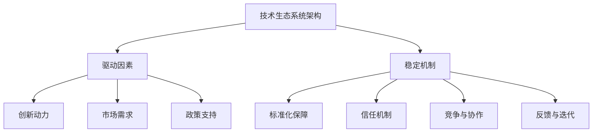

                 

### 技术生态系统构建概述

#### 问题背景

**技术生态系统的定义**：技术生态系统是指围绕某一技术领域或产品，由多种技术组件、参与者（如开发者、公司、用户等）以及相互之间的关系组成的复杂网络。它不仅包括技术本身，还包括相关的标准、工具、平台、服务等各种元素。

**技术生态系统的重要性**：技术生态系统在当今信息技术快速发展的大背景下显得尤为重要。它有助于技术的创新和传播，可以促进资源的有效配置，提高开发效率，降低开发成本，并增强整个系统的稳定性和可维护性。

**技术生态系统存在的问题**：

1. **碎片化**：由于各种技术组件和平台的独立发展，导致技术生态系统内部存在严重的碎片化现象。这种碎片化不仅增加了开发者之间的沟通成本，也影响了技术的集成和互操作性。
   
2. **不兼容性**：技术标准的不统一和接口的不兼容，使得不同组件之间的数据交换和功能集成变得困难。这不仅限制了技术的扩展性，也影响了用户体验。

3. **合作困难**：不同参与者之间的利益冲突、合作机制不健全，使得技术生态系统中的合作变得复杂和困难。这种合作困难往往导致资源的浪费和创新的滞后。

**问题解决**：

构建技术生态系统的意义在于通过整合各种技术资源和参与者，打造一个良性的技术合作网络。这样不仅可以解决碎片化和不兼容性的问题，还能促进各方的合作，共同推动技术的发展。

**目标**：

1. **标准化**：通过制定和推广统一的技术标准和规范，降低不同组件之间的兼容性问题。
   
2. **模块化**：将复杂的技术系统拆分成可独立开发、测试和部署的模块，提高系统的可维护性和可扩展性。
   
3. **开放性**：增强系统的开放性，鼓励外部开发者参与到生态系统的建设中来，促进创新和共享。
   
4. **稳定性**：通过建立稳定的技术架构和合作机制，保证技术生态系统的长期稳定发展。

**边界与外延**：

技术生态系统的范围可以包括软件、硬件、平台、服务等多种技术组件。具体来说：

1. **软件**：包括各种应用程序、框架、库、工具等。
   
2. **硬件**：涉及各种设备、芯片、传感器等硬件组件。
   
3. **平台**：如云计算平台、物联网平台、区块链平台等。
   
4. **服务**：包括技术支持、培训、咨询等各种服务。

**概念结构与核心要素组成**：

技术生态系统由多个核心概念和要素组成，包括：

1. **平台化**：通过建立统一的技术平台，提供基础设施和公共服务，支持各种技术的开发和集成。
   
2. **模块化**：将复杂的技术系统拆分成可独立开发、测试和部署的模块，提高系统的可维护性和可扩展性。
   
3. **标准化**：通过制定和推广统一的技术标准和规范，降低不同组件之间的兼容性问题。
   
4. **开放性**：增强系统的开放性，鼓励外部开发者参与到生态系统的建设中来，促进创新和共享。
   
5. **稳定性**：通过建立稳定的技术架构和合作机制，保证技术生态系统的长期稳定发展。

### 第2章 核心概念与联系

技术生态系统的构建离不开一系列核心概念的支持。这些概念不仅定义了生态系统的基本框架，而且彼此之间相互联系，共同促进生态系统的健康发展。以下是几个关键概念及其相互联系。

#### 核心概念原理

1. **平台化**：平台化是技术生态系统的核心驱动力之一。它通过提供一个统一的开发、部署和运行环境，降低开发者之间的协作门槛，提高系统的可扩展性和灵活性。

2. **模块化**：模块化是将复杂系统分解为独立的、可重复使用的模块。这种方法不仅提高了系统的可维护性和可扩展性，还促进了组件的重用和标准化。

3. **标准化**：标准化是技术生态系统健康发展的基础。通过制定和推广统一的技术标准和规范，可以减少不同组件之间的兼容性问题，提高系统的互操作性和可靠性。

4. **开放性**：开放性是指系统对外部参与者（如开发者、用户等）的开放程度。一个高度开放的技术生态系统可以吸引更多的参与者，促进创新和共享。

5. **稳定性**：稳定性是技术生态系统长期发展的关键。通过建立稳定的技术架构和合作机制，可以确保系统的持续运行和进化。

#### 概念属性特征对比表格

下面是一个对比表格，列出了上述核心概念的主要属性特征：

| 概念    | 属性特征 |
|---------|----------|
| 平台化  | 提供统一环境、支持多技术栈、提高可扩展性 |
| 模块化  | 分解为独立模块、提高可维护性和可扩展性 |
| 标准化  | 提供统一规范、降低兼容性问题、提高互操作性 |
| 开放性  | 鼓励外部参与、促进创新和共享、提高灵活性 |
| 稳定性  | 建立稳定架构、确保持续运行、支持长期发展 |

#### ER实体关系图架构

为了更清晰地展示技术生态系统中的核心概念及其相互关系，我们可以使用ER（实体-关系）图来建模。以下是技术生态系统的ER图：

```mermaid
erDiagram
  Platform ||--|{ Module : includes }
  Platform ||--|{ Standard : defines }
  Platform ||--|{ Service : provides }
  Module ||--|{ Component : contains }
  Module ||--|{ Standard : follows }
  Service ||--|{ User : serves }
```

在这个ER图中：

- **Platform**（平台）是核心实体，它包括模块、标准和服务的定义。
- **Module**（模块）是独立的开发单元，它包含组件，并遵循标准。
- **Standard**（标准）定义了技术规范，确保组件之间的兼容性。
- **Service**（服务）为用户提供技术支持。

#### 关联与相互作用

技术生态系统中的各个概念和实体之间存在着密切的关联和相互作用。平台化提供了基础设施，使得模块化和标准化得以实现。模块化提高了系统的灵活性和可维护性，而标准化则确保了不同模块和组件之间的互操作性。开放性促进了资源的共享和创新的激发，而稳定性则保证了整个生态系统的持续发展。

通过这些核心概念和实体之间的相互作用，技术生态系统能够形成一种良性的循环，不断推动技术的创新和发展。

### 第3章 构建技术生态系统的原理

构建一个健康、稳定且富有创新力的技术生态系统需要深刻理解其背后的原理和架构。这一章节将深入探讨技术生态系统构建的核心原理，包括系统架构、驱动因素以及保持系统稳定性的机制。

#### 技术生态系统架构

技术生态系统的架构是构建其核心功能和特点的基础。一个典型的技术生态系统通常由以下几个关键组件构成：

1. **核心组件**：包括平台、模块、标准和工具。平台提供基础设施和服务；模块是可重复使用的功能单元；标准确保组件之间的兼容性；工具则支持开发和部署过程。

2. **交互机制**：这些机制决定了组件之间如何相互协作和数据如何流动。常见的交互机制包括API（应用程序编程接口）、消息队列、分布式存储等。

3. **治理结构**：治理结构是确保生态系统长期稳定发展的关键。它涉及决策机制、利益分配、冲突解决等。一个良好的治理结构能够平衡不同参与者的利益，促进合作。

#### 系统驱动因素

技术生态系统的发展受到多种因素的驱动，以下是几个关键驱动因素：

1. **创新动力**：技术生态系统的核心是创新。新的技术、框架和工具不断涌现，推动整个系统的演进。创新动力不仅来自于开发者，还包括用户、公司和学术界的共同推动。

2. **市场需求**：市场需求是技术生态系统发展的另一个重要驱动力。用户需求的变化和新兴市场的出现，促使生态系统中的参与者不断调整和优化自己的产品和服务。

3. **政策支持**：政府的政策支持和法规制定对于技术生态系统的发展至关重要。政策可以提供资金、税收优惠等激励措施，推动技术研究和创新。

#### 系统稳定机制

技术生态系统的稳定性是确保其长期健康发展的关键。以下是一些关键的稳定机制：

1. **标准化保障**：通过制定和推广统一的技术标准和规范，减少不同组件之间的兼容性问题，提高系统的互操作性和可靠性。

2. **信任机制**：建立信任机制，如认证、身份验证和授权等，确保系统的安全性和数据隐私。信任机制有助于促进参与者之间的合作和共享。

3. **竞争与协作**：在技术生态系统中，竞争和协作是相互促进的。健康的竞争可以激发创新，而有效的协作则能够实现资源的最大化利用和价值的最大化。

4. **反馈与迭代**：通过收集用户反馈和市场数据，不断对技术生态系统进行调整和优化。这种反馈与迭代的过程有助于系统持续改进和进化。

#### 综合探讨

技术生态系统架构、驱动因素和稳定机制之间存在着密切的相互关系。架构为生态系统提供了基础，驱动因素推动系统的演进，而稳定机制则确保了系统的长期健康发展。以下是一个简化的流程图，展示了这些要素之间的关系：



通过这个流程图，我们可以看到，技术生态系统的构建是一个复杂但有序的过程，各个环节相互交织、相互促进。只有深刻理解这些核心原理，才能构建一个真正成功和可持续发展的技术生态系统。

### 第4章 构建技术生态系统的实践

在了解了技术生态系统构建的原理后，接下来我们将探讨具体的实践方法。这些方法包括自上而下的方法论和自下而上的方法论，以及实际操作中的最佳实践。

#### 构建方法论

**自上而下的方法论**：

自上而下的方法论首先定义整体架构和目标，然后逐步分解为具体的模块和组件。这种方法的优势在于能够确保整个系统的一致性和协调性，但可能需要较长的时间和较高的成本。

1. **定义目标**：明确生态系统的愿景、使命和长期目标。
2. **设计架构**：设计系统的整体架构，包括平台、模块和交互机制。
3. **制定标准**：制定技术标准和规范，确保组件之间的兼容性。
4. **分阶段实施**：将系统分解为多个阶段进行逐步实施，确保每一步都能按计划进行。

**自下而上的方法论**：

自下而上的方法论首先开发独立的模块和组件，然后逐步整合到整个生态系统中。这种方法的优势在于能够快速迭代和灵活调整，但需要确保模块之间的兼容性和一致性。

1. **模块开发**：独立开发每个模块，确保其功能完备和性能优秀。
2. **接口设计**：设计模块之间的接口，确保数据传输和功能调用的一致性。
3. **集成测试**：将各个模块整合到系统中，进行集成测试，确保系统的整体性能和稳定性。
4. **持续优化**：根据用户反馈和市场变化，持续对模块和系统进行优化和调整。

#### 最佳实践

**成功案例**：

1. **Apache基金会**：Apache基金会是一个成功的开源项目生态系统，通过自下而上的方法论，逐步构建了包括Apache HTTP服务器、Apache Spark等在内的多个开源项目。其成功的关键在于社区驱动的开发模式、开放的贡献机制和严格的质量控制。

2. **华为云**：华为云采用自上而下的方法论，构建了一个完整的云计算生态系统，包括IaaS、PaaS和SaaS等多个层次。其成功的关键在于统一的架构设计、丰富的服务和强大的技术支持。

**最佳实践分享**：

1. **社区驱动**：建立一个活跃的开发者社区，鼓励外部参与者贡献代码和意见，促进创新和共享。

2. **标准化和规范化**：制定和推广统一的技术标准和规范，确保组件之间的兼容性和互操作性。

3. **持续集成和持续部署**（CI/CD）：采用自动化测试和部署流程，确保系统的快速迭代和稳定运行。

4. **数据隐私和安全**：建立严格的数据隐私和安全措施，确保用户数据和系统的安全性。

5. **开放API和SDK**：提供开放的API和SDK，方便开发者集成和扩展生态系统的功能。

通过上述实践方法，可以有效地构建一个健康、稳定且富有创新力的技术生态系统。无论是采用自上而下的方法论还是自下而上的方法论，关键在于制定清晰的目标、确保组件之间的协调和一致，以及持续优化和调整。

### 第5章 挑战与解决方案

在构建技术生态系统过程中，我们不可避免地会遇到各种挑战。这些挑战不仅影响生态系统的稳定性，还可能阻碍其发展。以下将分析技术生态系统构建过程中可能面临的几个主要挑战，并探讨相应的解决方案。

#### 挑战分析

1. **技术标准化难题**：

   技术标准化的目的是确保不同组件之间的兼容性和互操作性。然而，在技术快速发展的背景下，标准化的步伐往往难以跟上技术创新的步伐。此外，不同利益相关方可能对于标准的制定有不同的利益诉求，导致标准化的推进困难。

2. **数据共享与隐私保护**：

   技术生态系统中的数据共享对于促进创新和优化服务至关重要。然而，数据共享往往伴随着隐私和安全风险。如何平衡数据共享的需求和隐私保护的要求，是一个亟待解决的挑战。

3. **竞争与合作平衡**：

   在技术生态系统中，不同参与者之间的竞争是推动技术进步的重要动力。然而，过度的竞争可能导致资源浪费和创新停滞。同时，合作机制的缺失或不当也可能导致生态系统的分裂和失败。如何在竞争和合作之间找到平衡点，是一个重要挑战。

4. **生态系统治理**：

   技术生态系统的治理涉及到如何分配资源、制定规则、解决冲突等。一个有效的治理机制能够确保生态系统的稳定发展，但建立和维持这样的治理机制需要大量的时间和资源。

#### 解决方案

1. **技术标准化难题**：

   - **协作机制**：建立跨行业的标准化组织，促进不同利益相关方之间的协作，共同制定和推广技术标准。
   - **开放透明**：确保标准化过程的开放性和透明度，吸纳更多的意见和反馈，提高标准的科学性和实用性。
   - **逐步推进**：采取逐步推进的策略，逐步完善和更新标准，以适应技术发展的变化。

2. **数据共享与隐私保护**：

   - **隐私保护机制**：采用加密、匿名化等技术手段，确保数据在共享过程中的安全性和隐私性。
   - **合规性要求**：制定严格的数据保护法规和合规性要求，确保各参与方在数据共享过程中遵守相关法规。
   - **数据共享协议**：建立数据共享协议，明确数据的使用范围、权限和责任，减少潜在的隐私风险。

3. **竞争与合作平衡**：

   - **合作平台**：建立一个开放的合作平台，鼓励参与者之间的合作，共享资源和知识。
   - **竞争规则**：制定公平的竞争规则，确保市场环境的透明和公正，防止垄断和不正当竞争。
   - **利益分配**：建立合理的利益分配机制，确保各参与方在竞争中能够公平地获得回报。

4. **生态系统治理**：

   - **治理架构**：建立多层次、多领域的治理架构，确保各参与方都有发言权和参与决策的机会。
   - **决策透明**：确保治理过程的透明度和公开性，通过公开会议、报告等方式，增加决策过程的可追溯性和可信度。
   - **持续优化**：定期评估和调整治理机制，以适应生态系统的发展需求。

通过上述解决方案，可以有效地应对技术生态系统构建过程中的挑战，促进生态系统的健康发展。需要注意的是，这些解决方案并不是一成不变的，而是需要根据实际情况不断调整和完善。

### 第6章 未来发展趋势

随着技术的不断进步和市场的快速变化，技术生态系统也将迎来一系列新的发展趋势。以下是对未来技术生态系统发展趋势的预测及其潜在影响的讨论。

#### 技术趋势预测

1. **云计算与边缘计算的结合**：

   云计算已经深刻改变了企业的IT基础设施，而边缘计算则通过将数据处理和存储推向网络边缘，提高了响应速度和实时性。未来，云计算与边缘计算的融合将成为趋势，为技术生态系统提供更加灵活和高效的计算环境。

2. **人工智能与机器学习的普及**：

   人工智能和机器学习技术的不断发展将使更多的技术组件和应用具备智能化的能力。这将推动技术生态系统的自动化和智能化水平，提高开发效率和用户体验。

3. **区块链技术的广泛应用**：

   区块链技术的不可篡改性和去中心化特性，使其在数据安全、供应链管理、智能合约等领域具有巨大的应用潜力。未来，区块链技术将更深入地融入到技术生态系统中，提供更加安全、透明和高效的服务。

4. **物联网（IoT）的持续扩展**：

   物联网设备的普及和连接数的增加，将使技术生态系统中的数据量和复杂性大幅提升。物联网技术的进一步发展，将推动智能城市、智能家居等领域的创新，为技术生态系统带来新的增长点。

5. **绿色技术的融合**：

   随着环境问题的日益严重，绿色技术（如可再生能源、节能技术等）将逐渐融入技术生态系统中。这不仅能提高系统的可持续性，还能为企业和社会带来长期的经济和环境效益。

#### 未来展望

未来，技术生态系统的发展将呈现出以下几个显著特点：

1. **高度集成与协同**：

   技术生态系统中各个组件之间的集成和协同将成为趋势。通过实现不同技术之间的无缝对接，技术生态系统将能够提供更加综合和高效的服务。

2. **开放性与互操作性**：

   开放性和互操作性将继续是技术生态系统发展的关键。随着技术的不断进步，生态系统将变得更加开放，吸引更多的参与者和创新资源。

3. **自主性与智能化**：

   技术生态系统的组件将具备更高的自主性和智能化水平。通过引入人工智能和机器学习技术，系统将能够自我优化和进化，提高其适应性和灵活性。

4. **可持续性与绿色性**：

   可持续性和绿色性将逐渐成为技术生态系统的重要考量因素。通过融合绿色技术，技术生态系统将能够实现经济、社会和环境的协调发展。

综上所述，技术生态系统未来将继续在技术进步和市场需求的双重驱动下，不断创新和发展。通过应对新的挑战和抓住新的机遇，技术生态系统将为企业和用户带来更加丰富和高效的服务体验。

### 第7章 小结与拓展阅读

本文通过详细阐述技术生态系统构建的背景、核心概念、原理和实践，探讨了技术生态系统面临的挑战以及未来发展趋势。以下是本文的主要观点和结论：

1. **技术生态系统的重要性**：技术生态系统在促进技术创新、资源整合和合作方面发挥着关键作用。它不仅有助于提高开发效率，还能降低成本，增强系统的稳定性和可维护性。

2. **核心概念与联系**：平台化、模块化、标准化、开放性和稳定性是技术生态系统构建的核心概念。这些概念相互关联，共同推动技术生态系统的健康发展。

3. **构建技术生态系统的原理**：技术生态系统架构、驱动因素和稳定机制是构建技术生态系统的关键。通过合理设计架构、明确驱动因素和建立稳定机制，可以确保技术生态系统的长期健康发展。

4. **实践方法与最佳实践**：自上而下的方法论和自下而上的方法论是构建技术生态系统的两种主要实践方法。最佳实践包括社区驱动、标准化和规范化、持续集成与持续部署等。

5. **挑战与解决方案**：技术标准化难题、数据共享与隐私保护、竞争与合作平衡、生态系统治理等技术生态系统构建过程中面临的挑战，可以通过相应的解决方案得到有效应对。

6. **未来发展趋势**：云计算与边缘计算的结合、人工智能与机器学习的普及、区块链技术的广泛应用、物联网的持续扩展和绿色技术的融合，将是技术生态系统未来发展的主要趋势。

**拓展阅读**：

1. **《生态化：企业竞争力的新逻辑》**：这本书详细探讨了生态化对企业竞争力的影响，提供了构建企业技术生态系统的理论和方法。
   
2. **《技术生态系统设计》**：该书介绍了技术生态系统的设计原则、架构和实践案例，对于理解技术生态系统的构建具有很高的参考价值。

3. **《人工智能与生态系统的融合》**：这本书探讨了人工智能技术在技术生态系统中的应用，以及如何通过人工智能提升技术生态系统的效率和智能水平。

4. **《区块链生态系统：设计、构建与运营》**：该书详细介绍了区块链技术在技术生态系统中的应用，包括区块链平台的构建、治理和运营等。

通过阅读这些拓展资料，读者可以更深入地了解技术生态系统构建的理论和实践，进一步提升自身的专业知识和技能。

### 作者信息

**作者：AI天才研究院/AI Genius Institute & 禅与计算机程序设计艺术 /Zen And The Art of Computer Programming**

