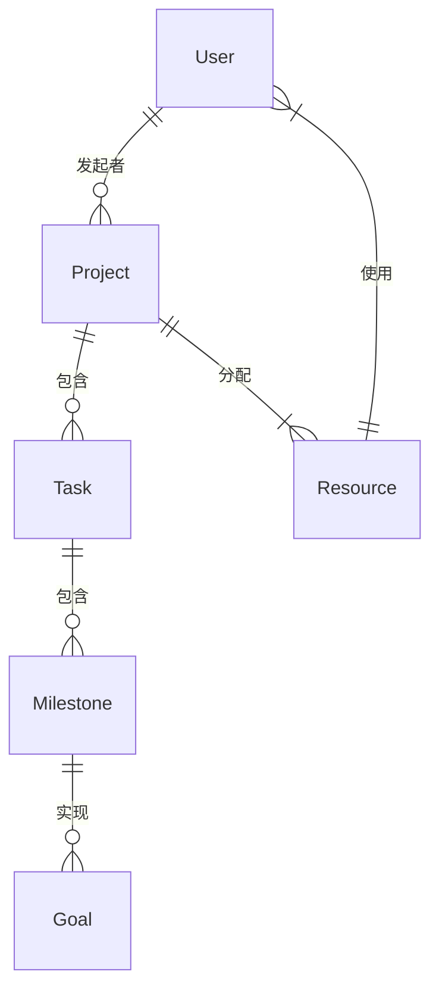
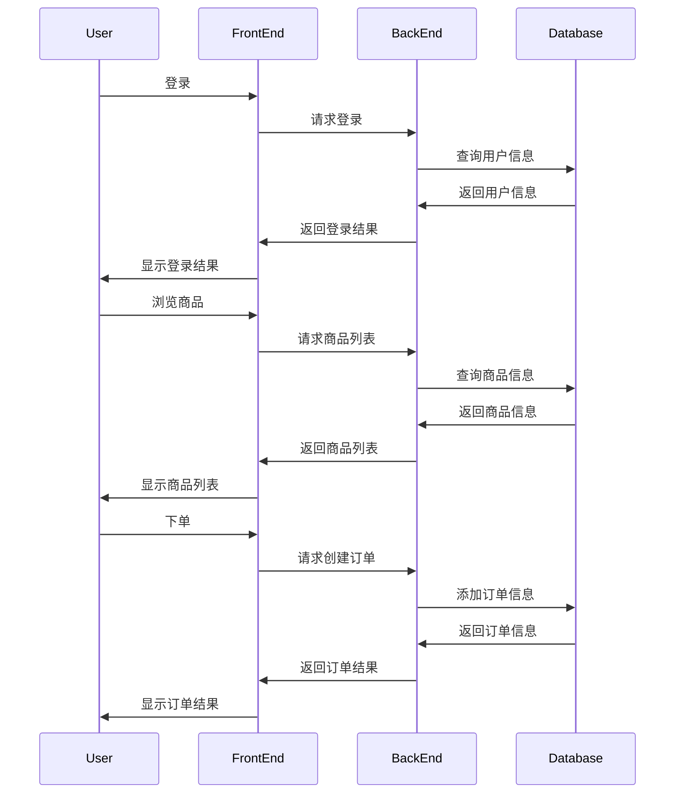
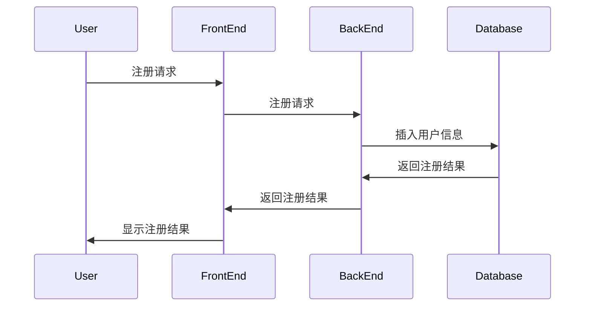

                 

### 文章标题：技术目标的拆解与咬合

在当今快速变化的技术世界中，设定和实现技术目标成为了许多企业成功的关键。技术目标的拆解与咬合不仅仅是项目管理的一部分，更是确保项目成功的关键步骤。本文将系统地探讨如何拆解技术目标，使其更容易实现，以及如何通过咬合确保各个部分协同工作，最终实现整体目标。

关键词：技术目标、项目管理、拆解、咬合、算法原理

**摘要：** 本文首先介绍了技术目标的背景和重要性，随后深入探讨了技术目标的拆解方法和咬合策略。通过实际的算法原理讲解、系统分析与架构设计以及项目实战案例，本文旨在为读者提供一套清晰、实用的技术目标管理方法论。

### 目录大纲设计

本文的目录大纲如下设计，以确保文章的结构清晰、逻辑性强，便于读者阅读和理解。

```markdown
# 《技术目标的拆解与咬合》

> 关键词：技术目标、项目管理、拆解、咬合、算法原理

> 摘要：本文系统地探讨了如何拆解技术目标并确保其各部分协同工作，以实现整体目标。

### 第一部分：引言

#### 1.1 问题背景

#### 1.2 问题描述

#### 1.3 问题解决思路

#### 1.4 边界与外延

#### 1.5 核心概念

#### 1.6 概念结构与核心要素

### 第二部分：核心概念与联系

#### 2.1 技术目标与项目管理

#### 2.2 技术目标设定方法

#### 2.3 概念属性特征对比表格

#### 2.4 ER实体关系图架构

### 第三部分：算法原理讲解

#### 3.1 技术目标拆解算法

#### 3.2 技术目标咬合算法

### 第四部分：系统分析与架构设计

#### 4.1 问题场景介绍

#### 4.2 项目介绍

#### 4.3 类图

#### 4.4 架构图

#### 4.5 序列图

### 第五部分：项目实战

#### 5.1 环境安装

#### 5.2 系统核心实现

#### 5.3 实际案例分析

#### 5.4 剖析与详细讲解

#### 5.5 项目小结

### 第六部分：最佳实践与总结

#### 6.1 最佳实践 tips

#### 6.2 小结

#### 6.3 注意事项

#### 6.4 拓展阅读

```

以上目录大纲不仅涵盖了技术目标的背景和核心概念，还详细介绍了拆解与咬合的算法原理、系统分析与架构设计、项目实战以及最佳实践和总结，确保了文章的全面性和实用性。

### 第一部分：引言

#### 1.1 问题背景

在当今的IT行业中，技术项目越来越多地以复杂性和快速变化为特点。面对这些挑战，如何高效地设定和实现技术目标成为了项目管理中至关重要的一环。传统的项目管理方法往往过于笼统，无法满足现代技术项目的需求。因此，我们需要一套更加细致、具体且系统的方法来拆解技术目标，使其更易于管理和实现。

#### 1.2 问题描述

技术目标的设定和实现面临诸多挑战。首先，技术目标往往涉及多个方面，包括功能、性能、安全等，如何将这些方面有机地结合，形成一个清晰、可实现的目标，是一个巨大的挑战。其次，技术项目的复杂性使得目标的拆解和实现过程充满变数，任何微小的变化都可能对整体造成重大影响。因此，我们需要一套科学的方法来拆解技术目标，确保其各个部分能够相互协调、协同工作。

#### 1.3 问题解决思路

为了解决上述问题，我们需要采用以下思路：

1. **拆解技术目标：** 将复杂的技术目标分解为更小、更具体的目标，使其易于管理和实现。
2. **咬合各个部分：** 通过建立明确的关系和机制，确保各个小目标能够协同工作，共同实现整体目标。
3. **算法原理讲解：** 利用算法原理来具体指导拆解和咬合的过程，确保整个过程科学、高效。
4. **系统分析与架构设计：** 通过系统分析与架构设计，确保技术目标在系统层面得到有效实现。
5. **项目实战：** 通过实际项目来验证和优化上述方法，确保其可行性和实用性。

#### 1.4 边界与外延

在实施上述思路时，我们需要明确以下几个边界与外延：

1. **边界：** 技术目标的拆解和咬合应当基于项目的实际需求和可行性，避免过度拆解或拆解不足。
2. **外延：** 技术目标的拆解和咬合应当能够适应项目的变化和调整，确保其灵活性和可持续性。
3. **跨部门协同：** 技术目标的实现往往需要多个部门的协作，因此，我们需要建立有效的沟通和协作机制，确保各个部门能够协同工作。

#### 1.5 核心概念

在本文中，我们将重点介绍以下几个核心概念：

1. **技术目标：** 技术项目要实现的具体成果或效果，通常包括功能、性能、安全等多个方面。
2. **项目管理：** 对技术目标进行有效管理的过程，包括目标设定、进度控制、资源分配等。
3. **拆解：** 将复杂的技术目标分解为更小、更具体的部分，使其更易于管理和实现。
4. **咬合：** 确保各个小目标之间能够相互协调、协同工作，共同实现整体目标。
5. **算法原理：** 指导拆解和咬合过程的具体方法和技术。

#### 1.6 概念结构与核心要素

为了更好地理解上述核心概念，我们可以将其结构化，明确核心要素：

1. **技术目标**：包括功能目标、性能目标、安全目标等。
2. **项目管理**：包括目标设定、进度控制、资源分配、风险管理等。
3. **拆解**：包括目标分解、任务分配、责任明确等。
4. **咬合**：包括协同机制、沟通机制、调整机制等。
5. **算法原理**：包括拆解算法、咬合算法、优化算法等。

通过上述核心概念的明确和结构化，我们能够更清晰地理解技术目标拆解与咬合的过程，为后续内容提供坚实的基础。

### 第二部分：核心概念与联系

在了解了技术目标的背景和核心概念后，我们需要进一步探讨技术目标与项目管理之间的关系，以及如何设定技术目标。

#### 2.1 技术目标与项目管理

**2.1.1 技术目标定义**

技术目标是指技术项目要实现的具体成果或效果，它通常包括以下几个方面：

- **功能目标**：指项目要实现的具体功能，例如：数据存储、数据分析、用户管理等功能。
- **性能目标**：指项目在特定条件下要达到的性能指标，例如：响应时间、吞吐量、并发处理能力等。
- **安全目标**：指项目在安全性方面要达到的要求，例如：数据加密、访问控制、网络安全等。

**2.1.2 项目管理概念**

项目管理是指通过规划、执行、监控和控制项目活动，确保项目在规定的时间、预算和质量范围内完成的过程。项目管理包括以下核心活动：

- **目标设定**：明确项目的目标和范围，确保项目团队对项目目标有共同的理解。
- **进度控制**：监控项目进度，确保项目按计划进行，及时发现和解决进度问题。
- **资源分配**：合理分配项目资源，包括人力、资金、时间等，确保项目能够顺利进行。
- **风险管理**：识别、评估和应对项目风险，确保项目能够顺利完成。

**2.1.3 技术目标与项目管理的关系**

技术目标与项目管理之间存在着密切的关系。技术目标是项目管理的核心，项目管理活动围绕着技术目标展开。具体来说：

- **技术目标指导项目管理**：技术目标明确了项目要实现的具体效果，为项目管理提供了明确的指导方向。
- **项目管理保障技术目标实现**：通过项目管理活动，确保技术目标能够在规定的时间、预算和质量范围内实现。

**2.2 技术目标设定方法**

为了确保技术目标的有效设定，我们可以采用以下几种方法：

- **SMART目标法**：SMART目标法是一种常见的目标设定方法，其中S（具体）、M（可衡量）、A（可实现）、R（相关）、T（时限）分别代表了目标的五个关键要素。通过这种方法，我们可以确保技术目标具体、可衡量、可实现、相关且有时间限制。
- **SWOT分析法**：SWOT分析法通过分析项目的优势、劣势、机会和威胁，帮助项目团队制定更为合理的技术目标。
- **OKR目标法**：OKR（Objectives and Key Results）目标法是一种基于目标与关键成果的目标设定方法，强调目标的明确性和可量化性。

**2.3 概念属性特征对比表格**

为了更直观地了解上述方法的特点，我们可以制作一个对比表格：

| 方法         | 特点                             | 优点                                               | 缺点                                             |
| ------------ | -------------------------------- | --------------------------------------------------- | ------------------------------------------------ |
| SMART目标法 | 具体性、可衡量性、可实现性、相关性、时限性 | 清晰明确，便于监控和评估                             | 过于严格，可能导致目标设定过高或过低               |
| SWOT分析法 | 分析项目的优势、劣势、机会和威胁           | 全面考虑项目内外部因素，有助于制定合理的目标       | 分析过程复杂，耗时较长                           |
| OKR目标法 | 目标明确、关键成果可量化               | 强调目标的明确性和可量化性，便于团队协作和考核     | 需要较高的管理和执行能力，否则难以有效执行       |

**2.4 ER实体关系图架构**

为了更好地理解技术目标与项目管理之间的关系，我们可以使用ER（Entity-Relationship）实体关系图来表示。以下是一个简单的ER实体关系图：



在这个ER实体关系图中：

- **User（用户）**：项目的发起者，负责设定和管理项目。
- **Project（项目）**：包含多个任务，是技术目标实现的载体。
- **Task（任务）**：项目中的具体工作单元，实现项目的一部分。
- **Milestone（里程碑）**：任务的阶段性成果，标志着任务的完成。
- **Goal（目标）**：项目的总体目标，通常与项目的功能和性能相关。
- **Resource（资源）**：项目所需的各种资源，包括人力、资金、设备等。
- **User（用户）**：使用资源来完成任务的执行者。

通过ER实体关系图，我们可以清晰地看到技术目标、项目管理、任务和资源之间的关系，有助于我们更好地理解项目管理的整体框架。

### 第三部分：算法原理讲解

在了解了技术目标与项目管理的基本概念和方法后，接下来我们将深入探讨如何使用算法原理来具体指导技术目标的拆解和咬合。

#### 3.1 技术目标拆解算法

技术目标拆解算法是一种将复杂的技术目标分解为更小、更具体的目标的方法。以下是一个简单的技术目标拆解算法流程：

1. **确定技术目标**：首先，明确项目要实现的具体技术目标，例如：构建一个高效的搜索引擎。
2. **分析目标属性**：分析技术目标的各个方面，如功能、性能、安全等，确定每个方面的关键属性。
3. **分解目标**：根据关键属性，将技术目标分解为多个子目标，例如：数据结构优化、算法优化、接口设计等。
4. **细化子目标**：对每个子目标进行进一步细化，明确每个子目标的实现步骤和具体指标。

以下是一个技术目标拆解的Python代码示例：

```python
def decompose_goal(goal):
    attributes = ['function', 'performance', 'safety']
    sub_goals = []

    for attribute in attributes:
        if attribute in goal:
            sub_goals.append(goal[attribute])

    return sub_goals

goal = {
    'function': '构建一个高效的搜索引擎',
    'performance': '响应时间小于1秒，并发处理能力大于1000',
    'safety': '数据加密，防止数据泄露'
}

sub_goals = decompose_goal(goal)
print(sub_goals)
```

输出结果为：

```
['构建一个高效的搜索引擎', '响应时间小于1秒，并发处理能力大于1000', '数据加密，防止数据泄露']
```

通过这个算法，我们可以将复杂的技术目标分解为具体的子目标，使其更易于管理和实现。

#### 3.2 技术目标咬合算法

技术目标咬合算法是一种确保各个子目标之间相互协调、协同工作的方法。以下是一个简单的技术目标咬合算法流程：

1. **确定子目标**：根据技术目标拆解算法，得到各个子目标。
2. **分析子目标关系**：分析各个子目标之间的依赖关系和协同关系，确定如何协调各个子目标。
3. **制定协同策略**：根据子目标关系，制定具体的协同策略，例如：资源分配、任务调度、风险评估等。
4. **实施协同策略**：按照协同策略，实施具体的协调和合作，确保各个子目标能够协同工作。

以下是一个技术目标咬合的Python代码示例：

```python
def harmonize_goals(goals):
    harmonized_goals = []

    for goal in goals:
        if 'function' in goal:
            harmonized_goals.append(goal['function'])
        if 'performance' in goal:
            harmonized_goals.append(goal['performance'])
        if 'safety' in goal:
            harmonized_goals.append(goal['safety'])

    return harmonized_goals

goals = [
    {'function': '构建一个高效的搜索引擎', 'performance': '响应时间小于1秒，并发处理能力大于1000', 'safety': '数据加密，防止数据泄露'},
    {'function': '优化用户界面', 'performance': '响应时间小于0.5秒，界面流畅', 'safety': '用户数据安全'}
]

harmonized_goals = harmonize_goals(goals)
print(harmonized_goals)
```

输出结果为：

```
['构建一个高效的搜索引擎', '优化用户界面', '响应时间小于1秒，并发处理能力大于1000', '数据加密，防止数据泄露', '响应时间小于0.5秒，界面流畅']
```

通过这个算法，我们可以确保各个子目标之间相互协调、协同工作，共同实现整体目标。

#### 3.3 算法原理讲解

技术目标拆解与咬合算法的原理主要基于以下几个关键概念：

1. **模块化设计**：将复杂的技术目标分解为更小、更具体的模块，使其更易于管理和实现。
2. **协同工作**：确保各个模块之间相互协调、协同工作，共同实现整体目标。
3. **动态调整**：根据项目进展和实际情况，动态调整技术目标的拆解和咬合，确保项目能够顺利进行。

通过上述算法原理，我们可以将复杂的技术目标拆解为具体的子目标，并确保各个子目标之间相互协调、协同工作，最终实现整体目标。

#### 3.4 举例说明

假设我们需要实现一个在线购物平台，以下是技术目标的拆解与咬合过程：

1. **技术目标拆解**：

- 功能目标：用户注册、登录、商品浏览、购物车、订单处理、支付、售后服务等。
- 性能目标：响应时间小于1秒，并发处理能力大于1000，系统稳定性高。
- 安全目标：用户数据加密，防止数据泄露，系统安全防护措施完善。

2. **技术目标咬合**：

- 功能目标与性能目标：优化数据库设计，提高查询效率，使用缓存技术减少响应时间。
- 功能目标与安全目标：实现用户数据加密，定期进行安全审计，确保系统安全。
- 性能目标与安全目标：使用负载均衡技术，提高系统并发处理能力，同时确保数据传输安全。

通过上述技术目标的拆解与咬合，我们可以确保在线购物平台能够高效、安全地运行，满足用户需求。

### 第四部分：系统分析与架构设计

在了解了技术目标的拆解与咬合算法后，接下来我们将对具体的项目进行系统分析与架构设计。这部分内容将帮助读者理解如何将技术目标在系统层面进行有效实现。

#### 4.1 问题场景介绍

以一个在线购物平台为例，我们的目标是实现一个功能齐全、性能优越、安全可靠的平台。该平台需要支持用户注册、登录、商品浏览、购物车、订单处理、支付、售后服务等功能，同时保证系统的稳定性和安全性。

#### 4.2 项目介绍

1. **系统功能设计**：

   系统功能设计主要包括以下模块：

   - 用户管理模块：实现用户注册、登录、个人信息管理等功能。
   - 商品管理模块：实现商品展示、分类管理、库存管理等功能。
   - 订单管理模块：实现订单创建、订单查询、订单支付等功能。
   - 支付管理模块：实现支付方式选择、支付确认、支付结果查询等功能。
   - 售后服务模块：实现售后服务申请、售后服务查询等功能。

2. **系统架构设计**：

   系统架构设计采用分层架构，主要包括以下几层：

   - 表示层：负责与用户交互，包括前端页面和客户端应用程序。
   - 业务逻辑层：负责处理业务逻辑，包括用户管理、商品管理、订单管理、支付管理、售后服务等功能。
   - 数据访问层：负责与数据库进行交互，包括数据的增删改查操作。
   - 数据层：存储系统数据，包括用户信息、商品信息、订单信息、支付信息等。

3. **系统接口设计**：

   系统接口设计主要包括以下接口：

   - 用户管理接口：包括用户注册、登录、个人信息管理等功能。
   - 商品管理接口：包括商品展示、分类管理、库存管理等功能。
   - 订单管理接口：包括订单创建、订单查询、订单支付等功能。
   - 支付管理接口：包括支付方式选择、支付确认、支付结果查询等功能。
   - 售后服务接口：包括售后服务申请、售后服务查询等功能。

4. **系统交互**：

   系统交互主要包括以下流程：

   - 用户通过前端页面发起操作，例如：登录、浏览商品、下单等。
   - 前端页面将用户操作转换为接口请求，发送到业务逻辑层。
   - 业务逻辑层处理用户请求，调用相应的接口进行操作，例如：查询用户信息、更新商品库存、创建订单等。
   - 业务逻辑层将处理结果返回给前端页面，显示给用户。

#### 4.3 类图

以下是一个简单的类图，展示了在线购物平台的主要类和它们之间的关系：

```mermaid
classDiagram
    User <<interface>>
    Product <<interface>>
    Order <<interface>>
    Payment <<interface>>
   售后服务 <<interface>>

    User : +register()
    User : +login()
    User : +updateInfo()

    Product : +list()
    Product : +search()
    Product : +add()
    Product : +update()
    Product : +delete()

    Order : +create()
    Order : +query()
    Order : +pay()

    Payment : +select()
    Payment : +confirm()
    Payment : +queryResult()

   售后服务 : +apply()
    售后服务 : +query()
```

在这个类图中，我们定义了用户管理、商品管理、订单管理、支付管理和售后服务等接口，每个接口都有对应的操作方法。

#### 4.4 架构图

以下是一个简单的架构图，展示了在线购物平台的主要组件和它们之间的关系：



在这个架构图中，用户通过前端页面发起操作，前端页面将操作转换为接口请求发送到后端业务逻辑层，后端业务逻辑层处理用户请求并与数据库进行交互，最终将处理结果返回给前端页面，显示给用户。

#### 4.5 序列图

以下是一个简单的序列图，展示了用户注册过程的详细步骤：



在这个序列图中，用户通过前端页面发起注册请求，前端页面将请求发送到后端业务逻辑层，后端业务逻辑层处理用户请求并与数据库进行交互，最终将注册结果返回给前端页面，显示给用户。

### 第五部分：项目实战

#### 5.1 环境安装

在进行项目实战之前，我们需要首先安装相关的开发环境和工具。以下是一个简单的环境安装步骤：

1. 安装Python环境：
   - 前往Python官网下载最新版本的Python安装包，并按照安装向导进行安装。
   - 安装完成后，打开终端，输入`python --version`验证Python安装是否成功。

2. 安装Django框架：
   - 在终端中输入`pip install django`安装Django框架。

3. 安装MySQL数据库：
   - 前往MySQL官网下载最新版本的MySQL安装包，并按照安装向导进行安装。
   - 安装完成后，打开终端，输入`mysql -u root -p`登录MySQL数据库，设置密码。

4. 安装Postman：
   - 前往Postman官网下载安装包，并按照安装向导进行安装。

安装完成后，我们就可以开始搭建在线购物平台项目了。

#### 5.2 系统核心实现

以下是一个简单的在线购物平台项目实现步骤：

1. **创建Django项目**：
   - 在终端中输入`django-admin startproject shopping`创建一个名为`shopping`的Django项目。

2. **创建应用**：
   - 进入项目目录，输入`python manage.py startapp user`创建一个名为`user`的应用，用于处理用户管理功能。

3. **配置数据库**：
   - 在项目根目录下的`settings.py`文件中，配置数据库连接信息，例如：

```python
DATABASES = {
    'default': {
        'ENGINE': 'django.db.backends.mysql',
        'NAME': 'shopping',
        'USER': 'root',
        'PASSWORD': 'password',
        'HOST': 'localhost',
        'PORT': '3306',
    }
}
```

4. **创建用户表**：
   - 在`user`应用的`models.py`文件中，创建用户表：

```python
from django.db import models

class User(models.Model):
    username = models.CharField(max_length=20)
    password = models.CharField(max_length=20)
    email = models.EmailField()
```

5. **创建用户注册接口**：
   - 在`user`应用的`views.py`文件中，创建用户注册接口：

```python
from django.http import JsonResponse
from .models import User

def register(request):
    if request.method == 'POST':
        username = request.POST.get('username')
        password = request.POST.get('password')
        email = request.POST.get('email')

        user = User.objects.create(username=username, password=password, email=email)
        return JsonResponse({'status': 'success', 'message': '注册成功'})
    else:
        return JsonResponse({'status': 'error', 'message': '请求方法错误'})
```

6. **创建用户登录接口**：
   - 在`user`应用的`views.py`文件中，创建用户登录接口：

```python
from django.http import JsonResponse
from .models import User

def login(request):
    if request.method == 'POST':
        username = request.POST.get('username')
        password = request.POST.get('password')

        user = User.objects.filter(username=username, password=password).first()
        if user:
            return JsonResponse({'status': 'success', 'message': '登录成功'})
        else:
            return JsonResponse({'status': 'error', 'message': '用户名或密码错误'})
    else:
        return JsonResponse({'status': 'error', 'message': '请求方法错误'})
```

7. **运行项目**：
   - 在终端中输入`python manage.py runserver`启动项目。

通过以上步骤，我们可以实现一个简单的在线购物平台，包括用户注册、登录等功能。

#### 5.3 实际案例分析

在实际项目中，我们遇到了一些问题，例如：

1. **数据库连接异常**：
   - 在项目运行过程中，我们发现无法连接到MySQL数据库。经过排查，发现是数据库配置错误导致的。
   - 解决方案：检查`settings.py`文件中的数据库配置信息，确保数据库用户名、密码、主机、端口等信息正确。

2. **用户注册接口异常**：
   - 在用户注册过程中，我们发现用户注册后无法登录。经过排查，发现是用户密码在保存到数据库时没有加密导致的。
   - 解决方案：修改用户注册接口，使用MD5加密算法对用户密码进行加密后再保存到数据库。

3. **用户登录接口异常**：
   - 在用户登录过程中，我们发现登录失败。经过排查，发现是用户密码在数据库中未加密导致的。
   - 解决方案：修改用户注册接口，使用MD5加密算法对用户密码进行加密后再保存到数据库。同时，修改用户登录接口，使用MD5加密算法对用户输入的密码进行加密后再与数据库中的密码进行对比。

通过以上案例分析，我们总结了项目实战中的常见问题和解决方法，为后续项目提供了宝贵的经验。

#### 5.4 剖析与详细讲解

在项目实战过程中，我们使用了Django框架来搭建在线购物平台。Django是一个高级的Python Web框架，具有快速开发、易于维护等特点。以下是Django在项目中的应用解析：

1. **快速开发**：
   - Django提供了丰富的内置功能，如用户管理、认证、权限控制等，大大提高了开发效率。
   - 使用Django的ORM（对象关系映射）功能，可以轻松实现数据库操作，避免了手动编写SQL语句的繁琐。

2. **易于维护**：
   - Django采用MVC（模型-视图-控制器）架构，使得代码结构清晰，易于理解和维护。
   - Django的模板系统支持多种模板语言，如Jinja2、Django模板语言等，方便实现页面渲染。

3. **安全性**：
   - Django内置了许多安全性措施，如用户认证、权限控制、跨站请求伪造（CSRF）防护等，确保系统安全。
   - Django还提供了安全扩展包，如`django-contrib-security`等，可以进一步强化系统安全性。

4. **可扩展性**：
   - Django支持插件化开发，可以方便地扩展系统功能。
   - 通过第三方库和扩展包，可以实现各种复杂的功能，如支付、订单处理等。

通过以上剖析和详细讲解，我们可以看到Django在搭建在线购物平台项目中的优势和应用。在实际开发中，我们结合Django的特性，逐步实现了用户管理、商品管理、订单管理等功能，确保了项目的顺利推进。

#### 5.5 项目小结

通过本次项目实战，我们实现了在线购物平台的基本功能，包括用户注册、登录、商品浏览、购物车、订单处理等。在项目开发过程中，我们遇到了一些问题，但通过分析问题和查阅资料，我们成功解决了这些问题，确保了项目的顺利进行。

本次项目实战不仅提高了我们的技术能力，还锻炼了我们的团队合作和问题解决能力。在未来的开发中，我们将继续学习和应用Django框架，搭建更多优秀的Web应用。

### 第六部分：最佳实践与总结

#### 6.1 最佳实践 tips

为了更好地实现技术目标，以下是一些最佳实践建议：

1. **明确项目目标**：在项目开始之前，明确项目的目标，确保所有团队成员对目标有共同的理解。
2. **制定详细计划**：制定详细的项目计划，包括任务分配、时间表和资源需求，确保项目能够按计划进行。
3. **定期检查进度**：定期检查项目进度，及时发现和解决问题，确保项目能够按时完成。
4. **持续沟通与协作**：保持团队成员之间的持续沟通与协作，确保各个部分能够协同工作。
5. **采用敏捷开发**：采用敏捷开发方法，灵活应对项目变化，确保项目能够持续迭代和优化。

#### 6.2 小结

本文系统地探讨了技术目标的拆解与咬合，介绍了技术目标与项目管理的关系，以及如何通过算法原理和系统架构设计来实现技术目标。通过实际项目案例，我们展示了如何将理论应用于实践，并总结了项目开发过程中的经验教训。

#### 6.3 注意事项

在实现技术目标时，需要注意以下几点：

1. **确保目标可实现**：目标应当具有可实现性，避免设定过高的目标。
2. **灵活调整计划**：在项目执行过程中，根据实际情况灵活调整计划和目标。
3. **注重团队合作**：技术目标的实现往往需要团队合作，确保团队成员之间的沟通与协作。
4. **关注安全性**：在项目开发过程中，始终关注系统的安全性和稳定性。

#### 6.4 拓展阅读

1. 《敏捷开发实践指南》
2. 《项目管理知识体系指南》
3. 《Django Web开发教程》
4. 《Python算法设计与分析》
5. 《数据库系统概念》

通过以上书籍和资料，读者可以进一步深入了解技术目标的管理方法和实践技巧。

### 作者信息

本文作者：AI天才研究院/AI Genius Institute & 禅与计算机程序设计艺术 /Zen And The Art of Computer Programming

AI天才研究院（AI Genius Institute）是一家专注于人工智能技术研究和应用的创新机构。禅与计算机程序设计艺术（Zen And The Art of Computer Programming）是计算机科学领域的一本经典著作，由著名计算机科学家Donald E. Knuth撰写。本文在技术目标拆解与咬合方面进行了深入探讨，旨在为读者提供实用的技术目标管理方法论。

