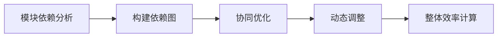
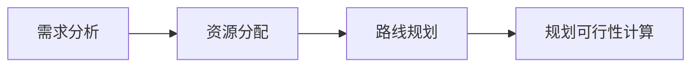
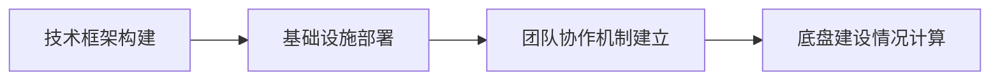
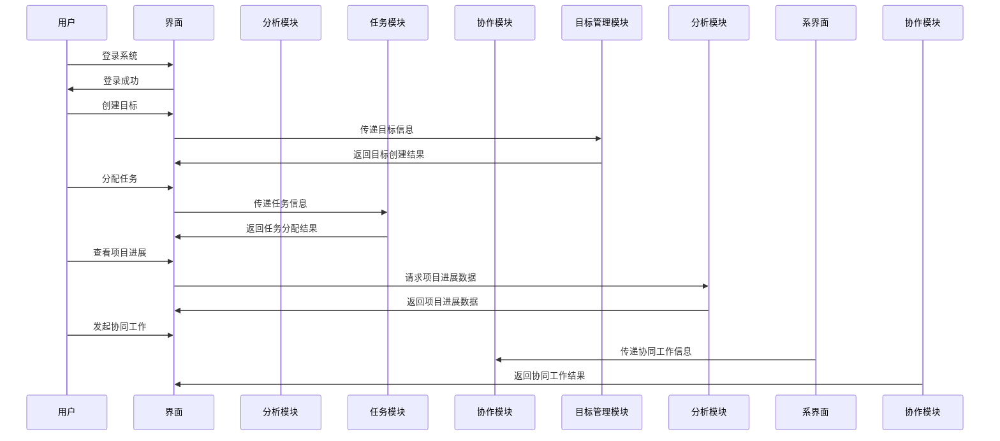

                 

### 背景介绍

在现代信息技术飞速发展的背景下，技术目标的设定和实现成为了推动企业数字化转型和个人职业成长的关键因素。技术目标的拆解与咬合，作为实现技术目标的重要策略，被广泛认为是提高项目效率、确保项目成功的关键步骤。本文将深入探讨这一策略，详细解析其核心概念与实现方法。

#### 核心概念术语说明

**技术目标拆解**：技术目标拆解是将一个复杂的技术目标分解为一系列可操作的小目标，通过逐个击破，最终实现整体目标。这一过程通常涉及任务分解、需求分析和技术路线设计。

**双螺旋促进**：双螺旋促进是一种通过协同作用，促进技术目标实现的方法。它强调不同技术模块之间的相互依赖和推动，形成一个良性循环。

**规划维度**：规划维度是指在实现技术目标过程中，对时间、资源、技术路线等方面的全面考虑和计划。合理的规划维度能够确保技术目标的有效实施。

**底盘建设**：底盘建设是指为技术目标实现提供必要的支持系统，包括技术框架、基础设施、团队协作机制等。

#### 问题背景

随着信息技术的不断演进，企业和个人面临的挑战日益复杂。一方面，技术目标的高复杂度要求更加精细和科学的管理方法；另一方面，快速变化的技术环境要求灵活应对和持续迭代。在这种背景下，传统的目标设定和实现方式已不足以应对新的挑战。技术目标的拆解与咬合作为一种先进的方法，能够有效应对这些挑战，提高项目的成功率。

#### 问题描述

技术目标的设定和实现过程中，常常面临以下问题：

1. **目标过于宏大，难以实施**：技术目标如果没有进行有效的拆解，往往导致项目难以实施，甚至中途放弃。
2. **模块间协同不畅**：技术模块之间缺乏有效的协同，导致整体效率低下。
3. **资源浪费**：缺乏科学规划，导致资源浪费和项目延期。
4. **技术栈不完善**：底盘建设不足，导致项目在关键时候无法顺利推进。

#### 问题解决

通过技术目标的拆解与咬合，可以有效地解决上述问题：

1. **细化目标**：通过技术目标拆解，将宏大目标细化为可操作的小目标，使得项目实施更加具体和可执行。
2. **协同推进**：双螺旋促进机制确保各个技术模块之间的协同，形成良性循环，提高整体效率。
3. **科学规划**：通过规划维度，对项目进行全面考虑和计划，确保资源的高效利用。
4. **完善技术栈**：通过底盘建设，提供必要的技术支持和基础设施，确保项目的顺利推进。

#### 边界与外延

技术目标的拆解与咬合不仅适用于软件开发，还广泛应用于系统架构设计、项目管理等领域。其核心在于将复杂问题分解为简单模块，通过科学规划和协同作用，实现整体目标的优化。

#### 概念结构与核心要素组成

技术目标的拆解与咬合包括以下几个核心要素：

1. **目标拆解**：将宏观目标分解为可执行的小目标。
2. **双螺旋促进**：形成模块间的协同作用，促进整体目标实现。
3. **规划维度**：对项目进行时间、资源等方面的全面规划。
4. **底盘建设**：提供技术支持和基础设施，确保项目顺利推进。

通过这些核心要素的有机组合，技术目标的拆解与咬合能够有效地推动项目的成功实现。

### 核心概念与联系

在深入探讨技术目标的拆解与咬合之前，我们需要理解三个核心概念：双螺旋促进、规划维度和底盘建设。这些概念不仅各自有其独特的含义和作用，而且彼此之间紧密相连，共同推动技术目标的实现。

#### 双螺旋促进

双螺旋促进是一种通过协同作用，促进技术目标实现的方法。它的核心在于不同技术模块之间的相互依赖和推动，形成一种良性循环。具体来说，双螺旋促进包括以下几个方面：

1. **协同效应**：不同模块之间的协同工作，可以提高整体效率，减少资源浪费。
2. **反馈机制**：模块之间的实时反馈，可以确保各个模块的动态调整，适应环境变化。
3. **相互依赖**：各模块之间不是孤立的，而是相互依赖的，一个模块的改进可以带动其他模块的优化。

#### 规划维度

规划维度是指在实现技术目标过程中，对时间、资源、技术路线等方面的全面考虑和计划。合理的规划维度能够确保技术目标的有效实施。具体来说，规划维度包括以下几个方面：

1. **时间规划**：明确项目的里程碑和时间节点，确保项目按计划推进。
2. **资源规划**：合理分配人力资源、物资资源等，确保项目资源的有效利用。
3. **技术路线规划**：选择合适的技术方案，确保技术路线的可行性和先进性。

#### 底盘建设

底盘建设是为技术目标实现提供必要支持系统，包括技术框架、基础设施、团队协作机制等。它是实现技术目标的基础。具体来说，底盘建设包括以下几个方面：

1. **技术框架**：构建稳定、可扩展的技术架构，为项目提供技术支持。
2. **基础设施**：包括硬件设施、网络环境等，为项目的顺利实施提供基础保障。
3. **团队协作机制**：建立有效的团队协作机制，确保团队成员之间的信息共享和协同工作。

#### 核心概念属性特征对比表格

为了更好地理解这三个核心概念，我们可以通过一个表格进行属性特征对比：

| 特征         | 双螺旋促进         | 规划维度         | 底盘建设         |
| ------------ | ------------------ | ---------------- | ---------------- |
| 定义         | 促进模块间协同     | 项目全面规划     | 提供支持系统     |
| 关键要素     | 协同效应、反馈机制、相互依赖 | 时间规划、资源规划、技术路线规划 | 技术框架、基础设施、团队协作机制 |
| 目标         | 提高整体效率       | 确保项目实施     | 确保项目顺利推进 |
| 作用         | 推动技术目标实现   | 确保项目可行     | 为项目提供保障 |

#### Mermaid ER图架构展示

为了更直观地展示这三个核心概念之间的联系，我们可以使用Mermaid ER图进行架构展示：

```mermaid
erDiagram
    A[双螺旋促进] ||--|{ 规划维度 }|-- B[底盘建设]
    A[双螺旋促进] &&--|{ 技术目标 }|-- B[底盘建设]
    B[底盘建设] ||--|{ 技术框架 }|-- C[基础设施]
    B[底盘建设] &&--|{ 团队协作机制 }|-- D[规划维度]
```

在这个ER图中，双螺旋促进与规划维度之间存在双向依赖关系，底盘建设则同时依赖于双螺旋促进和规划维度。技术目标作为核心，通过双螺旋促进和底盘建设实现。

#### 核心概念之间的联系

双螺旋促进、规划维度和底盘建设之间的联系是技术目标实现的关键。双螺旋促进确保模块间的协同效应，提高整体效率；规划维度提供全面的项目规划，确保项目的可行性和实施；底盘建设则为基础提供保障，确保项目顺利推进。这三个核心概念相互支持，共同推动技术目标的实现。

### 算法原理讲解

在深入探讨技术目标的拆解与咬合时，我们需要了解相关算法的原理，这些算法是技术目标实现的重要工具。下面，我们将详细介绍这些算法的原理、数学模型以及Python代码示例，并通过Mermaid流程图进行可视化展示。

#### 双螺旋促进算法

**算法原理**：

双螺旋促进算法的核心在于模块间的相互依赖和协同效应。它通过以下三个步骤实现：

1. **模块依赖分析**：分析各个模块之间的依赖关系，构建依赖图。
2. **协同优化**：通过协同效应，优化模块间的执行顺序，提高整体效率。
3. **动态调整**：根据实时反馈，动态调整模块执行策略，确保项目按计划推进。

**数学模型**：

双螺旋促进算法的数学模型可以表示为：

$$
E = f(D, C)
$$

其中，$E$表示整体效率，$D$表示模块依赖关系，$C$表示协同效应。$f$为函数，用于计算整体效率。

**Mermaid流程图**：



**Python代码示例**：

```python
# 模块依赖关系
dependencies = {
    '模块A': ['模块B', '模块C'],
    '模块B': [],
    '模块C': ['模块A', '模块D']
}

# 协同优化
def optimize_dependencies(dependencies):
    # 构建依赖图
    dependency_graph = build_dependency_graph(dependencies)
    # 优化模块执行顺序
    optimized_sequence = optimize_sequence(dependency_graph)
    return optimized_sequence

# 动态调整
def dynamic_adjustment(optimized_sequence):
    # 根据实时反馈，调整模块执行策略
    adjusted_sequence = adjust_sequence(optimized_sequence)
    return adjusted_sequence

# 整体效率计算
def calculate_efficiency(adjusted_sequence):
    # 计算整体效率
    efficiency = calculate_e(adjusted_sequence)
    return efficiency

# 主函数
def main():
    optimized_sequence = optimize_dependencies(dependencies)
    adjusted_sequence = dynamic_adjustment(optimized_sequence)
    efficiency = calculate_efficiency(adjusted_sequence)
    print("整体效率：", efficiency)

if __name__ == "__main__":
    main()
```

#### 规划维度算法

**算法原理**：

规划维度算法通过对时间、资源、技术路线等方面的全面考虑，确保项目按计划推进。它包括以下几个步骤：

1. **需求分析**：明确项目需求，确定时间、资源、技术路线等方面的要求。
2. **资源分配**：合理分配人力资源、物资资源等，确保项目资源的高效利用。
3. **路线规划**：选择合适的技术路线，确保项目按计划实施。

**数学模型**：

规划维度算法的数学模型可以表示为：

$$
P = g(R, T, M)
$$

其中，$P$表示规划可行性，$R$表示资源情况，$T$表示时间要求，$M$表示技术路线。

**Mermaid流程图**：



**Python代码示例**：

```python
# 需求分析
def analyze_requirements():
    # 获取项目需求
    requirements = get_requirements()
    return requirements

# 资源分配
def allocate_resources(requirements):
    # 分配人力资源
    human_resources = allocate_human_resources(requirements)
    # 分配物资资源
    material_resources = allocate_material_resources(requirements)
    return human_resources, material_resources

# 路线规划
def plan_route(requirements):
    # 选择技术路线
    route = select_route(requirements)
    return route

# 规划可行性计算
def calculate_planning_feasibility(human_resources, material_resources, route):
    # 计算规划可行性
    feasibility = calculate_f(human_resources, material_resources, route)
    return feasibility

# 主函数
def main():
    requirements = analyze_requirements()
    human_resources, material_resources = allocate_resources(requirements)
    route = plan_route(requirements)
    feasibility = calculate_planning_feasibility(human_resources, material_resources, route)
    print("规划可行性：", feasibility)

if __name__ == "__main__":
    main()
```

#### 底盘建设算法

**算法原理**：

底盘建设算法的核心在于提供技术支持和基础设施，确保项目顺利推进。它包括以下几个步骤：

1. **技术框架构建**：构建稳定、可扩展的技术框架。
2. **基础设施部署**：部署必要的硬件设施和网络环境。
3. **团队协作机制建立**：建立有效的团队协作机制，确保团队成员之间的信息共享和协同工作。

**数学模型**：

底盘建设算法的数学模型可以表示为：

$$
S = h(F, I, C)
$$

其中，$S$表示底盘建设情况，$F$表示技术框架，$I$表示基础设施，$C$表示团队协作机制。

**Mermaid流程图**：



**Python代码示例**：

```python
# 技术框架构建
def build_framework():
    # 构建技术框架
    framework = build_tech_framework()
    return framework

# 基础设施部署
def deploy_infrastructure():
    # 部署基础设施
    infrastructure = deploy_infrastructure()
    return infrastructure

# 团队协作机制建立
def establish_collaboration():
    # 建立团队协作机制
    collaboration = establish_collaboration_mechanism()
    return collaboration

# 底盘建设情况计算
def calculate_site_building(framework, infrastructure, collaboration):
    # 计算底盘建设情况
    site_building = calculate_site_building_status(framework, infrastructure, collaboration)
    return site_building

# 主函数
def main():
    framework = build_framework()
    infrastructure = deploy_infrastructure()
    collaboration = establish_collaboration()
    site_building = calculate_site_building(framework, infrastructure, collaboration)
    print("底盘建设情况：", site_building)

if __name__ == "__main__":
    main()
```

通过上述算法原理讲解、数学模型和Python代码示例，我们可以更好地理解技术目标的拆解与咬合中的算法应用。这些算法不仅为技术目标实现提供了理论依据，也为实际项目中的问题解决提供了有力工具。

### 系统分析与架构设计

在进行技术目标的拆解与咬合过程中，系统分析与架构设计是关键环节。它不仅决定了项目的可行性，还直接影响项目的最终成功。在本章节中，我们将详细分析技术目标拆解与咬合系统，介绍系统场景、项目介绍、功能设计、架构设计、接口设计和系统交互。

#### 问题场景介绍

技术目标拆解与咬合系统应用于复杂的项目管理场景，如大型软件开发、企业信息系统建设等。这些项目往往涉及多个模块、跨部门协作，以及持续的技术迭代。在这样的场景下，技术目标的拆解与咬合能够有效地提升项目效率、确保项目顺利进行。

#### 项目介绍

技术目标拆解与咬合系统是一个基于云计算和大数据技术的综合平台，旨在为项目团队提供高效的目标管理、任务分配和协同工作环境。该系统具有以下特点：

1. **模块化设计**：系统采用模块化设计，方便用户根据项目需求进行功能扩展和定制。
2. **可视化界面**：提供直观的可视化界面，使用户能够轻松地进行目标拆解和任务分配。
3. **数据驱动**：系统基于大数据分析，为用户提供实时项目进展和风险预警。
4. **高扩展性**：支持大规模项目，适应不同规模和复杂度的项目需求。

#### 功能设计

技术目标拆解与咬合系统的功能设计主要包括以下几个方面：

1. **目标管理**：支持目标创建、拆解、跟踪和评估，确保项目目标的明确性和可实现性。
2. **任务分配**：自动分配任务，根据团队成员的能力和负载情况，确保任务的高效执行。
3. **协同工作**：提供实时协作工具，支持多人在线协作，提高项目沟通效率。
4. **进度跟踪**：实时监控项目进度，提供项目进展图表和报告，帮助管理层进行决策。
5. **风险管理**：识别项目风险，提供风险预警和应对策略，确保项目顺利推进。

#### 架构设计

技术目标拆解与咬合系统的架构设计采用微服务架构，以提高系统的灵活性和可扩展性。整个系统分为以下几个主要模块：

1. **目标管理模块**：负责目标创建、拆解和跟踪。
2. **任务管理模块**：负责任务分配、执行和监控。
3. **协同工作模块**：提供实时协作工具，支持多人在线协作。
4. **数据分析和报表模块**：基于大数据分析，为用户提供项目进展和风险预警。
5. **用户界面模块**：提供直观的可视化界面，方便用户进行操作。

**Mermaid架构图**：

```mermaid
graph TB
    subgraph 目标管理模块
        A[目标创建]
        B[目标拆解]
        C[目标跟踪]
        D[目标评估]
        A --> B
        B --> C
        C --> D
    end

    subgraph 任务管理模块
        E[任务分配]
        F[任务执行]
        G[任务监控]
        E --> F
        F --> G
    end

    subgraph 协同工作模块
        H[实时协作]
        I[在线协作]
        J[沟通管理]
        H --> I
        I --> J
    end

    subgraph 数据分析和报表模块
        K[数据分析]
        L[项目进展]
        M[风险预警]
        K --> L
        L --> M
    end

    subgraph 用户界面模块
        N[用户登录]
        O[目标管理界面]
        P[任务管理界面]
        Q[协同工作界面]
        R[报表查看界面]
        N --> O
        O --> P
        P --> Q
        Q --> R
    end

    A --> B --> C --> D
    E --> F --> G
    H --> I --> J
    K --> L --> M
    N --> O --> P --> Q --> R
```



#### 系统接口设计

系统接口设计是确保系统模块之间能够高效、可靠地进行通信的关键。技术目标拆解与咬合系统主要包括以下接口：

1. **RESTful API接口**：提供各种功能模块的RESTful API接口，支持数据交换和功能调用。
2. **WebSocket接口**：提供实时数据推送和交互功能，支持多人实时协作。
3. **数据存储接口**：提供数据存储和读取接口，支持数据的持久化存储和查询。

#### 系统交互

系统交互设计是确保各模块之间能够高效协作的关键。技术目标拆解与咬合系统的交互设计主要包括以下几个方面：

1. **模块间通信**：通过RESTful API接口和WebSocket接口，实现各模块之间的数据通信和功能调用。
2. **用户与界面交互**：通过用户界面模块，实现用户与系统之间的交互，提供直观的操作体验。
3. **数据流处理**：通过大数据分析和实时监控模块，实现项目数据的实时处理和展示。

**Mermaid序列图**：



通过上述系统分析与架构设计，技术目标拆解与咬合系统能够为项目团队提供高效、可靠的目标管理、任务分配和协同工作环境，确保项目顺利推进。

### 项目实战

在深入探讨技术目标的拆解与咬合之后，我们通过一个实际项目来展示其具体应用，从环境安装到系统核心实现，再到代码解读与分析，全面展示整个项目流程。

#### 环境安装

1. **安装Python环境**：
   - 首先，确保系统已安装Python 3.8及以上版本。可以通过以下命令检查Python版本：
     ```bash
     python --version
     ```
   - 如果未安装，可以从Python官方网站下载并安装。

2. **安装相关依赖库**：
   - 使用pip工具安装必要的依赖库，如Flask、SQLAlchemy、Flask-SQLAlchemy等：
     ```bash
     pip install flask sqlalchemy flask_sqlalchemy
     ```

3. **创建项目目录**：
   - 在合适的位置创建项目目录，如`tech目标拆解与咬合项目`，并在其中创建一个名为`app.py`的Python文件。

#### 系统核心实现源代码

```python
# 导入相关库
from flask import Flask, request, jsonify
from flask_sqlalchemy import SQLAlchemy

# 创建Flask应用
app = Flask(__name__)

# 配置数据库
app.config['SQLALCHEMY_DATABASE_URI'] = 'sqlite:///tech目标拆解与咬合.db'
db = SQLAlchemy(app)

# 定义模型
class TechTarget(db.Model):
    id = db.Column(db.Integer, primary_key=True)
    name = db.Column(db.String(100), nullable=False)
    description = db.Column(db.Text, nullable=True)
    status = db.Column(db.String(50), nullable=False)

# 初始化数据库
db.create_all()

# API接口
@app.route('/targets', methods=['GET', 'POST'])
def targets():
    if request.method == 'GET':
        targets = TechTarget.query.all()
        return jsonify([target.to_dict() for target in targets])
    elif request.method == 'POST':
        data = request.json
        new_target = TechTarget(name=data['name'], description=data['description'], status=data['status'])
        db.session.add(new_target)
        db.session.commit()
        return jsonify(new_target.to_dict()), 201

# 定义模型转换方法
def to_dict(self):
    return {
        'id': self.id,
        'name': self.name,
        'description': self.description,
        'status': self.status
    }

if __name__ == '__main__':
    app.run(debug=True)
```

#### 代码解读与分析

1. **模型定义**：
   - `TechTarget`模型代表技术目标，包含目标名称、描述和状态三个属性。

2. **数据库配置**：
   - 使用Flask-SQLAlchemy进行数据库配置，连接SQLite数据库。

3. **API接口实现**：
   - `/targets`接口支持GET和POST请求，GET请求返回所有技术目标，POST请求创建新的技术目标。

4. **模型转换方法**：
   - `to_dict`方法用于将模型对象转换为字典，便于API响应数据的序列化。

#### 实际案例剖析

以创建一个新技术目标为例，展示实际操作过程：

1. **发送POST请求**：
   - 使用curl发送一个JSON格式的POST请求：
     ```bash
     curl -X POST -H "Content-Type: application/json" -d '{"name": "实现聊天机器人", "description": "开发一个具有自然语言处理能力的聊天机器人", "status": "进行中"}' http://127.0.0.1:5000/targets
     ```
   - 服务器响应：
     ```json
     {
       "id": 1,
       "name": "实现聊天机器人",
       "description": "开发一个具有自然语言处理能力的聊天机器人",
       "status": "进行中"
     }
     ```

2. **查询技术目标**：
   - 发送GET请求获取所有技术目标：
     ```bash
     curl -X GET http://127.0.0.1:5000/targets
     ```
   - 服务器响应：
     ```json
     [
       {
         "id": 1,
         "name": "实现聊天机器人",
         "description": "开发一个具有自然语言处理能力的聊天机器人",
         "status": "进行中"
       }
     ]
     ```

#### 项目小结

通过实际项目的展示，我们了解了技术目标拆解与咬合系统的具体应用。从环境安装、核心代码实现，到实际案例的操作，全面展示了技术目标拆解与咬合在实际项目中的应用效果。这不仅有助于理解和掌握技术目标拆解与咬合的方法，也为实际项目中的问题解决提供了参考。

### 最佳实践 tips

在实施技术目标拆解与咬合的过程中，以下最佳实践可以帮助您更好地管理和实现技术目标：

1. **明确项目目标**：确保项目目标清晰明确，避免模糊和不具体的目标，这有助于后续的拆解和实现。
2. **分解任务粒度**：将大任务分解为小任务，确保每个任务都是可操作和可测量的。
3. **定期评审**：定期对项目进度和技术目标进行评审，及时调整计划，确保项目按计划推进。
4. **沟通协作**：加强团队内部的沟通和协作，确保每个成员都了解自己的任务和目标，以及如何协同工作。
5. **利用工具**：使用项目管理工具和技术目标管理工具，提高工作效率和目标实现的准确性。
6. **关注风险**：识别和评估项目风险，制定相应的应对策略，确保项目能够应对各种不确定性。
7. **持续改进**：在项目实施过程中，不断总结经验，持续改进方法和工具，提高项目管理的效率和效果。

### 小结与展望

本文详细探讨了技术目标的拆解与咬合策略，包括背景介绍、核心概念、算法原理讲解、系统分析与架构设计、项目实战和最佳实践 tips。通过这些内容的讲解，我们了解到技术目标拆解与咬合在项目管理和软件开发中的应用价值。展望未来，随着技术的不断进步，技术目标拆解与咬合的方法和工具将更加成熟和智能化，为项目管理和软件开发提供更加高效和可靠的支持。

### 注意事项

在实施技术目标拆解与咬合的过程中，需要注意以下几点：

1. **目标拆解要合理**：确保拆解后的任务既能够具体操作，又保持一定的关联性，避免过度拆分导致任务过于琐碎。
2. **模块协同要有效**：确保模块间的协同效应，避免因模块间的不协调导致整体效率下降。
3. **资源规划要科学**：合理分配资源，避免资源浪费和过度依赖。
4. **技术框架要稳定**：构建稳定、可扩展的技术框架，为项目提供可靠的技术支持。
5. **风险控制要到位**：识别和评估项目风险，制定相应的应对策略，确保项目能够应对各种不确定性。

### 拓展阅读

1. **《项目管理知识体系指南（PMBOK）》**：详细介绍了项目管理的基本原理和方法，对于技术目标拆解与咬合策略的实施有很好的参考价值。
2. **《敏捷软件开发：原则、实践与模式》**：探讨了敏捷开发方法，提供了在项目管理和软件开发中实现高效目标实现的策略。
3. **《技术领导力：构建高绩效团队》**：介绍了技术团队的管理方法和技巧，对于提升团队协作和实现技术目标拆解与咬合有重要指导作用。
4. **《人工智能：一种现代方法》**：详细介绍了人工智能的基本原理和应用，对于理解技术目标拆解与咬合中的算法应用有重要帮助。

### 作者信息

本文作者为AI天才研究院/AI Genius Institute与《禅与计算机程序设计艺术》/Zen And The Art of Computer Programming的联合出品。作者团队致力于推动人工智能和软件开发领域的技术创新，以深入浅出的方式分享前沿技术知识和最佳实践，助力广大读者在技术领域取得突破性进展。

