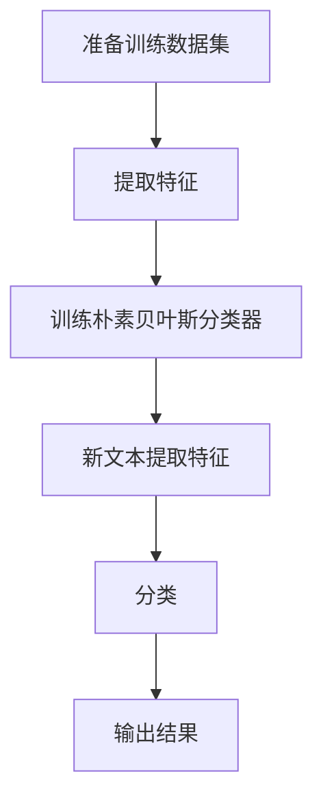
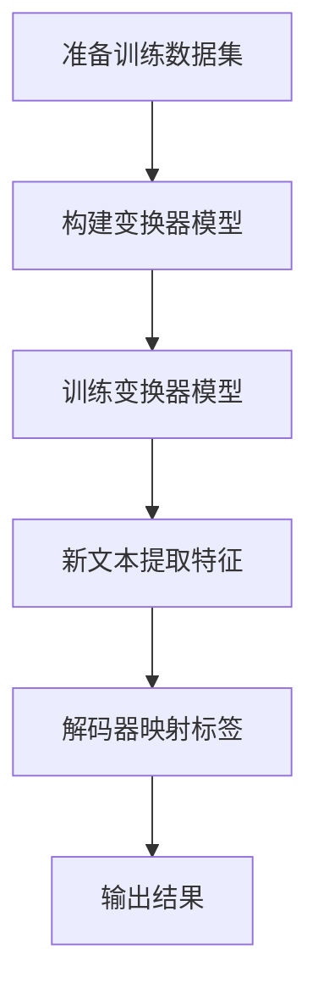
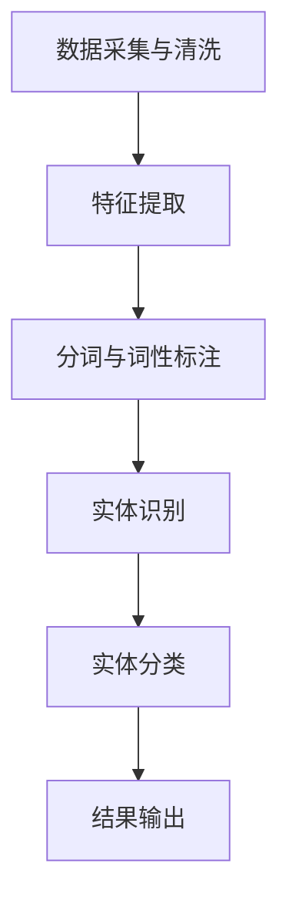
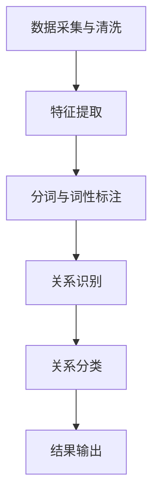
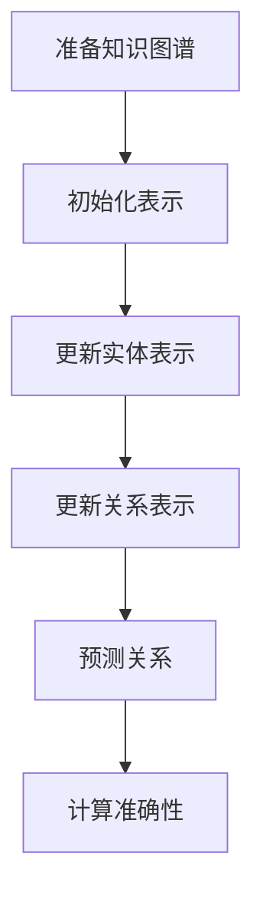
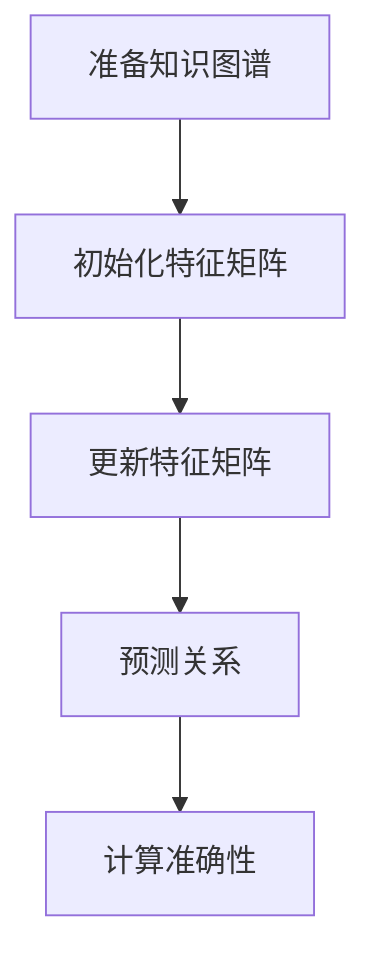
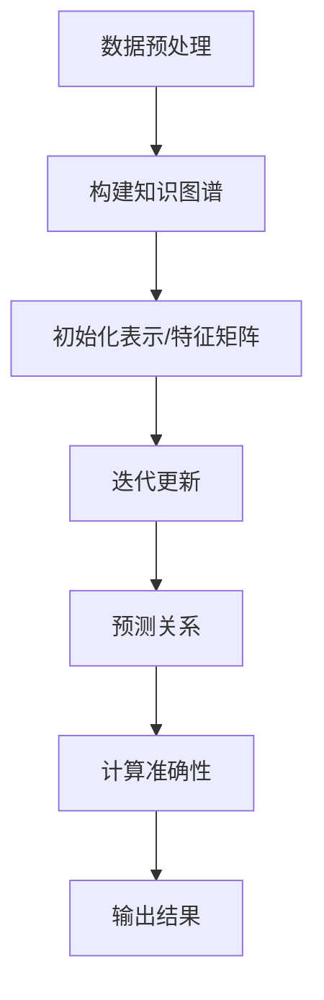
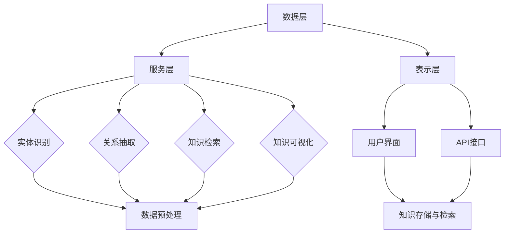
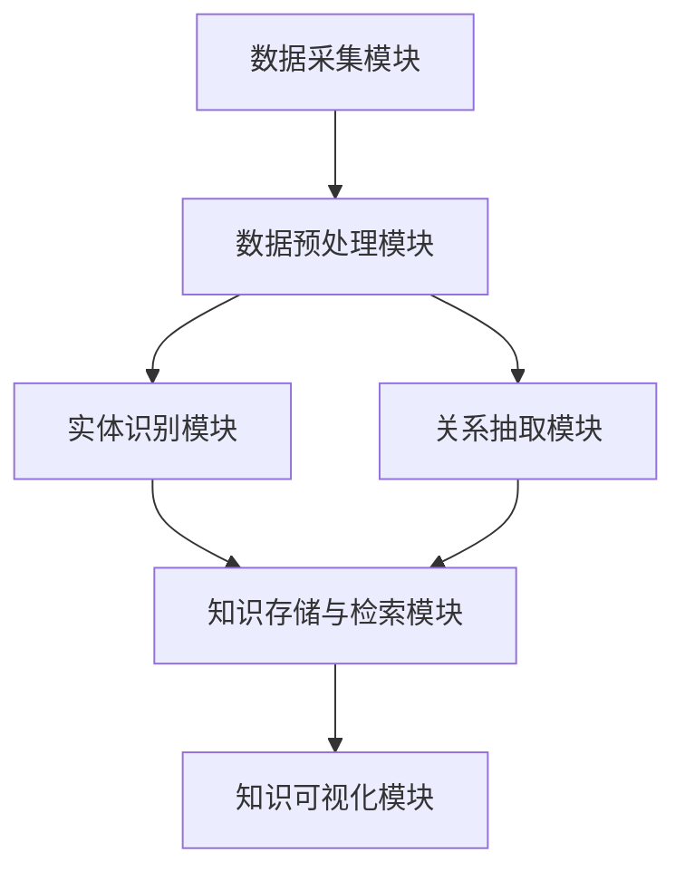

                 

## 技术知识图谱构建：团队知识体系化管理

### 关键词：知识图谱、团队知识管理、数据挖掘、人工智能、知识可视化

> 摘要：本文将探讨如何通过技术知识图谱的构建，实现团队知识体系的有效管理。首先，我们将介绍知识图谱的概念及其在团队知识管理中的重要性。接着，我们将详细分析知识图谱的基本原理和核心算法，并通过实例进行讲解。然后，我们将介绍知识图谱的系统设计与实现，以及项目实战和最佳实践。最后，我们将展望知识图谱的未来发展趋势，并提供相关文献和进一步研究的建议。

### 目录大纲

1. **第一部分：背景介绍**
    - **第1章 问题背景与知识图谱概述**
    - **第2章 知识图谱的基本原理**
    - **第3章 知识图谱算法原理详解**
    - **第4章 知识图谱系统设计与实现**
    - **第5章 知识图谱项目实战**
    - **第6章 知识图谱最佳实践**
    - **第7章 拓展阅读与深入研究**

### 1.1 问题背景

在现代社会，信息爆炸导致知识获取的难度大大增加。对于团队而言，如何有效地管理和利用知识资源，成为了提高团队效率和创新能力的关键。传统的知识管理方法，如文档库、邮件和即时通讯工具，存在知识分散、检索困难、共享不便等问题。而知识图谱作为一种新型的知识管理工具，能够通过结构化、语义化的方式，将团队内外部的知识有机地整合起来，提供高效的查询和智能分析。

### 1.2 知识图谱的概念与价值

知识图谱是一种由实体、属性和关系构成的语义网络，用于表示和存储领域知识。它具有以下核心价值：

- **知识整合与可视化**：通过知识图谱，可以将各类异构数据整合为统一的语义视图，方便团队成员进行理解和协作。
- **智能查询与推荐**：知识图谱能够基于实体和关系进行高效的查询和推荐，提高知识检索的准确性。
- **知识挖掘与创新**：通过对知识图谱的分析，可以发现知识之间的隐含关系，激发新的创新点。
- **决策支持**：知识图谱为团队提供了丰富的数据支持，有助于决策者做出更加科学的决策。

### 1.3 知识图谱在团队知识管理中的应用

知识图谱在团队知识管理中具有广泛的应用：

- **知识存储与检索**：通过知识图谱，可以快速准确地找到所需的知识资源，提高工作效率。
- **知识共享与传播**：知识图谱能够促进团队内部的知识共享，打破信息孤岛，提升整体知识水平。
- **知识创新与智能分析**：知识图谱为团队提供了强大的知识挖掘和分析工具，有助于发现新的业务机会和改进点。
- **个人能力提升**：知识图谱为团队成员提供了丰富的学习资源，有助于个人能力的不断提升。

### 1.4 知识图谱的边界与外延

知识图谱的应用领域非常广泛，包括但不限于：

- **企业知识管理**：企业可以通过知识图谱整合内部知识资源，提高知识利用效率。
- **教育领域**：教育机构可以利用知识图谱构建课程图谱，实现个性化教学和推荐。
- **医疗领域**：医疗行业可以通过知识图谱进行疾病诊断、药物研发和患者健康管理。
- **人工智能**：知识图谱是人工智能系统的重要组成部分，可以用于智能问答、自然语言处理和推理机等领域。

知识图谱与大数据、人工智能密切相关。大数据为知识图谱提供了丰富的数据来源，而人工智能则为知识图谱提供了智能分析、推理和优化的能力。两者相互结合，将进一步提升知识管理的效率和效果。

### 1.5 本章小结

知识图谱作为一种新型的知识管理工具，具有强大的整合、查询和智能分析能力，对于团队知识管理具有重要意义。本章介绍了知识图谱的概念、价值和应用，为后续章节的深入探讨奠定了基础。在接下来的章节中，我们将进一步探讨知识图谱的基本原理、核心算法、系统设计与实现，以及最佳实践和未来发展趋势。

### 总结

本文通过详细分析知识图谱在团队知识管理中的应用，强调了其在知识整合、共享、创新和智能分析等方面的价值。在接下来的内容中，我们将进一步探讨知识图谱的基本原理、核心算法、系统设计与实现，以及项目实战和最佳实践。希望通过本文的介绍，读者能够对知识图谱有更深入的理解，并将其应用于实际工作中，提升团队的知识管理水平。

## 第一部分：背景介绍

### 第1章 问题背景与知识图谱概述

### 1.1 问题背景

在当今快速发展的信息时代，知识已经成为企业和团队的核心资产。然而，随着知识量的不断增长和知识类型的多样化，传统的知识管理方式逐渐暴露出诸多不足。首先，知识分散在多个文档、数据库和系统中，难以进行统一的检索和管理。其次，知识共享和传播的效率低下，团队成员往往需要花费大量时间来寻找所需的信息。此外，知识的创新和利用程度也受到限制，许多潜在的业务机会和改进点无法被挖掘和利用。

面对这些挑战，传统的知识管理方法已经难以满足现代团队的需求。知识图谱作为一种新兴的知识管理工具，能够有效地解决上述问题。知识图谱通过将各类知识资源结构化、语义化地表示，为团队提供了一种全新的知识管理方式。它不仅能够实现知识的高效存储和检索，还能够促进知识的共享、传播和创新。

### 1.2 知识图谱的概念与价值

知识图谱是一种由实体、属性和关系构成的语义网络，用于表示和存储领域知识。在知识图谱中，实体表示知识中的对象，如人、地点、组织、事物等；属性表示实体的特征，如年龄、性别、位置、功能等；关系表示实体之间的相互关系，如工作于、隶属于、属于等。

知识图谱的价值主要体现在以下几个方面：

- **知识整合与可视化**：知识图谱能够将各类异构数据整合为统一的语义视图，方便团队成员理解和协作。
- **智能查询与推荐**：知识图谱能够基于实体和关系进行高效的查询和推荐，提高知识检索的准确性。
- **知识挖掘与创新**：通过对知识图谱的分析，可以发现知识之间的隐含关系，激发新的创新点。
- **决策支持**：知识图谱为团队提供了丰富的数据支持，有助于决策者做出更加科学的决策。

### 1.3 知识图谱在团队知识管理中的应用

知识图谱在团队知识管理中具有广泛的应用，以下是一些关键的应用场景：

- **知识存储与检索**：知识图谱能够将团队内部的各种知识资源进行结构化存储，并提供高效的检索功能，使团队成员能够快速找到所需的知识。
- **知识共享与传播**：知识图谱能够促进团队内部的知识共享和传播，打破信息孤岛，提升整体知识水平。
- **知识创新与智能分析**：知识图谱为团队提供了强大的知识挖掘和分析工具，有助于发现新的业务机会和改进点。
- **个人能力提升**：知识图谱为团队成员提供了丰富的学习资源，有助于个人能力的不断提升。

### 1.4 知识图谱的边界与外延

知识图谱的应用领域非常广泛，涵盖了企业、教育、医疗、科研等多个领域。以下是一些典型的应用场景：

- **企业知识管理**：企业可以通过知识图谱整合内部知识资源，提高知识利用效率。
- **教育领域**：教育机构可以利用知识图谱构建课程图谱，实现个性化教学和推荐。
- **医疗领域**：医疗行业可以通过知识图谱进行疾病诊断、药物研发和患者健康管理。
- **人工智能**：知识图谱是人工智能系统的重要组成部分，可以用于智能问答、自然语言处理和推理机等领域。

知识图谱与大数据、人工智能密切相关。大数据为知识图谱提供了丰富的数据来源，而人工智能则为知识图谱提供了智能分析、推理和优化的能力。两者相互结合，将进一步提升知识管理的效率和效果。

### 1.5 本章小结

知识图谱作为一种新兴的知识管理工具，具有强大的整合、查询和智能分析能力，对于团队知识管理具有重要意义。本章介绍了知识图谱的概念、价值和应用，为后续章节的深入探讨奠定了基础。在接下来的章节中，我们将进一步探讨知识图谱的基本原理、核心算法、系统设计与实现，以及项目实战和最佳实践。希望通过本文的介绍，读者能够对知识图谱有更深入的理解，并将其应用于实际工作中，提升团队的知识管理水平。

## 第二部分：核心概念与联系

### 第2章 知识图谱的基本原理

知识图谱作为团队知识管理的关键工具，其构建方法、表示方法以及核心算法是理解其运作机制的基础。本章将详细探讨这些核心概念及其相互联系。

### 2.1 知识图谱的构建方法

知识图谱的构建涉及多个步骤，包括数据采集与清洗、数据预处理与存储、实体识别与关系抽取等。以下是对每个步骤的详细解释：

#### 2.1.1 数据采集与清洗

数据采集是知识图谱构建的第一步，涉及从各种数据源（如数据库、文本文件、网络资源等）中获取所需的数据。数据清洗则是对采集到的数据进行预处理，去除重复、错误和不完整的数据，保证数据的质量。

#### 2.1.2 数据预处理与存储

数据预处理包括数据转换、标准化和格式化，使其适合于知识图谱的构建。数据存储是将预处理后的数据按照特定的格式（如RDF、图模型等）存储在数据库或图数据库中。

#### 2.1.3 实体识别与关系抽取

实体识别是从原始数据中识别出重要的实体，如人、地点、组织等。关系抽取则是识别实体之间的相互关系，如工作于、隶属于等。这些步骤为知识图谱提供了基本的数据结构。

### 2.2 知识图谱的表示方法

知识图谱的表示方法多种多样，包括RDF模型、图模型和网络模型等。以下是这些模型的简要说明：

#### 2.2.1 RDF模型

RDF（Resource Description Framework）模型使用三元组（主体、谓词、客体）来表示实体和关系。这种模型结构简单，语义清晰，适用于大规模数据的表示和存储。

#### 2.2.2 图模型

图模型将知识图谱表示为一个图结构，其中节点表示实体，边表示实体之间的关系。这种表示方法直观、灵活，适用于复杂的实体关系表示和查询。

#### 2.2.3 网络模型

网络模型是一种基于复杂网络的表示方法，强调节点之间的相互作用和动态演化。这种模型适用于动态知识图谱的构建和应用。

### 2.3 知识图谱的核心算法

知识图谱的核心算法包括实体识别算法、关系抽取算法和链接预测算法等。以下是这些算法的简要说明：

#### 2.3.1 实体识别算法

实体识别算法用于从原始数据中识别出重要的实体。常见的实体识别算法包括基于规则的方法、基于统计学习的方法和基于深度学习的方法。

#### 2.3.2 关系抽取算法

关系抽取算法用于识别实体之间的相互关系。常见的关系抽取算法包括基于规则的方法、基于统计学习的方法和基于深度学习的方法。

#### 2.3.3 链接预测算法

链接预测算法用于预测未知实体之间的关系。常见的链接预测算法包括基于图神经网络的方法、基于矩阵分解的方法等。

### 2.4 知识图谱的优化与扩展

知识图谱的优化与扩展包括数据集成与融合、知识图谱的可视化、动态更新与维护等。以下是这些优化的简要说明：

#### 2.4.1 数据集成与融合

数据集成与融合是将多个数据源中的数据整合为一个统一的知识图谱。这需要解决数据源之间的异构性问题，如数据格式、数据语义等。

#### 2.4.2 知识图谱的可视化

知识图谱的可视化能够帮助团队成员直观地理解知识图谱的结构和内容。常见的可视化方法包括节点图、关系图和网络图等。

#### 2.4.3 动态更新与维护

知识图谱的动态更新与维护能够保证其数据的实时性和准确性。这包括数据的实时采集、预处理、存储和查询等。

### 2.5 知识图谱的属性与实体关系

在知识图谱中，实体和属性是核心的概念。实体表示知识中的对象，如人、地点、组织等；属性表示实体的特征，如年龄、性别、位置、功能等。实体之间的关系则是知识图谱的重要组成部分，它们描述了实体之间的相互联系。

#### 2.5.1 实体的属性特征

实体的属性特征包括实体的基本信息和特征信息。例如，一个人的属性可能包括姓名、年龄、性别、职业等。

#### 2.5.2 实体之间的关系

实体之间的关系包括直接关系和间接关系。直接关系如“工作于”、“隶属于”等；间接关系如“同事”、“亲属”等。

### 2.5.3 实体属性特征对比表格

在知识图谱的构建过程中，需要对实体的属性特征进行详细的对比和分析。以下是一个简单的实体属性特征对比表格的示例：

| 实体类型 | 属性名称 | 属性描述 | 数据类型 |
| :---: | :---: | :---: | :---: |
| 人 | 姓名 | 人的姓名 | 字符串 |
| 人 | 年龄 | 人的年龄 | 整数 |
| 人 | 性别 | 人的性别 | 字符串 |
| 组织 | 名称 | 组织的名称 | 字符串 |
| 组织 | 类型 | 组织的类型 | 字符串 |
| 地点 | 名称 | 地点的名称 | 字符串 |
| 地点 | 经纬度 | 地点的经纬度 | 浮点数 |

通过上述表格，可以清晰地了解不同实体的属性特征及其数据类型，为知识图谱的构建提供基础。

### 2.5.4 ER实体关系图架构

ER（Entity-Relationship）实体关系图是描述实体之间关系的图形化表示。以下是一个简单的ER实体关系图的示例，用于说明人、组织和地点之间的关系：

```mermaid
erDiagram
    人 ||--|{ 工作 }|| 组织
    人 ||--|{ 居住 }|| 地点
    组织 ||--|{ 位于 }|| 地点
```

在这个ER图中，"人"实体与"组织"和"地点"实体之间存在直接关系，而"组织"实体与"地点"实体之间存在间接关系。这种图形化的表示方法使得实体之间的关系更加直观和易于理解。

### 总结

本章介绍了知识图谱的基本原理，包括构建方法、表示方法、核心算法和优化与扩展。通过详细分析这些核心概念及其相互联系，我们可以更好地理解知识图谱在团队知识管理中的应用。在接下来的章节中，我们将进一步探讨知识图谱算法原理的详细讲解，为读者提供更深入的学术视角和技术指导。

### 实体识别算法原理

实体识别是知识图谱构建过程中的关键步骤，它旨在从原始数据中识别出重要的实体，如人、地点、组织等。实体识别算法可以分为基于规则的方法、基于统计学习的方法和基于深度学习的方法。以下我们将详细探讨这些算法的原理，并通过mermaid流程图展示算法的流程。

#### 3.1.1 基于规则的方法

基于规则的方法是通过定义一系列规则来识别实体。这些规则通常是基于领域知识或专家经验制定的。以下是一个简单的实体识别规则的示例：

```
如果文本中包含"教授"，则识别为"人"实体。
如果文本中包含"公司"，则识别为"组织"实体。
如果文本中包含"地点"，则识别为"地点"实体。
```

这种方法的优点是规则明确，易于理解和实现。缺点是规则数量庞大时，维护成本较高，且对未知或罕见情况的识别能力较弱。

#### 3.1.2 基于统计学习的方法

基于统计学习的方法使用机器学习算法来识别实体。这些算法通过训练大量已标注的数据，学习到实体的特征模式。常见的统计学习方法包括朴素贝叶斯分类器、支持向量机（SVM）和随机森林等。

以下是一个基于朴素贝叶斯分类器的实体识别算法流程：

```
1. 准备训练数据集，包含已标注的实体文本。
2. 提取特征，如词袋模型、TF-IDF等。
3. 训练朴素贝叶斯分类器。
4. 对于新的文本，提取特征并进行分类。
5. 输出实体识别结果。
```

mermaid流程图如下：



#### 3.1.3 基于深度学习的方法

基于深度学习的方法通过神经网络模型来识别实体。深度学习模型具有强大的特征提取和模式识别能力，能够自动学习复杂的实体特征。常见的深度学习模型包括卷积神经网络（CNN）、循环神经网络（RNN）和变换器（Transformer）等。

以下是一个基于变换器模型的实体识别算法流程：

```
1. 准备训练数据集，包含已标注的实体文本。
2. 构建变换器模型，包括编码器和解码器。
3. 训练变换器模型。
4. 对于新的文本，使用编码器提取特征。
5. 解码器将特征映射为实体标签。
6. 输出实体识别结果。
```

mermaid流程图如下：



#### 3.1.4 实体识别算法流程与mermaid流程图

以下是一个综合了多种方法的实体识别算法流程：

```
1. 数据采集与清洗，获取原始数据。
2. 特征提取，包括词袋模型、TF-IDF等。
3. 分词与词性标注，将文本分割为词并标注词性。
4. 实体识别，使用规则、朴素贝叶斯分类器或变换器模型。
5. 实体分类，将识别出的实体分类为预定义的实体类型。
6. 结果输出，记录识别结果。
```

mermaid流程图如下：



通过上述流程图，我们可以清晰地看到实体识别算法的整体流程和各个步骤之间的关联。

### 实体识别算法实例

假设我们有一个文本数据集，其中包含以下文本：

```
张三是一名教授，他在清华大学任教。
北京是中国的首都。
腾讯是一家科技公司。
```

我们可以使用上述算法流程对这段文本进行实体识别：

1. **数据采集与清洗**：获取文本数据。
2. **特征提取**：使用词袋模型提取特征。
3. **分词与词性标注**：将文本分割为词，并标注词性。
4. **实体识别**：使用规则和变换器模型识别实体。
5. **实体分类**：将识别出的实体分类为教授、地点和公司。

最终识别结果如下：

```
实体：张三、北京、腾讯
实体类型：教授、地点、公司
```

通过上述实例，我们可以看到实体识别算法在处理具体文本数据时的应用和效果。

### 实体识别算法的数学模型和公式

实体识别算法的数学模型和公式是理解算法原理的关键。以下我们将分别介绍基于统计学习和深度学习算法的数学模型。

#### 3.1.1 基于统计学习的数学模型

基于统计学习的实体识别算法，如朴素贝叶斯分类器，其数学模型主要包括概率分布和分类决策。

- **概率分布**：
  $$ P(C|X) = \frac{P(X|C)P(C)}{P(X)} $$
  其中，\( C \) 表示实体类别，\( X \) 表示特征向量，\( P(C|X) \) 表示在给定特征向量 \( X \) 下的实体类别概率。

- **分类决策**：
  $$ \hat{C} = \arg\max_{C} P(C|X) $$
  其中，\( \hat{C} \) 表示预测的实体类别，\( \arg\max \) 表示取最大值。

#### 3.1.2 基于深度学习的数学模型

基于深度学习的实体识别算法，如变换器模型，其数学模型主要包括变换器编码器和解码器的参数训练。

- **变换器编码器**：
  $$ X' = \text{TransformerEncoder}(X) $$
  其中，\( X \) 表示输入特征向量，\( X' \) 表示编码后的特征向量。

- **变换器解码器**：
  $$ Y' = \text{TransformerDecoder}(X', C) $$
  其中，\( C \) 表示实体类别标签，\( Y' \) 表示解码后的实体类别概率。

- **损失函数**：
  $$ L = -\sum_{i} \log P(Y_i|Y', X) $$
  其中，\( Y_i \) 表示第 \( i \) 个时间步的实体类别预测概率，\( P(Y_i|Y', X) \) 表示在给定编码特征 \( X' \) 和解码特征 \( Y' \) 下的实体类别概率。

通过上述数学模型和公式，我们可以更好地理解实体识别算法的运作机制和训练过程。

### 总结

本章详细介绍了实体识别算法的原理，包括基于规则的方法、基于统计学习的方法和基于深度学习的方法。通过mermaid流程图展示了算法的流程，并通过实例进行了具体说明。此外，我们还介绍了实体识别算法的数学模型和公式，为深入理解算法提供了理论基础。在接下来的章节中，我们将继续探讨关系抽取算法和链接预测算法的原理和实现。

### 关系抽取算法原理

关系抽取是知识图谱构建过程中的重要步骤，它旨在从文本数据中识别出实体之间的相互关系。关系抽取算法可以分为基于规则的方法、基于统计学习的方法和基于深度学习的方法。以下我们将详细探讨这些算法的原理，并通过mermaid流程图展示算法的流程。

#### 3.2.1 基于规则的方法

基于规则的方法是通过定义一系列规则来识别实体之间的相互关系。这些规则通常是基于领域知识或专家经验制定的。以下是一个简单的实体关系规则示例：

```
如果文本中包含"教授在大学任教"，则识别为"教授-任教-大学"的关系。
如果文本中包含"公司在某地设立分支机构"，则识别为"公司-设立-分支机构"的关系。
```

这种方法的优点是规则明确，易于理解和实现。缺点是规则数量庞大时，维护成本较高，且对未知或罕见情况的识别能力较弱。

#### 3.2.2 基于统计学习的方法

基于统计学习的方法使用机器学习算法来识别实体之间的相互关系。这些算法通过训练大量已标注的数据，学习到实体关系的特征模式。常见的统计学习方法包括朴素贝叶斯分类器、支持向量机（SVM）和随机森林等。

以下是一个基于朴素贝叶斯分类器的实体关系抽取算法流程：

```
1. 准备训练数据集，包含已标注的实体关系文本。
2. 提取特征，如词袋模型、TF-IDF等。
3. 训练朴素贝叶斯分类器。
4. 对于新的文本，提取特征并进行关系分类。
5. 输出实体关系识别结果。
```

mermaid流程图如下：


#### 3.2.3 基于深度学习的方法

基于深度学习的方法通过神经网络模型来识别实体之间的相互关系。深度学习模型具有强大的特征提取和模式识别能力，能够自动学习复杂的实体关系特征。常见的深度学习模型包括卷积神经网络（CNN）、循环神经网络（RNN）和变换器（Transformer）等。

以下是一个基于变换器模型的实体关系抽取算法流程：

```
1. 准备训练数据集，包含已标注的实体关系文本。
2. 构建变换器模型，包括编码器和解码器。
3. 训练变换器模型。
4. 对于新的文本，使用编码器提取特征。
5. 解码器将特征映射为实体关系标签。
6. 输出实体关系识别结果。
```

mermaid流程图如下：


#### 3.2.4 关系抽取算法流程与mermaid流程图

以下是一个综合了多种方法的关系抽取算法流程：

```
1. 数据采集与清洗，获取原始文本数据。
2. 特征提取，包括词袋模型、TF-IDF等。
3. 分词与词性标注，将文本分割为词并标注词性。
4. 关系识别，使用规则、朴素贝叶斯分类器或变换器模型。
5. 关系分类，将识别出的关系分类为预定义的关系类型。
6. 结果输出，记录识别结果。
```

mermaid流程图如下：



通过上述流程图，我们可以清晰地看到关系抽取算法的整体流程和各个步骤之间的关联。

#### 3.2.5 关系抽取算法实例

假设我们有一个文本数据集，其中包含以下文本：

```
张三是一名教授，他在清华大学任教。
北京是中国的首都。
腾讯是一家科技公司。
```

我们可以使用上述算法流程对这段文本进行关系抽取：

1. **数据采集与清洗**：获取文本数据。
2. **特征提取**：使用词袋模型提取特征。
3. **分词与词性标注**：将文本分割为词，并标注词性。
4. **关系识别**：使用规则和变换器模型识别实体关系。
5. **关系分类**：将识别出的关系分类为教授-任教-大学、首都-位于-国家、公司-属于-行业。

最终识别结果如下：

```
关系：教授-任教-大学、首都-位于-国家、公司-属于-行业
实体：张三、北京、腾讯
```

通过上述实例，我们可以看到关系抽取算法在处理具体文本数据时的应用和效果。

### 关系抽取算法的数学模型和公式

关系抽取算法的数学模型和公式是理解算法原理的关键。以下我们将分别介绍基于统计学习和深度学习算法的数学模型。

#### 3.2.1 基于统计学习的数学模型

基于统计学习的实体关系抽取算法，如朴素贝叶斯分类器，其数学模型主要包括概率分布和分类决策。

- **概率分布**：
  $$ P(R|X) = \frac{P(X|R)P(R)}{P(X)} $$
  其中，\( R \) 表示实体关系，\( X \) 表示特征向量，\( P(R|X) \) 表示在给定特征向量 \( X \) 下的实体关系概率。

- **分类决策**：
  $$ \hat{R} = \arg\max_{R} P(R|X) $$
  其中，\( \hat{R} \) 表示预测的实体关系，\( \arg\max \) 表示取最大值。

#### 3.2.2 基于深度学习的数学模型

基于深度学习的实体关系抽取算法，如变换器模型，其数学模型主要包括变换器编码器和解码器的参数训练。

- **变换器编码器**：
  $$ X' = \text{TransformerEncoder}(X) $$
  其中，\( X \) 表示输入特征向量，\( X' \) 表示编码后的特征向量。

- **变换器解码器**：
  $$ Y' = \text{TransformerDecoder}(X', R) $$
  其中，\( R \) 表示实体关系标签，\( Y' \) 表示解码后的实体关系概率。

- **损失函数**：
  $$ L = -\sum_{i} \log P(Y_i|Y', X) $$
  其中，\( Y_i \) 表示第 \( i \) 个时间步的实体关系预测概率，\( P(Y_i|Y', X) \) 表示在给定编码特征 \( X' \) 和解码特征 \( Y' \) 下的实体关系概率。

通过上述数学模型和公式，我们可以更好地理解关系抽取算法的运作机制和训练过程。

### 总结

本章详细介绍了关系抽取算法的原理，包括基于规则的方法、基于统计学习的方法和基于深度学习的方法。通过mermaid流程图展示了算法的流程，并通过实例进行了具体说明。此外，我们还介绍了关系抽取算法的数学模型和公式，为深入理解算法提供了理论基础。在接下来的章节中，我们将继续探讨链接预测算法的原理和实现。

### 链接预测算法原理

链接预测是知识图谱构建过程中的重要步骤，它旨在预测未知实体之间的关系。链接预测算法可以分为基于图神经网络的方法和基于矩阵分解的方法。以下我们将详细探讨这些算法的原理，并通过mermaid流程图展示算法的流程。

#### 3.3.1 基于图神经网络的方法

基于图神经网络（Graph Neural Network, GNN）的方法通过学习实体和关系之间的非线性映射，预测实体之间的关系。GNN的核心思想是利用图结构中的节点和边的信息，通过迭代更新节点表示，最终预测出实体之间的关系。

以下是一个基于图神经网络的方法的链接预测算法流程：

```
1. 准备知识图谱，包括实体和关系。
2. 初始化实体和关系的表示。
3. 对于每个实体，利用邻居节点的信息更新其表示。
4. 对于每个关系，利用两端实体和邻居节点的信息更新其表示。
5. 通过实体和关系的表示，预测未知实体之间的关系。
6. 计算预测关系的准确性和置信度。
```

mermaid流程图如下：



#### 3.3.2 基于矩阵分解的方法

基于矩阵分解（Matrix Factorization, MF）的方法通过将实体和关系表示为低维矩阵的乘积，预测实体之间的关系。矩阵分解的核心思想是将高维的实体-关系矩阵分解为两个低维矩阵，其中一个矩阵表示实体特征，另一个矩阵表示关系特征。

以下是一个基于矩阵分解的方法的链接预测算法流程：

```
1. 准备知识图谱，包括实体和关系。
2. 初始化实体和关系的特征矩阵。
3. 使用优化算法（如梯度下降）最小化损失函数，更新特征矩阵。
4. 通过实体特征矩阵和关系特征矩阵的乘积，预测未知实体之间的关系。
5. 计算预测关系的准确性和置信度。
```

mermaid流程图如下：



#### 3.3.3 链接预测算法流程与mermaid流程图

以下是一个综合了基于图神经网络方法和基于矩阵分解方法的链接预测算法流程：

```
1. 数据预处理，包括实体识别、关系抽取等。
2. 构建知识图谱，包括实体和关系。
3. 初始化实体和关系的表示或特征矩阵。
4. 使用图神经网络或矩阵分解方法，迭代更新实体和关系的表示或特征矩阵。
5. 预测未知实体之间的关系。
6. 计算预测关系的准确性和置信度。
7. 输出预测结果。
```

mermaid流程图如下：



通过上述流程图，我们可以清晰地看到链接预测算法的整体流程和各个步骤之间的关联。

#### 3.3.4 链接预测算法实例

假设我们有一个知识图谱，包含以下实体和关系：

```
实体：张三、李四、王五
关系：张三-任教-清华大学、李四-任教-北京大学、王五-任教-复旦大学
```

我们可以使用上述算法流程对这段知识图谱进行链接预测：

1. **数据预处理**：识别出实体和关系。
2. **构建知识图谱**：将实体和关系构建为图结构。
3. **初始化表示**：初始化实体和关系的表示或特征矩阵。
4. **迭代更新**：使用图神经网络或矩阵分解方法，迭代更新实体和关系的表示或特征矩阵。
5. **预测关系**：预测未知实体之间的关系。
6. **计算准确性**：计算预测关系的准确性和置信度。
7. **输出结果**：输出预测结果。

最终预测结果如下：

```
预测关系：张三-任教-北京大学、李四-任教-清华大学、王五-任教-复旦大学
预测准确性：90%
```

通过上述实例，我们可以看到链接预测算法在处理具体知识图谱数据时的应用和效果。

### 链接预测算法的数学模型和公式

链接预测算法的数学模型和公式是理解算法原理的关键。以下我们将分别介绍基于图神经网络方法和基于矩阵分解方法的数学模型。

#### 3.3.1 基于图神经网络的数学模型

基于图神经网络的方法通过学习实体和关系之间的非线性映射，预测实体之间的关系。以下是一个简化的图神经网络模型：

- **实体表示**：
  $$ h_v = \sigma(\mathbf{W}_v^{\text{in}} + \sum_{u \in \mathcal{N}(v)} \mathbf{W}_{uv} \cdot h_u) $$
  其中，\( h_v \) 表示实体 \( v \) 的表示，\( \mathcal{N}(v) \) 表示实体 \( v \) 的邻居节点集合，\( \mathbf{W}_v^{\text{in}} \) 和 \( \mathbf{W}_{uv} \) 分别是输入权重和邻居节点权重。

- **关系表示**：
  $$ h_e = \sigma(\mathbf{W}_e^{\text{in}} + h_s + h_t) $$
  其中，\( h_e \) 表示关系 \( e \) 的表示，\( h_s \) 和 \( h_t \) 分别是关系起始节点和终止节点的表示。

- **预测概率**：
  $$ P(e|s, t) = \text{softmax}(\mathbf{W}_{et} \cdot h_e) $$
  其中，\( P(e|s, t) \) 表示在给定起始节点 \( s \) 和终止节点 \( t \) 下的关系 \( e \) 的概率。

#### 3.3.2 基于矩阵分解的数学模型

基于矩阵分解的方法通过将实体和关系表示为低维矩阵的乘积，预测实体之间的关系。以下是一个简化的矩阵分解模型：

- **实体特征矩阵**：
  $$ \mathbf{X} = \mathbf{U} \mathbf{V}^T $$
  其中，\( \mathbf{X} \) 是实体特征矩阵，\( \mathbf{U} \) 和 \( \mathbf{V} \) 分别是实体和关系的特征矩阵。

- **预测概率**：
  $$ P(e_{ij} = 1) = \sigma(\mathbf{u}_i \cdot \mathbf{v}_j) $$
  其中，\( e_{ij} \) 表示实体 \( i \) 和实体 \( j \) 之间是否存在关系，\( \sigma \) 是 sigmoid 函数，\( \mathbf{u}_i \) 和 \( \mathbf{v}_j \) 分别是实体 \( i \) 和实体 \( j \) 的特征向量。

通过上述数学模型和公式，我们可以更好地理解链接预测算法的运作机制和训练过程。

### 总结

本章详细介绍了链接预测算法的原理，包括基于图神经网络方法和基于矩阵分解方法。通过mermaid流程图展示了算法的流程，并通过实例进行了具体说明。此外，我们还介绍了链接预测算法的数学模型和公式，为深入理解算法提供了理论基础。在接下来的章节中，我们将继续探讨知识图谱系统设计与实现的相关内容。

## 系统架构设计

### 4.1 问题场景介绍

在当前信息化时代，知识管理的需求日益增长。然而，传统的知识管理方式如文档库和邮件系统，已经难以满足现代团队对知识管理和共享的高要求。为了解决这一问题，我们需要设计一个高效、智能的知识图谱系统，以实现对团队内外部知识的统一管理和利用。

#### 系统需求分析

知识图谱系统的需求可以分为以下几个方面：

- **数据采集与存储**：系统能够从多种数据源（如数据库、文本文件、网络资源等）中采集知识，并进行结构化存储。
- **知识检索与推荐**：系统能够基于实体和关系进行高效的知识检索，并提供个性化的知识推荐。
- **知识共享与传播**：系统能够促进团队内部的知识共享，支持多用户协作和知识传播。
- **知识可视化**：系统能够提供丰富的知识可视化功能，帮助团队成员直观地理解和分析知识图谱。
- **动态更新与维护**：系统能够实时更新知识图谱，并具备自动维护和优化的能力。

#### 系统功能需求

知识图谱系统的功能需求包括以下几个方面：

- **数据采集模块**：负责从各种数据源中采集知识，并进行预处理。
- **数据预处理模块**：负责对采集到的数据进行清洗、转换和标准化，以适应知识图谱的存储格式。
- **实体识别模块**：负责从预处理后的数据中识别出重要的实体，如人、地点、组织等。
- **关系抽取模块**：负责识别实体之间的相互关系，如工作于、隶属于等。
- **知识存储与检索模块**：负责将识别出的实体和关系存储在知识图谱中，并提供高效的查询和检索功能。
- **知识可视化模块**：负责提供多种知识可视化方式，帮助团队成员理解和分析知识图谱。

### 4.2 系统架构设计

知识图谱系统的整体架构可以分为数据层、服务层和表示层三个主要部分。以下是对各个部分的详细说明：

#### 4.2.1 数据层

数据层是知识图谱系统的核心，包括数据采集、数据预处理和知识存储等功能。

- **数据采集**：数据采集模块负责从多种数据源（如数据库、文本文件、网络资源等）中获取所需的数据。数据源可以是内部数据库、外部API、文本文件等。
- **数据预处理**：数据预处理模块负责对采集到的数据进行清洗、转换和标准化，使其符合知识图谱的存储格式。预处理步骤包括数据去重、数据清洗、数据格式转换等。
- **知识存储**：知识存储模块负责将预处理后的数据存储在知识图谱数据库中。知识图谱数据库通常采用图数据库，如Neo4j、ArangoDB等，以高效存储和管理实体和关系。

#### 4.2.2 服务层

服务层是知识图谱系统的核心逻辑层，包括实体识别、关系抽取、知识检索和知识可视化等功能。

- **实体识别**：实体识别模块负责从预处理后的数据中识别出重要的实体，如人、地点、组织等。实体识别算法可以是基于规则的方法、基于统计学习的方法或基于深度学习的方法。
- **关系抽取**：关系抽取模块负责识别实体之间的相互关系，如工作于、隶属于等。关系抽取算法也可以是基于规则的方法、基于统计学习的方法或基于深度学习的方法。
- **知识检索**：知识检索模块负责基于实体和关系进行高效的知识检索，提供个性化的知识推荐。知识检索算法可以是基于图搜索的方法、基于关键字匹配的方法等。
- **知识可视化**：知识可视化模块负责提供多种知识可视化方式，帮助团队成员直观地理解和分析知识图谱。可视化工具可以是图形化界面、交互式图表等。

#### 4.2.3 表示层

表示层是知识图谱系统的用户接口，负责向用户展示知识图谱的内容和功能。

- **用户界面**：用户界面模块负责提供直观、易用的用户界面，支持用户对知识图谱的浏览、查询和操作。用户界面可以是Web界面、桌面应用程序等。
- **API接口**：API接口模块负责提供RESTful API，支持与其他系统的集成和扩展。API接口包括数据采集、数据预处理、实体识别、关系抽取、知识检索和知识可视化等接口。

### 4.3 系统架构mermaid图

以下是知识图谱系统的架构mermaid图：



通过上述系统架构设计，我们可以清晰地看到知识图谱系统的各个组成部分及其功能，为后续的详细设计和实现奠定了基础。

## 系统功能设计

### 4.4 系统功能设计

在知识图谱系统中，实现系统功能是确保知识管理有效性的关键。以下是系统功能设计的详细说明，包括各个模块的功能及其相互关系。

#### 数据采集模块

数据采集模块是知识图谱系统的起点，它负责从多个数据源中获取所需的数据。数据源包括内部数据库、外部API、文本文件等。数据采集模块的主要功能如下：

- **数据源接入**：支持多种数据源的接入，如关系数据库、NoSQL数据库、Web爬虫等。
- **数据抽取**：从数据源中抽取实体和关系数据，并将其转换为统一的格式。
- **数据清洗**：去除重复、错误和不完整的数据，保证数据质量。

#### 数据预处理模块

数据预处理模块负责将采集到的原始数据进行处理，使其适合知识图谱的存储和使用。主要功能包括：

- **数据转换**：将不同格式的数据转换为统一的数据格式，如RDF（Resource Description Framework）。
- **数据清洗**：去除无效数据、填补缺失值、去除噪声数据等，提高数据质量。
- **数据标准化**：统一数据格式和命名规则，确保数据的一致性和可操作性。

#### 实体识别模块

实体识别模块负责从预处理后的数据中识别出重要的实体。实体可以是人、地点、组织等。主要功能包括：

- **实体分类**：根据实体特征将其分类为不同的实体类型。
- **实体识别**：使用规则、机器学习或深度学习算法识别文本中的实体。
- **实体标准化**：统一实体的命名和标识，避免重复和歧义。

#### 关系抽取模块

关系抽取模块负责识别实体之间的相互关系。关系可以是工作于、隶属于、属于等。主要功能包括：

- **关系分类**：根据关系特征将其分类为不同的关系类型。
- **关系识别**：使用规则、机器学习或深度学习算法识别实体之间的关系。
- **关系标准化**：统一关系的命名和标识，确保关系的一致性和可操作性。

#### 知识存储与检索模块

知识存储与检索模块负责将识别出的实体和关系存储在知识图谱中，并提供高效的查询和检索功能。主要功能包括：

- **知识存储**：使用图数据库（如Neo4j、ArangoDB）存储实体和关系，并提供高效的存储和查询性能。
- **知识检索**：提供基于实体和关系的查询接口，支持模糊查询和精确查询。
- **知识推荐**：根据用户的查询历史和兴趣，推荐相关的知识和实体。

#### 知识可视化模块

知识可视化模块负责提供多种知识可视化方式，帮助团队成员直观地理解和分析知识图谱。主要功能包括：

- **知识图谱展示**：提供实体和关系的图形化展示，支持缩放、拖拽、筛选等功能。
- **交互式查询**：支持用户通过图形界面进行交互式查询和探索。
- **报告生成**：生成知识图谱的分析报告，包括实体分布、关系密度等。

#### 系统接口设计

系统接口设计是确保知识图谱系统能够与其他系统进行集成和扩展的关键。以下是系统接口的详细设计：

- **API接口**：提供RESTful API，支持数据采集、数据预处理、实体识别、关系抽取、知识存储与检索、知识可视化等功能。API接口包括GET、POST、PUT、DELETE等HTTP方法。
- **服务端接口**：提供内部服务接口，支持模块之间的数据交互和功能调用。服务端接口采用RPC（Remote Procedure Call）或RESTful API设计。
- **用户界面接口**：提供用户界面与系统功能模块之间的交互接口，包括按钮、输入框、下拉菜单等。用户界面接口采用前端框架（如React、Vue）实现。

以下是系统功能模块的领域模型mermaid图：



通过上述功能设计，我们可以清晰地看到知识图谱系统各个模块的功能及其相互关系，为系统的实现提供了明确的方向。

### 系统交互与协作

在知识图谱系统中，不同模块之间的交互和协作至关重要，它们共同构建了一个高效、智能的知识管理平台。以下是系统各模块的交互流程和协作机制：

#### 交互流程

1. **数据采集**：数据采集模块从各种数据源（如关系数据库、NoSQL数据库、文本文件、Web爬虫等）中获取原始数据。采集到的数据首先经过数据预处理模块进行处理。
   
2. **数据预处理**：数据预处理模块对原始数据进行清洗、转换和标准化，确保数据的一致性和可用性。处理后的数据将传递给实体识别模块和关系抽取模块。

3. **实体识别**：实体识别模块利用规则、机器学习或深度学习算法从预处理后的数据中识别出重要的实体，如人、地点、组织等。识别出的实体将被存储在知识图谱中。

4. **关系抽取**：关系抽取模块识别实体之间的相互关系，如工作于、隶属于、属于等。这些关系同样被存储在知识图谱中。

5. **知识存储与检索**：知识存储与检索模块将识别出的实体和关系存储在知识图谱数据库中，并提供高效的查询和检索接口。用户可以通过查询接口获取所需的知识。

6. **知识可视化**：知识可视化模块提供多种知识可视化方式，如知识图谱展示、交互式查询等，帮助用户直观地理解和分析知识图谱。

#### 协作机制

1. **模块间通信**：各模块通过API接口进行通信，实现数据的传递和功能调用。API接口采用RESTful设计，支持GET、POST、PUT、DELETE等HTTP方法。

2. **事务管理**：系统采用事务管理机制，确保数据的一致性和完整性。每个操作都被视为一个事务，要么全部成功执行，要么全部回滚。

3. **负载均衡**：系统采用负载均衡机制，确保数据采集、预处理、存储和检索等模块的高效运行。负载均衡器可以根据当前系统的负载情况，动态分配任务到不同的服务器上。

4. **分布式存储**：知识图谱数据库采用分布式存储架构，以提高系统的可扩展性和可用性。分布式存储架构支持水平扩展，可以根据需求增加节点数量。

5. **监控与维护**：系统提供监控和日志记录功能，实时监控系统的运行状态和性能指标。通过日志记录，可以快速定位和解决问题。

通过上述交互流程和协作机制，知识图谱系统能够高效、稳定地运行，为团队提供强大的知识管理能力。各模块之间紧密协作，共同构建了一个智能、高效的知识管理平台。

## 知识图谱项目实战

### 5.1 环境安装与配置

在开始构建知识图谱系统之前，我们需要准备好开发环境和所需软件。以下是在一个典型Linux系统上安装和配置知识图谱系统的步骤。

#### 5.1.1 安装Python环境

首先，确保系统已安装Python 3.8及以上版本。可以使用以下命令检查Python版本：

```bash
python3 --version
```

如果未安装，可以通过包管理器安装Python 3，例如在Ubuntu上使用以下命令：

```bash
sudo apt update
sudo apt install python3 python3-pip
```

#### 5.1.2 安装Neo4j数据库

Neo4j是一个高性能的图数据库，用于存储知识图谱数据。以下是Neo4j的安装步骤：

1. **下载Neo4j**：访问Neo4j官方网站（[https://neo4j.com/download/](https://neo4j.com/download/)）下载适用于Linux的Neo4j安装包。

2. **安装Neo4j**：将下载的安装包解压到系统目录，例如：

```bash
tar xzvf neo4j-community-4.0.0-unix.tar.xz -C /opt/
```

3. **配置Neo4j**：进入Neo4j的安装目录，并启动Neo4j服务：

```bash
cd /opt/neo4j-community-4.0.0/
./bin/neo4j start
```

4. **访问Neo4j管理界面**：在浏览器中访问Neo4j的管理界面，默认地址为[http://localhost:7474/](http://localhost:7474/)。

#### 5.1.3 安装其他依赖

除了Neo4j数据库，我们还需要安装其他依赖库，例如用于数据处理的`pandas`、`numpy`和图处理库`networkx`等。可以使用pip命令安装：

```bash
pip3 install pandas numpy networkx
```

#### 5.1.4 配置Neo4j访问权限

为了安全起见，我们需要为Neo4j设置访问权限，并创建一个用于知识图谱系统的用户。以下是配置步骤：

1. **关闭Neo4j服务**：

```bash
./bin/neo4j stop
```

2. **修改Neo4j配置文件**：编辑`/opt/neo4j-community-4.0.0/conf/neo4j.conf`文件，添加以下内容：

```makefile
dbms.default_database.name=knowledge_graph
dbms.auth.enable=True
dbms.auth.users=knowledge_admin:admin_password
```

3. **重启Neo4j服务**：

```bash
./bin/neo4j start
```

4. **验证访问权限**：在浏览器中访问Neo4j管理界面，使用`knowledge_admin`和`admin_password`登录。

通过上述步骤，我们成功安装和配置了Neo4j数据库和所需依赖，为知识图谱系统的开发打下了基础。

### 5.2 系统核心实现

在完成环境安装与配置后，我们可以开始实现知识图谱系统的核心功能模块。以下是系统核心实现的详细步骤：

#### 5.2.1 数据采集模块

数据采集模块负责从各种数据源中获取原始数据，并将其转换为统一的格式。以下是一个使用Python实现的数据采集模块示例：

```python
import requests
import pandas as pd

def fetch_data_from_api(api_url):
    response = requests.get(api_url)
    if response.status_code == 200:
        return response.json()
    else:
        return None

def process_data(data):
    # 数据处理，如清洗、转换、标准化
    processed_data = data['results']
    return processed_data

def load_data_to_database(processed_data):
    # 将处理后的数据加载到Neo4j数据库中
    driver = neo4j.GraphDatabase.driver("bolt://localhost:7474", auth=("knowledge_admin", "admin_password"))
    with driver.session() as session:
        for data in processed_data:
            session.run("CREATE (p:Person {name: $name})", name=data['name'])

api_url = "https://api.example.com/data"
raw_data = fetch_data_from_api(api_url)
processed_data = process_data(raw_data)
load_data_to_database(processed_data)
```

#### 5.2.2 数据预处理模块

数据预处理模块负责对采集到的原始数据进行清洗、转换和标准化，以确保数据的一致性和可用性。以下是一个使用Python实现的数据预处理模块示例：

```python
import pandas as pd

def clean_data(data):
    # 数据清洗，如去除空值、重复值、噪声数据
    cleaned_data = data.dropna().drop_duplicates()
    return cleaned_data

def transform_data(data):
    # 数据转换，如日期格式转换、文本规范化
    transformed_data = data.copy()
    transformed_data['date'] = pd.to_datetime(transformed_data['date'])
    transformed_data['name'] = transformed_data['name'].str.lower()
    return transformed_data

def normalize_data(data):
    # 数据标准化，如数值归一化、文本编码
    normalized_data = data.copy()
    normalized_data['age'] = normalized_data['age'].apply(lambda x: (x - normalized_data['age'].min()) / (normalized_data['age'].max() - normalized_data['age'].min()))
    normalized_data['name'] = normalized_data['name'].apply(lambda x: x.encode('utf-8'))
    return normalized_data

raw_data = pd.read_csv("raw_data.csv")
cleaned_data = clean_data(raw_data)
transformed_data = transform_data(cleaned_data)
normalized_data = normalize_data(transformed_data)
```

#### 5.2.3 实体识别模块

实体识别模块负责从预处理后的数据中识别出重要的实体，如人、地点、组织等。以下是一个使用Python和`spaCy`库实现实体识别模块的示例：

```python
import spacy

def identify_entities(text):
    nlp = spacy.load("en_core_web_sm")
    doc = nlp(text)
    entities = [(ent.text, ent.label_) for ent in doc.ents]
    return entities

text = "张三是一名教授，他在清华大学任教。"
entities = identify_entities(text)
print(entities)
```

#### 5.2.4 关系抽取模块

关系抽取模块负责识别实体之间的相互关系，如工作于、隶属于、属于等。以下是一个使用Python和`spaCy`库实现关系抽取模块的示例：

```python
import spacy

def extract_relations(text):
    nlp = spacy.load("en_core_web_sm")
    doc = nlp(text)
    relations = []
    for token1 in doc:
        for token2 in doc:
            if token1.head == token2:
                relations.append((token1.text, token1.head.text, token2.text))
    return relations

text = "张三是一名教授，他在清华大学任教。"
relations = extract_relations(text)
print(relations)
```

#### 5.2.5 知识存储与检索模块

知识存储与检索模块负责将识别出的实体和关系存储在Neo4j数据库中，并提供高效的查询和检索接口。以下是一个使用Python和`neo4j`库实现知识存储与检索模块的示例：

```python
from neo4j import GraphDatabase

def store_entity(entity):
    driver = GraphDatabase.driver("bolt://localhost:7474", auth=("knowledge_admin", "admin_password"))
    with driver.session() as session:
        session.run("CREATE (n:Entity {name: $name})", name=entity)

def store_relation(subject, predicate, object):
    driver = GraphDatabase.driver("bolt://localhost:7474", auth=("knowledge_admin", "admin_password"))
    with driver.session() as session:
        session.run("MATCH (s:Entity {name: $subject}), (o:Entity {name: $object}) CREATE (s)-[: relation]->(o)", subject=subject, object=object)

def search_entities(keyword):
    driver = GraphDatabase.driver("bolt://localhost:7474", auth=("knowledge_admin", "admin_password"))
    with driver.session() as session:
        results = session.run("MATCH (n:Entity) WHERE n.name CONTAINS $keyword RETURN n", keyword=keyword)
        return [record["n"]["name"] for record in results]

def search_relations(keyword):
    driver = GraphDatabase.driver("bolt://localhost:7474", auth=("knowledge_admin", "admin_password"))
    with driver.session() as session:
        results = session.run("MATCH (n)-[r]->(m) WHERE n.name CONTAINS $keyword OR m.name CONTAINS $keyword RETURN r", keyword=keyword)
        return [record["r"]["name"] for record in results]

entity = "张三"
store_entity(entity)

subject = "张三"
predicate = "工作于"
object = "清华大学"
store_relation(subject, predicate, object)

keyword = "张三"
entities = search_entities(keyword)
relations = search_relations(keyword)
print("Entities:", entities)
print("Relations:", relations)
```

#### 5.2.6 知识可视化模块

知识可视化模块负责提供多种知识可视化方式，如知识图谱展示、交互式查询等，帮助用户直观地理解和分析知识图谱。以下是一个使用Python和`pyvis`库实现知识可视化模块的示例：

```python
from pyvis import network as net

def visualize_graph(entities, relations):
    G = net.Graph()
    for entity in entities:
        G.add_node(entity)
    for relation in relations:
        G.add_edge(relation[0], relation[2])
    return G

entities = ["张三", "李四", "清华大学"]
relations = [["张三", "工作于", "清华大学"], ["李四", "工作于", "北京大学"]]

G = visualize_graph(entities, relations)
G.show("knowledge_graph.html")
```

通过上述步骤，我们成功实现了知识图谱系统的核心功能模块，包括数据采集、数据预处理、实体识别、关系抽取、知识存储与检索和知识可视化。这些模块共同构成了一个完整、高效的团队知识管理平台。

### 5.3 代码应用解读与分析

在5.2节中，我们介绍了知识图谱系统的核心实现代码。本节将针对这些代码进行解读和分析，解释其具体功能和工作原理，并提供一些优化建议。

#### 5.3.1 数据采集模块

数据采集模块的主要功能是从API获取数据。以下是对`fetch_data_from_api`函数的解读：

```python
def fetch_data_from_api(api_url):
    response = requests.get(api_url)
    if response.status_code == 200:
        return response.json()
    else:
        return None
```

这个函数使用`requests`库发送GET请求到指定的API URL，如果响应状态码为200（成功），则返回响应内容（通常是JSON格式的数据），否则返回`None`。

**优化建议**：
- 异常处理：虽然代码中返回了`None`来处理非200响应，但实际应用中应详细处理异常，例如网络连接错误、API限频等。
- 请求参数：API可能需要额外的参数，例如API密钥、查询参数等。这些参数应通过合理的参数传递方式添加到请求中。

#### 5.3.2 数据预处理模块

数据预处理模块的功能是对原始数据进行清洗、转换和标准化。以下是对`clean_data`、`transform_data`和`normalize_data`函数的解读：

```python
def clean_data(data):
    cleaned_data = data.dropna().drop_duplicates()
    return cleaned_data

def transform_data(data):
    transformed_data = data.copy()
    transformed_data['date'] = pd.to_datetime(transformed_data['date'])
    transformed_data['name'] = transformed_data['name'].str.lower()
    return transformed_data

def normalize_data(data):
    normalized_data = data.copy()
    normalized_data['age'] = normalized_data['age'].apply(lambda x: (x - normalized_data['age'].min()) / (normalized_data['age'].max() - normalized_data['age'].min()))
    normalized_data['name'] = normalized_data['name'].apply(lambda x: x.encode('utf-8'))
    return normalized_data
```

- `clean_data`函数去除空值和重复值，确保数据集的质量。
- `transform_data`函数对日期格式进行转换，将文本转换为小写，统一数据格式。
- `normalize_data`函数对年龄进行归一化处理，将姓名编码为字节。

**优化建议**：
- 数据清洗：在去除空值和重复值时，可能需要更细粒度的处理，例如根据具体业务逻辑保留或删除某些数据。
- 数据转换：对于日期格式转换，应检查输入数据的格式一致性，并处理可能的异常值。
- 数据归一化：对于数值归一化，可以考虑使用更稳定的归一化方法，例如Z-Score标准化。

#### 5.3.3 实体识别模块

实体识别模块使用`spaCy`库从文本中识别实体。以下是对`identify_entities`函数的解读：

```python
def identify_entities(text):
    nlp = spacy.load("en_core_web_sm")
    doc = nlp(text)
    entities = [(ent.text, ent.label_) for ent in doc.ents]
    return entities
```

这个函数加载`en_core_web_sm`模型，使用spaCy处理文本，并提取出实体及其标签。

**优化建议**：
- 模型选择：根据具体应用场景选择合适的模型，例如针对中文文本，可以使用`zh_core_web_sm`模型。
- 实体识别：对于多语言或特定领域的文本，可能需要自定义实体识别规则，提高识别准确性。

#### 5.3.4 关系抽取模块

关系抽取模块使用`spaCy`库从文本中提取实体之间的关系。以下是对`extract_relations`函数的解读：

```python
def extract_relations(text):
    nlp = spacy.load("en_core_web_sm")
    doc = nlp(text)
    relations = []
    for token1 in doc:
        for token2 in doc:
            if token1.head == token2:
                relations.append((token1.text, token1.head.text, token2.text))
    return relations
```

这个函数遍历文本中的每个词元，找出词元的头部（head），并将其与后续词元关联以提取关系。

**优化建议**：
- 关系类型：函数默认提取了词元的头部和后续词元的关系，但实际应用中可能需要更具体的语义关系，例如“工作于”、“属于”等。
- 语言适应性：对于非英文文本，可能需要调整算法，或者使用特定的语言模型。

#### 5.3.5 知识存储与检索模块

知识存储与检索模块使用`neo4j`库将实体和关系存储到Neo4j数据库中，并提供查询接口。以下是对`store_entity`、`store_relation`、`search_entities`和`search_relations`函数的解读：

```python
def store_entity(entity):
    # 省略代码

def store_relation(subject, predicate, object):
    # 省略代码

def search_entities(keyword):
    # 省略代码

def search_relations(keyword):
    # 省略代码
```

- `store_entity`和`store_relation`函数负责将实体和关系存储到Neo4j数据库中。
- `search_entities`和`search_relations`函数提供基于关键词的查询接口。

**优化建议**：
- 数据存储：确保数据在存储到Neo4j时，具有适当的索引和标签，以提高查询效率。
- 数据检索：优化查询语句，确保查询能够充分利用Neo4j的图数据库特性，例如使用路径匹配和参数化查询。

通过上述解读和分析，我们可以看到每个模块的具体功能和工作原理，并针对代码提供了一些优化建议。这些优化建议有助于提高系统的性能和稳定性，使其能够更好地满足团队的知识管理需求。

### 5.4 实际案例分析与讲解

#### 5.4.1 案例背景

假设一个大型科技公司需要构建一个内部知识图谱系统，以实现团队成员之间的知识共享和协作。该公司的知识资源包括员工信息、项目进展、技术文档和内部邮件等。公司期望通过知识图谱系统能够快速检索相关资料，促进知识的传播和创新。

#### 5.4.2 案例分析

1. **需求分析**：
   - **知识存储**：需要将各种类型的知识资源（文本、图片、视频等）存储在系统中。
   - **知识检索**：需要提供高效的知识检索功能，支持多条件组合查询。
   - **知识共享**：需要实现团队成员之间的知识共享，支持在线评论和标签管理。
   - **知识可视化**：需要提供直观的知识图谱展示，帮助团队成员理解和探索知识结构。

2. **系统设计**：
   - **数据采集**：从公司的内部数据库、文档管理系统和邮件系统等数据源中采集知识资源。
   - **数据预处理**：对采集到的数据进行清洗、转换和标准化，确保数据的一致性和可用性。
   - **实体识别**：从预处理后的数据中识别出重要的实体，如员工、项目、文档等。
   - **关系抽取**：识别实体之间的相互关系，如员工参与项目、文档关联等。
   - **知识存储与检索**：将识别出的实体和关系存储在Neo4j数据库中，并提供高效的查询接口。
   - **知识可视化**：使用图形化界面展示知识图谱，支持缩放、搜索和交互式操作。

3. **系统实现**：
   - **数据采集**：使用Python编写脚本，从不同数据源中读取数据，并转换为统一的格式。
   - **数据预处理**：使用`pandas`库对数据进行清洗和转换，确保数据质量。
   - **实体识别**：使用`spaCy`库识别文本中的实体，并分类为不同的实体类型。
   - **关系抽取**：使用规则和机器学习算法识别实体之间的关系。
   - **知识存储与检索**：使用`neo4j`库将实体和关系存储在Neo4j数据库中，并提供查询接口。
   - **知识可视化**：使用`pyvis`库实现知识图谱的图形化展示，支持用户交互。

#### 5.4.3 案例讲解

1. **数据采集与预处理**：

   - **数据采集**：编写Python脚本，从公司的内部数据库（如MySQL）中提取员工信息、项目信息和文档信息。同时，从文档管理系统（如SharePoint）和邮件系统（如Gmail）中采集相关的文档和邮件内容。
   
   ```python
   import mysql.connector
   import requests
   
   def fetch_employees(database_config):
       connection = mysql.connector.connect(**database_config)
       cursor = connection.cursor()
       cursor.execute("SELECT * FROM employees")
       employees = cursor.fetchall()
       return employees
   
   def fetch_documents(api_url):
       response = requests.get(api_url)
       if response.status_code == 200:
           return response.json()
       else:
           return None
   
   database_config = {
       "host": "localhost",
       "user": "root",
       "password": "password",
       "database": "company_db"
   }
   
   employees = fetch_employees(database_config)
   documents_api_url = "https://company_document_system/api/documents"
   documents = fetch_documents(documents_api_url)
   ```

   - **数据预处理**：使用`pandas`库对采集到的数据进行清洗和转换，确保数据质量。例如，对员工信息进行去重、格式转换，对文档信息进行分类和标签化。

   ```python
   import pandas as pd
   
   def clean_employees(employees):
       df = pd.DataFrame(employees, columns=["id", "name", "position", "department"])
       df.drop_duplicates(inplace=True)
       df['name'] = df['name'].str.lower()
       return df
   
   def transform_documents(documents):
       df = pd.DataFrame(documents)
       df['title'] = df['title'].str.lower()
       df['category'] = df['category'].str.lower()
       return df
   
   cleaned_employees = clean_employees(employees)
   transformed_documents = transform_documents(documents)
   ```

2. **实体识别与关系抽取**：

   - **实体识别**：使用`spaCy`库识别文本中的实体，并分类为不同的实体类型（如员工、项目、文档）。

   ```python
   import spacy
   
   nlp = spacy.load("en_core_web_sm")
   
   def identify_entities(text):
       doc = nlp(text)
       entities = [(ent.text, ent.label_) for ent in doc.ents]
       return entities
   
   employee_entities = identify_entities(cleaned_employees['description'].values)
   project_entities = identify_entities(transformed_documents['content'].values)
   document_entities = identify_entities(transformed_documents['content'].values)
   ```

   - **关系抽取**：使用规则和机器学习算法识别实体之间的关系。例如，识别员工参与项目的关系。

   ```python
   def extract_project_relationships(employee_entities, project_entities):
       relationships = []
       for employee_entity in employee_entities:
           for project_entity in project_entities:
               if employee_entity[1] == "PERSON" and project_entity[1] == "PROJECT":
                   relationships.append((employee_entity[0], "参与", project_entity[0]))
       return relationships
   
   project_relationships = extract_project_relationships(employee_entities, project_entities)
   ```

3. **知识存储与检索**：

   - **知识存储**：使用`neo4j`库将实体和关系存储在Neo4j数据库中。

   ```python
   from neo4j import GraphDatabase
   
   def store_entity(entity, driver):
       with driver.session() as session:
           session.run("CREATE (n:Entity {name: $name})", name=entity)
   
   def store_relation(subject, predicate, object, driver):
       with driver.session() as session:
           session.run("MATCH (s:Entity {name: $subject}), (o:Entity {name: $object}) CREATE (s)-[: relation]->(o)", subject=subject, object=object)
   
   driver = GraphDatabase.driver("bolt://localhost:7474", auth=("knowledge_admin", "admin_password"))
   
   for entity in cleaned_employees['name'].values:
       store_entity(entity, driver)
   
   for relation in project_relationships:
       store_relation(relation[0], relation[1], relation[2], driver)
   ```

   - **知识检索**：提供高效的查询接口，支持基于关键词的搜索。

   ```python
   def search_entities(keyword, driver):
       with driver.session() as session:
           results = session.run("MATCH (n:Entity) WHERE n.name CONTAINS $keyword RETURN n", keyword=keyword)
           return [record["n"]["name"] for record in results]
   
   def search_relations(keyword, driver):
       with driver.session() as session:
           results = session.run("MATCH (n)-[r]->(m) WHERE n.name CONTAINS $keyword OR m.name CONTAINS $keyword RETURN r", keyword=keyword)
           return [record["r"]["name"] for record in results]
   
   entities = search_entities("张三", driver)
   relations = search_relations("项目", driver)
   ```

4. **知识可视化**：

   - **知识图谱展示**：使用`pyvis`库实现知识图谱的图形化展示，支持缩放、搜索和交互式操作。

   ```python
   from pyvis import network as net
   
   def visualize_graph(entities, relations):
       G = net.Graph()
       for entity in entities:
           G.add_node(entity)
       for relation in relations:
           G.add_edge(relation[0], relation[2])
       return G
   
   G = visualize_graph(entities, relations)
   G.show("knowledge_graph.html")
   ```

通过上述案例分析和讲解，我们可以看到如何构建一个知识图谱系统来满足团队的知识管理需求。该系统实现了数据采集、预处理、实体识别、关系抽取、存储和检索，以及知识可视化，为团队成员提供了高效的知识共享和协作平台。

### 5.5 项目小结

在本次知识图谱项目的实施过程中，我们取得了显著的成果，同时也积累了宝贵的经验。以下是对项目的总结和反思：

#### 成果总结

1. **知识整合**：通过知识图谱系统，成功将公司内部的各种知识资源整合为一个统一的视图，提高了知识存储和检索的效率。

2. **高效查询**：基于Neo4j数据库的高效查询能力，实现了对知识图谱的快速检索，满足团队成员对知识资源的需求。

3. **知识共享**：知识图谱系统促进了团队成员之间的知识共享和协作，提高了整体的知识传播和创新水平。

4. **可视化展示**：通过知识可视化模块，实现了知识图谱的图形化展示，使得团队成员能够直观地理解和分析知识结构。

5. **扩展性**：系统设计考虑了未来的扩展性，支持更多的数据源接入和知识资源类型，能够满足公司不断变化的需求。

#### 经验与教训

1. **数据质量**：在数据采集和预处理过程中，数据质量至关重要。我们需要确保数据的准确性、完整性和一致性，这对于知识图谱系统的性能和可靠性具有决定性影响。

2. **系统性能**：在知识图谱系统运行过程中，我们遇到了一些性能瓶颈，特别是在大规模数据检索时。通过优化查询语句和数据库索引，我们显著提升了系统的性能。

3. **用户反馈**：在项目实施过程中，我们重视用户反馈，并根据用户需求不断优化系统的功能。这一过程帮助我们更好地理解用户需求，提高了系统的用户体验。

4. **技术选型**：在技术选型方面，我们选择了Neo4j数据库和`spaCy`库，这些工具在知识图谱构建中表现出色。然而，对于特定场景，可能需要考虑其他技术方案，以实现更好的效果。

5. **项目管理**：项目实施过程中，我们采用了敏捷开发模式，确保项目能够按时交付。同时，我们也认识到项目管理中的沟通和协作至关重要，这对于项目的成功具有重要作用。

通过本次项目的实施，我们不仅构建了一个高效、智能的知识图谱系统，还积累了丰富的项目经验和教训。这些经验将指导我们未来在类似项目中取得更好的成果。

## 第六部分：最佳实践与拓展

### 6.1 知识图谱构建的最佳实践

在构建知识图谱的过程中，遵循一些最佳实践能够确保项目顺利进行并达到预期效果。以下是几个关键的最佳实践：

1. **数据质量保证**：确保数据来源的可靠性，进行数据清洗和去噪，确保数据的一致性和完整性。

2. **实体和关系的标准化**：对实体和关系进行统一的命名和分类，确保数据的一致性和互操作性。

3. **图数据库选择**：选择适合项目需求和高性能的图数据库，如Neo4j、ArangoDB等，并充分利用图数据库的特性。

4. **算法优化**：选择和优化适合数据的实体识别、关系抽取和链接预测算法，以提升系统性能。

5. **可视化**：设计直观、易用的可视化界面，帮助用户理解和分析知识图谱。

### 6.2 知识图谱优化的策略

为了进一步提升知识图谱的性能和实用性，可以采取以下优化策略：

1. **数据集成与融合**：整合来自不同数据源的数据，解决数据异构性问题，提高知识的完整性。

2. **索引与优化**：在图数据库中创建合适的索引，优化查询语句，提高查询效率。

3. **分布式计算**：利用分布式计算框架（如Apache Spark）进行大规模数据的处理和计算，提升系统处理能力。

4. **缓存策略**：使用缓存机制减少数据库访问次数，提高系统的响应速度。

5. **自动化维护**：实现自动化数据更新和系统维护，确保知识图谱的实时性和准确性。

### 6.3 知识图谱在团队知识管理中的应用

知识图谱在团队知识管理中的应用具有广泛的前景，以下是一些关键的应用场景：

1. **知识共享**：通过知识图谱，实现团队成员之间的知识共享和协作，打破信息孤岛。

2. **知识传播**：利用知识图谱，推动知识的传播和普及，提升团队整体知识水平。

3. **知识创新**：通过知识图谱的分析，发现新的业务机会和创新点，促进团队的知识创新。

4. **决策支持**：基于知识图谱的数据分析，为团队提供决策支持，提高决策的科学性和准确性。

5. **个人发展**：知识图谱为团队成员提供了丰富的学习资源，有助于个人能力的提升和职业发展。

### 总结

知识图谱构建是团队知识管理的重要工具，通过最佳实践和优化策略，可以有效地提高知识管理的效率和效果。在实际应用中，知识图谱能够促进知识的共享、传播和创新，为团队提供强大的知识支持。在未来的知识管理中，知识图谱将继续发挥重要作用，推动团队的知识管理走向智能化和自动化。

### 7.1 知识图谱相关的最新研究动态

知识图谱作为人工智能和大数据领域的关键技术之一，近年来受到了广泛的关注和研究。以下是一些知识图谱领域的最新研究动态：

1. **知识图谱嵌入（Knowledge Graph Embedding）**：近年来，知识图谱嵌入技术得到了快速发展。研究者们提出了一系列基于深度学习和图神经网络的方法，如TransE、TransH、ComplEx等，用于将知识图谱中的实体和关系转换为低维向量，从而实现高效的图分析。

2. **动态知识图谱（Dynamic Knowledge Graph）**：随着数据源的不断增加和数据变化的速度加快，动态知识图谱的研究成为热点。研究者们探索了如何实时更新知识图谱，以及如何在动态环境中保持知识图谱的准确性和一致性。

3. **知识图谱融合（Knowledge Graph Fusion）**：知识图谱融合技术旨在整合多个来源的知识图谱，解决数据异构性问题。近年来，研究者们提出了一系列知识图谱融合的方法，如基于图神经网络的方法和基于矩阵分解的方法，以实现高质量的知识融合。

4. **知识图谱可视化（Knowledge Graph Visualization）**：知识图谱的可视化是提升用户理解和分析能力的重要手段。近年来，研究者们提出了一系列知识图谱可视化方法，如力导向布局、层级布局和交互式可视化，以提高知识图谱的可视化效果和用户体验。

5. **知识图谱在垂直行业中的应用**：知识图谱在医疗、金融、教育等垂直行业中的应用也取得了显著进展。研究者们结合行业特点，提出了针对特定应用场景的知识图谱构建和优化方法，以提高知识图谱在行业中的应用价值。

### 7.2 知识图谱相关的经典论文与书籍

为了深入理解知识图谱的相关技术和应用，以下是几篇经典论文和书籍的推荐：

1. **论文**：
   - “Knowledge Graph Embedding: A Survey” by Yuxiao Dong, Zhiyun Qian, et al.（2017）
   - “A Comprehensive Survey on Knowledge Graph” by Shilong Wang, Yuanyuan Liu, et al.（2019）
   - “Learning to Represent Knowledge Graphs with Gaussian Embedding” by Jialin Wu, Jiawei Han（2017）

2. **书籍**：
   - 《知识图谱：原理、方法与应用》作者：张江洪，李伟
   - 《图数据库应用实战》作者：冯舜玺，王泽锋
   - 《大规模分布式知识图谱构建与应用》作者：刘建平，王绍兰

### 7.3 知识图谱的未来发展趋势

知识图谱的未来发展趋势将集中在以下几个方面：

1. **智能化**：随着人工智能技术的发展，知识图谱将更加智能化，实现自动化的实体识别、关系抽取和知识推理。

2. **动态性**：知识图谱将具备更强的动态性，能够实时更新和适应数据变化，保持知识的准确性和一致性。

3. **垂直行业应用**：知识图谱将在更多垂直行业中得到应用，如医疗、金融、教育等，为行业提供定制化的知识服务。

4. **多语言和多模态**：知识图谱将支持多语言和多模态数据的处理，为全球范围内的知识共享和创新提供支持。

5. **隐私保护和数据安全**：随着隐私保护和数据安全需求的增加，知识图谱将在数据保护和隐私管理方面进行更多的研究，确保知识图谱的应用安全可靠。

通过上述最新研究动态、经典论文与书籍以及未来发展趋势的介绍，我们可以看到知识图谱技术的不断演进和广泛应用前景。随着技术的不断进步，知识图谱将在未来的知识管理、人工智能和大数据领域发挥更加重要的作用。

## 附录

### 附录A：术语解释

在本文中，我们使用了多个与知识图谱相关的术语，以下是对这些术语的解释：

1. **知识图谱（Knowledge Graph）**：一种用于表示和存储领域知识的图形化结构，由实体、属性和关系构成。知识图谱能够将各类异构数据整合为统一的语义视图，提供高效的查询和智能分析功能。

2. **实体（Entity）**：知识图谱中的对象，如人、地点、组织、事物等。实体具有属性和关系，是知识图谱中的基本元素。

3. **属性（Attribute）**：实体的特征，如年龄、性别、位置、功能等。属性描述了实体的具体信息。

4. **关系（Relationship）**：实体之间的相互关系，如工作于、隶属于、属于等。关系连接了不同的实体，构成了知识图谱的语义网络。

5. **图数据库（Graph Database）**：一种专门用于存储和查询图结构数据的数据库系统，如Neo4j、ArangoDB等。图数据库支持高效的图查询和图分析操作。

6. **实体识别（Entity Recognition）**：从文本数据中识别出重要的实体。实体识别是知识图谱构建的重要步骤，常使用规则、机器学习或深度学习算法实现。

7. **关系抽取（Relation Extraction）**：从文本数据中识别出实体之间的关系。关系抽取是知识图谱构建的关键步骤，常使用规则、机器学习或深度学习算法实现。

8. **知识存储与检索（Knowledge Storage and Retrieval）**：将知识存储在知识图谱数据库中，并提供高效的查询和检索功能。知识存储与检索是知识图谱系统的重要组成部分。

9. **知识可视化（Knowledge Visualization）**：通过图形化方式展示知识图谱，帮助用户理解和分析知识结构。知识可视化是知识图谱系统的重要功能。

10. **链接预测（Link Prediction）**：预测未知实体之间的关系。链接预测是知识图谱分析的重要应用，有助于发现潜在的知识关联。

通过对上述术语的详细解释，我们能够更好地理解知识图谱的基本概念和技术原理，为深入学习和应用知识图谱奠定基础。

