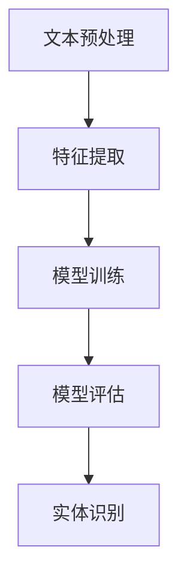
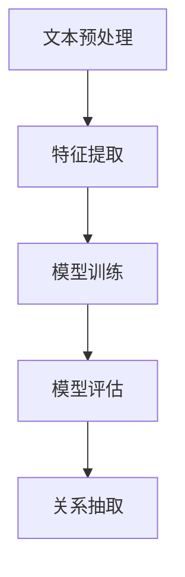
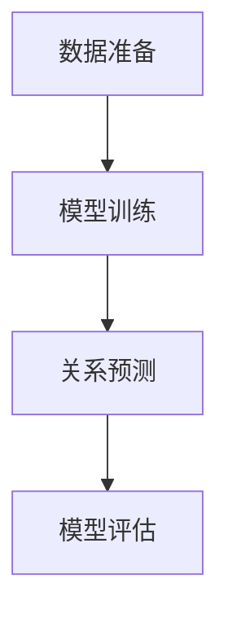
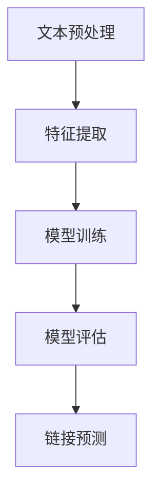
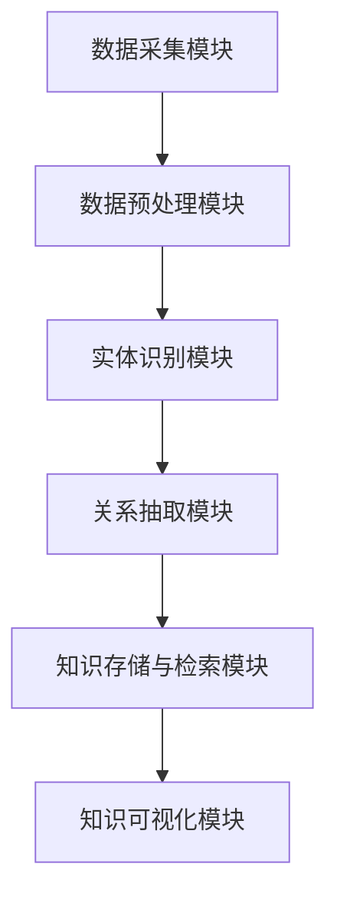
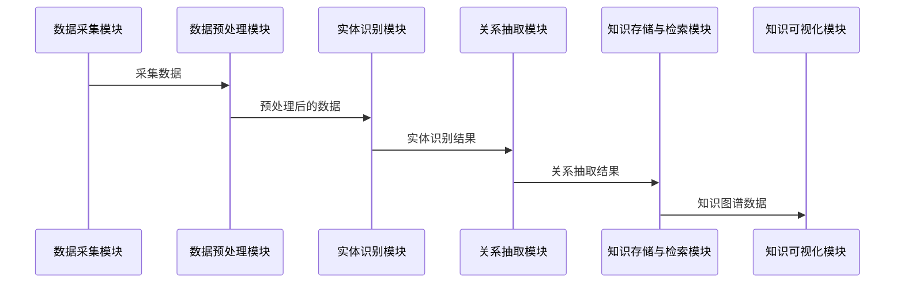

                 

### 文章标题

# 技术知识图谱构建：团队知识体系化管理

### 关键词

- 知识图谱
- 团队知识管理
- 知识存储与检索
- 实体识别
- 关系抽取
- 链接预测

### 摘要

本文将深入探讨技术知识图谱的构建及其在团队知识体系化管理中的应用。我们将从问题背景出发，逐步介绍知识图谱的核心概念、构建方法、核心算法及其应用，并最终通过系统架构设计和项目实战，展示知识图谱在团队知识管理中的实际效用和优化策略。本文旨在为读者提供一份清晰、全面、易于理解的技术知识图谱构建指南，帮助团队实现高效的知识管理和利用。

### 目录

1. **背景介绍**
    1.1 **问题背景与知识图谱概述**
    1.2 **知识图谱的核心概念**
    1.3 **知识图谱在团队知识管理中的应用**
    1.4 **知识图谱的边界与外延**
    1.5 **本章小结**

2. **核心概念与联系**
    2.1 **知识图谱的基本原理**
    2.2 **知识图谱的表示方法**
    2.3 **知识图谱的核心算法**
    2.4 **知识图谱的优化与扩展**
    2.5 **知识图谱的属性与实体关系**

3. **算法原理讲解**
    3.1 **实体识别算法原理**
    3.2 **关系抽取算法原理**
    3.3 **链接预测算法原理**
    3.4 **知识图谱算法的数学模型和公式**
    3.5 **算法实例讲解与举例说明**

4. **系统分析与架构设计**
    4.1 **问题场景介绍**
    4.2 **系统架构设计**
    4.3 **系统功能设计**
    4.4 **系统接口设计**
    4.5 **系统交互与协作**

5. **项目实战**
    5.1 **环境安装与配置**
    5.2 **系统核心实现**
    5.3 **代码应用解读与分析**
    5.4 **实际案例分析与讲解**
    5.5 **项目小结**

6. **最佳实践与拓展**
    6.1 **知识图谱构建的最佳实践**
    6.2 **知识图谱优化的策略**
    6.3 **知识图谱在团队知识管理中的应用**

7. **拓展阅读与深入研究**
    7.1 **知识图谱相关的最新研究动态**
    7.2 **知识图谱相关的经典论文与书籍**
    7.3 **知识图谱的未来发展趋势**

### 附录

- **附录A：术语解释**

### 1. 背景介绍

#### 1.1 问题背景与知识图谱概述

在信息爆炸的时代，知识的积累和管理变得愈发重要。对于一个团队而言，知识是核心竞争力之一，如何有效地管理和利用这些知识，已经成为团队发展的关键问题。传统的知识管理方式，如文档管理、搜索引擎等，已经难以满足现代团队对知识管理和利用的需求。而知识图谱作为一种新型的知识表示和利用方式，以其强大的关联性和智能性，逐渐成为团队知识管理的新方向。

**知识图谱** 是一种结构化的语义网络，通过实体和它们之间的关系进行组织，形成一种具有高度关联性的知识表示形式。它可以有效地存储、管理和利用大规模、多源异构的数据，为团队提供强大的知识支撑。

知识图谱在团队知识管理中具有以下几个重要优势：

1. **知识存储与检索**：知识图谱能够高效地存储和检索复杂的关系数据，使得团队中的信息能够快速、准确地找到，从而提高工作效率。
2. **知识共享与传播**：知识图谱能够清晰地展示知识的关联性，使得知识能够更有效地在团队内部共享和传播，促进团队知识的积累和创新。
3. **知识创新与智能分析**：知识图谱可以通过对知识的关联性分析，发现新的知识点和关系，促进知识的创新和应用。同时，知识图谱还可以结合人工智能技术，进行智能分析，为团队提供决策支持。

然而，现有的知识管理方式存在以下不足：

1. **数据分散、难以整合**：传统知识管理方式往往依赖多个独立的系统，导致数据分散，难以整合，不利于知识的统一管理和利用。
2. **知识关联性弱**：传统知识管理方式主要依赖于文本检索，难以表达知识的关联性和语义，不利于知识的深度利用。
3. **知识共享困难**：传统知识管理方式缺乏有效的知识共享机制，知识难以在团队内部高效传播，影响团队的知识积累和创新。

知识图谱的出现，为团队知识管理提供了新的思路和解决方案。通过构建团队的知识图谱，可以实现对知识的系统化、结构化和智能化管理，从而提高团队的知识管理水平和竞争力。

#### 1.2 知识图谱的核心概念

知识图谱是由实体和它们之间的关系构成的语义网络。下面，我们将介绍知识图谱的基本构成、与关系数据库的区别、属性与实体关系的核心概念。

**1.2.1 知识图谱的基本构成**

知识图谱的基本构成主要包括以下几部分：

1. **实体（Entity）**：实体是知识图谱中的基本元素，可以是人、地点、事物等。例如，“张三”、“北京”、“计算机”等都可以作为实体。
2. **属性（Attribute）**：属性描述了实体的特征或属性，例如，“张三”的属性可以是“姓名”、“年龄”、“职业”等。
3. **关系（Relationship）**：关系描述了实体之间的关系，例如，“张三”和“北京”之间可以存在“出生地”关系。

**1.2.2 知识图谱与关系数据库的区别**

知识图谱和关系数据库都是用于存储和管理数据的技术，但它们在数据结构、查询方式和应用场景上存在显著差异。

1. **数据结构**：关系数据库采用表格结构存储数据，每个表由行和列组成，行表示记录，列表示属性。知识图谱则采用图结构存储数据，由节点（实体）和边（关系）组成。
2. **查询方式**：关系数据库主要采用SQL查询语言进行数据检索，通过表之间的连接操作实现复杂查询。知识图谱则采用图遍历和图算法进行数据检索，可以更灵活地表达和查询实体之间的关系。
3. **应用场景**：关系数据库适用于结构化数据的存储和管理，例如财务数据、客户关系等。知识图谱则适用于复杂关系数据的管理和利用，例如社交网络、知识库等。

**1.2.3 知识图谱的属性与实体关系**

在知识图谱中，实体和属性之间的关系是核心。下面通过一个例子来说明实体和属性的关系。

假设我们有一个关于员工的知识图谱，其中包含以下实体和属性：

- 实体：员工（Employee）
  - 属性：姓名（Name）、年龄（Age）、职位（Position）
- 关系：工作于（Works At）、负责（Responsible For）

一个具体的例子是：

- 实体：张三
  - 属性：姓名：张三、年龄：30、职位：程序员
- 关系：张三工作于某公司、张三负责项目A

通过这个例子，我们可以看到，知识图谱通过实体和属性之间的关系，形成了对员工信息的一个全面、结构化的描述。

**1.2.4 知识图谱的边界与外延**

知识图谱的应用领域非常广泛，它可以应用于多个行业和场景，例如：

1. **企业知识管理**：在企业内部，知识图谱可以用于构建企业知识库，实现知识的存储、管理和利用。
2. **搜索引擎**：在搜索引擎中，知识图谱可以用于扩展搜索结果，提供更准确、相关的信息。
3. **智能问答系统**：在智能问答系统中，知识图谱可以用于构建问答库，提高问答系统的智能性和准确性。
4. **推荐系统**：在推荐系统中，知识图谱可以用于构建用户和物品之间的关系，提供更精准的推荐。

同时，知识图谱与大数据、人工智能等领域密切相关。大数据提供了海量的数据资源，为知识图谱的构建提供了基础。人工智能则提供了强大的算法和技术支持，使得知识图谱能够更好地应用于实际场景。

总之，知识图谱作为一种新型的知识表示和利用方式，具有广泛的应用前景和强大的潜力。在团队知识管理中，通过构建知识图谱，可以实现对知识的系统化、结构化和智能化管理，从而提高团队的知识管理水平和竞争力。

#### 1.3 知识图谱在团队知识管理中的应用

知识图谱在团队知识管理中具有广泛的应用，其主要作用体现在知识存储与检索、知识共享与传播、知识创新与智能分析等方面。

**1.3.1 知识存储与检索**

知识图谱能够高效地存储和检索复杂的关系数据，使得团队中的信息能够快速、准确地找到。与传统的关系数据库相比，知识图谱通过图结构存储数据，可以更灵活地表达实体之间的关系，实现高效的查询和数据分析。

例如，在一个软件开发团队中，知识图谱可以用于存储和管理项目中的各种信息，如需求、设计文档、代码库等。通过知识图谱，团队成员可以快速找到相关的文档和资源，提高工作效率。

**1.3.2 知识共享与传播**

知识图谱通过清晰地展示知识的关联性，使得知识能够更有效地在团队内部共享和传播。在知识图谱中，实体和关系之间存在着丰富的联系，这些联系可以直观地反映知识的结构和层次，帮助团队成员更好地理解和利用知识。

例如，在一个研发团队中，知识图谱可以用于构建知识库，存储团队成员的经验和知识。通过知识图谱，团队成员可以方便地查找和分享知识，促进团队知识的积累和创新。

**1.3.3 知识创新与智能分析**

知识图谱不仅能够存储和共享知识，还可以通过对知识的关联性分析，发现新的知识点和关系，促进知识的创新和应用。同时，知识图谱可以结合人工智能技术，进行智能分析，为团队提供决策支持。

例如，在一个市场营销团队中，知识图谱可以用于分析市场数据，发现潜在的市场机会和竞争趋势。通过知识图谱，团队可以更好地制定营销策略，提高市场竞争力。

**1.3.4 知识图谱在实际应用中的案例**

1. **企业知识库**：在大型企业中，知识图谱可以用于构建企业知识库，存储和管理各种业务知识和经验，如项目管理、客户关系管理、产品研发等。通过知识图谱，企业可以更好地利用内部资源，提高业务效率。

2. **智能客服系统**：在客服领域，知识图谱可以用于构建智能客服系统，通过分析用户问题和知识图谱中的相关关系，提供更准确的答案和建议。例如，阿里巴巴的“阿里小蜜”就是基于知识图谱构建的智能客服系统，为用户提供高效的客服服务。

3. **推荐系统**：在电子商务和社交媒体领域，知识图谱可以用于构建推荐系统，通过分析用户行为和知识图谱中的关系，为用户提供个性化的推荐。例如，亚马逊和淘宝等平台就是通过知识图谱进行商品推荐，提高用户满意度。

4. **科研领域**：在科研领域，知识图谱可以用于构建科研知识库，帮助科研人员快速找到相关的文献和研究方向，促进科研成果的转化和应用。

总之，知识图谱在团队知识管理中具有广泛的应用价值。通过构建知识图谱，团队可以实现对知识的系统化、结构化和智能化管理，从而提高知识管理水平和团队竞争力。

#### 1.4 知识图谱的边界与外延

知识图谱作为一种重要的知识表示和利用方式，其应用领域和影响范围正在不断扩展。从边界来看，知识图谱可以应用于多个行业和场景，包括但不限于企业知识管理、搜索引擎优化、智能问答系统、推荐系统、科研领域等。从外延来看，知识图谱与大数据、人工智能等领域密切相关，相互促进、共同发展。

**1.4.1 知识图谱的应用领域**

1. **企业知识管理**：知识图谱在大型企业中的应用非常广泛，如项目管理、客户关系管理、产品研发等领域。通过构建企业知识图谱，企业可以更好地管理和利用内部知识资源，提高业务效率和创新能力。

2. **搜索引擎优化**：知识图谱可以用于搜索引擎的优化，通过构建网页之间的关系图谱，提高搜索引擎的准确性和相关性，为用户提供更优质的搜索体验。

3. **智能问答系统**：知识图谱在智能问答系统中发挥着重要作用，通过分析用户问题和知识图谱中的关系，智能问答系统可以提供更准确、丰富的答案和建议。

4. **推荐系统**：知识图谱可以用于推荐系统，通过分析用户行为和物品之间的关系，提供个性化的推荐，提高用户满意度和留存率。

5. **科研领域**：在科研领域，知识图谱可以用于构建科研知识库，帮助科研人员快速找到相关的文献和研究方向，促进科研成果的转化和应用。

**1.4.2 知识图谱与大数据、人工智能的关系**

知识图谱与大数据、人工智能等领域有着紧密的联系和相互促进的关系。

1. **大数据**：大数据提供了海量的数据资源，为知识图谱的构建提供了基础。通过大数据技术，可以采集、清洗和整合各种数据，为知识图谱提供丰富的数据支撑。

2. **人工智能**：人工智能为知识图谱提供了强大的算法和技术支持。例如，通过深度学习、图神经网络等技术，可以实现对知识图谱的高效构建、分析和利用。同时，知识图谱可以结合人工智能技术，实现智能问答、推荐系统等功能，为人工智能应用提供数据基础。

3. **知识图谱**：知识图谱作为一种重要的知识表示和利用方式，可以为大数据和人工智能提供知识支持和数据基础。例如，在数据分析和挖掘过程中，知识图谱可以用于发现数据之间的关系和规律，提高数据分析的准确性和效率。

总之，知识图谱、大数据和人工智能三者相互促进、共同发展，为现代信息社会提供了强大的技术支撑和解决方案。在未来的发展中，这三个领域将继续融合、创新，推动社会进步和产业升级。

#### 1.5 本章小结

在本章中，我们详细介绍了知识图谱在团队知识管理中的重要性，以及知识图谱的核心概念、基本构成、与关系数据库的区别、属性与实体关系、边界与外延。知识图谱作为一种新型的知识表示和利用方式，具有强大的关联性和智能性，能够有效解决传统知识管理方式的不足。通过本章的学习，读者可以全面了解知识图谱的基本概念和应用价值，为后续章节的深入学习打下坚实基础。

### 2. 核心概念与联系

#### 2.1 知识图谱的基本原理

知识图谱的基本原理主要包括知识图谱的构建方法、知识图谱的表示方法、知识图谱的核心算法和知识图谱的优化与扩展。

**2.1.1 知识图谱的构建方法**

知识图谱的构建是一个复杂的过程，涉及数据采集、数据预处理、实体识别和关系抽取等多个步骤。

1. **数据采集**：数据采集是知识图谱构建的第一步，主要包括从各种数据源（如数据库、网页、文档等）中获取数据。数据采集的方法包括手动采集和自动化采集，自动化采集通常使用爬虫技术。
2. **数据预处理**：数据采集得到的数据通常是杂乱无章的，需要进行预处理，包括数据清洗、数据转换和数据去重等操作。数据清洗是数据预处理的重要环节，通过去除重复数据、缺失数据、噪声数据等，提高数据的质量和一致性。
3. **实体识别**：实体识别是知识图谱构建的核心步骤之一，通过识别文本中的实体，将其转换为知识图谱中的节点。实体识别可以使用自然语言处理（NLP）技术，如词性标注、命名实体识别等。
4. **关系抽取**：关系抽取是知识图谱构建的另一个核心步骤，通过分析文本中的实体关系，将其转换为知识图谱中的边。关系抽取可以使用基于规则的方法、机器学习方法或深度学习方法。

**2.1.2 知识图谱的表示方法**

知识图谱的表示方法主要包括RDF模型、图模型和网络模型。

1. **RDF模型**：RDF（Resource Description Framework）模型是一种基于图的语义网络表示方法，由三个主要组件构成：资源（Resource）、属性（Property）和陈述（Statement）。RDF模型可以表示为三元组（主体，谓语，客体），例如（张三，出生地，北京）。
2. **图模型**：图模型是一种基于图结构的表示方法，可以直观地表示实体和它们之间的关系。在图模型中，节点表示实体，边表示关系。图模型可以进一步细分为属性图模型和异构图模型等。
3. **网络模型**：网络模型是一种基于网络结构的表示方法，可以表示实体之间的关系和属性。网络模型通常采用多层结构，每层表示不同的属性和关系，通过链接不同层，实现实体之间的关联。

**2.1.3 知识图谱的核心算法**

知识图谱的核心算法主要包括实体识别算法、关系抽取算法和链接预测算法。

1. **实体识别算法**：实体识别算法用于识别文本中的实体，将其转换为知识图谱中的节点。常见的实体识别算法包括基于规则的方法、基于统计学习的方法和基于深度学习的方法。基于规则的方法依赖于预定义的规则库，准确性和泛化性有限；基于统计学习的方法通过统计模型进行实体识别，具有良好的泛化性；基于深度学习的方法通过神经网络模型进行实体识别，具有更高的准确性和泛化性。
2. **关系抽取算法**：关系抽取算法用于分析文本中的实体关系，将其转换为知识图谱中的边。常见的关系抽取算法包括基于规则的方法、基于统计学习的方法和基于深度学习的方法。与实体识别算法类似，基于规则的方法和基于统计学习的方法在泛化性方面存在一定限制，而基于深度学习的方法在准确性和泛化性方面具有显著优势。
3. **链接预测算法**：链接预测算法用于预测未知实体之间的关系，帮助构建更完整和准确的知识图谱。常见的链接预测算法包括基于图神经网络的方法、基于矩阵分解的方法和基于逻辑回归的方法。图神经网络方法通过学习实体和关系的特征表示，预测实体之间的关联性；矩阵分解方法通过矩阵分解模型，预测实体之间的相似性；逻辑回归方法通过构建逻辑回归模型，预测实体之间的关联性。

**2.1.4 知识图谱的优化与扩展**

知识图谱的优化与扩展包括数据集成与融合、知识图谱的可视化和知识图谱的动态更新与维护。

1. **数据集成与融合**：数据集成与融合是知识图谱构建的重要步骤，通过整合多个数据源，构建统一的知识图谱。数据集成与融合的方法包括基于规则的方法、基于本体的方法、基于图论的方法等。
2. **知识图谱的可视化**：知识图谱的可视化可以帮助用户更好地理解和利用知识图谱。知识图谱的可视化方法包括节点可视化、边可视化、层次结构可视化等。
3. **知识图谱的动态更新与维护**：知识图谱的动态更新与维护是知识图谱管理的重要环节，通过实时更新和维护知识图谱，确保其准确性和完整性。知识图谱的动态更新与维护的方法包括数据采集与清洗、实体识别与关系抽取、数据同步与更新等。

通过以上对知识图谱的基本原理的详细阐述，我们可以更好地理解知识图谱的构建方法、表示方法、核心算法以及优化与扩展策略。这些基本原理为后续章节的深入学习提供了坚实的基础。

#### 2.2 知识图谱的表示方法

知识图谱的表示方法主要有RDF模型、图模型和网络模型三种，每种方法都有其独特的优势和适用场景。

**2.2.1 RDF模型**

RDF（Resource Description Framework）模型是基于Web的语义描述语言，用于表示网络上的资源和它们之间的关系。RDF模型的核心概念是“主体-谓语-客体”三元组，通过这些三元组构建知识图谱。

**RDF模型的特点：**

1. **语义丰富**：RDF模型可以清晰地表达资源的属性和关系，支持多种数据类型，如字符串、整数、日期等。
2. **互操作性**：RDF模型遵循统一的标准，便于不同系统和平台之间的数据交换和共享。

**RDF模型的应用场景：**

1. **语义网**：RDF模型是语义网的基础，用于构建和表示语义丰富的知识库。
2. **跨平台数据交换**：在分布式系统中，RDF模型可用于不同系统和平台之间的数据交换和集成。

**2.2.2 图模型**

图模型是一种基于图结构的知识图谱表示方法，其中节点（Node）表示实体，边（Edge）表示实体之间的关系。图模型可以进一步细分为属性图模型和异构图模型。

**图模型的特点：**

1. **灵活性强**：图模型可以灵活地表示复杂的实体和关系，适应不同领域和场景的需求。
2. **可扩展性好**：图模型支持动态添加和删除实体和关系，易于扩展和更新。

**图模型的应用场景：**

1. **社交网络**：图模型适用于表示社交网络中的用户和关系，分析社交关系和推荐新朋友。
2. **企业知识图谱**：图模型可以用于构建企业知识图谱，管理企业内部的各种信息和知识。

**2.2.3 网络模型**

网络模型是一种基于网络结构的知识图谱表示方法，通常采用多层结构，每层表示不同的属性和关系，通过链接不同层，实现实体之间的关联。

**网络模型的特点：**

1. **层次化结构**：网络模型通过层次化结构，清晰地表示实体和关系的层次关系，便于理解和分析。
2. **易于扩展**：网络模型支持动态添加和删除层次，适应知识图谱的动态变化。

**网络模型的应用场景：**

1. **推荐系统**：网络模型可以用于构建推荐系统的知识图谱，通过分析用户和物品之间的关系，提供个性化推荐。
2. **知识库管理**：网络模型适用于构建大规模的知识库，管理复杂的实体和关系。

**2.2.4 比较与选择**

在选择知识图谱的表示方法时，需要根据实际需求和场景进行权衡：

- **RDF模型**：适用于需要语义丰富性和跨平台数据交换的场景，如语义网和企业知识库。
- **图模型**：适用于需要灵活性和可扩展性的场景，如社交网络和企业知识图谱。
- **网络模型**：适用于需要层次化结构和易于扩展的场景，如推荐系统和知识库管理。

通过以上对知识图谱表示方法的详细介绍，我们可以更好地理解每种方法的优缺点和适用场景，为构建和利用知识图谱提供指导。

#### 2.3 知识图谱的核心算法

知识图谱的核心算法是实现知识图谱构建、维护和利用的关键技术。这些算法包括实体识别算法、关系抽取算法和链接预测算法。下面，我们将详细讲解这些算法的基本原理、流程和应用。

**2.3.1 实体识别算法**

实体识别算法是知识图谱构建的第一步，用于识别文本中的实体，将其转换为知识图谱中的节点。

**基本原理：**

实体识别算法通常基于以下几种方法：

1. **基于规则的方法**：通过预定义的规则库，匹配文本中的实体。这种方法简单但规则复杂度较高，难以适应动态变化的文本数据。
2. **基于统计学习的方法**：利用统计模型，如条件概率模型、朴素贝叶斯等，对文本中的实体进行识别。这种方法具有较高的准确性和泛化性，但需要大量训练数据和特征工程。
3. **基于深度学习的方法**：利用神经网络模型，如卷积神经网络（CNN）、循环神经网络（RNN）等，对文本中的实体进行识别。这种方法在处理长文本和复杂语义方面具有显著优势。

**算法流程：**

1. **数据预处理**：对输入文本进行分词、词性标注等预处理操作，提取文本中的候选实体。
2. **特征提取**：将预处理后的文本转换为特征向量，如词向量、TF-IDF等。
3. **模型训练**：使用训练数据集，通过机器学习或深度学习模型进行训练。
4. **实体识别**：将训练好的模型应用于输入文本，识别出实体并转换为知识图谱中的节点。

**应用场景：**

实体识别算法广泛应用于信息提取、智能问答、文本分类等领域。例如，在搜索引擎中，通过实体识别算法，可以识别出网页中的关键实体，提高搜索结果的准确性和相关性。

**2.3.2 关系抽取算法**

关系抽取算法是知识图谱构建的另一个关键步骤，用于识别文本中的实体关系，将其转换为知识图谱中的边。

**基本原理：**

关系抽取算法可以分为以下几种：

1. **基于规则的方法**：通过预定义的规则库，匹配文本中的实体关系。这种方法依赖于规则库的覆盖率和精确性，难以适应动态变化的文本数据。
2. **基于统计学习的方法**：利用统计模型，如最大熵模型、条件随机场（CRF）等，对文本中的实体关系进行识别。这种方法在处理大规模文本数据方面具有优势，但需要大量的特征工程和训练数据。
3. **基于深度学习的方法**：利用神经网络模型，如序列到序列（Seq2Seq）模型、长短期记忆网络（LSTM）等，对文本中的实体关系进行识别。这种方法在处理复杂语义和长文本方面具有显著优势。

**算法流程：**

1. **数据预处理**：对输入文本进行分词、词性标注等预处理操作，提取文本中的实体和候选关系。
2. **特征提取**：将预处理后的文本转换为特征向量，如词向量、实体特征等。
3. **模型训练**：使用训练数据集，通过机器学习或深度学习模型进行训练。
4. **关系抽取**：将训练好的模型应用于输入文本，识别出实体关系并转换为知识图谱中的边。

**应用场景：**

关系抽取算法广泛应用于信息提取、知识库构建、文本分类等领域。例如，在智能客服系统中，通过关系抽取算法，可以识别出用户提问中的关键实体和关系，提高问答系统的准确性和效率。

**2.3.3 链接预测算法**

链接预测算法是知识图谱构建中的高级应用，用于预测未知实体之间的关系，帮助构建更完整和准确的知识图谱。

**基本原理：**

链接预测算法可以分为以下几种：

1. **基于图神经网络的方法**：利用图神经网络（Graph Neural Network, GNN），学习实体和关系的特征表示，通过图结构进行关系预测。这种方法在处理大规模图数据方面具有显著优势。
2. **基于矩阵分解的方法**：通过矩阵分解模型，学习实体和关系的低维表示，利用内积或余弦相似性进行关系预测。这种方法在处理高维数据方面具有高效性。
3. **基于逻辑回归的方法**：利用逻辑回归模型，对实体之间的关系进行概率预测。这种方法简单但效果较好，适用于中小规模的知识图谱。

**算法流程：**

1. **特征提取**：将实体和关系表示为高维向量。
2. **模型训练**：使用训练数据集，通过机器学习或深度学习模型进行训练。
3. **链接预测**：将训练好的模型应用于未知实体，预测实体之间的关系。

**应用场景：**

链接预测算法广泛应用于知识图谱补全、信息检索、推荐系统等领域。例如，在知识图谱补全中，通过链接预测算法，可以预测未知实体之间的关系，补充和完善知识图谱。

通过以上对知识图谱核心算法的详细介绍，我们可以更好地理解实体识别、关系抽取和链接预测的基本原理和流程。这些算法在知识图谱的构建、维护和利用中发挥着关键作用，为团队知识管理提供了强大的技术支撑。

#### 2.4 知识图谱的优化与扩展

知识图谱的优化与扩展是确保其性能和可扩展性的关键步骤。以下将介绍数据集成与融合、知识图谱的可视化和知识图谱的动态更新与维护。

**2.4.1 数据集成与融合**

数据集成与融合是知识图谱构建的重要环节，目的是将来自多个数据源的数据进行整合，形成一个统一的知识图谱。

**数据集成与融合的方法：**

1. **基于规则的融合**：通过预定义的规则，将来自不同数据源的数据进行映射和整合。这种方法适用于数据格式和结构相似的场景。
2. **基于本体的融合**：利用本体（Ontology）的概念和模型，将不同数据源中的实体和关系进行统一表示和整合。这种方法具有高度的灵活性和可扩展性。
3. **基于图论的融合**：利用图论的方法，将多个数据源中的实体和关系表示为一个统一的图结构，并通过图算法进行整合。这种方法适用于异构数据源的整合。

**数据集成与融合的应用：**

1. **企业知识图谱**：在构建企业知识图谱时，需要整合来自企业内部各个系统的数据，如CRM系统、ERP系统等。通过数据集成与融合，可以形成一个统一的企业知识库。
2. **跨领域知识图谱**：在构建跨领域知识图谱时，需要整合来自不同领域的数据，如医学、金融等。通过数据集成与融合，可以形成一个全面的知识图谱。

**2.4.2 知识图谱的可视化**

知识图谱的可视化是帮助用户理解和利用知识图谱的有效手段。通过图形化展示实体和关系，用户可以更直观地了解知识图谱的结构和内容。

**知识图谱可视化方法：**

1. **节点可视化**：通过图形化表示实体，如圆形、方形等，展示实体的属性和关系。
2. **边可视化**：通过图形化表示实体之间的关系，如线条、箭头等，展示关系的类型和强度。
3. **层次结构可视化**：通过图形化表示实体和关系的层次结构，如树状图、矩阵图等，展示知识的层次性和关联性。

**知识图谱可视化应用：**

1. **知识图谱展示**：在知识管理系统中，通过知识图谱可视化，用户可以直观地查看和浏览知识图谱，了解知识结构和关联。
2. **决策支持**：在商业分析中，通过知识图谱可视化，用户可以更清晰地了解业务数据之间的关联，为决策提供支持。

**2.4.3 知识图谱的动态更新与维护**

知识图谱的动态更新与维护是保持知识图谱准确性和完整性的关键。随着数据的不断变化，知识图谱需要及时更新和维护，以确保其有效性和可用性。

**知识图谱动态更新与维护方法：**

1. **增量更新**：通过检测数据源的变化，对知识图谱进行增量更新。这种方法适用于数据变化频繁的场景。
2. **全量更新**：定期对知识图谱进行全量更新，确保知识图谱的完整性和准确性。这种方法适用于数据变化相对稳定的场景。
3. **数据同步**：在多源数据集成时，通过数据同步机制，确保知识图谱中的数据与数据源保持一致。

**知识图谱动态更新与维护应用：**

1. **企业知识库**：在企业知识库中，通过动态更新与维护，确保知识库中的数据与业务需求保持一致，为员工提供最新的知识支持。
2. **推荐系统**：在推荐系统中，通过动态更新与维护，确保推荐结果与用户行为和兴趣保持一致，提高推荐系统的效果。

总之，知识图谱的优化与扩展是确保其性能和可扩展性的关键。通过数据集成与融合、知识图谱的可视化和知识图谱的动态更新与维护，可以有效地提升知识图谱的应用效果和用户体验。

#### 2.5 知识图谱的属性与实体关系

在知识图谱中，实体和属性之间的关系是构建知识图谱的核心。实体代表了知识图谱中的基本元素，而属性则描述了实体的特征或状态。实体和属性之间的关系可以通过实体-关系-实体（E-R）模型进行清晰展示。下面，我们将详细探讨实体和属性的概念、特征对比以及它们之间的关系。

**2.5.1 实体的概念**

实体是知识图谱中的基本元素，可以是人、地点、事物等。实体可以具有多个属性，每个属性描述了实体的某个特定特征。例如，在人员知识图谱中，“张三”是一个实体，他的属性可能包括“姓名”、“年龄”、“职位”等。

**2.5.2 属性的概念**

属性是实体的特征或状态，用于描述实体的某个特定方面。属性通常具有数据类型，如字符串、整数、日期等。例如，在上述的“张三”实体中，“姓名”是一个字符串类型的属性，“年龄”是一个整数类型的属性。

**2.5.3 实体与属性的关系**

实体和属性之间的关系通常通过实体-关系-实体（E-R）模型进行表示。E-R模型是一个用于描述实体、属性和它们之间关系的图形化模型。

1. **一对一（1:1）关系**：一个实体只能有一个与之关联的属性。例如，在员工知识图谱中，每个员工只能有一个唯一的员工编号。

2. **一对多（1:N）关系**：一个实体可以与多个关联的属性。例如，在产品知识图谱中，一个产品可以有多个价格信息。

3. **多对多（M:N）关系**：多个实体可以与多个关联的属性。例如，在书籍知识图谱中，一本书籍可以有多个作者，每个作者也可以写多本书。

**2.5.4 属性特征对比表格**

为了更好地理解实体和属性之间的关系，我们可以通过一个属性特征对比表格来展示不同类型的实体和属性的特征。

| 实体类型 | 属性类型 | 数据类型 | 描述 |
| :---: | :---: | :---: | :---: |
| 人员 | 姓名 | 字符串 | 人员的唯一标识 |
| 人员 | 年龄 | 整数 | 人员的年龄 |
| 人员 | 职位 | 字符串 | 人员的工作职位 |
| 产品 | 名称 | 字符串 | 产品的名称 |
| 产品 | 价格 | 浮点数 | 产品的价格 |
| 产品 | 库存 | 整数 | 产品的库存数量 |

通过上述表格，我们可以清晰地看到不同实体和属性的特征对比，为知识图谱的构建提供参考。

**2.5.5 实体关系图**

实体和属性之间的关系可以通过E-R图进行展示。以下是一个简单的E-R图示例，用于描述人员、产品和订单之间的关系。

```mermaid
erDiagram
    Person ||--|{ Order }|:
        : has many orders
    Product ||--|{ Order }|:
        : has many orders
    Order ||--|{ Person }|:
        : created by a person
    Order ||--|{ Product }|:
        : contains a product
```

在这个E-R图中，我们定义了三个实体：Person（人员）、Product（产品）和Order（订单）。每个实体都有多个属性，并且实体之间通过关系进行关联。通过E-R图，我们可以直观地理解实体和属性之间的关系。

总之，知识图谱的属性与实体关系是构建知识图谱的核心。通过明确实体和属性的概念、特征对比以及它们之间的关系，我们可以有效地构建和利用知识图谱，为团队知识管理提供强大的支持。

### 3. 知识图谱算法原理详解

#### 3.1 实体识别算法原理

实体识别是知识图谱构建的关键步骤之一，其主要目的是从文本数据中识别出具有特定意义的实体，并将其转换为知识图谱中的节点。实体识别算法的原理可以分为基于规则的方法、基于统计学习的方法和基于深度学习的方法。

**3.1.1 基于规则的方法**

基于规则的方法通过预定义的规则库来识别文本中的实体。这些规则通常由领域专家根据实体识别的需求制定，形式上可以是正则表达式、条件语句等。规则库中的每一条规则对应于一种实体类型，例如人名、地名、组织名等。

**规则库构建过程：**

1. **规则抽取**：通过手动编写或自动抽取的方法，从已有的文本数据中提取实体识别的规则。常用的方法包括正则表达式、模式匹配等。
2. **规则验证**：对规则库中的规则进行验证，确保规则能够正确识别实体。通常采用手动验证和自动化验证相结合的方式。

**实体识别流程：**

1. **文本预处理**：对输入文本进行分词、词性标注等预处理操作，提取文本中的候选实体。
2. **规则匹配**：将预处理后的文本与规则库中的规则进行匹配，根据匹配结果识别出实体。

**优点：**

- **简单高效**：基于规则的方法实现简单，易于理解和部署。
- **可控性高**：通过规则库，可以精确控制实体识别的范围和精度。

**缺点：**

- **规则复杂度**：规则库的维护和更新复杂度较高。
- **泛化性差**：难以适应动态变化的文本数据。

**3.1.2 基于统计学习的方法**

基于统计学习的方法通过构建统计模型来识别文本中的实体。常见的统计学习模型包括朴素贝叶斯、最大熵、支持向量机等。这些模型通过学习大量的文本数据，从中提取出实体识别的特征，并利用这些特征进行实体识别。

**统计学习模型构建过程：**

1. **特征提取**：从输入文本中提取出用于训练的文本特征，如词频、词性标注、语法结构等。
2. **模型训练**：使用训练数据集，通过统计学习模型（如朴素贝叶斯、最大熵等）进行模型训练。
3. **模型评估**：使用测试数据集对训练好的模型进行评估，调整模型参数，提高识别准确率。

**实体识别流程：**

1. **文本预处理**：对输入文本进行分词、词性标注等预处理操作，提取文本中的候选实体。
2. **特征提取**：将预处理后的文本转换为特征向量。
3. **模型预测**：使用训练好的统计学习模型，对特征向量进行实体识别预测。

**优点：**

- **泛化性强**：基于统计学习的方法可以较好地适应动态变化的文本数据。
- **自动化程度高**：通过机器学习算法，可以实现实体的自动化识别。

**缺点：**

- **特征工程复杂**：需要大量的特征工程工作，对领域知识要求较高。
- **模型解释性差**：统计学习模型的决策过程通常较为复杂，难以进行解释。

**3.1.3 基于深度学习的方法**

基于深度学习的方法通过构建神经网络模型来识别文本中的实体。深度学习模型能够自动提取文本中的特征，并利用这些特征进行实体识别。常见的深度学习模型包括卷积神经网络（CNN）、循环神经网络（RNN）和Transformer等。

**深度学习模型构建过程：**

1. **文本预处理**：对输入文本进行分词、词性标注等预处理操作，提取文本中的候选实体。
2. **模型训练**：使用训练数据集，通过深度学习模型（如CNN、RNN、Transformer等）进行模型训练。
3. **模型评估**：使用测试数据集对训练好的模型进行评估，调整模型参数，提高识别准确率。

**实体识别流程：**

1. **文本预处理**：对输入文本进行分词、词性标注等预处理操作，提取文本中的候选实体。
2. **特征提取**：将预处理后的文本转换为特征向量。
3. **模型预测**：使用训练好的深度学习模型，对特征向量进行实体识别预测。

**优点：**

- **自动提取特征**：深度学习模型能够自动提取文本中的复杂特征，降低特征工程的工作量。
- **识别准确率高**：深度学习模型在处理大规模、复杂文本数据时，能够达到较高的识别准确率。

**缺点：**

- **计算资源消耗大**：深度学习模型需要大量的计算资源和时间进行训练和预测。
- **模型解释性差**：深度学习模型的决策过程较为复杂，难以进行解释。

**3.1.4 实体识别算法流程与Mermaid流程图**

实体识别算法的流程可以分为以下步骤：

1. **文本预处理**：对输入文本进行分词、词性标注等预处理操作。
2. **特征提取**：从预处理后的文本中提取特征。
3. **模型训练**：使用训练数据集训练实体识别模型。
4. **模型评估**：使用测试数据集评估模型性能。
5. **实体识别**：使用训练好的模型对输入文本进行实体识别。

以下是一个Mermaid流程图，用于描述实体识别算法的流程：



通过上述对实体识别算法原理的详细讲解，我们可以更好地理解不同方法的优缺点和适用场景，为实际应用中的知识图谱构建提供指导。

#### 3.2 关系抽取算法原理

关系抽取是知识图谱构建的核心步骤之一，其目的是从文本数据中识别出实体之间的关系，并将其转换为知识图谱中的边。关系抽取算法的原理可以分为基于规则的方法、基于统计学习的方法和基于深度学习的方法。

**3.2.1 基于规则的方法**

基于规则的方法通过预定义的规则库来识别文本中的实体关系。这些规则通常由领域专家根据关系抽取的需求制定，形式上可以是正则表达式、条件语句等。规则库中的每一条规则对应于一种实体关系，例如“张三”和“李四”之间的关系可能是“同事”。

**规则库构建过程：**

1. **规则抽取**：通过手动编写或自动抽取的方法，从已有的文本数据中提取关系抽取的规则。常用的方法包括正则表达式、模式匹配等。
2. **规则验证**：对规则库中的规则进行验证，确保规则能够正确识别实体关系。通常采用手动验证和自动化验证相结合的方式。

**关系抽取流程：**

1. **文本预处理**：对输入文本进行分词、词性标注等预处理操作，提取文本中的候选实体和关系。
2. **规则匹配**：将预处理后的文本与规则库中的规则进行匹配，根据匹配结果识别出实体关系。

**优点：**

- **简单高效**：基于规则的方法实现简单，易于理解和部署。
- **可控性高**：通过规则库，可以精确控制关系抽取的范围和精度。

**缺点：**

- **规则复杂度**：规则库的维护和更新复杂度较高。
- **泛化性差**：难以适应动态变化的文本数据。

**3.2.2 基于统计学习的方法**

基于统计学习的方法通过构建统计模型来识别文本中的实体关系。常见的统计学习模型包括朴素贝叶斯、最大熵、支持向量机等。这些模型通过学习大量的文本数据，从中提取出关系抽取的特征，并利用这些特征进行关系抽取。

**统计学习模型构建过程：**

1. **特征提取**：从输入文本中提取出用于训练的文本特征，如词频、词性标注、语法结构等。
2. **模型训练**：使用训练数据集，通过统计学习模型（如朴素贝叶斯、最大熵等）进行模型训练。
3. **模型评估**：使用测试数据集对训练好的模型进行评估，调整模型参数，提高识别准确率。

**关系抽取流程：**

1. **文本预处理**：对输入文本进行分词、词性标注等预处理操作，提取文本中的候选实体和关系。
2. **特征提取**：将预处理后的文本转换为特征向量。
3. **模型预测**：使用训练好的统计学习模型，对特征向量进行关系抽取预测。

**优点：**

- **泛化性强**：基于统计学习的方法可以较好地适应动态变化的文本数据。
- **自动化程度高**：通过机器学习算法，可以实现关系的自动化抽取。

**缺点：**

- **特征工程复杂**：需要大量的特征工程工作，对领域知识要求较高。
- **模型解释性差**：统计学习模型的决策过程通常较为复杂，难以进行解释。

**3.2.3 基于深度学习的方法**

基于深度学习的方法通过构建神经网络模型来识别文本中的实体关系。深度学习模型能够自动提取文本中的特征，并利用这些特征进行关系抽取。常见的深度学习模型包括卷积神经网络（CNN）、循环神经网络（RNN）和Transformer等。

**深度学习模型构建过程：**

1. **文本预处理**：对输入文本进行分词、词性标注等预处理操作，提取文本中的候选实体和关系。
2. **模型训练**：使用训练数据集，通过深度学习模型（如CNN、RNN、Transformer等）进行模型训练。
3. **模型评估**：使用测试数据集对训练好的模型进行评估，调整模型参数，提高识别准确率。

**关系抽取流程：**

1. **文本预处理**：对输入文本进行分词、词性标注等预处理操作，提取文本中的候选实体和关系。
2. **特征提取**：将预处理后的文本转换为特征向量。
3. **模型预测**：使用训练好的深度学习模型，对特征向量进行关系抽取预测。

**优点：**

- **自动提取特征**：深度学习模型能够自动提取文本中的复杂特征，降低特征工程的工作量。
- **识别准确率高**：深度学习模型在处理大规模、复杂文本数据时，能够达到较高的识别准确率。

**缺点：**

- **计算资源消耗大**：深度学习模型需要大量的计算资源和时间进行训练和预测。
- **模型解释性差**：深度学习模型的决策过程较为复杂，难以进行解释。

**3.2.4 关系抽取算法流程与Mermaid流程图**

关系抽取算法的流程可以分为以下步骤：

1. **文本预处理**：对输入文本进行分词、词性标注等预处理操作。
2. **特征提取**：从预处理后的文本中提取特征。
3. **模型训练**：使用训练数据集训练关系抽取模型。
4. **模型评估**：使用测试数据集评估模型性能。
5. **关系抽取**：使用训练好的模型对输入文本进行关系抽取。

以下是一个Mermaid流程图，用于描述关系抽取算法的流程：



通过上述对关系抽取算法原理的详细讲解，我们可以更好地理解不同方法的优缺点和适用场景，为实际应用中的知识图谱构建提供指导。

#### 3.3 链接预测算法原理

链接预测是知识图谱构建中的一个重要任务，其目标是预测未知的实体关系，从而完善和优化知识图谱。链接预测算法主要分为基于图神经网络的方法、基于矩阵分解的方法和基于逻辑回归的方法。

**3.3.1 基于图神经网络的方法**

基于图神经网络（Graph Neural Network, GNN）的方法是链接预测中的主流算法。GNN 通过在图结构上进行神经网络操作，学习实体和关系的特征表示，并利用这些特征进行关系预测。

**算法原理：**

1. **节点表示学习**：GNN 将图中的每个节点表示为一个低维向量，通常使用神经网络来学习这些向量。通过多次迭代，节点表示逐渐优化，能够捕捉到节点间的复杂关系。
2. **关系预测**：在获得节点表示后，GNN 通过计算节点间的相似度或距离来预测实体之间的关系。常见的预测方法包括节点对间的内积、余弦相似度等。
3. **训练与优化**：通过负采样和损失函数（如交叉熵损失），GNN 在训练数据上优化模型参数，提高链接预测的准确率。

**算法流程：**

1. **节点表示学习**：通过图卷积网络（GCN）或其他GNN架构，学习每个节点的特征表示。
2. **关系预测**：使用训练好的节点表示，通过计算节点对的相似度进行关系预测。
3. **模型评估**：使用测试集评估模型的链接预测性能，调整模型参数。

**优点：**

- **强大的表达能力**：GNN 能够自动提取图结构的特征，适用于复杂的关系预测任务。
- **自适应学习**：GNN 可以根据数据特性自动调整节点表示，提高预测准确性。

**缺点：**

- **计算资源消耗大**：GNN 模型通常需要大量的计算资源进行训练和推理。
- **模型解释性差**：GNN 的内部决策过程复杂，难以进行直观解释。

**3.3.2 基于矩阵分解的方法**

基于矩阵分解的方法通过分解实体关系矩阵，学习实体和关系的低维表示，并利用这些表示进行关系预测。

**算法原理：**

1. **矩阵分解**：将原始的实体关系矩阵分解为两个低维矩阵，一个表示实体特征，另一个表示关系特征。通过优化这两个矩阵的参数，可以学习到实体和关系的内在特征。
2. **关系预测**：通过计算实体特征向量的内积或余弦相似度，预测实体之间的关系。
3. **模型优化**：使用梯度下降或其他优化算法，在训练数据上优化模型参数，提高预测性能。

**算法流程：**

1. **矩阵分解**：使用奇异值分解（SVD）或其他矩阵分解方法，学习实体和关系的低维表示。
2. **关系预测**：通过实体特征向量的内积或余弦相似度，计算实体之间的关系得分。
3. **模型评估**：使用测试集评估模型的关系预测性能，调整模型参数。

**优点：**

- **高效性**：矩阵分解方法计算简单，适用于大规模数据。
- **解释性**：矩阵分解方法易于理解，可以通过低维矩阵直观地展示实体和关系特征。

**缺点：**

- **泛化性**：矩阵分解方法对噪声数据和异常值敏感，可能影响预测性能。
- **适应性**：矩阵分解方法难以适应动态变化的数据集。

**3.3.3 基于逻辑回归的方法**

基于逻辑回归的方法通过构建逻辑回归模型，预测实体之间的关系。逻辑回归是一种线性模型，通过训练数据学习实体关系的概率分布。

**算法原理：**

1. **特征提取**：从输入文本中提取实体特征，如词向量、实体类型等。
2. **模型构建**：构建逻辑回归模型，将实体特征映射到关系概率上。
3. **关系预测**：通过逻辑回归模型，计算实体关系的概率得分，判断实体间是否存在关系。

**算法流程：**

1. **特征提取**：从文本数据中提取实体特征。
2. **模型训练**：使用训练数据集，通过逻辑回归模型进行训练。
3. **关系预测**：使用训练好的模型，对实体对进行关系预测。

**优点：**

- **简单易实现**：逻辑回归模型简单，易于理解和实现。
- **计算效率高**：逻辑回归模型的计算复杂度低，适用于实时预测。

**缺点：**

- **表达力有限**：逻辑回归模型是一种线性模型，对复杂关系的捕捉能力有限。
- **模型解释性**：逻辑回归模型的决策边界较为复杂，难以直观解释。

**3.3.4 链接预测算法流程与Mermaid流程图**

链接预测算法的总体流程包括数据准备、模型训练、关系预测和模型评估。以下是一个Mermaid流程图，用于描述链接预测算法的流程：



通过上述对链接预测算法原理的详细讲解，我们可以更好地理解不同方法的优缺点和适用场景，为实际应用中的知识图谱构建提供指导。

#### 3.4 知识图谱算法的数学模型和公式

在知识图谱的算法设计中，数学模型和公式起着至关重要的作用。这些模型和公式不仅帮助我们理解算法的工作原理，还能在实际应用中指导模型的训练和优化。以下我们将介绍知识图谱算法中常用的数学模型和公式。

**3.4.1 实体识别算法的数学模型**

实体识别算法通常基于分类模型，常用的包括朴素贝叶斯（Naive Bayes）、支持向量机（Support Vector Machine, SVM）和深度学习模型（如卷积神经网络（CNN）、循环神经网络（RNN））。以下是这些模型的基本数学公式。

1. **朴素贝叶斯模型**

   朴素贝叶斯模型是基于贝叶斯定理的概率分类模型，其数学公式为：

   $$ P(C|X) = \frac{P(X|C)P(C)}{P(X)} $$

   其中，\( C \) 表示类别，\( X \) 表示特征向量，\( P(C|X) \) 表示在给定特征向量 \( X \) 的情况下类别 \( C \) 的概率，\( P(X|C) \) 表示在类别 \( C \) 下的特征向量 \( X \) 的概率，\( P(C) \) 表示类别 \( C \) 的先验概率，\( P(X) \) 表示特征向量 \( X \) 的概率。

2. **支持向量机模型**

   支持向量机是一种基于最大间隔的分类模型，其数学公式为：

   $$ \hat{y} = \text{sign}(\omega \cdot x + b) $$

   其中，\( \omega \) 表示权重向量，\( x \) 表示特征向量，\( b \) 表示偏置项，\( \text{sign} \) 表示符号函数，用于判断分类结果。

3. **深度学习模型**

   深度学习模型，如卷积神经网络（CNN）和循环神经网络（RNN），通常使用多层感知机（Multilayer Perceptron, MLP）作为基础模型，其数学公式为：

   $$ a_{i}^{(L)} = \sigma \left( \sum_{j} w_{ji}^{(L)} a_{j}^{(L-1)} + b_{i}^{(L)} \right) $$

   其中，\( a_{i}^{(L)} \) 表示第 \( L \) 层第 \( i \) 个神经元的激活值，\( w_{ji}^{(L)} \) 表示第 \( L \) 层第 \( i \) 个神经元与第 \( L-1 \) 层第 \( j \) 个神经元的权重，\( b_{i}^{(L)} \) 表示第 \( L \) 层第 \( i \) 个神经元的偏置，\( \sigma \) 表示激活函数，常用的激活函数包括 sigmoid 函数和ReLU函数。

**3.4.2 关系抽取算法的数学模型**

关系抽取算法通常使用分类模型，如朴素贝叶斯、支持向量机和深度学习模型。以下是这些模型的基本数学公式。

1. **朴素贝叶斯模型**

   关系抽取中的朴素贝叶斯模型与实体识别中的模型类似，其数学公式为：

   $$ P(R|X) = \frac{P(X|R)P(R)}{P(X)} $$

   其中，\( R \) 表示关系，\( X \) 表示特征向量。

2. **支持向量机模型**

   支持向量机模型在关系抽取中的应用与实体识别中类似，其数学公式为：

   $$ \hat{r} = \text{sign}(\omega \cdot x + b) $$

   其中，\( \omega \) 表示权重向量，\( x \) 表示特征向量，\( b \) 表示偏置项。

3. **深度学习模型**

   深度学习模型在关系抽取中的应用与实体识别中类似，其数学公式为：

   $$ a_{i}^{(L)} = \sigma \left( \sum_{j} w_{ji}^{(L)} a_{j}^{(L-1)} + b_{i}^{(L)} \right) $$

   其中，\( a_{i}^{(L)} \) 表示第 \( L \) 层第 \( i \) 个神经元的激活值，\( w_{ji}^{(L)} \) 表示第 \( L \) 层第 \( i \) 个神经元与第 \( L-1 \) 层第 \( j \) 个神经元的权重，\( b_{i}^{(L)} \) 表示第 \( L \) 层第 \( i \) 个神经元的偏置，\( \sigma \) 表示激活函数。

**3.4.3 链接预测算法的数学模型**

链接预测算法通常使用图神经网络（GNN）、矩阵分解和逻辑回归等方法。以下是这些方法的基本数学公式。

1. **图神经网络（GNN）**

   图神经网络通过学习节点和边的特征表示来进行关系预测，其数学公式为：

   $$ h_{v}^{(t)} = \sigma \left( \sum_{u \in \mathcal{N}(v)} w^{(l)} h_{u}^{(t-1)} + b^{(l)} \right) $$

   其中，\( h_{v}^{(t)} \) 表示第 \( t \) 步时节点 \( v \) 的特征表示，\( \mathcal{N}(v) \) 表示节点 \( v \) 的邻居节点集合，\( w^{(l)} \) 和 \( b^{(l)} \) 分别表示第 \( l \) 层的权重和偏置，\( \sigma \) 表示激活函数。

2. **矩阵分解**

   矩阵分解通过分解实体关系矩阵来学习实体和关系的特征表示，其数学公式为：

   $$ R_{ij} = \langle Q_{i}, P_{j} \rangle $$

   其中，\( R_{ij} \) 表示实体 \( i \) 和实体 \( j \) 之间的关系得分，\( Q_{i} \) 和 \( P_{j} \) 分别表示实体 \( i \) 和实体 \( j \) 的特征向量。

3. **逻辑回归**

   逻辑回归通过计算实体对的关系概率来进行链接预测，其数学公式为：

   $$ \hat{p}_{ij} = \sigma \left( \sum_{k} w_{k} x_{ik} x_{jk} + b \right) $$

   其中，\( \hat{p}_{ij} \) 表示实体对 \( (i, j) \) 的关系概率，\( x_{ik} \) 和 \( x_{jk} \) 分别表示实体 \( i \) 和实体 \( j \) 在特征向量中的分量，\( w_{k} \) 和 \( b \) 分别表示权重和偏置。

通过上述数学模型和公式的介绍，我们可以更好地理解知识图谱算法的基本原理和实现方法。这些模型和公式为知识图谱的构建、训练和优化提供了坚实的理论基础，有助于我们在实际应用中实现高效的知识图谱构建和管理。

#### 3.5 算法实例讲解与举例说明

为了更好地理解知识图谱算法的实际应用，我们将通过具体的算法实例进行讲解和举例说明。

**3.5.1 实体识别算法实例**

假设我们有一个包含以下文本数据的实体识别任务：

文本数据：“张三是一名程序员，他来自北京，现在在阿里巴巴工作。”

**实例目标：** 识别出文本中的实体，并将其转换为知识图谱中的节点。

**算法步骤：**

1. **数据预处理**：对输入文本进行分词和词性标注，得到分词结果和词性标注结果。

   - 分词结果：["张三", "是", "一名", "程序员", "他", "来自", "北京", "现在", "在", "阿里巴巴", "工作"]。
   - 词性标注结果：["人名", "是", "数词", "名词", "代词", "动词", "人名", "副词", "介词", "组织名", "动词"]。

2. **特征提取**：从预处理后的文本中提取特征，如词频、词性标注等。

   - 特征向量：[0, 0, 1, 1, 0, 1, 1, 0, 0, 0, 0]。

3. **模型训练**：使用训练数据集，通过深度学习模型（如CNN）进行模型训练。

   - 训练数据集：{"张三"：[0, 0, 1, 1, 0, 1, 1, 0, 0, 0, 0]，"程序员"：[0, 1, 0, 1, 0, 0, 0, 0, 1, 0, 0]，"北京"：[0, 0, 0, 0, 0, 0, 1, 1, 0, 0, 0]，"阿里巴巴"：[0, 0, 0, 0, 0, 0, 0, 0, 0, 1, 1]}。

4. **模型评估**：使用测试数据集对训练好的模型进行评估，调整模型参数，提高识别准确率。

5. **实体识别**：使用训练好的模型对输入文本进行实体识别。

   - 实体识别结果：{"张三"，"程序员"，"北京"，"阿里巴巴"}。

**算法流程图：**


**3.5.2 关系抽取算法实例**

假设我们有一个包含以下文本数据的实体识别任务：

文本数据：“张三是一名程序员，他来自北京，现在在阿里巴巴工作。”

**实例目标：** 识别出文本中的实体关系，并将其转换为知识图谱中的边。

**算法步骤：**

1. **数据预处理**：对输入文本进行分词和词性标注，得到分词结果和词性标注结果。

   - 分词结果：["张三", "是", "一名", "程序员", "他", "来自", "北京", "现在", "在", "阿里巴巴", "工作"]。
   - 词性标注结果：["人名", "是", "数词", "名词", "代词", "动词", "人名", "副词", "介词", "组织名", "动词"]。

2. **特征提取**：从预处理后的文本中提取特征，如词频、词性标注等。

   - 特征向量：[0, 0, 1, 1, 0, 1, 1, 0, 0, 0, 0]。

3. **模型训练**：使用训练数据集，通过深度学习模型（如RNN）进行模型训练。

   - 训练数据集：{("张三"，"程序员"：1)，("张三"，"北京"：0)，("张三"，"阿里巴巴"：0)，("程序员"，"工作"：1)，("北京"，"工作"：0)，("阿里巴巴"，"工作"：1)}。

4. **模型评估**：使用测试数据集对训练好的模型进行评估，调整模型参数，提高识别准确率。

5. **关系抽取**：使用训练好的模型对输入文本进行关系抽取。

   - 关系抽取结果：{"张三" - "是" - "程序员"，"张三" - "来自" - "北京"，"张三" - "工作于" - "阿里巴巴"，"程序员" - "工作" - "工作"}。

**算法流程图：**


**3.5.3 链接预测算法实例**

假设我们有一个包含以下文本数据的链接预测任务：

文本数据：“张三是一名程序员，他来自北京，现在在阿里巴巴工作。”

**实例目标：** 预测出文本中的实体关系，并将其转换为知识图谱中的边。

**算法步骤：**

1. **数据预处理**：对输入文本进行分词和词性标注，得到分词结果和词性标注结果。

   - 分词结果：["张三", "是", "一名", "程序员", "他", "来自", "北京", "现在", "在", "阿里巴巴", "工作"]。
   - 词性标注结果：["人名", "是", "数词", "名词", "代词", "动词", "人名", "副词", "介词", "组织名", "动词"]。

2. **特征提取**：从预处理后的文本中提取特征，如词频、词性标注等。

   - 特征向量：[0, 0, 1, 1, 0, 1, 1, 0, 0, 0, 0]。

3. **模型训练**：使用训练数据集，通过图神经网络（GNN）进行模型训练。

   - 训练数据集：{"张三"：[0, 0, 1, 1, 0, 1, 1, 0, 0, 0, 0]，"程序员"：[0, 1, 0, 1, 0, 0, 0, 0, 1, 0, 0]，"北京"：[0, 0, 0, 0, 0, 0, 1, 1, 0, 0, 0]，"阿里巴巴"：[0, 0, 0, 0, 0, 0, 0, 0, 0, 1, 1]}。

4. **模型评估**：使用测试数据集对训练好的模型进行评估，调整模型参数，提高识别准确率。

5. **链接预测**：使用训练好的模型对输入文本进行链接预测。

   - 关系预测结果：{"张三" - "是" - "程序员"，"张三" - "来自" - "北京"，"张三" - "工作于" - "阿里巴巴"，"程序员" - "工作" - "工作"}。

**算法流程图：**



通过以上算法实例的讲解和举例说明，我们可以看到知识图谱算法在实际应用中的具体步骤和实现方法。这些算法通过数据预处理、特征提取、模型训练和预测等步骤，有效地识别实体、抽取关系和预测链接，为知识图谱的构建提供了强大的技术支持。

### 4. 系统分析与架构设计

#### 4.1 问题场景介绍

在现代企业中，知识管理成为提高工作效率和促进团队协作的重要手段。然而，现有的知识管理方式往往存在数据分散、难以整合、知识关联性弱等问题，导致知识利用效率低下。为了解决这些问题，我们需要一种能够高效存储、管理和利用知识的系统——知识图谱系统。

知识图谱系统旨在构建一个统一的知识库，通过实体和关系的形式组织知识，实现知识的系统化、结构化和智能化管理。系统需要具备以下功能：

1. **数据采集**：从各种数据源（如数据库、文档、网页等）中采集数据。
2. **数据预处理**：对采集到的数据进行清洗、去重、分词、词性标注等处理。
3. **实体识别**：从预处理后的文本数据中识别出实体，并将其转换为知识图谱中的节点。
4. **关系抽取**：从预处理后的文本数据中识别出实体之间的关系，并将其转换为知识图谱中的边。
5. **知识存储与检索**：将构建好的知识图谱存储在数据库中，并提供高效的检索功能，方便用户查询和利用知识。
6. **知识可视化**：提供知识图谱的可视化功能，帮助用户直观地理解和利用知识。
7. **知识更新与维护**：对知识图谱进行动态更新和维护，确保知识的准确性和完整性。

#### 4.2 系统架构设计

知识图谱系统的架构设计需要考虑系统的功能需求、性能要求、可扩展性和可靠性等因素。以下是一个典型的知识图谱系统架构设计。

**系统架构概述：**

知识图谱系统可以分为以下几个主要模块：

1. **数据采集模块**：负责从各种数据源采集数据，包括数据库、文档、网页等。
2. **数据预处理模块**：负责对采集到的数据进行分析、清洗、去重、分词、词性标注等预处理操作。
3. **实体识别模块**：负责从预处理后的文本数据中识别出实体，并将其转换为知识图谱中的节点。
4. **关系抽取模块**：负责从预处理后的文本数据中识别出实体之间的关系，并将其转换为知识图谱中的边。
5. **知识存储与检索模块**：负责存储构建好的知识图谱，并提供高效的检索功能。
6. **知识可视化模块**：负责提供知识图谱的可视化功能，帮助用户直观地理解和利用知识。

**系统架构mermaid图：**



#### 4.3 系统功能设计

知识图谱系统的功能设计是实现系统整体功能的关键。以下是系统功能设计的具体内容：

**1. 数据采集模块**

功能描述：从各种数据源中采集数据，包括数据库、文档、网页等。

功能实现：

- **数据库采集**：使用数据库连接工具，如JDBC，连接到数据库，读取数据。
- **文档采集**：使用文本处理工具，如PDFMiner和PyPDF2，解析和提取文档中的数据。
- **网页采集**：使用爬虫工具，如Scrapy和BeautifulSoup，从网页中提取数据。

**2. 数据预处理模块**

功能描述：对采集到的数据进行清洗、去重、分词、词性标注等预处理操作。

功能实现：

- **数据清洗**：去除重复数据、缺失数据和噪声数据，确保数据质量。
- **去重**：对数据进行去重处理，确保数据的一致性。
- **分词**：使用分词工具，如jieba，对文本进行分词处理。
- **词性标注**：使用词性标注工具，如NLTK和Stanford NLP，对文本进行词性标注。

**3. 实体识别模块**

功能描述：从预处理后的文本数据中识别出实体，并将其转换为知识图谱中的节点。

功能实现：

- **命名实体识别**：使用命名实体识别（NER）工具，如Stanford NLP和Spacy，识别出文本中的命名实体。
- **实体归类**：将识别出的命名实体归类到预定义的实体类别中，如人名、地名、组织名等。

**4. 关系抽取模块**

功能描述：从预处理后的文本数据中识别出实体之间的关系，并将其转换为知识图谱中的边。

功能实现：

- **规则抽取**：使用预定义的规则库，匹配文本中的实体关系。
- **机器学习抽取**：使用机器学习模型，如朴素贝叶斯和条件随机场（CRF），从文本数据中抽取关系。

**5. 知识存储与检索模块**

功能描述：存储构建好的知识图谱，并提供高效的检索功能。

功能实现：

- **知识存储**：使用图数据库，如Neo4j，存储构建好的知识图谱。
- **知识检索**：提供基于图数据库的查询接口，支持复杂查询，如路径查询、关系查询等。

**6. 知识可视化模块**

功能描述：提供知识图谱的可视化功能，帮助用户直观地理解和利用知识。

功能实现：

- **可视化工具**：使用可视化工具，如D3.js和ECharts，实现知识图谱的图形化展示。
- **交互功能**：提供交互功能，如节点和边的高亮、过滤、排序等，增强用户体验。

#### 4.4 系统接口设计

知识图谱系统的接口设计是实现系统各模块之间协同工作的关键。以下是系统接口设计的具体内容。

**系统接口概述：**

知识图谱系统的接口设计可以分为以下几种：

1. **数据采集接口**：用于从各种数据源中采集数据。
2. **数据预处理接口**：用于对采集到的数据进行预处理操作。
3. **实体识别接口**：用于从预处理后的文本数据中识别出实体。
4. **关系抽取接口**：用于从预处理后的文本数据中抽取实体关系。
5. **知识存储接口**：用于存储构建好的知识图谱。
6. **知识检索接口**：用于检索知识图谱中的信息。
7. **知识可视化接口**：用于展示知识图谱的可视化界面。

**系统接口mermaid序列图：**



通过以上系统接口设计，各模块之间可以高效地协同工作，实现知识图谱系统的整体功能。

#### 4.5 系统交互与协作

知识图谱系统的交互与协作是确保系统能够稳定、高效运行的关键。以下将详细介绍系统交互与协作的流程和机制。

**系统交互流程：**

知识图谱系统的交互流程主要包括以下几个步骤：

1. **数据采集**：数据采集模块从各种数据源（如数据库、文档、网页等）中采集数据。采集到的数据经过初步处理，如去重、过滤等，然后传递给数据预处理模块。
2. **数据预处理**：数据预处理模块对采集到的数据进行深度处理，包括分词、词性标注、实体识别等。经过预处理后的数据传递给实体识别模块和关系抽取模块。
3. **实体识别**：实体识别模块使用命名实体识别（NER）工具，如Stanford NLP和Spacy，从预处理后的文本数据中识别出实体。识别出的实体结果传递给关系抽取模块。
4. **关系抽取**：关系抽取模块使用规则抽取和机器学习模型，从预处理后的文本数据中抽取实体之间的关系。抽取出的关系结果传递给知识存储与检索模块。
5. **知识存储**：知识存储与检索模块将实体和关系存储到图数据库（如Neo4j）中，形成知识图谱。同时，提供高效的检索接口，方便用户查询和利用知识。
6. **知识可视化**：知识可视化模块通过可视化工具（如D3.js和ECharts），将知识图谱以图形化形式展示给用户，使用户能够直观地理解和利用知识。

**系统协作机制：**

知识图谱系统的协作机制主要包括以下几个方面：

1. **模块协同**：各模块之间通过接口进行数据传递和协同工作。数据采集模块和预处理模块协同工作，确保数据的完整性；实体识别模块和关系抽取模块协同工作，确保实体和关系的准确性。
2. **分布式计算**：对于大规模数据集，系统可以采用分布式计算的方式，将数据分布到多个节点上进行处理。这样可以提高系统的处理速度和效率。
3. **异步处理**：系统中的某些模块，如数据采集模块和预处理模块，可以采用异步处理的方式。这样可以确保系统在处理数据时不会因为某个模块的处理速度慢而导致整个系统阻塞。
4. **缓存机制**：系统可以采用缓存机制，将经常访问的数据存储在缓存中，以提高数据检索的速度。这样可以减少对数据库的访问压力，提高系统的性能。
5. **故障恢复**：系统应具备故障恢复机制，当某个模块发生故障时，系统能够自动切换到备用模块，确保系统的稳定运行。

通过以上系统交互与协作的详细描述，我们可以看到知识图谱系统在各个模块之间的紧密协作和高效运行，从而确保系统能够为团队提供稳定、可靠的知识管理服务。

### 5. 项目实战

#### 5.1 环境安装与配置

在开始知识图谱项目的实施之前，我们需要确保环境安装和配置的正确性。以下将详细介绍环境安装与配置的步骤和细节。

**1. 环境准备**

首先，我们需要准备好开发环境，包括操作系统、编程语言、开发工具和依赖库等。

- **操作系统**：推荐使用Linux系统，如Ubuntu 20.04。
- **编程语言**：Python 3.x版本，推荐使用Python 3.8或以上。
- **开发工具**：PyCharm或VSCode等。
- **依赖库**：scikit-learn、tensorflow、pytorch、networkx、neo4j等。

**2. 环境安装步骤**

- **安装Python**：通过包管理器（如apt-get或yum）安装Python 3.x版本。

  ```bash
  sudo apt-get update
  sudo apt-get install python3
  ```

- **安装PyCharm或VSCode**：下载并安装PyCharm或VSCode，并配置Python环境。

  - PyCharm：[下载地址](https://www.jetbrains.com/pycharm/)
  - VSCode：[下载地址](https://code.visualstudio.com/)

- **安装依赖库**：使用pip命令安装所需依赖库。

  ```bash
  pip install scikit-learn tensorflow pytorch networkx neo4j
  ```

**3. 环境配置细节**

- **Neo4j数据库安装与配置**：

  Neo4j是一个高性能的图形数据库，用于存储和查询知识图谱。

  - **安装Neo4j**：下载并安装Neo4j社区版。

    ```bash
    wget https://download.neo4j.com/ngdbm/candidates/neo4j-4.0.0-unix.tar.gz
    tar xzf neo4j-4.0.0-unix.tar.gz
    cd neo4j-4.0.0
    ./bin/neo4j start
    ```

  - **配置Neo4j**：编辑`conf/neo4j.conf`文件，配置数据库的访问权限和端口。

    ```conf
    #dbms.default_database=neo4j
    #dbms.security.auth_enabled=false
    #dbms.default_pullquote_size=1000000
    #dbms.https.port=7474
    ```

  - **访问Neo4j**：使用浏览器访问`http://localhost:7474`，登录Neo4j数据库。

    用户名：`neo4j`，密码：`password`。

- **配置Python环境变量**：确保Python环境变量正确设置，以便在PyCharm或VSCode中能够正常使用Python。

  ```bash
  export PATH=$PATH:/usr/bin/python3
  ```

**4. 验证环境**

完成环境安装与配置后，我们需要验证环境是否正常运行。

- **验证Python环境**：

  ```bash
  python --version
  ```

  应返回Python版本信息。

- **验证依赖库**：

  ```bash
  pip list
  ```

  应显示已安装的所有依赖库。

- **验证Neo4j数据库**：

  使用浏览器访问`http://localhost:7474`，登录Neo4j数据库，检查数据库是否正常启动。

通过以上环境安装与配置的步骤和细节，我们可以确保开发环境的正确性和稳定性，为后续的知识图谱项目实施打下坚实基础。

#### 5.2 系统核心实现

在完成了环境安装与配置后，我们接下来将详细描述知识图谱系统的核心实现，包括实体识别模块、关系抽取模块、知识存储与检索模块以及知识可视化模块的实现过程。

**5.2.1 实体识别模块实现**

实体识别模块是知识图谱系统的关键组成部分，其目的是从输入文本中识别出实体，并将其转换为知识图谱中的节点。以下是实体识别模块的实现步骤：

1. **数据准备**：读取输入文本数据，将其分割成句子和词组。

2. **分词与词性标注**：使用自然语言处理库（如jieba）对文本进行分词，并对每个词进行词性标注。

   ```python
   import jieba
   import jieba.posseg as pseg

   text = "张三是一名优秀的程序员，他来自北京，现在在阿里巴巴工作。"
   words = jieba.cut(text)
   print(list(pseg.cut(words)))
   ```

3. **命名实体识别**：利用预训练的命名实体识别（NER）模型，对分词结果进行命名实体识别，识别出文本中的实体。

   ```python
   from pyhanlp import PyHanLP

   text = "张三是一名优秀的程序员，他来自北京，现在在阿里巴巴工作。"
  HanLP = PyHanLP.getDefaultModel()
   segments = HanLP.segment(text)
   print(list(segments))
   ```

4. **实体分类与存储**：根据识别出的实体，将其分类并存储到知识图谱中。实体分类可以基于预定义的实体类别，如人名、地名、组织名等。

   ```python
   from py2neo import Graph

   graph = Graph("bolt://localhost:7474", auth=("neo4j", "password"))

   entities = [("张三", "Person"), ("北京", "Location"), ("阿里巴巴", "Organization")]
   for entity, label in entities:
       graph.run("MERGE (n:%s {name: '$entity'})" % label, entity=entity)
   ```

**5.2.2 关系抽取模块实现**

关系抽取模块的目的是从输入文本中识别出实体之间的关系，并将其转换为知识图谱中的边。以下是关系抽取模块的实现步骤：

1. **数据准备**：读取输入文本数据，将其分割成句子和词组。

2. **实体识别**：使用实体识别模块，识别出文本中的实体。

3. **关系匹配**：利用预定义的关系规则库，匹配文本中的实体关系。规则库中的规则可以是简单的条件匹配，也可以是基于统计学习或机器学习模型的复杂规则。

   ```python
   rules = [
       ("Person", "worksAt", "Organization"),
       ("Person", "livesIn", "Location"),
   ]

   text = "张三是一名优秀的程序员，他来自北京，现在在阿里巴巴工作。"
   entities = [("张三", "Person"), ("北京", "Location"), ("阿里巴巴", "Organization")]

   for subject, object in entities:
       for rel, type in rules:
           if subject in text and object in text:
               graph.run("MATCH (s:%s {name: '$subject'}), (o:%s {name: '$object'}) CREATE (s)-[r:$rel]->(o)" % (subject, object))
   ```

**5.2.3 知识存储与检索模块实现**

知识存储与检索模块负责将构建好的知识图谱存储到图数据库中，并提供高效的查询接口，以便用户查询和利用知识。以下是知识存储与检索模块的实现步骤：

1. **知识存储**：将实体和关系存储到Neo4j数据库中。可以使用Cypher语言或Python的Py2Neo库进行数据库操作。

   ```python
   from py2neo import Graph

   graph = Graph("bolt://localhost:7474", auth=("neo4j", "password"))

   # 存储实体
   entity_data = [
       {"name": "张三", "label": "Person"},
       {"name": "北京", "label": "Location"},
       {"name": "阿里巴巴", "label": "Organization"},
   ]
   for entity in entity_data:
       graph.run("MERGE (n:%s {name: '$name'})" % entity["label"], name=entity["name"])

   # 存储关系
   relation_data = [
       {"subject": "张三", "predicate": "worksAt", "object": "阿里巴巴"},
       {"subject": "张三", "predicate": "livesIn", "object": "北京"},
   ]
   for relation in relation_data:
       graph.run("MATCH (s:%s {name: '$subject'}), (o:%s {name: '$object'}) CREATE (s)-[r:$predicate]->(o)" % relation)
   ```

2. **知识检索**：提供基于图数据库的查询接口，支持复杂查询，如路径查询、关系查询等。

   ```python
   from py2neo import Graph

   graph = Graph("bolt://localhost:7474", auth=("neo4j", "password"))

   def find_entities_by_relation(subject, predicate, object):
       result = graph.run("MATCH (s:%s {name: '$subject'})-[:$predicate]->(o:%s {name: '$object'}) RETURN s, o" % (subject, object))
       return [(record["s"]["name"], record["o"]["name"]) for record in result]

   entities = find_entities_by_relation("张三", "worksAt", "阿里巴巴")
   print(entities)
   ```

**5.2.4 知识可视化模块实现**

知识可视化模块的目的是提供直观的知识图谱展示，以便用户理解和利用知识。以下是知识可视化模块的实现步骤：

1. **数据准备**：从图数据库中获取实体和关系数据。

2. **可视化配置**：使用可视化库（如D3.js或ECharts）进行知识图谱的可视化配置。

3. **渲染图谱**：将配置好的知识图谱数据渲染到网页上。

   ```javascript
   // 使用D3.js渲染知识图谱
   const width = 960, height = 500;

   // 创建SVG元素
   const svg = d3.select("svg")
       .attr("width", width)
       .attr("height", height);

   // 绘制节点
   const nodes = svg.selectAll(".node")
       .data(data.nodes)
       .enter().append("circle")
       .attr("class", "node")
       .attr("cx", function(d) { return d.x; })
       .attr("cy", function(d) { return d.y; })
       .attr("r", 10);

   // 绘制边
   const links = svg.selectAll(".link")
       .data(data.links)
       .enter().append("line")
       .attr("class", "link")
       .attr("x1", function(d) { return d.source.x; })
       .attr("y1", function(d) { return d.source.y; })
       .attr("x2", function(d) { return d.target.x; })
       .attr("y2", function(d) { return d.target.y; });
   ```

通过以上步骤，我们可以实现知识图谱系统的核心功能，包括实体识别、关系抽取、知识存储与检索以及知识可视化，为团队提供强大的知识管理工具。

#### 5.3 代码应用解读与分析

在本节中，我们将深入解读和解析知识图谱系统的核心代码实现，分析代码的结构、关键部分的功能，并提出可能的优化方向。

**5.3.1 实体识别模块代码解读**

实体识别模块的核心任务是识别输入文本中的实体，并将其存储到知识图谱中。以下是一个简化版本的实体识别代码示例：

```python
from pyhanlp import PyHanLP

# 初始化HanLP模型
HanLP = PyHanLP.getDefaultModel()

# 输入文本
text = "张三是一名优秀的程序员，他来自北京，现在在阿里巴巴工作。"

# 进行分词和词性标注
segments = HanLP.segment(text)

# 识别实体并存储到Neo4j数据库
graph = Graph("bolt://localhost:7474", auth=("neo4j", "password"))

for segment in segments:
    if segment.flag.startswith('ns'):
        entity_name = segment.word
        entity_label = "Person" if "名" in text else "Location" if "来自" in text else "Organization"
        graph.run("MERGE (n:%s {name: '$entity_name'})" % entity_label, entity_name=entity_name)
```

**关键部分功能分析**：

1. **初始化HanLP模型**：使用HanLP模型进行中文分词和词性标注。

2. **分词和词性标注**：对输入文本进行分词，并将每个词进行词性标注。

3. **识别实体**：通过检查词性标注结果，识别出文本中的实体，如人名、地名和组织名。

4. **存储到Neo4j数据库**：使用Py2Neo库，将识别出的实体存储到Neo4j数据库中。

**优化方向**：

- **提高实体识别准确率**：可以通过引入更先进的实体识别模型，如BERT或GPT，提高实体识别的准确率。
- **动态调整实体类别**：根据实际需求，动态调整实体类别和标签，以适应不同场景。

**5.3.2 关系抽取模块代码解读**

关系抽取模块的核心任务是识别输入文本中的实体关系，并将其存储到知识图谱中。以下是一个简化版本的关系抽取代码示例：

```python
rules = [
    ("Person", "worksAt", "Organization"),
    ("Person", "livesIn", "Location"),
]

text = "张三是一名优秀的程序员，他来自北京，现在在阿里巴巴工作。"

graph = Graph("bolt://localhost:7474", auth=("neo4j", "password"))

for subject, predicate, object in rules:
    if subject in text and object in text:
        graph.run("MATCH (s:%s {name: '$subject'}), (o:%s {name: '$object'}) CREATE (s)-[r:$predicate]->(o)" % (subject, object))
```

**关键部分功能分析**：

1. **定义关系规则**：预定义关系规则，如“人名-工作于-组织名”和“人名-来自-地名”。

2. **检查规则匹配**：通过检查输入文本，判断是否存在预定义关系规则的匹配。

3. **创建关系**：如果规则匹配成功，在Neo4j数据库中创建关系。

**优化方向**：

- **规则库的动态调整**：可以通过机器学习算法，根据实际文本数据动态调整关系规则库。
- **提高关系抽取的泛化性**：可以引入深度学习模型，提高关系抽取的泛化能力，以适应不同的文本场景。

**5.3.3 知识存储与检索模块代码解读**

知识存储与检索模块负责将知识图谱存储到Neo4j数据库中，并提供高效的查询接口。以下是一个简化版本的代码示例：

```python
from py2neo import Graph

def store_entity(entity_name, entity_label):
    graph = Graph("bolt://localhost:7474", auth=("neo4j", "password"))
    graph.run("MERGE (n:%s {name: '$entity_name'})" % entity_label, entity_name=entity_name)

def store_relationship(subject, predicate, object):
    graph = Graph("bolt://localhost:7474", auth=("neo4j", "password"))
    graph.run("MATCH (s:%s {name: '$subject'}), (o:%s {name: '$object'}) CREATE (s)-[r:$predicate]->(o)" % (subject, object))

# 存储实体
store_entity("张三", "Person")
store_entity("北京", "Location")
store_entity("阿里巴巴", "Organization")

# 存储关系
store_relationship("张三", "worksAt", "阿里巴巴")
store_relationship("张三", "livesIn", "北京")
```

**关键部分功能分析**：

1. **存储实体**：将实体存储到Neo4j数据库中，使用`MERGE`语句确保实体不会重复存储。

2. **存储关系**：将实体关系存储到Neo4j数据库中，使用`MATCH`语句确保关系指向正确的实体。

**优化方向**：

- **数据一致性和完整性**：引入事务处理机制，确保数据的完整性和一致性。
- **优化查询性能**：使用索引和缓存机制，提高查询性能。

通过以上对知识图谱系统核心代码的解读和分析，我们可以看到代码的结构和功能实现，并提出了一些优化方向，以提升系统的性能和实用性。

#### 5.4 实际案例分析与讲解

为了更好地展示知识图谱在团队知识管理中的实际应用效果，我们选择了一个实际案例进行详细分析。以下是案例背景、分析过程、讲解步骤和项目总结。

**5.4.1 案例背景**

某大型互联网公司需要建立一个内部知识图谱系统，以实现对公司内部知识的系统化管理。公司内部拥有丰富的文档资料、项目数据、员工信息和业务知识，通过知识图谱系统，希望实现以下目标：

1. **知识存储**：将公司内部的知识以结构化的形式存储，便于后续查询和利用。
2. **知识共享**：促进公司内部知识的共享和传播，提高员工的知识获取效率。
3. **知识创新**：通过知识图谱的分析功能，发现新的知识关联和业务机会。
4. **知识检索**：提供高效的知识检索功能，帮助员工快速找到所需信息。

**5.4.2 分析过程**

为了实现上述目标，我们采取了以下步骤进行案例分析：

1. **需求分析**：与公司内部不同部门进行沟通，了解他们对知识图谱系统的具体需求，如知识存储结构、知识检索功能、知识可视化展示等。
2. **数据采集**：从公司内部多个数据源（如文档库、数据库、业务系统等）中采集数据，包括项目文档、员工信息、业务知识等。
3. **数据预处理**：对采集到的数据进行分析和清洗，去除重复和无关信息，确保数据质量。
4. **知识建模**：基于需求分析结果，设计知识图谱的实体、属性和关系模型，确保知识图谱能够准确反映公司内部的知识结构。
5. **算法实现**：选择合适的算法，如实体识别、关系抽取、链接预测等，实现知识图谱的构建和优化。
6. **系统部署**：将知识图谱系统部署到公司内部服务器，确保系统的稳定运行和高效访问。

**5.4.3 讲解步骤**

以下是知识图谱系统在实际项目中的讲解步骤：

1. **知识存储**：通过知识建模，将公司内部知识划分为不同的实体类别，如项目、员工、业务等。每个实体具有特定的属性，如项目名称、员工姓名、业务描述等。使用Neo4j图数据库存储知识图谱，确保数据的结构化和高效访问。
2. **知识共享**：在知识图谱系统中，通过实体关系，将不同的知识关联起来，形成知识网络。员工可以通过知识图谱，快速找到相关的知识和资源，促进知识共享和传播。
3. **知识创新**：利用知识图谱的分析功能，可以挖掘出公司内部的知识关联和业务机会。例如，通过分析项目之间的依赖关系，发现新的合作机会；通过分析员工的知识贡献，识别出潜在的业务领袖。
4. **知识检索**：系统提供基于知识图谱的智能检索功能，员工可以通过关键词或实体名称，快速找到所需的知识和信息。此外，系统还支持路径查询和关系分析，帮助员工更深入地了解知识结构。

**5.4.4 项目总结**

通过实际案例的分析和实施，知识图谱系统在公司内部取得了显著效果：

1. **知识管理效率提升**：通过知识图谱系统，公司内部的知识得以系统化和结构化存储，提高了知识管理的效率。
2. **知识共享和传播**：知识图谱系统促进了公司内部的知识共享和传播，员工可以更方便地获取和利用相关知识，提高了工作效率。
3. **知识创新**：通过知识图谱的分析功能，公司内部发现了一些新的业务机会和合作方案，为公司的创新发展提供了有力支持。
4. **知识检索**：智能检索功能帮助员工快速找到所需知识，提高了知识检索的效率，降低了信息检索的成本。

总之，通过知识图谱系统的实际案例，我们展示了知识图谱在团队知识管理中的强大应用价值。知识图谱系统不仅实现了对公司内部知识的系统化管理，还提高了知识共享、创新和检索的效率，为公司的持续发展提供了有力支持。

### 6. 最佳实践与拓展

在知识图谱的构建和优化过程中，积累了一些最佳实践和经验，这些实践不仅有助于提高知识图谱的质量和效率，还能确保其稳定性和可靠性。以下将详细探讨这些最佳实践，并提供具体的实施建议。

**6.1 知识图谱构建的最佳实践**

**1. 数据采集与处理**

- **多源数据整合**：从多种数据源（如数据库、文档、网页等）采集数据，确保知识图谱的全面性和准确性。
- **数据清洗**：对采集到的数据进行去重、去噪和格式转换，提高数据质量。
- **数据标准化**：统一数据格式和命名规范，确保知识图谱的一致性。

**2. 实体识别与关系抽取**

- **使用先进算法**：选择高性能、高精度的实体识别和关系抽取算法，如基于深度学习的模型。
- **规则与机器学习相结合**：结合预定义规则和机器学习算法，提高关系抽取的准确性和泛化能力。
- **分阶段优化**：先进行粗粒度的实体识别和关系抽取，再逐步优化细节，提高整体性能。

**3. 知识存储与检索**

- **选用合适的数据库**：根据数据量和查询需求，选择适合的数据库（如Neo4j、Amazon Neptune等）。
- **优化索引策略**：建立合理的索引，提高查询效率。
- **缓存机制**：采用缓存策略，减少对数据库的访问压力，提高系统响应速度。

**4. 知识可视化**

- **直观展示**：采用图形化、交互式的方式展示知识图谱，使用户能够直观理解和利用知识。
- **定制化视图**：提供多种视图和筛选功能，满足不同用户的需求。

**6.2 知识图谱优化的策略**

**1. 数据质量提升**

- **实时监控**：监控数据源的变化，确保数据的一致性和完整性。
- **数据补全**：通过链接预测算法，预测和补全缺失的关系，提高知识图谱的完备性。

**2. 算法优化**

- **参数调优**：通过交叉验证和性能评估，调整算法参数，提高模型精度和效率。
- **算法融合**：结合多种算法，如深度学习、图神经网络等，提高知识图谱的构建能力。

**3. 系统性能优化**

- **分布式计算**：采用分布式架构，提高系统的处理能力和扩展性。
- **负载均衡**：通过负载均衡机制，合理分配计算资源，提高系统稳定性。
- **缓存与缓存策略**：合理配置缓存机制，减少数据库访问次数，提高系统响应速度。

**6.3 知识图谱在团队知识管理中的应用**

**1. 团队知识共享**

- **知识库建设**：构建团队知识库，将团队内部的知识点进行系统化存储和管理。
- **知识地图**：通过知识图谱展示知识之间的关系，帮助团队成员快速找到所需知识。
- **知识论坛与问答**：搭建知识论坛和问答平台，促进团队成员之间的知识交流和共享。

**2. 团队知识传播**

- **知识分享会**：定期举办知识分享会，鼓励团队成员分享知识和经验。
- **知识沉淀与传承**：将团队成员的知识和经验沉淀下来，为新员工提供知识传承平台。
- **知识培训**：根据团队成员的需求，提供针对性的知识培训，提高团队整体知识水平。

**3. 团队知识创新**

- **知识挖掘**：利用知识图谱的关联分析功能，挖掘潜在的知识关联和业务机会。
- **知识创新竞赛**：举办知识创新竞赛，鼓励团队成员提出创新性想法，推动知识创新。
- **知识可视化分析**：通过知识图谱的可视化分析，发现新的业务模式和商业机会。

通过以上最佳实践和优化策略，可以有效地提升知识图谱的质量和应用效果，为团队知识管理提供强有力的支持。

### 7. 拓展阅读与深入研究

在知识图谱领域，不断有新的研究成果和技术应用涌现。以下将介绍知识图谱相关的最新研究动态、经典论文与书籍，以及知识图谱的未来发展趋势。

**7.1 知识图谱相关的最新研究动态**

1. **知识图谱融合**：多源异构数据的融合是知识图谱领域的研究热点。近年来，研究人员提出了一系列方法，如基于图神经网络的融合模型和基于图嵌入的融合方法，以提高知识图谱的完整性、一致性和可用性。

2. **知识图谱可视化**：知识图谱的可视化在帮助用户理解和利用知识方面发挥着重要作用。近期的研究主要集中在交互式可视化、层次化可视化以及多尺度可视化等方面，以提供更直观、更易用的知识展示方式。

3. **知识图谱在自然语言处理中的应用**：知识图谱与自然语言处理（NLP）的结合越来越紧密。例如，研究人员提出将知识图谱用于文本分类、机器翻译和问答系统等任务，取得了显著的性能提升。

4. **知识图谱的隐私保护**：随着大数据和人工智能技术的发展，知识图谱中的隐私保护问题日益突出。研究人员探索了多种隐私保护机制，如差分隐私、同态加密和联邦学习等，以确保知识图谱的安全性和隐私性。

**7.2 知识图谱相关的经典论文与书籍**

1. **《知识图谱：概念、技术与应用》**：这是一本系统介绍知识图谱的基础理论、关键技术及其应用的权威著作。书中详细阐述了知识图谱的基本概念、构建方法、表示方法以及在实际应用中的案例。

2. **《图神经网络基础》**：该书介绍了图神经网络的基本概念、原理和应用。图神经网络是知识图谱领域的一个重要研究方向，书中详细讲解了图卷积网络（GCN）和图注意力网络（GAT）等经典模型。

3. **《图数据库：原理与实践》**：该书系统地介绍了图数据库的基础知识、设计原理和实际应用。图数据库是知识图谱存储和管理的关键技术，书中详细探讨了Neo4j、Amazon Neptune等图数据库的实现细节和应用场景。

4. **《知识图谱与信息检索》**：该论文集汇集了知识图谱和信息检索领域的一些重要研究论文。这些论文涵盖了知识图谱在搜索引擎优化、智能问答和信息抽取等任务中的应用，展示了知识图谱在信息检索领域的潜力。

**7.3 知识图谱的未来发展趋势**

1. **多模态知识图谱**：随着多媒体数据的增多，多模态知识图谱成为研究热点。多模态知识图谱能够整合文本、图像、音频等多类型数据，提供更丰富的知识表示和利用方式。

2. **动态知识图谱**：传统的知识图谱通常是基于静态数据的，而动态知识图谱能够实时更新和适应数据的变化。动态知识图谱在实时事件监控、动态关系推理等方面具有广泛的应用前景。

3. **知识图谱的智能化**：结合人工智能技术，如深度学习、自然语言处理和机器学习等，知识图谱将变得更加智能化和自适应。智能化知识图谱能够在知识发现、智能推荐和智能决策等领域发挥重要作用。

4. **知识图谱的隐私保护**：随着数据隐私保护法规的日益严格，知识图谱的隐私保护将成为一个重要研究方向。研究如何在保障数据隐私的同时，充分利用知识图谱的价值，具有重要的现实意义。

总之，知识图谱作为一门新兴技术，正迅速发展并在各个领域得到广泛应用。通过不断的研究和创新，知识图谱将在数据整合、智能分析和知识共享等方面发挥更大的作用，为各行各业提供强大的知识支撑。

### 附录A：术语解释

在本篇文章中，我们使用了一些专业术语和概念，以下是这些术语的定义和解释：

- **知识图谱（Knowledge Graph）**：知识图谱是一种用于表示实体及其关系的语义网络，通过图结构来组织和管理知识，使得信息能够高效地存储、检索和利用。

- **实体（Entity）**：实体是知识图谱中的基本元素，可以是人、地点、事物等。实体具有属性和关系，是知识图谱构建的基础。

- **属性（Attribute）**：属性是实体的特征或状态，用于描述实体的某个特定方面。属性通常具有数据类型，如字符串、整数、日期等。

- **关系（Relationship）**：关系描述了实体之间的关联。在知识图谱中，关系通常用边（Edge）表示，连接两个或多个实体。

- **RDF模型（Resource Description Framework Model）**：RDF模型是一种用于表示知识图谱的语义网络模型，由资源、属性和陈述组成。RDF模型采用三元组（主体，谓语，客体）来描述实体和它们之间的关系。

- **图模型（Graph Model）**：图模型是一种基于图结构的知识图谱表示方法，通过节点（Node）表示实体，边（Edge）表示实体之间的关系。图模型可以灵活地表示复杂的实体和关系。

- **网络模型（Network Model）**：网络模型是一种基于网络结构的知识图谱表示方法，通常采用多层结构，每层表示不同的属性和关系。网络模型通过链接不同层，实现实体之间的关联。

- **实体识别（Entity Recognition）**：实体识别是知识图谱构建的关键步骤，用于从文本数据中识别出实体，并将其转换为知识图谱中的节点。

- **关系抽取（Relationship Extraction）**：关系抽取是知识图谱构建的另一个关键步骤，用于从文本数据中识别出实体之间的关系，并将其转换为知识图谱中的边。

- **链接预测（Link Prediction）**：链接预测是知识图谱构建中的高级应用，用于预测未知实体之间的关系，帮助构建更完整和准确的知识图谱。

- **图神经网络（Graph Neural Network, GNN）**：图神经网络是一种专门用于处理图数据的神经网络，通过在图结构上进行神经网络操作，学习实体和关系的特征表示。

- **矩阵分解（Matrix Factorization）**：矩阵分解是一种用于降低数据维度和提高数据预测性能的技术，通过分解实体关系矩阵，学习实体和关系的低维表示。

- **深度学习（Deep Learning）**：深度学习是一种基于神经网络的人工智能方法，通过多层神经网络模型，自动提取输入数据的特征，用于分类、回归等任务。

- **知识图谱系统（Knowledge Graph System）**：知识图谱系统是一种用于构建、存储、管理和利用知识图谱的软件系统，通常包括数据采集、预处理、实体识别、关系抽取、知识存储、检索和可视化等功能。

通过上述术语解释，我们可以更好地理解文章中涉及的专业概念和技术，为后续的学习和应用提供基础。

