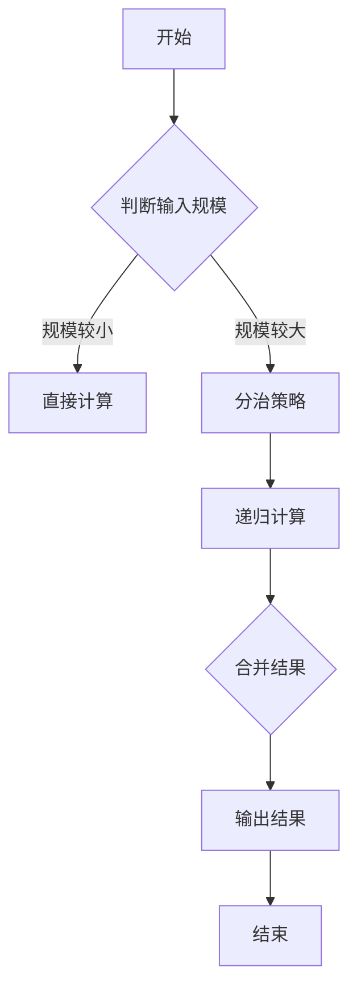
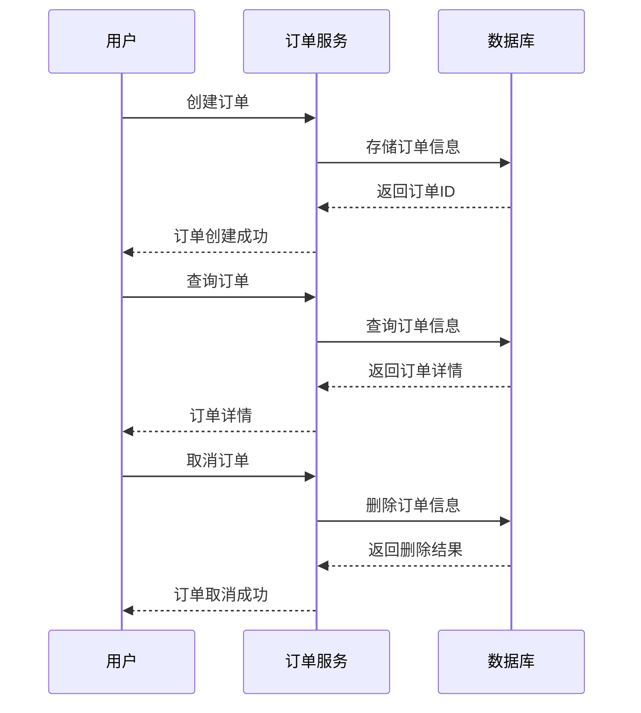

                 

# 技术硬实力

## 关键词

- 技术能力
- 算法原理
- 系统架构
- 最佳实践
- 性能优化

## 摘要

本文将深入探讨“技术硬实力”这一主题，旨在帮助读者理解并提升自身在技术领域的实力。文章将分为多个章节，涵盖核心概念、算法原理、系统架构、实战项目、最佳实践等内容。通过一步步的逻辑分析，本文将帮助读者建立起对技术硬实力的全面认识，并提供实用的技巧和策略。

## 背景介绍

### 核心概念术语说明

- 技术硬实力：指在技术领域中，个体或团队通过深入理解、熟练掌握相关知识和技能，能够高效解决复杂问题的能力。
- 算法：解决问题的步骤和方法，通常以数学公式或逻辑流程表示。
- 系统架构：软件系统的整体结构，包括各个组件的交互方式、数据流和处理逻辑。
- 最佳实践：在特定领域内，经过验证的高效、可靠的解决方案。

### 问题背景

在当今数字化时代，技术已成为推动社会进步的重要力量。然而，技术领域的竞争日益激烈，仅拥有基础知识已经无法满足需求。技术硬实力成为决定个人和团队成功的关键因素。

### 问题描述

如何提升自身的技术硬实力？如何在实际项目中高效应用所学知识？

### 问题解决

通过系统学习技术知识、深入理解算法原理、掌握系统架构设计、实战项目经验积累以及遵循最佳实践，可以逐步提升技术硬实力。

### 边界与外延

技术硬实力不仅涵盖编程技能，还包括对业务领域的理解、解决问题的能力、团队协作等。它是一个多维度的综合体现。

### 概念结构与核心要素组成

技术硬实力包括以下几个核心要素：

1. **技术知识**：包括编程语言、数据结构、算法等基础知识。
2. **算法原理**：对常见算法的理解和掌握，包括其时间复杂度和空间复杂度分析。
3. **系统架构设计**：理解系统设计原则、架构模式以及如何将理论应用到实践中。
4. **实战经验**：通过实际项目积累经验，提高问题解决能力。
5. **持续学习**：紧跟技术发展趋势，不断更新知识储备。

## 核心概念与联系

### 核心概念原理

技术硬实力是技术领域中的核心竞争力，它通过以下几个方面体现：

1. **技术深度**：指对特定技术领域的深入理解和掌握，包括底层原理和高级应用。
2. **创新能力**：能够在现有技术基础上进行创新，解决新问题或优化现有方案。
3. **协作能力**：能够在团队中高效协作，共同完成复杂任务。
4. **学习能力**：快速掌握新技术，适应快速变化的技术环境。

### 概念属性特征对比表格

| 特征         | 技术深度 | 创新能力 | 协作能力 | 学习能力 |
| ------------ | -------- | -------- | -------- | -------- |
| 定义         | 对特定领域的深入理解 | 在现有基础上提出新的解决方案 | 团队合作，共同完成任务 | 快速掌握新技术 |
| 关系         | 基础         | 建立在技术深度之上         | 需要团队协作         | 与其他能力相互促进 |
| 重要性       | 核心能力     | 推动行业发展         | 项目成功的关键         | 适应变化的能力     |

### ER实体关系图架构

```mermaid
erDiagram
    TechKnowledge ||--|{ Algorithm} : implements
    TechKnowledge ||--|{ SystemArchitecture} : implements
    TechKnowledge ||--|{ ProjectExperience} : accumulates
    TechKnowledge ||--|{ ContinuousLearning} : follows
    Algorithm : <|-- TechDepth
    SystemArchitecture : <|-- TechDepth
    ProjectExperience : <|-- InnovationCapability
    ContinuousLearning : <|-- LearningAbility
```

## 算法原理讲解

### 算法mermaid流程图



### Python源代码示例

```python
def divide_and_conquer(data):
    if len(data) <= 10:  # 规模较小
        return direct_computation(data)
    else:  # 规模较大
        mid = len(data) // 2
        left = divide_and_conquer(data[:mid])
        right = divide_and_conquer(data[mid:])
        return merge_results(left, right)

def direct_computation(data):
    # 直接计算算法
    pass

def merge_results(left, right):
    # 合并结果算法
    pass
```

### 算法原理的数学模型和公式

1. **时间复杂度**：

   - 直接计算：$O(n)$
   - 递归计算：$O(n \log n)$
   - 合并结果：$O(n)$

2. **空间复杂度**：

   - 直接计算：$O(1)$
   - 递归计算：$O(n)$
   - 合并结果：$O(1)$

### 详细讲解和举例说明

以分治算法为例，假设我们有一个大规模的数据集，需要对其进行排序。直接计算可能效率较低，而分治策略则可以将问题分解为更小的子问题，递归计算每个子问题的结果，再合并得到最终结果。

假设有一个长度为 $n$ 的数据集，我们可以将其分为两个长度为 $\frac{n}{2}$ 的子数据集。分别对这两个子数据集进行排序，时间复杂度为 $O(\frac{n}{2} \log \frac{n}{2})$。然后，将这两个有序子数据集合并为一个有序数据集，时间复杂度为 $O(\frac{n}{2})$。

总的计算时间复杂度为：

$$
O(\frac{n}{2} \log \frac{n}{2}) + O(\frac{n}{2}) = O(n \log n)
$$

## 系统分析与架构设计方案

### 问题场景介绍

假设我们要开发一个电商平台的订单管理系统，需要实现订单创建、订单查询、订单取消等功能。

### 项目介绍

- 项目名称：电商平台订单管理系统
- 技术栈：Java、Spring Boot、MySQL、Dubbo、Docker

### 系统功能设计

1. 订单创建：接收用户订单信息，生成订单。
2. 订单查询：根据订单号查询订单详情。
3. 订单取消：用户可以取消订单。

### 系统架构设计


### 系统接口设计和系统交互



## 项目实战

### 环境安装

1. 安装Java开发环境（OpenJDK 11以上版本）。
2. 安装MySQL数据库。
3. 安装Dubbo框架。

### 系统核心实现源代码

```java
// OrderService.java
public class OrderService {
    private final OrderRepository orderRepository;

    public OrderService(OrderRepository orderRepository) {
        this.orderRepository = orderRepository;
    }

    public long createOrder(Order order) {
        // 创建订单逻辑
        return orderRepository.save(order).getId();
    }

    public Order getOrderById(long orderId) {
        // 查询订单逻辑
        return orderRepository.findById(orderId).orElseThrow();
    }

    public void cancelOrder(long orderId) {
        // 取消订单逻辑
        orderRepository.deleteById(orderId);
    }
}

// OrderRepository.java
public interface OrderRepository extends JpaRepository<Order, Long> {
    // 自定义查询方法
}
```

### 代码应用解读与分析

1. **OrderService**：负责订单的创建、查询和取消操作。
2. **OrderRepository**：使用JpaRepository接口简化数据库操作。

### 实际案例分析和详细讲解剖析

以订单创建为例，当用户提交订单时，OrderService会调用OrderRepository的save方法将订单信息存储到数据库。成功存储后，返回订单ID给用户。

### 项目小结

通过本项目的实战，我们了解了如何使用Spring Boot、Dubbo等框架实现一个简单的订单管理系统。实战过程中，我们掌握了服务化架构设计、数据库操作和接口设计等关键技术。

## 最佳实践 Tips

1. **代码规范**：遵循统一的编码规范，提高代码可读性和可维护性。
2. **单元测试**：编写单元测试，确保代码的正确性和稳定性。
3. **性能优化**：关注数据库查询优化、缓存策略和异步处理等性能优化技术。
4. **持续集成**：使用自动化测试和构建工具，提高开发效率和代码质量。

## 小结

技术硬实力是技术领域中的核心竞争力，通过深入学习、实战经验积累和最佳实践遵循，可以不断提升自身的技术实力。本文介绍了技术硬实力的核心概念、算法原理、系统架构设计、实战项目和最佳实践，旨在帮助读者建立对技术硬实力的全面认识。

## 注意事项

1. 技术硬实力的提升需要持续学习和实践。
2. 不同技术领域的发展趋势不同，需要关注最新动态。
3. 团队协作是提升技术硬实力的重要途径。

## 拓展阅读

1. 《深度学习》—— 顶级机器学习专家Ian Goodfellow的力作，介绍了深度学习的基本原理和实践方法。
2. 《设计模式：可复用面向对象软件的基础》—— 古典设计模式书籍，帮助理解面向对象编程的精髓。
3. 《Java并发编程实战》—— 深入讲解Java并发编程的核心原理和实战技巧。

## 作者信息

作者：AI天才研究院/AI Genius Institute & 禅与计算机程序设计艺术 /Zen And The Art of Computer Programming

