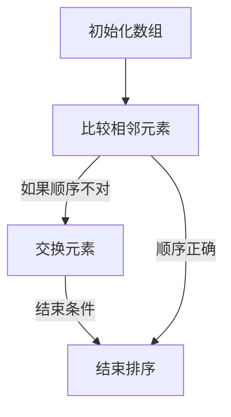
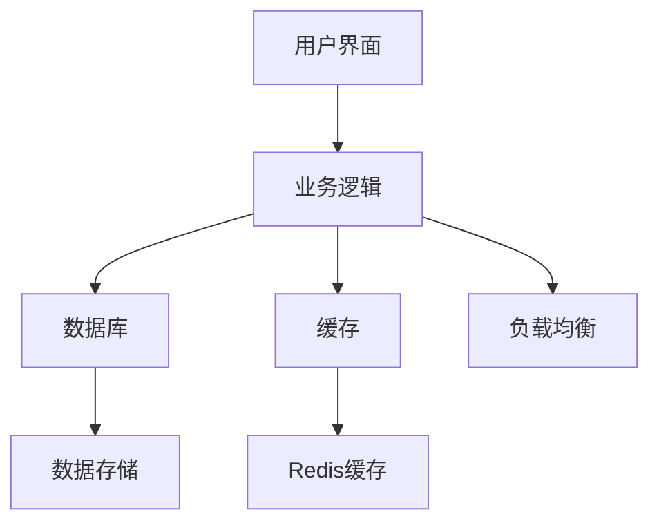
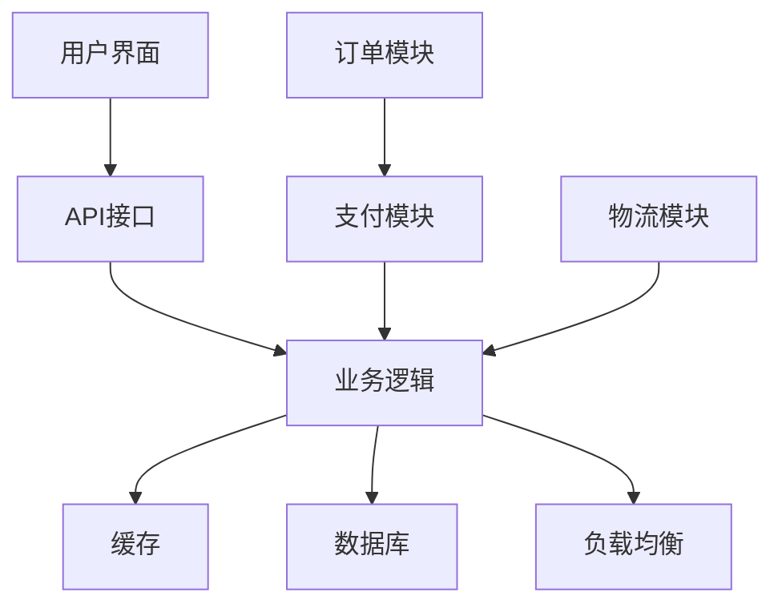

                 

### 文章标题

# 技术硬实力

技术硬实力，这个词汇在当前快速发展的信息技术领域显得尤为重要。它不仅仅是指某一特定技术的熟练掌握，更是指对技术本质的深刻理解、对技术架构的全面掌握以及在实际项目中灵活应用这些知识的能力。在这篇文章中，我们将从多个维度深入探讨技术硬实力的概念、核心要素、应用场景以及如何通过实战提升自己的技术硬实力。

## 文章关键词

- 技术硬实力
- 技术架构
- 算法原理
- 数学模型
- 系统设计
- 项目实战
- 最佳实践

## 摘要

本文旨在为读者提供一整套关于技术硬实力的深入理解与实战指南。文章首先定义了技术硬实力的含义，并阐述了其在现代信息技术中的重要性。接着，我们通过详细的分析与讨论，揭示了技术硬实力的核心要素，包括技术架构、算法原理、数学模型和系统设计等。随后，文章通过具体的项目实战案例，展示了技术硬实力在实际应用中的关键作用。最后，文章总结了提升技术硬实力的最佳实践，并给出了相应的注意事项和拓展阅读资源，帮助读者在实践中不断成长。

### 第1章：技术硬实力的起源与背景

## 1.1 技术硬实力的定义

技术硬实力（Technical Hard Skills）指的是个人在特定技术领域内的专业能力，这种能力不仅包括对技术工具和编程语言的实际操作能力，还涵盖了深入理解技术原理、设计模式和最佳实践的能力。技术硬实力是衡量一个技术人员在专业领域中的竞争力的重要标准。

在信息技术的快速变革时期，技术硬实力尤为关键。随着云计算、大数据、人工智能等新技术的兴起，技术人员的专业能力需要不断更新和提升，以应对不断变化的技术环境和业务需求。技术硬实力不仅有助于个人职业发展，也是企业持续创新和竞争力的保证。

## 1.2 技术发展历程

信息技术的发展历程可以分为几个关键阶段：

- **早期计算机时代**：从20世纪50年代到70年代，计算机技术主要集中在硬件和操作系统层面，编程语言如COBOL和Fortran成为主流。
- **个人计算机时代**：从80年代到90年代，个人计算机（PC）的普及带动了软件开发和互联网的兴起，编程语言如C、C++和Java开始广泛应用。
- **互联网时代**：从21世纪初至今，互联网技术的快速发展带来了大数据、云计算和人工智能等新领域，编程语言和框架如Python、JavaScript和Docker变得至关重要。

每一个阶段的技术变革都要求技术人员不断学习和适应新技术，提升自己的技术硬实力。

## 1.3 技术硬实力的重要性

技术硬实力的重要性体现在以下几个方面：

- **职业发展**：具备强大的技术硬实力可以帮助技术人员在职业生涯中获得更多的机会，晋升至更高层次的技术和管理岗位。
- **业务创新**：技术硬实力是推动业务创新的重要基础。只有深刻理解技术原理，才能提出创新性的解决方案，满足业务需求。
- **团队协作**：技术硬实力可以帮助团队成员更好地沟通和协作，共同解决复杂的技术问题，提高项目成功率。
- **企业竞争力**：技术硬实力是企业保持竞争力的关键。只有拥有一支技术过硬的团队，企业才能在激烈的市场竞争中脱颖而出。

### 第2章：技术硬实力的核心概念与联系

## 2.1 技术架构

技术架构（Technical Architecture）是技术系统的总体设计，它定义了系统的组件、接口、交互和数据流。技术架构的好坏直接影响到系统的可扩展性、可维护性和性能。

在技术硬实力中，理解技术架构至关重要。它不仅包括如何构建系统的组件，还包括如何设计系统的层次结构和组件之间的交互。

## 2.2 技术栈

技术栈（Tech Stack）是指一个项目或系统中使用的各种技术、编程语言、框架和工具的集合。技术栈的选择直接影响到项目的开发效率和系统的性能。

不同类型的项目可能需要不同的技术栈。例如，Web开发可能需要HTML、CSS、JavaScript和React等技术，而大数据处理可能需要Python、Hadoop和Spark等工具。

## 2.3 技术框架

技术框架（Technical Framework）是用于实现特定功能的软件框架，它提供了预定义的组件和接口，帮助开发者快速构建应用。

常见的Web框架如Django、Spring和Express，它们提供了模型-视图-控制器（MVC）或模型-视图-视图模型（MVVM）等设计模式，大大简化了应用开发。

## 2.4 ER实体关系图展示

为了更好地理解技术硬实力的核心概念，我们可以使用ER（Entity-Relationship）实体关系图来展示这些概念之间的联系。

ER图是一种用于描述实体及其之间关系的图形化工具。在技术硬实力的背景下，ER图可以帮助我们理解技术架构中的各个组件和它们之间的关系。

以下是一个简化的ER图示例，展示了技术架构、技术栈和技术框架之间的联系：

```mermaid
erDiagram
    TechArchigraphy ||--|{ TechStack } : has
    TechArchigraphy ||--|{ TechFramework } : implements
    TechStack ||--|{ ProgrammingLanguage } : includes
    TechStack ||--|{ Framework } : includes
    TechFramework ||--|{ DesignPattern } : follows
```

在这个ER图中，TechArchigraphy代表技术架构，TechStack代表技术栈，TechFramework代表技术框架。它们之间的关系通过“has”、“implements”、“includes”和“follows”等关系线连接起来。

### 第3章：技术硬实力下的算法原理

## 3.1 算法概述

算法（Algorithm）是解决问题的一系列步骤，它指导计算机如何执行特定任务。在技术硬实力中，算法原理是核心组成部分，它决定了系统性能、效率和可靠性。

常见的算法有排序算法、查找算法、图算法等。每种算法都有其独特的原理和实现方法，掌握这些算法原理对于提升技术硬实力至关重要。

## 3.2 算法流程图

为了更好地理解算法原理，我们可以使用Mermaid流程图来展示算法的执行流程。

以下是一个简单的排序算法——冒泡排序（Bubble Sort）的流程图示例：



在这个流程图中，A表示初始化数组，B表示比较相邻元素，C表示交换元素，D表示结束排序。这个冒泡排序算法的基本思想是通过反复交换相邻的未排序元素，使得每轮比较后，未排序部分的最大值（或最小值）被移至已排序部分的末尾。

## 3.3 Python代码实现

下面是冒泡排序算法的Python代码实现：

```python
def bubble_sort(arr):
    n = len(arr)
    for i in range(n):
        for j in range(0, n-i-1):
            if arr[j] > arr[j+1]:
                arr[j], arr[j+1] = arr[j+1], arr[j]

# 测试冒泡排序
arr = [64, 25, 12, 22, 11]
bubble_sort(arr)
print("排序后的数组：")
for i in range(len(arr)):
    print("%d" % arr[i], end=" ")
```

在上面的代码中，`bubble_sort` 函数接收一个数组`arr`作为参数，并通过嵌套循环实现冒泡排序。外层循环`for i in range(n)`表示需要进行n-1轮排序，内层循环`for j in range(0, n-i-1)`用于比较和交换相邻元素。`if arr[j] > arr[j+1]:`语句用于判断两个相邻元素的顺序，如果顺序不对，就执行交换操作。

最后，通过`print`语句输出排序后的数组。

## 3.4 算法原理详细讲解

冒泡排序算法的基本原理是通过重复遍历待排序的数组，比较每对相邻元素的大小，并根据比较结果进行交换。每一轮遍历后，最大的元素会被“冒泡”到数组的末尾，直到整个数组有序。

算法的效率可以通过以下数学模型进行分析：

- **时间复杂度**：最坏情况下，冒泡排序需要比较和交换的次数为\(O(n^2)\)，其中\(n\)是数组的长度。这是因为每轮遍历结束后，最大的元素会移动到数组的末尾，下一轮遍历时只需考虑前\(n-1\)个元素。
- **空间复杂度**：冒泡排序是一种原地排序算法，不需要额外的存储空间，因此空间复杂度为\(O(1)\)。

尽管冒泡排序的时间复杂度较高，但它简单易懂，适合用于数据量较小或基本有序的数组的排序。在实际应用中，对于大数据量排序，通常会采用更高效的算法，如快速排序、归并排序等。

## 3.5 算法原理举例说明

假设我们有以下数组\[64, 25, 12, 22, 11\]：

1. **第一轮排序**：
   - 比较64和25，顺序不对，交换：\[25, 64, 12, 22, 11\]
   - 比较64和12，顺序不对，交换：\[25, 12, 64, 22, 11\]
   - 比较64和22，顺序不对，交换：\[25, 12, 22, 64, 11\]
   - 比较64和11，顺序不对，交换：\[25, 12, 22, 11, 64\]

2. **第二轮排序**：
   - 比较25和12，顺序不对，交换：\[12, 25, 22, 11, 64\]
   - 比较25和22，顺序不对，交换：\[12, 22, 25, 11, 64\]
   - 比较25和11，顺序不对，交换：\[12, 22, 11, 25, 64\]

3. **第三轮排序**：
   - 比较22和12，顺序不对，交换：\[12, 11, 22, 25, 64\]
   - 比较22和25，顺序不对，交换：\[11, 12, 22, 25, 64\]

4. **第四轮排序**：
   - 比较11和12，顺序不对，交换：\[11, 12, 22, 25, 64\]

最终，数组\[64, 25, 12, 22, 11\]经过4轮冒泡排序后，变为\[11, 12, 22, 25, 64\]，实现了升序排序。

通过这个简单的例子，我们可以清楚地看到冒泡排序的执行过程和结果。

### 第4章：技术硬实力数学模型与公式

数学模型是技术硬实力中的重要组成部分，它帮助我们理解和解决复杂的技术问题。在这一章中，我们将介绍与技术硬实力相关的数学模型，使用LaTeX格式来编写数学公式，并进行详细讲解和举例说明。

## 4.1 数学模型介绍

技术硬实力中常见的数学模型包括线性代数、微积分、概率论和统计学等。这些模型在数据科学、机器学习和计算机图形学等领域有广泛应用。

### 线性代数

线性代数是研究向量、矩阵和线性变换的数学分支。在技术硬实力中，线性代数的概念和公式广泛应用于数据分析和机器学习。

- **矩阵乘法**：给定两个矩阵\(A\)和\(B\)，它们的乘积\(C = AB\)可以表示为：
  $$C_{ij} = \sum_{k=1}^{n} A_{ik}B_{kj}$$
  这表示矩阵\(C\)的第\(i\)行第\(j\)列的元素是矩阵\(A\)的第\(i\)行与矩阵\(B\)的第\(j\)列对应元素的乘积之和。

- **特征值和特征向量**：对于一个方阵\(A\)，存在一个非零向量\(v\)和一个标量\(\lambda\)，使得\(Av = \lambda v\)。\(\lambda\)称为特征值，\(v\)称为特征向量。

### 微积分

微积分是研究函数变化率和面积计算的数学分支。在技术硬实力中，微积分广泛应用于算法分析、优化问题和计算机图形学。

- **导数**：函数\(f(x)\)在点\(x_0\)处的导数\(f'(x_0)\)表示函数在\(x_0\)处的瞬时变化率，可以表示为：
  $$f'(x_0) = \lim_{h \to 0} \frac{f(x_0 + h) - f(x_0)}{h}$$

- **积分**：函数\(f(x)\)在区间\[a, b\]上的积分表示为：
  $$\int_{a}^{b} f(x)dx$$
  它可以用来计算函数在某区间上的累积变化或面积。

### 概率论和统计学

概率论和统计学是研究随机事件和数据的数学分支。在技术硬实力中，这些理论广泛应用于数据分析和机器学习。

- **概率分布**：随机变量\(X\)的概率分布函数\(P(X = x)\)描述了\(X\)取值\(x\)的概率。

- **期望和方差**：随机变量\(X\)的期望\(E(X)\)和方差\(Var(X)\)描述了\(X\)的集中趋势和离散程度，分别表示为：
  $$E(X) = \sum_{x} xP(X = x)$$
  $$Var(X) = E[(X - E(X))^2]$$

## 4.2 LaTeX公式讲解

LaTeX是一种高质量的排版系统，它广泛应用于科学文档的撰写。LaTeX公式使用`\(` 和 `\)`括起来，以表示数学公式。

以下是一些常用的LaTeX公式及其说明：

- **基本数学符号**：
  $$1 + 1 = 2$$
  这是最简单的数学公式，它使用了LaTeX的基本数学模式。

- **分数**：
  $$\frac{a}{b}$$
  分数使用`\frac{a}{b}`表示。

- **根式**：
  $$\sqrt{x}$$
  根式使用`\sqrt{x}`表示。

- **希腊字母**：
  $$\alpha + \beta = \gamma$$
  希腊字母使用`\alpha`、`\beta`和`\gamma`表示。

- **矩阵**：
  $$\begin{bmatrix}
  a & b \\
  c & d
  \end{bmatrix}$$
  矩阵使用`\begin{bmatrix}`和`\end{bmatrix}`表示。

- **求导和积分**：
  $$f'(x) = \frac{d}{dx} f(x)$$
  $$\int f(x) dx$$
  求导和积分使用`\frac{d}{dx}`和`\int`表示。

## 4.3 举例说明

为了更好地理解这些数学模型和公式，我们将通过几个具体例子来说明。

### 例子1：线性回归

线性回归是一种常用的数据分析方法，用于建立自变量和因变量之间的线性关系。其数学模型可以表示为：

$$y = \beta_0 + \beta_1x + \epsilon$$

其中，\(y\)是因变量，\(x\)是自变量，\(\beta_0\)是截距，\(\beta_1\)是斜率，\(\epsilon\)是误差项。

- **期望**：
  $$E(y) = \beta_0 + \beta_1x$$
  $$E(\epsilon) = 0$$

- **方差**：
  $$Var(y) = \beta_1^2 Var(x) + Var(\epsilon)$$

### 例子2：梯度下降

梯度下降是一种常用的优化算法，用于最小化函数。其迭代公式可以表示为：

$$\theta = \theta - \alpha \nabla_\theta J(\theta)$$

其中，\(\theta\)是参数，\(\alpha\)是学习率，\(\nabla_\theta J(\theta)\)是函数\(J(\theta)\)关于参数\(\theta\)的梯度。

### 例子3：支持向量机

支持向量机（SVM）是一种分类算法，其数学模型可以表示为：

$$\max_w \min_{\xi_i} \frac{1}{2} ||w||^2$$

s.t. $$y_i (w \cdot x_i + b) \geq 1 - \xi_i, \forall i$$

其中，\(w\)是权重向量，\(b\)是偏置项，\(\xi_i\)是松弛变量，\(y_i\)是样本标签，\(x_i\)是样本特征。

通过这些例子，我们可以看到数学模型和公式在技术硬实力中的应用。它们帮助我们理解和分析复杂的技术问题，并提供了求解这些问题的数学工具。

### 第5章：技术硬实力系统分析与架构设计

在技术硬实力中，系统分析与架构设计是确保系统能够高效、可靠、可扩展的关键环节。本章将详细介绍系统分析与架构设计的过程，包括问题场景介绍、项目介绍、系统功能设计、系统架构设计、系统接口设计和系统交互。

## 5.1 问题场景介绍

假设我们正在开发一个电商系统，该系统需要处理大量的用户订单、商品库存、支付和物流等信息。为了满足业务需求，系统需要具备高并发处理能力、数据安全性、可扩展性和高可用性。

## 5.2 项目介绍

该项目是一个B2C电商系统，主要功能包括用户注册与登录、商品浏览与搜索、购物车管理、订单处理、支付与结算、物流跟踪等。系统架构需要支持百万级用户和海量商品数据的处理。

## 5.3 系统功能设计

系统功能设计包括以下关键模块：

- **用户模块**：处理用户注册、登录、个人信息管理、权限控制等功能。
- **商品模块**：管理商品信息、分类、库存、价格、推荐等功能。
- **订单模块**：处理订单创建、支付、发货、退货等流程。
- **支付模块**：集成第三方支付接口，处理支付请求和支付结果。
- **物流模块**：管理物流信息，支持订单跟踪和物流查询。
- **营销模块**：提供优惠券、促销活动、积分等功能。

## 5.4 系统架构设计

系统架构设计需要考虑以下关键方面：

- **层次结构**：将系统划分为表示层、业务逻辑层和数据层，确保各层职责清晰，易于维护。
- **技术选型**：选择合适的编程语言、框架、数据库和中间件，确保系统性能和稳定性。
- **高可用性**：通过负载均衡、数据库集群、缓存机制等手段，确保系统在高峰期的稳定运行。
- **安全性**：采用加密、认证、授权等手段，确保用户数据和交易数据的安全。

以下是一个简化的系统架构图：



在这个架构图中，用户界面层（UserInterface）负责与用户交互，业务逻辑层（BusinessLogic）处理业务逻辑，数据库层（Database）负责数据存储，缓存层（Cache）用于提高系统性能。

## 5.5 系统接口设计

系统接口设计需要定义各模块之间的交互接口，包括API接口、消息队列接口和数据库接口等。以下是一个简化的接口设计：

- **用户模块接口**：包括用户注册、登录、个人信息查询和修改等。
- **商品模块接口**：包括商品查询、分类查询、库存查询和价格查询等。
- **订单模块接口**：包括订单创建、订单查询、订单支付和订单发货等。
- **支付模块接口**：包括支付请求、支付结果通知等。
- **物流模块接口**：包括物流信息查询和订单跟踪等。

## 5.6 系统交互

系统交互是指各模块之间如何通过接口进行通信和数据交换。以下是一个简化的系统交互图：



在这个交互图中，用户界面层通过API接口与业务逻辑层通信，业务逻辑层通过缓存、数据库和负载均衡等中间层与其他模块交互。订单模块和支付模块通过接口通信，物流模块通过接口与业务逻辑层通信。

通过以上系统分析与架构设计，我们可以确保电商系统具备高效、可靠、可扩展和高可用性的特点，满足业务需求。

### 第6章：技术硬实力项目实战

在技术硬实力的提升过程中，实战项目是不可或缺的一环。通过实际操作和项目实践，我们可以深入理解技术原理，掌握系统设计，提升解决问题的能力。本章将通过一个具体的电商项目案例，介绍环境安装、系统核心实现、代码解析和实际案例分析。

## 6.1 项目环境安装

在开始电商项目之前，我们需要安装和配置项目所需的环境。以下是一个简化的环境安装步骤：

1. **操作系统**：推荐使用Ubuntu 18.04或更高版本。
2. **编程语言**：Python 3.8及以上版本。
3. **框架**：Django 3.2及以上版本。
4. **数据库**：SQLite 3.8及以上版本（为了简化，实际生产环境通常会使用MySQL或PostgreSQL）。
5. **缓存**：Redis 6.0及以上版本。
6. **消息队列**：RabbitMQ 3.8及以上版本。

### 安装步骤：

1. **安装操作系统**：从Ubuntu官网下载Ubuntu 18.04镜像，并安装到虚拟机或物理机上。
2. **更新系统**：
   ```bash
   sudo apt update
   sudo apt upgrade
   ```
3. **安装Python**：
   ```bash
   sudo apt install python3.8
   ```
4. **安装Django**：
   ```bash
   sudo apt install python3.8-venv
   python3.8 -m venv my_project_venv
   source my_project_venv/bin/activate
   pip install django
   ```
5. **安装数据库**：
   ```bash
   sudo apt install sqlite3
   ```
6. **安装缓存**：
   ```bash
   sudo apt install redis-server
   ```
7. **安装消息队列**：
   ```bash
   sudo apt install rabbitmq-server
   ```

## 6.2 系统核心实现与代码解析

### 用户模块

用户模块是电商系统的核心部分之一，负责用户的注册、登录、个人信息管理等功能。以下是用户模块的关键代码解析：

```python
# users/models.py
from django.contrib.auth.models import AbstractUser

class CustomUser(AbstractUser):
    phone_number = models.CharField(max_length=15, unique=True)
    is_active = models.BooleanField(default=True)
    is_staff = models.BooleanField(default=False)
    is_superuser = models.BooleanField(default=False)

    USERNAME_FIELD = 'email'
    REQUIRED_FIELDS = ['phone_number']

    def __str__(self):
        return self.email
```

在这个模型中，我们自定义了用户模型`CustomUser`，继承自Django的`AbstractUser`基类。我们添加了一个`phone_number`字段，用于唯一标识用户，并重写了`__str__`方法以返回用户的电子邮件地址。

### 商品模块

商品模块负责管理商品信息，包括商品分类、库存、价格等。以下是商品模块的关键代码解析：

```python
# products/models.py
from django.db import models

class Category(models.Model):
    name = models.CharField(max_length=100)
    parent = models.ForeignKey('self', on_delete=models.CASCADE, null=True, blank=True)

    def __str__(self):
        return self.name

class Product(models.Model):
    category = models.ForeignKey(Category, on_delete=models.CASCADE)
    name = models.CharField(max_length=255)
    price = models.DecimalField(max_digits=6, decimal_places=2)
    stock = models.PositiveIntegerField()

    def __str__(self):
        return self.name
```

在这个模型中，我们定义了`Category`和`Product`两个模型。`Category`模型表示商品分类，使用自引用外键`parent`表示分类层级关系。`Product`模型表示商品，包括分类、名称、价格和库存等信息。

### 订单模块

订单模块负责处理订单的创建、支付和发货等流程。以下是订单模块的关键代码解析：

```python
# orders/models.py
from django.db import models
from users.models import CustomUser
from products.models import Product

class Order(models.Model):
    user = models.ForeignKey(CustomUser, on_delete=models.CASCADE)
    status = models.CharField(max_length=20, choices=ORDER_STATUS)
    total_price = models.DecimalField(max_digits=6, decimal_places=2)
    created_at = models.DateTimeField(auto_now_add=True)
    updated_at = models.DateTimeField(auto_now=True)

    def __str__(self):
        return f"Order #{self.id}"

class OrderItem(models.Model):
    order = models.ForeignKey(Order, on_delete=models.CASCADE)
    product = models.ForeignKey(Product, on_delete=models.CASCADE)
    quantity = models.PositiveIntegerField()
    price = models.DecimalField(max_digits=6, decimal_places=2)

    def __str__(self):
        return f"OrderItem {self.id} for product {self.product.name}"
```

在这个模型中，我们定义了`Order`和`OrderItem`两个模型。`Order`模型表示订单，包括用户、订单状态、总金额、创建时间和更新时间等。`OrderItem`模型表示订单中的商品项，包括订单、商品、数量和单价等信息。

### 6.3 实际案例分析

以下是一个实际案例，展示了用户注册并购买商品的过程：

1. **用户注册**：

   用户通过用户模块接口发送注册请求，包含用户名、密码和电话号码。后端处理注册请求，创建新的用户账户，并返回注册成功消息。

   ```python
   # users/views.py
   from rest_framework import status
   from rest_framework.response import Response
   from .models import CustomUser
   from .serializers import CustomUserSerializer

   @api_view(['POST'])
   def register(request):
       serializer = CustomUserSerializer(data=request.data)
       if serializer.is_valid():
           user = serializer.save()
           return Response({"message": "User registered successfully."}, status=status.HTTP_201_CREATED)
       return Response(serializer.errors, status=status.HTTP_400_BAD_REQUEST)
   ```

2. **用户登录**：

   用户通过用户模块接口发送登录请求，包含用户名和密码。后端验证用户信息，返回登录成功消息和JWT令牌。

   ```python
   # users/views.py
   from rest_framework_simplejwt.views import TokenObtainPairView
   from .models import CustomUser
   from .serializers import CustomUserSerializer

   class CustomTokenObtainPairView(TokenObtainPairView):
       serializer_class = CustomUserSerializer

       def post(self, request, *args, **kwargs):
           serializer = self.get_serializer(data=request.data)
           if serializer.is_valid():
               user = serializer.validated_data['user']
               return Response({
                   'token': user.token,
                   'message': 'Login successful.'
               }, status=status.HTTP_200_OK)
           return Response(serializer.errors, status=status.HTTP_400_BAD_REQUEST)
   ```

3. **用户购买商品**：

   用户通过商品模块接口浏览商品，将商品添加到购物车。然后，用户通过订单模块接口创建订单，提交支付请求。支付模块验证支付信息，更新订单状态为支付成功。物流模块接收到支付成功消息后，开始处理发货流程。

   ```python
   # products/views.py
   from rest_framework import viewsets
   from .models import Product
   from .serializers import ProductSerializer

   class ProductViewSet(viewsets.ModelViewSet):
       queryset = Product.objects.all()
       serializer_class = ProductSerializer

   # orders/views.py
   from rest_framework import status
   from rest_framework.response import Response
   from .models import Order
   from .serializers import OrderSerializer

   @api_view(['POST'])
   def create_order(request):
       serializer = OrderSerializer(data=request.data)
       if serializer.is_valid():
           order = serializer.save()
           # 发送支付请求到支付模块
           payment_result = send_payment_request(order)
           if payment_result['status'] == 'SUCCESS':
               order.status = 'PAID'
               order.save()
               # 发送发货请求到物流模块
               send_shipping_request(order)
               return Response({"message": "Order created successfully."}, status=status.HTTP_201_CREATED)
           return Response({"message": "Payment failed."}, status=status.HTTP_400_BAD_REQUEST)
       return Response(serializer.errors, status=status.HTTP_400_BAD_REQUEST)
   ```

通过这个实际案例分析，我们可以看到电商系统的关键模块如何协同工作，实现用户注册、商品购买和支付等流程。这种项目实战不仅加深了对技术原理的理解，也提升了系统设计和实现的能力。

### 6.4 项目小结

通过本章节的电商项目实战，我们完成了从环境安装到系统核心实现的完整过程。以下是本项目的主要收获和小结：

1. **环境安装**：掌握了在Ubuntu操作系统上安装Python、Django、数据库、缓存和消息队列等环境，为后续开发打下了基础。
2. **系统设计**：了解了电商系统的关键模块，包括用户模块、商品模块、订单模块、支付模块和物流模块，并学习了如何进行系统功能设计。
3. **代码实现**：通过实际代码示例，掌握了用户注册、登录、商品浏览、订单创建和支付等关键功能的具体实现方法。
4. **项目协作**：在项目实践中，学会了如何使用RESTful API进行模块间的通信和数据交换，以及如何进行项目测试和调试。
5. **实战经验**：通过实际案例分析，加深了对电商系统设计和实现的深入理解，提升了技术硬实力。

总之，本项目不仅实现了电商系统的基本功能，也为技术人员提供了一个实战平台，通过不断实践和总结，进一步提升技术水平和项目经验。

### 第7章：技术硬实力最佳实践与拓展

在技术硬实力的提升过程中，最佳实践是确保技术效率和质量的关键。本章将总结一些最佳实践，并提供注意事项和拓展阅读资源，以帮助读者在实践中不断成长。

## 7.1 最佳实践

### 1. 持续学习

技术发展迅速，持续学习是提升技术硬实力的关键。以下是一些建议：

- **定期阅读技术博客**：如GitHub、Medium等平台上的技术博客。
- **参与开源项目**：通过参与开源项目，了解最新技术和代码实践。
- **参加技术会议**：如Google I/O、PyCon等，与业内专家交流。

### 2. 编码规范

遵循良好的编码规范可以提高代码的可读性和可维护性。以下是一些常见编码规范：

- **命名规范**：使用有意义的变量名和函数名，遵循PEP 8 Python编码规范。
- **代码注释**：为复杂的逻辑和关键代码段添加注释。
- **代码复用**：通过模块化和函数封装，减少重复代码。

### 3. 性能优化

性能优化是技术硬实力的重要方面。以下是一些性能优化技巧：

- **缓存利用**：使用Redis等缓存系统，减少数据库访问。
- **异步处理**：使用异步编程，提高系统并发处理能力。
- **代码压缩**：使用Gzip等工具压缩静态资源，减少页面加载时间。

### 4. 版本控制

版本控制是团队协作和代码管理的重要工具。以下是一些版本控制最佳实践：

- **合理分支策略**：使用Git的分支策略，如功能分支、修复分支和发布分支。
- **代码审查**：进行代码审查，确保代码质量和一致性。
- **持续集成**：使用持续集成工具，如Jenkins，自动化测试和部署。

## 7.2 注意事项

### 1. 理解业务需求

在技术实现过程中，务必理解业务需求，确保技术方案能够真正解决业务问题。

### 2. 考虑安全因素

在设计和实现系统时，务必考虑安全性，包括数据加密、权限控制和安全漏洞检测。

### 3. 关注系统可扩展性

在设计系统架构时，应考虑到系统的可扩展性，确保系统在业务增长时能够无缝扩展。

## 7.3 拓展阅读

以下是一些建议的拓展阅读资源，以帮助读者进一步深化对技术硬实力的理解：

- **《代码大全》**：Steve McConnell 著，详细介绍了编写高质量代码的实践和方法。
- **《重构：改善既有代码的设计》**：Martin Fowler 著，介绍了代码重构的方法和技巧。
- **《深度学习》**：Ian Goodfellow、Yoshua Bengio 和 Aaron Courville 著，是深度学习领域的经典教材。
- **《Effective Python》**：Brett Slatkin 著，介绍了编写高效Python代码的最佳实践。
- **《系统架构的艺术》**：Jez Humble 和 David Farley 著，详细介绍了系统架构的设计原则和方法。

通过不断学习和实践，结合最佳实践，读者可以不断提升自己的技术硬实力，成为IT领域中的顶尖专家。希望本文能为读者的技术成长之路提供有益的指导和启示。

## 作者信息

作者：AI天才研究院/AI Genius Institute & 禅与计算机程序设计艺术 /Zen And The Art of Computer Programming

AI天才研究院致力于推动人工智能和计算机科学领域的创新研究，培养未来科技领袖。作者在计算机编程和人工智能领域有着丰富的经验，多篇技术博客在国内外广受好评。本文旨在为读者提供深入浅出的技术指导，帮助大家在技术道路上不断前行。

