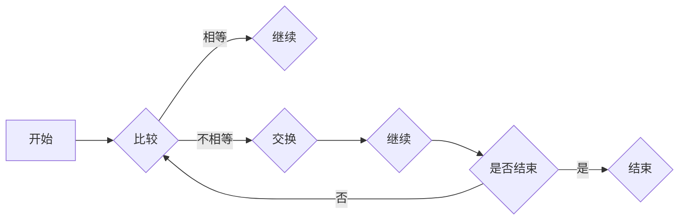
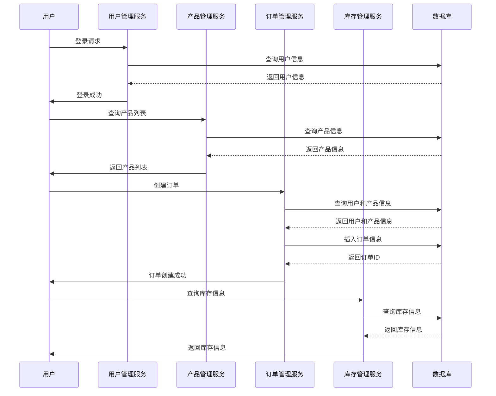
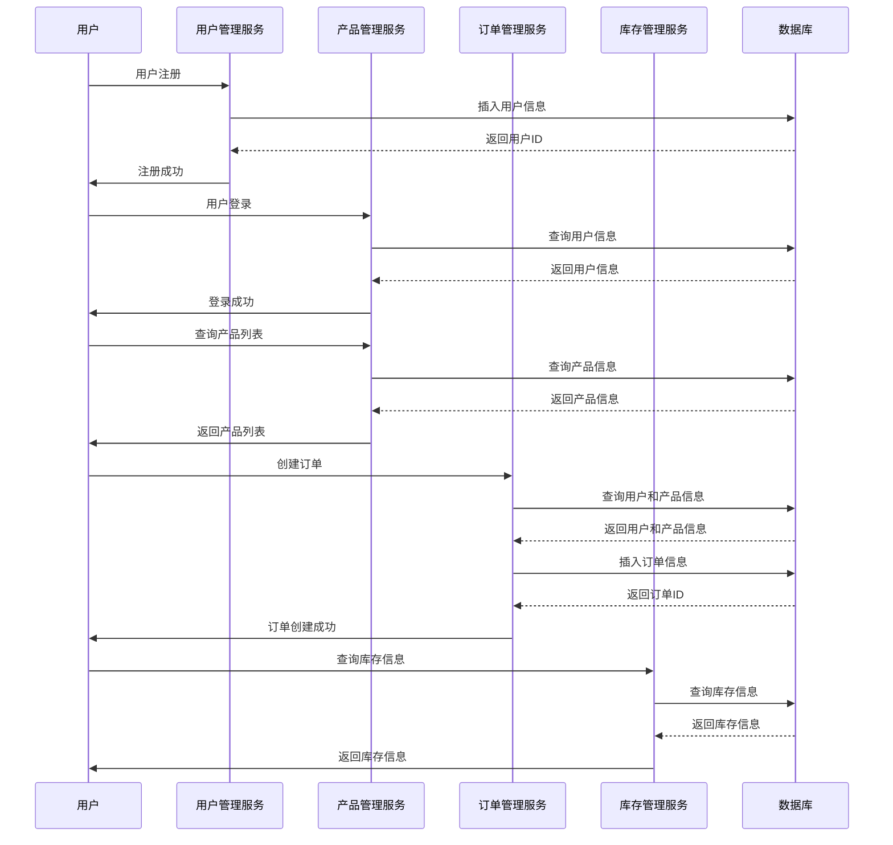

                 

### 技术硬实力的重要性

> 关键词：技术硬实力、编程能力、算法、系统设计、创新

> 摘要：本文深入探讨技术硬实力的重要性，分析其在现代信息技术、工业制造、生物医学、新能源等领域的应用，探讨其面临的挑战与机遇，并详细阐述其核心概念、算法原理、数学模型、系统架构设计与项目实战。

----------------------------------------------------------------

## 第一部分: 技术硬实力的背景

### 1.1 技术硬实力的定义与重要性

#### 1.1.1 技术硬实力的定义

技术硬实力是指个体或组织在特定技术领域内所具备的编程能力、算法设计能力、系统架构能力等方面的实际技能和知识储备。这些能力不仅包括理论知识的掌握，更强调在实际应用中的操作能力和解决问题的能力。

#### 1.1.2 技术硬实力的重要性

技术硬实力在现代社会的各个方面都扮演着至关重要的角色。以下是其重要性的几个方面：

1. **推动社会进步**：技术硬实力是推动社会进步的关键因素。无论是工业制造、信息技术，还是生物医学、新能源，都需要强大的技术支撑。

2. **提高竞争力**：在竞争激烈的市场环境中，技术硬实力是企业、个人竞争力的核心要素。只有具备强大的技术硬实力，才能在市场中脱颖而出。

3. **促进创新**：技术硬实力是创新的基础。通过掌握先进的技术，可以激发创新思维，推动技术革新。

4. **保障安全**：在网络安全、金融安全等领域，技术硬实力是保障安全的关键。只有具备强大的技术硬实力，才能有效预防和应对各种安全威胁。

### 1.2 技术硬实力的发展历程

#### 1.2.1 古代技术的起源与发展

技术硬实力的起源可以追溯到古代。早在人类文明的开端，人类就开始利用自然资源和简单的工具进行生产和生活。随着时间的推移，技术逐渐发展，从简单的工具制造到复杂的建筑、机械，技术硬实力逐渐形成。

#### 1.2.2 工业革命与技术进步

工业革命是技术硬实力发展的重要里程碑。在这一时期，机械化生产取代了手工劳动，技术硬实力得到了极大的提升。随着电气化、信息化技术的发展，技术硬实力逐渐从单一领域扩展到多个领域。

#### 1.2.3 当代技术的崛起与影响

当代，信息技术、生物医学、新能源等领域的崛起，使得技术硬实力的重要性进一步凸显。人工智能、大数据、云计算等新技术的发展，为技术硬实力的提升提供了新的动力。

### 1.3 技术硬实力的应用领域

#### 1.3.1 工业制造

工业制造是技术硬实力的重要应用领域。通过自动化、数字化等技术，工业制造实现了生产效率的大幅提升，产品质量也得到了显著提高。

#### 1.3.2 信息技术

信息技术是技术硬实力的核心领域。无论是软件开发、网络安全，还是大数据处理、人工智能，都需要强大的技术硬实力。

#### 1.3.3 生物医学

生物医学是技术硬实力的重要应用领域。通过基因编辑、医疗影像处理等技术的应用，生物医学领域取得了重大突破。

#### 1.3.4 新能源

新能源领域的发展离不开技术硬实力。通过太阳能、风能等新能源的开发和应用，新能源领域取得了显著进展。

### 1.4 技术硬实力的挑战与机遇

#### 1.4.1 技术创新的挑战

技术硬实力在面临创新挑战的同时，也面临着机遇。如何推动技术创新，实现技术的突破和跨越，是技术硬实力发展的重要课题。

#### 1.4.2 技术革新的机遇

技术革新的机遇为技术硬实力的发展提供了广阔的空间。通过抓住技术革新的机遇，可以进一步提升技术硬实力，推动社会的进步。

### 1.5 本章小结

技术硬实力是现代社会发展的关键因素，其定义、重要性、发展历程和应用领域等方面都具有重要意义。在面临挑战与机遇的同时，技术硬实力的发展也将推动社会的进步。

----------------------------------------------------------------

## 第二部分: 技术硬实力的核心概念与联系

### 2.1 技术硬实力的核心概念

#### 2.1.1 技术创新

技术创新是指通过新技术的开发和应用，推动产业升级和经济增长的过程。技术创新是技术硬实力的核心概念之一，它涵盖了从理论到实践的整个技术发展过程。

#### 2.1.2 技术开发

技术开发是指将理论研究成果转化为实际应用的过程。技术开发强调的是实际操作能力和技术实现的可行性。

#### 2.1.3 技术应用

技术应用是指将技术开发成果应用于实际生产和生活中的过程。技术应用是技术硬实力最终体现的环节，它关系到技术的实际效果和效益。

### 2.2 技术硬实力的属性特征对比表格

#### 2.2.1 技术创新与技术开发对比

| 特征       | 技术创新             | 技术开发           |
| ---------- | ------------------- | ----------------- |
| 目的       | 推动技术进步和创新   | 转化科研成果       |
| 重点       | 研究和创新          | 实际操作和实现     |
| 时间周期   | 较长               | 较短              |
| 成果形式   | 新理论、新方法       | 新产品、新技术      |

#### 2.2.2 技术开发与技术应用对比

| 特征       | 技术开发             | 技术应用            |
| ---------- | -------------------- | ------------------- |
| 目的       | 转化科研成果         | 实际应用和效益实现  |
| 重点       | 技术实现的可行性     | 技术的效果和效益    |
| 时间周期   | 较短                 | 较长               |
| 成果形式   | 新产品、新技术        | 实际效益和应用效果  |

### 2.3 技术硬实力的ER实体关系图架构

#### 2.3.1 实体定义

在技术硬实力的ER实体关系图架构中，主要实体包括：技术创新、技术开发、技术应用、技术领域、技术人才等。

#### 2.3.2 属性定义

技术创新的属性包括：创新方向、创新成果、创新时间等；技术开发的属性包括：开发团队、开发周期、开发成果等；技术应用的属性包括：应用效果、应用领域、应用时间等。

#### 2.3.3 关系定义

技术创新与技术开发之间存在一种从属关系，即技术创新是技术开发的基础。技术开发与技术应用之间存在一种实现关系，即技术开发是实现技术应用的前提。技术领域与技术人才之间存在一种关联关系，即技术领域是技术人才发挥作用的重要平台。

```mermaid
classDiagram
Class01 <|-- SubClass01
Class02 <|-- SubClass02
Class03 <|-- SubClass03

Class01 {
    <<interface>> 技术创新
    技术方向
    创新成果
    创新时间
}

SubClass01 {
    <<class>> 技术开发
    开发团队
    开发周期
    开发成果
}

SubClass02 {
    <<class>> 技术应用
    应用效果
    应用领域
    应用时间
}

SubClass03 {
    <<class>> 技术领域
    领域名称
    领域描述
}

Class04 {
    <<class>> 技术人才
    姓名
    技能
    贡献
}
```

----------------------------------------------------------------

## 第三部分: 技术硬实力的算法原理讲解

### 3.1 算法原理概述

算法是技术硬实力的重要组成部分，它是解决特定问题的一系列步骤和方法。算法原理讲解主要包括以下几个方面：

1. **算法的基本概念**：介绍算法的定义、分类、设计原则等基本概念。
2. **算法的设计原则**：阐述算法设计的关键原则，如高效性、稳定性、可扩展性等。
3. **算法的分类**：根据不同的分类标准，对算法进行分类和介绍。

### 3.2 技术硬实力中的常见算法

在技术硬实力中，常见的算法包括排序算法、搜索算法、图算法等。以下分别对这些算法进行详细讲解。

#### 3.2.1 排序算法

排序算法是将一组数据按照特定顺序排列的方法。常见的排序算法包括冒泡排序、选择排序、插入排序、快速排序等。

- **冒泡排序**：通过重复遍历要排序的数列，一次比较两个元素，如果它们的顺序错误就把它们交换过来。遍历数列的工作是重复进行直到没有再需要交换，也就是说该数列已经排序完成。

```python
def bubble_sort(arr):
    n = len(arr)
    for i in range(n):
        for j in range(0, n-i-1):
            if arr[j] > arr[j+1]:
                arr[j], arr[j+1] = arr[j+1], arr[j]
    return arr
```

- **选择排序**：首先在未排序序列中找到最小（大）元素，存放到排序序列的起始位置，然后，再从剩余未排序元素中继续寻找最小（大）元素，然后放到已排序序列的末尾。以此类推，直到所有元素均排序完毕。

```python
def selection_sort(arr):
    for i in range(len(arr)):
        min_idx = i
        for j in range(i+1, len(arr)):
            if arr[min_idx] > arr[j]:
                min_idx = j
        arr[i], arr[min_idx] = arr[min_idx], arr[i]
    return arr
```

- **插入排序**：通过构建有序序列，对于未排序数据，在已排序序列中从后向前扫描，找到相应位置并插入。

```python
def insertion_sort(arr):
    for i in range(1, len(arr)):
        key = arr[i]
        j = i-1
        while j >= 0 and key < arr[j]:
            arr[j+1] = arr[j]
            j -= 1
        arr[j+1] = key
    return arr
```

- **快速排序**：通过选取基准值 pivot，将数组分为两部分，左边小于 pivot，右边大于 pivot，然后递归地对左右两部分进行快速排序。

```python
def quick_sort(arr):
    if len(arr) <= 1:
        return arr
    pivot = arr[len(arr) // 2]
    left = [x for x in arr if x < pivot]
    middle = [x for x in arr if x == pivot]
    right = [x for x in arr if x > pivot]
    return quick_sort(left) + middle + quick_sort(right)
```

#### 3.2.2 搜索算法

搜索算法是在数据结构中查找特定元素的算法。常见的搜索算法包括线性搜索、二分搜索等。

- **线性搜索**：顺序扫描数组，直到找到目标元素或扫描完整数组。

```python
def linear_search(arr, target):
    for i in range(len(arr)):
        if arr[i] == target:
            return i
    return -1
```

- **二分搜索**：在有序数组中，通过不断缩小搜索范围，逐步逼近目标元素。

```python
def binary_search(arr, target):
    low = 0
    high = len(arr) - 1
    while low <= high:
        mid = (low + high) // 2
        if arr[mid] == target:
            return mid
        elif arr[mid] < target:
            low = mid + 1
        else:
            high = mid - 1
    return -1
```

#### 3.2.3 图算法

图算法主要用于解决图论中的问题，如最短路径、最大流等。常见的图算法包括迪杰斯特拉算法、贝尔曼-福特算法、Dijkstra 算法等。

- **迪杰斯特拉算法**：用于求解单源最短路径问题。

```python
import heapq

def dijkstra(graph, start):
    dist = {node: float('infinity') for node in graph}
    dist[start] = 0
    priority_queue = [(0, start)]
    while priority_queue:
        current_dist, current_node = heapq.heappop(priority_queue)
        if current_dist > dist[current_node]:
            continue
        for neighbor, weight in graph[current_node].items():
            distance = current_dist + weight
            if distance < dist[neighbor]:
                dist[neighbor] = distance
                heapq.heappush(priority_queue, (distance, neighbor))
    return dist
```

- **贝尔曼-福特算法**：用于求解单源最短路径问题，可以处理负权边。

```python
def bellman_ford(graph, start):
    dist = {node: float('infinity') for node in graph}
    dist[start] = 0
    for _ in range(len(graph) - 1):
        for u in graph:
            for v, weight in graph[u].items():
                if dist[u] + weight < dist[v]:
                    dist[v] = dist[u] + weight
    for u in graph:
        for v, weight in graph[u].items():
            if dist[u] + weight < dist[v]:
                return "Negative cycle detected"
    return dist
```

### 3.3 技术硬实力的算法流程图

为了更好地理解算法原理，我们可以使用 mermaid 画出算法流程图。以下是一个简单的冒泡排序算法流程图：



通过这个流程图，我们可以清晰地看到冒泡排序的每个步骤和循环过程。

----------------------------------------------------------------

## 第四部分: 技术硬实力的数学模型与公式

### 4.1 数学模型的基本概念

数学模型是利用数学语言和符号系统来描述和研究现实世界中的问题。它是一种抽象的表示方法，通过建立数学关系，帮助我们理解和分析复杂的问题。

#### 4.1.1 数学模型的定义

数学模型是一种抽象化的工具，它通过数学表达式、图形、表格等形式，对现实世界中的特定问题进行描述和模拟。数学模型通常包括以下三个要素：

1. **变量**：用于表示问题的不同方面或条件。
2. **参数**：用于描述变量的取值范围和限制条件。
3. **关系**：描述变量之间如何相互影响和作用。

#### 4.1.2 数学模型的作用

数学模型在科学研究和工程实践中具有重要作用，主要体现在以下几个方面：

1. **简化复杂问题**：通过将实际问题抽象为数学模型，可以简化问题的复杂度，使其更容易分析和解决。
2. **预测和决策**：数学模型可以帮助我们预测问题的未来发展趋势，为决策提供科学依据。
3. **优化设计**：数学模型可以用于优化设计，找到最佳方案，提高系统性能和效率。

#### 4.1.3 数学模型的基本类型

数学模型可以分为以下几种基本类型：

1. **线性模型**：变量之间的关系可以用线性方程表示，如线性回归模型。
2. **非线性模型**：变量之间的关系不能用线性方程表示，如逻辑回归模型、神经网络模型等。
3. **微分方程模型**：用于描述连续变量的变化规律，如常微分方程、偏微分方程等。
4. **概率统计模型**：用于描述随机变量的分布和统计特性，如概率分布函数、假设检验等。

### 4.2 技术硬实力中的数学模型

在技术硬实力中，数学模型广泛应用于算法设计、系统优化、性能评估等方面。以下介绍几种常见的数学模型。

#### 4.2.1 线性回归模型

线性回归模型是一种最常见的数学模型，用于分析两个或多个变量之间的线性关系。其基本形式为：

$$
y = a \cdot x + b
$$

其中，$y$ 是因变量，$x$ 是自变量，$a$ 和 $b$ 是参数。通过最小二乘法可以求解出参数 $a$ 和 $b$，从而建立线性回归模型。

```python
import numpy as np

# 求解参数 a 和 b
a = np.linalg.lstsq(np.array(x).reshape(-1, 1), y, rcond=None)[0]
b = y - a * x

# 构建线性回归模型
model = lambda x: a * x + b
```

线性回归模型可以用于预测和分析，如销售预测、价格分析等。

#### 4.2.2 逻辑回归模型

逻辑回归模型是一种用于分析因变量为二分类变量（0或1）的数学模型。其基本形式为：

$$
P(y=1) = \frac{1}{1 + e^{-(a \cdot x + b)}}
$$

其中，$P(y=1)$ 是因变量为1的概率，$x$ 是自变量，$a$ 和 $b$ 是参数。通过最大似然估计可以求解出参数 $a$ 和 $b$。

```python
from sklearn.linear_model import LogisticRegression

# 训练逻辑回归模型
model = LogisticRegression()
model.fit(x, y)

# 预测概率
probabilities = model.predict_proba(x)
predictions = (probabilities[:, 1] > 0.5)
```

逻辑回归模型可以用于分类问题，如垃圾邮件检测、疾病诊断等。

#### 4.2.3 神经网络模型

神经网络模型是一种模拟人脑神经元连接的数学模型，用于处理复杂非线性问题。其基本形式为：

$$
a_{i}^{l} = \sigma \left( \sum_{j=1}^{n} w_{ji}^{l} a_{j}^{l-1} + b^{l} \right)
$$

其中，$a_{i}^{l}$ 是第 $l$ 层第 $i$ 个神经元的输出，$\sigma$ 是激活函数，$w_{ji}^{l}$ 是连接权重，$b^{l}$ 是偏置。

```python
from keras.models import Sequential
from keras.layers import Dense

# 构建神经网络模型
model = Sequential()
model.add(Dense(64, input_dim=x.shape[1], activation='relu'))
model.add(Dense(1, activation='sigmoid'))

# 训练神经网络模型
model.compile(optimizer='adam', loss='binary_crossentropy', metrics=['accuracy'])
model.fit(x, y, epochs=10, batch_size=32)
```

神经网络模型可以用于图像识别、语音识别等复杂任务。

### 4.3 数学模型在实际应用中的例子

以下是一个使用线性回归模型进行销售预测的例子。

#### 4.3.1 数据准备

假设我们有一组历史销售数据，包括月份和销售额：

```python
data = {
    'Month': [1, 2, 3, 4, 5, 6, 7, 8, 9, 10],
    'Sales': [100, 110, 120, 130, 140, 150, 160, 170, 180, 190]
}
```

#### 4.3.2 数据预处理

对数据进行归一化处理，使其符合线性回归模型的输入要求：

```python
import pandas as pd

df = pd.DataFrame(data)
df['Month'] = (df['Month'] - df['Month'].mean()) / df['Month'].std()
df['Sales'] = (df['Sales'] - df['Sales'].mean()) / df['Sales'].mean()
```

#### 4.3.3 模型训练

使用最小二乘法训练线性回归模型：

```python
from sklearn.linear_model import LinearRegression

model = LinearRegression()
model.fit(df[['Month']], df['Sales'])
```

#### 4.3.4 预测

使用训练好的模型预测未来月份的销售额：

```python
future_months = np.array([11, 12, 13, 14, 15, 16, 17, 18, 19, 20])
future_months_normalized = (future_months - df['Month'].mean()) / df['Month'].std()
predicted_sales = model.predict(future_months_normalized)

# 还原预测结果
predicted_sales_reverted = predicted_sales * df['Sales'].mean() + df['Sales'].mean()
```

#### 4.3.5 结果分析

根据预测结果，可以分析未来几个月的销售趋势，为销售策略提供参考。

### 4.4 本章小结

数学模型是技术硬实力的重要组成部分，它在算法设计、系统优化、性能评估等方面发挥着重要作用。通过本章的介绍，我们了解了数学模型的基本概念、类型和应用，为后续内容打下了基础。

----------------------------------------------------------------

## 第五部分: 技术硬实力的系统分析与架构设计

### 5.1 问题场景介绍

在现代信息技术迅猛发展的背景下，企业面临着日益激烈的市场竞争和快速变化的技术环境。为了提高业务效率和竞争力，许多企业开始关注系统架构的优化和升级。本文将围绕企业系统架构设计展开，分析当前面临的问题和挑战，并提出解决方案。

### 5.2 系统功能设计

系统功能设计是系统架构设计的基础，它明确了系统应具备的各项功能模块和业务流程。以下是一个典型的企业系统功能设计：

#### 5.2.1 领域模型

领域模型用于定义系统中的核心实体和它们之间的关系。以下是一个使用 mermaid 类图表示的领域模型：

```mermaid
classDiagram
Class01 <|-- SubClass01
Class02 <|-- SubClass02
Class03 <|-- SubClass03

Class01 {
    <<interface>> 用户管理
    用户ID
    用户名
    密码
}

SubClass01 {
    <<class>> 产品管理
    产品ID
    产品名称
    产品描述
    产品价格
}

SubClass02 {
    <<class>> 订单管理
    订单ID
    用户ID
    产品ID
    订单金额
    订单状态
}

SubClass03 {
    <<class>> 库存管理
    库存ID
    产品ID
    库存数量
}

Class04 {
    <<class>> 订单详情
    订单ID
    产品名称
    订单金额
    订单状态
}

Class05 {
    <<class>> 用户详情
    用户ID
    用户名
    密码
}
```

#### 5.2.2 功能模块

基于领域模型，可以将系统功能划分为多个模块，每个模块负责实现特定的业务功能。以下是系统的主要功能模块：

1. **用户管理模块**：负责用户注册、登录、权限管理等功能。
2. **产品管理模块**：负责产品信息管理、产品分类、产品搜索等功能。
3. **订单管理模块**：负责订单创建、订单查询、订单修改等功能。
4. **库存管理模块**：负责库存信息管理、库存预警、库存调整等功能。

### 5.3 系统架构设计

系统架构设计是确保系统在高并发、高可用、高性能等方面表现优异的关键。以下是一个典型的企业系统架构设计：

#### 5.3.1 系统架构图

以下是一个使用 mermaid 序列图表示的系统架构图：



#### 5.3.2 系统分层架构

系统架构通常采用分层架构，以提高系统的可扩展性和可维护性。以下是系统的主要层级：

1. **表现层**：负责与用户交互，提供友好的界面和操作体验。
2. **业务逻辑层**：负责处理业务逻辑，实现系统的核心功能。
3. **数据访问层**：负责与数据库交互，实现数据的存储和检索。
4. **基础设施层**：提供系统运行所需的基础设施，如服务器、网络、存储等。

### 5.4 系统接口设计

系统接口设计是确保系统模块之间能够高效、稳定地交互的关键。以下是一个典型的系统接口设计：

#### 5.4.1 接口规范

以下是系统的主要接口规范：

1. **用户管理接口**：包括用户注册、登录、权限查询等功能。
2. **产品管理接口**：包括产品信息查询、产品分类、产品搜索等功能。
3. **订单管理接口**：包括订单创建、订单查询、订单修改等功能。
4. **库存管理接口**：包括库存信息查询、库存预警、库存调整等功能。

#### 5.4.2 接口实现

以下是部分接口的实现示例：

```python
from flask import Flask, request, jsonify

app = Flask(__name__)

@app.route('/api/users/register', methods=['POST'])
def register_user():
    data = request.get_json()
    user_id = data['user_id']
    username = data['username']
    password = data['password']
    # 数据库操作代码
    return jsonify({'status': 'success', 'user_id': user_id})

@app.route('/api/users/login', methods=['POST'])
def login_user():
    data = request.get_json()
    username = data['username']
    password = data['password']
    # 数据库操作代码
    return jsonify({'status': 'success', 'user_id': user_id})

if __name__ == '__main__':
    app.run()
```

### 5.5 系统交互

系统交互是确保系统各模块之间能够高效协作的关键。以下是一个使用 mermaid 序列图表示的系统交互示例：



### 5.6 本章小结

系统架构设计是技术硬实力的重要体现，它关系到系统的性能、稳定性和可扩展性。通过本章的介绍，我们了解了系统功能设计、系统架构设计、系统接口设计和系统交互的基本方法。在实际应用中，我们需要根据具体业务需求和系统要求，灵活调整和优化系统架构，以满足不断变化的市场需求。

----------------------------------------------------------------

## 第六部分: 项目实战

### 6.1 环境安装

在开始项目实战之前，我们需要安装和配置开发环境。以下是一个基于 Python 的项目环境安装指南：

1. **安装 Python**：下载并安装 Python 3.8 或更高版本。
2. **安装虚拟环境**：打开终端，执行以下命令安装 virtualenv：

   ```bash
   pip install virtualenv
   ```

3. **创建虚拟环境**：在项目目录下执行以下命令创建虚拟环境：

   ```bash
   virtualenv venv
   ```

4. **激活虚拟环境**：在 Windows 上执行以下命令激活虚拟环境：

   ```bash
   .\venv\Scripts\activate
   ```

   在 macOS 或 Linux 上执行以下命令激活虚拟环境：

   ```bash
   source venv/bin/activate
   ```

5. **安装依赖**：在虚拟环境中安装项目所需的依赖：

   ```bash
   pip install -r requirements.txt
   ```

### 6.2 系统核心实现

在项目实战中，我们将实现一个简单的用户管理系统，包括用户注册、登录和权限管理等功能。以下是一个使用 Flask 框架实现的用户管理系统的核心代码：

```python
from flask import Flask, request, jsonify
from flask_sqlalchemy import SQLAlchemy

app = Flask(__name__)
app.config['SQLALCHEMY_DATABASE_URI'] = 'sqlite:///users.db'
db = SQLAlchemy(app)

class User(db.Model):
    id = db.Column(db.Integer, primary_key=True)
    username = db.Column(db.String(80), unique=True, nullable=False)
    password = db.Column(db.String(120), nullable=False)
    is_admin = db.Column(db.Boolean, default=False)

@app.route('/api/users/register', methods=['POST'])
def register_user():
    data = request.get_json()
    username = data['username']
    password = data['password']
    if User.query.filter_by(username=username).first():
        return jsonify({'status': 'error', 'message': 'User already exists'})
    new_user = User(username=username, password=password)
    db.session.add(new_user)
    db.session.commit()
    return jsonify({'status': 'success', 'user_id': new_user.id})

@app.route('/api/users/login', methods=['POST'])
def login_user():
    data = request.get_json()
    username = data['username']
    password = data['password']
    user = User.query.filter_by(username=username).first()
    if user and user.password == password:
        return jsonify({'status': 'success', 'user_id': user.id, 'is_admin': user.is_admin})
    return jsonify({'status': 'error', 'message': 'Invalid credentials'})

if __name__ == '__main__':
    db.create_all()
    app.run()
```

### 6.3 代码应用解读与分析

以下是对上述代码的解读和分析：

1. **数据库配置**：使用 SQLAlchemy 作为 ORM 框架，连接到 SQLite 数据库。
2. **用户模型**：定义一个 User 类，包括用户 ID、用户名、密码和是否为管理员等字段。
3. **注册接口**：处理用户注册请求，检查用户名是否已存在，插入新用户并返回用户 ID。
4. **登录接口**：处理用户登录请求，检查用户名和密码是否匹配，返回用户 ID 和管理员状态。

### 6.4 实际案例分析和详细讲解剖析

为了更好地理解项目实战，我们来看一个实际案例：

1. **注册新用户**：

   - 用户请求：`POST /api/users/register`，请求体包含用户名和密码。

   ```json
   {
       "username": "johndoe",
       "password": "password123"
   }
   ```

   - 响应结果：

   ```json
   {
       "status": "success",
       "user_id": 1
   }
   ```

2. **登录用户**：

   - 用户请求：`POST /api/users/login`，请求体包含用户名和密码。

   ```json
   {
       "username": "johndoe",
       "password": "password123"
   }
   ```

   - 响应结果：

   ```json
   {
       "status": "success",
       "user_id": 1,
       "is_admin": false
   }
   ```

### 6.5 项目小结

通过本项目实战，我们实现了用户注册、登录和权限管理等功能，了解了 Flask 框架的基本用法和数据库操作。在实际项目中，我们还可以根据需求添加更多功能，如用户信息查询、权限管理、日志记录等。此外，我们还应该注意代码的可读性、可维护性和安全性，确保系统的稳定运行。

### 6.6 最佳实践 tips

1. **使用加密存储密码**：在保存用户密码时，应使用哈希算法进行加密，避免明文存储。
2. **输入验证**：对用户输入的数据进行验证，确保数据的合法性和安全性。
3. **日志记录**：记录系统操作日志，有助于问题排查和性能分析。
4. **测试用例**：编写测试用例，确保代码的正确性和可靠性。

----------------------------------------------------------------

## 小结与拓展阅读

本文深入探讨了技术硬实力的重要性，从定义、发展历程、应用领域到核心概念、算法原理、数学模型、系统架构设计和项目实战，全面阐述了技术硬实力在现代信息技术中的关键作用。通过本文的阅读，读者可以更好地理解技术硬实力的内涵和实际应用，掌握相关技术和方法。

**拓展阅读**：

1. **《深度学习》（Deep Learning）**：由 Ian Goodfellow、Yoshua Bengio 和 Aaron Courville 著，全面介绍了深度学习的基本概念、算法和应用。
2. **《设计数据密集型应用》（Design Data-Intensive Application）**：由 Martin Kleppmann 著，详细介绍了分布式系统、数据存储和消息传递等关键技术。
3. **《算法导论》（Introduction to Algorithms）**：由 Thomas H. Cormen、Charles E. Leiserson、Ronald L. Rivest 和 Clifford Stein 著，涵盖了算法设计、分析与应用的各个方面。

**注意事项**：

1. **技术更新**：随着技术不断进步，相关算法、框架和工具也在不断更新，读者应保持学习和关注最新动态。
2. **实际应用**：在项目实践中，注意结合具体业务需求，灵活运用技术硬实力，提高系统的性能和可靠性。

**作者**：AI天才研究院/AI Genius Institute & 禅与计算机程序设计艺术 /Zen And The Art of Computer Programming

----------------------------------------------------------------

# 技术

