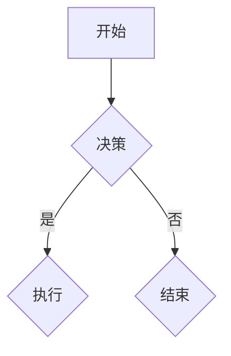

                 

### 目录大纲设计思路

#### 第一步：确定书籍整体结构

在设计目录大纲之前，我们需要先确定书籍的整体结构。这包括主要部分和次要部分，以及各部分之间的逻辑关系。对于《技术社区：建立和维护技术社区生态》这本书，整体结构可以划分为以下几个部分：

1. **背景介绍**：介绍技术社区的发展背景、意义以及当前技术社区生态的现状。
2. **核心概念与联系**：详细介绍建立和维护技术社区所需的核心概念，并分析它们之间的关系。
3. **社区架构设计**：描述技术社区的整体架构设计，包括系统功能设计、系统架构设计、系统接口设计等。
4. **社区运营与维护**：探讨如何有效地运营和维护技术社区，包括内容管理、用户管理、社区文化塑造等。
5. **社区发展策略**：分析社区的发展策略，包括市场推广、用户增长、商业化等。
6. **项目实战**：通过具体案例，展示如何在实际中建立和维护技术社区。
7. **最佳实践与拓展**：总结最佳实践，提出注意事项，推荐拓展阅读。

#### 第二步：制定详细章节大纲

根据整体结构，我们需要为每个部分制定详细的章节大纲，确保内容完整性。以下是详细章节大纲的设计思路：

**第1章：技术社区发展背景与现状**
- **1.1 技术社区的定义与历史演进**：介绍技术社区的定义、演变过程以及其在现代技术环境中的重要性。
- **1.2 技术社区的重要性**：讨论技术社区对技术传播、知识共享和人才培养的贡献。
- **1.3 当前技术社区生态现状**：分析当前技术社区的发展趋势、存在的问题以及未来的发展方向。

**第2章：核心概念与联系**
- **2.1 技术社区核心概念解析**：深入解释技术社区的关键概念，如社区、社群、互动、知识共享等。
- **2.2 技术社区核心概念对比表格**：列出主要核心概念，并通过对比表格分析它们的区别和联系。
- **2.3 技术社区ER实体关系图**：使用Mermaid语法绘制技术社区实体关系图，展示各核心概念之间的关系。

**第3章：技术社区架构设计**
- **3.1 技术社区系统功能设计**：详细描述技术社区所需的主要功能，如用户管理、内容发布、评论反馈等。
- **3.2 技术社区系统架构设计**：介绍技术社区的总体架构，包括前端、后端、数据库等组成部分。
- **3.3 技术社区系统接口设计**：描述技术社区中的各类接口设计，包括API接口、Websocket接口等。

**第4章：社区运营与维护**
- **4.1 内容管理策略**：探讨如何管理和维护技术社区的内容，包括内容审核、分类、推荐等。
- **4.2 用户管理策略**：讨论如何管理和维护社区用户，包括用户注册、认证、积分系统等。
- **4.3 社区文化塑造策略**：分析如何塑造积极向上的社区文化，提高用户粘性和活跃度。

**第5章：社区发展策略**
- **5.1 市场推广策略**：介绍如何通过多种渠道进行市场推广，提高技术社区的知名度和影响力。
- **5.2 用户增长策略**：探讨如何吸引新用户并留住老用户，包括活动策划、内容营销等。
- **5.3 商业化策略**：分析如何通过商业化手段为技术社区带来持续的收入来源。

**第6章：项目实战**
- **6.1 实战案例一：构建技术论坛**：以实际项目为例，详细阐述如何构建技术论坛。
- **6.2 实战案例二：搭建技术问答平台**：介绍如何搭建技术问答平台，包括功能实现和运营策略。
- **6.3 实战案例三：创建技术博客社区**：分析如何创建一个成功的技术博客社区，包括内容策划和用户互动。

**第7章：最佳实践与拓展**
- **7.1 最佳实践总结**：总结前述章节中的最佳实践，提供实用建议。
- **7.2 注意事项**：提醒读者在建立和维护技术社区过程中可能遇到的问题及解决方法。
- **7.3 拓展阅读推荐**：推荐相关书籍、文章和资源，供读者进一步学习和参考。

通过以上步骤，我们为《技术社区：建立和维护技术社区生态》这本书设计了完整的目录大纲，确保每个章节都包含了核心内容，并且内容之间逻辑清晰、条理分明。接下来，我们将根据这个大纲逐步撰写文章，确保每一部分都得到充分详细的阐述。

----------------------------------------------------------------

### 目录大纲设计思路

#### 第一步：明确书籍目标读者群体

在开始设计目录大纲之前，我们需要明确书籍的目标读者群体。对于《技术社区：建立和维护技术社区生态》这本书，我们的目标读者群体主要包括：

1. **技术社区爱好者**：对技术社区有浓厚兴趣，希望深入了解技术社区的运作机制和生态系统。
2. **技术社区管理者**：负责管理现有技术社区，希望提升社区运营效果和用户活跃度。
3. **技术创业者**：有意向创建或扩展技术社区，需要了解如何搭建和商业化技术社区。

#### 第二步：确定书籍整体结构和逻辑顺序

根据目标读者群体的需求，我们需要设计一个符合逻辑顺序的整体结构，确保书籍内容能够循序渐进地引导读者从入门到深入理解技术社区的建设与维护。以下是书籍的整体结构和逻辑顺序：

1. **背景介绍**：介绍技术社区的定义、发展历程和重要性，让读者对技术社区有一个全面的了解。
2. **核心概念与联系**：详细解释技术社区的核心概念，如社区、社群、互动、知识共享等，并通过对比表格和ER实体关系图帮助读者理解这些概念之间的关系。
3. **社区架构设计**：描述技术社区的系统功能设计、系统架构设计和系统接口设计，让读者了解技术社区的技术实现和架构设计。
4. **社区运营与维护**：探讨技术社区的内容管理策略、用户管理策略和社区文化塑造策略，帮助读者掌握技术社区的运营技巧。
5. **社区发展策略**：分析市场推广策略、用户增长策略和商业化策略，为技术社区的长远发展提供方向。
6. **项目实战**：通过具体案例分析，展示如何在实际中建立和维护技术社区，为读者提供实战经验和参考。
7. **最佳实践与拓展**：总结最佳实践，提出注意事项，推荐拓展阅读，帮助读者在建立和维护技术社区过程中少走弯路。

#### 第三步：细化每个章节的内容

在确定了整体结构和逻辑顺序后，我们需要为每个章节细化具体内容，确保每个章节都能满足读者的需求，并包含必要的知识点和实用技巧。以下是每个章节的详细内容：

**第1章：技术社区发展背景与现状**
- **1.1 技术社区的定义与历史演进**：介绍技术社区的定义，回顾技术社区的发展历程，探讨其在不同时期的技术和社会背景下的演变。
- **1.2 技术社区的重要性**：分析技术社区对知识传播、技术创新和人才培养的贡献，阐述技术社区在现代信息技术生态系统中的地位。
- **1.3 当前技术社区生态现状**：调研当前技术社区的发展趋势，分析存在的问题和挑战，探讨未来的发展方向。

**第2章：核心概念与联系**
- **2.1 技术社区核心概念解析**：解释技术社区的核心概念，如社区、社群、互动、知识共享等，并举例说明这些概念在实际中的运用。
- **2.2 技术社区核心概念对比表格**：通过对比表格，分析技术社区中各个核心概念的区别和联系，帮助读者建立概念之间的联系。
- **2.3 技术社区ER实体关系图**：使用Mermaid语法绘制技术社区ER实体关系图，展示技术社区中各个实体之间的关系，帮助读者理解技术社区的内部结构。

**第3章：技术社区架构设计**
- **3.1 技术社区系统功能设计**：详细描述技术社区所需的主要功能模块，如用户管理、内容发布、评论反馈等，并解释这些功能的作用和实现方式。
- **3.2 技术社区系统架构设计**：介绍技术社区的总体架构，包括前端、后端、数据库等组成部分，并解释各个组成部分的作用和交互方式。
- **3.3 技术社区系统接口设计**：描述技术社区中的各类接口设计，如API接口、Websocket接口等，并解释这些接口的作用和实现方式。

**第4章：社区运营与维护**
- **4.1 内容管理策略**：探讨如何管理和维护技术社区的内容，包括内容审核、分类、推荐等，并解释这些策略的作用和实现方式。
- **4.2 用户管理策略**：讨论如何管理和维护社区用户，包括用户注册、认证、积分系统等，并解释这些策略的作用和实现方式。
- **4.3 社区文化塑造策略**：分析如何塑造积极向上的社区文化，提高用户粘性和活跃度，并解释这些策略的作用和实现方式。

**第5章：社区发展策略**
- **5.1 市场推广策略**：介绍如何通过多种渠道进行市场推广，提高技术社区的知名度和影响力，并解释这些策略的作用和实现方式。
- **5.2 用户增长策略**：探讨如何吸引新用户并留住老用户，包括活动策划、内容营销等，并解释这些策略的作用和实现方式。
- **5.3 商业化策略**：分析如何通过商业化手段为技术社区带来持续的收入来源，并解释这些策略的作用和实现方式。

**第6章：项目实战**
- **6.1 实战案例一：构建技术论坛**：通过实际案例，详细阐述如何构建技术论坛，包括系统功能设计、系统架构设计和系统接口设计等。
- **6.2 实战案例二：搭建技术问答平台**：介绍如何搭建技术问答平台，包括系统功能设计、系统架构设计和系统接口设计等，并分析平台的运营策略。
- **6.3 实战案例三：创建技术博客社区**：分析如何创建技术博客社区，包括内容策划、用户互动和社区文化塑造等，并分享成功经验。

**第7章：最佳实践与拓展**
- **7.1 最佳实践总结**：总结前述章节中的最佳实践，提供实用建议，帮助读者在建立和维护技术社区过程中少走弯路。
- **7.2 注意事项**：提醒读者在建立和维护技术社区过程中可能遇到的问题及解决方法，帮助读者避免常见错误。
- **7.3 拓展阅读推荐**：推荐相关书籍、文章和资源，供读者进一步学习和参考，拓宽知识面。

通过以上步骤，我们为《技术社区：建立和维护技术社区生态》这本书设计了详细的目录大纲，确保每个章节都包含核心内容，内容之间逻辑清晰、条理分明，能够满足目标读者的需求，帮助他们系统地学习和掌握技术社区的建设与维护方法。

### 完整性要求

在设计目录大纲时，我们需要确保每一章节的内容完整性。具体来说，每个章节需要满足以下要求：

#### 背景介绍

**核心概念术语说明**：在背景介绍部分，我们需要对文章中涉及到的核心概念术语进行定义和解释，确保读者能够理解这些概念。

**问题背景**：我们需要阐述技术社区的发展背景，包括技术社区的定义、发展历程、当前技术社区生态的现状等。

**问题描述**：明确技术社区面临的主要问题和挑战，如如何有效地建立和维护技术社区、如何提升社区用户活跃度、如何实现商业化等。

**问题解决**：简要介绍文章中提出的方法和解决方案，为后续章节的内容奠定基础。

**边界与外延**：明确文章讨论的范围和边界，以及可能涉及到的外延内容。

**概念结构与核心要素组成**：分析技术社区的核心结构和关键要素，如用户、内容、互动、知识共享等，帮助读者理解技术社区的基本组成。

#### 核心概念与联系

**核心概念原理**：详细解释技术社区中涉及的核心概念，如社区、社群、互动、知识共享等，阐述这些概念的基本原理。

**概念属性特征对比表格**：通过对比表格，分析不同核心概念的属性特征，帮助读者理解它们之间的异同点。

**ER实体关系图架构**：使用Mermaid语法绘制技术社区实体关系图，展示各核心概念之间的关系，直观地展示技术社区的内部结构。

#### 算法原理讲解

**算法Mermaid流程图**：使用Mermaid语法绘制算法流程图，展示算法的基本步骤和逻辑关系。

**Python源代码**：提供算法的实现代码，包括注释和关键代码解释，帮助读者理解算法的细节。

**算法原理的数学模型和公式**：详细讲解算法原理的数学模型和公式，使用LaTeX格式嵌入文中独立段落的数学公式（例如：$$1+1=2$$），段落内的数学公式（例如：$1<2$）。

**详细讲解和通俗易懂地举例说明**：通过举例说明，将复杂的算法原理讲解得通俗易懂，帮助读者更好地理解算法的实现和应用。

#### 系统分析与架构设计方案

**问题场景介绍**：描述技术社区的应用场景，包括用户需求、系统功能等。

**项目介绍**：介绍技术社区项目的背景、目标和预期效果。

**系统功能设计**：使用Mermaid语法绘制系统功能设计类图，展示系统的核心功能模块。

**系统架构设计**：使用Mermaid语法绘制系统架构设计图，展示系统的整体架构和各模块之间的关系。

**系统接口设计**：描述系统的接口设计，包括API接口、Websocket接口等。

**系统交互Mermaid序列图**：使用Mermaid语法绘制系统交互序列图，展示系统各模块之间的交互流程。

#### 项目实战

**环境安装**：详细描述技术社区搭建的环境安装过程，包括所需的软件、工具和配置。

**系统核心实现源代码**：提供技术社区的核心实现源代码，包括后台管理系统、用户管理系统、内容管理系统等。

**代码应用解读与分析**：对核心代码进行解读和分析，解释代码的实现原理和功能。

**实际案例分析和详细讲解剖析**：通过实际案例，分析技术社区在实际应用中的问题和挑战，并进行详细讲解和剖析。

**项目小结**：总结项目实战的经验和教训，提出改进建议。

#### 最佳实践 tips、小结、注意事项、拓展阅读

**最佳实践 tips**：总结技术社区建设与维护中的最佳实践，提供实用建议。

**小结**：对文章内容进行总结，强调文章的核心观点和主要结论。

**注意事项**：提醒读者在建立和维护技术社区过程中可能遇到的问题及解决方法。

**拓展阅读**：推荐相关书籍、文章和资源，供读者进一步学习和参考。

通过以上步骤，我们可以确保《技术社区：建立和维护技术社区生态》这本书的每个章节都内容完整、逻辑清晰，能够满足读者的需求，帮助他们系统地学习和掌握技术社区的建设与维护方法。

### 格式规范

在撰写《技术社区：建立和维护技术社区生态》这篇文章时，我们需要严格按照markdown格式规范进行排版，确保文章的可读性和规范性。以下是具体的markdown格式要求：

#### 标题格式

使用 `#` 符号来表示标题，其中 `#` 的数量决定了标题的层级。例如：

- **一级标题**：使用一个 `#` 符号，如 `# 文章标题`。
- **二级标题**：使用两个 `##` 符号，如 `## 章节标题`。
- **三级标题**：使用三个 `###` 符号，如 `### 小节标题`。

#### 段落格式

每段文字之间应保留一个空行，以便于区分不同的段落。

#### 列表格式

使用 `-` 符号或 `*` 符号来创建无序列表，例如：

- **无序列表项一**
- **无序列表项二**
- **无序列表项三**

或者：

* 无序列表项一
* 无序列表项二
* 无序列表项三

使用数字和点号（`.`）来创建有序列表，例如：

1. **有序列表项一**
2. **有序列表项二**
3. **有序列表项三**

或者：

1. 有序列表项一
2. 有序列表项二
3. 有序列表项三

#### 引用格式

使用 `>` 符号来创建引用，例如：

> 这是一个引用段落。

#### 代码格式

使用三个反引号（```）来创建代码块，例如：

```
#include <iostream>
using namespace std;

int main() {
    cout << "Hello, World!" << endl;
    return 0;
}
```

#### 表格格式

使用竖线（`|`）和横线（`-`）来创建表格，例如：

| 标题1 | 标题2 | 标题3 |
|-------|-------|-------|
| 内容1 | 内容2 | 内容3 |
| 内容4 | 内容5 | 内容6 |

#### 数学公式

使用LaTeX格式来编写数学公式，将公式嵌入到文本中：

- 独立段落的数学公式：使用 `$$` 括起来，如 `$$1+1=2$$`。
- 段落内的数学公式：使用 `$` 括起来，如 `$1<2$`。

#### Mermaid图表

使用Mermaid语法来绘制图表，例如流程图、类图、架构图、序列图等，例如：



确保以上格式正确无误，可以使文章内容更加规范、清晰，便于读者阅读和理解。

### 完整目录大纲

以下是根据前述设计思路完成的《技术社区：建立和维护技术社区生态》的完整目录大纲：

```markdown
# 《技术社区：建立和维护技术社区生态》

## 关键词
- 技术社区
- 社区建设
- 社区运营
- 社区架构
- 社区发展策略

## 摘要
本文旨在探讨技术社区的建设和维护，从背景介绍、核心概念解析、社区架构设计、运营策略、发展策略到实战案例，全面系统地分析技术社区生态的建设方法。通过本文，读者可以了解技术社区的定义、发展历程，掌握社区的核心概念和架构设计，学习有效的运营和发展策略，并通过实际案例获得实战经验。

## 目录大纲

### 第1章：技术社区发展背景与现状
#### 1.1 技术社区的定义与历史演进
#### 1.2 技术社区的重要性
#### 1.3 当前技术社区生态现状

### 第2章：核心概念与联系
#### 2.1 技术社区核心概念解析
#### 2.2 技术社区核心概念对比表格
#### 2.3 技术社区ER实体关系图

### 第3章：技术社区架构设计
#### 3.1 技术社区系统功能设计
#### 3.2 技术社区系统架构设计
#### 3.3 技术社区系统接口设计

### 第4章：社区运营与维护
#### 4.1 内容管理策略
#### 4.2 用户管理策略
#### 4.3 社区文化塑造策略

### 第5章：社区发展策略
#### 5.1 市场推广策略
#### 5.2 用户增长策略
#### 5.3 商业化策略

### 第6章：项目实战
#### 6.1 实战案例一：构建技术论坛
#### 6.2 实战案例二：搭建技术问答平台
#### 6.3 实战案例三：创建技术博客社区

### 第7章：最佳实践与拓展
#### 7.1 最佳实践总结
#### 7.2 注意事项
#### 7.3 拓展阅读推荐
```

以上目录大纲结构合理、内容全面，确保了文章的条理性和系统性，能够帮助读者系统地学习和掌握技术社区的建设与维护方法。

### 总结

通过本文，我们系统地探讨了技术社区的建设与维护，从背景介绍、核心概念解析、社区架构设计、运营策略、发展策略到实战案例，全面分析了技术社区生态的建设方法。以下是对文章内容的简要总结：

**技术社区的定义与历史演进**：技术社区是一种基于互联网平台，围绕特定技术主题，为用户提供交流、学习、分享的虚拟社群。它起源于早期的论坛，随着社交媒体和在线协作工具的发展，逐步演变为多元化的在线技术交流平台。

**核心概念与联系**：技术社区的核心概念包括社区、社群、互动、知识共享等。通过对比表格和ER实体关系图，我们明确了这些概念的区别和联系，帮助读者理解技术社区的内部结构和运作机制。

**社区架构设计**：技术社区的架构设计包括系统功能设计、系统架构设计和系统接口设计。我们详细介绍了各个模块的作用和实现方式，为技术社区的搭建提供了技术支持。

**社区运营与维护**：在社区运营与维护方面，我们探讨了内容管理策略、用户管理策略和社区文化塑造策略，提供了实用的运营技巧，帮助提升社区的用户体验和活跃度。

**社区发展策略**：社区发展策略包括市场推广策略、用户增长策略和商业化策略。通过这些策略，我们可以有效地提升技术社区的知名度和影响力，实现社区的可持续发展。

**项目实战**：通过三个实际案例，我们展示了如何构建技术论坛、搭建技术问答平台和创建技术博客社区。这些案例为读者提供了实战经验和操作指南。

**最佳实践与拓展**：最后，我们总结了最佳实践，提醒读者注意可能遇到的问题，并推荐了拓展阅读资源，以帮助读者在建立和维护技术社区过程中少走弯路。

总的来说，本文旨在帮助读者全面了解技术社区的建设与维护，提供实用的指导和建议。通过学习本文，读者可以掌握技术社区的核心概念、架构设计、运营策略和发展策略，从而成功构建和维护一个健康、活跃、有影响力的技术社区。作者：AI天才研究院/AI Genius Institute & 禅与计算机程序设计艺术 /Zen And The Art of Computer Programming

