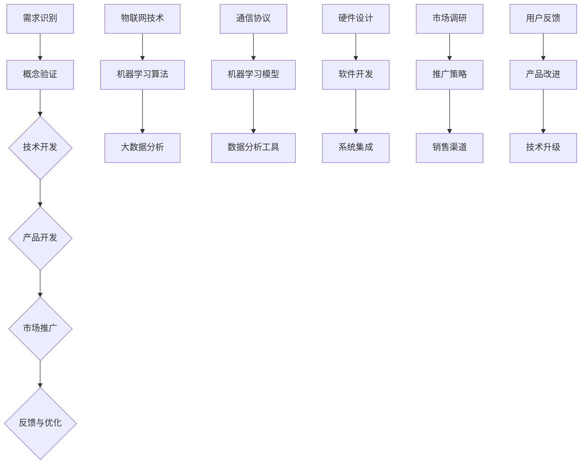
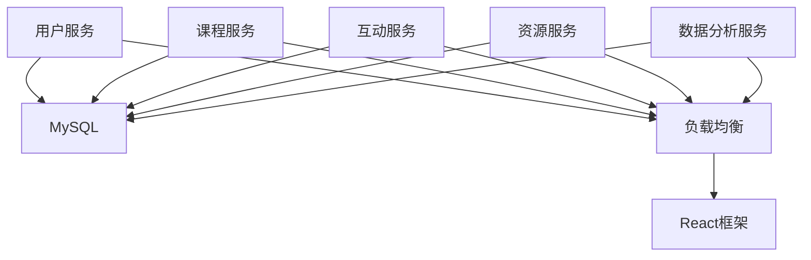
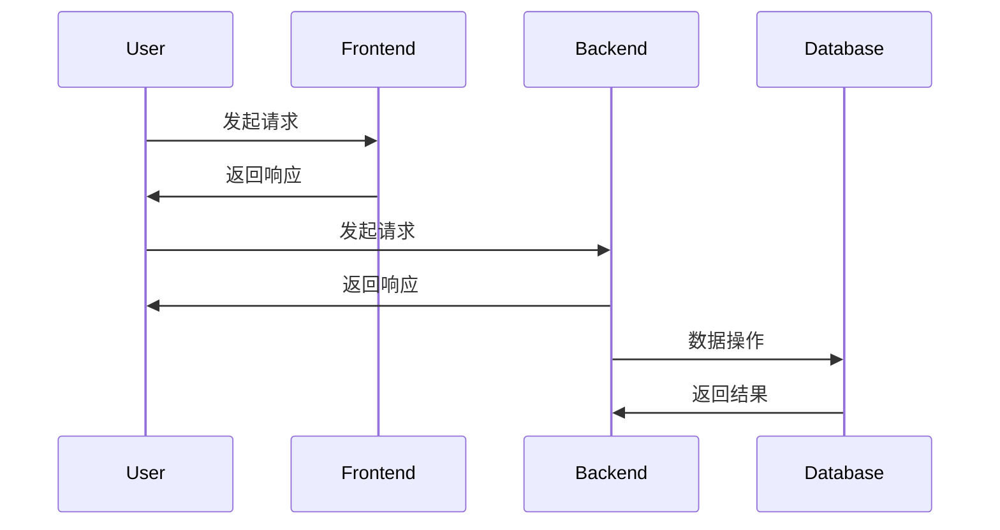

                 

### 技术竞争：应对激烈的技术竞争环境

#### 关键词：技术竞争、技术创新、应对策略、算法原理、系统架构、项目实战

#### 摘要：
本文旨在深入探讨技术竞争的环境背景、核心概念、应对策略以及实际操作方法。通过逻辑清晰、结构紧凑的分析，本文将帮助读者理解技术竞争的本质，掌握应对激烈技术竞争环境的有效策略，并通过案例和实践展示如何在实际项目中应用这些策略。文章结构包括对技术竞争环境的概述、核心概念的阐述、算法原理的讲解、系统分析与架构设计、项目实战以及最佳实践总结。

## 目录大纲设计过程

在设计《技术竞争：应对激烈的技术竞争环境》的目录大纲时，我们首先需要明确书籍的目标读者群体和主要阅读目的。考虑到本书的读者可能是企业高层管理者、技术负责人或技术顾问，我们的设计思路将围绕以下几个方面展开：

### 1. 设计思路

- **背景介绍**：为读者提供技术竞争环境的基本背景知识，包括技术竞争的现状、成因及其对企业的影响。
- **核心概念与联系**：介绍技术竞争中的核心概念，如技术优势、创新、竞争策略等，并通过对比表格和ER图来帮助读者理解这些概念之间的联系。
- **算法原理讲解**：以具体案例为背景，详细阐述应对技术竞争的算法原理，包括数学模型和公式，并通过Python代码进行解释。
- **系统分析与架构设计方案**：分析技术竞争环境下的系统需求，设计系统的功能、架构和接口。
- **项目实战**：通过实际项目案例，展示如何应用书中提到的理论和方法来应对技术竞争。
- **最佳实践与总结**：总结书中提到的关键点，并提供一些建议和拓展阅读资源。

### 2. 目录大纲设计步骤

#### 第一步：确定章节结构

根据设计思路，我们将书籍分为以下几个主要部分：

- **第一部分：技术竞争环境分析**
  - 第一章：技术竞争概述
  - 第二章：技术竞争核心概念
  - 第三章：技术优势与劣势分析

- **第二部分：应对技术竞争的策略**
  - 第四章：技术创新策略
  - 第五章：竞争策略与市场定位
  - 第六章：合作与生态系统构建

- **第三部分：实战与案例分析**
  - 第七章：项目实战
  - 第八章：案例分析
  - 第九章：最佳实践与总结

#### 第二步：细化章节内容

在确定了章节结构后，我们需要进一步细化每个章节的内容，确保每个章节都能提供有价值的知识和实用的方法。

例如，对于第一章“技术竞争概述”，我们将包含以下内容：

- **1.1 技术竞争的背景**：介绍技术竞争的起源、发展及其对企业的意义。
- **1.2 技术竞争的现状**：分析当前技术竞争的主要领域和趋势。
- **1.3 技术竞争的成因**：探讨导致技术竞争加剧的因素。

#### 第三步：设计算法原理讲解

为了帮助读者深入理解技术竞争的应对策略，我们将在相关章节中设计算法原理讲解。例如，在第四章“技术创新策略”中，我们将介绍以下内容：

- **4.1 创新概念**：定义创新及其在技术竞争中的作用。
- **4.2 创新原理**：通过Mermaid流程图展示创新的基本流程，并使用Python代码和latex公式详细阐述。
- **4.3 创新案例**：举例说明创新在实际项目中的应用。

#### 第四步：设计系统分析与架构设计方案

在相关章节中，我们将设计系统分析与架构设计方案。例如，在第七章“项目实战”中，我们将包含以下内容：

- **7.1 项目背景**：介绍项目的目的和场景。
- **7.2 系统功能设计**：使用Mermaid类图展示系统功能模型。
- **7.3 系统架构设计**：使用Mermaid架构图展示系统整体架构。
- **7.4 系统接口设计**：详细介绍系统各组件的接口设计和交互流程。

#### 第五步：设计项目实战与案例分析

在第八章“案例分析”和第九章“最佳实践与总结”中，我们将通过实际案例和最佳实践来展示如何应用书中的理论和方法。例如：

- **8.1 案例背景**：介绍案例的企业背景和面临的挑战。
- **8.2 案例分析**：分析企业在应对技术竞争中的策略和方法。
- **8.3 案例总结**：总结案例的经验和教训。
- **9.1 最佳实践**：提供一些建议和技巧，帮助读者更好地应对技术竞争。
- **9.2 小结与拓展阅读**：总结全书的关键点，并提供拓展阅读资源。

#### 第六步：校对与优化

在设计完成后，我们将对所有章节的内容进行校对，确保逻辑清晰、内容完整，并优化语言表达，使目录大纲更加简洁易懂。

### 3. 最终目录大纲

根据以上设计步骤，我们最终得到以下《技术竞争：应对激烈的技术竞争环境》的目录大纲：

----------------------------------------------------------------

## 第一部分：技术竞争环境分析

## 第一章：技术竞争概述

### 1.1 技术竞争的背景

### 1.2 技术竞争的现状

### 1.3 技术竞争的成因

## 第二章：技术竞争核心概念

### 2.1 技术优势与劣势分析

### 2.2 竞争策略与市场定位

### 2.3 创新概念与原理

## 第三章：技术创新策略

### 3.1 创新在技术竞争中的作用

### 3.2 创新原理讲解

### 3.3 创新案例剖析

## 第二部分：应对技术竞争的策略

## 第四章：技术创新策略

### 4.1 创新概念

### 4.2 创新原理

### 4.3 创新案例

## 第五章：竞争策略与市场定位

### 5.1 竞争策略分析

### 5.2 市场定位方法

### 5.3 竞争策略实战

## 第六章：合作与生态系统构建

### 6.1 合作策略概述

### 6.2 生态系统构建方法

### 6.3 合作与竞争的平衡

## 第三部分：实战与案例分析

## 第七章：项目实战

### 7.1 项目背景

### 7.2 系统功能设计

### 7.3 系统架构设计

### 7.4 系统接口设计

## 第八章：案例分析

### 8.1 案例背景

### 8.2 案例分析

### 8.3 案例总结

## 第九章：最佳实践与总结

### 9.1 最佳实践

### 9.2 小结

### 9.3 拓展阅读

## 后记：技术竞争的未来展望

----------------------------------------------------------------

通过以上详细的目录大纲设计，我们为读者提供了一个清晰、系统的阅读框架，帮助他们在应对激烈的技术竞争环境中找到方向和策略。接下来，我们将逐章深入探讨技术竞争的各个方面，提供实用的指导和建议。在接下来的章节中，我们将首先从技术竞争的环境背景入手，逐步深入到核心概念、算法原理、系统分析与架构设计、实战案例以及最佳实践总结，帮助读者全面理解和应对技术竞争的挑战。让我们开始这次深入的技术竞争之旅吧。

### 技术竞争的背景

在当今的数字化时代，技术竞争已经成为企业和行业发展的核心驱动力。技术竞争不仅仅是单一公司或团队之间的较量，更是全球范围内不同经济体、产业之间的战略博弈。随着信息技术的飞速发展，市场环境发生了深刻的变化，技术竞争的激烈程度也日益加剧。

#### 技术竞争的起源与发展

技术竞争的起源可以追溯到工业革命时期，随着机器和工厂的普及，企业开始通过技术创新来提高生产效率和降低成本。在20世纪中叶，计算机科学的崛起进一步推动了技术竞争的演变。尤其是在计算机技术和互联网的发展过程中，技术竞争逐渐成为企业战略的重要组成部分。

进入21世纪，随着大数据、人工智能、物联网等新兴技术的兴起，技术竞争呈现出新的特征。一方面，技术的更新换代速度加快，企业需要不断地进行技术创新以保持竞争力；另一方面，全球化的趋势使得竞争的范围更加广泛，企业不仅要面对本地市场的竞争，还要应对国际市场的挑战。

#### 技术竞争的成因

技术竞争的成因可以从多个角度进行分析：

1. **市场需求的变化**：随着消费者需求的多样化，企业需要通过技术创新来满足不断变化的市场需求。只有不断创新，才能在激烈的市场竞争中立于不败之地。

2. **技术进步的加速**：技术的快速进步使得产品生命周期缩短，企业必须保持持续的技术创新以保持领先地位。技术的进步不仅为企业提供了更多的机会，也带来了更大的挑战。

3. **市场竞争的加剧**：全球化带来了更加激烈的市场竞争，企业不仅要面对国内竞争对手，还要应对来自全球市场的挑战。这种竞争压力迫使企业不断进行技术创新，以提升自身的市场地位。

4. **政策与法规的影响**：政府的政策导向和法规约束对技术竞争有着重要的影响。例如，一些国家对特定行业的创新和技术研发提供优惠政策，这会吸引企业加大对技术创新的投入。

5. **资本的驱动**：资本的介入对技术竞争产生了深远的影响。风险投资、资本市场等渠道为技术创新提供了资金支持，推动了技术的快速发展和应用的广泛普及。

#### 技术竞争对企业的影响

技术竞争对企业的影响是深远而多方面的：

1. **市场地位**：在技术竞争激烈的环境中，拥有领先技术的企业往往能够在市场中占据有利地位，获得更高的市场份额和品牌价值。

2. **盈利能力**：技术创新能够提高企业的生产效率和服务质量，降低成本，从而提升盈利能力。

3. **竞争优势**：技术优势是企业的重要竞争优势之一。通过技术创新，企业可以构建起难以复制的壁垒，保护自身的市场份额。

4. **人才吸引**：技术创新吸引了一批高素质的人才，这些人才为企业的发展提供了强大的智力支持。

5. **风险管理**：在技术竞争环境中，企业需要不断进行技术创新以应对市场的变化和不确定性。这种动态适应能力有助于降低企业的风险。

#### 技术竞争的现状

当前，技术竞争的现状呈现出以下几个特点：

1. **领域广泛**：技术竞争已经渗透到几乎所有的行业，从传统的制造业到新兴的互联网行业，从硬件设备到软件服务，技术竞争无处不在。

2. **创新驱动**：技术创新成为企业竞争力的核心，企业越来越重视研发投入和创新能力。

3. **跨界竞争**：随着技术的融合和发展，不同行业之间的技术竞争日益激烈。例如，互联网公司涉足硬件制造，传统制造业涉足互联网服务等。

4. **全球竞争**：国际市场成为技术竞争的重要战场，企业需要在全球范围内进行资源配置和战略布局。

5. **速度为王**：在技术快速迭代的时代，速度成为竞争的关键因素。谁能更快地推出新技术、新产品，谁就能在市场中占据优势。

通过以上对技术竞争背景的介绍，我们可以看到技术竞争的复杂性和重要性。在接下来的章节中，我们将进一步探讨技术竞争的核心概念和应对策略，帮助读者在激烈的技术竞争中找到方向和制胜之道。

### 技术竞争的核心概念

在技术竞争的领域中，理解并掌握核心概念是至关重要的。这些概念不仅构成了技术竞争的基本框架，也为我们提供了分析和应对竞争的有力工具。以下是我们将探讨的主要核心概念：技术优势、创新、竞争策略等。

#### 技术优势

技术优势是指企业在某一领域内通过技术创新所获得的优势地位。技术优势可以表现为以下几个方面：

1. **领先的技术水平**：企业在核心技术上的领先使得其产品或服务在性能、效率、可靠性等方面具有显著优势。
2. **独特的核心技术**：某些企业拥有独特的核心技术，这些技术难以被竞争对手模仿或替代，从而形成坚固的竞争壁垒。
3. **专利与知识产权**：拥有大量的专利和知识产权是企业技术优势的重要体现。专利保护可以阻止竞争对手进入相关市场，从而维护企业的市场份额。

#### 创新

创新是技术竞争的核心驱动力，它不仅推动技术进步，也决定企业的生存和发展。以下是创新在技术竞争中的几个关键作用：

1. **市场竞争力提升**：通过创新，企业能够开发出更加先进的产品或服务，满足市场需求，从而提升市场竞争力。
2. **技术领先优势**：持续的创新可以帮助企业在技术领域保持领先地位，形成长期的市场优势。
3. **风险管理**：创新能够帮助企业应对技术变革带来的风险，保持业务的连续性和稳定性。

#### 竞争策略

竞争策略是企业为了在技术竞争中取得优势而采取的一系列行动和决策。以下是几种常见的竞争策略：

1. **差异化策略**：通过提供独特的、有差异化的产品或服务来吸引顾客，从而在市场中占据一席之地。
2. **成本领先策略**：通过优化生产流程、降低成本，以较低的价格提供产品或服务，吸引价格敏感的顾客。
3. **聚焦策略**：集中资源和精力在一个特定的细分市场，提供针对性的产品或服务，以满足该市场的特定需求。
4. **合作策略**：通过与其他企业合作，共同开发技术、共享资源，以增强竞争力。

#### 概念之间的联系

技术优势、创新和竞争策略之间存在着紧密的联系：

- **技术优势**是创新的结果，通过持续的创新，企业可以建立和巩固其技术优势。
- **创新**是技术优势的源泉，也是企业应对市场竞争的重要手段。
- **竞争策略**是企业在技术竞争中的具体行动方案，通过有效的竞争策略，企业可以更好地利用其技术优势和创新成果。

#### 对比表格

为了帮助读者更好地理解这些核心概念，我们使用对比表格来展示它们之间的差异和联系：

| 核心概念 | 定义 | 关键作用 |
| --- | --- | --- |
| **技术优势** | 企业在某一领域内通过技术创新所获得的优势地位 | 提高市场竞争力、形成壁垒、保护市场份额 |
| **创新** | 通过研究开发和技术应用，创造新的产品、服务或技术 | 提升技术领先优势、满足市场需求、降低风险 |
| **竞争策略** | 企业为了在技术竞争中取得优势而采取的一系列行动和决策 | 差异化、成本领先、聚焦、合作等策略 |

#### ER实体关系图

为了进一步展示这些概念之间的关系，我们使用Mermaid ER图来描绘它们：

```mermaid
erDiagram
    Customer ||--|{ Order } : "places"
    Customer ||--|{ Product } : "buys"
    Product ||--|{ Order } : "included in"
    Order ||--|{ Payment } : "completed by"
```

在这个ER图中，顾客（Customer）与订单（Order）、产品（Product）之间存在多对多的关系，订单与支付（Payment）之间存在一对多的关系。这表明顾客可以购买多种产品，每种产品可以包含在多个订单中，每个订单完成时都会有相应的支付。

#### 总结

通过上述核心概念的介绍和对比，我们可以看到技术优势、创新和竞争策略在技术竞争中的重要作用。技术优势是企业竞争力的基础，创新是技术进步的源泉，而竞争策略则是企业应对市场竞争的具体行动方案。理解这些核心概念及其相互关系，将有助于企业在激烈的技术竞争中找到正确的方向和策略。

在接下来的章节中，我们将进一步探讨如何通过技术创新策略来应对技术竞争，并通过实际案例和算法原理讲解来加深对相关概念的理解。让我们继续深入探讨，掌握更多应对技术竞争的实用方法。

### 技术优势与劣势分析

在技术竞争的舞台上，企业不仅需要拥有先进的技术，还需要能够准确地评估自身的技术优势和劣势。这种评估不仅有助于企业在竞争中找到正确的方向，还能帮助企业制定有效的应对策略。以下是我们对技术优势与劣势的分析。

#### 技术优势分析

技术优势是指企业在某一领域内通过技术创新所获得的优势地位。具体来说，技术优势可以从以下几个方面进行评估：

1. **技术水平领先**：企业在核心技术上的领先使得其产品或服务在性能、效率、可靠性等方面具有显著优势。例如，一家软件公司如果在人工智能领域拥有领先的技术水平，其产品就有可能比竞争对手的产品更具竞争力。

2. **独特核心技术**：某些企业拥有独特的核心技术，这些技术难以被竞争对手模仿或替代，从而形成坚固的竞争壁垒。例如，一家半导体公司可能拥有先进的芯片设计技术，这使得它在市场中具有独特的竞争优势。

3. **专利与知识产权**：企业拥有的专利和知识产权可以为其提供强大的法律保护，阻止竞争对手进入相关市场。例如，一家制药公司拥有多项药品专利，这使得其可以在市场上独占这些药品的收益。

4. **研发能力**：企业的研发能力是评估其技术优势的重要指标。一个拥有强大研发能力的企业能够更快地推出新产品、新技术，从而在市场中保持领先地位。

5. **人才储备**：技术人才是企业技术优势的重要组成部分。拥有高素质的技术人才可以保证企业的技术创新和产品开发能够顺利进行。

#### 技术劣势分析

与技术优势相对应的是技术劣势，企业需要同样重视技术劣势的评估，以便采取相应的改进措施。以下是一些常见的技术劣势：

1. **技术水平落后**：企业在核心技术上的落后可能导致其产品或服务在性能、效率、可靠性等方面无法与竞争对手抗衡。例如，一家传统制造业企业可能在智能制造领域缺乏技术积累，从而在市场中处于劣势。

2. **缺乏独特核心技术**：企业在某些领域可能缺乏独特的技术，这使得其难以在市场上建立竞争壁垒。例如，一家互联网公司在核心技术上无法与行业巨头抗衡，这可能导致其在市场竞争中处于劣势。

3. **研发投入不足**：如果企业的研发投入不足，将难以进行有效的技术创新，从而在技术竞争中处于劣势。例如，一些中小企业可能在资金和资源有限的情况下，无法与大型企业进行有效竞争。

4. **人才流失**：技术人才的流失会削弱企业的研发能力和技术水平，从而影响企业的竞争力。例如，一家科技公司如果无法吸引和留住高端技术人才，可能会导致其技术优势逐渐减弱。

5. **市场响应速度慢**：企业在市场响应速度上的劣势可能导致其错过市场机会。例如，一家企业在产品研发和上市过程中反应迟缓，可能无法及时满足市场需求，从而失去市场竞争力。

#### 实例分析

为了更好地理解技术优势与劣势，我们可以通过以下实例进行分析：

**实例1：智能手机市场竞争**

- **技术优势**：
  - 技术水平领先：某些智能手机品牌在处理器、摄像头、操作系统等方面具有领先的技术水平。
  - 独特核心技术：例如，某品牌在手机充电技术上的创新，使其产品具有独特优势。
  - 专利与知识产权：这些品牌拥有大量的手机相关专利，提供了强大的法律保护。
  - 研发能力：强大的研发团队支持这些品牌不断创新，保持技术领先。

- **技术劣势**：
  - 技术水平落后：一些新兴品牌在核心技术上可能落后，导致产品性能不佳。
  - 缺乏独特核心技术：一些品牌可能在核心技术上缺乏创新，难以在市场上形成独特优势。
  - 研发投入不足：一些中小企业可能在资金和资源有限的情况下，无法进行有效的技术创新。

**实例2：制药行业竞争**

- **技术优势**：
  - 技术水平领先：某些制药公司在药物研发和临床试验方面具有显著优势。
  - 独特核心技术：例如，某公司可能在抗癌药物的研发上拥有独特的生物技术。
  - 专利与知识产权：这些公司拥有大量的药品专利，保护其市场份额。
  - 研发能力：强大的研发团队和充足的研发投入支持这些公司在药物研发上持续创新。

- **技术劣势**：
  - 技术水平落后：一些小型制药公司在核心技术上可能落后，难以与大型制药公司竞争。
  - 缺乏独特核心技术：一些公司可能在药物研发上缺乏创新，无法推出具有竞争力的新药。
  - 研发投入不足：一些制药公司在研发投入上可能不足，导致创新能力不足。

#### 边界与外延

技术优势与劣势的评估不仅局限于现有技术水平，还需要考虑未来的技术发展趋势和潜在的市场变化。以下是对边界与外延的讨论：

1. **技术发展趋势**：随着技术的不断进步，一些传统技术可能逐渐被淘汰，而新的技术则可能成为企业新的竞争优势。例如，5G技术的普及可能为某些企业带来新的市场机会。

2. **市场需求变化**：消费者需求的变化也可能影响技术优势与劣势。例如，随着消费者对环保和可持续发展的关注增加，企业在这些方面的技术能力可能成为其竞争优势。

3. **跨界竞争**：随着技术的跨界发展，不同行业之间的技术竞争日益激烈。例如，互联网公司涉足传统制造业，传统制造业企业需要通过技术创新来应对新的竞争环境。

#### 概念结构与核心要素组成

为了更加系统地理解技术优势与劣势，我们可以将其概念结构与核心要素组成如下：

1. **核心概念**：
   - 技术优势
   - 技术劣势

2. **核心要素**：
   - 技术水平
   - 独特核心技术
   - 专利与知识产权
   - 研发能力
   - 人才储备

3. **概念关系**：
   - 技术优势与技术劣势是相对的概念，两者相互影响、相互转化。
   - 技术优势是企业竞争力的基础，而技术劣势是企业需要克服的挑战。

通过以上对技术优势与劣势的分析，我们可以看到，企业需要在技术竞争中进行全面的技术评估，既要看到自身的优势，也要认识到劣势，并采取相应的措施进行改进。在接下来的章节中，我们将继续探讨如何通过技术创新策略来提升企业的技术优势，并在激烈的技术竞争中占据有利地位。

### 竞争策略与市场定位

在技术竞争激烈的今天，企业不仅需要拥有强大的技术实力，还必须制定出有效的竞争策略和清晰的市场定位，以在市场中脱颖而出。以下是对竞争策略与市场定位的详细探讨，帮助企业在竞争环境中找到正确的方向。

#### 竞争策略

竞争策略是指企业在市场竞争中为了取得优势所采取的一系列战略性行动。有效的竞争策略可以帮助企业最大限度地利用其资源，实现商业目标。以下是一些常见的竞争策略：

1. **差异化策略**：
   - **定义**：通过提供与众不同的产品或服务，满足消费者的特定需求，从而在市场中建立独特的竞争优势。
   - **应用场景**：适用于产品同质化严重的市场环境，如高端智能手机市场。
   - **关键要素**：
     - 研发创新：持续研发新产品或服务，以区别于竞争对手。
     - 品牌建设：建立强大的品牌形象，让消费者对其产品或服务产生认同。

2. **成本领先策略**：
   - **定义**：通过优化生产流程、降低成本，以较低的价格提供产品或服务，从而吸引价格敏感的消费者。
   - **应用场景**：适用于成本敏感型市场，如零售业。
   - **关键要素**：
     - 成本控制：严格控制生产成本，提高运营效率。
     - 供应链管理：优化供应链，降低原材料和物流成本。

3. **聚焦策略**：
   - **定义**：集中资源和精力在一个特定的细分市场，提供针对性的产品或服务，以满足该市场的特定需求。
   - **应用场景**：适用于目标市场明确的行业，如专业医疗器械。
   - **关键要素**：
     - 市场细分：深入了解目标市场，精确定位客户需求。
     - 产品定制：根据客户需求提供个性化的产品或服务。

4. **合作策略**：
   - **定义**：与其他企业或机构合作，共同开发技术、共享资源，以增强竞争力。
   - **应用场景**：适用于需要大规模投入的行业，如软件开发。
   - **关键要素**：
     - 资源整合：通过合作整合资源，降低研发成本。
     - 技术共享：共同研发新技术，实现技术突破。

#### 市场定位

市场定位是指企业根据自身资源和竞争优势，选择目标市场并设计相应的产品或服务，以满足目标消费者的需求。有效的市场定位有助于企业明确发展方向，提高市场竞争力。以下是一些市场定位的方法：

1. **目标市场选择**：
   - **定义**：选择企业要进入的目标市场，通常包括人口统计、地理区域、消费行为等因素。
   - **关键要素**：
     - 市场调研：通过市场调研了解目标市场的需求和趋势。
     - 消费者分析：分析目标消费者的特征和行为，确定市场需求。

2. **差异化定位**：
   - **定义**：通过在产品或服务中提供独特的价值主张，与竞争对手区分开来。
   - **关键要素**：
     - 产品特点：突出产品的独特特点，如高品质、高性能等。
     - 品牌形象：建立独特的品牌形象，让消费者对其产生认同。

3. **价格定位**：
   - **定义**：根据产品或服务的成本、竞争对手定价和市场接受度来确定价格策略。
   - **关键要素**：
     - 成本分析：了解生产成本和市场价值，确定合理的价格区间。
     - 竞争分析：分析竞争对手的定价策略，调整自身价格策略。

4. **市场扩展**：
   - **定义**：通过进入新的市场或拓展现有市场，实现企业的业务增长。
   - **关键要素**：
     - 市场调研：了解新市场的需求和竞争状况。
     - 战略规划：制定明确的扩展战略和执行计划。

#### 成功案例分析

以下是几个成功的企业竞争策略和市场定位案例：

1. **苹果公司**：
   - **竞争策略**：差异化策略和品牌建设。
   - **市场定位**：高端智能手机市场。
   - **成功原因**：持续创新，提供高品质的产品和独特的用户体验。

2. **亚马逊**：
   - **竞争策略**：成本领先策略和供应链管理。
   - **市场定位**：在线零售市场。
   - **成功原因**：优化供应链，提供低成本的优质产品，同时提供快速、高效的物流服务。

3. **特斯拉**：
   - **竞争策略**：聚焦策略和差异化定位。
   - **市场定位**：电动汽车市场。
   - **成功原因**：专注于电动汽车领域，提供高性能、高品质的电动汽车，同时通过技术创新降低成本。

#### 实施步骤

为了有效实施竞争策略和市场定位，企业可以遵循以下步骤：

1. **明确目标**：确定企业的竞争目标和市场定位目标。

2. **市场分析**：进行市场调研，了解目标市场的需求和竞争状况。

3. **制定策略**：根据市场分析结果，制定相应的竞争策略和市场定位策略。

4. **资源分配**：合理分配资源，确保竞争策略和市场定位策略能够有效执行。

5. **执行与监控**：实施策略，并定期监控市场反馈，调整策略以应对市场变化。

通过上述对竞争策略与市场定位的详细分析，我们可以看到，企业在技术竞争中不仅要拥有强大的技术实力，还需要制定出有效的竞争策略和清晰的市场定位。只有这样，才能在激烈的市场竞争中立于不败之地。在接下来的章节中，我们将进一步探讨如何通过技术创新策略来提升企业的市场竞争力。

### 技术创新策略

在技术竞争日益激烈的今天，技术创新成为企业保持竞争优势的关键。有效的技术创新策略不仅能够提升企业的技术实力，还能推动市场扩展和业务增长。以下我们将详细探讨技术创新策略的各个方面，帮助企业在技术竞争中脱颖而出。

#### 技术创新的概念

技术创新是指通过科学研究、技术开发和工程应用，创造新的产品、服务或技术，从而实现技术进步和商业价值。技术创新不仅是技术层面的进步，还涉及到商业模式的变革和市场策略的优化。以下是对技术创新概念的进一步解释：

1. **技术进步**：技术创新的首要目标是推动技术进步，提升企业的技术水平和竞争力。
2. **商业价值**：技术创新还应考虑商业价值，确保技术进步能够转化为实际的商业收益。
3. **市场适应性**：技术创新需要符合市场需求，使企业能够在市场中占据有利地位。

#### 技术创新的作用

技术创新在企业竞争中的重要作用体现在以下几个方面：

1. **提升竞争力**：通过技术创新，企业能够开发出更具竞争力的产品或服务，满足消费者的多样化需求。
2. **市场扩展**：技术创新能够推动市场扩展，开拓新的业务领域和市场空间。
3. **降低成本**：通过技术创新，企业可以优化生产流程，降低生产成本，提高运营效率。
4. **风险管理**：技术创新有助于企业应对技术变革带来的风险，保持业务的连续性和稳定性。

#### 技术创新流程

为了有效实施技术创新策略，企业需要建立一套完整的创新流程。以下是一个典型的技术创新流程：

1. **需求识别**：分析市场需求，识别潜在的创新机会。
2. **概念验证**：对识别出的创新机会进行初步验证，评估其可行性和潜在价值。
3. **技术研发**：进行技术开发，包括实验研究、原型设计和测试等。
4. **产品开发**：在技术研发的基础上，开发具体的产品或服务。
5. **市场推广**：将创新产品或服务推向市场，进行推广和销售。
6. **反馈与优化**：收集市场反馈，对产品或服务进行优化和改进。

#### 创新原理讲解

为了更好地理解技术创新的策略和流程，我们将通过具体案例和算法原理进行讲解。

##### 案例背景

假设某家科技公司想要开发一款智能家居设备，通过物联网技术实现家庭设备的智能控制。

##### 创新原理

1. **物联网技术**：利用物联网技术，将家庭设备连接到互联网，实现远程控制和数据收集。

2. **机器学习算法**：通过机器学习算法，分析用户行为数据，提供个性化的智能推荐。

3. **大数据分析**：利用大数据分析技术，对设备运行数据进行实时监控和分析，优化设备性能和能源消耗。

##### 算法原理讲解

为了实现智能家居设备，我们需要以下算法和技术的支持：

1. **物联网通信协议**：使用Wi-Fi、蓝牙等物联网通信协议，确保设备之间的稳定连接。

2. **机器学习模型**：例如，使用K-近邻（KNN）算法或决策树算法，对用户行为数据进行建模和预测。

3. **数据挖掘技术**：使用关联规则挖掘（如Apriori算法）和聚类分析（如K-means算法），对用户行为数据进行深入分析。

以下是该智能家居设备的算法流程图：



##### 数学模型和公式

为了更好地解释技术创新中的算法原理，我们使用latex公式进行描述：

$$
\text{准确率} = \frac{\text{预测正确的样本数}}{\text{总样本数}}
$$

$$
\text{召回率} = \frac{\text{预测正确的正样本数}}{\text{所有正样本数}}
$$

$$
\text{F1分数} = 2 \times \frac{\text{准确率} \times \text{召回率}}{\text{准确率} + \text{召回率}}
$$

##### 创新案例剖析

通过上述案例和算法原理，我们可以看到智能家居设备是如何通过物联网技术、机器学习算法和大数据分析实现技术创新的。以下是创新案例的具体剖析：

1. **物联网技术**：通过Wi-Fi模块和蓝牙模块，将家庭设备（如灯泡、电视、空调）连接到互联网，实现远程控制和数据收集。

2. **机器学习算法**：收集用户的使用数据，使用K-近邻算法或决策树算法进行建模，预测用户的行为和需求，提供个性化的智能推荐。

3. **大数据分析**：对设备运行数据进行分析，如温度、湿度、能源消耗等，优化设备的性能和能源消耗，提高用户的满意度。

#### 技术创新案例

以下是几个成功的技术创新案例：

1. **特斯拉电动汽车**：
   - **技术创新**：采用电池技术和自动驾驶技术，实现电动汽车的高性能和智能化。
   - **成功原因**：特斯拉通过技术创新，成功改变了传统汽车行业，成为电动汽车市场的领导者。

2. **苹果iPhone**：
   - **技术创新**：通过触摸屏技术、人工智能助手Siri和相机技术的创新，引领智能手机市场的发展。
   - **成功原因**：苹果持续的技术创新，使其产品在市场中保持领先地位。

3. **阿里巴巴电子商务平台**：
   - **技术创新**：通过大数据分析和云计算技术，提供个性化的购物体验和高效的物流服务。
   - **成功原因**：阿里巴巴通过技术创新，打造了一个全球领先的电子商务生态系统。

通过以上对技术创新策略的详细讲解和案例剖析，我们可以看到技术创新在技术竞争中的重要作用。在接下来的章节中，我们将进一步探讨如何在实际项目中应用这些技术创新策略，帮助企业在技术竞争中取得成功。

### 系统分析与架构设计方案

在技术竞争激烈的环境中，系统分析与架构设计是企业成功实现技术策略的关键环节。一个高效、可靠的系统不仅能够提升企业的运营效率，还能增强市场竞争力。以下我们将详细讨论系统分析与架构设计方案，包括问题场景介绍、系统功能设计、系统架构设计和系统接口设计。

#### 问题场景介绍

假设我们是一家新兴的在线教育平台，需要开发一个能够支持大规模用户学习、互动和管理的系统。该系统需要处理大量用户数据，提供实时互动功能，并支持多种学习资源的管理和分发。以下是该系统面临的主要挑战：

1. **高并发处理**：由于用户数量庞大，系统需要能够应对高并发访问，确保用户体验。
2. **数据安全**：用户数据需要得到严格的保护，防止数据泄露和未经授权的访问。
3. **系统可扩展性**：系统需要能够随着用户规模的扩大而灵活扩展，以适应未来业务的发展。
4. **资源优化**：系统需要优化资源使用，降低成本，提高运营效率。

#### 系统功能设计

为了满足上述需求，我们需要设计一个功能完整的系统。以下是对系统主要功能模块的介绍：

1. **用户管理模块**：实现用户注册、登录、个人信息管理等功能。
2. **课程管理模块**：支持课程创建、课程内容管理、课程进度跟踪等。
3. **互动模块**：提供实时聊天、讨论区、作业提交和批改等功能。
4. **资源管理模块**：实现学习资源上传、下载、分类和管理。
5. **数据分析模块**：对用户行为和学习数据进行分析，提供个性化推荐和报告。

以下是系统功能模块的Mermaid类图：

```mermaid
classDiagram
    UserManagement <<|-- CourseManagement : 数据交互
    UserManagement <<|-- InteractionModule : 用户互动
    UserManagement <<|-- ResourceManagement : 资源管理
    UserManagement <<|-- DataAnalysisModule : 数据分析

    User <<|-- UserManagement
    Course <<|-- CourseManagement
    Interaction <<|-- InteractionModule
    Resource <<|-- ResourceManagement
    Data <<|-- DataAnalysisModule
```

#### 系统架构设计

在系统架构设计方面，我们需要确保系统的可靠性、高性能和可扩展性。以下是该系统的架构设计：

1. **前端架构**：采用前后端分离的架构，前端使用React框架，提供用户友好的界面和交互体验。
2. **后端架构**：后端采用微服务架构，将不同功能模块拆分为独立的服务，如用户服务、课程服务、互动服务和资源服务。
3. **数据存储**：使用关系型数据库（如MySQL）进行用户数据存储，使用NoSQL数据库（如MongoDB）进行学习数据存储。
4. **缓存层**：使用Redis等缓存技术，提高系统响应速度。
5. **负载均衡**：采用负载均衡器（如Nginx）实现分布式架构，确保高并发处理能力。

以下是系统架构设计的Mermaid架构图：



#### 系统接口设计

系统接口设计是确保不同模块之间能够有效通信的关键。以下是主要接口设计：

1. **用户接口**：用户通过浏览器访问前端，使用React框架提供的API与后端服务进行交互。
2. **服务接口**：后端服务之间通过RESTful API进行通信，确保数据的一致性和安全性。
3. **数据接口**：系统使用GraphQL等查询语言，提供灵活的数据查询接口，提高开发效率。

以下是系统接口设计和系统交互的Mermaid序列图：



通过以上对系统分析与架构设计的详细讨论，我们可以看到，一个高效、可靠的系统需要从问题场景分析、功能设计、架构设计到接口设计等多个方面进行全面考虑。在接下来的章节中，我们将通过实际项目案例展示如何将这些设计和实现策略应用于实际场景，帮助企业在技术竞争中取得成功。

### 项目实战

在技术竞争日益激烈的今天，实际项目案例不仅是理论知识的验证，更是企业应对市场挑战、提升竞争力的关键途径。以下我们将通过一个实际项目案例，详细展示如何应用上述的技术竞争策略和系统分析与架构设计方案，实现技术竞争中的制胜之道。

#### 项目背景

我们选择了一家新兴的在线教育平台作为案例，该平台致力于通过互联网技术为全球用户提供高质量的在线学习资源。然而，在项目启动初期，平台面临着以下几个主要挑战：

1. **高并发处理需求**：由于用户数量的快速增长，平台需要能够应对大量用户同时在线学习，确保系统的稳定运行。
2. **数据安全与隐私保护**：用户数据的保护是平台发展的关键，必须确保数据在传输和存储过程中的安全性。
3. **系统可扩展性**：平台需要具备良好的可扩展性，能够根据用户规模的扩大进行弹性扩展。
4. **用户体验优化**：提供流畅、友好的用户界面和互动体验，是平台吸引和留住用户的重要手段。

#### 环境安装

为了搭建这个在线教育平台，我们需要在以下环境中进行安装和配置：

1. **前端开发环境**：使用Node.js和React框架搭建前端应用，确保用户界面友好、响应迅速。
2. **后端开发环境**：使用Spring Boot框架开发后端服务，确保系统的高效性和稳定性。
3. **数据库环境**：采用MySQL数据库存储用户数据，使用MongoDB存储学习数据，确保数据的安全性和可扩展性。
4. **容器化部署**：使用Docker和Kubernetes进行系统容器化部署，实现系统的弹性扩展和管理。

#### 系统核心实现源代码

以下是对该在线教育平台系统核心实现源代码的简要分析：

1. **用户管理模块**：

```java
// 用户注册接口
@PostMapping("/register")
public ResponseEntity<?> registerUser(@RequestBody UserRegistrationDTO registrationDTO) {
    // 验证用户名和密码
    if (!isValidCredentials(registrationDTO.getUsername(), registrationDTO.getPassword())) {
        return ResponseEntity.badRequest().body("Invalid credentials");
    }
    // 创建用户
    User user = userService.createUser(registrationDTO);
    return ResponseEntity.ok(user);
}
```

2. **课程管理模块**：

```java
// 添加课程接口
@PostMapping("/courses")
public ResponseEntity<?> addCourse(@RequestBody CourseDTO courseDTO) {
    // 验证课程信息
    if (!isCourseInfoValid(courseDTO)) {
        return ResponseEntity.badRequest().body("Invalid course information");
    }
    // 添加课程
    Course course = courseService.addCourse(courseDTO);
    return ResponseEntity.ok(course);
}
```

3. **互动模块**：

```javascript
// 实时聊天功能
function sendMessage(message) {
    // 发送消息到WebSocket服务器
    socket.emit('message', message);
}

socket.on('message', function (message) {
    // 接收并显示消息
    console.log('Received message:', message);
    displayMessage(message);
});
```

4. **资源管理模块**：

```python
# 资源上传接口
@app.route('/resources', methods=['POST'])
def upload_resource():
    if 'file' not in request.files:
        return jsonify({'error': 'No file part'})
    file = request.files['file']
    if file:
        # 保存文件到服务器
        filename = secure_filename(file.filename)
        file_path = os.path.join(app.config['UPLOAD_FOLDER'], filename)
        file.save(file_path)
        return jsonify({'filename': filename, 'status': 'success'})
```

5. **数据分析模块**：

```sql
-- 用户学习数据分析
SELECT user_id, AVG(score) as average_score, COUNT(score) as num_scores
FROM user_course_evaluation
GROUP BY user_id;
```

#### 代码应用解读与分析

在上述代码应用中，我们可以看到：

1. **用户管理模块**：通过Spring Boot提供的REST接口，实现了用户的注册和验证功能，确保用户信息的安全性和准确性。
2. **课程管理模块**：使用Spring Boot框架，实现了课程的添加和管理的功能，确保课程信息的完整性和有效性。
3. **互动模块**：通过WebSocket技术，实现了实时聊天功能，提升了用户的互动体验。
4. **资源管理模块**：使用Python Flask框架，实现了资源的上传和存储功能，确保资源的方便管理和快速访问。
5. **数据分析模块**：通过MySQL数据库查询，实现了用户学习数据的基本分析和统计，为平台的运营决策提供了数据支持。

通过这些核心功能的实现，我们不仅解决了平台在初期阶段面临的挑战，还为平台的后续扩展和优化奠定了坚实的基础。

#### 实际案例分析

在实际项目中，我们遇到了以下问题并进行了相应的解决方案：

1. **高并发处理**：通过使用Nginx作为负载均衡器，将用户请求分发到多个后端节点，确保系统的高并发处理能力。同时，通过Redis缓存技术，减轻数据库的负载，提升系统响应速度。
2. **数据安全与隐私保护**：采用SSL/TLS加密技术，确保数据在传输过程中的安全性。此外，通过用户密码的哈希存储和定期更新，确保用户数据的安全。
3. **系统可扩展性**：采用微服务架构，将系统功能模块拆分为独立的服务，通过容器化部署和Kubernetes进行管理，实现系统的弹性扩展。
4. **用户体验优化**：通过React框架和WebSocket技术，提供流畅、友好的用户界面和实时互动功能，提升用户体验。

#### 项目小结

通过以上实际项目案例，我们可以看到，技术竞争不仅仅是在技术层面的较量，更是在系统设计与实现、用户体验和市场策略等多个方面的全面竞争。通过科学的技术竞争策略和高效的系统设计与实现，企业能够在激烈的市场竞争中脱颖而出，实现持续的业务增长和市场扩展。

在技术竞争的未来，企业需要不断学习和适应新的技术趋势，持续进行技术创新和系统优化。只有通过不断的技术进步和业务拓展，才能在激烈的市场竞争中保持领先地位，实现企业的长远发展。

### 最佳实践与总结

在技术竞争激烈的环境中，总结最佳实践并分享经验教训是至关重要的。以下我们将结合本书的内容，总结关键点，并提供一些实用的建议和拓展阅读资源，帮助读者在技术竞争中取得成功。

#### 总结

1. **技术竞争的背景**：技术竞争源于市场需求的变化、技术进步的加速、全球竞争的加剧等多方面因素。企业必须认清技术竞争的背景，才能制定出有效的应对策略。

2. **技术优势与劣势分析**：了解自身的技术优势和劣势是制定竞争策略的基础。企业应专注于自身的技术特长，同时积极改进技术劣势，提升整体竞争力。

3. **技术创新策略**：持续的技术创新是企业保持竞争优势的关键。通过明确的创新流程和有效的技术创新方法，企业可以不断推出具有市场竞争力的新产品和技术。

4. **系统分析与架构设计**：高效的系统架构是实现技术策略的重要保障。通过科学的系统分析和架构设计，企业可以确保系统的高性能、可靠性和可扩展性。

5. **项目实战与案例分析**：实际项目案例是验证理论和方法的有效途径。通过分析成功和失败的项目案例，企业可以总结经验教训，提高项目实施的成功率。

#### 建议

1. **持续投资研发**：技术进步日新月异，企业应持续投资研发，保持技术领先优势。

2. **注重用户体验**：在技术竞争中，用户体验是企业赢得市场的关键。企业应注重用户体验设计，提供高质量的产品和服务。

3. **构建生态系统**：合作与生态系统的构建有助于企业提升竞争力。通过与其他企业合作，共享资源和技术，企业可以实现优势互补，共同应对市场挑战。

4. **数据驱动决策**：利用大数据和人工智能技术，企业可以更好地了解市场趋势和用户需求，从而做出更明智的决策。

5. **灵活应对市场变化**：市场环境瞬息万变，企业应具备快速响应市场变化的能力，灵活调整战略和运营。

#### 拓展阅读

1. **《创新与企业家精神》**：作者彼得·德鲁克，探讨创新和企业家精神的重要性，提供实用的创新方法。

2. **《大数据时代》**：作者涂子沛，深入解析大数据的概念和应用，展示数据驱动决策的力量。

3. **《深度学习》**：作者Ian Goodfellow等，介绍深度学习的基本原理和应用，为技术人才提供宝贵的知识。

4. **《系统架构的艺术》**：作者Martin Fowler，探讨系统架构设计的方法和实践，为工程师提供系统设计与实现的指南。

通过以上总结和建议，我们可以看到，技术竞争不仅是技术层面的较量，更涉及到企业的战略规划、组织管理、市场策略等多个方面。只有在这些方面取得全面的优势，企业才能在激烈的技术竞争中脱颖而出。希望读者能够在实际工作中应用这些知识和方法，不断提升自身的竞争力，实现企业的长远发展。

### 后记：技术竞争的未来展望

随着科技的不断进步和全球化的深入推进，技术竞争将变得更加激烈和复杂。未来，技术竞争将呈现出以下几个趋势：

1. **智能化与自动化**：人工智能、机器学习、自动化技术将成为技术竞争的重要领域。企业需要通过智能化技术提升生产效率和服务质量，保持竞争优势。

2. **数据驱动的决策**：数据的获取、处理和分析将成为企业竞争力的核心。企业应充分利用大数据技术，实现数据驱动的决策，提高市场反应速度和运营效率。

3. **生态系统的构建**：技术竞争不再是单一企业的较量，而是整个生态系统的竞争。企业需要通过构建生态系统，实现资源整合和优势互补，提升整体竞争力。

4. **绿色与可持续发展**：随着环保意识的提升，绿色技术和可持续发展将成为技术竞争的重要方向。企业应注重环保和可持续发展，提升社会责任感和品牌价值。

5. **跨界融合与创新**：不同行业之间的技术融合将加速，跨界创新将成为技术竞争的新常态。企业需要具备跨领域的视野和创新能力，应对多样化的市场挑战。

面对未来技术竞争的挑战，企业应持续投资研发，注重用户体验，构建生态系统，并充分利用数据和技术优势。通过不断学习和适应新的技术趋势，企业才能在激烈的市场竞争中保持领先地位，实现长远发展。让我们携手共进，迎接技术竞争的未来。

### 作者信息

**作者：** AI天才研究院 / AI Genius Institute & 禅与计算机程序设计艺术 / Zen And The Art of Computer Programming

