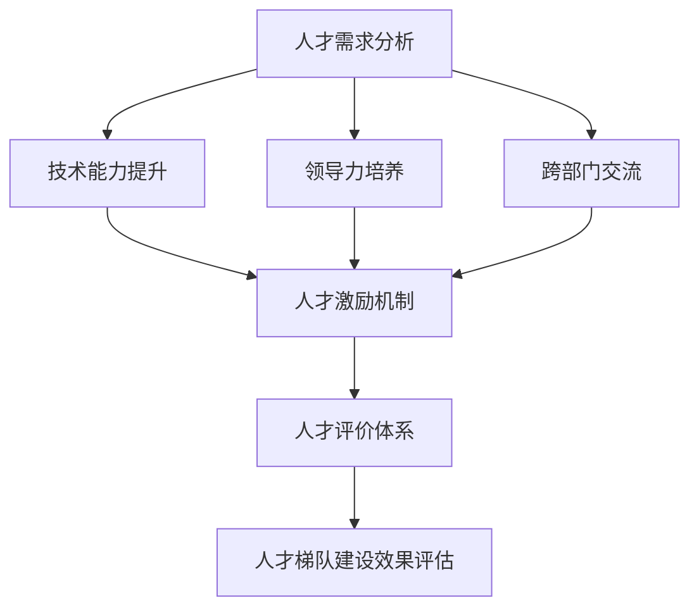

                 

### 第一部分：引言

#### 第1章：技术管理中的人才梯队建设概述

##### 1.1 人才梯队建设的背景与意义

在当前快速发展的技术行业中，企业面临着诸多挑战，其中之一便是人才短缺。随着技术更新迭代的速度不断加快，企业对技术人才的需求也在持续增长。然而，现实中许多企业却面临人才流失、人才结构不合理、人才培养机制不完善等问题，这些问题严重制约了企业的发展。

**问题背景**

1. **技术行业面临的挑战**
   - 技术行业日新月异，要求从业人员不断学习新技能。
   - 企业在市场竞争中需要快速响应技术变革，以保持竞争力。
   - 技术人才的供需不平衡，很多企业难以吸引和留住优秀人才。

2. **人才短缺对企业发展的影响**
   - 人才短缺导致项目进度延误，影响企业竞争力。
   - 技术创新能力不足，难以跟上行业前沿。
   - 人才培养和储备不足，未来企业发展受限。

**问题描述**

1. **人才流失问题**
   - 高技能人才频繁跳槽，带走技术和经验。
   - 员工流失率上升，增加企业培训和招聘成本。

2. **人才结构不合理**
   - 技术团队中高级技术人才比例不足。
   - 部分岗位缺乏专业人才，导致工作效率低下。

3. **人才培养机制不完善**
   - 缺乏系统的人才培养计划和方案。
   - 内部培训资源不足，难以满足员工的成长需求。

**问题解决**

1. **制定有效的人才梯队建设策略**
   - 明确企业人才战略，制定长期规划。
   - 设立明确的人才发展目标，确保人才供应链的稳定。

2. **提升人才培养和留存率**
   - 建立完善的培训体系，提供多样化的培训机会。
   - 提高员工福利待遇，改善工作环境，增加员工归属感。

3. **优化人才结构**
   - 通过人才盘点，了解现有人才结构和能力水平。
   - 制定人才引进和培养计划，逐步优化人才结构。

**边界与外延**

1. **人才梯队建设的范畴**
   - 包括人才的需求分析、培养、评价、激励和留任等环节。
   - 涉及企业内部和外部的各类人才，如研发、运维、管理人才等。

2. **企业内外部人才来源**
   - 内部人才：通过内部选拔、培训和发展来提升。
   - 外部人才：通过外部招聘、合作、引进等渠道引入。

**核心概念与联系**

- **人才梯队的定义**
  - 对人才的分类与分层，形成有序的人才结构。
  - 不同层级人才的能力要求，确保人才梯队的有效性。

- **核心概念联系图**

  ```mermaid
  graph TD
  A[人才需求分析] --> B{人才培养与开发}
  B --> C{人才评价体系}
  B --> D{人才激励机制}
  C --> E{人才梯队建设效果评估}
  D --> E
  ```

通过以上内容，我们可以初步了解技术管理中的人才梯队建设的重要性、背景、问题和解决方案。接下来，我们将进一步探讨人才梯队建设的关键要素、方法与工具，以便为企业提供更具体、更实际的操作指导。

#### 1.2 人才梯队建设的关键要素

在技术管理中，人才梯队建设是一个复杂而系统的过程，需要综合考虑多个关键要素，以构建一个稳定、高效的人才体系。以下是人才梯队建设中的核心要素及其作用。

**核心要素原理**

1. **人才需求分析**
   - **企业战略目标**：人才需求分析首先需要与企业的战略目标相结合，明确企业未来的发展方向和所需的人才类型。
   - **市场人才需求**：了解当前市场对各类技术人才的需求状况，包括稀缺性、薪酬水平和未来发展趋势。

2. **人才培养与开发**
   - **培养计划**：根据人才需求，制定详细的培养计划，包括技术培训、领导力培训和跨部门交流等。
   - **开发机制**：建立持续的人才开发机制，通过项目实践、导师制度、外部学习等方式提升员工能力。

**核心要素对比表格**

| 要素             | 定义                                                         | 目标                                                                                           |
|------------------|--------------------------------------------------------------|------------------------------------------------------------------------------------------------|
| 人才需求分析     | 分析企业战略目标和市场人才需求，确定人才缺口和需求类型。       | 确保人才供应与企业发展同步，满足技术需求。                                                       |
| 技术能力提升     | 通过培训和实践提升员工的专业技术能力。                       | 增强团队的技术实力，提升项目完成质量和效率。                                                     |
| 领导力培养       | 培养员工的管理能力和领导能力，以支持企业的长期发展。           | 建立一支高效的管理团队，推动企业创新和变革。                                                     |
| 跨部门交流       | 促进不同部门之间的信息交流，提升整体协作能力。                 | 增强团队合作，打破部门壁垒，提高企业运营效率。                                                   |
| 人才激励机制     | 设计激励机制，包括薪酬激励、股权激励等，激发员工的工作热情。   | 提高员工满意度，降低流失率，留住核心人才。                                                       |
| 人才评价体系     | 建立科学的评价体系，对员工进行全面的绩效评估。                 | 公正、客观地评估员工表现，为人才晋升和激励提供依据。                                             |

**核心要素联系图**



通过上述核心要素的对比，我们可以看到，每一个要素都不是孤立存在的，而是相互关联、共同作用，以实现企业人才梯队建设的总体目标。接下来，我们将进一步探讨人才梯队建设的方法与工具，为企业提供更具体的实施路径。

#### 1.3 人才梯队建设的方法与工具

在技术管理中，构建一个高效的人才梯队需要科学的方法与工具，以确保人才供应链的稳定和可持续性。以下将介绍几种常见的人才梯队建设方法与工具。

**方法概述**

1. **内部培养**
   - **内部培养**是指通过内部选拔、培训和晋升来培养企业所需的人才。这种方法能够有效降低企业的人才流失率，同时提升员工的忠诚度和归属感。
   - **内部选拔**：通过内部竞聘、内部推荐等方式选拔潜在的人才，确保选拔过程的公开、公正和透明。
   - **培训**：制定系统的培训计划，包括技术培训、领导力培训和职业素养培训等，提升员工的专业能力和综合素质。
   - **晋升**：建立清晰的晋升机制，通过绩效评估、能力考核等手段，选拔和晋升优秀人才。

2. **外部引进**
   - **外部引进**是指通过外部招聘、猎头服务、合作交流等方式引入企业所需的人才。这种方法能够快速补充企业的人才缺口，为企业的创新和发展注入新的活力。
   - **外部招聘**：通过在线招聘、招聘会、社交媒体等渠道发布招聘信息，吸引外部优秀人才。
   - **猎头服务**：委托专业的猎头公司寻找和引进高端人才，确保招聘过程的专业性和高效性。
   - **合作交流**：与高校、研究机构、行业协会等建立合作关系，共同培养和引进人才。

3. **人才流动与优化**
   - **人才流动**是指通过内部调动、跨部门交流等方式，促进人才的合理流动和优化配置。这种方法能够提升员工的工作积极性和创新能力，增强企业的整体竞争力。
   - **内部调动**：根据企业的发展和员工的需求，对员工进行内部调动，使其在不同岗位和项目中积累经验和技能。
   - **跨部门交流**：鼓励员工跨部门交流和合作，促进不同部门之间的知识共享和经验交流。
   - **优化配置**：通过人才盘点和评估，发现和解决人才结构不合理的问题，对人才进行优化配置。

**工具介绍**

1. **人才管理信息系统**
   - **人才管理信息系统**是一种用于管理企业人才信息的软件，能够帮助企业实现人才数据的集中管理和高效利用。
   - **功能**：包括人才招聘、人才培训、人才评价、人才激励等功能，支持数据统计和分析，提供决策支持。
   - **优势**：提高人才管理的效率和准确性，实现人才信息的一体化管理。

2. **人才评价体系**
   - **人才评价体系**是一种用于评估员工表现和能力的体系，能够客观、公正地反映员工的绩效和发展潜力。
   - **组成部分**：包括评价指标、评价方法和评价流程等。
   - **优势**：提高员工的自我认知和自我提升能力，为人才选拔和激励提供科学依据。

3. **人才激励机制**
   - **人才激励机制**是指通过薪酬激励、股权激励、荣誉激励等方式，激发员工的工作积极性和创造力。
   - **激励机制设计原则**：与员工需求相匹配、长期激励与短期激励相结合、公平与竞争并存。
   - **优势**：提高员工满意度，降低流失率，留住核心人才。

通过上述方法与工具的介绍，我们可以看到，人才梯队建设是一个综合性的过程，需要结合多种方法与工具，从不同维度进行人才管理。接下来，我们将进一步探讨技术团队的人才结构规划，以帮助企业优化技术团队的人才配置，提升团队效能。

#### 1.3 人才梯队建设的方法与工具

在技术管理中，构建一个高效的人才梯队需要科学的方法与工具，以确保人才供应链的稳定和可持续性。以下将介绍几种常见的人才梯队建设方法与工具。

**方法概述**

1. **内部培养**
   - **内部培养**是指通过内部选拔、培训和晋升来培养企业所需的人才。这种方法能够有效降低企业的人才流失率，同时提升员工的忠诚度和归属感。
   - **内部选拔**：通过内部竞聘、内部推荐等方式选拔潜在的人才，确保选拔过程的公开、公正和透明。
   - **培训**：制定系统的培训计划，包括技术培训、领导力培训和职业素养培训等，提升员工的专业能力和综合素质。
   - **晋升**：建立清晰的晋升机制，通过绩效评估、能力考核等手段，选拔和晋升优秀人才。

2. **外部引进**
   - **外部引进**是指通过外部招聘、猎头服务、合作交流等方式引入企业所需的人才。这种方法能够快速补充企业的人才缺口，为企业的创新和发展注入新的活力。
   - **外部招聘**：通过在线招聘、招聘会、社交媒体等渠道发布招聘信息，吸引外部优秀人才。
   - **猎头服务**：委托专业的猎头公司寻找和引进高端人才，确保招聘过程的专业性和高效性。
   - **合作交流**：与高校、研究机构、行业协会等建立合作关系，共同培养和引进人才。

3. **人才流动与优化**
   - **人才流动**是指通过内部调动、跨部门交流等方式，促进人才的合理流动和优化配置。这种方法能够提升员工的工作积极性和创新能力，增强企业的整体竞争力。
   - **内部调动**：根据企业的发展和员工的需求，对员工进行内部调动，使其在不同岗位和项目中积累经验和技能。
   - **跨部门交流**：鼓励员工跨部门交流和合作，促进不同部门之间的知识共享和经验交流。
   - **优化配置**：通过人才盘点和评估，发现和解决人才结构不合理的问题，对人才进行优化配置。

**工具介绍**

1. **人才管理信息系统**
   - **人才管理信息系统**是一种用于管理企业人才信息的软件，能够帮助企业实现人才数据的集中管理和高效利用。
   - **功能**：包括人才招聘、人才培训、人才评价、人才激励等功能，支持数据统计和分析，提供决策支持。
   - **优势**：提高人才管理的效率和准确性，实现人才信息的一体化管理。

2. **人才评价体系**
   - **人才评价体系**是一种用于评估员工表现和能力的体系，能够客观、公正地反映员工的绩效和发展潜力。
   - **组成部分**：包括评价指标、评价方法和评价流程等。
   - **优势**：提高员工的自我认知和自我提升能力，为人才选拔和激励提供科学依据。

3. **人才激励机制**
   - **人才激励机制**是指通过薪酬激励、股权激励、荣誉激励等方式，激发员工的工作积极性和创造力。
   - **激励机制设计原则**：与员工需求相匹配、长期激励与短期激励相结合、公平与竞争并存。
   - **优势**：提高员工满意度，降低流失率，留住核心人才。

通过上述方法与工具的介绍，我们可以看到，人才梯队建设是一个综合性的过程，需要结合多种方法与工具，从不同维度进行人才管理。接下来，我们将进一步探讨技术团队的人才结构规划，以帮助企业优化技术团队的人才配置，提升团队效能。

### 第2章：技术团队的人才结构规划

#### 2.1 技术团队人才结构的定义与重要性

技术团队人才结构是指企业技术团队中各类人员的构成及其比例关系。一个合理的人才结构能够提高团队的整体效能，促进技术创新和项目成功。以下是技术团队人才结构的定义与重要性：

**定义**

1. **技术团队**：由具备不同技术背景和专业技能的员工组成的团队，负责企业技术的研发、实施和维护。
2. **人才结构**：技术团队中各类人员的比例和配置，包括核心技术人员、支持人员、新进人员等。

**重要性**

1. **提高团队协作效率**：合理的人才结构能够确保团队成员具备互补的技能和知识，提高团队协作效率。
2. **增强技术创新能力**：多样化的技术人才结构能够激发创新思维，推动技术创新和项目突破。
3. **提升企业竞争力**：优秀的技术团队是企业竞争的重要资产，合理的人才结构能够增强企业的市场竞争力。

#### 2.2 技术团队人才结构的优化策略

**策略一：人才分类与分层**

1. **技术核心人才**：具备高水平技术能力和丰富经验的核心技术人员，负责关键技术和项目的研发和执行。
2. **技术支撑人才**：具备较强技术背景，能够支持核心人才的工作，提供技术支持和解决方案。
3. **技术培养人才**：具备潜力但还需培养的新进技术人员，通过培训和指导，逐步提升其技术水平。

**策略二：人才梯队的动态调整**

1. **人才评估与调整**：定期对团队成员进行评估，根据其能力和表现进行晋升或调整，确保人才梯队的活力和竞争力。
2. **人才培养与晋升**：建立人才培养计划，为技术人员提供职业发展路径，鼓励其不断提升自身能力。

#### 2.3 技术团队人才结构优化的案例分析

**案例一：华为公司**

1. **背景介绍**：华为作为全球领先的信息与通信技术解决方案提供商，其技术团队的人才结构优化对于公司的发展至关重要。
2. **具体做法**：
   - **人才分类与分层**：华为将技术人员分为高级工程师、中级工程师和初级工程师，明确各层级的人才职责和能力要求。
   - **动态调整**：通过绩效评估和项目考核，动态调整人才结构，确保团队的最佳效能。
   - **人才培养与晋升**：华为建立了完善的培训体系和职业发展路径，为技术人员提供丰富的培训和晋升机会。
3. **成效与启示**：
   - **成效**：通过优化人才结构，华为能够保持技术领先地位，持续推出创新产品。
   - **启示**：企业应建立科学的人才分类和分层机制，通过动态调整和培养，不断提升技术团队的能力。

**案例二：阿里巴巴**

1. **背景介绍**：阿里巴巴作为全球领先的电子商务公司，其技术团队在电商领域具备强大的竞争力。
2. **具体做法**：
   - **人才分类与分层**：阿里巴巴根据技术岗位的不同，将技术人员分为技术专家、高级工程师、工程师等，明确各层级的职责和技能要求。
   - **人才培养与开发**：阿里巴巴通过内部培训和外部合作，不断提升技术人员的专业能力和创新能力。
   - **人才激励机制**：阿里巴巴采用股权激励等手段，激励技术人员为企业发展贡献力量。
3. **成效与启示**：
   - **成效**：通过优化人才结构，阿里巴巴保持了在电商领域的领先地位，不断推出创新技术。
   - **启示**：企业应注重技术人员的培养和激励，通过多样化的培训和发展机会，提升团队的整体素质。

通过上述案例分析，我们可以看到，技术团队人才结构规划对于企业的发展至关重要。合理的人才分类与分层、动态调整和培养机制，能够帮助企业构建高效的技术团队，提升企业竞争力。接下来，我们将进一步探讨人才培养与开发策略，为企业提供更具体的操作指导。

#### 2.1 技术团队人才结构的定义与重要性

技术团队人才结构的定义与重要性是理解技术管理中人才梯队建设的基础。以下将详细探讨这一主题。

**定义**

技术团队人才结构是指企业技术团队中各类人员的构成及其比例关系。具体包括：

1. **核心技术人员**：这些人员具备高水平的专业技能和丰富的项目经验，是技术团队的中坚力量。他们负责关键技术的研发和实施，对团队的效能和项目成功具有决定性影响。
2. **支撑技术人员**：他们具备较强的技术背景，能够为核心技术人员提供技术支持，协助解决项目中的技术问题。
3. **新进技术人员**：这些人员是技术团队的新鲜血液，虽然经验较少，但具备一定的学习能力，可通过培训和指导逐步成长为具备实战经验的技术人才。

**重要性**

1. **提高团队协作效率**：合理的人才结构能够确保团队成员具备互补的技能和知识，减少内部沟通成本，提高协作效率。例如，核心技术人员负责关键技术的研发，支撑技术人员提供项目实施中的技术支持，新进技术人员则可以承担部分基础性的工作，形成良好的技能互补。
   
2. **增强技术创新能力**：多样化的技术人才结构能够激发创新思维，推动技术创新和项目突破。例如，不同背景的技术人员可能会带来不同的技术视角和解决问题的方法，从而促进技术团队的整体创新能力。

3. **提升企业竞争力**：优秀的技术团队是企业竞争的重要资产。合理的人才结构能够确保企业在技术领域具备持续创新和快速响应市场变化的能力，从而在竞争中占据优势。

#### 2.2 技术团队人才结构的优化策略

为了实现上述目标，企业需要采取一系列优化策略：

**策略一：人才分类与分层**

- **技术核心人才**：重点关注这些人员的能力提升和职业发展。可以通过内部培训、外部交流等方式，不断提升其专业技能和领导力。
- **技术支撑人才**：确保这些人员能够胜任项目实施中的技术支持工作。可以通过定期的技术培训和实战项目，增强其技术能力。
- **技术培养人才**：制定详细的培养计划，包括基础技能培训、项目实习、导师指导等，帮助他们快速成长为合格的技术人员。

**策略二：人才梯队的动态调整**

- **定期评估**：定期对团队成员进行绩效评估，根据评估结果进行晋升、调动或淘汰。
- **能力提升**：对于评估表现优异的成员，提供更多发展机会，如参与重要项目、承担更多责任等。
- **及时调整**：根据项目需求和企业战略，及时调整人才结构，确保团队始终具备最优的人员配置。

**策略三：多元化人才引进**

- **内部选拔**：通过内部竞聘、内部推荐等方式，选拔和培养潜力人才。
- **外部引进**：通过外部招聘、猎头服务等，引进具备特定技能或经验的高端人才。
- **跨界合作**：与高校、研究机构等建立合作关系，共同培养和引进人才。

通过上述策略，企业可以逐步优化技术团队的人才结构，提高团队的协作效率和创新能力，从而增强企业的市场竞争力。

#### 第3章：人才培养与开发策略

##### 3.1 培养与开发的核心理念

在技术管理中，人才培养与开发是构建高效技术团队的关键。培养与开发的核心理念主要包括以下几个方面：

**培养理念**

1. **成长导向**：培养理念强调员工的成长和发展，而不是仅仅关注短期的工作表现。通过提供培训和学习机会，帮助员工不断提升自身技能和职业素养，实现个人与企业的共同成长。
2. **实践导向**：培养理念注重实际操作和实践经验，鼓励员工通过参与实际项目，积累经验，提升解决问题的能力。这种实践导向的培养方式能够更快地提升员工的专业技能。
3. **终身学习**：在快速变化的技术环境中，终身学习成为员工职业生涯的重要组成部分。企业应鼓励员工不断学习新知识、新技能，以适应行业的发展需求。

**开发理念**

1. **能力提升**：开发理念强调通过系统化的培训和实战项目，提升员工的专业能力和综合素质。这包括技术技能、项目管理能力、沟通协调能力等。
2. **职业发展**：开发理念关注员工的职业发展路径，为员工提供明确的晋升通道和职业发展机会。通过职业规划，帮助员工制定个人发展计划，实现职业目标。
3. **团队建设**：开发理念强调团队协作和团队建设，通过团队活动和项目合作，增强团队凝聚力和合作效率。良好的团队氛围有助于提高员工的工作满意度和留存率。

**培养与开发理念的结合**

培养与开发理念并非孤立存在，而是相互结合、共同作用。例如：

- **成长导向与能力提升相结合**：通过成长导向的培养方式，帮助员工不断提升专业技能，实现个人成长。这种成长过程本身也是能力提升的过程。
- **实践导向与职业发展相结合**：通过实践导向的培养方式，员工在实战中积累经验，提升能力。这些实践经验又可以作为职业发展的有力支撑，帮助员工在职业道路上取得成功。
- **终身学习与团队建设相结合**：终身学习不仅有助于员工个人能力的提升，也有助于团队整体素质的提高。团队中的每一位成员都积极参与学习，共同进步，形成良好的团队文化。

总之，培养与开发的核心理念在于帮助员工实现个人成长与职业发展的双赢，同时提升企业的整体竞争力。通过科学、系统的培养与开发策略，企业可以构建一支高素质、高效能的技术团队，为企业的持续发展提供有力保障。

##### 3.2 培养与开发的具体措施

在明确了培养与开发的核心理念后，企业需要通过具体的措施将这些理念付诸实践。以下将介绍几种常用的培养与开发措施：

**内部培训**

1. **技术培训**：技术培训是提升员工专业技能的重要途径。企业可以通过组织内部技术讲座、工作坊、在线课程等方式，为员工提供最新的技术知识。技术培训内容可以包括编程语言、软件开发框架、数据库管理、网络安全等。
2. **领导力培训**：领导力培训旨在提升员工的管理能力和领导能力。通过领导力培训，员工可以学习到有效的沟通技巧、团队管理策略、决策制定方法等。这些技能对于员工在未来担任管理岗位或提升团队效能至关重要。
3. **职业素养培训**：职业素养培训包括职业礼仪、团队合作、时间管理、演讲技巧等方面的培训。这些培训有助于提高员工的职业素养，增强其在工作中的表现。

**外部合作**

1. **行业协会合作**：企业可以与行业协会合作，参加行业会议、研讨会和技术交流会。这些活动不仅有助于企业了解行业最新动态，还可以为员工提供与同行交流、学习的机会。
2. **高校合作**：与高校建立合作关系，共同培养人才。企业可以通过设立奖学金、实习项目、合作研究等方式，吸引优秀学生加入企业，同时为企业提供持续的人才储备。
3. **专业机构合作**：与专业培训机构合作，委托其为企业员工提供定制化的培训服务。这些专业机构通常具备丰富的培训经验和专业资源，能够为企业提供高质量、高效率的培训服务。

**具体措施**

1. **制定培训计划**：企业应制定详细的培训计划，明确培训目标、培训内容、培训时间表和培训资源。培训计划应结合企业战略目标和技术发展方向，确保培训内容与企业实际需求相匹配。
2. **开展实战项目**：通过参与实际项目，员工可以在实战中提升技能和能力。企业可以设立项目团队，由经验丰富的员工带领新员工，通过项目实践，帮助新员工快速融入团队，提升专业技能。
3. **设立导师制度**：企业可以设立导师制度，为每位新员工分配一位经验丰富的导师。导师不仅负责指导新员工的工作，还可以帮助他们解决职业发展中的问题，提供职业规划建议。
4. **激励与反馈**：为鼓励员工积极参与培训和学习，企业可以设立奖励机制，对表现优秀的员工进行表彰和奖励。同时，企业应定期对员工进行绩效评估，提供反馈和改进建议，帮助员工不断提升。

通过以上具体措施，企业可以有效地培养和开发员工，提升员工的综合素质和技能水平，为企业的长期发展提供有力支持。接下来，我们将进一步探讨人才评价体系的设计与实施，以确保人才培养与开发的持续改进和优化。

##### 3.2 培养与开发的具体措施

在明确了培养与开发的核心理念后，企业需要通过具体的措施将这些理念付诸实践。以下将介绍几种常用的培养与开发措施：

**内部培训**

1. **技术培训**：技术培训是提升员工专业技能的重要途径。企业可以通过组织内部技术讲座、工作坊、在线课程等方式，为员工提供最新的技术知识。技术培训内容可以包括编程语言、软件开发框架、数据库管理、网络安全等。

2. **领导力培训**：领导力培训旨在提升员工的管理能力和领导能力。通过领导力培训，员工可以学习到有效的沟通技巧、团队管理策略、决策制定方法等。这些技能对于员工在未来担任管理岗位或提升团队效能至关重要。

3. **职业素养培训**：职业素养培训包括职业礼仪、团队合作、时间管理、演讲技巧等方面的培训。这些培训有助于提高员工的职业素养，增强其在工作中的表现。

**外部合作**

1. **行业协会合作**：企业可以与行业协会合作，参加行业会议、研讨会和技术交流会。这些活动不仅有助于企业了解行业最新动态，还可以为员工提供与同行交流、学习的机会。

2. **高校合作**：与高校建立合作关系，共同培养人才。企业可以通过设立奖学金、实习项目、合作研究等方式，吸引优秀学生加入企业，同时为企业提供持续的人才储备。

3. **专业机构合作**：与专业培训机构合作，委托其为企业员工提供定制化的培训服务。这些专业机构通常具备丰富的培训经验和专业资源，能够为企业提供高质量、高效率的培训服务。

**具体措施**

1. **制定培训计划**：企业应制定详细的培训计划，明确培训目标、培训内容、培训时间表和培训资源。培训计划应结合企业战略目标和技术发展方向，确保培训内容与企业实际需求相匹配。

2. **开展实战项目**：通过参与实际项目，员工可以在实战中提升技能和能力。企业可以设立项目团队，由经验丰富的员工带领新员工，通过项目实践，帮助新员工快速融入团队，提升专业技能。

3. **设立导师制度**：企业可以设立导师制度，为每位新员工分配一位经验丰富的导师。导师不仅负责指导新员工的工作，还可以帮助他们解决职业发展中的问题，提供职业规划建议。

4. **激励与反馈**：为鼓励员工积极参与培训和学习，企业可以设立奖励机制，对表现优秀的员工进行表彰和奖励。同时，企业应定期对员工进行绩效评估，提供反馈和改进建议，帮助员工不断提升。

通过以上具体措施，企业可以有效地培养和开发员工，提升员工的综合素质和技能水平，为企业的长期发展提供有力支持。接下来，我们将进一步探讨人才评价体系的设计与实施，以确保人才培养与开发的持续改进和优化。

### 第4章：人才评价体系的设计与实施

#### 4.1 评价体系的设计原则

设计一个科学有效的人才评价体系是企业人才梯队建设中的重要环节。以下将介绍评价体系的设计原则：

**公正性**

1. **评价标准公正**：确保评价标准客观、公平，不偏袒特定员工或团队。
2. **评价过程公正**：评价过程应透明，所有员工都能了解到评价标准和评价结果，以确保公正性。

**全面性**

1. **多维度评价**：从技术能力、职业素养、团队合作等多方面对员工进行全面评价。
2. **量化与定性相结合**：在评价过程中，既要使用量化指标（如完成的项目数量、代码质量等），也要结合定性评价（如同事评价、领导评价等），以全面反映员工的表现。

**可操作性**

1. **评价流程简洁**：设计简洁明了的评价流程，降低评价成本，确保评价工作的可操作性。
2. **评价工具实用**：使用易操作、易理解的评价工具，如评分卡、360度评估等，确保评价工作的有效性。

#### 4.2 评价体系的具体内容

一个完整的人才评价体系通常包括以下几个方面：

**技术能力评价**

1. **技术水平**：评估员工在技术领域的专业水平和熟练度，包括编程能力、项目经验等。
2. **创新能力**：评估员工在技术创新方面的能力，如提出新方案、解决复杂问题等。
3. **学习意愿**：评估员工的学习意愿和自我提升能力，如参加培训、阅读技术书籍等。

**职业素养评价**

1. **职业态度**：评估员工的职业道德、责任心和敬业精神。
2. **团队合作**：评估员工在团队中的合作能力和沟通技巧，如能否有效协调团队工作、是否积极参与团队讨论等。
3. **时间管理**：评估员工的时间管理能力，如是否能够按时完成任务、是否有效利用工作时间等。

**团队协作能力评价**

1. **领导力**：评估员工在团队中的领导能力，如能否带领团队完成项目、是否能有效激励团队成员等。
2. **跨部门协作**：评估员工在跨部门协作中的表现，如能否与其他部门有效沟通、是否愿意分享知识和经验等。
3. **解决冲突**：评估员工在解决团队内部或跨部门冲突中的能力，如是否能够冷静分析问题、是否能够提出有效的解决方案等。

#### 4.3 评价体系的实施步骤

为了确保评价体系的公正性和有效性，企业需要按照以下步骤实施评价：

**制定评价标准**

1. **确定评价维度**：根据企业的实际情况和人才需求，确定评价的维度和指标。
2. **明确评价标准**：为每个评价维度和指标设定明确的评分标准和评价细则，确保评价过程的客观性和可操作性。

**实施评价过程**

1. **数据收集**：通过自评、同事评价、上级评价等多种方式，收集员工的评价数据。
2. **数据整理**：整理收集到的数据，确保数据完整、准确。
3. **初步评价**：根据评价标准和收集到的数据，对员工进行初步评价，确定评价等级。

**反馈与改进**

1. **评价反馈**：将评价结果及时反馈给员工，帮助其了解自身的优势和不足。
2. **改进措施**：根据评价反馈，制定改进措施，如提供针对性的培训、调整工作安排等。
3. **持续优化**：定期回顾和优化评价体系，确保其能够持续满足企业的需求和变化。

通过科学、系统的评价体系设计实施，企业可以全面了解员工的能力和表现，为人才选拔、培养和激励提供有力支持。接下来，我们将探讨人才激励与留任策略，以留住优秀人才，推动企业持续发展。

### 第5章：人才激励与留任策略

#### 5.1 激励机制的设计原则

在技术管理中，设计一个科学有效的激励机制对于留住优秀人才、提升员工积极性至关重要。以下将介绍激励机制的设计原则：

**激励与需求匹配**

- **了解员工需求**：不同的员工有不同的需求，如薪酬、职业发展、工作环境等。激励机制应针对不同员工的需求进行个性化设计，确保激励措施与员工的实际需求相匹配。
- **满足多层次需求**：从基本需求（如薪酬福利）到高级需求（如职业发展、成就感），多层次地满足员工的需求，提升其工作满意度和忠诚度。

**长期激励与短期激励相结合**

- **短期激励**：如项目奖金、绩效奖金等，能够迅速激发员工的积极性和工作热情。
- **长期激励**：如股权激励、职业发展计划等，能够为员工提供长远的发展预期，增强其长期归属感。

**公平与竞争并存**

- **公平性**：确保激励机制的公正性，避免因不公平而导致员工流失或内部矛盾。
- **竞争性**：通过设定合理的竞争机制，鼓励员工不断提升自身能力和业绩，形成良性竞争氛围。

#### 5.2 常见的激励措施

为了实现上述原则，企业可以采用多种激励措施，以下是一些常见的激励措施：

**薪酬激励**

- **基本薪酬**：确保员工的薪酬水平与行业水平和员工能力相匹配，提供基本的经济保障。
- **绩效薪酬**：根据员工的绩效表现，发放额外的绩效奖金，激发员工的工作动力。

**股权激励**

- **股票期权**：为员工提供股票期权，使员工能够分享企业的成长收益，增强其归属感和长期利益。
- **股权奖励**：将部分股权直接授予表现优秀的员工，使其成为企业的股东，享受企业发展的红利。

**职业发展机会**

- **职业规划**：为员工提供明确的职业发展路径，帮助其制定个人职业规划。
- **晋升机会**：通过定期评估和选拔，为表现优秀的员工提供晋升机会，激励其不断追求卓越。

**培训与发展**

- **内部培训**：为员工提供各种技术和管理培训，提升其专业能力和综合素质。
- **外部交流**：鼓励员工参加行业会议、研讨会等活动，拓宽视野，提升职业素养。

**工作环境**

- **灵活工作制度**：提供灵活的工作时间和工作地点，提高员工的工作舒适度和满意度。
- **良好的企业文化**：建立积极向上的企业文化，营造良好的工作氛围，增强员工的归属感。

#### 5.3 留任策略的实施

留住优秀人才是企业人才梯队建设的重要一环。以下是一些有效的留任策略：

**建立良好的企业文化**

- **价值观认同**：通过企业文化的传播，使员工认同企业的核心价值观，增强其归属感。
- **团队氛围**：营造积极向上的团队氛围，鼓励员工之间的相互支持和合作，提升团队凝聚力。

**提供良好的工作环境**

- **舒适的工作条件**：提供良好的工作环境，如舒适的办公空间、先进的办公设备等。
- **工作生活平衡**：关注员工的工作与生活平衡，提供弹性工作时间、带薪休假等福利。

**有效的沟通与反馈**

- **定期沟通**：建立定期的沟通机制，如员工座谈会、工作汇报等，确保员工的声音被听到。
- **反馈与改进**：及时对员工的工作表现进行反馈，并提供改进建议，帮助其不断提升。

通过上述激励机制和留任策略，企业可以有效地激发员工的积极性和创造力，留住优秀人才，为企业的长期发展提供持续动力。接下来，我们将通过案例分析，探讨优秀企业在人才梯队建设方面的成功实践。

### 第6章：案例分析：成功的人才梯队建设实践

#### 6.1 案例一：华为公司的人才梯队建设

**背景介绍**

华为公司成立于1987年，是全球领先的信息与通信技术（ICT）解决方案提供商，业务遍及全球170多个国家和地区。随着公司业务的快速增长，人才梯队建设成为其持续发展的重要战略之一。

**具体做法**

1. **人才分类与分层**：华为将技术人员分为高级工程师、中级工程师、初级工程师等不同层次，明确各层级的职责和技能要求。通过定期的技能考核和项目评估，动态调整人才结构，确保团队的最佳效能。

2. **人才培养与晋升**：华为建立了完善的培训体系和职业发展路径，为技术人员提供多样化的培训和学习机会，包括内部培训、外部合作、行业研讨会等。通过导师制度，帮助新员工快速成长，并通过晋升机制，激励员工不断提升自身能力。

3. **人才激励机制**：华为采用股权激励等手段，将员工利益与公司发展紧密结合。此外，华为还提供具有竞争力的薪酬和福利，以吸引和留住优秀人才。

**成效与启示**

1. **成效**：通过科学的人才梯队建设，华为能够持续吸引和培养高素质的技术人才，保持了在通信技术领域的领先地位。公司的人才结构合理，技术水平高，为公司的创新和发展提供了强大支持。

2. **启示**：企业应建立明确的人才分类与分层机制，通过动态调整和培养，不断提升技术团队的能力。同时，激励机制的设计应与员工的实际需求相结合，以提升员工的满意度和忠诚度。

#### 6.2 案例二：阿里巴巴的人才梯队建设

**背景介绍**

阿里巴巴成立于1999年，是全球领先的电子商务公司，旗下拥有淘宝、天猫、支付宝等知名平台。随着公司业务的不断扩张，人才梯队建设成为其发展的重要战略。

**具体做法**

1. **人才分类与分层**：阿里巴巴根据岗位和技能需求，将技术人员分为技术专家、高级工程师、工程师等不同层次。通过定期的技能评估和项目考核，动态调整人才结构，确保团队的最佳效能。

2. **人才培养与开发**：阿里巴巴重视员工的职业发展，提供多样化的培训和学习机会，包括内部培训、外部合作、行业会议等。公司还通过内部轮岗和跨部门项目，帮助员工提升综合能力和领导力。

3. **人才激励机制**：阿里巴巴采用股权激励、绩效奖金等手段，激励员工为企业发展贡献力量。公司还注重员工的职业发展，提供明确的晋升通道和职业规划。

**成效与启示**

1. **成效**：通过科学的人才梯队建设，阿里巴巴能够持续吸引和培养高素质的技术人才，保持了在电子商务领域的领先地位。公司的人才结构合理，创新能力突出，为企业的持续发展提供了强大动力。

2. **启示**：企业应注重员工的职业发展和能力提升，提供多样化的培训和学习机会。同时，激励机制的设计应结合员工的实际需求，以提升员工的满意度和忠诚度。

通过以上两个案例，我们可以看到，优秀企业在人才梯队建设方面采取了一系列科学有效的措施，包括人才分类与分层、人才培养与开发、人才激励机制等。这些措施不仅帮助企业吸引了高素质的人才，还提升了团队的整体效能，为企业的长期发展奠定了坚实基础。

### 第7章：人才梯队建设的未来趋势与挑战

#### 7.1 未来趋势

随着技术领域的不断进步和产业结构的升级，人才梯队建设也面临着新的趋势和机遇。

**数字化人才需求增长**

- **技术驱动**：人工智能、大数据、云计算等新兴技术的快速发展，对数字化人才的需求不断增长。
- **人才竞争**：数字化人才成为企业竞争的重要资源，企业需要加大投入，培养和引进高素质的数字化人才。

**人才多元化与全球化**

- **多元文化**：随着全球化的发展，企业需要具备跨文化沟通和管理能力的人才，以应对不同市场的需求。
- **国际化视野**：培养具有国际化视野的人才，能够更好地把握全球市场机遇，推动企业的国际化战略。

**终身学习与职业发展**

- **学习型组织**：企业应建立学习型组织，鼓励员工持续学习，提升自身的职业素养和技能水平。
- **职业发展**：提供清晰的职业发展路径，帮助员工实现职业成长，增强企业的竞争力。

#### 7.2 挑战与应对

**人才竞争加剧**

- **挑战**：随着企业对人才的需求不断增加，人才竞争日益激烈，企业面临人才短缺和人才流失的挑战。
- **应对策略**：
  - **提高吸引力**：通过提供有竞争力的薪酬福利、良好的职业发展机会和良好的企业文化，提升企业的吸引力。
  - **人才储备**：加强内部人才培养，建立人才储备库，确保人才供应链的稳定性。

**人才流动加快**

- **挑战**：技术行业的快速发展导致人才流动速度加快，企业难以留住关键人才。
- **应对策略**：
  - **激励机制**：设计有效的激励机制，如股权激励、长期激励等，增强员工的归属感和忠诚度。
  - **职业发展**：提供明确的职业发展路径和晋升机会，帮助员工实现职业成长，减少其流动的动机。

**人才培养与留住人才的难度增加**

- **挑战**：人才培养和留住人才的难度不断增加，企业需要投入更多资源和精力。
- **应对策略**：
  - **人才培养体系**：建立完善的人才培养体系，提供多样化的培训和学习机会，提升员工的能力和素质。
  - **企业文化**：营造积极向上的企业文化，增强员工的归属感和忠诚度，减少人才流失。

通过应对这些挑战，企业可以不断提升人才梯队建设水平，为企业的持续发展提供坚实的人才保障。未来，企业需要不断创新和优化人才梯队建设策略，以适应不断变化的市场环境和技术发展趋势。

## 总结与展望

### 人才梯队建设的重要性

人才梯队建设是技术管理中的核心任务，其重要性体现在以下几个方面：

1. **提升企业竞争力**：通过科学的人才梯队建设，企业能够培养和留住高素质的人才，提升整体竞争力。
2. **保障技术创新**：合理的人才结构能够激发创新思维，推动技术创新和项目成功。
3. **实现可持续发展**：稳定的人才梯队是企业长期发展的关键，有助于企业在变化的市场环境中保持竞争力。

### 关键要素与策略

在人才梯队建设过程中，以下几个关键要素和策略至关重要：

1. **人才需求分析**：明确企业战略目标和市场人才需求，确保人才供应链的稳定性。
2. **人才培养与开发**：通过内部培养和外部引进，构建多元化的人才结构，提升员工的综合素质。
3. **人才评价体系**：建立科学、公正的评价体系，为人才选拔和激励提供依据。
4. **激励机制**：设计有效的激励机制，激发员工的工作热情和创造力，提升员工满意度。

### 案例分析

通过分析华为和阿里巴巴等优秀企业的案例，我们可以看到：

1. **明确的人才分类与分层**：华为通过明确的人才分类与分层机制，确保了团队的最佳效能。
2. **全面的培养与开发策略**：阿里巴巴通过多样化的培训和职业发展机会，提升了员工的综合能力。
3. **有效的激励机制**：华为和阿里巴巴均采用了股权激励等长期激励措施，增强了员工的归属感和忠诚度。

### 未来展望

面对未来，企业需要关注以下几个趋势和挑战：

1. **数字化人才需求**：随着新兴技术的快速发展，企业对数字化人才的需求将不断增加。
2. **人才流动加快**：技术行业的快速变化将导致人才流动加快，企业需要加强人才储备和激励机制。
3. **人才培养与留住人才**：随着人才培养和留住人才的难度增加，企业需要加大投入，提升人才培养体系的效果。

通过不断优化和调整人才梯队建设策略，企业可以应对未来的挑战，保持竞争优势，实现可持续发展。

### 作者信息

作者：AI天才研究院/AI Genius Institute & 禅与计算机程序设计艺术 /Zen And The Art of Computer Programming

在技术管理中，人才梯队建设是一个复杂而系统的过程，需要企业从战略高度出发，综合考虑多个关键要素和策略。通过科学的规划和实施，企业可以构建一个稳定、高效的人才梯队，为企业的持续发展提供坚实的人才保障。希望本文能够为企业提供有价值的参考和启示。

