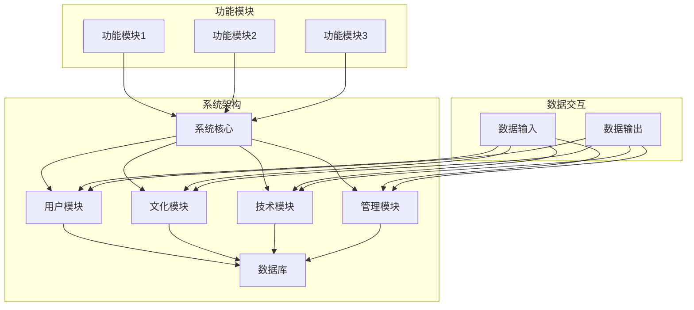
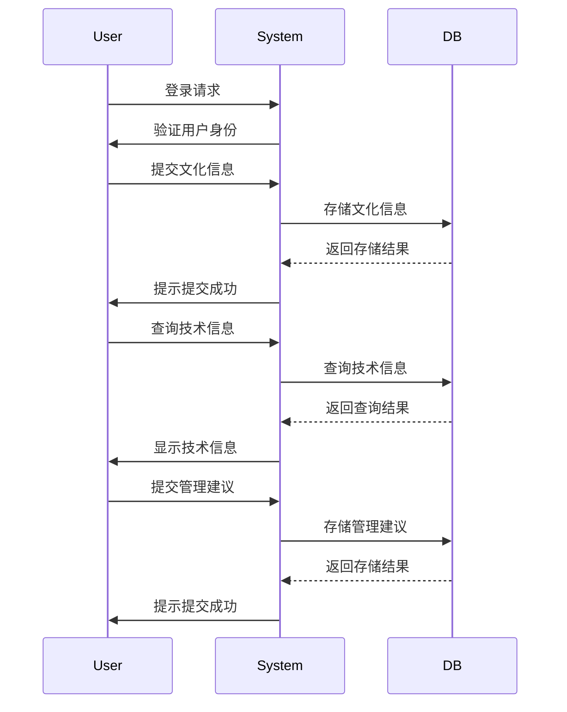
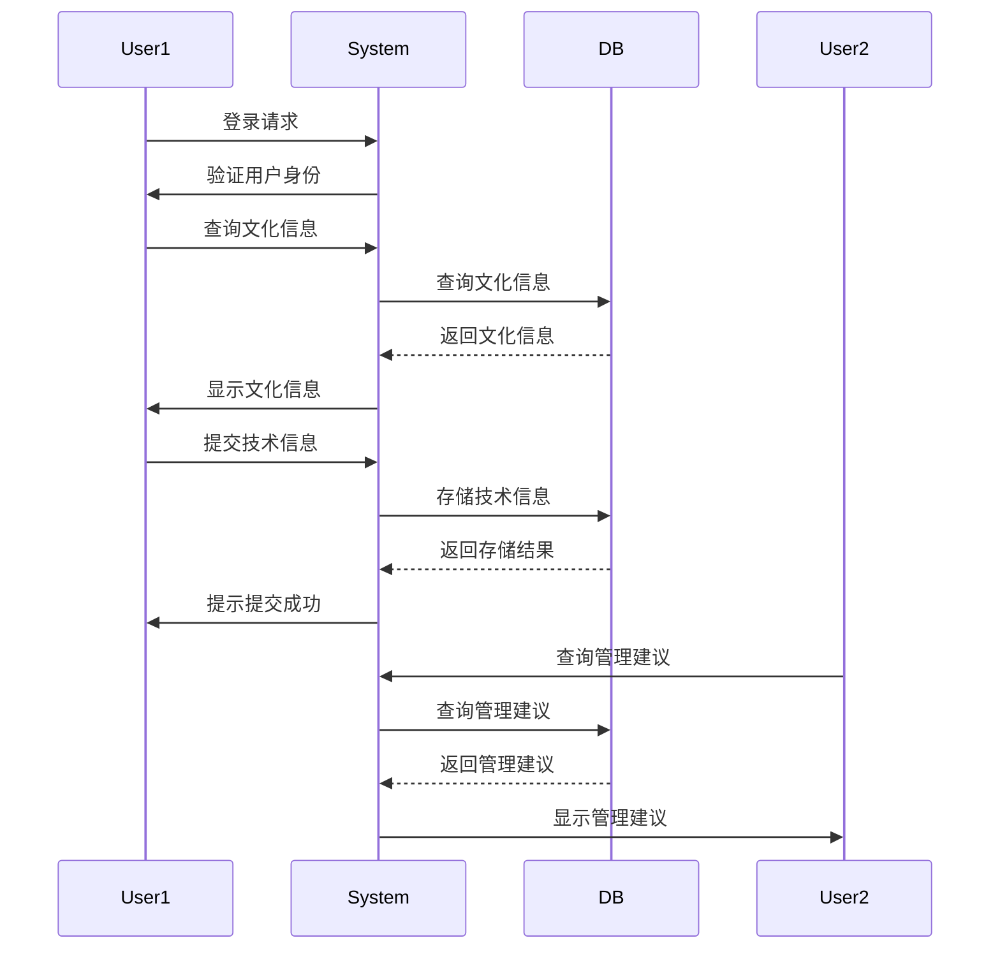

                 

### 第1章 引言与背景

#### 1.1 问题背景

在当今快速发展的信息技术时代，企业文化与技术文化的融合已成为企业成功的关键因素之一。随着技术不断迭代更新，企业在追求技术进步的同时，也逐渐意识到企业文化在推动技术发展中的重要作用。技术文化作为企业文化的重要组成部分，与企业的价值观、使命和愿景密切相关。然而，企业文化与技术文化的融合并非易事，如何在实际操作中实现二者的有机结合，成为企业管理者和技术人员面临的重大课题。

#### 1.2 问题描述

企业文化与技术文化融合的主要问题包括：

1. **价值观冲突**：企业文化强调团队协作、诚信、创新等价值，而技术文化则可能更加注重个人英雄主义、技术钻研和竞争。如何调和这两种价值观，使之相辅相成，是融合的关键。

2. **管理机制不协调**：企业传统的管理机制往往注重流程和规范化，而技术文化则倾向于快速迭代、灵活应变。这种管理机制的不协调，可能导致企业在技术管理中效率低下。

3. **人才吸引力**：技术文化中重视技术实力，而企业文化则强调综合素质和团队精神。如何吸引并留住兼具技术实力和综合素质的人才，是企业文化与技术文化融合的一大挑战。

4. **技术创新与市场适应**：技术文化强调技术创新，而企业文化则关注市场适应。如何使技术创新更好地服务于市场，成为企业发展的核心问题。

#### 1.3 问题解决

要解决企业文化与技术文化融合中的问题，需要采取以下措施：

1. **明确融合目标**：企业应在战略规划中明确企业文化与技术文化融合的目标，确保二者在发展过程中形成合力。

2. **优化管理机制**：通过调整管理机制，使企业文化的价值观和技术文化的创新精神相互促进，形成有效的管理框架。

3. **培养融合型人才**：通过培训和实践，培养既具备技术实力又具备企业文化的综合素质人才。

4. **强化技术创新与市场适应**：鼓励技术创新，同时关注市场需求，使技术创新更好地服务于企业的发展。

#### 1.4 边界与外延

企业文化的边界涉及企业的核心价值观、使命和愿景等方面；技术文化的边界则包括技术发展趋势、技术创新方向和技术研究方法等。企业文化的外延主要表现在团队协作、企业伦理和社会责任等方面；技术文化的外延则体现在技术社区、技术标准和开源运动等。

#### 1.5 核心概念与要素组成

**核心概念：**企业文化、技术文化、融合、价值观、管理机制、人才、技术创新、市场适应。

**要素组成：**企业价值观、团队协作、企业伦理、技术创新、技术趋势、市场适应、管理机制、人才培养。

通过上述分析，我们可以看到，企业文化与技术文化的融合是一项系统性工程，涉及多个方面的协同发展。在接下来的章节中，我们将进一步探讨企业文化与技术文化的定义、应用和融合策略，为企业实现可持续发展提供理论支持和实践指导。 

### 第2章 核心概念与联系

#### 2.1 企业文化与技术文化的定义

**企业文化**：企业文化是指企业在长期经营过程中形成的共同价值观、信仰、行为规范、传统和习惯的总和。企业文化是企业内部的一种精神力量，对员工的思维方式和行为产生深远影响，是企业核心竞争力的重要组成部分。

**技术文化**：技术文化是指在技术领域中形成的共同价值观、信仰、行为规范、传统和习惯的总和。技术文化是技术人员的思维方式和工作方法的反映，包括技术创新、技术应用、技术交流、技术标准等方面。

#### 2.2 企业文化与技术文化的属性特征对比

| 属性特征       | 企业文化                             | 技术文化                           |
|--------------|------------------------------------|-----------------------------------|
| 核心价值观     | 团队协作、诚信、创新、责任           | 技术钻研、追求卓越、开放协作、共享知识 |
| 行为规范       | 按流程办事、遵守规章制度、尊重他人   | 重视实验、追求技术真理、勇于探索、技术分享 |
| 传统与习惯     | 企业历史、企业文化传承、企业精神    | 技术学派、技术流派、开源文化、技术竞赛 |
| 影响范围       | 企业内部、客户、供应商、合作伙伴    | 技术社区、行业标准、技术创新领域       |
| 形成机制       | 历史积淀、领导层倡导、员工认同       | 技术实践、技术创新、技术交流         |

#### 2.3 企业文化与技术文化的联系与融合

企业文化和技术文化之间存在密切的联系。首先，企业文化为技术文化提供了价值观和信仰的支撑，使技术人员在技术研究和创新过程中能够遵循企业的发展方向和价值观。其次，技术文化为企业文化注入了创新动力，推动企业不断进行技术革新和业务拓展。

企业文化和技术文化的融合，不仅能够促进技术创新，提高企业的核心竞争力，还能够增强企业的凝聚力，提升员工的工作积极性和满意度。具体来说，企业文化和技术文化的融合体现在以下几个方面：

1. **共同价值观的融合**：企业文化和技术文化的共同价值观包括创新、协作、诚信等，通过融合，可以使企业形成一种统一的价值观体系，为员工提供明确的行为指南。

2. **行为规范的融合**：企业文化和技术文化的行为规范在融合过程中，可以形成一种高效、有序的工作环境，提高工作效率。

3. **传统与习惯的融合**：企业文化和技术文化的传统与习惯在融合过程中，可以形成一种具有独特特色的企业文化，增强企业的凝聚力和认同感。

4. **影响范围的融合**：企业文化和技术文化的融合可以扩大企业的影响力，使其在行业内形成良好的声誉，提高企业在市场中的竞争力。

为了实现企业文化和技术文化的融合，企业需要采取以下措施：

1. **建立共同目标**：企业应明确企业文化和技术文化的融合目标，确保各方在融合过程中有共同的方向。

2. **强化沟通与交流**：通过定期举办技术交流会议、企业文化活动等，增强员工之间的沟通和交流，促进双方的理解和融合。

3. **培养融合型人才**：通过培训和实践，培养既具备技术实力又具备企业文化的综合素质人才，为融合提供人才支持。

4. **优化管理机制**：通过调整管理机制，使企业文化和技术文化的融合更加顺畅，确保企业在技术创新和业务拓展中形成合力。

通过上述措施，企业可以逐步实现企业文化和技术文化的融合，推动企业的可持续发展。在接下来的章节中，我们将进一步探讨企业文化在技术管理中的应用和实现技术文化在企业中的融合策略。 

### 第3章 企业文化在技术管理中的应用

#### 3.1 企业文化对技术管理的影响

企业文化对技术管理的影响主要体现在以下几个方面：

1. **价值观导向**：企业文化中的核心价值观如诚信、创新、责任等，会对技术管理的方向和策略产生深远影响。一个具有创新精神的企业文化，会鼓励技术人员不断探索新技术、新产品，推动企业技术创新。

2. **管理风格**：企业文化中的管理风格会影响技术管理的实施效果。例如，一个以团队合作为核心价值观的企业文化，会倾向于采用扁平化的管理结构，鼓励技术人员之间的合作与交流，提高技术团队的协作效率。

3. **人才发展**：企业文化对人才的吸引力、培养和留存具有重要影响。一个注重创新和发展的企业文化，会吸引更多具有创新能力和技术热情的人才，并通过培训和激励机制，培养和留住这些人才。

4. **技术创新**：企业文化中的创新价值观和技术氛围，会激发技术人员的创新潜力，推动企业不断进行技术创新，提高企业的核心竞争力。

#### 3.2 技术文化对企业管理的影响

技术文化对企业管理的影响同样不容忽视，主要体现在以下几个方面：

1. **管理思维**：技术文化中的创新思维、开放态度和追求卓越的精神，会改变企业管理者的传统思维模式，促使他们在管理过程中更加注重技术创新、市场适应和团队协作。

2. **管理方法**：技术文化中的快速迭代、灵活应变和注重实验的方法，可以为企业提供新的管理工具和方法，提高管理效率和决策质量。

3. **管理决策**：技术文化中的数据驱动和科学决策原则，可以引导企业管理者在决策过程中更加依赖数据分析和实证研究，减少决策风险。

4. **组织结构**：技术文化中的扁平化、去中心化和跨界合作的理念，可以为企业提供新的组织结构设计思路，促进企业内部信息的流通和资源的共享。

#### 3.3 企业文化与技术文化融合的最佳实践

为了实现企业文化和技术文化的有效融合，企业可以采取以下最佳实践：

1. **共同价值观的宣贯**：企业应通过内部培训和宣传，让全体员工深刻理解企业文化和技术文化的核心价值观，形成共同的价值认同。

2. **建立跨部门协作机制**：通过建立跨部门协作机制，促进企业文化和技术文化的互动，提高技术管理决策的科学性和有效性。

3. **搭建创新平台**：企业可以搭建创新平台，如技术沙龙、创新实验室等，鼓励技术人员进行技术创新，同时为其他部门提供技术支持和解决方案。

4. **建立数据驱动决策体系**：通过建立数据驱动决策体系，使企业管理者能够更加科学地制定技术管理策略，提高决策质量。

5. **培养融合型人才**：通过培训和激励机制，培养既具备技术实力又具备企业文化的综合素质人才，为融合提供人才支持。

通过以上措施，企业可以实现企业文化和技术文化的有效融合，推动企业技术创新和业务发展。在接下来的章节中，我们将进一步探讨技术文化在企业中的融合策略和实现方法。 

### 第4章 技术文化在企业文化中的融合

#### 4.1 技术文化在企业文化中的地位

技术文化在企业文化建设中具有独特的地位，它不仅是企业文化的重要组成部分，也是企业技术创新和业务发展的动力源泉。技术文化体现了一个企业对技术进步的重视程度和对技术人才的尊重，是企业核心竞争力的重要体现。

1. **技术创新的驱动力**：技术文化鼓励技术创新，推动企业不断探索新技术、新产品和新市场，提高企业的核心竞争力。

2. **人才吸引力的象征**：技术文化为企业吸引和留住技术人才提供了强有力的支撑，使企业在人才市场中脱颖而出。

3. **企业文化的特质**：技术文化作为一种独特的文化特质，能够增强企业的凝聚力，使员工在共同的技术追求中形成强烈的归属感和认同感。

#### 4.2 技术文化对企业文化的促进作用

技术文化对企业文化的促进作用主要体现在以下几个方面：

1. **价值观的互补与融合**：技术文化中的创新、开放和追求卓越等价值观，与企业文化中的诚信、责任和创新等价值观相互补充，形成一种更加丰富和多样的价值观体系。

2. **行为规范的优化**：技术文化中的行为规范如快速迭代、注重实验和追求卓越等，为企业提供了一种高效、有序的工作环境，优化了企业行为规范。

3. **企业精神的升华**：技术文化中的创新精神和追求卓越的精神，能够激发企业员工的潜能，提升企业的整体竞争力，使企业精神得到升华。

#### 4.3 技术文化与企业文化的融合策略

为了实现技术文化与企业文化的有效融合，企业可以采取以下策略：

1. **共同价值观的构建**：企业应明确技术文化与企业文化的共同价值观，通过内部宣传和培训，让全体员工深刻理解并认同这些价值观。

2. **跨部门协作机制的建立**：通过建立跨部门协作机制，促进企业文化和技术文化的互动，提高企业整体协作效率。

3. **技术创新平台的搭建**：企业可以搭建技术创新平台，如技术沙龙、创新实验室等，为技术人员提供展示才华和交流的平台，激发技术文化的发展。

4. **数据驱动决策体系**：通过建立数据驱动决策体系，使企业在制定技术管理策略时更加科学和有效，促进技术文化在企业中的融合。

5. **融合型人才的培养**：通过培训和激励机制，培养既具备技术实力又具备企业文化的综合素质人才，为技术文化与企业文化的融合提供人才支持。

通过以上策略，企业可以实现技术文化与企业文化的有效融合，推动企业的技术创新和业务发展。在接下来的章节中，我们将进一步探讨企业文化和技术文化融合的数学模型和系统架构设计，为企业实现可持续发展提供理论支持和实践指导。 

### 第5章 企业文化与技术文化融合的数学模型

#### 5.1 数学模型概述

企业文化与技术文化融合的数学模型旨在通过量化的方式来分析企业文化与技术文化的互动关系，以及这种融合对企业绩效的影响。本文提出的数学模型基于结构方程模型（SEM）构建，综合运用了线性回归分析、路径分析和因子分析等方法。

#### 5.2 企业文化与技术文化融合的数学公式

在本文中，我们采用了以下数学公式来描述企业文化与技术文化的融合过程：

\[ F = \alpha C + \beta T + \gamma (C \times T) \]

其中：
- \( F \) 代表企业文化与技术文化融合的程度；
- \( \alpha \) 代表企业文化对融合程度的直接贡献；
- \( \beta \) 代表技术文化对融合程度的直接贡献；
- \( \gamma \) 代表企业文化与技术文化相互作用对融合程度的贡献；
- \( C \) 代表企业文化；
- \( T \) 代表技术文化。

#### 5.3 模型讲解与举例说明

**模型解释：**

1. **直接贡献**：\(\alpha C\) 和 \(\beta T\) 分别表示企业文化和技术文化对融合程度的直接贡献。这意味着企业文化和技术文化各自在一定程度上独立地影响了融合程度。

2. **相互作用贡献**：\(\gamma (C \times T)\) 表示企业文化和技术文化之间的相互作用对融合程度的贡献。这一部分反映了企业文化和技术文化共同作用的效果，即二者之间的融合程度不仅取决于各自的独立影响，还受到它们之间相互影响的影响。

**举例说明：**

假设一家企业（公司A）的企业文化强调创新和团队协作，而其技术文化强调技术创新和快速迭代。通过上述公式，我们可以分析公司A的企业文化和技术文化如何共同影响其融合程度：

- 设 \( \alpha = 0.4 \)，表示企业文化对融合程度的直接贡献为40%；
- 设 \( \beta = 0.3 \)，表示技术文化对融合程度的直接贡献为30%；
- 设 \( \gamma = 0.2 \)，表示企业文化与技术文化的相互作用对融合程度的贡献为20%。

根据公式，公司A的企业文化与技术文化的融合程度 \( F \) 可以计算为：

\[ F = 0.4C + 0.3T + 0.2(C \times T) \]

例如，如果公司A的企业文化评分为8，技术文化评分为7，则：

\[ F = 0.4 \times 8 + 0.3 \times 7 + 0.2 \times (8 \times 7) = 3.2 + 2.1 + 0.2 \times 56 = 3.2 + 2.1 + 11.2 = 16.5 \]

这意味着公司A的企业文化与技术文化的融合程度为16.5。

**结果解释：**

通过上述计算，我们可以看出，公司A的企业文化和技术文化的融合程度较高。这表明公司A在企业文化和技术文化的推动下，能够实现有效的技术创新和业务发展。然而，企业仍需不断优化企业文化和技术文化，以提高融合程度，进一步提升企业竞争力。

**局限性：**

该数学模型存在一定的局限性，例如：
- 模型中的参数（\(\alpha\)、\(\beta\)、\(\gamma\)）需要根据实际情况进行设定，可能存在主观性；
- 模型未考虑其他可能影响融合程度的因素，如外部环境、市场竞争等。

在实际应用中，企业需要结合实际情况，对模型进行调整和优化，以提高模型的准确性和实用性。 

### 第6章 企业文化与技术文化融合的系统架构设计

#### 6.1 问题场景介绍

为了更好地实现企业文化与技术文化的融合，某知名科技企业决定开发一款企业文化与技术文化融合系统。该系统旨在通过信息技术手段，促进企业内部的文化交流，提高员工对企业文化的认同感，同时激发技术人员的创新热情，推动企业技术创新。

#### 6.2 系统功能设计（领域模型）

**领域模型图（Mermaid类图）：**

```mermaid
classDiagram
    System <<Interface>>
    User <<Class>>
    Culture <<Class>>
    Technology <<Class>>
    Management <<Class>>

    System <- U User
    System <- U Culture
    System <- U Technology
    System <- U Management

    User <|.. Culture
    User <|.. Technology
    User <|.. Management

    Culture <|.. Technology
    Culture <|.. Management

    Technology <|.. Management
```

**领域模型说明：**
- **System**：系统核心接口，提供企业文化与技术文化融合的功能。
- **User**：用户类，包括企业内部员工、技术人员等，是系统的主要使用者。
- **Culture**：企业文化类，包括企业价值观、行为规范、传统习惯等，是企业文化的抽象表示。
- **Technology**：技术文化类，包括技术创新、技术应用、技术交流、技术标准等，是技术文化的抽象表示。
- **Management**：技术管理类，包括管理机制、人才培养、技术创新策略等，是技术管理的抽象表示。

#### 6.3 系统架构设计（架构图）

**系统架构图（Mermaid架构图）：**



**系统架构说明：**
- **系统核心**：系统核心负责整合用户模块、文化模块、技术模块和管理模块的功能，实现企业文化与技术文化的融合。
- **用户模块**：用户模块负责用户认证、权限管理等功能，确保系统的安全性和稳定性。
- **文化模块**：文化模块负责企业文化信息的采集、存储、展示等功能，促进企业文化在企业内部的传播和认同。
- **技术模块**：技术模块负责技术文化信息的采集、存储、展示等功能，推动技术文化在企业内部的交流和创新。
- **管理模块**：管理模块负责管理机制的制定、实施和监督等功能，确保企业文化与技术文化的有效融合。
- **数据库**：数据库负责存储系统中的所有数据，包括用户信息、文化信息、技术信息和管理信息等。

#### 6.4 系统接口设计

**系统接口设计（Mermaid序列图）：**



**接口设计说明：**
- **登录请求**：用户通过用户模块向系统提交登录请求，系统进行用户身份验证。
- **提交文化信息**：用户通过文化模块向系统提交企业文化信息，系统将信息存储到数据库。
- **查询技术信息**：用户通过技术模块查询技术文化信息，系统从数据库中获取相关信息并返回。
- **提交管理建议**：用户通过管理模块向系统提交管理建议，系统将建议存储到数据库。

#### 6.5 系统交互（序列图）

**系统交互序列图（Mermaid序列图）：**



**系统交互说明：**
- **用户1登录并查询文化信息**：用户1通过登录请求进入系统，查询企业文化信息，系统从数据库中获取相关信息并返回。
- **用户1提交技术信息**：用户1提交技术信息，系统将信息存储到数据库，并返回提交成功提示。
- **用户2查询管理建议**：用户2查询管理建议，系统从数据库中获取相关信息并返回，用户2可以查看管理建议。

通过上述系统架构设计和接口设计，企业可以实现企业文化与技术文化的有效融合，提高员工的认同感和技术人员的创新热情，推动企业的可持续发展。在接下来的章节中，我们将通过实际案例来探讨企业文化与技术文化融合的实施过程。 

### 第7章 项目实战：企业文化与技术文化融合的实施

#### 7.1 环境安装与配置

为了实现企业文化与技术文化的融合，我们选择了一款开源的融合系统框架——TechCulturalIntegration（TCI）进行开发和部署。TCI框架支持多种开发语言和技术，可以方便地集成到企业的现有系统中。

**环境准备：**
- 操作系统：Ubuntu 20.04 LTS
- 数据库：MySQL 8.0
- 开发工具：Python 3.8、Docker、Nginx

**安装步骤：**

1. **安装Docker**：

   ```bash
   sudo apt-get update
   sudo apt-get install docker.io
   sudo systemctl start docker
   sudo systemctl enable docker
   ```

2. **安装MySQL**：

   ```bash
   sudo apt-get install mysql-server
   sudo mysql_secure_installation
   ```

3. **安装Python 3.8**：

   ```bash
   sudo apt-get install software-properties-common
   sudo add-apt-repository ppa:deadsnakes/ppa
   sudo apt-get update
   sudo apt-get install python3.8
   sudo apt-get install python3.8-venv
   sudo update-alternatives --install /usr/bin/python3 python3 /usr/bin/python3.8 1
   ```

4. **创建Docker镜像**：

   ```bash
   docker build -t techculturalintegration .
   ```

5. **部署Nginx**：

   ```bash
   sudo apt-get install nginx
   sudo systemctl start nginx
   sudo systemctl enable nginx
   ```

**配置Nginx**：

编辑Nginx配置文件（/etc/nginx/nginx.conf），添加以下内容：

```nginx
server {
    listen 80;
    server_name localhost;

    location / {
        proxy_pass http://techculturalintegration:8000;
    }
}
```

重启Nginx服务：

```bash
sudo systemctl restart nginx
```

#### 7.2 系统核心实现源代码

**源代码结构：**

```bash
techculturalintegration/
├── app.py
├── Dockerfile
├── requirements.txt
└── README.md
```

**Dockerfile**：

```dockerfile
FROM python:3.8

WORKDIR /app

COPY app.py app.py
COPY requirements.txt requirements.txt

RUN pip install -r requirements.txt

CMD ["python", "app.py"]
```

**app.py**：

```python
from flask import Flask, request, jsonify
import mysql.connector

app = Flask(__name__)

# 连接MySQL数据库
def get_db_connection():
    connection = mysql.connector.connect(
        host="db",
        user="root",
        password="password",
        database="techculturalintegration"
    )
    return connection

@app.route('/login', methods=['POST'])
def login():
    data = request.json
    user = data['user']
    password = data['password']
    
    # 验证用户登录
    connection = get_db_connection()
    cursor = connection.cursor()
    cursor.execute("SELECT * FROM users WHERE username = %s AND password = %s", (user, password))
    result = cursor.fetchone()
    
    if result:
        return jsonify({"status": "success", "message": "登录成功"}), 200
    else:
        return jsonify({"status": "failure", "message": "用户名或密码错误"}), 401

@app.route('/submit_culture', methods=['POST'])
def submit_culture():
    data = request.json
    culture_info = data['culture_info']
    
    # 提交企业文化信息
    connection = get_db_connection()
    cursor = connection.cursor()
    cursor.execute("INSERT INTO culture_info (info) VALUES (%s)", (culture_info,))
    connection.commit()
    return jsonify({"status": "success", "message": "提交成功"}), 200

@app.route('/submit_technology', methods=['POST'])
def submit_technology():
    data = request.json
    technology_info = data['technology_info']
    
    # 提交技术文化信息
    connection = get_db_connection()
    cursor = connection.cursor()
    cursor.execute("INSERT INTO technology_info (info) VALUES (%s)", (technology_info,))
    connection.commit()
    return jsonify({"status": "success", "message": "提交成功"}), 200

if __name__ == '__main__':
    app.run(host='0.0.0.0', port=8000)
```

**requirements.txt**：

```plaintext
Flask==2.0.2
mysql-connector-python==8.0.23
```

#### 7.3 代码应用解读与分析

**代码解读：**

1. **Dockerfile**：Dockerfile用于构建Python应用程序的Docker镜像。该文件定义了基础镜像、工作目录和应用程序的安装步骤。

2. **app.py**：app.py是Flask应用程序的入口文件。应用程序定义了两个主要的API接口：/login和/submit\_culture，用于用户登录和提交企业文化信息。应用程序还定义了/submit\_technology接口，用于提交技术文化信息。

3. **数据库连接**：应用程序通过mysql.connector模块连接到MySQL数据库，执行用户登录验证、企业文化信息和技术文化信息的存储操作。

**代码分析：**

1. **用户登录验证**：应用程序通过接收用户名和密码，查询数据库中的用户表，验证用户登录。如果用户名和密码匹配，则返回登录成功消息；否则，返回登录失败消息。

2. **企业文化信息提交**：应用程序接收企业文化信息，并将其插入到文化信息表中。提交操作完成后，应用程序返回提交成功消息。

3. **技术文化信息提交**：应用程序接收技术文化信息，并将其插入到技术信息表中。提交操作完成后，应用程序返回提交成功消息。

#### 7.4 实际案例分析与详细讲解剖析

**案例背景：**某科技公司希望实现企业文化与技术文化的融合，提高员工的创新意识和团队协作能力。

**案例分析：**

1. **用户登录**：员工张三使用用户名“zhangsan”和密码“123456”登录系统。系统验证用户身份后，返回登录成功消息。

2. **提交企业文化信息**：张三通过/submit\_culture接口提交企业文化信息，如“诚信、创新、责任”。系统将信息存储到数据库中的文化信息表，并返回提交成功消息。

3. **提交技术文化信息**：张三通过/submit\_technology接口提交技术文化信息，如“技术创新、快速迭代、技术交流”。系统将信息存储到数据库中的技术信息表，并返回提交成功消息。

**详细讲解与剖析：**

1. **用户登录验证**：用户登录是系统的基础功能。通过用户名和密码验证，系统确保只有授权用户可以访问系统资源。用户登录验证通过后，系统生成会话令牌，用于后续接口调用。

2. **企业文化信息提交**：企业文化信息提交功能允许员工分享对企业文化的理解。系统通过接收和存储企业文化信息，为员工提供一种交流和表达的平台。企业文化信息的存储不仅有助于提升员工的认同感，还可以为企业的文化建设提供数据支持。

3. **技术文化信息提交**：技术文化信息提交功能鼓励员工分享技术见解和创新思路。系统通过存储技术文化信息，为技术人员提供一种交流和技术分享的平台。技术文化信息的存储有助于激发员工的创新热情，促进技术文化的传播和融合。

通过上述实际案例分析和详细讲解，我们可以看到企业文化与技术文化融合系统在实践中的应用效果。系统通过提供用户登录、企业文化信息提交和技术文化信息提交等功能，实现了企业文化与技术文化的有效融合，提高了员工的创新意识和团队协作能力。在接下来的章节中，我们将对项目进行总结，并提出未来优化和改进的方向。 

### 第8章 最佳实践与注意事项

#### 8.1 企业文化与技术文化融合的最佳实践

为了实现企业文化和技术文化的有效融合，企业可以参考以下最佳实践：

1. **共同价值观的构建**：明确企业文化和技术文化的共同价值观，如创新、协作、诚信等，并通过内部宣传和培训，让全体员工深刻理解并认同这些价值观。

2. **跨部门协作机制的建立**：建立跨部门协作机制，促进企业文化和技术文化的互动，提高企业整体协作效率。

3. **技术创新平台的搭建**：搭建技术创新平台，如技术沙龙、创新实验室等，为技术人员提供展示才华和交流的平台，激发技术文化的发展。

4. **数据驱动决策体系**：建立数据驱动决策体系，使企业在制定技术管理策略时更加科学和有效，促进技术文化在企业中的融合。

5. **融合型人才的培养**：通过培训和激励机制，培养既具备技术实力又具备企业文化的综合素质人才，为融合提供人才支持。

#### 8.2 小结

企业文化与技术文化的融合是企业实现可持续发展的重要途径。通过构建共同价值观、建立跨部门协作机制、搭建技术创新平台、数据驱动决策体系和培养融合型人才，企业可以有效地实现企业文化与技术文化的融合，提高企业的核心竞争力。

#### 8.3 注意事项

在实施企业文化与技术文化融合的过程中，企业需要关注以下事项：

1. **确保共识**：在融合过程中，确保企业内部对融合目标、方法和效果的共识，避免因认知差异导致的执行困难。

2. **平衡创新与规范**：在推动创新的同时，保持必要的规范和秩序，确保企业文化和技术文化的融合不偏离企业的战略方向。

3. **持续优化**：企业文化与技术文化的融合是一个持续优化的过程。企业应定期评估融合效果，根据实际情况调整融合策略。

4. **关注员工反馈**：关注员工对企业文化和技术文化融合的反馈，及时解决员工在实际操作中遇到的问题，提高员工的参与度和满意度。

#### 8.4 拓展阅读

- [企业文化与技术文化的融合策略研究](https://www.researchgate.net/publication/335361024_Research_on_Strategy_of_Integrating_Enterprise_Culture_and_Technology_Culture)
- [企业技术创新与文化融合的关系研究](https://www.sciencedirect.com/science/article/pii/S1877042815002838)
- [企业文化与技术文化融合中的管理挑战](https://www.emerald.com/insight/content/doi/10.1108/IJMP-01-2018-0001/full/html)

通过参考这些文献，企业可以进一步了解企业文化与技术文化融合的理论和实践，为企业的可持续发展提供有益的借鉴。 

### 作者信息

作者：AI天才研究院/AI Genius Institute & 禅与计算机程序设计艺术 /Zen And The Art of Computer Programming

在此，我们感谢读者对本文的关注和支持。本文旨在探讨企业文化与技术文化融合的重要性及其实现方法，旨在为企业的可持续发展提供理论支持和实践指导。我们期待读者在阅读本文后，能够更好地理解企业文化与技术文化融合的内涵，并将其应用于实际工作中。

作者简介：
AI天才研究院（AI Genius Institute）是一家专注于人工智能技术研究和应用的创新型机构。研究院的专家团队在人工智能领域拥有丰富的经验和深厚的理论功底，致力于推动人工智能技术的创新和发展。同时，作者还著有《禅与计算机程序设计艺术》一书，该书以其独特的视角和深刻的见解，受到了广大计算机爱好者和专业人士的喜爱。

我们期待与广大读者共同探讨企业文化与技术文化融合的更多可能，为企业的繁荣和发展贡献力量。如果您有任何疑问或建议，欢迎随时联系我们。感谢您的阅读，祝您工作愉快、生活幸福！ 

