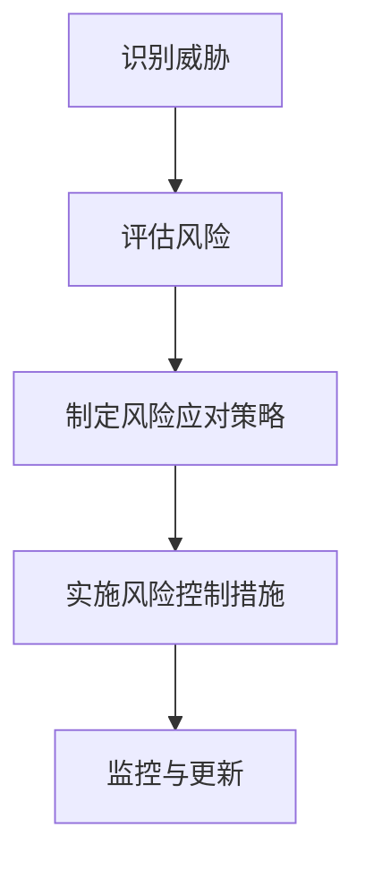
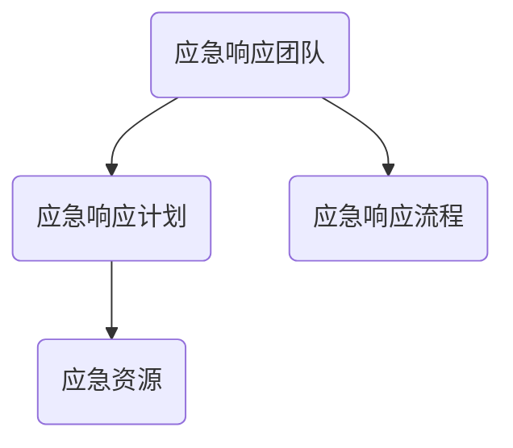
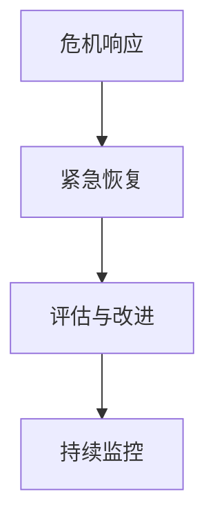
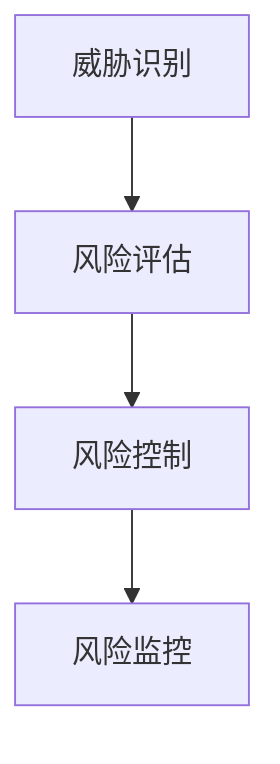
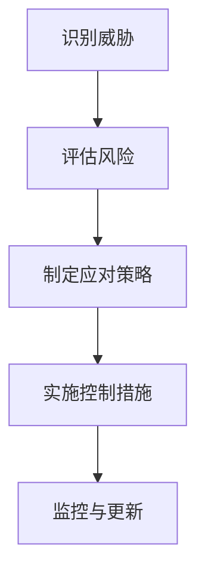
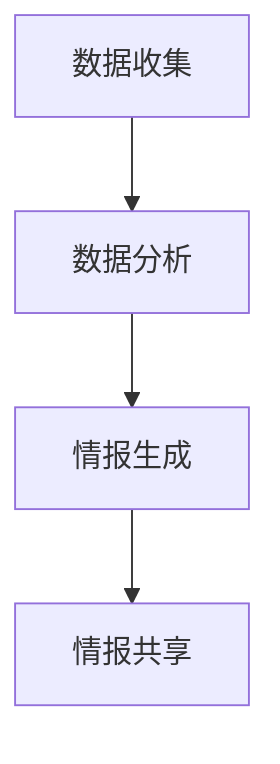

                 

### 技术管理中的危机处理

#### 关键词：技术危机、危机处理、风险管理、应急响应、恢复与改进

#### 摘要：
本文旨在探讨技术管理中危机处理的重要性及其关键环节。通过介绍危机管理的核心概念、流程和方法，结合实际案例进行分析，提出有效的管理策略与最佳实践，帮助技术人员和IT管理者更好地应对和处理技术危机。

## 引言：技术危机的背景与重要性

### 技术危机的定义

技术危机是指在技术领域内发生的严重事件，可能导致系统瘫痪、数据丢失、信息安全漏洞等问题，进而影响企业的正常运行和声誉。技术危机可能是由于技术故障、网络攻击、软件漏洞、硬件故障等原因引发的。

### 技术危机的成因

技术危机的成因多种多样，主要包括以下几个方面：

1. **软件漏洞**：软件漏洞是技术危机的常见原因。攻击者可以通过这些漏洞获取系统权限、窃取敏感数据等。

2. **网络攻击**：网络攻击包括DDoS攻击、SQL注入、恶意软件传播等，这些攻击可能导致系统崩溃、数据泄露等严重后果。

3. **硬件故障**：硬件故障，如服务器故障、网络设备损坏等，可能导致系统无法正常运行。

4. **人为错误**：技术人员的人为错误，如操作失误、配置错误等，也可能导致技术危机的发生。

### 技术危机的影响

技术危机的影响可能是灾难性的，包括以下几个方面：

1. **经济损失**：技术危机可能导致企业损失大量的资金，如设备维修、数据恢复、客户赔偿等。

2. **声誉损害**：技术危机可能使企业的声誉受损，影响客户信任和业务发展。

3. **运营中断**：技术危机可能导致企业运营中断，影响生产和服务质量。

4. **安全隐患**：技术危机可能导致企业的信息安全受到威胁，如数据泄露、隐私侵犯等。

### 技术危机的背景

随着技术的快速发展，企业对信息技术系统的依赖程度不断提高。同时，网络安全威胁也日益增多，技术危机的风险也随之增加。因此，如何有效地管理和应对技术危机，成为技术管理者面临的重要挑战。

## 危机管理概述

### 危机管理的定义与原则

危机管理是指在企业面临技术危机时，采取的一系列预防和应对措施，以减轻危机的影响，恢复正常的运营。危机管理应遵循以下原则：

1. **预防为主**：在危机发生前，应采取预防措施，减少危机的发生概率。

2. **快速响应**：在危机发生时，应迅速采取行动，遏制危机的蔓延。

3. **信息共享**：危机管理过程中，应确保信息的畅通，提高决策效率。

4. **持续改进**：危机管理是一个持续的过程，应在危机后进行总结和改进，以应对未来可能出现的危机。

### 危机管理的流程与阶段

危机管理通常包括以下几个阶段：

1. **预防阶段**：在危机发生前，进行风险评估、制定应急预案等。

2. **监测阶段**：在危机发生时，实时监测危机的进展，评估危机的影响。

3. **响应阶段**：在危机发生时，启动应急预案，采取措施控制危机的蔓延。

4. **恢复阶段**：在危机得到控制后，进行系统恢复、数据修复等。

5. **总结阶段**：在危机后，对危机管理过程进行总结，提出改进措施。

### 危机管理的关键要素

危机管理的关键要素包括：

1. **组织结构**：建立专门的危机管理团队，明确各级人员的职责。

2. **应急预案**：制定详细的应急预案，包括危机响应流程、关键措施等。

3. **培训与演练**：对员工进行危机管理培训，定期进行应急演练。

4. **技术支持**：确保有足够的技术支持，如备份系统、数据恢复工具等。

5. **沟通与协调**：建立有效的沟通机制，确保信息传递畅通，各部门协调一致。

## 核心概念与联系

### 技术风险管理

**技术风险管理流程图：**

### 应急响应计划

**应急响应计划ER实体关系图：**

### 恢复与持续改进

**恢复与持续改进流程图：**

### 数学模型和数学公式

**技术危机损失预测模型：**

$$
L(t) = a \cdot R(t) + b \cdot I(t)
$$

其中，\(L(t)\)表示时间\(t\)的技术危机损失，\(R(t)\)表示时间\(t\)的恢复进度，\(I(t)\)表示时间\(t\)的应急投入。

## 危机管理技术方法

### 威胁评估与风险分析

威胁评估与风险分析是危机管理的核心环节。通过威胁评估，识别潜在威胁，评估其可能带来的影响和发生的概率。风险分析则是对威胁进行量化分析，确定其优先级，为制定应对策略提供依据。

### 威胁情报收集与分析

威胁情报收集与分析是指通过获取和分析与威胁相关的信息，了解威胁的发展动态和趋势。威胁情报可以帮助企业提前预警，采取预防措施，降低危机发生的概率。

### 防御措施与对策

防御措施与对策是危机管理的重要组成部分。包括但不限于以下几个方面：

1. **网络安全防护**：部署防火墙、入侵检测系统等网络安全设备，防止网络攻击。

2. **系统监控与日志分析**：实时监控系统运行状态，分析日志，及时发现异常情况。

3. **数据备份与恢复**：定期进行数据备份，确保在危机发生时能够快速恢复数据。

4. **员工培训与意识提升**：对员工进行安全培训，提高其安全意识，减少人为错误。

## 危机管理案例分析

### 案例一：某互联网公司数据泄露事件

某互联网公司发生了一起数据泄露事件，导致大量用户个人信息泄露。此次事件是由于黑客攻击造成的。公司迅速启动应急预案，进行数据恢复和网络安全加固，同时与用户进行沟通，采取措施降低损失。此次事件暴露出公司在数据安全方面的不足，促使公司对数据安全策略进行改进。

### 案例二：某科技公司软件故障危机

某科技公司的一款软件出现严重故障，导致大量用户无法正常使用。故障是由于软件代码中的bug引起的。公司立即组织技术团队进行紧急修复，同时向用户道歉并采取措施保障用户利益。此次事件对公司声誉造成一定影响，但也促使公司在软件质量管理和测试方面进行改进。

### 案例三：某金融机构网络攻击事件

某金融机构遭受了网络攻击，导致系统瘫痪，大量交易数据泄露。此次攻击是由于黑客利用系统漏洞进行的。金融机构迅速启动应急预案，与警方合作，追踪黑客身份，同时加强网络安全防护。此次事件对公司运营和客户信任造成严重影响，但也促使公司在网络安全方面进行彻底整改。

## 管理策略与最佳实践

### 危机管理组织结构

为了有效地进行危机管理，企业应建立专门的危机管理组织结构。该组织应包括危机管理团队、技术支持团队、业务支持团队等，明确各级人员的职责和权限。

### 培训与演练

为了提高员工对危机管理的认识和应对能力，企业应定期进行培训与演练。培训内容包括危机管理知识、应急预案、应急操作等。演练可以模拟真实危机场景，检验员工和团队的实际应对能力。

### 沟通与协调

危机管理过程中，沟通与协调至关重要。企业应建立有效的沟通机制，确保信息传递畅通，各部门协调一致。同时，企业还应与外部相关部门、合作伙伴保持良好沟通，共同应对危机。

### 法规与合规

企业应遵守相关法规和合规要求，确保危机管理活动合法、合规。同时，企业还应关注法规和合规的变化，及时调整危机管理策略。

## 恢复与持续改进

### 恢复策略与行动

在危机得到控制后，企业应迅速启动恢复策略，进行系统恢复、数据修复等工作。恢复策略应包括以下方面：

1. **数据恢复**：利用备份数据恢复系统，确保数据的完整性和可用性。

2. **系统恢复**：对受影响的系统进行修复，确保系统正常运行。

3. **业务恢复**：恢复受影响业务，确保业务的连续性和客户满意度。

### 持续改进与经验总结

在危机后，企业应进行总结和反思，分析危机发生的原因、危机管理过程中的不足，并提出改进措施。同时，企业还应建立持续改进机制，不断完善危机管理策略和方法。

### 未来趋势与展望

随着技术的不断进步，危机管理的手段和策略也在不断更新。未来危机管理的发展趋势包括：

1. **人工智能与大数据的应用**：利用人工智能和大数据技术，提高危机预测和应对能力。

2. **云计算与边缘计算的结合**：通过云计算和边缘计算的结合，实现更高效、更可靠的危机管理。

3. **全球化与合规要求**：随着全球化的深入，企业面临更多的合规要求，危机管理需要更加注重合规性和国际化。

## 小结与展望

通过本文的讨论，我们可以看出，技术危机处理对于企业的正常运行和可持续发展至关重要。危机管理不仅需要关注技术层面的问题，还需要从组织结构、培训与演练、沟通与协调等多个方面进行全面提升。未来，随着技术的不断进步，危机管理将面临更多挑战，但也充满机遇。我们期待技术管理者能够不断创新，提高危机应对能力，为企业的健康发展保驾护航。

### 注意事项与建议

1. **定期进行风险评估**：定期对企业的技术系统进行风险评估，识别潜在威胁，制定相应的预防措施。

2. **加强员工培训**：定期对员工进行危机管理培训，提高其安全意识和应对能力。

3. **建立应急预案**：制定详细的应急预案，确保在危机发生时能够迅速响应。

4. **重视数据备份**：定期进行数据备份，确保在危机发生时能够快速恢复数据。

5. **保持与外部机构的沟通**：与相关政府部门、行业组织保持良好沟通，共同应对危机。

### 拓展阅读

1. 《网络安全法》  
2. 《应急管理条例》  
3. 《计算机信息安全等级保护管理办法》  
4. 《人工智能发展白皮书》  
5. 《云计算服务安全评估标准》

### 作者

作者：AI天才研究院/AI Genius Institute & 禅与计算机程序设计艺术 /Zen And The Art of Computer Programming

----------------------------------------------------------------

**文章标题**：技术管理中的危机处理

**文章关键词**：技术危机、危机处理、风险管理、应急响应、恢复与改进

**文章摘要**：
本文深入探讨了技术管理中危机处理的重要性及其关键环节。通过介绍危机管理的核心概念、流程和方法，结合实际案例进行分析，提出有效的管理策略与最佳实践，帮助技术人员和IT管理者更好地应对和处理技术危机。文章结构紧凑，逻辑清晰，适合广大IT从业者阅读和参考。

**正文**：

## 引言：技术危机的背景与重要性

随着信息技术的飞速发展，技术已成为现代企业运营的核心驱动力。然而，技术系统的不稳定性和外部威胁的存在，使得技术危机成为企业必须面对的现实问题。技术危机不仅可能造成经济损失和声誉损害，还可能引发更严重的运营中断和安全隐患。

### 技术危机的定义

技术危机是指在技术领域内发生的严重事件，可能导致系统瘫痪、数据丢失、信息安全漏洞等问题，进而影响企业的正常运行和声誉。技术危机可能是由于技术故障、网络攻击、软件漏洞、硬件故障等原因引发的。

### 技术危机的成因

技术危机的成因多种多样，主要包括以下几个方面：

1. **软件漏洞**：软件漏洞是技术危机的常见原因。攻击者可以通过这些漏洞获取系统权限、窃取敏感数据等。

2. **网络攻击**：网络攻击包括DDoS攻击、SQL注入、恶意软件传播等，这些攻击可能导致系统崩溃、数据泄露等严重后果。

3. **硬件故障**：硬件故障，如服务器故障、网络设备损坏等，可能导致系统无法正常运行。

4. **人为错误**：技术人员的人为错误，如操作失误、配置错误等，也可能导致技术危机的发生。

### 技术危机的影响

技术危机的影响可能是灾难性的，包括以下几个方面：

1. **经济损失**：技术危机可能导致企业损失大量的资金，如设备维修、数据恢复、客户赔偿等。

2. **声誉损害**：技术危机可能使企业的声誉受损，影响客户信任和业务发展。

3. **运营中断**：技术危机可能导致企业运营中断，影响生产和服务质量。

4. **安全隐患**：技术危机可能导致企业的信息安全受到威胁，如数据泄露、隐私侵犯等。

### 技术危机的背景

随着技术的快速发展，企业对信息技术系统的依赖程度不断提高。同时，网络安全威胁也日益增多，技术危机的风险也随之增加。因此，如何有效地管理和应对技术危机，成为技术管理者面临的重要挑战。

## 危机管理概述

### 危机管理的定义与原则

危机管理是指在企业面临技术危机时，采取的一系列预防和应对措施，以减轻危机的影响，恢复正常的运营。危机管理应遵循以下原则：

1. **预防为主**：在危机发生前，应采取预防措施，减少危机的发生概率。

2. **快速响应**：在危机发生时，应迅速采取行动，遏制危机的蔓延。

3. **信息共享**：危机管理过程中，应确保信息的畅通，提高决策效率。

4. **持续改进**：危机管理是一个持续的过程，应在危机后进行总结和改进，以应对未来可能出现的危机。

### 危机管理的流程与阶段

危机管理通常包括以下几个阶段：

1. **预防阶段**：在危机发生前，进行风险评估、制定应急预案等。

2. **监测阶段**：在危机发生时，实时监测危机的进展，评估危机的影响。

3. **响应阶段**：在危机发生时，启动应急预案，采取措施控制危机的蔓延。

4. **恢复阶段**：在危机得到控制后，进行系统恢复、数据修复等。

5. **总结阶段**：在危机后，对危机管理过程进行总结，提出改进措施。

### 危机管理的关键要素

危机管理的关键要素包括：

1. **组织结构**：建立专门的危机管理团队，明确各级人员的职责。

2. **应急预案**：制定详细的应急预案，包括危机响应流程、关键措施等。

3. **培训与演练**：对员工进行危机管理培训，定期进行应急演练。

4. **技术支持**：确保有足够的技术支持，如备份系统、数据恢复工具等。

5. **沟通与协调**：建立有效的沟通机制，确保信息传递畅通，各部门协调一致。

## 核心概念与联系

### 技术风险管理

技术风险管理是指通过识别、评估和控制技术风险，以减少技术危机的发生概率和影响。技术风险管理包括以下几个方面：

1. **威胁识别**：识别可能对技术系统造成威胁的因素。

2. **风险评估**：评估威胁发生的可能性和影响，确定风险的优先级。

3. **风险控制**：采取预防措施，降低风险的发生概率和影响。

4. **风险监控**：持续监控技术系统的风险状况，及时调整风险控制措施。

**技术风险管理流程图：**

### 应急响应计划

应急响应计划是指为应对技术危机而制定的一系列行动方案，包括危机响应流程、关键措施、资源分配等。应急响应计划是危机管理的重要组成部分，确保在危机发生时能够迅速、有效地采取措施控制危机。

**应急响应计划ER实体关系图：**

### 恢复与持续改进

恢复与持续改进是指危机得到控制后，对技术系统进行恢复和改进，以防止类似危机再次发生。恢复与持续改进包括以下几个方面：

1. **紧急恢复**：在危机发生时，立即采取措施恢复系统的正常运行。

2. **评估与改进**：对危机管理过程进行评估，识别不足之处，提出改进措施。

3. **持续监控**：对技术系统进行持续监控，及时发现和解决潜在问题。

**恢复与持续改进流程图：**

### 数学模型和数学公式

在危机管理中，数学模型和数学公式可以帮助我们量化风险和损失，制定更科学的决策。以下是一个简单的技术危机损失预测模型：

$$
L(t) = a \cdot R(t) + b \cdot I(t)
$$

其中，\(L(t)\)表示时间\(t\)的技术危机损失，\(R(t)\)表示时间\(t\)的恢复进度，\(I(t)\)表示时间\(t\)的应急投入。

### 总结

核心概念与联系是危机管理的基石。技术风险管理、应急响应计划和恢复与持续改进构成了危机管理的三个关键环节。通过威胁识别、风险评估、风险控制、应急响应、紧急恢复和持续监控，企业可以有效地应对技术危机，减少损失，保障业务的连续性和稳定性。

## 危机管理技术方法

危机管理技术方法是指在实际操作中，用于预防和应对技术危机的具体手段。这些方法包括威胁评估与风险分析、威胁情报收集与分析、防御措施与对策等。以下将对这些技术方法进行详细介绍。

### 威胁评估与风险分析

威胁评估与风险分析是危机管理的核心环节。通过威胁评估，企业可以识别潜在威胁，评估其可能带来的影响和发生的概率。以下是一个简单的威胁评估流程：

1. **识别威胁**：识别可能对技术系统造成威胁的因素，如软件漏洞、网络攻击、硬件故障等。

2. **评估风险**：评估威胁发生的可能性和影响，确定风险的优先级。可以使用定性或定量的方法进行评估。

3. **制定应对策略**：根据评估结果，制定相应的应对策略，包括预防措施、应急响应措施等。

4. **实施控制措施**：根据应对策略，实施风险控制措施，如加固网络安全、定期备份数据等。

5. **监控与更新**：持续监控技术系统的风险状况，及时更新威胁信息和应对策略。

**威胁评估与风险分析流程图：**

### 威胁情报收集与分析

威胁情报收集与分析是指通过获取和分析与威胁相关的信息，了解威胁的发展动态和趋势。威胁情报可以帮助企业提前预警，采取预防措施，降低危机发生的概率。以下是一个简单的威胁情报收集与分析流程：

1. **数据收集**：收集与威胁相关的数据，如网络流量、日志文件、威胁报告等。

2. **数据分析**：对收集到的数据进行分析，识别潜在威胁。

3. **情报生成**：根据分析结果，生成威胁情报，包括威胁类型、威胁来源、威胁等级等。

4. **情报共享**：将威胁情报共享给相关部门和人员，提高危机应对能力。

**威胁情报收集与分析流程图：**

### 防御措施与对策

防御措施与对策是危机管理的重要组成部分。通过部署防御措施，企业可以降低危机发生的概率和影响。以下是一些常见的防御措施和对策：

1. **网络安全防护**：部署防火墙、入侵检测系统等网络安全设备，防止网络攻击。

2. **系统监控与日志分析**：实时监控系统运行状态，分析日志，及时发现异常情况。

3. **数据备份与恢复**：定期进行数据备份，确保在危机发生时能够快速恢复数据。

4. **员工培训与意识提升**：对员工进行安全培训，提高其安全意识，减少人为错误。

5. **应急响应计划**：制定详细的应急响应计划，确保在危机发生时能够迅速响应。

**防御措施与对策表：**

| 防御措施           | 对策                                      |
|--------------------|------------------------------------------|
| 网络安全防护       | 部署防火墙、入侵检测系统等网络安全设备    |
| 系统监控与日志分析 | 实时监控系统运行状态，分析日志，发现异常 |
| 数据备份与恢复     | 定期备份数据，确保快速恢复数据            |
| 员工培训与意识提升 | 对员工进行安全培训，提高安全意识          |
| 应急响应计划       | 制定详细的应急响应计划，确保迅速响应      |

### 总结

威胁评估与风险分析、威胁情报收集与分析、防御措施与对策构成了危机管理的核心技术方法。通过这些方法，企业可以有效地预防和应对技术危机，保障业务的连续性和稳定性。

## 危机管理案例分析

在实际工作中，危机管理不仅仅是理论上的规划，更需要通过实际案例来验证其有效性。以下我们通过三个真实案例，来探讨技术危机管理的应对策略和实践。

### 案例一：某互联网公司数据泄露事件

某大型互联网公司因一次黑客攻击，导致大量用户数据泄露。这次事件不仅引发了用户的恐慌，也对公司的声誉造成了严重影响。

**问题描述**：

- 攻击者利用一个未修复的软件漏洞，成功入侵公司内部系统。
- 黑客获取了大约1亿用户的个人信息，包括用户名、密码、邮箱地址等敏感数据。
- 事件发生后，公司内部系统一度瘫痪，业务受到影响。

**问题解决**：

1. **紧急响应**：公司立即启动应急预案，隔离受影响的系统，并通知相关部门。
2. **数据恢复**：利用备份数据，逐步恢复系统，并紧急修复漏洞。
3. **通知用户**：公司通过官方渠道向受影响的用户发送通知，告知他们可能受到的影响，并提供安全建议。
4. **法律行动**：公司与警方合作，追踪黑客身份，并采取法律行动。

**边界与外延**：

- 此事件涉及的用户数量巨大，影响范围广泛。
- 公司采取了紧急措施，避免了数据进一步泄露。

**概念结构与核心要素组成**：

- **威胁识别**：黑客攻击。
- **风险评估**：数据泄露可能导致用户信息泄露、公司声誉受损。
- **应急响应**：数据恢复、系统修复、用户通知。
- **法律行动**：追踪黑客、采取法律措施。

### 案例二：某科技公司软件故障危机

某科技公司的一款关键软件出现严重故障，导致大量用户无法正常使用。这次故障源于软件中的一个严重bug。

**问题描述**：

- 软件中出现了一个逻辑错误，导致程序崩溃。
- 故障发生时，大量用户无法登录，业务受到影响。
- 公司的服务器负载急剧上升，导致部分服务不可用。

**问题解决**：

1. **紧急修复**：公司立即组织开发团队，定位bug并进行修复。
2. **用户通知**：公司通过官方网站和社交媒体向用户通知故障情况，并道歉。
3. **技术支持**：提供临时解决方案，帮助用户恢复使用。
4. **故障分析**：对故障原因进行深入分析，防止类似问题再次发生。

**边界与外延**：

- 故障影响了公司的主要业务，对公司收入造成一定影响。
- 公司采取了有效的应急响应措施，迅速恢复了服务。

**概念结构与核心要素组成**：

- **威胁识别**：软件bug。
- **风险评估**：软件故障可能导致用户流失、业务中断。
- **应急响应**：软件修复、用户通知、技术支持。
- **故障分析**：定位问题、防止复发。

### 案例三：某金融机构网络攻击事件

某金融机构遭遇了一场大规模的网络攻击，导致系统瘫痪，部分交易数据泄露。

**问题描述**：

- 攻击者利用SQL注入技术，成功入侵了公司的数据库。
- 黑客获取了大量客户交易记录，包括姓名、卡号、交易详情等敏感信息。
- 事件发生时，金融机构的服务器负载过高，导致部分服务中断。

**问题解决**：

1. **紧急响应**：公司立即启动应急预案，隔离受影响的系统，并通知相关部门。
2. **数据恢复**：利用备份数据，逐步恢复系统，并加固网络安全。
3. **用户通知**：公司通过官方渠道向受影响的用户发送通知，并提供安全建议。
4. **法律行动**：公司联合警方，追踪黑客身份，并采取法律措施。

**边界与外延**：

- 事件涉及的用户信息数量巨大，可能引发法律和合规问题。
- 公司采取了有效的措施，避免了数据进一步泄露。

**概念结构与核心要素组成**：

- **威胁识别**：网络攻击。
- **风险评估**：数据泄露可能导致用户信息泄露、公司声誉受损。
- **应急响应**：系统恢复、用户通知、法律行动。
- **故障分析**：加固网络安全、防止类似攻击。

### 总结

通过这三个案例，我们可以看到，不同类型的技术危机需要采取不同的应对策略。无论是数据泄露、软件故障还是网络攻击，有效的危机管理都离不开迅速响应、用户通知、数据恢复和法律行动。这些案例为我们提供了宝贵的经验和教训，帮助我们更好地理解和应对技术危机。

## 管理策略与最佳实践

在技术管理中，危机管理不仅仅是应对突发事件的应急措施，而是一个全面的、系统的过程。有效的危机管理策略和最佳实践可以显著提升企业应对技术危机的能力，减少危机带来的损失。以下将介绍几个关键的管理策略和最佳实践。

### 1. 建立危机管理组织结构

一个有效的危机管理组织结构是危机管理的基石。企业应建立一个专门的危机管理团队，该团队应由不同部门的代表组成，如IT部门、人力资源部门、法律部门等。每个团队成员应明确自己的职责和权限，确保在危机发生时能够迅速行动。

**建议**：

- 设立危机管理负责人，负责协调和管理危机应对工作。
- 制定详细的职责分工，确保每个环节都有专人负责。
- 定期进行团队培训和演练，提高团队成员的危机应对能力。

### 2. 制定应急预案

应急预案是危机管理的重要组成部分。企业应根据可能面临的技术危机类型，制定详细的应急预案，包括危机响应流程、关键措施、资源分配等。应急预案应定期更新，以适应企业业务和技术环境的变化。

**建议**：

- 结合企业实际情况，制定针对性的应急预案。
- 预案中应包含详细的应急响应流程和步骤，确保操作简便。
- 定期进行预案演练，检验应急响应的效率和效果。
- 建立应急预案的更新机制，确保预案始终与实际情况相符。

### 3. 培训与演练

培训与演练是提高员工危机应对能力的重要手段。企业应定期对员工进行危机管理培训，内容应包括危机管理知识、应急预案、应急操作等。通过演练，员工可以熟悉应急预案的操作流程，提高实际应对能力。

**建议**：

- 制定详细的培训计划，确保培训内容全面、系统。
- 利用模拟演练、沙盘推演等方式，提高员工的实战能力。
- 培训结束后，对员工进行评估，确保培训效果。

### 4. 沟通与协调

危机管理过程中，沟通与协调至关重要。企业应建立有效的沟通机制，确保信息传递畅通，各部门协调一致。同时，企业还应与外部相关部门、合作伙伴保持良好沟通，共同应对危机。

**建议**：

- 设立危机管理通讯平台，确保信息的及时传递。
- 定期召开危机管理会议，讨论危机应对策略。
- 建立跨部门沟通机制，确保各部门信息共享和协作。

### 5. 法规与合规

企业应遵守相关法规和合规要求，确保危机管理活动合法、合规。同时，企业还应关注法规和合规的变化，及时调整危机管理策略。

**建议**：

- 定期对相关法规和合规要求进行梳理，确保企业遵守。
- 建立合规评估机制，对危机管理活动进行合规性审查。
- 及时更新危机管理策略，以适应法规和合规的变化。

### 6. 恢复与持续改进

危机发生后，企业应迅速启动恢复策略，进行系统恢复、数据修复等工作。同时，企业应进行总结和反思，分析危机发生的原因、危机管理过程中的不足，并提出改进措施。

**建议**：

- 制定详细的恢复计划，确保在规定时间内完成系统恢复和数据修复。
- 对危机管理过程进行总结和反思，找出问题和不足。
- 建立持续改进机制，不断完善危机管理策略和方法。

### 总结

有效的危机管理策略和最佳实践可以帮助企业更好地应对技术危机，减少损失，保障业务的连续性和稳定性。通过建立危机管理组织结构、制定应急预案、培训与演练、沟通与协调、法规与合规以及恢复与持续改进，企业可以全面提升危机应对能力，为企业的健康发展提供有力保障。

## 恢复与持续改进

### 恢复策略与行动

在危机得到控制后，恢复阶段是企业重建信心、恢复运营的关键时期。以下是恢复策略与行动的详细步骤：

1. **紧急恢复**：

   - **系统恢复**：首先，需要尽快恢复受影响的技术系统，确保关键业务能够恢复运行。这可能包括修复硬件、重置网络配置、更新软件等操作。
   - **数据恢复**：利用备份数据，逐步恢复受影响的数据库和数据存储系统。确保数据的完整性和准确性是数据恢复的首要任务。
   - **资源分配**：根据危机管理的应急预案，合理分配恢复所需的资源，包括人力、物资和技术支持。

2. **系统评估**：

   - **故障分析**：对故障的原因进行深入分析，找出技术问题的根本原因。这有助于防止类似问题再次发生。
   - **系统检查**：对整个技术系统进行全面的检查，确保所有组件都能正常工作。包括硬件、软件、网络等。

3. **用户沟通**：

   - **信息发布**：通过企业官网、社交媒体等渠道，及时向用户通报恢复进展和恢复后的服务状况。
   - **用户反馈**：收集用户在恢复过程中的反馈，了解他们对服务恢复的满意度和改进建议。

### 持续改进与经验总结

危机后的持续改进是确保企业能够更好地应对未来危机的关键。以下是持续改进与经验总结的步骤：

1. **问题分析**：

   - **原因追溯**：对危机管理过程中的问题进行追溯，找出管理流程、技术措施等方面的不足。
   - **责任划分**：明确危机管理过程中各方的责任，包括技术人员、管理人员等。

2. **改进措施**：

   - **流程优化**：优化危机管理流程，确保在未来的危机中能够更加迅速、有效地响应。
   - **技术升级**：根据危机中的暴露问题，升级技术系统，提高系统的稳定性和安全性。

3. **经验总结**：

   - **文档记录**：将危机管理过程中的经验进行总结，形成文档，供团队成员参考。
   - **培训推广**：对团队成员进行培训，确保他们掌握危机管理的最佳实践。

4. **持续监控**：

   - **系统监控**：建立持续的监控系统，对技术系统的运行状态进行实时监控，及时发现潜在问题。
   - **安全审计**：定期进行安全审计，评估企业的安全措施是否有效，是否存在新的威胁。

### 未来趋势与展望

随着技术的不断进步，危机管理的手段和策略也在不断更新。以下是未来危机管理的一些趋势与展望：

1. **人工智能与大数据**：利用人工智能和大数据技术，可以更准确地预测和识别潜在威胁，提高危机预警能力。
2. **云计算与边缘计算**：云计算和边缘计算的结合，可以实现更高效、更可靠的危机管理，特别是在应对大规模危机时。
3. **全球化与合规**：随着全球化的深入，企业需要关注不同国家和地区的合规要求，确保危机管理活动符合相关法规。

通过恢复与持续改进，企业可以不断提升危机应对能力，为企业的长期健康发展提供保障。

## 结论

技术危机管理是企业信息技术管理中不可或缺的一部分。本文详细探讨了技术危机的定义、成因、影响，以及危机管理的核心概念、流程和方法。通过实际案例分析，我们看到了危机管理策略和最佳实践的有效性。恢复与持续改进是确保企业能够更好地应对未来危机的关键。

### 总结

1. **核心概念**：技术危机管理包括预防、监测、响应、恢复和持续改进等环节。
2. **关键方法**：威胁评估、应急响应、数据备份、员工培训等是危机管理的关键方法。
3. **最佳实践**：建立危机管理组织结构、制定应急预案、培训与演练、沟通与协调等是危机管理的最佳实践。

### 建议与展望

1. **加强培训**：定期对员工进行危机管理培训，提高全员的安全意识和应对能力。
2. **技术升级**：持续关注新技术的发展，及时升级技术系统，提高系统的稳定性和安全性。
3. **法规遵守**：密切关注法规和合规要求的变化，确保危机管理活动符合相关法规。
4. **持续改进**：通过恢复与持续改进，不断提升危机应对能力，为企业的长期健康发展提供保障。

### 注意事项

1. **应急预案的重要性**：确保应急预案的制定和更新，确保在危机发生时能够迅速响应。
2. **数据备份**：定期备份数据，确保在危机发生时能够快速恢复。
3. **沟通与协调**：建立有效的沟通机制，确保信息传递畅通，各部门协调一致。

### 拓展阅读

1. 《网络安全法》
2. 《应急管理条例》
3. 《计算机信息安全等级保护管理办法》
4. 《人工智能发展白皮书》
5. 《云计算服务安全评估标准》

### 作者

作者：AI天才研究院/AI Genius Institute & 禅与计算机程序设计艺术 /Zen And The Art of Computer Programming

---

感谢您的阅读，希望本文能够对您在技术危机管理方面提供有价值的参考。让我们共同努力，提升危机应对能力，为企业的稳健发展保驾护航。

