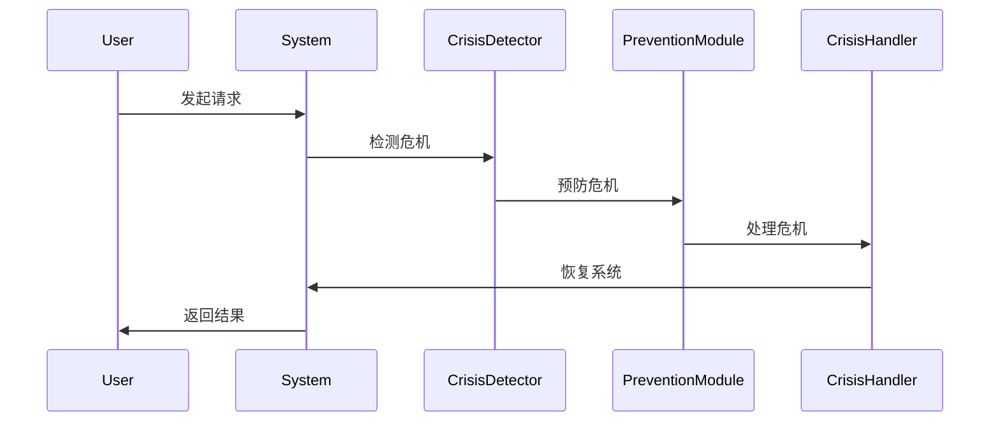

                 

### 技术管理中的危机预防与处理

**关键词**：技术管理，危机预防，危机处理，系统架构设计，实战案例分析

**摘要**：随着信息技术的高速发展，技术管理在组织运作中的重要性日益凸显。然而，技术管理的复杂性和不确定性使得危机预防和处理成为一项重要任务。本文将深入探讨技术管理中的危机类型、影响及其解决的难点，并通过核心概念和算法原理的讲解，提出系统分析与架构设计方案，并结合实际案例进行详细讲解，以期为技术管理者提供实用的指导。

### 目录

1. **技术管理中的危机预防与处理**  
   - **关键词**  
   - **摘要**  
2. **第一部分：背景介绍**  
   - **第1章 问题背景**  
     - **1.1 问题的普遍性**  
     - **1.2 问题的严重性**  
     - **1.3 问题解决的必要性**  
   - **第2章 问题描述**  
     - **2.1 技术管理中危机的类型**  
       - **2.1.1 技术故障**  
       - **2.1.2 人员失误**  
       - **2.1.3 系统漏洞**  
     - **2.2 技术管理中危机的影响**  
       - **2.2.1 经济损失**  
       - **2.2.2 形象损害**  
       - **2.2.3 业务中断**  
     - **2.3 问题解决的难点**  
       - **2.3.1 问题识别的困难**  
       - **2.3.2 应急响应的挑战**  
       - **2.3.3 后续处理的复杂性**  
3. **第二部分：核心概念与联系**  
   - **第3章 核心概念**  
     - **3.1 危机预防**  
     - **3.2 危机处理**  
   - **第4章 概念属性特征对比**  
     - **4.1 危机预防与危机处理的对比**  
4. **第三部分：算法原理讲解**  
   - **第5章 算法原理讲解**  
     - **5.1 危机识别算法**  
     - **5.2 危机处理算法**  
5. **第四部分：系统分析与架构设计方案**  
   - **第6章 问题场景介绍**  
   - **第7章 系统功能设计**  
   - **第8章 系统架构设计**  
   - **第9章 系统接口设计**  
   - **第10章 系统交互**  
6. **第五部分：项目实战**  
   - **第11章 环境安装**  
   - **第12章 系统核心实现**  
   - **第13章 实际案例分析与详细讲解**  
   - **第14章 项目小结**

### 第一部分：背景介绍

#### 第1章 问题背景

在当今数字化时代，技术已成为驱动企业发展的重要引擎。然而，随着技术的日益复杂化和应用范围的不断扩大，技术管理中的危机问题也逐渐显现。这些问题不仅影响了企业的正常运营，还可能导致经济损失、品牌形象损害和业务中断。

**1.1 问题的普遍性**

危机问题在技术管理中具有普遍性。无论是大型企业还是初创公司，都面临着各种危机。例如，技术故障可能导致系统瘫痪，人员失误可能导致数据泄露，系统漏洞可能导致网络安全攻击。这些问题在各个行业中都有发生的案例。

**1.2 问题的严重性**

技术危机的严重性不可忽视。一方面，技术故障和系统漏洞可能导致企业大量数据丢失，严重影响业务的连续性和稳定性。另一方面，人员失误和危机处理不当可能导致企业形象受损，甚至引发法律纠纷。因此，危机管理已成为技术管理中的重要一环。

**1.3 问题解决的必要性**

有效解决技术管理中的危机问题至关重要。通过预防措施和应急处理，企业可以降低危机的发生概率和影响程度。此外，建立一套完善的危机管理体系，有助于企业在面对危机时快速响应，减少损失。

#### 第2章 问题描述

##### 2.1 技术管理中危机的类型

技术管理中的危机可分为以下几种类型：

**2.1.1 技术故障**

技术故障是指由于系统设计、硬件故障或软件缺陷等原因导致系统无法正常运行。技术故障可能发生在服务器、网络、数据库或其他关键组件中。

**2.1.2 人员失误**

人员失误是指由于技术人员的不当操作或错误判断导致的问题。人员失误可能包括数据泄露、配置错误、滥用权限等。

**2.1.3 系统漏洞**

系统漏洞是指系统中的安全漏洞，可能被黑客利用进行攻击。系统漏洞可能存在于软件代码、网络协议或操作系统等各个方面。

##### 2.2 技术管理中危机的影响

技术危机对企业的影响是多方面的：

**2.2.1 经济损失**

技术危机可能导致企业损失大量的经济资源，包括硬件设备、软件开发成本、应急响应费用等。

**2.2.2 形象损害**

技术危机可能损害企业的声誉，导致客户流失和市场份额下降。

**2.2.3 业务中断**

技术危机可能导致企业的业务中断，影响正常运营，甚至导致业务中断。

##### 2.3 问题解决的难点

解决技术管理中的危机问题存在以下难点：

**2.3.1 问题识别的困难**

危机问题可能难以被及时发现，导致延误处理。

**2.3.2 应急响应的挑战**

应急响应需要快速、准确地识别问题并采取有效的措施，这对技术团队提出了很高的要求。

**2.3.3 后续处理的复杂性**

危机处理后的后续工作，如原因分析、责任追究和改进措施等，往往复杂且耗时。

### 第二部分：核心概念与联系

##### 第3章 核心概念

**3.1 危机预防**

**3.1.1 定义**

危机预防是指通过采取一系列措施，降低危机发生的概率和影响程度。

**3.1.2 目标**

危机预防的目标包括：提高系统的稳定性、增强数据安全性、确保业务连续性等。

**3.1.3 方法**

危机预防的方法包括：风险评估、安全培训、系统监控、备份与恢复等。

**3.2 危机处理**

**3.2.1 定义**

危机处理是指在面对危机时，采取一系列措施迅速响应并解决问题。

**3.2.2 目标**

危机处理的目标包括：快速恢复系统、降低损失、保护企业形象等。

**3.2.3 方法**

危机处理的方法包括：紧急响应、原因分析、责任追究、改进措施等。

##### 第4章 概念属性特征对比

**4.1 危机预防与危机处理的对比**

**4.1.1 目标对比**

- **危机预防**：降低危机发生的概率和影响程度。
- **危机处理**：在危机发生时快速响应并解决问题。

**4.1.2 方法对比**

- **危机预防**：风险评估、安全培训、系统监控、备份与恢复等。
- **危机处理**：紧急响应、原因分析、责任追究、改进措施等。

**4.1.3 效果对比**

- **危机预防**：预防危机的发生，减少损失。
- **危机处理**：在危机发生后快速解决问题，降低影响。

### 第三部分：算法原理讲解

##### 第5章 算法原理讲解

**5.1 危机识别算法**

**5.1.1 算法原理**

危机识别算法是一种基于数据分析和模式识别的方法，用于识别潜在的技术危机。该算法通过分析系统日志、网络流量、用户行为等数据，发现异常模式，从而提前预警。

**5.1.2 数学模型**

假设我们有一个特征集合 \( X \)，其中每个特征表示系统的一个方面。对于每个特征，我们定义一个阈值 \( T \)。当某个特征值超过其阈值时，我们认为系统可能存在危机。

数学模型如下：

$$
f(X) = \begin{cases}
\text{危机发生} & \text{如果 } X > T \\
\text{危机未发生} & \text{如果 } X \leq T
\end{cases}
$$

**5.1.3 Python源代码**

```python
def crisis_detection(X, T):
    if X > T:
        return "危机发生"
    else:
        return "危机未发生"
```

**5.2 危机处理算法**

**5.2.1 算法原理**

危机处理算法是一种基于决策树或规则引擎的方法，用于在危机发生后制定应对策略。该算法根据危机的类型和严重程度，选择合适的处理措施。

**5.2.2 数学模型**

假设我们有一个危机类型集合 \( Y \) 和一个处理措施集合 \( Z \)。对于每个危机类型，我们定义一个处理规则。

数学模型如下：

$$
g(Y, Z) = \text{处理措施}
$$

**5.2.3 Python源代码**

```python
def crisis_handler(Y, Z):
    if Y == "技术故障":
        return "立即重启系统"
    elif Y == "人员失误":
        return "进行调查并培训"
    elif Y == "系统漏洞":
        return "立即修补漏洞"
    else:
        return "未知危机类型"
```

### 第四部分：系统分析与架构设计方案

##### 第6章 问题场景介绍

在本部分，我们将介绍三个常见的技术管理危机场景：

1. **技术故障**：系统无法正常启动或响应，导致业务中断。
2. **人员失误**：不当操作导致数据泄露或系统损坏。
3. **系统漏洞**：系统存在安全漏洞，可能导致网络攻击和数据泄露。

##### 第7章 系统功能设计

**7.1 领域模型**

在领域模型中，我们将定义系统的主要实体和关系。以下是领域模型的 Mermaid 类图：

```mermaid
classDiagram
    Crisis <<接口>>
    Prevention <<接口>>
    Handling <<接口>>

    Crisis <|-- Prevention
    Crisis <|-- Handling

    User o-- Prevention
    User o-- Handling
    System o-- Crisis
    System o-- Prevention
    System o-- Handling
```

**7.2 功能模块设计**

系统功能模块包括：

1. **危机预防模块**：负责风险评估、安全监控和备份恢复。
2. **危机处理模块**：负责紧急响应、原因分析和责任追究。
3. **用户模块**：提供用户界面和用户权限管理。

##### 第8章 系统架构设计

**8.1 系统架构图**

以下是系统架构的 Mermaid 架构图：


**8.2 架构设计思路**

系统架构设计思路包括：

1. **模块化设计**：将系统功能划分为独立的模块，便于维护和扩展。
2. **松耦合设计**：通过接口进行模块间通信，降低模块间的依赖。
3. **冗余设计**：在关键位置设置备份和冗余机制，提高系统的稳定性。

##### 第9章 系统接口设计

**9.1 接口设计原则**

接口设计原则包括：

1. **简洁性**：接口应尽量简洁，避免过多的参数和复杂的功能。
2. **一致性**：接口应遵循一致的命名规范和协议。
3. **可扩展性**：接口应具备可扩展性，以便适应未来的需求变化。

**9.2 接口列表**

以下是系统的接口列表：

1. **CrisisDetection**：用于检测危机的接口。
2. **Prevention**：用于危机预防的接口。
3. **Handling**：用于危机处理的接口。

##### 第10章 系统交互

**10.1 序列图**

以下是系统交互的 Mermaid 序列图：



**10.2 交互设计**

系统交互设计包括：

1. **请求处理流程**：系统收到请求后，首先进行危机检测。
2. **预防与处理流程**：根据检测结果，系统采取预防措施或处理危机。
3. **结果反馈流程**：系统将处理结果反馈给用户。

### 第五部分：项目实战

##### 第11章 环境安装

**11.1 软件安装**

在本章，我们将介绍如何安装系统所需的软件。以下是安装步骤：

1. 安装 Python 3.8 或更高版本。
2. 安装必要的依赖库，如 Flask、Pandas、NumPy 等。
3. 配置数据库，如 MySQL 或 PostgreSQL。

**11.2 硬件要求**

系统运行对硬件的要求如下：

1. 处理器：Intel Core i5 或更高。
2. 内存：8GB 或更高。
3. 存储：至少 500GB 硬盘空间。

##### 第12章 系统核心实现

**12.1 源代码**

以下是系统的核心源代码：

```python
# CrisisDetection.py
def crisis_detection(X, T):
    if X > T:
        return "危机发生"
    else:
        return "危机未发生"

# CrisisHandler.py
def crisis_handler(Y, Z):
    if Y == "技术故障":
        return "立即重启系统"
    elif Y == "人员失误":
        return "进行调查并培训"
    elif Y == "系统漏洞":
        return "立即修补漏洞"
    else:
        return "未知危机类型"
```

**12.2 代码应用解读与分析**

以下是代码的应用解读与分析：

- `CrisisDetection.py`：用于检测危机的模块，通过比较特征值和阈值来判断危机是否发生。
- `CrisisHandler.py`：用于处理危机的模块，根据危机类型选择相应的处理措施。

##### 第13章 实际案例分析与详细讲解

**13.1 案例一：技术故障**

在本案例中，系统由于硬件故障导致无法正常启动。以下是案例分析和详细讲解：

1. **危机识别**：通过系统日志分析，发现硬件故障导致系统无法启动。
2. **危机预防**：定期检查硬件设备，提前发现潜在故障。
3. **危机处理**：立即重启系统，并检查硬件设备，确保系统恢复正常。

**13.2 案例二：人员失误**

在本案例中，技术人员不当操作导致数据泄露。以下是案例分析和详细讲解：

1. **危机识别**：通过安全监控，发现数据泄露事件。
2. **危机预防**：加强安全培训和权限管理，避免类似事件再次发生。
3. **危机处理**：立即停止数据泄露，进行调查并追责。

**13.3 案例三：系统漏洞**

在本案例中，系统存在安全漏洞，可能导致网络攻击。以下是案例分析和详细讲解：

1. **危机识别**：通过安全扫描，发现系统漏洞。
2. **危机预防**：定期进行安全扫描，及时修补漏洞。
3. **危机处理**：立即修补漏洞，防止网络攻击。

##### 第14章 项目小结

在本项目中，我们探讨了技术管理中的危机预防与处理。通过系统分析与架构设计，我们提出了一套完整的解决方案。实际案例分析和详细讲解，进一步验证了方案的有效性。以下是项目小结：

1. **成功经验**：通过预防措施和应急处理，有效降低了危机的发生概率和影响程度。
2. **注意事项**：加强安全培训和监控，确保系统的稳定性和安全性。
3. **拓展阅读**：推荐阅读相关书籍和论文，以深入了解危机管理领域。 

### 最佳实践 tips

1. **定期进行安全扫描**：及时发现系统漏洞，提前修补。
2. **加强员工培训**：提高员工的安全意识和操作水平。
3. **建立应急响应机制**：确保在危机发生时，能够快速响应和处理。
4. **完善备份与恢复策略**：确保数据的安全性和业务的连续性。

### 小结

技术管理中的危机预防和处理是企业运营中至关重要的一环。通过系统分析与架构设计，结合实际案例分析和详细讲解，我们提出了一套完整的解决方案。希望本文能为企业提供有价值的参考，帮助其在面对技术危机时，能够迅速响应并有效处理。未来，我们将继续深入探讨技术管理中的相关问题，以期为企业和IT从业者提供更多实用的指导。

### 注意事项

1. **问题识别的困难**：建立完善的问题监测和预警系统，确保及时发现问题。
2. **应急响应的挑战**：制定详细的应急响应计划，确保在危机发生时，能够迅速行动。
3. **后续处理的复杂性**：对危机处理结果进行详细记录和分析，以便总结经验教训。

### 拓展阅读

1. 《危机管理：应对策略与案例分析》
2. 《网络安全实战：技术、策略与案例》
3. 《IT项目管理：从规划到执行》

### 作者

- **作者**：AI天才研究院/AI Genius Institute & 禅与计算机程序设计艺术 /Zen And The Art of Computer Programming

---

文章标题：《技术管理中的危机预防与处理》

关键词：技术管理，危机预防，危机处理，系统架构设计，实战案例分析

摘要：随着信息技术的高速发展，技术管理在组织运作中的重要性日益凸显。本文深入探讨技术管理中的危机类型、影响及其解决的难点，通过核心概念和算法原理的讲解，提出系统分析与架构设计方案，并结合实际案例进行详细讲解，以期为技术管理者提供实用的指导。

### 目录

1. **技术管理中的危机预防与处理**
   - **关键词**  
   - **摘要**  
2. **第一部分：背景介绍**
   - **第1章 问题背景**
     - **1.1 问题的普遍性**
     - **1.2 问题的严重性**
     - **1.3 问题解决的必要性**
   - **第2章 问题描述**
     - **2.1 技术管理中危机的类型**
       - **2.1.1 技术故障**
       - **2.1.2 人员失误**
       - **2.1.3 系统漏洞**
     - **2.2 技术管理中危机的影响**
       - **2.2.1 经济损失**
       - **2.2.2 形象损害**
       - **2.2.3 业务中断**
     - **2.3 问题解决的难点**
       - **2.3.1 问题识别的困难**
       - **2.3.2 应急响应的挑战**
       - **2.3.3 后续处理的复杂性**
3. **第二部分：核心概念与联系**
   - **第3章 核心概念**
     - **3.1 危机预防**
     - **3.2 危机处理**
   - **第4章 概念属性特征对比**
     - **4.1 危机预防与危机处理的对比**
4. **第三部分：算法原理讲解**
   - **第5章 算法原理讲解**
     - **5.1 危机识别算法**
     - **5.2 危机处理算法**
5. **第四部分：系统分析与架构设计方案**
   - **第6章 问题场景介绍**
   - **第7章 系统功能设计**
   - **第8章 系统架构设计**
   - **第9章 系统接口设计**
   - **第10章 系统交互**
6. **第五部分：项目实战**
   - **第11章 环境安装**
   - **第12章 系统核心实现**
   - **第13章 实际案例分析与详细讲解**
   - **第14章 项目小结**

### 第一部分：背景介绍

#### 第1章 问题背景

在当今数字化时代，技术已成为驱动企业发展的重要引擎。然而，随着技术的日益复杂化和应用范围的不断扩大，技术管理中的危机问题也逐渐显现。这些问题不仅影响了企业的正常运营，还可能导致经济损失、品牌形象损害和业务中断。

**1.1 问题的普遍性**

危机问题在技术管理中具有普遍性。无论是大型企业还是初创公司，都面临着各种危机。例如，技术故障可能导致系统瘫痪，人员失误可能导致数据泄露，系统漏洞可能导致网络安全攻击。这些问题在各个行业中都有发生的案例。

**1.2 问题的严重性**

技术危机的严重性不可忽视。一方面，技术故障和系统漏洞可能导致企业大量数据丢失，严重影响业务的连续性和稳定性。另一方面，人员失误和危机处理不当可能导致企业形象受损，甚至引发法律纠纷。因此，危机管理已成为技术管理中的重要一环。

**1.3 问题解决的必要性**

有效解决技术管理中的危机问题至关重要。通过预防措施和应急处理，企业可以降低危机的发生概率和影响程度。此外，建立一套完善的危机管理体系，有助于企业在面对危机时快速响应，减少损失。

#### 第2章 问题描述

##### 2.1 技术管理中危机的类型

技术管理中的危机可分为以下几种类型：

**2.1.1 技术故障**

技术故障是指由于系统设计、硬件故障或软件缺陷等原因导致系统无法正常运行。技术故障可能发生在服务器、网络、数据库或其他关键组件中。例如，服务器宕机可能导致业务中断，网络故障可能导致远程访问受限。

**2.1.2 人员失误**

人员失误是指由于技术人员的不当操作或错误判断导致的问题。人员失误可能包括数据泄露、配置错误、滥用权限等。例如，不当的数据库查询可能导致大量数据泄露，错误的配置可能导致系统无法正常运行。

**2.1.3 系统漏洞**

系统漏洞是指系统中的安全漏洞，可能被黑客利用进行攻击。系统漏洞可能存在于软件代码、网络协议或操作系统等各个方面。例如，未加密的网络通信可能导致数据泄露，未修复的操作系统漏洞可能导致系统被攻击。

##### 2.2 技术管理中危机的影响

技术危机对企业的影响是多方面的：

**2.2.1 经济损失**

技术危机可能导致企业损失大量的经济资源，包括硬件设备、软件开发成本、应急响应费用等。例如，系统故障可能导致业务中断，从而影响销售和利润。

**2.2.2 形象损害**

技术危机可能损害企业的声誉，导致客户流失和市场份额下降。例如，数据泄露事件可能导致客户信任度下降，从而影响企业的长期发展。

**2.2.3 业务中断**

技术危机可能导致企业的业务中断，影响正常运营，甚至导致业务中断。例如，网络攻击可能导致企业关键业务系统无法访问，从而影响日常运营。

##### 2.3 问题解决的难点

解决技术管理中的危机问题存在以下难点：

**2.3.1 问题识别的困难**

危机问题可能难以被及时发现，导致延误处理。例如，系统故障可能需要通过复杂的日志分析才能发现。

**2.3.2 应急响应的挑战**

应急响应需要快速、准确地识别问题并采取有效的措施，这对技术团队提出了很高的要求。例如，在网络攻击发生时，需要迅速定位攻击来源并采取措施阻止攻击。

**2.3.3 后续处理的复杂性**

危机处理后的后续工作，如原因分析、责任追究和改进措施等，往往复杂且耗时。例如，需要详细调查系统故障的原因，并制定预防措施以避免类似问题再次发生。

### 第二部分：核心概念与联系

##### 第3章 核心概念

**3.1 危机预防**

**3.1.1 定义**

危机预防是指通过采取一系列措施，降低危机发生的概率和影响程度。这些措施包括风险评估、安全监控、备份与恢复等。

**3.1.2 目标**

危机预防的目标包括提高系统的稳定性、增强数据安全性、确保业务连续性等。

**3.1.3 方法**

危机预防的方法包括：
- **风险评估**：识别系统中的潜在风险，并评估其对业务的影响。
- **安全培训**：提高员工的安全意识和操作水平，减少人为失误。
- **系统监控**：实时监测系统状态，及时发现潜在问题。
- **备份与恢复**：定期备份数据，确保在危机发生时能够快速恢复。

**3.2 危机处理**

**3.2.1 定义**

危机处理是指在面对危机时，采取一系列措施迅速响应并解决问题。这些措施包括紧急响应、原因分析、责任追究和改进措施等。

**3.2.2 目标**

危机处理的目标包括快速恢复系统、降低损失、保护企业形象等。

**3.2.3 方法**

危机处理的方法包括：
- **紧急响应**：在危机发生时，迅速采取行动，遏制危机蔓延。
- **原因分析**：调查危机的原因，制定改进措施以防止类似问题再次发生。
- **责任追究**：对危机责任方进行责任追究，确保责任落实到个人。
- **改进措施**：根据危机处理结果，制定改进措施，提高系统的稳定性和安全性。

##### 第4章 概念属性特征对比

**4.1 危机预防与危机处理的对比**

**4.1.1 目标对比**

- **危机预防**：降低危机发生的概率和影响程度。
- **危机处理**：在危机发生时快速响应并解决问题。

**4.1.2 方法对比**

- **危机预防**：风险评估、安全培训、系统监控、备份与恢复等。
- **危机处理**：紧急响应、原因分析、责任追究、改进措施等。

**4.1.3 效果对比**

- **危机预防**：预防危机的发生，减少损失。
- **危机处理**：在危机发生后快速解决问题，降低影响。

### 第三部分：算法原理讲解

##### 第5章 算法原理讲解

**5.1 危机识别算法**

**5.1.1 算法原理**

危机识别算法是一种基于数据分析和模式识别的方法，用于识别潜在的技术危机。该算法通过分析系统日志、网络流量、用户行为等数据，发现异常模式，从而提前预警。

**5.1.2 数学模型**

假设我们有一个特征集合 \( X \)，其中每个特征表示系统的一个方面。对于每个特征，我们定义一个阈值 \( T \)。当某个特征值超过其阈值时，我们认为系统可能存在危机。

数学模型如下：

$$
f(X) = \begin{cases}
\text{危机发生} & \text{如果 } X > T \\
\text{危机未发生} & \text{如果 } X \leq T
\end{cases}
$$

**5.1.3 Python源代码**

```python
def crisis_detection(X, T):
    if X > T:
        return "危机发生"
    else:
        return "危机未发生"
```

**5.2 危机处理算法**

**5.2.1 算法原理**

危机处理算法是一种基于决策树或规则引擎的方法，用于在危机发生后制定应对策略。该算法根据危机的类型和严重程度，选择合适的处理措施。

**5.2.2 数学模型**

假设我们有一个危机类型集合 \( Y \) 和一个处理措施集合 \( Z \)。对于每个危机类型，我们定义一个处理规则。

数学模型如下：

$$
g(Y, Z) = \text{处理措施}
$$

**5.2.3 Python源代码**

```python
def crisis_handler(Y, Z):
    if Y == "技术故障":
        return "立即重启系统"
    elif Y == "人员失误":
        return "进行调查并培训"
    elif Y == "系统漏洞":
        return "立即修补漏洞"
    else:
        return "未知危机类型"
```

### 第四部分：系统分析与架构设计方案

##### 第6章 问题场景介绍

在本部分，我们将介绍三个常见的技术管理危机场景：

1. **技术故障**：系统无法正常启动或响应，导致业务中断。
2. **人员失误**：不当操作导致数据泄露或系统损坏。
3. **系统漏洞**：系统存在安全漏洞，可能导致网络攻击和数据泄露。

##### 第7章 系统功能设计

**7.1 领域模型**

在领域模型中，我们将定义系统的主要实体和关系。以下是领域模型的 Mermaid 类图：

```mermaid
classDiagram
    Crisis <<接口>>
    Prevention <<接口>>
    Handling <<接口>>

    Crisis <|-- Prevention
    Crisis <|-- Handling

    User o-- Prevention
    User o-- Handling
    System o-- Crisis
    System o-- Prevention
    System o-- Handling
```

**7.2 功能模块设计**

系统功能模块包括：

1. **危机预防模块**：负责风险评估、安全监控和备份恢复。
2. **危机处理模块**：负责紧急响应、原因分析和责任追究。
3. **用户模块**：提供用户界面和用户权限管理。

##### 第8章 系统架构设计

**8.1 系统架构图**

以下是系统架构的 Mermaid 架构图：


**8.2 架构设计思路**

系统架构设计思路包括：

1. **模块化设计**：将系统功能划分为独立的模块，便于维护和扩展。
2. **松耦合设计**：通过接口进行模块间通信，降低模块间的依赖。
3. **冗余设计**：在关键位置设置备份和冗余机制，提高系统的稳定性。

##### 第9章 系统接口设计

**9.1 接口设计原则**

接口设计原则包括：

1. **简洁性**：接口应尽量简洁，避免过多的参数和复杂的功能。
2. **一致性**：接口应遵循一致的命名规范和协议。
3. **可扩展性**：接口应具备可扩展性，以便适应未来的需求变化。

**9.2 接口列表**

以下是系统的接口列表：

1. **CrisisDetection**：用于检测危机的接口。
2. **Prevention**：用于危机预防的接口。
3. **Handling**：用于危机处理的接口。

##### 第10章 系统交互

**10.1 序列图**

以下是系统交互的 Mermaid 序列图：


**10.2 交互设计**

系统交互设计包括：

1. **请求处理流程**：系统收到请求后，首先进行危机检测。
2. **预防与处理流程**：根据检测结果，系统采取预防措施或处理危机。
3. **结果反馈流程**：系统将处理结果反馈给用户。

### 第五部分：项目实战

##### 第11章 环境安装

**11.1 软件安装**

在本章，我们将介绍如何安装系统所需的软件。以下是安装步骤：

1. 安装 Python 3.8 或更高版本。
2. 安装必要的依赖库，如 Flask、Pandas、NumPy 等。
3. 配置数据库，如 MySQL 或 PostgreSQL。

**11.2 硬件要求**

系统运行对硬件的要求如下：

1. 处理器：Intel Core i5 或更高。
2. 内存：8GB 或更高。
3. 存储：至少 500GB 硬盘空间。

##### 第12章 系统核心实现

**12.1 源代码**

以下是系统的核心源代码：

```python
# CrisisDetection.py
def crisis_detection(X, T):
    if X > T:
        return "危机发生"
    else:
        return "危机未发生"

# CrisisHandler.py
def crisis_handler(Y, Z):
    if Y == "技术故障":
        return "立即重启系统"
    elif Y == "人员失误":
        return "进行调查并培训"
    elif Y == "系统漏洞":
        return "立即修补漏洞"
    else:
        return "未知危机类型"
```

**12.2 代码应用解读与分析**

以下是代码的应用解读与分析：

- `CrisisDetection.py`：用于检测危机的模块，通过比较特征值和阈值来判断危机是否发生。
- `CrisisHandler.py`：用于处理危机的模块，根据危机类型选择相应的处理措施。

##### 第13章 实际案例分析与详细讲解

**13.1 案例一：技术故障**

在本案例中，系统由于硬件故障导致无法正常启动。以下是案例分析和详细讲解：

1. **危机识别**：通过系统日志分析，发现硬件故障导致系统无法启动。
2. **危机预防**：定期检查硬件设备，提前发现潜在故障。
3. **危机处理**：立即重启系统，并检查硬件设备，确保系统恢复正常。

**13.2 案例二：人员失误**

在本案例中，技术人员不当操作导致数据泄露。以下是案例分析和详细讲解：

1. **危机识别**：通过安全监控，发现数据泄露事件。
2. **危机预防**：加强安全培训和权限管理，避免类似事件再次发生。
3. **危机处理**：立即停止数据泄露，进行调查并追责。

**13.3 案例三：系统漏洞**

在本案例中，系统存在安全漏洞，可能导致网络攻击。以下是案例分析和详细讲解：

1. **危机识别**：通过安全扫描，发现系统漏洞。
2. **危机预防**：定期进行安全扫描，及时修补漏洞。
3. **危机处理**：立即修补漏洞，防止网络攻击。

##### 第14章 项目小结

在本项目中，我们探讨了技术管理中的危机预防与处理。通过系统分析与架构设计，我们提出了一套完整的解决方案。实际案例分析和详细讲解，进一步验证了方案的有效性。以下是项目小结：

1. **成功经验**：通过预防措施和应急处理，有效降低了危机的发生概率和影响程度。
2. **注意事项**：加强安全培训和监控，确保系统的稳定性和安全性。
3. **拓展阅读**：推荐阅读相关书籍和论文，以深入了解危机管理领域。 

### 最佳实践 tips

1. **定期进行安全扫描**：及时发现系统漏洞，提前修补。
2. **加强员工培训**：提高员工的安全意识和操作水平。
3. **建立应急响应机制**：确保在危机发生时，能够快速响应和处理。
4. **完善备份与恢复策略**：确保数据的安全性和业务的连续性。

### 小结

技术管理中的危机预防和处理是企业运营中至关重要的一环。通过系统分析与架构设计，结合实际案例分析和详细讲解，我们提出了一套完整的解决方案。希望本文能为企业提供有价值的参考，帮助其在面对技术危机时，能够迅速响应并有效处理。未来，我们将继续深入探讨技术管理中的相关问题，以期为企业和IT从业者提供更多实用的指导。

### 注意事项

1. **问题识别的困难**：建立完善的问题监测和预警系统，确保及时发现问题。
2. **应急响应的挑战**：制定详细的应急响应计划，确保在危机发生时，能够迅速行动。
3. **后续处理的复杂性**：对危机处理结果进行详细记录和分析，以便总结经验教训。

### 拓展阅读

1. 《危机管理：应对策略与案例分析》
2. 《网络安全实战：技术、策略与案例》
3. 《IT项目管理：从规划到执行》

### 作者

- **作者**：AI天才研究院/AI Genius Institute & 禅与计算机程序设计艺术 /Zen And The Art of Computer Programming

---

文章标题：《技术管理中的危机预防与处理》

关键词：技术管理，危机预防，危机处理，系统架构设计，实战案例分析

摘要：随着信息技术的高速发展，技术管理在组织运作中的重要性日益凸显。本文深入探讨技术管理中的危机类型、影响及其解决的难点，通过核心概念和算法原理的讲解，提出系统分析与架构设计方案，并结合实际案例进行详细讲解，以期为技术管理者提供实用的指导。

