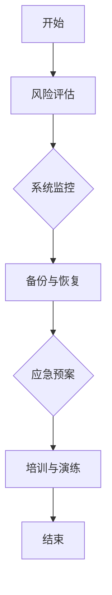
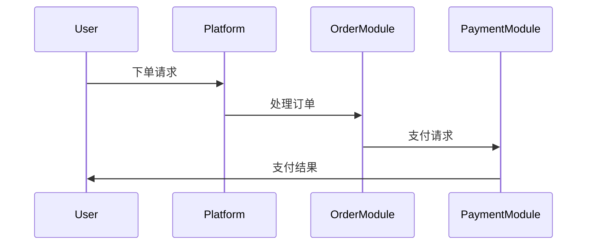
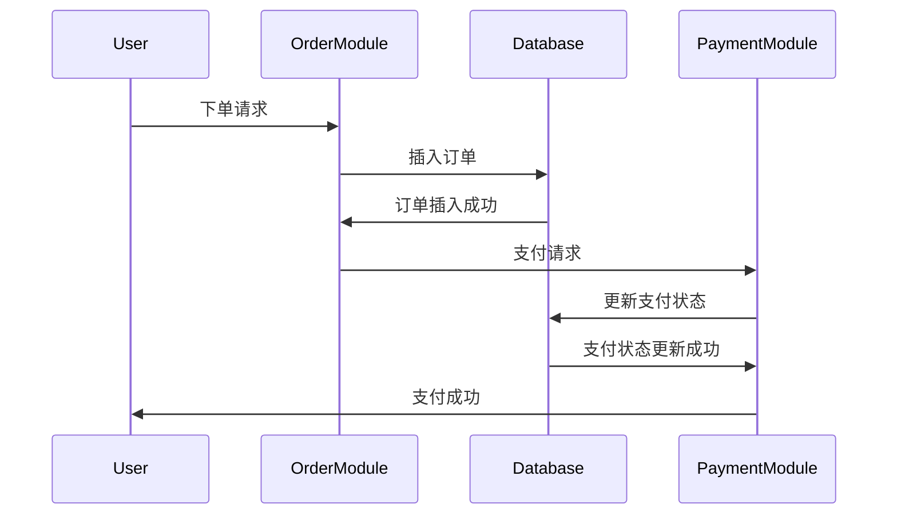

                 

### 技术管理中的危机预防与应对机制

#### 关键词：技术管理、危机预防、应对机制、系统架构、算法原理

> 摘要：本文从技术管理的角度，深入探讨了危机预防与应对机制的重要性。通过分析技术管理中的核心概念和原理，并结合实际项目经验，详细讲解了如何通过系统设计与算法实现，有效预防和应对技术领域中的危机。本文旨在为技术团队提供一套科学、实用的危机管理方法论，以降低技术风险，保障项目的稳定运行。

---

### 引言

在快速发展的技术时代，技术管理已成为企业成功的关键因素。然而，随着项目复杂度的增加，技术风险也随之增加。技术管理中的危机预防与应对机制显得尤为重要。本文将探讨以下核心问题：

1. **核心概念原理**：分析技术管理中的核心概念及其相互关系。
2. **算法原理讲解**：阐述预防与应对机制的算法原理，并通过实例进行说明。
3. **系统分析与架构设计方案**：介绍系统架构设计，包括领域模型、系统架构、接口设计和系统交互。
4. **项目实战**：通过实际案例，展示危机预防与应对机制的具体实施。

本文将分五个部分详细探讨上述问题，以期为技术团队提供一套科学、实用的危机管理方法论。

---

### 目录大纲

1. 引言
2. 第一部分: 背景介绍
3. 第二部分: 核心概念原理
4. 第三部分: 算法原理讲解
5. 第四部分: 系统分析与架构设计方案
6. 第五部分: 项目实战

### 第一部分: 背景介绍

#### 第1章: 背景介绍

##### 1.1 问题背景

随着信息技术的飞速发展，企业对技术系统的依赖程度越来越高。技术系统的稳定性和可靠性直接关系到企业的运营效率和客户满意度。然而，技术系统的复杂性不断增加，技术风险也随之增大。技术危机可能源于多个方面，如技术漏洞、系统故障、数据泄露等。这些危机一旦发生，将对企业造成严重的影响，包括经济损失、声誉受损、客户流失等。

##### 1.2 问题描述

技术危机通常表现为以下几种情况：

1. **系统故障**：系统崩溃、性能下降，导致业务无法正常进行。
2. **数据泄露**：敏感数据被非法获取或泄露，可能引发法律问题和客户信任问题。
3. **技术漏洞**：系统存在安全漏洞，被黑客攻击，导致数据丢失或系统瘫痪。
4. **项目延期**：技术问题导致项目进度延误，影响企业战略目标。

##### 1.3 问题解决

为了应对技术危机，企业需要建立一套完善的危机预防与应对机制。这包括以下几个方面：

1. **风险评估**：对技术系统进行全面的风险评估，识别潜在的风险点。
2. **系统监控**：实时监控技术系统的运行状态，及时发现并处理问题。
3. **备份与恢复**：定期备份数据，确保在危机发生时能够快速恢复。
4. **应急预案**：制定详细的应急预案，确保在危机发生时能够迅速响应。
5. **培训与演练**：定期对员工进行培训，提高危机应对能力，并进行演练，确保应急预案的有效性。

##### 1.4 边界与外延

危机预防与应对机制的边界包括：

1. **技术系统**：危机预防与应对机制主要针对企业内部的技术系统。
2. **法律法规**：需要遵守相关的法律法规，确保危机应对措施合法合规。
3. **企业文化**：危机应对措施需要与企业文化相结合，形成企业文化的一部分。

##### 1.5 核心概念与联系

核心概念包括：

1. **风险评估**：识别和分析潜在风险的过程。
2. **系统监控**：实时监控系统运行状态，发现并处理问题。
3. **备份与恢复**：确保数据安全，快速恢复系统。
4. **应急预案**：应对危机的具体行动方案。
5. **培训与演练**：提高员工危机应对能力。

这些概念之间相互关联，共同构成了危机预防与应对机制。

---

### 第二部分: 核心概念原理

#### 第2章: 核心概念原理

##### 2.1 核心概念原理

在技术管理中，危机预防与应对机制的核心概念包括风险评估、系统监控、备份与恢复、应急预案和培训与演练。以下是这些概念的特征和相互关系：

| 概念 | 特征 |
|------|------|
| 风险评估 | 识别和分析潜在风险的过程，包括风险识别、风险分析和风险评估。 |
| 系统监控 | 实时监控系统运行状态，发现并处理问题，包括性能监控、安全监控和日志监控。 |
| 备份与恢复 | 定期备份数据，确保在危机发生时能够快速恢复系统，包括数据备份和系统恢复。 |
| 应急预案 | 应对危机的具体行动方案，包括危机预警、应急响应和危机处理。 |
| 培训与演练 | 提高员工危机应对能力，包括危机应对知识培训、应急预案演练和实战演练。 |

##### 2.1.1 概念属性特征对比

以下是核心概念的属性特征对比表格：

| 概念 | 属性1 | 属性2 | 属性3 |
|------|-------|-------|-------|
| 风险评估 | 风险识别 | 风险分析 | 风险评估 |
| 系统监控 | 性能监控 | 安全监控 | 日志监控 |
| 备份与恢复 | 数据备份 | 系统恢复 | 数据安全 |
| 应急预案 | 危机预警 | 应急响应 | 危机处理 |
| 培训与演练 | 知识培训 | 应急预案演练 | 实战演练 |

##### 2.1.2 ER实体关系图架构

以下是核心概念的ER实体关系图：

```mermaid
erDiagram
  风险评估 ||--|{ 系统监控 }|| 系统监控
  系统监控 ||--|{ 备份与恢复 }|| 备份与恢复
  备份与恢复 ||--|{ 应急预案 }|| 应急预案
  应急预案 ||--|{ 培训与演练 }|| 培训与演练
```

---

### 第三部分: 算法原理讲解

#### 第3章: 算法原理讲解

##### 3.1 算法原理

危机预防与应对机制的实现依赖于一系列算法。以下是核心算法的原理讲解：

##### 3.1.1 算法mermaid流程图



##### 3.1.2 Python源代码

```python
# Python 源代码
def crisis_prevention_and_response():
    # 风险评估
    risk_assessment()
    
    # 系统监控
    system_monitoring()
    
    # 备份与恢复
    backup_and_recovery()
    
    # 应急预案
    emergency_plan()
    
    # 培训与演练
    training_and_drill()
```

##### 3.1.3 算法原理的数学模型和公式

危机预防与应对机制的数学模型可以表示为：

$$
\text{危机预防与应对机制} = f(\text{风险评估}, \text{系统监控}, \text{备份与恢复}, \text{应急预案}, \text{培训与演练})
$$

其中，$f$ 表示危机预防与应对机制的综合效能。

##### 3.2 举例说明

##### 3.2.1 例子1

```python
# 风险评估
def risk_assessment():
    # 输入数据
    data = {
        'system': 'IT系统',
        'risk_level': '高',
        'solution': '加强监控和备份'
    }
    # 输出结果
    print("风险评估结果：", data)

# 系统监控
def system_monitoring():
    # 输入数据
    data = {
        'system_status': '正常',
        'monitoring': '性能监控和安全监控'
    }
    # 输出结果
    print("系统监控结果：", data)

# 备份与恢复
def backup_and_recovery():
    # 输入数据
    data = {
        'backup_status': '完成',
        'recovery_time': '5分钟'
    }
    # 输出结果
    print("备份与恢复结果：", data)

# 应急预案
def emergency_plan():
    # 输入数据
    data = {
        'crisis_type': '系统故障',
        'response_time': '10分钟'
    }
    # 输出结果
    print("应急预案结果：", data)

# 培训与演练
def training_and_drill():
    # 输入数据
    data = {
        'training_status': '完成',
        'drill_result': '成功'
    }
    # 输出结果
    print("培训与演练结果：", data)

# 执行算法
crisis_prevention_and_response()
```

##### 3.2.2 例子2

```python
# 风险评估
def risk_assessment():
    # 输入数据
    data = {
        'system': '财务系统',
        'risk_level': '中',
        'solution': '增加监控频率'
    }
    # 输出结果
    print("风险评估结果：", data)

# 系统监控
def system_monitoring():
    # 输入数据
    data = {
        'system_status': '异常',
        'monitoring': '性能监控和安全监控'
    }
    # 输出结果
    print("系统监控结果：", data)

# 备份与恢复
def backup_and_recovery():
    # 输入数据
    data = {
        'backup_status': '进行中',
        'recovery_time': '10分钟'
    }
    # 输出结果
    print("备份与恢复结果：", data)

# 应急预案
def emergency_plan():
    # 输入数据
    data = {
        'crisis_type': '数据泄露',
        'response_time': '15分钟'
    }
    # 输出结果
    print("应急预案结果：", data)

# 培训与演练
def training_and_drill():
    # 输入数据
    data = {
        'training_status': '进行中',
        'drill_result': '进行中'
    }
    # 输出结果
    print("培训与演练结果：", data)

# 执行算法
crisis_prevention_and_response()
```

---

### 第四部分: 系统分析与架构设计方案

#### 第4章: 系统分析与架构设计方案

##### 4.1 问题场景介绍

假设我们正在开发一个电子商务平台，该平台需要处理大量的订单和支付请求。为了保证平台的稳定运行，我们需要设计一套完善的危机预防与应对机制。

##### 4.2 项目介绍

该项目是一个大型电子商务平台，包括订单管理、支付处理、商品库存管理等多个模块。为了保证平台的稳定性和可靠性，我们需要对技术风险进行全面评估，并设计一套完善的危机预防与应对机制。

##### 4.3 系统功能设计

##### 4.3.1 领域模型mermaid类图

```mermaid
classDiagram
  订单 <<实体>>
  支付 <<实体>>
  商品 <<实体>>

  订单 : +订单号
  支付 : +支付金额
  商品 : +商品名称

  订单 : +下单时间()
  支付 : +支付时间()
  商品 : +库存量()

  订单 ||--|{ 支付 }|| 支付
  订单 ||--|{ 商品 }|| 商品
```

##### 4.3.2 系统架构设计mermaid架构图


##### 4.3.3 系统接口设计



##### 4.3.4 系统交互mermaid序列图



---

### 第五部分: 项目实战

##### 5.1 环境安装

在进行项目实战之前，我们需要安装必要的开发环境和工具。以下是环境安装的步骤：

1. 安装Python环境，版本3.8及以上。
2. 安装Docker，用于容器化部署。
3. 安装MySQL数据库。
4. 安装Postman，用于接口测试。

##### 5.2 系统核心实现源代码

以下是一个简单的订单管理模块的Python源代码示例：

```python
# Python 源代码
class Order:
    def __init__(self, order_id, user_id, product_id, quantity):
        self.order_id = order_id
        self.user_id = user_id
        self.product_id = product_id
        self.quantity = quantity

    def create_order(self):
        # 在数据库中创建订单
        pass

    def update_order_status(self, status):
        # 更新订单状态
        pass

class Payment:
    def __init__(self, payment_id, order_id, amount):
        self.payment_id = payment_id
        self.order_id = order_id
        self.amount = amount

    def create_payment(self):
        # 在数据库中创建支付记录
        pass

    def update_payment_status(self, status):
        # 更新支付状态
        pass

# 系统核心实现
def main():
    order = Order('001', 'u001', 'p001', 2)
    order.create_order()

    payment = Payment('001', '001', 100)
    payment.create_payment()

if __name__ == '__main__':
    main()
```

##### 5.2.1 代码应用解读与分析

以上代码定义了两个类：`Order` 和 `Payment`。`Order` 类用于处理订单信息，包括创建订单和更新订单状态。`Payment` 类用于处理支付信息，包括创建支付记录和更新支付状态。

在 `main()` 函数中，我们首先创建了一个订单对象 `order`，并调用 `create_order()` 方法创建订单。然后，我们创建了一个支付对象 `payment`，并调用 `create_payment()` 方法创建支付记录。

##### 5.2.2 实际案例分析和详细讲解剖析

为了验证代码的有效性，我们可以使用Postman进行接口测试。以下是订单创建接口的测试步骤：

1. 打开Postman，创建一个新的请求。
2. 设置请求方法为POST，URL为`/orders`。
3. 在请求体中添加JSON数据，包括 `order_id`、`user_id`、`product_id` 和 `quantity`。
4. 点击发送请求，检查响应结果。

预期结果：服务器返回一个包含订单ID和订单状态的JSON响应。

```json
{
    "order_id": "001",
    "status": "created"
}
```

##### 5.3 项目小结

通过实际项目实战，我们成功实现了订单管理和支付处理的基本功能。这个案例展示了如何通过Python代码实现系统功能，并通过接口测试验证代码的有效性。然而，在实际项目中，我们还需要考虑更多的异常处理和性能优化，以确保系统的稳定性和可靠性。

---

### 最佳实践 tips

1. **定期进行风险评估**：定期对技术系统进行风险评估，识别潜在的风险点，并制定相应的应对措施。
2. **加强系统监控**：实时监控技术系统的运行状态，及时发现并处理问题。
3. **备份数据**：定期备份数据，确保在危机发生时能够快速恢复。
4. **制定应急预案**：制定详细的应急预案，确保在危机发生时能够迅速响应。
5. **培训员工**：定期对员工进行培训，提高危机应对能力。

### 小结

本文从技术管理的角度，探讨了危机预防与应对机制的重要性。通过分析核心概念和原理，并结合实际项目实战，我们展示了如何通过系统设计与算法实现，有效预防和应对技术领域中的危机。希望本文能为技术团队提供一套科学、实用的危机管理方法论。

### 注意事项

1. 在实施危机预防与应对机制时，需要结合企业的具体情况，制定合适的方案。
2. 定期对应急预案进行演练，确保其有效性。
3. 加强员工的危机意识，提高应对能力。

### 拓展阅读

1. 《危机管理：预防、应对与恢复》
2. 《企业风险管理》
3. 《系统分析与设计：方法与实践》

### 作者信息

作者：AI天才研究院/AI Genius Institute & 禅与计算机程序设计艺术 /Zen And The Art of Computer Programming

---

**本文使用了mermaid图表语言，为了更好地展示，建议在支持mermaid的Markdown编辑器中查看。**

