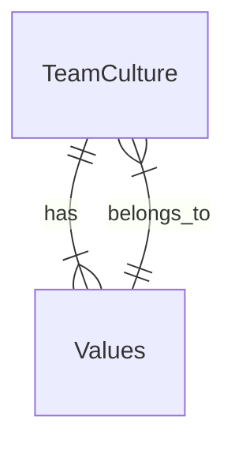

                 

# 《技术管理中的团队文化建设与价值观塑造》

> 关键词：技术管理、团队文化、价值观塑造、领导力、案例分析

> 摘要：本文深入探讨了技术管理中的团队文化建设与价值观塑造的重要性。首先，文章分析了技术团队面临的挑战和团队文化建设的问题，然后介绍了团队文化建设和价值观塑造的方法和路径。接着，通过具体案例解析，探讨了不同类型企业在团队文化建设与价值观塑造方面的实践。最后，文章总结了团队文化建设与价值观塑造的综合应用，并提出了未来研究的方向。

## 目录大纲

----------------------------------------------------------------

# 《技术管理中的团队文化建设与价值观塑造》目录大纲

## 第一部分：引言

### 1.1 问题背景

#### 1.1.1 技术管理的重要性

#### 1.1.2 团队文化建设的重要性

#### 1.1.3 价值观塑造的必要性

### 1.2 问题描述

#### 1.2.1 技术团队面临的挑战

#### 1.2.2 团队文化建设的问题

#### 1.2.3 价值观塑造的困境

### 1.3 问题解决

#### 1.3.1 团队文化建设的路径

#### 1.3.2 价值观塑造的方法

#### 1.3.3 案例分析

### 1.4 边界与外延

#### 1.4.1 团队文化的核心要素

#### 1.4.2 价值观的构成要素

#### 1.4.3 团队文化建设与价值观塑造的关系

### 1.5 本章小结

## 第二部分：团队文化建设的核心概念与联系

### 2.1 核心概念原理

#### 2.1.1 团队文化的定义

#### 2.1.2 价值观的内涵

### 2.2 概念属性特征对比表格

### 2.3 ER实体关系图架构

### 2.4 团队文化建设与价值观塑造的关系

#### 2.4.1 团队文化对价值观塑造的影响

#### 2.4.2 价值观对团队文化建设的作用

#### 2.4.3 二者相互促进的关系

### 2.5 本章小结

## 第三部分：团队文化建设的方法与实践

### 3.1 团队文化建设的路径

#### 3.1.1 诊断与评估

#### 3.1.2 目标设定

#### 3.1.3 计划与执行

#### 3.1.4 监测与调整

### 3.2 团队文化塑造的方法

#### 3.2.1 企业文化建设

#### 3.2.2 领导力塑造

#### 3.2.3 培训与沟通

#### 3.2.4 融合与互动

### 3.3 团队文化案例解析

#### 3.3.1 案例一：科技公司文化建设

#### 3.3.2 案例二：创业公司价值观塑造

#### 3.3.3 案例三：跨国公司文化融合

### 3.4 本章小结

## 第四部分：价值观塑造的理论与实践

### 4.1 价值观塑造的理论基础

#### 4.1.1 行为科学理论

#### 4.1.2 社会学习理论

#### 4.1.3 组织行为理论

### 4.2 价值观塑造的实践方法

#### 4.2.1 教育与培训

#### 4.2.2 榜样示范

#### 4.2.3 约束与激励机制

#### 4.2.4 文化活动

### 4.3 价值观塑造的案例分析

#### 4.3.1 案例一：公司价值观建设

#### 4.3.2 案例二：员工价值观塑造

#### 4.3.3 案例三：团队价值观共识

### 4.4 本章小结

## 第五部分：团队文化与价值观塑造的综合应用

### 5.1 综合应用概述

#### 5.1.1 团队文化建设与价值观塑造的互动关系

#### 5.1.2 综合应用的必要性与意义

#### 5.1.3 综合应用的目标与路径

### 5.2 综合应用案例分析

#### 5.2.1 案例一：大型企业团队文化建设与价值观塑造实践

#### 5.2.2 案例二：中小型公司团队文化塑造与价值观传播

#### 5.2.3 案例三：跨国公司跨文化团队管理与价值观塑造

### 5.3 本章小结

----------------------------------------------------------------

### 1.1 问题背景

#### 1.1.1 技术管理的重要性

在当今快速发展的信息技术时代，技术管理已成为企业发展的关键。技术管理不仅关乎技术的创新和产品的研发，还关系到团队的整体运作和企业的长远发展。一个高效的技术团队可以为企业带来竞争优势，推动企业创新，提高市场竞争力。

技术管理的重要性主要体现在以下几个方面：

1. **推动技术创新**：技术管理通过合理配置资源，推动技术创新，提高研发效率，从而帮助企业保持市场竞争力。

2. **优化团队运作**：技术管理通过对团队的组织、流程和制度的优化，提高团队协作效率，确保项目的顺利进行。

3. **促进知识共享**：技术管理通过构建知识管理体系，促进团队成员之间的知识共享和技能传承，提升团队整体实力。

4. **提升企业效能**：技术管理通过提升团队的技术能力和管理水平，提高企业的整体运营效率和效益。

#### 1.1.2 团队文化建设的重要性

团队文化建设是技术管理中的重要组成部分，它关乎团队的整体氛围和成员的归属感。一个健康的团队文化可以激发成员的积极性和创造力，提高团队的协作效率，从而推动企业的持续发展。

团队文化建设的重要性主要体现在以下几个方面：

1. **增强团队凝聚力**：团队文化可以形成一种共同的价值观和行为准则，增强团队成员之间的凝聚力，形成团结协作的氛围。

2. **提升工作满意度**：团队文化可以营造一种积极向上的工作氛围，提升成员的工作满意度和幸福感。

3. **激发创新潜力**：团队文化鼓励创新和尝试，为团队成员提供自由发挥的空间，激发他们的创造力和创新潜力。

4. **促进知识共享**：团队文化可以形成一种开放的知识共享机制，促进团队成员之间的知识传递和技能提升。

#### 1.1.3 价值观塑造的必要性

价值观塑造是团队文化建设的重要内容，它关乎团队成员的行为准则和企业的长远发展。一个统一的价值观可以引导团队成员的行为，形成共同的奋斗目标，推动企业的持续发展。

价值观塑造的必要性主要体现在以下几个方面：

1. **明确行为规范**：价值观塑造可以明确团队成员的行为规范，引导他们在工作中遵循正确的原则和价值观。

2. **增强团队凝聚力**：统一的价值观可以增强团队成员的归属感和认同感，提升团队的凝聚力。

3. **推动企业文化建设**：价值观塑造是企业文化的重要组成部分，可以推动企业文化的形成和发展。

4. **促进企业长远发展**：统一的价值观可以引导企业制定正确的战略和决策，推动企业的持续发展和长期繁荣。

### 1.2 问题描述

#### 1.2.1 技术团队面临的挑战

技术团队在发展过程中面临着诸多挑战，这些问题直接影响团队的建设和企业的长远发展。

1. **团队协作问题**：技术团队往往由不同专业背景的成员组成，他们在沟通和协作方面可能存在障碍，导致项目进度延误。

2. **知识共享问题**：技术团队的知识共享机制不够完善，导致知识传递不畅，影响团队的持续发展。

3. **工作压力问题**：技术团队往往面临较大的工作压力，成员容易产生焦虑和疲惫，影响工作效率和创造力。

4. **员工流动性问题**：技术行业的竞争激烈，人才流动性较大，导致团队稳定性不足，影响团队的长期发展。

#### 1.2.2 团队文化建设的问题

团队文化建设过程中也存在一些问题，这些问题制约了团队文化的形成和发展。

1. **文化建设不足**：企业对团队文化建设重视不足，缺乏系统的规划和执行。

2. **价值观不统一**：团队成员的价值观差异较大，缺乏统一的价值观引导。

3. **沟通渠道不畅**：团队成员之间的沟通渠道不畅，导致信息传递不及时，影响团队协作。

4. **激励机制不足**：企业对团队建设的激励机制不足，无法充分调动团队成员的积极性和创造力。

#### 1.2.3 价值观塑造的困境

价值观塑造在技术团队中面临一些困境，这些问题影响了价值观的传播和内化。

1. **认知障碍**：团队成员对价值观的理解存在差异，难以形成统一的认知。

2. **执行力不足**：团队成员在执行过程中，往往受到个人利益的影响，难以完全按照价值观行事。

3. **外部压力**：技术团队在外部环境的变化下，可能面临一些挑战，影响价值观的坚守。

4. **文化冲突**：技术团队在跨文化环境中，可能面临文化冲突，影响价值观的塑造。

### 1.3 问题解决

#### 1.3.1 团队文化建设的路径

要解决团队文化建设中的问题，首先需要明确团队文化建设的路径。团队文化建设的路径主要包括以下几个方面：

1. **明确建设目标**：企业需要明确团队文化建设的长远目标和阶段性目标，确保文化建设有明确的方向。

2. **制定建设计划**：企业需要制定详细的团队文化建设计划，包括文化建设的内容、方式、时间安排等。

3. **实施文化建设**：企业需要按照建设计划，积极推动团队文化建设，确保计划的执行。

4. **监测与评估**：企业需要定期对团队文化建设进行监测和评估，及时发现问题并进行调整。

#### 1.3.2 价值观塑造的方法

要解决价值观塑造中的问题，需要采取有效的方法进行价值观塑造。价值观塑造的方法主要包括以下几个方面：

1. **教育培训**：企业可以通过培训和教育，提高团队成员对价值观的理解和认知。

2. **榜样示范**：企业可以树立榜样，引导团队成员学习榜样，形成正确的价值观。

3. **激励机制**：企业可以通过激励机制，调动团队成员的积极性，促进价值观的践行。

4. **文化活动**：企业可以通过组织各类文化活动，营造良好的文化氛围，强化价值观的传播。

#### 1.3.3 案例分析

为了更好地说明团队文化建设和价值观塑造的方法，下面通过具体案例进行分析。

案例一：某科技公司的团队文化建设

某科技公司在其发展过程中，高度重视团队文化建设，通过一系列措施，成功塑造了积极向上的团队文化。

1. **明确建设目标**：公司明确了以“创新、协作、共赢”为核心价值观的团队文化建设目标。

2. **制定建设计划**：公司制定了详细的团队文化建设计划，包括开展团队建设活动、设立价值观奖、组织价值观培训等。

3. **实施文化建设**：公司按照建设计划，积极推动团队文化建设，确保计划的执行。

4. **监测与评估**：公司定期对团队文化建设进行监测和评估，及时发现并解决问题。

案例二：某创业公司的价值观塑造

某创业公司在发展过程中，面临较大的市场竞争压力，为了确保团队在压力下保持积极性和创造力，公司高度重视价值观塑造。

1. **教育培训**：公司通过内部培训，提高团队成员对价值观的理解和认知。

2. **榜样示范**：公司树立了优秀的团队成员作为榜样，引导其他成员学习榜样，践行价值观。

3. **激励机制**：公司通过激励机制，如优秀员工表彰、绩效奖励等，调动团队成员的积极性。

4. **文化活动**：公司组织各类文化活动，如团队建设活动、文化沙龙等，营造良好的文化氛围。

### 1.4 边界与外延

#### 1.4.1 团队文化的核心要素

团队文化的核心要素包括：

1. **价值观**：价值观是团队文化的核心，是团队成员共同遵循的基本信念和行为准则。

2. **行为规范**：行为规范是团队文化的重要组成部分，是团队成员在工作中应当遵守的行为准则。

3. **团队氛围**：团队氛围是团队文化的外在表现，包括团队的协作氛围、沟通氛围等。

4. **团队精神**：团队精神是团队文化的内在动力，是团队成员共同追求的目标和精神支柱。

#### 1.4.2 价值观的构成要素

价值观的构成要素包括：

1. **道德观**：道德观是价值观的基础，是团队成员在道德层面上的共同认知和行为准则。

2. **价值观**：价值观是团队成员对事物的基本看法和判断，是团队行为和决策的依据。

3. **世界观**：世界观是价值观的外在表现，是团队成员对世界的基本认知和理解。

4. **人生观**：人生观是价值观的重要组成部分，是团队成员对人生的理解和追求。

#### 1.4.3 团队文化建设与价值观塑造的关系

团队文化建设与价值观塑造密切相关，二者相互影响、相互促进。

1. **团队文化建设促进价值观塑造**：团队文化建设为价值观塑造提供了良好的环境和支持，通过团队文化的传播和实践，可以促进团队成员对价值观的理解和认同。

2. **价值观塑造推动团队文化建设**：价值观塑造是团队文化建设的核心内容，是团队文化形成和发展的基础。只有当团队成员共同认同并践行价值观，团队文化才能真正形成并发挥作用。

### 1.5 本章小结

本文从技术管理的重要性、团队文化建设的重要性、价值观塑造的必要性等方面，分析了技术管理中团队文化建设与价值观塑造的背景。然后，本文介绍了技术团队面临的挑战和团队文化建设的问题，以及价值观塑造的困境。接着，本文提出了团队文化建设的路径和价值观塑造的方法，并通过案例分析进行了具体说明。最后，本文探讨了团队文化建设与价值观塑造的边界与外延，总结了团队文化建设与价值观塑造的关系。通过本章的介绍，希望读者对技术管理中的团队文化建设与价值观塑造有更深入的理解。

## 第二部分：团队文化建设的核心概念与联系

### 2.1 核心概念原理

#### 2.1.1 团队文化的定义

团队文化是指在特定工作环境中，团队成员在长期合作过程中形成的共同价值观、行为规范、团队氛围和团队精神。团队文化不仅是一种精神力量，也是团队凝聚力和创造力的重要来源。团队文化通常包括以下几个方面：

1. **价值观**：团队价值观是团队成员共同遵循的基本信念和行为准则，是团队文化的核心。

2. **行为规范**：行为规范是团队成员在工作中应当遵守的行为准则，是团队文化的具体体现。

3. **团队氛围**：团队氛围是团队文化的外在表现，是团队成员之间的互动关系和协作氛围。

4. **团队精神**：团队精神是团队成员共同追求的目标和精神支柱，是团队文化的内在动力。

#### 2.1.2 价值观的内涵

价值观是团队文化的核心，它反映了团队成员对事物的基本看法和判断。价值观的内涵包括以下几个方面：

1. **道德观**：道德观是价值观的基础，是团队成员在道德层面上的共同认知和行为准则。

2. **价值观**：价值观是团队成员对事物的基本看法和判断，是团队行为和决策的依据。

3. **世界观**：世界观是价值观的外在表现，是团队成员对世界的基本认知和理解。

4. **人生观**：人生观是价值观的重要组成部分，是团队成员对人生的理解和追求。

### 2.2 概念属性特征对比表格

为了更直观地理解团队文化和价值观的内涵和特征，下面通过一个对比表格来进行详细说明。

| 特征 | 团队文化 | 价值观 |
| ---- | -------- | ------ |
| 定义 | 团队成员共同遵循的行为规范和信仰 | 指引团队行为和决策的基本准则 |
| 影响范围 | 影响团队成员的工作态度和行为 | 深刻影响团队决策和目标制定 |
| 实现方式 | 通过互动和沟通逐步形成 | 通过教育、培训和引导传递 |

### 2.3 ER实体关系图架构

为了更清晰地展示团队文化和价值观之间的关系，下面使用Mermaid绘制一个ER实体关系图。

在这个ER实体关系图中，TeamCulture（团队文化）是实体，Values（价值观）是团队文化的组成部分。团队文化具有“has”关系，即团队文化包含价值观；而价值观具有“belongs_to”关系，即价值观属于团队文化。

### 2.4 团队文化建设与价值观塑造的关系

团队文化建设与价值观塑造密切相关，二者相互影响、相互促进。

#### 2.4.1 团队文化对价值观塑造的影响

团队文化对价值观塑造的影响主要体现在以下几个方面：

1. **价值观的传播**：团队文化为价值观的传播提供了良好的环境和支持。团队成员在互动和沟通中，通过交流价值观，逐渐形成对价值观的认同和理解。

2. **价值观的内化**：团队文化通过营造良好的工作氛围和团队精神，促使团队成员在实践中内化价值观。团队成员在遵循团队文化的过程中，逐渐将价值观转化为自己的行为准则。

3. **价值观的强化**：团队文化通过持续的价值观塑造活动，如培训、文化活动等，强化团队成员对价值观的认同和践行。

#### 2.4.2 价值观对团队文化建设的作用

价值观对团队文化建设的作用主要体现在以下几个方面：

1. **指导团队建设**：价值观是团队建设的重要依据，指导团队成员在团队文化建设过程中，遵循正确的原则和方向。

2. **塑造团队精神**：价值观是团队精神的灵魂，通过价值观的塑造，可以形成团队成员共同追求的目标和精神支柱。

3. **提高团队凝聚力**：价值观的统一可以增强团队成员之间的认同感和归属感，提高团队的凝聚力。

#### 2.4.3 二者相互促进的关系

团队文化建设与价值观塑造相互促进，共同推动团队的发展和成长。

1. **相互依赖**：团队文化建设需要价值观的指导，而价值观塑造又需要团队文化的支持。

2. **共同发展**：团队文化建设和价值观塑造相互促进，通过不断的实践和调整，形成良性循环，推动团队持续发展。

3. **共同目标**：团队文化建设和价值观塑造都旨在提高团队的协作效率和创造力，实现团队的共同目标。

### 2.5 本章小结

本章介绍了团队文化建设和价值观塑造的核心概念原理，包括团队文化的定义、价值观的内涵，以及团队文化建设和价值观塑造的关系。通过对比表格、ER实体关系图等方式，帮助读者更直观地理解团队文化和价值观的内涵和特征。本章的内容为后续章节的讨论和分析提供了基础。

## 第三部分：团队文化建设的方法与实践

### 3.1 团队文化建设的路径

团队文化建设是一个系统工程，需要明确的路径和方法。以下是团队文化建设的四个主要路径：

#### 3.1.1 诊断与评估

团队文化建设的首要步骤是对现有团队文化进行诊断和评估。这包括以下几个方面：

1. **现状调查**：通过问卷调查、访谈等方式，了解团队成员对当前团队文化的看法和感受。

2. **问题识别**：分析现状调查结果，识别团队文化中的问题和不足之处。

3. **目标设定**：根据问题识别的结果，设定团队文化建设的长远目标和阶段性目标。

#### 3.1.2 目标设定

明确的目标是团队文化建设的关键。目标的设定应考虑以下几个方面：

1. **一致性**：目标应与企业的整体战略和愿景保持一致。

2. **可衡量性**：目标应具有可衡量性，以便于监测和评估。

3. **可行性**：目标应具备可行性，确保团队成员能够实现。

4. **挑战性**：目标应具有一定的挑战性，激励团队成员不断提升。

#### 3.1.3 计划与执行

在明确目标和路径后，制定详细的计划并执行是关键。计划应包括以下几个方面：

1. **活动安排**：根据目标设定，安排各类团队文化建设活动，如培训、研讨会、团队建设活动等。

2. **责任分配**：明确各部门和团队成员在文化建设中的职责和任务。

3. **时间安排**：制定详细的时间表，确保各项活动的顺利进行。

4. **资源保障**：确保文化建设所需的资源，如人力、物力、财力等。

#### 3.1.4 监测与调整

团队文化建设是一个持续的过程，需要不断监测和调整。以下是一些监测与调整的方法：

1. **定期评估**：定期对团队文化建设的效果进行评估，了解目标实现情况和存在的问题。

2. **反馈机制**：建立有效的反馈机制，收集团队成员的建议和意见，及时调整文化建设计划。

3. **调整策略**：根据评估结果和反馈，对文化建设计划进行调整，确保文化建设不断取得成效。

### 3.2 团队文化塑造的方法

团队文化的塑造需要结合多种方法和手段，以下是一些常用的方法：

#### 3.2.1 企业文化建设

企业文化建设是团队文化塑造的重要环节。以下是一些具体的措施：

1. **明确企业文化**：企业应明确自己的企业文化，并将其融入到团队文化建设中。

2. **宣传与传播**：通过内部宣传、文化活动等方式，广泛传播企业文化，增强团队成员对企业文化的认同感。

3. **案例分享**：分享企业内部或外部的成功案例，让团队成员感受到企业文化的价值和影响力。

#### 3.2.2 领导力塑造

领导力在团队文化塑造中起着关键作用。以下是一些提升领导力的方法：

1. **培训与培养**：通过培训和实践，提升领导者的管理能力和领导力。

2. **树立榜样**：领导者应通过自己的行为树立榜样，引导团队成员学习和践行企业文化。

3. **激励与激励**：通过激励措施，激发领导者的积极性和创造力，推动团队文化建设。

#### 3.2.3 培训与沟通

培训和沟通是团队文化建设的重要手段。以下是一些具体的措施：

1. **内部培训**：定期组织内部培训，提升团队成员的专业能力和团队合作能力。

2. **外部学习**：鼓励团队成员参加外部培训和学习，拓宽视野，提升团队整体水平。

3. **沟通机制**：建立有效的沟通机制，确保团队成员之间的信息畅通和互动。

#### 3.2.4 融合与互动

融合与互动是团队文化建设的重要环节。以下是一些具体的措施：

1. **团队建设活动**：定期组织团队建设活动，增强团队成员之间的互动和信任。

2. **跨部门合作**：鼓励跨部门合作，促进不同部门之间的沟通和交流。

3. **文化建设平台**：建立团队文化建设平台，如内部网站、社交媒体等，供团队成员分享经验和观点。

### 3.3 团队文化案例解析

为了更好地理解团队文化建设的实践，下面通过几个案例进行分析。

#### 3.3.1 案例一：科技公司文化建设

某科技公司在其发展过程中，高度重视团队文化建设，通过一系列措施，成功塑造了积极向上的团队文化。

1. **明确建设目标**：公司明确了以“创新、协作、共赢”为核心价值观的团队文化建设目标。

2. **制定建设计划**：公司制定了详细的团队文化建设计划，包括开展团队建设活动、设立价值观奖、组织价值观培训等。

3. **实施文化建设**：公司按照建设计划，积极推动团队文化建设，确保计划的执行。

4. **监测与评估**：公司定期对团队文化建设进行监测和评估，及时发现问题并进行调整。

通过这一系列措施，公司成功塑造了以创新、协作和共赢为核心的团队文化，提高了团队的凝聚力和创造力。

#### 3.3.2 案例二：创业公司价值观塑造

某创业公司在其发展初期，面临较大的市场竞争压力，为了确保团队在压力下保持积极性和创造力，公司高度重视价值观塑造。

1. **教育培训**：公司通过内部培训，提高团队成员对价值观的理解和认知。

2. **榜样示范**：公司树立了优秀的团队成员作为榜样，引导其他成员学习榜样，践行价值观。

3. **激励机制**：公司通过激励机制，如优秀员工表彰、绩效奖励等，调动团队成员的积极性。

4. **文化活动**：公司组织各类文化活动，如团队建设活动、文化沙龙等，营造良好的文化氛围。

通过这些措施，公司成功塑造了以创新、拼搏和共赢为核心的价值观，为团队的长期发展奠定了基础。

#### 3.3.3 案例三：跨国公司文化融合

某跨国公司由于其全球化的特点，面临不同国家和文化之间的融合问题。为了解决这一问题，公司采取了以下措施：

1. **文化培训**：公司为员工提供文化培训，帮助他们了解和适应不同国家的文化。

2. **跨文化团队**：组建跨文化团队，促进不同文化背景的员工之间的沟通和合作。

3. **文化融合活动**：组织文化融合活动，如国际文化节、团队建设活动等，增强员工之间的文化认同感。

通过这些措施，公司成功实现了文化的融合，提高了团队的凝聚力和协作效率。

### 3.4 本章小结

本章介绍了团队文化建设的路径和具体方法，包括诊断与评估、目标设定、计划与执行、监测与调整等。同时，本章还结合实际案例，分析了团队文化塑造的方法和实践。通过这些内容，读者可以更好地理解团队文化建设的重要性和方法，为实际工作中的团队文化建设提供参考。

## 第四部分：价值观塑造的理论与实践

### 4.1 价值观塑造的理论基础

价值观塑造是团队文化建设中的重要环节，其理论基础主要包括行为科学理论、社会学习理论和组织行为理论。

#### 4.1.1 行为科学理论

行为科学理论强调通过观察和实验，研究人的行为规律，并以此来指导价值观塑造。该理论认为，人的行为受到内在动机、外部环境和行为结果的影响。在价值观塑造过程中，企业可以通过以下方式影响员工的行为：

1. **激励机制**：通过奖励和惩罚机制，引导员工的行为符合企业价值观。

2. **环境营造**：通过创造良好的工作环境，影响员工的行为和态度。

3. **行为反馈**：通过及时反馈，强化员工的正确行为，纠正不良行为。

#### 4.1.2 社会学习理论

社会学习理论认为，人的行为是通过观察和模仿他人而学得的。在价值观塑造过程中，企业可以通过以下方式引导员工形成正确的价值观：

1. **榜样示范**：通过树立榜样，让员工观察和模仿榜样的行为。

2. **教育培训**：通过系统的教育培训，让员工学习企业价值观。

3. **环境塑造**：通过营造积极向上的工作环境，影响员工的行为和价值观。

#### 4.1.3 组织行为理论

组织行为理论关注员工在组织中的行为规律和影响因素。在价值观塑造过程中，企业可以通过以下方式影响员工的行为：

1. **组织文化**：通过构建积极的组织文化，影响员工的行为和价值观。

2. **领导风格**：通过领导者的风格和示范作用，引导员工形成正确的价值观。

3. **组织机制**：通过建立有效的激励机制和约束机制，促进员工践行企业价值观。

### 4.2 价值观塑造的实践方法

在了解了价值观塑造的理论基础后，企业需要通过具体的实践方法来塑造员工的价值观。以下是一些常用的实践方法：

#### 4.2.1 教育与培训

教育与培训是价值观塑造的基础。企业可以通过以下方式开展教育与培训：

1. **入职培训**：为新员工提供入职培训，介绍企业价值观和文化。

2. **定期的培训**：定期组织内部培训，提升员工对企业价值观的认同和理解。

3. **外部培训**：鼓励员工参加外部培训，拓宽视野，提升价值观的认同度。

#### 4.2.2 榜样示范

榜样示范是价值观塑造的有效手段。企业可以通过以下方式树立榜样：

1. **内部榜样**：树立内部榜样，如优秀员工、团队先锋等，让员工学习榜样。

2. **外部榜样**：通过媒体报道、行业活动等，介绍外部榜样，让员工感受榜样的力量。

3. **领导示范**：领导者通过自己的行为，树立榜样，引导员工学习和践行企业价值观。

#### 4.2.3 约束与激励机制

约束与激励机制是价值观塑造的重要保障。企业可以通过以下方式建立约束与激励机制：

1. **奖惩机制**：建立明确的奖惩机制，鼓励员工践行企业价值观。

2. **绩效考核**：将价值观融入绩效考核，考核员工的行为是否符合企业价值观。

3. **激励机制**：通过薪酬、晋升等激励机制，激励员工践行企业价值观。

#### 4.2.4 文化活动

文化活动是价值观塑造的重要载体。企业可以通过以下方式开展文化活动：

1. **团队建设活动**：组织团队建设活动，增强团队成员之间的互动和信任。

2. **文化沙龙**：定期举办文化沙龙，讨论和分享企业价值观。

3. **文化活动日**：设立文化活动日，让员工在轻松愉快的氛围中感受企业价值观。

### 4.3 价值观塑造的案例分析

为了更好地理解价值观塑造的实践方法，下面通过几个案例进行分析。

#### 4.3.1 案例一：公司价值观建设

某公司在发展过程中，高度重视价值观建设，通过一系列措施，成功塑造了积极向上的企业价值观。

1. **入职培训**：公司为新员工提供全面的入职培训，介绍企业价值观和文化。

2. **定期培训**：公司定期组织内部培训，提升员工对企业价值观的认同和理解。

3. **领导示范**：公司领导以身作则，通过自己的行为，树立榜样，引导员工学习和践行企业价值观。

4. **文化活动**：公司定期举办团队建设活动和文化沙龙，增强团队成员之间的互动和信任。

通过这些措施，公司成功塑造了以创新、诚信和共赢为核心的企业价值观，提高了团队的凝聚力和创造力。

#### 4.3.2 案例二：员工价值观塑造

某公司在员工价值观塑造方面采取了多种措施，成功引导员工形成正确的价值观。

1. **榜样示范**：公司树立了内部榜样，如优秀员工、团队先锋等，让员工学习榜样。

2. **外部培训**：公司鼓励员工参加外部培训，拓宽视野，提升价值观的认同度。

3. **激励机制**：公司建立了明确的奖惩机制，鼓励员工践行企业价值观。

4. **文化活动**：公司定期举办团队建设活动和文化沙龙，营造积极向上的文化氛围。

通过这些措施，公司成功引导员工形成了以创新、诚信和共赢为核心的价值观，提高了员工的工作积极性和满意度。

#### 4.3.3 案例三：团队价值观共识

某跨国公司在全球范围内推广其核心价值观，成功实现了团队的价值观共识。

1. **文化培训**：公司为员工提供文化培训，帮助他们了解和适应企业的价值观。

2. **跨文化团队**：公司组建了跨文化团队，促进不同文化背景的员工之间的沟通和合作。

3. **文化融合活动**：公司组织文化融合活动，如国际文化节、团队建设活动等，增强员工之间的文化认同感。

通过这些措施，公司成功实现了团队的价值观共识，提高了团队的凝聚力和协作效率。

### 4.4 本章小结

本章介绍了价值观塑造的理论基础和实践方法，包括行为科学理论、社会学习理论和组织行为理论，以及教育与培训、榜样示范、约束与激励机制、文化活动等实践方法。通过具体案例分析，读者可以更好地理解价值观塑造的实践过程和方法。本章的内容为团队文化建设提供了重要的理论支持和实践指导。

## 第五部分：团队文化与价值观塑造的综合应用

### 5.1 综合应用概述

团队文化建设与价值观塑造是相辅相成的两个过程，它们在企业的运营和发展中起着至关重要的作用。将二者进行综合应用，可以更有效地提升团队的整体效能，推动企业的持续发展。

#### 5.1.1 团队文化建设与价值观塑造的互动关系

团队文化建设和价值观塑造之间存在密切的互动关系。团队文化建设为价值观塑造提供了实践的平台和环境，而价值观塑造则为团队文化建设提供了核心的内容和指导。具体来说：

1. **团队文化建设促进价值观塑造**：通过团队文化建设活动，如培训、讨论、活动等，团队成员在互动中共同探讨和实践价值观，从而逐步形成对价值观的认同和内化。

2. **价值观塑造推动团队文化建设**：统一的价值观是团队文化的核心，它可以引导团队成员在日常工作中的行为和决策，形成共同的价值观和行为规范，进一步巩固和提升团队文化。

#### 5.1.2 综合应用的必要性与意义

综合应用团队文化建设与价值观塑造具有以下必要性和意义：

1. **提升团队凝聚力**：通过共同的文化价值观，团队成员可以形成更加紧密的联系和认同感，提高团队的凝聚力。

2. **增强员工归属感**：价值观塑造让员工感受到企业对他们的尊重和关心，增强员工对企业的归属感。

3. **推动企业创新**：共同的文化价值观可以激发员工的创新思维和创造力，推动企业不断进步和发展。

4. **提高企业竞争力**：良好的团队文化和统一的价值观可以提高企业的整体效能和竞争力，使企业在激烈的市场竞争中脱颖而出。

#### 5.1.3 综合应用的目标与路径

综合应用团队文化建设与价值观塑造的目标是构建一个积极向上、协同高效的团队，使团队成员在共同的价值观指引下，为实现企业目标而努力。实现这一目标的路径包括：

1. **明确综合应用目标**：企业需要明确团队文化建设与价值观塑造的具体目标和预期成果。

2. **制定综合应用计划**：根据目标，制定详细的综合应用计划，包括文化建设活动、价值观塑造方法等。

3. **实施与监测**：按照计划，实施团队文化建设与价值观塑造活动，并定期监测和评估效果。

4. **持续改进**：根据监测和评估结果，不断调整和优化文化建设与价值观塑造的方法和策略。

### 5.2 综合应用案例分析

为了更好地理解团队文化建设与价值观塑造的综合应用，下面通过几个实际案例进行分析。

#### 5.2.1 案例一：大型企业团队文化建设与价值观塑造实践

某大型企业在进行团队文化建设与价值观塑造的过程中，采取了一系列综合措施，取得了显著的效果。

1. **明确建设目标**：企业明确了以“创新、协作、共赢”为核心价值观的团队文化建设目标。

2. **制定综合应用计划**：企业制定了详细的综合应用计划，包括价值观培训、团队建设活动、企业文化宣传等。

3. **实施与监测**：企业按照计划，积极推动团队文化建设与价值观塑造活动，并定期进行效果监测。

4. **持续改进**：根据监测结果，企业不断调整和优化文化建设与价值观塑造的方法和策略。

通过这些措施，企业成功塑造了积极向上的团队文化，增强了团队的凝聚力和创新能力。

#### 5.2.2 案例二：中小型公司团队文化塑造与价值观传播

某中小型公司在发展过程中，通过团队文化建设与价值观塑造，成功提升了团队的整体效能。

1. **树立企业文化**：公司明确了以“务实、创新、协作”为核心价值观，并将其融入团队文化建设中。

2. **教育培训**：公司定期组织价值观培训，提高员工对核心价值观的认同和理解。

3. **榜样示范**：公司树立了内部榜样，通过他们的行为示范，引导其他员工学习和践行核心价值观。

4. **文化活动**：公司组织各类文化活动，如团队建设活动、文化沙龙等，营造积极向上的文化氛围。

通过这些措施，公司成功传播了核心价值观，提升了团队的文化素养和协作能力。

#### 5.2.3 案例三：跨国公司跨文化团队管理与价值观塑造

某跨国公司由于业务全球化，需要在不同文化背景下进行团队管理与价值观塑造。公司采取了以下措施：

1. **文化培训**：公司为员工提供跨文化培训，帮助他们了解和适应不同国家的文化。

2. **跨文化团队**：公司组建了跨文化团队，促进不同文化背景的员工之间的沟通和合作。

3. **文化融合活动**：公司组织文化融合活动，如国际文化节、团队建设活动等，增强员工之间的文化认同感。

4. **价值观传播**：公司通过内部宣传、文化活动等，传播核心价值观，促进团队成员的价值观共识。

通过这些措施，公司成功实现了跨文化团队的价值观塑造和文化融合，提高了团队的协作效率和创新能力。

### 5.3 本章小结

本章通过综合应用的概述和案例分析，详细阐述了团队文化建设与价值观塑造的综合应用方法和实际效果。通过这些案例，我们可以看到，综合应用团队文化建设与价值观塑造，不仅能够提升团队的凝聚力和创新能力，还能推动企业的持续发展和竞争力的提升。企业应根据自身情况，灵活运用这些方法和策略，构建具有自身特色的团队文化和价值观体系。

## 总结与展望

### 总结

本文从技术管理的重要性、团队文化建设的重要性、价值观塑造的必要性等方面，分析了技术管理中团队文化建设与价值观塑造的背景。接着，本文介绍了团队文化建设和价值观塑造的方法和路径，并通过具体案例进行了详细解析。同时，本文探讨了团队文化建设与价值观塑造的综合应用，阐述了其必要性和实践效果。

通过本文的探讨，我们得出了以下结论：

1. **团队文化建设与价值观塑造是技术管理的重要组成部分**：它们对提升团队凝聚力、促进知识共享、激发创新潜力等方面具有重要作用。

2. **团队文化建设的方法与实践包括诊断与评估、目标设定、计划与执行、监测与调整等步骤**：这些方法有助于构建健康的团队文化。

3. **价值观塑造的方法与实践包括教育与培训、榜样示范、约束与激励机制、文化活动等**：这些方法有助于形成统一的价值观。

4. **综合应用团队文化建设与价值观塑造，可以提升团队的效能和企业的竞争力**：通过案例分析，我们可以看到不同类型企业在这一方面的成功实践。

### 展望

虽然本文对团队文化建设与价值观塑造进行了详细探讨，但仍然存在一些局限性。例如，本文主要从理论角度进行分析，实际操作中可能面临更多挑战。此外，不同企业和团队在文化建设与价值观塑造方面的实践可能存在差异，需要根据实际情况进行调整。

未来研究可以从以下几个方面展开：

1. **深入探讨团队文化建设与价值观塑造的具体策略和方法**：结合不同行业和企业的特点，提出更具针对性的建议。

2. **研究跨文化团队中的文化建设与价值观塑造**：探讨如何在不同文化背景下进行团队建设和价值观塑造，提高跨文化团队的协作效率。

3. **实证研究**：通过实证研究，验证团队文化建设与价值观塑造对团队效能和企业竞争力的影响，提供更有力的理论支持。

4. **案例分析**：收集更多成功案例，分析其背后的团队文化建设与价值观塑造实践，为实际工作提供参考。

通过不断研究和实践，我们可以更好地理解团队文化建设与价值观塑造的重要性，为企业的长远发展提供有力支持。

### 结语

团队文化建设与价值观塑造是技术管理中的重要课题，它关乎团队的整体效能和企业的长远发展。希望通过本文的探讨，读者能够对这一领域有更深入的理解，并在实际工作中运用相关理论和实践方法，提升团队的文化素养和创新能力。

让我们共同努力，构建具有强大凝聚力和创新力的技术团队，为企业的持续发展贡献力量！

## 作者信息

**作者：AI天才研究院/AI Genius Institute & 禅与计算机程序设计艺术 /Zen And The Art of Computer Programming**

