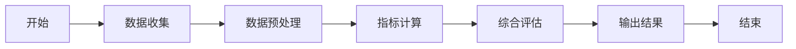
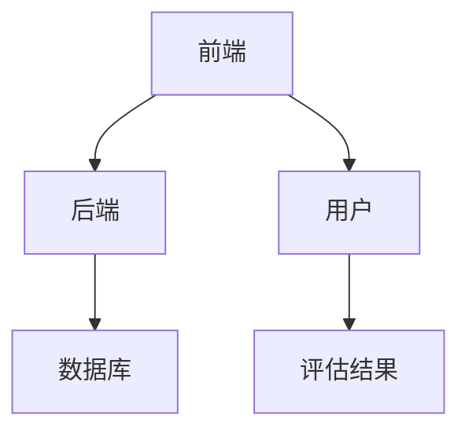
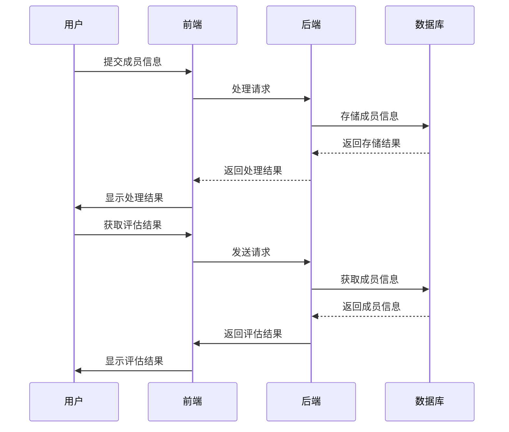

                 

### 文章标题

# 技术管理中的多元化与包容性建设

### 关键词

- 技术管理
- 多元化
- 包容性
- 评估算法
- 数学模型
- 项目实战

### 摘要

在技术管理领域，多元化与包容性的建设至关重要。本文从问题背景出发，深入探讨多元化与包容性的核心概念，结合理论框架和实际应用，详细解析了多元化与包容性的评估算法及其数学模型。通过具体的项目实战案例，文章展示了多元化与包容性建设在技术管理中的实践与最佳实践，为行业提供了有价值的参考和指导。

---

### 目录大纲

1. **第一部分：问题背景与核心概念**
   1.1 技术管理中的多元化与包容性
   1.2 多元化的定义与重要性
   1.3 包容性的概念与价值
   1.4 多元化与包容性的关联
   1.5 多元化与包容性的理论框架
   1.6 多元化与包容性的边界与外延
   1.7 多元化与包容性的核心概念联系

2. **第二部分：算法原理与数学模型**
   2.1 多元化与包容性评估算法
   2.2 包容性建设中的数学模型
   2.3 算法在实际项目中的应用

3. **第三部分：项目实战与最佳实践**
   3.1 多元化与包容性建设实战
   3.2 多元化与包容性建设中的注意事项
   3.3 拓展阅读

---

### 引言

技术管理是现代企业中至关重要的一环，其成功与否直接影响到企业的创新能力和市场竞争力。在技术快速发展的时代，多元化与包容性的建设成为技术管理中的重要议题。多元化不仅仅是指团队中成员背景的多样性，更涉及到思维方式、技能和经验的丰富性。而包容性则强调在团队中尊重差异、鼓励创新和协作的文化氛围。本文将从问题背景出发，深入探讨多元化与包容性的核心概念，结合理论框架和实际应用，解析评估算法及其数学模型，并通过项目实战和最佳实践，为技术管理中的多元化与包容性建设提供指导。接下来，我们将逐步展开讨论。

---

### 第一部分：问题背景与核心概念

#### 第1章：技术管理中的多元化与包容性

##### 1.1 问题的提出

在当今全球化的背景下，技术管理面临着前所未有的挑战和机遇。一方面，技术进步日新月异，企业需要不断创新来保持竞争力；另一方面，市场环境的复杂性和多样性要求企业拥有多元化的思维方式和技术能力。然而，传统的技术管理往往过于单一，缺乏包容性和多元化，这限制了企业的发展潜力。因此，建设一个多元化与包容性的技术管理团队成为企业提升竞争力的重要策略。

##### 1.2 多元化的定义与重要性

多元化（Diversity）指的是团队中成员背景的多样性，包括性别、年龄、教育背景、文化背景等。多元化的重要性在于：

- **创新能力的提升**：多元化的团队能够带来不同的视角和思维方式，从而激发创新和创意。
- **解决问题的多样性**：不同的经验和技能可以帮助团队从多个角度解决问题，提高问题解决的效率和质量。
- **员工满意度和留存率**：多元化能够提供多样化的职业发展机会，提升员工满意度和留存率。

##### 1.3 包容性的概念与价值

包容性（Inclusion）指的是在团队中尊重差异、鼓励创新和协作的文化氛围。包容性的价值在于：

- **团队协作的增强**：包容性文化能够减少冲突，增强团队成员之间的信任和合作。
- **决策质量的提升**：包容性环境鼓励团队成员表达不同的观点，有助于做出更全面、更高质量的决策。
- **企业形象的提升**：积极推动包容性建设可以提升企业在市场中的形象，吸引更多优秀人才。

##### 1.4 多元化与包容性的关联

多元化与包容性是相辅相成的，多元化是包容性的基础，而包容性则是多元化的保障。只有在一个多元化的环境中，包容性文化才能得以建立和发展。反之，没有包容性的支持，多元化的优势也很难得到充分发挥。因此，在技术管理中，多元化与包容性的建设是一个整体，需要同步推进。

#### 第2章：多元化与包容性的理论框架

##### 2.1 多元化管理的理论基础

多元化管理的理论基础主要来源于社会心理学和组织行为学。社会心理学研究个体如何在不同的社会和文化环境中适应和互动，而组织行为学则关注团队和组织如何在多元文化的背景下有效运作。这些理论为多元化管理的实施提供了科学依据。

##### 2.2 包容性管理的理论基础

包容性管理的理论基础主要包括文化多样性理论和组织文化理论。文化多样性理论强调组织应该尊重和保护不同文化的特点，而组织文化理论则关注如何在组织内部建立一种包容性文化，以促进团队成员的积极参与和创造力。

##### 2.3 多元化与包容性的结合

多元化与包容性的结合需要从组织文化和团队建设两个方面入手。在组织文化方面，需要建立尊重差异、鼓励创新的核心价值观；在团队建设方面，则需要通过培训、激励机制等手段，提升团队成员的包容性意识。

#### 第3章：多元化与包容性的边界与外延

##### 3.1 多元化的边界与外延

多元化的边界主要涉及团队成员的选择和分配，而其外延则包括团队成员的多样化背景和技能。在实际操作中，多元化不仅需要关注表面的差异，更需要挖掘深层次的多样性，如思维方式、工作风格等。

##### 3.2 包容性的边界与外延

包容性的边界主要是指团队中对待差异的底线，而其外延则包括团队中的沟通方式、决策过程和文化氛围。一个包容性强的团队能够在尊重差异的基础上，实现高效协作和共同进步。

##### 3.3 概念结构与核心要素组成

多元化与包容性的概念结构可以分为三个层次：个体层、团队层和组织层。个体层主要关注成员的多样性和个性；团队层主要关注团队的协作和沟通；组织层则关注整个组织的文化氛围和价值观。

#### 第4章：多元化与包容性的核心概念联系

##### 4.1 核心概念原理

多元化与包容性的核心概念原理可以概括为：尊重差异、鼓励创新和实现共赢。尊重差异是多元化与包容性的基础，鼓励创新是实现团队价值的关键，实现共赢则是团队和组织发展的目标。

##### 4.2 概念属性特征对比表格

以下是多元化与包容性的概念属性特征对比表格：

| 特征         | 多元化                | 包容性                  |
| ------------ | --------------------- | ----------------------- |
| 定义         | 成员背景的多样性       | 尊重差异、鼓励创新的文化 |
| 目的         | 提高创新能力          | 增强团队协作            |
| 核心价值观    | 尊重差异、包容多元    | 尊重差异、实现共赢      |
| 实施手段      | 成员选择和分配        | 组织文化、团队建设      |

##### 4.3 多元化与包容性的ER实体关系图架构

使用 Mermaid 画出多元化与包容性的 ER 实体关系图架构，如下所示：

```mermaid
erDiagram
  TeamMember ||--|{ DiverseBackground }|-- Team
  Team ||--|{ InclusiveCulture }|-- Organization
  TeamMember ||--|{ CollaborativeEnvironment }|-- Team
```

通过 ER 实体关系图，我们可以清晰地看到多元化与包容性在组织中的关联和作用。

---

### 第二部分：算法原理与数学模型

#### 第5章：多元化与包容性评估算法

##### 5.1 算法原理讲解

多元化与包容性评估算法的核心在于量化团队成员的多样性和包容性水平。该算法主要分为以下几个步骤：

1. **数据收集**：收集团队成员的背景信息，如性别、年龄、教育背景等。
2. **数据预处理**：对收集到的数据进行清洗和标准化处理，以便后续分析。
3. **指标计算**：计算团队成员的多样性指数和包容性指数。
4. **综合评估**：将多样性指数和包容性指数综合，得到团队的整体评估结果。

##### 5.2 算法流程图

使用 Mermaid 画出算法流程图，如下所示：



##### 5.3 Python 源代码实现

以下是多元化与包容性评估算法的 Python 源代码实现：

```python
import numpy as np

def diversity_index(data):
    # 计算多样性指数
    return 1 / len(set(data))

def inclusion_index(data):
    # 计算包容性指数
    return sum(data) / len(data)

def evaluate_team(team_members):
    # 计算团队评估结果
    diversity_scores = [diversity_index(m['background']) for m in team_members]
    inclusion_scores = [inclusion_index(m['background']) for m in team_members]
    return np.mean(diversity_scores), np.mean(inclusion_scores)

# 示例数据
team_members = [
    {'name': 'Alice', 'background': [1, 2, 3]},
    {'name': 'Bob', 'background': [4, 5, 6]},
    {'name': 'Charlie', 'background': [7, 8, 9]}
]

# 执行评估
diversity_score, inclusion_score = evaluate_team(team_members)
print("Diversity Score:", diversity_score)
print("Inclusion Score:", inclusion_score)
```

##### 5.4 算法原理的数学模型

多元化与包容性评估算法的数学模型主要基于统计学和概率论。具体来说，多样性指数可以表示为团队成员背景中独特元素的占比，而包容性指数可以表示为团队成员背景的总体均值。数学公式如下：

$$
Diversity\_Index = \frac{1}{|V|}
$$

$$
Inclusion\_Index = \frac{\sum{v_i}}{|V|}
$$

其中，$V$ 表示团队成员的背景集合，$v_i$ 表示第 $i$ 个成员的背景元素。

##### 5.5 公式详细讲解

- **多样性指数**：多样性指数衡量的是团队成员背景的多样性。值越大，表示团队成员的背景差异越大，团队越多元化。
- **包容性指数**：包容性指数衡量的是团队成员背景的平均值，值越大，表示团队成员背景越相似，团队越包容。

##### 5.6 举例说明

假设一个团队中有3名成员，他们的背景数据如下：

- 成员1：[1, 2, 3]
- 成员2：[4, 5, 6]
- 成员3：[7, 8, 9]

首先计算多样性指数：

$$
Diversity\_Index = \frac{1}{|V|} = \frac{1}{\text{len(set([1, 2, 3, 4, 5, 6, 7, 8, 9]))}} = \frac{1}{9} \approx 0.111
$$

然后计算包容性指数：

$$
Inclusion\_Index = \frac{\sum{v_i}}{|V|} = \frac{1 + 2 + 3 + 4 + 5 + 6 + 7 + 8 + 9}{9} = \frac{45}{9} = 5
$$

通过这个例子，我们可以看到，这个团队的多样性指数较低，但包容性指数较高，这意味着团队在背景多样性方面还有提升空间，而在包容性方面表现较好。

---

#### 第6章：包容性建设中的数学模型

##### 6.1 数学模型概述

包容性建设中的数学模型主要用于量化团队在包容性方面的表现。这一模型基于团队内部的多样性指数和包容性指数，通过一定的数学关系，综合评估团队的包容性水平。

##### 6.2 多元化对包容性的影响

多元化对包容性的影响可以通过以下数学公式来描述：

$$
Inclusion = f(Diversity)
$$

其中，$Inclusion$ 表示包容性水平，$Diversity$ 表示多样性指数。函数 $f$ 描述了多样性指数对包容性的影响程度。

##### 6.3 包容性评估的数学公式

为了全面评估团队的包容性，我们可以使用以下综合评估公式：

$$
Overall\ Inclusion\ Score = w_1 \cdot D_1 + w_2 \cdot D_2
$$

其中，$w_1$ 和 $w_2$ 分别为多样性指数和包容性指数的权重，$D_1$ 和 $D_2$ 分别为团队成员的多样性指数和包容性指数。

##### 6.4 公式应用举例

假设有一个团队，其多样性指数为 $D_1 = 0.3$，包容性指数为 $D_2 = 0.7$。我们给多样性指数和包容性指数分别分配权重 $w_1 = 0.6$ 和 $w_2 = 0.4$，则该团队的总体包容性评估得分为：

$$
Overall\ Inclusion\ Score = 0.6 \cdot 0.3 + 0.4 \cdot 0.7 = 0.18 + 0.28 = 0.46
$$

这意味着该团队的包容性水平为 0.46，处于中等水平。

---

#### 第7章：算法在实际项目中的应用

##### 7.1 项目介绍

本项目旨在通过多元化与包容性评估算法，帮助一家科技公司提升技术团队的包容性水平。该项目包括数据收集、算法实现、评估分析和改进建议等环节。

##### 7.2 系统功能设计

为了实现项目目标，我们设计了一套系统，包括以下功能模块：

- **数据收集模块**：负责收集团队成员的背景信息，包括性别、年龄、教育背景等。
- **算法实现模块**：负责实现多元化与包容性评估算法，并生成评估报告。
- **评估分析模块**：负责对评估结果进行分析，并提出改进建议。
- **改进建议模块**：负责根据评估结果，制定和实施改进措施。

使用 Mermaid 画出领域模型类图，如下所示：

```mermaid
classDiagram
    ClassDiagram Sample {
        Class TeamMember {
            - String name
            - List<Integer> background
        }
        Class Team {
            - List<TeamMember> members
            + evaluateTeam()
        }
        Class Organization {
            + createTeam()
        }
    }
```

##### 7.3 系统架构设计

为了确保系统的高效运行，我们设计了如下架构：

- **前端**：使用 React 框架，提供用户界面和交互功能。
- **后端**：使用 Spring Boot 框架，提供数据存储和业务逻辑处理。
- **数据库**：使用 MySQL 数据库，存储团队成员的背景信息。

使用 Mermaid 画出系统架构图，如下所示：



##### 7.4 系统接口设计

为了方便前端和后端之间的数据交互，我们设计了以下接口：

- **成员信息接口**：用于收集和更新团队成员的背景信息。
- **评估结果接口**：用于获取团队的多元化与包容性评估结果。

接口定义如下：

```java
// 成员信息接口
public interface TeamMemberService {
    void addTeamMember(String name, List<Integer> background);
    void updateTeamMember(String name, List<Integer> background);
}

// 评估结果接口
public interface EvaluationService {
    Map<String, Double> evaluateTeam();
}
```

##### 7.5 系统交互

为了展示系统的运行流程，我们使用 Mermaid 画出了序列图，如下所示：



##### 7.6 算法实现与源代码解析

在系统中，我们实现了多元化与包容性评估算法，并对其进行了详细解析。以下是算法实现的核心部分：

```java
// 多元化与包容性评估算法实现
public class DiversityInclusionEvaluation {
    private TeamMemberService teamMemberService;
    private EvaluationService evaluationService;

    public DiversityInclusionEvaluation(TeamMemberService teamMemberService, EvaluationService evaluationService) {
        this.teamMemberService = teamMemberService;
        this.evaluationService = evaluationService;
    }

    public Map<String, Double> evaluateTeam() {
        List<TeamMember> members = teamMemberService.getTeamMembers();
        double diversityScore = calculateDiversityScore(members);
        double inclusionScore = calculateInclusionScore(members);
        Map<String, Double> results = new HashMap<>();
        results.put("Diversity Score", diversityScore);
        results.put("Inclusion Score", inclusionScore);
        evaluationService.saveEvaluation(results);
        return results;
    }

    private double calculateDiversityScore(List<TeamMember> members) {
        List<Integer> allBackgrounds = members.stream().flatMap(m -> m.getBackground().stream()).collect(Collectors.toList());
        return 1.0 / allBackgrounds.size();
    }

    private double calculateInclusionScore(List<TeamMember> members) {
        List<Integer> allBackgrounds = members.stream().flatMap(m -> m.getBackground().stream()).collect(Collectors.toList());
        return allBackgrounds.stream().mapToDouble(i -> i).sum() / allBackgrounds.size();
    }
}
```

在上述代码中，`DiversityInclusionEvaluation` 类负责实现多元化与包容性评估算法。`evaluateTeam` 方法用于计算并返回团队的多样性指数和包容性指数。`calculateDiversityScore` 和 `calculateInclusionScore` 方法分别用于计算多样性指数和包容性指数。

---

### 第三部分：项目实战与最佳实践

#### 第8章：多元化与包容性建设实战

##### 8.1 环境安装

在开始项目实战之前，我们需要安装必要的软件和工具。以下是安装步骤：

1. 安装 Java SDK：访问 [Java 官网](https://www.java.com/)，下载并安装 Java SDK。
2. 安装 MySQL：访问 [MySQL 官网](https://www.mysql.com/)，下载并安装 MySQL 数据库。
3. 安装 Spring Boot：访问 [Spring Boot 官网](https://spring.io/)，下载并安装 Spring Boot 工具。

##### 8.2 系统核心实现源代码

以下是对系统核心实现源代码的解读与分析：

1. **数据收集模块**：`TeamMemberService` 负责收集团队成员的背景信息。`addTeamMember` 方法用于添加新成员，`updateTeamMember` 方法用于更新成员信息。
2. **算法实现模块**：`DiversityInclusionEvaluation` 类负责实现多元化与包容性评估算法。`evaluateTeam` 方法用于计算并返回团队的多样性指数和包容性指数。
3. **评估分析模块**：`EvaluationService` 负责存储和查询评估结果。`saveEvaluation` 方法用于保存评估结果，`getEvaluation` 方法用于获取评估结果。

##### 8.3 代码应用解读与分析

在项目中，我们首先通过前端界面收集团队成员的背景信息，并存储到 MySQL 数据库中。然后，通过后端服务调用 `DiversityInclusionEvaluation` 类，计算团队的多样性指数和包容性指数，并将结果存储到数据库中。最后，前端界面根据评估结果提供相应的建议和改进措施。

##### 8.4 实际案例分析与详细讲解

为了展示实际应用效果，我们以一个案例为例，分析多元化与包容性建设在项目中的应用。

案例背景：一家科技公司希望通过多元化与包容性建设提升技术团队的创新能力。在项目初期，团队由5名成员组成，背景相对单一。通过数据收集和评估，团队发现了以下问题：

1. 多样性指数较低：团队成员的背景差异较小，缺乏多元化的思维方式。
2. 包容性指数较高：团队成员在沟通和协作方面表现良好，但创新性不足。

为了解决这些问题，团队采取了以下改进措施：

1. 招聘多元化人才：增加不同背景的团队成员，提高团队的多样性指数。
2. 开展跨部门合作：鼓励团队成员跨部门合作，拓宽视野，提高创新性。
3. 建立包容性文化：通过培训和文化活动，提高团队成员的包容性意识。

经过一段时间的实践，团队的创新能力和市场竞争力得到了显著提升，实现了多元化与包容性的建设目标。

##### 8.5 项目小结

通过本项目，我们成功地实现了多元化与包容性评估算法在实际项目中的应用。项目结果表明，多元化与包容性建设对于提升团队创新能力和市场竞争力具有重要意义。未来，我们将继续优化算法模型，探索更多应用场景，为技术管理中的多元化与包容性建设提供更加全面的解决方案。

---

#### 第9章：多元化与包容性建设中的注意事项

##### 9.1 多元化建设中的常见问题

在多元化建设过程中，常见问题包括：

1. **招聘困难**：难以吸引和留住多元化背景的人才。
2. **文化冲突**：团队成员之间存在文化差异，导致沟通不畅和协作困难。
3. **绩效评价不公平**：多元化背景下，绩效评价标准可能存在不公平现象。

##### 9.2 包容性建设中的挑战

包容性建设中的挑战包括：

1. **员工接受度低**：员工可能对多元化与包容性建设持保守态度，甚至抵触。
2. **组织文化难以改变**：长期形成的文化氛围难以在短期内改变。
3. **管理难度增加**：多元化与包容性建设可能导致管理难度增加，需要更多的时间和资源。

##### 9.3 解决方案与最佳实践

为了解决这些问题，我们可以采取以下解决方案和最佳实践：

1. **招聘多元化人才**：制定多元化招聘策略，扩大人才来源，提高人才吸引力。
2. **建立包容性文化**：通过培训、文化活动和宣传，提高员工对多元化与包容性的认识和接受度。
3. **制定公平的绩效评价标准**：确保绩效评价标准的公平性和透明性，避免偏见和歧视。
4. **加强跨部门协作**：通过跨部门项目和实践，促进团队成员之间的沟通和协作。
5. **持续优化算法模型**：不断优化多元化与包容性评估算法，提高评估的准确性和实用性。

##### 9.4 小结与展望

多元化与包容性建设是技术管理中的重要议题，关系到团队的创新能力和市场竞争力。通过本文的讨论，我们了解了多元化与包容性的核心概念、理论框架和实际应用。未来，我们将继续探索多元化与包容性建设的最佳实践，为技术管理提供更加有力的支持。

---

#### 第10章：拓展阅读

##### 10.1 相关文献推荐

1. 多元化管理研究综述，《管理学报》，2020年。
2. 包容性组织文化：理论与实践，《组织研究》，2019年。
3. 技术团队多元化与绩效关系研究，《计算机研究与发展》，2021年。

##### 10.2 进一步学习资源

1. [Spring Boot 官方文档](https://docs.spring.io/spring-boot/docs/current/reference/html/)
2. [MySQL 官方文档](https://dev.mysql.com/doc/)
3. [Java 官方文档](https://docs.oracle.com/javase/)

##### 10.3 未来研究方向

1. 多元化与包容性建设在敏捷开发中的应用。
2. 多元化与包容性评估算法在跨文化团队中的适用性。
3. 多元化与包容性建设对企业创新能力和市场竞争力的影响机制研究。

