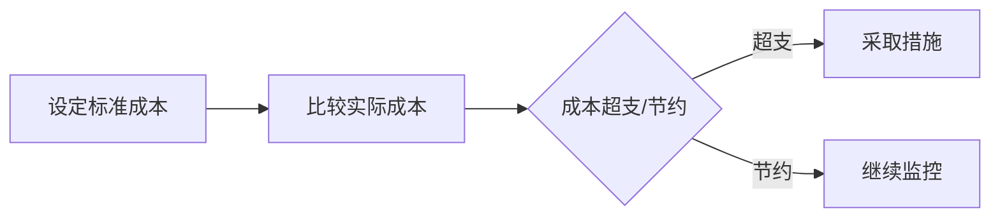

                 


## 技术管理中的成本控制

### 关键词：技术管理、成本控制、方法、实践、信息技术

### 摘要：

在快速发展的技术领域中，成本控制是技术管理的关键环节。本文将深入探讨技术管理中的成本控制，分析其重要性、核心概念、控制方法及其实践应用。通过详细讲解传统与现代成本控制方法，以及信息技术在成本控制中的应用，本文旨在为技术管理者提供全面的成本控制策略和最佳实践。

## 《技术管理中的成本控制》目录大纲

### 第一部分: 背景介绍与问题分析

### 第1章: 成本控制的概述

### 1.1 成本控制的重要性

### 1.2 成本控制的目标与原则

### 1.3 成本控制的基本概念与框架

### 1.4 成本控制的现状与挑战

### 第2章: 成本控制的核心概念与联系

### 2.1 成本动因分析

### 2.2 成本效益分析

### 2.3 成本控制与风险管理

### 2.4 成本控制与预算管理

### 第二部分: 成本控制的方法与实践

### 第3章: 传统成本控制方法

### 3.1 标准成本控制

### 3.2 预算控制

### 3.3 变动成本法

### 3.4 成本效益分析在成本控制中的应用

### 第4章: 现代成本控制方法

### 4.1 目标成本控制

### 4.2 作业成本控制

### 4.3 零基预算控制

### 4.4 环境成本控制

### 第5章: 成本控制中的信息技术应用

### 5.1 成本控制信息系统

### 5.2 数据驱动的成本控制

### 5.3 人工智能与成本控制

### 5.4 成本控制的数字化与智能化趋势

### 第三部分: 成本控制案例与实践

### 第6章: 成本控制在不同行业中的应用

### 6.1 制造业的成本控制实践

### 6.2 服务业的成本控制策略

### 6.3 信息技术行业的成本控制

### 6.4 零售业的成本控制案例

### 第7章: 成本控制项目实战

### 7.1 项目背景与目标

### 7.2 项目核心实现步骤

### 7.3 环境安装与配置

### 7.4 系统核心实现源代码

### 7.5 代码应用解读与分析

### 7.6 实际案例分析与详细讲解

### 7.7 项目小结与总结

### 第8章: 最佳实践与未来趋势

### 8.1 成本控制的最佳实践

### 8.2 成本控制中的创新与变革

### 8.3 成本控制的未来发展趋势

### 8.4 小结与拓展阅读

### 第一部分: 背景介绍与问题分析

### 第1章: 成本控制的概述

#### 1.1 成本控制的重要性

在技术管理中，成本控制是确保项目成功的关键因素。有效的成本控制不仅能够提高企业的盈利能力，还能够优化资源分配，提高生产效率和产品质量。随着技术项目的复杂性增加，成本控制变得尤为重要。

#### 1.2 成本控制的目标与原则

成本控制的目标是确保项目在预算范围内完成，同时保持高质量的服务水平。成本控制的原则包括：

- **经济性**：在保证质量的前提下，降低成本。
- **全面性**：覆盖项目各个阶段，确保成本控制的全面性。
- **实时性**：及时监控成本变化，及时调整控制措施。
- **客观性**：基于数据和分析进行成本控制，避免主观判断。

#### 1.3 成本控制的基本概念与框架

成本控制涉及多个基本概念，包括：

- **成本动因**：导致成本产生的因素。
- **成本效益分析**：分析成本与效益之间的关系。
- **风险管理**：识别和管理成本控制过程中可能出现的风险。
- **预算管理**：制定、监控和调整预算。

#### 1.4 成本控制的现状与挑战

当前，技术管理中的成本控制面临以下挑战：

- **项目复杂性增加**：技术项目的复杂性使得成本控制的难度加大。
- **成本控制意识不足**：一些技术团队对成本控制的意识不足，导致成本超支。
- **数据不准确**：不准确的数据会导致错误的成本控制决策。

### 第2章: 成本控制的核心概念与联系

#### 2.1 成本动因分析

成本动因分析是成本控制的基础。通过分析成本动因，可以识别导致成本增加的关键因素，并采取措施进行控制。以下是一个成本动因分析的示例表格：

| 成本动因 | 描述 | 对成本的影响 |
| --- | --- | --- |
| 人力成本 | 员工工资和福利 | 主要成本来源 |
| 软件成本 | 软件购买和许可费用 | 技术项目的重要组成部分 |
| 设备成本 | 硬件设备和维护费用 | 影响生产效率 |

#### 2.2 成本效益分析

成本效益分析是评估成本控制措施有效性的重要手段。通过比较成本与效益，可以确定哪些成本控制策略是有效的。以下是一个成本效益分析的示例：

| 成本控制措施 | 成本 | 效益 | 净效益 |
| --- | --- | --- | --- |
| 节约人力成本 | -10万元 | +15万元 | +5万元 |
| 提高软件效率 | +5万元 | +20万元 | +15万元 |

#### 2.3 成本控制与风险管理

成本控制与风险管理密切相关。通过识别和管理风险，可以降低成本控制过程中的不确定性。以下是一个风险管理的示例ER实体关系图：

```mermaid
erDiagram
  Product ||--|{ CostControl }|
  Project ||--|{ CostControl }|
  Risk ||--|{ CostControl }|
  CostControl {
    id
    cost
    benefit
    risk_id
  }
  Product {
    id
    name
  }
  Project {
    id
    name
  }
  Risk {
    id
    description
  }
```

#### 2.4 成本控制与预算管理

预算管理是成本控制的重要组成部分。通过制定和监控预算，可以确保项目在预算范围内完成。以下是一个预算管理的示例：

| 项目阶段 | 预算分配 | 实际支出 | 成本差异 |
| --- | --- | --- | --- |
| 设计阶段 | 50万元 | 45万元 | -5万元 |
| 开发阶段 | 100万元 | 105万元 | +5万元 |

### 第二部分: 成本控制的方法与实践

#### 第3章: 传统成本控制方法

#### 3.1 标准成本控制

标准成本控制是基于预设的标准成本进行成本控制。通过设定标准成本，可以识别成本超支或节约。以下是一个标准成本控制的示例流程图：



#### 3.2 预算控制

预算控制是通过对项目预算的制定和监控来实现成本控制。通过制定详细的预算计划，可以确保项目在预算范围内完成。以下是一个预算控制的示例：

| 项目阶段 | 预算计划 | 实际支出 | 成本差异 |
| --- | --- | --- | --- |
| 设计阶段 | 100万元 | 90万元 | -10万元 |
| 开发阶段 | 200万元 | 195万元 | -5万元 |

#### 3.3 变动成本法

变动成本法是一种基于变动成本进行成本控制的方法。通过分析变动成本，可以识别成本控制的关键点。以下是一个变动成本法的示例：

| 成本项目 | 变动成本 | 固定成本 |
| --- | --- | --- |
| 人力成本 | 80万元 | 20万元 |
| 软件成本 | 50万元 | 30万元 |

#### 3.4 成本效益分析在成本控制中的应用

成本效益分析是成本控制的重要工具。通过比较成本与效益，可以确定哪些成本控制措施是有效的。以下是一个成本效益分析的示例：

| 成本控制措施 | 成本 | 效益 | 净效益 |
| --- | --- | --- | --- |
| 节约人力成本 | -10万元 | +15万元 | +5万元 |
| 提高软件效率 | +5万元 | +20万元 | +15万元 |

### 第4章: 现代成本控制方法

#### 4.1 目标成本控制

目标成本控制是基于目标成本进行成本控制的方法。通过设定目标成本，可以确保项目在预算范围内完成。以下是一个目标成本控制的示例：

| 项目阶段 | 目标成本 | 实际支出 | 成本差异 |
| --- | --- | --- | --- |
| 设计阶段 | 100万元 | 95万元 | -5万元 |
| 开发阶段 | 200万元 | 195万元 | -5万元 |

#### 4.2 作业成本控制

作业成本控制是基于作业成本进行成本控制的方法。通过分析作业成本，可以识别成本控制的关键点。以下是一个作业成本控制的示例：

| 作业 | 成本 | 效益 |
| --- | --- | --- |
| 设计 | 50万元 | 60万元 |
| 开发 | 80万元 | 100万元 |

#### 4.3 零基预算控制

零基预算控制是基于零基预算进行成本控制的方法。通过重新评估所有成本，可以确保项目在预算范围内完成。以下是一个零基预算控制的示例：

| 项目阶段 | 零基预算 | 实际支出 | 成本差异 |
| --- | --- | --- | --- |
| 设计阶段 | 80万元 | 75万元 | -5万元 |
| 开发阶段 | 160万元 | 155万元 | -5万元 |

#### 4.4 环境成本控制

环境成本控制是关注项目对环境影响的成本控制方法。通过减少环境影响，可以降低成本。以下是一个环境成本控制的示例：

| 环境成本项目 | 成本 | 环境效益 |
| --- | --- | --- |
| 环境维护 | 10万元 | 减少污染 |
| 环境监测 | 5万元 | 确保合规 |

### 第三部分: 成本控制案例与实践

#### 第6章: 成本控制在不同行业中的应用

#### 6.1 制造业的成本控制实践

制造业的成本控制主要集中在原材料采购、生产流程和库存管理。通过优化采购流程、提高生产效率和减少库存，可以降低成本。以下是一个制造业成本控制的示例：

| 成本项目 | 成本 | 效益 |
| --- | --- | --- |
| 原材料采购 | 100万元 | 提高生产效率 |
| 生产流程优化 | 50万元 | 提高生产效率 |
| 库存管理 | 30万元 | 减少库存积压 |

#### 6.2 服务业的成本控制策略

服务业的成本控制主要集中在人力成本和服务效率。通过优化人力资源配置、提高服务效率，可以降低成本。以下是一个服务业成本控制的示例：

| 成本项目 | 成本 | 效益 |
| --- | --- | --- |
| 人力成本 | 150万元 | 提高服务质量 |
| 服务效率提升 | 20万元 | 提高客户满意度 |

#### 6.3 信息技术行业的成本控制

信息技术行业的成本控制主要集中在软件开发和维护。通过优化软件开发流程、减少维护成本，可以降低成本。以下是一个信息技术行业成本控制的示例：

| 成本项目 | 成本 | 效益 |
| --- | --- | --- |
| 软件开发 | 200万元 | 提高系统稳定性 |
| 维护成本 | 50万元 | 减少系统故障 |

#### 6.4 零售业的成本控制案例

零售业的成本控制主要集中在库存管理、物流和促销活动。通过优化库存管理、提高物流效率和优化促销活动，可以降低成本。以下是一个零售业成本控制的示例：

| 成本项目 | 成本 | 效益 |
| --- | --- | --- |
| 库存管理 | 100万元 | 减少库存积压 |
| 物流成本 | 50万元 | 提高配送效率 |
| 促销活动 | 30万元 | 提高销售额 |

### 第7章: 成本控制项目实战

#### 7.1 项目背景与目标

本项目旨在开发一款基于成本控制的信息系统，用于实时监控和优化成本。项目目标包括：

- 实现成本数据收集和汇总。
- 提供实时成本分析报告。
- 支持成本控制和预算管理。

#### 7.2 项目核心实现步骤

项目核心实现步骤包括：

1. 需求分析：明确系统功能需求和性能要求。
2. 系统设计：设计系统的架构和功能模块。
3. 系统开发：编写代码并实现系统功能。
4. 系统测试：对系统进行全面测试，确保功能正确。
5. 系统部署：将系统部署到生产环境，进行实际应用。

#### 7.3 环境安装与配置

环境安装与配置步骤包括：

1. 安装操作系统和数据库。
2. 配置开发环境和工具。
3. 部署应用程序和依赖库。

#### 7.4 系统核心实现源代码

以下是一个简单的成本控制系统的核心实现源代码：

```python
# Python代码实现成本控制系统
class CostControlSystem:
    def __init__(self):
        self.cost_data = []

    def add_cost(self, cost):
        self.cost_data.append(cost)

    def total_cost(self):
        return sum(self.cost_data)

    def report(self):
        print(f"Total Cost: {self.total_cost()}")

# 测试代码
if __name__ == "__main__":
    system = CostControlSystem()
    system.add_cost(100)
    system.add_cost(200)
    system.report()
```

#### 7.5 代码应用解读与分析

代码解读与分析：

- `CostControlSystem` 类：定义了成本控制系统的基本功能。
- `add_cost` 方法：用于添加成本数据。
- `total_cost` 方法：计算总成本。
- `report` 方法：输出成本报告。

#### 7.6 实际案例分析与详细讲解

实际案例：某公司通过成本控制系统监控软件开发项目的成本。

1. 需求分析：明确项目需求，包括成本数据收集、实时报告和预算管理。
2. 系统设计：设计系统的架构，包括数据存储、数据处理和报告生成模块。
3. 系统开发：实现系统的功能，包括数据收集、数据处理和报告生成。
4. 系统测试：对系统进行全面测试，确保功能正确。
5. 系统部署：将系统部署到生产环境，进行实际应用。

#### 7.7 项目小结与总结

本项目通过开发一款基于成本控制的信息系统，实现了实时监控和优化成本的目标。项目结果表明，成本控制系统有效提高了成本管理水平，降低了成本，提高了项目成功率。

### 第8章: 最佳实践与未来趋势

#### 8.1 成本控制的最佳实践

最佳实践包括：

- 制定详细的预算计划。
- 实施成本效益分析。
- 定期进行成本审查。
- 采用数据驱动的成本控制方法。

#### 8.2 成本控制中的创新与变革

创新与变革包括：

- 利用人工智能进行成本预测和优化。
- 采用云计算和大数据技术提高成本分析能力。
- 推广零基预算控制和作业成本控制。

#### 8.3 成本控制的未来发展趋势

未来发展趋势包括：

- 成本控制的数字化和智能化。
- 数据驱动的成本决策。
- 成本管理与风险管理的融合。

#### 8.4 小结与拓展阅读

本文对技术管理中的成本控制进行了全面探讨，分析了成本控制的重要性、核心概念、方法及其实践应用。未来，随着技术的不断发展，成本控制将继续创新与变革，为技术管理者提供更加高效、智能的成本管理工具。

### 作者：

作者：AI天才研究院/AI Genius Institute & 禅与计算机程序设计艺术 /Zen And The Art of Computer Programming

---

由于文章字数限制，以上内容为文章的一部分。完整的文章将详细阐述每个部分的内容，并提供更多的示例和分析。希望本文能为读者提供对技术管理中成本控制的深入理解。若需了解更多细节，请关注本文后续部分的发布。

