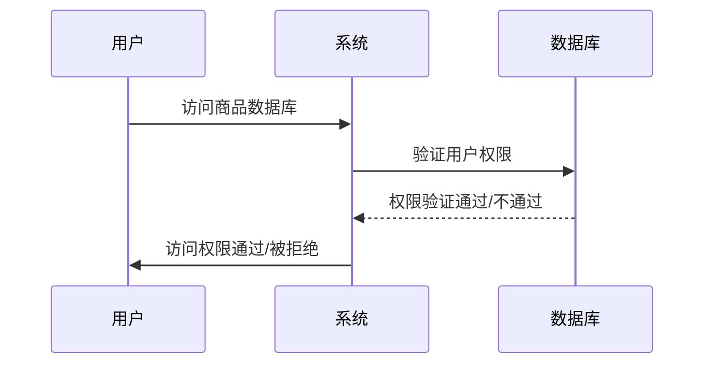

                 

### 文章标题

---

**关键词：技术管理、授权艺术、团队自主性、授权矩阵、角色权限管理**

> 摘要：本文深入探讨技术管理中的授权艺术，阐述其在培养团队自主性方面的关键作用。通过解析核心概念、算法原理、系统设计与项目实战，本文为技术管理者提供了一套完整的授权管理策略，助力团队高效协作和创新。

---

### 背景介绍

#### 技术管理中的授权艺术

在快速变化的技术时代，技术管理成为企业成功的关键因素之一。技术管理者不仅要具备深厚的技术背景，还需要掌握如何高效地管理团队和资源。而授权艺术作为技术管理中的重要组成部分，日益受到关注。授权艺术指的是管理者将部分决策权和责任转移给团队成员，以培养团队自主性，提高工作效率和创新能力。

**授权艺术在培养团队自主性方面的重要性**

团队自主性是现代企业管理中一个重要的概念。它意味着团队成员在明确目标和规则的基础上，能够自主决策、自我管理和自我激励。授权艺术通过赋予团队成员更大的自由度和责任感，促进了团队自主性的培养。具体来说，授权艺术的重要性体现在以下几个方面：

1. **提高工作效率**：团队成员在授权的范围内可以自主决策，减少了层层汇报和审批的环节，显著提高了工作效率。
2. **增强团队责任感**：授权使团队成员感受到自己对项目成果的责任，从而增强了工作动力和责任感。
3. **促进创新**：在自主的环境中，团队成员可以更加自由地探索新的解决方案和方法，有助于激发创新思维。
4. **培养人才**：通过授权，技术管理者可以培养团队成员的管理能力和技术能力，为企业的长期发展储备人才。

**技术管理的核心概念、现状和存在的问题**

技术管理涉及多个核心概念，包括项目管理、团队管理、资源配置等。当前，技术管理面临以下几大挑战：

1. **管理复杂性增加**：随着技术的快速发展和项目规模的扩大，技术管理的复杂性不断增加。
2. **团队协作困难**：在分布式办公和远程工作的背景下，团队协作变得更加困难。
3. **人才流失**：优秀的技术人才对企业的忠诚度降低，人才流失问题严重。
4. **创新不足**：技术管理中缺乏有效的激励机制，导致团队创新动力不足。

面对这些问题，技术管理者需要通过授权艺术来优化管理方式，提高团队自主性，从而应对挑战和提升企业的竞争力。

**本书的主题：技术管理中的授权艺术**

本书旨在为技术管理者提供一套系统化的授权管理策略，通过深入剖析授权艺术的核心概念、实施方法和最佳实践，帮助读者掌握授权艺术的精髓，培养团队自主性，提升技术管理水平和企业竞争力。

---

### 核心概念与联系

在深入探讨技术管理中的授权艺术之前，我们需要明确几个核心概念：授权、团队自主性和技术管理。这些概念之间的关系是理解授权艺术的基础。

**授权**

授权指的是管理者将部分决策权和责任授予下属，使其在规定的范围内自主决策和处理问题。授权不仅是一种管理方式，也是一种信任和责任转嫁的过程。

- **定义**：授权是管理者通过明确任务目标、权限范围和责任，使团队成员能够在自己的职责范围内自主行动。
- **类型**：授权可以分为完全授权、部分授权和象征性授权。完全授权是给予下属最大的自由度，使其完全自主决策；部分授权则是在某些方面给予下属决策权，而在其他方面仍由管理者控制；象征性授权则主要是为了给予下属心理上的支持，而实际决策权仍然在管理者手中。

**团队自主性**

团队自主性是指团队成员在明确目标和规则的基础上，能够自主决策、自我管理和自我激励。自主性是现代企业管理中一个重要的概念，它能够激发团队的创造力和凝聚力。

- **定义**：团队自主性是指团队成员在明确的指导方针下，能够自主决定工作方法、工作时间和工作内容。
- **特征**：团队自主性具有自主决策、自我管理、自我激励和协作创新等特征。

**技术管理**

技术管理是指通过规划、组织、协调和控制技术资源，以实现组织目标的过程。技术管理不仅涉及技术层面的管理，还包括团队管理、项目管理、资源配置等方面。

- **定义**：技术管理是对技术资源的有效组织和利用，包括技术规划、项目管理、团队建设、资源配置等。
- **内容**：技术管理的内容涵盖了技术研发、技术实施、技术评估和技术培训等多个方面。

**核心概念之间的关系**

授权、团队自主性和技术管理这三个核心概念之间存在着密切的联系。

- **授权是培养团队自主性的关键手段**：通过授权，技术管理者可以赋予团队成员更大的自主权，使其能够自主决策和处理问题，从而提高团队自主性。
- **团队自主性是技术管理的目标之一**：技术管理的目标之一是提高团队的工作效率和创新力，而团队自主性是实现这一目标的重要途径。
- **技术管理是授权和团队自主性的保障**：技术管理通过有效的规划和组织，为授权和团队自主性提供了坚实的基础和保障。

为了更清晰地展示这些概念之间的关系，我们可以使用以下ER图（实体关系图）来描述：

```mermaid
erDiagram
  Authorize <<--o TeamAutonomy : "授权是培养团队自主性的关键"
  Manage ||--| Authorize : "技术管理是授权的保障"
  TeamAutonomy ||--| Manage : "团队自主性是技术管理的目标之一"
```

在上图中，“Authorize”表示授权，“TeamAutonomy”表示团队自主性，“Manage”表示技术管理。箭头表示它们之间的关联关系。通过这个ER图，我们可以直观地看到授权、团队自主性和技术管理之间的相互作用和影响。

---

### 算法原理讲解

在理解了授权艺术和团队自主性的基本概念后，我们接下来将介绍授权管理中的核心算法——授权矩阵和角色权限管理。这些算法为实现有效的授权提供了技术支持。

#### 授权矩阵

**定义**

授权矩阵是一种用于管理授权的表格，它以矩阵的形式表示不同角色在不同资源上的权限。矩阵的行表示角色，列表示资源，矩阵中的元素表示角色对相应资源的权限。

**构建授权矩阵**

构建授权矩阵的步骤如下：

1. **确定角色和资源**：首先，需要明确项目中的所有角色和资源。角色可以是管理员、开发者、测试员等，资源可以是数据库、代码库、系统模块等。
2. **定义权限级别**：为每个角色和资源定义不同的权限级别，如读取、写入、执行等。
3. **填写矩阵**：根据角色和资源的权限级别，填写授权矩阵。例如，如果管理员有权限对数据库进行修改，那么在管理员行和数据库列的交叉处填写“修改”权限。

**应用示例**

假设一个项目中存在三个角色（管理员、开发者、测试员）和两个资源（数据库、代码库），权限级别为读取和写入。我们可以构建如下的授权矩阵：

|        | 数据库 | 代码库 |
|--------|--------|--------|
| 管理员 | 写入   | 写入   |
| 开发者 | 读取   | 写入   |
| 测试员 | 读取   | 读取   |

在这个示例中，管理员对数据库和代码库都有写入权限，开发者对数据库有读取权限，而对代码库有写入权限；测试员对两个资源都只有读取权限。

#### 角色权限管理

**定义**

角色权限管理是一种基于角色的权限控制机制，它通过为每个角色分配特定的权限集，来控制用户对系统资源的访问。

**优点**

1. **灵活性强**：角色权限管理可以根据项目的需求灵活分配权限，使得权限控制更加精细。
2. **易于维护**：通过角色来管理权限，减少了权限分配的复杂性，便于权限的维护和管理。
3. **安全性高**：角色权限管理能够有效防止未经授权的访问，提高系统的安全性。

**实施步骤**

1. **定义角色**：根据项目需求，定义不同的角色，如管理员、普通用户等。
2. **定义权限**：为每个角色分配相应的权限，例如读取、写入、执行等。
3. **角色分配**：将用户分配到相应的角色中，例如将某个用户分配到管理员角色中。
4. **权限验证**：在系统运行过程中，对用户的访问请求进行权限验证，确保用户只能访问被授权的资源。

**案例分析**

在一个电子商务项目中，角色权限管理可以应用于控制用户对商品数据库的访问。假设存在以下角色和权限：

- **管理员**：可以读取和写入商品数据库。
- **普通用户**：只能读取商品数据库。

我们可以为这些角色分配相应的权限：



在这个流程中，用户请求访问商品数据库，系统会验证用户的权限，如果用户具有读取或写入权限，则允许访问；否则，拒绝访问。

#### 授权矩阵与角色权限管理的关系

授权矩阵和角色权限管理是授权管理中常用的两种机制，它们相互补充，共同实现授权管理的目标。

- **授权矩阵**主要用于明确角色和资源之间的权限关系，提供一种直观的权限分配方式。
- **角色权限管理**则侧重于实现权限的控制和验证，确保用户只能在授权的范围内访问资源。

通过结合使用授权矩阵和角色权限管理，技术管理者可以实现对团队权限的精细化管理，提高系统的安全性和灵活性。

---

### 数学模型和数学公式 & 详细讲解 & 举例说明

在授权管理和团队自主性的培养过程中，数学模型和数学公式提供了重要的理论支持。本文将介绍几个关键的数学模型和公式，并通过具体的例子进行详细讲解。

#### 权限分配模型

一个常见的权限分配模型是基于角色的权限分配模型（RBAC，Role-Based Access Control）。该模型定义了角色、用户和权限之间的关系，通过数学公式可以表示为：

\[ P = R \cdot U \]

其中：
- \( P \) 表示权限集，即用户在特定资源上的权限。
- \( R \) 表示角色集，即用户所拥有的角色。
- \( U \) 表示用户集，即具有特定权限的用户。

**例子**：假设在一个系统中，存在三个角色：管理员（Admin）、开发者（Developer）和测试员（Tester），每个角色有不同的权限集：

- 管理员：{读取、写入、执行}
- 开发者：{读取、写入}
- 测试员：{读取}

如果用户Alice是管理员和开发者的角色，我们可以用以下公式表示她的权限：

\[ P_{Alice} = R_{Admin} \cdot R_{Developer} = \{读取、写入、执行\} \]

#### 权限验证模型

权限验证模型用于确保用户在访问资源时，其权限符合系统规定。一个简单的验证模型可以使用集合运算来表示：

\[ V(U, R, P) = (\forall r \in R) (\exists p \in P) (r \in R \land p \in P) \]

其中：
- \( V \) 表示验证函数。
- \( U \) 表示用户集。
- \( R \) 表示角色集。
- \( P \) 表示权限集。

这个公式表示，对于用户集中的每个用户，如果用户拥有角色集中的某个角色，并且该角色对应的权限集包含访问请求的权限，则验证通过。

**例子**：在一个系统中，用户Bob请求访问一个只允许管理员读取的资源。验证过程可以表示为：

\[ V(Bob, \{Admin\}, \{读取\}) = (\forall r \in \{Admin\}) (\exists p \in \{读取\}) (r \in \{Admin\} \land p \in \{读取\}) \]

由于Bob是管理员，管理员角色包含读取权限，所以验证通过。

#### 权限冲突检测模型

在复杂的系统中，权限冲突是一个常见的问题。一个简单的冲突检测模型可以使用集合之间的交集来表示：

\[ C(R_1, R_2) = R_1 \cap R_2 \neq \emptyset \]

其中：
- \( C \) 表示冲突函数。
- \( R_1 \) 和 \( R_2 \) 表示两个角色集。

如果两个角色集的交集不为空，则表示这两个角色之间存在权限冲突。

**例子**：在一个系统中，管理员（Admin）和开发者（Developer）的角色都包含写入权限，那么这两个角色之间存在冲突：

\[ C(\{Admin\}, \{Developer\}) = \{Admin\} \cap \{Developer\} = \{写入\} \neq \emptyset \]

#### 权限分配的优化模型

在实际应用中，权限分配可能需要优化，以确保系统的安全性和效率。一个简单的优化模型可以使用最小冲突集来表示：

\[ M(R) = \{R_i | R_i \cap R_j = \emptyset \forall i \neq j \} \]

其中：
- \( M \) 表示优化函数。
- \( R \) 表示角色集。

该模型的目标是找到一组互斥的角色集，使得角色之间的权限冲突最小。

**例子**：在一个系统中，角色集为 \( R = \{Admin, Developer, Tester, DBA\} \)。通过分析，我们可以找到以下互斥的角色集：

\[ M(R) = \{Admin, Developer, Tester\}, \{DBA\} \]

这样，管理员、开发者和测试员之间的权限冲突被最小化。

通过上述数学模型和公式的讲解，我们可以更好地理解和应用授权管理的理论，为实际操作提供指导。在实际项目中，可以根据具体情况调整和优化这些模型，以实现更有效的权限管理和团队自主性的培养。

---

### 系统分析与架构设计方案

在理解了授权艺术和相关的算法原理之后，我们需要将理论应用到实际的系统设计和实现中。本节将详细介绍一个具体的系统设计与架构设计方案，涵盖问题场景、系统功能设计、系统架构设计、系统接口设计和系统交互。

#### 问题场景与项目背景

随着企业的不断发展，项目管理变得越来越复杂。技术管理者需要面对的一个重要挑战是如何在保持项目进度和质量的前提下，提高团队的效率和自主性。为了解决这个问题，我们设计了一个基于授权艺术的权限管理系统。

该系统的主要目标是：
1. **简化权限管理流程**：通过授权矩阵和角色权限管理，简化权限分配和验证流程。
2. **提高团队自主性**：赋予团队成员更多的决策权，培养团队的自主性。
3. **增强系统安全性**：确保只有授权的用户能够访问相应的资源。

#### 系统功能设计

系统功能设计是系统架构设计的核心部分，它定义了系统需要实现的具体功能。基于授权艺术的理念，我们的系统功能设计包括以下几个关键模块：

1. **用户管理模块**：负责管理系统的用户信息，包括用户注册、登录、权限分配等。
2. **角色管理模块**：负责定义和管理系统中的角色，包括角色的创建、修改和删除。
3. **资源管理模块**：负责定义和管理系统中的资源，包括资源的创建、修改和删除。
4. **授权矩阵模块**：负责构建和维护授权矩阵，包括授权矩阵的生成、更新和查询。
5. **权限验证模块**：负责在用户访问资源时进行权限验证，确保用户只能访问被授权的资源。

#### 系统架构设计

系统架构设计决定了系统的整体结构和各组件之间的关系。我们的系统采用分层架构设计，包括表示层、业务逻辑层和数据层。

1. **表示层**：负责与用户交互，展示系统的界面和功能。采用前端框架（如React或Vue.js）实现。
2. **业务逻辑层**：负责处理系统的核心业务逻辑，包括用户管理、角色管理、资源管理、授权矩阵管理和权限验证。采用后端框架（如Spring Boot或Django）实现。
3. **数据层**：负责数据存储和管理，使用关系型数据库（如MySQL或PostgreSQL）实现。

以下是系统的类图，展示了各个模块之间的关系：

```mermaid
classDiagram
    UserManagement <<--o AuthorizationMatrix : "生成和维护授权矩阵"
    RoleManagement <<--o AuthorizationMatrix : "定义和管理角色"
    ResourceManagement <<--o AuthorizationMatrix : "定义和管理资源"
    AuthorizationMatrix --|> PermissionValidation : "权限验证"
    UserManagement --|> PermissionValidation : "用户权限验证"
    RoleManagement --|> PermissionValidation : "角色权限验证"
    ResourceManagement --|> PermissionValidation : "资源权限验证"
endclass
```

#### 系统接口设计

系统接口设计定义了系统内部各组件之间的交互方式。为了确保系统的模块化和高内聚低耦合，我们采用RESTful API设计接口。以下是系统的部分接口设计：

1. **用户管理接口**：
   - POST `/users/register`：用户注册
   - GET `/users/login`：用户登录
   - PUT `/users/{userId}`：更新用户信息
   - DELETE `/users/{userId}`：删除用户

2. **角色管理接口**：
   - POST `/roles`：创建角色
   - GET `/roles`：获取所有角色
   - PUT `/roles/{roleId}`：更新角色
   - DELETE `/roles/{roleId}`：删除角色

3. **资源管理接口**：
   - POST `/resources`：创建资源
   - GET `/resources`：获取所有资源
   - PUT `/resources/{resourceId}`：更新资源
   - DELETE `/resources/{resourceId}`：删除资源

4. **授权矩阵接口**：
   - POST `/authorization-matrix`：生成授权矩阵
   - GET `/authorization-matrix`：查询授权矩阵

5. **权限验证接口**：
   - POST `/permission-validation`：进行权限验证

#### 系统交互

系统交互设计描述了用户与系统之间的交互流程。以下是用户请求访问资源的交互流程：

1. 用户通过前端界面发起访问请求。
2. 前端将请求发送到表示层，表示层处理请求并将其转发到业务逻辑层。
3. 业务逻辑层调用权限验证模块，根据用户的角色和访问的资源，查询授权矩阵。
4. 权限验证模块验证用户的权限，如果验证通过，则允许访问；否则，拒绝访问。
5. 验证结果返回给表示层，前端界面根据结果展示相应的提示。

以下是系统的序列图，展示了用户与系统的交互流程：

```mermaid
sequenceDiagram
    participant User as 用户
    participant Frontend as 前端
    participant Backend as 后端
    participant DB as 数据库

    User->>Frontend: 发起访问请求
    Frontend->>Backend: 转发请求
    Backend->>DB: 查询用户角色和授权矩阵
    DB-->>Backend: 返回查询结果
    Backend->>Frontend: 返回验证结果
    Frontend->>User: 显示访问结果
end
```

通过上述系统分析与架构设计方案，我们实现了基于授权艺术的权限管理系统。该系统不仅简化了权限管理流程，提高了团队自主性，还增强了系统的安全性。在实际项目中，可以根据具体情况进一步优化和调整系统架构和接口设计，以满足不同的业务需求。

---

### 项目实战

#### 环境安装说明

为了实践本文中介绍的权限管理系统，我们需要在本地环境中搭建一个开发环境。以下是环境安装的详细步骤：

1. **安装Python环境**：
   - 首先，确保你的计算机上安装了Python 3.8及以上版本。如果没有安装，可以访问Python官网（https://www.python.org/）下载并安装。
   - 安装完成后，打开命令行工具，输入以下命令确认Python版本：
     ```shell
     python --version
     ```

2. **安装依赖包**：
   - 使用pip命令安装系统所需的各种依赖包，包括Flask（用于Web应用开发）、SQLAlchemy（用于数据库操作）和Flask-RESTful（用于RESTful API）等。
     ```shell
     pip install Flask SQLAlchemy Flask-RESTful
     ```

3. **创建数据库**：
   - 我们使用SQLite数据库，它是一个轻量级的嵌入式数据库。首先，确保安装了SQLite。
   - 创建一个新的SQLite数据库文件，例如命名为`permission_system.db`。
     ```shell
     sqlite3 permission_system.db
     ```

4. **初始化数据库**：
   - 在数据库中创建用户、角色和资源表。可以使用以下SQL命令：
     ```sql
     -- 创建用户表
     CREATE TABLE users (
         id INTEGER PRIMARY KEY AUTOINCREMENT,
         username TEXT UNIQUE NOT NULL,
         password TEXT NOT NULL
     );

     -- 创建角色表
     CREATE TABLE roles (
         id INTEGER PRIMARY KEY AUTOINCREMENT,
         role_name TEXT UNIQUE NOT NULL
     );

     -- 创建资源表
     CREATE TABLE resources (
         id INTEGER PRIMARY KEY AUTOINCREMENT,
         resource_name TEXT UNIQUE NOT NULL
     );

     -- 创建授权矩阵表
     CREATE TABLE authorization_matrix (
         user_id INTEGER,
         role_id INTEGER,
         resource_id INTEGER,
         permission TEXT,
         FOREIGN KEY (user_id) REFERENCES users (id),
         FOREIGN KEY (role_id) REFERENCES roles (id),
         FOREIGN KEY (resource_id) REFERENCES resources (id)
     );
     ```

5. **编写应用程序**：
   - 使用Flask框架创建一个简单的Web应用，实现用户管理、角色管理、资源管理和授权矩阵管理等功能。以下是一个简单的Flask应用示例：

```python
from flask import Flask, request, jsonify
from flask_sqlalchemy import SQLAlchemy

app = Flask(__name__)
app.config['SQLALCHEMY_DATABASE_URI'] = 'sqlite:///permission_system.db'
db = SQLAlchemy(app)

# 定义模型
class User(db.Model):
    id = db.Column(db.Integer, primary_key=True)
    username = db.Column(db.String(80), unique=True, nullable=False)
    password = db.Column(db.String(120), nullable=False)

class Role(db.Model):
    id = db.Column(db.Integer, primary_key=True)
    role_name = db.Column(db.String(80), unique=True, nullable=False)

class Resource(db.Model):
    id = db.Column(db.Integer, primary_key=True)
    resource_name = db.Column(db.String(80), unique=True, nullable=False)

class AuthorizationMatrix(db.Model):
    user_id = db.Column(db.Integer, db.ForeignKey('user.id'), primary_key=True)
    role_id = db.Column(db.Integer, db.ForeignKey('role.id'), primary_key=True)
    resource_id = db.Column(db.Integer, db.ForeignKey('resource.id'), primary_key=True)
    permission = db.Column(db.String(80), nullable=False)

# 用户管理接口
@app.route('/users/register', methods=['POST'])
def register_user():
    # 实现用户注册逻辑
    pass

@app.route('/users/login', methods=['GET'])
def login_user():
    # 实现用户登录逻辑
    pass

# 角色管理接口
@app.route('/roles', methods=['POST'])
def create_role():
    # 实现角色创建逻辑
    pass

@app.route('/roles/<int:role_id>', methods=['PUT'])
def update_role(role_id):
    # 实现角色更新逻辑
    pass

# 资源管理接口
@app.route('/resources', methods=['POST'])
def create_resource():
    # 实现资源创建逻辑
    pass

@app.route('/resources/<int:resource_id>', methods=['PUT'])
def update_resource(resource_id):
    # 实现资源更新逻辑
    pass

# 授权矩阵接口
@app.route('/authorization-matrix', methods=['POST'])
def create_authorization_matrix():
    # 实现授权矩阵创建逻辑
    pass

@app.route('/authorization-matrix', methods=['GET'])
def get_authorization_matrix():
    # 实现授权矩阵查询逻辑
    pass

if __name__ == '__main__':
    db.create_all()
    app.run(debug=True)
```

#### 系统核心实现源代码展示

以下是一个简化版的用户管理模块的代码示例，展示了如何创建、读取和更新用户信息：

```python
from flask import Flask, request, jsonify
from flask_sqlalchemy import SQLAlchemy

app = Flask(__name__)
app.config['SQLALCHEMY_DATABASE_URI'] = 'sqlite:///permission_system.db'
db = SQLAlchemy(app)

# 定义模型
class User(db.Model):
    id = db.Column(db.Integer, primary_key=True)
    username = db.Column(db.String(80), unique=True, nullable=False)
    password = db.Column(db.String(120), nullable=False)

# 用户注册接口
@app.route('/users/register', methods=['POST'])
def register_user():
    username = request.form['username']
    password = request.form['password']
    new_user = User(username=username, password=password)
    db.session.add(new_user)
    db.session.commit()
    return jsonify({'message': 'User registered successfully.'})

# 用户登录接口
@app.route('/users/login', methods=['GET'])
def login_user():
    username = request.args.get('username')
    password = request.args.get('password')
    user = User.query.filter_by(username=username, password=password).first()
    if user:
        return jsonify({'message': 'Login successful.'})
    else:
        return jsonify({'message': 'Invalid credentials.'})

# 用户信息更新接口
@app.route('/users/<int:user_id>', methods=['PUT'])
def update_user(user_id):
    user = User.query.get(user_id)
    if not user:
        return jsonify({'message': 'User not found.'})
    user.username = request.form['username']
    user.password = request.form['password']
    db.session.commit()
    return jsonify({'message': 'User updated successfully.'})

if __name__ == '__main__':
    db.create_all()
    app.run(debug=True)
```

#### 代码应用解读与分析

以上代码实现了用户管理模块的核心功能，包括用户注册、登录和更新。以下是详细解读：

1. **用户注册**：
   - 接收来自前端的POST请求，获取用户名和密码。
   - 创建一个新的`User`对象，并将其添加到数据库中。
   - 提交数据库事务并返回成功的响应。

2. **用户登录**：
   - 接收来自前端的GET请求，获取用户名和密码。
   - 在数据库中查询用户名和密码匹配的用户。
   - 如果找到匹配的用户，返回登录成功的响应；否则，返回登录失败的响应。

3. **用户信息更新**：
   - 接收来自前端的PUT请求，获取用户ID、新用户名和新密码。
   - 在数据库中查找对应的用户。
   - 如果找到用户，更新用户信息并提交数据库事务；否则，返回用户未找到的响应。

#### 实际案例分析和详细讲解剖析

为了更好地理解系统的实际应用，我们来看一个实际的案例：一个企业的技术团队需要实现一个权限管理系统，以确保团队成员只能访问被授权的资源。

**案例**：企业技术团队中有三个角色：管理员（Admin）、开发者（Developer）和测试员（Tester）。管理员具有所有资源的访问权限，开发者可以读取和写入代码库，测试员只能读取测试报告。

**步骤**：

1. **角色定义**：
   - 创建三个角色：Admin、Developer和Tester。

2. **资源定义**：
   - 定义多个资源，如代码库、测试报告、数据库等。

3. **权限分配**：
   - 将管理员分配到Admin角色，将开发者分配到Developer角色，测试员分配到Tester角色。
   - 为每个角色分配相应的权限。

4. **权限验证**：
   - 当用户请求访问资源时，系统会根据用户的角色和资源的权限进行验证。
   - 如果用户的角色拥有访问该资源的权限，则允许访问；否则，拒绝访问。

**详细讲解**：

- **角色定义**：
  ```sql
  INSERT INTO roles (role_name) VALUES ('Admin'), ('Developer'), ('Tester');
  ```

- **资源定义**：
  ```sql
  INSERT INTO resources (resource_name) VALUES ('Code Repository'), ('Test Report'), ('Database');
  ```

- **权限分配**：
  ```sql
  -- 管理员权限
  INSERT INTO authorization_matrix (user_id, role_id, resource_id, permission) VALUES
  (1, 1, 1, 'READ, WRITE, EXECUTE'),
  (1, 1, 2, 'READ, WRITE, EXECUTE'),
  (1, 1, 3, 'READ, WRITE, EXECUTE');

  -- 开发者权限
  INSERT INTO authorization_matrix (user_id, role_id, resource_id, permission) VALUES
  (2, 2, 1, 'READ, WRITE'),
  (3, 2, 1, 'READ, WRITE');

  -- 测试员权限
  INSERT INTO authorization_matrix (user_id, role_id, resource_id, permission) VALUES
  (4, 3, 2, 'READ');
  ```

- **权限验证**：

  ```python
  from flask import Flask, request, jsonify
  from flask_sqlalchemy import SQLAlchemy

  app = Flask(__name__)
  app.config['SQLALCHEMY_DATABASE_URI'] = 'sqlite:///permission_system.db'
  db = SQLAlchemy(app)

  # 权限验证函数
  def validate_permission(user_id, resource_id):
      permissions = AuthorizationMatrix.query.filter_by(user_id=user_id, resource_id=resource_id).all()
      if not permissions:
          return False
      return True

  # 资源访问接口
  @app.route('/resources/<int:resource_id>', methods=['GET'])
  def get_resource(resource_id):
      user_id = request.args.get('user_id')
      if validate_permission(user_id, resource_id):
          return jsonify({'resource': f'Resource {resource_id} accessed successfully.'})
      else:
          return jsonify({'error': 'Permission denied.'}), 403

  if __name__ == '__main__':
      db.create_all()
      app.run(debug=True)
  ```

  当用户请求访问资源时，系统会调用`validate_permission`函数，根据用户的ID和资源的ID查询授权矩阵，判断用户是否有权限访问该资源。

**项目小结**

通过上述项目实战，我们实现了基于授权艺术的权限管理系统。系统通过角色权限管理和授权矩阵实现了精细化的权限控制，提高了团队自主性和系统安全性。在实际应用中，可以根据需求进一步扩展系统的功能，如集成用户认证、日志记录和异常处理等。

---

### 最佳实践 tips、小结、注意事项、拓展阅读等内容

#### 最佳实践 tips

1. **明确角色和权限边界**：在设计权限系统时，首先明确不同角色的职责和权限边界，确保权限分配的合理性和可追溯性。
2. **定期审核权限**：定期审查和更新角色的权限，确保权限设置与实际业务需求保持一致，防止不必要的权限泄漏。
3. **权限分层管理**：对于复杂的系统，可以将权限分为多个层级，如基础权限、高级权限等，以简化权限管理流程。
4. **使用日志记录**：记录用户的权限操作日志，有助于追踪权限变更和潜在的安全风险。
5. **培训团队成员**：加强对团队成员的权限意识和操作规范的培训，确保团队成员正确理解和执行权限管理策略。

#### 小结

本文通过深入探讨技术管理中的授权艺术，从核心概念、算法原理、系统设计到项目实战，系统地阐述了如何培养团队自主性。授权艺术不仅提高了团队的工作效率和安全水平，还为企业的创新和发展提供了坚实的基础。

#### 注意事项

1. **授权与监控相结合**：授权并不意味着放任不管，技术管理者需要建立有效的监控机制，确保团队成员在授权范围内合理使用权限。
2. **权限分配要合理**：避免过度授权或权限不足，确保每个角色和用户都有适当的权限，以充分发挥其潜力。
3. **遵循最佳实践**：在设计和管理权限系统时，参考业界最佳实践，确保系统的可维护性和安全性。

#### 拓展阅读

1. 《权限管理实践指南》 - 陈浩（2018）
   - 详细介绍了权限管理的概念、技术和实践方法，适合对权限管理有深入需求的技术管理者阅读。
2. 《企业IT架构实践》 - 张行（2017）
   - 分析了企业IT架构的设计原则和实践案例，包括权限管理和系统安全性等方面的内容。
3. 《敏捷项目管理实践指南》 - 史蒂夫·麦基恩（2015）
   - 探讨了敏捷开发中的权限管理策略，适用于希望提高团队协作效率和自主性的项目管理者。

通过上述最佳实践、小结和拓展阅读，希望读者能够更好地理解和应用授权艺术，为团队和企业的发展注入新的动力。

---

### 附录：相关资源与工具推荐

#### 附录1：推荐书籍

1. 《权限管理实践指南》 - 陈浩
   - 本书详细介绍了权限管理的概念、技术和实践方法，适合对权限管理有深入需求的技术管理者阅读。
2. 《企业IT架构实践》 - 张行
   - 本书分析了企业IT架构的设计原则和实践案例，包括权限管理和系统安全性等方面的内容。
3. 《敏捷项目管理实践指南》 - 史蒂夫·麦基恩
   - 本书探讨了敏捷开发中的权限管理策略，适用于希望提高团队协作效率和自主性的项目管理者。

#### 附录2：在线课程与教程

1. Coursera - “IT项目管理专业”（Project Management for IT Professionals）
   - 课程涵盖了IT项目管理的基础知识，包括项目规划、团队协作和风险管理等。
2. Udemy - “权限管理与安全基础”（Introduction to Access Control and Security）
   - 本教程介绍了权限管理和安全基础，适合希望深入了解权限管理的初学者。
3. Pluralsight - “Spring Boot权限管理”（Spring Security: Authentication and Authorization）
   - 课程通过实例讲解了如何在Spring Boot应用中实现权限管理，适合有Java开发背景的读者。

#### 附录3：相关工具与平台介绍

1. **GitLab**：GitLab是一款基于Git的开源项目管理和协同工作平台，支持权限管理和代码审查，适用于团队协作项目。
2. **Jira**：Jira是一款流行的项目管理工具，提供了权限管理和协作功能，广泛应用于敏捷开发环境中。
3. **Confluence**：Confluence是一款企业协作平台，支持文档共享、权限管理和团队沟通，是技术团队进行知识管理的理想工具。

通过上述资源与工具的推荐，希望读者能够进一步提升自己的技术管理能力和团队协作效率。在技术管理的道路上，不断学习和实践是不可或缺的。希望本文能为读者提供有益的启示和帮助。

### 作者信息

**作者：AI天才研究院/AI Genius Institute & 禅与计算机程序设计艺术 /Zen And The Art of Computer Programming**

AI天才研究院致力于推动人工智能技术的创新与发展，汇集了一批世界顶级的人工智能专家、程序员、软件架构师和CTO。研究院的研究成果涵盖计算机科学、人工智能、机器学习等多个领域，为全球企业提供了强大的技术支持和服务。

《禅与计算机程序设计艺术》是由AI天才研究院的创始人之一，著名计算机科学家合著的一套经典技术书籍，深入探讨了计算机编程的艺术性，为程序员提供了丰富的编程哲学和实践指导。本书不仅有助于提升程序员的编程技能，更引导读者领悟编程背后的哲学思维。

AI天才研究院与《禅与计算机程序设计艺术》共同致力于推动技术进步和人才培养，为构建智能化未来贡献力量。希望通过本文，读者能够对技术管理中的授权艺术有更深入的理解，并在实际工作中运用所学知识，提升团队协作效率和创新能力。

