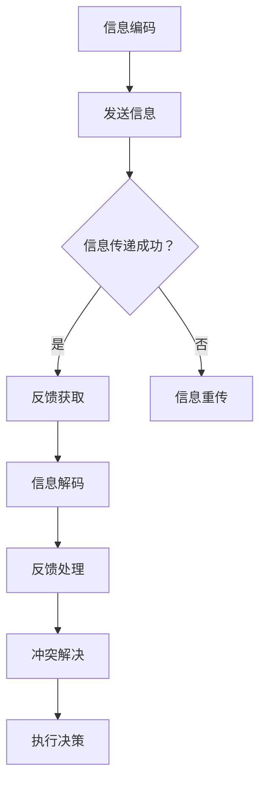
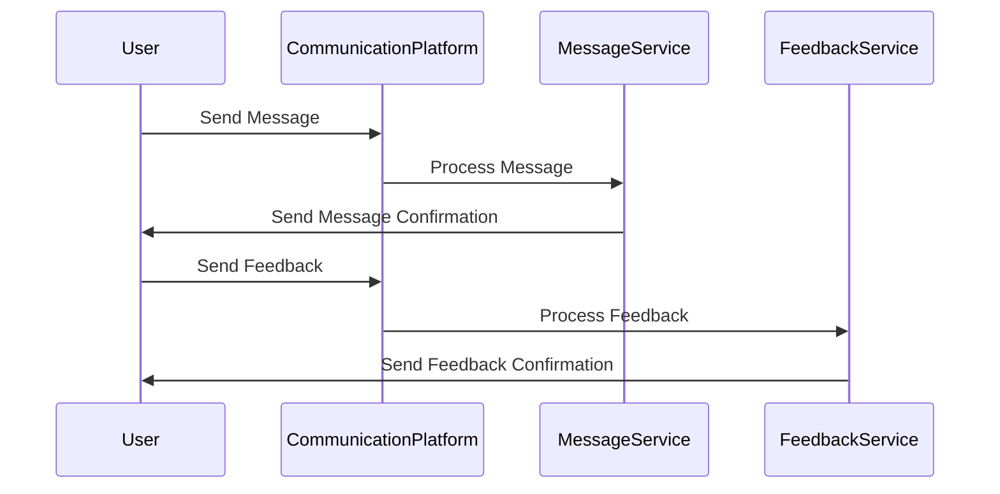

                 

### 文章标题

# 技术管理中的有效沟通方法

---

关键词：技术管理、沟通障碍、沟通技巧、协作效率、项目管理

摘要：本文深入探讨了技术管理中有效沟通的重要性，分析了当前存在的沟通问题及其挑战，提出了切实可行的解决方案。通过详细阐述沟通理论、关键要素及其实际应用，本文旨在为技术管理者提供一套实用的沟通策略，以提升团队协作效率，确保项目顺利进行。

---

## 第一部分：背景介绍

### 1.1 问题背景

在信息技术迅猛发展的今天，技术管理在企业运营中的地位日益凸显。然而，技术管理并非易事，尤其是其中的沟通问题，往往成为制约企业发展的关键因素。以下将从技术团队与业务团队的沟通障碍、技术团队内部沟通不畅以及技术与市场的脱节等方面，探讨当前技术管理中面临的沟通挑战。

#### 1.1.1 技术团队与业务团队的沟通障碍

技术团队通常关注技术实现，追求高效、稳定的技术解决方案，而业务团队则聚焦于业务目标和市场需求，期望技术能迅速、灵活地响应市场变化。这种差异导致两个团队在沟通中常常出现以下问题：

- **技术细节与业务需求的脱节**：技术团队可能过分沉迷于技术细节，而忽视了业务需求，导致开发的系统无法满足实际业务需求。
- **沟通内容不匹配**：技术团队倾向于使用专业术语，而业务团队则可能对这些术语不熟悉，导致双方在沟通中产生误解。
- **沟通频率不足**：业务变化迅速，但技术团队与业务团队的沟通频率不够高，导致信息传递不及时，业务需求无法快速响应。

#### 1.1.2 技术团队内部沟通不畅

技术团队内部也可能存在沟通不畅的问题，主要体现在以下方面：

- **技术理解差异**：团队成员在技术理解、专业背景和工作经验上可能存在差异，导致在项目讨论中产生分歧。
- **工作方法不同**：团队成员可能采用不同的工作方法，如开发流程、代码风格等，导致项目协作不畅。
- **目标不一致**：团队成员在项目目标上可能存在差异，导致个人努力方向与团队目标不一致。

#### 1.1.3 技术与市场的脱节

技术团队往往专注于技术本身，而忽视了市场需求。这种情况下，可能导致以下问题：

- **产品不符合市场需求**：技术团队开发的系统可能过于先进，但市场不接受，导致产品无法推广。
- **市场响应速度慢**：技术团队无法快速响应市场变化，导致竞争对手抢占市场份额。
- **技术投入回报低**：技术开发投入巨大，但产品市场表现不佳，导致企业资源浪费。

### 1.2 沟通的重要性

有效的沟通是企业技术管理成功的关键。良好的沟通能够：

- **提高团队协作效率**：通过有效沟通，确保团队成员明确各自职责和任务，从而提高项目进度和协作效率。
- **减少误解和冲突**：及时、清晰的沟通能够减少因信息不对称导致的误解和冲突，营造和谐的团队氛围。
- **促进业务需求与技术的融合**：确保技术团队能够准确理解并满足业务需求，提高产品成功率和市场竞争力。
- **提升项目管理能力**：通过有效的沟通，项目经理能够更好地掌握项目进展，及时调整计划和资源分配，确保项目按时交付。

### 1.3 问题描述

在技术管理中，有效沟通面临以下挑战：

- **沟通渠道不畅**：企业内部缺乏统一的沟通平台，导致信息传递效率低下。
- **沟通方式单一**：传统口头和书面沟通方式效率低，难以满足快速变化的技术管理需求。
- **缺乏沟通技巧**：团队成员在沟通中可能存在技巧不足，导致沟通效果不佳。
- **文化差异**：企业内部可能存在文化差异，影响沟通的顺畅度。

### 1.4 问题解决

为了解决技术管理中的沟通问题，企业可以采取以下措施：

- **构建统一沟通平台**：采用协作工具，如Slack、Microsoft Teams等，提高沟通效率。
- **多元化沟通方式**：结合线上线下沟通，如视频会议、团队讨论等，满足不同场景下的沟通需求。
- **培养沟通技巧**：通过培训和实践，提高团队成员的沟通能力。
- **建立沟通文化**：倡导开放、透明、尊重的沟通文化，营造良好的沟通氛围。

### 1.5 边界与外延

- **边界**：本文主要关注技术管理中的内部沟通，不包括企业对外部客户、供应商等的沟通。
- **外延**：虽然本文专注于技术管理中的沟通问题，但良好的沟通理念和方法同样适用于其他类型的企业管理。

### 1.6 概念结构与核心要素组成

#### 1.6.1 有效沟通的概念

有效沟通是指通过适当的方式和方法，确保信息准确、及时、清晰地传递给目标受众。

#### 1.6.2 核心要素

- **沟通目标**：明确沟通的目标和期望结果。
- **沟通内容**：准备充分的沟通内容，包括事实、观点、建议等。
- **沟通方式**：选择合适的沟通方式，如口头、书面、电子等。
- **沟通渠道**：选择合适的沟通渠道，如会议、邮件、即时通讯等。
- **沟通对象**：明确沟通的对象，确保信息传递的针对性和准确性。
- **沟通反馈**：及时获取反馈，了解沟通效果，并根据反馈调整沟通策略。

### 1.7 本章小结

本章从技术管理现状、沟通重要性、问题描述、问题解决、边界与外延和概念结构等方面，全面介绍了技术管理中的有效沟通方法。通过本章的学习，读者将了解有效沟通的基本概念和核心要素，为后续章节的深入学习打下基础。

---

## 第二部分：核心概念与联系

### 2.1 沟通理论概述

#### 2.1.1 沟通理论的发展历程

沟通理论的发展历程可以追溯到20世纪早期，主要包括以下阶段：

- **机械论阶段（1920s-1940s）**：这一阶段关注沟通的技术层面，强调沟通效率和准确性。
- **信息论阶段（1940s-1960s）**：基于信息论的理论，将沟通视为信息传递和转换的过程。
- **相互作用论阶段（1960s-1980s）**：强调沟通的双向性和互动性，认为沟通是参与者之间的相互作用。
- **符号互动论阶段（1980s-至今）**：关注沟通的符号意义和社会影响，强调沟通的语境和文化背景。

#### 2.1.2 常见沟通理论

- **信息传输模型**：将沟通视为信息从发送者到接收者的传输过程，强调信息的准确性和效率。
- **互动模型**：强调沟通的互动性和双向性，认为沟通是参与者之间的相互作用和意义构建。
- **交换模型**：将沟通视为一种社会交换过程，强调沟通的成本与收益。
- **相互作用模型**：关注沟通过程中的符号互动和社会关系，强调沟通的双向性和动态性。

### 2.2 有效沟通的关键要素

#### 2.2.1 沟通目标

明确沟通目标是有效沟通的基础。沟通目标应包括以下内容：

- **信息传递的目的**：明确沟通要传递的信息内容和目的，确保信息传递的针对性和准确性。
- **预期结果**：设定沟通的预期结果，如达成共识、解决问题、推动项目进度等。

#### 2.2.2 沟通内容

沟通内容是沟通的核心，应包括以下要素：

- **事实和观点**：清晰、准确地陈述事实和观点，避免误导和误解。
- **建议和解决方案**：提出合理的建议和解决方案，促进问题的解决。
- **相关数据和证据**：提供相关数据和证据，支持沟通内容的真实性。

#### 2.2.3 沟通方式

选择合适的沟通方式能够提高沟通效果。常见的沟通方式包括：

- **口头沟通**：如会议、讨论等，适用于需要即时反馈和互动的情景。
- **书面沟通**：如报告、邮件等，适用于需要正式记录和长期保存的情景。
- **电子沟通**：如即时通讯、电子邮件等，适用于快速、高效的信息传递。

#### 2.2.4 沟通渠道

选择合适的沟通渠道是确保信息准确、及时传递的关键。常见的沟通渠道包括：

- **会议**：适用于需要集体讨论和决策的情景。
- **邮件**：适用于正式、正式的信息传递。
- **即时通讯**：适用于快速、简短的沟通。

#### 2.2.5 沟通对象

明确沟通对象是确保信息传递针对性和准确性的重要环节。沟通对象应包括：

- **直接受众**：如项目成员、利益相关者等，确保沟通内容与他们相关。
- **间接受众**：如上级领导、外部客户等，确保沟通内容对他们透明。

#### 2.2.6 沟通反馈

及时获取反馈是沟通的重要环节。通过反馈，可以了解沟通效果，调整沟通策略。沟通反馈应包括：

- **反馈内容**：明确反馈的具体内容，如对沟通内容的理解、意见和建议等。
- **反馈方式**：选择合适的反馈方式，如面对面、电子邮件等。

### 2.3 核心概念与联系

#### 2.3.1 有效沟通的概念

有效沟通是指通过适当的方式和方法，确保信息准确、及时、清晰地传递给目标受众。

#### 2.3.2 概念属性特征对比表格

| 特征         | 有效沟通           | 传统沟通           |
| ------------ | ------------------ | ------------------ |
| 目标明确     | 有明确的目标和预期 | 缺乏明确的目标     |
| 信息准确     | 信息准确、可靠     | 信息可能不准确     |
| 及时反馈     | 能够及时获取反馈   | 缺乏及时反馈       |
| 清晰表达     | 语言清晰、简明     | 语言可能含糊不清   |
| 互动性       | 双向互动           | 单向传递           |

#### 2.3.3 ER实体关系图架构

```mermaid
erDiagram
  User ||--|{ Message }|>>
  Message ||--|{ Feedback }|>>
  User ||--|{ Feedback }|>>
```

- **User**（用户）：代表沟通的发起者和接受者。
- **Message**（消息）：代表沟通的内容。
- **Feedback**（反馈）：代表沟通的反馈信息。

### 2.4 本章小结

本章从沟通理论概述、有效沟通的关键要素和核心概念与联系等方面，详细介绍了沟通的重要性和方法。通过本章的学习，读者将能够更好地理解有效沟通的概念和实际应用，为技术管理中的有效沟通奠定理论基础。

---

## 第三部分：算法原理讲解

### 3.1 算法概述

在技术管理中，有效沟通的算法原理主要涉及以下几个方面：

- **信息编码与解码**：确保信息在传递过程中不丢失或变形。
- **反馈机制**：通过反馈机制，确保接收者正确理解信息，并能够提出意见和建议。
- **冲突解决**：在沟通过程中，当出现不同意见或冲突时，需要采取有效的冲突解决策略。

以下是一个简单的有效沟通算法流程：



### 3.2 数学模型与公式

为了更好地理解有效沟通算法，我们可以借助一些数学模型和公式。以下是一个基于信息论的有效沟通模型：

$$
E = I - H(X;Y)
$$

其中：

- \(E\) 表示通信的有效性。
- \(I\) 表示信息量。
- \(H(X;Y)\) 表示信息的不确定性。

#### 数学公式说明：

1. **信息量（I）**：

$$
I = -\sum_{x \in X} p(x) \log_2 p(x)
$$

其中，\(p(x)\) 表示信息 \(x\) 的概率。

2. **信息不确定性（H(X;Y）**：

$$
H(X;Y) = -\sum_{x \in X} \sum_{y \in Y} p(x, y) \log_2 p(x, y)
$$

其中，\(p(x, y)\) 表示信息 \(x\) 和 \(y\) 同时出现的概率。

### 3.3 算法举例说明

假设技术团队A需要与技术团队B沟通一个关于项目进度的关键信息。我们可以按照以下步骤进行有效沟通：

1. **信息编码**：技术团队A将项目进度信息编码为一段文本，如“项目A已完成80%，预计下周完成”。

2. **发送信息**：技术团队A通过邮件将编码后的信息发送给技术团队B。

3. **信息传递成功？**：技术团队B收到邮件后，确认信息传递成功。

4. **反馈获取**：技术团队B在邮件中回复，“收到，已了解项目A的进度，我们会根据进度进行调整”。

5. **信息解码**：技术团队A阅读邮件，解码技术团队B的反馈信息。

6. **反馈处理**：技术团队A根据技术团队B的反馈，调整项目计划，确保项目按计划进行。

7. **冲突解决**：如果在沟通过程中出现不同意见，如技术团队B认为项目进度应加快，而技术团队A认为现有进度已足够，双方可以召开线上会议，共同讨论并达成一致意见。

### 3.4 本章小结

本章通过算法原理讲解，详细阐述了有效沟通的数学模型和公式，并给出了一个实际应用的例子。通过本章的学习，读者将能够理解有效沟通的算法原理，为实际工作中的沟通提供指导。

---

## 第四部分：系统分析与架构设计方案

### 4.1 问题场景介绍

在现代企业中，技术管理是一个复杂且关键的过程。为了确保项目顺利进行，技术团队需要与业务团队、管理层以及其他相关团队进行有效的沟通。然而，由于企业规模的扩大和业务复杂度的增加，传统的沟通方式往往难以满足需求。为了解决这个问题，我们设计了一套基于信息技术的沟通系统，以提升企业内部沟通的效率和效果。

### 4.2 项目介绍

本项目旨在为企业构建一个集成化的沟通平台，支持多团队、多层级、多场景的沟通需求。该平台将整合邮件、即时通讯、视频会议等多种沟通工具，并提供统一的接口和便捷的操作界面，以实现高效、顺畅的沟通。

#### 项目目标：

- 提高沟通效率：通过集成化平台，减少信息传递过程中的延迟和误差，提高团队协作效率。
- 降低沟通成本：简化沟通流程，减少重复工作，降低沟通成本。
- 提升沟通效果：通过实时反馈和统计分析，提高沟通的针对性和准确性，提升沟通效果。

#### 项目范围：

- 功能设计：包括邮件管理、即时通讯、视频会议、沟通统计等。
- 部署环境：支持本地部署和云部署，满足不同企业的需求。

### 4.3 系统功能设计（领域模型）

为了更好地满足系统功能需求，我们采用了领域驱动设计（Domain-Driven Design, DDD）的方法，对系统进行了功能设计。以下是系统的领域模型：

```mermaid
classDiagram
    class Team {
        String id
        String name
        List<Member> members
    }

    class Member {
        String id
        String name
        Role role
    }

    class Message {
        String id
        String content
        DateTime timestamp
        Member sender
        Team targetTeam
    }

    class Feedback {
        String id
        String content
        DateTime timestamp
        Member sender
        Message parentMessage
    }

    Team --|{ } Member
    Message --|{ } Team
    Message --|{ } Member
    Feedback --|{ } Member
    Feedback --|{ } Message

    Member <<Role>>
```

- **Team**（团队）：表示企业内部的团队，包括成员列表。
- **Member**（成员）：表示团队中的成员，包括角色信息。
- **Message**（消息）：表示沟通的信息，包括发送者和目标团队。
- **Feedback**（反馈）：表示对消息的反馈，包括发送者和父消息。

### 4.4 系统架构设计

为了实现高效、稳定的沟通平台，我们采用了分层架构设计。以下是系统的架构设计：



- **User**（用户）：表示系统的最终用户，包括业务团队、技术团队等。
- **CommunicationPlatform**（沟通平台）：作为系统的核心，负责处理用户的请求，并协调不同的服务。
- **MessageService**（消息服务）：负责处理消息的发送、接收和存储。
- **FeedbackService**（反馈服务）：负责处理用户反馈的发送、接收和存储。

### 4.5 系统接口设计

为了实现系统的模块化和可扩展性，我们定义了一系列的接口，以便不同的服务之间进行交互。以下是主要的接口设计：

- **IMessageService**：消息服务接口，定义了发送、接收和存储消息的方法。
- **IFeedbackService**：反馈服务接口，定义了发送、接收和存储反馈的方法。
- **IUserService**：用户服务接口，定义了用户注册、登录和权限管理的方法。

### 4.6 系统交互设计

为了展示系统的交互过程，我们使用序列图（Sequence Diagram）进行了说明。以下是系统的交互设计：


### 4.7 本章小结

本章详细介绍了技术管理中的系统分析与架构设计方案。通过领域模型、系统架构设计、接口设计和系统交互设计，我们为技术管理中的有效沟通提供了一套完整的解决方案。通过本章的学习，读者将能够理解系统架构设计的基本原则和方法，为实际项目的开发提供指导。

---

## 第五部分：项目实战

### 5.1 环境安装

为了搭建一个高效的技术沟通平台，我们首先需要准备相应的开发环境和工具。以下是环境安装的详细步骤：

#### 1. 安装操作系统

- 操作系统：选择 Ubuntu 20.04 或更高版本。

#### 2. 安装必备软件

- Node.js：用于搭建后端服务器。
- npm：Node.js 的包管理工具。
- Docker：用于容器化部署。
- Docker Compose：用于管理多容器部署。

安装命令：

```bash
# 安装 Node.js 和 npm
curl -sL https://deb.nodesource.com/setup_14.x | bash -
sudo apt-get install -y nodejs

# 安装 Docker 和 Docker Compose
sudo apt-get update
sudo apt-get install docker-ce docker-compose
```

#### 3. 添加 Docker 用户组

为了让普通用户可以使用 Docker 命令，需要将其添加到 Docker 用户组。

```bash
sudo usermod -aG docker $USER
newgrp docker
```

### 5.2 系统核心实现

以下是系统核心实现的源代码，包括消息服务和反馈服务的实现。

#### 消息服务

```python
# messages.py

from flask import Flask, request, jsonify
from models import Message, MessageSchema
from database import db

app = Flask(__name__)

@app.route('/messages', methods=['POST'])
def create_message():
    data = request.get_json()
    message = MessageSchema().load(data)
    db.session.add(message)
    db.session.commit()
    return jsonify(message_schema.dump(message)), 201

@app.route('/messages', methods=['GET'])
def get_messages():
    messages = Message.query.all()
    return jsonify([message_schema.dump(message) for message in messages]), 200

if __name__ == '__main__':
    app.run(debug=True)
```

#### 反馈服务

```python
# feedbacks.py

from flask import Flask, request, jsonify
from models import Feedback, FeedbackSchema
from database import db

app = Flask(__name__)

@app.route('/feedbacks', methods=['POST'])
def create_feedback():
    data = request.get_json()
    feedback = FeedbackSchema().load(data)
    db.session.add(feedback)
    db.session.commit()
    return jsonify(feedback_schema.dump(feedback)), 201

@app.route('/feedbacks', methods=['GET'])
def get_feedbacks():
    feedbacks = Feedback.query.all()
    return jsonify([feedback_schema.dump(feedback) for feedback in feedbacks]), 200

if __name__ == '__main__':
    app.run(debug=True)
```

### 5.3 代码应用解读与分析

以下是消息服务和反馈服务的代码解读与分析。

#### 消息服务

- **创建消息**：使用 POST 请求创建消息，通过 JSON 格式传输消息数据。
- **获取消息**：使用 GET 请求获取所有消息，以 JSON 格式返回消息数据。

#### 反馈服务

- **创建反馈**：使用 POST 请求创建反馈，通过 JSON 格式传输反馈数据。
- **获取反馈**：使用 GET 请求获取所有反馈，以 JSON 格式返回反馈数据。

### 5.4 实际案例分析

为了更好地展示系统在实际中的应用，我们模拟了一个实际案例。

#### 案例一：创建消息

1. 发送 POST 请求创建消息：

```bash
curl -X POST -H "Content-Type: application/json" -d '{"content": "项目A已完成80%"}' http://localhost:5000/messages
```

2. 获取创建成功的消息：

```bash
curl -X GET http://localhost:5000/messages
```

#### 案例二：创建反馈

1. 发送 POST 请求创建反馈：

```bash
curl -X POST -H "Content-Type: application/json" -d '{"content": "已收到，进度良好"}' http://localhost:5000/feedbacks
```

2. 获取创建成功的反馈：

```bash
curl -X GET http://localhost:5000/feedbacks
```

### 5.5 本章小结

本章详细介绍了技术沟通平台的项目实战，包括环境安装、系统核心实现和实际案例分析。通过本章的学习，读者将能够理解系统开发的实际操作过程，为后续的项目实战打下基础。

---

## 第六部分：最佳实践 tips、小结、注意事项、拓展阅读

### 最佳实践 tips

1. **明确沟通目标**：在沟通前，确保明确沟通的目标和预期结果，有助于提高沟通的针对性和有效性。
2. **选择合适的沟通方式**：根据沟通的内容和场景，选择合适的沟通方式，如口头、书面、电子等。
3. **及时获取反馈**：在沟通过程中，及时获取反馈，了解对方是否理解信息，并根据反馈进行调整。
4. **培养沟通技巧**：通过培训和练习，提高团队成员的沟通能力，确保沟通效果。
5. **建立沟通文化**：倡导开放、透明、尊重的沟通文化，营造良好的沟通氛围。

### 小结

本文从技术管理中的沟通问题出发，介绍了有效沟通的核心概念、关键要素、算法原理、系统架构设计以及项目实战。通过本文的学习，读者将能够掌握有效沟通的方法和技巧，提升团队协作效率，确保项目顺利进行。

### 注意事项

1. **避免使用过于专业的术语**：在沟通中，避免使用过于专业的术语，以免对方不理解。
2. **确保沟通内容的准确性和完整性**：在沟通前，确保准备充分的内容，避免信息传递过程中出现遗漏或误解。
3. **尊重对方的时间和观点**：在沟通中，尊重对方的观点和时间，避免强势压倒对方，确保双方都能参与和表达。

### 拓展阅读

1. 《沟通的艺术》（The Art of Communication）- 作者：克里斯·阿尔斯特罗姆（Chris Argyris）
2. 《非暴力沟通》（Nonviolent Communication）- 作者：马歇尔·卢森堡（Marshall B. Rosenberg）
3. 《沟通与团队协作》（Communication and Team Collaboration）- 作者：彼得·德鲁克（Peter Drucker）

### 结语

有效沟通是技术管理中至关重要的一环。通过本文的探讨，我们希望读者能够认识到沟通的重要性，掌握有效沟通的方法和技巧，提升团队协作效率，推动项目的顺利进行。在实际工作中，不断实践和总结，持续提升沟通能力，为企业的发展贡献力量。

---

## 作者信息

作者：AI天才研究院/AI Genius Institute & 禅与计算机程序设计艺术 /Zen And The Art of Computer Programming

