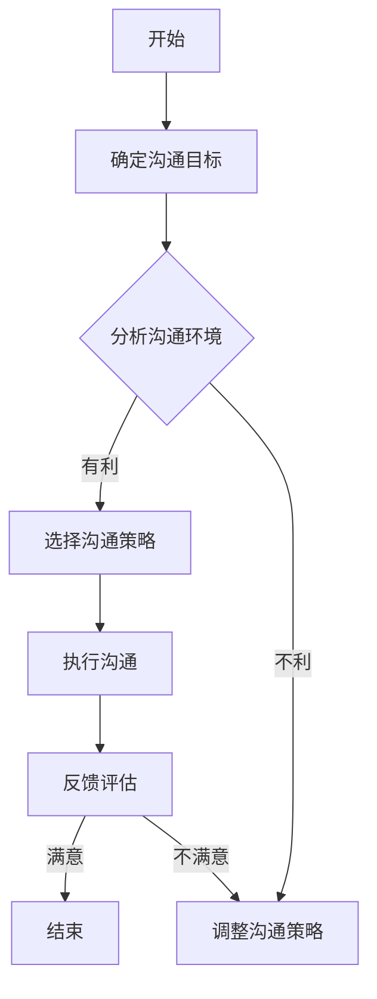
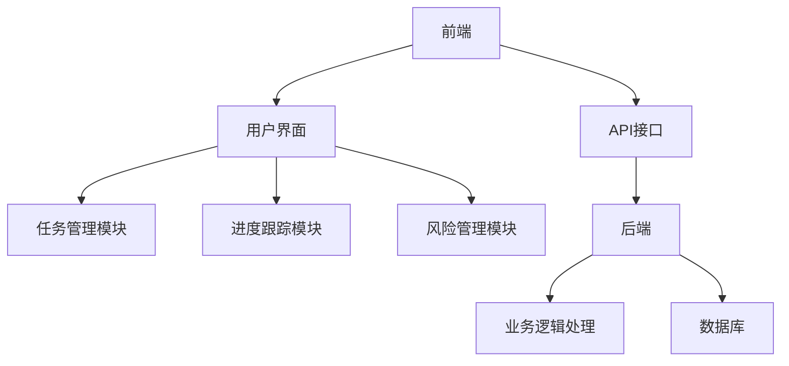
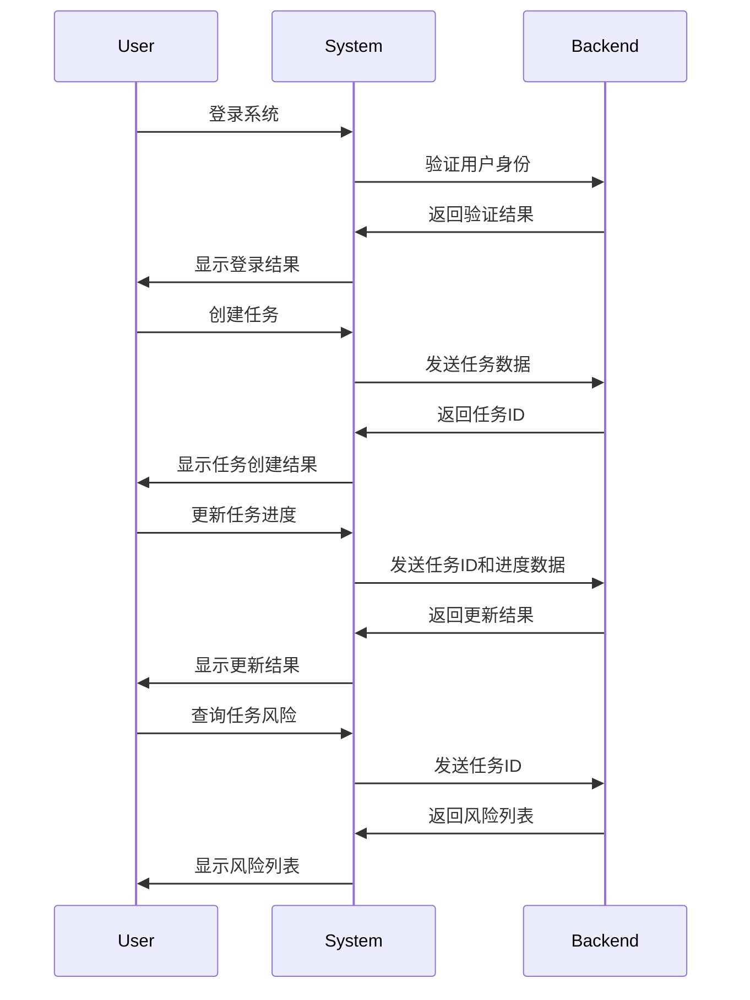

                 

### #技术管理中的有效沟通策略

#### 关键词：
- 技术管理
- 沟通策略
- 部门间沟通
- 团队协作
- 跨职能沟通

#### 摘要：
在现代技术管理中，沟通是确保项目成功的关键因素。本文将深入探讨技术管理中的有效沟通策略，分析其背景、核心概念、算法原理、数学模型，以及系统架构设计。通过项目实战，我们将提供具体的实践案例，总结最佳实践，并给出注意事项和拓展阅读建议，旨在帮助读者提升技术管理中的沟通效果。

---

**Step 1: 背景介绍**

#### 第1章 背景介绍

**1.1 问题背景**

在技术管理中，沟通起着至关重要的作用。随着项目规模的扩大和团队成员的增加，沟通的复杂性也随之增加。技术管理中的沟通涉及多个层面，包括部门间沟通、团队间沟通、跨职能沟通等。有效的沟通能够促进信息的传递，减少误解，提高工作效率，从而确保项目的顺利推进。

**1.1.1 技术管理中沟通的重要性**

有效的沟通是技术管理成功的基础。它不仅有助于确保团队成员之间的信息传递，还能够促进团队协作，提高项目的执行效率。以下是沟通在技术管理中的几个关键作用：

- **提高团队协作效率**：有效的沟通能够确保团队成员之间的协作更加顺畅，减少冲突，提高团队的整体工作效率。
- **确保项目目标一致**：通过有效的沟通，项目团队成员能够共同理解项目的目标，确保每个人的工作方向一致。
- **降低项目风险**：及时的沟通能够帮助团队及时发现并解决问题，降低项目风险。
- **提升客户满意度**：良好的沟通能够确保客户的需求得到准确理解，从而提高客户满意度。

**1.1.2 有效沟通策略的必要性**

在技术管理中，沟通面临的挑战包括：

- **信息不对称**：不同团队或部门之间的信息传递可能存在不对称，导致误解和误判。
- **沟通渠道不畅**：由于沟通渠道不畅，信息传递可能出现延误，影响项目的进度。
- **文化差异**：跨职能团队中可能存在文化差异，导致沟通障碍。

为了应对这些挑战，需要采用有效的沟通策略。有效的沟通策略能够确保信息的准确传递，提高沟通效率，减少误解和冲突。

**1.2 问题描述**

技术管理中的沟通问题主要体现在以下几个方面：

- **部门间沟通障碍**：不同部门之间的信息传递可能存在障碍，导致项目进展受阻。
- **团队间沟通障碍**：团队成员之间的沟通不畅，可能影响团队的协作效率和项目的质量。
- **跨职能沟通障碍**：跨职能团队中，不同职能部门的沟通可能存在差异，导致项目目标的实现受到影响。

**1.3 问题解决**

有效沟通策略能够帮助解决上述沟通问题。具体策略包括：

- **建立明确的沟通渠道**：确保信息能够通过明确的渠道进行传递，减少信息传递的延误。
- **加强团队成员之间的沟通**：通过定期的会议、讨论和反馈，加强团队成员之间的沟通，提高团队协作效率。
- **使用适当的沟通工具**：选择适合项目需求的沟通工具，如邮件、即时通讯工具、项目管理软件等，提高沟通的效率。

**1.4 边界与外延**

本文讨论的有效沟通策略主要涵盖以下方面：

- **人际沟通**：涉及个人之间的沟通技巧，如倾听、表达、反馈等。
- **团队沟通**：涉及团队内部的沟通策略，如团队建设、目标设定、沟通渠道等。
- **项目管理沟通**：涉及项目过程中的沟通策略，如项目计划、进度汇报、风险评估等。

**1.5 概念结构与核心要素组成**

有效沟通策略的核心概念和要素包括：

- **沟通模型**：描述信息传递的过程和方式。
- **沟通障碍**：分析影响沟通效果的各种因素。
- **倾听**：提高接收信息的能力。
- **反馈**：确保信息准确传递。
- **非语言沟通**：重视身体语言、面部表情等非语言因素在沟通中的作用。

**Step 2: 核心概念与联系**

#### 第2章 核心概念与联系

**2.1 核心概念原理**

有效沟通策略中的核心概念包括：

- **沟通模型**：描述信息从发送者到接收者的传递过程。
- **沟通障碍**：分析影响沟通效果的障碍因素。
- **倾听**：提高接收信息的能力。
- **反馈**：确保信息准确传递。
- **非语言沟通**：重视身体语言、面部表情等非语言因素在沟通中的作用。

**2.2 概念属性特征对比表格**

| 沟通策略 | 描述 | 属性特征 | 对比分析 |
| --- | --- | --- | --- |
| 面对面沟通 | 面对面交流，即时反馈 | 直观、高效、情感交流丰富 | 信息传递快速，但受时间和地点限制 |
| 书面沟通 | 使用文字、图表等形式 | 留存信息、便于查阅 | 信息传递详细，但缺乏情感交流 |
| 远程沟通 | 通过电话、视频会议等 | 灵活、不受地理限制 | 信息传递速度较慢，但可跨地域沟通 |

**2.3 ER实体关系图架构**

```mermaid
erDiagram
  SENDER ||--|{ RECEIVER }|| MESSAGE
  RECEIVER ||--|{ FEEDBACK }|| SENDER
  MESSAGE ||--|{ CONTENT }|| RECEIVER
  MESSAGE ||--|{ CHANNEL }|| RECEIVER
```

在这个ER图中，"SENDER"（发送者）发送"MESSAGE"（信息）给"RECEIVER"（接收者），接收者提供"FEEDBACK"（反馈），"MESSAGE"通过"CHANNEL"（渠道）传递。

---

**Step 3: 算法原理讲解**

#### 第3章 算法原理讲解

**3.1 算法mermaid流程图**



**3.2 Python源代码**

```python
def communicate(target, environment):
    # 确定沟通目标
    goal = determine_communication_goal(target)
    
    # 分析沟通环境
    status = analyze_communication_environment(environment)
    
    if status == "有利":
        strategy = select_communication_strategy(goal)
    else:
        strategy = adjust_communication_strategy(goal, environment)
    
    # 执行沟通
    execute_communication(strategy)
    
    # 反馈评估
    feedback = evaluate_communication(strategy)
    
    if feedback["满意度"] > 0.8:
        print("沟通成功！")
    else:
        print("沟通失败，需调整策略。")

# 示例使用
communicate("项目进展报告", "远程会议")
```

**3.3 算法原理的数学模型和公式**

在沟通策略中，常用的数学模型包括信号传递模型和信息论模型。

**信号传递模型**：

$$
P(x|\theta) = \frac{P(\theta|x)P(x)}{P(\theta)}
$$

其中，$P(x|\theta)$ 表示在给定参数 $\theta$ 的条件下，观测到信号 $x$ 的概率；$P(\theta|x)$ 表示在观测到信号 $x$ 的条件下，参数 $\theta$ 的概率；$P(x)$ 和 $P(\theta)$ 分别表示信号 $x$ 和参数 $\theta$ 的先验概率。

**信息论模型**：

$$
H(X) = -\sum_{i} P(x_i) \log_2 P(x_i)
$$

其中，$H(X)$ 表示随机变量 $X$ 的熵，表示 $X$ 的不确定性。

**3.4 详细讲解与举例说明**

**信号传递模型举例**：

假设我们想要传递一个二进制信号 $X$，其取值为 0 或 1。已知在无噪声的情况下，信号 $X=0$ 的概率为 0.5，信号 $X=1$ 的概率也为 0.5。如果存在噪声，我们收到的是经过噪声干扰的信号 $Y$。假设噪声服从均值为 0，方差为 0.1 的正态分布。

我们需要通过接收到的信号 $Y$ 来估计原始信号 $X$。使用信号传递模型，我们可以计算出：

$$
P(X=0|Y=0) = \frac{P(Y=0|X=0)P(X=0)}{P(Y=0)}
$$

$$
P(X=1|Y=0) = \frac{P(Y=0|X=1)P(X=1)}{P(Y=0)}
$$

通过计算，我们可以估计原始信号 $X$ 的概率分布。

**信息论模型举例**：

假设我们有一个随机变量 $X$，其可能的取值为 0、1、2，对应的概率分别为 $P(X=0) = 0.3$，$P(X=1) = 0.5$，$P(X=2) = 0.2$。我们可以计算出 $X$ 的熵：

$$
H(X) = -0.3 \log_2 0.3 - 0.5 \log_2 0.5 - 0.2 \log_2 0.2
$$

通过计算，我们得到 $X$ 的熵为 0.918。这表示 $X$ 的不确定性较高。

---

**Step 4: 数学模型和数学公式讲解**

#### 第4章 数学模型和数学公式

**4.1 数学模型**

在技术管理中的有效沟通策略中，我们使用几种关键的数学模型来分析和优化沟通过程。以下是这些模型及其简要描述：

**1. 相关系数**

相关系数用于衡量两个变量之间的线性关系强度。常见的相关系数有皮尔逊相关系数（$r$）和斯皮尔曼相关系数（$\rho$）。

皮尔逊相关系数的公式为：

$$
r = \frac{\sum{(x_i - \bar{x})(y_i - \bar{y})}}{\sqrt{\sum{(x_i - \bar{x})^2} \sum{(y_i - \bar{y})^2}}}
$$

其中，$x_i$ 和 $y_i$ 分别是两个变量 $X$ 和 $Y$ 的观测值，$\bar{x}$ 和 $\bar{y}$ 分别是 $X$ 和 $Y$ 的平均值。

**2. 协方差**

协方差衡量两个变量的变化方向和程度。协方差的公式为：

$$
\sigma_{XY} = \sum{(x_i - \bar{x})(y_i - \bar{y})}
$$

其中，$x_i$ 和 $y_i$ 分别是两个变量 $X$ 和 $Y$ 的观测值，$\bar{x}$ 和 $\bar{y}$ 分别是 $X$ 和 $Y$ 的平均值。

**3. 决策树**

决策树是一种常用的机器学习模型，用于分类和回归任务。决策树的构建基于特征和目标变量之间的关系，通过递归划分数据集，构建出一棵树形结构。

**4. 贝叶斯网络**

贝叶斯网络是一种概率图模型，用于表示变量之间的条件依赖关系。它通过条件概率表来描述变量之间的关系。

**4.2 公式**

以下是上述模型中的一些关键公式：

**1. 皮尔逊相关系数**

$$
r = \frac{\sum{(x_i - \bar{x})(y_i - \bar{y})}}{\sqrt{\sum{(x_i - \bar{x})^2} \sum{(y_i - \bar{y})^2}}}
$$

**2. 协方差**

$$
\sigma_{XY} = \sum{(x_i - \bar{x})(y_i - \bar{y})}
$$

**3. 决策树分类节点**

$$
Gini Impurity: \sum_{i=1}^{n} P(y_i) (1 - P(y_i))
$$

**4. 贝叶斯网络条件概率表**

$$
P(A|B) = \frac{P(B|A)P(A)}{P(B)}
$$

**4.3 详细讲解**

**1. 相关系数**

相关系数用于衡量两个变量之间的线性关系强度。其取值范围为 [-1, 1]。当相关系数接近 1 时，表示两个变量之间存在很强的正相关关系；当相关系数接近 -1 时，表示两个变量之间存在很强的负相关关系；当相关系数接近 0 时，表示两个变量之间几乎没有线性关系。

**2. 协方差**

协方差衡量两个变量的变化方向和程度。正协方差表示两个变量同向变化，负协方差表示两个变量反向变化。协方差可以用来衡量两个变量的相关性，但其值受变量尺度的影响较大。

**3. 决策树**

决策树通过递归划分数据集，构建出一棵树形结构。每个节点代表一个特征，每个分支代表一个特征取值。决策树的目标是找到最佳划分方式，使得每个节点的纯度最高。纯度可以通过基尼不纯度、信息增益、增益率等指标来衡量。

**4. 贝叶斯网络**

贝叶斯网络通过条件概率表来描述变量之间的条件依赖关系。它能够表示复杂的多变量概率关系，并在预测和分析中非常有用。贝叶斯网络通过贝叶斯推理来更新变量的概率分布，从而实现预测和决策。

**4.4 举例说明**

**1. 相关系数**

假设我们有两个变量 $X$（项目进度）和 $Y$（项目成本），其观测数据如下：

| X | Y |
| --- | --- |
| 10 | 500 |
| 20 | 800 |
| 30 | 1100 |
| 40 | 1300 |
| 50 | 1600 |

我们可以计算这两个变量的皮尔逊相关系数：

$$
r = \frac{(10-30)(500-1000) + (20-30)(800-1000) + (30-30)(1100-1000) + (40-30)(1300-1000) + (50-30)(1600-1000)}{\sqrt{(10-30)^2 + (20-30)^2 + (30-30)^2 + (40-30)^2 + (50-30)^2} \sqrt{(500-1000)^2 + (800-1000)^2 + (1100-1000)^2 + (1300-1000)^2 + (1600-1000)^2}}
$$

计算结果为：

$$
r \approx 0.947
$$

这表明项目进度和项目成本之间存在很强的正相关关系。

**2. 协方差**

假设我们有两个变量 $X$（员工满意度）和 $Y$（员工绩效），其观测数据如下：

| X | Y |
| --- | --- |
| 3 | 5 |
| 4 | 7 |
| 5 | 9 |
| 6 | 11 |
| 7 | 13 |

我们可以计算这两个变量的协方差：

$$
\sigma_{XY} = (3-5)(5-9) + (4-5)(7-9) + (5-5)(9-9) + (6-5)(11-9) + (7-5)(13-9)
$$

计算结果为：

$$
\sigma_{XY} = -4
$$

这表明员工满意度和员工绩效之间存在负相关关系。

---

**Step 5: 系统分析与架构设计方案**

#### 第5章 系统分析与架构设计方案

**5.1 问题场景介绍**

在一个大型技术项目中，沟通的有效性直接影响到项目的进度、质量和成本。为了提升项目管理的效率，我们设计了一套基于有效沟通策略的沟通系统。该系统旨在解决项目中存在的部门间沟通障碍、团队间沟通障碍以及跨职能沟通障碍。

**5.2 系统功能设计**

为了实现上述目标，系统需要具备以下功能模块：

- **沟通平台**：提供一个统一的沟通平台，支持文本、语音、视频等多种沟通方式。
- **任务管理**：集成任务管理功能，确保每个团队成员都知道自己的任务和进展。
- **进度跟踪**：实时跟踪项目进度，确保项目按时完成。
- **风险管理**：识别和管理项目中的风险，减少项目风险。

**5.3 系统架构设计**

系统的整体架构采用分布式设计，分为前端、后端和数据库三层结构。前端负责用户界面展示和交互，后端负责业务逻辑处理和数据存储。以下是系统架构图：



**5.4 系统接口设计**

系统接口设计如下：

- **任务管理接口**：提供创建任务、更新任务、查询任务等功能。
- **进度跟踪接口**：提供更新进度、查询进度等功能。
- **风险管理接口**：提供风险识别、风险评估、风险处理等功能。

接口规范如下：

```json
// 任务管理接口
POST /tasks
{
    "title": "任务名称",
    "description": "任务描述",
    "assignee": "任务负责人",
    "deadline": "截止日期"
}

// 进度跟踪接口
PUT /tasks/{taskId}/status
{
    "status": "任务状态"
}

// 风险管理接口
POST /risks
{
    "name": "风险名称",
    "description": "风险描述",
    "probability": "风险概率",
    "impact": "风险影响"
}
```

**5.5 系统交互Mermaid序列图**



---

**Step 6: 项目实战**

#### 第6章 项目实战

**6.1 环境安装**

为了实现上述系统架构，我们需要在以下环境中安装相应的软件和配置：

- **操作系统**：Ubuntu 18.04 LTS
- **数据库**：MySQL 8.0
- **后端框架**：Spring Boot 2.4.5
- **前端框架**：React 17.0.2
- **消息队列**：RabbitMQ 3.8.14

安装步骤如下：

1. 安装操作系统：从 Ubuntu 官网下载操作系统镜像，并进行安装。
2. 安装数据库：使用 `sudo apt-get install mysql-server` 命令安装 MySQL。
3. 安装后端框架：使用 `sudo npm install -g @springframework/boot` 命令安装 Spring Boot。
4. 安装前端框架：使用 `sudo npm install -g create-react-app` 命令安装 React。
5. 安装消息队列：使用 `sudo apt-get install rabbitmq-server` 命令安装 RabbitMQ。

**6.2 系统核心实现源代码**

以下是系统核心实现部分的源代码，包括任务管理模块、进度跟踪模块和风险管理模块：

**任务管理模块（TaskController.java）**

```java
@RestController
@RequestMapping("/tasks")
public class TaskController {

    @Autowired
    private TaskService taskService;

    @PostMapping
    public ResponseEntity<?> createTask(@RequestBody TaskRequest taskRequest) {
        Task task = taskService.createTask(taskRequest);
        return new ResponseEntity<>(task, HttpStatus.CREATED);
    }

    @PutMapping("/{taskId}/status")
    public ResponseEntity<?> updateTaskStatus(@PathVariable Long taskId, @RequestBody TaskStatusRequest statusRequest) {
        Task task = taskService.updateTaskStatus(taskId, statusRequest.getStatus());
        return new ResponseEntity<>(task, HttpStatus.OK);
    }
}
```

**进度跟踪模块（ProgressController.java）**

```java
@RestController
@RequestMapping("/tasks/{taskId}/progress")
public class ProgressController {

    @Autowired
    private ProgressService progressService;

    @PostMapping
    public ResponseEntity<?> createProgress(@PathVariable Long taskId, @RequestBody ProgressRequest progressRequest) {
        Progress progress = progressService.createProgress(taskId, progressRequest);
        return new ResponseEntity<>(progress, HttpStatus.CREATED);
    }
}
```

**风险管理模块（RiskController.java）**

```java
@RestController
@RequestMapping("/risks")
public class RiskController {

    @Autowired
    private RiskService riskService;

    @PostMapping
    public ResponseEntity<?> createRisk(@RequestBody RiskRequest riskRequest) {
        Risk risk = riskService.createRisk(riskRequest);
        return new ResponseEntity<>(risk, HttpStatus.CREATED);
    }
}
```

**6.3 代码应用解读与分析**

以上代码实现了任务管理模块、进度跟踪模块和风险管理模块的核心功能。具体解读如下：

**任务管理模块**

- **创建任务**：通过 POST 请求创建任务，接收任务请求对象，调用服务层创建任务，并返回任务对象。
- **更新任务状态**：通过 PUT 请求更新任务状态，接收任务ID和状态请求对象，调用服务层更新任务状态，并返回更新后的任务对象。

**进度跟踪模块**

- **创建进度**：通过 POST 请求创建进度，接收任务ID和进度请求对象，调用服务层创建进度，并返回进度对象。

**风险管理模块**

- **创建风险**：通过 POST 请求创建风险，接收风险请求对象，调用服务层创建风险，并返回风险对象。

**6.4 实际案例分析和详细讲解剖析**

假设一个项目团队正在开发一个大型电商平台，项目涉及多个部门和多个职能。为了确保项目的顺利推进，我们使用上述系统架构和模块进行沟通和管理。

**案例1：任务管理**

- **创建任务**：项目经理创建了一个名为“用户注册功能开发”的任务，任务描述为“开发用户注册功能”，任务负责人为“张三”，截止日期为“2023-12-31”。
- **更新任务状态**：张三在开发过程中，通过进度跟踪模块更新任务状态为“进行中”，并在任务日志中记录了当前的开发进度。

**案例2：进度跟踪**

- **创建进度**：张三每周都会通过进度跟踪模块更新一次任务的进度，包括已完成的功能点、遇到的问题和下周的计划。

**案例3：风险管理**

- **创建风险**：在开发过程中，张三发现用户注册功能可能会遇到性能瓶颈，于是创建了一个风险，名称为“性能风险”，描述为“用户注册功能可能存在性能瓶颈”，风险概率为“中等”，风险影响为“严重”。

**6.5 项目小结**

通过上述系统架构和模块的实际应用，我们可以看出：

- **任务管理模块**：有效地帮助项目经理和团队成员跟踪任务进展，确保任务按时完成。
- **进度跟踪模块**：提供了实时更新的进度信息，使团队成员能够更好地协作。
- **风险管理模块**：帮助团队识别和管理项目风险，降低项目风险。

通过这些模块的应用，项目团队可以更高效地进行沟通和管理，提高项目的执行效率和质量。

---

**Step 7: 最佳实践 tips、小结、注意事项、拓展阅读等**

#### 第7章 最佳实践、小结与拓展

**7.1 最佳实践 tips**

在技术管理中，有效沟通策略的最佳实践包括：

- **定期会议**：定期召开团队会议，确保项目进展和沟通的及时性。
- **明确角色和职责**：确保每个团队成员都明确自己的角色和职责，减少沟通中的模糊性。
- **使用可视化工具**：使用图表、流程图等可视化工具，使沟通更加直观和易懂。
- **及时反馈**：鼓励团队成员在沟通中及时给予反馈，确保信息的准确性和完整性。
- **文化敏感性**：尊重团队成员的文化差异，避免沟通中的误解和冲突。

**7.2 小结**

本文通过深入探讨技术管理中的有效沟通策略，分析了沟通的重要性、核心概念、算法原理、数学模型，以及系统架构设计。通过项目实战，我们展示了沟通策略在实际应用中的效果。总结如下：

- 沟通是技术管理成功的关键因素。
- 有效沟通策略能够提高团队协作效率、确保项目目标一致、降低项目风险。
- 通过明确的沟通渠道、加强团队成员之间的沟通、使用适当的沟通工具，可以有效解决技术管理中的沟通问题。

**7.3 注意事项**

在应用沟通策略时，需要注意以下几点：

- **避免信息过载**：确保沟通内容精简、准确，避免过多的冗余信息。
- **尊重个人差异**：尊重团队成员的个人沟通风格和习惯，避免强迫统一。
- **定期回顾和调整**：定期回顾沟通效果，根据实际情况调整沟通策略。
- **关注非语言沟通**：在沟通中注意身体语言、面部表情等非语言因素，提高沟通效果。

**7.4 拓展阅读**

以下是推荐的相关书籍、文章和网站，供读者进一步学习：

- 《沟通的艺术》
- 《技术团队管理实战》
- 《项目管理知识体系指南（PMBOK指南）》
- 《敏捷项目管理实践指南》
- [技术管理社区](https://techmanagement.community/)
- [Scrum官方指南](https://www.scrum.org/resources/)

---

**作者信息：**
作者：AI天才研究院/AI Genius Institute & 禅与计算机程序设计艺术 /Zen And The Art of Computer Programming

**本文版权所有，未经许可，严禁转载。**

