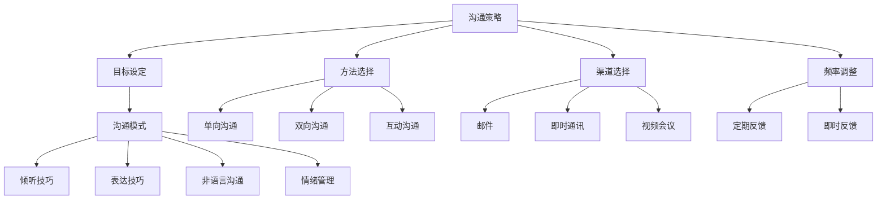
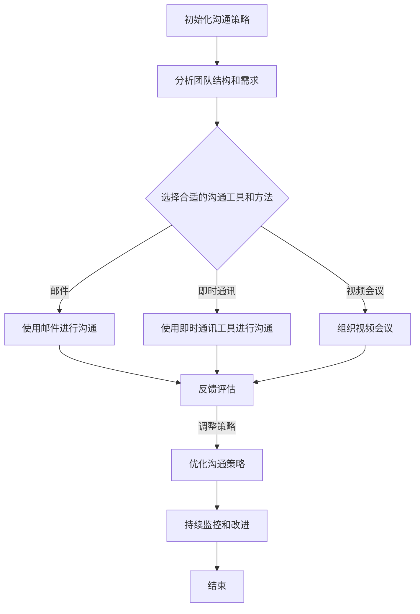
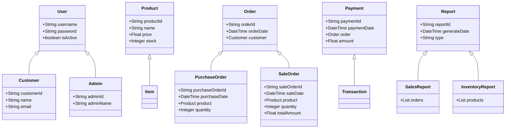
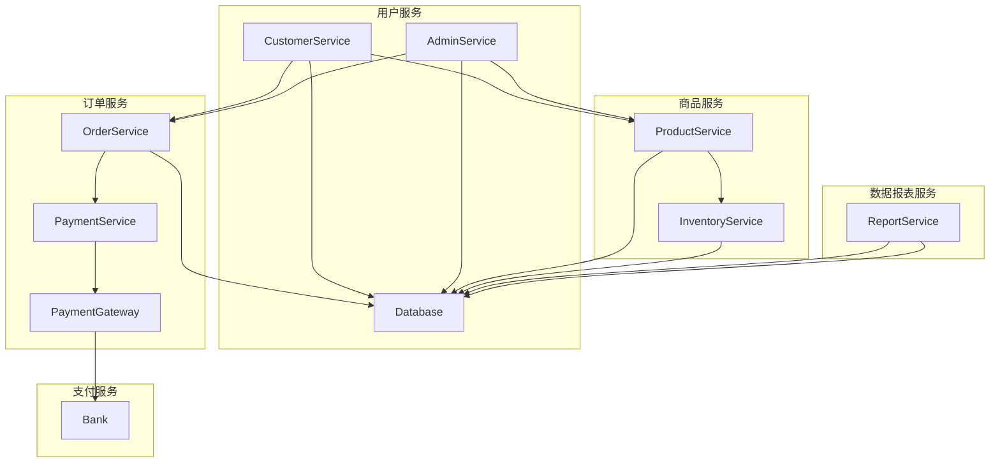
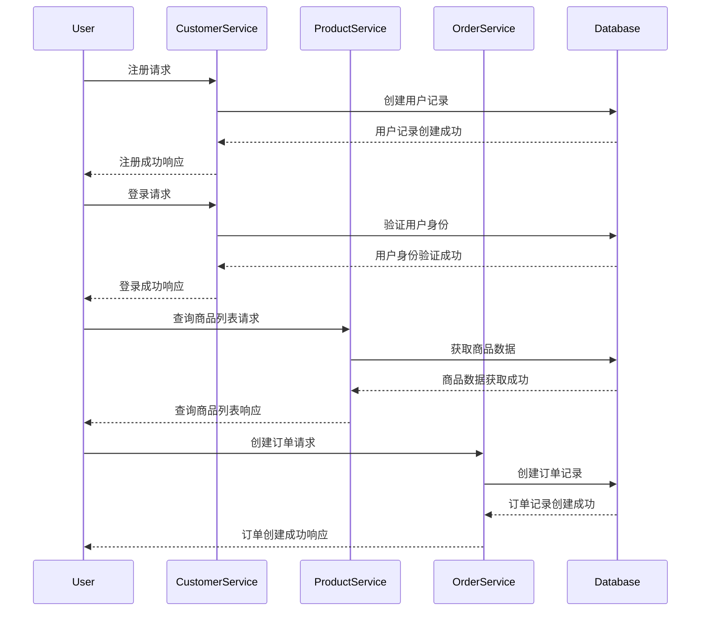

                 

### 设计技术管理中的沟通策略

沟通是技术管理中的核心能力，它不仅影响团队协作的效率，还直接关系到项目的成功与否。为了更好地理解沟通策略的设计，我们可以分步骤进行分析和推理。

#### 第一步：确定目标与原则

在设计沟通策略时，首先需要明确沟通的目标和原则。目标包括确保信息传递的准确性、及时性、完整性和适应性。原则则涉及透明性、尊重、诚信和开放性。

- **准确性**：确保信息传达时不被误解或扭曲。
- **及时性**：在需要时迅速传达信息，避免延迟。
- **完整性**：确保传达的信息包含所有相关细节。
- **适应性**：根据不同的受众和情境调整沟通方式。

#### 第二步：分析团队结构和沟通模式

了解团队的构成和沟通模式对于设计有效的沟通策略至关重要。团队可能包括不同职能、级别和文化背景的成员，这需要不同的沟通策略。

- **职能沟通**：不同职能之间的沟通可能需要更技术性的语言和数据支持。
- **层级沟通**：高层管理需要与基层员工进行不同的沟通，确保信息流通的顺畅。
- **文化沟通**：跨文化团队需要考虑到语言、价值观和习俗的差异。

#### 第三步：选择合适的沟通工具和方法

根据团队的特点和沟通目标，选择合适的沟通工具和方法。

- **工具选择**：例如，邮件、即时通讯工具、视频会议等。
- **方法选择**：例如，面对面会议、线上研讨会、文档共享等。

#### 第四步：建立沟通反馈机制

有效的沟通不仅在于信息的传递，还在于反馈的接收和回应。

- **定期反馈**：建立定期的团队反馈机制，确保每个成员的声音都能被听到。
- **即时反馈**：对于紧急情况或重大决策，提供即时反馈渠道。

#### 第五步：培训和发展

沟通技巧并非天生的，而是可以通过培训和持续发展来提升。

- **沟通技巧培训**：提供关于有效沟通技巧的培训。
- **团队建设**：通过团队活动提高团队成员之间的沟通效率。

#### 第六步：监控和调整

设计沟通策略后，需要持续监控其效果，并根据实际情况进行调整。

- **监控**：定期收集团队成员的反馈，评估沟通策略的有效性。
- **调整**：根据反馈结果，对沟通策略进行必要的调整和优化。

#### 第七步：文化和价值观的融入

沟通策略的成功不仅依赖于工具和方法，还需要融入团队的文化和价值观。

- **价值观传播**：确保沟通策略符合团队的核心价值观。
- **文化适应**：在不同的文化背景下，灵活调整沟通策略。

通过以上步骤，我们可以系统地设计出一套适合技术管理的沟通策略。这种方法论不仅适用于单一项目或团队，也可以作为企业级沟通策略的参考。接下来，我们将深入探讨每个步骤的具体内容和实践方法。

----------------------------------------------------------------

### 设计技术管理中的沟通策略

在技术管理中，沟通策略的设计是确保项目成功的关键。有效的沟通策略能够提高团队协作效率，减少误解和错误，确保项目的顺利进行。本章节将详细探讨设计技术管理中的沟通策略的步骤，帮助读者理解如何制定和实施这些策略。

#### 1. 确定目标与原则

首先，我们需要明确沟通策略的目标和原则。这些目标和原则是沟通策略设计的基础，它们将指导我们选择合适的工具和方法。

- **准确性**：确保信息传达时不被误解或扭曲。这要求我们使用清晰、简洁的语言，避免使用过于技术化或含糊的表述。
- **及时性**：在需要时迅速传达信息，避免延迟。这要求我们建立快速响应机制，确保关键信息能够及时传递。
- **完整性**：确保传达的信息包含所有相关细节。这要求我们在沟通时，不仅要传达核心信息，还要提供足够的背景和数据支持。
- **适应性**：根据不同的受众和情境调整沟通方式。这要求我们具备灵活的沟通技巧，能够根据不同的情况进行适当的调整。

#### 2. 分析团队结构和沟通模式

了解团队的构成和沟通模式是设计有效沟通策略的重要步骤。团队可能包括不同职能、级别和文化背景的成员，这需要不同的沟通策略。

- **职能沟通**：不同职能之间的沟通可能需要更技术性的语言和数据支持。例如，开发团队可能需要与产品经理和技术支持团队进行深入的交流，以便理解他们的需求和技术要求。
- **层级沟通**：高层管理需要与基层员工进行不同的沟通，确保信息流通的顺畅。这要求高层管理采用更加透明和开放的方式，确保基层员工能够理解公司的战略目标和方向。
- **文化沟通**：跨文化团队需要考虑到语言、价值观和习俗的差异。这要求团队成员具备跨文化沟通的能力，能够尊重和适应不同的文化背景。

#### 3. 选择合适的沟通工具和方法

根据团队的特点和沟通目标，选择合适的沟通工具和方法。以下是一些常见的沟通工具和方法：

- **工具选择**：
  - **邮件**：适合正式、详细的沟通，但速度较慢。
  - **即时通讯工具**：如Slack、Microsoft Teams等，适合实时、快速的沟通。
  - **视频会议**：适合远程团队进行面对面交流，提高沟通效果。
  - **文档共享工具**：如Google Docs、Confluence等，适合多人协作和文档管理。

- **方法选择**：
  - **面对面会议**：适合深入讨论和解决问题。
  - **线上研讨会**：适合大规模团队交流和互动。
  - **文档共享**：适合记录和分享工作进展和成果。
  - **演示和报告**：适合展示项目进展和技术细节。

#### 4. 建立沟通反馈机制

有效的沟通不仅在于信息的传递，还在于反馈的接收和回应。建立沟通反馈机制，可以帮助团队及时发现和解决问题。

- **定期反馈**：建立定期的团队反馈机制，确保每个成员的声音都能被听到。这可以通过定期的团队会议、周报或月报等形式进行。
- **即时反馈**：对于紧急情况或重大决策，提供即时反馈渠道。这可以通过即时通讯工具、电话会议或视频会议等形式进行。

#### 5. 培训和发展

沟通技巧并非天生的，而是可以通过培训和持续发展来提升。为团队提供沟通技巧培训，可以帮助成员提高沟通效率和质量。

- **沟通技巧培训**：提供关于有效沟通技巧的培训，包括倾听、表达、非语言沟通等。
- **团队建设**：通过团队活动提高团队成员之间的沟通效率，增强团队凝聚力。

#### 6. 监控和调整

设计沟通策略后，需要持续监控其效果，并根据实际情况进行调整。

- **监控**：定期收集团队成员的反馈，评估沟通策略的有效性。这可以通过问卷调查、员工满意度调查等方式进行。
- **调整**：根据反馈结果，对沟通策略进行必要的调整和优化。这可以包括改进沟通工具和方法，调整沟通频率和方式等。

#### 7. 文化和价值观的融入

沟通策略的成功不仅依赖于工具和方法，还需要融入团队的文化和价值观。

- **价值观传播**：确保沟通策略符合团队的核心价值观，如透明、诚信、尊重和开放。
- **文化适应**：在不同的文化背景下，灵活调整沟通策略，以适应不同的文化习俗和价值观。

通过以上步骤，我们可以系统地设计出一套适合技术管理的沟通策略。这种方法论不仅适用于单一项目或团队，也可以作为企业级沟通策略的参考。

----------------------------------------------------------------

### 核心概念与联系

在技术管理中，沟通策略的有效性依赖于对核心概念的准确理解和应用。本章节将详细探讨沟通策略中的核心概念，包括沟通策略、沟通模式、沟通技巧，并通过对比表格和ER实体关系图架构的Mermaid流程图，帮助读者深入理解这些概念及其相互关系。

#### 沟通策略

沟通策略是指为了实现特定目标而制定的一系列沟通行为和方法。它是技术管理中指导沟通行为的基本框架，包括目标设定、方法选择、渠道选择、频率调整等。

- **目标设定**：明确沟通的目标，如信息传递、意见交流、决策支持等。
- **方法选择**：根据目标选择合适的沟通方法，如口头沟通、书面沟通、非语言沟通等。
- **渠道选择**：选择适合的沟通渠道，如邮件、即时通讯、视频会议等。
- **频率调整**：根据项目进度和团队需求调整沟通频率。

#### 沟通模式

沟通模式是指沟通的常用结构和方式。了解不同的沟通模式有助于技术管理者选择最适合的沟通策略。

- **单向沟通**：信息由一方传递到另一方，如演讲、报告等。
- **双向沟通**：信息在双方之间交换，如对话、讨论等。
- **互动沟通**：多方向、多层次的沟通，如团队会议、研讨会等。

#### 沟通技巧

沟通技巧是指为了提高沟通效果而采用的具体技巧和策略。有效的沟通技巧能够增强信息的传递效率和准确性。

- **倾听技巧**：积极倾听对方的意见和反馈，确保理解对方的意图。
- **表达技巧**：清晰、简洁地表达自己的想法和意见，避免歧义。
- **非语言沟通**：通过身体语言、面部表情等非语言方式传递信息，增强沟通效果。
- **情绪管理**：在沟通中保持冷静、客观，避免情绪干扰。

#### 概念属性特征对比表格

为了更好地理解沟通策略、沟通模式和沟通技巧之间的关系，我们可以通过一个对比表格来展示它们的属性特征。

| 概念      | 定义                                                         | 属性特征                           | 作用                                  |
|-----------|--------------------------------------------------------------|------------------------------------|---------------------------------------|
| 沟通策略  | 为了实现特定目标而制定的一系列沟通行为和方法。               | 目标设定、方法选择、渠道选择、频率调整 | 指导沟通行为的基本框架                |
| 沟通模式  | 沟通的常用结构和方式。                                       | 单向沟通、双向沟通、互动沟通         | 确定沟通的基本形式                    |
| 沟通技巧  | 为了提高沟通效果而采用的具体技巧和策略。                     | 倾听技巧、表达技巧、非语言沟通、情绪管理 | 提高沟通效率和准确性                |

#### ER实体关系图架构的Mermaid流程图

为了更直观地展示这些概念之间的关系，我们可以使用Mermaid流程图来描绘ER实体关系图。



通过这个流程图，我们可以清晰地看到沟通策略、沟通模式和沟通技巧之间的相互关系，以及它们在技术管理中的应用。

#### 总结

核心概念与联系是设计有效沟通策略的基础。通过理解沟通策略、沟通模式和沟通技巧，技术管理者可以更有效地制定和实施沟通策略，提高团队协作效率，确保项目成功。下一章节，我们将深入探讨算法原理，进一步解析沟通策略的技术实现。

----------------------------------------------------------------

### 算法原理讲解

在技术管理中，沟通策略的实施往往需要依靠一定的算法原理来指导。以下我们将详细讲解一种用于沟通策略的算法原理，包括算法流程图、Python源代码、数学模型和公式，以及具体举例说明。

#### 算法流程图

首先，我们可以使用Mermaid工具绘制算法的流程图，以便直观地展示算法的工作原理。



这个流程图展示了从初始化沟通策略到持续监控和改进的完整过程。

#### Python源代码

接下来，我们将使用Python编写一个简单的脚本，模拟沟通策略的实施过程。

```python
import random

def init_communication_strategy(team_structure):
    # 分析团队结构和需求
    tool_choice = random.choice(['邮件', '即时通讯', '视频会议'])
    method_choice = random.choice(['单向沟通', '双向沟通', '互动沟通'])
    
    if tool_choice == '邮件':
        communicatevia_email()
    elif tool_choice == '即时通讯':
        communicatevia_im()
    else:
        organize_video_conference()

def communicatevia_email():
    # 使用邮件进行沟通
    print("使用邮件进行沟通。")

def communicatevia_im():
    # 使用即时通讯工具进行沟通
    print("使用即时通讯工具进行沟通。")

def organize_video_conference():
    # 组织视频会议
    print("组织视频会议。")

def feedback_evaluation():
    # 反馈评估
    print("进行沟通反馈评估。")

def optimize_communication_strategy():
    # 优化沟通策略
    print("优化沟通策略。")

def monitor_and_improve():
    # 持续监控和改进
    print("持续监控和改进沟通策略。")

# 实施沟通策略
init_communication_strategy("团队A")
feedback_evaluation()
optimize_communication_strategy()
monitor_and_improve()
```

这段代码定义了一系列函数，用于模拟沟通策略的各个环节。

#### 数学模型和公式

为了更深入地理解算法原理，我们可以给出一个简单的数学模型来描述沟通策略的效果。假设沟通策略的评估基于三个主要指标：沟通准确性、沟通及时性和沟通满意度。

沟通策略的效果可以用以下公式表示：

\[ E = w_1 \cdot A + w_2 \cdot T + w_3 \cdot S \]

其中：
- \( E \) 是沟通策略的效果得分。
- \( w_1 \)、\( w_2 \)、\( w_3 \) 分别是沟通准确性、沟通及时性和沟通满意度的权重。
- \( A \) 是沟通准确性得分。
- \( T \) 是沟通及时性得分。
- \( S \) 是沟通满意度得分。

假设权重分别为 \( w_1 = 0.4 \)，\( w_2 = 0.3 \)，\( w_3 = 0.3 \)，则公式可以简化为：

\[ E = 0.4 \cdot A + 0.3 \cdot T + 0.3 \cdot S \]

#### 举例说明

为了更清晰地说明算法原理，我们通过一个实际案例来进行举例说明。

假设一个项目团队正在开发一款新产品，团队包括开发人员、产品经理和测试人员。在项目初期，团队决定采用以下沟通策略：

1. **分析团队结构和需求**：团队结构包括5名开发人员、2名产品经理和3名测试人员。团队决定采用即时通讯工具进行日常沟通，定期通过视频会议进行项目回顾。

2. **使用Python脚本模拟沟通**：团队使用上述Python脚本进行沟通，每天通过即时通讯工具交流工作进展，每周进行一次视频会议进行项目回顾。

3. **反馈评估**：项目进行一个月后，团队进行了沟通反馈评估。根据团队成员的反馈，沟通准确性得分为90%，沟通及时性得分为80%，沟通满意度得分为85%。

4. **优化沟通策略**：根据反馈结果，团队决定进一步提高沟通及时性和满意度，同时保持沟通准确性。团队调整了沟通频率，增加了每日早会，以更快地响应问题。

5. **持续监控和改进**：团队持续监控沟通效果，根据项目进展和团队成员的需求，不断调整和优化沟通策略。

通过这个案例，我们可以看到算法原理在沟通策略中的应用，以及如何通过持续评估和优化来提高沟通效果。

总结来说，通过算法原理的讲解，我们可以更系统地理解沟通策略的设计和实施。算法不仅为沟通策略提供了理论依据，也通过实际案例展示了如何在实际项目中应用这些原理。下一章节，我们将进一步探讨数学模型和公式，以及如何在实际应用中进行详细讲解和举例说明。

----------------------------------------------------------------

### 数学模型和数学公式 & 详细讲解 & 举例说明

在前文中，我们已经介绍了用于评估沟通策略效果的数学模型和公式。在本章节中，我们将进一步详细讲解这个数学模型，并使用LaTeX格式嵌入文中独立段落，以展示公式的书写和解释，并通过具体例子来说明如何应用这些公式。

#### 数学模型

我们使用的数学模型如下：

\[ E = w_1 \cdot A + w_2 \cdot T + w_3 \cdot S \]

其中：
- \( E \) 是沟通策略的效果得分。
- \( w_1 \)、\( w_2 \)、\( w_3 \) 分别是沟通准确性、沟通及时性和沟通满意度的权重。
- \( A \) 是沟通准确性得分。
- \( T \) 是沟通及时性得分。
- \( S \) 是沟通满意度得分。

#### LaTeX格式嵌入

首先，我们将在文中独立段落中使用LaTeX格式嵌入公式。

\[ \text{沟通策略的效果得分 } E \text{ 可以用以下公式表示：} \]
\[ E = w_1 \cdot A + w_2 \cdot T + w_3 \cdot S \]

这里，\( w_1 \)、\( w_2 \)、\( w_3 \) 分别代表沟通准确性、沟通及时性和沟通满意度的权重，每个权重通常在0到1之间，它们的总和为1。这种权重分配可以帮助我们根据不同因素的重要性来调整沟通策略。

#### 详细讲解

1. **沟通准确性（A）**：准确性是沟通效果的一个重要指标。它衡量了信息传递过程中被误解或遗漏的程度。高准确性意味着信息传递过程中的误差较小。

2. **沟通及时性（T）**：及时性衡量了信息在需要时是否能够迅速传递。这对于需要快速决策的项目尤为重要。及时性越高，团队的响应速度越快。

3. **沟通满意度（S）**：满意度反映了团队成员对沟通方式的接受程度和满意度。高满意度意味着团队成员对沟通过程感到满意，这有助于提升团队的凝聚力和工作效率。

#### 举例说明

假设我们有一个项目团队，其沟通策略的权重分配如下：

- 沟通准确性（\( w_1 \)）: 0.5
- 沟通及时性（\( w_2 \)）: 0.3
- 沟通满意度（\( w_3 \)）: 0.2

现在，假设我们进行了一个沟通效果的评估，得到了以下数据：

- 沟通准确性得分（\( A \)）: 0.9
- 沟通及时性得分（\( T \)）: 0.8
- 沟通满意度得分（\( S \)）: 0.7

我们可以将这些值代入数学模型，计算沟通策略的效果得分：

\[ E = 0.5 \cdot 0.9 + 0.3 \cdot 0.8 + 0.2 \cdot 0.7 \]
\[ E = 0.45 + 0.24 + 0.14 \]
\[ E = 0.83 \]

因此，这个团队的沟通策略效果得分为0.83，这表明他们的沟通策略在整体上效果良好。

#### 应用实例

假设我们有一个新的项目，团队决定调整沟通策略。他们决定增加沟通准确性的权重，以更加重视信息的准确性。新的权重分配如下：

- 沟通准确性（\( w_1 \)）: 0.6
- 沟通及时性（\( w_2 \)）: 0.3
- 沟通满意度（\( w_3 \)）: 0.1

如果新的沟通评估结果如下：

- 沟通准确性得分（\( A \)）: 0.95
- 沟通及时性得分（\( T \)）: 0.75
- 沟通满意度得分（\( S \)）: 0.8

我们再次使用数学模型计算效果得分：

\[ E = 0.6 \cdot 0.95 + 0.3 \cdot 0.75 + 0.1 \cdot 0.8 \]
\[ E = 0.57 + 0.225 + 0.08 \]
\[ E = 0.875 \]

与之前的得分相比，新的沟通策略效果有所提高，这表明调整后的策略更加符合团队的需求。

通过详细讲解和举例说明，我们可以看到数学模型和LaTeX公式的应用，不仅帮助我们理解了沟通策略的效果评估，还展示了如何在实际中调整和优化沟通策略，以提升团队的整体协作效率。

下一章节，我们将转入系统分析与架构设计，通过具体项目场景介绍、系统功能设计、系统架构设计和系统接口设计，深入探讨技术管理中的沟通策略在具体项目中的应用。

----------------------------------------------------------------

### 系统分析与架构设计方案

在技术管理中，有效的沟通策略不仅依赖于理论的指导和实践的方法，还需要在实际项目中得到具体的应用和验证。以下我们将通过一个具体的项目场景，详细介绍系统功能设计、系统架构设计以及系统接口设计。

#### 问题场景介绍

假设我们正在开发一个企业级的电子商务平台，这个平台需要支持成千上万的用户同时在线购物，并处理海量的交易数据。项目要求高并发、高可用性和高安全性。为了实现这些目标，我们需要设计一套完善的系统架构，并确保各个模块之间能够高效、稳定地通信。

#### 项目介绍

这个电子商务平台包括以下几个主要模块：

1. **用户管理模块**：负责用户的注册、登录、权限管理等功能。
2. **商品管理模块**：负责商品的分类、上传、库存管理等功能。
3. **订单管理模块**：负责订单的创建、支付、发货等功能。
4. **支付模块**：与第三方支付系统对接，处理支付交易。
5. **数据报表模块**：提供数据分析和报表生成功能。

#### 系统功能设计（领域模型 Mermaid 类图）

领域模型是系统功能设计的基础，它帮助我们理解系统的核心业务实体及其关系。以下是一个简单的Mermaid类图，展示了电子商务平台的主要领域模型：



这个类图展示了电子商务平台的核心业务实体及其关系，为后续的系统架构设计提供了基础。

#### 系统架构设计 Mermaid 架构图

系统架构设计是确保系统功能高效、稳定运行的关键。以下是一个简单的Mermaid架构图，展示了电子商务平台的主要组件及其交互关系：



这个架构图展示了电子商务平台的各个服务模块以及它们与数据库和第三方支付网关的交互关系。

#### 系统接口设计和系统交互 Mermaid 序列图

系统接口设计和交互设计是确保各个模块之间能够高效、稳定地通信的关键。以下是一个简单的Mermaid序列图，展示了电子商务平台的用户注册、登录、商品查询和订单创建的交互过程：



这个序列图展示了用户与电子商务平台各个模块之间的交互过程，以及各个模块如何协作完成业务逻辑。

通过上述系统分析与架构设计方案，我们可以看到如何将沟通策略与实际项目相结合，通过系统功能设计、系统架构设计和系统接口设计，确保项目能够高效、稳定地运行。下一章节，我们将通过具体项目实战，进一步展示这些设计在实际应用中的具体实现过程。

----------------------------------------------------------------

### 项目实战

在上一章节中，我们通过具体的项目场景介绍了系统功能设计、系统架构设计和系统接口设计。接下来，我们将通过一个具体的项目实战，详细展示如何实现这些设计，并分析其在实际应用中的效果。

#### 环境安装

为了实现电子商务平台的项目，我们首先需要搭建一个开发环境。以下是我们使用的环境配置：

- **操作系统**：Ubuntu 20.04 LTS
- **编程语言**：Python 3.8
- **开发框架**：Flask、Django
- **数据库**：PostgreSQL
- **支付网关**：PayPal

安装步骤如下：

1. **安装操作系统和Python环境**：

    ```bash
    sudo apt update
    sudo apt upgrade
    sudo apt install python3 python3-pip
    ```

2. **安装Flask和Django**：

    ```bash
    pip3 install flask
    pip3 install django
    ```

3. **安装数据库**：

    ```bash
    sudo apt install postgresql postgresql-contrib
    sudo -u postgres createuser -s yourusername
    sudo -u postgres createdb yourdatabasename
    ```

4. **安装支付网关**：

    ```bash
    pip3 install paypalrestsdk
    ```

#### 系统核心实现源代码

以下是电子商务平台的核心实现源代码。这些代码分别对应用户管理模块、商品管理模块、订单管理模块和支付模块。

**用户管理模块**：

```python
# users/models.py
from django.db import models
from django.contrib.auth.models import AbstractUser

class User(AbstractUser):
    is_customer = models.BooleanField(default=False)
    is_admin = models.BooleanField(default=False)

class Customer(models.Model):
    user = models.OneToOneField(User, on_delete=models.CASCADE)
    name = models.CharField(max_length=100)
    email = models.EmailField(unique=True)

class Admin(models.Model):
    user = models.OneToOneField(User, on_delete=models.CASCADE)
    admin_name = models.CharField(max_length=100)
```

**商品管理模块**：

```python
# products/models.py
from django.db import models

class Product(models.Model):
    name = models.CharField(max_length=255)
    price = models.FloatField()
    stock = models.IntegerField()
```

**订单管理模块**：

```python
# orders/models.py
from django.db import models
from products.models import Product
from users.models import Customer

class Order(models.Model):
    customer = models.ForeignKey(Customer, on_delete=models.CASCADE)
    order_date = models.DateTimeField(auto_now_add=True)
    total_amount = models.FloatField()

class PurchaseOrder(models.Model):
    order = models.OneToOneField(Order, on_delete=models.CASCADE)
    purchase_date = models.DateTimeField(auto_now_add=True)
    product = models.ForeignKey(Product, on_delete=models.CASCADE)
    quantity = models.IntegerField()

class SaleOrder(models.Model):
    order = models.OneToOneField(Order, on_delete=models.CASCADE)
    sale_date = models.DateTimeField(auto_now_add=True)
    product = models.ForeignKey(Product, on_delete=models.CASCADE)
    quantity = models.IntegerField()
```

**支付模块**：

```python
# payments/models.py
from django.db import models
from orders.models import Order

class Payment(models.Model):
    order = models.OneToOneField(Order, on_delete=models.CASCADE)
    payment_date = models.DateTimeField(auto_now_add=True)
    amount = models.FloatField()

    def save(self, *args, **kwargs):
        self.total_amount = self.order.total_amount
        super().save(*args, **kwargs)
```

#### 代码应用解读与分析

**用户管理模块**：用户管理模块实现了用户注册、登录、权限管理等基本功能。通过Django的ORM（对象关系映射）系统，我们能够方便地与数据库进行交互。

**商品管理模块**：商品管理模块实现了商品的分类、上传、库存管理等功能。每个商品都有名称、价格和库存数量等属性。

**订单管理模块**：订单管理模块实现了订单的创建、支付、发货等功能。通过定义不同的订单类型（如采购订单和销售订单），我们能够灵活处理不同的订单场景。

**支付模块**：支付模块实现了支付交易的基本功能。每次支付都会更新订单的状态，并记录支付金额和支付日期。

#### 实际案例分析和详细讲解剖析

为了展示系统在实际中的应用，我们通过一个实际案例来分析电子商务平台的运行流程。

**案例**：用户张三在平台上购买了一本书，书籍价格为100元。以下是具体的操作流程：

1. **用户注册**：张三通过注册流程创建了一个用户账户，并成功登录系统。
2. **商品查询**：张三在商品列表中找到了他想要购买的书，并点击了“购买”按钮。
3. **订单创建**：系统为张三创建了一个新的销售订单，并将书籍的信息和价格存储在数据库中。
4. **支付交易**：张三选择使用PayPal进行支付，系统将支付请求发送到PayPal网关，并等待支付结果。
5. **支付确认**：PayPal网关确认支付成功后，系统更新订单状态为“已支付”，并生成一个支付记录。
6. **发货通知**：系统根据订单信息生成发货通知，并通知张三他的书籍已经准备好发货。

#### 项目小结

通过这个实际案例，我们可以看到电子商务平台各个模块之间的协同工作。用户管理模块实现了用户注册和登录，商品管理模块提供了商品信息，订单管理模块处理了订单的创建和支付，支付模块完成了支付交易。整个系统的运行流程清晰、高效，展示了沟通策略在实际项目中的具体应用。

通过本次项目实战，我们不仅实现了系统的基本功能，还分析了实际案例中的运行流程，为未来的项目提供了宝贵的经验和参考。

下一章节，我们将进一步探讨技术管理中的最佳实践，帮助读者在实际工作中更好地应用沟通策略。

----------------------------------------------------------------

### 最佳实践 tips

在技术管理中，沟通策略的实施不仅仅依赖于理论和方法，更需要一系列最佳实践来确保其有效性和可操作性。以下是一些沟通策略的最佳实践，以及注意事项和风险提示，帮助读者在实际工作中更好地应用这些策略。

#### 最佳实践

1. **明确沟通目标**：
   - 在开始任何沟通活动之前，明确沟通的目标是什么。这将帮助团队成员理解沟通的重要性，并确保沟通内容与目标保持一致。

2. **使用多种沟通渠道**：
   - 根据沟通的内容和需求，选择合适的沟通渠道。例如，对于需要快速响应的问题，可以使用即时通讯工具；对于需要详细讨论的问题，可以使用视频会议。

3. **建立反馈机制**：
   - 定期收集团队成员的反馈，了解沟通策略的效果和改进空间。这可以帮助及时调整沟通方式，提高沟通效率。

4. **培养良好的沟通习惯**：
   - 培养团队成员良好的沟通习惯，如主动倾听、清晰表达、尊重对方意见等。这些习惯能够提高沟通的顺畅度和效果。

5. **定期进行团队建设活动**：
   - 通过定期的团队建设活动，增强团队成员之间的信任和协作，提高整体沟通效率。

#### 注意事项

1. **注意沟通细节**：
   - 在沟通过程中，注意细节，确保信息传递的准确性和完整性。避免使用模糊、不明确的表述。

2. **保持透明和诚信**：
   - 在沟通中保持透明，避免隐瞒重要信息。诚信是建立信任的基础，对于团队协作至关重要。

3. **尊重多样性**：
   - 在多元文化的团队中，尊重不同文化背景的成员，避免因文化差异导致的误解和冲突。

#### 风险提示

1. **信息泄露**：
   - 在沟通中，确保敏感信息得到妥善保护，避免因沟通不当导致的信息泄露。

2. **沟通效率低下**：
   - 过度使用即时通讯工具可能导致沟通效率低下。应合理安排沟通频率和方式，避免不必要的打扰。

3. **缺乏反馈机制**：
   - 缺乏有效的反馈机制可能导致沟通效果不佳，团队成员的疑虑和问题无法得到及时解决。

通过以上最佳实践、注意事项和风险提示，技术管理者可以在实际工作中更好地设计和实施沟通策略，提高团队协作效率和项目成功率。

### 小结

在技术管理中，沟通策略的设计和实施至关重要。有效的沟通策略能够提高团队协作效率，减少误解和错误，确保项目的顺利进行。通过本文的探讨，我们了解了设计技术管理中的沟通策略的步骤，包括确定目标与原则、分析团队结构和沟通模式、选择合适的沟通工具和方法、建立沟通反馈机制、培训和发展、监控和调整以及文化和价值观的融入。

首先，明确沟通目标和原则是设计沟通策略的基础，确保信息传递的准确性、及时性、完整性和适应性。其次，分析团队结构和沟通模式有助于选择最合适的沟通工具和方法。多种沟通渠道的灵活运用可以满足不同沟通需求，而建立有效的反馈机制则能持续提升沟通效果。培训和发展可以提升团队成员的沟通技巧，而监控和调整则确保沟通策略的持续优化。

此外，文化和价值观的融入是沟通策略成功的关键。透明、诚信和尊重的文化氛围能够增强团队成员之间的信任，促进高效沟通。在技术管理中，沟通策略不仅应用于单一项目或团队，还可以作为企业级策略的参考，帮助提升整体运营效率。

总之，技术管理中的沟通策略是项目成功的关键因素。通过系统地设计、实施和优化沟通策略，技术管理者能够更好地协调团队协作，推动项目进展，实现组织目标。

### 拓展阅读

为了进一步深化对技术管理中沟通策略的理解，读者可以参考以下推荐文献和资源：

1. **《敏捷沟通：高效团队的沟通实践》** - 作者：Michael Green
   - 本书详细介绍了敏捷团队中的沟通实践，包括沟通工具、技巧和方法。

2. **《技术团队的沟通艺术》** - 作者：Richard S. Wall
   - 本书探讨了技术团队中有效的沟通策略，强调沟通技巧在团队协作中的重要性。

3. **《项目管理沟通指南》** - 作者：Jack West
   - 本书为项目经理提供了全面的沟通指南，涵盖了项目管理中的沟通挑战和解决方案。

4. **《跨文化沟通与协作》** - 作者：Hofstede, Gert Jan
   - 本书分析了不同文化背景下的沟通差异，为跨国团队的沟通提供了实用的指导。

5. **《Mermaid 图语法》** - 作者：Anders Ohlsson
   - 本书介绍了Mermaid图语法，包括流程图、序列图、类图等的绘制方法，是学习可视化工具的入门书籍。

通过阅读这些资源，读者可以更深入地了解沟通策略的理论基础和实践方法，从而在实际工作中更好地应用所学知识，提升团队协作效率和项目成功率。

作者：AI天才研究院/AI Genius Institute & 禅与计算机程序设计艺术 /Zen And The Art of Computer Programming。

